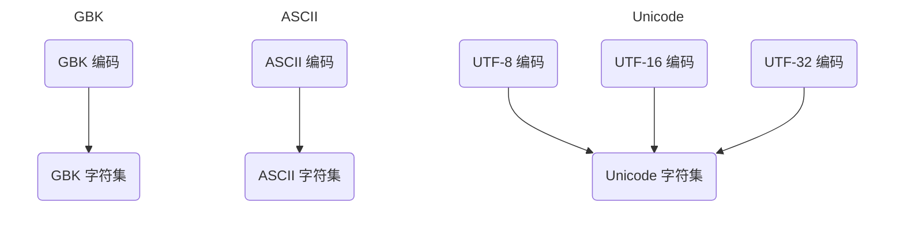
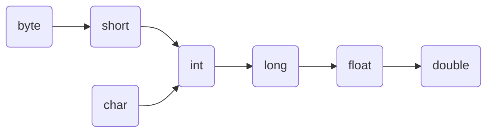
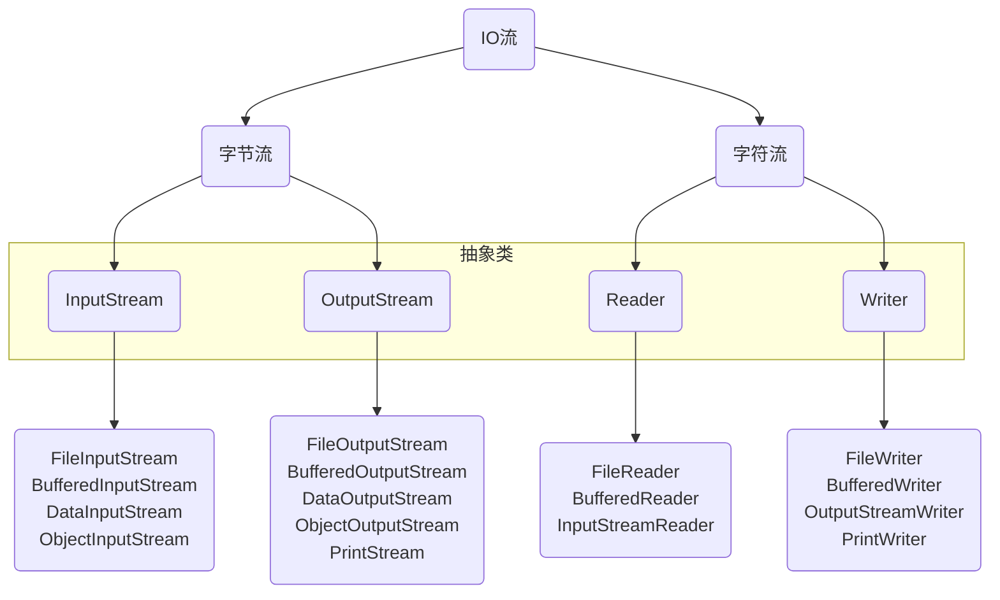
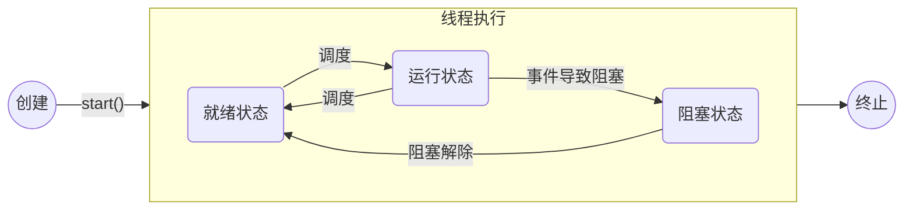
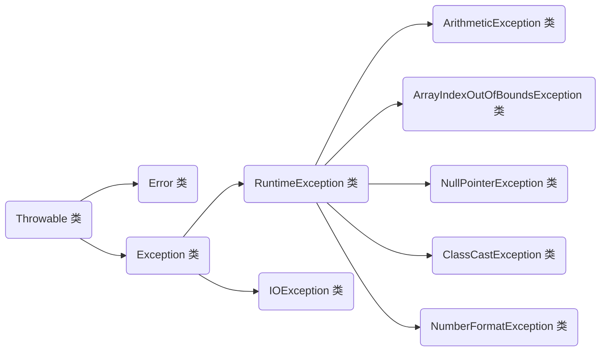
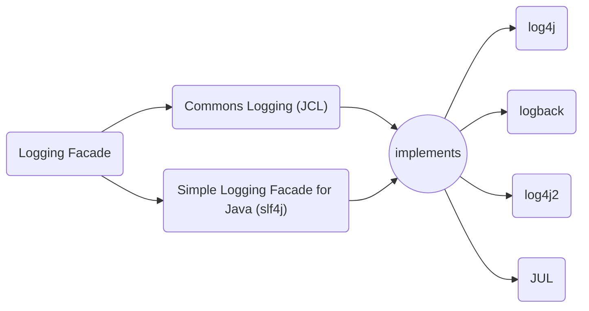
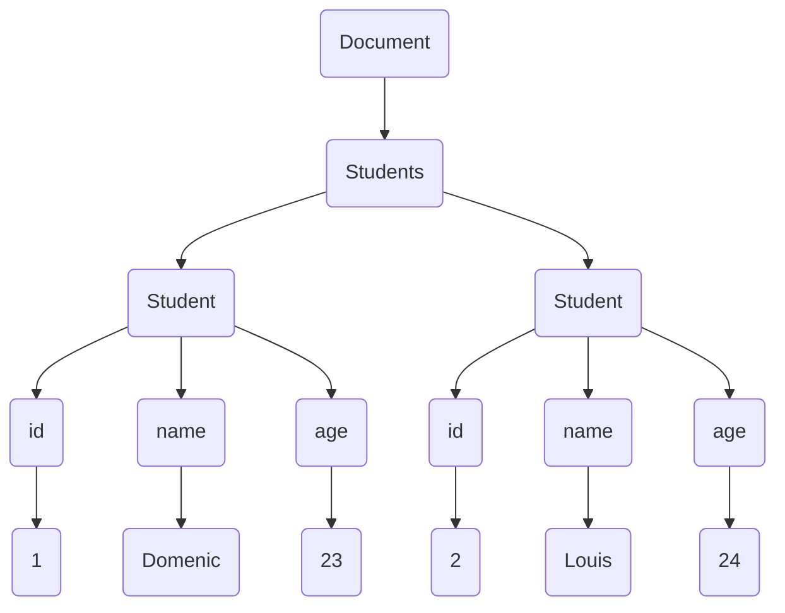
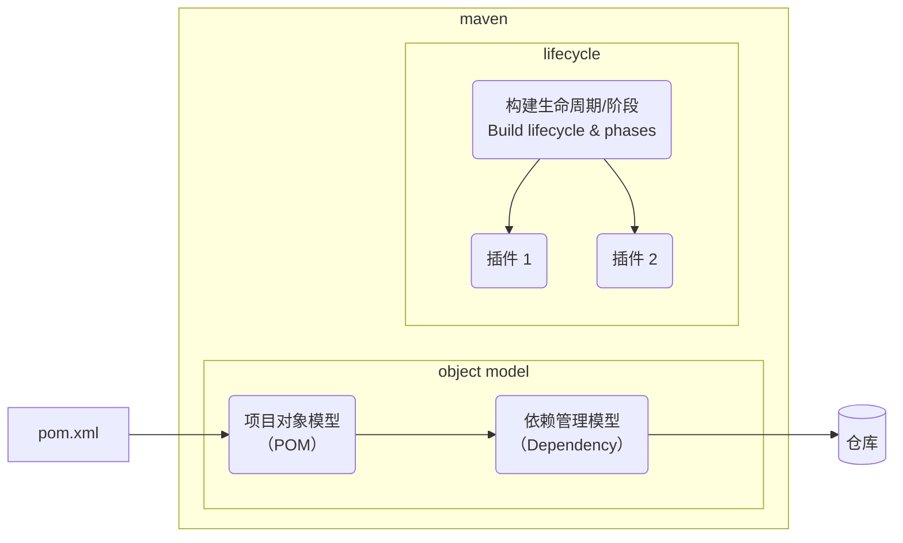
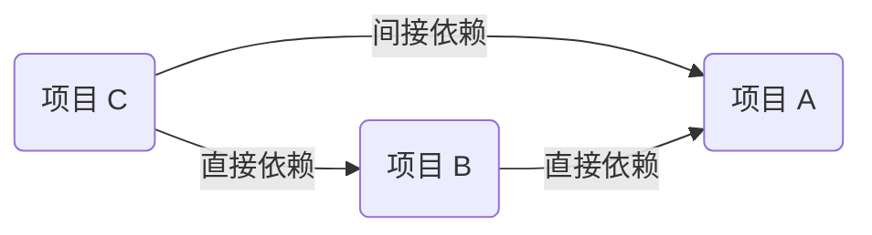
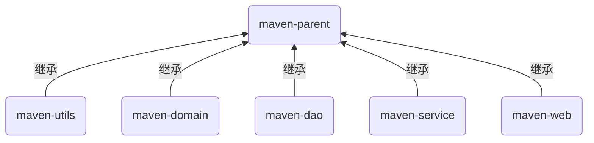

# Java 基础

## 预备知识

### 计算机的体系结构

<div style="clear:both"></div>

### Java 类型

#### 桌面应用

1. Java SE（Java Platform, Standard Edition）称之为 “Java 平台标准版”，是 Java 平台的基础
2. Java SE 包含了运行 Java 应用所需要的基础环境和核心类库
3. Java SE 还定义了基于桌面应用的基础类库

#### 企业应用

1. Java EE（Java Platform，Enterprise Edition）称之为 “Java 平台企业版”
2. Java EE 构建在 Java SE 基础之上，用于构建企业级应用。企业级应用是指那些为商业组织、大型企业创建的应用系统

### jdk、jre、jvm 的关系

<div style="clear:both"></div>

本笔记使用的 jdk 版本是：jdk11

### 程序编写流程

1. 新建代码源文件 xxx.java
2. 编写 Java 代码后进行保存
3. 启动命令行窗口，并切换到（cd）代码文件所在的路径中
4. 使用 javac xxx.java 进行编译，生成 xxx.class 的字节码文件
5. 使用 java xxx 进行解释执行，打印运行结果

- Java11 中可以使用 java xxx.java 直接进行编译并且运行，打印出运行结果（[<font color="#ff5050">慎用 - online</font>](https://www.infoq.cn/article/58f2ugX4d2FBF1gA9URI)）

  该特性仅限于保存在单个源文件中的代码，不能在同一个运行编译中添加其他源文件

  并且该方法不会生成 .class 字节码文件，**这是一个内存编译过程**

  因此，当代码源文件中的类名与文件名不同时，java 执行不会报错

> 1. javap -c xxx.class 或 javap -verbose xxx.class 可以查看类
>
> 2. 以下命令可以查看 jar 包内容
>
>    ```bash
>    jar tf xxx.jar    # 参数没有固定顺序，不过不能有空格
>    jar tfv xxx.jar
>    ```
>
>    - t：表示要查看 jar 文件的内容
>    - f：表示从一个文件查看
>    - v：显示文件的大小和上次修改日期信息

### 反码、补码

原码和反码都是为了计算补码，**计算机底层都是补码**

- **反码**（1's complement）

  正数反码，和原码一样  
  负数的反码，是在原码的基础上保持符号位不变，其他位取反

- **补码**（2's complement）

  正数和 0 的补码，是该数字本身再补上最高比特 0  
  负数的补码，是将其对应正数按位取反再加 1

<div style="clear:both"></div>

负十进制转换为二进制的方式

- 先将该十进制的绝对值转换为二进制，然后对得到的二进制进行按位取反，再加 1（负数的需要补码：按位取反，再加 1）
- 验证：可以用 负＋正 = 0 的法则来验证两个二进制相加是不是等于 0

负二进制转换为十进制的方式

- 先减 1 再按位取反，合并为十进制整数后添加负号

**例**：

1. 补码 1111 0100 转为十进制

   最高位为 1，是负数的补码 => 先减 1: 1111 0011 => 按位取反：0000 1100 => 转为十进制：12  => 添加负号：-12

2. 补码 0000 1001 转为十进制

   最高位为 0，是正数的补码 => 补码 == 原码：0000 1001 => 转为十进制：9

3. 反码 1100 1101 转为十进制

   最高位为 1，是负数的补码 => 按位取反（符号位不变）：1011 0010 => 转为十进制：-50

4. 反码 0101 0011 转为十进制

   最高位为 0，是正数的反码 => 反码 == 原码：0101 0011 => 转为十进制：83

### 字、字节、位

总线一般被设计来传输固定大小的一块数据，这块数据被称为字（word）

一个字包含的字节数（即字的大小）是各种计算机系统里面的基本参数，而且这个参数在不同的系统中通常是不同的  
大多数的现代计算机系统里：一个字是 4 个字节（32 位系统）或 8 个字节（64 位系统）

**结论**：

一个字等于多少个字节，与系统硬件（总线、CPU 命令字位数等）有关

- 1 字节（byte） = 8 位（bit）

- 在 16 位的系统中（如 8086 微机）：1 字（word）= 2 字节（byte）= 16（bit）

  在 32 位的系统中（如 win32）：1 字（word）= 4 字节（byte）= 32（bit）

  在 64 位的系统中（如 win64）：1 字（word）= 8 字节（byte）= 64（bit）

### 字符编码

**概述**：为了方便计算机识别各个国家的文字，就需要将这些文字采用数字编号的方式进行描述并建立对应的关系表，该表就叫做编码表

字符编码和字符集是两个不同层面的概念  
encoding 是 charset encoding 的简写，即字符集编码，简称**编码**  
charset 是 character set 的简写，即**字符集**

**编码依赖于字符集**，**一个字符集可以有多个编码实现**，就像代码中的接口实现依赖于接口一样



**常见的编码表**

- ASCII：美国标准信息交换码， 使用一个字节的低 7 位二位进制进行表示
- ISO8859-1：拉丁码表，欧洲码表，使用一个字节的 8 位二进制进行表示
- GB2312：中国的中文编码表，**最多**使用两个字节 16 位二进制为进行表示
- GBK：中国的中文编码表升级，融合了更多的中文文字符号，**最多**使用两个字节 16 位二进制位表示
- Unicode：国际标准码，融合了目前所有字符，为每个字符分配唯一的字符码。所有的文字都用两个字节 16 位二进制位来表示

**编码的发展**

- 面向传输的众多 UTF（UCS Transfer Format）标准出现了，UTF-8 就是每次 8 个位传输数据，而 UTF-16 就是每次 16 个位。这是为传输而设计的编码并使编码无国界，这样就可以显示全世界上所有文化的字符了
- Unicode 只是定义了一个庞大的、全球通用的字符集，并为每个字符规定了唯一确定的编号，具体存储成什么样的字节流，取决于字符编码方案。推荐的 Unicode 编码是 UTF-8 和 UTF-16
- UTF-8：变长的编码方式，可用 1-4 个字节来表示一个字符

### Intellij Idea

#### 设置

| 功能               | 位置                                                         |
| ------------------ | ------------------------------------------------------------ |
| 自动编译           | Build, Execution, Deployment > Compiler > Make Project Automatically |
| 自动导包           | Editor > General > Auto Import > Add unambiguous imports on the fly |
| 禁止 import\*       | File > Settings > Editor > CodeSyle > Java > Imports > class count... / name count... |
| 代码补全忽略大小写 | Editor > General > Code Completion > Match case |
| 自动重载项目       | Build, Execution, Deployment > Reload project after changes in the build script > Any Changes |
| XML 注释优化       | File > Settings > Editor > Code Style > XML > Code Gernation > 两个 comment 的勾去掉 |

#### 快捷键

快捷键提示插件：Key Promoter X

<table style="width:50rem">
    <thead>
        <tr style="text-align:left">
            <th width=40%>快捷键</th>
            <th width=60%>功能</th>
        </tr>
    </thead>
    <tbody>
        <tr>
            <td>Alt + Shift + ArrowKey</td>
            <td>移动选中代码块</td>
        </tr>
        <tr>
            <td>Alt + Enter</td>
            <td>生成接返回值的变量</td>
        </tr>
        <tr>
            <td>Ctrl + N</td>
            <td>调出全局搜索框</td>
        </tr>
        <tr>
            <td>Ctrl + F12</td>
            <td>搜索当前类里面的成员</td>
        </tr>
        <tr>
            <td>Ctrl + Alt + T</td>
            <td>把选中的代码用模板包起来</td>
        </tr>
        <tr>
            <td>Ctrl + R</td>
            <td>查找替换（自动查找选中的内容）</td>
        </tr>
        <tr>
            <td>Ctrl + H</td>
            <td>查看该类继承层次 hierarchy</td>
        </tr>
        <tr>
            <td>Ctrl + O</td>
            <td>重写方法 Override</td>
        </tr>
        <tr>
            <td>Ctrl + Alt + ←</td>
            <td>返回上一次查看代码的位置</td>
        </tr>
        <tr>
            <td>Ctrl + Alt + →</td>
            <td>返回下一次查看代码的位置</td>
        </tr>
    </tbody>
</table>

#### 插件

##### MyBatisX

实现 xml 快捷跳转

##### Maven Helper

右键项目可以快捷执行 Maven 命令

##### Lombok

Lombok 能减少重复代码的书写，如 getter/setter/toString

IDEA 2021.1.1 内置了 Lombok 插件，但使用时还需导入依赖

```xml
<dependency>
    <groupId>org.projectlombok</groupId>
    <artifactId>lombok</artifactId>
    <version>1.18.0</version>
    <scope>provided</scope>
</dependency>
```

- @Getter/@Setter：作用于类，生成所有成员变量的 getter/setter 方法
- @ToString：作用于类，覆盖默认的 toString() 方法，可以通过 of 属性限定显示某些字段，通过 exclude 属性排除某些字段
- @AllArgsConstructor：作用于类，全参构造器
- @NoArgsConstructor：作用于类，无参构造器
- @Data：作用于类，该注解会提供 getter、setter、equals、hashCode、toString 方法  
  还有一个构造函数，初始化所有 final 字段，以及所有没有初始化器且已用 @NonNull 标记的非 final 字段，以确保这些字段不为空

使用 Lombok 就可以不写 Getter、Setter、toString、equals 等方法了

##### jcLasslib

可以查看字节码

### 资源网站

[Java 技能树 - CSDN](https://edu.csdn.net/skill/java)

[Oracle Java Doc - oracle.com](https://docs.oracle.com/en/java/javase/11/docs/api/index.html)

[菜鸟教程 Java Doc - runoob.com](https://docs.oracle.com/en/java/javase/11/docs/api/)

---

## 内存

Java 内存划分为五个部分

### 栈内存

栈 - Stack

**存放的都是方法中的局部变量；方法的运行一定要在栈当中**

局部变量：方法中的参数，或者方法内部的变量

作用域：一旦超出作用域，立刻从栈内存中消失

1. 栈用于存放程序运行过程当中所有的局部变量

   一个运行的 Java 程序从开始到结束会有多次方法的调用

2. JVM 会为每一个**方法的调用**在栈中分配一个对应的空间，这个空间称为该方法的**栈帧**。一个栈帧对应一个正在调用中的方法，栈帧中存储了该方法的参数、局部变量等数据

3. 当某一个方法调用完成后，其对应的栈帧将被清除

### 堆内存

堆 - Heap

**凡是 new 出来的东西都在堆中**

1. 堆里面的东西都有一个的地址值：16 进制
2. 堆内存里面的数据**都有默认值**

### 方法区

方法区 - Method Area

1. 存储静态类型

2. 存储 .class 相关信息，保存方法的信息

   .class 是 Java 编译之后用来运行的字节码文件

### 本地方法栈

本地方法栈 - Native Method Stack

与操作系统相关

### 寄存器

寄存器 - PC Register

与 CPU 相关

### 内存操作例子

#### this 的内存原理

示例代码：

```java
// Student 类部分代码
public void setName(String name) {
    this.name = name;
}
---------------------------------------------
// main 函数部分代码
Student s1 = new Student();
s1.setName("林青霞");             // name 属性值设置为 l
```

下面解释给 s1 的 name 属性值设置为 “林青霞” 的过程

首先是 main 方法进栈，之后创建了对象 s1（对象实体在堆内存中，假设地址为 001，对象名 s1 在栈中）

<div style="clear:both"></div>

之后 s1 调用了 setName() 方法，setName() 方法进栈（方法的参数是传递过去的 “林青霞”，调用者是 s1）

this 就是 s1 指向的在堆中内存地址为 001 的对象实例

<div style="clear:both"></div>

之后就是给 name 属性赋值为 “林青霞”

this.name 的 this 通过它指向的 001，找到了堆中的对象实例，之后也就找到了 name

<div style="clear:both"></div>

方法中的参数 name 把 “林青霞” 赋值给了 this.name

<div style="clear:both"></div>

最后，setName() 方法调用完毕，从栈内存中弹出

<div style="clear:both"></div>

---

## 变量

### 注意事项

1. Java 是强类型语言，变量在使用前**必须指明数据类型**
2. 变量在使用之前**必须初始化**
3. 变量**不能重复声明**

### 命名

1. 由数字、字母、下划线以及 \$ 等组成，其中**数字不能开头**
2. 不能使用 Java 语言的关键字，关键字就是 Java 语言用于表示特殊含义的单词
3. **区分大小写**，长度没有限制但不宜过长
4. 尽量做到见名知意，支持中文但不推荐使用
5. 标识符可以给 类 / 变量 / 属性 / 方法 / 包 起名字

### 基本数据类型

在 Java 语言中数据类型主要分为两大类：

1. 基本数据类型（记住）
   byte、short、int、long、float、double、boolean、char
2. 引用数据类型（了解）
   数组、类、接口、枚举、标注

#### 占用字节数

<table style="width:50rem">
    <thead>
        <tr style="text-align:center">
            <th colspan="4">整数</th>
            <th colspan="2">小数</th>
            <th>布尔值</th>
            <th>字符</th>
        </tr>
    </thead>
    <tbody>
        <tr align="center">
            <td>byte</td>
            <td>short</td>
            <td>int</td>
            <td>long</td>
            <td>float</td>
            <td>double</td>
            <td>boolean</td>
            <td>char</td>
        </tr>
        <tr align="center">
            <td>1</td>
            <td>2</td>
            <td>4</td>
            <td>8</td>
            <td>4</td>
            <td>8</td>
            <td>4</td>
            <td>2</td>
        </tr>
    </tbody>
</table>


> 在 C++ 中
>
> - char 是基础数据类型，8 位，1 字节
> - byte 不是基础数据类型，一般是 typedef unsigned char byte，所以 byte 一般是 unsigned char 类型，8 位，1 字节
> - 不同的是，char 的范围是 -128 ~ 127，byte 的范围是 0 ~ 255
>
> 在 Java 中
>
> - char 和 byte 都是基础数据类型
> - byte 和 C++ 中的 char 类型一致，8 位，1 字节，-128 ~ 127
> - char 类型，16 位，2 字节，'\u0000' ~ '\uFFFF'
> - 因为 Java 内部都是用 unicode，所以 Java 才支持中文变量名，如：string 名字 = "Domenic"

#### 整数类型

byte：最小值是 -128（-2\^7）；最大值是 127（2\^7-1）；

short：最小值是 -32768（-2\^15）；最大值是 32767（2\^15 - 1）；

int：最小值是 -2,147,483,648（-2\^31）；最大值是 2,147,483,647（2\^31 - 1）；

long：最小值是 -9,223,372,036,854,775,808（-2\^63）；最大值是 9,223,372,036,854,775,807（2\^63 -1）；

char：最小值是 ’\\u0000’（即为 0）；最大值是 ’\\uffff’（即为 65,535）；

**在 Java 中若要描述比 long 类型还大的数据，需要使用 [java.math.BigInteger](#BigInteger 类) 类型，这些大数会以字符串的形式传入**

#### 浮点类型

1. float 类型在内存空间占 4 个字节，单精度浮点数，可表示 7 位有效数字

   范围：-3.403E38 ~ 3.403E38

2. double 类型在内存空间占 8 个字节，双精度浮点数，可表示 15 位有效数字

   范围：-1.798E308 ~ 1.798E308

3. Java 中直接写出的小数叫做字面值，默认为 double 类型，若希望为 float 类型，则需要在后面加上 f 或者 F

#### 布尔类型

Java 语言中用于描述真假信息类型有：boolean，数值只有：true 和 false

布尔类型所占内存大小无明确规定，可认为是 1 个字节

#### 字符类型

其中 char 类型在内存空间中占 2 个字节并且没有符号位，可以表示数字

范围：0 ~ 65535

```java
char c1 = 'a';    System.out.println((int)c1);  // 打印出来数字
char c2 = 97;  // 可以直接赋值数字字面值
```

常见的 ASCII：'0' - 48；'A' - 65；'a' - 97；空格 - 32；换行符 - 10

Java 字符类型采用 **Unicode** 字符集编码。Unicode 是世界通用的定长字符集，所有的字符都是 16 位

### 基本数据类型间的转换

Java 语言中基本数据类型之间的转换方式：自动类型转换 和 强制类型转换



**自动**类型转换主要是从 <u>小类型到大类型</u> 间的转换：byte/char/short -> int ->  long -> float -> double

**强制**类型转换主要指从 <u>大类型到小类型</u> 间的转换，语法如下：目标类型 变量名 = (目标类型)源类型变量名;

```java
short s1 = 128;     // short 16 位
byte b1 = (byte)s1; // byte   8 位  类型强转后变成了 -128
// 原因：128: 0000 0000 1000 0000 => 1000 0000 (截取 8 位)
// 转换为十进制 => 0111 1111 => 1000 0000 => 128 => -128
```

### 引用数据类型

[引用数据类型](#引用)

---

## 运算符

### 自增

```java
int ia = 10
int ib = ia++        // 该语句结束后 ib = 10，ia = 11
int ic = ia++ + ++ia // 该语句结束后，ic = 11 + 13 = 25
```

### 赋值

```java
考点：
byte b1 = 10;
b1 = b1 + 2;         // 错误: 不兼容的类型: 从 int 转换到 byte 可能会有损失  byte + int  相加结果还是 int 类型
                     // 所以 b1 + 2 的结果是 int 类型，不能直接赋值给 b1，要写为 b1 = (byte)(b1 + 2);
b1 = b1 + (byte)2;   // 错误: 不兼容的类型: 从 int 转换到 byte 可能会有损失  byte + byte 相加结果还是 int 类型
                     // 编译器优化，因为 byte 类型范围小，防止结果溢出
                     // 所以 b1 + (byte)2 的结果是 int 类型，不能直接赋值给 b1，要写为 b1 = (byte)(b1 + (byte)2);
b1 = (byte)(b1 + 2); // 正确：强制类型转换，将 int 类型转换为 byte
```

```java
b1 += 2;             // 等价于 b1 = (byte)(b1 + 2);  += 不仅简化了写法，还自带了强转
```

### 逻辑

所有以关系运算符作为最终运算的表达式结果一定是 boolean 类型

```java
int ia = 2
ia == 2;  // 表示判断变量 ia 的数值是否等于 2
2 == ia;  // 表示判断 2 是否等于变量 ia 的数值，从结果上来说等价，推荐该方式（可以规避 == 写成 = 的错误）
```

[自动拆装箱](#装箱和拆箱)

```java
// 基本包装类都有自动拆装箱
int i1 = 1;
Integer i2 = new Integer(1);
i1 == i2;     // 结果为 true，i2 会自动拆箱
------------------------------------------------------------------------------------------------------------------
String str1 = "abc";
String str2 = "abc";
String str3 = new String("abc");
str1 == str2; // 结果为 true
str1 == str3; // 结果为 false，String 没有自动拆箱
```

空指针异常

```java
int i1 = 1;
Integer i2 = null;
i1 == i2;     // 空指针异常，int 和 Integer 比较，i2 会自动拆箱
              // 拆箱过程中要给 i2 赋值 int 的默认值 0，但 i2 为空对象，因此报错
```

不同类型比较

```java
Integer i = 1;
Long l = 1;
i == l;       // 结果为 true
i.equals(l);  // 结果为 false
Objects.equals(i, l); // 结果为 false
// 因为基本包装类中重写的 equals 会先判断是否比较对象为同一类型，不是就直接返回 false
// equals 和 Objects.equals 都会调用对象自己重写的 equals（如果有），因此为 false
```

### 移位

1. \<\< 左移运算符，用于将数据的二进制位向左移动，右边使用 0 补充

   左移 1 位相当于当前整数的数值乘以 2

2. \>\> 右移运算符，用于将数据的二进制位向右移动，左边使用符号位补充

   右移 1 位相当于当前整数的数值整除 2

3. \>\>\> 逻辑右移运算符（无符号右移），用于将数据的二进制位向右移动，左边使用 0 补充

### 位运算符

1. \& 表示按位 **与** 运算符，按照二进制位进行与运算，同 1 为 1，同 0 为 0，不同为 0
2. \| 表示按位 **或** 运算符，按照二进制位进行或运算，同 1 为 1，同 0 为 0，有 1 则为 1
3. \~ 表示按位 **取反** 运算符，按照二进制位进行取反，1 变为 0，0 变为 1
4. \^ 表示按位 **异或** 运算符，按照二进制位进行异或运算，相同为 0，不同为 1

### 优先级

**优先级**：数值越小，代表优先级越高

**结合方向**：表达式中各种运算符的优先级  
大多数运算符结合方向是 “自左至右”，即：先左后右，也叫 “左结合性”  
例：a－b + c，表达式中有 - 和 + 两种运算符，且优先级相同，按先左后右结合方向  
先围绕减号结合，执行 a－b 的运算，再围绕加号结合，相当于：(a－b) + c

<table style="width:50rem">
    <thead>
        <tr style="text-align:left">
            <th width="12%">优先级</th>
            <th>运算符</th>
            <th width="20%">结合性</th>
        </tr>
    </thead>
    <tbody>
        <tr>
            <td>1</td>
            <td>()、[]、{}</td>
            <td>从左向右</td>
        </tr>
        <tr>
            <td>2</td>
            <td>!、+、-、~、++、--</td>
            <td><u>从右向左</u></td>
        </tr>
        <tr>
            <td>3</td>
            <td>*、/、%</td>
            <td>从左向右</td>
        </tr>
        <tr>
            <td>4</td>
            <td>+、-</td>
            <td>从左向右</td>
        </tr>
        <tr>
            <td>5</td>
            <td>&lt;&lt;、&gt;&gt;、&gt;&gt;&gt;</td>
            <td>从左向右</td>
        </tr>
        <tr>
            <td>6</td>
            <td>&lt;、&lt;=、&gt;、&gt;=、instanceof</td>
            <td>从左向右</td>
        </tr>
        <tr>
            <td>7</td>
            <td>==、!=</td>
            <td>从左向右</td>
        </tr>
        <tr>
            <td>8</td>
            <td>&amp;</td>
            <td>从左向右</td>
        </tr>
        <tr>
            <td>9</td>
            <td>^</td>
            <td>从左向右</td>
        </tr>
        <tr>
            <td>10</td>
            <td>|</td>
            <td>从左向右</td>
        </tr>
        <tr>
            <td>11</td>
            <td>&amp;&amp;</td>
            <td>从左向右</td>
        </tr>
        <tr>
            <td>12</td>
            <td>||</td>
            <td>从左向右</td>
        </tr>
        <tr>
            <td>13</td>
            <td>?:</td>
            <td><u>从右向左</u></td>
        </tr>
        <tr>
            <td>14</td>
            <td>=、+=、-=、*=、/=、&amp;=、|=、^=、~=、«=、»=、&gt;&gt;&gt;=</td>
            <td><u>从右向左</u></td>
        </tr>
    </tbody>
</table>


### 使用技巧

以下几种方式，可以让程序的运行速度更快

1. **奇偶判断**

   用 \& 运算符代替 %

   ```java
   if (num & 1) {
       // 奇数
   } else {
       // 偶数
   }
   ```

2. **数值交换**

   用 \^= 异或 XOR 运算符来实现数值交换  
   XOR 的规则：相同则为 0，不同则为 1，例：1\^0 = 1 , 1\^1 = 0 , 0\^1 = 1 , 0\^0 = 0

   ```java
   int x = 3;  // x = 0011
   int y = 5;  // y = 0101
   x ^= y;     // x = 0110，记录了 x 与 y 所有不同的位
   y ^= x;     // y = 0011，y 更改了不同的位后，y 就变成了 x
   x ^= y;     // x = 0101，x 更改了不同的位后，x 就变成了 y
   ```

3. **乘除以 2**

   用 \<\< 代替乘，用 \>\> 代替除

   ```java
   n = n << 1;  // 二进制左移 1 位
   n = n >> 1;  // 二进制右移 1 位
   ```

4. **计算数字的位数**

   用 log 代替 for 循环

   ```java
   digitCount = floor(log10(N)) + 1;
   ```

---

## 流程控制

### 标签

**OUTER1** 和 **OUTER2** 是标签，可以和 **break** 和 **continue** 配合使用

```java
OUTER2:
for (int i = 0; i < 3; ++i) {
    OUTER1:
    for (int j = 0; j < 5; ++j) {
        if (j == 3) {
            break OUTER1;
            //continue OUTER1;
        }
        System.out.print(i + j + " ");
    }
    System.out.println();
}
System.out.println("This is end");
---------------------------------------------------
OUTER1：
break 的输出：
00 01 02 
10 11 12 
20 21 22 
This is end
 
continue 的输出：
00 01 02 04 
10 11 12 14 
20 21 22 24 
This is end
---------------------------------------------------
OUTER2：
break 的输出：
00 01 02 This is end
 
continue 的输出：
00 01 02 10 11 12 20 21 22 This is end
```

### for

[增强 for 循环](#for each 循环（重点）)

```java
int [] numbers = {10, 20, 30, 40, 50};
for(int x : numbers) {  // 注意这里是 int x 直接定义的新变量，x 是一个局部变量，改变 x 不会影响原数组中的值
   System.out.print(x + ',');
}
```

```java
/* 二维数组的增强 for 循环 */
array = {{1, 2, 3},{4, 5, 6}}
for(int[] row : array) {
    for(int each : row) {
        System.out.printf("%2d", e);
    }
}
```

### while

```java
int i = 1;
while(i < 1000);{  // 这是死循环，println 语句不会执行
    System.out.printf("%d", i);
}
------------------------------------------------------------
do {
	--i;
} while(i > 0);
```

### switch

switch 条件支持的类型：byte, short, int, char, enum, string

```java
switch(expression) {
	case 1: ...; break;
	case 2: ...; break;
	default: ...;
}
```

---

## 数组

### 特点

1. 数组是**引用数据类型**
1. 可以直接通过下标（或索引）的方式访问指定位置的元素，速度很快
2. 数组要求所有元素的类型相同
3. 数组要求内存空间连续，并且长度一旦确定就不能修改
4. 增加和删除元素时可能移动大量元素，效率低

### 普通数组

数组初始化后也就是说数组的长度是不可变的

```java
/* 一维数组初始化 */
int[] list = new int[10];            // 动态初始化
int[] list = new int[] {1, 2, 3};    // 静态初始化
int[] list = {1, 2, 3}               // 静态初始化
```

**注意**：

```java
Object[] params = null;
params = {1, 2, 3, 4};
```

上面的初始化写法是**错的**，原因：

1. 这是直接创建了一个空数组 params，数组的长度不可改变，一个空数组自然加不了任何东西
2. 数组的初始化，只有在定义的时候可连续添加元素，定义完之后，要添加数据，就只能对着数组下标一个一个添加

```java
/* 二维数组初始化 */
int[][] arr2dim = new int[num][];
int[][] array = {{10,20,30,40},{50, 60, 70, 80}};
---------------------------------------------------
int[][] array = new int[2][];
array[0] = new int[] {10,20,30,40};
array[1] = new int[] {50,60};
```

### 数组工具类

[java.util.Arrays](https://docs.oracle.com/en/java/javase/11/docs/api/java.base/java/util/Arrays.html)

```java
Arrays.toString(list);        // 把数组转化为字符串 [1, 2, 3]
int[] arr = new int[5];
```

```java
Arrays.fill(arr, 2);          // 用 10 填充整个数组 [2, 2, 2, 2, 2]
Arrays.fill(arr, 1, 3, 4);    // 用 4 填充索引为 [1,3) 的元素 [2, 4, 4, 2, 2]
```

```java
Arrays.equals(arr1, arr2);    // 比较数组 arr1 和 arr2 是否完全相等，是就返回 true，否则 false
```

```java
Arrays.sort(arr);             // 给数组元素排序（升序，从小到大）
```

```java
Arrays.binarySearch(arr, 59); // 查找对应元素，返回索引
// [2, 4, 4, 2, 2]  查找 2，返回 0；查找 10，返回-6
// 找到了返回第一个匹配的元素的索引值
// 没找到返回有效索引值范围外的值
```

```java
// Collection objects1 = Arrays.asList(objects);
List<Integer> lt1 = Arrays.asList(10, 30, 20, 50, 45); // 数组转换为集合
```

---

## 类和对象

### 面向对象

面向对象三大特征：

1. [封装](#封装)
2. [继承](#继承)
3. [多态](#多态)

### 基本定义

#### 类

1. 类 简单来就是 “分类”，是对具有相同特征和行为的多个对象共性的抽象描述  
   在 Java 语言中体现为一种**引用数据类型**，里面包含了描述 特征/属性 的**成员变量**以及描述行为的**成员方法**
2. 类 是用于**构建对象的模板**，对象的数据结构由定义它的类来决定
3. 类名由多个单词组成时，要求每个单词首字母都要大写

#### 对象

1. 对象 主要指现实生活中客观存在的实体，在 Java 语言中对象体现为**内存空间中的一块存储区域**
2. 当一个类定义完毕后，可以使用 **new** 关键字来创建该类的对象，这个过程叫做类的**实例化**
3. 创建对象的本质就是在内存空间的**堆区**申请一块存储区域， 用于存放该对象独有特征信息

#### 引用变量

1. 使用引用数据类型定义的变量叫做引用型变量，简称为 “引用”
2. 引用变量主要用于记录对象在堆区中的内存地址信息，便于下次访问
3. Person p = new Person();  p.name = "Domenic"
3. System.out.println 打印引用变量的时候，**Java 会自动调用 toString() 方法**，可以直接打印

#### 成员变量

1. 成员变量由多个单词组成时，要求从第二个单词起每个单词的首字母大写

2. 成员变量：如果没有赋值，则有默认值

   - int / short / long / byte 类型，默认为 0
   - double 类型，默认为 0.0
   - char 类型，默认为 '\u0000'
   - boolean 类型，默认为 false
   - 类类型，默认为 null

   局部变量：没有默认值；变量只在方法内有效

#### 成员方法

[跳转](#栈内存) 栈帧

成员方法名由多个单词组成时，要求从第二个单词起每个单词的首字母大写

#### 参数

##### 可变长参数

1. 语法：返回值类型 方法名(参数的类型... 参数名)
2. 调用可变参数方法，可给出**零到任意多个**参数  
   编译器会将可变数量的参数转化为一个数组，因此也可以直接传递一个数组
3. 一个方法的形参列表中最多只能声明一个可变长形参，并且需要**放到**参数列表的**末尾**

```java
// 成员方法，args 是可变长参数
void showArgument(String... args) {
	for (int i = 0; i < args.length; ++i) {
		System.out.println(args[i]);
	}
}
// 在 main 函数里调用
new Person().showArgument("h", "b");
```

---

### 访问控制

#### 修饰符

##### 权限修饰符

Java 中，可以使用访问控制符来保护对类、变量、方法和构造方法的访问，支持 4 种不同的访问权限

- 私有的，以 private 修饰符指定，在同一类内可见
- 共有的，以 public 修饰符指定，对所有类可见
- 受保护的，以 protected 修饰符指定，对同一包内的类和所有子类可见
- 默认的，也称为 default，不使用任何修饰符，在同一包内可见

| 修饰符    | 本类     | 同个包下的类 | 子类     | 其他类   |
| --------- | -------- | ------------ | -------- | -------- |
| public    | &#10004; | &#10004;     | &#10004; | &#10004; |
| protected | &#10004; | &#10004;     | &#10004; | &#10006; |
| default   | &#10004; | &#10004;     | &#10006; | &#10006; |
| private   | &#10004; | &#10006;     | &#10006; | &#10006; | 

##### final 修饰符

**修饰 类**：

**<u>final 类不能被继承</u>**

主要用于防止滥用继承

`public final class Test {}`

**修饰 方法**：

<u>类中的 final 方法可被子类继承，但不能被子类修改</u>

主要用于防止该方法的内容被修改

`public final void changeName() {}`

**修饰 变量**：

该变量 <u>必须初始化</u> 且 <u>不能改变</u>

主要用于防止不经意间造成改变

若 final 修饰的是<u>引用类型</u>，则<u>地址不能变，地址中的内容可以变</u>  
例：`public static final List<User> USERS = new ArrayList<>();`
USERS 指向的对象不能更改，但可以向 ArrayList 里面添加元素

初始化 final 变量有三种方式**：1. 显式初始化  2. 构造块初始化  3. 构造方法初始化**

```java
private final int cnt;       // final 变量

private final int cnt = 1;   // 显式初始化

{
    cnt = 2;                 // 构造块初始化
}

public FinalMemberTest() {
    cnt = 3;                 // 构造方法初始化
}
```

在开发中很少单独用 final 关键字修饰成员变量，<u>通常用 public static final 共同修饰成员变量来表示常量</u>

常量的命名规范是所有 字母都要大写，不同单词间采用下划线连接  如：MAX_PRIORITY

#### 包和导入

package：

1. 便于管理
2. 区分同名问题
3. 便于权限控制（用权限修饰符）

包的导入：

1. 用 import 关键字导入包
2. import 导入静态成员，如：import static java.lang.System.out

---

### 封装和方法

#### 封装

1. 私有化成员变量，用 private 关键字修饰
2. 提供公有的 get 和 set 方法，并在方法体中进行合理值判断
3. 在构造方法中调用 set 方法进行初始化的合理值判断

#### 构造函数

1. 当一个类中没有定义任何构造方法时，编译器会自动添加一个无参空构造构造方法，叫做**默认/缺省构造**方法，如：Person() {}
2. 若类中**写了构造方法**，则编译器**不再提供**任何形式的构造方法

#### 方法重载

1. 方法重载的形式体现在：

   要求参数的个数不同、参数的类型不同、参数的顺序不同

   与返回值类型和形参变量名无关，但建议返回值类型最好相同

2. 方法重载的实际意义在：

   调用者只需要记住一个方法名就可以调用各种不同的版本，来实现各种不同的功能

#### this

1. this 关键字**本质**上就是**当前类类型的引用**变量
2. 使用方法：
   1. 当局部变量名与成员变量名相同时，在方法体中会优先使用局部变量（就近原则）  
      若希望使用成员变量，则需要在成员变量的前面加上 this.
   2. this 关键字还可以作为方法的返回值
   3. 在构造方法的第一行可以使用 this() 的方式来调用本类中的其它构造方法
3. 例子：
   1. 在构造方法中打印 this，显示 com.learnSingle.ThisTest@4554617c (当前类)
   2. 在成员函数中打印 this，显示 com.learnSingle.ThisTest@4554617c (当前类)
   3. 在 main 函数中打印类的实例化对象，显示 com.learnSingle.ThisTest@4554617c (对象指向的类)

[跳转](#this 的内存原理) this 的内存原理

---

### 继承和 static

#### 继承

**定义**：使用已存在的类的定义作为基础建立新类，新类的定义可增加新的数据或功能，也可用父类的功能，但不能选择性地继承父类

1. 继承是多态的前提

3. 子类可以拥有父类中 (可继承) 的内容

   **不能继承**父类的**构造方法**和**私有方法**，但私有成员变量可以被继承只是不能直接访问

4. 子类可拥有自己专有的方法

4. 父类不会拥有子类的内容

5. **构造子类的对象时一定会先自动调用父类的无参构造方法**，来初始化从父类中继承的成员变量

   相当于在构造方法的第一行增加 super()

   默认只调用父类的无参构造，若要调用父类有参构造，则要在第一行加入 super(参数 1, 参数 2)

   下图：Worker 类是 Person 类的子类，创建 w2 对象的时候，会先调用 Person 的构造再调用 Worker 构造

   <div style="clear:both"></div>

6. Final 关键字修饰的类不能被继承

7. Java 语言中只支持单继承不支持多继承，子类只能有一个父类

   **原因**：若一个类继承了两个父类，且两个父类都有一个同名方法，那么该子类就不知道要继承哪个方法了

#### 方法重写

1. 方法前要加 @override [注解](#注解)，编译器可验证该方法是否在父类中有

2. 在重写后，若还需要父类方法中的功能，则在方法的第一行加 super.\<方法名\>();

3. **使用原则**

   1. 要求方法名、参数列表以及返回值类型相同，从 Java5 开始允许返回子类类型

      例：父类 Person 的方法：public Person show()；子类 Worker 的方法：public Worker show()

   2. 要求方法[访问权限](#权限修饰符)不能变小，可相同或变大（子类相当于对父类的扩展 extends，自然不能变小）

   3. 要求方法不能抛出更大、平级不一样的[异常](#异常机制（重点）)（异常机制）

4. 静态方法重写不是真正意义上的重写，不能使用 @override

   因为重写其实是一种[多态](#多态)，重写式多态是父类类型的引用指向子类类型的对象

   而静态的与指向的对象无关，所以静态的重写没有太大的意义

#### static 关键字

1. 静态的类型存储在[方法区](#方法区)中

1. static 关键字修饰成员变量表示静态，**隶属于类层级**，随着类加载而加载，被所有对象共享

3. static 关键字修饰的成员可用 <u>引用.</u> 的方式访问，但**推荐用 <u>类名.</u> 的方式访问**

   就是不要用 <u>this.</u> 或者 <u>对象名.</u> 的方式访问静态成员

   **原因**：静态变量可以用引用访问，但在执行过程中，**引用所指向的对象并没有参与**。如果是空引用访问实例变量，程序一定会发生空指针异常，但是如果用空引用访问静态变量，程序并没有发生空指针异常，所以通过引用访问静态变量实际上还是直接通过类访问的

3. 注意事项

   1. 在非静态成员方法中既能访问非静态的成员又能访问静态的成员

   2. 在**静态成员方法**中**只能访问静态成员**不能访问非静态成员

      所以静态成员方法中不能使用 this 关键字
   
      **原因**：静态成员方法在类产生的时候就存在了，非静态的要 new 出对象才会出现
   
   3. 在开发中 <u>只有隶属于类层级并被所有对象共享的内容</u> 才可以使用 static 关键字修饰（不可滥用）

> **注意**：避免通过一个类的对象引用，访问此类的静态变量或静态方法，无谓增加编译器解析成本，应该用类名直接访问
>
> ```java
> public class Test {
>        public static int a = 0;
>        public void setA() {
>            this.a = 1; // 不推荐，增加解析成本
>            Test.a = 1; // 推荐
>        }
> }
> ```
>
> 增加解析成本：先通过引用访问对象，再通过对象访问类元数据，最后再访问静态成员，绕了一圈


#### 构造块和静态代码块

当需要在执行[构造方法体](#构造函数)之前做一些准备工作时，可以使用代码块  
构造代码块的出现就是为了<u>提取构造函数的共同量</u>，减少各个构造函数的代码

1. 构造块就是在类体中直接使用 {} 括起来的代码块 { ... }

2. 每创建一个对象都会执行一次构造块

   之后调用该对象，不会执行构造块

3. 静态代码块：使用 static 关键字修饰的构造块 static { ... }

4. 静态代码块在类加载时执行一次（有且只有一次）

   因为是类层级，所以只能操作静态数据

执行顺序：静态代码块 -> 代码块 -> 构造方法

继承后的执行顺序：

**父类静态代码块 -> 子类静态代码块 -> 父类构造块 -> 父类构造方法 -> 子类构造块 -> 子类构造方法**

静态常量可以用静态代码块来初始化

> **注意**：初始化静态常量的代码不能被 try-catch 包裹，因为 try-catch 可能执行不成功，导致初始化

示例，初始化静态常量 PRE_URL：

```java
public static final String PRE_URL;

static {
    Properties prop = new Properties();
    // classloader 方式，默认使用的路径就是 class 文件的根目录，所以使用此方法时，不能在路径前加/
    InputStream is = Constants.class
            .getClassLoader()
            .getResourceAsStream("project.properties");

    // 使用 Properties 对象的 load 方法，从字节流中读取配置信息
    try {
        prop.load(is);
    } catch (IOException e) {
        System.out.println("\033[31m" + "\n 配置文件读取出错！！\n" + "\033[0m");
    }

    // 读取配置信息
    PRE_URL = prop.getProperty("preURL");
}
```

#### 单例模式

意图：保证一个类仅有一个实例，并提供一个访问它的全局访问点，<u>保证在调用处<b>只能得到</b>该类的一个对象</u>

主要解决：一个全局使用的类频繁地创建与销毁

何时使用：当您想控制实例数目，节省系统资源的时候

如何解决：判断系统是否已经有这个单例，如果有则返回，如果没有则创建

关键代码：构造函数是私有的

设计单例的流程和思想叫做 <u>单例设计模式</u>

步骤：

1. 私有化构造函数，防止在类外被创建对象

2. 在类内创建对象的引用 obj，用 static 提升到类层级

   若为对象层级的话，类外需要 <u>对象名.</u> 的方式访问（与不能在类外创建对象矛盾）

3. 把对象的引用 obj 设置为私有，防止该引用在类外被设置为 null

4. 提供类层级的函数来返回对象的引用 obj

```java
public class Singleton {
    // 创建 Singleton 的一个对象
    private static Singleton obj = new Singleton();  // 饿汉式，一运行就创建对象 推荐
    // private static Singleton instance = null;     // 懒汉式
    // 让构造函数为 private，这样该类就不会被实例化
    private Singleton() {}
    // 返回唯一可用的对象，在外部可用 getInstance()来获取实例
    public static Singleton getInstance() {
        /*if (null == instance) {                    // 懒汉式，需要时才创建
            instance = new Singleton();
        }*/
        return obj;
    }
}
```

创建对象实例推荐 <u>饿汉式</u>，因为涉及到多线程问题：

当两个线程几乎同时调用了 getInstance 方法时，一个线程先进入方法，判断 null == instance 为真，开始 new 对象（new 对象需要时间），在第一个线程还没有 new 完对象的时候，第二个线程也进入方法，判断 null == instance 也为真，也开始 new 对象。结果就是 getInstance 方法返回了两个不同对象的地址（new 出了两个对象），此时就不符合单例设计模式的要求了

解决上述问题，可以给 getInstance 方法加上 synchronized 关键词修饰

---

### 多态和抽象

#### 多态

##### 分类

多态一般分为两种：重写式多态 和 重载式多态

1. **[重写](#方法重写) 式多态**，也叫<u>运行时多态</u>。这种多态通过 <u>动态绑定</u>（dynamic binding）技术来实现，是指在执行期间判断所引用对象的实际类型，根据其实际的类型调用其相应的方法。也就是说，只有程序运行起来，才知道调用的是哪个子类的方法。<u>这种多态通过函数的重写以及向上转型来实现</u>

   通常情况下说的多态都是重写式多态，因为它才是面向对象编程中真正的多态

2. **[重载](#方法重载) 式多态**，也叫<u>编译时多态</u>。也就是说这种多态在编译时已经确定好了

   重载：方法名相同而参数列表不同的一组方法。在调用这种重载的方法时，通过传入不同的参数最后得到不同的结果

> <u>但是这里是有歧义的，有的人觉得不应该把重载也算作多态</u>。因为很多人对多态的理解是：程序中定义的引用变量所指向的具体类型和通过该引用变量发出的方法调用在编程时并不确定，而是在程序运行期间才确定，这种情况叫做多态。这个定义中描述的就是我们的第二种多态—重写式多态。并且，重载式多态并不是面向对象编程特有的，而多态却是面向对象三大特性之一
>
> 大家没有必要在定义上去深究，我的理解是：**同一个行为具有多个不同表现形式或形态的能力**就是多态，所以我认为重载也是一种多态

##### 特点

1. 父类类型的引用可以指向子类或者间接之类的对象

2. 当父类类型的引用指向子类类型的对象时（多态），**父类**类型的引用**可直接调用父类 独有**的方法

3. 当父类类型的引用指向子类类型的对象时（多态），**父类**类型的引用**不可直接调用子类 独有**的方法

4. 当父类类型的引用指向子类类型的对象时（多态），父类类型的引用**调用子类独有方法**的方式：

   要用到**强制类型转换**

   ```java
   Person p1 = new Teacher("张曼玉", 18);
   ((Teacher) p1).teach();                // 用强制类型转换来调用子类的独有方法 teach()
   ```

5. 对于父子类都有的**非静态方法**

   编译阶段调用的是父类 Person 的 show()，运行阶段调用的是子类 Teacher 的 show()（<font color=#d26b62>动态绑定</font>）

   动态绑定测试：把父类中的 show() 方法注释掉，调用的地方会标红报错，显示无法解析父类中的 show() 方法

   这里对象的声明有用到**自动类型转换**

   ```java
   Person p1 = new Teacher("张曼玉", 18);  // 多态，Person 类类型的引用指向子类 Teacher 的对象
   p1.show();                             // show()是父类和子类共有的方法
   ```

6. 对于父子类都有的**静态方法**，编译和运行阶段都调用父类的静态方法

   静态方法的调用只取决于引用隶属的类型，和指向什么类型的对象没关系

##### 引用数据类型间的转换

1. 方式有两种：自动类型转换 和 强制类型转换

2. 引用数据类型之间的转换**必须发生在父子类之间**，否则编译报错

3. 自动类型转换：小类型向大类型的转换，也就是子类转为父类（向上转型）

4. 强制类型转换：大类型向小类型的转换，也就是父类转为子类（向下转型、显式类型转换）

5. **注意事项**：

   1. 强转的目标类型得是引用真正指向的类型  

      Person p1 = new Teacher("张曼玉", 18);  Teacher 是引用 p1 真正指向的类型

      所以可以 p1 可以强转为 Teacher 类型，但是不能转换为 Worker 类型

   2. 可用 instanceof 避免上面类型不匹配的问题（ClassCastException 类型转换异常）

      obj instanceof Class

      若 obj 为 Class 的对象，或者是其直接或间接子类，或者是其接口的实现类，则返回 true，否则返回 false

      ```java
      if (p1 instanceof Teacher) {
          Teacher t1 = (Teacher)p1;
      }
      ```

##### 多态实际意义

屏蔽不同子类的差异性实现通用的编程

```java
public static void showInfo(Person p) {
    s.show();  // 编译阶段调用父类的版本，运行阶段调用子类重写以后的版本
}
// main 方法中部分代码
MainRun.showInfo(new Teacher("张曼玉", 18));
MainRun.showInfo(new Worker("张三", 30, 3000));
```

以上代码在调用 showInfo() 时传入不同类型的参数  
之后因为多态，都转换为 Person 类型的引用，在运行时调用各自的 show()

---

#### 抽象类和方法

抽象类：用 abstract 关键词修饰，不能被实例化

抽象方法：用 abstract 关键词修饰，没有方法体 public abstract void show();

##### 意义

1. 抽象类的<u>实际意义在于被继承</u>

2. 当一个类继承抽象类后必须重写抽象方法，否则该类也得变成抽象类

   所以 抽象类对子类具有 <u>强制性</u> 和 <u>规范性</u>，叫做 <u>模板设计模式</u>

##### 注意事项

1. 抽象类中可以有成员变量，构造函数，成员方法

2. 抽象类中抽象方法<u>可有也可无</u>

3. 拥有抽象方法的类必须是抽象类，因此真正意义上的抽象类应该是具有抽象方法并且用 abstract 关键字修饰的类

   抽象方法没有方法体，Java 为防止程序员误调用没有意义的抽象方法，禁止抽象类被实例化

4. 抽象类的子类必须要**实现（或者重写）父类的所有抽象方法，或者子类也是抽象类**

5. private 不能修饰抽象方法

   **原因**：加了 private 就不能被继承了，而抽象方法是必须被子类继承重写的

6. final 不能修饰抽象方法

   **原因**：加了 final 该方法不能被重写了

7. static 不能修饰抽象方法

   **原因**：加了 static 就提升到类层级了，可以用 <u>类名.</u> 的方式访问了，这和抽象类不能被实例化矛盾了

示例代码：

```java
/* 抽象类 */
public abstract class AbstractTest { 
    ...
	// 自定义抽象方法
    public abstract void show();
}
/* 抽象类子类 */
public class SubAbstractTest extends AbstractTest {
    @Override
    public void show() { ... }
}
/* main 函数部分代码 */
SubAbstractTest sat = new SubAbstractTest();    // 声明本类类型的引用指向本类类型的对象，无多态
sat.show();
AbstractTest at = new SubAbstractTest2();       // 用抽象类的引用指向子类类型的对象，多态
at.show();                                      // 编译阶段调用父类版本，运行阶段调用子类版本
```

开发中 new 推荐使用多态的格式  
**优点**：此时父类类型引用直接调用的所有方法一定是父类中拥有的方法，以后更换子类时，只需在声明处将 new 关键字后面的子类类型修改，其它地方无需改变就可立即生效  
能够提高了代码的可维护性和可扩展型  
**缺点**：调用子类独有方法时需要类型强转

---

#### 接口

##### 意义

弥补了 Java 类不能多继承的缺点  
接口是对一类事物的属性和行为更高层次的抽象  
接口可以给它的实现类提供一个统一的属性

##### 注意事项

1. 接口必须被实现才能使用，不能直接给接口创建对象

2. 所有的成员变量都是 public static final（常量）

3. 所有的方法都是抽象方法 public abstract（新特性除外）

   接口中抽象方法的修饰词 public abstract 可省略不写

   Java8 新特性：可以有非抽象方法和静态方法

   Java9 新特性：可以有私有方法

4. 接口中可以不被实现类重写的方法（新特性）：

   1. 非抽象方法

      ```java
      public default void show() { ... }
      // default 代表该方法是接口的默认功能，实现类可自由选择是否重写该方法
      // 不实现也可直接调用该方法，减少了代码量和维护成本
      ```

   2. 静态方法

      ```java
      public static void test() { ... }   // 增加 static，方法隶属于接口层级(类层级)
      // 可以用 接口名. 的方式调用方法，无需给实现类创建对象
      ```

   3. 私有方法

      ```java
      private void prShow() { ... }       // 实现类无法访问
      ```

| 名称               | 关键字     | 关系   |
| ------------------ | ---------- | ------ |
| 类和类间的关系     | extends    | 单继承 |
| 类和接口间的关系   | implements | 多实现 |
| 接口和接口间的关系 | extends    | 多继承 | 

#### 抽象类和接口的区别

**概念**：

<u>抽象类</u>：其实抽象类的设计理念是 “is-a” 关系，它更关心的是被抽象的这些个对象是什么，比如说藏獒，贵宾，哈士奇，我们要给他们写抽象类，那抽象出来这个类就是狗类，无论什么品种的狗，都是狗

<u>接口</u>：接口的设计理念是 “has-a” 关系，它关心的能做什么，比如说你可以写一个接口，里面有 吠() 这个方法，再写一个接口，里面有 跑() 这个方法，那么你可以让狗类实现这两个方法，让狗拥有这两项功能。而人类，猫类也都可以实现跑这个接口来拥有这项功能

<u>类的单继承多实现</u>：各品种的狗只能继承狗这个类，不可能继承人类、猫类；但能实现多个接口，跑、跳、吠、打滚

在应用场景中，抽象类用于同类事物，而接口多是可以横跨很多个类

**具体区别**：

1. 定义抽象类的关键字是 abstract，而定义接口的关键字是 interface

2. 继承抽象类的关键字是 extends，而实现接口的关键字是 implements

3. <u>抽象类只支持单继承，而接口支持多实现</u>

4. 抽象类中可以有构造方法，而接口中不可以有构造方法

   抽象类中的构造方法不是用于创建对象，而是让其子类调用这些构造器来完成属于抽象类的初始化操作

5. 抽象类里可以有初始化块，而接口里不能有初始化块

6. 抽象类中可以有成员变量，而接口中只可以有常量（public static final）

7. 抽象类中可以有成员方法，而接口中只可以有抽象方法（新特性除外）

8. 抽象类中增加方法时子类可以不重写，而接口中增加方法时实现类需要重写新增方法（Java8 以前的版本）

9. Java8 新特性，接口中允许出现非抽象方法和静态方法，但非抽象方法需用 default 关键字修饰

   default 代表该方法是接口的默认功能，实现类可自由选择是否重写

10. Java9 新特性，接口中允许出现私有方法

   该接口的方法中重复的代码可以提取出来打包成一个私有方法，增加代码的复用性

   减少 default 方法的重复用 private，减少 static 的用 private static

**一个拗口的句子**：接口可以继承接口，抽象类可以实现接口，抽象类可以继承具体类

---

### 内部类

当一个类存在的价值仅仅是为某一个类或者方法单独服务时，那就可以将这个类定义为内部类，这样可以隐藏该类的实现细节，并能方便的访问外部类的私有成员而不再需要提供公有的 get 和 set 方法

**分类**：

1. [普通内部类](#普通内部类) - 直接将一个类的定义放在另外一个类的类体中
2. [静态内部类](#静态内部类) - 使用 static 关键字修饰的内部类，隶属于类层级
3. [局部内部类](#局部内部类) - 直接将一个类的定义放在方法体的内部时
4. [匿名内部类](#匿名内部类) - 就是指没有名字的内部类

**注意**：

<u>内部类若要访问外部类中的对象，则该对象必须为 final 类型</u>

因为内部类和外部类处于同一个级别，内部类不会因为定义在方法中就会随着方法的执行完毕而一起被销毁

内部类使用外部类中的变量时，是拷贝出的一个副本。因此，若这些变量不是 final 变量，那么若内部类或外部类中，该变量发生变化，它们将会失去同步性

#### 普通内部类

1. 普通内部类的写法和普通类基本一样

   可以用 final 或者 abstract 关键字，可以有成员变量、成员方法、构造方法等

2. 普通内部类可以用[权限修饰符](#权限修饰符)来修饰

3. 普通内部类隶属于外部类的成员，并且是对象层级

4. 需要使用外部类的对象来创建对象（该内部类得用 public 修饰）

   先创建外部类对象，再用 <u>引用.new</u> 的方式创建内部类对象

   ```java
   /* 类定义的代码 */
   public class NormalOuter {
       /*private*/ public /*final*/ class NormalInner {
           public NormalInner() { ... }
           public void show() { ... }
       }
   }
   /* main 函数部分代码 */
   NormalOuter no = new NormalOuter();
   NormalOuter.NormalInner ni = no.new NormalInner();  // 创建内部类对象，要用引用来调用
   ni.show();
   ```

5. 若内部类访问外部类中与本类内部**同名成员变量或方法**时，需要用 this 关键字

   1. 若内部与外部类没有相同名称的属性，则直接调用

   2. 若内部与外部类的属性名称相同

      属性名直接调用的是方法的形参变量或内部类属性，也可用 <u>this.属性名</u> 调用内部类属性

      用 <u>外部类名.this.属性名</u> 调用外部类属性

6. 内部类编译后产生的字节码文件名（例）：NormalOuter\$NormalInner.class

#### 静态内部类

1. 静态内部类不能直接访问外部类的非静态成员（静态类属于类层级，非静态成员是对象层级）

2. 静态内部类可以直接创建对象

   ```java
   /* main 函数部分代码 */
   ClassOuter.ClassStaticInner si = new ClassOuter.ClassStaticInner();
   si.show();
   ```

3. 如果静态内部类访问外部类中与本类内**同名成员变量或方法**时，需要使用 <u>类名.</u> 的方式访问

   1. 若内部与外部类没有相同名称的属性，则直接调用

   2. 若有相同名称的属性值

      调用外部类的 static 成员时，用 <u>类名.</u> 的方式

      外部类的非静态成员不能调用，因为<u>类层级不能调用对象层级</u>
      
      如果非要调用外部类的非静态成员，可创建外部类对象：new ClassOuter().show()

4. 静态内部类编译后产生的字节码文件名（例）：ClassOuter\$ClassStaticInner.class

局部内部类

1. 局部内部类只能在该方法体的内部可以使用，在方法体内部直接创建对象

2. 局部内部类不能使用[访问控制符](#访问控制)和[static 关键字](#static 关键字)修饰符

3. 局部内部类可<u>使用该类所在方法的局部变量，但<b>必须是 final 类型</b></u>

   如果没有加，编译器自动当成 final 类型来处理 effectively final

   因为：局部内部类使用该类所在方法的局部变量时，是拷贝了一份。这时若类外改变了变量的值，会导致数据不一致

#### 匿名内部类

使用的前提条件：必须存在继承和实现的关系  
因为，匿名内部类没有名字，那该如何描述和 new 对象呢？只有通过<u>继承它的父类或者实现一个接口</u>来实现

1. 匿名内部类中只有 一个方法

   ```java
   class Animals {
       public void eat() { System.out.println("这是父类"); }
   }
   ---------------------------------------------------
   // 因为是匿名内部类，所有没有类名，也没有类的修饰词，<subclass> extends Animals => Animals
   new Animals() {
       public void eat() { System.out.println("这是匿名内部类"); }
   }.eat();
   ```

2. 匿名内部类中有 多个方法

   ```java
   // Method 1 用多态的思想
   class Animals {
       public void eat() { System.out.println("这是父类 1"); }
       public void sleep() { System.out.println("这是父类 2"); }
   }
   ---------------------------------------------------
   Animals a = new Animals() {
       public void eat() { System.out.println("这是匿名内部类 1"); }
       public void sleep() { System.out.println("这是匿名内部类 2"); }
   }
   a.eat();
   a.sleep();
   
   // Method 2 改变首先调用的方法的返回类型，返回 this
   class Animals {
       public Animals eat() { System.out.println("这是父类 1"); return this;}
       public void sleep() { System.out.println("这是父类 2"); }
   }
   ---------------------------------------------------
   new Animals() {
       public void eat() { System.out.println("这是匿名内部类 1"); }
       public void sleep() { System.out.println("这是匿名内部类 2"); }
   }.eat().sleep();
   ```

#### 回调模式（重点）

<font color="red"><b>重点</b></font>

**回调模式**：接口类型引用作为实参传递给方法，方法内部通过该引用，调用接口实现类中重写的方法

<u>接口类型的引用作为方法的形参</u>时，实参的传递方式有 3 种：

1. 创建接口实现类的对象作为实参传递
2. 用[匿名内部类](#匿名内部类)得到类的引用作为实参传递
3. [lambda 表达式 - online](https://www.runoob.com/java/java8-lambda-expressions.html)

匿名内部类的使用：

```java
public class AnonymousInterfaceTest {
    // 接口类型的引用指向实现类型的对象，形成了多态 AnonymousInterface ai = new AnonymousInterfaceImpl();
    public static void test(AnonymousInterface ai) {
        // 编译阶段调用父类版本，运行调用实现类重写的版本
        ai.show();
    }
    
    public static void main(String[] args) {
        /* Method 1 */
        // Attention：接口不能实例化，所以需要写一个实现类，在创建实现类的对象
        // 这里相当于 AnonymousInterface ai = new AnonymousInterfaceImpl()，接口类型的引用指向实现类的对象（多态）
        AnonymousInterfaceTest.test(new AnonymousInterfaceImpl());
        
        /* Method 2 */
        // 使用匿名内部类来得到接口类型的引用，格式为：接口/父类类型 引用变量名 = new 接口/父类类型() { 方法的重写 };
        // 以下的写法表示创建了一个实现类，但是没有名字，new AnonymousInterface() 只是占位置，new 了一个实现类对象
        AnonymousInterface aif = new AnonymousInterface() {
            @Override
            public void show() {
                System.out.println("匿名内部类");
            }
        };
        AnonymousInterfaceTest.test(aif);
        
        /* Method 3 */
        // 从 Java8 开始提出新特性 lambda 表达式可以简化上述代码，格式为：(参数列表) -> {方法体}
        // lambda 表达式的目标类型必须是接口，且该接口只有一个待重写的方法（不然 lambda 表达式不知道重写的是哪个）
        AnonymousInterface aif2 = () -> System.out.println("lambda 表达式");
        AnonymousInterfaceTest.test(aif2);
    }
}
```

### 枚举类

#### 概述

[枚举类 - 廖雪峰](https://www.liaoxuefeng.com/wiki/1252599548343744/1260473188087424)

枚举类默认继承自[java.lang.Enum](https://docs.oracle.com/en/java/javase/11/docs/api/java.base/java/lang/Enum.html)类  
和[单例设计模式](#单例模式)类似，只是单例模式对外只提供一个对象，枚举类可对外提供多个对象  
因为使用 public static final 表示的常量描述较为繁琐，故使用 enum 关键字来<u>定义枚举类型取代常量</u>

通过 enum 定义的枚举类，和其他的 class 没有本质区别  
enum 定义的类型就是 class，只是有以下几个特点：

- enum 类型总是继承自 java.lang.Enum，且无法被继承
- 只能定义出 enum 的实例，而无法通过 new 操作符创建 enum 的实例
- 定义的每个实例都是<u>引用类型的唯一实例</u>
- 可以将 enum 类型用于 switch 语句

如，定义一个 Color 枚举类：

```java
public enum Color {
    RED, GREEN, BLUE;
}
```

RED、GREEN、BLUE 都是 Color 类型的  
若 Color 中有字段，则可用 RED(1) 的形式创建对象，相当于 `public static final Color RED = new Color(1);`

编译器编译后的 class 类似这样：

```java
// 继承自 Enum，标记为 final class
public final class Color extends Enum {
    // 每个实例均为全局唯一
    public static final Color RED = new Color();
    public static final Color GREEN = new Color();
    public static final Color BLUE = new Color();
    
    // private 构造方法，外部无法调用 new 操作符
    private Color() {}
}
```

**注意**：枚举类型要求所有枚举值必须放在枚举类型的最前面

示例：

```java
/**
 * 编程实现所有方向的枚举，方向：向上、向下、向左、向右
 */
public enum DirectionEnum {
    // 1.声明本类类型的引用指向本类类型的对象
    UP("向上"), DOWN("向下"), LEFT("向左"), RIGHT("向右");

    private final String desc; // 用于描述方向字符串的成员变量

    // 通过构造方法实现成员变量的初始化，更加灵活
    // 2.私有化构造方法，此时该构造方法只能在本类的内部使用
    private DirectionEnum(String desc) { this.desc = desc; }

    // 通过公有的 get 方法可以在本类的外部访问该类成员变量的数值
    public String getDesc() {
        return desc;
    }
}
```

**使用时就直接 类名. 调用**，例：DirectionEnum de = DirectionEnum.UP

#### 枚举类的 switch

```java
public static void test2(DirectionEnum de) { // 接收的是枚举类型
    switch (de) { // switch 支持枚举类型
        case UP:
            ...; break;
        case DOWN:
            ...; break;
        case LEFT:
            ...; break;
        case RIGHT:
            ...; break;
        default:
            ...;
    }
}
```

#### 枚举类的方法

1. values()，返回当前枚举类中的所有对象（返回枚举类型的一维数组）

   该方法用 static 修饰，用 类名. 的方式访问，例：DirectionEnum[] arr = DirectionEnum.values();

2. toString()，返回当前枚举类对象的名称（返回字符串类型）

   例：arr[0].toString();

3. ordinal()，返回枚举对象在枚举类中的索引位置（返回 int 类型）

   例：arr[0].ordinal();

4. valueOf(String str)，返回参数指定的字符串名的对象（返回枚举类的对象）

   该方法用 static 修饰，用 类名. 的方式访问，例：DirectionEnum de = DirectionEnum.valueOf("UP");

5. compareTo(E o)，比较两个枚举对象在定义时的顺序（返回 int 类型）

   例：de.compareTo(arr[0]);  得到的结果是：de 的索引值 减 arr[0] 的索引值

#### 枚举类实现接口

**枚举类默认继承自 java.lang.Enum 类**，所以不能继承其他类（不能多继承），但是可以实现[接口](#接口)

枚举类实现接口后需要重写抽象方法，重写方法的方式有两种：1. 重写一个；2. 每个对象都重写

```java
public enum DirectionEnum implements DirectionInterface {
    // 匿名内部类的语法格式：接口/父类类型 引用变量名 = new 接口/父类类型() { 方法的重写 };
    // public static final Direction UP = new Direction("向上") { 方法的重写 };
    UP("向上") {
        @Override
        public void show() {
            System.out.println("向上移动");
        }
    }, DOWN("向下") {
        @Override
        public void show() {
            System.out.println("向下移动");
        }
    }, LEFT("向左") {
        @Override
        public void show() {
            System.out.println("向左移动");
        }
    }, RIGHT("向右") {
        @Override
        public void show() {
            System.out.println("向右移动");
        }
    };
    
    ...
    
    // 整个枚举类型只重写一次，所有对象调用同一个
    /*@Override
    public void show() {
        System.out.println("现在可以实现接口中抽象方法的重写了！");
    }*/
}
```

### 注解

**概述**：

注解（Annotation）又叫标注，是从 Java5 开始增加的一种引用数据类型  
注解就是代码中的特殊标记，通过这些标记可以在编译、类加载、以及运行时执行指定的处理

自定义的注解自动继承 java.lang.annotation.Annotation 接口

```java
// 若一个注解中没有任何的成员，则这样的注解叫做 标记注解/标识注解
public @interface 注解名称 {
    int type() default 0;
    String level() default "info";
    String value() default "";
    ...;
}
```

通过 @注解名称 的方式可以修饰包、类、 成员方法、成员变量、构造方法、参数、局部变量的声明等

**注解体中只有成员变量**没有成员方法，成员变量以 “无形参的方法” 形式来声明  
例：`public String value() default "123"; // 声明一个 String 类型的变量，变量名为 value，默认值是 "123"`

**注意**：

1. 注解的成员是用**无参方法**的格式来写的，若注解只有一个参数成员，建议参数名为 value  
   参数可以用 default 设定一个默认值（强烈推荐）
2. 注解的成员变量类型只能是：八种基本数据类型、String 类型、Class 类型、enum 类型及 Annotation 类型

**作用**：

- 对 Java 中类、方法、成员变量做标记，然后进行特殊处理
- 例：JUnit 框架中，标记了注解 @Test 的方法就可被当成测试方法执行，没有标记的就不能当成测试方法执行

#### 注解的使用

定义一个注解 MyAnnotation

```java
public @interface MyAnnotation {
    public String value() default "123"; // 声明一个 String 类型的成员变量，名字为 value，默认值是“123”
    public String value2();
}
```

使用注解

```java
// 表示将标签 MyAnnotation 贴在类的代码中，使用注解时采用：成员参数名 = 成员参数值, ...
// @MyAnnotation 不给值的情况：1. 注解没有成员 2. 成员有 mo'ren
@MyAnnotation(value2 = "world") // value 有默认值“123”，可以不提供参数值
...
```

#### 元注解

元注解是一种基本注解，**它能够应用到其它的注解上面**

元注解主要有：[@Retention](#@Retention)、[@Documented](#@Documented)、[@Target](#@Target)、[@Inherited](#@Inherited)、[@Repeatable](#@Repeatable)

##### @Retention

@Retention 用于说明该注解的的生命周期

**取值**：

1. RetentionPolicy.SOURCE，注解只在源码阶段保留，编译时被丢弃
2. RetentionPolicy.CLASS，**是默认方式**，注解只被保留到编译进行时，不会加载进 JVM
3. RetentionPolicy.RUNTIME，注解保留到程序运行时，会加载进 JVM，可在程序运行时获取到

##### @Documented

javadoc 工具提取文档注释生成 API 文档时，**默认不包括注解内容**

@Documented 用于指定该注解，将被 javadoc 工具提取成文档  
定义为 @Documented 的注解，必须设置 RetentionPolicy 值为 RUNTIME

##### @Target

@Target 用于指定被修饰的注解能用于哪些元素的修饰

| 值                          | 含义                                   |
| --------------------------- | -------------------------------------- |
| ElementType.ANNOTATION_TYPE | 可以给一个注解进行注解                 |
| ElementType.CONSTRUCTOR     | 可以给构造方法进行注解                 |
| ElementType.FIELD           | 可以给属性进行注解                     |
| ElementType.LOCAL_VARIABLE  | 可以给局部变量进行注解                 |
| ElementType.METHOD          | 可以给方法进行注解                     |
| ElementType.PACKAGE         | 可以给一个包进行注解                   |
| ElementType.PARAMETER       | 可以给一个方法内的参数进行注解         |
| ElementType.TYPE            | 可以给类型进行注解，比如类、接口、枚举 |
| ElementType.TYPE_PARAMETER  | 可以写在类型变量的声明语句中，如：泛型 |
| ElementType.TYPE_USE        | 可以写在使用类型的任何语句中           |

##### @Inherited

@Inherited 表示若一个父类被该注解标记过的注解进行注解时，其子类会继承父类的注解

@Inherited 注解对方法无效

##### @Repeatable

Java8 开始的新特性，表示自然可重复的含义

例：一个人可以有多种标签，如职工、父亲，也就是可以有多个注解

两种实现方式：1. 用数组的形式（类似 @Target）；2. 用 @Repeatable

```java
/**
 * ManType 自定义注解用于描述任务的角色
 */
@Repeatable(value = ManTypes.class) // class 代表类型的意思，就是 value 的值是 ManTypes 这个类型的值
@Target(ElementType.TYPE_USE)       // 当 ManType 写了这个注解后，ManTypes 也要写，因为 ManType 依赖于 ManTypes
public @interface ManType {
    String value() default "";
}
```

```java
/**
 * ManTypes 自定义注解用于描述多种角色
 */
@Target(ElementType.TYPE_USE)
public @interface ManTypes {
    ManType[] value();
}
```

1. 用数组的形式

   ```java
   @ManTypes({@ManType(value = "职工"), @ManType(value = "父亲")}) // {} 里面放多种类型
   public class Man { ... }
   ```

2. 用 @Repeatable

   ```java
   @ManType(value = "职工")
   @ManType(value = "父亲") // 多个标签
   public class Man {
       public static void main(String[] args) {
           int ia = 97;
           char c1 = (@ManType char) ia; // ElementType.TYPE_USE 实现了注解 char
       }
   }
   ```

#### 预置注解

| 预置注解          | 含义                                                   |
| ----------------- | ------------------------------------------------------ |
| @author           | 标明开发该类模块的作者，多个作者之间使用，分割         |
| @version          | 标明该类模块的版本                                     |
| @see              | 参考转向，比如参考的代码或者链接                       |
| @since            | 从哪个版本开始增加的                                   |
| @param            | 对方法中某参数的说明，若没有参数就不能写               |
| @return           | 对方法返回值的说明，若方法的返回值类型是 void 就不能写 |
| @exception        | 对方法可能抛出的异常进行说明                           |
| @Override         | 限定重写父类方法, 该注解只能用于方法                   |
| @Deprecated       | 用于表示所修饰的元素（类，方法等）已过时               |
| @SuppressWarnings | 抑制编译器警告                                         |

#### 注解的解析

**概述**：

- 注解的操作中经常需要进行解析，注解的解析就是判断是否存在注解，存在注解就解析出内容
- 注解都是 Annotation 类型的对象，都默认实现[Annotation 接口](https://docs.oracle.com/en/java/javase/11/docs/api/java.base/java/lang/annotation/Annotation.html)
- [AnnotatedElement 接口](https://docs.oracle.com/en/java/javase/11/docs/api/jdk.jfr/jdk/jfr/AnnotationElement.html)，注解的元素接口，定义了与<u>注解解析相关的解析方法</u>
- 用到了[反射机制](#反射机制)

**[Class 类](https://docs.oracle.com/en/java/javase/11/docs/api/java.base/java/lang/Class.html)中的方法**

| 方法声明                                                     | 功能                                                         |
| ------------------------------------------------------------ | ------------------------------------------------------------ |
| \<A extends Annotation\> A getDeclaredAnnotation(Class\<A\> annotationClass) | 若`直接`存在该注解<br/>则返回参数指定类型的注解，否则返回 null<br/>继承下来的注解不算 |
| Annotation[] getDeclaredAnnotations()                       | 获取此元素上`直接`存在的注解，返回注解数组<br/>继承下来的注解不算 |
| Annotation[] getAnnotations()                                | 返回此元素上存在的注解                                       |
| boolean isAnnotationPresent(Class\<Annotation\> annotationClass) | 判断当前对象是否使用了指定的注解<br/>如果使用了则返回 true，否则 false |

**解析注解的技巧**

注解在哪个成分上，我们就先拿哪个成分对象

- 比如注解作用成员方法，则要获得该成员方法对应的 Method 对象，再来拿上面的注解
- 比如注解作用在类上，则要该类的 Class 对象，再来拿上面的注解
- 比如注解作用在成员变量上，则要获得该成员变量对应的 Field 对象，再来拿上面的注解

所有的类成分（Class、Method、Field、Constructor）都实现了 AnnotatedElement 接口，他们都拥有解析注解的能力

**注解解析示例**

Book 注解

```java
@Retention(RetentionPolicy.RUNTIME)
@Target({ElementType.TYPE, ElementType.METHOD})
public @interface Book {
    String value();
    double price() default 100;
    String[] authors();
}
```

BookStoreFather 类

```java
@Book(value = "西游记", price = 200, authors = "吴承恩")
class BookStoreFather {
    @Book(value = "水浒传", price = 150, authors = "施耐庵")
    public void method() {}
}
```

BookStore 类

```java
class BookStore extends BookStoreFather{}
```

主函数

```java
public static void main(String[] args) throws NoSuchMethodException {
    // 1.得到类对象
    Class<BookStore> aClass = BookStore.class;
    // 2.判断该类上是否存在这个注解
    if (aClass.isAnnotationPresent(Book.class)) {
        System.out.println("class");
        // 3.获取指定的直接存在的注解对象
        Book book = aClass.getDeclaredAnnotation(Book.class);
        if (null != book) {
            System.out.println(book.value());
            System.out.println(book.price());
            System.out.println(Arrays.toString(book.authors()));
        }
    }

    // 1.得到方法对象，这里得到的是父类 BookStoreFather 中的 method 方法
    Method aMethod = aClass.getMethod("method");
    // 2.判断该方法上是否存在这个注解
    if (aMethod.isAnnotationPresent(Book.class)) {
        System.out.println("method");
        // 3.获取指定的注解对象
        Book book = aMethod.getAnnotation(Book.class);
        System.out.println(book.value());
        System.out.println(book.price());
        System.out.println(Arrays.toString(book.authors()));
    }
}

输出：
class
method
水浒传
150.0
[施耐庵]
```

注解是写在父类 BookStoreFather 上的，BookStore 类上没有`直接`存在的注解  
所以类对象上没有找到注解

因为子类没有重写父类的 method 方法，getMethod 找到的是父类中的方法  
所以能获取到注解信息

#### 注解实操

模拟[JUnit](#单元测试)框架

实现只要在方法上加了 @MyTest 注解，就可在启动时被触发执行

用到了[注解的解析](#注解的解析)和[反射](#反射机制)的知识

**使用示例**

**步骤**：

1. 创建 @MyTest 注解，能够注解方法，且生命周期是 RUNTIME
2. 创建若干测试方法，对测试方法使用 @MyTest 注解
3. 创建 main 方法，运行测试方法

1）创建 @MyTest 注解，模拟 JUnit 的 @Test

```java
@Target(ElementType.METHOD)
@Retention(RetentionPolicy.RUNTIME)
public @interface MyTest {}
```

2）创建若干测试方法，使用 @MyTest

```java
public class MyJunit {
    public void test1() { System.out.println("test1"); }

    @MyTest
    public void test2() { System.out.println("test2"); }

    @MyTest
    public void test3() { System.out.println("test3"); }
}
```

3）运行测试方法

原理：运用反射获取所有方法，遍历并检测是否有 @MyTest 注解，有就运行

各个测试方法运行的顺序不一定

```java
public static void main(String[] args) throws Exception {
    // 1.获取类对象
    Class<?> aClass = MyJunit.class;
    // 2.提取全部方法
    Method[] methods = aClass.getDeclaredMethods();
    // 3.获取无参构造方法
    Constructor<?> constructor = aClass.getConstructor();
    // 4.遍历所有方法，看是否有@MyTest
    for (Method method : methods) {
        if (method.isAnnotationPresent(MyTest.class)) {
            // 5.调用有注解的方法
            method.invoke(constructor.newInstance());
        }
    }
}
```

运行结果：  
test2  
test3

---

## 泛型

### 概述

- 通常情况下集合中可以存放不同类型的对象，是因为将**所有的对象都看做 Object 类型**<br/>因此从集合中取出元素时也是 Object 类型，为了表达该元素真实的数据类型，则需要强制类型转换<br/>而<u>强制类型转换可能会引发类型转换异常</u>
- 为了避免上述错误的发生，从 Java5 开始增加泛型机制<br/>也就是在集合名称的右侧使用 \<数据类型\> 的方式来明确要求该集合中可以存放的元素类型，若放入其它类型的元素则编译报错
- 泛型**只在编译时期有效**，在运行时期不区分是什么类型<br/>例：ArrayList\<Integer\> list 编译成 Class 文件进入运行状态后，真实类型是 ArrayList，<u>泛型相当于被擦除了</u>

**底层原理**

- 泛型的本质就是参数化数据类型，也就是**让<u>引用数据类型</u>作为参数传递**
- 其中尖括号中的 T 相当于形式参数，使用集合时 \<\> 中提供的数据类型相当于实际参数，用于给形式参数 E 进行初始化<br/>之后，集合中所有的 T 都会被实际参数替换掉

### 泛型擦除

**概述**：

在 JDK5.0 之前，容器存储的对象只有 Java 的通用类型 Object，所以将对象引入容器时，必须被向上转型为 Object，也就丢失了类型

将它取出时，是一个 Object 引用，必须将 Object 向下转型为更具体的类型。向上转型是安全的，但向下转型是不安全的

那么能否创建一个容器，它知道所保存的对象类型，从而不需要向下转型以及消除犯错误的可能

这样的解决方案被称为<u>参数化类型机制</u>，参数化类型就是一个编译器可以自动定制作用于特定类型上的类

**优点**：

1. **向后兼容性**

   擦除的核心动机是它使得泛化的客户端可以用非泛化的类库，反之亦然。这经常被称为 “迁移兼容性”。因为在理想情况下，当所有的事物都可以使用泛化，那我们就可以专注于此。但在现实中，JDK5.0 之前没有泛型，所以必须要处理这些没有被泛化的类库

   Java 泛型不仅必须支持向后兼容性，即现有的代码是合法的，并且继续保持之前的含义。而且还要支持迁移兼容性，使得旧代码不会影响新的代码  
   允许非泛型代码与泛型代码共存，擦除，使得这种向泛型的迁移成为可能

2. **减小代码的噪声**

   Java 泛型是使用擦除来实现的，这意味着在使用泛型时，任何具体的类型信息都被擦除了，替换为它们的非泛型上界，因此 List\<String\> 和 List\<Integer\> 在运行时是相同的类型

   泛型代码在编译期确保了类型的一致性，所以它允许你不用显式的编写转型代码，而是编译器自动处理

**缺点**：

1. 当希望类型参数不是仅仅当作 Object 时，需要付出额外努力去管理边界
2. 泛型不能用于显式地引用运行时类型的操作中，因为所有关于参数的类型信息都丢失了

### 使用

#### 泛型类

- 泛型类就是类名后面添加了类型参数列表，可以有多个类型参数，如：\<E, T, ... \>
- 实例化泛型类时应该指定具体的数据类型，并且是<u>引用数据类型</u>而不是基本数据类型
- 父类有泛型，子类可以选择保留泛型或再指定另外的泛型类型，除了指定或保留父类的泛型，还可以增加自己的泛型
- 定义泛型类格式：权限修饰符 class 类目\<泛型\> { ... }
- 使用格式：类名\<引用数据类型\> 变量名 = new 类名\<\>();

**示例**：

泛型类的定义

```java
/* Person.java */
/**
 * 自定义泛型类 Person，其中 T 相当于形式参数，具体数值由传入实参决定
 * @param <T> 看做是一种名字为 T 的数据类型即可
 */
public class Person<T> {
    ...;
    private T gender;
    ...;
    // 这不是泛型方法，所以它不能使用 static 关键字修饰，因为该方法中的 T 只有在 new 对象时才能明确类型
    public /*static*/ T getGender() {
        return gender;
    }
    public void setGender(T gender) {
        this.gender = gender;
    }
}
```

泛型类的继承

```java
// 1.不保留泛型并且没有指定类型，此时 Person 类中的泛型没有体现，T 默认为 Object 类型  专业术语: 擦除
public class SubPerson1 extends Person { ... }

// 2.不保留泛型但指定了泛型的类型，此时 Person 类中的 T 被指定为 String 类型
public class SubPerson2 extends Person<String> { ... }

// 3.保留父类的泛型，此时可在构造对象时来指定 T 的类型
public class SubPerson3<T> extends Person<T> { ... }

// 4.保留父类的泛型，同时在子类中增加新的泛型
public class SubPerson<T, T1> extends Person<T> { ... }
```

泛型类的使用

```java
/* PersonTest.java */
public class PersonTest {
    public static void main(String[] args) {
        // 不指定数据类型，Person 类中的 T 默认为 Object 类型
        Person p1 = new Person("Domenic", 20, "男");
 
        // 创建对象时，指定数据类型，用于给 T 进行初始化
        Person<String> p2 = new Person<>();
}
```

#### 泛型接口

泛型接口类似泛型类

```java
interface InterfaceGeneric <T> { ... }
// 泛型接口的实现与泛型类的继承差不多
```

[Collection 集合](#Collection 集合（重点）)接口就是一个泛型接口

泛型接口可以让实现类选择当前功能需要操作的数据类型

#### 泛型方法

- 泛型方法就是我们输入参数的时候，<u>输入的是泛型参数</u>，而不是具体的参数

- 我们在调用这个泛型方法时，需要对泛型参数进行实例化

- 在静态方法 (static) 中使用泛型参数时，我们需要把静态方法定义为泛型方法

- 泛型方法的格式：权限修饰符 \<泛型\> 返回值类型 方法名(泛型标识 参数名称) { ... }

  方法的返回值也可以是泛型

  例：public static \<T\> T[] operateArray(T[] arr);  该方法的返回值和形式参数都是泛型

**示例**：

泛型方法的定义

```java
// 泛型方法
// T 是泛型，类型根据传入的参数类型而定
public static <T> void printArray(T[] arr){
    if(null != arr){
        StringBuilder sb = new StringBuilder("[");
        for (int i = 0; i < arr.length; i++) {
            sb.append(arr[i]).append(i == arr.length - 1 ? "]" : ", ");
        }
        System.out.println(sb);
    } else {
        System.out.println(arr);
    }
}
// T 和 E 都是泛型，返回值也是泛型
public <T, E> T genericMethod(T arg0, E arg1) { ... }
```

非泛型方法

```java
// 以下不是泛型方法，所以，不能用 static 修饰
// 因为该方法中的 T，只有在 new 对象时才能明确其类型
public class Test<T> {
	public /*static*/ T getGender() {
    	return gender;
	}
}
```

泛型方法的使用

```java
Integer[] arr = {1, 2, 3}; // 参数必须是引用数据类型
Test.printArray(arr)       // 调用 Test 类里面的泛型方法 printArray
// 传入 arr 之后，就相当于让该方法知道类型是 Integer，泛型 T 就被 Integer 给代替了
```

### 注意

如果 B 是 A 的一个子类或子接口，而且 G 是具有泛型声明的类或接口，则 G\<B\> 并不是 G\<A\> 的子类型  
例：String 是 Object 的子类，但是 List\<String\> 并不是 List\<Object\> 的子类  
因此：有 G\<A\> 类型的 a1 和 G\<B\> 类型的 a2，a1 = a2 并不会成立

```java
G<A> a1 = new G<>();
G<B> a2 = new G<>();
a1 = a2;                   // 不成立，G<B>并不是 G<A>的子类型
```

**此时有一个问题**：

现在有三个类：Car、BMW、BENZ，Car 是 BMW 和 BENZ 的父类

```java
List<BMW> bmws = new ArrayList<>();    // 宝马车集合
List<BENZ> benzs = new ArrayList<>();  // 奔驰车集合
```

有一个方法 carGo，参数是 Car 类型的 ArrayList 集合

```java
public void carGo(ArrayList<Car> cars) { ... }
```

问题

```java
carGO(bmws);   // error
carGO(benzs);  // error
// 出错的原因：
// 虽然 BMW 和 BENZ 是 Car 的子类
// 但 ArrayList<BMW>、ArrayList<BENZ>与 ArrayList<Car>没有任何关系
```

此时就需要用通配符来解决问题

### 通配符

1. **\<?\>** 无限制通配符，表示我们可以传入任意类型的参数

   **注意**：集合使用 ? 通配符时，对象不能调用 add() 方法，但是可以调用 get() 方法

   因为通配符 ? 代表任意的数据类型，但是当我们调用的时候或者用在方法的声明上，其实这个时候还是没有给 ? 通配符一个指定的引用数据类型，那么 Java 出于安全起见，就不允许添加元素

   而 get() 方法取元素时，都当成 Object 类型，所以可以

2. **\<? extends E\>** 表示类型的上界是 E，只能是 E 及 E 的子类  ↓

   **注意**：集合使用? extends E 通配符时，对象不能调用 add() 方法，但是可以调用 get() 方法

   因为 \<? extends E\> 作为形参时，例如 List\<? extends E\> 最大类型是 E 和 Object，但我们不清楚最小的类型是什么，因为此时?这个通配符没有被赋值，调用 add 方法是要添加集合元素或集合元素的子类，但我们没法明确知道该集合元素类型，或者比该集合元素范围更小的子类

   而 get() 方法取元素时，都当成 Object 类型，所以可以

3. **\<? super E\>** 表示类型的下界是 E，只能是 E 及 E 的父类  ↑

   可以使用 add() 方法添加 E 及其子类类型，可以使用 get() 方法

   因为此时我们知道最小类型是 E，所以可以添加 E 及 E 的子类

**\<?\>**

```java
/* Dog 是 Animal 类型的子类 */
List<Animal> lt1 = new LinkedList<>();
List<Dog> lt2 = new LinkedList<>();
List<?> lt3 = new LinkedList<>();
lt3 = lt1;                 // List<Animal>类型到 List<?>类型的转换 √
lt3 = lt2;                 // List<Dog>类型到 List<?>类型的转换    √

Object o = lt3.get(1);     // 取元素时当成 Object 类型
```

**\<? extends E\>**

```java
List<? extends Animal> lt3 = new LinkedList<>(); // 泛型是 Animal 及其子类 ↓

Object o = lt3.get(1);     // 取元素时当成 Object 类型
```

**\<? super E\>**

```java
List<? super Animal> lt3 = new LinkedList<>();   // 泛型是 Animal 及其父类 ↑

lt3.add(new Animal());     // 可以添加 Animal 及其子类
lt3.add(new Dog());

Object o = lt3.get(1);     // 取元素时当成 Object 类型
```

---

## 核心类库

[Oracle Java Doc - oracle.com](https://docs.oracle.com/en/java/javase/11/docs/api/index.html)   英文

[菜鸟教程 Java Doc - runoob.com](https://docs.oracle.com/en/java/javase/11/docs/api/)  中文，不完美

### [Object 类（重点）](https://docs.oracle.com/en/java/javase/11/docs/api/java.base/java/lang/Object.html)

<font color="red">**重点**</font>

java.lang.Object 类是 Java 语言中类层次结构的根类，定义了 “对象” 的基本行为，任何一个类都是该类的直接或间接子类

| 方法声明                   | 功能介绍                                                     |
| -------------------------- | ------------------------------------------------------------ |
| Object()                   | 使用无参方式构造对象                                         |
| boolean equals(Object obj) | 该方法形参类型是 Object，意味着传入参数可以是任意类型（多态）<br/>用于判断调用对象是否与参数对象相等<br/>**默认**比较两个对象的**地址**是否相等，与 == 运算符的结果一致<br/>若希望比较两个对象的内容，则需重写该方法<br/>若该方法被重写后，则应该重写 hashCode 方法来保证结果的一致性 |
| int hashCode()             | 用于获取调用对象的哈希码值（内存地址的编号）<br/>若两个对象调用 equals 方法相等，则各自调用该方法的结果必须相同<br/>若两个调用对象 equals 方法不相等，则各自调用该方法的结果应该不相同<br/>为了使得该方法与 equals 方法保持一致，需要重写该方法 |
| String toString()          | 用于获取调用对象的字符串形式<br/>该方法默认返回的字符串为：包名.类名@\<哈希码值的十六进制\><br/>为了返回更有意义的数据，需要重写该方法<br/>使用 print 或 println 打印<u>引用或字符串拼接引用</u>时，都会<u>自动</u>调用该方法 |
| Class\<?\> getClass()        | 用于返回调用对象执行时的 Class 实例（也就是对应的 Class 类型），[反射机制](#反射机制)使用 |

#### equals

重写 equals 方法：

**注意**：通常需在重写 equals 方法时重写 hashCode 方法，以便维护 hashCode 方法的[常规协定](#hashCode)，该方法声明相等对象必须具有相等的哈希代码（也就是 equals 方法和 hashcode 方法要保持一致）

```java
// Student 类中部分代码
// Idea 自动生成的 equals 代码，模板：java.util.Objects.equals and hashCode (java 7+)
@Override
public boolean equals(Object o) {
    if (this == o) return true;                                    // 两对象地址相等，那么一定相同
    if (null == o|| this.getClass() != o.getClass()) return false; // o 为 null 或者两个对象的类型不同，则 false
    Student student = (Student) o;
    return this.id == student.id && Objects.equals(this.name, student.name); // Object 的 eqauls 实现方法类似
}
---------------------------------------------------
// Idea 自动生成的 equals 代码，模板：IntelliJ Default
@Override
public boolean equals(Object o) {
    if (this == o) return true;                                     
    if (null == o || this.getClass() != o.getClass()) return false; 
    Student student = (Student) o;
    if (this.id != student.id) return false; // 学号不同，那么两对象不同
    // 判断 name 是否为 null 是为了防止调用 equals 时出现空指针异常
    return this.name != null ? this.name.equals(student.name) : student.name == null;
}
---------------------------------------------------
// 自己写的 equals 代码
@Override
public boolean equals(Object obj) {
    // 当调用对象和参数对象指向同一个对象时，则内容一定相同
    if (this == obj) return true;
    // 当调用对象不能为空，而参数对象为空时，则内容一定不相同
    if (null == obj) return false;
    // 判断 obj 指向的对象是否为 Student 类型的对象
    if (obj instanceof Student) {
        Student ts = (Student) obj;
        // 以学号作为基准判断两对象是否相等：int 是基本数据类型，内存空间中放的就是数据本身，使用 == 可以判断数据是否相同
        // return this.getId() == ts.getId();
        // 姓名是 String 类型，== 判断的是地址是否相等
        return this.getName().equals(ts.getName()); // 比较姓名字符串的内容是否相同
    }
    // 否则类型不一致没有可比性，则内容一定不相同
    return false;
}
```

#### hashCode

常规协定：

1. 在执行 Java 程序期间多次在同一对象上调用 hashCode 方法，必须始终返回相同的整数，前提是不修改对象上的 equals 比较中使用的信息。从应用程序的一次执行到同一应用程序的另一次执行，该整数不需要保持一致
2. 若两个对象由 equals(Object) 方法得出相等，则对两个对象分别用 hashCode 方法，必须生成相同的整数结果<br/>就是说 **equals 方法要和 hashCode 方法保持一致**<br/>**非必需**：如果两个对象由 equals(Object) 方法得出不相等，然后分别用 hashCode 方法，必须产生不同的整数结果。但是，为不等对象生成不同的整数结果可能会提高哈希表的性能

重写 hashCode 方法：

```java
// Student 类中部分代码
// Idea 自动生成的 equals 代码，模板：java.util.Objects.equals and hashCode (java 7+)
@Override
public int hashCode() {
    return Objects.hash(this.id, this.name);
}
---------------------------------------------------
// Idea 自动生成的 equals 代码，模板：IntelliJ Default
@Override
public int hashCode() {
    int result = this.id;
    result = 31 * result + (this.name != null ? name.hashCode() : 0);
    return result;
}
---------------------------------------------------
// 自己写的 equals 代码
@Override
public int hashCode() {
    //return getId();         // 这就不能和返回 Id 的函数区分开来了
    final int type = 12;
    return type*31 + getName().hashCode(); // 和 Id 区分开来
}
```

---

### [System 类](https://docs.oracle.com/en/java/javase/11/docs/api/java.base/java/lang/System.html)

#### 静态成员变量

| 变量                   | 说明             |
| -------------------- | ----- |
| static PrintStream err | “标准” 错误输出流 |
| static InputStream in | “标准” 输入流 |
| static PrintStream out | “标准” 输出流 |

#### 成员方法

##### arraycopy()

概述：数组复制，即从指定源数组中复制一个数组，复制从指定的位置开始，到目标数组的指定位置结束

```java
public static void arraycopy(Object src, int srcPos, Object dest, int destPos, int length)
```

- src 表示源数组
- srcPos 表示源数组中复制的起始位置
- dest 表示目标数组
- destPos 表示目标数组的起始位置
- length 表示复制的个数

##### currentTimeMillis()

概述：返回当前的计算机时间  
格式为当前计算机时间与 GMT（格林尼治时间）1970 年 1 月 1 日 0 时 0 分 0 秒 所差的毫秒数。一般用它来记录程序的执行时间

```java
// native 关键字表示此方法为原生函数，是用 C/C++实现的，并被编译成了 DLL，由 Java 调用
public static native long currentTimeMillis()
```

使用示例：

```java
long start = System.currentTimeMillis();
...
long end = System.currentTimeMillis();
System.out.println("程序执行时间：" + (start - end) + " ms");
```

##### getProperty()

概述：获取系统中指定属性名对应的值

```java
public static String getProperty(String key) // key 为指定属性名
```

系统常见属性：

| 属性名       | 属性说明            |
| ------------ | ------------------- |
| java.version | Java 运行时环境版本 |
| java.home    | Java 安装目录       |
| os.name      | 操作系统的名称      |
| os.version   | 操作系统的版本      |
| user.name    | 用户的账户名称      |
| user.home    | 用户的主目录        |
| user.dir     | 用户的当前工作目录  |


---

### 包装类

包装类对基本数据类型的变量进行打包封装，处理变成对象

在 java.lang 包下：Byte，Short，Integer，Long，Float，Double，Boolean，Character

**概述**：这些类内包装了一个对应类型的变量作为成员变量，主要用于实现包装，并提供对应类型到 String 类之间的转换等方法

**扩展**：Byte、Short、Integer、Long、Float、Double 类，都继承自 java.lang.Number 这个抽象类

**注意**：

Integer.class 和 int.class 是不相等的，它们不是同一种数据类型  
Integer.TYPE 和 int.class 是相等的，因为 TYPE 表示该包装类对应的基本数据类型的 Class 实例

#### [Integer 类](https://docs.oracle.com/en/java/javase/11/docs/api/java.base/java/lang/Integer.html)

**常用的常量**

常量是用 public static final 修饰的

1. int SIZE，int 类型采用二进制补码形式的位数，4 × 8 = 32 位
2. int BYTES，int 类型所占的字节个数，4 字节
3. int MAX_VALUE，int 类型可以描述的最大值，即 2^31 - 1
4. int MIN_VALUE，int 类型可以描述的最小值，即 -2^31
5. Class TYPE，int 类型的 Class 实例：class java.lang.Integer

**常用的方法**

| <font color="orange">成员方法</font>   | 功能                                     |
| -------------------------------------- | ---------------------------------------- |
| Integer(int value) / Integer(String s) | 构造 Integer 对象，**Java9 开始过时**    |
| int intValue()                         | 获取调用对象的 int 值                    |
| boolean equals(Object obj)             | 比较调用对象与参数指定对象的内容是否相等 |
| String toString()                      | 获取表示此对象值的 String 对象           |

| <font color=#c88fff>静态方法</font>                          | 功能                                                         |
| ------------------------------------------------------------ | ------------------------------------------------------------ |
| static Integer valueOf(int i 或 String str)                  | 根据参数指定整数数据获取 Integer 类型对象                    |
| static int parseInt(String s)                                | 将字符串类型转换为 int 类型并返回                            |
| static String toString(int i)                                | 获取表示给定整数的 String 对象                               |
| static String toBinaryString(int i) / toHexString(int i) / toOctalString(int i) | 获取给定整数的二、十六、八进制 String 对象<br/>返回描述调用对象数值的字符串形式 |

##### 装箱和拆箱

从 Java5 开始增加了自动拆箱和自动装箱的功能

自动装箱：Integer it1 = 100;

自动拆箱：int it2 = it1;

##### 自动装箱池

**考点**：

自动将 -128 到 127 之间的整数装箱完毕，当程序中使用到该范围的整数时，无需装箱，直接取用<u>自动装箱池</u>中的对象

因此，由 `Integer.valueOf(127);` 创建出来的多个对象，内存地址都是一样的  
而 `Integer.valueOf(128);` 创建出来的多个对象，内存地址不一样，因为 128 不在范围内

**注意**：由于 `new Integer(127);`，new 生成的是两个对象，所以创建的多个对象，内存地址也不一样

#### [Double 类](https://docs.oracle.com/en/java/javase/11/docs/api/java.base/java/lang/Double.html)

**常用的常量**

常量是用 public static final 修饰的

1. int SIZE，表示 double 类型的二进制位数，8 × 8 = 64 位
2. int BYTES，表示 double 类型的字节个数，8 字节
3. Class TYPE，表示 double 类型的 Class 实例：class java.lang.Double

**常用的方法**

| <font color="orange">成员方法</font> | 功能                                                         |
| ------------------------------------ | ------------------------------------------------------------ |
| Double(double value 或 String s)     | 构造 Double 对象，**Java9 开始过时**                         |
| boolean isNaN()                      | 判断调用对象的数值**是否为非数字**（比如：0/0.0 的结果就是 NaN） |
| double doubleValue()                 | 获取调用对象的 double 值                                     |
| boolean equals(Object obj)           | 比较调用对象与参数指定对象的内容是否相等                     |
| String toString()                    | 获取表示此对象值的 String 对象                               |

| <font color=#c88fff>静态方法</font> | 功能                                       |
| ----------------------------------- | ------------------------------------------ |
| static Double valueOf(double d)     | 根据参数指定浮点数数据获取 Double 类型对象 |
| static double parseDouble(String s) | 将字符串类型转换为 double 类型并返回       |

**自动装拆箱**

自动装箱：Double db1 = 3.14;

自动拆箱：double db2 = db1;

Double 没用提供自动装箱池

#### [Boolean 类](https://docs.oracle.com/en/java/javase/11/docs/api/java.base/java/lang/Boolean.html)

**常用的常量**

常量是用 public static final 修饰的

1. Boolean FALSE，对应基值为 false 的对象
2. Boolean TRUE，对应基值为 true 的对象
3. Class TYPE，表示 boolean 类型的 Class 实例：class java.lang.Boolean

**常用的方法**

| <font color="orange">成员方法</font> | 功能                                     |
| ------------------------------------ | ---------------------------------------- |
| Boolean(boolean value 或 String s)   | 构造 Boolean 对象，**Java9 开始过时**    |
| boolean booleanValue()               | 获取调用对象的 Boolean 值                |
| boolean equals(Object obj)           | 比较调用对象与参数指定对象的内容是否相等 |
| String toString()                    | 获取表示此对象值的 String 对象           |

| <font color=#c88fff>静态方法</font>   | 功能                                                         |
| ------------------------------------- | ------------------------------------------------------------ |
| static Boolean valueOf(boolean b)     | 根据参数指定 boolean 数据获取 Boolean 类型对象               |
| static boolean parseBoolean(String s) | 将字符串 boolean 类型并返回（除了忽略大小写的 “true”，其他都是 false） |

**自动装拆箱**

自动装箱：Boolean bo1 = false;

自动拆箱：boolean bo2 = bo1;

#### [Character 类](https://docs.oracle.com/en/java/javase/11/docs/api/java.base/java/lang/Character.html)

**常用的常量**

常量是用 public static final 修饰的

1. int SIZE，表示 char 类型的二进制位数，2 × 8 = 16 位
2. int BYTES，表示 char 类型的字节个数，2 字节
3. Class TYPE，表示 char 类型的 Class 实例

**常用的方法**

| <font color="orange">成员方法</font> | 功能                                     |
| ------------------------------------ | ---------------------------------------- |
| Character(char value)                | 构造 Character 对象，**Java9 开始过时**  |
| char charValue()                     | 获取调用对象的 Character 值              |
| boolean equals(Object obj)           | 比较调用对象与参数指定对象的内容是否相等 |
| String toString()                    | 获取表示此对象值的 String 对象           |

| <font color=#c88fff>静态方法</font>                          | 功能                                          |
| ------------------------------------------------------------ | --------------------------------------------- |
| static Character valueOf(char c)                             | 根据参数指定 char 数据获取 Character 类型对象 |
| static boolean isUpperCase(char ch) / isLowerCase(char ch) / isDigit(char ch) | 判断参数字符是否为大 / 小写 / 数字            |
| static char toUpperCase(char ch) / toLowerCase(char ch)      | 将参数指定字符转换为大 / 小写字符             |

**自动装拆箱**

自动装箱：Character ch1 = ‘a’;

自动拆箱：char ch2 = ch1;

---

### 数学处理类

#### [Math 类](https://docs.oracle.com/en/java/javase/11/docs/api/java.base/java/lang/Math.html)

**概述**：java.lang.Math，主要提供执行数学运算的方法，如：对数，平方根

**常用方法**

| <font color=#c88fff>静态方法</font>       | 功能                            |
| ----------------------------------------- | ------------------------------- |
| int max(int a, int b) / min(int a, int b) | 返回两个参数中的最大值 / 最小值 |
| int abs(int a)                            | 返回参数的绝对值                |
| long round(double a)                      | 返回参数四舍五入的结果          |
| double pow(double a, double b)            | 返回参数一的参数二次幂          |
| double sqrt(double a)                     | 返回参数的平方根                |
| double random()                           | 返回 0.0 到 1.0 的随机数        |

#### [BigDecimal 类](https://docs.oracle.com/en/java/javase/11/docs/api/java.base/java/math/BigDecimal.html)

**概述**：java.math.BigDecimal，实现精确运算（float 类型和 double 类型在运算时可能有误差）

**常用方法**

| <font color="orange">成员方法</font>                         | 功能                                  |
| ------------------------------------------------------------ | ------------------------------------- |
| BigDecimal(String val)                                       | 构造对象，参数是字符串类型            |
| BigDecimal add(BigDecimal augend)                            | 加法运算，调用方法的对象 + 参数对象   |
| BigDecimal subtract(BigDecimal subtrahend)                   | 减法运算，调用方法的对象 \- 参数对象  |
| BigDecimal multiply(BigDecimal multiplicand)                 | 乘法运算，调用方法的对象 × 参数对象   |
| BigDecimal divide(BigDecimal divisor)                        | 除法运算，调用方法的对象 ÷ 参数对象   |
| BigDecimal divide(BigDecimal divisor, RoundingMode roundingMode) | 除法运算，RoundingMode 类实现四舍五入 |

#### [BigInteger 类](https://docs.oracle.com/en/java/javase/11/docs/api/java.base/java/math/BigInteger.html)

**概述**：java.math.BigInteger，描述比 long 类型范围还大的整数数据

**常用方法**

| <font color="orange">成员方法</font>            | 功能                       |
| ----------------------------------------------- | -------------------------- |
| BigInteger(String val)                          | 构造对象，参数是字符串类型 |
| BigInteger add(BigInteger val)                  | 加法运算                   |
| BigInteger subtract(BigInteger val)             | 减法运算                   |
| BigInteger multiply(BigInteger val)             | 乘法运算                   |
| BigInteger divide(BigInteger val)               | 除法运算                   |
| BigInteger remainder(BigInteger val)            | 取余运算                   |
| BigInteger[] divideAndRemainder(BigInteger val) | 取商同时取余的运算         |

---

### [String 类（重点）](https://docs.oracle.com/en/java/javase/11/docs/api/java.base/java/lang/String.html)

[Java String 类简介和方法 - online](https://www.runoob.com/java/java-string.html)

#### 概述

1. java.lang.String 类用于描述字符串，Java 程序中所有的字符串字面值都可以使用该类的对象描述，如："abc"

2. **该类由 final 关键字修饰**，表示该类不能被继承

3. 从 jdk1.9 开始该类的底层改成 byte[] 加上编码来存储，不再使用 char[] 来存储数据，从而节约了一些空间

4. 该类描述的**字符串内容是个常量不可更改**：

   String str1 = “abc”;  “abc” 这个常量的值不可改变

   str1 = “123”;  只是改变了 str1 的指向，并没有改变原指向的对象的内容
   
5. String 没有自动拆箱

#### 构造方法

| 方法声明                                     | 功能                                                         |
| -------------------------------------------- | ------------------------------------------------------------ |
| String()                                     | 用无参方式构造对象得到空字符序列                             |
| String(byte[] bytes, int offset, int length) | 用 bytes 数组中下标从 offset 开始的 length 个字节构造对象    |
| String(byte[] bytes)                         | 用 bytes 数组中的所有内容构造对象                            |
| String(char[] value, int offset, int count)  | 用 value 数组中下标从 offset 开始的 count 个字符构造对象     |
| String(char[] value)                         | 用 value 数组中的所有内容构造对象                            |
| String(String original)                      | 根据字符串参数内容构造对象，新创建的对象为参数对象的副本     |
| String(byte[] bytes, String charsetName)     | 使用指定的字符集，将指定的字节数组<u>解码</u>，构造一个新的字符串 |

字符串编码转换：

```java
String name = ...;
// 用 ISO-8859-1 方式，将字符串 name 编码为 byte 数组，再用 utf-8 的方式解码该字节数组
String userName = new String(name.getBytes("ISO-8859-1"),"utf-8");
```

**注意**：

1. `String str1 = “Hello”;` 一共会**创建 1 个对象**，“Hello” 放在常量池，str1 存放常量池中 “Hello” 的地址<br/>`String str2 = new String(“Hello”);` 一共会**创建 2 个对象**，“Hello” 放在常量池，new 出来另一个对象放在堆区，str2 存放堆中对象的地址

2. 常量有优化机制，变量没有

   ```java
   String str5 = "abcd";
   String str6 = "ab" + "cd";  // 常量优化机制 两个常量都是固定不变的，所有直接拼接起来成 "abcd" 了
   System.out.println(str5 == str6); // 比较地址 true
   
   String str7 = "ab";
   String str8 = str7 + "cd"; // 没有常量优化 str7 是变量，是可以改变的，不能直接拼接
   System.out.println(str5 == str8); // 比较地址 false
   ```

#### 成员方法

<font color="orange">**熟练**</font>

##### 字符串常用操作

| 方法声明                             | 功能                                                         |
| ------------------------------------ | ------------------------------------------------------------ |
| String toString()                    | return this，返回字符串本身                                  |
| int length()                         | 返回字符串字符序列的长度                                     |
| String format()                      | 创建格式化的字符串和连接多个字符串对象，[使用教程](https://blog.csdn.net/lonely_fireworks/article/details/7962171) |
| byte[] getBytes()                    | 使用平台的默认字符集，将此字符串<u>编码</u>为字节数组        |
| char[] toCharArray()                 | 将当前字符串内容转换为 char 数组                             |
| char charAt(int index)               | 返回字符串指定位置的字符                                     |
| int compareTo(String anotherString)  | 比较调用对象和参数对象的大小关系（比 ASCII 码值）            |
| int compareToIgnoreCase(String str)  | 不考虑大小写，比较对象大小                                   |
| String toLowerCase() / toUpperCase() | 返回字符串的小写 / 大写形式，调用对象内容不变                |
| int hashCode()                       | 获取调用对象的哈希码值                                       |

数字转字符串：

1. `String.valueOf(12345);`
2. `"" + 12345;` （推荐这种写法）

##### 字符串判断

| 方法声明                                                     | 功能                                                         |
| ------------------------------------------------------------ | ------------------------------------------------------------ |
| boolean isEmpty()                                            | 判断字符串是否为空                                           |
| boolean equals(Object anObject)                              | 比较字符串内容是否相等                                       |
| boolean equalsIgnoreCase(String anotherString)               | 比较字符串内容是否相等（忽略大小写）                         |
| boolean contains([CharSequence](https://docs.oracle.com/en/java/javase/11/docs/api/java.base/java/lang/CharSequence.html) s) | 判断当前字符串是否包含参数指定的内容（区分大小写）<br/>当且仅当此字符串包含指定的 char 值序列时，才返回 true |
| boolean startsWith(String prefix)                            | 判断字符串是否以参数指定字符串开头                           |
| boolean startsWith(String prefix, int toffset)               | 判断字符串 offset 位置开始是否以参数指定字符串开头           |
| boolean endsWith(String suffix)                              | 判断字符串是否以参数字符串结尾                               |

##### 字符串切割拼接

| 方法声明                                                     | 功能                                                         |
| ------------------------------------------------------------ | ------------------------------------------------------------ |
| String concat(String str)                                    | 字符串的拼接                                                 |
| String trim()                                                | 返回去掉前导和后继空白的字符串                               |
| String substring(int beginIndex)<br/>String substring(int beginIndex, int endIndex) | 返回字符串中下标从 beginIndex 到结尾或到 endIndex 的子字符串<br/>左包含，右不包含 |

##### 字符串正反向查找

| 方法声明                                                     | 功能                                                         |
| :----------------------------------------------------------- | ------------------------------------------------------------ |
| int indexOf(int ch) / indexOf(int ch, int fromIndex)         | 返回参数 ch 指定字符第一次出现的下标，正向查找<br/>ch 是字符（Unicode 编码）<br/>fromIndex 是从左向右的起始位置，包含该位置 |
| int indexOf(String str) / int indexOf(String str, int fromIndex) | 返回参数 str 指定字符串第一次出现的下标<br/>（字符串中第一个字符的下标） |
| int lastIndexOf(int ch) / int lastIndexOf(int ch, int fromIndex) | 返回参数 ch 指定的字符最后出现的索引<br/>fromIndex 是从右向左的起始位置（反向），包含该位置 |
| int lastIndexOf(String str) / int lastIndexOf(String str, int fromIndex) | 返回参数 str 指定字符串最后出现的索引位置                    |

#### 内存原理

Bilibili 视频讲解：[BV1tL4y1F7UH](https://www.bilibili.com/video/BV1tL4y1F7UH)

创建一个 String 类型变量的内存原理：

1. String str2 = new String(“abc”)
2. String str1 = “def”

测试代码：

```java
public class TestStr {
    public static void main(String[] args) {
        String str1 = new String("abc");
        String str2 = "def";
    }
}
```

编译之后，会出现字节码，使用 jclasslib 可以查看字节码

字节码：

```assembly
 0 new #2 <java/lang/String>
 3 dup
 4 ldc #3 <abc>
 6 invokespecial #4 <java/lang/String.<init> : (Ljava/lang/String;)V>
 9 astore_1
10 ldc #5 <def>
12 astore_2
13 return
```

1-5 行是 str1 的赋值，6-7 行是 str2 的赋值，8 行是 return

**`String str2 = new String(“abc”)`**：

1. new，创建一个 String 类型的对象放入堆，把`#2`解析为该对象的直接引用，对象的引用放入栈顶

2. dup，复制一个引用，放入栈顶

3. ldc，在字符串常量池中查找有无 “abc”

   - 若无，则先在堆中创建一个 String 类型对象 “abc”，再把该对象的引用放入字符串常量池<br/>之后将`#3`解析成 “abc” 字符串对象在常量池中的引用，再将`#3`对应的字符串常量值 “abc” 加载到栈顶
   - 若有，则直接将 “abc” 字符串的常量值加载到栈顶

4. invokespecial，调用 String 对象的初始化（构造方法）

   消耗一个 “abc” 常量值和 String 对象的引用，把 “abc” 赋值给最开始 new 的 String 类型的对象

5. astore_1，将栈顶的对象（也就是 new 的那个 String 类型对象）存入局部变量表中的第 1 局部变量

   因为这里还需要消耗一个引用，所以最开始需要 dup 复制一个引用

**`String str1 = “def”`**：

1. ldc，在字符串常量池中查找有无 “def”
   - 若无，则先在堆中创建一个 String 类型对象 “def”，再把该对象的引用放入字符串常量池<br/>之后将`#5`解析成 “def” 字符串对象在常量池中的引用，再将`#5`对应的字符串常量值 “def” 加载到栈顶
   - 若有，则直接将 “def” 字符串的常量值加载到栈顶
2. astore_2，将栈顶的对象，存入局部变量表中的第 2 局部变量

---

### 正则表达式

可用于对字符串数据的格式进行验证，以及匹配、查找、替换等操作  
通常使用 `^` 运算符作为开头标志，使用 `$` 运算符作为结尾标志（可省略）

在线 测试 正则表达式：https://tool.oschina.net/regex/  
在线 生成 正则表达式：https://www.sojson.com/regex/generate

#### 语法

常用元字符：具有固定含义的特殊符号

```
^		匹配字符串的开始
$		匹配字符串的结尾

.		匹配除换行符以外的任意字符
\w		匹配字母或数字或下划线
\s		匹配任意的空白符
\d		匹配数字
\n		匹配一个换行符
\t		匹配一个制表符

\W		匹配非字母或数字或下划线
\S		匹配非空白符
\D		匹配非数字
a|b		匹配字符 a 或字符 b
()		匹配括号内的表达式，也表示一个组
[...]	匹配字符组中的字符
[^...]	匹配除了字符组中字符的所有字符
```

量词：控制前面的元字符出现的次数

```
X*		X 重复零次或更多次，X 表示上述的表达式
X+		X 重复一次或更多次
X?		X 重复零次或一次
X{n}	X 重复 n 次
X{n,}	X 重复至少 n 次 (≥n)
X{n,m}	X 重复 n 到 m 次 (≥n & ≤m)
```

贪婪匹配和惰性匹配（爬虫用的多）

```
.*		贪婪匹配
.*?		惰性匹配
```

贪婪、惰性匹配例子

```
str: 玩儿吃鸡游戏，晚上一起上游戏，干嘛呢? 打游戏啊
reg: 玩儿.*?游戏
结果: 玩儿吃鸡游戏

reg: 玩儿.*游戏
结果: 玩儿吃鸡游戏，晚上一起上游戏，干嘛呢? 打游戏

str: <div>胡辣汤</div>
reg: <.*>
结果: <div>胡辣汤</div>

str: <div>胡辣汤</div>
reg: <.*?>
结果:
	<div>
	</div>

str: <div>胡辣汤</div><span>饭团</span>
reg: <div>.*?</div>
结果:	<div>胡辣汤</div>
```

#### 相关方法

[String 类](https://docs.oracle.com/en/java/javase/11/docs/api/java.base/java/lang/String.html)中的方法

**字符串拆分替换**

| 方法声明                                              | 功能                                                         |
| ----------------------------------------------------- | ------------------------------------------------------------ |
| boolean matches(String regex)                         | 判断当前字符串是否匹配参数指定的正则表达式规则<br/>该方法来自 java.lang.String 类 |
| String[] split(String regex)                          | 以参数正则表达式所表示的字符串为分隔符，将字符串拆分成字符串数组 |
| String replace(char oldChar, char newChar)            | 使用参数 newChar 替换此字符串中出现的<u>所有</u>参数 oldChar |
| String replaceFirst(String regex, String replacement) | 将此字符串中匹配给定正则表达式的第一个子字符串替换成 replacement |
| String replaceAll(String regex, String replacement)   | 将此字符串中<u>所有</u>匹配给定正则表达式的字符串替换成 replacement |

---

### 可变字符串类（重点）

<font color="red"><b>重点</b></font>

在 java.lang 包下的 StringBuffer 和 StringBuilder 类可以描述**字符序列可改变**的字符串  
StringBuffer 类是从 jdk1.0 开始存在，属于<u>线程安全的类，因此效率比较低</u>  
StringBuilder 类是从 jdk1.5 开始存在，属于<u>非线程安全的类，效率比较高</u>（非多线程时，首选这个）

#### 构造方法

| 方法声明                    | 功能                                                        |
| --------------------------- | ----------------------------------------------------------- |
| StringBuilder()             | 使用无参方式构造对象，容量默认为 16                         |
| StringBuilder(int capacity) | 根据参数指定的容量来构造对象，容量为参数指定大小            |
| StringBuilder(String str)   | 根据参数指定的字符串来构造对象，容量为：16 + 参数字符串长度 |

#### 成员方法

int capacity()，返回调用对象的容量  
int length()，返回字符串的长度（字符的个数）

增删改查操作

| 方法声明                                                  | 功能                                                         |
| --------------------------------------------------------- | ------------------------------------------------------------ |
| StringBuilder insert(int offset, String str)              | 插入字符串到 offset 位置，并返回调用对象的引用（就是自己）<br/>调用对象内容改变 |
| StringBuilder append(String str)                          | 追加字符串到末尾                                             |
| StringBuilder deleteCharAt(int index)                     | 删除当前字符串中下标为 index 的单个字符，并返回调用对象的引用 |
| StringBuilder setCharAt(int index)                        | 修改当前字符串中下标为 index 的单个字符                      |
| StringBuilder delete(int start，int end)                  | 删除下标从 start 到 end 的字符串（包含 start，但不包含 end） |
| StringBuilder replace(int start，int end，String str)     | 替换字符串                                                   |
| StringBuilder reverse()                                   | 字符串反转                                                   |
| 查找方法和[String 类](#String 类（重点）)中的查找方法一样 |                                                              |

StringBuilder 的扩容算法（一般情况）：当加入字符串后，字符串总体超过了初始容量，就需要扩容

例：原容量为 16，增加字符串以后，字符数变为 32

1. 新的容量 = 旧的容量 × 2 + 2，新的容量 = 16 × 2 + 2 = 34
2. 若增加字符串以后，字符数变为 36，新的容量 = 字符串总体积，新的容量 = 36：

**考点**：

1. 既然 StringBuilder 类的对象本身可以修改，那么为什么成员方法还有返回值呢？
   解析：为了连续调用
   `sb3.reverse().append("1").insert(0, "3").delete(0, 1);`
2. 如何实现 StringBuilder 类型和 String 类型之间的转换呢？
   `String str3 = sb3.toString();`
   `StringBuilder sb5 = new StringBuilder(str3);`
3. String、StringBuilder、StringBuffer 之间效率谁高？排列如何？
   String \< StringBuffer \< StringBuilder

---

### 日期类（java8 以前）

#### [System 类](https://docs.oracle.com/en/java/javase/11/docs/api/java.base/java/lang/System.html)

**概述**：Java.lang.System 类，提供一些有用的类字段和方法

**常用方法**

| 方法声明                        | 功能                                                         |
| ------------------------------- | ------------------------------------------------------------ |
| static long currentTimeMillis() | 返回当前时间与 1970 年 1 月 1 日 0 时 0 分 0 秒之间以毫秒为单位的时间差<br/>通常用于测试某一段代码的执行效率 |

#### [Date 类](https://docs.oracle.com/en/java/javase/11/docs/api/java.base/java/util/Date.html)

**概述**：java.util.Date 类，用于描述特定的瞬间，也就是年月日时分秒，可以精确到毫秒

**常用方法**

| 方法声明                | 功能                                                         |
| ----------------------- | ------------------------------------------------------------ |
| Date()                  | 无参构造对象，也就是当前系统时间                             |
| Date(long date)         | 有参构造对象， 参数为距离 1970 年 1 月 1 日 0 时 0 分 0 秒的毫秒数<br/>会根据时区自动调整结果，如：传入参数为 1000，结果为 Thu Jan 01 08:00:01 CST 1970<br/>小时数加了 8 是因为中国在东八区 |
| long getTime()          | 获取调用对象距离 1970 年 1 月 1 日 0 时 0 分 0 秒的毫秒数    |
| void setTime(long time) | 设置调用对象所表示的时间点为参数 time 指定的距离 1970 年 1 月 1 日 0 时 0 分 0 秒的毫秒数 |

#### [SimpleDateFormat 类](https://docs.oracle.com/en/java/javase/11/docs/api/java.base/java/text/SimpleDateFormat.html)

**概述**：java.text.SimpleDateFormat 类，用于实现日期和文本之间的转换

**常用方法**

| 方法声明                         | 功能                                        |
| -------------------------------- | ------------------------------------------- |
| SimpleDateFormat()               | 无参构造对象                                |
| SimpleDateFormat(String pattern) | 有参构造对象，格式例子：yyyy-MM-dd hh:mm:ss |
| final String format(Date date)   | 用于将日期 Date 类型转换为文本类型          |
| Date parse(String source)        | 用于将文本类型转换为日期 Date 类型          |

#### [Calendar 类](https://docs.oracle.com/en/java/javase/11/docs/api/java.base/java/util/Calendar.html)

**概述**：

1. java.util.Calender 类，用于描述特定的瞬间，取代 Date 类中过时的构造方法实现全球化
2. <u>该类是个抽象类，因此不能实例化对象</u>，要用 getInstance() 方法获取引用<br/>其具体子类针对不同国家的日历系统，其中应用最广泛的是 GregorianCalendar（格里高利历），对应世界上绝大多数国家/地区使用的标准日历系统

**常用方法**

| 方法声明                                                     | 功能                                                         |
| ------------------------------------------------------------ | ------------------------------------------------------------ |
| static Calendar getInstance()                                | 获取 Calendar 类型的引用                                     |
| void set(int year, int month, int date, <br/>int hourOfDay, int minute, int second) | 设置年月日时分秒信息<br/>月份是从 0 开始的，所以要 -1        |
| Date getTime()                                               | 将 Calendar 类型转换为 Date 类型                             |
| void set(int field, int value)                               | 给指定字段设置数值<br/>字段有：YEAR，MONTH，DAY_OF_MONTH，<br/>HOUR_OF_DAY，MINUTE，SECOND |
| void add(int field, int amount)                              | 向指定字段增加数值                                           |

**考点**：

1. Calendar 是个抽象类不能创建对象，那么 getInstance() 方法如何获取 Calendar 类型的引用？

   由源码可知，返回的并不是 Calendar 类型的对象，而是 Calendar 类的子类 GregorianCalendar 等类型的对象

   运用了[多态](#多态)，Calender 类型的引用指向子类类型的对象

### 日期类（java8 开始）

JDK 1.0 中包含了 java.util.Date 类，但它大多数的方法在 JDK 1.1 引入 Calendar 类之后被弃用了，而 Calendar 也并不比 Date 好

**它们面临的主要问题**：

1. 原 Date 类中的年份是从 1900 开始的，月份都从 0 开始，传入参数年月还要 -1900 和 -1
2. 格式化只对 Date 类型有用，对 Calendar 类型不能使用
3. 非线程安全

#### 概述

- Java 8 发布了全新的 Date-Time API，进一步加强对 日期与时间的处理
- java.time 包：该包日期/时间 API 的基础包
- java.time.chrono 包：该包提供对不同日历系统的访问
- java.time.format 包：该包能够格式化和解析日期时间对象
- java.time.temporal 包：该包包含底层框架和扩展特性
- java.time.zone 包：该包支持不同时区以及相关规则的类

#### [LocalDate 类](https://docs.oracle.com/en/java/javase/11/docs/api/java.base/java/time/LocalDate.html)

**概述**：java.time.LocalDate 类，用于描述 年-月-日 格式的日期信息，不表示时间和时区信息

**常用方法**

| 方法声明                                                     | 功能                                        |
| ------------------------------------------------------------ | ------------------------------------------- |
| static LocalDate now()                                       | 从<u>默认时区</u>的系统时钟获取当前日期     |
| static LocalDate parse(CharSequence text, DateTimeFormatter formatter) | 使用特定格式将字符串转换为 LocalDate 的实例 |

```java
// 将字符串转换为 LocalDate
LocalDate localDate = LocalDate.parse("03-11-2022", DateTimeFormatter.ofPattern("dd-MM-yyyy"));
System.out.println(localDate); // 输出：2022-11-03
```

#### [LocalTime 类](https://docs.oracle.com/en/java/javase/11/docs/api/java.base/java/time/LocalTime.html)

**概述**：java.time.LocalTime 类，用于描述时间信息，可描述 时分秒 以及 纳秒（10<sup>-9</sup> s）

**常用方法**

| 方法声明                                                     | 功能                                                         |
| ------------------------------------------------------------ | ------------------------------------------------------------ |
| static LocalTime now()                                       | 从<u>默认时区</u>的系统时间中获取当前时间                    |
| static LocalTime now(ZoneId zone)                            | 获取指定时区的当前时间<br/>例：LocalTime.now(ZoneId.of("Asia/Shanghai")); |
| static LocalTime parse(CharSequence text, DateTimeFormatter formatter) | 使用特定格式将字符串转换为 LocalTime 的实例                  |

#### [LocalDateTime 类](https://docs.oracle.com/en/java/javase/11/docs/api/java.base/java/time/LocalDateTime.html)

**概述**：java.time.LocalDateTime 类，用于描述 ISO-8601 日历系统中没有时区的日期时间，如：2022-03-11T16:34:10.929742300

**常用方法**

| 方法声明                                                     | 功能                                                         |
| ------------------------------------------------------------ | ------------------------------------------------------------ |
| static LocalDateTime now()                                   | 从<u>默认时区</u>的系统时间中获取当前日期和时间              |
| static LocalDateTime of(int year, int month, <br/>int dayOfMonth, int hour, int minute, int second) | 根据参数指定的年月日时分秒来设置日期时间                     |
| int getYear() / getMonth() / getDayOfMonth() / <br/>getHour() / getMinute() / getSecond() | 获取年份 / 月份 / 日期 / 小时 / 分钟 / 秒                    |
| LocalDateTime withYear(int year) / ...                       | 设置为参数指定的年份 / 月份 / 日期 / 小时 / 分钟 / 秒，调用对象内容不变 |
| LocalDateTime plusYears(long years) / ...                    | 加上参数指定的年份 / 月份 / 日期 / 小时 / 分钟 / 秒，调用对象内容不变 |
| LocalDateTime minusYears(long years) / ...                   | 减去参数指定的年份 / 月份 / 日期 / 小时 / 分钟 / 秒，调用对象内容不变 |
| static LocalDateTIme parse(CharSequence text, DateTimeFormatter formatter) | 使用特定格式将字符串转换为 LocalDateTIme 的实例              |

#### [Instant 类](https://docs.oracle.com/en/java/javase/11/docs/api/java.base/java/time/Instant.html)

**概述**：java.time.Instant 类，用于描述瞬间的时间点信息

**常用方法**

| 方法声明                                     | 功能                                                         |
| -------------------------------------------- | ------------------------------------------------------------ |
| static Instant now()                         | 从系统时钟上获取当前时间（时区为本初子午线在的零时区）       |
| OffsetDateTime atOffset(ZoneOffset offset)   | 将此瞬间与偏移量组合以创建偏移日期时间<br/>例：对象.atOffset(ZoneOffset.ofHours(8)); |
| static Instant ofEpochMilli(long epochMilli) | 根据参数指定的毫秒数来构造对象，参数为距离 1970 年 1 月 1 日 0 时 0 分 0 秒的毫秒数 |
| long toEpochMilli()                          | 获取距离 1970 年 1 月 1 日 0 时 0 分 0 秒的毫秒数            |

```java
long instant = Instant.now().toEpochMilli(); // 获取当前距离 1970 年 1 月 1 日 0 时 0 分 0 秒的毫秒数
```

#### [DateTimeFormatter 类](https://docs.oracle.com/en/java/javase/11/docs/api/java.base/java/time/format/DateTimeFormatter.html)

**概述**：java.time.format.DateTimeFormatter 类，用于格式化和解析日期

**常用方法**

| 方法声明                                                     | 功能                                                        |
| ------------------------------------------------------------ | ----------------------------------------------------------- |
| static DateTimeFormatter ofPattern(String pattern)           | 根据参数指定的模式来获取对象，格式例子：yyyy-MM-dd hh:mm:ss |
| String format([TemporalAccessor](https://docs.oracle.com/en/java/javase/11/docs/api/java.base/java/time/temporal/TemporalAccessor.html) temporal) | 将参数指定日期时间转换为字符串                              |
| [TemporalAccessor](https://docs.oracle.com/en/java/javase/11/docs/api/java.base/java/time/temporal/TemporalAccessor.html) parse(CharSequence text) | 将参数指定字符串转换为日期时间                              |

> LocalDate, LocalTime, LocalDateTime 都是 TemporalAccessor 接口的实现类

**使用示例**：

```java
public class DateTimeFormatterTest {
    public static void main(String[] args) {
    
        // 1.获取当前系统的日期时间并打印
        LocalDateTime now = LocalDateTime.now();          // 2022-03-11T20:49:16.764100700
        // 可以用 ZoneId 指定时区
        LocalDateTime now = LocalDateTime.now(ZoneId.of("Asia/Shanghai"))
        System.out.println("now = " + now);
        
        // 2.按照指定的格式准备一个 DateTimeFormatter 类型的对象
        DateTimeFormatter dateTimeFormatter = DateTimeFormatter.ofPattern("yyyy-MM-dd HH:mm:ss");
        
        // 3.实现日期时间向字符串类型的转换并打印
        String format = dateTimeFormatter.format(now);
        System.out.println("Formatted time = " + format); // 2022-03-11 20:49:16
        
        // 4.实现字符串类型到日期时间类型的转换并打印
        TemporalAccessor parse = dateTimeFormatter.parse(format);
        System.out.println("parse = " + parse);           // {},ISO resolved to 2022-03-11T20:49:16
    }
}
```

---

### 集合类（重点）

<font color="red">**重点**</font>

#### 概述

- Java 中集合框架<u>顶层框架</u>是：java.util.Collection 集合 和 java.util.Map 集合
- 其中 Collection 集合中存取元素的基本单位是：单个元素
- 其中 Map 集合中存取元素的基本单位是：单对元素
- Java8 引入了 [Stream 接口](#Stream 接口)，用于对集合类的增强

**Collection 实现类的选择**：

<div style="clear:both"></div>

#### [Iterator 接口（重点）](https://docs.oracle.com/en/java/javase/11/docs/api/java.base/java/util/Iterator.html)

**概述**：

- java.util.Iterator 接口，用于描述迭代器对象，可以**遍历**[Collection 集合](#Collection 集合（重点）)中的所有元素
- <u>java.util.Collection 接口继承自 Iterator 接口</u>，所有实现 Collection 接口的实现类都可以使用该迭代器对象

**常用方法**

| 方法声明          | 功能                                |
| ----------------- | ----------------------------------- |
| boolean hasNext() | 判断集合中是否有可以迭代/访问的元素 |
| E next()          | 用于取出一个元素并指向下一个元素    |
| void remove()     | 用于删除访问到的最后一个元素        |

```java
Collection c1 = new ArrayList();    // 多态，创建 ArrayList 类型对象
System.out.println(c1);             // 默认调用了 ArrayList 的 toString 方法

// 用 Iterator 实现 toString 功能 (ArrayList 的 toString 也是这么实现的)
Iterator iterator1 = c1.iterator(); // c1 是一个集合
StringBuilder sb1 = new StringBuilder();
sb1.append("[");
while (iterator.hasNext()) {
    Object obj = iterator.next();
    if (!iterator.hasNext()) {      // 判断元素是不是最后一个
        sb.append(obj).append("]");
    } else {
        sb.append(obj).append(", ");
    }
}
```

#### for each 循环（重点）

**概述**：

- Java5 推出了[增强型 for 循环](#for)语句，可以应用数组和集合的遍历
- 就是迭代器的简化版，用调试 step into 可以看到<u>底层原理是迭代器</u>

**格式**：for (元素类型 变量名 : 数组/集合对象名) { ... }

---

#### [Collection 集合（重点）](https://docs.oracle.com/en/java/javase/11/docs/api/java.base/java/util/Collection.html)

**概述**：

- java.util.Collection 接口，是一个容器，能够增删改查
- 是 List 接口、Set 接口、Queue 接口的父接口，是一个[泛型接口](#泛型接口)
- 继承了 Iterable\<E\> 接口，能用迭代器遍历

##### Collection 框架图

<div style="clear:both"></div>

ArrayList 用的最频繁，当不知道用什么集合时，就选择 ArrayList<br/>Stack，Vector，HashTable 已过时

**常用方法**

因为 Collection 是接口，不能直接 new 对象，所以需要用到多来创建对象

| 方法声明                                  | 功能                                                         |
| ----------------------------------------- | ------------------------------------------------------------ |
| boolean add(E e)                          | 向集合中添加对象<br/>若传入了一个 Collection 集合，则当成一个元素添加进去，添加成功则返回 true |
| boolean addAll(Collection<? extends E> c) | 将参数指定集合 c 中的所有元素添加到当前集合末尾              |
| boolean contains(Object o)                | 判断是否包含参数指定对象，底层调用的是 Objects.equals()<br/>通过 比较对象的地址或者调用对象的 equals() 方法 来判断是否存在 |
| boolean containsAll(Collection<?> c)      | 判断是否包含参数指定的所有对象                               |
| boolean retainAll(Collection<?> c)        | 计算当前集合和参数集合的交集，并取代当前集合原有数值<br/>若当前集合发生改变则返回 true |
| boolean remove(Object o)                  | 从集合中删除对象，底层调用的是 Objects.equals()<br/>通过 比较对象的地址或者调用对象的 equals() 方法 来判断是否存在 |
| boolean removeAll(Collection<?> c)        | 从集合中删除参数指定的所有对象<br/>若当前集合发生改变则返回 true |
| void clear()                              | 清空集合                                                     |
| int size()                                | 返回集合中元素的个数                                         |
| boolean isEmpty()                         | 判断是否为空                                                 |
| boolean equals(Object o)                  | 判断是否相等                                                 |
| int hashCode()                            | 获取当前集合的哈希码值                                       |
| Object[] toArray()                        | 将集合转换为数组                                             |
| Iterator iterator()                       | 获取当前集合的[迭代器](#Iterator 接口（重点）)               |

**考点**：

```java
// Collection c1: [one, 2, Person{name='zhangfei', age=30}, three, 4]
// Collection c2: [three, 4]
c1.containsAll(c2);    // true 逐个判断，three 和 4 都在 c1 里面
c1.contains(c2);       // false 整体判断，c2 此时为一个元素，c1 中没有[three, 4]
```

##### [List 集合（重中之重）](https://docs.oracle.com/en/java/javase/11/docs/api/java.base/java/util/List.html)

**概述**：

- java.util.List 集合是[Collection 集合](#Collection 集合（重点）)的子集合，该集合中，**元素有先后放入次序**，**允许重复**
- 该集合的主要实现类：ArrayList 类、LinkedList 类、Stack 类、Vector 类
- ArrayList 类的底层采用 <u>动态数组</u> 进行数据管理，下标访问很方便，增删元素不方便
  - 扩容算法（一般情况）：若数组长度 \< 4，则申请长度为 10 的一维数组，否则长度为 原始长度 + 原始长度 \>\> 1
- LinkedList 类的底层采用 <u>双向链表</u> 进行数据管理，访问不方便，增删元素方便
- Stack 类的底层采用 <u>动态数组</u> 进行数据管理，描述具有<u>后进先出</u>特征的数据结构，栈(last in first out LIFO)，开发中用 Deque 类
- Vector 类的底层采用 <u>动态数组</u> 进行数据管理，与 ArrayList 类相比，属于<u>线程安全类</u>，效率比较低，开发中基本不用
  - 扩容算法（一般情况）：容量扩大两倍

**常用方法**

| 方法声明                                             | 功能                                                         |
| ---------------------------------------------------- | ------------------------------------------------------------ |
| void add(int index, E element)                       | 向集合中指定位置添加元素                                     |
| boolean addAll(int index, Collection\<? extends E\> c) | 向集合中添加参数集合的所有元素                               |
| E get(int index)                                     | 从集合中获取指定位置元素                                     |
| int indexOf(Object o)                                | 查找参数指定的对象第一次出现的索引位置                       |
| int lastIndexOf(Object o)                            | 查找参数指定的对象最后次出现的索引位置                       |
| E set(int index, E element)                          | 修改指定位置的元素，返回该位置修改前的元素                   |
| E remove(int index)                                  | 删除指定位置的元素，返回被删除的元素                         |
| List subList(int fromIndex, int toIndex)             | 用于获取子 List，范围：[ fromIndex, toIndex )<br/>只是将集合中的一部分内容取出来，索引从 0 开始<br/>**子集合与当前集合<u>共用同一块内存空间</u>** |
| static \<E> List\<E> of(E... elements)               | 返回包含任意数量不可变元素的 List 集合<br/>[集合工厂方法](#集合工厂方法)<br/>此外，Set 和 Map 集合也有 of 方法能创建不可变集合 |

##### [Set 集合](https://docs.oracle.com/en/java/javase/11/docs/api/java.base/java/util/Set.html)

**概述**：

- java.util.Set 集合是[Collection 集合](#Collection 集合（重点）)的子集合，与[List 集合](#List 集合（重中之重）)平级
- 该集合中元素**没有先后放入次序**（LinkedHashSet 除外），且**不允许重复**
- 该集合的主要实现类：HashSet 类、TreeSet 类、LinkedHashSet 类
- HashSet 类的底层采用 <u>哈希表</u> 进行数据管理
- TreeSet 类的底层采用 <u>红黑树</u> 进行数据管理
- LinkedHashSet 类与 HashSet 类的不同之处在于内部又维护了一个 <u>双向链表</u><br/>链表中<u>记录了元素的迭代顺序</u>，也就是元素插入集合中的先后顺序，因此便于迭代
- Set 集合的底层其实是用[Map 集合](#Map 集合（重点）)实现的

**常用方法**

参考[Collection 集合](#Collection 集合（重点）)中的方法

**[HashSet 集合](https://docs.oracle.com/en/java/javase/11/docs/api/java.base/java/util/HashSet.html)放入元素的原理**

<div style="clear:both"></div>

1. 待插入元素调用 hashCode 方法获取对应的哈希码值
2. 再由某种哈希算法计算出该元素在数组中的索引位置
3. 若该索引位置没有元素，则将该元素直接放入集合
4. 若该位置有元素，则待插入元素与已有元素依次比较哈希值
   1. 若哈希值不相同，则将该元素直接放入集合
   2. 若新元素与已有元素的哈希值相同，则调用待插入元素的 equals 方法与已有元素依次比较
   3. 若 equals 方法结果是相等，则添加元素失败，否则将元素直接放入集合

**为何重写 equals 方法后也要重写 hashCode 方法？**

当两个元素调用 equals 方法相等时证明这两个元素相同，重写 hashCode 方法为了保证这两个元素的哈希码值相同，由同一个哈希算法生成的索引位置相同，此时元素查重只需与该索引位置已有元素比较即可，从而提高效率

[**TreeSet 集合**](https://docs.oracle.com/en/java/javase/11/docs/api/java.base/java/util/TreeSet.html)

**概述**：

- 二叉树主要指每个节点最多只有两个子节点的树形结构
- 满足以下 3 个特征的二叉树叫做有序二叉树
  a. 左子树中的任意节点元素都小于根节点元素值
  b. 右子树中的任意节点元素都大于根节点元素值
  c. 左子树和右子树的内部也遵守上述规则
- 红黑树是一种特化的[二叉查找树](https://baike.baidu.com/item/二叉查找树/7077965)，只读操作与普通二叉查找树相同
- TreeSet 集合的底层采用 <u>红黑树</u> 进行数据管理，当有新元素插入到 TreeSet 集合时，待插入元素与集合中已有的元素依次比较，来确定新元素的合理位置
- **比较元素大小的两种方式**：
  a. 使用元素的<u>自然排序规则</u>进行比较并排序，让元素类型实现 java.lang.Comparable 接口
  b. 使用<u>比较器规则</u>进行比较并排序，构造 TreeSet 集合时传入 java.util.Comparator 接口
- 自然排序的规则比较单一，而比较器的规则可以比较多元化。<u>若同时写了两种方法，则优先使用比较器</u>

**自然排序**：

```java
// 元素的类型实现 Comparable 接口
public class Student implements Comparable<Student> {
    ...;
    @Override
    /**
     * return 0;   // 调用对象和参数对象相等，调用对象就是待插入的对象
     * return -1;  // 调用对象小于参数对象
     * return 1;   // 调用对象大于参数对象
     */
    public int compareTo(Student o) {
        int is = this.getName().compareTo(o.getName());     // 比较姓名
        return 0 != is ? is : this.getAge() - o.getAge();   // 若姓名不相同，则比较年龄
    }
}
```

**比较器**：

```java
// 匿名内部类的方式传入 Comparator 接口
Set<Student> s = new TreeSet<>(new Comparator<Student>() {
    @Override
    public int compare(Student o1, Student o2) {  // o1 表示待添加的对象；o2 表示集合中已有的对象
        return o1.getAge() - o2.getAge();         // 按照年龄比较
    }
});

// lambda 表达式的方式传入 Comparator 接口
Comparator<Student> comparator = (Student o1, Student o2) -> {
    return o1.getAge() - o2.getAge();
};
Set<Student> s2 = new TreeSet<>(comparator);

s.add(new Student("张飞", 35));
s.add(new Student("关羽", 35));
s.add(new Student("刘备", 40));

System.out.println(s);
// 结果: [Student{name='关羽', age=35}, Student{name='刘备', age=40}]
// 因为是按年龄比较的，张飞和关羽的年龄重复了，所以只保留一个 (TreeSet 集合不允许重复)
```

##### [Queue 集合（重点）](https://docs.oracle.com/en/java/javase/11/docs/api/java.base/java/util/Queue.html)

**概述**：

- java.util.Queue 集合是[Collection 集合](#Collection 集合（重点）)的子集合，与[List 集合](#List 集合（重中之重）)属于平级关系
- 该集合主要用于描述具有先进先出特征的数据结构，叫做队列（first in first out，FIFO）
- 该集合的主要<u>实现类是 LinkedList</u>，因为该类在增删方面比较有优势

**常用方法**

| 方法声明           | 功能                                        |
| ------------------ | ------------------------------------------- |
| boolean offer(E e) | 将一个对象添加至队尾，若添加成功则返回 true |
| E poll()           | 从队首删除并返回一个元素                    |
| E peek()           | 返回队首的元素（但并不删除）                |

---

#### [Map 集合（重点）](https://docs.oracle.com/en/java/javase/11/docs/api/java.base/java/util/Map.html)

##### 概述

Map 并不是真正意义上的集合，因为它们没有继承集合接口，但开发人员可以像操作集合一样操作 Map

**Map 框架图**

<div style="clear:both"></div>

- java.util.Map\<K,V\> 集合中存取元素的基本单位是：单对元素，其中类型参数如下：
  	K - 此映射所维护的键 (Key) 的类型，相当于目录
  	V - 映射值 (Value) 的类型，相当于内容
- Map 集合中 key 不允许重复，而且一个 key 只能对应一个 value
- HashMap 类的底层采用 <u>哈希表</u> 进行数据管理
- TreeMap 类的底层采用 <u>红黑树</u> 进行数据管理
  - 比较元素大小的两种方式：1. 自然排序；2. 比较器

- LinkedHashMap 类与 HashMap 类的不同之处在于内部维护了一个 <u>双向链表</u><br/>链表中记录了元素的迭代顺序，也就是元素插入集合中的先后顺序，因此便于迭代
- Hashtable 类是古老的 Map 实现类，与 HashMap 类相比属于<u>线程安全的类</u>，不允许 null 作为 key 或者 value 的数值
- Properties 类是 Hashtable 类的子类，该对象用于处理属性文件，key 和 value 都是 String 类型的
- Map 集合是面向查询优化的数据结构, 在大数据量情况下有着优良的查询性能
- 经常用于根据 key 检索 value 的业务场景

**Map 集合特点**：

- HashMap：元素按照键是无序，不重复，无索引，值不做要求（与 Map 体系一致）
- LinkedHashMap：元素按照键是**有序**，不重复，无索引，值不做要求
- TreeMap：元素按照建是**排序**，不重复，无索引的，值不做要求

<u>Set 集合添加元素，其实是向 Map 集合添加元素</u><br/>Set 集合元素值就是 Map 集合元素的键 (Key)，映射值 (Value) 就是新建的 Object 对象

<div style="clear:both"></div>

##### 常用方法

| 方法声明                            | 功能                                                         |
| ----------------------------------- | ------------------------------------------------------------ |
| V put(K key, V value)               | 将 Key-Value 对存入 Map，若集合中已包含该 Key，则替换该 Key 对应的 Value<br/>返回值为该 Key 原来对应的 Value，若没有则返回 null |
| V get(Object key)                   | 返回与参数 Key 对应的 <u>Value 对象</u>，如果不存在则返回 null |
| boolean containsKey(Object key)     | 判断集合中是否包含指定的 Key                                 |
| boolean containsValue(Object value) | 判断集合中是否包含指定的 Value                               |
| V remove(Object key)                | 根据参数指定的 key 进行删除，返回被删除的 key 对应的 value   |
| Collection\<V\> values()             | 返回此映射中包含的值的 Collection 视图                       |
| Set\<K\> keySet()                    | 返回此映射中包含的键的 Set 视图<br/>Map 没有继承 Iterable\<E\> 接口，不能使用迭代器遍历<br/>Collection 继承了，所以若要遍历，就要转换成 Collection 或其子类型 |
| Set\<Map.Entry\<K,V\>\> entrySet()      | 返回 Map 中包含的映射的 Set 视图，Set 集合中元素的类型是 Map.Entry\<K,V\><br/>Map.Entry 是一个类型的名字，<u>一个键可以对应多个值</u> |

###### Map 初始化

1. 先创建，再逐一放入元素

   ```java
   Map<String, String> map = new HashMap<String, String>();
   map.put("key1", "val1");
   map.put("key2", "val2");
   ```

2. Java8 新特性，双大括号初始化（也适用于 List、Set、Queue）

   ```java
   HashMap<String, String> myMap = new HashMap<String, String>(){{
       put("key1", "val1");
       put("key2", "val2");
   }};
   ```

3. java9 新特性，of 方法创建<u>不可变 Map 集合</u>

   ```java
   Map<String, String> params = Map.of("key1", "val1", "key2", "val2");
   ```

###### Map 遍历

Map 以及实现 Map 的接口类（如 HashMap、TreeMap、LinkedHashMap、Hashtable 等）都能用以下四种方式遍历

待遍历的 Map 集合：

```java
Map<String, String> map = new HashMap<String, String>();
map.put("百度", "https://www.baidu.com");
map.put("谷歌", "https://www.google.com");
```

1. 在 for 循环中用 entry 实现 Map 集合的遍历（最常见和最常用的）<br/>用 entrySet() 方法将 Map 集合转换为 Set 集合，Set 中的元素类型为 Map.Entry\<K,V\>

   ```java
   public static void main(String[] args) {
       // entrySet
       for (Map.Entry<String, String> entry : map.entrySet()) {
           String mapKey = entry.getKey();
           String mapValue = entry.getValue();
           System.out.println(mapKey + "：" + mapValue);
       }
   }
   ```

2. 使用 for-each 循环遍历 key 或 value，一般在只需要 Map 中的 key 或 value 时使用，性能上比 entrySet 较好<br/>用 keySet() 获取所有键，用 values() 获取所有值

   ```java
   // 遍历 key
   for (String key : map.keySet()) {
       System.out.println(key);
   }
   // 遍历 value
   for (String value : map.values()) {
       System.out.println(value);
   }
   ```

3. 使用迭代器（Iterator）遍历

   迭代器类型为 Map.Entry\<K,V\>

   ```java
   // Iterator
   Iterator<Map.Entry<String, String>> iterator = map.entrySet().iterator();
   // 逐一获取 Map.Entry 类型元素
   while (iterator.hasNext()) {
       Map.Entry<String, String> entry = iterator.next();
       String key = entry.getKey();
       String value = entry.getValue();
       System.out.println(key + ":" + value);
   }
   ```

4. 通过键找值遍历，这种方式的效率比较低，因为本身根据键取值是耗时的操作<br/>用 keySet() 把 Map 中的键转换为 Set 集合

   ```java
   for(String key : map.keySet()){
       String value = map.get(key);
       System.out.println(key + ":" + value);
   }
   ```

若一个键对应多个值：

```java
Set<Map.Entry<String, String[]>> entries = parameterMap.entrySet();
// 遍历 Set 集合
for (Map.Entry<String, String[]> element : entries) {
    System.out.println(element.getKey() + "对应的数值有：");
    // 键对应的值，是个数组
    for (String each : element.getValue()) {
        System.out.println(each + " ");
    }
}
```

##### HashMap 集合放入元素的原理

1. 待插入元素的 key 调用 hashCode 方法获取对应的哈希码值，再由某种哈希算法计算在数组中的索引位置
2. 若该位置没有元素，则将该键值对直接放入集合
3. 若该位置有元素，则与已有元素的 key 依次比较哈希值
   1. 若哈希值不相同，则将该元素直接放入集合
   2. 若与已有元素的哈希值相同，调用 key 的 equals 方法与已有元素的 key 依次比较
   3. 若相等则将对应的 value 修改，否则将键值对直接放入集合

**相关常量**

| 常量                     | 作用                                                 |
| ------------------------ | ---------------------------------------------------- |
| DEFAULT_INITIAL_CAPACITY | HashMap 的默认容量是 16                              |
| DEFAULT_LOAD_FACTOR      | HashMap 的默认加载因子是 0.75                        |
| threshold                | 扩容的临界值，该数值为：容量 × 填充因子，也就是 12   |
| TREEIFY_THRESHOLD        | 若链表长度大于该默认值则转化为红黑树存储，该数值是 8 |
| MIN_TREEIFY_CAPACITY     | 被转化为红黑树时最小的 hash 表容量，该数值是 64      |

\- \- \- \- \- \- \- \- \- \- \- \- \- \- \- \- \- \- \- \- \- \- \- \- \- \- \- \- \- \- \- \- \- \- \- \- \- \- \- \- \- \- \- \- \- \- \- \- 

**Map 集合使用案例**（集合嵌套）：

制片人和电影排片是一对多的关系，制片人是 key，电影排片是 value<br/>但因为，Map 集合中 key 不允许重复，而且一个 key 只能对应一个 value<br/>我们可以把多个排片信息放入 List 集合中，然后一个 List 集合对象当成 value

集合可定义为：Map\<Producer, List\<Movies\>\>

---

#### [Collections 类](https://docs.oracle.com/en/java/javase/11/docs/api/java.base/java/util/Collections.html)

**概述**：java.util.Collections 类，提供了对集合操作或者返回集合的静态方法

**常用方法**

| 方法声明                                                     | 功能                                                         |
| ------------------------------------------------------------ | ------------------------------------------------------------ |
| static \<T\> boolean addAll(Collection\<? super T\> c, T... elements) | 将所有指定元素添加到指定集合<br/>elements 是一个[可变长参数](#可变长参数) |
| static \<T extends Object & Comparable\<? super T\>\> T max(Collection\<? extends T\> coll) | 根据元素的自然顺序<br/>返回给定集合的最大元素                |
| static \<T extends Object & Comparable\<? super T\>\> T min(Collection\<? extends T\> coll) | 根据元素的自然顺序<br/>返回给定集合的最小元素                |
| static T max(Collection\<? extends T\> coll, Comparator\<? super T\> comp) | 根据指定比较器得到的顺序<br/>返回给定集合的最大元素          |
| static T min(Collection\<? extends T\> coll, Comparator\<? super T\> comp) | 根据指定比较器得到的顺序<br/>返回给定集合的最小元素          |

示例：

```java
List<Integer> lt1 = Arrays.asList(10, 30, 20, 50, 45);  // 创建一个 List 集合

// 自然顺序 (元素的类型实现 Comparable 接口)
System.out.println("自然顺序 max = " + Collections.max(lt1));
System.out.println("自然顺序 min = " + Collections.min(lt1));

// 比较器 (匿名内部类的方式传入 Comparator 接口)
System.out.println("比较器   max = " + Collections.max(lt1, null));
System.out.println("比较器   max = " + Collections.min(lt1, null));
```

| 方法声明                                                     | 功能                                                         |
| ------------------------------------------------------------ | ------------------------------------------------------------ |
| static void copy(List\<? super T\> dest, List\<? extends T\> src) | 将一个列表中的所有元素复制到另一个列表中<br/>拷贝成功的要求：src 集合的 size 大于 dest 集合的 size |
| static void reverse(List\<?\> list)                          | 反转指定列表中元素的顺序                                     |
| static void shuffle(List\<?\> list)                          | 使用默认的随机源随机置换指定的列表                           |
| static \<T extends Comparable\<? super T\>\> void sort(List list) | 根据指定比较器指定的顺序对指定列表进行排序                   |
| static void swap(List\<?\> list, int i, int j)               | 交换指定列表中指定位置的元素                                 |

示例：

```java
// List<Integer> lt2 = new ArrayList<>(20);         // 错误的写法，创建一个 List 集合，容量为 20
List<Integer> lt2 = Arrays.asList(new Integer[8]);  // 正确的写法，创建一个 List 集合，含有 8 个元素
System.out.println("lt1 的大小是：" + lt1.size());    // 5   lt1: [10, 30, 20, 50, 45]
System.out.println("lt2 的大小是：" + lt2.size());    // 10  lt2: [null, null, null, null, null, null, null, null]
// 表示将 lt1 中的元素拷贝到 lt2 中
Collections.copy(lt2, lt1);
System.out.println("lt2 = " + lt2);                 // 结果: [10, 30, 20, 50, 45, null, null, null]
```

---

### [File 类（重点）](https://docs.oracle.com/en/java/javase/11/docs/api/java.base/java/io/File.html)

**概述**：java.io.File 类，用于描述文件或目录路径的抽象表示信息，可获取文件或目录的特征信息，如：大小、名称等

#### 常用方法

| 方法声明                          | 功能                                          |
| --------------------------------- | --------------------------------------------- |
| File(String pathname)             | 根据参数指定的路径名来构造对象                |
| File(String parent, String child) | 根据参数指定的父路径和子路径信息来构造对象    |
| File(File parent, String child)   | 根据参数指定的父抽象路径和子路径信息构造对象  |
| boolean createNewFile()           | 创建新的空文件                                |
| boolean mkdir()                   | 创建目录                                      |
| boolean mkdirs()                  | 创建多级目录                                  |
| boolean delete()                  | 用于删除文件，当删除目录时<u>要求是空目录</u> |

| 方法声明                            | 功能                                                         |
| ----------------------------------- | ------------------------------------------------------------ |
| boolean exists()                    | 测试此抽象路径名表示的文件或目录是否存在                     |
| String getName()                    | 获取文件的名称                                               |
| long length()                       | 返回由此抽象路径名表示的文件的长度                           |
| long lastModified()                 | 获取文件的最后一次修改时间<br/>返回距离 1970 年 1 月 1 日 0 时 0 分 0 秒的毫秒数 |
| boolean isFile()                    | 判断是否为文件                                               |
| boolean isDirectory()               | 判断是否为目录                                               |
| File[] listFiles()                  | 获取该目录下的所有内容                                       |
| File[] listFiles(FileFilter filter) | 获取目录下满足筛选器的所有内容                               |

筛选器的使用

```java
// 匿名内部类的语法格式：接口/父类类型 引用变量名 = new 接口/父类类型() { 方法的重写 };
FileFilter fileFilter = new FileFilter() {
    @Override
    public boolean accept(File pathname) {
        // 若文件名是以.avi 为结尾，则返回 true 表示保留   否则返回 false 就是表示丢弃
        return pathname.getName().endsWith(".avi");
    }
};

// Lambda 表达式的格式：(参数列表) -> {方法体}
FileFilter fileFilter = (File pathname) -> {return pathname.getName().endsWith(".avi");};

File[] filesArray2 = f3.listFiles(fileFilter);
for (File tf : filesArray2) {
    System.out.println(tf);
}
```

递归地打印目录以及子目录中的所有 内容（文件或目录的名称）

```java
public void show(File file) {
    File[] filesArray = file.listFiles();    // 获取目录 file 下的所有内容并记录到一维数组中
    for (File tf: filesArray) {              // 遍历数组
        String name = tf.getName();
        // 判断是否为文件，若是则直接打印文件名称
        if (tf.isFile()) {
            System.out.println(name);
        }
        // 若是目录，则使用[]将目录名称括起来
        if (tf.isDirectory()) {
            System.out.println("[" + name + "]");
            show(tf);                         // 递归地调用 show 方法
        }
    }
}
```

---

### IO 流（重点）

**概述**：IO 就是 Input 和 Output 的简写，输入和输出

[<font color="orange">IO 流 - 博客园</font>](https://www.cnblogs.com/tanghaorong/category/1935652.html)

#### 分类

- 按照读写数据的基本单位不同，分为 <u>字节流 和 字符流</u>
  字节流主要指以字节为单位进行数据读写的流，可以读写任意类型的文件
  字符流主要指以字符（2 个字节）为单位进行数据读写的流，只能读写文本文件
- 按照读写数据的方向不同，分为 <u>输入流 和 输出流</u>（站在程序的角度）
  输入流主要指从文件中读取数据内容输入到程序中，也就是读文件
  输出流主要指将程序中的数据内容输出到文件中，也就是写文件
- 按照流的角色不同分为 <u>节点流 和 处理流</u>
  节点流主要指直接和输入输出源对接的流，直接与文件关联
  处理流主要指需要建立在节点流的基础之上的流，间接与文件关联

#### 体系结构

| 分类                      | 字节输入流                                                   | 字节输出流                                                   | 字符输入流                                                   | 字符输出流                                                   |
| ------------------------- | ------------------------------------------------------------ | ------------------------------------------------------------ | ------------------------------------------------------------ | ------------------------------------------------------------ |
| [抽象](#抽象类和方法)基类 | <font color="#ff5050">InputStream</font>                     | <font color="#ff5050">OutputStream</font>                    | <font color="#ff5050">Reader</font>                          | <font color="#ff5050">Writer</font>                          |
| 访问文件                  | [<font color="#ff5050">FileInputStream</font>](#FileInputStream 类（重点）) | [<font color="#ff5050">FileOutputStream</font>](#FileOutputStream 类（重点）) | [<font color="#ff5050">FileReader</font>](#FileReader 类（重点）) | [<font color="#ff5050">FileWriter</font>](#FileWriter 类（重点）) |
| 访问数组                  | ByteArrayInputStream                                         | ByteArrayOutputStream                                        | CharArrayReader                                              | CharArrayWriter                                              |
| 访问管道                  | PipedInputStream                                             | PipedOutputStream                                            | PipedReader                                                  | PipedWriter                                                  |
| 访问字符串                | --                                                           | --                                                           | StringReader                                                 | StringWriter                                                 |
| 缓冲流                    | [<font color="#ff5050">BufferedInputStream</font>](#BufferedInputStream 类（重点）) | [<font color="#ff5050">BufferedOutputStream</font>](#BufferedOutputStream 类（重点）) | [<font color="#ff5050">BufferedReader</font>](#BufferedReader 类（重点）) | [<font color="#ff5050">BufferedWriter</font>](#BufferedWriter 类（重点）) |
| 转换流                    | --                                                           | --                                                           | [<font color="#ff5050">InputStreamReader</font>](#InputStreamReader 类) | [<font color="#ff5050">OutputStreamWriter</font>](#OutputStreamWriter 类) |
| 对象流                    | [<font color="#ff5050">ObjectInputStream</font>](#ObjectInputStream 类（重点）) | [<font color="#ff5050">ObjectOutputStream</font>](#ObjectOutputStream 类（重点）) | --                                                           | --                                                           |
|                           | FilterInputStream                                            | FilterOutputStream                                           | FilterReader                                                 | FilterWriter                                                 |
| 打印流                    | --                                                           | [PrintStream](#PrintStream 类)                               | --                                                           | [PrintWriter](#PrintWriter 类)                               |
| 推回输入流                | PushbackInputStream                                          | --                                                           | PushbackReader                                               | --                                                           |
| 特殊流                    | [DataInputStream](#DataInputStream 类（了解）)               | [DataOutputStream](#DataOutputStream 类（了解）)             | --                                                           | --                                                           |

**常用 IO 类的框架**



#### 相关流的详解

##### [FileWriter 类（重点）](https://docs.oracle.com/en/java/javase/11/docs/api/java.base/java/io/FileWriter.html)

[跳转体系结构](#体系结构)

**概述**：java.io.FileWriter 类，将文本内容写入文本文件

**常用方法**

| 方法声明                                    | 功能                                                         |
| ------------------------------------------- | ------------------------------------------------------------ |
| FileWriter(String fileName)                 | 根据参数指定的文件名构造对象<br/>若文件不存在，FileWriter 流会自动创建新的空文件<br/>若文件存在，则清空该文件中的原有内容 |
| FileWriter(String fileName, boolean append) | 以追加的方式根据参数指定的文件名来构造对象<br/>若文件不存在，则自动创建新的空文件<br/>若文件存在，当 append 值为 true 时，则追加到原有数据内容后 |
| void write(int c)                           | 写入单个字符<br/>写入后，文件中的读写位置也会向后移动<br/>也就是说，write 方法是连续写入 |
| void write(char[] cbuf, int off, int len)   | 将指定字符数组 cbuf 中从下标 off 开始的 len 个字符写入此文件输出流 |
| void write(char[] cbuf)                     | 将字符数组 cbuf 中所有字符写入此文件输出流                   |
| void flush()                                | 刷新流                                                       |
| void close()                                | 关闭流对象并释放有关的资源                                   |

**使用示例**

写入字符到文本

```java
FileWriter fw = null;
try {
    // 1.构造 FileWrite 类型的对象与 d:/a.txt 文件关联
    fw = new FileWriter("d:/a.txt");
    // 以追加的方式创建对象，不清空原有内容
    // fw = new FileWriter("d:/a.txt", true);
    
    // 2.通过流对象写入数据内容（write 方法是连续写入）
    fw.write('a');
    char[] cArr = new char[]{'h', 'e', 'l', 'l', 'o'};
    fw.write(cArr, 1, 3);          // ell
    fw.write(cArr);                // hello
    // 最终 a.txt 中内容：aellhello
} catch (IOException e) {
    e.printStackTrace();
} finally {
    // 3.关闭流对象并释放有关的资源
    if (null != fw) {              // 若构造对象失败，则 fw = null，会引发空指针异常
        try {
            fw.close();            // close 放在 finally 中，保证无论如何都能执行
        } catch (IOException e) {
            e.printStackTrace();
        }
    }
}
```


##### [FileReader 类（重点）](https://docs.oracle.com/en/java/javase/11/docs/api/java.base/java/io/FileReader.html)

[跳转体系结构](#体系结构)

**概述**：java.io.FileReader 类，从文本文件读取文本数据内容

**常用方法**

| 方法声明                                | 功能                                                         |
| --------------------------------------- | ------------------------------------------------------------ |
| FileReader(String fileName)             | 根据参数指定的文件名构造对象                                 |
| int read()                              | 读取单个字符的数据并返回（返回是 int 类型），返回-1 表示读取到末尾 |
| int read(char[] cbuf, int off, int len) | 从输入流中将最多 len 个字符的数据读入到字符数组 cbuf 下标 off 开始的位置<br/>返回读取到的字符个数，返回-1 表示读取到末尾 |
| int read(char[] cbuf)                   | 从此输入流中将最多 cbuf.length 个字符的数据读入到字符数组 cbuf 中<br/>返回读取到的字符个数，返回-1 表示读取到末尾 |
| void close()                            | 关闭流对象并释放有关的资源                                   |


##### [FileOutputStream 类（重点）](https://docs.oracle.com/en/java/javase/11/docs/api/java.base/java/io/FilterOutputStream.html)

[跳转体系结构](#体系结构)

**概述**：java.io.FileOutputStream 类，将图像、视频数据之类的原始字节流写入到输出流中

**常用方法**

| 方法声明                                      | 功能                                                         |
| --------------------------------------------- | ------------------------------------------------------------ |
| FileOutputStream(String name)                 | 根据参数指定的文件名构造对象<br/>若文件不存在，FileOutputStream 流会自动创建新的空文件<br/>若文件存在，则清空该文件中的原有内容 |
| FileOutputStream(String name, boolean append) | 以追加的方式根据参数指定的文件名来构造对象<br/>若文件不存在，则自动创建新的空文件<br/>若文件存在，当 append 值为 true 时，则追加到原有数据内容后 |
| void write(int b)                             | 将指定字节写入此文件输出流<br/>写入后，文件中的读写位置也会向后移动<br/>也就是说，write 方法是连续写入 |
| void write(byte[] b, int off, int len)        | 将指定字节数组 b 中从下标 off 开始的 len 个字节写入此文件输出流 |
| void write(byte[] b)                          | 将字节数组 b 中所有字节写入此文件输出流                      |
| void flush()                                  | 刷新此输出流，并强制写出任何缓冲的输出字节                   |
| void close()                                  | 关闭流对象并释放有关的资源                                   |


##### [FileInputStream 类（重点）](https://docs.oracle.com/en/java/javase/11/docs/api/java.base/java/io/FilterInputStream.html)

[跳转体系结构](#体系结构)

**概述**：

- java.io.FileInputStream 类，从输入流中以字节流的方式读取图像、视频数据等
- 读写性能较差，内存没有分配给它太多空间去加载数据

**常用方法**

| 方法声明                             | 功能                                                         |
| ------------------------------------ | ------------------------------------------------------------ |
| FileInputStream(String name)         | 根据参数指定的文件名构造对象                                 |
| int read()                           | 从输入流中读取单个字节的数据并返回（返回是 int 类型），返回-1 表示读取到末尾 |
| int read(byte[] b, int off, int len) | 从输入流中将最多 len 个字节的数据读入到字节数组 b 下标 off 开始的位置<br/>返回读取到的字节个数，返回 -1 表示读取到末尾 |
| int read(byte[] b)                   | 从此输入流中将最多 b.length 个字节的数据读入字节数组 b 中<br/>返回读取到的字节个数，返回 -1 表示读取到末尾 |
| void close()                         | 关闭流对象并释放有关的资源                                   |
| int available()                      | 获取输入流所关联文件的大小（文件占用字节数）                 |

**使用示例**

拷贝

**方式一**：以单个字节为单位进行拷贝，也就是每次读取一个字节后再写入一个字节

缺点：文件稍大时，拷贝的效率很低

```java
FileInputStream fis = null;
FileOutputStream fos = null;
try {
    fis = new FileInputStream("d:/a.png");
    fos = new FileOutputStream("d:/b.png");
    int res = 0;
    while ((res = fis.read()) != -1) {
        fos.write(res);
    }
} catch (...) {
    ...;
} finally {
    ...;
}
```

**方式二**：准备一个和文件大小一样的缓冲区，一次性将文件中的所有内容取出到缓冲区然后一次性写入进去

缺点：若文件过大时（超过 [int 的范围](#整数类型)），无法申请和文件大小一样的缓冲区，真实物理内存可能不足

```java
... 
try {
    fis = new FileInputStream("d:/a.mp4");
    fos = new FileOutputStream("d:/b.mp4");
    byte[] bArr = new byte[fis.available()]; // 申请一个和文件大小一样的缓冲区
    fis.read(bArr);
    fos.write(bArr);
} ... 
```

**方式三**：准备一个大小适当的缓冲区，分多次将文件拷贝完成

BufferedOutputStream 和 BufferedInputStream 就是用到了缓冲区的思想，运行速度比我们自己实现的要快，[使用示例](#BufferedInputStream 类（重点）)

```java
... 
try {
    fis = new FileInputStream("d:/a.mp4");
    fos = new FileOutputStream("d:/b.mp4");
    byte[] bArr = new byte[1024 * 8]; // 大小适当的缓冲区
    int res = 0;
    while ((res = fis.read(bArr)) != -1) {
        fos.write(bArr, 0, res);
    }
} ... 
```


##### [BufferedOutputStream 类（重点）](https://docs.oracle.com/en/java/javase/11/docs/api/java.base/java/io/BufferedOutputStream.html)

[跳转体系结构](#体系结构)

**概述**：java.io.BufferedOutputStream 类，描述缓冲输出流，此时不用为写的每个字节调用底层系统

**常用方法**

| 方法声明                                         | 功能                                                         |
| ------------------------------------------------ | ------------------------------------------------------------ |
| BufferedOutputStream(OutputStream out)           | 根据参数指定的引用来构造对象<br/>参数类型 OutputStream 是抽象类，所以传 OutputStream 子类对象 |
| BufferedOutputStream(OutputStream out, int size) | 根据参数指定的引用和缓冲区大小来构造对象                     |
| void write(int b)                                | 写入单个字节                                                 |
| void write(byte[] b, int off, int len)           | 将指定字节数组 b 中从下标 off 开始的 len 个字节写入          |
| void write(byte[] b)                             | 将字节数组 b 中所有字节写入                                  |
| void flush()                                     | 刷新流                                                       |
| void close()                                     | 关闭流对象并释放有关的资源                                   |


##### [BufferedInputStream 类（重点）](https://docs.oracle.com/en/java/javase/11/docs/api/java.base/java/io/BufferedInputStream.html)

[跳转体系结构](#体系结构)

**概述**：

- java.io.BufferedInputStream 类，描述缓冲输入流
- 读写性能高，有缓冲区

**常用方法**

| 方法声明                                      | 功能                                                         |
| --------------------------------------------- | ------------------------------------------------------------ |
| BufferedInputStream(InputStream in)           | 根据参数指定的引用来构造对象<br/>参数类型 InputStream 是抽象类，所以传 InputStream 子类对象 |
| BufferedInputStream(InputStream in, int size) | 根据参数指定的引用和缓冲区大小来构造对象                     |
| int read()                                    | 读取单个字节                                                 |
| int read(byte[] b, int off, int len)          | 读取 len 个字节的数据到字节数组 off 开始的位置中             |
| int read(byte[] b)                            | 读取最多 b.length 个字节的数据到字节数组 b 中                |
| void close()                                  | 关闭流对象并释放有关的资源                                   |

**使用示例**

拷贝

```java
long start = Instant.now().toEpochMilli();
BufferedInputStream bis = null;
BufferedOutputStream bos = null;
try {
    bis = new BufferedInputStream(new FileInputStream("d:/a.mp4")); // 缓冲流默认缓冲区大小为 1024 * 8 = 8192
    bos = new BufferedOutputStream(new FileOutputStream("d:/b.mp4"));
    int len;
    byte[] buffer = new byte[1024]; // 自己再提供一个缓冲区
    while ((len = bis.read(buffer)) != -1) {
        bos.write(buffer, 0, len);
    }
} ... 
long end = Instant.now().toEpochMilli();
System.out.println("total time = " + (end - start)); // 打印程序执行时间
```

假设 a.mp4 的大小为 16384 字节<br/>1. BufferedInputStream 先执行 read 方法，读取 a.mp4 中的 8192 个字节（默认缓冲区大小）到缓冲区<br/>2. 再分 8 次把缓冲区中的数据存入 buffer 字节数组中，每存一次就执行一次 write 方法把数据写入 b.mp4<br/>那么，代码中的 while 循环一共会执行 16384 ÷ 8192 × (8192 ÷ 1024) = 16 次


##### [BufferedWriter 类（重点）](https://docs.oracle.com/en/java/javase/11/docs/api/java.base/java/io/BufferedWriter.html)

[跳转体系结构](#体系结构)

**概述**：java.io.BufferedWriter 类，向输出流中写入单个字符、字符数组以及<u>字符串</u>

**常用方法**

| 方法声明                                  | 功能                                                         |
| ----------------------------------------- | ------------------------------------------------------------ |
| BufferedWriter(Writer out)                | 根据参数指定的文件名构造对象<br/>若文件不存在，BufferedWriter 流会自动创建新的空文件<br/>若文件存在，则清空该文件中的原有内容<br/>参数类型 Writer 是抽象类，所以传 Writer 子类对象 |
| BufferedWriter(Writer out, int sz)        | 根据参数指定的引用和缓冲区大小来构造对象                     |
| void write(int c)                         | 写入单个字符到输出流<br/>写入后，文件中的读写位置也会向后移动<br/>也就是说，write 方法是连续写入 |
| void write(char[] cbuf, int off, int len) | 将指定字符数组 cbuf 中从下标 off 开始的 len 个字符写入输出流 |
| void write(char[] cbuf)                   | 将字符数组 cbuf 中所有字符写入输出流                         |
| void write(String s, int off, int len)    | 将字符串 s 下标从 off 开始的 len 个字符写入输出流            |
| void write(String str)                    | 将参数指定的字符串内容写入输出流                             |
| void newLine()                            | 用于写入行分隔符到输出流中                                   |
| void flush()                              | 刷新流                                                       |
| void close()                              | 关闭流对象并释放有关的资源                                   |


##### [BufferedReader 类（重点）](https://docs.oracle.com/en/java/javase/11/docs/api/java.base/java/io/BufferedReader.html)

[跳转体系结构](#体系结构)

**概述**：java.io.BufferedReader 类，从输入流中读取单个字符、字符数组以及<u>字符串</u>

**常用方法**

| 方法声明                                | 功能                                                         |
| --------------------------------------- | ------------------------------------------------------------ |
| BufferedReader(Reader in)               | 根据参数指定的文件名构造对象<br/>参数类型 Reader 是抽象类，所以传 Reader 子类对象 |
| BufferedReader(Reader in, int sz)       | 创建一个使用指定大小的输入缓冲区的缓冲字符输入流             |
| int read()                              | 读取单个字符的数据并返回（返回是 int 类型），返回 -1 表示读取到末尾 |
| int read(char[] cbuf, int off, int len) | 从输入流中读取 len 个字符放入数组 cbuf 中下标从 off 开始的位置上<br/>返回读取到的字符个数，返回 -1 表示读取到末尾 |
| int read(char[] cbuf)                   | 从输入流中将最多 cbuf.length 个字符读入字符数组 cbuf<br/>返回读取到的字符个数，返回 -1 表示读取到末尾 |
| String readLine()                       | 读取一行字符串并返回，返回 null 表示读取到末尾               |
| void close()                            | 关闭流对象并释放有关的资源                                   |

**使用示例**

拷贝

```java
... 
try {
    br = new BufferedReader(new FileReader("d:/a.txt"));
    bw = new BufferedWriter(new FileWriter("d:/b.txt"));
    // 不断地从输入流中读取一行字符串并写入到输出流中
    String str = null;
    while ((str = br.readLine()) != null) {
        bw.write(str);
        bw.newLine();  // Windows 系统中的行分隔符是(CRLF)：\r\n，占用两个字节
    }
} ... 
```


##### [PrintStream 类](https://docs.oracle.com/en/java/javase/11/docs/api/java.base/java/io/PrintStream.html)

[跳转体系结构](#体系结构)

**概述**：java.io.PrintStream 类，更加方便地打印各种数据内容

**常用方法**

| 方法声明                                          | 功能                                                         |
| ------------------------------------------------- | ------------------------------------------------------------ |
| PrintStream(OutputStream out)                     | 根据参数指定的引用来构造对象                                 |
| void print(String s)                              | 用于将参数指定的字符串内容打印出来                           |
| void println(String x)                            | 用于打印字符串后并终止该行<br/><u>System.out.println(); 调用的就是这个方法</u><br/>out 是 System 类下 PrintStream 类型的静态成员方法<br/>这个方法出了可向控制台打印，还可向文件中打印 |
| PrintStream printf(String format, Object... args) | 用指定的格式字符串和参数将格式化字符串写入此输出流           |
| void flush()                                      | 刷新流                                                       |
| void close()                                      | 用于关闭输出流并释放有关的资源                               |

**使用示例**

不断提示用户输入内容，若内容是 "bye" 则聊天结束，否则将输入的内容写入文件中<br/>用 BufferedReader 类来读取键盘的输入，System.in 代表键盘输入<br/>用 PrintStream 类负责将数据写入文件

```java
... 
try {
    br = new BufferedReader(new InputStreamReader(System.in));
    ps = new PrintStream(new FileOutputStream("d:/a.txt", true)); // 因为要追加写入，故传参用 FileOutputStream 类型

    boolean flag = true;
    while(true) {
        System.out.print("请" + (flag ? "张三 " : "李四 ") + "输入: ");
        String input = br.readLine();

        if("bye".equals(input)) {
            System.out.println("聊天结束 ~");
            break;
        }

        LocalDateTime now = LocalDateTime.now();
        DateTimeFormatter dtf = DateTimeFormatter.ofPattern("yyyy-MM-dd hh:mm:ss");
        ps.println(dtf.format(now) + (flag ? " 张三说: " : " 李四说: ") + input);

        flag = !flag;
    }
} ... 
```


##### [PrintWriter 类](https://docs.oracle.com/en/java/javase/11/docs/api/java.base/java/io/PrintWriter.html)

[跳转体系结构](#体系结构)

**概述**：java.io.PrintWriter 类，将对象的格式化形式打印到文本输出流

**常用方法**

| 方法声明                | 功能                               |
| ----------------------- | ---------------------------------- |
| PrintWriter(Writer out) | 根据参数指定的引用来构造对象       |
| void print(String s)    | 用于将参数指定的字符串内容打印出来 |
| void println(String x)  | 用于打印字符串后并终止该行         |
| void flush()            | 刷新流                             |
| void close()            | 用于关闭输出流并释放有关的资源     |


##### [OutputStreamWriter 类](https://docs.oracle.com/en/java/javase/11/docs/api/java.base/java/io/OutputStreamWriter.html)

[跳转体系结构](#体系结构)

**概述**：java.io.OutputStreamWriter 类，实现从<u>字符流到字节流</u>的转换，可对读取到的字符数据经过指定[编码](#字符编码)编码成字节

<div style="clear:both"></div>

**常用方法**

| 方法声明                                                 | 功能                             |
| -------------------------------------------------------- | -------------------------------- |
| OutputStreamWriter(OutputStream out)                     | 根据参数指定的引用来构造对象     |
| OutputStreamWriter(OutputStream out, String charsetName) | 根据参数指定的引用和编码构造对象 |
| void write(String str)                                   | 将参数指定的字符串写入输出流     |
| void flush()                                             | 刷新流                           |
| void close()                                             | 用于关闭输出流并释放有关的资源   |

```java
... 
try {
    osw = new OutputStreamWriter(new FileOutputStream("d:/a.txt"), "GBK");
    osw1.write("武汉加油，中国加油");  // 以 GBK 格式写出到 a.txt
} ... 
```


##### [InputStreamReader 类](https://docs.oracle.com/en/java/javase/11/docs/api/java.base/java/io/InputStreamReader.html)

[跳转体系结构](#体系结构)

**概述**：java.io.InputStreamReader 类，实现从<u>字节流到字符流</u>的转换，可对读取到的字节数据经过指定[编码](#字符编码)解码成字符

<div style="clear:both"></div>

**常用方法**

| 方法声明                                              | 功能                               |
| ----------------------------------------------------- | ---------------------------------- |
| InputStreamReader(InputStream in)                     | 根据参数指定的引用来构造对象       |
| InputStreamReader(InputStream in, String charsetName) | 根据参数指定的引用和编码来构造对象 |
| int read(char[] cbuf)                                 | 读取字符数据到参数指定的数组       |
| void close()                                          | 用于关闭输出流并释放有关的资源     |

```java
... 
try {
    isr = new InputStreamReader(new FileInputStream("d:/a.txt"), "GBK");  // 指定 GBK 编码
    int len;
    char[] buffer = new char[1024];
    while ((len = isr.read(buffer)) != -1){
        System.out.println(new String(buffer, 0, len));
    }
} ... 
```


##### [DataOutputStream 类（了解）](https://docs.oracle.com/en/java/javase/11/docs/api/java.base/java/io/DataOutputStream.html)

[跳转体系结构](#体系结构)

**概述**：java.io.DataOutputStream 类，以适当的方式将基本数据类型写入输出流

**常用方法**

| 方法声明                           | 功能                                                         |
| ---------------------------------- | ------------------------------------------------------------ |
| DataOutputStream(OutputStream out) | 根据参数指定的引用构造对象<br/>因为 OutputStream 是个抽象类，实参需要传递子类对象 |
| void writeInt(int v)               | 用于将参数指定的整数一次性写入输出流，优先写入高字节<br/>int 占用 4 个字节，从高到低依次写入 |
| write(int b)                       | 将参数 b 的低八位，写入底层输出流                            |
| void close()                       | 用于关闭文件输出流并释放有关的资源                           |

**使用示例**

```java
... 
try {
    dos = new DataOutputStream(new FileOutputStream("d:/a.txt"));
    int num = 66;         // int 类型占用 4 字节  66: 0000 0000 ... 0100 0010
    dos.writeInt(num);    // 写入 4 个字节，优先写入高字节  写入文件结果："NULNULNULB"，开头有三个 NUL
    dos.write(num);       // 写入 1 个字节，写入文件结果："B"
} ... 
```


##### [DataInputStream 类（了解）](https://docs.oracle.com/en/java/javase/11/docs/api/java.base/java/io/DataInputStream.html)

[跳转体系结构](#体系结构)

**概述**：java.io.DataInputStream 类，从输入流中读取基本数据类型的数据

**常用方法**

| 方法声明                        | 功能                                                         |
| ------------------------------- | ------------------------------------------------------------ |
| DataInputStream(InputStream in) | 根据参数指定的引用构造对象<br/>因为 InputStream 是个抽象类，实参需要传递子类对象 |
| int readInt()                   | 用于从输入流中一次性读取一个整数数据并返回                   |
| int read()                      | 用于从输入流中读取一个字节<br/>父类 FilterInputStream 里面的方法 |
| void close()                    | 用于关闭文件输出流并释放有关的资源                           |


##### [ObjectOutputStream 类（重点）](https://docs.oracle.com/en/java/javase/11/docs/api/java.base/java/io/ObjectOutputStream.html)

[跳转体系结构](#体系结构)

**概述**：

- java.io.ObjectOutputStream 类，将一个对象的所有内容整体写入到输出流

- 只能将支持 java.io.Serializable 接口的对象写入流中

- 类通过实现 java.io.Serializable 接口以<u>启用</u>其序列化功能

  类实现 Serializable 接口时，<u>Intellij Idea 不会有未创建 serialVersionUID 的警告</u>

  设置要去 Settings --> Editor --> Inspections --> Search: “Serializable class without ‘serialVersionUID’”

- 序列化，将一个对象需要存储的相关信息有效地组织成字节序列的过程

**常用方法**

| 方法声明                             | 功能                                                         |
| ------------------------------------ | ------------------------------------------------------------ |
| ObjectOutputStream(OutputStream out) | 根据参数指定的引用来构造对象<br/>因为 OutputStream 是个抽象类，实参需要传递子类对象 |
| void writeObject(Object obj)         | 将参数指定的对象整体写入到输出流                             |
| void close()                         | 关闭输出流并释放有关的资源                                   |

```java
... 
try {
    oos = new ObjectOutputStream(new FileOutputStream("d:/a.txt"));
    Person p = new Person("Domenic", 20);
    oos.writeObject(p);
} ... 
```


##### [ObjectInputStream 类（重点）](https://docs.oracle.com/en/java/javase/11/docs/api/java.base/java/io/ObjectInputStream.html)

[跳转体系结构](#体系结构)

**概述**：

- java.io.ObjectInputStream 类，从输入流中一次性将对象整体读取出来
- 反序列化，将有效组织的字节序列恢复为一个对象及相关信息的转化过程

**常用方法**

| 方法声明                          | 功能                                                         |
| --------------------------------- | ------------------------------------------------------------ |
| ObjectInputStream(InputStream in) | 根据参数指定的引用来构造对象<br/>因为 InputStream 是个抽象类，实参需要传递子类对象 |
| Object readObject()               | 主要用于从输入流中读取一个对象并返回<br/><u>无法通过返回值来判断是否读取到文件的末尾</u> |
| void close()                      | 用于关闭输入流并释放有关的资源                               |

[**序列化版本号** - TencentCloud](https://cloud.tencent.com/developer/article/1524781)

序列化机制是通过在运行时判断类的 serialVersionUID 来验证版本一致性的<br/>在进行反序列化时，JVM 会把传来的字节流中的 serialVersionUID 与本地相应实体类的 serialVersionUID 进行比较，如果相同就认为是一致的，可以进行反序列化，否则就抛出序列化版本不一致的异常 InvalidCastException

**transient 关键字**

transient 是 Java 的关键字，作用是控制变量的序列化<br/>在变量声明前加上该关键字，可阻止该变量被序列化到文件中<br/>在被反序列化后，transient 变量的值被设为初始值，如 int 型的是 0，对象型的是 null

**实用经验**

readObject 方法无法用返回值判断是否读取到文件的末尾，因此要读取多个对象时，无法判断何时读完<br/>**解决方法**：<br/>将多个对象写入文件时，建议将先放入一个[集合](#集合类（重点）)中，然后将集合这个整体看做一个对象写入输出流中<br/>读取时只需要调用一次 readObject 方法就可将整个集合的数据读取出来


##### [RandomAccessFile 类](https://docs.oracle.com/en/java/javase/11/docs/api/java.base/java/io/RandomAccessFile.html)

[跳转体系结构](#体系结构)

以上记录的那些 IO 流在文件读写时，默认都是从文件开头开始读，随着读写进行光标还会后移，无法实现随机读写

**概述**：java.io.RandomAccessFile 类，支持对文件随机的读写操作，如：跳跃地读写

**常用方法**

| 方法声明                                   | 功能                                                         |
| ------------------------------------------ | ------------------------------------------------------------ |
| RandomAccessFile(String name, String mode) | 根据参数指定的名称和模式构造对象<br/>r：以只读方式打开<br/>rw：打开以便读取和写入<br/>rwd：打开以便读取和写入，同步文件内容的更新<br/>rws：打开以便读取和写入，同步文件内容和元数据的更新 |
| void seek(long pos)                        | 用于设置从此文件的开头开始测量的文件指针偏移量<br/>就是光标从开头开始后移多少 |
| int read()                                 | 读取单个字节的数据<br/>返回的是字符的 ASCII 码值，-1 表示读取到末尾 |
| void write(int b)                          | 将参数指定的单个字节写入<br/>若写入的位置有字符，则覆盖写入  |
| void close()                               | 用于关闭流并释放有关的资源                                   |

#### Scanner 和 System

[System 类](https://docs.oracle.com/en/java/javase/11/docs/api/java.base/java/lang/System.html)

System 类里有三个与 IO 有关的常量

| 常量                                                         | 描述              |
| ------------------------------------------------------------ | ----------------- |
| static [InputStream](https://docs.oracle.com/en/java/javase/11/docs/api/java.base/java/io/InputStream.html) in | “标准” 输入流     |
| static [PrintStream](https://docs.oracle.com/en/java/javase/11/docs/api/java.base/java/io/PrintStream.html) err | “标准” 错误输出流 |
| static [PrintStream](https://docs.oracle.com/en/java/javase/11/docs/api/java.base/java/io/PrintStream.html) out | “标准” 输出流     |

例：System.out.println() 就是通过 out 这个常量，调用 PrintStream 类里面的 println 方法

> print 输出颜色设置：
>
> ```java
> System.out.println("\033[30;1m" + "白 b" + "\033[0m");
> System.out.println("\033[31;m" + "红" + "\033[0m");
> System.out.println("\033[32;m" + "绿" + "\033[0m");
> System.out.println("\033[33;4m" + "黄 u" + "\033[0m");
> System.out.println("\033[34;4m" + "蓝 u" + "\033[0m");
> System.out.println("\033[35;4m" + "紫 u" + "\033[0m");
> System.out.println("\033[36;4m" + "青 u" + "\033[0m");
> System.out.println("\033[37;4m" + "灰 u" + "\033[0m");
> System.out.println("\033[40;31;4m" + "白底红 u" + "\033[0m");
> System.out.println("\033[41;32;4m" + "红底绿 u" + "\033[0m");
> System.out.println("\033[42;33;4m" + "绿底黄 u" + "\033[0m");
> System.out.println("\033[43;34;4m" + "黄底蓝 u" + "\033[0m");
> System.out.println("\033[44;35;4m" + "蓝底紫 u" + "\033[0m");
> System.out.println("\033[45;36;4m" + "紫底青 u" + "\033[0m");
> System.out.println("\033[46;37;4m" + "青底灰 u" + "\033[0m");
> ```

[Scanner 类](https://docs.oracle.com/en/java/javase/11/docs/api/java.base/java/util/Scanner.html)

**概述**：

- 一个简单的文本扫描器，可用正则表达式解析原始类型和字符串
- 扫描器使用分隔符模式将其输入分解成标记，默认情况下，分隔符模式与空格匹配<br/>然后可以使用各种下一步方法将产生的 token 转换为不同类型的值
- 可以自定义分隔符
- **注意**：可能会多次用到键盘输入时，不要轻易调用 Scanner 的 close()的方法<br/>     详见使用示例 2

**常用方法**

| 方法声明                                                     | 功能                                                |
| ------------------------------------------------------------ | --------------------------------------------------- |
| String next()                                                | 从此扫描器中查找并返回下一个完整的 token            |
| long nextLong()                                              | 将输入的下一个 token 扫描为 long 类型               |
| boolean hasNext()                                            | 如果此扫描器在其输入流中有另一个 token，则返回 true |
| Scanner useDelimiter(String pattern)<br/>Scanner useDelimiter(Pattern pattern) | 可以自定义分隔符                                    |
| Stream\<String> tokens()                                     | 返回此扫描器得到的，以分隔符分隔的 token 流         |
| void close()                                                 | 关闭扫描器                                          |

**使用示例**

（1）自定义分隔符

```java
String input = "1 fish 2 fish red fish blue fish";
// 用正则表达式来指定 Scanner 的分隔符
Scanner s = new Scanner(input).useDelimiter("\\s*fish\\s*");

// 打印方式 1
while (s.hasNext()) { System.out.println(s.next()); }

// 打印方式 2
Stream<String> tokens = s.tokens();
tokens.forEach(System.out::println);

s.close();
```

输出：<br/>1<br/>2<br/>red<br/>blue

（2）Scanner 关闭错误

```java
Scanner sc1 = new Scanner(System.in);
System.out.print("输入任意字符串：");
String s = sc1.nextLine();
System.out.println(s);
sc1.close();

// 写法 1
Scanner sc2 = new Scanner(System.in);
System.out.print("输入任意字符串：");
s = sc2.nextLine();     // NoSuchElementException: No line found
System.out.println(s);
sc2.close();

// 写法 2
BufferedReader br = new BufferedReader(new InputStreamReader(System.in));
s = br.readLine();      // IOException: Stream closed
System.out.println(s);
br.close();
```

写法 1 结果：<br/>输入任意字符串：bb<br/>bb<br/>输入任意字符串：<br/>Exception in thread "main" java.util.NoSuchElementException: No line found<br/>...

写法 2 结果：<br/>输入任意字符串：bb<br/>bb<br/>Exception in thread "main" java.io.IOException: Stream closed<br/>...

由写法 2 的异常可以看出，报错是因为流被关掉了<br/>因为在写法 1 中，System.in 被 Scanner 的 close()关掉了，所以之后开启键盘输入流会出现异常<br/>因此，可能会多次用到键盘输入时，不要轻易调用 Scanner 的 close() 的方法

---

### 多线程

#### 程序 进程 线程

**程序**：就是数据结构 + 算法。用某种语言编写的一系列指令的集合，即一组计算机能识别和执行的静态代码，静态对象

**进程**：是指一个内存中运行的应用程序。进程是操作系统分配资源的最小单位，一个进程中可以包含多个线程，每个进程都有自己独立的一块内存空间。进程是一个动态的过程，它伴随着程序启动，运行，关闭的整个生命周期过程

**线程**：是进程中的一个执行流程，是 CPU 调度和分派的最小单位，一个进程可由多个线程组成，多个线程可共享一个进程的内存空间。线程是轻量的，新建线程会共享所在进程的系统资源，因此目前主流的开发都是采用多线程

多线程是采用时间片轮转法，来保证多个线程的并发执行，所谓并发就是指<u>宏观并行微观串行</u>的机制

#### [Thread 类](https://docs.oracle.com/en/java/javase/11/docs/api/java.base/java/lang/Thread.html)

**概述**：

- java.lang.Thread 类，代表线程，任何线程对象都是 Thread 类（子类）的实例
- Thread 类是线程的模板，封装了复杂的线程开启等操作，封装了操作系统的差异性
- Thread 类是 Runnable 接口的实现类

**成员方法**

| 方法声明                             | 功能                                                         |
| ------------------------------------ | ------------------------------------------------------------ |
| Thread()                             | 用无参的方式构造对象                                         |
| Thread(String name)                  | 用参数指定的名称来构造对象                                   |
| Thread(Runnable target)              | 用参数指定的引用来构造对象，Runnable 是个接口类型            |
| Thread(Runnable target, String name) | 用参数指定的引用和名称来构造对象                             |
| void run()                           | 若用 Runnable 引用构造的线程对象，调用该方法时，实际调用了接口中的 run 方法<br/>若没有用 Runnable 引用构造线程对象，调用该方法时啥也不做<br/>run 方法会检测 target 是否为 null，是则不执行，不传 Runnable 引用，target 值就为 null<br/>target 不为 null，就执行 target.run(); |
| void start()                         | 用于启动线程，<u>Java 虚拟机会自动调用该线程的 run 方法</u><br/>不是 start 方法的源码中会调用 run 方法 |

[线程编号和名称](#线程编号和名称)

##### Thread 常用线程操作方法

| 方法声明                          | 功能                                                         |
| --------------------------------- | ------------------------------------------------------------ |
| static void yield()               | 使当前线程让出处理器（离开 Running 状态）进入 Runnable 状态等待 |
| static void sleep(times)          | 使当前线程从 Running 放弃处理器进入 Block 状态，休眠 times 毫秒再返回到 Runnable<br/>如果其他线程打断当前线程的 Block(sleep)，就会发生 InterruptedException |
| int getPriority()                 | 获取线程的优先级<br/>最大优先级 MAX_PRIORITY 是 10，最低 MIN_PRIORITY 是 1，默认 NORM_PRIORITY 是 5 |
| void setPriority(int newPriority) | 修改线程的优先级<br/>**注意**：优先级越高的线程不一定先执行，但该线程得到时间片的机会会多一些 |
| void join()                       | 等待该线程终止<br/>例：在 main 中调用 thread.join()，就是在主线程中等 thread 这个引用代表的线程结束 |
| void join(long millis)            | 等待参数指定的毫秒数<br/>例：在 main 中调用 thread.join()，就是在主线程中等 thread 这个引用代表的线程结束<br/>时间到后，main 线程会执行，thread 也不会停止，也会继续执行 |
| boolean isDaemon()                | 用于判断是否为守护线程<br/>新建的线程，默认不是守护线程<br/>当子线程不是守护线程时，即使主线程先结束了，子线程也依然会继续，直到执行完毕<br/>当子线程是守护线程时，当主线程结束后，子线程也会随之结束 |
| void setDaemon(boolean on)        | 用于设置线程为守护线程<br/><u>此方法必须在线程启动之前被调用</u> |

[守护线程 - 博客园](https://www.cnblogs.com/xiarongjin/p/8310144.html)

[为什么不要用 stop 方法停止线程 - 知乎](https://zhuanlan.zhihu.com/p/111629972)

#### [Runnable 接口](https://docs.oracle.com/en/java/javase/11/docs/api/java.base/java/lang/Runnable.html)

**概述**：这是一个功能接口，可以用作 lambda 表达式或方法引用的赋值目标，有一个实现类是 Thread

| 方法声明   | 功能                                                         |
| ---------- | ------------------------------------------------------------ |
| void run() | 当用实现接口 Runnable 来创建线程时<br/>启动该线程后，实际调用的是这里的 run() |

#### [Callable 接口](https://docs.oracle.com/en/java/javase/11/docs/api/java.base/java/util/concurrent/Callable.html)

**概述**：Java5 开始新增创建线程的第三种方式，[使用 java.util.concurrent.Callable 接口创建线程 - CSDN](https://blog.csdn.net/m0_37450089/article/details/120371038)

**常用方法**

| 方法声明 | 功能                                  |
| -------- | ------------------------------------- |
| V call() | 计算结果并返回，返回值<u>支持泛型</u> |

#### [FutureTask 类](https://docs.oracle.com/en/java/javase/11/docs/api/java.base/java/util/concurrent/FutureTask.html)

**概述**：

java.util.concurrent.FutureTask 类，描述可取消的异步计算，该类<u>支持泛型</u><br/>FutureTask 类是 RunnableFuture 接口的实现类，而 RunnableFuture 继承自 Runnable<br/>所以 <u>FutureTask 是 Runnable 的间接实现类</u><br/>该类提供了[Future 接口](https://docs.oracle.com/en/java/javase/11/docs/api/java.base/java/util/concurrent/Future.html)的基本实现，包括启动和取消计算、查询计算是否完成、检索计算结果的方法，也可用于获取方法调用后的返回结果

**常用方法**

| 方法声明                      | 功能                                     |
| ----------------------------- | ---------------------------------------- |
| FutureTask(Callable callable) | 根据参数指定的引用对象来创建一个未来任务 |
| V get()                       | 获取 call 方法返回值                     |

[ThreadLocal 类](https://docs.oracle.com/en/java/javase/11/docs/api/java.base/java/lang/ThreadLocal.html)

线程内部的存储类，可以在指定线程中存储数据，实现在一个线程中传递数据，ThreadLocal 创建的变量只能被当前线程访问，其他线程无法访问和修改

ThreadLocal 可以理解为一个容器，结构类似于 Map<br/>key：ThreadLocal（当前线程本身），value：任意类型数据（泛型）

| 方法声明                                 | 功能                                                |
| :-------------------------------------------- | :----------------------------------------------------------- |
| T get()                                       | 返回此线程局部变量的当前线程副本中的值 |
| void remove()                                    | 删除此线程局部变量的当前线程值 |
| void set(T value)                                | 将此线程局部变量的当前线程副本设置为指定值 |

```java
ThreadLocal<String> myStrThreadLocal = new ThreadLocal<>();
myStrThreadLocal.set("Domenic");
myStrThreadLocal.get();
```

---

#### 线程使用

##### 线程的创建

###### 创建线程

三种方式：

1. **方式一**：自定义类<u>继承 Thread 类</u>并重写 run 方法，然后创建该类的对象调用 start 方法
2. **方式二**：自定义类<u>实现 Runnable 接口</u>并重写 run 方法（推荐），创建该类的对象作为实参来构造 Thread 类型的对象，然后使用 Thread 类型的对象调用 start 方法
3. **方式三**：Java5 开始新增实现 java.util.concurrent.Callable 接口创建线程的方式
3. 可以用[匿名内部类](#匿名内部类)来简化上述方式的书写，实现 Runnable 或 Callable 接口可用 lambda 表达式来简化，因为这两个接口都是只有一个方法需要被重写（run 或 call 方法）
3. [**方式四**](#线程池)：线程池

**方式一**

优势：代码简单，方便实现<br/>缺点：自定义类继承了 Thread 类，在后续开发中无法再继承其他的类

```java
// 自定义类继承 Thread 类，并重写 run 方法
public class ThreadRunSub extends Thread {
    @Override
    public void run() {
        for (int i = 1; i <= 20; i++) {
            System.out.println("run " + i);
        }
    }
}
```

```java
// 主程序
public class MainTest {
    public static void main(String[] args) {
        Thread t = new SubThreadRun();
        // t.run(); // 这里本质上就是调用普通成员方法，还是在主线程里面运行
        t.start();  // 用于启动一个新的线程，JVM 会自动调用该线程类中的 run 方法
        for (int i = 1; i <= 20; i++) {
            System.out.println("main " + i);
        }
    }
}
```

执行结果：run 中的代码和 main 函数里面的代码一起执行，也就是交替输出结果

**方式二**

优势：自定义类实现 Runnable 接口，在开发中可以继承其他类，也可以实现其他接口，限制少<br/>缺点：当线程终止时（即 run 方法完成时）无法返回结果，而且 run 方法无法抛出异常

```java
// 自定义类实现 Runnable 接口并重写 run 方法
public class Runnableimpl implements Runnable {
    @Override
    public void run() {
        for (int i = 1; i <= 20; i++) {
            System.out.println("run " + i);
        }
    }
}
```

```java
public class MainTest {
    public static void main(String[] args) {
        Runnableimpl rui = new Runnableimpl();
        // 1.使用对象 rui 作为实参构造 Thread 类型的对象
        // 由 Thread 源码可知：经过构造方法调用后，Thread 类中成员变量 target 的数值为 rui
        Thread t = new Thread(rui);
        // 2.使用 Thread 类型的对象调用 start 方法
        // 若使用 Runnable 引用构造了线程对象，调用该方法 run 时最终调用接口中的版本
        // Thread 中的 run 方法源码：
        // if (target != null) {
        //     target.run();
        // }
        // 此时 target 的数值不为空这个条件成立，执行 target.run()，也就是 sui.run()
        t.start();  // 启动线程
        for (int i = 1; i <= 20; i++) {
            System.out.println("main " + i);
        }
    }
}
```

执行结果：run 中的代码和 main 函数里面的代码一起执行，也就是交替输出结果

**方式三**

优势：自定义类实现 Callable 接口，在开发中可以继承其他类，也可以实现其他接口，限制少<br/>		   实现 Callable 而重写的方法具有返回值，并拥有泛型，这提高了线程的细粒度<br/>		   当线程终止时（即 call 方法完成时）可以返回结果，而且 call 方法可以抛出异常

```java
// 自定义类实现 Callable 接口
class MyThread implements Callable<Integer> {
    @Override
    public Integer call() throws Exception {
        System.out.println("Callable 创建线程");
        return 200;
    }
}
```

```java
// 首先，提供 Callable 对象给 FutureTask 的构造函数以创建 FutureTask 对象
// 然后，提供 FutureTask 对象给 Thread 的构造函数以创建 Thread 对象
// 从而间接地使用 Callable 来创建线程
public class CallableTest {
    public static void main(String[] args) {
        try {
            // 基本写法
            Callable<Integer> c = new MyThread();
            FutureTask<Integer> task = new FutureTask<>(c);
            new Thread(task, "task1").start();
            System.out.println(task.get());  // 获取返回值
        } catch (InterruptedException | ExecutionException e) {
            e.printStackTrace();
        }
    }
}
```

**匿名内部类方式简化书写**

```java
public class ThreadAnonymousTest {
    // 匿名内部类：父类/接口类型 引用变量名 = new 父类/接口类型() { 方法重写 };
    public static void main(String[] args) {
        // 方式一的匿名内部类（继承 Thread）
        new Thread() {
            @Override
            public void run() {
                ...;
            }
        }.start();
                
        // 方式二的匿名内部类（实现 Runnable）
        new Thread(new Runnable() {
            @Override
            public void run() {
                ...;
            }
        }).start();
        
        // Java8 开始支持的 Lambda（实现 Runnable）
        /*Runnable ra = ()-> System.out.println(" ");
        new Thread(ra).start();*/
        new Thread(() -> ...;).start();
        
        // Lambda（实现 Callable）
        FutureTask<Integer> task = new FutureTask<>(()->{
            System.out.println("Lambda 表达式 Callable 创建线程");
            return 20;
        });
        new Thread(task,"task").start();
        try {
            System.out.println(task.get());  // 获取返回值
        } catch (InterruptedException | ExecutionException e) {
            e.printStackTrace();
        }
    }
}
```

###### 执行流程

- 执行 main 方法的线程叫做主线程，执行 run 方法的线程叫做新线程/子线程
- main 方法是程序的入口，对于 start 方法之前的代码来说，由主线程执行一次，当 start 方法调用成功后线程的个数由 1 个变成了 2 个，新启动的线程由 JVM 自动去执行 run 方法的代码，主线程继续向下执行。两个线程各自独立运行互不影响
- 当 run 方法执行完毕后子线程结束，当 main 方法执行完毕后主线程结束
- 两个线程执行没有明确的先后执行次序，由操作系统调度算法决定

##### 线程的生命周期

[生命周期 - 简书](https://www.jianshu.com/p/cb6c3090002f)



- 新建状态（New）

  使用 new 关键字创建之后进入的状态，此时线程并没有开始执行

- 就绪状态（Runnable）

  调用 start 方法后进入的状态，此时线程还是没有开始执行

- 运行状态（Running）

  使用线程调度器调用该线程后进入的状态，此时线程开始执行

  当线程的时间片执行完毕后任务没有完成时回到就绪状态

- 阻塞状态（Blocked）

  当线程执行的过程中发生了阻塞事件进入的状态，如：sleep 方法

  阻塞状态解除后进入就绪状态

- 消亡状态（Dead）

  当线程的任务执行完成后进入的状态，此时线程已经终止

##### 线程编号和名称

**概念**：编号类似 ID，是线程的唯一标识，不能重复。不过名称可以重复 

Thread 类中方法：

| 方法声明                      | 功能                                                         |
| ----------------------------- | ------------------------------------------------------------ |
| long getId()                  | 获取调用对象所表示的线程的编号                               |
| String getName()              | 获取调用对象所表示的线程的名称                               |
| void setName(String name)     | 设置/修改线程的名称                                          |
| static Thread currentThread() | 获取当前<u>正在执行线程</u>的引用，类名. 调用<br/>主线程是静态方法 main 函数里面的，只能用这个获取线程的引用<br/>实现 Runnable 接口得到的线程也要用到这个方法，获取线程的引用 |

##### 线程同步机制

<font color="red">重点</font>

**概述**：

- 当多个线程同时访问同一种共享资源时，可能会造成数据的覆盖等不一致性问题，此时就需要对线程之间进行通信和协调，该机制就叫做线程的同步机制
- 多个线程并发读写同一个临界资源时会发生线程并发安全问题
- 异步操作：多线程并发的操作，各自独立运行
- 同步操作：多线程串行的操作，先后执行的顺序

**问题**：

问题：当两个线程同时对同一个账户进行取款时，可能导致最终的账户余额不合理

线程一执行取款时还没来得及将取款后的余额写入后台，线程二就已经开始取款  
比如账户初始余额为 1000，若两线程同时访问，得到的余额都为 1000  
此时，同时再取 200，得到的余额为 800，而不是理论上是 600

解决：可以用 synchronized 锁住取款这个操作

在 Java 语言中使用 synchronized 关键字来实现同步/对象锁机制从而保证线程执行的原子性<br/>两种方式：1. 同步代码块；2. 同步方法

###### 同步代码块

实现方法中<u>部分代码</u>的锁定

**格式**：

```java
synchronized (锁 - 类类型的引用) { ... }
```

**概念**：

1. 锁 和 工作内容 是不必要有任何关联的。**可以有关联，也可以没有**
2. 锁：synchronized 锁住工作内容的东西，**这个锁必须保证在多个线程里面是唯一的**
3. 工作内容：要进行工作的前提是 synchronized 整体找到了一个 “锁”，若 “锁” 已被别的线程拿去了，那就只能等别的线程把 “锁“ 还回来
4. synchronized 会运行工作内容的前提，必须获取到锁<br/>例如，当前 synchronized 获取到了 objec A 的锁，那么其他线程还可以更改 A 进行操作么？这个得分两种情况：<br/>若其他线程要执行的代码被 synchronized 所包裹的，那么只能等 objec A 被释放了，才能更改<br/>若其他线程要执行的代码没有被 synchronized 包裹，那不需要有锁，就可以对 objec A 进行操作

**实现 Runnable 接口的方式**

```java
public class SynchronizedTest implements Runnable {
    private Demo dm = new Demo();         // 任意对象，当然也可以是 this
    ...;
    @Override
    public void run() {
        System.out.println(Thread.currentThread().getName() + "启动");
        synchronized (dm) {
        // synchronized (new Demo()) {    // 锁不住 要求必须是同一个对象
            ...;
        }
    }
    
    public static void main(String[] args) {
        SynchronizedTest st = new SynchronizedTest();
        Thread t1 = new Thread(st);
        Thread t2 = new Thread(st);
        t1.start();
        t2.start();
        System.out.println("主线程开始等待...");
        try {
            t1.join();
            t2.join();
        } catch (InterruptedException e) {
            e.printStackTrace();
        }
    }
}
class Demo{}
```

synchronized (dm) 能够锁住的原因：  
在 main 函数里面，只创建了一个 SynchronizedTest 类的对象 st，这个对象是唯一的  
创建线程 t1 和 t2 用的是同一个 SynchronizedTest 类对象，因此 dm 是唯一的  
只要保证了 “锁” 是唯一的，就能锁住

synchronized (new Demo()) 相当于每来一个线程就 new 一把 “锁”，不唯一，锁不住

**继承 Thread 类的方式**

```java
public class SynchronizedTest extends Thread {
    private static Demo dm = new Demo();     // 任意对象，当然也可以是 this
    ...;
    @Override
    public void run() {
        System.out.println(Thread.currentThread().getName() + "启动");
        synchronized (dm) {
        // synchronized (new Demo()) {       // 锁不住 要求必须是同一个对象
            ...;
        }
    }
    
    public static void main(String[] args) {
        Thread t1 = new SynchronizedTest();
        Thread t2 = new SynchronizedTest();
        t1.start();
        t2.start();
        System.out.println("主线程开始等待...");
        try {
            t1.join();
            t2.join();
        } catch (InterruptedException e) {
            e.printStackTrace();
        }
    }
}
class Demo{}
```

主函数中，new 了两个 SynchronizedTest 对象，也就有了两个成员变量 dm  
为了保证 dm 的唯一性，就需要加上 static 关键字，是的 t1 和 t2 访问的 dm 是同一个

###### 同步方法

实现方法中<u>所有代码</u>的锁定

**实现 Runnable 接口的方式**

在非静态方法上加 synchronized 相当于给 synchronized() 传参 this

```java
// 1
public synchronized void run() { ... }

// 2
public void run() {
    synchronized (this) { ... }
}

// 以上两个写法是完全等价的
```

**继承 Thread 类的方式**

因为该方式使用时，main 函数里面要 new 两个类对象（为了调用两个线程）  
此时 this 就不唯一了（因为 this 指的是当前对象），因此非静态方法上加 synchronized 也不能用了

所以要用静态方法，那么该方法锁的对象是类对象  
获取类对象的方式：类名.class，表示该类型对应的 Class 对象  
由于类型是固定的，因此 Class 对象也是唯一的，因此可以用来实现同步

run 方法不能加 static，因为它是继承下来的，父类里面的 run 没有 static 修饰

```java
// 1
public void run() {
    sync();
}
private static synchronized void sync() { ... }

// 2
public void run() {
    sync();
}
private static synchronized void sync() {
    synchronized (本类类名.class) { ... }  // 一个类的 class 对象是唯一的
}

// 以上两个写法是完全等价的
```

###### 注意事项

1. 多个需要同步的线程在访问同步块时，看到的应该是同一个锁对象引用，保证锁的唯一性
2. 用同步块时应当尽量减少同步范围，以提高并发的执行效率，因为同步代码是串行执行的

###### 线程安全类和不安全类

线程安全类就是使用了 synchronized 关键字修饰方法，保证多线程下的安全

- StringBuffer 类是线程安全的类，但 StringBuilder 类不是线程安全的类

- Vector 类和 Hashtable 类是线程安全的类（但是已过时）

  ArrayList 类和 HashMap 类不是线程安全的类，但可用下面 Collections 里的两个工具方法将不是线程安全的类转为线程安全的

- Collections.synchronizedList() 和 Collections.synchronizedMap() 等方法实现安全

###### 死锁

- 线程一执行的代码：

  ```java
  public void run(){
      synchronized(a){        // 持有对象锁 a，等待对象锁 b
          synchronized(b){
              锁定的代码;
          }
      }
  }
  ```

- 线程二执行的代码：
  
  ```java
  public void run(){
      synchronized(a){        // 持有对象锁 a，等待对象锁 b
          synchronized(b){
              锁定的代码;
          }
      }
  }
  ```
  
- 注意：在开发中尽量减少同步的资源，减少同步代码块嵌套结构的使用！

##### Lock(锁)实现线程同步

**概述**：

- 从 Java5 开始提供的更强大的线程同步机制：使用显式定义的同步锁对象来实现
- java.util.concurrent.locks.Lock 接口，控制多个线程对共享资源进行访问的工具
- 该接口的主要实现类是 ReentrantLock 类，该类拥有与 synchronized 相同的并发性，在线程安全控制中，经常使用 ReentrantLock 类显式加锁和释放锁

**常用方法**

| 方法声明        | 功能                 |
| --------------- | -------------------- |
| ReentrantLock() | 使用无参方式构造对象 |
| void lock()     | 获取锁               |
| void unlock()   | 释放锁               |

**使用示例**

```java
private ReentrantLock lock = new ReentrantLock(); // 准备一把锁
public void run() {
    lock.lock();    // 加锁
    ...;
    lock.unlock();  // 解锁
}
```

**与 synchronized 方式的区别**

1. Lock 是<u>显式锁</u>，要手动实现开启、关闭操作，而 synchronized 是隐式锁，执行完锁定的代码之后自动释放
2. Lock 只有同步代码块方式的锁，而 synchronized 有同步代码块和同步方法两种锁
3. Lock 锁方式，Java 虚拟机会花费更少的时间来调度线程，<u>性能更好</u>

##### 线程通信

**Object 类提供的方法**

| 方法声明                | 功能                                                         |
| ----------------------- | ------------------------------------------------------------ |
| void wait()             | 使线程进入等待状态<br/>直到其它线程调用 notify() 或 notifyAll() 方法<br/>进入阻塞状态之后，自动释放对象锁 |
| void wait(long timeout) | 使线程进入等待状态<br/>直到其它线程调用 notify() 或 notifyAll()<br/>或参数指定的毫秒数过去为止 |
| void notify()           | 唤醒等待的单个线程                                           |
| void notifyAll()        | 唤醒等待的所有线程                                           |

以上四个方法<u>需要在同步代码块里面调用</u>，也就是线程调用这些方法时，必须拥有对象锁  
若在非同步控制方法里调用这些方法，程序能通过编译  
但运行时，将得到 IllegalMonitorStateException 异常

**使用示例**

```java
public class ThreadCommunicate implements Runnable {
    private int cnt = 0;
    @Override
    public void run() {
        while (true) {
            synchronized (this) {
                notify();      // 唤醒阻塞的单个线程
                if (cnt < 100) {
                    System.out.println(Thread.currentThread().getName() + " cnt = " + ++cnt);
                    try {
                        wait(); // 当前线程进入阻塞，自动释放对象锁，必须在锁定的代码中调用
                    } catch (InterruptedException e) {
                        e.printStackTrace();
                    }
                } else {
                    break;
                }
            }
        }
    }
    public static void main(String[] args) {
        ThreadCommunicate tc = new ThreadCommunicate();
        new Thread(tc).start();
        new Thread(tc).start();
    }
}
```

##### 生产者消费者模型

合成复用原则

<div style="clear:both"></div>

核心思想

- 找出应用中可能需要变化之处，把它们独立出来，不要和那些不需要变化的代码混在一起
- 针对接口编程，而不是针对实现编程
- 为了交互对象之间的耦合设计而努力 

**代码实现**

简述：

一共一个仓库（能存放 10 个产品），有一个生产者和一个消费者  
当仓库为满时，生产者线程调用 wait，唤醒消费者，停止生产  
当消费者卖出产品后，仓库不为满，消费者线程调用 notify，唤醒生产者

用<u>合成复用</u>原则，实现生产者和消费者共有一个仓库对象

仓库类

```java
/* StoreHouse.java */
public class StoreHouse {
    private int cnt = 0; // 记录产品的数量
    // 生产者
    public synchronized void produceProduct() {
        notify();        // 进入 synchronized 就调用 notify，唤醒消费者
        if (cnt < 10) {
            System.out.println("线程"+Thread.currentThread().getName()+"正在生产第"+(cnt+1)+"个产品...");
            ++cnt;
        } else {
            try {
                wait();  // 仓库满货，生产者就阻塞
            } catch (InterruptedException e) {
                e.printStackTrace();
            }
        }
    }
    // 消费者
    public synchronized void consumerProduct() {
        notify();
        if (cnt > 0) {
            System.out.println("线程"+Thread.currentThread().getName()+"消费第"+cnt+"个产品");
            --cnt;
        } else {
            try {
                wait();  // 仓库没货，消费者就阻塞
            } catch (InterruptedException e) {
                e.printStackTrace();
            }
        }
    }
}
```

生产者类

```java
/* ProduceThread.java */
public class ProduceThread extends Thread {
    // 声明一个仓库类型的引用作为成员变量，为了能调用调用仓库类中的生产方法   合成复用原则
    private StoreHouse storeHouse;
    
    public ProduceThread(StoreHouse storeHouse) { // 为了确保两个线程共用同一个仓库
        this.storeHouse = storeHouse;
    }
    
    @Override
    public void run() {
        while (true) {
            storeHouse.produceProduct();
            try {
                Thread.sleep(100);               // 控制生产时间
            } catch (InterruptedException e) {
                e.printStackTrace();
            }
        }
    }
}
```

消费者类

```java
/* ConsumerThread.java */
public class ConsumerThread extends Thread {
    // 声明一个仓库类型的引用作为成员变量，是为了能调用调用仓库类中的生产方法   合成复用原则
    private StoreHouse storeHouse;
    
    public ConsumerThread(StoreHouse storeHouse) { // 为了确保两个线程共用同一个仓库
        this.storeHouse = storeHouse;
    }

    @Override
    public void run() {
        while (true) {
            storeHouse.consumerProduct();
            try {
                Thread.sleep(1000);               // 控制消费时间
            } catch (InterruptedException e) {
                e.printStackTrace();
            }
        }
    }
}
```

测试类

```java
/* Test.java */
public class Test {
    public static void main(String[] args) {
        StoreHouse storeHouse = new StoreHouse(); // 创建仓库类的对象，唯一
        
        new ProduceThread(storeHouse).start();    // 传入仓库对象，保证唯一性
        new ConsumerThread(storeHouse).start();
    }
}
```

##### 线程池

**概述**：

- 由来：服务器编程模型的原理，每一个客户端连接用一个单独的线程为之服务，当与客户端的会话结束时，线程也就结束了，即每来一个客户端连接，服务器端就要创建一个新线程，若访问服务器的客户端很多，那么会不断地创建和销毁线程，这将严重影响服务器性能。这时就需要线程池
- 线程池：线程的集合称为线程池，当服务器接受到一个客户请求后，就从线程池中取出一个空闲的线程为之服务，服务完后不关闭该线程，而是将该线程还回到线程池中
- 原理：在线程池的编程模式下，任务是提交给线程池，而不是某个线程。线程池在拿到任务后，会在内部找有无空闲线程，再把任务交给内部某个空闲的线程。一个线程同时只能执行一个任务，但可以同时向一个线程池提交多个任务
- 从 Java5 开始提供了线程池的相关类和接口：<br/>[java.util.concurrent.Executors 类](https://docs.oracle.com/en/java/javase/11/docs/api/java.base/java/util/concurrent/Executors.html)<br/>[java.util.concurrent.ExecutorService 接口](https://docs.oracle.com/en/java/javase/11/docs/api/java.base/java/util/concurrent/ExecutorService.html)<br/>Executors 是个工具类和线程池的工厂类，可以创建并返回不同类型的线程池<br/>ExecutorService 接口是真正的线程池接口，主要实现类是 ThreadPoolExecutor

[四种常见线程池详解 - CSDN](https://blog.csdn.net/qq_40604313/article/details/119785027)

**Executors 类的常用方法**

| 方法声明                                                     | 功能                                                         |
| ------------------------------------------------------------ | ------------------------------------------------------------ |
| static ExecutorService newFixedThreadPool(int nThreads)      | 创建一个定长线程池<br/>可控制线程最大并发数，超出的线程会在队列中等待 |
| static ExecutorService newSingleThreadExecutor()             | 创建一个单线程化的线程池<br/>它只会用唯一的工作线程来执行任务<br/>保证所有任务按照指定顺序（FIFO，LIFO，优先级）执行 |
| static ExecutorService newCachedThreadPool()                 | 创建一个可缓存线程池<br/>若线程池长度超过处理需要，可灵活回收空闲线程<br/>若无可回收，则新建线程 |
| static ScheduledExecutorService<br/>newScheduledThreadPool(int corePoolSize) | 创建一个定长线程池，支持定时及周期性执行任务                 |

**ExecutorService 接口的常用方法**

| 方法声明                       | 功能                                                     |
| ------------------------------ | -------------------------------------------------------- |
| void execute(Runnable command) | 执行任务和命令，通常用于执行 Runnable                    |
| Future submit(Callable task)   | 执行任务和命令，通常用于执行 Callable                    |
| void shutdown()                | 启动有序关闭，会执行完先前提交的任务，并且停止接受新任务 |

**使用示例**

创建一个定长线程池

```java
public static void main(String[] args) {
    // 创建一个定长线程池，可控制线程最大并发数，超出的线程会在队列中等待
    ExecutorService fixedThreadPool = Executors.newFixedThreadPool(4);    
    // for 循环给线程池 7 个任务
    for (int i = 0; i < 7; i++) {
        fixedThreadPool.execute(new Runnable() {
            @Override
            public void run() {
                try {
                    System.out.println(Thread.currentThread().getName()+" 正在执行");
                    Thread.sleep(1);
                } catch (InterruptedException e) {
                    e.printStackTrace();
                }
            }
        });
    }
    fixedThreadPool.shutdown();  // 有序关闭
}
/*
   随机一次的运行结果：
   pool-1-thread-3 正在执行
   pool-1-thread-1 正在执行
   pool-1-thread-2 正在执行
   pool-1-thread-4 正在执行
   pool-1-thread-3 正在执行
   pool-1-thread-2 正在执行
   pool-1-thread-1 正在执行
*/
```

创建一个定长线程池，支持定时及周期性执行任务

```java
ScheduledExecutorService scheduledThreadPool = Executors.newScheduledThreadPool(5);
for (int i = 0; i < 3; i++) {
    scheduledThreadPool.schedule(new Runnable() {
        @Override
        public void run() {
            try {
                Thread.sleep(1);
            } catch (InterruptedException e) {
                e.printStackTrace();
            }
            System.out.println("延迟 5 秒执行："+Thread.currentThread().getName());
        }
    }, 5, TimeUnit.SECONDS); // 延迟 5 秒执行一次
}
```

#### 并发编程

多线程的三大特性：原子性、可见性、有序性

- 原子性：提供了互斥访问，同一时刻只能有一个线程来对它进行操作
- 可见性：一个线程对主内存的修改可以及时的被其他线程观察到
- 有序性：一个线程观察其他线程中的指令执行顺序，由于指令重排序的存在，该观察结果一般杂乱无序

##### 原子性

**概述**：一个操作或者多个操作，要么全部执行并且执行的过程不会被任何因素打断，要么就都不执行

原子性是拒绝多线程操作的，不论是多核还是单核，具有原子性的量，同一时刻只能有一个线程来对它进行操作。简而言之，在整个操作过程中不会被线程调度器中断的操作，都可认为是原子性

> 例如：a = 1 是原子性操作，但 a++ 和 a += 1 就不是原子性操作
>
> Java 代码最终会被编译成一条条指令，线程在执行每一条指令前都随时有可能会失去 CPU 的执行权
>
> 举例：
>
> ```java
> public class Test {
>     static int i = 0;
>     public static void main(String[] args) {
>         i++;
>     }
> }
> ```
>
> 将 Test.java 编译成 .class 文件，然后用 javap -c 进行反汇编，结果：
>
> ```java
> Compiled from "Test.java"
> public class item02.tool.Test {
>     static int i;
>     
>     public item02.tool.Test();
>         Code:
>         0: aload_0
>         1: invokespecial #1         // Method java/lang/Object."<init>":()V
>         4: return
>     
>     public static void main(java.lang.String[]);
>         Code:
>         0: getstatic     #2         // Field i:I
>         3: iconst_1
>         4: iadd
>         5: putstatic     #2         // Field i:I
>         8: return
>     
>     static {};
>         Code:
>         0: iconst_0
>         1: putstatic     #2          // Field i:I
>         4: return
> }
> ```
>
> 对于 i++ 操作，最终被编译成如下四条指令：
>
> ```java
> // 获取指定类的静态域，并将其值压入栈顶
> 0: getstatic     #2                  // Field i:I
> // 将 int 型 1 推送至栈顶
> 3: iconst_1
> // 将栈顶两 int 型数值相加并将结果压入栈顶
> 4: iadd
> // 为指定的类的静态域赋值
> 5: putstatic     #2                  // Field i:I
> ```
>
> 先取值，然后 +1，最后赋值给静态变量 i
>
> 线程很可能取完值，就失去了 CPU 的执行权，然后其他线程获取到了相同的 i 值，也就出现错误了

Java 中的原子性操作包括：

- 基本类型的读取和赋值操作，且赋值必须是值赋给变量，变量之间的相互赋值不是原子性操作
- 所有引用 reference 的赋值操作
- [java.concurrent.Atomic](https://docs.oracle.com/en/java/javase/11/docs/api/java.base/java/util/concurrent/atomic/package-summary.html)\.\* 包中所有类的一切操作

##### 可见性

**概述**：指当多个线程访问同一个变量时，一个线程修改了这个变量的值，其他线程能够立即看得到修改后的值

在多线程环境下，一个线程对共享变量的操作对其他线程是不可见的

Java 提供了 volatile 关键字 来保证可见性，当一个变量被 **volatile** 修饰后，表示着线程本地内存无效。**当一个线程修改共享变量后他会立即被更新到主内存中，其他线程读取共享变量时，会直接从主内存中读取**

当然，synchronized 和 Lock 都可以保证可见性。synchronized 和 Lock 能保证同一时刻只有一个线程获取锁然后执行同步代码，并且在释放锁之前会将对变量的修改刷新到主存当中，因此可以保证可见性

##### 有序性

**概述**：即程序执行的顺序，按照代码的先后顺序执行

Java 内存模型中的有序性可以总结为：<br/>若在本线程内观察，所有操作都是有序的；若在一个线程中观察另一个线程，所有操作都是无序的<br/>前半句是指 “线程内表现为串行语义”；后半句是指 “指令重排序” 现象和 “工作内存与主内存同步延迟” 现象

- **指令重排序**：<br/>在 Java 中，JVM 能够根据处理器特性（CPU 多级缓存系统、多核处理器等）适当对机器指令进行重排序，最大限度发挥机器性能

  Java 中的指令重排序有两次：<br/>第一次发生在（编译器）将字节码编译成机器码的阶段；第二次发生在（处理器）CPU 执行时

- **工作内存与主内存同步延迟**：<br/>一个线程 ThreadA 修改了共享变量 i 的值，还未写回主内存时，另外一个线程 ThreadB 又对主内存中同一个共享变量 i 进行操作，但此时 ThreadA 线程工作内存中共享变量 i 对线程 ThreadB 来说并不可见，这就造成了可见性问题

Java 提供 volatile 来保证一定的有序性。最著名的例子就是单例模式里面的 DCL（双重检查锁）<br/>另外，可以通过 synchronized 和 Lock 来保证有序性，synchronized 和 Lock 保证每个时刻只有一个线程执行同步代码块中的代码，相当于是让线程顺序执行同步代码，自然就保证了有序性

##### Java 内存模型

JMM（Java Memory Model）决定一个线程对共享变量的写入何时对另一个线程可见，JMM 定义了线程和主内存之间的抽象关系：共享变量存储在主内存（Main Memory）中，每个线程都有私有的本地内存（Local Memory），本地内存保存了被该线程使用到的主内存的数据副本拷贝，线程对变量的所有操作都必须在本地内存中进行，而不能直接读写主内存中的变量

<div style="clear:both"></div>

从上图来看，线程 A 与线程 B 之间如要通信的话，必须要经历下面 2 个步骤：

1. 首先，线程 A 把本地内存 A 中更新过的共享变量副本刷新到主内存中
2. 然后，线程 B 到主内存中读取线程 A 已更新过的共享变量

从整体上来看，这两个步骤实质上是线程 A 在向线程 B 发送信息，而且这个通信过程必须经过主内存。JMM 通过控制主内存与每个线程的本地内存之间的交互，来提供内存可见性保证

总结：内存模型 JMM 控制多线程对共享变量的可见性

<div style="clear:both"></div>

##### 内存间交互

关于主内存与工作内存之间具体的交互协议，即一个变量如何从主内存拷贝到工作内存，以及如何从工作内存同步回主内存的细节，Java 内存模型定义了 8 个操作来完成。虚拟机实现时，必须保证下面的操作都是原子的、不可再分的

- lock（锁定）：作用于主内存的变量，它把一个变量标识为一条线程独占的状态
- unlock（解锁）：作用于主内存的变量，它把一个处于锁定状态的变量释放出来，释放后的变量才可以被其他线程锁定
- read（读取）：作用于主内存的变量，它把一个变量的值从主内存传输到线程的工作内存中，以便随后的 load 动作使用
- load（载入）：作用于工作内存的变量，它把 read 操作从主内存中得到的变量值放入工作内存的变量副本中
- use（使用）：作用于工作内存的变量，它把工作内存中一个变量的值传递给执行引擎，每当虚拟机遇到一个需要使用到变量的值的字节码指令时将会执行这个操作
- assign（赋值）：作用于工作内存的变量，它把一个从执行引擎接收到的值赋给工作内存的变量，每当虚拟机遇到一个给变量赋值的字节码指令时执行这个操作
- store（存储）：作用于工作内存的变量，它把工作内存中一个变量的值传送到主内存中，以便随后的 write 操作使用
- write（写入）：作用于主内存的变量，它把 store 操作从工作内存中得到的变量的值放入主内存的变量中

若要把一个变量从主内存复制到工作内存，那就要顺序地执行 read 和 load 操作；若要把变量从工作内存同步回主内存，就要顺序地执行 store 和 write 操作（按顺序执行，不一定连续执行）

Java 内存模型还规定上述 8 种基本操作时必须满足如下 8 条规则：

- 不允许 read 和 load、store 和 write 操作之一单独出现，即不允许一个变量从主内存读取了但工作内存不接受，或者从工作内存发起回写了但主内存不接受的情况出现
- 不允许一个线程丢弃它的最近的 assign 操作，即变量在工作内存中改变了之后必须把该变化同步回主内存
- 不允许一个线程无原因地（没有发生过任何 assign 操作）把数据从线程的工作内存同步回主内存中
- 一个新的变量只能在主内存中「诞生」，不允许在工作内存中直接使用一个未被初始化（load 或 assign）的变量，换句话说，就是对一个变量实施 use、store 操作之前，必须先执行过了 assign 和 load 操作
- 一个变量在同一个时刻只允许一条线程对其进行 lock 操作，但 lock 操作可以被同一条线程重复执行多次，多次执行 lock 后，只有执行相同次数的 unlock 操作，变量才会被解锁
- 若对一个变量执行 lock 操作，那将会清空工作内存中此变量的值，在执行引擎使用这个变量前，需要重新执行 load 或 assign 操作初始化变量的值
- 若一个变量事先没有被 lock 操作锁定，那就不允许对它执行 unlock 操作，也不允许去 unlock 一个被其他线程锁定住的变量
- 对一个变量执行 unlock 操作之前，必须先把此变量同步回主内存中（执行 store、write 操作）

##### 指令重排序

###### 概述

重排序是指编译器和处理器为了优化程序性能而对指令序列进行排序的一种手段，遵守 as-if-serial 语义<br/>重排序在单线程下，一定能保证结果的正确性，但在多线程下，可能影响结果

**as-if-serial 语义的效果**：

1. 若在本线程内观察，所有的操作都是有序的
2. 若在一个线程中观察另一个线程，所有的操作都是无序的

**重排序的规则**：

1. **不会对存在数据依赖关系的操作进行重排序**

   若两个操作访问同一个变量，且这两个操作中有一个为写操作，此时这两个操作间就存在数据依赖性<br/>如：a=1;b=a; 这个指令序列，由于第二个操作依赖于第一个操作，所以在编译时和处理器运行时，这两个操作都不会被重排序

   数据依赖分为以下三种类型：

   | 名称   | 代码示例      |
   | ------ | ------------- |
   | 写后读 | a = 1; b = a; |
   | 写后写 | a = 1; a = 2; |
   | 读后写 | a = b; b = 1; |

2. **重排序是为了优化性能，但是不管怎么重排序，单线程下程序的执行结果不能被改变**

   如：a=1;b=2;c=a+b 这个指令序列，由于第一步 a=1 和第二步 b=2 不存在数据依赖关系， 所以可能会发生重排序，但 c=a+b 这个操作不会被重排序，因为需要保证最终的结果一定是 c=a+b=3

**重排序的类型**：

1. 编译器优化的重排序<br/>在不改变单线程程序语义的前提下，可以重新安排语句的执行顺序。属于编译期重排序
2. 指令级并行的重排序<br/>现代处理器采用了指令级并行技术（Instruction-Level Parallelism，ILP）来将多条指令重叠执行。若不存在数据依赖性，处理器可以改变语句对应机器指令的执行顺序。属于运行期重排序
3. 内存系统的重排序<br/>由于处理器使用 缓存 和 读 / 写缓冲区，这使得加载和存储操作看上去可能是在乱序执行。属于运行期重排序

**运行期重排序**：

<div style="clear:both"></div>

1. **Store Buffer**<br/>已变更的数据立即写到内存太慢，所以先写到 Store Buffer
   例：厨师做好饭，不会直接给你，而是放到一个地方等服务员端给你，无论服务员什么时候端给你，都不是做好了直接给，而是放置了一会儿

   **优点**：

   - 可以保证 core 内的指令流水线持续运行
   - 可以避免由于处理器停顿下来，等待向内存写入数据而产生的延迟
   - 可以减少对内存总线的占用，通过以批处理的方式刷新写缓冲区，以及合并缓冲区中对同一内存地址的多次写来实现

   **缺点**：

   - 每个处理器上的写缓冲区（Store Buffer），仅对它所在的处理器可见。这个特性会对内存操作的执行顺序产生重要影响：处理器对内存的写操作的执行顺序，不一定与内存实际应该发生的写操作顺序一致

2. **Invalidate Queue**<br/>本地 CPU 来不及处理其他 CPU 的缓存数据无效的通知时，提供了一个通知队列，让他们把缓存无效的通知先放到通知队列中，等本地 CPU 忙完了再去处理通知

   **优点**：

   - 可以保证正在处理的事情不中断

   **缺点**：

   - 处理器对内存的读操作的执行顺序，不一定与内存实际发生的写操作顺序一致，可能会使用到已经过期的数据，而不是最新的

CPU 通常提供了**内存屏障指令**，来解决 Store Buffer 和 Invalidate Queue 带来的乱序问题<br/>读屏障，清空本地的 Invalidate Queue，保证之前的所有 load 操作都已经生效（保证从内存中读取到最新数据）<br/>写屏障，清空本地的 Store Buffer，保证之前的所有 store 操作都已经生效（保证把更新数据写入内存）

###### 示例

```java
class ReorderExample {
    int a = 0;
    boolean flag = false;
    // A
    public void write() {
        a = 1;             // 1
        flag = true;       // 2
    }
    // B
    public void read() {
        if (flag) {        // 3
            int i = a * a; // 4
        }
    }
}
```

由于操作 1 和操作 2 没有数据依赖关系，编译器和处理器可以对这两个操作重排序；同样，操作 3 和操作 4 没有数据依赖关系，编译器和处理器也可以对这两个操作重排序

我们假设，有两个线程 A 和 B，A 首先执行 writer() 方法，随后 B 线程接着执行 reader() 方法

1. **当操作 1 和操作 2 重排序后，可能的时序图**：

   <div style="clear:both"></div>

   程序执行时，线程 A 首先写标记变量 flag，随后线程 B 读这个变量。由于条件判断为真，线程 B 将读取变量 a。此时，变量 a 还根本没有被线程 A 写入，导致最后输出 i 的结果是 0，这里多线程程序的语义被重排序破坏了！

2. **当操作 3 和操作 4 重排序后，可能的时序图**：

   <div style="clear:both"></div>

   在程序中，操作 3 和操作 4 存在控制依赖关系。当代码中存在控制依赖性时，会影响指令序列执行的并行度。为此，编译器和处理器会采用猜测（Speculation）执行来克服控制相关性对并行度的影响

   以处理器的猜测执行为例：

   执行线程 B 的处理器可以提前读取并计算 a * a，然后把计算结果临时保存到一个名为 重排序缓冲区（reorder buffer ROB）的硬件缓存中，可以使指令在乱序执行后，按原有顺序提交。当接下来操作 3 的条件判断为真时，就把该计算结果写入变量 i 中，导致最后输出 i 的结果是 0

##### 内存屏障

###### 概述

内存屏障，可以禁止一些不必要、或者会带来负面影响的重排序优化，在内存模型的范围内，实现更高性能，同时保证程序的正确性

CPU 通常提供了内存屏障指令，来解决 Store Buffer 和 Invalidate Queue 带来的乱序问题<br/>读屏障，清空本地的 Invalidate Queue，保证之前的所有 load 操作都已经生效（保证从内存中读取到最新数据）<br/>写屏障，清空本地的 Store Buffer，保证之前的所有 store 操作都已经生效（保证把更新数据写入内存）

JMM 把内存屏障分为四类，其实就是读、写屏障的组合：

| 屏障类型            | 指令                      | 说明                                                         |
| ------------------- | ------------------------- | ------------------------------------------------------------ |
| LoadLoad Barriers   | Load1;LoadLoad;Load2;     | 确保 Load1 数据的装载，先于 Load2 及所有后续转载指令的装载   |
| StoreStore Barriers | Store1;StoreStore;Store2; | 确保 Store1 数据对其他处理器可见（刷新到主内存），先于 Store2 及所有后续存储指令的存储 |
| LoadStore Barriers  | Load1;LoadStore;Store2;   | 确保 Load1 数据的装载，先于 Store2 及所有后续存储指令的刷新到主内存 |
| StoreLoad Barriers  | Store1;StoreLoad;Load2;   | 确保 Store1 数据对其他处理器可见（刷新到主内存），先于 Load2 及所有后续装载指令的装载。StoreLoad Barriers 会使该屏障之前的所有内存访问指令（存储和装载指令）完成之后，再执行该屏障之后的内存访问指令 |


为了保证内存可见性，可以用 volatile、final 等关键字修饰变量，Java 编译器会在生成指令序列的适当位置插入内存屏障指令，来禁止特定类型的处理器重排序

内存屏障主要有 3 个功能：

- 它确保指令重排序时不会把其后面的指令排到内存屏障之前的位置，也不会把前面的指令排到内存屏障的后面；即在执行到内存屏障这句指令时，在它前面的操作已经全部完成
- 它会强制将对缓存的修改操作立即写入主存
- 若是写操作，它会导致其他 CPU 中对应的缓存行无效

JMM 针对编译器制定的 volatile 重排序规则表（NO 代表不能重排）：

<table style="width:50rem">
    <thead>
        <tr style="text-align:left">
            <th style="text-align:center">第一个操作</th>
            <th colspan="3" style="text-align:center">第二个操作</th>
        </tr>
    </thead>
    <tbody>
        <tr>
            <td></td>
            <td>普通读 / 写</td>
            <td>volatile 读</td>
            <td>volatile 写</td>
        </tr>
        <tr>
            <td>普通读 / 写</td>
            <td></td>
            <td></td>
            <td>NO</td>
        </tr>
        <tr>
            <td>volatile 读</td>
            <td>NO</td>
            <td>NO</td>
            <td>NO</td>
        </tr>
        <tr>
            <td>volatile 写</td>
            <td></td>
            <td>NO</td>
            <td>NO</td>
        </tr>
    </tbody>
</table>


###### 示例

用 volatile 修饰示例的 flag 变量：

```java
class ReorderExample {
    int a = 0;
    boolean volatile flag = false;
    // A
    public void write() {
        a = 1;             // 1
        flag = true;       // 2
    }
    // B
    public void read() {
        if (flag) {        // 3
            int i = a * a; // 4
        }
    }
}
```

volatile 禁止指令重排序有一些规则，比如 happens-before 规则，此过程建立的 happens-before 关系可以分为两类：

1. 根据程序次序规则，1 happens before 2，3 happens before 4
2. 根据 volatile 规则，2 happens before 3
3. 根据 happens-before 的传递性规则，1 happens before 4

因为 volatile 修饰了变量 flag，所以当线程 A 执行完后，变量 flag = true 会直接刷到主内存中，然后 B 马上可见，所以 2 一定在 3 之前

<div style="clear:both"></div>

---

### 网络编程

#### OSI 模型

OSI（Open System Interconnect），即开放式系统互联，是 ISO（国际标准化组织）组织在 1985 年研究的网络互连模型

有时会把 应用层、表示层、会话层 合起来称为应用层

<div style="clear:both"></div>

上图是 OSI 模型，解释了数据在各层级间的流动<br/>即一个数据从最上方第七层应用层产生 到 最底层物理网络接口发送到互联网的过程

**例**：用 Google 搜索

1. 打开浏览器，输入关键字，数据从第七层通过 HTTP 协议发送到第六层表示层

   <div style="clear:both"></div>

2. 表示层 把数据翻译成机器语言，发送到第五层会话层

   <div style="clear:both"></div>

3. 会话层 建立维护当前会话，之后到第四层传输层

4. 传输层 确定要使用的传输协议，并添加对应的 Google 服务器的通讯端口，之后到第三层网络层

   <div style="clear:both"></div>

5. 网络层 添加 Google 的 IP 地址，之后到第二层数据链路层

   <div style="clear:both"></div>

6. 数据链路层 添加路由 MAC 地址，通讯对象 MAC 地址等，之后到最底层物理层

   <div style="clear:both"></div>

7. 物理层 数据以比特流的形式经由网络硬件传输给 Google

8. 最后 Google 返回数据后，数据是以相反的方向流动，从物理层到应用层

[OSI 七层模型 & TCP/IP 五层模型 简述 - 知乎](https://zhuanlan.zhihu.com/p/143654140)

| 层级 | 层         | 英文全称           | 常用协议                                                   |
| ---- | ---------- | ------------------ | ---------------------------------------------------------- |
| 7    | 应用层     | Application Layer  | HTTP、FTP、SMTP、POP3、DNS<br/>Telnet、NNTP、IMAP4、FINGER |
| 6    | 表示层     | Presentation Layer | LPP、NBSSP                                                 |
| 5    | 会话层     | Seesion Layer      | SSL、TLS、DAP、LDAP                                        |
| 4    | 传输层     | Transport Layer    | TCP、UDP                                                   |
| 3    | 网络层     | Network Layer      | IP、ICMP、RIP、IGMP、OSPF                                  |
| 2    | 数据链路层 | Data Link Layer    | 以太网、网卡、交换机、PPTP、L2TP、ARP、ATMP                |
| 1    | 物理层     | Physical Layer     | 物理线路、光纤、中继器、集线器、双绞线                     |

#### 相关协议（笔试）

**概述**：计算机要在网络中实现通信，就必须有一些约定或规则，这种约定或规则就叫做通信协议。通信协议可以对速率、传输代码、代码结构、传输控制步骤、出错控制等方面制定统一的标准

[TCP 与 UDP - 博客园](https://www.cnblogs.com/fundebug/p/differences-of-tcp-and-udp.html)

##### TCP 协议

**概述**：传输控制协议(Transmission Control Protocol)，一种面向连接的协议，类似打电话

- 建立连接 =\> 进行通信 =\> 断开连接
- 在数据传输前采用 “三次握手” 方式
- 在通信的整个过程中全程保持连接，形成数据传输通道
- 传输完毕后需要 “四次挥手” 释放已建立的连接
- 优点：保证了数据传输的<u>可靠性</u>和<u>有序性</u>  
  是一种<u>全双工</u>的字节流通信方式，可进行大数据量的传输
- 缺点：发送数据的效率比较低

##### UDP 协议

**概述**：用户数据报协议(User Datagram Protocol)，一种非面向连接的协议，类似写信

- 在通信的整个过程中不需要保持连接，其实是不需要建立连接
- 是一种<u>全双工</u>的数据报通信方式，每个数据报的大小限制在 64KB 内
- 优点：发送数据完毕后无需释放资源，开销小，发送数据的<u>效率比较高</u>，速度快
- 缺点：不保证数据传输的可靠性和有序性

#### IP 地址（重点）

**概述**：IP 地址是互联网中的唯一地址标识，本质上是由 32 位二进制组成的整数，叫做 IPv4，当然也有 128 位二进制组成的整数，叫做 IPv6，目前主流的还是 IPv4

[IP 地址详解 - CSDN](https://blog.csdn.net/song123sh/article/details/114031395)

- 日常生活中采用点分十进制表示法来进行 IP 地址的描述，IPV4 一共 4 个字节，将每个字节的二进制转化为一个十进制整数，每个整数之间采用小数点隔开

- 如：0x01020304 =\> 1.2.3.4

  例：192.168.1.1 - 是绝大多数路由器的登录地址，主要用于配置用户名和密码以及 Mac 过滤

- 查看 IP 地址的方式：
  Windows 系统： 在 dos 窗口中使用 ipconfig 或 ipconfig/all 命令即可
  Unix/linux 系统：在终端窗口中使用 ifconfig 或 /sbin/ifconfig 命令即可

- 特殊的地址
  本地回环地址（hostAddress）：127.0.0.1，主机名（hostName）：localhost

#### 端口号（重点）

- IP 地址 - 可以定位到具体某一台设备
- 端口号 - 可以定位到该设备中具体某一个进程
- 端口号本质上是 16 位二进制组成的整数，表示范围：0 ~ 65535，其中 0 ~ 1024 之间的端口号通常被系统占用，建议编程使用从 1025 开始
- 特殊的端口：
  HTTP:80    FTP:21    Oracle:1521    MySQL:3306    Tomcat:8080
- 网络编程需要提供：IP 地址 + 端口号，组合在一起叫做网络套接字：Socket

#### 基于 tcp 协议的编程模型（重点）

##### C/S 架构

- 在 C/S 模式下客户向服务器发出服务请求，服务器接收请求后提供服务
- 例：在一个酒店中，顾客找服务员点菜，服务员把菜单通知厨师，厨师按点菜单做好后让服务员端给客户<br/>这就是一种 C/S 工作方式。若把酒店看作一个系统，服务员就是客户端，厨师就是服务器<br/>这种系统分工和协同工作的方式就是 C/S 的工作方式
- 客户端部分：为每个用户所专有的，负责执行前台功能
- 服务器部分：由多个用户共享的信息与功能，招待后台服务

##### 编程模型

**服务器 流程**：  
（1）创建 ServerSocket 类型的对象并提供端口号  
（2）等待客户端的连接请求，调用 accept() 方法  
（3）使用输入输出流进行通信  
（4）关闭 Socket

**客户端 流程**：  
（1）创建 Socket 类型的对象并提供服务器的 IP 地址和端口号  
（2）使用输入输出流进行通信  
（3）关闭 Socket

<div style="clear:both"></div>

图中红框：服务器创建的 ServerSocket 类型对象，相当于是告诉客户端可以通信  
图中绿框 1：服务器调用 accept() 方法，接受通信  
图中绿框 2：客户端创建的 Socket 类型对象  
最终是两个绿框之间进行通讯

##### 相关类和方法

###### [ServerSocket 类](https://docs.oracle.com/en/java/javase/11/docs/api/java.base/java/net/ServerSocket.html)

**概述**：java.net.ServerSocket 类，用于描述服务器套接字信息

**常用方法**

| 方法声明               | 功能                           |
| ---------------------- | ------------------------------ |
| ServerSocket(int port) | 根据参数指定的端口号来构造对象 |
| Socket accept()        | 侦听并接收到此套接字的连接请求 |
| void close()           | 用于关闭套接字                 |

###### [Socket 类](https://docs.oracle.com/en/java/javase/11/docs/api/java.base/java/net/Socket.html)

**概述**：java.net.Socket 类，用于描述客户端套接字，是两台机器间通信的端点

**常用方法**

| 方法声明                       | 功能                                                         |
| ------------------------------ | ------------------------------------------------------------ |
| Socket(String host, int port)  | 根据指定主机名和端口来构造对象<br/>若在本地测试，主机名可以是计算机名或本地回环地址 |
| InputStream getInputStream()   | 用于获取当前套接字的输入流                                   |
| OutputStream getOutputStream() | 用于获取当前套接字的输出流                                   |
| void close()                   | 用于关闭套接字                                               |

###### [InetAddress 类](https://docs.oracle.com/en/java/javase/11/docs/api/java.base/java/net/InetAddress.html)

**概述**：java.net.InetAddress 类，描述互联网通信地址信息

**常用方法**

| 方法声明                                  | 功能                                                    |
| ----------------------------------------- | ------------------------------------------------------- |
| static InetAddress getLocalHost()         | 用于获取当前主机的通信地址                              |
| static InetAddress getByName(String host) | 根据参数指定的 主机名（计算机名或 IP 地址）获取通信地址 |

**注意事项**

- 客户端 Socket 与服务器端 Socket 对应，都包含输入和输出流
- 客户端的 socket.getInputStream()连接于服务器 socket.getOutputStream()，客户端接收数据
- 客户端的 socket.getOutputStream()连接于服务器 socket.getInputStream()，客户端发送数据

##### 使用示例

（1）实现客户端和服务器端连接，并发送字符串给服务器（单线程）

服务器端

```java
/* ServerTest.java */
public class ServerTest {
    public static void main(String[] args) {
        ServerSocket ss = null;
        Socket s = null;
        BufferedReader br = null;  // IO 流
        try {
            ss = new ServerSocket(8888);
            System.out.println("waiting...");
            s = ss.accept();                  // 侦听并接收连接请求
            System.out.println("connected");  // 与客户端连接成功
            // 服务器接收信息
            br = new BufferedReader(new InputStreamReader(s.getInputStream()));
            System.out.println(br.readLine());
            // 服务器端发信息给客户端方法与客户端 method 1,2 相同
        } catch (IOException e) {
            e.printStackTrace();
        } finally {
            关闭各个对象(省略);
        }
    }
}
```

客户端

```java
/* ClientTest.java */
public class ClientTest {
    public static void main(String[] args) {
        Socket s = null;
        PrintStream ps = null;     // IO 流
        BufferedWriter bw = null;  // IO 流
        try {
            // s = new Socket("127.0.0.1", 8888);
            // 也可以用 InetAddress.getLocalHost()获取本地回环地址
            s = new Socket(InetAddress.getLocalHost(), 8888);
            System.out.println("success");
            
            // 发送消息 method 1
            ps= new PrintStream(s.getOutputStream());
            ps.println("Hello");
            
            // 发送消息 method 2
            bw = new BufferedWriter(new OutputStreamWriter(s.getOutputStream()));
            bw.write("hello");
            bw.newLine();
            bw.flush();   // 若不加 newLine()和 flush()，服务器端的 readLine()就读不到内容
            // 客户端接收信息方法与服务器端相同
        } catch (IOException e) {
            e.printStackTrace();
        } finally {
            关闭各个对象(省略);
        }
    }
}
```

（2）实现多线程，多个客户端与服务器持续通信，客户端发 “bye” 结束会话

服务器端

```java
/* ServerTest.java 服务器主程序*/
public class ServerTest {
    public static void main(String[] args) {
        ServerSocket ss = null;
        Socket s = null;
        try {
            ss = new ServerSocket(8888);
            // 无限循环等待客户端连接
            while (true) {
                System.out.println("等待客户端连接...");
                s = ss.accept();  // 侦听并接收连接请求
                System.out.println("与客户端" + s.getInetAddress() + "连接成功");
                // 每连接上一个客户端就创建一个新的线程
                new Thread(new ServerThread(s)).start();
            }
        } catch (IOException e) {
            e.printStackTrace();
        } finally {
            关闭各个对象(省略);
        }
    }
}
```

```java
/* ServerThread.java 线程程序*/
public class ServerThread implements Runnable {
    Socket s = null;
    public ServerThread(Socket s) {  // 获取服务器端接收到的客户端对象
        this.s = s;
    }
    @Override
    public void run() {
        BufferedReader br = null;
        PrintStream ps = null;
        try {
            // 服务器端的 输入流 和客户端的 输出流 匹配
            br = new BufferedReader(new InputStreamReader(s.getInputStream()));
            // 服务器端的 输出流 和客户端的 输入流 匹配
            ps = new PrintStream(s.getOutputStream());
            while (true) {
                String msg = br.readLine();
                System.out.println("客户端" + s.getInetAddress() + ": " + msg);
                ps.println("服务器已收到");
                System.out.println("服务器已回信");
                if ("bye".equalsIgnoreCase(msg)) {
                    System.out.println("客户端" + s.getInetAddress() + "下线");
                    break;
                }
            }
        } catch (IOException e) {
            e.printStackTrace();
        } finally {
            关闭各个对象(省略);
            // 客户端对象 s 的关闭操作，在这里完成(线程结束后关闭对象)
        }
    }
}
```

客户端

```java
/* ClientSocket.java */
public class ClientSocket {
    public static void main(String[] args) {
        Socket s = null;
        PrintStream ps = null;
        BufferedReader br = null;
        Scanner scanner = null;
        try {
            s = new Socket("127.0.0.1", 8888);
            System.out.println("与服务器连接成功");
            // 客户端的 输出流 和服务器端的 输入流 匹配
            ps = new PrintStream(s.getOutputStream());
            // 客户端的 输入流 和服务器端的 输出流 匹配
            br = new BufferedReader(new InputStreamReader(s.getInputStream()));
            scanner = new Scanner(System.in);
            while (true) {
                System.out.print("请输入: ");
                String msg = scanner.next();
                ps.println(msg);
                System.out.println(br.readLine());
                if ("bye".equalsIgnoreCase(msg)) {
                    System.out.println("会话结束");
                    break;
                }
            }
        } catch (IOException e) {
            e.printStackTrace();
        } finally {
            关闭各个对象(省略);
        }
    }
}
```

---

#### 基于 udp 协议的编程模型（熟悉）

##### 编程模型

**接收方 流程**：  
（1）创建 DatagramSocket 类型的对象并提供端口号  
（2）创建 DatagramPacket 类型的对象并提供缓冲区  
（3）通过 DatagramSocket 接收数据内容存放到 DatagramPacket 中（调用 receive 方法）  
（4）关闭 DatagramSocket  
**发送方 流程**：  
（1）创建 DatagramSocket 类型的对象，不用提供端口号，因为不用和接收方建立连接，只需要发送就好了  
（2）创建 DatagramPacket 类型的对象并提供接收方的通信地址  
（3）通过 DatagramSocket 将 DatagramPacket 中的数据内容发送出去（调用 send 方法）  
（4）关闭 DatagramSocket

##### 相关类和方法

###### [DatagramSocket 类](https://docs.oracle.com/en/java/javase/11/docs/api/java.base/java/net/DatagramSocket.html)

**概述**：java.net.DatagramSocket 类，描述发送和接收数据报的套接字（邮局），类似包裹投递服务的发送或接收点

**常用方法**

| 方法声明                       | 功能                               |
| ------------------------------ | ---------------------------------- |
| DatagramSocket()               | 用无参的方式构造对象               |
| DatagramSocket(int port)       | 根据参数指定的端口号来构造对象     |
| void receive(DatagramPacket p) | 用于接收数据报存放到参数指定的位置 |
| void send(DatagramPacket p)    | 用于将参数指定的数据报发送出去     |
| void close()                   | 关闭 Socket 并释放相关资源         |

###### [DatagramPacket 类](https://docs.oracle.com/en/java/javase/11/docs/api/java.base/java/net/DatagramPacket.html)

**概述**：java.net.DatagramPacket 类，描述数据报，数据报用来实现无连接包裹投递服务

**常用方法**

| 方法声明                                                     | 功能                                                         |
| ------------------------------------------------------------ | ------------------------------------------------------------ |
| DatagramPacket(byte[] buf, int length)                       | 根据参数指定的数组来构造对象<br/>用于接收长度为 length 的数据报<br/>byte 类型的 buf 数组就是缓冲区 |
| DatagramPacket(byte[] buf, int length, InetAddress address, int port) | 根据参数指定数组来构造对象<br/>将长度为 length 的数据报发送到指定地址和端口<br/>byte 类型的 buf 数组就是缓冲区 |
| InetAddress getAddress()                                     | 用于获取发送方或接收方的通信地址                             |
| int getPort()                                                | 用于获取发送方或接收方的端口号                               |
| int getLength()                                              | 用于获取发送数据或接收数据的长度                             |

###### [InetAddress 类](https://docs.oracle.com/en/java/javase/11/docs/api/java.base/java/net/InetAddress.html)

**概述**：java.net.InetAddress 类，描述互联网通信地址信息

**常用方法**

| 方法声明                                  | 功能                                                    |
| ----------------------------------------- | ------------------------------------------------------- |
| static InetAddress getLocalHost()         | 用于获取当前主机的通信地址                              |
| static InetAddress getByName(String host) | 根据参数指定的 主机名（计算机名或 IP 地址）获取通信地址 |

##### 使用示例

实现发送方和接收方持续通信，发送方发 “bye” 结束会话

接收方

```java
/* ReceiveTest.java */
public class ReceiveTest {
    public static void main(String[] args) {
        DatagramPacket dp = null;
        // try-with-resources 语句，隐式 finally，自动关闭 ds 对象
        try (DatagramSocket ds = new DatagramSocket(8888)) {
            while (true) {
                // 接收消息
                System.out.println("正在等数据...");
                byte[] buf = new byte[20];
                dp = new DatagramPacket(buf, buf.length);
                ds.receive(dp);
                System.out.println("接收到的内容是: " + new String(buf, 0, dp.getLength()));

                if ("bye".equalsIgnoreCase(new String(buf, 0, dp.getLength()))) {
                    break;
                }

                // 接收方回发消息
                byte[] buf2 = "我已经收到".getBytes();
                dp = new DatagramPacket(buf2, buf2.length, dp.getAddress(), dp.getPort());
                ds.send(dp);
                System.out.println("已回信");
            }
        } catch (IOException e) {
            e.printStackTrace();
        }
    }
}
```

发送方

```java
/* SendTest.java */
public class SendTest {
    public static void main(String[] args) {
        Scanner sc = new Scanner(System.in);
        DatagramSocket ds = null;
        DatagramPacket dp = null;
        // 这里也可以用 try-with-resources 语句
        try {
            ds = new DatagramSocket(8899);
            while (true) {
                // 发送消息
                System.out.print("请输入: ");
                byte[] buf = sc.next().getBytes();
                dp = new DatagramPacket(buf, buf.length, InetAddress.getLocalHost(), 8888);
                ds.send(dp);
                System.out.println("数据发送成功");

                if ("bye".equalsIgnoreCase(new String(buf).strip())) {
                    break;
                }

                // 接收接收方的回信
                byte[] buf2 = new byte[20];
                dp = new DatagramPacket(buf2, buf2.length);
                ds.receive(dp);
                System.out.println("回信内容是: " + new String(buf2, 0, dp.getLength()));
            }
        } catch (IOException e) {
            e.printStackTrace();
        } finally {
            if (null != ds) { ds.close(); }
        }
    }
}
```

#### [URL 类（熟悉）](https://docs.oracle.com/en/java/javase/11/docs/api/java.base/java/net/URL.html)

**概述**：

- java.net.URL（Uniform Resource Identifier）类，用于表示统一的资源定位器，也就是指向万维网上 “资源” 的指针。这个资源可以是简单的文件或目录，也可以是对复杂对象的引用，例如对数据库或搜索引擎的查询等
- 通过 URL 可以访问万维网上的网络资源，最常见的就是 www 和 ftp 站点，浏览器通过解析给定的 URL 可以在网络上查找相应的资源
- URL 基本结构：\<传输协议\>://\<主机名\>:\<端口号\>/\<资源地址\>

**常用方法**

| 方法声明                       | 功能                             |
| ------------------------------ | -------------------------------- |
| URL(String spec)               | 根据参数指定的字符串信息构造对象 |
| String getProtocol()           | 获取协议名称                     |
| String getHost()               | 获取主机名称                     |
| int getPort()                  | 获取端口号，若没获取到就返回 -1   |
| String getPath()               | 获取路径信息                     |
| String getFile()               | 获取文件名                       |
| URLConnection openConnection() | 获取 URLConnection 类的实例      |

#### [URLConnection 类](https://docs.oracle.com/en/java/javase/11/docs/api/java.base/java/net/URLConnection.html)

**概述**：java.net.URLConnection 类是个抽象类，该类是应用程序和 URL 之间的通信链接的所有类的超类，主要实现类有支持 HTTP 特有功能的 HttpURLConnection 类

**HttpURLConnection 类的常用方法**

| 方法声明                     | 功能       |
| ---------------------------- | ---------- |
| InputStream getInputStream() | 获取输入流 |
| void disconnect()            | 断开连接   |

**使用示例**

```java
URL url = null;
try {
    url = new URL("https://www.baidu.com");
} catch (MalformedURLException e) {
    e.printStackTrace();
}
if (null != url) {
    String protocol = url.getProtocol();
    String host = url.getHost();
    int port = url.getPort();
    System.out.println("protocol: " + protocol + "\nhost: " + host + "\nport: " + port);
    try {
        // 与指定 url 建立连接
        HttpURLConnection huc = (HttpURLConnection) url.openConnection();
        // 读取内容
        BufferedReader br = new BufferedReader(new InputStreamReader(huc.getInputStream()));
        String str = null;
        while (null != (str = br.readLine())) {  // 逐行打印内容
            System.out.println(str);
        }
        huc.disconnect();  // 不要忘记关闭连接
    } catch (IOException e) {
        e.printStackTrace();
    }
}
```

---

### 异常机制（重点）

#### 概述

- 异常在 Java 语言中，主要指程序执行中发生的不正常情况
- java.lang.Throwable 类，是 Java 语言中所有错误和异常的超类
- 其中 Error 类主要用于描述 Java 虚拟机无法解决的<u>严重错误</u>，通常无法编码解决，如：JVM 挂掉了
- 其中 Exception 类主要用于描述因编程错误或偶然外在因素导致的<u>轻微错误</u>，通常可以编码解决，如：0 作为除数等

**异常的分类**

- java.lang.Exception 类是所有异常的超类，主要分为以下两种：<br/>1. 运行时异常：RuntimeException，也叫**非检测性异常**<br/>2. 其它异常：IOException 和其它异常，也叫**检测性异常**，就是指在编译阶段能被编译器检测出来的异常
- RuntimeException 类的主要子类：<br/>1. 算术异常：ArithmeticException 类<br/>2. 数组下标越界异常：ArrayIndexOutOfBoundsException 类<br/>3. 空指针异常：NullPointerException<br/>4. 类型转换异常：ClassCastException<br/>5. 数字格式异常：NumberFormatException
- 注意：
  当程序执行过程中发生异常但又没有手动处理时，则由 Java 虚拟机采用默认方式处理异常<br/>就是：打印异常的名称、异常发生的原因、异常发生的位置以及终止程序



#### 异常的捕获

**语法格式**

**1）**try-catch-finally 语句：

```java
try {
    可能发生异常的代码;
} catch (异常类型 引用变量名) {
    针对该类异常的处理代码;
} finally {
    无论是否发生异常都要执行的代码;
}
```

**2）**[try-with-resources 语句](https://www.cnblogs.com/hihtml5/p/6505317.html)，隐式 finally，自动关闭声明的资源：

```java
try (声明将使用的资源) {
    可能发生异常的代码;
} catch (异常类型 引用变量名) {
    针对该类异常的处理代码;
}
```

**注意事项**

- 当需要编写多个 catch 分支时，切记小类型应该放在大类型的前面；
- 懒人的写法：catch(Exception e) { ... }
- [finally - CSDN](https://blog.csdn.net/dove_knowledge/article/details/71077512)通常用于进行善后处理，如：关闭已经打开的文件等
- 无论出现什么情况，finally 代码块里的代码一定会被执行<br/>由于 return 意味着结束对当前函数的调用并跳出这个函数体，因此任何语句要执行都只能在 return 前执行（除非碰到 exit 函数）
- 若在 catch 中出现了未 catch 的错误或结束的语句，则会等 finally 的代码执行完后，再报错和终止程序执行
- try-with-resources 语句中 try 后的圆括号中的资源需要<br/>实现 java.lang.AutoCloseable 接口和 java.io.Closeable 接口的对象

**考点**：

```java
try {
    int[] arr = new int[5];
    System.out.println(arr[5]);  // 数组下标越界错误
    return 0;
} catch (ArrayIndexOutOfBoundsException e) {
    e.printStackTrace();
    return 1;
} finally {
    return 2;  // 结束并返回数据
}
// 结果为: 2
/*
   执行流程: 
   1.到第三行时出现数组下标越界错误
   2.进入 catch 代码块，执行到 return 1 前
   3.进入 finally 代码块，执行 return 2 结束
*/
```

finally 代码块执行不到的情况：

1. 在 try 块中通过调用 System.exit(0) 强制退出了程序
2. 程序进入进入 try 代码块之前就出现异常时，就直接结束

#### 异常的抛出

**基本概念**

**定义**：一个方法不处理这个异常，而是调用层次向上传递，谁调用这个方法，这个异常就由谁来处理

- **throw**：将产生的异常抛出（强调的是动作），抛出的既可以是异常的引用，也可以是异常对象（位置：方法体内） 
- **throws**：如果一个方法可能会出现异常，但没有能力处理这种异常，可以在方法声明处用[throws](https://blog.csdn.net/kangguang/article/details/79177336)子句来声明抛出异常。用它修饰的方法向调用者表明该方法可能会抛出异常（位置：写在方法名 或方法名列表之后，在方法体之前）<br/>底层是<u>生成了一个异常类的对象</u>抛出，此时异常代码后续的代码就不再执行

**注意**：

1. 调用可能会抛出异常的方法，必须添加 try-catch 代码块尝试去捕获异常 或 添加 throws 声明 来将异常 抛出给更上一层的调用者进行处理。这里需要注意一个细节：新的异常包含原始异常的所有信息，根据这个我们可以去追溯最初异常发生的位置

2. 子类[重写的方法](#方法重写)不能抛出更大、平级不一样的异常，但可抛出一样、更小的异常或不抛出异常

   因此，若父类中的方法没有抛出异常时，则子类中重写的方法只能进行异常的捕获处理

3. 若一个方法内部又以递进方式调用了好几个其它方法，则建议这些方法内可用抛出的方式，到最后一层进行捕获方式处理

4. 不建议在 main 方法中抛出异常，main 方法（程序的入口）抛出就是给 JVM，JVM 的负担已经很重了

```java
// throws 示例
public static void show() throws IOException {
    FileInputStream fis = new FileInputStream("d:/a.txt"); // 检测性异常: FileNotFoundException
    fis.close();                                           // 检测性异常: IOException
}
// throw 示例
public File(String pathname) {
    if (pathname == null) {
        throw new NullPointerException();
    }
}
```

#### 自定义异常

**概述**：当需要在程序中产生特定异常，而 Java 官方又没有提供这种异常时，就需要程序员自定义异常

**实现**：

1. 自定义 xxxException 异常类继承 Exception 类或其子类
2. 提供两个构造方法，一个是无参构造方法，另外一个是字符串作为参数的构造方法

```java
// 自定义异常类 CustomeException
public class CustomeException extends Exception {
    public CustomeException() { }
    public CustomeException(String message) { super(message); }
}
```

**自定义异常使用示例**

年龄不符合要求就抛出 AgeException

```java
// 自定义 AgeException
public class AgeException extends Exception {
    public AgeException() { }
    public AgeException(String message) { super(message); }
}
```

```java
// Person 类
public class Person {
    private String name;
    private int age;
    
    public Person() { }
    
    public Person(String name, int age) throws AgeException {
        setName(name);
        setAge(age);
    }
    
    ...
    
    public void setAge(int age) throws AgeException {
        if (age > 0 && age < 150) {                      // 检测年龄是否正常
            this.age = age;
        } else {
            // method 1
            throw new AgeException("年龄不合理哦！！！");  // 抛出异常的对象
            // method 2
            /*
            try {
                throw new AgeException("年龄不合理哦！！！");
            } catch (AgeException e) {                    // 就地处理异常，不抛出
                e.printStackTrace();
            }
            */
        }
    }
}
```

```java
// PersonTest 类
public class PersonTest {
    public static void main(String[] args) {
        // method 1
        Person p1 = null;
        try { 
            p1 = new Person("zhangfei", -30);            // 创建对象，输入的年龄异常
        } catch (AgeException e) {                       // 处理异常
            e.printStackTrace();
        }
        System.out.println("p1 = " + p1);
        // method 2
        /*
        Person p1 = new Person("zhangfei", -30);
        System.out.println("p1 = " + p1);
        */
    }
}
```

method 1 输出结果

```java
com.learnSingle.classes.AgeException: 年龄不合理哦！！！
	at com.learnSingle.classes.Person.setAge(Person.java:39)       // 层层调用的路径
	at com.learnSingle.classes.Person.<init>(Person.java:19)
	at com.learnSingle.classes.PersonTest.main(PersonTest.java:16)
p1 = null
```

因为 method 1 没有在 setAge 里处理异常，而是层层抛出到 PersonTest 里面调用的地方，那么 setAge 方法没执行完  
同时导致 Person 有参构造也没执行完，对象 p1 也没有 new 成功，打印结果为 null

method 2 输出结果

```java
com.learnSingle.classes.AgeException: 年龄不合理哦！！！
	at com.learnSingle.classes.Person.setAge(Person.java:41)       // 层层调用的路径
	at com.learnSingle.classes.Person.<init>(Person.java:19)
	at com.learnSingle.classes.PersonTest.main(PersonTest.java:21)
p1 = Person{name='zhangfei', age=0}
```

因为 method 2 在 setAge 里处理了异常，没有抛出，那么 setAge 方法没执行完  
但是不影响 Person 有参构造的执行，对象 p1 成功 new 出来了，只是没有 setAge 成功  
Age 为默认值 0，打印结果为 Person{name='zhangfei', age=0}

---

### 反射机制

#### 概述

- **学术解释**：
  - Java 反射机制是在运行状态中，对于任意一个类，都能够知道这个类的所有属性和方法；对于任意一个对象，都能够调用它的任意方法和属性；这种动态获取信息以及动态调用对象方法的功能称为 Java 语言的反射机制<br/>简单来说，反射机制就是指程序在运行时，能够获取自身的信息。在 Java 中，只要给定类的名字，就可以通过反射机制来获得这个类的所有信息
- **通俗解释**：
  - 通常情况下我们编写的代码都是固定的，执行的结果也是固定的<br/>而在某些特殊场合中，编写代码时不确定要创建什么类型的对象，也不确定要调用什么样的方法，都希望通过运行时传递的参数来决定，该机制叫做动态编程技术，也就是反射机制
- 通俗来说，反射机制就是用于动态创建对象并且动态调用方法的机制

> 目前主流的框架底层都是采用反射机制实现的
>
> Java 反射机制在服务器程序和中间件程序中得到了广泛运用  
> 在服务器端，往往需要根据客户的请求，动态调用某一个对象的特定方法  
> 在 ORM 中间件的实现中，运用 Java 反射机制，可以读取任意一个 JavaBean 的所有属性，或者给这些属性赋值

**反射的作用**

- 可以在运行时得到一个类的全部成分，然后操作
- 可以破坏封装性（突出）
- 可以破坏泛型的约束性（突出）
- 适合做 Java 高级框架

[Java 反射机制浅说—运行时类简单获取和应用 及 静态代理 - CSDN](https://blog.csdn.net/weixin_42405670/article/details/82468422)

#### [Class 类](https://docs.oracle.com/en/java/javase/11/docs/api/java.base/java/lang/Class.html)

**概述**：

<div style="clear:both"></div>

1. Source 源代码阶段：<br/>写好一个类的代码后，它是一个.java 文件，然后通过 javac 编译成一个.class 文件<br/>然后通过这个 class 类的类加载器（ClassLoader）进入第二阶段，Class 类对象阶段

2. 类对象阶段：

   有一个 Class 类对象
   里面封装了，构造方法类（数组），成员变量类（数组），成员方法类（数组）

   - [构造方法](#Constructor 类) Constructor[] cons
   - [成员变量](#Field 类) Field[] fields
   - [成员方法](#Method 类) Method[] methods

3. Runtime 运行时阶段：

   直接创建对象

\- \- \- \- \- \- \- \- \- \- \- \- \- \- \- \- \- \- \- \- \- \- \- \- \- \- \- \- \- \- \- \- \- \- \- \- \- \- \- \- \- \- \- \- \- \- \- \- 

- java.lang.Class 类是一个特殊类，它用于表示 JVM 运行时类或接口的信息

- Class 类提供很多方法用于获取类的各种信息

  比如：获取类名、成员方法、判断该类是否是一个接口还是普通类 . . .

- 一个类只有被 JVM 加载后才能使用，需要经过 加载 -> 验证 -> 准备 -> 解析 -> 初始化 五个阶段
  当类被 JVM 加载后，都会在内存中创建一个该类的 Class 对象，用于存储该类的各种信息
  Class 类的构造函数被设计为私有的，这意味着我们不能通过 new 的方式来创建 Class 对象，只有 JVM 才能创建该类的实例，本质上就是加载到内存中的运行时类。因为类的加载不是我们负责的，只有 JVM 才知道如何加载一个类
  
- 一个类在 JVM 中只会有一个 Class 实例<br/>一个 Class 对象对应的是一个加载到 JVM 中的一个 .class 文件

> 在每一个基本类型的包装类中都有一个共有的静态变量，如 Integer：
> public static final Class TYPE = (Class) Class.getPrimitiveClass(“int”);
> TYPE 就是 Integer 这个基本类型包装类的 Class 对象表示

**获取 Class 对象的方式**

- <u>数据类型.class</u> 的方式可以获取对应类型的 Class 对象（常用）<br/>可获取基本数据类型的 Class 对象，如：int.class
- <u>引用/对象.getClass()</u> 的方式可以获取对应类型的 Class 对象
- <u>包装类.TYPE</u> 的方式可以获取对应<u>基本数据类型</u>的 Class 对象
- <u>Class.forName()</u> 的方式来获取参数指定类型的 Class 对象（常用）<br/>开发中常用，因为传参是字符串，可以把类写在配置文件里面
- <u>类加载器 ClassLoader</u> 的方式获取指定类型的 Class 对象

**常用方法（掌握）**

| 方法声明                                  | 功能                                                         |
| ----------------------------------------- | ------------------------------------------------------------ |
| static Class\<?\> forName(String className) | 返回与具有给定字符串名称的类或接口关联的 Class 对象          |
| ClassLoader getClassLoader()              | 用于获取类的类加载器                                         |
| T newInstance()                           | 用于创建该 Class 对象所表示的类的新实例<br/>这就实现了动态创建对象<br/>**该方法已过时**<br/><u>可以使用 Constructor 类的 newInstance 来获取示例</u> |

**使用示例**

（1）实现获取 Class 对象（5 种方式）

```java
public class ClassTest {
    public static void main(String[] args) throws Exception {
        Class cls;

        // 1.数据类型.class（常用）
        cls = String.class;
        System.out.println(cls);  // 自动调用 toString 方法 class java.lang.String
        cls = int.class;
        System.out.println(cls);  // int
        cls = void.class;
        System.out.println(cls);  // void

        // 2.对象.getClass()
        String str = new String("hello");
        cls = str.getClass();
        System.out.println(cls);  // class java.lang.String
        Integer i = Integer.valueOf(10);
        cls = i.getClass();
        System.out.println(cls);  // class java.lang.Integer
        //int num = 5;
        //num.getClass();         // error: 基本数据类型变量不是一个对象

        // 3.包装类.TYPE
        Class<Character> type = Character.TYPE;
        System.out.println(type); // char

        // 4.Class.forName()（常用）
        cls = Class.forName("java.lang.String");  // 参数要求完全限定名
        System.out.println(cls);  // class java.lang.String

        // 5.类加载器 ClassLoader
        // getClassLoader 方法是 Class 类的，所以要拿 Class 类的一个引用去调用
        // 用 ClassTest.class 的原因是，只要运行了，本类 ClassTest 就一定会加载，不会找不到
        ClassLoader classLoader = ClassTest.class.getClassLoader();
        cls = classLoader.loadClass("java.lang.String");// 参数要求完全限定名
        System.out.println(cls);  // class java.lang.String
    }
}
```

（2）动态构造对象（过时）

```java
// 把要创建对象的类写在 a.txt 里面，读取出来创建
BufferedReader br = new BufferedReader(new InputStreamReader(new FileInputStream("d:/a.txt")));
String str;
while ((str = br.readLine()) != null) {
    Class c = Class.forName(str);
    Object o = c.newInstance();  // newInstance 方法已过时，推荐使用 Constructor
    System.out.println("动态构造的对象: " + o);
}
br.close();
```

#### [Constructor 类](https://docs.oracle.com/en/java/javase/11/docs/api/java.base/java/lang/reflect/Constructor.html)

**概述**：java.lang.reflect.Constructor 类，用于描述获取到的<u>构造方法</u>信息，可以构造对象

**[Class 类](https://docs.oracle.com/en/java/javase/11/docs/api/java.base/java/lang/Class.html)的常用方法**

| 方法声明                                               | 功能                                                         |
| ------------------------------------------------------ | ------------------------------------------------------------ |
| Constructor getConstructor(Class\<?\>... parameterTypes) | 获取此 Class 对象所表示类型中参数指定的公共构造方法<br/>传的参数是 Class 类型，代表构造方法的参数<br/>当然，前提是知道了类中的有参构造有哪些形参 |
| Constructor\<?\>[] getConstructors()                     | 获取此 Class 对象所表示类型中所有的<u>公共构造方法</u><br/>不知道类中有哪些构造方法就用这个方法来获取 |
| Constructor\<?\>[] getDeclaredConstructors()             | 获取此 Class 对象表示的类型中声明的所有构造函数              |

**Constructor 类的常用方法**

| 方法声明                          | 功能                                                         |
| --------------------------------- | ------------------------------------------------------------ |
| T newInstance(Object... initargs) | 用此 Constructor 对象描述的构造方法，来构造 Class 对象代表的类型的新实例<br/>是否传参取决于 getConstructor 获取的构造是有参还是无参 |
| int getModifiers()                | 获取方法的访问修饰符，返回值是 int：[Modifiers Value](https://docs.oracle.com/en/java/javase/11/docs/api/constant-values.html#java.lang.reflect.Modifier) |
| String getName()                  | 获取方法的名称                                               |
| Class\<?\>[] getParameterTypes()    | 获取方法所有参数的类型                                       |

**使用示例**

动态构造对象（优化）

```java
// 把要创建对象的类写在 a.txt 里面，读取出来创建
BufferedReader br = new BufferedReader(new InputStreamReader(new FileInputStream("d:/a.txt")));
String str;
while ((str = br.readLine()) != null) {
    // 1.用 Constructor 来创建对象（无参），知道类中有无参构造
    Class c = Class.forName(str);
    Constructor constructor = c.getConstructor(); // 获取无参构造
    Object o = constructor.newInstance();
    System.out.println("动态构造的无参对象: " + o);
    
    // 2.用 Constructor 来创建对象（有参），知道类中的有参构造有哪些形参
    Constructor constructor1 = c.getConstructor(String.class, int.class);
    // newInstance 方法中的实参，是给有参构造方法的形参进行初始化的，也就是 name 和 age
    Object o1 = constructor1.newInstance("Domenic", 20);
    System.out.println("动态构造的有参对象: " + o1);
    
    // 3.用 Constructor 来获取类中所有的构造方法
    Constructor[] constructors = c.getConstructors();
    for (Constructor ct : constructors) {
        System.out.println("构造方法的访问修饰符是：" + ct.getModifiers());
        System.out.println("构造方法的方法名称是：" + ct.getName());
        // 获取的参数类型放入 Class 数组内
        Class[] parameterTypes = ct.getParameterTypes();
        System.out.print("构造方法的所有参数类型是：");
        for (Class cls : parameterTypes) {
            System.out.print(cs + " ");
        }
    }
}
br.close();
```

#### [Field 类](https://docs.oracle.com/en/java/javase/11/docs/api/java.base/java/lang/reflect/Field.html)

**概述**：java.lang.reflect.Field 类，用于描述获取到的<u>单个成员变量</u>信息

**[Class 类](https://docs.oracle.com/en/java/javase/11/docs/api/java.base/java/lang/Class.html)的常用方法**

| 方法声明                            | 功能                                                      |
| ----------------------------------- | --------------------------------------------------------- |
| Field getDeclaredField(String name) | 用于获取此 Class 对象所表示类中参数指定的单个成员变量信息 |
| Field[] getDeclaredFields()         | 用于获取此 Class 对象所表示类中所有成员变量信息           |

**Field 类的常用方法**

| 方法声明                           | 功能                                                         |
| ---------------------------------- | ------------------------------------------------------------ |
| Object get(Object obj)             | 获取参数对象 obj 中此 Field 对象所表示的成员变量的数值       |
| void set(Object obj, Object value) | 将参数对象 obj 中，Field 对象表示的成员变量的值，修改为参数 value 的值 |
| void setAccessible(boolean flag)   | 将此反射对象的 accessible 标志设置为指示的布尔值<br/>当实参传递 true 时，则反射对象在使用时会取消 Java 语言访问检查<br/>使得可以访问 private 成员变量的信息 |
| int getModifiers()                 | 获取成员变量的访问修饰符                                     |
| Class\<?\> getType()                 | 获取成员变量的数据类型                                       |
| String getName()                   | 获取成员变量的名称（也就是字段名）                           |

**使用示例**

实现用反射机制获取类型的成员变量信息

```java
// 1.用 Field 获取成员变量的值，知道类中成员变量的名称
BufferedReader br = new BufferedReader(new InputStreamReader(new FileInputStream("d:/a.txt")));
String str = br.readLine();
Class<?> aClass = Class.forName(str);
Field name = aClass.getDeclaredField("name");
name.setAccessible(true);  // 取消 Java 语言访问检查  暴力反射
// get 方法的形参要一个对象，可用 Constructor 来构造
Object obj = aClass.getConstructor(String.class, int.class).newInstance("Domenic", 20);
Object o = name.get(obj);
System.out.println(o);
name.set(obj, "zhangfei"); // 更改 name 变量的值

// 2.用 Field 获取类中所有的成员变量信息
Field[] declaredFields = c1.getDeclaredFields();
for (Field fd : declaredFields) {
    System.out.println("访问修饰符为: " + fd.getModifiers());
    System.out.println("数据类型: " + fd.getType());
    System.out.println("成员变量名称: " + fd.getName());
}
```

#### [Method 类](https://docs.oracle.com/en/java/javase/11/docs/api/java.base/java/lang/reflect/Method.html)

**概述**：java.lang.reflect.Method 类主要用于描述获取到的单个成员方法信息

**[Class 类](https://docs.oracle.com/en/java/javase/11/docs/api/java.base/java/lang/Class.html)的常用方法**

| 方法声明                                                  | 功能                                                         |
| --------------------------------------------------------- | ------------------------------------------------------------ |
| Method getMethod(String name, Class\<?\>... parameterTypes) | 用于获取该 Class 对象表示类中<br/>名字为 name 参数为 parameterTypes 的指定公共成员方法 |
| Method[] getMethods()                                     | 用于获取该 Class 对象表示类中所有公共成员方法                |

**Method 类的常用方法**

| 方法声明                                  | 功能                                                         |
| ----------------------------------------- | ------------------------------------------------------------ |
| Object invoke(Object obj, Object... args) | 使用对象 obj 来调用此 Method 对象所表示的成员方法，实参传递 args |
| int getModifiers()                        | 获取方法的访问修饰符                                         |
| Class\<?\> getReturnType()                  | 获取方法的返回值类型                                         |
| String getName()                          | 获取方法的名称                                               |
| Class\<?\>[] getParameterTypes()            | 获取方法所有参数的类型                                       |
| Class\<?\>[] getExceptionTypes()            | 获取方法的异常信息                                           |

**使用示例**

```java
// 1.用 Method 调用对象的成员方法，知道方法名称
BufferedReader br = new BufferedReader(new InputStreamReader(new FileInputStream("d:/a.txt")));
String str = br.readLine();
Class<?> aClass = Class.forName(str);
Object o = aClass.getConstructor(String.class, int.class).newInstance("Domenic", 20);
Method method = aClass.getMethod("getName");
// 表示用 object 类型对象 o 调用 method 表示的方法：getName
Object res = method.invoke(o);
System.out.println("调用方法的返回值: " + res);

// 2.用 Method 获取对象所有的成员方法信息
Method[] methods = aClass.getMethods();
for (Method md : methods) {
    System.out.println("访问修饰符为: " + md.getModifiers());
    System.out.println("方法名为: " + md.getName());
    System.out.println("返回值类型: " + md.getReturnType());
    Class<?>[] parameterTypes = md.getParameterTypes();
    if (0 != parameterTypes.length) {
        System.out.println("形参列表的类型: ");
        for (Class ct : parameterTypes) {
            System.out.print(ct + " ");
        }
    }
    Class<?>[] exceptionTypes = md.getExceptionTypes();
    if (0 != exceptionTypes.length) {
        System.out.println("异常类型列表: ");
        for (Class ct : exceptionTypes) {
            System.out.print(ct + " ");
        }
    }
    System.out.println("\n");
}
```

#### 获取其他结构信息

**概述**：获取所在 包、父类、父接口、注解、泛型 等信息

**[Class 类](https://docs.oracle.com/en/java/javase/11/docs/api/java.base/java/lang/Class.html)的常用方法**

| 方法声明                         | 功能                                                         |
| -------------------------------- | ------------------------------------------------------------ |
| Package getPackage()             | 获取所在的包信息                                             |
| Class\<? super T\> getSuperclass() | 获取继承的父类信息                                           |
| Class\<?\>[] getInterfaces()       | 获取实现的所有接口                                           |
| Annotation[] getAnnotations()    | 获取注解信息                                                 |
| Type[] getGenericInterfaces()    | 获取此 Class 对象表示的类或接口直接实现的接口的泛型          |
| Type getGenericSuperclass()      | 返回此 Class 对象表示的实体（类、接口、原始类型或 void）的直接超类的泛型 |

**使用示例**

获取注解、父接口的泛型、父接口信息

```java
// 自定义注解
@Retention(RetentionPolicy.RUNTIME)
public @interface MyAnnotation { }
// 自定义类
@MyAnnotation
public class Person<T, E> implements Comparable<String>, Serializable {
    @Override
    public int compareTo(String o) { return 0; }
}
```

```java
// 获取 Person 类的注解信息
Annotation[] annotations = aClass.getAnnotations();
for (Annotation at : annotations) {
    System.out.print(at + " ");
}  // 结果：@com.learn.MyAnnotation()

// 获取 Person 类的父接口信息
Class<?>[] interfaces = aClass.getInterfaces();
for (Class cls : interfaces) {
    System.out.print(cls + ", ");
}  // 结果：interface java.lang.comparable, interface java.io.Serializable

// 获取 Person 类父接口的泛型信息
Type[] genericInterfaces = aClass.getGenericInterfaces();
for (Type tp : genericInterfaces) {
    System.out.print(tp + ", ");
}  // 结果：java.lang.comparable<java.lang.String>, java.io.Serializable
```

---

### 动态代理

#### 概述

代理就是被代理者没有能力或者不愿意去完成某件事情，需找人代替自己去完成<br/>动态代理就是用来对业务功能（方法）进行代理的

> 我想要出国旅行，但我不会或不想去办签证、买机票、订酒店...<br/>我可以找旅行社做代理，帮我完成这些繁琐的操作<br/>我只需要专心于我的核心业务（出国旅行）即可，其他操作由代理来完成

这应用到了 Java 中很重要的编程思想：AOP 切面编程思想

**常用的动态代理技术**：

- JDK 代理<br/>基于**接口**的动态代理技术：被代理类至少要实现一个接口，代理时，利用拦截器（实现 InvocationHandler 接口）加上反射机制生成一个代理接口的匿名类，在调用具体方法前调用 InvokeHandler 来处理，对原方法进行增强
- CGLIB 代理<br/>基于**父类**的动态代理技术：为被代理类动态生成一个代理子类，子类重写被代理类的所有非 final 方法。在子类中采用方法拦截（实现 MethodInterceptor 接口）拦截所有的父类方法的调用，顺势织入横切逻辑（可以理解为重写父类方法），对原方法进行增强

**区别**：

- JDK 方式只能对接口进行代理；而 CGLIB 方式没有限制
- CGLIB 方式无法代理 final 方法；而 JDK 方式可以
- JDK 方式通过反射实现，效率较低；CGLIB 方式采用 ASM 字节码生成框架，使用字节码技术生成代理类，效率较高

**JDK 代理**

Java 官方提供了代理对象 API：[java.lang.reflect.Proxy](https://docs.oracle.com/en/java/javase/11/docs/api/java.base/java/lang/reflect/Proxy.html) 可用来创建代理对象

| 方法声明                                                     | 功能                                                       |
| ------------------------------------------------------------ | ---------------------------------------------------------- |
| static Object newProxyInstance(ClassLoader loader, Class\<?\>[] interfaces, InvocationHandler h) | 返回指定接口的代理实例，将方法调用分配给指定的调用处理程序 |

参数一：ClassLoader loader，通过被代理类获取到类加载器，定义了由哪个 classloader 对象对生成的代理类进行加载<br/>参数二：Class\<?\>[] interfaces，获取被代理对象实现的全部接口，代理要为全部接口的全部方法进行代理<br/>参数三：[InvocationHandler](https://docs.oracle.com/en/java/javase/11/docs/api/java.base/java/lang/reflect/InvocationHandler.html) h，是一个接口，代表代理的核心处理逻辑，表示的是当动态代理对象调用方法的时候会关联到哪一个 InvocationHandler 对象上，并最终由其调用原始方法

InvocationHandler 接口中只有一个方法，编写代码时可用 lambda 表达式

| 方法声明                                                  | 功能               |
| --------------------------------------------------------- | ------------------ |
| Object invoke(Object proxy, Method method, Object[] args) | 代理的核心处理逻辑 |

参数一：代理对象本身，没什么实际意义，一般不管
参数二：代表正在被代理的方法
参数三：代表被代理方法，所有传入的参数

#### 优点

- 非常灵活，支持任意接口类型的实现类对象做代理，也可以直接为接口本身做代理

- 可以为被代理对象的所有方法做代理

- 可以在不改变方法源码的情况下，实现对方法功能的增强

  类似于设计模式中的 装饰器模式

- 不仅简化了编程工作、提高了软件系统的可扩展性，也提高了开发效率

#### 使用

**实现目标**：<br/>模拟某企业用户管理业务，需包含用户登录、用户删除、用户查询功能，并要<u>统计每个功能的耗时</u>

**步骤**：

1. 定义 UserService 接口（用户业务接口），规定必须完成用户登录、用户删除、用户查询功能

2. 定义实现类 UserServiceImpl 实现 UserService 接口，并完成相关功能

3. 定义测试类 Test，创建实现类对象，该实现类对象为业务对象

   紧接着为业务对象创建一个代理对象 ProxyUtil

1）用户业务接口 UserService

```java
/**
   模拟用户业务功能
 */
public interface UserService {
    String login(String loginName , String passWord);
    void selectUsers();
    boolean deleteUsers();
    void updateUsers();
}
```

2）定义实现类 UserServiceImpl 实现 UserService 接口

```java
public class UserServiceImpl implements UserService{
    @Override
    public String login(String loginName, String passWord) { ... }
    @Override
    public void selectUsers() { ... }
    ...
}
```

3）定义测试类 Test，并为业务对象创建一个代理对象 ProxyUtil<br/>	  <u>代理对象的类型也是 UserService 类型</u><br/>	  我们出国旅行的业务，由旅行社代理，那么代理之后的业务类型也还是出国旅行

```java
public class Test {
    public static void main(String[] args) {
        // 1.把业务对象，做成一个代理对象返回，代理对象的类型也是 UserService 类型
        UserService us = TimerProxyUtil.getProxy(new UserServiceImpl());
        // 此时 us 是一个代理对象，代理对象调用的方法直接走代理
        System.out.println(us.login("admin", "1234"));
        System.out.println(us.deleteUsers());
        us.selectUsers();
        us.updateUsers();
    }
}
```

创建代理类 TimerProxyUtil<br/>使用了[Proxy 类](https://docs.oracle.com/en/java/javase/11/docs/api/java.base/java/lang/reflect/Proxy.html)里的 newProxyInstance()方法来新建代理对象

```java
// 记录方法执行时间的代理类
public class TimerProxyUtil{
    // 定义成泛型方法，任意方法都可使用此代理
    public static <T> T getProxy(T obj) {
        return (T) Proxy.newProxyInstance(obj.getClass().getClassLoader(),
                obj.getClass().getInterfaces(),
                (proxy, method, args) -> {
                    // 记录运行时间，检测方法性能
                    long start = System .currentTimeMillis();

                    // 触发方法的真正执行，res 是方法返回值
                    Object res = method.invoke(obj, args);

                    long end = System.currentTimeMillis();
                    System.out.println(method.getName() + "方法耗时:" + (end - start) / 1000.0 + "s");
                    return res;
                });
    }
}
```

---

## 新特性

### Java8 的新特性

**Java8 概述**

- Java8 发布于 2014 年 3 月，是 Java 语言的一个重要版本，是自 Java5 以来最具革命性的版本
- 这个版本包含语言、编译器、库、工具和 JVM 等方面的十多个新特性

#### 函数式接口

- 函数式接口主要指只包含一个抽象方法的接口，如：java.lang.Runnable、java.util.Comparator 接口等

- Java8 提供@FunctionalInterface 注解来定义函数式接口，若定义的接口不符合函数式的规范便会报错

- Java8 中增加了[java.util.function 包](https://docs.oracle.com/en/java/javase/11/docs/api/java.base/java/util/function/package-summary.html)，该包包含了常用的函数式接口，例：

  | 接口名称          | 方法声明          | 功能                                                         |
  | ----------------- | ----------------- | ------------------------------------------------------------ |
  | Consumer\<T\>      | void accept(T t)  | 有参数没有返回值<br/>根据指定的参数执行操作                  |
  | Supplier\<T\>      | T get()           | 没有参数有返回值<br/>得到一个返回值                          |
  | Function\<T,R\>    | R apply(T t)      | 有参数也有返回值<br/>根据指定的参数执行操作并返回<br/>泛型 T 是参数类型，R 是返回值类型 |
  | BiFunction<T,U,R\> | R apply(T t, U u) | 传入两个参数，并有返回值                                     |
  | Predicate\<T\>     | boolean test(T t) | 判断指定的参数是否满足条件                                   |

---

#### Lambda 表达式

- [Lambda 表达式](https://www.runoob.com/java/java8-lambda-expressions.html)是<u>实例化函数式接口的重要方式</u>，使用 lambda 表达式可使代码变的更加简洁紧凑

- 由参数列表、箭头符号->和方法体组成，而方法体中可以是表达式，也可以是语句块

- 语法格式：(参数列表) -> { 方法体; }，其中 ()、参数类型、{} 以及 return 关键字 有时可省略

- lambda 表达式的目标类型必须是接口，且该接口只有一个待重写的方法<br/>不然 lambda 表达式不知道重写的是哪个方法


Lambda 表达式实例化函数式接口

```java
// 省略了 ()、参数类型、{}， 参数有自动类型推断
Consumer c = t -> System.out.println(t + "有参但没有返回值的方法");

// 省略了 {}、return 关键字
Supplier s = () -> "无参有返回值";  // 只有一个 return 语句，可省略 return 关键字

// 省略了 ()、参数类型、{}、return 关键字
Predicate p = o -> false;          // 只有一个形参和 return 语句
```

---

#### 方法引用

- 方法引用主要指通过方法的名字来指向一个方法，而不需要为方法引用提供方法体<br/><u>该方法的调用，交给函数式接口执行</u>
- 方法引用使用一对冒号 :: 将类或对象与方法名进行连接，通常使用方式如下：
  - 对象的非静态方法引用    ObjectName :: MethodName
  - 类的静态方法引用    ClassName :: StaticMethodName
  - 类的非静态方法引用    ClassName :: MethodName
  - 构造器的引用    ClassName :: new
  - 数组的引用    TypeName[] :: new
- **注意**：一般情况下，要求<u>所调用的方法的结构和函数式接口的方法的结构要一致</u><br/>比如 有无形参和有无返回值 需要相同
- 方法引用是在特定场景下 lambda 表达式的一种简化表示<br/>可进一步简化代码的编写使代码更加紧凑简洁，从而减少冗余代码

##### 使用示例

（1）对象的非静态方法引用

```java
Person person = new Person("Domenic", 20);

// --------------- 无参方法 --------------- 

// 匿名内部类的写法
new Runnable() {
    @Override
    public void run() {
        person.show();        // run 里面调用 person 对象是 show 方法
    }
}.run();

// Lambda 表达式写法
Runnable r = () -> person.show();
r.run();

// 方法引用的写法
Runnable r = person :: show;  // 通过名字指向 person 对象的 show 方法
r.run();                      // show 方法还是通过 run 调用的

// --------------- 有参方法 --------------- 

// 匿名内部类的写法
new Consumer<String>() {
    @Override
    public void accept(String s) {
        person.setName(s);
    }
}.accept();

// Lambda 表达式写法
Consumer<String> c = s -> person.setName(s);
c.accept("Louis");

// 方法引用的写法
Consumer c = person :: setName;
c.accept("Louis");
```

（2）类的静态方法引用

```java
Function <String, Integer> f = Integer :: parseInt;
f.apply("12345")
```

（3）类的非静态方法引用

只有当<u>需要一个参数对象作为调用对象来调用方法</u>时，才可以使用该方式

```java
// 比如 Integer 类的 compareTo 方法，需要一个参数作为对象，去调用 compareTo 方法

// lambda 表达式写法
Comparator<Integer> c = (i1, i2) -> i1.compareTo(i2);
c.compare(1, 2);

// 方法引用的写法
Comparator<Integer> c = Integer :: compareTo;
c.compare(1, 2);
```

（4）构造器的引用

可以创建对象并返回

```java
// --------------- 无参构造 --------------- 

// lambda 表达式写法
Supplier<Person> s = () -> new Person();
s.get();

// 方法引用的写法
Supplier<Person> s = Person :: new;
s.get();

// --------------- 有参构造 --------------- 

// 方法引用的写法
BiFunction<String, Integer, Person> bf = Person :: new;
bf.apply("Domenic", 20);
```

（5）数组的引用

```java
// 创建多个对象，放入对象数组
Function<Integer, Person[]> f = Person[] :: new;
Person[] pArr = f.apply(5);    // 创建 5 个 Person 对象

// 匿名内部类写法
Function<Integer, String[]> f = new Function<Integer, String[]> () {
	@Override
	public String[] apply(Integer t) {
		return new String[t];
	}
};
String[] strArr = f.apply(5);  // 创建 5 个 String 对象
```

---

#### [Stream 接口](https://docs.oracle.com/en/java/javase/11/docs/api/java.base/java/util/stream/Stream.html)

**概述**：

- java.util.stream.Stream 接口，是对集合功能的增强，可对集合元素进行复杂的<u>查找、过滤、筛选等操作</u>
- Stream 接口借助于 Lambda 表达式极大的提高编程效率和程序可读性，同时它提供串行和并行两种模式进行汇聚操作，并发模式能够充分利用多核处理器的优势

##### 使用步骤

1. 创建 Stream，通过一个数据源来获取一个流
2. 转换 Stream，每次转换返回一个新的 Stream 对象
3. 操作 Stream，对流进行聚合操作并产生结果

##### 创建方式

方式一：用 集合接口的 default 方法      获取流：default Stream\<E\> stream()<br/>方式二：用 数组工具类的静态方法      获取流：static IntStream stream(int[] array)<br/>方式三：用 Stream 接口的静态方法     获取流：static \<T\> Stream\<T\> of(T... values)<br/>方式四：用 Stream 接口的静态方法	 获取流：static \<T\> Stream\<T\> generate(Supplier\<? extends T\> s)<br/>方式五：用 Stream 接口的静态方法	 获取流：static \<T> Stream\<T\> iterate(T seed, UnaryOperator\<T\> f)<br/>方式 . . . 

方式一

```java
// 创建一个流与集合关联
Stream<Person> stream = list.stream();  // list 是一个集合
```

方式二

```java
int[] iArr = {1, 2, 3, 4, 5, 6, 7, 8};
// 创建一个流与 int 数组关联
IntStream stream = Arrays.stream(iArr);
```

方式三

```java
// 创建元素为指定值的顺序有序流
Stream<Integer> stream = Stream.of(1, 2, 3, 4, 5, 6);
```

方式四

```java
// 创建一个由 4 个 random 方法随机产生的 double 数组成的流
Stream<Double> stream = Stream.generate(Math::random).limit(4);
```

方式五

```java
// 创建一个根据 UnaryOperator 函数式接口定义的算式，迭代产生的 4 个元素组成的流
Stream<Integer> stream = Stream.iterate(1, i -> i + 3).limit(4); // 1 4 7 10
```

##### 中间操作

<u>筛选与切片</u>的常用方法

| 方法声明                                          | 功能                                                         |
| ------------------------------------------------- | ------------------------------------------------------------ |
| Stream\<T\> filter(Predicate\<? super T\> predicate) | 返回由与给定 Predicate 匹配的此流的元素组成的流              |
| Stream\<T\> distinct()                             | 返回不包含重复元素的流                                       |
| Stream\<T\> limit(long maxSize)                    | 返回不超过给定元素数量 maxSize 的流                          |
| Stream\<T\> skip(long n)                           | 返回丢弃前 n 个元素后的流<br/>若 n 为 2，则从第三个元素开始采用 |

<u>映射</u>的常用方法

| 方法声明                                                     | 功能                                                  |
| ------------------------------------------------------------ | ----------------------------------------------------- |
| \<R\> Stream\<R\> map(Function\<? super T,? extends R\> mapper)  | 返回一个包含将给定函数应用于<br/>此流的元素的结果的流 |
| \<R\> Stream\<R\> flatMap(Function\<? super T,? extends Stream\<? extends R\>\> mapper) | 返回每个被替换过元素组成的流<br/>并将所有流合成一个流 |

<u>排序</u>的常用方法

| 方法声明                                            | 功能                                    |
| --------------------------------------------------- | --------------------------------------- |
| Stream\<T\> sorted()                                 | 返回经过<u>自然排序</u>后元素组成的流   |
| Stream\<T\> sorted(Comparator\<? super T\> comparator) | 返回经过<u>比较器排序</u>后元素组成的流 |

- 比较元素大小的两种方式：
  a. 使用元素的<u>自然排序规则</u>进行比较并排序，让元素类型实现 java.lang.Comparable 接口
  b. 使用<u>比较器规则</u>进行比较并排序，构造 TreeSet 集合时传入 java.util.Comparator 接口
- 自然排序的规则比较单一，而比较器的规则可以比较多元化

##### 终止操作

<u>匹配与查找</u>的常用方法

| 方法声明                                                     | 功能                                        |
| ------------------------------------------------------------ | ------------------------------------------- |
| boolean allMatch(Predicate\<? super T\> predicate)             | 返回是否所有元素都匹配 Predicate 指定的规则 |
| boolean noneMatch(Predicate\<? super T\> predicate)            | 返回是否没有元素都匹配 Predicate 指定的规则 |
| [Optional](#Optional)\<T\> findFirst()                        | 返回该流中的第一个元素                      |
| [Optional](#Optional)\<T\> max(Comparator\<? super T\> comparator) | 根据比较器，返回最大元素                    |
| [Optional](#Optional)\<T\> min(Comparator\<? super T\> comparator) | 根据比较器，返回最小元素                    |
| long count()                                                 | 返回元素的个数                              |
| void forEach(Consumer\<? super T\> action)                     | 对流中每个元素执行指定操作                  |

<u>规约</u>的常用方法

| 方法声明                                                     | 功能               |
| ------------------------------------------------------------ | ------------------ |
| [Optional](#Optional)\<T\> reduce(BinaryOperator accumulator) | 返回结合后的元素值 |

<u>收集</u>的常用方法

| 方法声明                                                     | 功能                     |
| ------------------------------------------------------------ | ------------------------ |
| \<R,A\> R collect([Collector](#Collector)\<? super T,A,R\> collector) | 使用收集器对元素进行处理 |

##### 使用示例

（1）实现对元素过滤并打印

```java
List<Person> list = new ArrayList<>();
...;

// --------------- 匿名内部类写法 ---------------

// 1.创建 Stream，用集合默认方法来获取流
Stream<Person> stream = list.stream();
// 2.转换 Stream，每次转换返回一个新的 Stream 对象
Stream<Person> personStream = stream.filter(new Predicate<Person>() {
    @Override
    public boolean test(Person person) {
        return person.getAge() >= 18;
    }
});
// 3.操作 Stream，对流进行聚合操作并产生结果
personStream.forEach(new Consumer<Person>() {
    @Override
    public void accept(Person person) {
        System.out.println(person);
    }
});

// --------------- 简化写法 ---------------

// 1.创建 Stream
Stream<Person> stream = list.stream();
// 2.转换 Stream（筛选）
Stream<Person> personStream = stream.filter(person -> person.getAge() >= 18);
// 3.操作 Stream
// 因为 println 的方法结构和 accept 一样，都是只有形参没有返回值，所以可以用方法引用
personStream.forEach(System.out::println);

// 可以简化为一行
list.stream().filter(person -> person.getAge() >= 18).forEach(System.out::println);
```

（2）实现映射，Map 方法

```java
// 这里 map 返回的是，每一个调用过 getAge 方法的元素组成的流
Stream<Integer> s = list.stream().map(Person::getAge).skip(2).limit(4);
// 得到一个流，元素就是所有 person 对象的年龄值
s.forEach(System.out ::println)
```

（3）实现对元素的排序

```java
// list 是存放了 Person 类型对象的集合，实现了 Comparable 接口
list.stream().sorted();                                      // 自然排序
list.stream().sorted((p1, p2) -> p1.getAge() - p2.getAge()); // 比较器排序，这里是升序
```

（4）实现元素判断、匹配、查找

```java
// 判断是否所有人的年龄都不大于 45
boolean b = list.stream().noneMatch(person -> person.getAge() > 45);
// 找出年龄最大的元素
Optional<Person> max = list.stream().max((p1, p2) -> p1.getAge() - p2.getAge());
// 结果：Optional[Person{name='Mike', age=40}]
```

（5）实现对元素的规约和收集

```java
// --------------- 简化写法 ---------------

// 将集合中所有元素的年龄映射出来，再进行累加
Optional<Integer> reduce = list.stream().map(Person::getAge).reduce((Integer::sum));
// 结果：Optional[172]

// 将集合中所有元素的姓名映射出来，收集到集合中
// Collectors 类中有 toList 方法，能够产生类
List<String> collect = list.stream().map(Person::getName).collect(Collectors.toList())

// --------------- 匿名内部类写法 ---------------

Optional<Integer> reduce = list.stream().map(Person::getAge).reduce(new BinaryOperator<Integer>() {
    @Override
    public Integer apply(Integer i1, Integer i2) {
        return i1 + i2;
    }
});
```

---

#### [Optional 类](https://docs.oracle.com/en/java/javase/11/docs/api/java.base/java/util/Optional.html)

**概述**：

- java.util.Optional 类，可理解为一个简单的容器，其值可能为 null 或不为 null，代表一个值存在或不存在
- 该类的很好的解决了空指针异常，不用显式进行空值检测

**常用方法**

| 方法声明                                                     | 功能                                                         |
| ------------------------------------------------------------ | ------------------------------------------------------------ |
| static \<T\> Optional\<T\> of(T value)                         | 返回一个 Optional 描述给定的<u>非 null 值</u><br/>若传入参数为 null，则报空指针异常 |
| static \<T\> Optional\<T\> ofNullable(T value)                 | 根据参数指定数值来得到 Optional 类型的对象<br/>相当于把参数描述值装入 Optional 对象代表的容器中<br/>如果为 null，则返回空的 Optional 对象（Optional.Empty） |
| \<U\> Optional\<U\> map(Function\<? super T,? extends U\> mapper) | 返回应用参数指定规则后得到的结果组成的 Optional 类型的对象   |
| T orElse(T other)                                            | 若 Optional 类型对象中该值存在就返回<br/>不存在则返回参数 other 的值 |
| boolean isPresent()                                          | 若值存在，则返回 true，否则返回 false                        |
| boolean isEmpty()                                            | 若值不存在，则返回 true，否则返回 false                      |

**使用示例**

```java
String str = "Hello";
// String str = null;
Optional<String> optional = Optional.ofNullable(str);
System.out.println(optional.orElse("nothing"));      // Hello 或 nothing

// 匿名内部类写法
Optional<Integer> i1 = optional.map(new Function<String, Integer>() {
    @Override
    public Integer apply(String s) {
        return s.length();
    }
});

// 使用 方法引用 来指定规则
Optional<Integer> i2 = optional.map(String::length); // 获取字符串长度

System.out.println(i2);                              // Optional[5] 或 Optional.empty
System.out.println(i2.orElse(0));                    // 5 或 0
```

#### [Collector](https://docs.oracle.com/en/java/javase/11/docs/api/java.base/java/util/stream/Collectors.html)

**概述**：实现各种有用的归约操作，如：将元素累积到集合中，根据各种标准汇总元素 . . .

**提供的收集方法**

| 方法声明                                                     | 功能                     |
| ------------------------------------------------------------ | ------------------------ |
| public static \<T\> Collector toList()                        | 把元素收集到 List 集合中 |
| public static \<T\> Collector toSet()                         | 把元素收集到 Set 集合中  |
| public static Collector toMap(Function keyMapper , Function valueMapper) | 把元素收集到 Map 集合中  |

---

###  Java9 的新特性

**Java9 概述**

- Java9 发布于 2017 年 9 月发布，带来了很多新特性，其中最主要的变化是模块化系统
- 模块是代码和数据的封装体，模块的代码被组织成多个包，每个包中包含 Java 类和接口<br/>模块的数据则包括资源文件和其他静态信息

#### 模块化

[模块 - 廖雪峰](https://www.liaoxuefeng.com/wiki/1252599548343744/1281795926523938)

**语法格式**

在 module-info.java 文件中，我们可以用新的关键词 module 来声明一个模块

如：module \<模块名称\> { ... }

##### 模块创建

以 oop-module 工程为例，它的目录结构如下：

```ascii
oop-module
├── bin
├── build.sh
└── src
    ├── com
    │   └── itranswarp
    │       └── sample
    │           ├── Greeting.java
    │           └── Main.java
    └── module-info.java
```

创建模块和原有的创建 Java 项目是完全一样的  
其中，bin 目录存放编译后的 class 文件，src 目录存放源码，按包名的目录结构存放  
只是在 src 目录下多了一个 module-info.java，也就是模块的描述文件

```java
/* module-info.java */
module hello.world {
	requires java.base;  // 可不写，任何模块都会自动引入 java.base 模块
	requires java.xml;
}
```

hello.world 是模块的名称，它的命名规范与包一致

##### 模块化的优势

- 减少内存的开销（运行时不需要加载所有的运行时信息）
- 可简化各种类库和大型应用的 开发和维护
- 安全性、可维护性、性能 提高（可按照模块来管理）

#### 钻石操作符增强

钻石操作符是在 java7 中引入的，可以让代码更易读，但它不能用于匿名的内部类

在 Java9 中允许在匿名内部类的使用中使用钻石操作符

```java
// 第二个<>里，不需要写类型
Comparator<Integer> comparator = new Comparator<>() {
    @Override
    public int compare(Integer i1, Integer i2) {
        return i1 - i2;
    }
};
```

#### 集合工厂方法

**概述**：

- Java9 的[List](#List 集合（重中之重）)、[Set](#Set 集合)和[Map](#Map 集合（重点）)集合中增加了静态工厂方法 of 实现<u>不可变实例</u>的创建
- 不可变体现在无法 增、删、改 它们的元素
- 不允许添加 null 元素对象
- 若尝试更改该实例的内容，编译不出错，运行会抛 UnsupportedOperationException 异常

- List 和 Set 接口, of(...) 方法重载了 0 ~ 10 个参数的不同方法 
- Map 接口, of(...) 方法重载了 0 ~ 10 个参数的不同方法<br/>Map 接口如果超过 10 个参数, 可以使用 ofEntries(...)方法

**意义**

- 保证线程安全：在并发程序中既保证了线程安全性，也大大提高了并发时的效率
- 被不可信的类库使用时会很安全
- 若一个对象无需支持修改操作，把它防御性地拷贝到不可变集合中<br/>这将会更加安全，也会节省空间和时间的开销
- 可以当作一个常量来对待，并且这个对象在以后也不会被改变

**使用示例**

```java
List<Integer> list = List.of(1, 2, 3, 4, 5);
//list.add(6);          // error

Set<Integer> set = Set.of(6, 7, 8);
//set.add(null);        // error

Map<Integer, String> map = Map.of(1, "one", 2, "two");
//map.put(3, "three");  // error
```

#### InputStream 增强

[IO 流 - 概述](IO 流（重点）)

InputStream 类，提供了 transferTo 方法，实现将数据直接传输到 OutputStream 中

```java
// --------------- 原本写法 ---------------

... 
try {
    fis = new FileInputStream("d:/a.mp4");
    fos = new FileOutputStream("d:/b.mp4");
    byte[] bArr = new byte[1024 * 8];        // 需创建缓冲区
    int res = 0;
    while ((res = fis.read(bArr)) != -1) {
        fos.write(bArr, 0, res);
    }
} ... 

// --------------- 新写法 ---------------

... 
try {
	inputStream = new FileInputStream("d:/a.txt");
	outputStream = new FileOutputStream("d:/b.txt");
	inputStream.transferTo(outputStream);    // 直接输出
} ... 
```

---

### Java10 的新特性

**Java10 概述**

- Java10 发布于 2018 年 3 月发布，改进的关键点包括 本地类型推断、垃圾回收增强
- Java10 计划只是一个短期版本，因此公开更新将在六个月内结束<br/>9 月份发布的 Java11 将是 Java 的长期支持（LTS）版本，LTS 版本的发布每三年发布一次

#### 局部变量类型推断

[var 深度解读 - infoq](https://www.infoq.cn/article/java-10-var-type-inference)

**概述**：

- Java10 可用 var 作为局部变量类型推断标识符
- 此符号仅适用于：局部变量、增强 for 循环的索引、传统 for 循环的本地变量<br/>更准确地说，适用于那些带有构造器的局部变量声明
- 它不适用于：方法形式参数、构造方法形式参数、方法返回类型、字段、catch 形式参数、多元表达式、任何其他类型的变量声明
- 不需要担心变量名或方法名会与 var 发生冲突，因为 var 实际上<u>不是一个关键字</u>，而是一个类型名，只有在编译器需要知道类型的地方才需要用到它。除此之外，它就是一个普通合法的标识符。也就是说，除了不能用它作为类名，其他的都可以，但极少人会用它作为类名
- 在处理 var 时，编译器先查看表达式右边部分，也就是所谓的构造器<br/>并将它作为变量的类型，将该类型写入字节码当中

**意义**

- 编译器负责推断出类型，并写入字节码文件，就好像是开发人员自己敲入类型一样
- 避免了信息冗余
- 对齐了变量名，更容易阅读

**使用示例**

```java
// --------------- 正确写法 ---------------

// 声明局部变量
//int num = 10;
var num = 10;
//List<Integer> list = new LinkedList<>();
var list = new LinkedList<Integer>(); // 注意：若右边的<>中不写 Integer，会推断为 Object

// for 循环
for (var v : list) { ... }
for (var i = 0; i < 10; ++i) { ... }

// --------------- 错误写法 ---------------

// 错误，只能用于带有构造器的局部变量声明
var ints = {0, 1, 2};
var name;
name = "Domenic";

// 错误，字段、方法签名、catch 代码块 不能用 var
private var getName() { return "Domenic"; }

// 错误，不能用在"多元表达式"中，如 lambda 和方法引用
var appendMethod = str -> str + " ";
var compareString = String::compareTo
```

---

### Java11 的新特性

**Java11 概述**

Java11 于 2018 年 9 月正式发布，是 Java 大版本周期变化后的第一个长期支持版本

####  [简化的编译运行操作](#程序编写流程)

[<font color="#ff5050">慎用 - online</font>](https://www.infoq.cn/article/58f2ugX4d2FBF1gA9URI)

- 在 Java11 中可以使用 java 命令一次性进行编译和运行操作
- 执行源文件中的第一个类必须包含主方法
- 不可以使用其它源文件中自定义的类

#### String 类新增方法

| 方法声明                                                     | 功能                                                         |
| ------------------------------------------------------------ | ------------------------------------------------------------ |
| boolean isBlank()                                            | 判断字符串是否为空或只包含空白代码点<br/>空格、“\n”、“\f”、“\t”、“\r”，返回 true |
| \<U\> [Optional](#Optional 类)\<U\> map(Function\<? super T,? extends U\> mapper) | Optional 类中的方法<br/>根据参数指定规则的结果来得到 Optional 类型的对象 |
| T orElse(T other)                                            | Optional 类中的方法<br/>若该值存在就返回，否则返回 other 的数值 |

**使用示例**

```java
Optional<String> strOpt = Optional.of("Hello");
Optional<Integer> intOpt= strOpt.map(s -> s.length());  // intOpt: Optional[5]
String res = strOpt.orElse("0");                        // res: Hello                            
```

---

# 附加技术

## 日志

### 概述

记录程序运行过程中的信息，并可以进行永久存储

|          | 日志技术                                     | 输出语句                   |
| -------- | -------------------------------------------- | -------------------------- |
| 输出位置 | 可以将日志信息写入到文件或者数据库中         | 只能是控制台               |
| 取消日志 | 不需要修改代码，灵活性比较好                 | 需要修改代码，灵活性比较差 |
| 性能     | 性能较好，日志在一个单独线程中运行（多线程） | 性能较差                   |

日志级别：TRACE \< DEBUG \< INFO \< WARN \< ERROR

### 技术体系



日志规范：一些接口，提供给日志的实现框架设计的标准

日志框架：牛人或者第三方公司已经做好的日志记录实现代码

**推荐使用 Logback**

Logback 是由 log4j 创始人设计的另一个开源日志组件，性能比 log4j 好

官网：https://logback.qos.ch/index.html

Logback 主要分为三个技术模块：

- logback-core：logback-core 模块为其他两个模块奠定了基础，必须有
- logback-classic：它是 log4j 的一个改良版本，同时它完整实现了 slf4j API
- logback-access 模块与 Tomcat 和 Jetty 等 Servlet 容器集成，以提供 HTTP 访问日志功能

### Logback 使用

导入 Logback 日志技术到项目中（以 Idea 为例）：

1. 在模块下创建文件夹 lib，导入 Logback 的相关 jar 包到该文件夹下

   添加 jar 到项目依赖库中，右键 --> Add as Library

   - 取消依赖：Project Structure --> Modules --> Dependencies --> 取消依赖
   - 删除已添加的 Library：Project Structure --> Library --> 删除

   下载地址：[logback-classic-xxx.jar](https://repo1.maven.org/maven2/ch/qos/logback/logback-classic/)  [logback-core-xxx.jar](https://repo1.maven.org/maven2/ch/qos/logback/logback-core/)  [slf4j-api-xxx.jar](https://repo1.maven.org/maven2/org/slf4j/slf4j-api/)

   在添加为库文件的时候，有如下三个选项：

   - Global Library：全局有效
   - Project Library：项目有效
   - Module Library：模块有效

   或者用 Maven 导入依赖：

   ```xml
   <dependency>  
       <groupId>org.slf4j</groupId>  
       <artifactId>slf4j-api</artifactId>  
       <version>1.7.36</version>  
   </dependency>  
   <dependency>  
       <groupId>ch.qos.logback</groupId>  
       <artifactId>logback-core</artifactId>  
       <version>1.2.3</version>  
   </dependency>  
   <dependency>  
       <groupId>ch.qos.logback</groupId>  
       <artifactId>logback-classic</artifactId>  
       <version>1.2.3</version>  
   </dependency>
   ```

2. 添加 Logback 的核心配置文件 <u>logback.xml</u>

3. 在代码中获取日志的对象（对象指向的类存在于 lib 里面的相关 jar 里）

   ```java
   public static final Logger LOGGER = LoggerFactory.getLogger("类对象");
   // Logger 是 org.slf4j.Logger
   // 传的参是调用 Logger 对象的类，在打日志时可以显示该日志是属于哪个类的
   // 如：这行代码写在 Test 类下，则传 "Test.class"
   ```

4. 使用日志对象 LOGGER 调用其方法输出日志信息

   输出的位置、格式等信息，在配置文件 logback.xml 中修改

**使用示例**

```java
public class Test {
    // 创建 logback 日志对象，代表了日志技术
    public static final Logger LOGGER = LoggerFactory.getLogger("Test.class");
    public static void main(String[] args) {
        try {
            LOGGER.debug("main 方法开始执行了");
            LOGGER.info("第二句日志");
            int a = 5; int b = 0;
            LOGGER.trace("a=" + a + ",b=" + b);
            int i = a / b;
        } catch (Exception e) {
            e.printStackTrace();
            LOGGER.error("出现异常: " + e);
        }
    }
}
```

**输出结果**

2022-04-08 19:31:42.538 [DEBUG]  Test.class [main] : main 方法开始执行了  
2022-04-08 19:31:42.554 [INFO ]  Test.class [main] : 第二句日志  
2022-04-08 19:31:42.554 [TRACE]  Test.class [main] : a=5,b=0  
2022-04-08 19:31:42.569 [ERROR]  Test.class [main] : 出现异常: java.lang.ArithmeticException: / by zero<br/>java.lang.ArithmeticException: / by zero<br/>at com.domenic.logback.Test.main(Test.java:23)

### Logback 配置

Logback 日志系统的特性，都通过核心配置文件 logback.xml 控制

#### 输出位置和格式

- 通过 logback.xml 中的 \<append\> 标签可以设置输出位置和日志信息的详细格式

- 通常可以设置两个日志输出位置：控制台、系统文件

- 输出到控制台的配置

  ```xml
  <appender name="CONSOLE" class="ch.qos.logback.core.ConsoleAppender">
  ```

- 输出到系统文件的配置

  ```xml
  <appender name="FILE" class="ch.qos.logback.core.rolling.RollingFileAppender">
  ```

- 输出格式

  写在 \<pattern\> ... \</pattern\> 之间，写法自行搜索

  例：%d{yyyy-MM-dd HH:mm:ss.SSS} [%-5level]  %c [%thread] : %msg%n

#### 日志级别

可通过设置日志的输出级别，来控制日志信息输出或不输出

- 日志级别程度**：TRACE \< DEBUG \< INFO \< WARN \< ERROR**

  默认级别是 debug（忽略大小写）

- 控制系统输出哪些日志级别，只输出级别不低于设定级别的日志信息

- ALL 和 OFF 分别是打开全部日志信息、关闭全部日志信息

- 在 `<root level="INFO">` 标签的 level 属性中设置日志级别

  ```xml
  <root level="INFO">
      <!-- 以下配置的关联打印位置，现在是打印到 CONSOLE 和 FILE 里面 -->
      <appender-ref ref="CONSOLE"/>
      <appender-ref ref="FILE"/>
  </root>
  ```

#### 配置示例

```xml
<?xml version="1.0" encoding="UTF-8"?>
<configuration>

    <!-- 定义日志文件的存储地址 -->
    <property name="LOG_HOME" value="D:/Desktop"/>

    <!-- 输出到 CONSOLE 的配置 -->
    <appender name="CONSOLE" class="ch.qos.logback.core.ConsoleAppender">
        <layout class="ch.qos.logback.classic.PatternLayout">
            <Pattern>
                %d{yyyy-MM-dd HH:mm:ss.SSS} [%thread] %-5level %logger{36} - %msg%n
            </Pattern>
        </layout>
    </appender>
    
    <!-- 输出到 FILE 的配置 -->
    <appender name="FILE" class="ch.qos.logback.core.rolling.RollingFileAppender">
        <rollingPolicy class="ch.qos.logback.core.rolling.SizeAndTimeBasedRollingPolicy">
            <fileNamePattern>${LOG_HOME}/app.%d{yyyy-MM-dd}.%i.log</fileNamePattern>
            <!-- max size of each archived file -->
            <maxFileSize>10MB</maxFileSize>
            <!--
                total size of all archive files,
                if exceed the total size, then delete old archived file
            -->
            <totalSizeCap>100MB</totalSizeCap>
            <!-- max days to keep -->
            <maxHistory>30</maxHistory>
        </rollingPolicy>

        <encoder>
            <pattern>%d{yyyy-MM-dd HH:mm:ss.SSS} [%thread] %-5level %logger{36} - %msg%n</pattern>
        </encoder>
    </appender>

    <!-- 配置指定包或指定类的日志打印级别；以及指定 <appender> -->
    <logger name="com.domenic" level="debug" additivity="false">
        <appender-ref ref="CONSOLE"/>
        <appender-ref ref="FILE"/>
    </logger>

    <!-- 配置日志级别 level -->
    <root level="info">
        <appender-ref ref="CONSOLE"/>
        <appender-ref ref="FILE"/>
    </root>

</configuration>
```

---

## 单元测试

### 概述

- 单元测试就是针对最小的功能单元编写测试代码

  Java 程序最小的功能单元是方法，单元测试就是针对 Java 方法的测试，进而检查方法的正确性

- JUnit 是一个用 Java 语言实现的开源的单元测试框架

  几乎所有的 IDE 工具都集成了 JUnit，可直接在 IDE 中编写并运行 JUnit 测试

- JUnit 优点：

  1. 可灵活的选择执行哪些测试方法，也可一键执行全部测试方法
  2. 可生成全部方法的测试报告
  3. 单元测试中的某个方法测试失败，不会影响其他测试方法的测试

### 准备

1. 将 JUnit 的 jar 包导入到项目中

   - IDEA 通常整合了 Junit 框架，一般无需导入

     直接写 @Test，若标红则 Alt + Enter 选择导入 JUnit 即可

   - 若 IDEA 没有整合好，需手动导入两个 JUnit 的 jar 包到模块

     下载地址：[hamcrest-core-xxx.jar](https://repo1.maven.org/maven2/org/hamcrest/hamcrest-core/)  [junit-xxx.jar](https://repo1.maven.org/maven2/junit/junit/)

     <div style="clear:both"></div>

2. 编写测试方法：该测试方法必须是<u>公共的无参数无返回值的非静态方法</u>

3. 在测试方法上使用 @Test 注解：标注该方法是一个测试方法

4. 在测试方法中完成被测试方法的预期正确性测试

5. 选中测试方法，选择 “JUnit 运行” 

   - 若测试良好，则是<font color="#68bb6c">绿色</font>
   - 若测试失败，则是<font color="#ef5350">红色</font>
   - 若不符合预期输出，则是<font color="#ffc107">黄色</font>

   测试某个方法，直接右键该方法启动测试

   测试全部方法，可以右键类或者模块启动

**Junit 常用注解（Junit 版本 4.xxxx）**

| 注解         | 功能                                                   |
| ------------ | ------------------------------------------------------ |
| @Test        | 测试方法                                               |
| @ignore      | 忽略测试方法                                           |
| @Before      | 修饰实例方法，该方法会在每一个测试方法执行之前执行一次 |
| @After       | 修饰实例方法，该方法会在每一个测试方法执行之后执行一次 |
| @BeforeClass | 静态修饰方法，该方法会在所有测试方法之前只执行一次     |
| @AfterClass  | 静态修饰方法，该方法会在所有测试方法之后只执行一次     |

开始执行的方法：初始化资源  
执行完之后的方法：释放资源

**Junit 常用注解（Junit 版本 5.xxxx ）**

| 注解        | 功能                                                   |
| ----------- | ------------------------------------------------------ |
| @Test       | 测试方法                                               |
| @Disable    | 禁用测试类或测试方法，此类注释不会被继承               |
| @BeforeEach | 修饰实例方法，该方法会在每一个测试方法执行之前执行一次 |
| @AfterEach  | 修饰实例方法，该方法会在每一个测试方法执行之后执行一次 |
| @BeforeAll  | 静态修饰方法，该方法会在所有测试方法之前只执行一次     |
| @AfterAll   | 静态修饰方法，该方法会在所有测试方法之后只执行一次     |

### 使用

待测试的方法

```java
public class UserService {
    public String loginName(String loginName, String passWord) {
        if ("admin".equals(loginName) && "123456".equals(passWord)) {
            return "登录成功";
        } else {
            return "用户名或密码有误";
        }
    }

    public void selectNames() {
        System.out.println(10 / 2);
        System.out.println("查询全部用户名称成功");
    }
}
```

测试方法

```java
/**
* 测试方法
* 1.必须是公开、无参数、无返回值的方法
* 2.测试方法必须使用@Test 注解标记
*/
@Test
public void testLoginName(){
    UserService userService = new UserService();
    String rs = userService.loginName("admin", "123456");
    // 进行预期结果的正确性测试：断言
    Assert.assertEquals("您的登录业务可能出现问题", "登录成功", rs);
    // 该函数有三个参数，分别是 message，expected，actual
    // 表示：错误提示，预期结果，实际结果
}

@Test
public void testSelectNames(){
    UserService userService = new UserService();
    userService.selectNames();
}
```

---

## 加密

有许多方式可以实现加密：

- Apache Commons Codecs
- Google Guava
- Java 提供的 [MessageDigest](https://docs.oracle.com/en/java/javase/11/docs/api/java.base/java/security/MessageDigest.html) 类，其中有多种加密函数，如：MD5、SHA

### MD5

#### 概述

MD5（Message Digest Algorithm 5）消息摘要算法

> 1996 年后 MD5 被证实存在弱点，可以被加以破解，对于需要高度安全性的数据，建议改用其他算法
> 
> 2004 年 MD5 被证实无法防止碰撞（collision），因此不适用于安全性认证，如：SSL 公开密钥认证、数字签名等用途

**特性**：

- 稳定、运算速度快
- 压缩性 - 输入任意长度，输出固定长度（128 bit）
- 运算不可逆 - 已知运算结果的情况下，无法通过逆运算得到原始字符串
- 高度离散 - 输入的微小变化，可导致运算结果差异巨大

**用途**：

- 文件分发、消息传输防篡改

  如：分发软件安装包时，出于安全性考虑，可以提供一个与文件匹配的数字指纹（如 MD5 计算结果），接收者在收到文件后，就可以利用 MD5 校验工具来检查文件完整性

- CDN（Content Delivery Network，内容分发网络）内容资源的防盗链

  Token 防盗链技术：  
  通过对时间有关的字符串进行签名，将时间、签名信息通过一定的方式传递给 CDN 节点服务器作为判定依据，CDN 边缘节点依据约定的算法判断来访的 URL 是否有访问权限。若检测不通过，响应 HTTP 403 状态码 或 302 跳转到其他 URL

#### 使用

示例结果：e10adc3949ba59abbe56e057f20f883e

- **Commons Codecs 方式**

  ```xml
  <dependency>
      <groupId>commons-codec</groupId>
      <artifactId>commons-codec</artifactId>
      <version>1.11</version>
  </dependency>
  ```
  
  ```java
  String cipherText = DigestUtils.md5Hex(plainText);
  ```
  
- **MessageDigest 类方式**

  ```java
  /**
   * MD5
   * @param plainText 明文
   * @return cipherText 密文
   * @throws NoSuchAlgorithmException
   */
  public static String md5Digest(String plainText) throws NoSuchAlgorithmException {
      // get MD5 function
      MessageDigest md = MessageDigest.getInstance("MD5");
  
      // digest() method is called to calculate message digest of plainText, returns array of byte
      // the length of byte array is 16
      byte[] msgDigest = md.digest(plainText.getBytes(StandardCharsets.UTF_8));
  
      // Convert byte array into signum representation
      BigInteger bigInt = new BigInteger(1, msgDigest);
  
      // Convert message digest into hex value
      StringBuilder hashTest = new StringBuilder(bigInt.toString(16));
      while (hashTest.length() < 32) {
          hashTest.insert(0, "0");
      }
      
      return hashTest.toString();
  }
  ```

### SHA

SHA（Secure Hash Algorithm）安全哈希算法

- **SHA-1** uses 160 bit long key to encrypt data
- **SHA-256** uses 256 bit long key to encrypt data
- **SHA-2** is a family of algorithms, it uses keys of varying lengths, including 224, 256, 384, 512 to encrypt the data
- **SHA-512** uses a 512 bit key for the purpose of encryption

#### 使用

示例结果：8d969eef6ecad3c29a3a629280e686cf0c3f5d5a86aff3ca12020c923adc6c92

验证字符串时，只需对待验证的明文进行加密，然后与保存在数据库中的密文比较，若相同则验证通过

- **Commons Codecs 方式**

  ```xml
  <dependency>
      <groupId>commons-codec</groupId>
      <artifactId>commons-codec</artifactId>
      <version>1.11</version>
  </dependency>
  ```

  ```java
  String cipherText = DigestUtils.sha256Hex(plainText);
  ```

- **Guava 方式**

  ```xml
  <dependency>
      <groupId>com.google.guava</groupId>
      <artifactId>guava</artifactId>
      <version>31.0.1-jre</version>
  </dependency>
  ```

  ```java
  String cipherText = Hashing.sha256().hashString(plainText, StandardCharsets.UTF_8).toString();
  ```

- **MessageDigest 方式**

  ```java
  public static String sha256(String plainText) throws NoSuchAlgorithmException {
      // get SHA-256 function
      MessageDigest digest = MessageDigest.getInstance("SHA-256");
      // the length of byte array is 32
      byte[] msgDigest = digest.digest(plainText.getBytes(StandardCharsets.UTF_8));
  
      // Convert message digest into hex value
      StringBuilder hexString = new StringBuilder(msgDigest.length * 2);
      for (byte b : msgDigest) {
          String hex = Integer.toHexString(0xff & b);
          if (hex.length() == 1) {
              hexString.append('0');
          }
          hexString.append(hex);
      }
  
      return hexString.toString();
  }
  ```

---
## XML

### 概述

XML 是可扩展标记语言（Extensible Markup Language）的缩写  
XML 文件是纯文本文件，默认使用 UTF-8 编码  
它是是一种数据表示格式，可以描述非常复杂的数据结构  
常用于：<u>传输与存储</u>数据 和 作为软件的配置文件

XML 使用场景：XML 内容经常被当成消息进行网络传输，或者作为配置文件用于存储系统的信息

### 语法

文档声明必须在<font color="red">第一行</font>  
version：XML 默认的版本号码、该属性必须存在  
encoding：本 XML 文件的编码

**XML 标签（元素）的规则**：

- 标签由一对尖括号和合法标识符组成：`<name></name>`，必须<font color="red">有且只能有一个</font>根标签
- 标签必须成对出现：`<name></name>`
- 特殊的标签可以不成对，但是必须有结束标记，如：`<br/>`
- 标签中可以定义属性，属性和标签名空格隔开，属性值必须用引号引起来：`<student id = "1"></student>`
- 标签必须正确地嵌套

**XML 其他元素**：

- 注释：\<!-- 注释内容 -->

- 特殊字符

  \&lt;          \<      小于<br/>\&gt;         \>      大于<br/>\&amp;     \&      和号<br/>\&apos;     \'       单引号<br/>\&quot;      \"      引号

- 字符数据区 CDATA：\<![CDATA[ …内容… ]]\><br/>可在里面输入任意内容，无需特殊字符

**XML 示例**：

```xml
<?xml version="1.0" encoding="UTF-8" ?>
<!-- root 是根目录 -->
<root>
    <!-- this is a annotation -->
    <note date = "4/10/2022">
    <to>ray-ling</to>
    <from>Domenic</from>
    </note>
    <sql>
        select * from user where age &lt; 18;
        select * from user where age &lt; 18 &amp;&amp; age > 10
    </sql>
    <!-- IDEA 中直接输入 CD，即可出现 CDATA 的提示 -->
    <![CDATA[
        I can write whatever I want here
        &&,<,>,",',none of these will be wrong
    ]]>
</root>
```

### XML 文档约束

<font color="#da9249"><b>了解即可</b></font>

**概述**：

由于 XML 文件可以自定义标签，导致 XML 文件可以随意定义，程序在解析时可能出现问题

文档约束，用来限定 XML 文件中的标签以及属性应该怎么写

**约束文档的分类**：

- [DTD](#DTD（了解）)
- [schema](#schema（了解）)

#### DTD（了解）

**DTD 的作用和问题**：

- 可以约束 XML 文件的编写
- <u>不能约束具体的数据类型</u>，使用者可以在两个标签间写任意类型的数据

**使用步骤**：

1. 编写 DTD 约束文档，后缀必须是 .dtd

   ```dtd
   <!ELEMENT 书架 (书+)>
   <!ELEMENT 书 (书名,作者,售价)>
   <!ELEMENT 书名 (#PCDATA)>
   <!ELEMENT 作者 (#PCDATA)>
   <!ELEMENT 售价 (#PCDATA)>
   ```

   以上 dtd 文档表示：<br/>标签 “书架” 的子标签 “书” 可以有多个（+ 是[正则表达式](#正则表达式)），“书” 的子标签有 “书名”、“作者”、“售价”

2. 在需要编写的 XML 文件中导入该 DTD 约束文档

   ```xml-dtd
   <!-- 导入 dtd 约束文件，写 “书架” 的意思是以它为根标签 -->
   <!DOCTYPE 书架 SYSTEM "data.dtd">
   ```

3. 按约束的规定编写 XML 文件的内容

#### schema（了解）

**概述**：

schema 可以约束具体的数据类型，约束能力更强大

schema 本身也是一个 XML 文件，也可以受到其他约束文件的约束，所以编写格式更加严谨

**使用步骤**：

1. 编写 schema 约束文档，后缀必须是 .xsd（xml schema defination）

   ```xml
   <?xml version="1.0" encoding="UTF-8" ?>
   <schema xmlns="http://www.w3.org/2001/XMLSchema"
           targetNamespace="https://domeniczz.github.io"
           elementFormDefault="qualified" >
       <!-- targetNamespace:申明约束文档的地址(命名空间) 相当于 package -->
       <element name='书架'>
           <!-- 写子元素 -->
           <complexType>
               <!-- maxOccurs='unbounded':书架下的子元素可以有任意多个！-->
               <sequence maxOccurs='unbounded'>
                   <element name='书'>
                       <!-- 写子元素 -->
                       <complexType>
                           <sequence>
                               <!-- 可约束具体的数据类型 -->
                               <element name='书名' type='string'/>
                               <element name='作者' type='string'/>
                               <element name='售价' type='double'/>
                           </sequence>
                       </complexType>
                   </element>
               </sequence>
           </complexType>
       </element>
   </schema>
   ```

2. 在需要编写的 XML 文件中导入该 schema 约束文档

   ```xml
   <书架 xmlns="https://domeniczz.github.io"
       xmlns:xsi="http://www.w3.org/2001/XMLSchema-instance"
       xsi:schemaLocation="https://domeniczz.github.io data.xsd">
       <!-- xmlns="http://www.itcast.cn" 基本位置，相当于包名
            xsi:schemaLocation="http://www.itcast.cn books02.xsd" 具体的位置，相当于包名+类名 -->
   </书架>
   ```

3. 按约束的规定编写 XML 文件的内容

---

### XML 解析

#### 概述

就是使用程序读取 XML 中的数据

**两种解析方式**：

- SAX 解析

  是一种速度更快，更有效的方法<br/>它逐行扫描文档，一边扫描一边解析，并以事件驱动的方式进行具体解析，每执行一行，都将触发对应的事件

  - 优点：占用内存少 处理速度快，可以处理大文件
    缺点：只能读，逐行扫描后将释放资源

- DOM 解析（主要）

  要求解析器把整个 XML 文档加载到内存，并解析成一个 Document 对象
  
  - 优点：元素与元素之间保留结构关系，因此可以进行增删改查操作
  - 缺点：XML 文档过大，可能出现内存溢出显现
  
  DOM 解析常用技术框架：[dom4j](#Dom4J 解析)

**DOM 解析解析文档对象模型**

例：解析如下 XML 文档

```xml
<?xml version="1.0" encoding="UTF-8" ?>
<students>
    <!--第一个学生信息-->
    <student id="1">
        <name>Domenic</name>
        <age>23</age>
    </student>
    <!--第二个学生信息-->
    <student id="2">
        <name>Louis</name>
        <age>24</age>
    </student>
</students>
```

文档对象模型：



Document 对象表示整个 XML 文档

Element、Attribute、Text 都是实现 Node 接口

#### Dom4J 简介

[Dom4J 官方文档](https://dom4j.github.io/javadoc/2.1.3/)

**使用步骤**：

1. 导入 dom4j 解析技术到项目中（以 idea 为例）

   在项目下创建文件夹 lib，导入 dom4j 的相关 jar 包到该文件夹下

   并添加到项目依赖库中，右键 --> Add as Library

   - 取消依赖：Project Structure --> Modules --> Dependencies --> 取消依赖
   - 删除已添加的 Library：Project Structure --> Library --> 删除

   dom4j-xxx.jar 下载地址：https://dom4j.github.io/

2. 获取[SAXReader](https://dom4j.github.io/javadoc/2.1.3/org/dom4j/io/SAXReader.html)对象，调用 read 方法，加载 XML 文件成为 Document 对象

   建议调用 Class 类的方法 getResourceAsStream，获取路径（Finds a resource with a given name）

3. 调用[Document](https://dom4j.github.io/javadoc/2.1.3/org/dom4j/Document.html)的方法即可获取 XML 文档中的内容

4. 获取的内容为[Element](https://dom4j.github.io/javadoc/2.1.3/org/dom4j/Element.html)对象，里面有属性[Attribute](https://dom4j.github.io/javadoc/2.1.3/org/dom4j/Attribute.html)和文本[Text](https://dom4j.github.io/javadoc/2.1.3/org/dom4j/Text.html)

**代码示例**：

```java
public class Test {
    public void parseXmlData() throws Exception {
        // 1.获取 SAXReader 对象
        SAXReader saxReader = new SAXReader();
        // 2.获取 Document 对象
        // book.xml 在 src 目录下 (根目录)
        
        // method1: 用 IO 流提供路径只能是 绝对路径，不方便
        // Document doc = saxReader.read(new FileInputStream("D:\\Java\\xml\\src\\books.xml"));
        
        // method2: class 对象方法，获取路径
        // getResourceAsStream 这个函数寻找文件的起点是 Java 项目编译之后的根目录
        InputStream is = this.getClass().getResourceAsStream("/books.xml");
        
        // method3: classloader，获取路径
        // 默认使用的路径就是 class 文件的根目录，所以使用此方法时，不能在路径前加/
        // InputStream is = this.getClass().getClassLoader().getResourceAsStream("books.xml");
        
        Document doc = saxReader.read(is);
        
        // 获取根元素
        Element e = doc.getRootElement();
        System.out.println(e.getName());
    }
}
```

**Element 接口中的方法**

| 方法名                               | 说明                                                         |
| ------------------------------------ | ------------------------------------------------------------ |
| List\<Element> elements()            | 获取当前元素下所有子元素（层级是一级）                       |
| List\<Element> elements(String name) | 得到当前元素下指定名字的子元素返回集合（层级是一级）         |
| Element element(String name)         | 得到当前元素下指定名字的子元素（若有很多名字相同的，则返回第一个） |
| String getName()                     | 得到元素名字                                                 |
| String attributeValue(String name)   | 通过属性名直接得到属性值                                     |
| Strng elementText(子元素名)          | 得到指定名称的子元素的文本                                   |
| String elementTextTrim(子元素名)     | 得到指定名称的子元素的文本（去除左右空格）                   |
| String getText()                     | 得到该元素的文本                                             |
| String getTextTrim()                 | 得到该元素的文本（去除左右空格）                             |

**使用示例**

```java
Element root = doc.getRootElement();
// 获取 root 标签下所有的一级子元素
List<Element> es = root.elements();
for (Element e : es) {
    System.out.println(e.getName());
}
// 获取 root->book->name，name 标签的文本
String text = root.element("book").element("name").getTextTrim();
// 获取 book 标签的 id 属性
Attribute attr = root.element("book").attribute("id");
attr.getValue();
```

#### Dom4J 实操

需求：解析以下 XML 中的联系人数据，并放入一个 List 集合

```xml
<contactsList>
    <contact id="01" vip="true">
        <name>孙悟空</name>
        <gender>男</gender>
        <email>dasheng@gmail.com</email>
    </contact>
    ...
</contactsList>
```

**代码示例**

```java
public void parseToList() throws Exception {
    // 1.导入 Dom4J 框架
    // 2.创建 SaxReader 对象
    SAXReader saxReader = new SAXReader();
    // 3.加载 XML 文件成为文档对象 Document 对象
    Document doc =
            saxReader.read(Test.class.getResourceAsStream("/Contacts.xml"));
    // 4.先拿到根元素
    Element root = doc.getRootElement();
    // 5.提取 contact 子元素
    List<Element> contactEles = root.elements("contact");
    // 6.准备一个 ArrayList 集合封装联系人信息
    List<Contact> contacts = new ArrayList<>();
    // 7.遍历 Contact 子元素
    for (Element e : contactEles) {
        // 8.每个子元素都是一个联系人对象
        Contact c = new Contact();
        c.setId(Integer.valueOf(e.attributeValue("id")));
        c.setVip(Boolean.valueOf(e.attributeValue("vip")));
        ...;
        // 9.把联系人对象数据加入到 List 集合
        contacts.add(c);
    }
    // 10.遍历 List 集合
    for (Contact c : contacts) {
        System.out.println(c);
    }
}
```

---

### XML 检索

**XPath 技术**  
它使用<u>路径表达式</u>来定位 XML 文档中的元素节点或属性节点  
如：/元素/子元素/孙元素  
如：//子元素//孙元素

> XPath 专门用于读取 XML，Dom4J 支持 XPath

**使用步骤**：

1. 导入 jar 包（dom4j-xxx.jar 和 jaxen-xxx.jar），Xpath 技术依赖于 Dom4j 技术

   [下载地址](http://www.java2s.com/Code/Jar/j/Downloadjaxen112jar.htm) jaxen-xxx.jar

2. 通过 Dom4J 的[SAXReader](https://dom4j.github.io/javadoc/2.1.3/org/dom4j/io/SAXReader.html)对象，调用 read 方法，加载 XML 文件成为 Document 对象

3. 利用 XPath 提供的 API，结合 XPath 的语法，完成选取 XML 文档元素节点，进行解析操作

4. [Document](https://dom4j.github.io/javadoc/2.1.3/org/dom4j/Document.html)从 Node 接口继承下来的，与 Xpath 相关的方法

   | 方法声明                                        | 说明                                           |
   | ----------------------------------------------- | ---------------------------------------------- |
   | Node selectSingleNode(String xpathExpression)   | 获取符合表达式的唯一元素，若有多个，返回第一个 |
   | List\<Node\> selectNodes(String xpathExpression) | 获取符合表达式的元素集合                       |

**Xpath 四大检索方案**：

- [绝对路径](#绝对路径)

  /根元素/子元素/孙元素

- [相对路径](#相对路径)

  ./子元素/孙元素（. 代表当前元素）

- [全文检索](#全文检索)

  //元素 - 在全文找这个元素（所有层级）<br/>//元素 1/元素 2 - 在全文找元素 1（所有层级）下面的一级元素 2<br/>//元素 1//元素 2 - 在全文找元素 1（所有层级）下面的全部元素 2（所有层级）

- [属性查找](#属性查找)

  //@属性名称 - 在全文检索属性对象<br/>//元素[@属性名称] - 在全文检索包含该属性的元素对象<br/>//元素[@属性名称=值] - 在全文检索包含该属性的元素且属性值为该值的元素对象

解析如下 xml 文件

```xml
<contactsList>
    <contact id="01" vip="true">
        <name>孙悟空</name>
        <gender>男</gender>
        <email>dasheng@gmail.com</email>
    </contact>
    ...
</contactsList>
```

#### 绝对路径

/根元素/子元素/孙元素

检索的是 “子元素” 下所有的 “孙元素”（一级）

```java
// 通过 SAXReader 对象，调用 read 方法，加载 xml 文件成为 Document 对象 doc
List<Node> nameNodes = doc.selectNodes("/contactsList/contact/name");
for (Node nameNode : nameNodes) {
    // 强转 Node 类型的 nameNode 为 Element 类型
    Element nameEle = (Element) nameNode;
    System.out.println(nameEle.getTextTrim());
}
```

#### 相对路径

./子元素/孙元素（. 代表当前元素）

检索的是 “子元素” 下所有的 “孙元素”（一级）

```java
// 通过 SAXReader 对象，调用 read 方法，加载 xml 文件成为 Document 对象 doc
Element root = doc.getRootElement();
// 检索全部的 name 标签（一级）
List<Node> nameNodes = root.selectNodes("./contact/name");
```

#### 全文检索

//元素 - 在全文找这个元素（所有层级）  
//元素 1/元素 2 - 在全文找元素 1（所有层级）下面的一级元素 2  
//元素 1//元素 2 - 在全文找元素 1（所有层级）下面的全部元素 2（所有层级）

```java
// 通过 SAXReader 对象，调用 read 方法，加载 xml 文件成为 Document 对象 doc
// 找到全文所有 contact 标签下的 name 标签
List<Node> nameNodes = doc.selectNodes("//contact//name");
// 找到全文所有的 name 标签
List<Node> nameNodes = doc.selectNodes("//name");
```

#### 属性查找

//@属性名称 - 在全文检索属性对象  
//元素[@属性名称] - 在全文检索包含该属性的元素对象  
//元素[@属性名称=值] - 在全文检索包含该属性的元素且属性值为该值的元素对象

```java
// 通过 SAXReader 对象，调用 read 方法，加载 xml 文件成为 Document 对象 doc
List<Node> attrNodes = doc.selectNodes("//@id");
for (Node attrNode : attrNodes) {
    // 强转 Node 类型的 attrNode 为 Attribute 类型
    Attribute attr = (Attribute) attrNode;
    System.out.println(attr.getName() + "=>" + attr.getValue());
}
// 找到全文所有 包含 id 和值为 01 的 name 标签
Node node = document.selectSingleNode("//name[@id=01]");
```

---

## YAML

### 概述

YAML - YAML Ain't a Markup Language

YAML 的语法和其他高级语言类似，并且可以简单地表达清单、散列表、标量等数据形态，特别适合用来表达或编辑数据结构、各种配置文件、倾印调试内容、文件大纲

**特性**：

- 大小写敏感
- 使用缩进表示层级关系（缩进不允许 tab，只允许空格）
- 缩进的空格数不重要，只要相同层级的元素左对齐即可
- key: value 形式数据（引号后必须要有空格）
- 可以引用 yml 文件其他部分的数据
- \# 表示注释

**支持的数据类型**：

- 标量（scalars）：单个的、不可再分的值
- 对象：键值对的集合，又称为映射（mapping）/ 哈希（hashes）/ 字典（dictionary）
- 数组：一组按次序排列的值，又称为序列（sequence）/ 列表（list）

### 标量

- 字符串
- 布尔值
- 整数
- 浮点数
- Null
- 时间
- 日期

可以 双引号 或 单引号 包裹 或 不包裹

- 双引号 - **会转义**字符串中的特殊字符，特殊字符会作为本身的表示被表达
- 单引号 - **不会转义**字符串中的特殊字符，被当做普通字符串表达
- 不包裹 - **不会转义**字符串中的特殊字符

各类型标量示例：

```yml
string:
  - Domenic\n        # \n 会被识别普通字符串
  - "Hello \n yaml"  # \n 会被识别为换行
  - 'Hello \n yaml'  # \n 会被识别普通字符串
  - Davina
    Wilson  # 字符串可以拆成多行，每一行会被转化成一个空格：Davina Wilson

boolean:
  - TRUE   # true, True 都可以
  - FALSE  # false，False 都可以

float:
  - 3.14
  - 6.8523015e+5  # 科学计数法

int:
  - 123
  - 0b1010_0111_0100_1010_1110  # 二进制表示

null:
  - nodeName: 'node'
  - parent: ~  # 使用 ~ 表示 null

date:
  # 日期必须用 ISO 8601 格式，即 yyyy-MM-dd
  # 转换为 Java 的 LocalDate 类型
  - 2018-02-17

datetime:
  # 时间必须用 ISO 8601 格式，时间和日期之间用 T 连接，最后用 + 代表时区
  # 转换为 Java 的 LocalDateTime 类型
  - 2018-02-17T15:02:31+08:00
```

### 数组

以 - 开头的行表示构成一个数组

```yml
pets:
  - cat
  - dog
  - bird

pets: [ cat, dog, bird ]  # 行内写法
```

### 对象

```yml
websites: 
  YAML: yaml.org
  Ruby: ruby-lang.org
  Python: python.org

hash: { name: Domenic, age: 18 }  # 行内写法
```

### 引用

\& 建立锚点；\* 引用锚点；\<\< 将键值对一起引入，合并到当前数据

两种方式：

- 引入键值对
- 引入值

> **注意**：建立锚点 必须写在 引用锚点 之前

**引入键值对**：

示例：

```yml
default-db: &default-db  # 建立锚点
  host: 127.0.0.1
  port: 3306

user-db:
  <<: *default-db  # 引用锚点并合并数据
```

效果相当于：

```yml
default-db:
  host: 127.0.0.1
  port: 3306

user-db:
  host: 127.0.0.1
  port: 3306
```

**引入值**：

- **引入为键**

  ```yml
  site:
    user: &site.user user.com
    shop: &site.shop shop.com
   
  user:
    *site.user: Hello user
    *site.shop: Have fun
  ```

  效果相当于：

  ```yml
  site:
    user: user.com
    shop: shop.com
   
  user:
    user.com: Hello user
    shop.com: Have fun
  ```

- **引入为值**

  ```yml
  color:
    - &red-color red
    - green
    - *red-color
  ```

  效果相当于：

  ```yml
  color:
    - red
    - green
    - red
  ```

### 综合示例

**yaml 配置文件**

```yml
person:
  userName: Domenic
  boss: false
  birth: 2000-02-17 15:02:31  # 若日期类型为 Date，则写为 2019/12/12 20:12:33 且默认识别
  age: 18
  pet:
    name: tomcat
    weight: 23.4
  interests: [ 编程, 跑步 ]
  animal:
    - jerry
    - oscar
  score:
    english:
      first: 30
      second: 40
      third: 50
    math: [ 131, 140, 148 ]
    chinese: { first: 128, second: 136 }
  salary: [ 3999, 4999.98, 5999.99 ]
  allPets:
    sick:
      - { name: tom }
      - { name: jerry, weight: 47 }
    health: [ { name: oscar, weight: 40 } ]
```

**Person 类**

```java
@Component
@Data
@ConfigurationProperties(prefix = "person")
public class Person {

    private String userName;

    private Boolean boss;

    /* 方式一：注解中指定转换格式 */
    @DateTimeFormat(pattern="yyyy-MM-dd HH:mm:ss")
    private LocalDateTime birth;

    private Integer age;

    private Pet pet;

    private String[] interests;

    private List<String> animal;

    private Map<String, Object> score;

    private Set<Double> salary;

    private Map<String, List<Pet>> allPets;

    /* 方式二：setter 中指定转换格式 */
    public void setBirth(String birth) {
        this.birth= LocalDateTime.parse(birth, DateTimeFormatter.ofPattern("yyyy-MM-dd HH:mm:ss"));
    }
}
```

实例化结果：

```json
userName=Domenic, 

boss=false, 

birth=2000-02-17T15:02:31, 

age=18, 

pet=Pet(name=tomcat, weight=23.4), 

interests=[编程, 跑步], 

animal=[jerry, oscar], 

score={english={first=30, second=40, third=50}, math={0=131, 1=140, 2=148}, chinese={first=128, second=136}}, 

salary=[3999.0, 4999.98, 5999.99], 

allPets={sick=[Pet(name=tom, weight=null), Pet(name=jerry, weight=47.0)], health=[Pet(name=oscar, weight=40.0)]}
```

**Pet 类**

```java
@Component
@Data
@ConfigurationProperties(prefix = "person.pet")
public class Pet {

    private String name;

    private Double weight;
}
```

实例化结果：

```json
Pet(name=tomcat, weight=23.4)
```

---

## Maven

### 概述

Apache Maven 是个项目管理和构建工具，它基于项目对象模型 POM（Project Object Model）概念，通过一小段描述信息来管理项目的构建、报告和文档  
官网：http://maven.apache.org/  
Maven 主要用于 Java 项目，也可用于构建和管理 C#、Ruby、Scala 和其他语言编写的项目

Maven 的主要功能有：

* 提供了一套标准化的项目结构
* 提供了一套标准化的构建流程（编译，测试，打包，发布...）
* 提供了一套依赖管理机制

**标准化的项目结构**

每一个开发工具（IDE）都有自己不同的项目结构，它们互相之间不通用

而 Maven 提供了一套标准化的项目结构，所有的 IDE 使用 Maven 构建的项目完全一样，所以 IDE 创建的 Maven 项目可以通用

Maven 项目结构示例：

```ascii
maven-project
├── pom.xml
├── src
│   ├── main
│   │   ├── java
│   │   └── resources
│   └── test
│       ├── java
│       └── resources
└── target
```

**标准化的构建流程**

开发一套系统，代码需要编译、测试、打包、发布，这些操作需反复进行，显得麻烦

而 Maven 提供了一套简单的命令来完成项目构建

**依赖管理机制**

管理项目所依赖的第三方资源（jar 包、插件）

Maven 使用标准的坐标配置来管理各种依赖，只需简单的配置就可完成依赖管理

#### Maven \& Gradle

Gradle 和 Maven 是用于构建软件的不同工具

| Basis               | Gradle                                                       | Maven                                                        |
| :------------------ | :----------------------------------------------------------- | :----------------------------------------------------------- |
| Based on            | Gradle is based on developing domain-specific language projects | Maven is based on developing pure Java language-based software |
| Configuration       | It uses a Groovy-based Domain-specific language (DSL) for creating project structure | It uses Extensible Markup Language (XML) for creating project structure |
| Focuses on          | Developing applications by adding new features to them       | Developing applications in a given time limit                |
| Performance         | It performs better than maven as it optimized for tracking only current running task | It does not create local temporary files during software creation, and is hence slower |
| Java Compilation    | It avoids compilation                                        | It is necessary to compile                                   |
| Usability           | It is a new tool, which requires users to spend a lot of time to get used to it | This tool is a known tool for many users and is easily available |
| Customization       | This tool is highly customizable as it supports a variety of IDE’s | This tool serves a limited amount of developers and is not that customizable |
| Languages supported | It supports Java, C, C++, Groovy                             | It supports Java, Scala, C\#, Ruby                           |

#### Maven 模型

* 项目对象模型（Project Object Model）
* 依赖管理模型（Dependency）
* 插件（Plugin）



如上，就是 Maven 的模型

lifecycle 部分，是用来完成标准化构建流程的，就是 [Maven 的生命周期](#Maven 生命周期)  
如需编译，Maven 提供了编译插件，如需打包，Maven 提供了打包插件...

object model 部分，项目对象模型 POM 就是将项目抽象成对象模型，有专属的坐标  
如下所示，就是一个 Maven 项目：

```xml
<groupId>com.domenic</groupId>
<artifactId>maven-project</artifactId>
<version>1.0.0</version>
```

依赖管理模型则是使用坐标，来描述当前项目依赖哪些第三方 jar 包  
如下所示，就是一个依赖：

```xml
<dependencies>
    <dependency>
        <groupId>mysql</groupId>
        <artifactId>mysql-connector-java</artifactId>
        <version>5.1.32</version>
    </dependency>
</dependencies>
```

#### Maven 仓库

Maven 项目使用坐标来指定项目依赖，依赖的 jar 包存储在我们的本地仓库中。项目运行时，从本地仓库中取依赖的 jar 包

**仓库分类**：

* 本地仓库：Local Repository

  计算机上的一个目录

* 中央仓库：Central Repository

  由 Maven 团队维护的全球唯一的仓库

  * 地址：https://repo1.maven.org/maven2/

* 远程仓库：Remote Repository

  一般由公司、团队搭建的私有仓库（私服）<br/>搭建完后，一般会把中央仓库所有 jar 包同步到私有仓库<br/>可提升仓库访问速度，也能放入私有 jar 包或有版权的 jar 包

**引用 jar 包**

当项目中用坐标引入对应依赖 jar 包后，首先会查找本地仓库中是否有对应的 jar 包

* 若有，则在项目直接引用

* 若无，则去中央仓库中下载对应的 jar 包到本地仓库

若还有搭建远程仓库，jar 包的查找顺序则为：本地仓库 --> 远程仓库 --> 中央仓库

#### Maven 坐标

**概述**

* Maven 中的坐标是<u>资源的唯一标识</u>
* 使用坐标来定义项目或引入项目中需要的依赖

**Maven 坐标主要组成**

* groupId：定义当前 Maven 项目隶属组织名称（通常为域名反写，例如：org.apache、com.alibaba）
* artifactId：定义当前 Maven 项目名称（通常为模块名称，例如：order-service、buy-service）
* version：定义当前项目版本号

**注意**：

* 坐标标识的资源可以是：插件、依赖、当前项目
* 我们的项目若被其他的项目依赖时，也是需要坐标来引入的

#### 安装配置

Maven 是绿色软件，可从[官网](https://dlcdn.apache.org/maven/)下载压缩包

**添加环境变量**

> 环境变量里面有很多选项，这里我们只用到 Path 这个参数  
> 在命令提示符窗口中输入一个可执行程序的名字，Windows 会先在环境变量中的 Path 所指的路径中寻找一遍，若找到了就直接执行，没找到就在当前工作目录找，如果还没找到，就报错<br/>我们添加环境变量的目的就是为了能够在任意一个命令提示符窗口中直接调用 MySQL 中的相关程序

1. 按 Win + R 打开运行窗口，输入 sysdm.cpl，然后回车
2. 点击高级标签页，再选择环境变量
3. 在 系统变量 中新建，变量名为 MAVEN_HOME，变量值为安装目录，如：D:\\Program\\apache-maven-3.6.3
4. 在 系统变量 中找到并双击 Path，进入以后点击新建，输入：%MAVEN_HOME%\\bin
5. 点击确定，配置完毕

**验证配置是否成功**

进入命令提示符窗口，输入 mvn -version 并回车

若输出版本号，则证明添加成功

若提示 mvn 不是内部或外部命令，也不是可运行的程序或批处理文件，则表示添加失败

**配置本地仓库**

若不配置 Maven 的本地仓库，则会使用默认仓库目录：C:\\Users\\用户名\\\.m2\\repository

配置本地仓库目录：

修改 Maven 安装目录下，conf 文件夹中的 settings.xml

添加 \<localRepository\> 标签

```xml
<!-- localRepository
 | The path to the local repository maven will use to store artifacts.
 |
 | Default: ${user.home}/.m2/repository
<localRepository>/path/to/local/repo</localRepository>
-->
<localRepository>D:\Program\apache-maven-3.6.3\mvn_repo</localRepository>
```

**配置阿里云私服**

中央仓库在国外，所以下载 jar 包速度可能比较慢，因此配置阿里云私服

修改 Maven 安装目录下，conf 文件夹中的 settings.xml

找到 \<mirrors\> 标签，添加一个如下的子标签

```xml
<mirror>  
    <id>alimaven</id>  
    <name>aliyun maven</name>  
    <url>http://maven.aliyun.com/nexus/content/groups/public/</url>
    <mirrorOf>central</mirrorOf>          
</mirror>
```

#### 常用命令

- **compile** ：编译

  会生成 target 文件夹，编译后的字节码文件就放在该目录下

- **clean**：清理

  删除 target 文件夹

- **test**：测试

  执行 src\\test 下所有的测试代码

- **package**：打包

  在 target 文件夹下生成 jar 包

  可用以下命令查看 jar 包内容

  ```bash
  jar tf xxx.jar    # 参数没有固定顺序，不过不能有空格
  jar tfv xxx.jar
  ```

  - t：表示要查看 jar 文件的内容
  - f：表示从一个文件查看
  - v：显示文件的大小和上次修改日期信息

- **install**：安装

  将当前项目打包成 jar 包，并安装到本地仓库

#### Maven 生命周期

Maven 构建项目生命周期描述的是一次构建过程经历经历了多少个事件

Maven 对项目构建的生命周期划分为 3 套：

* clean：清理工作
* default：核心工作，例如编译，测试，打包，安装等
* site：产生报告，发布站点等。这套声明周期一般不会使用

在同一套生命周期内，执行后边的命令，前面的所有命令会先自动执行

三套生命周期：

```mermaid
graph TB
    subgraph site
        H(pre-site) --> I(site)
        I(site) --> J(post-site)
    end
    subgraph default
        A(compile) --> B(test)
        B(test) --> C(package)
        C(package) --> D(install)
    end
    subgraph clean
        F(pre-clean) --> E(clean)
        E(clean) --> G(post-clean)
    end
    classDef invisible fill-opacity:0,stroke-opacity:0
```

比如 default 核心工作的生命周期  
当执行 install 命令时，Maven 会先执行 compile 命令，再执行 test 命令，然后执行 package 命令，最后执行 install 命令

default 生命周期也有很多其他命令，不常用，也就不赘述

---

### IDEA 使用 Maven

IDEA 版本为 2021.1

#### 配置 Maven 环境

<div style="clear:both"></div>

在 Settings 中找到 Build, Execution, Deployment --> Build Tools --> Maven（也可以直接搜索 Maven）

Idea 自带了一个 Maven，可以更改为自己的

- 修改 Maven home path 为 Maven 的安装目录
- 修改 User settings file 为 Maven 安装目录下 conf 文件夹中的 settings.xml
- 修改 Local Repository 为自定义的 Maven 本地仓库

#### 创建 Maven 模块

1. 创建模块（Ctrl + Alt + Shift + S 打开 Project Structure），选择 Maven

2. 填写模块名称，填写 Artifact Coordinates

   - Groupid：组织名称
   - Artifactid：模块名
   - Version：模块名

3. 点击 finish，创建完成

   idea 会自动生成默认结构的项目（可能没有 webapp 目录）

#### 创建 Maven 项目

**注意**：

每次新建 Maven 项目后，idea 的 Maven 配置会变成内置 Maven，设置也变为默认  
因此可以先创建一个空项目（Empty Project），再添加 Maven 模块

1. IDEA 点击创建一个新的项目，选择 maven 项目

2. 点击下一步，填写 Artifact Coordinates

   <div style="clear:both"></div>

3. 创建好后，IDEA 会提示是否开启自动导入功能，可以选择开启

4. 点击 File --> Settings --> 搜索 maven<br/>修改 Maven home directory、User settings file、Local repository

#### 添加 webapp

以上方法创建完 Maven 项目后，main 目录下没有 webapp，我们可以自行添加

1. 在 main 目录下添加名为 webapp 的 Directory

2. Ctrl + Alt + Shift + S 打开 Project Structure，在 Project Settings 下选择 Facets

3. 点击加号，选择 Web

   <div style="clear:both"></div>

4. 修改配置<br/>修改 Deployment Descriptors、Web Resource Directory 的路径到 webapp 下

   <div style="clear:both"></div>

#### 导入 Maven 项目

1. 进入 idea 的 Maven 工具面板

   面板寻找方法：

   - View --> Tool Windows --> Maven
   - Ctrl + Shift + A 或者 双击 Shift 调出全局搜索框，搜索 Maven，选择 Maven 工具面板

2. 进入 Maven 面板后，点击工具栏的+号，选中对应项目的 pom.xml 文件（双击即可）

#### 使用 Maven

1. **在 Maven 工具面板中执行 Maven 生命周期命令**

   <div style="clear:both"></div>

   1. 根据 pom.xml 文件重新导入所有 Maven 项目和依赖，并刷新
   2. 单击此按钮以启动 Maven 目标，以为源目录和测试目录生成源和资源，并读取生成的目录结构。根据这种生成的结果，将 IntelliJ IDEA 文件夹正确标记为源或测试根目录
   3. 单击此按钮可以下载缺少的资源和文档，从子菜单中选择所需的下载选项
   4. 添加 Maven 项目，在打开的对话框中选择对应的 pom.xml 文件
   5. 执行生命周期或插件目标的选定阶段，若选择了多个目标，则将按照与树中相同的顺序执行它们
   6. 运行 Maven 生命周期或插件
   7. 切换离线模式，就是关闭和远程仓库的链接，从本地仓库中获取，也不能将 jar 包提交到远程仓库
   8. 是否跳过测试，点击选中就可以跳过测试，在点击选择取消跳过测试
   9. 在 UML 框架中显示当前 Maven 项目的依赖关系，并管理
   10. 收起展开的视图
   11. 跳转到 Maven 的 Setting 页面

   <div style="clear:both"></div>

2. **使用 Maven-Helper 插件**

   安装完该插件后可通过右键项目，进行相关命令操作

   也可以进行 Debug

---

### 依赖管理

#### 引入 jar 包

**用坐标引入 jar 包**

jar 包的坐标查询网址：https://mvnrepository.com/  
Maven 中心仓库：https://repo1.maven.org/maven2/

<div style="clear:both"></div>

* 在项目的 pom.xml 中编写 \<dependencies\> 标签

* 在 \<dependencies\> 标签中使用 \<dependency\> 引入坐标

* 定义坐标的 groupId，artifactId，version

* 示例：

  ```xml
  <dependencies>
      <dependency>
          <groupId>mysql</groupId>
          <artifactId>mysql-connector-java</artifactId>
          <version>5.1.32</version>
      </dependency>
      ...
  </dependencies>
  ```

* 修改 pom.xml 后，要点击右上角的刷新按钮（Load Maven Changes）来使更改生效

* 若在左侧的 External Libraries 中没看到导入的 jar，则证明没有导入成功<br/>需要右击 pom.xml，选中 Run Maven -> Reimport（重新导入）


**注意**：

* 具体的 jar 包坐标，可到如下网站进行搜索

  https://mvnrepository.com/

**快捷键引入 jar 包**

- 在 pom.xml 中按 Alt + Insert，选择 Dependency
- 在弹出面板中搜索对应 jar 包，然后双击选择对应坐标
- 修改 pom.xml 后，要点击右上角的刷新按钮（Load Maven Changes）来使更改生效

**更改自动生效**

每次修改 pom.xml 后，都需点击刷新按钮，让修改生效，其实可以自动完成

设置位置：Settings --> Build, Execution, Deployment --> Reload project after changes in the build script --> Any Changes

#### 依赖范围

坐标的依赖范围（scope），可用来设置对应 jar 包的作用范围：编译环境、测试环境、运行环境

Scope 标签直接写在坐标下面

```xml
<groupId>mysql</groupId>
<artifactId>mysql-connector-java</artifactId>
<version>5.1.32</version>
<!-- test 表示该 jar 包只在测试环境有效 -->
<scope>test</scope>
```

Scope 的取值信息：

| 依赖范围     | 编译 classpath | 测试 classpath | 运行 classpath | 示例                |
| ------------ | -------------- | -------------- | -------------- | ------------------- |
| **compile**  | &#10004;       | &#10004;       | &#10004;       | logback             |
| **test**     | &#10006;       | &#10004;       | &#10006;       | Junit               |
| **provided** | &#10004;       | &#10004;       | &#10006;       | servlet-api         |
| **runtime**  | &#10006;       | &#10004;       | &#10004;       | jdbc 驱动           |
| **system**   | &#10004;       | &#10004;       | &#10006;       | 存储在本地的 jar 包 |

* **compile**：作用于编译环境、测试环境、运行环境。是 scope 的**默认值**

* **test**：作用于测试环境。典型的就是 Junit，使用它时，都会将 scope 指定为该值

* **provided**：作用于编译环境、测试环境。比如 servlet-api，使用时必须将 scope 设为该值，不然运行时就报错。因为，在运行时使用 tomcat 中的 servlet-api，在编译时使用依赖的 servlet-api

* **runtime**：作用于测试环境、运行环境。使用 jdbc 驱动，一般会将 scope 设置为该值，因为这是面向接口编程，在运行时会自动去寻找实现类，如：mysql-connector-java 驱动 jar 包<br/>比如：有一个基于 web 的应用需要在运行时才访问 MySQL 数据库。代码仅仅是基于 JDBC API 编写的，也就是说在编译期只需要 JDBC API JAR，而在运行期才需要 JDBC 的驱动实现

* **system**：和 provided、scope 很像。唯一区别在于，使用者需要告诉 Maven 如何去找到这个依赖（方法是通过 systemPath 属性来指定依赖的路径），若要引用的依赖不在 Maven 仓库中时，就可用这个 scope。不推荐使用 system 依赖

  ```xml
  <!-- system 示例 -->
  <scope>system</scope>
  <systemPath>${java.home}/lib/rt.jar</systemPath>
  ```

#### 依赖传递

在 Maven 中，依赖是可以传递的：

若要使用某个项目中的资源，就需要依赖该项目（直接和间接依赖）



```xml
<dependencies>
    <!-- 依赖了 ssm-utils 项目 -->
    <dependency>
        <groupId>org.domenic</groupId>
        <artifactId>ssm-utils</artifactId>
        <version>1.0</version>
    </dependency>
</dependencies>
```

项目依赖示例：

<div style="clear:both"></div>

#### 依赖冲突

**依赖冲突**：

```xml
<dependencies>
    <dependency>
        <groupId>org.springframework</groupId>
        <artifactId>spring-webmvc</artifactId>
        <version>5.3.21</version>
    </dependency>
    <dependency>
        <groupId>org.springframework</groupId>
        <artifactId>spring-aop</artifactId>
        <version>5.3.22</version>
    </dependency>
</dependencies>
```

<div style="clear:both"></div>

如上，同时依赖了 spring-webmvc 和 spring-aop，而这两个 jar 包都直接依赖了 spring-beans  
此时，两个版本的 spring-beans 就发生了依赖冲突  
最终会使用 spring-webmvc 传递来的 spring-beans，因为根据依赖导入顺序，spring-webmvc 在前

**解决方案**：

1. 使用 Maven 提供的依赖调解原则
   - 第一声明者优先原则<br/>根据坐标导入的顺序，来确定最终使用哪个传递过来的依赖
   - 路径近者优先原则<br/>直接依赖大于依赖传递

2. 排除依赖

   用 \<exclusions\> 标签将传递过来的依赖排除

   ```xml
   <dependencies>
       <dependency>
           <groupId>org.springframework</groupId>
           <artifactId>spring-webmvc</artifactId>
           <version>5.3.21</version>
           <!-- 排除依赖 -->
           <exclusions>
               <exclusion>
                   <groupId>org.springframework</groupId>
                   <artifactId>spring-beans</artifactId>
               </exclusion>
           </exclusions>
       </dependency>
   </dependencies>
   ```

3. **锁定版本**（最常用）

   用 \<dependencyManagement\> 来实现版本锁定

   注意：该标签只负责版本锁定，不进行依赖引入，引入依赖还需在 \<dependencies\> 中进行引入

   ```xml
   <!-- 版本锁定 -->
   <dependencyManagement>
       <dependencies>
           <dependency>
               <groupId>org.springframework</groupId>
               <artifactId>spring-beans</artifactId>
               <version>5.3.21</version>
           </dependency>
       </dependencies>
   </dependencyManagement>
   <!-- 依赖引入 -->
   <dependencies>
       <dependency>
           <groupId>org.springframework</groupId>
           <artifactId>spring-beans</artifactId>
           <!-- 无需设置版本，因为已经被锁定 -->
       </dependency>
   </dependencies>
   ```

---

### 聚合工程

在企业项目开发中，一般会将一个大型项目拆分为多个小模块，分别进行开发，而且模块可以被其他模块复用

常见的拆分方式有两种：

1. 按照**业务模块**进行拆分，每个模块对应一个 Maven 工程，如：用户模块，订单模块，购物车模块...
2. 按照**层**进行拆分，每层对应一个 Maven 工程，如：持久层、业务层、表现层...

不管拆分方式，通常都会提供一个**父工程**，将一些公共的代码和配置提取到父工程中进行统一管理和配置

**工程间的继承**：



**工程间的依赖**：


**Maven 工程的继承**

在 Maven 工程之间也可以继承，子工程继承父工程后，就可以使用在父工程中引入的依赖，继承的目的是为了消除重复代码

- **父工程**：

  父工程的打包方式必须是 pom

  ```xml
  <groupId>org.company</groupId>
  <artifactId>testmaven</artifactId>
  <version>1.0</version>
  <packaging>pom</packaging>
  ```

- **子工程**：

  通过 \<parent\> 标签进行父工程的继承
  
  ```xml
  <parent>
      <groupId>com.domenic</groupId>
      <!-- 父工程的 ArtifactId -->
      <artifactId>project-parent</artifactId>
      <version>1.0</version>
  </parent>
  <!-- 子工程的 ArtifactId -->
  <artifactId>project-children</artifactId>
  ```

**Maven 工程的聚合**

在 Maven 工程的 pom.xml 文件中可以用标签将其他 Maven 工程聚合到一起

聚合的目的是进行统一的 Maven 操作

拆分后的 Maven 工程有多个，要进行打包，就需要针对每个工程分别执行打包命令，操作起来非常繁琐

若将这些工程聚合到 Maven 父工程中，打包时，只需在此工程中执行一次打包命令，其下被聚合的工程就都会被打包

```xml
<groupId>org.company</groupId>
<artifactId>maven-parent</artifactId>
<version>1.0</version>
<packaging>pom</packaging>
<!-- 指定聚合的模块（idea 会自动生成）-->
<modules>
    <module>maven-utils</module>
    <module>maven-domain</module>
    <module>maven-dao</module>
    <module>maven-service</module>
    <module>maven-web</module>
    <!-- 可以进行路径匹配 -->
    <module>../maven-advance</module>
</modules>
```

---

### POM 标签

**概述**：每个 Maven 工程都有一个 pom.xml 文件，通过 pom.xml 文件可定义项目信息、导入项目依赖、引入插件等等

**\<packaging\>**，定义打包类型

- jar：执行 package 命令后，打成 jar 包
- war：执行 package 命令后，打成 war 包

```xml
<packaging>war</packaging>
```

**\<properties\>**，全局设置

```xml
<!-- properties 是全局设置 -->
<properties>
    <!-- 字符集设置 -->
    <project.build.sourceEncoding>UTF-8</project.build.sourceEncoding>
    
    <!-- 设置整个 maven 项目的编译器 JDK 版本 -->
    <maven.compiler.source>11</maven.compiler.source>
    <maven.compiler.target>11</maven.compiler.target>
    
    <!-- 定义版本号，通过 EL 表达式 ${spring.version} 来使用 -->
    <spring.version>5.3.21</spring.version>
</properties>
```

**\<build\>**，全局配置（project build）

- **\<finalName\>**，build 目标文件的名称

  ```xml
  <finalName>buildTarget</finalName>
  ```

- **\<directory\>**，build 目标文件的存放目录，默认在 \${basedir}/target 目录

- **\<plugins\>**，插件

  配置 jdk 编译插件  
  可以指定 Maven 编译的 jdk 版本，若不指定，Maven3 默认为 jdk1.5，Maven2 默认为 jdk1.3

  > 一般而言，\<target\> 与 \<source\> 是保持一致的，但有时为了让程序能在其他版本的 jdk 中运行（对于低版本目标 jdk，源代码中不能使用低版本 jdk 中不支持的语法），会存在 target 不同于 source 的情况
  >
  > 若 \<target\> 与 \<source\> 保持一致，可以用 \<release\> 代替，如：\<release\>11\</release\>

  ```pxml
  <plugin>
      <groupId>org.apache.maven.plugins</groupId>
      <artifactId>maven-compiler-plugin</artifactId>
      <version>3.8.1</version>
      <configuration>
          <!-- 源代码使用的 JDK 版本 -->
          <source>1.8</source>
          <!-- 需要生成的目标 class 文件的 JDK 版本 -->
          <target>1.8</target>
          <!-- 字符集编码 -->
          <encoding>utf-8</encoding>
          <!-- 跳过测试 -->
          <skipTests>true</skipTests>
      </configuration>
  </plugin>
  ```
