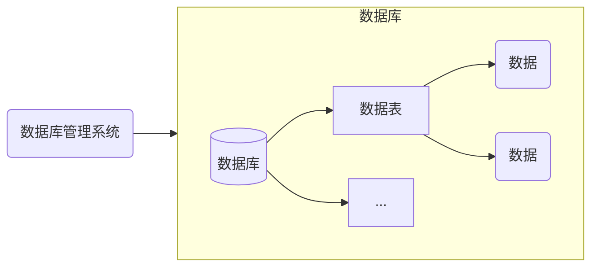
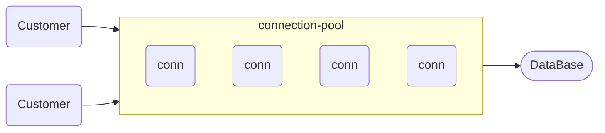

# 数据库

## 数据库基本概念

### 数据库

- 数据库（DataBase）就是**存储**和**管理**数据的仓库，数据是有组织的进行存储
- 其本质是一个**文件系统**，用数据库管理系统，以文件的方式，将数据存储在硬盘上，来达到持久化存储的效果

**数据存储方式的比较**

<table style="width:58rem">
    <thead>
        <tr style="text-align:left">
            <th width=16%>存储方式</th>
            <th width=42%>优点</th>
            <th width=42%>缺点</th>
        </tr>
    </thead>
    <tbody>
        <tr>
            <td>内存</td>
            <td>速度快</td>
            <td>不能够永久保存，数据是临时状态</td>
        </tr>
        <tr>
            <td>文件</td>
            <td>数据是可以永久保存的</td>
            <td>需要用 IO 流操作文件，不方便</td>
        </tr>
        <tr>
            <td>数据库</td>
            <td>1. 数据可以永久保存<br/>2. 方便存储和管理数据<br/>3. 使用统一的方式操作数据库 - SQL</td>
            <td>1. 数据库软件运行在内存中，占用资源<br/>2. 有些数据库要付费（如：Oracle 数据库）</td>
        </tr>
    </tbody>
</table>

### 数据库管理系统

- 英文：DataBase Management System，简称 DBMS
- 在电脑上安装了数据库管理系统后，就可以通过数据库管理系统创建数据库来存储数据
- 通过该系统也可以对数据库中的数据进行增删改查
- 程序员通过一门编程语言（SQL）跟数据库管理系统打交道
- 我们平时说的 MySQL 数据库其实是 **MySQL 数据库管理系统**

### SQL

* 英文：Structured Query Language，简称 SQL，结构化查询语言
* 操作数据库的编程语言
* 定义操作所有关系型数据库的统一标准，可用 SQL 操作所有的关系型数据库管理系统
* SQL 是一门 ANSI 标准的计算机语言，但仍存在着多种不同版本的 SQL 语言，它们以相似的方式共同地来支持一些主要的命令
* 对于同一个需求，每一种数据库操作的方式可能会存在一些不一样的地方

---

## MySQL

### 准备

#### MySQL 安装

本笔记使用的软件版本：MySQL 5.7.24 解压版

下载：https://downloads.mysql.com/archives/community/

下载后得到一个压缩包，将其解压，放到在任意位置

#### MySQL 配置

##### 添加环境变量

> 环境变量里面有很多选项，这里我们只用到 Path 这个参数  
> 在命令提示符窗口中输入一个可执行程序的名字，Windows 会先在环境变量中的 Path 所指的路径中寻找一遍，若找到了就直接执行，没找到就在当前工作目录找，如果还没找到，就报错  
> 我们添加环境变量的目的就是为了能够在任意一个命令提示符窗口中直接调用 MySQL 中的相关程序

1. 按 Win + R 打开运行窗口，输入 sysdm.cpl，然后回车
2. 点击高级标签页，再选择环境变量
3. 在 系统变量 中新建，变量名为 MYSQL_HOME，变量值为安装目录，如：D:\\Program\\mysql-5.7.24-winx64
4. 在 系统变量 中找到并双击 Path，进入以后点击新建，输入：%MYSQL_HOME%\\bin
5. 点击确定，配置完毕

**验证配置是否成功**

以管理员身份进入命令提示符窗口，输入 `mysql` 并回车

若提示 Can't connect to MySQL server on 'localhost'，则证明添加成功

若提示 mysql 不是内部或外部命令，也不是可运行的程序或批处理文件，则表示添加失败

##### 新建配置文件

在 MySQL 的安装根目录下，新建 my.ini

添加如下内容：

```ini
[mysql]
default-character-set=utf8

[mysqld]
character-set-server=utf8
default-storage-engine=INNODB
sql_mode=STRICT_TRANS_TABLES,NO_ZERO_IN_DATE,NO_ZERO_DATE,ERROR_FOR_DIVISION_BY_ZERO,NO_AUTO_CREATE_USER,NO_ENGINE_SUBSTITUTION
```

以上就是配置数据库的默认编码集为 utf-8 和默认存储引擎为 INNODB

##### 初始化 MySQL

以管理员身份进入命令提示符窗口，输入 `mysqld --initialize-insecure`

若没有出现报错信息，则证明 data 目录初始化没有问题，此时 MySQL 目录下已经生成了 data 目录

**注册 MySQL 服务**

以管理员身份进入命令提示符窗口，输入 `mysqld -install`

提示 Service successfully installed 则安装成功

该服务会在电脑启动是自动运行，不过第一次安装，需要手动运行

##### 启动 MySQL 服务

若无法启动，则用管理员身份进入命令提示符窗口

```bash
-- 启动 mysql 服务
net start mysql

-- 停止 mysql 服务
net stop mysql
```

- 若启动时提示：`The service name is invalid`（服务名无效），则表示系统中没有注册 MySQL 服务<br/>解决：命令行以管理员身份进入 MySQL 安装目录的 bin 目录中，执行`mysqld -install`
- 若启动时提示：`System error 5 has occurred`，则表示没有以管理员身份启动命令行程序

##### 修改默认账户密码

进入命令提示符窗口，输入 `mysqladmin -u root password root`

这里的 root 就是指默认管理员（即 root 账户）的密码，可以自行修改

以上命令相当于是开了一个管理员账户 root，密码设置为了 root

---

#### MySQL 登陆和退出

**登录**

进入命令提示符窗口

```bash
mysql -uroot -proot
```

出现下图的结果，则表示登录成功

<div style="clear:both"></div>

登录参数

```bash
mysql -u 用户名 -p 密码 -h 要连接的 mysql 服务器的 ip 地址(默认 127.0.0.1) -P 端口号(默认 3306)
```

**退出**

```bash
quit
exit
```

---

#### MySQL 卸载

以`管理员身份`进入命令提示符窗口

输入 `net stop mysql`

<div style="clear:both"></div>

再输入 `mysqld -remove mysql`

<div style="clear:both"></div>

最后删除 MySQL 目录及相关的环境变量

---

### MySQL 日志

配置 MySQL 执行日志（重启 mysql 服务后生效）

在 MySQL 配置文件 my.ini 中添加如下配置

```ini
log-output=FILE
general-log=1
general_log_file="D:\mysql.log"
slow-query-log=1
slow_query_log_file="D:\mysql_slow.log"
long_query_time=2
```

`net stop mysql` 关闭服务  
`net start mysql` 开启服务

general_log_file 和 slow_query_log_file 配置的是 .log 文件的存放路径，如：D 盘根目录  
重启 MySQL 服务后，可以去 D 盘查看是否有两个 .log 文件生成

### MySQL 数据模型

MySQL 就是一个**关系型数据库**

> 关系型数据库是建立在关系模型基础上的数据库  
> 简单说，关系型数据库是由多张能互相连接的 二维表 组成的数据库

**关系型数据库的优点**：

1. **容易理解**：  
   二维表结构是非常贴近逻辑世界的一个概念，关系模型相对网状、层次等其他模型来说更容易理解
2. **使用方便**：  
   通用的 SQL 语言使得操作关系型数据库非常方便，可用于复杂查询
3. **易于维护**：  
   丰富的完整性（实体完整性、参照完整性和用户定义的完整性）大大减低了数据冗余和数据不一致的概率

**关系型数据库的缺点**：

1. 网站的用户并发性非常高，往往达到每秒上万次读写请求，对于传统关系型数据库来说，硬盘 I/O 是一个很大的瓶颈
2. 网站每天产生的数据量是巨大的，对于关系型数据库来说，在一张包含海量数据的表中查询，效率是非常低的
3. 性能欠佳：在关系型数据库中，导致性能欠佳的最主要原因是多表的关联查询，以及复杂的数据分析类型的复杂 SQL 报表查询。为了保证数据库的 ACID 特性，必须尽量按照其要求的范式进行设计，关系型数据库中的表都是存储一个格式化的数据结构  
   ACID 分别是：Atomic 原子性，Consistency 一致性，Isolation 隔离性，Durability 持久性
4. 在基于 web 的结构当中，数据库是最难进行横向扩展的，当一个应用系统的用户量和访问量与日俱增的时候，数据库却没有办法像 web server 和 app server 那样简单的通过添加更多的硬件和服务节点来扩展性能和负载能力。当需要对数据库系统进行升级和扩展时，往往需要停机维护和数据迁移

**数据模型**



### IDEA 连接数据库

1. 进入 idea 的 Database 工具面板

   面板寻找方法：

   - View --> Tool Windows --> Database
   - Ctrl + Shift + A 或者 双击 Shift 调出全局搜索框，搜索 Database，选择 Database 工具面板

2. 进入 Database 面板后，点击工具栏的 + 号，点击 Data Source，选择对应的数据库

3. 在弹出的界面填写数据库的基本信息

4. 完成后，就可在 Database 工具面板看到如下界面

   <div style="clear:both"></div>

5. 在 idea 中可以与 navicat 或 sqlyog 一样直观地操作数据库

> **Tip**：把 idea 的 SQL 方言设置为 MySQL，体验更好  
> 设置路径：Language & Frameworks --> SQL Dialects --> Global SQL Dialect

---

## SQL

### 概述

* 英文：Structured Query Language，简称 SQL，结构化查询语言
* 操作数据库的编程语言，对数据库、表、数据进行增删改查操作
* 定义操作所有关系型数据库的统一标准，可用 SQL 操作所有的关系型数据库管理系统
* SQL 是一门 ANSI 标准的计算机语言，但仍存在着多种不同版本的 SQL 语言，它们以相似的方式共同地来支持一些主要的命令，俗称 “方言”
* 对于同一个需求，每一种数据库操作的方式可能会存在一些不一样的地方

### SQL 分类

1. [DDL](#DDL)（Data Definition Language）数据定义语言  
   用来定义数据库对象：数据库、表、列等  
   DDL 简单理解就是，用来操作**数据库、表**等
2. [DML](#DML)（Data Manipulation Language）数据操作语言  
   用来对数据库中表的数据进行增删改  
   DML 简单理解就是，对表中**数据进行增删改**
3. [DQL](#DQL)（Data Query Language）数据查询语言  
   用来查询数据库中表的记录（数据），这是最常用且重要的操作  
   DQL 简单理解就是，对**数据进行查询操作**，从数据库表中查询到我们想要的数据
4. [DCL](#DCL)（Data Control Language）数据控制语言  
   用来定义数据库的访问权限和安全级别，及创建用户  
   DCL 简单理解就是，对**数据库进行权限控制**，如：使某一个数据库表只能让某一个用户进行操作等

### 通用语法

- SQL 语句可以单行或多行书写，以分号结尾（只有写了分号，才是一个完整的 SQL 语句）

- MySQL 数据库的 SQL 语句不区分大小写，关键字建议使用大写

- 注释
  - 单行注释：-- 注释内容 或 MySQL 特有的 \# 注释内容

    **注意**：使用 -- 添加单行注释时，-- 后面一定要加空格，而 \# 没有要求

  - 多行注释：/\* 注释内容 \*/

### 数据类型

#### 1.数值类型

<table style="width:48rem">
    <thead>
        <tr style="text-align:left">
            <td width=26%>数据类型</td>
            <td width=20%>大小</td>
            <td width=50%>描述</td>
        </tr>
    </thead>
    <tbody>
        <tr>
            <td>TINYINT</td>
            <td>1 byte</td>
            <td>小整数值，类似 Java 的 byte</td>
        </tr>
        <tr>
            <td>SMALLINT</td>
            <td>2 bytes</td>
            <td>大整数值，类似 Java 的 short</td>
        </tr>
        <tr>
            <td>MEDIUMINT</td>
            <td>3 bytes</td>
            <td>大整数值</td>
        </tr>
        <tr>
            <td>INT 或 INTEGER</td>
            <td>4 bytes</td>
            <td>大整数值，类似 Java 的 int</td>
        </tr>
        <tr>
            <td>BIGINT</td>
            <td>8 bytes</td>
            <td>极大整数值，类似 Java 的 long</td>
        </tr>
        <tr>
            <td>FLOAT</td>
            <td>4 bytes</td>
            <td>单精度浮点数值，类似 Java 的 float</td>
        </tr>
        <tr>
            <td>DOUBLE</td>
            <td>8 bytes</td>
            <td>双精度浮点数值，类似 Java 的 double</td>
        </tr>
        <tr>
            <td>DECIMAL</td>
            <td></td>
            <td>小数值</td>
        </tr>
    </tbody>
</table>


**注意**：

在字段类型为 INT 时，无论显示宽度设置为多少，INT 类型能存储的最大值和最小值都是固定的  
当 INT 字段类型设置为无符号且填充零（UNSIGNED ZEROFILL）时，若数值位数未达到设置的显示宽度，会在数值前面补充零直到满足设定的显示宽度。有无符号的限制是因为 ZEROFILL 属性会隐式地将数值转为无符号型，不能存储负的数值

```sql
a INT(11) NOT NULL,
b INT(11) UNSIGNED ZEROFILL NOT NULL,
c INT(5) UNSIGNED ZEROFILL NOT NULL,
```

<table style="width:30rem">
    <thead>
        <tr style="text-align:left">
            <th width="33%">a</th>
            <th width="33%">b</th>
            <th width="33%">c</th>
        </tr>
    </thead>
    <tbody>
        <tr>
            <td>1</td>
            <td>00000000001</td>
            <td>00001</td>
        </tr>
    </tbody>
</table>


**使用方式**

INT 格式：字段名 int  
例：把年龄设置为 INT 类型，整数的显示宽度为 11  
age int(11)

DOUBLE 格式：字段名 double（总长度，小数点后保留的位数）  
例：把分数设置为 DOUBLE 类型，数值范围：0 ~ 100，小数点后保留 2 位  
score double(5,2)

#### 2.日期和时间类型

常用：前四个

<table style="width:45rem">
    <thead>
        <tr style="text-align:left">
            <th width=23%>数据类型</th>
            <th width=18%>大小</th>
            <th width=59%>描述</th>
        </tr>
    </thead>
    <tbody>
        <tr>
            <td>DATE</td>
            <td>3</td>
            <td>日期值（年月日）</td>
        </tr>
        <tr>
            <td>TIME</td>
            <td>3</td>
            <td>时间值或持续时间（时分秒）</td>
        </tr>
        <tr>
            <td>YEAR</td>
            <td>1</td>
            <td>年份值</td>
        </tr>
        <tr>
            <td>DATETIME</td>
            <td>8</td>
            <td>混合日期和时间值（年月日+时分秒）</td>
        </tr>
        <tr>
            <td>TIMESTAMP</td>
            <td>4</td>
            <td>混合日期和时间值，时间戳<br/>若不赋值，默认值是系统默认时间<br/>能表示的最大时间到 2038 年，所以<b>不建议使用</b></td>
        </tr>
    </tbody>
</table>

**使用方式**：

DATE 格式：字段名 date  
例：把生日设置成 DATE 类型，此类型的日期只有年月日  
birthday date

#### 3.字符串类型

常用：CHAR、VARCHAR

若要保存较大的文件，会有专门的文件服务器，数据库里面只用 VARCHAR 来保存文件访问路径

<table style="width:58rem">
    <thead>
        <tr style="text-align:left">
            <th width=20%>数据类型</th>
            <th width=32%>大小</th>
            <th width=48%>描述</th>
        </tr>
    </thead>
    <tbody>
        <tr>
            <td>CHAR</td>
            <td>0-255 bytes</td>
            <td>定长字符串<br/>存储时不会计算原始数据的长度<br/>相比 VARCHAR，存储性能更高</td>
        </tr>
        <tr>
            <td>VARCHAR</td>
            <td>0-65535 bytes</td>
            <td>变长字符串<br/>存储时会计算原始数据的长度，根据长度去存储<br/>相比 CHAR，存储性能更低<br/>如：定义了 name varchar(10)，存入 “张三”<br/>只会占用两个字符空间，而不是 10 个</td>
        </tr>
        <tr>
            <td>TINYBLOB</td>
            <td>0-255 bytes</td>
            <td>不超过 255 个字符的二进制字符串</td>
        </tr>
        <tr>
            <td>TINYTEXT</td>
            <td>0-255 bytes</td>
            <td>短文本字符串</td>
        </tr>
        <tr>
            <td>BLOB</td>
            <td>0-65 535 bytes</td>
            <td>二进制形式的长文本数据</td>
        </tr>
        <tr>
            <td>TEXT</td>
            <td>0-65 535 bytes</td>
            <td>长文本数据</td>
        </tr>
        <tr>
            <td>MEDIUMBLOB</td>
            <td>0-16,777,215 bytes</td>
            <td>二进制形式的中等长度文本数据</td>
        </tr>
        <tr>
            <td>MEDIUMTEXT</td>
            <td>0-16,777,215 bytes</td>
            <td>中等长度文本数据</td>
        </tr>
        <tr>
            <td>LONGBLOB</td>
            <td>0-4,294,967,295 bytes</td>
            <td>二进制形式的极大文本数据</td>
        </tr>
        <tr>
            <td>LONGTEXT</td>
            <td>0-4,294,967,295 bytes</td>
            <td>极大文本数据</td>
        </tr>
    </tbody>
</table>


**注意**：

一般 VARCHAR 的长度不会超过 255，因为：  
InnoDB 存储引擎的表索引的前缀长度最长是 767 字节（bytes），若要创建索引，就不能超过 767 字节  
utf8 编码时，VARCHAR(255) 占用的最大字节数为 255 \* 3 = 765 bytes  
255 是 varchar 长度，3 是 utf8 占用的 3 个字节，一般一个汉字占用 3 个字节

**使用方式**

CHAR 格式：字段名 char（最大位数）  
如果存入的数据超过了最大位数（最大字符数）就会报错  
例：把名字设置成 CHAR 类型，最大位数为 10  
name char(10)

VARCHAR 格式：字段名 varchar（最大位数）  
如果存入的数据超过了最大位数（最大字符数）就会报错  
例：把名字设置成 VARCHAR 类型，最大位数为 10  
name varchar(10)  
它可以存储 10 个字符（不是 10 个字节）

---

### DDL

用于数据库、表的增删改查

增（Create）删（Retrieve）改（Update）查（Delete）

#### 操作数据库

##### 查询

查询所有的数据库

```sql
SHOW DATABASES;
```

示例运行结果

<div style="clear:both"></div>


上述查询到的这些数据库是 mysql 安装后自带的数据库，个人不要操作这些数据库

MySQL 自带的数据库：

- information_schema 数据库，它存储数据是用一种特殊的表，叫视图，是一个逻辑表，并不存在物理文件
- mysql 数据库，存储的是 mysql 数据库最核心的一些信息
- performance_schema 数据库，存储的是 mysql 里性能相关的一些信息
- sys 数据库，存储的是系统相关的一些信息

##### 创建

**创建数据库**

```sql
CREATE DATABASE 数据库名称;
```

如果数据库已经存在，则会报错：  
Can't create database '数据库名'; database exists

**创建数据库（判断，如果不存在则创建）**

事先会进行判断，如果不存在则创建

```sql
CREATE DATABASE IF NOT EXISTS 数据库名称;
```

输出结果：Query OK, 1 row affected, 1 warning，没有报错

##### 删除

**删除数据库**

```sql
DROP DATABASE 数据库名称;
```

如果数据库不存在，则会报错：  
Can't drop database '数据库名'; database doesn't exist

**删除数据库（判断，如果存在则删除）**

事先会进行判断，如果存在则删除

```sql
DROP DATABASE IF EXISTS 数据库名称;
```

输出结果：Query OK, 0 rows affected, 1 warning，没有报错

##### 使用

如果要对数据库进行操作，就需要先使用数据库

**使用数据库**

```sql
USE 数据库名称;
```

**查看当前使用的数据库**

```sql
SELECT DATABASE();
```

示例运行结果

<div style="clear:both"></div>

#### 操作表

##### 查询

查询当前数据库下所有表名称

进入一个数据库

```sql
USE mysql;
SHOW TABLES; -- 查询所有表
```

**查询表结构**

```sql
DESC 表名称;
```

例：查看 mysql 数据库中 func 表的结构

<div style="clear:both"></div>

##### 创建

**创建表**

```sql
CREATE TABLE 表名 (
	字段名 1  数据类型 1,
	字段名 2  数据类型 2,
	…
	字段名 n  数据类型 n  #注意：最后一行末尾，不能加逗号
);
```

创建操作示例：

创建如下结构的表

<div style="clear:both"></div>

示例代码

```sql
CREATE TABLE tb_user (     #tb_user 是表名
	id INT,
    username VARCHAR(20),  #20 代表最大长度，username 不允许超过 20 位
    password VARCHAR(32)
);
```

创建结果

<div style="clear:both"></div>

##### 删除

**删除表**

```sql
DROP TABLE 表名;
```

如果数据库不存在，则会报错：Unknown table '表名'

**删除表（判断，如果存在则删除）**

事先会进行判断，如果存在则删除

```sql
DROP TABLE IF EXISTS 表名;
```

输出结果：Query OK, 0 rows affected, 1 warning

##### 修改

**修改表名**

```sql
ALTER TABLE 表名 RENAME TO 新的表名;

-- 将表名 student 修改为 stu
ALTER TABLE student RENAME TO stu;
```

**添加一列**

```sql
ALTER TABLE 表名 ADD 字段名 数据类型;

-- 给 stu 表添加一列 address，该字段类型是 varchar(50)
ALTER TABLE student ADD address varchar(50);
```

**修改数据类型**

```sql
ALTER TABLE 表名 MODIFY 字段名 新数据类型;

-- 将 stu 表中的 address 字段的类型改为 char(50)
ALTER TABLE student MODIFY address char(50);
```

**修改字段名和数据类型**

```sql
ALTER TABLE 表名 CHANGE 字段名 新字段名 新数据类型;

-- 将 stu 表中的 address 字段名改为 addr，类型改为 varchar(50)
ALTER TABLE student CHANGE address addr varchar(50);
```

**添加[约束](#约束)**

```sql
ALTER TABLE 表名 MODIFY 字段名 新数据类型 约束名;

-- 建完表之后，给 id 字段添加主键约束
ALTER TABLE student MODIFY id int(11) PRIMARY KEY;
```

**删除列**

```sql
ALTER TABLE 表名 DROP 字段名;

-- 将 stu 表中的 addr 字段删除
ALTER TABLE student DROP addr;
```

---

### DML

DML 主要是对数据进行**增**（insert）**删**（delete）**改**（update）操作

#### 添加

**给指定列添加数据**

```sql
INSERT INTO 表名 (字段名 1,字段名 2,…) VALUES (值 1,值 2,…);
```

**给全部列添加数据**

```sql
INSERT INTO 表名 (字段名 1,字段名 2,…) VALUES (值 1,值 2,…);
-- 给全部列添加数据时，字段名的列表可以省略但是不建议，因为可读性差
INSERT INTO 表名 VALUES (值 1,值 2,…);
```

**批量添加数据**

```sql
INSERT INTO 表名 (字段名 1,字段名 2,...) VALUES (值 1,值 2,...),(值 1,值 2,...),(值 1,值 2,...)...;
INSERT INTO 表名 VALUES (值 1,值 2,...),(值 1,值 2,...),(值 1,值 2,...)...;
```

添加操作示例：

向如下的表中添加数据

<div style="clear:both"></div>

```sql
-- 给指定列添加数据 INSERT INTO 表名(字段名 1,字段名 2,…) VALUES(值 1,值 2,…);
INSERT INTO student (id, NAME) VALUES (1, '张三');

-- 给所有列添加数据
INSERT INTO student (id,NAME,gender,birthday,score,email,tel,STATUS) VALUES (2,'李四','男','1999-11-11',88.88,'lisi@gmail.com','13888888888',1);

-- 省略了字段名的列表
INSERT INTO student VALUES (3,'王五','男','2001-12-8',92.15,'wangw@gmail.com','12666666666',0);
```

#### 删除

**删除数据**

```sql
DELETE FROM 表名 WHERE 条件;
```

**注意**：删除语句中**若没加条件，则将所有数据都删除**！

删除操作示例：

```sql
-- 删除姓名为张三的记录
DELETE FROM student WHERE name = '张三';

-- 谨慎操作
-- 删除 student 表中所有的数据
DELETE FROM student;

-- 多表联合删除
-- 删除 roles 和 role_menu_relation 表中 id 为 1 的数据
DELETE r.*, rm.* FROM roles r, role_menu_relation rm WHERE r.id = rm.role_id AND r.id = 1
```

#### 修改

**修改表中数据**

```sql
UPDATE 表名 SET 字段名 1=值 1,字段名 2=值 2,… WHERE 条件;
```

**注意**：修改语句中**若没加条件，则将所有数据都修改**！

修改操作示例：

```sql
-- 将张三的性别改为女
UPDATE student SET gender = '女' WHERE name = '张三';

-- 将张三的生日改为 1999-12-12，分数改为 99.99
UPDATE student SET birthday = '1999-12-12', score = 99.99 WHERE name = '张三';

-- 谨慎操作
-- 没有加 where 条件，修改所有记录的性别改为女
UPDATE student SET gender = '女';
```

---

### DQL

**分类**：

- [基础查询](#基础查询)
- [条件查询](#条件查询)（WHERE）
- [排序查询](#排序查询)（ORDER BY）
- [分组查询](#分组查询)（GROUP BY）
- [分页查询](#分页查询)（LIMIT）

#### 语法

关键词列表

```sql
SELECT
    -- 字段列表
FROM
    -- 表名列表
WHERE
    -- 条件
GROUP BY
    -- 分组字段
HAVING
    -- 条件（一般和 GROUP BY 一起用）
ORDER BY
    -- 排序字段
LIMIT
    -- 分页限定
```

#### 测试数据

```sql
DROP TABLE IF EXISTS student;

-- 创建 student 表
CREATE TABLE student (
    id        INT, -- 编号
    name      VARCHAR(20), -- 姓名
    age       INT, -- 年龄
    sex       VARCHAR(5), -- 性别
    address   VARCHAR(100), -- 地址
    math      DOUBLE(5,2), -- 数学成绩
    english   DOUBLE(5,2), -- 英语成绩
    hire_date DATE -- 入学时间
);

-- 添加数据
INSERT INTO student VALUES
(1,'马运',55,'男','杭州',66,78,'1995-09-01'),
(2,'马花疼',45,'女','深圳',98,87,'1998-09-01'),
(3,'马斯克',55,'男','香港',56,77,'1999-09-02'),
(4,'柳白',20,'女','湖南',76,65,'1997-09-05'),
(5,'柳青',20,'男','湖南',86,NULL,'1998-09-01'),
(6,'刘德花',57,'男','香港',99,99,'1998-09-01'),
(7,'张学右',22,'女','香港',99,99,'1998-09-01'),
(8,'德玛西亚',18,'男','南京',56,65,'1994-09-02');
```

<div style="clear:both"></div>

#### 基础查询

##### 查询指定列

```sql
SELECT 字段列表 FROM 表名;

-- 查询所有字段的数据，不建议有*，因为可读性差
SELECT * FROM 表名;
```

**注意**：<br/>查询所有字段的数据时，字段名列表可以用 \* 代替，但是不建议使用！<br/>因为写 \* 不知道具体有哪些字段，可读性差

使用示例：

```sql
SELECT name, age FROM student;  -- 查询 name 和 age 列的数据
```

运行结果

```sql
+--------------+------+
| name         | age  |
+--------------+------+
| 马运         |   55 |
| 马花疼       |   45 |
-- 省略多行
+--------------+------+
```

##### 去除重复记录

```sql
SELECT DISTINCT 字段列表 FROM 表名;
```

distinct 是不同的意思，相当于是显示不同的数据，不显示相同的，也就是去重

使用示例：

```sql
SELECT DISTINCT address FROM student; -- 查询地址信息，相同的不重复显示
```

运行结果

```sql
+---------+
| address |
+---------+
| 杭州    |
| 深圳    |
| 香港    |
| 湖南    |
| 南京    |
+---------+
```

##### 起别名

```sql
字段名 AS 别名

-- AS 可以省略，但是字段名和别名需要至少一个空格隔开
字段名 别名
```

使用示例：

```sql
SELECT name, math 数学, english AS 英语 FROM student;
```

运行结果

```sql
+--------------+--------+--------+
| name         | 数学   | 英语   |
+--------------+--------+--------+
| 马运         |  66.00 |  78.00 |
| 马花疼       |  98.00 |  87.00 |
-- 省略多行
+--------------+--------+--------+
```

#### 条件查询

##### 语法

```sql
-- []代表该语句可以省略
SELECT 字段列表 FROM 表名 [WHERE 条件列表];
```

条件列表可以使用以下运算符：

<table style="width:45rem">
    <thead>
        <tr style="text-align:left">
            <th width=40%>符号</th>
            <th width=60%>功能</th>
        </tr>
    </thead>
    <tbody>
        <tr>
            <td>&gt;</td>
            <td>大于</td>
        </tr>
        <tr>
            <td>&lt;</td>
            <td>小于</td>
        </tr>
        <tr>
            <td>&gt;=</td>
            <td>大于等于</td>
        </tr>
        <tr>
            <td>&lt;=</td>
            <td>小于等于</td>
        </tr>
        <tr>
            <td>=</td>
            <td>等于（不能用 ==），判断 NULL 不能用 =</td>
        </tr>
        <tr>
            <td>&lt;&gt; 或 !=</td>
            <td>不等于</td>
        </tr>
        <tr>
            <td>LIKE 占位符</td>
            <td>模糊查询，使用通配符<br/>_ 单个任意字符，％ 多个任意字符</td>
        </tr>
        <tr>
            <td>IS NULL</td>
            <td>是 NULL</td>
        </tr>
        <tr>
            <td>IS NOT NULL</td>
            <td>不是 NULL</td>
        </tr>
        <tr>
            <td>AND 或 &amp;&amp;</td>
            <td>并且，推荐用 AND</td>
        </tr>
        <tr>
            <td>BETWEEN...AND...</td>
            <td>在某个范围之内（都包含）</td>
        </tr>
        <tr>
            <td>OR 或 ||</td>
            <td>或者，推荐用 OR</td>
        </tr>
        <tr>
            <td>IN(...)</td>
            <td>多选一</td>
        </tr>
        <tr>
            <td>NOT 或 !</td>
            <td>非，不是</td>
        </tr>
    </tbody>
</table>


##### 模糊查询

使用通配符进行查询，\_ 匹配单个任意字符，％ 匹配多个任意字符

##### 使用示例

```sql
-- 查询年龄 大于等于 20 且 小于等于 30 的记录
SELECT * FROM student WHERE age >= 20 && age <= 30;
SELECT * FROM student WHERE age >= 20 AND age <= 30;
SELECT * FROM student WHERE age BETWEEN 20 AND 30;
-- 也可以对日期比大小
SELECT * FROM student WHERE hire_date BETWEEN '1998-09-01' AND '1999-09-01';

-- 查询年龄 等于 18 或 等于 20 或 等于 22 的记录
SELECT * FROM student WHERE age = 18 OR age = 20 OR age = 22;
SELECT * FROM student WHERE address = '香港' OR address = '杭州';  -- 字符串需要加引号
SELECT * FROM student WHERE age IN(18,20,22);

-- 判断字段 english 的值是否为 NULL（不能用=
SELECT * FROM student WHERE english IS NULL;
SELECT * FROM student WHERE english IS NOT NULL;
```

模糊查询

```sql
-- 查询所有姓'马'的人
SELECT * FROM student WHERE name LIKE '马%';
-- 查询所有名字包含'德'的人
SELECT * FROM student WHERE name LIKE '%德%';
```

#### 排序查询

##### 语法

```sql
SELECT 字段列表 FROM 表名 ORDER BY 排序字段名 1 [排序方式 1],排序字段名 2 [排序方式 2]...;
```

上述语句中的排序方式有两种：

* ASC：升序排列（默认值）
* DESC：降序排列

**注意**：当有多个排序条件时，如果第一个字段值相同，就会按照第二个字段值进行排序，以此类推

##### 使用示例

1. 单列排序

   查询学生信息，按照年龄升序排列

   ```sql
   SELECT * FROM student ORDER BY age;
   ```

   查询学生信息，按照数学成绩降序排列

   ```sql
   SELECT * FROM student ORDER BY math DESC;
   ```

2. 组合排序

   查询学生信息，按照数学成绩降序排列，若数学成绩一样，再按照英语成绩升序排列

   ```sql
   SELECT * FROM student ORDER BY math DESC, english ASC;
   ```

#### 聚合函数

就是将一列数据作为一个整体，进行纵向计算

##### 语法

```sql
-- []代表该语句可以省略
SELECT 聚合函数名(字段名) FROM 表 [WHERE 条件];
```

| 聚合函数        | 功能                                                         |
| --------------- | ------------------------------------------------------------ |
| COUNT（字段名） | 统计数量（一般不选用有 NULL 值的列）<br/>可以使用 COUNT(\*) 来统计 |
| MAX（字段名）   | 最大值                                                       |
| MIN（字段名）   | 最小值                                                       |
| SUM（字段名）   | 求和                                                         |
| AVG（字段名）   | 平均值                                                       |

以上函数（）中的字段名就是：主键

**注意**：NULL 值不参与所有聚合函数的运算

##### 使用示例

聚合函数：

1. 统计一共有多少个人

   ```sql
   SELECT COUNT(id) FROM student;       -- id 类没有 NULL，可以使用
   SELECT COUNT(english) FROM student;  -- english 列有一个数据是 NULL，则会少统计一个
   ```

   上面语句根据某个字段进行统计，若该字段某一行的值为 NULL，将不会被统计  
   所以**可以用 COUNT(*)** 实现  
   \* 表示所有字段数据，只要一条记录中，有一个字段值不为 NULL，就会参与统计  
   一行中不可能所有的数据都为 NULL，所以建议使用 COUNT(\*)

2. 查询英语的最低分

   ```sql
   SELECT MIN(english) FROM student;
   ```

   英语中有一个 NULL，但是 <u>NULL 值不参与所有聚合函数的运算</u>，所以最低分是 65

3. 查询数学的总分

   ```sql
   SELECT SUM(math) FROM student;
   ```

#### 分组查询

##### 语法

```sql
-- []代表该语句可以省略
SELECT 字段列表 FROM 表名 [WHERE 分组前条件限定] GROUP BY 分组字段名 [HAVING 分组后条件过滤];
```

**注意**：分组之后，查询的字段列表为聚合函数和分组字段，查询其他字段无任何意义

**执行顺序**：WHERE --> 聚合函数 --> HAVING

**WHERE 和 HAVING 区别**：

* 执行时机不一样  
  WHERE 是分组之前进行限定，不满足 WHERE 条件，则不参与分组  
  HAVING 是分组之后对结果进行过滤
* 可判断的条件不一样  
  **WHERE 不能对聚合函数进行判断，HAVING 可以**  
  因为 WHERE 最先执行，而先执行的不能用后执行的聚合函数进行条件判断  
  HAVING 最后执行，所以可以

##### 使用示例

<div style="clear:both"></div>

1. 查询男、女各自的数学平均分

   ```sql
   SELECT sex,AVG(math) FROM student GROUP BY sex;
   ```

   查询的字段是 sex 和 AVG(math)，根据 sex 来分组

   运行结果：

   <div style="clear:both"></div>

   查询 name 字段没有任何意义，因为 name 字段既不是聚合函数，也不是分组字段

   ```sql
   SELECT name,sex,AVG(math) FROM student GROUP BY sex;
   ```

   运行结果：

   <div style="clear:both"></div>

2. 查询男、女各自的数学平均分，以及各自人数

   分数低于 70 分的不参与分组

   ```sql
   SELECT sex,COUNT(*) AS 总人数,AVG(math) 
   FROM student WHERE math >= 70 GROUP BY sex;
   ```

   低于 70 分的不参与分组，所以是在分组之前对分数进行判断

   运行结果：

   <div style="clear:both"></div>

3. 查询男、女各自的数学平均分，以及各自人数

   要求：分组之后总人数大于 3 个

   ```sql
   SELECT sex,COUNT(*) AS 总人数,AVG(math) FROM student GROUP BY sex HAVING 总人数 > 3;
   -- 这里 HAVING 的条件'总人数'是聚合函数 COUNT(*)的别名
   -- 所以，HAVING 能判断聚合函数
   -- 但是，WHERE 不能判断聚合函数
   ```
   
   运行结果：
   
   <div style="clear:both"></div>

#### 分页查询

很多网站都有用到分页查询，如百度、谷歌、淘宝等  
分页查询是将数据一页一页的展示出来，用户可以点击 “查看下一页” 来翻页查看数据

<div style="clear:both"></div>

##### 语法

```sql
SELECT 字段列表 FROM 表名 LIMIT 起始索引,查询条目数;  -- 起始索引从 0 开始
```

**索引计算公式**：起始索引 = (当前页码 - 1) × 每页显示的条数

Tips：

- 分页查询 limit 是 MySQL 数据库的 “方言”
- Oracle 分页查询使用 rownumber
- SQL Serve 分页查询使用 top

##### 使用示例

1. 从 0 开始查询，查询 3 条数据

   ```sql
   SELECT * FROM student LIMIT 0,3;
   ```

2. 每页显示 3 条数据，查询第 1 页数据

   ```sql
   SELECT * FROM student LIMIT 0,3;
   ```

3. 每页显示 3 条数据，查询第 2 页数据

   ```sql
   SELECT * FROM student LIMIT 3,3;
   ```

#### 多表联查

[多表查询](#多表查询)

- [内连接](#内连接查询)
	- [隐式内连接](#隐式内连接)
	- [显式内连接](#显式内连接)
- [外连接](#外连接查询)
	- [左外连接](#左外连接)
	- [右外连接](#右外连接)
- [子查询](#子查询)

---

### DCL

#### 语法

**创建用户**：

```sql
CREATE USER '用户名' @'主机名' IDENTIFIED BY '密码';
```

主机名：指定该用户在哪个主机上可以登陆，本地用户可用 localhost，若想让该用户能从任意远程主机登陆，可使用通配符 `%`

**用户授权**：

```sql
GRANT 权限 1, 权限 2... ON 数据库名.表名 TO '用户名' @'主机名';
```

权限：CREATE、ALTER、SELECT、INSERT、UPDATE 等，若要授予所有权限则使用 ALL

**查看权限**：

```sql
SHOW GRANTS FOR '用户名' @'主机名';
```

**删除用户**：

```sql
DROP USER '用户名' @'主机名';
```

**查询用户**：

用户信息保存在名为 mysql 的数据库中

```sql
USE mysql;
SELECT * FROM USER;
```

---

## 约束

示例表格

<div style="clear:both"></div>

### 概述

* 约束是作用于表中列上的规则，用于限制加入表的数据

  例：我们可以给 id 列加约束，让其值不能重复，不能为 NULL

* 约束的存在保证了数据库中数据的正确性、有效性和完整性

  添加约束可以在添加数据的时候就限制不正确的数据，继而保障数据的完整性

### 分类

* **[非空约束](#非空约束)：关键字是 NOT NULL**

  保证列中所有的数据**不能有 NULL 值**

  例：id 列在添加 “马花疼” 这条数据时就不能添加成功

* **[唯一约束](#唯一约束)：关键字是 UNIQUE**

  保证列中所有数据**各不相同**

  例：id 列中三条数据的值都是 1，这样的数据在添加时是绝对不允许的

* **[主键约束](#主键约束)：关键字是 PRIMARY KEY**

  主键是一行数据的唯一标识，要求**非空且唯一**

  一张表中只能有一个主键

  一般都会给每张表添加一个主键列，用来唯一标识数据

  例：表中 id 就可以作为主键，来标识每条数据。这样就要求 id 的值不能重复，不能为 NULL 值

* **检查约束：关键字是 CHECK**

  保证列中的值**满足某一条件**

  例：给 age 列添加一个范围，最低年龄可以设置为 1，最大年龄就可以设置为 150，这样的数据才更合理

  > 注意：MySQL 不支持检查约束
  >
  > 虽然在数据库层面不能检查，但可在 java 代码中进行检查

* **[默认约束](#默认约束)：关键字是 DEFAULT**

  保存数据时，未指定值，则采用**默认值**

  默认约束只有在不给值时才会采用默认值，如果给了 NULL，那值就是 NULL 值

  例：给 english 列添加该约束，指定默认值是 0，这样在添加数据时，若没有指定具体值，就会采用默认给定的 0

* **[外键约束](#外键约束)：关键字是 FOREIGN KEY**

  **外键**用来让两个表的数据建立链接，保证数据的一致性和完整性
  
  > 对性能要求不高，安全要求高时，使用外键；对性能要求高，安全可自己控制时，不用外键  
  > 数据量不大的小系统，推荐使用外键  
  > 不用外键而用程序控制数据一致性和完整性时，应该单独写一层来保证，然后个个应用通过这个层来访问数据库
  
* **[自动增长](#自动增长)：关键字是 AUTO_INCREMENT**

  当字段是**数字类型**，且**唯一**（唯一约束 或 主键约束）时，可以使用自动增长
  
  > 注意：字段设置为自动增长以后，保存数据时，不给该字段设置值，或设置为 NULL，也会自动增长，不报错

### 非空约束

**概述**：

非空约束用于保证列中所有数据**不能有 NULL 值**

**语法**：

* 添加约束

  ```sql
  -- 创建表时添加非空约束
  CREATE TABLE 表名(
     字段名 数据类型 NOT NULL,
     ...
  );
  ```

  ```sql
  -- 建完表后添加非空约束
  ALTER TABLE 表名 MODIFY 字段名 数据类型 NOT NULL;
  ```

* 删除约束

  ```sql
  ALTER TABLE 表名 MODIFY 字段名 数据类型;
  ```

### 唯一约束

**概述**：

唯一约束用于保证列中所有数据**各不相同**

**语法**：

* 添加约束

  ```sql
  -- 创建表时添加唯一约束
  CREATE TABLE 表名(
     字段名 数据类型 UNIQUE [AUTO_INCREMENT],
     -- AUTO_INCREMENT: 当不指定值时自动增长
     ...
  );
  CREATE TABLE 表名(
     字段名 数据类型,
     ...
     [CONSTRAINT] [约束名] UNIQUE(字段名)
  );
  ```
  
  ```sql
  -- 建完表后添加唯一约束
  ALTER TABLE 表名 MODIFY 字段名 数据类型 UNIQUE;
  ```
  
* 删除约束

  ```sql
  ALTER TABLE 表名 DROP INDEX 字段名;
  ```

### 主键约束

**概述**：

主键是一行数据的唯一标识，要求**非空且唯一**；一张表只能有一个主键

**语法**：

* 添加约束

  ```sql
  -- 创建表时添加主键约束
  -- []代表该语句可以省略
  CREATE TABLE 表名(
     字段名 数据类型 PRIMARY KEY [AUTO_INCREMENT],
     ...
  );
  
  CREATE TABLE 表名(
     字段名 数据类型,
     [CONSTRAINT 约束名] PRIMARY KEY (字段名)
  );
  ```

  ```sql
  -- 建完表后添加主键约束
  ALTER TABLE 表名 ADD PRIMARY KEY(字段名);
  ```

* 删除约束

  ```sql
  ALTER TABLE 表名 DROP PRIMARY KEY;
  ```

### 默认约束

**概述**：

保存数据时，未指定值则采用**默认值**  
默认约束只有在不给值时才会采用默认值，如果给了 NULL，那值就是 NULL 值

**语法**：

* 添加约束

  ```sql
  -- 创建表时添加默认约束
  CREATE TABLE 表名(
     字段名 数据类型 DEFAULT 默认值,
     ...
  );
  ```

  ```sql
  -- 建完表后添加默认约束
  ALTER TABLE 表名 ALTER 字段名 SET DEFAULT 默认值;
  ```

* 删除约束

  ```sql
  ALTER TABLE 表名 ALTER 字段名 DROP DEFAULT;
  ```

### 外键约束

**概述**：

外键，让两个表的数据建立链接，保证数据的一致性和完整性

举例说明：

<div style="clear:both"></div>

员工表 emp 中的 dep_id 字段与部门表 dept 的 id 字段关联  
如：也就是说 1 号张三是 1 号部门研发部的员工  
现在若要删除 1 号部门，就会出现错误的数据（员工表中属于 1 号部门的数据）  
此时需要通过外键约束，让这两张表产生数据库层面的关系  
这样若要直接删除部门表 dept 中的 1 号部门的数据，将无法成功

**语法**：

* 添加外键约束

  ```sql
  -- 创建表时添加外键约束
  -- []代表该语句可以省略
  CREATE TABLE 表名(
     字段名 数据类型,
     ...
     -- 不要省略外键名称，因为删除外键必须提供外键名称
     [CONSTRAINT 外键别名] FOREIGN KEY(外键字段名) REFERENCES 主表(主表字段名) 
  );
  ```

  ```sql
  -- 创建表后添加外键约束
  ALTER TABLE 表名 ADD [CONSTRAINT 外键别名] 
  FOREIGN KEY (外键字段名称) REFERENCES 主表名称(主表字段名称);
  ```

* 删除外键约束

  ```sql
  ALTER TABLE 表名 DROP FOREIGN KEY 外键别名;
  ```

  删除未命名的外键

  ```sql
  SHOW CREATE TABLE 表名;  -- 获取表的完整信息
  -- 查看结果中，该表 Create Table 的字段值，能找到系统默认起的外键别名，之后正常删除
  ALTER TABLE 表名 DROP FOREIGN KEY 外键别名;
  ```

  所以在添加外键时，切记要慎重，不要忘记起别名

**使用示例**

把员工表 emp 中的 dep_id 字段设置为外键，关联部门表 dept 的 id 字段，此时，员工表为**从表**，部门表为**主表**

```sql
-- 方法一
CREATE TABLE emp(
   ...
   CONSTRAINT fk_emp_dept 
   FOREIGN KEY(dep_id) REFERENCES dept(id) 
);
-- 方法二
ALTER TABLE emp ADD CONSTRANT fk_emp_dept 
FOREIGN KEY(dep_id) REFERENCES dept(id);
```

### 自动增长

**概述**：

当字段是**数字类型**，且**唯一**（唯一约束 或 主键约束）时，可以使用自动增长

**语法**：

* 添加自动增长

  ```sql
  -- 创建表时添加自动增长
  CREATE TABLE 表名(
     字段名 数据类型 约束名 AUTO_INCREMENT,
     ...
  );
  ```

  ```sql
  -- 设置自增的起始值
  CREATE TABLE 表名(
     字段名 数据类型 约束名 AUTO_INCREMENT,
     ...
  ) AUTO_INCREMENT = 100;
  ```

  ```sql
  -- 建完表后添加自动增长
  -- 这里的约束名必须是 NOT NULL 或 PRIMARY KEY
  ALTER TABLE 表名 MODIFY 字段名 数据类型 约束名 AUTO_INCREMENT;
  ```

* 删除自动增长

  ```sql
  -- 就是修改表的逻辑
  ALTER TABLE 表名 MODIFY 字段名 数据类型 ...
  ```

**使用示例**

```sql
-- 原本的 id 字段：int(11) PRIMARY KEY

-- 修改为自增
ALTER TABLE student MODIFY id int(11) PRIMARY KEY AUTO_INCREMENT;

-- 去除自增
ALTER TABLE student MODIFY id int(11) PRIMARY KEY
```

#### Delete 和 Truncate 对自增的影响

DELETE 删除表中所有数据，将表的数据逐条删除  
TRUNCATE 删除表所有数据，是将整张表删除，然后再创建一个结构相同的表

因此：

- DELETE 删除后，自增还会继续，会按照之前自增到的数，接着向上加
- TRUNCATE 删除后，自增会从初始值重新开始

---

## 数据库设计

### 概述

- 软件的研发步骤

  <div style="clear:both"></div>

  数据库设计就是在设计阶段的工作

- 数据库设计的概述

  - 数据库设计就是根据业务系统的具体需求，结合我们所选用的 DBMS（数据库管理系统），为这个业务系统构造出最优的数据存储模型
  - 建立数据库中的**表结构**以及**表与表之间的关联关系**的过程
  - 解决的问题：有哪些表？表中有哪些字段？表与表之间有什么关系？

- 数据库设计的步骤

  - 需求分析（数据是什么? 数据具有哪些属性? 数据与属性的特点是什么）
  - 逻辑分析（通过 ER 图对数据库进行逻辑建模，此时无需考虑我们所选用的数据库管理系统）

  - 物理设计（根据数据库自身的特点把逻辑设计转换为物理设计，根据 ER 图创建出表结构）

  - 维护设计（1. 对新的需求进行建表；2. 表优化）

  ER 图（Entity Relationship Diagram）示例

  <div style="clear:both"></div>

### 数据库三范式

**概述**：三范式就是设计数据库的规则（空间最省）

**作用**：为了建立冗余较小、结构合理的数据库

**范式**：设计数据库时必须遵循一定的规则，在关系型数据库中这种规则就称为范式

- 第一范式（1NF）

  - 第一范式是最基本的范式

  - 数据库表里面字段都是单一属性的，不可再分（原子性）

  - 例：country 这一列还可以再拆分

    <div style="clear:both"></div>

- 第二范式（2NF）

  - 在第一范式的基础上更进一步，目标是确保表中的每列都与主键相关

  - 一张表只能描述一件事

  - 例：学员的信息和课程信息放在一张表中，会导致数据的冗余，若删除学员信息，成绩信息也被删除了

    <div style="clear:both"></div>

- 第三范式（3NF）

  - 消除传递依赖

  - 若表中的信息能够被推导出来，就不应该单独的设计一个字段来存放，节省数据库的存储空间占用

  - 例：商品的总金额可以通过 number 和 price 字段计算出来，不应该单独存储

    <div style="clear:both"></div>

### 数据库反三范式

**概述**：反范式化浪费存储空间,节省查询时间 （以空间换时间）

**作用**：通过增加冗余、重复的数据来提高数据库的读性能

**冗余字段**：设计数据库时，某一个字段属于一张表，但它同时出现在另一个或多个表中，且完全等同于它在其本来所属表的意义表示，那么这个字段就是一个冗余字段

**使用场景**：  
当需要查询 “订单表” 中所有数据，且只需要 “用户表” 的 name 字段时  
若 “订单表” 中没有 name 的冗余字段，就需要 JOIN 连接用户表，若用户表数据量非常大，那么这次连接查询就会极其耗性能
冗余的字段就可以牺牲一点空间，来换取性能大幅提升

### 表关系分类

- [一对一](#一对一)
  - 如：用户 和 用户详情
  - 一对一关系多用于表拆分
  - 将一个实体中经常使用的字段放一张表，不经常使用的字段放另一张表，提升查询性能
- [一对多（多对一）](#一对多)
  - 如：部门 和 员工
  - 一个部门对应多个员工，一个员工对应一个部门
- [多对多](#多对多)
  - 如：商品 和 订单
  - 一个商品对应多个订单，一个订单包含多个商品

#### 一对一

**实现方式**

**在任意一方加入外键**，关联另一方主键，并且设置外键为<u>唯一（UNIQUE）</u>  
限制外键只可出现一次，就实现了一对一

**使用示例**

发现 id、photo、nickname、age、gender 字段比较常用，就可以将个人信息拆分成两张表

<div style="clear:both"></div>

建表语句如下：

```sql
DROP TABLE IF EXISTS tb_user_desc;
DROP TABLE IF EXISTS tb_user;

-- 用户详情表
CREATE TABLE tb_user_desc (
	id     INT PRIMARY KEY AUTO_INCREMENT,
	city   VARCHAR(20),
	edu    VARCHAR(10),
	income INT,
	status CHAR(2),
	des    VARCHAR(100)
);
-- 常用信息表
CREATE TABLE tb_user (
	id       INT PRIMARY KEY AUTO_INCREMENT,
	photo    VARCHAR(100),
	nickname VARCHAR(50),
	age      INT,
	gender   CHAR(1),
	desc_id  INT UNIQUE,  -- 把外键设置成唯一
	-- 添加外键
	CONSTRAINT fk_user_desc 
    FOREIGN KEY(desc_id) REFERENCES tb_user_desc(id)	
);
```

表结构模型图：

<div style="clear:both"></div>

#### 一对多

**实现方式**

**在多的一方建立外键**，指向一的一方的主键

**使用示例**

一个部门可以拥有多个员工，但是一个员工不能属于多个部门

员工表属于多，而部门表属于一，因此，在员工表中添加 dep_id，指向部门表的主键 id  
部门与员工是一对多的关系

<div style="clear:both"></div>

建表语句如下：

```sql
DROP TABLE IF EXISTS tb_dept;
DROP TABLE IF EXISTS tb_emp;

-- 部门表
CREATE TABLE tb_dept(
	id       INT PRIMARY KEY AUTO_INCREMENT,
	dep_name VARCHAR(20),
	addr     VARCHAR(20)
);
-- 员工表 
CREATE TABLE tb_emp(
	id     INT PRIMARY KEY AUTO_INCREMENT,
	name   VARCHAR(20),
	age    INT,
	dep_id INT,

	-- 添加外键 dep_id，关联 dept 表的 id 主键（一对多）
	CONSTRAINT fk_emp_dept FOREIGN KEY(dep_id) REFERENCES tb_dept(id)	
);
```

表结构模型图：

<div style="clear:both"></div>

#### 多对多

**实现方式**

建立<u>中间表</u>，中间表至少包含两个外键，分别关联两方主键  
两表与中间表都是一对多的关系，中间表间接实现两表的多对多

**使用示例**

一个订单可以对应多个商品，一个商品也可以对应多个订单

订单表和商品表都属于多，此时需要创建一个中间表  
在中间表中添加订单表的外键和商品表的外键，分别指向两张表的主键

> 中间表和订单表、中间表和商品表的关系都是多对一，中间表是多的一方

<div style="clear:both"></div>

建表语句如下：

```sql
DROP TABLE IF EXISTS tb_order;
DROP TABLE IF EXISTS tb_goods;
DROP TABLE IF EXISTS tb_order_goods;

-- 订单表
CREATE TABLE tb_order(
	id           INT PRIMARY KEY AUTO_INCREMENT,
	payment      DOUBLE(10,2),
	payment_type TINYINT,
	status       TINYINT  -- 记录订单状态
);

-- 商品表
CREATE TABLE tb_goods(
	id    INT PRIMARY KEY AUTO_INCREMENT,
	title VARCHAR(100),
	price DOUBLE(10,2)
);

-- 中间表
CREATE TABLE tb_order_goods(
	id       INT PRIMARY KEY AUTO_INCREMENT,
	order_id INT,
	goods_id INT,
	count    INT  -- 记录商品的购买数量
);

-- 建完表后，添加外键
ALTER TABLE tb_order_goods ADD CONSTRAINT fk_order_id 
FOREIGN KEY(order_id) REFERENCES tb_order(id);

ALTER TABLE tb_order_goods ADD CONSTRAINT fk_goods_id 
FOREIGN KEY(goods_id) REFERENCES tb_goods(id);
```

表结构模型图：

<div style="clear:both"></div>

从模型图可知，订单表 和 商品表 与 中间表 都是一对多关系  
是 中间表 间接实现了 订单表 和 商品表 多对多的关系

### 实操练习

对以上知识的汇总练习

#### 解析

一共有四张表：专辑表、曲目表、短评表、用户表

一个专辑可有多个曲目，一个曲目只能属于某一张专辑，所以专辑表和曲目表的关系是一对多

一个专辑可被多个用户进行评论，一个用户可以对多个专辑进行评论，所以专辑表和用户表的关系是多对多

一个用户可发多个短评，一个短评只能是某一个人发的，所以用户表和短评表的关系是一对多

#### 代码

建表语句如下：

```sql
DROP TABLE IF EXISTS album;
DROP TABLE IF EXISTS songs;
DROP TABLE IF EXISTS user;
DROP TABLE IF EXISTS review;
DROP TABLE IF EXISTS mid_album_user;

-- 专辑表
CREATE TABLE album (
	id           INT PRIMARY KEY AUTO_INCREMENT, -- 编号(唯一)
	title        VARCHAR(32),   -- 专辑名
	alias        VARCHAR(32),   -- 专辑别名
	image        VARCHAR(64),   -- 封面图片
	style        VARCHAR(8),    -- 流派(如经典、流行、民谣、电子等)
	type         VARCHAR(4),    -- 类型(专辑、单曲等)
	medium       VARCHAR(4),    -- 介质(CD、黑胶、数字等)
	publish_time DATE,          -- 发行时间
	publisher    VARCHAR(16),   -- 出版者
	number       TINYINT,       -- 唱片数
	barcode      BIGINT,        -- 条形码
	summary      VARCHAR(1024), -- 简介
	artist       VARCHAR(16)    -- 艺术家
);


-- 曲目表
CREATE TABLE songs (
	id            INT PRIMARY KEY AUTO_INCREMENT, -- 编号(唯一)
	name          VARCHAR(32), -- 歌曲名
	serial_number TINYINT      -- 歌曲序号
);
-- 曲目和专辑多对一
ALTER TABLE songs ADD CONSTRAINT fk_songs_album_id FOREIGN KEY(id) REFERENCES album(id);


-- 用户表
CREATE TABLE user (
	id        INT PRIMARY KEY AUTO_INCREMENT, -- 用户编号(主键)
	username  VARCHAR(16) UNIQUE, -- 用户名(唯一)
	image     VARCHAR(64), -- 用户头像图片地址
	signature VARCHAR(64), -- 个人签名，例如(万般各所是 一切皆圆满)
	nickname  VARCHAR(16)  -- 用户昵称
);


-- 短评表
CREATE TABLE review (
	id          INT PRIMARY KEY AUTO_INCREMENT, -- 编号(唯一)
	content     VARCHAR(256), -- 评论内容
	rating      TINYINT,      -- 评分(1~5)
	review_time DATETIME,     -- 评论时间

	-- 短评和专辑多对一
	CONSTRAINT fk_review_album_id FOREIGN KEY(id) REFERENCES album(id),
	-- 短评和用户多对一
	CONSTRAINT fk_review_user_id FOREIGN KEY(id) REFERENCES user(id)
);


-- 专辑和用户的中间表
CREATE TABLE mid_album_user (
	id       INT PRIMARY KEY AUTO_INCREMENT, -- 逻辑的唯一标识
	user_id  INT,  -- 用户
	album_id INT,  -- 专辑

	-- 多对多外键
	CONSTRAINT fk_user_id  FOREIGN KEY(user_id)  REFERENCES user(id),
	CONSTRAINT fk_album_id FOREIGN KEY(album_id) REFERENCES album(id)
);
```

表结构模型图：

<div style="clear:both"></div>

---

## 多表查询

### 测试数据

员工表 emp

<div style="clear:both"></div>

部门表 dept

<div style="clear:both"></div>

```sql
DROP TABLE IF EXISTS emp;
DROP TABLE IF EXISTS dept;

-- 创建部门表
CREATE TABLE dept(
    did   INT PRIMARY KEY AUTO_INCREMENT,
    dname VARCHAR(20)
);

-- 创建员工表
CREATE TABLE emp (
    id        INT PRIMARY KEY AUTO_INCREMENT,
    name      VARCHAR(10),
    gender    CHAR(1), -- 性别
    salary    DOUBLE,  -- 工资
    join_date DATE,    -- 入职日期
    dep_id    INT,
    -- 外键，关联部门表(部门表的主键)
    FOREIGN KEY (dep_id) REFERENCES dept(did)
);

-- 添加部门数据
INSERT INTO dept (dname) VALUES ('研发部'),('市场部'),('财务部'),('销售部');

-- 添加员工数据
INSERT INTO emp(name,gender,salary,join_date,dep_id) VALUES
('孙悟空','男',7200,'2013-02-24',1),
('猪八戒','男',3600,'2010-12-02',2),
('唐僧','男',9000,'2008-08-08',2),
('白骨精','女',5000,'2015-10-07',3),
('蜘蛛精','女',4500,'2011-03-14',1),
('小白龙','男',2500,'2011-02-14',null);	
```

### 概述

多表查询，就是从多张表中一次性地查询出数据

在 DQL 里面，有一个查询语句 SELECT

```sql
SELECT 字段列表 FROM 表名列表; -- FROM 后面可以写一个表名的列表
```

但是直接在 FROM 后面加一个表名列表，会产生一个问题：**笛卡尔积**

笛卡尔积：有 A、B 两个集合，结果取的是 A、B 所有的组合情况

```sql
-- 举例
SELECT * FROM emp,dept;  -- 实际开发中不建议用 *
```

如上代码得到的结果表中有 4 × 6 = 24 条数据，明显，大部分是无意义的数据

### 分类

- 连接查询
  - [内连接查询](#内连接查询)：相当于查询 A、B 交集数据
  - [外连接查询](#外连接查询)
    - [左外连接查询](#左外连接)：相当于查询 A 表所有数据和交集部门数据
    - [右外连接查询](#右外连接)：相当于查询 B 表所有数据和交集部分数据
- [子查询](#子查询)

### 内连接查询

结果仅包含符合连接条件的行组合起来作为结果集，相当于交集

#### 隐式内连接

```sql
SELECT 字段列表 FROM 表名列表 WHERE 条件;
```

示例

```sql
-- 查询出 emp 和 dept 表中，所有满足条件的数据
SELECT * FROM emp,dept WHERE emp.dep_id = dept.did;

-- 查询 emp 表的 name 和 gender 列，与 dept 表的 gender 列中，满足条件的数据
SELECT emp.name,emp.gender,dept.dname 
FROM emp,dept WHERE emp.dep_id = dept.did;

-- 起别名
SELECT t1.name,t1.gender,t2.dname 
FROM emp t1,dept t2 WHERE t1.dep_id = t2.did;
```

#### 显式内连接

```sql
-- []代表该语句可以省略
SELECT 字段列表 FROM 表 1 [INNER] JOIN 表 2 [INNER] JOIN 表 3... ON 条件;
```

示例

```sql
-- 查询出 emp 和 dept 表中，所有满足条件的数据
SELECT * FROM emp INNER JOIN dept ON emp.dep_id = dept.did;

-- 起别名
SELECT t1.name,t1.gender,t2.dname 
FROM emp t1 INNER JOIN dept t2 ON t1.dep_id = t2.did;
```

**显式与隐式**：

相对而言，隐式内连接好理解好书写，语法简单，担心的点较少  
但是显式内连接可以减少字段的扫描，<u>有更快的执行速度</u>  
这种速度优势，在 3 张或更多张表连接时较为明显

### 外连接查询

左外连接查询：左表的记录将会全部显示出来，而右表只会显示符合搜索条件的记录  
右外连接查询：右表的记录将会全部显示出来，而左表只会显示符合搜索条件的记录

#### 左外连接

```sql
-- []代表该语句可以省略
SELECT 字段列表 FROM 表 1 LEFT [OUTER] JOIN 表 2 ON 条件;
```

示例

```sql
SELECT * FROM emp LEFT JOIN dept ON emp.dep_id = dept.did;
```

结果

<div style="clear:both"></div>

#### 右外连接

```sql
-- []代表该语句可以省略
SELECT 字段列表 FROM 表 1 RIGHT [OUTER] JOIN 表 2 ON 条件;
```

示例

```sql
SELECT * FROM emp RIGHT JOIN dept ON emp.dep_id = dept.did;
```

结果

<div style="clear:both"></div>

**左外连接与右外连接**：

- 其实左、右外连接本质差不多  
  左和右相当于是表 1 和表 2 的相对位置  
  例：表 1 写在表 2 的左边，有查询表 1 的所有数据和交集，则用左外连接
- 左、右外连接可以轻易互换，<u>在实际应用中，左外连接使用的多</u>

---

### 子查询

**概述**：查询中嵌套查询，我们称嵌套查询为子查询

**注意**：1. [MySQL 官方介绍](https://dev.mysql.com/doc/refman/5.6/en/update.html#:~:text=To%20reduce%20the%20retail%20price%20of%20any%20items%20for%20which%20the%20markup%20is%2030%25%20or%20greater%20and%20of%20which%20you%20have%20fewer%20than%20one%20hundred%20in%20stock%2C%20you%20might%20try%20to%20use%20an%20UPDATE%20statement%20such%20as%20the%20one%20following%2C%20which%20uses%20a%20subquery%20in%20the%20WHERE%20clause.%20As%20shown%20here%2C%20this%20statement%20does%20not%20work%3A)；2. [错误解决 - CSDN](https://blog.csdn.net/fdipzone/article/details/52695371)

嵌套查询的例子：

需求：查询工资高于猪八戒的员工的信息

1. 先查询出猪八戒的工资
2. 再查询工资高于猪八戒的员工的信息

第二步中的条件 “猪八戒的工资” 可通过第一步得出，所以可直接用第一步的代码替换第二步里面的条件值

```sql
-- 第一步：查询猪八戒的工资
SELECT salary FROM emp WHERE name = '猪八戒';  -- 结果是 3600

-- 第二步：查询工资高于猪八戒的员工的信息
SELECT * FROM emp WHERE salary > 3600;

-- 嵌套查询
SELECT * FROM emp 
WHERE salary > (SELECT salary FROM emp WHERE name = '猪八戒');
```

子查询根据查询结果不同，作用不同

- 子查询语句结果是**单行单列**，子查询语句作为**条件值**，用  =  !=  \>  \<  等进行条件判断

  ```sql
  SELECT 字段列表 FROM 表名 WHERE 字段名 = (子查询);
  ```

- 子查询语句结果是**多行单列**，子查询语句作为**条件值**，使用 IN 等关键字进行条件判断

  ```sql
  SELECT 字段列表 FROM 表名 WHERE 字段名 IN (子查询);
  ```

- 子查询语句结果是**多行多列**，子查询语句作为**虚拟表**

  ```sql
  SELECT 字段列表 FROM (子查询) WHERE 条件;
  ```

多行多列示例

需求：查询入职日期是 ‘2011-11-11’ 之后的员工信息和部门信息

```sql
-- 1.查询入职日期大于'2011-11-11'的员工信息
SELECT * FROM emp WHERE join_date > '2011-11-11';

-- 2.查询员工和部门信息（隐式内连接）
SELECT * FROM emp,dept WHERE emp.dep_id = dept.did;

-- 两个步骤结合
-- 虚拟表，相当于是在第一步的结果中查询
SELECT * FROM 
(SELECT * FROM emp WHERE join_date > '2011-11-11') t,dept 
WHERE t.dep_id = dept.did;
```

---

### 实操练习

#### 测试数据

<div style="clear:both"></div>

员工表 emp

<div style="clear:both"></div>

工作表 job

<div style="clear:both"></div>

部门表 dept

<div style="clear:both"></div>

工资等级表 salarygrade

<div style="clear:both"></div>

<details>
    <summary>点击查看 SQL 代码</summary>
    <pre><code>
DROP TABLE IF EXISTS emp;
DROP TABLE IF EXISTS dept;
DROP TABLE IF EXISTS job;
DROP TABLE IF EXISTS salarygrade;&#10
-- 部门表
CREATE TABLE dept (
  id INT PRIMARY KEY PRIMARY KEY, -- 部门 id
  dname VARCHAR(50),              -- 部门名称
  loc VARCHAR(50)                 -- 部门所在地
);&#10
-- 职务表，职务名称，职务描述
CREATE TABLE job (
  id INT PRIMARY KEY,
  jname VARCHAR(20),
  description VARCHAR(50)
);&#10
-- 员工表
CREATE TABLE emp (
  id INT PRIMARY KEY,  -- 员工 id
  ename VARCHAR(50),   -- 员工姓名
  job_id INT,          -- 职务 id
  mgr INT,             -- 上级领导
  joindate DATE,       -- 入职日期
  salary DECIMAL(7,2), -- 工资
  bonus DECIMAL(7,2),  -- 奖金
  dept_id INT,         -- 所在部门编号
  CONSTRAINT emp_jobid_ref_job_id_fk FOREIGN KEY (job_id) REFERENCES job (id),
  CONSTRAINT emp_deptid_ref_dept_id_fk FOREIGN KEY (dept_id) REFERENCES dept (id)
);&#10
-- 工资等级表
CREATE TABLE salarygrade (
  grade INT PRIMARY KEY, -- 级别
  losalary INT,          -- 最低工资
  hisalary INT           -- 最高工资
);&#10
-- 添加 4 个部门
INSERT INTO dept(id,dname,loc) VALUES 
(10,'教研部','北京'),
(20,'学工部','上海'),
(30,'销售部','广州'),
(40,'财务部','深圳');&#10
-- 添加 4 个职务
INSERT INTO job (id,jname,description) VALUES
(1, '董事长', '管理整个公司，接单'),
(2, '经理', '管理部门员工'),
(3, '销售员', '向客人推销产品'),
(4, '文员', '使用办公软件');&#10
-- 添加员工
INSERT INTO emp(id,ename,job_id,mgr,joindate,salary,bonus,dept_id) VALUES 
(1001,'孙悟空',4,1004,'2000-12-17','8000.00',NULL,20),
(1002,'卢俊义',3,1006,'2001-02-20','16000.00','3000.00',30),
(1003,'林冲',3,1006,'2001-02-22','12500.00','5000.00',30),
(1004,'唐僧',2,1009,'2001-04-02','29750.00',NULL,20),
(1005,'李逵',4,1006,'2001-09-28','12500.00','14000.00',30),
(1006,'宋江',2,1009,'2001-05-01','28500.00',NULL,30),
(1007,'刘备',2,1009,'2001-09-01','24500.00',NULL,10),
(1008,'猪八戒',4,1004,'2007-04-19','30000.00',NULL,20),
(1009,'罗贯中',1,NULL,'2001-11-17','50000.00',NULL,10),
(1010,'吴用',3,1006,'2001-09-08','15000.00','0.00',30),
(1011,'沙僧',4,1004,'2007-05-23','11000.00',NULL,20),
(1012,'李逵',4,1006,'2001-12-03','9500.00',NULL,30),
(1013,'小白龙',4,1004,'2001-12-03','30000.00',NULL,20),
(1014,'关羽',4,1007,'2002-01-23','13000.00',NULL,10);&#10
-- 添加 5 个工资等级
INSERT INTO salarygrade(grade,losalary,hisalary) VALUES 
(1,7000,12000),
(2,12010,14000),
(3,14010,20000),
(4,20010,30000),
(5,30010,99990);
    </code></pre>
</details>

#### 需求

查询出部门编号、部门名称、部门位置、部门人数

**非嵌套方法分析**：

1. 部门表 dept，获取部门编号、部门名称、部门位置

   ```sql
   SELECT d.id,d.dname,d.loc FROM dept d;
   ```

   结果：

   <div style="clear:both"></div>

2. 联合查询员工表 emp 和部门表 dept，加上员工表的 dept_id<br/>相当于的把 部门表 dept 和 员工表 emp 根据部门 id 进行了内连接

   ```sql
   SELECT d.id,d.dname,d.loc,e.dept_id FROM dept d,emp e WHERE e.dept_id = d.id;
   ```

   结果：

   <div style="clear:both"></div>
   
3. 按照部门 id 分组，并且统计各部门的人数

   ```sql
   SELECT d.id,d.dname,d.loc,e.dept_id,COUNT(*) AS cnt 
   FROM dept d,emp e WHERE e.dept_id = d.id GROUP BY d.id;
   ```

   结果：

   <div style="clear:both"></div>

**嵌套查询方法分析**：

1. 部门表 dept，获取部门编号、部门名称、部门位置

   ```sql
   SELECT d.id,d.dname,d.loc FROM dept d;
   ```

   结果：

   <div style="clear:both"></div>

2. 按照 dept_id 进行分组，然后 count(\*) 统计各部门的人数

   ```sql
   SELECT e.dept_id,COUNT(*) FROM emp e GROUP BY e.dept_id;
   ```

   结果：

   <div style="clear:both"></div>

3. 使用[子查询](#子查询)，让 部门表 dept 和 员工表 emp 分组后的虚拟表<br/>相当于的把 部门表 dept 和 员工表 emp 根据部门 id 进行了内连接

   ```sql
   SELECT d.id,d.dname,d.loc,t1.dept_id,t1.cnt 
   FROM 
   dept d,
   (SELECT e.dept_id,COUNT(*) cnt FROM emp e GROUP BY e.dept_id) t1 
   WHERE t1.dept_id = d.id;
   ```

   结果：
   
   <div style="clear:both"></div>

---

## 事务

### 概述

- 数据库的事务（Transaction）是一种机制、一个操作序列，包含了一组数据库操作命令
- 事务把所有的命令**作为一个整体**一起向系统提交或撤销操作请求  
  即这一组数据库命令要么同时成功，要么同时失败
- 事务是一个不可分割的工作逻辑单元

**举例**：

<div style="clear:both"></div>

张三和李四账户中各有 1000 块钱，现李四需要转 500 元给张三，具体步骤：

1. 查询李四账户余额
2. 从李四账户金额 -500
3. 给张三账户金额 +500

若在第二步后出现了异常，则李四少了 500 元，但是张三没有收到，这显然是不合理的

事务可以解决这个问题

把三个步骤看成一个整体（事务）：

1. 转账操作前，开启事务<br/>相当于是告诉数据库，之后的操作只是临时的<br/>比如账户减 500 元，不会真正扣钱，只是先做一个标记
2. 转账操作中，如果出现异常，回滚事务<br/>撤销之前的临时操作，回到开启事务之前的状态
3. 转账操作后，未出现异常，提交事务<br/>把之前的临时操作持久化<br/>比如账户扣钱和加钱的操作真正执行

### 语法

* **开启事务**

  ```sql
  START TRANSACTION;  
  或者
  BEGIN;
  ```

  开启事务以后，进行的操作都是临时操作  
  在当前查询下（当前用户）可以查到临时操作的结果  
  新建查询（另一个用户）查询不会看到临时操作的结果  
  数据库内的数据当然也不会改变，因为是临时操作

* **提交事务**

  ```sql
  COMMIT;
  ```

  提交之后，修改就变成持久的了 

* **回滚事务**

  ```sql
  ROLLBACK;
  ```

  ROLLBACK 需要写在 COMMIT 之后  
  若 ROLLBACK 写在 COMMIT 前，相当于是在提交之前回滚了，修改没有造成影响

  没有 COMMIT，只有回滚的话，回滚之后事务会结束（相当于提交了）

转账操作事务：

数据表创建

```sql
DROP TABLE IF EXISTS account;

-- 创建账户表
CREATE TABLE account(
	id int PRIMARY KEY AUTO_INCREMENT,
	name varchar(10),
	money double(10,2)
);

-- 添加数据
INSERT INTO account(name,money) values('张三',1000),('李四',1000);
```

转账操作

```sql
-- 开启事务
BEGIN;

-- 查询张三和李四的账户信息
SELECT name,money FROM account;

-- 李四账户 -500 (判断余额是否 >= 500)
UPDATE account SET money = money - 500 
WHERE name = '李四' 
AND (SELECT money FROM (SELECT * FROM account) AS a WHERE name = '李四') >= 500;

出现异常了...  -- 此处不是注释，在整体执行时会出问题，后面的 sql 则不执行

-- 王五账户 +500
UPDATE account SET money = money + 500 WHERE name = '张三';

-- 提交事务
COMMIT;

-- 回滚事务，ROLLBACK 写在 COMMIT 之后
ROLLBACK;
```

### 注意

1. **错误观念**：只要把事务写出来，最后用 commit 提交一下，数据库会自动判断这些语句是否全执行成功，如果成功则把所有的数据插入到数据库，如果有一条失败就自动回滚至原始状态

   ```sql
   CREATE TABLE test_tab (
   f1  int(11) NOT NULL ,
   f2  varchar(11)  DEFAULT NULL ,
   PRIMARY KEY (f1)
   );
   
   START TRANSACTION;
   INSERT INTO test_tab VALUES (1, '2');
   INSERT INTO test_tab VALUES (1, '3');
   COMMIT;
   ```

   运行代码的结果：  
   `INSERT INTO test_tab VALUES (1, '3');` 这句代码因为主键冲突运行失败，导致这条代码下的 commit 也没执行  
   此时数据表 test_tab 是被占用的，因为事务还未结束

   注意：  
   此时已经开启了一个事务，并且已经正确地执行了一条插入语句，虽然没有体现在数据库中，但如果之后在该连接中又执行了一条 commit 或 begin 或 start transaction（新开一个事务会将该链接中的其他未提交的事务提交，相当于 commit）  
   你会发现，刚才正确执行的 `INSERT INTO test_tab VALUES (1, '2');` 写进了数据库

   **正确理解**：若事务中所有 SQL 语句执行正确，则需自己手动提交 commit；否则有任何一条执行错误，需要自己执行一条 rollback，这时会回滚所有操作（commit 不会自动判断和回滚）

2. 回滚操作不会影响 AUTO_INCREMENT 字段的自增

   操作：

   表里面，有一个自增主键 id  
   我开启事务执行一条插入语句然后 rollback  
   第二次执行完后，commit  
   此时，数据表里只增加一条数据，因为第一次插入操作被回滚了，但 id 加了 2

### 事务四大特征

* **原子性**（**A**tomicity）：

  事务是不可分割的<u>最小操作单位</u>  
  构成事务的所有操作必须是一个逻辑单元，要么全部执行，要么全部不执行，只有执行成功和失败

* **一致性**（**C**onsistency）：

  数据库在事务执行前后的状态，都必须是稳定的或者是一致的  
  事务完成时，必须使所有的数据都保持一致状态

* **隔离性**（**I**solation）：

  隔离性指：多个事务之间，操作的可见性  
  隔离性越强，操作越不可见，性能越低  
  隔离性越弱，操作更加可见，性能越强

  隔离性一般不会去改变，用默认的就可  
  默认的就是在提交之前，其他地方看不到临时更改，只有提交或回滚之后才能看到

  多个事务之间不会互相影响  
  由锁机制和 MVCC 机制实现的

* **持久性**（**D**urability）：

  事务一旦提交或回滚，它对数据库中的数据的改变就是永久的  
  事务执行完成后，必须全部写入硬盘

> 注意：
>
> MySQL 中事务是**自动提交**的  
> 也就是说，若不添加事务执行 SQL 语句，语句执行完毕会自动的提交事务
>
> 可以通过下面语句查询默认提交方式：
>
> ```sql
> SELECT @@autocommit;
> ```
>
> 若结果是 1 则表示自动提交，若结果是 0 表示手动提交
>
> 可以通过下面语句修改提交方式
>
> ```sql
> SET @@autocommit = 0;
> ```
>
> **自动提交对 MySQL 性能有一定影响**
>
> 例：若插入 1000 条数据，MySQL 会自动 commit 1000 次的，若把 auto commit 关掉，通过程序来控制，只要 commit 一次就可以了

### 事务隔离级别

#### 并发访问

一个数据库可能拥有多个访问客户端，这些客户端都可以并发方式访问数据库  
数据库的相同数据可能被多个事务同时访问，如果不采取隔离措施，就会导致各种问题，破坏数据的完整性

**并发访问会产生的问题**

- **脏读**
  一个事务读取到了另一个事务中尚未提交的数据

  例：A 事务读取 B 事务尚未提交的数据，此时如果 B 事务发生错误并执行回滚操作，那么 A 事务读取到的数据就是脏数据
  
- **不可重复读**
  一个事务中，前后多次读取的数据内容不一致

  例：开启了两个 MySQL 数据库连接，且都开启了事务  
  连接 2 查询账户金额  
  连接 1 中进行了账户金额的修改并且提交了事务  
  连接 2 查询账户金额

  问题：连接 2 在同一个事务中两次查询金额，得到的结果不一样

- **幻读**
  一个事务中，某一次的查询操作得到的结果所表征的数据状态，无法支撑后续的业务操作

  例：开启了两个 MySQL 数据库连接，且都开启了事务  
  连接 2 查询账户 3，发现不存在  
  连接 1 中添加了账户 3  
  连接 2 查询账户 3，又有了
  
  问题：就像产生了幻觉一样，平白无故多了账户 3

> **不可重复读 和 幻读 的区别**：
>
> 1. **不可重复读**是读取了其他事务更改的数据，**针对 update 操作**
>
>    解决：使用行级锁，锁定该行，事务 A 多次读取操作完成后才释放该锁，此时才允许其他事务更改刚才的数据
>
> 2. **幻读**是读取了其他事务增删的数据，**针对 insert 和 delete 操作**
>
>    解决：使用表级锁，锁定整张表，事务 A 多次读取数据总量之后才释放该锁，此时才允许其他事务新增数据

#### 隔离级别

由上到下，隔离级别越来越高  
隔离级别越高，性能越差

- &#10006;  不能防止该问题
- &#10004;  可以防止该问题

| 中文名   | 隔离级别         | 脏读     | 不可重复读 | 幻读     | 数据库默认级别      |
| -------- | ---------------- | -------- | ---------- | -------- | ------------------- |
| 不可重复 | read uncommitted | &#10006; | &#10006;   | &#10006; |                     |
| 读已提交 | read committed   | &#10004; | &#10006;   | &#10006; | Oracle 和 SQLServer |
| 可重复读 | repeatable read  | &#10004; | &#10004;   | &#10006; | MySQL               |
| 串行化   | serializable     | &#10004; | &#10004;   | &#10004; |                     |

#### 相关命令

查看隔离级别：

```sql
SELECT @@tx_isolation;
```

设置隔离级别：

设置后，要重新登录 MySQL 才能看到变化

```sql
SET GLOBAL TRANSACTION ISOLATION LEVEL 级别名称;
```

---

## 数据库高级

### MySQL 索引

**概述**：

- 通过对数据表中的字段创建索引，可以提高查询速度
- **优点**：<br/>1. 可大大的提高查询速度<br/>2. 减少查询中**分组**和**排序**的时间<br/>3. 通过创建唯一索引，能保证数据的唯一性
- **缺点**：<br/>1. 创建和维护索引需要时间<br/>2. 表中的数据进行增删改操作时，MySQL 要对索引进行更新，数据量越大时间越长<br/>3. 索引文件需要占据存储空间

> 创建索引的原则：优先选择为经常出现在查询条件或者排序分组条件的字段创建索引

**常见索引的分类**：

- **主键索引** (PRIMARY KEY) 

  主键是一个唯一性的索引，每个表中只能有一个主键

- **唯一索引** (UNIQUE) 

  索引列的所有数据只能出现一次，必须是唯一  
  保证了数据记录的唯一性，也提升了数据的查询效率

- **普通索引** (INDEX) 

  最常见的索引，作用就是提高对数据的访问速度
  
- **复合索引** (INDEX)

  复合索引是多列的索引，MySQL 允许创建一个最多包含 16 列的复合索引  
  索引需要形成最左前缀，复合索引才会起作用

#### 主键索引

创建：

1. 创建表的时候，直接添加主键

   ```sql
   CREATE TABLE 表名 (
       -- 添加主键 (主键是唯一性索引,不能为 null,不能重复,)
       字段名 类型 PRIMARY KEY,
   );
   ```

2. 使用 DDL 修改表结构

   ```sql
   ALTER TABLE 表名 ADD PRIMARY KEY (字段名);
   ```

#### 唯一索引

创建：

1. 创建表的时候，直接添加唯一索引

   ```sql
   CREATE TABLE 表名 (
       列名 类型(长度),
       -- 添加唯一索引
       UNIQUE [索引名称] (列名)
   );
   ```

2. 使用 create 语句，在已有的表上创建索引

   ```sql
   -- []代表该语句可以省略
   CREATE UNIQUE INDEX 索引名 ON 表名(列名[长度]);
   ```

3. 使用 DDL 修改表结构

   ```sql
   ALTER TABLE 表名 ADD UNIQUE (字段名);
   ```

#### 普通索引

创建：

1. 创建表的时候，直接添加普通索引

   ```sql
   CREATE TABLE 表名 (
       列名 类型(长度),
       -- 添加普通索引
       KEY [索引名称] (列名)
   );
   ```

2. 使用 create 语句，在已有的表上创建索引

   ```sql
   -- []代表该语句可以省略
   create INDEX 索引名 on 表名(列名[长度]);
   ```

3. 使用 DDL 修改表结构

   ```sql
   ALTER TABLE 表名 ADD INDEX 索引名 (列名);
   ```

#### 复合索引

创建：

1. 创建表的时候，直接添加复合索引

   ```sql
   -- []代表该语句可以省略
   CREATE TABLE 表名 (
       列名 类型(长度),
       -- 添加复合索引
       INDEX [索引名称] (列名 1,列名 2...)
   ); 
   ```

2. 使用 create 语句，在已有的表上创建索引

   ```sql
   -- []代表该语句可以省略
   CREATE INDEX [索引名称] ON 表名(列名 1,列名 2...);
   ```

> **注意**：
> 
> 复合索引需要索引形成最左前缀，才回起作用
> 
> **例**：`CREATE INDEX index_name ON table_name(c1,c2,c3);`
> 
> 在 (c1,c2,c3) 上有复合索引，在使用时只能是如下组合：(c1)、(c1,c2)、(c1,c2,c3)
> 
> **反例**：`SELECT * FROM table_name WHERE c1 = v1 AND c3 = v3;`
> 
> c1 和 c3 不能构成最左前缀，复合索引不起作用

#### 删除索引

索引会占用存储空间，为了避免影响数据库的性能，应该及时删除不再使用的索引

```sql
ALTER TABLE 表名 DROP INDEX 索引名;
```

---

### MySQL 视图

#### 概述

- 视图是一种虚拟表

  向视图提供数据内容的语句为 SELECT 语句，可以将视图理解为存储起来的 SELECT 语句

- 视图建立在已有表的基础上，视图赖以建立的这些表称为基表

- 视图向用户提供基表数据的另一种表现形式

> **注意**：
>
> - 通过视图，不要进行增删改操作  
>   通过视图不能改变表中数据（一般情况下视图中的数据都是表中的列，经过计算得到的结果，不允许更新）
> - 删除视图，表不受影响，而删除表，视图不再起作用

#### 作用

- 简化复杂的查询

  若某个查询结果出现的比较频繁，并且查询语句比较复杂  
  此时，就可以将复杂的查询，构建成一张视图  
  用户只要查询视图，便可获取想要得到的信息

- 权限控制

  某几个列可以运行用户查询，其他列不允许，可以开通视图查询特定的列

#### 语法

- **创建视图**

  ```sql
  -- []代表该语句可以省略
  CREATE VIEW 视图名 [字段列表] AS SELECT 查询语句;
  ```

  - **VIEW**：表示视图
  - **字段列表**：可选参数，表示属性列表，指定视图中各个属性的名称，默认情况下，与 SELECT 语句中查询的属性相同
  - **AS**：表示视图要执行的操作
  - **SELECT 语句**：向视图提供数据内容

  ```sql
  -- 创建视图示例
  -- 把 左外联查询 table1 和 table2 保存为视图
  CREATE VIEW table1_table2_view AS 
  SELECT * FROM table1 t1 LEFT JOIN table2 t2 ON t1.t1_id = t2.t2_id;
  ```

- **使用视图**

  通过视图不能改变表中数据（一般情况下视图中的数据都是表中的列，经过计算得到的结果，不允许更新）

  示例：

  创建视图

  ```sql
  CREATE VIEW products_category_view AS
  SELECT * FROM products p LEFT JOIN category c ON p.`category_id` = c.`cid` 
  ```

  用视图替换冗长的 sql 语句

  ```sql
  -- 基础写法
  SELECT
  cname AS '分类名称',
  AVG(p.`price`) AS '平均价格'
  FROM products p LEFT JOIN category c ON p.`category_id` = c.`cid`
  GROUP BY c.`cname`;
  
  -- 视图写法
  SELECT
  cname AS '分类名称',
  AVG(price) AS '平均价格'
  FROM products_category_view GROUP BY cname;
  
  # products p LEFT JOIN category c ON p.`category_id` = c.`cid` 被 products_category_view 替代了
  ```

---

### MySQL 存储过程

#### 概述

- MySQL 5.0 版本开始支持存储过程
  存储过程（Stored Procedure）是一种在数据库中存储复杂程序，以便外部程序调用的一种数据库对象。存储过程是为了完成特定功能的 SQL 语句集，经编译创建并保存在数据库中，用户可通过指定存储过程的名字并给定参数（若需要）来调用执行

- 优点

  - 存储过程一旦调试完成后，就能稳定运行（前提是业务需求相对稳定，没什么变化）
  - 存储过程可减少业务系统与数据库的交互，降低耦合，数据库交互更加快捷（应用服务器，与数据库服务器不在同一个地区，存储过程保存在数据库中，交互更加方便）

- 缺点

  - 在互联网行业中大量使用 MySQL，MySQL 的存储过程与 Oracle 相比较弱，所以较少使用
  - 互联网行业需求变化较快，若使用存储过程，更改比较麻烦
  - 存储过程移植十分困难  
    在数据库集群环境中，保证各个库之间存储过程变更一致也十分困难

  > 阿里的代码规范中，禁止使用存储过程

#### 语法

注意：过程名称，在一个数据库中是唯一的

```sql
-- []代表该语句可以省略
DELIMITER $$  -- 将 MySQL 的结束符号从;改为$$，避免执行出现错误
-- 声明存储过程
CREATE PROCEDURE 过程名称([IN 参数名 参数类型, IN..., OUT 参数名 参数类型])
BEGIN  -- 开始编写存储过程
  -- 要执行的操作
END $$  -- 存储过程结束

-- 给变量赋值
SET @变量名 = 值;

-- 声明向调用者返回值
OUT 变量名 数据类型;
```

```sql
-- []代表该语句可以省略
CALL 过程名称([参数]);
```

#### 使用

测试数据

```sql
-- 商品表
CREATE TABLE goods (
  gid  INT,
  NAME VARCHAR(20),
  num  INT -- 库存
);
-- 订单表
CREATE TABLE orders (
  oid   INT,
  gid   INT,
  price INT -- 订单价格
);
-- 向商品表中添加 3 条数据
INSERT INTO goods VALUES(1,'奶茶',20);
INSERT INTO goods VALUES(2,'绿茶',10);
INSERT INTO goods VALUES(3,'花茶',25);
```

##### 无参的过程

```sql
-- 定义存储过程（Function）
DELIMITER $$
CREATE PROCEDURE select_goods()
BEGIN
  SELECT * FROM goods;
END $$

-- 调用
CALL select_goods();
```

##### 有参的过程

```sql
-- 定义存储过程（Function）
DELIMITER $$
CREATE PROCEDURE delete_goods(IN goods_id INT)
BEGIN
  DELETE FROM goods WHERE gid = goods_id;
END $$

-- 调用，需传入参数
CALL delete_goods(2);
```

##### 有返回值的过程

```sql
-- 定义存储过程（Function）
DELIMITER $$
CREATE PROCEDURE insert_orders(IN oid INT, IN gid INT, IN price INT, OUT out_res INT)
BEGIN
  -- 执行插入操作
  INSERT INTO orders VALUES(oid, gid, price);
  -- 设置 num 的值为 1
  SET @out_res= 1;
  -- 返回 out_num 的值
  SELECT @out_res;
END $$

-- 调用，传入参数，接收返回值
CALL insert_orders(1, 2, 30, @out_res)
```

---

### MySQL 触发器

**概述**：

- 触发器（trigger）是 MySQL 提供给程序员和数据分析员来保证数据完整性的一种方法，它是与表事件相关的特殊的存储过程，它的执行不是由程序调用，也不是手工启动，而是由事件来触发  
  比如：当对一个表进行操作（insert，delete，update）时就会激活它执行
- 简单理解：当我们执行一条 SQL 语句时，这条语句的执行会自动去触发执行其他的 SQL 语句

使用场景示例：用户下订单后，对应商品的库存量要相应地减少

**触发器创建的四个要素**

1. **监视地点**（table）

   监视哪一张数据表

2. **监视事件**（insert/update/delete）

   监视哪一个操作

3. **触发时间**（before/after）

   在 SQL 执行前执行还是之后执行

4. **触发事件**（insert/update/delete）

   触发器被触发后，要执行的操作

#### 语法

注意：触发器名称，在一个数据库中是唯一的

```sql
DELIMITER $$  -- 将 MySQL 的结束符号从;改为$$，避免执行出现错误
CREATE TRIGGER 触发器名  -- 触发器名称
BEFORE / AFTER（INSERT/UPDATE/DELETE） -- 触发的时机 和 监视的事件
ON table_Name  -- 触发器所在的表
FOR EACH ROW  -- 固定写法，叫做行触发器, 每一行受影响，触发事件都执行
BEGIN
  -- BEGIN 和 END 之间写触发事件
END $$  -- 结束
```

#### 使用

测试数据

```sql
-- 商品表
CREATE TABLE goods (
  gid  INT,
  NAME VARCHAR(20),
  num  INT -- 库存
);
-- 订单表
CREATE TABLE orders (
  oid   INT,
  gid   INT,
  price INT -- 订单价格
);
-- 向商品表中添加 3 条数据
INSERT INTO goods VALUES(1,'奶茶',20);
INSERT INTO goods VALUES(2,'绿茶',10);
INSERT INTO goods VALUES(3,'花茶',25);
```

需求：卖出商品之后减少库存量

- 监视的表  orders
- 监视的事件  insert
- 触发的时间  after
- 触发的事件  update

```sql
DELIMITER $$
CREATE TRIGGER order_tri
AFTER INSERT  -- 在 insert 执行后触发
ON orders  -- 监视 orders 表
FOR EACH ROW  -- 行触发器
BEGIN
  -- 库存 -1
  UPDATE goods SET num = num -1 WHERE gid = 1;
END $$

-- 向 orders 表执行 insert 操作
-- 执行完后，goods 表中 gid 为 1 的 num 字段值会减 1
INSERT INTO orders VALUES(1,4,25);
```

---

### MySQL 执行过程

执行过程：

1. 客户端发送一条查询请求给服务器
2. 服务器先检查查询缓存，如果命中了缓存，则立刻返回存储在缓存中的结果。否则进入下一阶段
3. 服务器段进行 SQL 解析、预处理，在优化器生成对应的执行计划
4. MySQL 根据优化器生成的执行计划，调用存储引擎的 API 来执行查询
5. 将结果返回给客户端

<div style="clear:both"></div>

实际上 MySQL 执行的每一步都比较复杂，具体的过程如下：

**1、MySQL 客户端和服务器通讯**

MySQL 客户端和服务器端的通讯协议是 “半双工” 的，这意味着，在任何一个时刻，要么由服务器向客户端发送数据，要么由客户端向服务器发送数据，这两个动作不能同时发生 这种协议让 MySQL 通信简单快速，但也限制了 MySQL 比如没办法进行流量限制：一旦一端开始发生消息，另一端要接收完整个消息才能响应他

> 客户端用一个单独的数据包将查询传给服务器。一旦客户端发送了请求，就只能等待结果了
>
> 相反的，服务器响应给客户端的数据通常很多，由多个数据包组成。当服务器开始响应客户端请求时，客户端必须完整的接受整个返回结果，而不是简单的只收取前面几条结果，然后让服务器停止发送数据

多数连接 MySQL 的库函数都可以获得全部结果并缓存到内存中，还可以逐行获取所需要的数据 默认一般是获得全部结果并缓存到内存中 MySQL 服务器端通常需要等所有的数据都已经发送给客户端才能释放这条查询所占用的资源，所以接受全部结果并缓存通常可以减少服务器的压力，让查询能早点结束、早点释放对应的资源

**2、查询状态**

> 对于 MySQL 连接，任何时刻都有一个状态，该状态表示了 MySQL 当前正在做什么 可用 show full processlist 命令查看当前状态

在一个查询生命周期中，状态会变化很多次，下面是这些状态的解释：

- **sleep**：线程正在等待客户端发送新的请求
- **query**：线程正在执行查询或者正在将结果发送给客户端
- **locked**：在 mysql 服务器层，该线程正在等待表锁 在存储引擎级别实现的锁，例如 InnoDB 的行锁，并不会体现在线程状态中 对 MyISAM 来说这是一个比较典型的状态
- **analyzing and statistics**：线程正在收集存储引擎的统计信息，并生成查询的执行计划
- **copying to tmp table**：线程在执行查询，并且将其结果集复制到一个临时表中，这种状态一般要么是做 GROUP BY 操作，要么是文件排序操作，或者 union 操作。如果这个状态后面还有 on disk 标记，那表示 MySQL 正在将一个内存临时表放到磁盘上
- **sorting Result**：线程正在对结果集进行排序
- **sending data**：线程可能在多个状态间传送数据，或者在生成结果集，或者在想客户端返回数据

**3、查询缓存**

在解析一个查询语句前，如果查询缓存是打开的，那么 MySQL 会优先检查这个查询是否命中查询缓存中的数据 这个检查是通过一个对大小写敏感的哈希查找实现的 查询和缓存中的查询即使只有一个字节不同，那也不会匹配缓存结果，这种情况下，查询就会进入下一阶段的处理

如果当前的查询恰好命中了查询缓存，那么在返回查询结果前，MySQL 会检查一次用户权限，这仍然是无须解析查询 SQL 语句的，因为在查询缓存中已经存放了当前查询需要访问的表信息 如果权限没问题，MySQL 会跳过所有其他阶段，直接从缓存中拿到结果并返回给客户端 这种情况下，查询不会被解析，不用生成执行计划，不会被执行

**4、查询优化处理**

> 查询的生命周期的下一步是先将一个 SQL 转换成一个执行计划，MySQL 再依照这个执行计划和存储引擎进行交互 这包含多个子阶段：解析 SQL、预处理、优化 SQL 执行计划 这个过程中任何错误都可能终止查询

- **语法解析器和预处理**： 首先 MySQL 通过关键字将 SQL 语句进行解析，并生成一颗对应的“解析树”

  - MySQL 解析器将使用 MySQL 语法规则验证和解析查询
  - 预处理器则根据一些 MySQL 规则进一步检查解析数是否合法

- **查询优化器**： 语法树被认为是合法的之后，会由优化器将其转化成执行计划

  一条查询可以有多种执行方式，最后都返回相同的结果 优化器会找到这其中最好的执行计划

- **执行计划**： MySQL 不会生成查询字节码来执行查询，而会生成查询的一棵指令树，然后通过存储引擎执行完成这棵指令树并返回结果 最终的执行计划包含了重构查询的全部信息

**5、查询执行引擎**

在解析和优化阶段，MySQL 将生成查询对应的执行计划 MySQL 的查询执行引擎根据这个执行计划来完成整个查询 这里的执行计划是一个数据结构，而不是和很多其他的关系型数据库那样对应的字节码

MySQL 简单的根据执行计划给出的指令逐步执行 在根据执行计划逐步执行的过程中，有大量的操作需要通过调用存储引擎实现的接口来完成。为了执行查询，MySQL 只需要重复执行计划中的各个操作，直到完成所有的数据查询

**6、返回结果给客户端**

查询执行的最后一个阶段是将结果返回给客户端

即使查询不需要返回结果给客户端，MySQL 仍然会返回这个查询的一些信息，如该查询影响到的行数 如果查询可以被缓存，那么 MySQL 在这个阶段也会将结果放到查询缓存中

MySQL 将结果集返回客户端是一个增量、逐步返回的过程 好处： 1. 服务器端无须存储太多结果，也就不会因为返回太多结果而消耗太多内存 2. 这样处理也可以让 MySQL 客户端，能第一时间获得返回的结果

> 结果集中的每一行都会以一个满足 MySQL 客户端 / 服务器通信协议的包发送，再通过 tcp 协议进行传输。在 tcp 传输的过程中，可能对 MySQL 的封包进行缓存然后批量传输

---

### 元数据

除了数据表之外的数据，都是元数据

**元数据分为三类**：

- 查询结果信息：UPDATE 或 DELETE 语句等执行后，受影响的记录数

- 数据库和数据表的信息：包含了数据库及数据表的结构信息

  MySQL 自带数据库 information_schema 下的 COLUMNS 数据表中，记录了所有的数据库和数据表以及表中的字段名

- MySQL 服务器信息：包含了数据库服务器的当前状态，版本号等

**元数据的相关命令**：

1. 查看服务器当前状态

   SHOW STATUS;

2. 查看 MySQl 的版本信息

   SELECT VERSION();

3. 查询表中的详细信息

   SHOW COLUMNS FROM emplyee;  -- 查看 emplyee 表的详细信息

4. 显示数据表的详细索引信息

   SHOW INDEX FROM employee;  -- 查看 emplyee 表的所有索引

5. 列出所有数据库

   SHOW DATABASES;

6. 显示当前数据库的所有表

   SHOW TABLES;

7. 获取当前的数据库名

   SELECT DATABASE();

---

### 数据库备份与还原

命令行的方式备份数据库

语法格式

```bash
# 备份
mysqldump -u 用户名 -p 密码 数据库 > 文件路径

# 还原
source sql 文件所在路径
```

步骤：

1. 打开命令行窗口

   若未添加 MySQL 到系统环境变量，则需要进入到 MySQL 安装目录的 bin 目录下

2. 执行备份

   ```bash
   mysqldump -uroot -proot test > D:/test.sql
   ```

   使用命令行备份数据库，会产生一个 sql 文件，里面的 SQL 语句相当于就是重新生成一遍数据库中原有的数据

3. 还原备份

   ```sql
   source D:/test.sql
   ```

   注意：命令行备份数据库产生的 sql 文件，没有创建数据库的操作  
   所以还原备份的时候，应该先把数据库创建出来

---

# JDBC

## 概述

JDBC（Java DataBase Connectivity）Java 数据库连接，就是使用 Java 语言，操作<u>关系型数据库</u>的一套 API

<div style="clear:both"></div>

> 如果同一套 Java 代码无法操作不同的关系型数据库，因为每一个关系型数据库的底层实现细节都不一样。这样，就产生一个问题，公司可以在开发阶段使用的是 MySQL 数据库，而上线时最终选用 oracle 数据库，此时，就需要对代码进行大批量修改，这显然是不合理的  
> Sun 公司就指定了一套标准接口（JDBC），JDBC 中定义了所有操作关系型数据库的规则。接口是无法直接使用的，我们需要使用接口的实现类，而这套实现类（称为：驱动）就由各自的数据库厂商给出

**JDBC 本质**

* 官方（Sun 公司）定义的一套操作所有关系型数据库的规则，即接口
* 各个数据库厂商去实现这套接口，提供（数据库驱动）jar 包
* 程序员可用这套接口（JDBC）编程，真正执行的代码是驱动 jar 包中的实现类

**JDBC 好处**

* 各数据库厂商使用相同的接口，Java 代码不需要针对不同数据库分别开发
* 可随时替换底层数据库，访问数据库的 Java 代码基本不变

**面向接口编程**  
编写操作数据库的代码只需要面向 JDBC（接口），操作哪个关系型数据库就导入该数据库的驱动包，如需要操作 MySQL 数据库，就需要在项目中导入 MySQL 数据库的驱动包

MySQL 驱动下载：https://downloads.mysql.com/archives/c-j/

<div style="clear:both"></div>

解压之后，mysql-connector-java-xxx.jar 就是 MySQL 的驱动

---

## 使用

Java 操作数据库的流程：

1. 编写 Java 代码
2. Java 代码将 SQL 发送到 MySQL 服务端
3. MySQL 服务端接收到 SQL 语句并执行该 SQL 语句
4. 将 SQL 语句执行的结果返回给 Java 代码

### 准备

1. 创建一个 idea 空工程

   项目配置（Project Structure）里面设置 SDK 和 Language Level 为对应的 jdk 版本

3. 在模块下创建文件夹 lib，导入数据库驱动到该文件夹下

4. 导入驱动（添加 jar 包到项目依赖库）

   右键 --> Add as Library

   - 取消依赖：Project Structure --> Modules --> Dependencies --> 取消依赖
   - 删除已添加的 Library：Project Structure --> Library --> 删除

   在添加为库文件的时候，有如下三个选项：

   * Global Library：全局有效
   * Project Library：项目有效
   * Module Library：模块有效

### 编写步骤

1. **注册驱动**

   将 Driver 驱动类加载进内存

   MySQL5.1.6 + jdk1.6 开始，注册驱动的代码可<u>省略不写</u>

   ```java
   Class.forName("com.mysql.jdbc.Driver");
   // 实际是在 Driver 类里，用静态代码块执行 DriverManager.registerDriver()，实现的注册驱动
   
   // 若使用数据库连接池，驱动写在 properties 文件里面，也不需要显式地注册
   ```

   驱动配置 xxx.properties：

   ```properties
   jdbc.driver=com.mysql.jdbc.Driver
   jdbc.url=jdbc:mysql://localhost:3306/database?useSSL=false&useServerPrepStmts=true&characterEncoding=UTF-8
   jdbc.username=root
   jdbc.password=root
   ```

   **注意**：使用框架时，properties 中的 key 值要为 jdbc.xxx，否则连接 MySQL 会报错 errorCode 1045, state 28000

2. **获取连接**

   Java 代码想发送 sql 语句给 MySQL 服务端，就要先建立连接

   url 语法：`jdbc:mysql://ip 地址(域名):端口号/数据库名称?参数键值对1&参数键值对2...`

   url 参数示例：

   - 字符编码 characterEncoding=UTF-8
   - SSL 连接 useSSL=false
   - 预编译 useServerPrepStmts=true
   - 批处理 rewriteBatchedStatements=true

   ```java
   // method1: DriverManager 获取连接
   Connection conn = DriverManager.getConnection(url,username,password);
   
   // method2: Druid 数据库连接池，加载 properties 类型文件
   Properties prop = new Properties();
   try (InputStream is = this.getClass().getResourceAsStream("/xxx.properties")) {
       prop.load(is);
   }
   DataSource dataSource = DruidDataSourceFactory.createDataSource(prop);
   Connection conn = dataSource.getConnection();
   ```

3. **定义 SQL 语句**

   ```java
   String sql = "SQL 语句" ;
   ```

4. **获取执行 SQL 对象**

   执行 SQL 语句需要 SQL 执行对象，而这个执行对象就是 Statement 对象

   ```java
   // method1: Statement，不安全
   Statement stmt = conn.createStatement();
   
   // method2：PreparedStatement，防 SQL 注入，性能高
   PreparedStatement pstmt = conn.prepareStatement(sql);
   ```

5. **执行 SQL**

   ```java
   // method1
   stmt.executeUpdate(sql);
   stmt.executeQuery(sql);
   
   // method2
   // PreparedStatement 方法，在执行 sql 前要设置参数
   pstmt.executeUpdate();
   pstmt.executeQuery();
   ```

6. **处理返回结果**

   可将数据库的返回结果封装如实体类中

   1. Java 类的名称 = 实体表的名称
   2. Java 类的属性 = 实体表的字段
   3. Java 类的一个对象 = 表的一行记录
   4. 外键关系 = 引用配置

7. **释放资源**

### 代码示例

```java
public static void main(String[] args) throws Exception {
    // 1.注册驱动，将 Driver 驱动类加载进内存
    Class.forName("com.mysql.jdbc.Driver");
    
    // 2.获取连接
    // 此 url 表示使用的是 127.0.0.1，端口为 3306，名字为 test 的数据库
    String url = "jdbc:mysql://127.0.0.1:3306/test";
    String username = "root";
    String password = "root";
    Connection conn = DriverManager.getConnection(url,username,password);
    
    // 3.定义 sql 语句
    String sql = "UPDATE account SET money = 2000 WHERE id = 1;";
    
    // 4.获取执行 sql 的对象 (Statement 对象 s)
    Statement stmt = conn.createStatement();
    
    // 5.执行 sql
    // 返回值为受影响的行数
    int cnt = stmt.executeUpdate(sql);
    
    // 6.处理结果
    System.out.println(cnt);
    
    // 7.释放资源（可以添加 null 判断）
    stmt.close();
    conn.close();
}
```

---

## API

### [DriverManager 类](https://docs.oracle.com/en/java/javase/11/docs/api/java.sql/java/sql/DriverManager.html)

DriverManager（驱动管理类）的作用：

1. 注册驱动
2. 获取数据库连接

#### 注册驱动

<u>MySQL5.1.6 + jdk1.6 开始，<b>注册驱动的代码可省略不写</b></u>

jdk1.6 开始用的 jdbc4 不再需要显式地调用 `class.forName()` 来注册驱动  
而是自动调用 mysql-connector-java-xxx\.jar/META_INF/services/java.sql.Driver 文件中记录的类名称去注册

<table style="width:50rem">
    <thead>
        <tr style="text-align:left">
            <th width=64%>方法声明</th>
            <th width=36%>功能</th>
        </tr>
    </thead>
    <tbody>
        <tr>
            <td>static void registerDriver(Driver driver)</td>
            <td>注册给定的驱动程序</td>
        </tr>
    </tbody>
</table>

MySQL 提供的 Driver 类中的静态代码块中，调用了 **DriverManager.registerDriver()** 来注册驱动

所以以下代码也可以实现驱动注册，把驱动加载进内存

```java
Class.forName("com.mysql.jdbc.Driver");
```

#### 获取数据库连接

<table style="width:65rem">
    <thead>
        <tr style="text-align:left">
            <th width=72%>方法声明</th>
            <th width=28%>功能</th>
        </tr>
    </thead>
    <tbody>
        <tr>
            <td>static Connection getConnection(String url, String user, String password)</td>
            <td>尝试建立到给定数据库 url 的连接</td>
        </tr>
    </tbody>
</table>

方法参数：

- **url**：连接路径

  语法：`jdbc:mysql://ip 地址(域名):端口号/数据库名称?参数键值对 1&参数键值对 2...`

  示例：`jdbc:mysql://127.0.0.1:3306/test`

  细节：

  * 如果连接的是本机 mysql 服务器，并且 mysql 服务默认端口是 3306  
    则 url 可以简写为：`jdbc:mysql:///数据库名称?参数键值对...`

  * 可显式地配置 useSSL=false 参数，禁用安全连接方式，解决警告提示  
    使用示例：`jdbc:mysql:///test?useSSL=false`

- **user**：数据库用户名

- **password**：数据库密码

### [Connection 接口](https://docs.oracle.com/en/java/javase/11/docs/api/java.sql/java/sql/Connection.html)

Connection（数据库连接对象）的作用：

1. 获取执行 SQL 的对象
2. 管理事务

#### 获取执行对象

* 普通执行 SQL 对象

  入门案例中，就是通过该方法获取执行 SQL 的对象

  ```java
  Statement createStatement()
  ```

* 预编译 SQL 的执行 SQL 对象：防止 SQL 注入

  ```java
  PreparedStatement prepareStatement(sql)
  ```

  通过这种方式获取 PreparedStatement 类型的 SQL 语句执行对象，它可以防止 SQL 注入

* 执行存储过程的对象

  ```java
  CallableStatement prepareCall(sql)
  ```

  通过这种方式获取 CallableStatement 类型的 SQL 语句执行对象  
  是用来执行存储过程的，而**存储过程在 MySQL 中不常用**

#### 事务管理

MySQL 事务管理：

* 开启事务：BEGIN; 或 START TRANSACTION;
* 提交事务：COMMIT;
* 回滚事务：ROLLBACK;
* MySQL 默认自动提交事务

JDBC 事务管理：

Connection 接口中的方法

<table style="width:60rem">
    <thead>
        <tr style="text-align:left">
            <th width=50%>方法声明</th>
            <th width=50%>功能</th>
        </tr>
    </thead>
    <tbody>
        <tr>
            <td>void setAutoCommit(boolean autoCommit)</td>
            <td>将此连接的自动提交模式设置为给定状态<br/>true 为自动提交，false 为手动提交<br/>设置为手动提交，相当于是开启事务</td>
        </tr>
        <tr>
            <td>void commit()</td>
            <td>使自上次 提交/回滚 以来所做的所有更改永久化<br/>并释放此 Connection 对象当前持有的所有数据库锁</td>
        </tr>
        <tr>
            <td>void rollback()</td>
            <td>撤消在当前事务中所做的所有更改<br/>并释放此 Connection 对象当前持有的所有数据库锁</td>
        </tr>
    </tbody>
</table>

用 try-catch 把事务代码包起来，开启事务和提交在 try 里，rollback 在 catch 里  
如果事务执行过程中出错，则会进入 catch 执行回滚

> 若不用 setAutoCommit 方法把自动提交设置为 false，那么 rollback 方法会报错  
> MySQLNonTransientConnectionException: Can't call rollback when autocommit=true
>
> 事务中的操作还是会执行完并提交  
> 但是该 try-catch 块后的代码会因为报错无法执行  
> 这个报错 catch 接不住

事务管理代码示例：

```java
// 1.注册驱动，省略不写
// 2.获取连接 (简化 url 书写)
// 3.定义 sql
// 4.获取执行 sql 的对象 (Statement 对象 s)
try {
    // =========设置为手动提交=======
    conn.setAutoCommit(false); // 相当于开启事务
    // 5.执行 sql1
    int count1 = stmt.executeUpdate(sql1); // 受影响的行数
    // 6.处理结果
    System.out.println(count1);
    // 5.执行 sql2
    int count2 = stmt.executeUpdate(sql2); // 受影响的行数
    // 6.处理结果
    System.out.println(count2);
    // ============提交事务==========
    // 程序运行到此处，说明没出现任何问题，需要提交事务
    conn.commit();
} catch (Exception e) {
    // ============回滚事务==========
    // 程序出现异常时，会执行到此处，需要回滚事务
    conn.rollback();
    e.printStackTrace();
}
//7. 释放资源
```

### [Statement 接口](https://docs.oracle.com/en/java/javase/11/docs/api/java.sql/java/sql/Statement.html)

Statement 对象的作用：执行 SQL 语句

针对不同类型的 SQL 语句，使用的方法也不一样：

- 执行[DDL](#DDL)、[DML](#DML)语句：executeUpdate

  执行 DML 语句后，一般需要得知是否成功，那么可以判断 executeUpdate 方法的返回值。若返回值为 0，表示没有行受到影响，则代表执行失败，若返回值为大于 0，则代表执行成功  
  但是 DDL 语句不能通过返回值来判断执行成功与否，因为有些语句执行成功也是返回 0，如：DROP DATABASE IF EXISTS ...  
  开发中很少使用 java 代码操作 DDL 语句

- 执行[DQL](#DQL)语句：executeQuery

| 方法声明                           | 功能                                                         |
| ---------------------------------- | ------------------------------------------------------------ |
| int executeUpdate(String sql)      | 执行给定的 SQL 语句<br/>可以是 UPDATE、INSERT、DELETE 语句<br/>也可以是不返回任何东西的语句，如 DDL |
| ResultSet executeQuery(String sql) | 执行给定的 SQL 语句<br/>该语句返回单个 ResultSet 对象，如 DQL |

### [ResultSet 接口](https://docs.oracle.com/en/java/javase/11/docs/api/java.sql/java/sql/ResultSet.html)

ResultSet（结果集对象）的作用：封装了 SQL 查询语句的结果

执行了 DQL 语句 executeQuery 后就会返回 ResultSet 类型对象

从 ResultSet 类型对象中获取想要的数据，该接口提供了一些方法：

1. boolean next()

   - 将光标从当前位置向前移动一行
   - 判断当前行是否为有效行

   方法返回值说明：

   - true：有效航，当前行有数据
   - false：无效行，当前行没有数据

2. xxx getXxx(参数)：获取数据

   - xxx 是数据类型

     如：int getInt(参数);  String getString(参数);  ...

   - 参数

     - int 类型参数：代表列的编号，编号**从 1 开始**，如：getInt(1);
     - String 类型参数：代表列的名称，如：getInt("id");

<div style="clear:both"></div>

最开始，箭头指向第一行数据的前一行（表头行）  
调用 next 方法后，箭头就向下移动一行，配合循环可以进行逐行遍历：

```java
while (res.next()) {
    // 获取数据
    res.getXxx(参数);
    // 封装数据对象
    // 转载到集合
}
```

若要把查询得到的数据展现到用户界面，还需把数据放入集合  
因为用 getXxx 方法得到的数据是单个的，不成体系

> 可以定义一个类，把一行的数据封装成一个对象，再放入集合中  
> **Tip**：一般会把这种类放入 pojo 包中，表示 Plain Ordinary Java Object：简单的 Java 对象
>
> 在这种封装类中，成员变量的<u>数据类型尽量都定义成包装类</u>  
> **因为**：若是基本数据类型，如 int，默认值的 0，可能会与该字段值在数据库里面的意义混淆  
> **例**：若定义字段 Judge，值为 0 是为非，1 时为真，那若不给包装类里面的 judge 成员变量赋值，Java 则会赋默认值 0。而在数据库中，不赋值是 null，因此可能会产生问题

### [PreparedStatement 接口](https://docs.oracle.com/en/java/javase/11/docs/api/java.sql/java/sql/PreparedStatement.html)

#### SQL 注入

SQL 注入是通过操作输入，使输入字符串和预先设定的 SQL 语句进行拼接，用以达到执行恶意代码对服务器进行攻击的方法

比如：  
有如下预定义的 SQL 语句，需要拼接 name 和 password

```java
String sql = "SELECT * FROM user WHERE username = '"+name+"' AND password = '"+pwd+"'";
```

如果 password 输入为：

```java
String pwd = "' OR '1' = '1"
```

name 随便输入

那么拼接后得到的 SQL 语句：

```sql
SELECT * FROM user WHERE username = 'name' AND pwd = '' OR '1' = '1';
```

AND 得到的结果是 false，之后再和一个恒等式计算 OR，结果为 true  
于是就实现了 SQL 注入

#### 使用

它继承了 Statement 接口

PreparedStatement 的作用：

* 预编译 SQL，性能更高

  <u>预编译功能默认关闭</u>，需要在 url 中添加参数：useServerPrepStmts=true

* 防止 SQL 注入（将敏感字符进行转义）

**获取 PreparedStatement 对象**

```java
// SQL 语句中的参数值，用?占位符替代
String sql = "SELECT * FROM user WHERE username = ? AND pwd = ?;";
// 通过 Connection 对象获取，并传入对应的 sql 语句
PreparedStatement pstmt = conn.prepareStatement(sql);
```

* **设置参数?值**

  PreparedStatement 对象：setXxx(参数 1, 参数 2)，给 ? 赋值

  * Xxx：数据类型;  如：setString(参数 1, 参数 2)
  
  * 参数：
  
    * 参数 1：? 的位置编号，**从 1 开始**
  
    * 参数 2：? 的值
  
* **执行 SQL 语句**

  executeUpdate();  执行 DDL 语句和 DML 语句
  
  executeQuery();  执行 DQL 语句
  
  调用这两个方法时，不需要传递 SQL 语句，因为在获取 SQL 语句执行对象时，已经对 SQL 语句进行预编译了

**代码示例**

使用 PreparedStatement 进行预编译和预防 SQL 注入  
预防 SQL 注入的方式就是**把敏感字符转译**

```java
// useServerPrepStmts=true 开启预编译功能
String url = "jdbc:mysql:///test?useSSL=false&useServerPrepStmts=true";
String username = "root";
String password = "root";
Connection conn = DriverManager.getConnection(url,username,password);

// sql 参数：用户名和密码
String name = "lisi";
String pwd = "' OR '1' = '1";

// 定义 sql
String sql = "SELECT * FROM user WHERE username = ? AND password = ?;";

// 获取 PreparedStatement 类型的 sql 语句执行对象
// 这里就完成了预编译
PreparedStatement pstmt = conn.prepareStatement(sql);

// 设置?参数的值
pstmt.setString(1,name);
pstmt.setString(2,pwd);

// 执行 sql
ResultSet res = pstmt.executeQuery();

// 处理结果
// System.out.println(res.next() ? "登录成功" : "登录失败");
while (res.next()) {
    //获取数据
    res.getXxx(参数);
    // 封装数据对象
    User user = new User(...);
    // 转载到集合
    usersList.add(user);
}

// 释放资源，res 也需要关闭（可以添加 null 判断）
res.close();
pstmt.close();
conn.close();
```

#### 原理

<div style="clear:both"></div>

Java 代码操作数据库流程（如上图）：

* 将 sql 语句发送到 MySQL 服务器端

* MySQL 服务器端对 sql 语句进行如下操作：

  1. 检查 SQL 语句的语法是否正确

  2. 将 SQL 语句编译成可执行的函数

     **检查和编译** SQL 花费的时间 \> **执行** SQL 的时间  
     若只是重新设置参数，那么检查和编译 SQL 语句**无需重复执行**  
     若 sql 语句模板不变，预编译只需执行一次，这样就提高了性能

     预编译，在获取 PreparedStatement 类型的 sql 语句执行对象时就完成了

  3. 执行 SQL 语句
  
     能够预防 SQL 注入，是因为 PreparedStatement 将敏感字符进行了转译，当成字符串处理
  
* 查看日志可自动详细执行过程

#### 查询日志

* [启用 MySQL 日志](#MySQL%20日志)

* 执行代码示例，查看 mysql.log 中记录的日志

  ```log
  Time                 Id Command    Argument
  2022-04-16T15:32:18.741142Z	   11 Connect	root@localhost on test using TCP/IP
  ...
  2022-04-16T15:32:18.770653Z	   11 Query	SET character_set_results = NULL
  2022-04-16T15:32:18.771187Z	   11 Query	SET autocommit=1
  2022-04-16T15:32:18.789563Z	   11 Prepare	SELECT * FROM user WHERE username = ? AND password = ?
  2022-04-16T15:32:18.790516Z	   11 Execute	SELECT * FROM user WHERE username = 'lisi' AND password = '\' OR \'1\' = \'1'
  2022-04-16T15:32:18.791135Z	   11 Close stmt
  2022-04-16T15:32:18.793773Z	   11 Quit
  ```

  第 5 行：自动提交为 true，因为没有开事务  
  第 6 行：Prepare，预编译 sql 语句，若 sql 语句模板不变，这句只会执行一次，之后所以请求都直接 Execute  
  第 7 行：Execute，这里把单引号用**反斜杠 \\ 转译**了，当成字符处理，因此不会有 SQL 注入的问题了

  若没开启预编译功能，就没有 Prepare 和 Execute，直接是 Query

### 批处理

批处理（batch）操作数据库

- 批处理指一次操作中执行多条 SQL 语句，相比于一次次执行效率会高很多
- 当向数据库中添加大量数据时，需要用到批处理

**Statement 和 PreparedStatement 都支持批处理操作**

**PreparedStatement 批处理**

常用方法：

| 方法声明             | 功能                                                         |
| -------------------- | ------------------------------------------------------------ |
| void addBatch()      | 将给定的 SQL 命令添加到此 PreparedStatement 对象的当前命令列表中，<br/>通过调用方法 executeBatch 可以批量执行此列表中的命令 |
| int[] executeBatch() | 每次提交一批命令到数据库中执行，如果所有的命令都成功执行了，<br/>那么返回一个数组，这个数组是说明每条命令所影响的行数 |

**MySQL 的批处理选项默认为关闭状态**，需要在 url 里面传参来开启  
参数：rewriteBatchedStatements=true

```java
// 1.获取连接
Properties prop = new Properties();
Connection conn = null;
try (InputStream is = this.getClass().getResourceAsStream("/druid.properties")) {
    prop.load(is);
    DataSource dataSource = DruidDataSourceFactory.createDataSource(prop);
    conn = dataSource.getConnection();
}

// 2.获取预处理对象
String sql = "INSERT INTO tb_testBatch(name) VALUES(?)";
PreparedStatement ps = conn.prepareStatement(sql);
// 3.for 循环，设置占位符参数
for (int i = 0; i < 10000; i++) {
    ps.setString(1, "小强" + i);
    // 将 SQL 添加到批处理列表
    ps.addBatch();
}
// 4.批处理，统一执行所有 SQL
ps.executeBatch();
// 3.释放资源
conn.close();
```

---

## 数据库连接池

### 概述

* 数据库连接池是个容器，负责分配、管理数据库连接（Connection）

* 它允许应用程序重复使用现有的数据库连接，而不是每次都重新建立

  建立数据库连接是一个耗时的工作，因为需要系统底层资源去建立 TCP 网络连接

  关闭连接也需要耗费资源

* 释放空闲时间超过最大空闲时间的数据库连接，来避免因为没有及时释放数据库连接，而引起的数据库连接遗漏

* 类似于 Java 多线程的线程池

* 优点：

  * 资源复用
  * 提升系统响应速度
  * 避免数据库连接遗漏



在系统启动前初始化一个集合（容器），在集合中提取建立数据库连接。有访问请求时，是从集合中取出一个连接来提供服务，请求结束后，连接会归还到集合

### 接口实现

[javax.sql.DataSource 接口](https://docs.oracle.com/en/java/javase/11/docs/api/java.sql/javax/sql/DataSource.html)

这是 Sun 公司提供的数据库连接池的标准接口，由第三方组织实现此接口

常见的数据库连接池：

* [DBCP](#DBCP)
* [C3P0](#C3P0)
* [Druid](#Druid)

使用多的是 Druid，它的性能比其他两个更好

获取连接的标准方法：

| 方法声明                   | 功能                                           |
| -------------------------- | ---------------------------------------------- |
| Connection getConnection() | 尝试与此 DataSource 对象所代表的数据源建立连接 |

Connection 连接不需要用 DriverManager 获取了，可通过 DataSource（连接池）获取

---

### Druid

Druid（德鲁伊）是阿里巴巴开发的号称为监控而生的数据库连接池  
Druid 是目前最好的数据库连接池，在功能、性能、扩展性方面，都超过其他数据库连接池，同时加入了日志监控，可以很好的监控数据库池连接和 SQL 的执行情况

#### 使用步骤

1. 导入 jar 包

   druid-xxx.jar 下载地址：https://repo1.maven.org/maven2/com/alibaba/druid/

   本笔记使用 druid-1.1.12

   1. 在模块下创建文件夹 lib，导入数据库驱动到该文件夹下

   2. 导入驱动（添加 jar 包到项目依赖库）

      右键 --> Add as Library

      - 取消依赖：Project Structure --> Modules --> Dependencies --> 取消依赖
      - 删除已添加的 Library：Project Structure --> Library --> 删除

      在添加为库文件的时候，有如下三个选项：

      * Global Library：全局有效
      * Project Library：项目有效
      * Module Library：模块有效

   pom 导入：

   ```xml
   <dependency>
       <groupId>com.alibaba</groupId>
       <artifactId>druid</artifactId>
       <version>1.1.12</version>
   </dependency>
   ```

2. 定义配置文件

   druid.properties

   Maven 项目，配置文件反正 resources 目录下即可

   [配置属性列表 官方文档 - github](https://github.com/alibaba/druid/wiki/DruidDataSource%E9%85%8D%E7%BD%AE%E5%B1%9E%E6%80%A7%E5%88%97%E8%A1%A8)

   ```properties
   # 配置驱动类名
   driverClassName=com.mysql.jdbc.Driver
   url=jdbc:mysql:///test?useSSL=false&useServerPrepStmts=true&characterEncoding=UTF-8
   username=root
   password=root
   # 初始化连接数量
   initialSize=5
   # 最大连接数
   maxActive=10
   # 最长等待时间(ms)
   maxWait=3000
   ```

3. 加载配置

   根据获取连接池对象时，需要的 properties 参数类型不同，加载方法也不同

4. 获取数据库连接池对象

   DruidDataSourceFactory 工厂类的方法

   | 方法声明                                                  | 功能                                             |
   | --------------------------------------------------------- | ------------------------------------------------ |
   | static DataSource createDataSource(Properties properties) | 获取数据库连接池对象，参数是 Properties 类型对象 |
   | static DataSource createDataSource(Map properties)        | 参数是 Map 集合类型对象                          |

5. 可以把以上操作整合到自定义工具类中

6. 获取连接（getConnection）

#### 代码示例

```java
// 1.导入 jar 包
// 2.定义配置文件
// 3.加载配置文件
// method1: 用 Class 对象的方法，获取路径
Properties prop = new Properties();
try (InputStream is = this.getClass().getResourceAsStream("/druid.properties")) {
    prop.load(is);
}

// method2: classloader，获取路径
// 默认使用的路径就是 class 文件的根目录，所以使用此方法时，不能在路径前加/
// InputStream is = this.getClass().getClassLoader().getResourceAsStream("druid.properties");
// prop.load(is);
// if (null != is) { is.close(); }

// method3: 使用 System 类的静态属性 props，获取项目根目录
// 获取当前项目所在的根目录 (绝对路径)
// System.out.println(System.getProperty("user.dir"));
// 结果: D:\CodeField\Code_Java\JDBC\jdbc-demo
// 根据项目根目录，接着找出剩余的路径
// prop.load(new FileInputStream("src/druid.properties"));

// 4.获取数据库连接池对象
DataSource dataSource = DruidDataSourceFactory.createDataSource(prop);
// 5.获取连接
Connection conn = dataSource.getConnection();
...
```

**Tip**：减少代码量，把工具类和测试类分开  
可以把获取连接和关闭连接的代码存放到函数中，放入 Druid 工具类中

Druid 工具类 DruidUtil：

```java
import com.alibaba.druid.pool.DruidDataSourceFactory;

import java.sql.Connection;
import java.sql.PreparedStatement;
import javax.sql.DataSource;
import java.sql.ResultSet;
import java.util.Properties;
import java.io.InputStream;

public class DruidUtil {
    private static DataSource dataSource;
    // 1.静态代码块，初始化（加载配置文件）
    static {
        try {
            Properties prop = new Properties();
            // 在静态代码块中，不能用 this.getClass()的方式获取类对象
            // classloader 方式，默认使用的路径就是 class 文件的根目录，所以使用此方法时，不能在路径前加/
            try (InputStream is = DruidUtil.class.getClassLoader().getResourceAsStream("druid.properties")) {
                // 2.使用 Properties 对象的 load 方法，从字节流中读取配置信息
                prop.load(is);
            }
            // 3.通过工厂类获取连接池对象
            dataSource = DruidDataSourceFactory.createDataSource(prop);
        } catch (Exception e) {
            e.printStackTrace();
        }
    }
    // 4.获取连接
    public static Connection getConnection() {
        try {
            return dataSource.getConnection();
        } catch (Exception e) {
            e.printStackTrace();
            return null;
        }
    }
    // 4.获取 Druid 连接池对象
    public static DataSource getDataSource(){
        return dataSource;
    }
    // 5.释放资源 (增删改操作，不需要 ResultSet)
    public static void close(Connection c, PreparedStatement s) {
        try {
            if (null != s) { s.close(); }
            if (null != c) { c.close(); }
        } catch (SQLException e) {
            e.printStackTrace();
        }
    }
    // 5.释放资源 (查询操作，需要 ResultSet)
    public static void close(Connection c, PreparedStatement s, ResultSet r) {
        try {
            if (null != r) { r.close(); }
            if (null != s) { s.close(); }
            if (null != c) { c.close(); }
        } catch (SQLException e) {
            e.printStackTrace();
        }
    }
}
```

Druid 测试类 DruidTest：

**注意**：  
若开启了预编译，执行 SQL 语句的方法 executeQuery() 时，不可传入 SQL 语句参数  
若传入，则执行未设参数的，带有 ? 的 SQL 语句，会报错误：SQLSyntaxErrorException

```java
import java.sql.Connection;

import java.sql.PreparedStatement;
import java.sql.ResultSet;

public class DruidTest {
    public static void main(String[] args) throws Exception {
        // 1.获取连接
        Connection conn = DruidUtil.getConnection();
        String sql = "SELECT ename FROM employee WHERE salary BETWEEN ? AND ?";
        // 2.获取 Statement 对象
        PreparedStatement pstmt = conn.prepareStatement(sql);
        pstmt.setInt(1, 3000);
        pstmt.setInt(2, 5000);
        // 3.执行 SQL
        ResultSet res = pstmt.executeQuery();
        // 4.处理结果集
        while (res.next()) {
            String ename = res.getString("ename");
            System.out.println(ename);
        }
        // 5.释放资源
        DruidUtil.close(conn, pstmt, res);
    }
}
```

---

### DBCP

DBCP 也是一个开源的连接池，在企业开发中比较常见，是 tomcat 内置的连接池

#### 使用步骤

1. 导入 jar 包

   [commons-dbcp-xxx.jar](https://repo1.maven.org/maven2/commons-dbcp/commons-dbcp/)    [commons-pool-xxx.jar](https://repo1.maven.org/maven2/commons-pool/commons-pool/)

   本笔记使用 commons-dbcp-1.4 和 commons-pool-1.5.6

2. 获取数据库连接池对象

   new 一个 BasicDataSource 类对象

   ```java
   BasicDataSource dataSource = new BasicDataSource();
   ```

3. 定义配置

   配置在代码中定义，不是配置文件，代码耦合性高

   常用配置：

   <table style="width:35rem">
       <thead>
           <tr style="text-align:left">
               <th width=45%>配置项</th>
               <th width=55%>描述</th>
           </tr>
       </thead>
       <tbody>
           <tr>
               <td>driverClassName</td>
               <td>数据库驱动名称</td>
           </tr>
           <tr>
               <td>url</td>
               <td>数据库地址</td>
           </tr>
           <tr>
               <td>username</td>
               <td>用户名</td>
           </tr>
           <tr>
               <td>password</td>
               <td>密码</td>
           </tr>
           <tr>
               <td>maxActive</td>
               <td>最大连接数，默认为 8</td>
           </tr>
           <tr>
               <td>maxIdle</td>
               <td>最大空闲连接数，默认为 8</td>
           </tr>
           <tr>
               <td>minIdle</td>
               <td>最小空闲连接数，默认为 0</td>
           </tr>
           <tr>
               <td>initialSize</td>
               <td>初始化连接数，默认为 0</td>
           </tr>
       </tbody>
   </table>

4. 给数据库连接池对象设置配置参数

   ```java
   dataSource.setDriverClassName(DRIVER_NAME);
   dataSource.setUrl(URL);
   dataSource.setUsername(USERNAME);
   dataSource.setPassword(PASSWORD);
   ```

5. 可以把以上操作整合到自定义工具类中

6. 获取连接（getConnection）

#### 代码示例

DBCP 工具类 DBCPUtil：

```java
import org.apache.commons.dbcp.BasicDataSource;

import java.sql.Connection;
import java.sql.PreparedStatement;
import java.sql.ResultSet;

public class DBCPUtil {
    // 1.定义常量，保存数据库连接的相关信息
    public static final String DRIVER_NAME = "com.mysql.jdbc.Driver";
    public static final String URL = "jdbc:mysql:///test?" +
            "useSSL=false&useServerPrepStmts=true&characterEncoding=UTF-8";
    public static final String USERNAME = "root";
    public static final String PASSWORD = "root";
    // 2.创建连接池对象 (有 DBCP 提供的实现类)
    public static BasicDataSource dataSource;
    // 3.静态代码块初始化
    static {
        dataSource = new BasicDataSource();
        dataSource.setDriverClassName(DRIVER_NAME);
        dataSource.setUrl(URL);
        dataSource.setUsername(USERNAME);
        dataSource.setPassword(PASSWORD);
    }
    // 4.获取连接的方法
    public static Connection getConnection() throws Exception {
        //从连接池中获取连接
        return dataSource.getConnection();
    }
    // 5.释放资源 (增删改操作，不需要 ResultSet)
    public static void close(Connection c, PreparedStatement s) throws Exception {
        if (null != s) { s.close(); }
        if (null != c) { c.close(); }
    }
    // 5.释放资源 (查询操作，需要 ResultSet)
    public static void close(Connection c, PreparedStatement s, ResultSet r) throws Exception {
        if (null != r) { r.close(); }
        if (null != s) { s.close(); }
        if (null != c) { c.close(); }
    }
}
```

DBCP 测试类 DBCPTest：

```java
import java.sql.Connection;
import java.sql.PreparedStatement;
import java.sql.ResultSet;

public class DBCPTest {
    public static void main(String[] args) throws Exception {
        // 1.获取连接
        Connection conn = DBCPUtil.getConnection();
        String sql = "SELECT ename FROM employee WHERE ename = ?";
        // 2.获取 Statement 对象
        PreparedStatement pstmt = conn.prepareStatement(sql);
        pstmt.setString(1, "李白");
        // 3.执行 SQL
        ResultSet res = pstmt.executeQuery();
        // 4.处理结果集
        while (res.next()) {
            String ename = res.getString("ename");
            System.out.println(ename);
        }
        // 5.释放资源
        DBCPUtil.close(conn, pstmt, res);
    }
}
```

---

### C3P0

C3P0 是一个开源的 JDBC 连接池，支持 JDBC3 规范和 JDBC2 的标准扩展  
目前使用它的开源项目有 Hibernate、Spring 等

#### 使用步骤

1. **导入 jar 包**

   [c3p0-xxx.jar](https://repo1.maven.org/maven2/com/mchange/c3p0/)    [mchange-commons-java-xxx.jar](https://repo1.maven.org/maven2/com/mchange/mchange-commons-java/)

   本笔记使用 c3p0-0.9.5.2 和 mchange-commons-java-0.2.12

2. **定义配置文件**

   c3p0-config.xml

   这个 XML 配置文件，直接放在 resources 文件夹中，或者根目录 src 下

   ```xml
   <c3p0-config>
       <!--默认配置-->
       <default-config>
           <!-- initialPoolSize：初始化时获取三个连接，
                取值应在 minPoolSize 与 maxPoolSize 之间 -->
           <property name="initialPoolSize">3</property>
           <!-- maxIdleTime：最大空闲时间，60 秒内未使用则连接被丢弃，若为 0 则永不丢弃 -->
           <property name="maxIdleTime">60</property>
           <!-- maxPoolSize：连接池中保留的最大连接数 -->
           <property name="maxPoolSize">100</property>
           <!-- minPoolSize: 连接池中保留的最小连接数 -->
           <property name="minPoolSize">10</property>
       </default-config>
   
       <!-- 配置连接池，配置名称为 mysql -->
       <named-config name="mysql">
           <property name="driverClass">com.mysql.jdbc.Driver</property>
           <property name="jdbcUrl">
               jdbc:mysql://localhost:3306/db5?
               useSSL=false&amp;useServerPrepStmts=true&amp;characterEncoding=UTF-8
           </property>
           <property name="user">root</property>
           <property name="password">root</property>
           <property name="initialPoolSize">10</property>
           <property name="maxIdleTime">30</property>
           <property name="maxPoolSize">100</property>
           <property name="minPoolSize">10</property>
       </named-config>
   
       <!-- 可以配置多个连接池 -->
   </c3p0-config>
   ```

   常用配置：

   <table style="width:35rem">
       <thead>
           <tr style="text-align:left">
               <th width=35%>配置项</th>
               <th width=65%>描述</th>
           </tr>
       </thead>
       <tbody>
           <tr>
               <td>driverClass</td>
               <td>必须项，数据库驱动名称</td>
           </tr>
           <tr>
               <td>jdbcurl</td>
               <td>必须项，数据库地址</td>
           </tr>
           <tr>
               <td>user</td>
               <td>必须项，用户名</td>
           </tr>
           <tr>
               <td>password</td>
               <td>必须项，密码</td>
           </tr>
           <tr>
               <td>maxPoolSize</td>
               <td>最大连接数，默认为 15</td>
           </tr>
           <tr>
               <td>initialPoolSize</td>
               <td>初始化连接数，默认为 3</td>
           </tr>
           <tr>
               <td>minPoolSize</td>
               <td>保持的最小连接数，默认为 0</td>
           </tr>
           <tr>
               <td>maxIdleTime</td>
               <td>连接的最大空闲时间<br/>若超过该时间连接还未被使用，就会被断开<br/>默认为：0</td>
           </tr>
       </tbody>
   </table>

3. **加载配置**

   加载默认配置：

   ```java
   ComboPooledDataSource dataSource = new ComboPooledDataSource();
   ```

   加载指定配置：

   ```java
   // 传参为配置的名称
   ComboPooledDataSource dataSource = new ComboPooledDataSource("mysql");
   ```

4. **可以把以上操作整合到自定义工具类中**

5. **获取连接**（getConnection）

#### 代码示例

C3P0 工具类 C3P0Util：

```java
import com.mchange.v2.c3p0.ComboPooledDataSource;

import java.sql.Connection;
import java.sql.PreparedStatement;
import java.sql.ResultSet;

public class C3P0Util {
    // 1.加载配置
    public static ComboPooledDataSource dataSource = new ComboPooledDataSource("mysql");
    // 2.获取连接
    public static Connection getConnection() throws Exception {
        return dataSource.getConnection();
    }
    // 3.释放资源 (增删改操作，不需要 ResultSet)
    public static void close(Connection c, PreparedStatement s) throws Exception {
        if (null != s) { s.close(); }
        if (null != c) { c.close(); }
    }
    // 3.释放资源 (查询操作，需要 ResultSet)
    public static void close(Connection c, PreparedStatement s, ResultSet r) throws Exception {
        if (null != r) { r.close(); }
        if (null != s) { s.close(); }
        if (null != c) { c.close(); }
    }
}
```

C3P0 测试类 C3P0Test：

```java
import java.sql.Connection;
import java.sql.PreparedStatement;
import java.sql.ResultSet;

public class C3P0Test {
    public static void main(String[] args) throws Exception {
        // 1.获取连接
        Connection conn = C3P0Util.getConnection();
        String sql = "SELECT * FROM employee WHERE ename = ?";
        // 2.获取 Statement 对象
        PreparedStatement pstmt = conn.prepareStatement(sql);
        pstmt.setString(1,"李白");
        // 3.执行 SQL
        ResultSet res = pstmt.executeQuery();
        // 4.处理结果集
        while (res.next()) {
            String ename = res.getString("ename");
            System.out.println(ename);
        }
        // 5.释放资源
        C3P0Util.close(conn, pstmt, res);
    }
}
```

---

## DbUtils 工具类库

### 概述

DbUtils 是 Apache 组织提供的一个对 JDBC 进行简单封装的开源工具类库，它能简化 JDBC 开发，同时也不影响程序的性能

主要用于：创建连接、结果集封装、释放资源

jar 包下载：[commons-dbutils-xxx.jar](https://repo1.maven.org/maven2/commons-dbutils/commons-dbutils/)  
本笔记使用 commons-dbutils-1.6

官方 API 文档：https://commons.apache.org/proper/commons-dbutils/archives/1.6/apidocs/index.html

pom 导入：

```xml
<dependency>
    <groupId>commons-dbutils</groupId>
    <artifactId>commons-dbutils</artifactId>
    <version>1.6</version>
</dependency>
```

**核心功能**

1. QueryRunner 中提供对 SQL 语句操作的 API
2. ResultSetHandler 接口，用于定义 select 操作后，怎样封装结果集
3. DbUtils 工具类，定义了关闭资源与事务处理相关方法

### 使用

#### [QueryRunner](https://commons.apache.org/proper/commons-dbutils/archives/1.6/apidocs/org/apache/commons/dbutils/QueryRunner.html)核心类

- 构造方法
  - QueryRunner()，无参构造
  - QueryRunner(DataSource ds) ，提供数据源（连接池），DbUtils 底层自动维护连接 Connection
  
- 常用方法
  
  调用方法时传入 Connection 才能实现事务
  
  - update(Connection conn, String sql, Object... params) ，表中数据的增删改操作
  - query(Connection conn, String sql, ResultSetHandler\<T\> rsh, Object... params) ，表中数据的查询操作

**对象创建**

- 手动模式

  手动模式创建后，调用方法是需要传入 Connection 对象

  ```java
  // 直接 new 出 QueryRunner 对象
  QueryRunner qr = new QueryRunner();
  ```

- 自动模式

  只需创建时传入数据库连接池对象，DbUtils 就会自动维护 Connection

  ```java
  // 自动创建，传入数据库连接池对象
  // DbUtils 会自动维护连接
  QueryRunner qr = new QueryRunner(dataSource);
  ```

##### 手动模式示例

DbUtils 实现插入操作

```java
// 1.获取连接
Properties prop = new Properties();
Connection conn = null;
try (InputStream is = this.getClass().getResourceAsStream("/druid.properties")) {
    prop.load(is);
    DataSource dataSource = DruidDataSourceFactory.createDataSource(prop);
    conn = dataSource.getConnection();
}

// 2.手动模式创建 QueryRunner 对象
QueryRunner qr = new QueryRunner();
// 3.定义 SQL 语句
String sql = "INSERT INTO employee VALUES(?,?,?,?,?,?)";
Object[] param = {null,"张三",25,"男",10000,"1993-11-26"};
// 4.执行 SQL 语句，需要传入 Connection 对象
int res = qr.update(conn, sql, param);
// 5.释放资源
if (null != conn) { conn.close(); }
DbUtils.closeQuietly(conn);
```

##### 自动模式示例

DbUtils 实现更改操作：

**注意**：此时 Connection 连接由 DbUtils 底层自动维护，因此，我们无需显式地释放 Connection 连接资源

```java
// 1.获取数据库连接池对象
Properties prop = new Properties();
DataSource dataSource = null;
try (InputStream is = this.getClass().getResourceAsStream("/druid.properties")) {
    prop.load(is);
    dataSource = DruidDataSourceFactory.createDataSource(prop);
}

// 2.自动模式创建 QueryRunner 对象，传入 DataSource 对象
QueryRunner qr = new QueryRunner(dataSource);
// 3.定义 SQL 语句
String sql = "UPDATE employee SET salary = ? WHERE ename = ?";
Object[] param = {8000,"张三"};
// 4.执行 SQL 语句
int res = qr.update(sql, param);
// 无需显式地释放 Connection 连接资源
```

#### [ResultSetHandler](https://commons.apache.org/proper/commons-dbutils/archives/1.6/apidocs/org/apache/commons/dbutils/ResultSetHandler.html)接口

ResultSetHandler 可以对查询出来的 ResultSet 结果集进行处理

ResultSetHandler 接口的几个常见实现类能实现数据库的增删改查，每一种实现类都代表了对查询结果集的一种处理方式

常见实现类：

| 实现类                                     | 说明                                                         |
| ------------------------------------------ | ------------------------------------------------------------ |
| [ArrayHandler](#ArrayHandler%20示例)         | 将结果集中的第一条记录封装到一个 Object[] 数组中，数组中的每一个元素就是这条记录中的每一个字段的值 |
| [ArrayListHandler](#ArrayListHandler%20示例) | 将结果集中的每一条记录都封装到一个 Object[] 数组中，再将这些数组再封装到 List 集合中 |
| BeanHandler                                | 将结果集中第一条记录封装到一个指定的 javaBean 中             |
| [BeanListHandler](#BeanListHandler%20示例)   | 将结果集中每一条记录封装到指定的 javaBean 中，再将这些 javaBean 在封装到 List 集合中 |
| ColumnListHandler                          | 将结果集中指定的列的字段值，封装到一个 List 集合中           |
| KeyedHandler                               | 将结果集中每一条记录封装到 Map<String,Object\>，再将这个 map 集合做为另一个 Map 的 value，另一个 Map 集合的 key 是指定的字段的值 |
| MapHandler                                 | 将结果集中第一条记录封装到了 Map<String,Object\> 集合中，key 就是字段名，value 就是字段值 |
| MapListHandler                             | 将结果集中每一条记录封装到了 Map<String,Object\> 集合中，key 就是字段名，value 就是字段值，再将这些 Map 封装到 List 集合中 |
| ScalarHandler                              | 它是用于封装单个数据，例如：SELECT COUNT(\*) FROM 表操作     |

**使用示例**

以下示例：  
统一不处理异常，只抛出  
统一使用自动模式创建 QueryRunner 对象  
统一用 Druid 获取 DataSource 数据库连接对象

```java
// 1.获取数据库连接池对象
Properties prop = new Properties();
DataSource dataSource = null;
try (InputStream is = this.getClass().getResourceAsStream("/druid.properties")) {
    prop.load(is);
    dataSource = DruidDataSourceFactory.createDataSource(prop);
}
```

##### ArrayHandler 示例

```java
// (省略）获取数据库连接池对象

// 2.获取 QueryRunner 对象
QueryRunner qr = new QueryRunner(dataSource);
// 3.定义 SQL
String sql = "select * from employee where eid = ?";
// 4.执行查询
// 直接把参数 SQL 语句的参数 5 传入 query 方法
Object[] query = qr.query(sql, new ArrayHandler(), 5);
// 5.获取数据
System.out.println(Arrays.toString(query));
```

##### ArrayListHandler 示例

```java
// (省略）获取数据库连接池对象

// 2.创建 QueryRunner 对象
QueryRunner qr = new QueryRunner(dataSource);
// 3.定义 SQL
String sql = "SELECT * FROM employee";
// 4.执行查询 (无需传入参数)
List<Object[]> query = qr.query(sql, new ArrayListHandler());
// 5.遍历集合
for (Object[] objects : query) {
    System.out.println(Arrays.toString(objects));
}
```

##### BeanListHandler 示例

需要先创建对应类型的 JavaBean 类，以便封装数据对象

构造方法：BeanListHandler(Class\<T\> type)，需要传入 class 对象  
bUtils 可以通过反射来创建对应的类对象，并且将结果集封装到对象中

```java
// (省略）获取数据库连接池对象

// 2.创建 QueryRunner
QueryRunner qr = new QueryRunner(dataSource);
// 3.定义 SQL
String sql = "SELECT * FROM employee";
// 4.执行查询 (无需传入参数)
List<Employee> res = qr.query(sql, new BeanListHandler<>(Employee.class));
// 5.遍历集合
res.forEach(System.out::println);
```

##### ScalarHandler 示例

```java
// (省略）获取数据库连接池对象

// 2.创建 QueryRunner
QueryRunner qr = new QueryRunner(dataSource);
// 3.编写 SQL
String sql = "SELECT SUM(salary) FROM employee";
Object res = qr.query(sql, new ScalarHandler<>());
System.out.println(res);
```

---

## 获取元数据

通过 JDBC 也能获取到元数据  
比如当我们使用程序查询一个不熟悉的表时，就可以通过获取元数据信息，了解表中有多少个字段、字段的名称、字段的类型

**JDBC 中描述元数据的类**：

- [DatabaseMetaData 类](https://docs.oracle.com/en/java/javase/11/docs/api/java.sql/java/sql/DatabaseMetaData.html)，描述数据库的元数据对象
- [ResultSetMetaData 类](https://docs.oracle.com/en/java/javase/11/docs/api/java.sql/java/sql/ResultSetMetaData.html)，描述结果集的元数据对象

**获取元数据对象的方法：getMetaData()**

- Connection 连接对象，调用 getMetaData() 方法，获取的是 DatabaseMetaData，数据库元数据对象
- PrepareStatement 预处理对象，调用 getMetaData() 方法，获取的是 ResultSetMetaData，结果集元数据对象

**DatabaseMetaData 类常用方法**：

<table style="width:50rem">
    <thead>
        <tr style="text-align:left">
            <th width=50%>方法说明</th>
            <th width=50%>功能</th>
        </tr>
    </thead>
    <tbody>
        <tr>
            <td>String getURL()</td>
            <td>获取数据库的 URL</td>
        </tr>
        <tr>
            <td>String getUserName()</td>
            <td>获取当前数据库的用户名</td>
        </tr>
        <tr>
            <td>boolean isReadOnly()</td>
            <td>判断数据库是否只允许只读，true 代表只读</td>
        </tr>
        <tr>
            <td>String getDriverName()</td>
            <td>获取驱动程序的名称</td>
        </tr>
        <tr>
            <td>String getDatabaseProductName()</td>
            <td>获取当前数据库的产品名称</td>
        </tr>
        <tr>
            <td>String getDatabaseProductVersion()</td>
            <td>获取数据库的版本号</td>
        </tr>
    </tbody>
</table>

**ResultSetMetaData 类常用方法**：

<table style="width:55rem">
    <thead>
        <tr style="text-align:left">
            <th width=42%>方法说明</th>
            <th width=58%>功能</th>
        </tr>
    </thead>
    <tbody>
        <tr>
            <td>int getColumnCount()</td>
            <td>当前结果集中共有多少列</td>
        </tr>
        <tr>
            <td>String getColumnName(int i)</td>
            <td>获取指定列号的字段名，参数是整数，<u>列号从 1 开始</u></td>
        </tr>
        <tr>
            <td>String getColumnTypeName(int i)</td>
            <td>获取指定列号列的字段类型，参数是整数，<u>列号从 1 开始</u></td>
        </tr>
    </tbody>
</table>

**使用示例**：

数据库的元数据对象：

```java
// 1.获取 Connection 对象（省略）
// 2.获取 metaData 元数据对象
DatabaseMetaData metaData = connection.getMetaData();
// 3.用 metaData 调用相关方法
...
```

结果集的元数据对象：

```java
// 1.获取 Connection 对象（省略）
// 2.获取 PreparedStatement 对象
PreparedStatement pstmt = connection.prepareStatement(sql);
// 2.获取 metaData 元数据对象
ResultSetMetaData metaData = pstmt.getMetaData();
// 3.用 metaData 调用相关方法
...
```

---

## JDBC 案例

[MySQL - 团队开发规范](https://z.itpub.net/article/detail/FA3F1E8480F3B1C3CA72C40CE632159A)

### 案例效果

商城用户和商品的增删改查

<div style="clear:both"></div>

订单详情表（中间表）连接商品表和订单表，实现[多对多](#多对多)的关系：  
多个不同的商品可以对应同一个订单，多个不同的订单也可以对应同一个商品

### 创建数据库和表

1. 创建名为 store 的数据库

   ```sql
   CREATE DATABASE store CHARACTER SET utf8;
   ```

2. 用户表

   ```sql
   CREATE TABLE t_user (
       uid       VARCHAR (32) PRIMARY KEY,  -- 用户 ID
       username  VARCHAR (20),  -- 用户名
       password  VARCHAR (20),  -- 密码
       telephone VARCHAR (20),  -- 电话
       birthday  DATE,          -- 生日
       gender    VARCHAR (10)   -- 性别
   );
   ```

   ```sql
   INSERT INTO t_user VALUES 
   ('001','渣渣辉','123456','13511112222','2015-11-04','男'),
   ('002','药水哥','123456','13533334444','1990-02-01','男'),
   ('003','大明白','123456','13544445555','2015-11-03','男'),
   ('004','长海','123456','13566667777','2000-02-01','男'),
   ('005','乔杉','123456','13588889999','2000-02-01','男');
   ```

3. 订单表

   ```sql
   CREATE TABLE t_orders (
       oid       VARCHAR (32) PRIMARY KEY,  -- 订单 ID
       ordertime DATETIME,      -- 下单时间
       total     DOUBLE,        -- 总金额
       name      VARCHAR (20),  -- 收货人姓名
       telephone VARCHAR (20),  -- 电话
       address   VARCHAR (30),  -- 地址
       state     INT (11),      -- 订单状态
       uid       VARCHAR (32),  -- 外键字段，对应用户表 ID
       CONSTRAINT fk_order_user FOREIGN KEY (uid) REFERENCES t_user (uid) 
   );
   ```

   ```sql
   -- 插入一条订单数据
   INSERT INTO t_orders VALUES
   ('order001','2019-10-11',5500,'乔杉','15512342345','皇家洗浴',0,'001');
   ```

4. 商品分类表

   ```sql
   CREATE TABLE t_category (
       cid   VARCHAR(32) PRIMARY KEY,
       cname VARCHAR(20)
   );
   ```

   ```sql
   INSERT INTO t_category VALUES 
   ('1','手机数码'),('2','电脑办公'),('3','运动鞋服'),('4','图书音像');
   ```

5. 商品表

   ```sql
   CREATE TABLE t_product (
       pid   VARCHAR (32) PRIMARY KEY,  -- 商品 id
       pname VARCHAR (50),   -- 商品名称
       price DOUBLE,         -- 商品价格
       pdesc VARCHAR (255),  -- 商品描述
       pflag INT (11),       -- 商品状态 1 上架，0 下架
       cid   VARCHAR (32),   -- 外键对应 分类表 id
       KEY idx_cid (cid),
       CONSTRAINT fk_product_category FOREIGN KEY (cid) REFERENCES t_category (cid) 
   );
   ```

   ```sql
   INSERT INTO t_product VALUES 
   ('1','小米 6',2200,'小米 移动联通电信 4G 手机 双卡双待',0,'1'),
   ('2','华为 Mate9',2599,'华为 双卡双待 高清大屏',0,'1'),
   ('3','OPPO11',3000,'移动联通 双 4G 手机',0,'1'),
   ('4','华为荣耀',1499,'3GB 内存标准版 黑色 移动 4G 手机',0,'1'),
   ('5','华硕台式电脑',5000,'爆款直降，满千减百',0,'2'),
   ('6','MacBook',6688,'128GB 闪存',0,'2'),
   ('7','ThinkPad',4199,'轻薄系列 1)',0,'2'),
   ('8','联想小新',4499,'14 英寸超薄笔记本电脑',0,'2'),
   ('9','李宁音速 6',500,'实战篮球鞋',0,'3'),
   ('10','AJ11',3300,'乔丹实战系列',0,'3'),
   ('11','AJ1',5800,'精神小伙系列',0,'3');
   ```

6. 订单项表（中间表）

   ```sql
   -- 订单项表
   CREATE TABLE t_orderitem (
       item_id VARCHAR (32) PRIMARY KEY,  -- 订单项 ID
       pid     VARCHAR (32),  -- 外键，对应商品表 ID
       oid     VARCHAR (32),  -- 外键，对应订单表 ID
       KEY idx_pid (pid),
       KEY idx_oid (oid),
       CONSTRAINT fk_orderitem_product FOREIGN KEY (pid) REFERENCES t_product (pid),
       CONSTRAINT fk_orderitem_orders FOREIGN KEY (oid) REFERENCES t_orders (oid) 
   );
   ```

   ```sql
   -- 向中间表中，插入两条数据
   INSERT INTO t_orderitem VALUES ('item001','1','order001');
   INSERT INTO t_orderitem VALUES ('item002','11','order001');
   ```

### 环境准备

搭建项目结构（非 Maven 项目）：

```ASCII
store-project
├── druid.properties
└── src
    └── com
        └── domenic
            ├── app
            |   ├── testUserDAO.java
            |   └── ...
            ├── dao
            |   ├── UserDAO.java
            |   └── ...
            ├── entity        ← 封装类
            |   ├── User.java
            |   ├── Orders.java
            |   ├── Category.java
            |   ├── Product.java
            |   └── OderItem.java
            └── utils
                ├── DateUtils.java
                ├── DruidUtils.java
                └── UUIDUtils.java
```

- com.domenic.app：测试包，用于对 DAO 代码进行测试
- com.domenic.dao：dao 包，数据访问层,包含所有对数据库的相关操作的类
- com.domenic.entity：实体包，保存根据数据库表 对应创建的 JavaBean 类  
  entity，pojo，domain 都可以表示实体包（类似），存放对应 JavaBean
- com.domenic.utils：工具包

在模块下新建 lib 目录，存放.jar 依赖

### JavaBean 创建

1. Java 类的名称 = 实体表的名称
2. Java 类的属性 = 实体表的字段
3. Java 类的一个对象 = 表的一行记录
4. 外键关系 = 引用配置

#### User

```java
public class User implements Serializable {
    private static final long serialVersionUID = 1486344816203359103L;
    private String uid;
    private String username;
    private String password;
    private String telephone;
    private String birthday;
    private String gender;
    
    // constructor, getter, setter, toString
}
```

#### Orders

OrderItem 订单详情表与 Orders 订单表的关系是多对一，OrderItem 是多的一方  
也正是因为这样，才能实现 Orders 订单表和 Products 商品表的多对多

可以在 Orders 中创建一个集合用来保存订单中的订单项 OrderItem 信息，实现一对多

```java
public class Orders implements Serializable {
    private static final long serialVersionUID = -6351242209689387232L;
    private String oid;
    private String orderTime;
    private Double total;
    private String NAME;
    private String telephone;
    private String address;
    private Integer state;
    
    // 记录该订单中，有多少订单项 OrderItem
    List<OrderItem> orderItems = new ArrayList<>();

    // FOREIGN KEY
    private String uid; // 表示外键
    private User user;  // 用来保存订单对应的详细的用户信息
    
    // constructor, getter, setter, toString
}
```

#### Category

```java
public class Category implements Serializable {
    private static final long serialVersionUID = -4058107304385748872L;
    private String cid;
    private String cname;
    
    // constructor, getter, setter, toString
}
```

#### Products

```java
public class Products implements Serializable {
    private static final long serialVersionUID = 7196184224353490247L;
    private String pid;
    private String pName;
    private Double price;
    private String pDesc;
    private Integer pFlag; // 是否上架 1 上架，0 下架
    
    // FOREIGN KEY
    private String cid;    // 外键，对应分类表主键
    private Category category;
    
    // constructor, getter, setter, toString
}
```

#### OrderItem

```java
public class OrderItem implements Serializable {
    private static final long serialVersionUID = 4858636225454235054L;
    private Integer itemId;

    private String pid;  // 外键，指向商品表主键
    private String oid;  // 外键，指向订单表的主键

    private Product product;
    private Orders orders;
}
```

### 编写功能

#### Utils 类

##### DruidUtils

功能：获取 DataSource 对象

```java
public class DruidUtils {
    public static DataSource dataSource;
    // 静态代码块，导入配置文件，初始化 DataSource
    static {
        Properties prop = new Properties();
        try (InputStream is = DruidUtils.class.getResourceAsStream("/druid.properties")) {
            prop.load(is);
            dataSource = DruidDataSourceFactory.createDataSource(prop);
        } catch (Exception e) {
            e.printStackTrace();
        }
    }
    // 获取 DataSource 对象的方法
    public static DataSource getDataSource() {
        return dataSource;
    }
}
```

##### UUIDUtils

UUID 是指在一台机器上生成的数字，它保证对在同一时空中的所有机器都是唯一的

UUID 由以下几部分组成：

1. 当前日期和时间，UUID 的第一部分与时间有关，若在生成一个 UUID 后，过几秒又生成一个，则第一部分不同，其余相同
2. 时钟序列
3. 全局唯一的 IEEE 机器识别号，如果有网卡，从网卡 MAC 地址获得，没有网卡以其他方式获得

```java
public class UUIDUtils {
    //获取唯一的 UUID 的方法
    public static String getUUID() {
        return UUID.randomUUID().toString().replace("-", "");
    }
}
```

#### UserDAO

需求：模拟实现用户注册和登录

UserDAO 类，实现功能

```java
public class UserDAO {
    // 用户注册
    public int register(User user) throws Exception {
        QueryRunner qr = new QueryRunner(DruidUtils.getDataSource());
        String sql = "INSERT INTO t_user VALUES (?,?,?,?,?,?)";
        Object[] param = {user.getUid(),user.getUsername(),user.getPassword(),
                user.getTelephone(),user.getBirthday(),user.getGender()};
        int res = qr.update(sql,param);
        return res > 0 ? 1 : 0;
    }

    // 模拟登录
    public int login(String userName, String password) throws Exception {
        QueryRunner qr = new QueryRunner(DruidUtils.getDataSource());
        String sql = "SELECT * FROM t_user WHERE username = ? AND password = ?";
        Object[] param = {userName, password};
        
        User res = qr.query(sql, new BeanHandler<>(User.class), param);
        if (res != null) { return 1; }
        return 0;
    }
}
```

TestUserDAO 类，测试 UserDAO 类

```java
public class TestUserDAO {
    UserDAO userDAO = new UserDAO();
    @Test
    // 测试注册
    public void testRegister() throws Exception {
        User user = new User();
        user.setUid(UUIDUtils.getUUID());
        user.setUsername("Domenic");
        user.setPassword("1234");
        user.setTelephone("12345678909");
        user.setBirthday("2000-1-1");
        user.setGender("男");
        int res = userDAO.register(user);
        System.out.println(res == 1 ? "注册成功" : "注册失败");
    }

    @Test
    // 测试登录
    public void testLogin() throws Exception {
        int res = userDAO.login("Domenic", "1234");
        System.out.println(res == 1 ? "登录成功" : "登录失败");
    }
}
```

#### ProductDAO

- 需求 1：根据商品 ID 获取商品名称、商品价格、商品所属分类的名称
  - 参数 pid，返回值：product 对象

- 需求 2：根据分类 ID，获取商品分类信息
  - 参数 cid，返回值：category 对象

- 需求 3：查询指定分类 ID 下的，所有商品信息
  - 参数分类 ID，返回值：List 集合，集合中保存商品对象

ProductsDAO 类，实现功能

```java
public class ProductsDAO {
    // 需求 1：根据商品 ID 获取商品名称、商品价格、商品所属分类的名称
    public Products getProductInfoByID(String pid) throws Exception {
        QueryRunner qr = new QueryRunner(DruidUtils.getDataSource());
        String sql = "select * from t_product where pid = ?";
        Products products = qr.query(sql, new BeanHandler<>(Products.class), pid);
        
        // 调用 getCategoryById()方法，传递外键 cid 获取商品对应的分类信息
        Category category = getCategoryByID(products.getCid());
        // 将 category 保存到商品对象中
        products.setCategory(category);
        return products;
    }

    // 需求 2：根据分类 ID，获取商品分类信息
    public Category getCategoryByID(String cid) throws Exception {
        QueryRunner qr = new QueryRunner(DruidUtils.getDataSource());
        String sql = "select * from t_category where cid = ?";
        return qr.query(sql, new BeanHandler<Category>(Category.class),cid);
    }

    // 需求 3：查询指定分类 ID 下的所有商品信息
    public List<Products> getAllProductsByCid(String cid) throws SQLException {
        QueryRunner qr = new QueryRunner(DruidUtils.getDataSource());
        String sql = "select * from t_product where cid = ?";
        //查询结果是一个 List 集合, 使用 BeanListHandler 封装结果集
        return qr.query(sql, new BeanListHandler<>(Products.class), cid);
    }
}
```

TestProductsDAO 类，测试需求

```java
public class TestProductsDAO {
    ProductsDAO productsDAO = new ProductsDAO();
    @Test
    // 测试，根据商品 ID 获取商品一些信息
    public void testGetProductInfoByID() throws Exception {
        Products res = productsDAO.getProductInfoByID("1");
        System.out.println("商品名称: "+res.getpName()+ "\n 商品价格: " + res.getPrice() +
                "\n 商品所属分类: "+ res.getCategory().getCname());
    }

    @Test
    // 测试，查询指定分类 ID 下的所有商品信息
    public void testGetAllProductsByCid() throws Exception {
        // 查询 cid 为 2 的分类下，所有的商品信息
        List<Products> res = productsDAO.getAllProductsByCid("2");
        for (Products p : res) {
            System.out.println(p);
        }
    }
}
```

#### OrdersDAO

- 需求 1：获取用户 ID 为 001 的用户的所有订单信息
  - 参数 uid，返回值：List\<Orders\>，订单集合 

- 需求 2：获取订单 ID 为 order001 的订单中的所有商品信息
  - 参数 oid，返回值：List\<Product\>，商品集合

OrdersDAO 类，实现功能

```java
public class OrdersDAO {
    // 需求 1：获取 uid 为 001 的用户的所有订单信息
    public List<Orders> getUserByUID(String uid) throws Exception {
        QueryRunner qr = new QueryRunner(DruidUtils.getDataSource());
        String sql = "SELECT * FROM t_orders WHERE uid = ?";
        // 一个用户所有的订单信息
        return qr.query(sql, new BeanListHandler<>(Orders.class), uid);
    }

    // 需求 2：获取订单编号为 order001 的订单中的所有商品信息
    public List<Products> getProductsByOID(String oid) throws Exception {
        QueryRunner qr = new QueryRunner(DruidUtils.getDataSource());
        String sql = "SELECT pid FROM t_orderitem WHERE oid = ?";
        List<OrderItem> res = qr.query(sql, new BeanListHandler<>(OrderItem.class), oid);
        
        ProductsDAO productsDAO = new ProductsDAO();
        List<Products> productsList = new ArrayList<>();
        // 遍历 OrderItem 集合，根据 pid 获取商品
        res.forEach(new Consumer<OrderItem>() {
            @Override
            public void accept(OrderItem orderItem) {
                try {
                    Products res = productsDAO.getProductInfoByID(orderItem.getPid());
                    productsList.add(res);
                } catch (Exception e) {
                    e.printStackTrace();
                }
            }
        });
        return productsList;
    }
}
```

TestOrdersDAO，测试需求

```java
public class TestOrdersDAO {
    OrdersDAO ordersDAO = new OrdersDAO();
    @Test
    // 测试，通过用户 ID uid 获取用户的所有订单信息
    public void testGetUserByUID() throws Exception {
        List<Orders> res = ordersDAO.getUserByUID("001");
        res.forEach(System.out::println);
    }

    @Test
    // 测试，根据订单 ID oid 获取所有商品
    public void testGetProductsByOID() throws Exception {
        List<Products> res = ordersDAO.getProductsByOID("order001");
        res.forEach(System.out::println);
    }
}
```

---

# MyBatis

## 概述

* MyBatis 是一个优秀的基于 **ORM**（对象关系映射）的半自动轻量级**持久层框架**，用于简化 JDBC 开发

* MyBatis 本是 Apache 的一个开源项目 iBatis，2010 年由 apache software foundation 迁移到了 google code，并更名为 MyBatis，2013 年 11 月迁移到 Github

* 中文文档：https://mybatis.org/mybatis-3/zh/index.html

* API 文档：https://javadoc.io/static/org.mybatis/mybatis/3.5.5/overview-summary.html

* Github 页面：https://github.com/mybatis/mybatis-3/

**持久层**：

* DAO 层（Data Access Object）

  负责将<u>数据保存到数据库</u>的那一层代码（将数据持久化）

  开发中，会将操作数据库的 Java 代码作为持久层，而 Mybatis 就是对 JDBC 进行了封装

* JavaEE 三层架构：表现层、业务层、持久层

  持久层就是其中之一

**框架**：

* 框架就是一个半成品软件，是一套可重用的、通用的、软件基础代码模型
* 在框架的基础之上构建软件，编写更加高效、规范、通用、可扩展

**ORM**

ORM（Object Relational Mapping）对象关系映射

- O（对象模型）：
  实体对象，即我们在程序中根据数据库表结构建立的一个个实体 JavaBean
- R（关系型数据库的数据结构）：
  关系数据库领域的 Relational（建立的数据库表）
- M（映射）：
  从 R（数据库）到 O（对象模型）的映射，可通过 XML 文件映射

实现：

- 让实体类和数据库表一一对应关系
  先让实体类和数据库表对应
  再让实体类属性和表中字段对应
- 无需直接操作数据库表，直接操作表对应的实体类对象

ORM 帮助我们跟踪实体的变化，并将实体的变化翻译成 SQL 脚本，执行到数据库中去，也就是将实体的变化映射到表的变化

Mybatis 采用 ORM 思想解决了实体和数据库映射的问题，对 JDBC 进行了封装，屏蔽了 JDBC API 底层访问细节，使我们不用与 JDBC API 交互，就能完成数据库持久化操作

<div style="clear:both"></div>

**JDBC 代码**：

1、注册驱动和创建连接

```java
// 注册驱动
Class.forName("com.mysql.jdbc.Driver");
// useServerPrepStmts=true 开启预编译功能
String url = "jdbc:mysql://localhost:3306/test?useSSL=false&useServerPrepStmts=true";
String username = "root";
String password = "root";
Connection conn = DriverManager.getConnection(url,username,password);
```

2、设置 SQL 语句

```java
// sql 参数：用户名和密码
String name = "lisi";
String pwd = "' OR '1' = '1";
// 定义 sql
String sql = "SELECT * FROM user WHERE username = ? AND password = ?;";
```

3、获取 pstmt 对象和设置 SQL 语句的参数

```java
// 获取 PreparedStatement 类型的 sql 语句执行对象
// 这里就完成了预编译
PreparedStatement pstmt = conn.prepareStatement(sql);
// 设置 ? 参数的值
pstmt.setString(1,name);
pstmt.setString(2,pwd);
```

4、处理执行结果

```java
// 执行 sql
ResultSet res = pstmt.executeQuery();

// 处理结果
// System.out.println(res.next() ? "登录成功" : "登录失败");
while (res.next()) {
    // 获取数据
    res.getXxx(参数);
    // 封装数据对象
    User user = new User(...);
    // 转载到集合
    usersList.add(user);
}

// 释放资源 (res 也需要关闭)
res.close(); pstmt.close(); conn.close();
```

**JDBC 缺点**：

- **硬编码**：代码中 第 1 部分 和 第 2 部分

  - 注册驱动、获取连接

    连接数据库的四个基本信息直接写在代码里，以后若要将 MySQL 数据库换成其他的关系型数据库，那么这四处的代码都需要修改，这显然极其不方便

  - SQL 语句

    若表结构发生变化或需求发送变化，SQL 语句就需进行更改，这也不方便后期的维护

- **操作繁琐**：代码中 第 3 部分 和 第 4 部分

  - 手动设置参数

  - 手动封装结果集

    若参数或者结果数据个数多，这需要写大量代码，极其繁琐

**Mybatis 优化**：

- 硬编码的内容可以写到配置文件，方便后期修改

  注册驱动、获取连接、SQL 语句都可写入配置文件

  SQL 语句可写入配置文件或注解中

- 操作繁琐处 Mybatis 都可自动完成

---

## API

[Java API - 官方文档](https://mybatis.org/mybatis-3/zh/java-api.html)

使用 MyBatis 的主要 Java 接口就是 SqlSession，它可以用来执行命令，获取映射器实例和管理事务

SqlSessions 由 SqlSessionFactory 实例创建，SqlSessionFactory 对象包含创建 SqlSession 实例的各种方法  
SqlSessionFactory 由 SqlSessionFactoryBuilder 创建，它可以从 XML、注解或 Java 配置代码来创建 SqlSessionFactory

### [SqlSessionFactoryBuilder](https://javadoc.io/static/org.mybatis/mybatis/3.5.5/org/apache/ibatis/session/SqlSessionFactoryBuilder.html)

SqlSessionFactoryBuilder 有五个 build() 方法，每一种都可以从不同的资源中创建 SqlSessionFactory 实例

```java
SqlSessionFactory build(InputStream inputStream) // 最常用的
SqlSessionFactory build(InputStream inputStream, String environment)
SqlSessionFactory build(InputStream inputStream, Properties properties)
SqlSessionFactory build(InputStream inputStream, String env, Properties props)
SqlSessionFactory build(Configuration config)
```

可选的参数是 environment 和 properties

- **environment**

  决定加载哪种环境，包括数据源 datasource 和事务管理器 transactionManager

  > 若调用了带 environment 参数的 build 方法，那么 MyBatis 将使用该环境对应的配置  
  > 若指定的环境无效，会收到错误  
  > 若调用了不带 environment 参数的 build 方法，那就会使用默认的环境配置（如 default="development"）

- **properties**

  MyBatis 会加载提供的属性，并在配置中提供使用

  > 属性加载遵循一定的加载顺序，详见：[properties](#properties)

### [SqlSessionFactory](https://javadoc.io/static/org.mybatis/mybatis/3.5.5/org/apache/ibatis/session/SqlSessionFactory.html)

获取 SqlSession 示例时，可以指定如下配置：

- **事务处理**：要在 session 作用域中使用事务作用域，还是使用自动提交（auto-commit）
- **数据库连接**：要 MyBatis 从已配置的数据源获取连接，还是使用自己提供的连接
- **语句执行**：是否要 MyBatis 复用 PreparedStatement 和 批量更新语句（包括插入语句和删除语句）

默认的 openSession() 方法没有参数：

- 事务作用域会开启（不自动提交）
- 由当前环境配置的 DataSource 实例中获取 Connection 对象
- 事务隔离级别会使用驱动或数据源的默认设置
- 预处理语句不会被复用，也不会批量处理更新

openSession(boolean autoCommit)，参数为 true 代表开启自动提交（相当于关闭事务）

详情见：https://mybatis.org/mybatis-3/zh/java-api.html#sqlsessionfactory

### [SqlSession](https://javadoc.io/static/org.mybatis/mybatis/3.5.5/org/apache/ibatis/session/SqlSession.html)

SqlSession 类包含了所有执行语句、提交、回滚事务、获取映射器实例的方法

注意：对于打开的任何 session，都要保证它们被妥善关闭，使用 close() 方法

详情见：https://mybatis.org/mybatis-3/zh/java-api.html#sqlsession-1

#### 语句执行

以下各个 insert、update、delete、select 方法都很强大，但也有些繁琐，而且它们并不符合类型安全（形参为 Object 类型）

```java
<T> T selectOne(String statement, Object parameter)
<E> List<E> selectList(String statement, Object parameter)
<T> Cursor<T> selectCursor(String statement, Object parameter)
<K,V> Map<K,V> selectMap(String statement, Object parameter, String mapKey)
int insert(String statement, Object parameter)
int update(String statement, Object parameter)
int delete(String statement, Object parameter)
```

#### 事务控制

```java
void commit()
void commit(boolean force)
void rollback()
void rollback(boolean force)
```

#### 映射器

使用映射器类来执行映射语句更为常见

[映射器 - 官方文档](https://mybatis.org/mybatis-3/zh/java-api.html#%E4%BD%BF%E7%94%A8%E6%98%A0%E5%B0%84%E5%99%A8)

```java
<T> T getMapper(Class<T> type)
```

---

## 基础步骤

Mybatis 官方入门文档：https://mybatis.org/mybatis-3/zh/getting-started.html

**测试数据**：

创建名为 Mybatis 的数据库

<details>
    <summary>SQL 代码</summary>
    <pre><code>
CREATE DATABASE mybatis;
USE mybatis;
    </code></pre>
</details>
新建 tb_user 数据表

<details>
    <summary>SQL 代码</summary>
    <pre><code>
-- 删除 tb_user 表
DROP TABLE IF EXISTS tb_user;&#10;
-- 创建 tb_user 表
CREATE TABLE tb_user(
  id int PRIMARY KEY AUTO_INCREMENT,
  username varchar(20),
  password varchar(20),
  gender char(1),
  addr varchar(30)
);&#10;
-- 添加数据
INSERT INTO tb_user VALUES (1, 'zhangsan', '123', '男', '北京');
INSERT INTO tb_user VALUES (2, '李四', '234', '女', '天津');
INSERT INTO tb_user VALUES (3, '王五', '11', '男', '西安');
    </code></pre>
</details>
新建 tb_brand 数据表

<details>
    <summary>SQL 代码</summary>
    <pre><code>
-- 删除 tb_brand 表
DROP TABLE IF EXISTS tb_brand;&#10;
-- 创建 tb_brand 表
CREATE TABLE tb_brand(
  -- id 主键
  id           INT PRIMARY KEY AUTO_INCREMENT,
  -- 品牌名称
  brand_name   VARCHAR(20),
  -- 企业名称
  company_name VARCHAR(20),
  -- 排序字段
  ordered      INT,
  -- 描述信息
  description  VARCHAR(100),
  -- 状态：0：禁用  1：启用
  status       INT
);&#10;
-- 添加数据
INSERT INTO tb_brand (brand_name, company_name, ordered, description, status)
VALUES ('三只松鼠', '三只松鼠股份有限公司', 5, '好吃不上火', 0),
       ('华为', '华为技术有限公司', 100, '创造美好生活', 1),
       ('小米', '小米科技有限公司', 50, 'are you ok', 1);
    </code></pre>
</details>

### 1.导入依赖

指定编码和版本

```xml
<properties>
    <project.build.sourceEncoding>UTF-8</project.build.sourceEncoding>
    <maven.compiler.encoding>UTF-8</maven.compiler.encoding>
    <java.version>1.11</java.version>
    <maven.compiler.source>11</maven.compiler.source>
    <maven.compiler.target>11</maven.compiler.target>
</properties>
```

```xml
<!-- MySQL 驱动 -->
<dependency>  
    <groupId>mysql</groupId>  
    <artifactId>mysql-connector-java</artifactId>  
    <version>5.1.46</version>  
</dependency>
<!-- Mybatis 依赖 -->
<dependency>
    <groupId>org.mybatis</groupId>
    <artifactId>mybatis</artifactId>
    <version>3.5.9</version>
</dependency>

<!-- 引入 Druid 数据库连接池（若需要）-->
<dependency>  
    <groupId>com.alibaba</groupId>  
    <artifactId>druid</artifactId>  
    <version>1.2.8</version>  
</dependency>
```

> **注意**：
> 
> 若日期类型使用 JDK8 开始的 LocalDateTime，则需注意 Druid 的版本，如：1.2.8 已支持该日期类型
> 
> 因为，需要 JDBC driver 支持 JDBC 4.2 API
> 
> 序列化 JSON 使用 Jackson 时，若要序列化 LocalDateTime，还需导入 com.fasterxml.jackson.datatype 下的 jackson-datatype-jsr310
> 
> <details>
>     <summary>展开 Jackson 相关依赖</summary>
>     <pre><code>
> &lt;!-- Jackson 序列化 --&gt;
> &lt;dependency&gt;
>     &lt;groupId&gt;com.fasterxml.jackson.core&lt;/groupId&gt;
>     &lt;artifactId&gt;jackson-databind&lt;/artifactId&gt;
>     &lt;version&gt;2.13.3&lt;/version&gt;
> &lt;/dependency&gt;
> &lt;dependency&gt;
>     &lt;groupId&gt;com.fasterxml.jackson.core&lt;/groupId&gt;
>     &lt;artifactId&gt;jackson-core&lt;/artifactId&gt;
>     &lt;version&gt;2.13.3&lt;/version&gt;
> &lt;/dependency&gt;
> &lt;dependency&gt;
>     &lt;groupId&gt;com.fasterxml.jackson.core&lt;/groupId&gt;
>     &lt;artifactId&gt;jackson-annotations&lt;/artifactId&gt;
>     &lt;version&gt;2.13.3&lt;/version&gt;
> &lt;/dependency&gt;&#10;
> &lt;!-- 添加了该依赖，才能序列化 JDK8 开始的 LocalDateTime --&gt;
> &lt;dependency&gt;
>     &lt;groupId&gt;com.fasterxml.jackson.datatype&lt;/groupId&gt;
>     &lt;artifactId&gt;jackson-datatype-jsr310&lt;/artifactId&gt;
>     &lt;version&gt;2.13.3&lt;/version&gt;
> &lt;/dependency&gt;
>     </code></pre>
> </details>

### 2.核心配置

Mybatis 官网有配置文件模板：https://mybatis.org/mybatis-3/zh/getting-started.html<br/>官方 xml 文件配置详解：https://mybatis.org/mybatis-3/zh/configuration.html

配置简介跳转：[核心配置](#核心配置)

文件示例命名：mybatis-config.xml 或 sqlMapConfig.xml  
放到 src\main\resources 目录下

```xml
<?xml version="1.0" encoding="UTF-8" ?>
<!DOCTYPE configuration
        PUBLIC "-//mybatis.org//DTD Config 3.0//EN"
        "http://mybatis.org/dtd/mybatis-3-config.dtd">
<configuration>
    <!-- 导入外部配置文件 -->
    <properties resource="jdbc.properties"/>
    <!--
        environments：配置数据库连接环境信息，可配置多个 environment
        通过 default 属性值指向不同环境的 id，从而进行切换
    -->
    <environments default="development">
        <environment id="development">
            <!-- 当前的事务管理器是 JDBC -->
            <transactionManager type="JDBC"/>
            <!--
                数据源信息
                - POOLED 表示使用 Mybatis 的数据库连接池
                - UNPOOLED 表示不使用数据库连接池
             -->
            <dataSource type="POOLED">
                <!-- 数据库的连接信息，提取到了一个 properties 文件中 -->
                <property name="driver" value="${jdbc.driver}"/>
                <property name="url" value="${jdbc.url}"/>
                <property name="username" value="${jdbc.username}"/>
                <property name="password" value="${jdbc.password}"/>
            </dataSource>
        </environment>
    </environments>
    
    <mappers>
        <!-- 指定包，Mybatis 会获取该包下的映射文件 -->
        <package name="com.domenic.mapper"/>
    </mappers>
</configuration>
```

jdbc.properties：

```properties
jdbc.driver=com.mysql.jdbc.Driver
jdbc.url=jdbc:mysql://localhost:3306/mybatis?useSSL=false&useServerPrepStmts=true
jdbc.username=root
jdbc.password=root
```

**Tips**：

- 用 \<setting\> 配置将数据库中的下划线命名映射为 Java 的驼峰

  ```xml
  <settings>
      <!-- 将下划线映射为驼峰 -->
      <setting name="mapUnderscoreToCamelCase" value="true"/>
  </settings>
  ```
  
- 可以使用 \<typeAlias\> 标签（在 \<configuration\> 标签下添加）

  当配置了别名后，User 可代替 com.domenic.pojo.User，简化书写

  ```xml
  <typeAliases>
      <!-- alias 在使用时，不区分大小写 -->
      <typeAlias alias="User" type="com.domenic.pojo.User"/>
      <typeAlias alias="Brand" type="com.domenic.pojo.Brand"/>
  </typeAliases>
  ```

  也可以指定一个包名，MyBatis 会为包下的所有 Java Bean 创建别名

  ```xml
  <typeAliases>
      <!-- 
          相当于是给 com.domenic.pojo 包下的，所有 Java Bean 取了别名
          别名为该类的名称（别名不区分大小写）
          如：com.domenic.pojo.User，别名就为 User
      -->
      <package name="com.domenic.pojo"/>
  </typeAliases>
  ```

- 编写各个标签时，要遵循一定顺序，详见 [XML 配置](#XML%20配置)

### 3.包装类

根据测试数据，这里创建 User 类

> **Tip**：  
> 成员变量的**数据类型推荐使用包装类**  
> **因为**：若使用基本数据类型，如 int，默认值的 0，可能会与该字段值在数据库中的意义混淆  
> **例**：若定义字段 judge，值为 0 时表示非，1 时表示真，那如果不给包装类中的 judge 成员变量赋值，Java 会赋默认值 0。而在数据库中，不赋值是 null，因此可能会产生问题

```java
public class User {
    private Integer id;
    private String username;
    private String password;
    private String gender;
    private String addr;
    ...
}
```

### 4.非 Mapper 代理

因为不使用 Mapper 代理映射  
所以，直接在核心配置文件 mybatis-config.xml 中导入需要的 SQL 映射文件  
之后，使用 namespace.statementId 的方式定位到特定的 SQL 语句

**项目结构**：

```ASCII
src
└── main
    ├── java
    │   └── com
    │       └── domenic
    │           ├── domain
    │           │   ├── User.java
    │           │   └── ...
    │           └── Main.java
    └── resources
        ├── jdbc.properties
        ├── mybatis-config.xml
        └── UserMapper.xml
```

#### 1.SQL 映射文件

文件示例命名：UserMapper.xml  
放入 src\main\resources 目录

**定义的 SQL 语句，末尾建议不加分号**

```xml
<?xml version="1.0" encoding="UTF-8" ?>
<!DOCTYPE mapper
        PUBLIC "-//mybatis.org//DTD Mapper 3.0//EN"
        "http://mybatis.org/dtd/mybatis-3-mapper.dtd">
<!--
    namespace: 名称空间
    可以通过名称空间，对 id 进行区分（类似 Java 的 package）
-->
<mapper namespace="user">
    <!--
        id 是这条 SQL 语句的唯一标识，不可重复
        resultType 是返回结果的类型（自动映射封装），值为封装实体类的全路径
        若配置了 <typeAliases>，resultType 中的类型可以直接写别名 user
    -->
    <select id="selectAll" resultType="user">
        SELECT * FROM tb_user
    </select>
</mapper>
```

**注意**：

- **参数占位符**

  1. \#{}：会将其替换为 ?，可防止 [SQL 注入](#SQL%20注入)
  2. \${}：直接拼接 SQL，会存在 SQL 注入问题
  3. 使用时机：
     - 参数传递时：\#{}，相当于占位符
     - 表名或列名不固定的情况下：\${}，当成变量  
       一定会存在 SQL 注入问题

- **特殊字符**

  1. 常用转义字符：

     \&lt;  \<  小于  
     \&gt;  \>  大于  
     \&amp;  \&  和号  
     \&apos;  \'  单引号  
     \&quot;  \"  引号

     ```xml
     <select id="selectById" resultType="brand">
         SELECT * FROM tb_brand WHERE id &lt; #{id}
     </select>
     ```

  2. CDATA 区

     可在 CDATA 里面输入任意内容，无需特殊字符

     ```xml
     <select id="selectById" resultType="brand">
         <!-- 用 CDATA，把 '<' 字符当成纯文本 -->
         SELECT * FROM tb_brand WHERE id <![CDATA[ < ]]> #{id}
     </select>
     ```

- **参数类型**

  parameterType 属性（可以省略）

#### 2.导入映射

在 mybatis-config.xml 中导入 SQL 映射文件：

```xml
...
<mappers>
    <!--
        加载 Mybatis 的映射文件，路径是相对于类的类路径（全路径）
        此处因为 UserMapper.xml 和 核心配置文件在同一目录下，所以相对路径就是文件名
    -->
    <mapper resource="UserMapper.xml"/>
</mappers>
```

#### 3.测试代码

1. 通过 SqlSessionFactory 获取 SqlSession 对象
2. 用 selectList 方法执行指定 id 的 SQL 语句

```java
// 1.加载 mybatis 的核心配置文件，获取 SqlSessionFactory
// 因为 mybatis-config.xml 在 resources 的根目录下，所以直接写文件名（相对路径）
String resource = "mybatis-config.xml";
InputStream inputStream = Resources.getResourceAsStream(resource);
SqlSessionFactory sqlSessionFactory = new SqlSessionFactoryBuilder().build(inputStream);

// 2.获取 SqlSession 会话对象，用它来执行 SQL 语句
SqlSession sqlSession = sqlSessionFactory.openSession();

// 3.执行 SQL 语句
// 指定，命名空间 user 下，id 为 selectAll 的 SQL 语句
// 此处也存在硬编码问题，写死了 "user.selectAll"
List<User> users = sqlSession.selectList("user.selectAll");
users.forEach(System.out::println);

// 4.释放资源
sqlSession.close();
```

可以用 try-with-resource 简化第 2、3、4 步的书写

```java
// 2.获取 SqlSession 对象，用它来执行 SQL 语句
try(SqlSession sqlSession = sqlSessionFactory.openSession()) {
    // 3.执行 SQL 语句
    List<User> users = sqlSession.selectList("user.selectAll");
    users.forEach(System.out::println);
}
```

### 4.Mapper 代理映射

> 若不使用 Mapper 代理映射，会存在**硬编码**的问题
>
> 用全限定名 “user.selectAll” 调用 Java 对象，依赖于字符串字面值，不方便后期维护
>
> ```java
> List<User> users = sqlSession.selectList("user.selectAll");
> ```
>

Mapper 和用全限定名调用 Java 对象的方法类似  
该命名可以直接映射到，在命名空间中同名的映射器类，并将已映射的 select 语句匹配到同名接口中，对应名称、参数、返回类型的方法

只需编写 Mapper 接口和 SQL 映射配置文件，Mybatis 会根据接口定义创建接口的动态代理对象

```java
// 获得 Mapper 代理对象
UserMapper userMapper = sqlSession.getMapper(UserMapper.class);
```

**优势**：

- 它不依赖于字符串字面值，解决原生方式中的硬编码问题，会更安全一点
- 若 IDE 有代码补全功能，那么代码补全可以辅助，快速选择到映射好的 SQL 语句

**使用要求**：

1. 定义与 SQL 映射文件同名的 Mapper 接口，并将 Mapper 接口和 SQL 映射文件放在同一目录下
2. 设置 SQL 映射文件的 namespace 属性为 Mapper 接口的全限定名
3. 在相应的 Mapper 接口中定义方法
4. parameterType 在单个参数的情况下可以不写，因为 Mybatis 能自动识别，但返回值类型不能不写

项目结构：

```ASCII
src
└── main
    ├── java
    │   └── com
    │       └── domenic
    │           └── mapper
    │               └── UserMapper.java
    └── resources
        ├── com
        │   └── domenic
        │       └── mapper
        │           └── UserMapper.xml
        └── mybatis-config.xml
```

#### 1.SQL 映射文件

1. 定义与 SQL 映射文件 **同名** 的 Mapper 接口，并将 Mapper 接口和 SQL 映射文件放在 **同一目录** 下

   src 下的源代码目录 **main 中 java 和 resources 两个目录，在编译时，被视为同一个**  
   也就是说，在编译后的 target/classes 目录中，UserMapper.java 和 UserMapper.xml 在同一目录 com/domenic/mapper 下，而 mybatis-config.xml 在 classes 根目录下

   编译后的 target 目录：

   ```ASCII
   target
   └── classes
       ├── com
       │   └── domenic
       │       └── mapper
       │           ├── UserMapper.java
       │           └── UserMapper.xml
       └── mybatis-config.xml
   ```

   注意：resources 下只能创建 directory，因此创建时，不能用 . 来做分隔符，而应该用 /

2. 设置 SQL 映射文件的 namespace 属性为：**Mapper 接口的全限定名**

   ```xml
   <?xml version="1.0" encoding="UTF-8" ?>
   <!DOCTYPE mapper PUBLIC "-//mybatis.org//DTD Mapper 3.0//EN"
           "http://mybatis.org/dtd/mybatis-3-mapper.dtd">
   <!--
       namespace: 名称空间
       可以通过名称空间，进行 id 的区分（像 Java 的包一样）
   -->
   <!-- 修改名称空间值为：Mapper 接口的类名全称（全限定名） -->
   <mapper namespace="com.domenic.mapper.UserMapper">
       <!-- 查询所有，返回值为 User，且有多个 -->
       <select id="selectAll" resultType="com.domenic.pojo.User">
           SELECT * FROM tb_user
       </select>
       ...
   </mapper>
   ```

   parameterType 在只有单个参数的情况下可以不写，因为 Mybatis 能自动识别，但 resultType 一定要写

#### 2.Mapper 接口

在 Mapper 接口中定义接口方法，方法名和 SQL 映射文件中 SQL 语句的 id 相同

UserMapper 接口：

```java
public interface UserMapper {
    // 查询所有，返回值是 List 集合
    List<User> selectAll()
}
```

若在 SQL 映射文件中，不写 parameterType 属性：

- 只有一个参数，无需写 @Param 注解，如：@Param("map") Map\<String, Object> map
- 有多个参数，那么每个参数前都要加 @Param 注解

示例：

```java
List<NoticeModel> getList(
    @Param("queryParam") QueryParam queryParam,
    @Param("DeptIds") List<String> DeptIds,
    @Param("str") String str,
    @Param("map") Map map
);
```

在 SQL 映射文件中，参数直接写入占位符 `#{}` 中  
对象：`#{对象名.成员变量名}`  
普通参数：`#{参数名}`

对于 `${}`，当 parameterType 是基本数据类型或 String ，且参数只有一个时，参数名必须是 value，如：`${value}`

#### 3.导入映射

在 mybatis-config.xml 中导入 SQL 映射文件：

```xml
<mappers>
    <!-- 加载 SQL 映射文件，路径是相对于类的类路径 -->
    <mapper resource="com/domenic/mapper/UserMapper.xml"/>
</mappers>
```

因为 Mapper 接口名称 和 SQL 映射文件名称 一致，并在同一目录下  
所以能使用包扫描的方式简化 SQL 映射文件的加载

Mybatis 核心配置文件中，加载 SQL 映射配置文件的配置修改为：

```xml
<mappers>
    <!-- Mapper 代理，包扫描方式 -->
    <package name="com.domenic.mapper"/>
</mappers>
```

#### 4.测试代码

1. 通过 SqlSessionFactory 获取 SqlSession 对象
2. 用 getMapper 方法获取到对应的代理对象 mapper
3. 调用 mapper 接口中的方法实现对数据库的操作

```java
// 1.加载 mybatis 的核心配置文件，获取 SqlSessionFactory
// 因为 mybatis-config.xml 在 resources 的根目录下，所以直接写文件名（相对路径）
String resource = "mybatis-config.xml";
InputStream inputStream = Resources.getResourceAsStream(resource);
SqlSessionFactory sqlSessionFactory = new SqlSessionFactoryBuilder().build(inputStream);

// 2.获取 SqlSession 对象，用它来执行 SQL 语句
// try-with-resource 写法，可省略 sqlSession.close();
try(SqlSession sqlSession = sqlSessionFactory.openSession()) {
    // 先获取 UserMapper 接口的代理对象
    UserMapper userMapper = sqlSession.getMapper(UserMapper.class);
    // 3.执行 SQL 语句
    // 通过 BrandMapper 中的方法，执行 SQL 映射文件中 id 为 selectAll 的 SQL 语句
    List<User> users = userMapper.selectAll();
    users.forEach(System.out::println);
}
```

---

## XML 配置

Mybatis 核心配置文件

### 顶层结构

注意：在写配置文件时，标签的顺序必须遵循以下结构

- configuration
  - [properties（属性）](https://mybatis.org/mybatis-3/zh/configuration.html#properties)
  - [settings（设置）](https://mybatis.org/mybatis-3/zh/configuration.html#settings)
  - [typeAliases（类型别名）](https://mybatis.org/mybatis-3/zh/configuration.html#typeAliases)
  - [typeHandlers（类型处理器）](https://mybatis.org/mybatis-3/zh/configuration.html#typeHandlers)
  - [objectFactory（对象工厂）](https://mybatis.org/mybatis-3/zh/configuration.html#objectFactory)
  - [plugins（插件）](https://mybatis.org/mybatis-3/zh/configuration.html#plugins)
  - [environments（环境配置）](https://mybatis.org/mybatis-3/zh/configuration.html#environments)
    - environment（环境变量）
      - transactionManager（事务管理器）
      - dataSource（数据源）
  - [databaseIdProvider（数据库厂商标识）](https://mybatis.org/mybatis-3/zh/configuration.html#databaseIdProvider)
  - [mappers（映射器）](https://mybatis.org/mybatis-3/zh/configuration.html#mappers)

### \<properties\>

实际开发中，environment 下的 datasource 数据源配置信息，可以抽取成一个 .properties 文件，从而实现配置动态替换

jdbc.properties

```properties
driver=com.mysql.jdbc.Driver
url=jdbc:mysql:///mybatis?useSSL=false&useServerPrepStmts=true&characterEncoding=UTF-8
username=root
password=root
```

Mybatis 核心配置文件

```xml
<!--
    属性可选值有两个：resource 和 url
    用于填写 properties 配置文件的路径
-->
<properties resource="jdbc.properties">
    <property name="username" value="dev_user"/>
    <property name="password" value="12345678"/>
</properties>
...
<dataSource type="POOLED">
    <property name="driver" value="${driver}"/>
    <property name="url" value="${url}"/>
    <property name="username" value="${username}"/>
    <property name="password" value="${password}"/>
</dataSource>
```

> **注意**：
>
> 若一个属性存在于下面的多个位置，那么 MyBatis 将按照以下顺序来加载它们：
>
> - 首先，读取在 \<properties\> 元素体中指定的属性
> - 其次，读取在 \<properties\> 元素的类路径 resource 或 url 指定的属性，且会覆盖已经指定了的重复属性
> - 最后，读取作为方法参数传递的属性，且会覆盖已经从 \<properties\> 元素体和 resource 或 url 属性中加载了的重复属性
>
> 优先级：  
> 通过方法参数传递的属性的优先级最高，resource 或 url 指定的属性优先级中等，在 properties 元素体中指定的属性优先级最低

### \<settings\>

这是 MyBatis 中极为重要的调整设置，会改变 MyBatis 的运行时行为，可前往[官方文档](https://mybatis.org/mybatis-3/zh/configuration.html#settings)查看

示例：

```xml
<settings>
    <setting name="..." value="..."/>
</settings>
```

| 设置参数               | 描述                                                         | 有效值                                                       |
| ---------------------- | ------------------------------------------------------------ | ------------------------------------------------------------ |
| lazyLoadTriggerMethods | 指定哪个对象的方法触发一次延迟加载                           | 用逗号分隔的方法列表<br/>默认：equals,clone,hashCode,toString |
| lazyLoadingEnabled     | 延迟加载的全局开关<br/>当开启时，所有关联对象都会延迟加载<br/>特定关联关系中可设置 fetchType 属性来覆盖该项的开关状态 | true、false<br/>默认：false                                  |
| aggressiveLazyLoading  | 当开启时，任何方法的调用都会加载该对象的所有属性<br/>否则，每个属性会按需加载（参考 lazyLoadTriggerMethods) | true、false<br/>默认：false (版本 ≤ 3.4.1 是 true)           |

### \<typeAliases\>

为了简化映射文件 Java 类型设置，Mybatis 框架已经设置好了一些常用的类型的别名，可前往[官方文档](https://mybatis.org/mybatis-3/zh/configuration.html#typeAliases)查看

我们也可以自定义类型别名

```xml
<!-- 为各个实体类定义别名 -->
<typeAliases>
    <typeAlias alias="animal" type="com.domenic.Animal"/>
    <typeAlias alias="person" type="com.domenic.Person"/>
    ...
</typeAliases>
```

```xml
<!-- 为指定包下所有实体类定义别名 -->
<typeAliases>
  <package name="com.domenic"/>
</typeAliases>
```

若指定包名，Mybatis 会自动搜索需要的 JavaBean，在没有 @Alias 注解的情况下，会使用 Bean 的首字母小写的非限定类名来作为它的别名，如：com.domenic.Animal 的别名为 animal

若有 @Alias 注解，则别名为其注解值

```java
@Alias("domenicAnimal")
public class Animal { ... }
```

### \<plugins\>

MyBatis 可以用第三方的插件来对功能进行扩展

如 PageHelper：

```xml
 <plugins>
     <!-- PageHelper 3.7.6 时的写法 -->
     <plugin interceptor="com.github.pagehelper.PageHelper">
         <!-- 指定 SQL 方言 -->
         <property name="dialect" value="mysql"/>
     </plugin>
     <!-- PageHelper 5.2.0 时的写法 -->
     <plugin interceptor="com.github.pagehelper.PageInterceptor"/>

 </plugins>
```

### \<environments\>

数据库环境的配置，支持多环境配置

1. transactionManager，事务管理器有两种类型：
   - JDBC：<br/>这个配置就是直接使用了 JDBC 的提交和回滚设置，它依赖于从数据源得到的连接来管理事务作用域
   - MANAGED：<br/>这个配置几乎没做什么，它从来不提交或回滚一个连接，而是让容器来管理事务的整个生命周期<br/>例如：Mybatis 与 Spring 整合后，事务交给 Spring 容器管理
2. dataSource，数据源有三种常用类型：
   - POOLED：<br/>使用数据库连接池，这种数据源的实现利用 “池” 的概念将 JDBC 连接对象组织起来
   - UNPOOLED：<br/>不使用数据库连接池，这种数据源的实现在每次被请求时打开和关闭连接
   - JNDI：<br/>这个数据源实现是为了，能在如 EJB 或应用服务器这类容器中使用，容器可以集中或在外部配置数据源，然后放置一个 JNDI 上下文的数据源引用

---

## Mapper 参数封装

在自定义的 xxxMapper 接口的方法中，Mybatis 会先对参数进行封装，再传递

**MyBatis 参数封装**：

- **单个参数**

  - **POJO 类型**  
    直接使用，需要 属性名 和 参数占位符名称 一致

  - **Map**  
    直接使用，需要 键名 和 参数占位符名称 一致

  - **Collection**  
    会被封装为 Map 集合（未使用 @Param 替换 arg 键名）  
    有两个默认键名：arg0、collection

    Mybatis 封装：

    map.put("arg0", collection 集合);  
    map.put("collection", collection 集合);

  - **List**  
    会被封装为 Map 集合（未使用 @Param 替换 arg 键名）  
    有三个默认键名：arg0、collection、list

    Mybatis 封装：

    map.put("arg0", list 集合);  
    map.put("collection", list 集合);  
    map.put("list", list 集合);

  - **Array**  
    会被封装为 Map 集合（未使用 @Param 替换 arg 键名）  
    有两个默认键名：arg0、array

    Mybatis 封装：

    map.put("arg0", 数组);  
    map.put("array", 数组);

  - **其他类型**  
    如：long、Integer  
    直接使用，并且无需在乎命名

- **多个参数**  
  Mybatis 会将这些参数封装为 Map 集合，Map 的键用来定位参数，值就是参数  
  每个参数对应两个不同的键名  
  在 SQL 映射文件中，可以使用任意一个键名来定位参数

  - **未使用 @Param 注解**

    Mybatis 会给 Map 的键赋默认值，一个参数对应两个键：arg 和 param

    若共有两个参数，Mybatis 封装：

    map.put("arg0", 参数 1)  
    map.put("param1", 参数 1)  
    map.put("agr1", 参数 2)  
    map.put("param2", 参数 2)

  - **使用 @Param 注解**

    **注意**：@Param 注解只能替换 Map 集合中默认的 arg 键名，不能替换 param 键名

    例：@Param("username") 给参数 username 起名

    若共有两个参数，Mybatis 封装：

    map.put("username", 参数 1)  
    map.put("param1", 参数 1)  
    map.put("agr1", 参数 2)  
    map.put("param2", 参数 2)

  建议使用 @Param 注解自定义名称，并且使用自定义的名称来获取参数

---

## SQL 映射

### \#{} 和 \${}

动态 SQL 是 MyBatis 的主要特性之一，mapper 中定义的参数传到 XML 中后，在查询之前 MyBatis 会对其进行动态解析

两种支持动态 SQL 的语法：\#{} 以及 \${}

**\#{}**：表示一个占位符号

- \#{} 可以实现 preparedStatement 向占位符中设置值，自动进行 Java 类型和 JDBC 类型转换，\#{} 能有效防止 SQL 注入<br/>MyBatis 在处理 \#{} 时，会将 SQL 中的 \#{} 替换为 ? 号，使用 PreparedStatement 的 set 方法来赋值
- 若 SQL 语句中只有一个参数，\#{} 中的参数名随便写<br/>若 SQL 语句中有多个参数，此时参数名应为 和当前表关联的实体类的属性名 或 Map 集合的关键字，不可随便写

**\${}**：表示 SQL 原样拼接

- \${} 将传入的数据直接拼接生成到 SQL 中（在 JDBC 不支持使用占位符的地方，都能使用 \${}），但会有 SQL 注入问题<br/>MyBatis 在处理 \${} 时，就是把 \${} 替换为变量的值
- 若传入参数名称明确，则直接填入参数名，如：`${userName}`<br/>若传入参数名称不明确，且只有一个参数，则只能使用 value 指代，如：`${value}`

### 字段名映射

#### 问题

<div style="clear:both"></div>

如上：数据表 tb_brand 的字段 brand_name 和 company_name 符合 SQL 的命名习惯，但不符合 Java 成员变量的驼峰命名习惯 brandName 和 companyName

实体封装类 Brand 中的成员变量 brandName 和 companyName 无法和数据表中的字段 brand_name 和 company_name 对应起来

此时，Mybatis 就无法自动匹配字段和成员变量了，也就不能自动封装该数据

执行以下代码，查询数据表中的所有数据：

```java
// 1.加载 Mybatis 的核心配置文件，获取 SqlSessionFactory
String resource = "mybatis-config.xml";
InputStream inputStream = Resources.getResourceAsStream(resource);
SqlSessionFactory sqlSessionFactory = new SqlSessionFactoryBuilder().build(inputStream);

// 2.获取 SqlSession 对象，用它来执行 SQL 语句
try (SqlSession sqlSession = sqlSessionFactory.openSession()) {
    BrandMapper brandMapper = sqlSession.getMapper(BrandMapper.class);
    // 通过 BrandMapper 中的方法，执行 SQL 映射文件中 id 为 selectAll 的 SQL 语句
    List<Brand> brands = brandMapper.selectAll();
    brands.forEach(System.out::println);
}
```

运行结果：

Brand{id=1, brandName='null', companyName='null', ordered=5, description='好吃不上火', status=0}  
Brand{id=2, brandName='null', companyName='null', ordered=100, description='创造美好生活', status=1}  
Brand{id=3, brandName='null', companyName='null', ordered=50, description='are you ok', status=1}

brandName 和 companyName 属性值为 null，因为 Mybatis 无法自动匹配这两个字段和属性，则无法封装

#### 解决

数据库表的字段名称 和 实体类的属性名称不一样时，不能自动封装数据

解决方案：

1. SQL 语句中起别名
2. resultMap 标签（最常用）
3. @Results 注解

##### 起别名

- 给名称不一致的字段名起别名，让别名和实体类的属性名一样

  ```sql
  SELECT
  id, brand_name AS brandName, company_name AS companyName, ordered, description, status
  FROM tb_brand;
  ```

  **缺点**：每次查询都要定义一次别名，字段多时，代码量大

- **SQL 片段**

  ```xml
  <!-- id 为该 SQL 片段的唯一标识 -->
  <sql id="brand_column">
      id, brand_name AS brandName, company_name AS companyName, ordered, description, status
  </sql>
  ```

  使用 SQL 片段（用 \<include\> 引用 SQL 片段）：

  ```xml
  <select id="selectAll" resultType="com.domenic.pojo.Brand">
      SELECT
          <include refid="brand_column"/>
      FROM tb_brand
  </select>
  ```

  **优点**：书写简单，代码量少

  **缺点**：不灵活，需求多样时，可能需要定义大量 SQL 片段

##### 驼峰映射

在 mybatis 核心配置文件中，配置将数据库中的下划线命名自动映射为 Java 的驼峰

```xml
<settings>
    <!-- 将下划线映射为驼峰 -->
    <setting name="mapUnderscoreToCamelCase" value="true"/>
</settings>
```

##### resultMap

步骤：

1. 定义 \<resultMap\> 标签
2. 在 SQL 语句的标签中，用 resultMap 属性替换 resultType 属性

定义 \<resultMap\> 标签：

- \<id\>：主键字段的映射
  - column：表中的字段名（列名）
  - property：实体类中的属性名
- \<result\>：一般字段的映射
  - column：表中的字段名（列名）
  - property：实体类中的属性名

```xml
<!--
    id：唯一表示
    type：映射的类型，支持别名 typeAliases
-->
<resultMap id="brandResultMap" type="com.domenic.pojo.Brand">
    <id column="id" property="brandId"/>
    <result column="brand_name" property="brandName"/>
    <result column="company_name" property="companyName"/>
</resultMap>
```

用 resultMap 属性替换 resultType 属性：

```xml
<select id="selectAll" resultMap="brandResultMap">
    SELECT * FROM tb_brand
</select>
```

**优点**：灵活，自动完成映射，SQL 语句随意写，映射 resultMap 只需写一次

##### @Results

在用注解代替映射 XML 映射 SQL 语句时会使用到

类似 XML 映射文件的 resultMap

**注意**：@Results 注解的 id 值 不能和 XML 映射文件中 resultMap 标签的 id 一样（若同时使用了两种方式）

定义注解：

property 值与实体封装类中的属性名一致

```java
@Results(
    id = "brandResultMapAnnotation",
    value = {
        @Result(column = "brand_name", property = "brandName"),
        @Result(column = "company_name", property = "companyName")
    }
)
```

使用注解定义的别名：

\#{} 中的占位符名称

```java
@Insert("INSERT INTO tb_brand " +
        "(brand_name, company_name, ordered, description, status) " +
        "VALUES " +
        "(#{brandName}, #{companyName}, #{ordered}, #{description}, #{status});")
int update(Brand brand);
```

### 动态 SQL

动态 SQL 是 MyBatis 的强大特性之一，通过 SQL 映射文件实现

[动态 SQL - 官方简介](https://mybatis.org/mybatis-3/zh/dynamic-sql.html)

实现动态 SQL 的标签：

- \<if\>
- \<choose\>（\<when\>, \<otherwise\>）
- \<trim\>（\<where\>, \<set\>）
- \<foreach\>

以下案例使用了动态 SQL：

查询：[动态条件数查询](#动态条件数查询)  
添加：[批量添加](#批量添加)  
删除：[批量删除](#批量删除)

#### 多条件

方式：

1. \#{arg0} ~ \#{argn} 或 \#{param1} ~ \#{paramn}
2. @Param 注解定义参数名
3. 使用封装类对象传递对象（推荐）

##### 方式一

\#{arg0} ~ \#{argn} 或 \#{param1} ~ \#{paramn}

接口方法：

```java
public List<User> selectByIdAndName(Integer id, String username);
```

映射文件：

```xml
<select id="selectByIdAndName" resultType="com.domenic.pojo.User">
    <!-- SELECT * FROM user WHERE id = #{arg0} AND username = #{arg1} -->
    SELECT * FROM user WHERE id = #{param1} AND username = #{param2}
</select>
```

SQL 语句示例：`SELECT * FROM user WHERE id = ? AND username = ?`

##### 方式二

使用 @Param 注解，设置参数名称

接口方法：

```java
public List<User> selectByIdAndName(@Param("id") Integer id, @Param("username") String username);
```

映射文件：

```xml
<select id="selectByIdAndName" resultType="com.domenic.pojo.User">
    SELECT * FROM user WHERE id = #{id} AND username = #{username}
</select>
```

SQL 语句示例：`SELECT * FROM user WHERE id = ? AND username = ?`

##### 方式三（推荐）

使用封装类对象传递对象

接口方法：

```java
public List<User> selectByIdAndName(User user);
```

映射文件：

```xml
<!-- 因为只有一个参数，可以省略 paramterType，Mybatis 会自动识别 -->
<select id="selectByIdAndName" parameterType="com.domenic.pojo.User" resultType="com.domenic.pojo.User">
    <!-- 参数名直接写封装类中的字段名 -->
    SELECT * FROM user WHERE id = #{id} AND username = #{username}
</select>
```

SQL 语句示例：`SELECT * FROM user WHERE id = ? AND username = ?`

#### 模糊查询

方式：

1. 用 \#{} 插入参数
2. 用 \${} 插入参数（不推荐）

##### 方式一（推荐）

接口方法：

```java
public List<User> selectNameByKeyword(String username);
```

映射文件：

> **使用 LIKE 时，参数要用 `% %` 包裹**  
> 可以在 SQL 语句的中直接用 % 包裹起来；也可以在调用方法传参时添加 %

```xml
<select id="selectNameByKeyword" parameterType="string" resultType="com.domenic.pojo.User">
    SELECT * FROM user WHERE username LIKE #{username}
</select>
```

调用方法：

```java
List<User> users = mapper.selectNameByKeyword("%domenic%");
```

SQL 语句示例：`SELECT * FROM user WHERE username LIKE '%domenic%';`（\#{} 只是一个占位符，会自动补充单引号）

##### 方式二

接口方法：

```java
public List<User> selectNameByKeyword(String username);
```

映射文件：

```xml
<!-- 不推荐使用，因为会出现 SQL 注入问题 -->
<select id="selectNameByKeyword" parameterType="string" resultType="com.domenic.pojo.User">
    <!-- 当 parameterType 是基本数据类型或 String ，且参数只有一个时，参数名必须是 value -->
    SELECT * FROM user WHERE username LIKE %'${value}'%
</select>
```

SQL 语句示例：`SELECT * FROM user WHERE username LIKE 'domenic';`（\${} 是 SQL 原样拼接，不会自动添加单引号）

#### 动态条件

##### \<if\>

在查询时，一共有三个选项：品牌名称、当前状态、企业名称  
用户选择根据哪几个来查找，并不能确定，这种就需要动态条件数的动态 SQL 语句

\<if\> 标签：条件判断，test 属性：逻辑表达式

- 问题：若不提供 status 这个条件，则 WHERE 关键字直接和 AND company_name 相连，SQL 语法会报错

  ​	解决方法：

  1. 在 WHERE 后连接恒等式，如：'1 = 1'
  2. \<where\> 标签包裹，**会智能去除多余的 AND**，保证以上问题不发生（推荐）

```xml
<select id="selectByCondition" resultMap="brandResultMap">
    SELECT *
    FROM tb_brand
    /* WHERE 1 = 1 */
    <where>
        <if test="status != null">
            status = #{status}
        </if>
        <!--
            test 判断条件中，应该用实体封装类的属性名，而不是数据表的字段名
            两个判断要用 AND 连接，不可用 OR
            因为 != null 和 != '' 不可能同时满足，所以用 OR 会导致 test 值永远为 true
            用 AND 的话，只要等于 null 或 '' 则 test 值为 false
        -->
        <if test="companyName != null and companyName != ''">
            AND company_name LIKE #{companyName}
        </if>
        <if test="brandName != null and brandName != ''">
            AND brand_name LIKE #{brandName}
        </if>
    </where>
</select>
```

SQL 语句示例：`SELECT * FROM tb_brand WHERE status = ? AND company_name LIKE ? AND brand_name LIKE ?`

##### \<choose\>

在查询时，条件有三个选项：当前状态、企业名称、品牌名称  
条件三选一后，进行输入查询

\<choose\>，\<when\>，\<otherwise\> 标签：<u>类似 switch 语句块</u>

- \<choose\> 类似于 switch，\<when\> 类似于 case，\<otherwise\> 类似于 default

- \<choose\> 会从上到下选择一个 \<when\> 标签的 test 为 true 的 SQL 执行

- 问题：没有传入任何条件时，SQL 语法会报错

  ​	解决方法：

  1. 加上 \<otherwise\> 标签，没有传入任何条件时，WHERE 和 '1 = 1' 相连
  2. \<where\> 标签包裹，可以防止以上问题发生（推荐方式）

```xml
<select id="selectByCondition" resultMap="brandResultMap">
    SELECT *
    FROM tb_brand
    /* WHERE */
    <where>
        <choose>
            <when test="status != null">
                status = #{status}
            </when>
            <when test="companyName != null and companyName != ''">
                company_name LIKE #{companyName}
            </when>
            <when test="brandName != null and brandName != ''">
                brand_name LIKE #{brandName}
            </when>
            <!--<otherwise>
                1 = 1
            </otherwise>-->
        </choose>
    </where>
</select>
```

SQL 语句示例：`SELECT FROM tb_brand WHERE company_name LIKE ?`

##### \<set\>

在更新时，\<set\> 会自动加上 SET 关键字，然后去掉最后一个条件的逗号

```xml
<update id="updateIf" parameterType="user">
    UPDATE user
    <set>
        <if test="username != null">
            <!-- 语句后记得加逗号 -->
            username = #{username},
        </if>
        <if test="birthday != null">
            birthday = #{birthday},
        </if>
        <if test="sex != null">
            sex = #{sex},
        </if>
        <if test="address != null">
            address = #{address},
        </if>
    </set>
    WHERE id = #{id}
</update>
```

SQL 语句示例：`UPDATE user SET username = ?, birthday = ?, sex = ?, address = ? WHERE id = ?`

##### \<foreach\>

\<foreach\> 主要用来做数据的循环遍历

- collection - 待遍历的集合元素
- item - 集合中元素迭代时的别名（必选）
- index - 在 list 和数组中，index 是元素的序号，在 map 中，index 是元素的 key（可选）
- open - 语句的开始部分（可选）
- close - 结束部分（可选）
- seperator - 元素间的分隔符（可选）

```xml
<select id="findByList" parameterType="list" resultType="user" >
    SELECT * FROM user
    <where>
        <foreach collection="collection" open="id IN(" close=")" item="id" separator=",">
            #{id}
        </foreach>
    </where>
</select>
```

SQL 语句示例：`SELECT * FROM user WHERE id IN(?,?,?)`

##### \<trim\>

[\<trim\> 标签详解 - CSDN](https://blog.csdn.net/qq_34975710/article/details/84963138)

自定义格式拼凑 SQL 语句

- prefix：在 trim 包裹的 SQL 前添加指定内容
- suffix：在 trim 包裹的 SQL 末添加指定内容
- prefixOverrides：去除 trim 包裹的 SQL 的指定首部内容
- suffixOverrides：去除 trim 包裹的 SQL 的指定尾部内容

```xml
<update id="updateUser" parameterType="user">
    UPDATE user
    <!-- suffixOverrides 用来去除语句最后的 , -->
    <trim prefix="SET" suffixOverrides=",">
        <if test="username != null and username != ''">
            username = #{username},
        </if>
        <if test="age != null and age != ''">
            age = #{age},
        </if>
    </trim>
    <where>
        <if test="id != null and id != '' ">id = #{id}</if>
    </where>
</update>
```

SQL 语句示例：`UPDATE user SET username = ?, age = ? WHERE id = ?`

#### SQL 片段

映射文件中可将重复的 SQL 提取出来，使用时用 \<include\> 引用即可

定义 SQL 片段：

```xml
<!-- 抽取的 SQL 片段 -->
<sql id="selectUserPre">
    SELECT * FROM user
</sql>
```

引用 SQL 片段：

```xml
<select id="getUser" resultType="user">
    <!-- 用 <include> 引用 -->
	<include refid="selectUser"></include> 
	<trim prefix="where">
		last_name = #{lastName} AND age = #{age} AND phone = #{phone}
	</trim>
</select>
```

### 返回主键

#### useGeneratedKeys

只适用于有主键自增的数据库，MySQL 和 SQLserver 支持，Oracle 不支持

MySQL 表中主键自动生成后，Mybatis 会将主键封装到数据对应的实体类中

接口方法：

```java
void batchAdd(@Param("brandList") List<Brand> brandList);
```

映射文件：

- useGeneratedKeys - 告诉 MyBatis 这个主键是否使用数据库的内置规则生成
- keyProperty - 设置自增主键返回字段（实体类中，主键对应的字段的名称）
- keyColumn - 设置数据表中的主键名（若数据库支持主键自增，此属性可不写）

```xml
<insert id="batchAdd" parameterType="Brand" useGeneratedKeys="true" keyProperty="brandId" keyColumn="id">
    INSERT INTO tb_brand (brand_name, company_name, ordered, description, status)
    VALUES
    <foreach collection="brandList" item="brand" separator=",">
        (#{brand.brandName}, #{brand.companyName}, #{brand.ordered}, #{brand.description}, #{brand.status})
    </foreach>
</insert>
```

测试代码：

```java
List<Brand> brandList = new ArrayList<>();
brandList.add(new Brand("MicroSoft", "微软", 10, "操作系统", 1));
...
BrandMapper brandMapper = sqlSession.getMapper(BrandMapper.class);
brandMapper.batchAdd(brandList);
sqlSession.commit();
// 打印封装类，查看 id
brandList.forEach(System.out::println);
```

#### \<selectKey\>

\<selectKey\> 适用范围广，支持所有类型数据库

MySQL 中的通过调用内置方法 last_insert_id() 获取最后一条数据的主键，适用于单条记录插入

接口方法：

```java
void add(Brand brand);
```

映射文件：

- keyColumn - 指定主键列名
- keyProperty - 指定主键封装到实体类的对应属性中
- resultType - 指定主键类型
- order - 执行时机
  - BEFORE - 在 SQL 语句执行之前调用
  - AFTER - 在 SQL 语句执行之后调用

```xml
<insert id="add">
    <!-- 只适用于单条记录插入 -->
    <selectKey keyProperty="brandId" keyColumn="id" resultType="int" order="AFTER">
        SELECT LAST_INSERT_ID()
    </selectKey>
    INSERT INTO tb_brand (brand_name, company_name, ordered, description, status)
    <!-- 占位符名，应该用实体封装类的属性名，而不是数据表的字段名 -->
    VALUES (#{brandName}, #{companyName}, #{ordered}, #{description}, #{status});
</insert>
```

测试代码：

```java
Brand brand = new Brand("MicroSoft", "微软", 10, "操作系统", 1);
BrandMapper brandMapper = sqlSession.getMapper(BrandMapper.class);
brandMapper.add(brand);
sqlSession.commit();
// 打印封装类，查看 id
System.out.println(brand);
```

### 多表查询


多表查询的结果由多个表组合而成，因此结果对应着多个实体类中的属性

那么，就不能简单地定义一个 resultType，因为 resultType 只能指定一个实体类，不属于该类的字段将会无处封装

> Mybatis 是通过将 数据表中字段名 和 实体类的属性名 进行对应，然后调用实体类中对应的 getter、setter 方法来进行数据封装，因此若不在配置文件中指定被关联的实体类，被关联的数据将会封装失败

我们可以使用 \<ResultMap\> 标签来指定返回值类型

**测试数据**

一个四个表：user、orders、sys_role、sys_user_role

<details>
    <summary>点击展开 SQL 代码</summary>
    <pre><code>
-- ----------------------------
-- Table structure for user
-- ----------------------------
DROP TABLE IF EXISTS `user`;
CREATE TABLE `user` (
`id` int(11) NOT NULL auto_increment,
`username` varchar(32) NOT NULL COMMENT '用户名称',
`birthday` datetime default NULL COMMENT '生日',
`sex` char(1) default NULL COMMENT '性别',
`address` varchar(256) default NULL COMMENT '地址',
PRIMARY KEY (`id`)
) ENGINE=InnoDB DEFAULT CHARSET=utf8;
-- ----------------------------
-- Records of user
-- ----------------------------
INSERT INTO `user`(`id`, `username`, `birthday`, `sex`, `address`) VALUES 
(1, 'Domenic', '2020-11-11 00:00:00', '男', '北京朝阳'),
(2, 'Louis', '2020-12-12 00:00:00', '男', '北京朝阳'),
(3, 'Frank', '2021-01-01 00:00:00', '男', '北京朝阳');&#10
-- ----------------------------
-- Table structure for orders
-- ----------------------------
DROP TABLE IF EXISTS `orders`;
CREATE TABLE `orders` (
`id` INT(11) NOT NULL AUTO_INCREMENT,
`ordertime` VARCHAR(255) DEFAULT NULL,
`total` DOUBLE DEFAULT NULL,
`uid` INT(11) DEFAULT NULL,
PRIMARY KEY (`id`),
KEY `uid` (`uid`),
CONSTRAINT `orders_ibfk_1` FOREIGN KEY (`uid`) REFERENCES `user` (`id`)
) ENGINE=INNODB AUTO_INCREMENT=4 DEFAULT CHARSET=utf8;
-- ----------------------------
-- Records of orders
-- ----------------------------
INSERT INTO `orders` VALUES ('1', '2020-12-12', '3000', '1');
INSERT INTO `orders` VALUES ('2', '2020-12-12', '4000', '1');
INSERT INTO `orders` VALUES ('3', '2020-12-12', '5000', '2');&#10
-- ----------------------------
-- Table structure for sys_role
-- ----------------------------
DROP TABLE IF EXISTS `sys_role`;
CREATE TABLE `sys_role` (
`id` INT(11) NOT NULL AUTO_INCREMENT,
`rolename` VARCHAR(255) DEFAULT NULL,
`roleDesc` VARCHAR(255) DEFAULT NULL,
PRIMARY KEY (`id`)
) ENGINE=INNODB AUTO_INCREMENT=3 DEFAULT CHARSET=utf8;
-- ----------------------------
-- Records of sys_role
-- ----------------------------
INSERT INTO `sys_role` VALUES ('1', 'CTO', 'CTO');
INSERT INTO `sys_role` VALUES ('2', 'CEO', 'CEO');&#10
-- ----------------------------
-- Table structure for sys_user_role
-- ----------------------------
DROP TABLE IF EXISTS `sys_user_role`;
CREATE TABLE `sys_user_role` (
`userid` INT(11) NOT NULL,
`roleid` INT(11) NOT NULL,
PRIMARY KEY (`userid`,`roleid`),
KEY `roleid` (`roleid`),
CONSTRAINT `sys_user_role_ibfk_1` FOREIGN KEY (`userid`) REFERENCES `sys_role` (`id`),
CONSTRAINT `sys_user_role_ibfk_2` FOREIGN KEY (`roleid`) REFERENCES `user` (`id`)
) ENGINE=INNODB DEFAULT CHARSET=utf8;
-- ----------------------------
-- Records of sys_user_role
-- ----------------------------
INSERT INTO `sys_user_role` VALUES ('1', '1');
INSERT INTO `sys_user_role` VALUES ('2', '1');
INSERT INTO `sys_user_role` VALUES ('1', '2');
INSERT INTO `sys_user_role` VALUES ('2', '2');
    </code></pre>
</details>

#### 一对一（多对一）

注意：在 Mybatis 中，会将多对一看成一对一<br/>例：订单和用户为多对一，但从数据层面，每一条订单都只对应一个用户，因此可以看成一对一

<div style="clear:both"></div>

查询所有订单，同时查询出每个订单对应的用户

```sql
SELECT
	* 
FROM
	orders o
	LEFT JOIN USER u ON o.uid = u.id;
```

<div style="clear:both"></div>

<details>
    <summary>点击查看实体类</summary>
    <pre><code>
// 用户
public class User {
    private Integer id;
    private String username;
    private Date birthday;
    private String sex;
    private String address;
}&#10
// 订单
public class Order {
    private Integer id;
    private Date orderTime;
    private double money;
    // 订单与用户关联
    private User user;
}
    </code></pre>
</details>

接口方法：

```java
List<Order> selectAllWithUser();
```

映射文件：

\<association\> 定义被关联的实体类（User），该标签中需要指定所有被关联类（User）对应的属性

```xml
<mapper namespace="com.domenic.mapper.OrderMapper">
    <!-- type 指定查询结果要封装到哪个类中 -->
    <resultMap id="orderMap" type="com.domenic.pojo.Order">
        <!--
            注意：若查询结果中有多个 id 字段，这里取从左至右第一个 id 字段
            其实最好的办法是给重复的字段起别名
        -->
        <id column="id" property="id"/>
        <result column="ordertime" property="orderTime"/>
        <result column="total" property="money"/>
        <!--
            一对一（多对一）用 <association> 标签关联
            property 被关联的实体类在实体类中的字段名
            javaType 被关联的实体类的属性类型
        -->
        <association property="user" javaType="com.domenic.pojo.User">
            <id column="uid" property="id"/>
            <result column="username" property="username"/>
            <result column="birthday" property="birthday"/>
            <result column="sex" property="sex"/>
            <result column="address" property="address"/>
        </association>
    </resultMap>

    <select id="selectAllWithUser" resultMap="orderMap">
        SELECT * FROM orders o JOIN USER u ON o.uid = u.id
    </select>
</mapper>
```

测试代码：

```java
final OrderMapper mapper = sqlSession.getMapper(OrderMapper.class);
List<Order> orders = mapper.selectAllWithUser();
orders.forEach(System.out::println);
```

#### 一对多

例：一个用户可以有多个订单，用户和订单是一对多的关系

<div style="clear:both"></div>

查询所有用户，同时查询用户对应的订单

```sql
SELECT
	u.*,
	o.id oid,
	o.ordertime,
	o.total,
	o.uid 
FROM
	USER u
	LEFT JOIN orders o ON u.id = o.uid;
```

<div style="clear:both"></div>

<details>
    <summary>点击查看实体类</summary>
    <pre><code>
// 用户
public class User {
    private Integer id;
    private String username;
    private Date birthday;
    private String sex;
    private String address;
    // 当前用户所具有的订单列表 collection 集合
    private List&lt;Order&gt; ordersList;
}&#10
// 订单
public class Order {
    private Integer id;
    private Date orderTime;
    private double money;
}
    </code></pre>
</details>

接口方法：

```java
List<User> selectAllWithOrders();
```

映射文件：

\<collection\> 定义被关联的一个集合

- property - 本类中的属性名
- javaType - 本类中该属性的类型，如：ArrayList
- ofType - 本类关联的实体类的 class 类名
- column - 关联的表的主键 ID（用于嵌套查询 SQL 语句传入参数，多个用逗号分开）
- select - 另一个 select 映射 SQL 的 ID（引用另一个 SQL）

```xml
<resultMap id="userOrderMap" type="com.domenic.pojo.User">
    <!--
        注意：若查询结果中有多个 id 字段，这里取从左至右第一个 id 字段
        其实最好的办法是给重复的字段起别名
    -->
    <id column="id" property="id"/>
    <result column="username" property="username"/>
    <result column="birthday" property="birthday"/>
    <result column="sex" property="sex"/>
    <result column="address" property="address"/>
    <!--
        一对多用 <collection> 标签关联
        property 封装到实体类中的集合的属性名
        ofType 封装到实体类中的集合的泛型类型
    -->
    <collection property="ordersList" ofType="com.domenic.pojo.Order">
        <id column="oid" property="id"/>
        <result column="ordertime" property="orderTime"/>
        <result column="total" property="money"/>
    </collection>
</resultMap>

<select id="selectAllWithOrders" resultMap="userOrderMap">
    SELECT u.*, o.id oid, o.ordertime, o.total, o.uid FROM user u LEFT JOIN orders o ON u.id = o.uid
</select>
```

测试代码：

```java
final UserMapper mapper = sqlSession.getMapper(UserMapper.class);
List<User> users = mapper.selectAllWithOrders();
users.forEach(System.out::println);
```

#### 多对多

例：一个用户可以有多个角色，一个角色可以被多个用户使用，用户和角色是多对多的关系

<div style="clear:both"></div>

两表（user、sys_role）之前的多对多关系，需要一个中间表（sys_user_role）来维护

查询用户和他对应的角色

```sql
SELECT
	u.*,
	r.id rid,
	r.rolename,
	r.roleDesc 
FROM
	USER u
	LEFT JOIN sys_user_role ur ON u.id = ur.userid
	LEFT JOIN sys_role r ON ur.roleid = r.id;
```

<div style="clear:both"></div>

<details>
    <summary>点击查看实体类</summary>
    <pre><code>
public class User {
    private Integer id;
    private String username;
    private Date birthday;
    private String sex;
    private String address;
    // 当前用户关联的角色列表
    private List&lt;Role&gt; roleList;
}&#10
public class Role {
    private Integer id;
    private String roleName; // 职位名称
    private String roleDesc; // 职位描述
}
    </code></pre>
</details>

接口方法：

```java
List<User> selectAllWithRoles();
```

映射文件：

\<collection\> 定义被关联的一个集合

```xml
<resultMap id="userRoleMap" type="com.domenic.pojo.User">
    <!--
        注意：若查询结果中有多个 id 字段，这里取从左至右第一个 id 字段
        其实最好的办法是给重复的字段起别名
    -->
    <id column="id" property="id"/>
    <result column="username" property="username"/>
    <result column="birthday" property="birthday"/>
    <result column="sex" property="sex"/>
    <result column="address" property="address"/>
    <!--
        多对多用 <collection> 标签关联
        property 封装到实体类中的集合的属性名
        ofType 封装到实体类中的集合的泛型类型
    -->
    <collection property="roleList" ofType="com.domenic.pojo.Role">
        <id column="rid" property="id"/>
        <result column="rolename" property="roleName"/>
        <result column="roleDesc" property="roleDesc"/>
    </collection>
</resultMap>

<select id="selectAllWithRoles" resultMap="userRoleMap">
    SELECT u.*, r.id rid, r.rolename, r.roleDesc FROM user u
    LEFT JOIN sys_user_role ur ON u.id = ur.userid
    LEFT JOIN sys_role r ON ur.roleid = r.id;
</select>
```

测试代码：

```java
final UserMapper mapper = sqlSession.getMapper(UserMapper.class);
List<User> users = mapper.selectAllWithRoles();
users.forEach(System.out::println);
```

### 嵌套查询

嵌套查询是指一个查询语块可以嵌套在另外一个查询语句块的 WHERE 子句或 HAVING 子句中<br/>前者为子查询或内查询，后者为父查询或外查询

#### 一对一（多对一）

注意：在 Mybatis 中，会将多对一看成一对一<br/>例：订单和用户为多对一，但从数据层面，每一条订单都只对应一个用户，因此可以看成一对一

<div style="clear:both"></div>

查询所有订单，同时查询出每个订单对应的用户

```sql
-- 1.查询出所有订单
SELECT * FROM orders;

-- 2.通过订单中的 uid 查询 user
SELECT * FROM user WHERE id = uid;
```

步骤：

1. 查询所有订单信息
2. 获取订单中的 uid 传递给查询 user 的 SQL 语句
3. 查询 user 信息
4. 所有的结果都会被封装到实体类 Order 中

因此，uid 必不可少，需要在 Order 实体类中添加一个属性 `private Integer uid;`

<details>
    <summary>点击查看实体类</summary>
    <pre><code>
// 用户
public class User {
    private Integer id;
    private String username;
    private Date birthday;
    private String sex;
    private String address;
}&#10
// 订单
public class Order {
    private Integer id;
    private Date orderTime;
    private double money;
    private Integer uid;
    // 订单与用户关联
    private User user;
}
    </code></pre>
</details>

接口方法：

OrderMapper：

```java
// 父查询
List<Order> selectAllWithUser();
```

UserMapper：

```java
// 子查询
List<User> selectUserById(Integer id);
```

映射文件：

OrderMapper：

\<association\> 定义被关联的实体类

```xml
<!-- type 属性指定结果封装为什么类型 -->
<resultMap id="orderMap" type="com.domenic.pojo.Order">
    <id column="id" property="id"/>
    <result column="ordertime" property="orderTime"/>
    <result column="total" property="money"/>
    <result column="uid" property="uid"/>
    <!--
        select 执行完后，需要调用的 statement 的 id
        column 调用 statement 时要传递的参数
    -->
    <association property="user" javaType="com.domenic.pojo.User" 
                 select="com.domenic.mapper.UserMapper.selectUserById" column="uid"/>
</resultMap>

<!-- 父查询 -->
<select id="selectAllWithUser" resultMap="orderMap">
    SELECT * FROM orders;
</select>
```

UseMapper：

```xml
<!-- 子查询 -->
<select id="selectUserById" resultType="com.domenic.pojo.User" parameterType="int">
    SELECT * FROM user WHERE id = #{id}
</select>
```

测试代码：

```java
final OrderMapper mapper = sqlSession.getMapper(OrderMapper.class);
List<Order> orders = mapper.selectAllWithUser();
orders.forEach(System.out::println);
```

#### 一对多

例：一个用户可以有多个订单，用户和订单是一对多的关系

<div style="clear:both"></div>

查询所有用户，同时查询用户对应的订单

```sql
-- 1.查询出所有用户
SELECT * FROM user;

-- 2.通过用户中的 id 查询订单
SELECT * FROM orders WHERE uid = id;
```

步骤：

1. 查询所有用户信息
2. 获取用户中的 id 传递给查询 orders 的 SQL 语句
3. 查询 orders 信息
4. 所有的结果都会被封装到实体类 User 中

<details>
    <summary>点击查看实体类</summary>
    <pre><code>
// 用户
public class User {
    private Integer id;
    private String username;
    private Date birthday;
    private String sex;
    private String address;
    // 当前用户所具有的订单列表 collection 集合
    private List&lt;Order&gt; ordersList;
}&#10
// 订单
public class Order {
    private Integer id;
    private Date orderTime;
    private double money;
}
    </code></pre>
</details>

接口方法：

UserMapper：

```java
List<User> selectAllWithOrder();
```

OrderMapper：

```java
List<Order> selectOrderById();
```

映射文件：

UserMapper：

\<collection\> 定义被关联的一个集合

```xml
<resultMap id="UserOrderMap" type="com.domenic.pojo.User">
    <!--
        使数据表中的字段 column 和封装类中的属性 property 对应起来
        若名称相同，可以不配置
    -->
    <id column="id" property="id"/>
    <result column="username" property="username"/>
    <result column="birthday" property="birthday"/>
    <result column="sex" property="sex"/>
    <result column="address" property="address"/>
    <!--
        select 执行完后，需要调用的 statement 的 id
        column 调用 statement 时要传递的参数
    -->
    <collection property="ordersList" ofType="com.domenic.pojo.Order"
                select="com.domenic.mapper.OrderMapper.selectOrderById" column="id"/>
</resultMap>

<!-- 父查询 -->
<select id="selectAllWithOrder" resultMap="UserOrderMap">
    SELECT * FROM user;
</select>
```

OrderMapper：

```xml
<!-- 子查询 -->
<select id="selectOrderById" resultType="com.domenic.pojo.Order" parameterType="int">
    SELECT * FROM orders WHERE uid = #{id}
</select>
```

测试代码：

```java
final UserMapper mapper = sqlSession.getMapper(UserMapper.class);
List<User> users = mapper.selectAllWithOrder();
users.forEach(System.out::println);
```

#### 多对多

例：一个用户可以有多个角色，一个角色可以被多个用户使用，用户和角色是多对多的关系

<div style="clear:both"></div>

查询用户和他对应的角色

```sql
-- 1.查询出所有用户
SELECT * FROM user;

-- 2.通过用户中的 id 查询用户对应的角色（借助中间表）
SELECT
	r.id,
	r.rolename,
	r.roleDesc 
FROM
	sys_role r
	INNER JOIN sys_user_role ur ON r.id = ur.roleid 
WHERE
	ur.userid = 1;
```

步骤：

1. 查询所有用户信息
2. 根据查询出来的用户 id 查询角色信息（通过中间表）
3. 所有的结果都会被封装到实体类 User 中

<details>
    <summary>点击查看实体类</summary>
    <pre><code>
public class User {
    private Integer id;
    private String username;
    private Date birthday;
    private String sex;
    private String address;
    // 当前用户关联的角色列表
    private List&lt;Role&gt; roleList;
}&#10
public class Role {
    private Integer id;
    private String roleName; // 职位名称
    private String roleDesc; // 职位描述
}
    </code></pre>
</details>

接口方法：

UserMapper：

```java
List<User> selectAllWithRoles();
```

RoleMapper：

```java
List<Role> selectAllByUserId(Integer id);
```

映射文件：

UserMapper：

```xml
<resultMap id="userRoleMap" type="com.domenic.pojo.User">
    <!--
        使数据表中的字段 column 和封装类中的属性 property 对应起来
        若名称相同，可以不配置
    -->
    <id column="id" property="id"/>
    <result column="username" property="username"/>
    <result column="birthday" property="birthday"/>
    <result column="sex" property="sex"/>
    <result column="address" property="address"/>
    <!--
        select 执行完后，需要调用的 statement 的 id
        column 调用 statement 时要传递的参数
    -->
    <collection property="roleList" ofType="com.domenic.pojo.Role"
                select="com.domenic.mapper.RoleMapper.selectAllByUserId" column="id"/>
</resultMap>

<!-- 父查询 -->
<select id="selectAllWithRoles" resultMap="userRoleMap">
    SELECT * FROM user;
</select>
```

RoleMapper：

```xml
<!-- 子查询 -->
<select id="selectAllByUserId" resultType="com.domenic.pojo.Role" parameterType="int">
    SELECT r.id, r.rolename, r.roleDesc
    FROM sys_role r INNER JOIN sys_user_role ur ON r.id = ur.roleid
    WHERE ur.userid = #{id};
</select>
```

测试代码：

```java
final UserMapper mapper = sqlSession.getMapper(UserMapper.class);
List<User> users = mapper.selectAllWithRoles();
users.forEach(System.out::println);
```

### 延迟加载

**概述**

以上的多表查询和嵌套查询是子查询和主查询一起执行，所有的相关数据一次被读取出来，这就是**立即加载**

但有时不是立即需要关联表中的数据，那立即查询就会带来无谓的性能开销

**延迟查询**（懒查询）就是在真正到需要数据的时候，才执行对应的 SQL 语句

注意：延迟加载是基于嵌套查询实现的

> 比如对用户表和订单表进行阑额查询，我们查询用户信息的时候，不一定立即需要订单信息<br/>这时候可以用懒查询，在需要订单信息时，根据用户的 id 去查询对应的订单数据

优点：先从单表查询，需要时再从关联表去关联查询，能够大大提高数据库性能，因为单表查询比关联查询多张表速度快

一对多、多对多：通常采用延迟加载

一对一（多对一）：通常采用立即加载

**Mybatis 核心配置文件中 Setting 懒加载参数配置**

| 设置参数               | 描述                                                         | 有效值                                                       |
| ---------------------- | ------------------------------------------------------------ | ------------------------------------------------------------ |
| lazyLoadTriggerMethods | 指定哪个对象的方法触发一次延迟加载                           | 用逗号分隔的方法列表<br/>默认：equals,clone,hashCode,toString |
| lazyLoadingEnabled     | 延迟加载的全局开关<br/>当开启时，所有关联对象都会延迟加载<br/>特定关联关系中可设置 fetchType 属性来覆盖该项的开关状态 | true、false<br/>默认：false                                  |
| aggressiveLazyLoading  | 当开启时，任何方法的调用都会加载该对象的所有属性<br/>否则，每个属性会按需加载（参考 lazyLoadTriggerMethods) | true、false<br/>默认：false (版本 ≤ 3.4.1 是 true)           |

#### 局部延迟加载

\<association\> 和 \<collection\> 标签都可添加 fetchType 属性

fetchType 可选值有 lazy（延迟加载）和 eager（立即加载），如果使用，它将取代全局配置参数 lazyLoadingEnabled，局部的加载策略优先级高于全局的加载策略

```xml
<resultMap id="UserOrderMap" type="com.domenic.pojo.User">
    <id column="id" property="id"/>
    <result column="username" property="username"/>
    <result column="birthday" property="birthday"/>
    <result column="sex" property="sex"/>
    <result column="address" property="address"/>
    <!-- 添加 fetchType 属性，设置值为 lazy 表示开启懒加载 -->
    <collection property="ordersList" ofType="com.domenic.pojo.Order"
                select="com.domenic.mapper.OrderMapper.selectOrderById" column="id"
                fetchType="lazy"/>
</resultMap>

<select id="selectAllWithOrder" resultMap="UserOrderMap">
    SELECT * FROM user;
</select>
```

若只配置 fetchType，是没有任何效果的  
因为即使没有调用关联对象的任何方法，但在调用当前对象的 equals、clone、hashCode、toString 方法时（测试方法中的打印调用了 toString），也会触发对关联对象的查询

之后还要在 Mybatis 核心配置文件中，用 \<setting\> 配置懒加载的触发方法，使执行指定方法时不进行查询

```xml
<settings>
    <!-- 
        使用默认值：equals,clone,hashCode,toString
        表示执行这些方法后，会触发懒加载
    -->
    <setting name="lazyLoadTriggerMethods" value=""/>
</settings>
```

> **注意**：  
> 若使用 Lombok 注解生成默认的 toString，打印时默认调用的是 getter 方法而非成员变量，因此在调用 getter 时会触发查询，从而使懒查询看起来无效果  
> 解决方法：不使用 Lombok 或 使用 `@ToString(doNotUseGetters = true)`

#### 全局延迟加载 

直接在 Mybatis 核心配置文件中，用 \<setting\> 标签修改全局的加载策略

注意：全局的加载策略优先级低于局部的加载策略

```xml
<settings>
    <setting name="lazyLoadTriggerMethods" value=""/>
    <!-- 开启全局延迟加载功能 -->
    <setting name="lazyLoadingEnabled" value="true"/>
</settings>
```

### 分页查询

分页助手 **PageHelper** 将分页的复杂操作进行封装，可以用简单的方式获得分页的相关数据

[API Doc - javadoc.io](https://javadoc.io/static/com.github.pagehelper/pagehelper/3.7.6/overview-summary.html)

使用步骤：

1. pom 中导入 PageHelper

   ```xml
   <!-- 分页助手 -->
   <dependency>
       <groupId>com.github.pagehelper</groupId>
       <artifactId>pagehelper</artifactId>
       <version>5.2.0</version>
       <!--<version>3.7.6</version>-->
   </dependency>
   ```

2. 在 Mybatis 核心配置文件中配置 PageHelper 插件

   - interceptor - 定义拦截器，值为指定方法的全路径

   ```xml
    <plugins>
    
        <!--配置分页插件-->
        
        <!-- PageHelper 3.7.6 时的写法 -->
        <plugin interceptor="com.github.pagehelper.PageHelper">
            <!-- 指定 SQL 方言 -->
            <property name="dialect" value="mysql"/>
        </plugin>
        
        <!-- PageHelper 5.2.0 时的写法 -->
        <plugin interceptor="com.github.pagehelper.PageInterceptor"/>
        
    </plugins>
   ```

3. 分页结果获取

   通过 [5.2.0 PageHelper 类](https://javadoc.io/static/com.github.pagehelper/pagehelper/5.2.0/com/github/pagehelper/PageHelper.html) 和 [5.2.0 PageInfo 类](https://javadoc.io/static/com.github.pagehelper/pagehelper/5.2.0/com/github/pagehelper/PageInfo.html) 获取分页结果

   ```java
   // 设置分页参数（推荐写在 mapper 方法调用的上一行）
   // 显示第 1 页的数据，每页 2 条数据
   PageHelper.startPage(pageNum, 5);
   
   // 执行 SQL
   List<Employee> employeeList = mapper.selectAll();
   
   // 将结果封装进 PageInfo 类型中，构造时可以传入 navigatePages 参数
   PageInfo<Employee> pageInfo = new PageInfo<>(employeeList, 3);
   ```
   
   以下为 PageInfo 类中常用的属性，可以用 getter 方法获取值
   
   <table style="width:50rem">
       <thead>
           <tr style="text-align:left">
               <th style="width:50%">属性名</th>
               <th style="width:50%">说明</th>
           </tr>
       </thead>
       <tbody>
           <tr>
               <td>pageNum</td>
               <td>当前页码</td>
           </tr>
           <tr>
               <td>pageSize</td>
               <td>每页显示的记录数</td>
           </tr>
           <tr>
               <td>size</td>
               <td>当前页显示的真实记录数</td>
           </tr>
           <tr>
               <td>pages</td>
               <td>总页数</td>
           </tr>
           <tr>
               <td>total</td>
               <td>总记录数</td>
           </tr>
           <tr>
               <td>prePage/nextPage</td>
               <td>上一页/下一页的页码</td>
           </tr>
           <tr>
               <td>isFirstPage/isLastPage</td>
               <td>是否为第一页/最后一页</td>
           </tr>
           <tr>
               <td>hasPreviousPage/hasNextPage</td>
               <td>是否存在上一页/下一页</td>
           </tr>
           <tr>
               <td>navigatePages</td>
               <td>页面导航处显示的页码个数</td>
           </tr>
           <tr>
               <td>navigatepageNums</td>
               <td>页面导航处各页码的值</td>
           </tr>
       </tbody>
   </table>
   
   
   **PageInfo 内容示例**：
   
   数据库查询的结果在 list 中，以数组的形式存在
   
   ```
   PageInfo{
   pageNum=1, pageSize=5, size=5, startRow=1, endRow=5, total=10, pages=2, 
   
   list=Page{count=true, pageNum=1, pageSize=5, startRow=0, endRow=5, total=10, pages=2, reasonable=false, pageSizeZero=false}[Employee{empId=1, empName='张三', age=18, sex='男', email='123@163.com'}, Employee{empId=2, empName='李四', age=18, sex='男', email='456@163.com'}, Employee{empId=3, empName='王五', age=26, sex='男', email='789@163.com'}, Employee{empId=4, empName='小花', age=22, sex='女', email='xiao@outlook.com'}, Employee{empId=5, empName='小红', age=23, sex='女', email='hong@qq.com'}], 
   
   prePage=0, nextPage=2, isFirstPage=true, isLastPage=false, hasPreviousPage=false, hasNextPage=true, navigatePages=5, navigateFirstPage=1, navigateLastPage=2, navigatepageNums=[1, 2]
   }
   ```

---

## 注解映射

使用注解来映射简单 SQL 语句会使代码显得更加简洁，但对于稍微复杂一点的 SQL，最好用 XML 来映射 SQL 语句

动态 SQL 就是复杂的功能，若使用注解映射的话，就需要用到 Mybatis 提供的 SQL 构建器  
会将 Java 代码和 SQL 语句融合到了一块，使得代码的可读性大幅度降低

[Mybatis 注解 - 官方文档](https://mybatis.org/mybatis-3/zh/java-api.html#%E6%98%A0%E5%B0%84%E5%99%A8%E6%B3%A8%E8%A7%A3)

Mybatis 提供的注解：

* 查询：@Select
* 添加：@Insert
* 修改：@Update
* 删除：@Delete
* 结果集（代替 \<result\>）：@Result
* 结果集（代替 \<resultMap\>）：@Results
* 一对一结果集封装（代替 \<association\>）：@One
* 一对多结果集封装（代替 \<collection\>）：@Many

| 注解       | XML 等价形式    | 描述                                                         |
| ---------- | --------------- | ------------------------------------------------------------ |
| @Results | \<resultMap>   | 一组结果映射，指定了对某个特定结果列，映射到某个属性或字段的方式<br/>属性 value、id：value 是一个 Result 注解的数组，id 是结果映射的名称<br/>从版本 3.5.4 开始，该注解变为可重复注解 |
| @Result  | \<result> \<id> | 在列和属性或字段之间的单个结果映射<br/>属性：id、column、javaType、jdbcType、typeHandler、one、many<br/>id 属性和 XML 元素 \<id> 相似，它是一个布尔值，表示该属性是否用于唯一标识和比较对象<br/>one 属性是一个关联，和 \<association> 类似<br/>many 属性则是集合关联，和 \<collection> 类似<br/>这样命名是为了避免产生名称冲突 |
| @One     | \<association> | 复杂类型的单个属性映射<br/>属性：select、fetchType、resultMap、columnPrefix<br/>select，指定可加载合适类型实例的映射语句（也就是映射器方法）全限定名<br/>fetchType，指定在该映射中覆盖全局配置参数 lazyLoadingEnabled<br/>resultMap（3.5.5 以上可用）, 结果集的完全限定名，该结果映射到查询结果中的集合对象<br/>columnPrefix（3.5.5 以上可用），在嵌套的结果集中对所查询的列进行分组的列前缀<br/>**注意** 注解 API 不支持联合映射，因为 Java 注解不允许产生循环引用 |
| @Many    | \<collection>  | 复杂类型的集合属性映射<br/>属性：select、fetchType、resultMap、columnPrefix，与 @One 相同 |

fetchType 属性值：

- FetchType.LAZY - 懒加载
- FetchType.EAGER - 立即加载
- FetchType.DEFAULT - 使用全局配置

**一对一**：

```java
@Select("SELECT * FROM orders")
// 相当于 <resultMap>
@Results(/*id = "orderUserMap",*/ value = {
    // id = true 代替 <id> 标签，表示主键
    @Result(id = true, column = "id", property = "id"),
    @Result(column = "ordertime", property = "orderTime"),
    @Result(column = "total", property = "money"),
    @Result(column = "uid", property = "uid"),
    @Result(property = "user", javaType = User.class, column = "uid",
            // @One 代替 <association>
            one = @One(
                    select = "com.domenic.mapper.UserMapper.selectUserById",
                    fetchType = FetchType.LAZY))
})
```

**一对多、多对多**：

```java
...
@Result(property = "roleList", javaType = List.class, column = "id",
        // @Many 代替 <collection>
        many = @Many(select = "com.domenic.mapper.RoleMapper.SelectByUid"))
```

---

## Mybatis 缓存

当用户频繁查询某些固定的数据时，第一次将这些数据从数据库中查询出来，保存在缓存中，当用户再次查询这些数据时，不用再通过数据库查询，而是去缓存里面查询  
这可以减少网络连接和数据库查询带来的损耗，从而提高查询效率，减少高并发访问带来的系统性能问题

像大多数的持久化框架一样，Mybatis 也提供了缓存策略，通过缓存策略来减少数据库的查询次数，从而提高性能  
Mybatis 中缓存分为：一级缓存、二级缓存

Mybatis 开启了二级缓存后，查询顺序：二级缓存 --> 一级缓存 --> 数据库

### 一级缓存

#### 概述

一级缓存是 SqlSession 级别的缓存，**默认开启**

在参数和 SQL 完全相同的情况下，使用同一个 SqlSession 对象调用同一个 Mapper 方法，往往只执行一次 SQL，因为使用 SqlSession 第一次查询后，MyBatis 会将其放在缓存中。之后再查询时，若没有声明需要刷新，并且缓存没有超时的情况下，SqlSession 都会直接取出当前缓存的数据，不会再次发送 SQL 到数据库

> Cache 最核心的实现是一个 Map（HashMap）集合，将本次查询使用的特征值作为 key，将查询结果作为 value 存储到 Map 中

<div style="clear:both"></div>

一级缓存是 SqlSession 范围的缓存（其存储作用域为 Session），执行 SqlSession 的 C（增）U（改）D（删）操作，或调用 clearCache()、commit()、close() 方法，都会清空缓存

**清空一级缓存的时机**：

1. 执行 C（增）U（改）D（删）操作
2. 调用 clearCache()、commit()、close() 方法
3. 映射文件中的 statement 标签中，flushCache 属性值为 true，如：`<select ... flushCache="true">...</select>`

**一级缓存的生命周期详解**：

- 在开启一个数据库会话后，我们会创建一个新的 SqlSession 对象，SqlSession 对象中会有一个新的 Executor 对象，Executor 对象中有一个新的 PerpetualCache 对象  
  当会话结束时，SqlSession 对象及其内部的 Executor 对象、PerpetualCache 对象会一并释放掉
- 若 SqlSession 调用了 clearCache 方法，会清空 PerpetualCache 对象中的数据，但该对象仍可继续使用
- 若 SqlSession 中执行了 增删改 操作，都会清空 PerpetualCache 对象的数据，但该对象仍可继续使用
- 若 SqlSession 调用了 close 或 commit 方法，会释放掉一级缓存 PerpetualCache 对象，一级缓存将不可用

**一级缓存的性能分析**：

<u>MyBatis 的一级缓存就是使用了简单的 <b>HashMap</b></u>，MyBatis 只负责将查询结果存储到缓存中，不会去判断缓存存放的时间是否过长、是否过期，因此也就不会对缓存的结果进行更新

此外，Mybatis 并没有对 HashMap 的容量和大小进行限制，有可能导致 OutOfMemoryError，MyBatis 这样设计的理由：

1. 一般 SqlSession 的生存时间很短，操作不会太多，执行完就会消亡
2. 只要执行 update、insert、delete 操作，都会将此 SqlSession 对象对应的一级缓存清空，所以一般不会出现缓存过大，影响 JVM 内存空间的问题
3. 可以手动释放 SqlSession 对象中的缓存

#### 内部实现

SqlSession 会将工作交给 Executor 执行器，负责完成对数据库的各种操作

当创建一个 SqlSession 对象时，MyBatis 会为这个 SqlSession 对象创建一个新的 Executor 执行器，而缓存信息就被维护在这个 Executor 执行器中，MyBatis 将缓存和对缓存相关的操作封装在 Cache 接口中

Executor 接口的实现类 BaseExecutor 中拥有一个 Cache 接口的实现类 PerpetualCache，因此对 BaseExecutor 对象而言，它将使用 PerpetualCache 对象来维护缓存

<div style="clear:both"></div>

### 二级缓存

#### 概述

二级缓存是 namspace 级别（跨 SqlSession）的缓存，**默认不开启**

二级缓存的开启需要进行配置，实现二级缓存时，MyBatis 要求返回的 POJO 必须是可序列化的（实现 Serializable 接口）

> 二级缓存和一级缓存的机制相同，默认也是采用 PrepetualCache、HashMap 存储，但是二级缓存是 Application 应用级别的缓存，它的生命周期很长，跟 Application 的生命周期一样，也就是说它的作用范围是整个 Application 应用
>
> 因此，<u>不同的 SqlSession 对象</u>调用同一个 namespace 下的 SQL statement，会用到二级缓存，第二次请求直接从缓存中获取结果（注意：SqlSession 对象需要由同一个 SqlSessionFactory 创建）
>
> MyBatis 并不是对整个 Application 只有一个 Cache 缓存对象，它将缓存划分的更细，是 Mapper（nameSpace）级别的，即<u>每个 Mapper 都可以拥有一个 Cache 对象</u>

<div style="clear:both"></div>

在同一个 namespace 下的 mapper 文件中，执行相同的查询 SQL，第一次会查询数据库，并写到缓存中；第二次直接从缓存中读取。当发生了增删改操作，则二级缓存清空

- **Mapper 独有缓存**

  MyBatis 将 Application 级别的二级缓存细分到 Mapper（namespace）级别

  若配置了 \<cache\> 节点，则 namespace 对应的 Mapper 就有一个 Cache 对象，每个 Cache 对象，都有自己所属的 namespace 命名空间，并且会将 Mapper 的 namespace 作为 Cache 的 ID

- **Mapper 共有缓存**

  若要让多个 Mapper 共用一个 Cache，可以配置 \<cache-ref namespace="..."\> 节点，来指定使用哪个 namespace 对应的 Cache 对象

**清空二级缓存的时机**：

1. 执行 C（增）U（改）D（删）操作
2. 映射文件中的 statement 标签中，flushCache 属性值为 true，如：`<select ... flushCache="true">...</select>`

**使用二级缓存步骤**：

1. Mybatis 核心配置文件中开启二级缓存：`<setting name="cacheEnabled" value="true"/>`  
   cacheEnabled 属性值默认是 true，所以可以省略这一步

2. 在要开启二级缓存的 Mapper 中，配置 \<cache\> 或 \<cached-ref\>

   ```xml
   <mapper namespace="com.domenic.mapper.UserMapper">
       <cache/>
       ...
   </mapper>
   ```

3. 在要支持缓存的 SQL statement 节点中定义 useCache="true"，如：`<select ... useCache="true">...</select>`

4. 对应的实体类必须是可序列化的

注意：只有执行了 SqlSession 的 commit 或 close 方法，一级缓存中的内容才会清空并刷新到二级缓存（一级缓存默认开启，查询结果会先放到一级缓存中）

```java
// 两次都是执行 UserMapper 中的方法，用的都是该 Mapper 对应的 Cache 对象
UserMapper mapper1 = sqlSession1.getMapper(UserMapper.class);
mapper1.selectUserById(1);
sqlSession1.close();
UserMapper mapper2 = sqlSession2.getMapper(UserMapper.class);
mapper2.selectUserById(1);
sqlSession2.close();
```

#### 内部实现

SqlSession 会将工作交给 Executor 执行器，负责完成对数据库的各种操作，MyBatis 的二级缓存机制的关键就是给这个 Executor 对象加一个接口装饰者 CachingExecuter

若用户配置了 "cacheEnabled=true"，那么 MyBatis 在为 SqlSession 对象创建 Executor 时，会给 Executor 加上一个装饰类 CachingExecutor，这时 SqlSession 直接 CachingExecutor 对象来完成操作请求

对于查询请求，CachingExecutor 会先判断该查询请求在 Application 级别的二级缓存中是否有缓存结果，若有，则直接返回缓存结果；若无，再交给真正的 Executor 来完成查询操作，之后，CachingExecutor 会将 Executor 返回的查询结果放如缓存，然后返回给用户

<div style="clear:both"></div>

#### 缺点

二级缓存是以 namespace 为单位的，不同 namespace 下的操作互不影响

通常每个 Mapper 中都只写对一个表的操作，也就意味着各个表是独立的，每个表都有自己的 namespace

- **问题一**：针对一个表的操作，不在一个独立的 namespace 下进行

  例如在 UserMapper.xml 中有大多数针对 user 表的操作，但在另一个 XXXMapper.xml 中，还有针对 user 表的操作，这会导致 user 在两个命名空间下的数据不一致

- **问题二**：多表操作

  不管多表操作写在哪个 namespace 下，都会存在某个表不在该 namespace 下的情况，所以可能会导致数据不一致

虽然可以让那些 Mapper 都使用同一个 namespace（通过 \<cache-ref namespace="..."\>）来避免脏数据，但那就失去了缓存的意义，因为任何的增删改操作都会清空缓存

---

## Mybatis 原理

### 使用原理

<div style="clear:both"></div>

1. **读取配置文件**

   核心配置文件：数据源、事务、引入映射配置文件

   映射配置文件：主要配置了要执行的 SQL 语句、传入参数、传出参数

2. **创建工厂对象**

   new SqlSessionFactoryBuilder().build(inputstream)

   build 方法做了如下操作：

   1. 进行初始化配置，使用 dom4j 解析配置文件，将映射配置文件中的 SQL 语句元素封装成一个个 MappedStatement 类对象，并将这些对象封装到 Map 集合中

      > MappedStatement 用来描述 \<select\|update\|insert\|delete\> 或 @Select、@Update 等注解配置的 SQL 信息

      Map 集合示例，键为 SQL 元素的 id，值为其对应的 MappedStatement 类对象

      | Key                 | Value           |
      | -------------------- | --------------- |
      | userMapper.selectAll | MappedStatement |
      | userMapper.add       | MappedStatement |
      
   2. 创建 sqlSessionFactory 工厂对象
   
3. **创建会话对象**

   SqlSession 本事并不会直接操作数据库，而是委派给执行器 Executor

4. **执行器**

   其实执行器底层执行的就是 JDBC 代码（Mybatis 封装了 JDBC）

   执行 JDBC 所需要的参数，从 MappedStatement 对象中获取

### Mapper 代理原理

**动态代理**

以下代码中的 mapper 就是一个基于 JDK 动态代理产生的代理对象，UserMapper 接口中的方法由该代理对象调用

```java
// 获取代理对象
UserMapper mapper = sqlSession.getMapper(UserMapper.class);
```

底层实现原理：

会调用 MapperProxyFactory 类的 newInstance() 方法

```java
mapperProxyFactory.newInstance(sqlSession);
```

MapperProxyFactory 中会创建代理对象

```java
Proxy.newProxyInstance(this.mapperInterface.getClassLoader(), new Class[]{this.mapperInterface}, mapperProxy);
```

**执行接口方法**

代理对象调用接口中的任意方法时，底层会执行的 invoke 方法  
最终通过 execute 方法，调用 [SqlSession](https://javadoc.io/static/org.mybatis/mybatis/3.5.5/org/apache/ibatis/session/SqlSession.html) 的 API 方法完成增删改查

```java
// 通过代理对象，执行 mapper 接口中的方法
Integer id = mapper.selectUserById(1);
```

invoke 方法会调用 MapperMethod 类中的 execute 方法

execute 方法部分源码：

在该方法中，会用 switch 判断不同类型的指令，调用不同的 SqlSession 类中的对应方法

```java
public Object execute(SqlSession sqlSession, Object[] args) {
    Object result;
    Object param;
    switch(this.command.getType()) {
        case INSERT:
            param = this.method.convertArgsToSqlCommandParam(args);
            result = this.rowCountResult(sqlSession.insert(this.command.getName(), param));
            break;
        case UPDATE:
            param = this.method.convertArgsToSqlCommandParam(args);
            result = this.rowCountResult(sqlSession.update(this.command.getName(), param));
            break;
        case DELETE:
            param = this.method.convertArgsToSqlCommandParam(args);
            result = this.rowCountResult(sqlSession.delete(this.command.getName(), param));
            break;
        case SELECT:
            if (this.method.returnsVoid() && this.method.hasResultHandler()) {
                this.executeWithResultHandler(sqlSession, args);
                result = null;
            } else if (this.method.returnsMany()) {
                result = this.executeForMany(sqlSession, args);
            } else if (this.method.returnsMap()) {
                result = this.executeForMap(sqlSession, args);
            } else if (this.method.returnsCursor()) {
                result = this.executeForCursor(sqlSession, args);
            } else {
                param = this.method.convertArgsToSqlCommandParam(args);
                result = sqlSession.selectOne(this.command.getName(), param);
                if (this.method.returnsOptional() 
                    && (result == null || !this.method.getReturnType().equals(result.getClass()))) {
                    result = Optional.ofNullable(result);
                }
            }
            break;
        case FLUSH:
            result = sqlSession.flushStatements();
            break;
        default:
            throw new BindingException("Unknown execution method for: " + this.command.getName());
    }
    ...
}
```

---

## CURD

### 目标

* 用映射配置文件实现 CRUD 操作
* 用注解实现 CRUD 操作

操作类型：

* 查询
  * 查询所有数据
  * 查询详情
  * 条件查询
* 添加
* 修改
  * 修改全部字段
  * 修改动态字段
* 删除
  * 删除一个
  * 批量删除

### 准备

数据为测试数据中的 tb_brand

#### 实体封装类

```java
public class Brand {
    private Integer id; // id 主键
    private String brandName; // 品牌名称
    private String companyName; // 企业名称
    private Integer ordered; // 排序字段
    private String description; // 描述信息
    private Integer status; // 状态：0：禁用  1：启用
    // 省略 constructor、getter、setter、toString
}
```

#### 字段名映射

[数据库字段名映射](#数据库字段名映射)

```xml
<mapper namespace="com.domenic.mapper.BrandMapper">
    <!-- 给 brand_name 和 company_name 设置映射，与实体类 Brand 的属性值对应 -->
    <resultMap id="brandResultMap" type="Brand">
        <result column="brand_name" property="brandName"/>
        <result column="company_name" property="companyName"/>
    </resultMap>
    ...
</mapper>
```

#### 工具类

```java
public class SqlSessionUtil throws Exception {
    private static final SqlSession sqlSession;
    static {
        // 1.加载 Mybatis 的核心配置文件，获取 SqlSessionFactory
        String resource = "mybatis-config.xml";
        InputStream is = null;
        try {
            is = Resources.getResourceAsStream(resource);
        } catch (Exception e) {
            e.printStackTrace();
        }
        // 2.获取 SqlSession 对象，我们用它来执行 SQL 语句
        SqlSessionFactory sqlSessionFactory = new SqlSessionFactoryBuilder().build(is);
        // openSession 默认开启事务（传入 true 可以关闭事务）
        sqlSession = sqlSessionFactory.openSession();
    }
    
    public static SqlSession getSqlSession() {
        return sqlSession;
    }
}
```

### 用配置文件实现

#### 实现步骤

1. 编写接口方法：  
   Mapper 接口（BrandMapper）
   - 设置接口方法的参数
   - 设置接口方法返回值
2. 在 SQL 映射文件中，编写 SQL 语句
3. 执行方法、测试

**测试方法的框架**：

只需编写第二步：执行 SQL 语句

```java
@Test
public void test() {
    // try-with-resource 语法（会自动关闭 sqlSession）
    // 1.通过自定义工具类获取 sqlSession 对象
    try (SqlSession sqlSession = SqlSessionUtil.getSqlSession()) {
        // 先获取 UserMapper 接口的代理对象
        BrandMapper brandMapper = sqlSession.getMapper(BrandMapper.class);
        
        // 2.执行 SQL 语句
        // 通过 BrandMapper 中的方法，执行 SQL 映射文件中对应 id 的 SQL 语句
        ...
    }
}
```

**SQL 映射文件框架**：

示例命名：BrandMapper.xml

```xml
<?xml version="1.0" encoding="UTF-8" ?>
<!DOCTYPE mapper
        PUBLIC "-//mybatis.org//DTD Mapper 3.0//EN"
        "http://mybatis.org/dtd/mybatis-3-mapper.dtd">
<!--
    namespace: 名称空间
    可以通过名称空间，进行 id 的区分（像 Java 的包一样）
-->
<mapper namespace="com.domenic.mapper.BrandMapper">
    <!-- 数据库字段名映射 -->
    <resultMap id="brandResultMap" type="Brand">
        <result column="brand_name" property="brandName"/>
        <result column="company_name" property="companyName"/>
    </resultMap>
    ...
</mapper>
```

---

#### 查询

##### 查询所有数据

Mapper 接口：

- 参数：无

  查询所有数据功能是不需要根据任何条件进行查询的，所以此方法不需要参数

- 结果：存放实体类的集合 List\<Brand\>

  将查询出来的每一条数据封装成一个 Brand 对象，并将这些对象封装到 List 集合中返回

```java
List<Brand> selectAll();
```

SQL 映射文件：

```xml
<select id="selectAll" resultMap="brandResultMap">
    SELECT * FROM tb_brand
</select>
```

测试方法：

```java
// 2.执行 SQL 语句
List<Brand> brands = brandMapper.selectAll();
brands.forEach(System.out::println);
```

##### 查询单条数据

Mapper 接口：

- 参数：主键 id

  查看详情就是查询某一行数据，所以需要根据 id 进行查询

- 结果：实体封装类 Brand 类型

  根据 id 查询的商品详情数据，只是一条，将这一条数据封装成一个 Brand 对象即可

```java
Brand selectById(Integer id);
```

SQL 映射文件：

```xml
<select id="selectById" resultMap="brandResultMap">
    SELECT * FROM tb_brand WHERE id = #{id}
</select>
```

测试方法：

```java
// 模拟前台传来 id 值
Integer id = 1;

...

// 2.执行 SQL 语句
Brand brand = brandMapper.selectById(id);
System.out.println(brand);
```

##### 多条件查询

**缺点**：不灵活，SQL 语句是写死的，设定有几个条件，则必须全部提供，才能正确查询。若只提供部分，则不能正确查询，未提供的条件为默认值

Mapper 接口：

* 参数：所有的查询条件

  **参数传递方式**：

  1. 散装参数：若方法中有多个参数，需要用 @Param("SQL 中的参数占位符名称")
  2. 对象参数：对象的属性名称 和 SQL 中的参数占位符名称 一致
  3. 集合参数：Map 集合，键的名称 和 SQL 中的参数占位符名称 一致

  这三种方法，SQL 映射文件的 SQL 写法都一致

* 结果：存放实体类的集合 List\<Brand\>

```java
// 1. 散装参数传递
// @Param 注解，自定义参数在 SQL 映射文件中的名称
List<Brand> selectByCondition(
    @Param("status") Integer status, 
    @Param("companyName") String companyName, 
    @Param("brandName") String brandName
);

// 2. 对象参数传递
List<Brand> selectByCondition(Brand brand);

// 3. 集合参数传递
List<Brand> selectByCondition(Map map);
```

SQL 映射文件：

```xml
<select id="selectByMultiCondition" resultMap="brandResultMap">
    SELECT *
    FROM tb_brand
    WHERE status = #{status}
      AND company_name LIKE #{companyName}
      AND brand_name LIKE #{brandName}
</select>
```

测试方法：

1. 散装参数传递

   ```java
   // 模拟前台传来条件值
   Integer status = 1;
   String companyName = "华为";
   String brandName = "华为";
   // 处理参数，添加通配符
   companyName = "%" + companyName + "%";
   brandName = "%" + brandName + "%";
   
   ...
   
   // 2.执行 SQL 语句
   List<Brand> brands = brandMapper.selectByCondition(status, companyName, brandName);
   brands.forEach(System.out::println);
   ```

2. 对象参数传递

   ```java
   // 模拟前台传来条件值
   Integer status = 1;
   String companyName = "华为";
   String brandName = "华为";
   // 处理参数，添加通配符
   companyName = "%" + companyName + "%";
   brandName = "%" + brandName + "%";
   // 把参数封装为 Brand 对象
   Brand paraBr = new Brand();
   paraBr.setStatus(status);
   paraBr.setCompanyName(companyName);
   paraBr.setBrandName(brandName);
   
   ...
   
   // 2.执行 SQL 语句
   List<Brand> brands = brandMapper.selectByCondition(paraBr);
   brands.forEach(System.out::println);
   ```

3. Map 集合参数传递

   ```java
   // 模拟前台传来条件值
   Integer status = 1;
   String companyName = "华为";
   String brandName = "华为";
   // 处理参数，添加通配符
   companyName = "%" + companyName + "%";
   brandName = "%" + brandName + "%";
   // 把参数放入 Map 集合
   Map paraMap = new HashMap();
   paraMap.put("status" , status);
   paraMap.put("companyName", companyName);
   paraMap.put("brandName" , brandName);
   
   ...
   
   // 2.执行 SQL 语句
   List<Brand> brands = brandMapper.selectByCondition(paraMap);
   brands.forEach(System.out::println);
   ```

##### 动态条件数查询

动态 SQL  
它的实现，和多条件查询就差在 SQL 映射文件  
在 SQL 映射文件中，实现动态条件数量

Mapper 接口：

* 参数：所有的查询条件

  **参数传递方式**：

  1. 散装参数：若方法中有多个参数，需要用 @Param("SQL 中的参数占位符名称")
  2. 对象参数：对象的属性名称 和 SQL 中的参数占位符名称 一致
  3. 集合参数：Map 集合，键的名称 和 SQL 中的参数占位符名称 一致

  这三种方法，SQL 映射文件的 SQL 写法都一致

* 结果：存放实体类的集合 List\<Brand\>

```java
// 1. 散装参数传递
List<Brand> selectByCondition(
    @Param("status") Integer status, 
    @Param("companyName") String companyName, 
    @Param("brandName") String brandName
);

// 2. 对象参数传递
List<Brand> selectByCondition(Brand brand);

// 3. 集合参数传递
List<Brand> selectByCondition(Map map);
```

SQL 映射文件：

动态条件查询方式：

1. **多条件的动态 SQL 查询**

   在查询时，一共有三个选项：品牌名称、当前状态、企业名称  
   用户选择根据哪几个来查找，并不能确定，这种就需要动态条件数的动态 SQL 语句

   \<if\> 标签：条件判断，test 属性：逻辑表达式

   - 问题：若不提供 status 这个条件，则 WHERE 关键字直接和 AND company_name 相连，SQL 语法会报错

     ​	解决方法：

     1. 在 WHERE 后连接恒等式，如：'1 = 1'
     2. \<where\> 标签包裹，可以智能去除多余的 AND，保证以上问题不发生（推荐）

   ```xml
   <select id="selectByCondition" resultMap="brandResultMap">
       SELECT *
       FROM tb_brand
       /*WHERE 1 = 1*/
       <where>
           <if test="status != null">
               status = #{status}
           </if>
           <!--
               test 判断条件中，应该用实体封装类的属性名，而不是数据表的字段名
               两个判断要用 and 连接，不可用 or
               因为 != null 和 != '' 不可能同时满足，所以用 or 会导致 test 值永远为 true
               用 and 的话，只要等于 null 或 '' 则 test 值为 false
           -->
           <if test="companyName != null and companyName != ''">
               AND company_name LIKE #{companyName}
           </if>
           <if test="brandName != null and brandName != ''">
               AND brand_name LIKE #{brandName}
           </if>
       </where>
   </select>
   ```

2. **单条件的动态 SQL 查询**

   在查询时，条件有三个选项：当前状态、企业名称、品牌名称  
   条件三选一后，进行输入查询

   \<choose\>，\<when\>，\<otherwise\> 标签：<u>类似 switch 语句块</u>

   - \<choose\> 类似于 switch，\<when\> 类似于 case，\<otherwise\> 类似于 default

   - 问题：没有传入任何条件时，SQL 语法会报错

     ​	解决方法：

     1. 加上 \<otherwise\> 标签，没有传入任何条件时，WHERE 和 '1 = 1' 相连
     2. \<where\> 标签包裹，可以防止以上问题发生（推荐方式）

   ```xml
   <select id="selectByCondition" resultMap="brandResultMap">
       SELECT *
       FROM tb_brand
       /*WHERE*/
       <where>
           <choose>
               <when test="status != null">
                   status = #{status}
               </when>
               <when test="companyName != null and companyName != ''">
                   company_name LIKE #{companyName}
               </when>
               <when test="brandName != null and brandName != ''">
                   brand_name LIKE #{brandName}
               </when>
               <!--<otherwise>
                   1 = 1
               </otherwise>-->
           </choose>
       </where>
   </select>
   ```

测试方法：

以 Map 集合方式传递参数为例

```java
// 模拟前台传来条件值
Integer status = 1;
String companyName = "华为";
String brandName = "华为";
// 处理参数，添加通配符
companyName = "%" + companyName + "%";
brandName = "%" + brandName + "%";
// 把参数放入 Map 集合
Map paraMap = new HashMap();
paraMap.put("status" , status);
paraMap.put("companyName", companyName);
paraMap.put("brandName" , brandName);

...

// 2.执行 SQL 语句
List<Brand> brands = brandMapper.selectByCondition(paraMap);
brands.forEach(System.out::println);
```

---

#### 添加

##### 单个添加

Mapper 接口：

- 参数：除自增主键外的所有数据封装为实体类对象

  id 不应该让用户输入，一般自动生成

- 结果：void

  添加成功与否，可以用异常的方式来控制，若未出现异常，则添加成功，出现异常，则失败

```java
void add(Brand brand);
```

SQL 映射文件：

```xml
<insert id="add">
    INSERT INTO tb_brand (brand_name, company_name, ordered, description, status)
    <!-- 占位符名，应该用实体封装类的属性名，而不是数据表的字段名 -->
    VALUES (#{brandName}, #{companyName}, #{ordered}, #{description}, #{status});
</insert>
```

测试方法：

openSession 默认开启事务（也就是自动提交默认关闭）  
所以需要在操作执行完毕之后，调用 SqlSession 的 commit 方法  
或在获取 SqlSession 对象时，给 openSession 传 true：sqlSessionFactory.openSession(true)

```java
// 模拟前台传来条件值
Integer status = 1;
String companyName = "谷歌";
String brandName = "Google";
Integer ordered = 60;
String description = "整合全球信息";

// 把参数封装为 Brand 对象
Brand brand = new Brand();
brand.setStatus(status);
brand.setCompanyName(companyName);
brand.setBrandName(brandName);
brand.setOrdered(ordered);
brand.setDescription(description);

...

// 2.执行 SQL 语句
// 执行 SQL 映射文件中，id 为 add 的 SQL 语句
brandMapper.add(brand);
sqlSession.commit();
```

##### 获取主键

在数据添加成功后，有时需要获取插入了数据库的那条数据的主键（是自增长的主键）

- 如：添加订单和订单项  
  一个订单对应着多个订单项（商品），订单项中存在着一个外键，对应订单的主键

  订单的数据存储在订单表中，订单项存储在订单项表中

  添加订单数据：

  ```xml
  <insert id="addOrder" useGeneratedKeys="true" keyProperty="id">
      INSERT INTO tb_order (payment, payment_type, status) 
      VALUES (#{payment}, #{paymentType}, #{status})
  </insert>
  ```

  添加订单项数据，订单项中需要设置所属订单的 id（order_id）

  ```xml
  <insert id="addOrderItem">
      <!-- 添加订单项数据时，需要订单数据的 order_id 值，所以要获取订单表的主键 -->
      INSERT INTO tb_order_item (goods_name, goods_price, count, order_id) 
      VALUES (#{goodsName}, #{goodsPrice}, #{count}, #{orderId})
  </insert>
  ```

**使用**

获取添加到 tb_brand 数据表中的数据的自增主键 id 的值

SQL 映射文件：

在 insert 属性中，添加 useGeneratedKeys 和 keyProperty 属性  
useGeneratedKeys 参数值为 true，则在执行添加记录后，可以获取到数据库自动生成的主键 id（主键会写入到对应的实体类中）  
keyProperty 值为要获取的主键的属性名称

```xml
<insert id="add" useGeneratedKeys="true" keyProperty="id">
    insert into tb_brand (brand_name, company_name, ordered, description, status)
    <!-- 占位符名，应该用实体封装类的属性名，而不是数据表的字段名 -->
    values (#{brandName}, #{companyName}, #{ordered}, #{description}, #{status})
</insert>
```

测试方法：

数据添加成功之后，获取实体对象里面的主键 id 的值

```java
// 2.执行 SQL 语句
brandMapper.add(brand);
// 获取主键 id 的值
Integer id = brand.getId();
```

**注意**：SQL 执行后，会自动返回一个信息包，里面包含了执行结果信息和主键等信息，因此，无需再查询一次就可获得主键 id 的值

##### 批量添加

Mapper 接口：

- 参数：除自增主键外的所有数据，封装为实体类对象，装入 List 集合中

  id 不应该让用户输入，一般自动生成

  用 @Param 注解，可自定义在 SQL 映射文件中该集合的名称

- 结果：void

  添加成功与否，可以用异常的方式来控制，若未出现异常，则添加成功，出现异常，则失败

```java
void batchAdd(@Param("brandList") List<Brand> brandList);
```

SQL 映射文件：

使用 \<foreach\> 标签，遍历传过来的集合或数组参数

- collection 属性代表集合或数组，属性值是集合或数组的名称
  - List 集合的默认名称为 list
  - 若不想使用默认名称，需要在 Mapper 接口的函数中，给参数添加 @Param 注解来自定义名字
  - item 属性：集合中元素迭代时的别名，该属性为必选

useGeneratedKeys 参数值为 true，则在执行添加记录后，可以获取到数据库自动生成的主键 id（主键会写入到对应的实体类中）  
keyProperty 值为要获取的主键的属性名称

```xml
<insert id="batchAdd" parameterType="Brand" useGeneratedKeys="true" keyProperty="id">
    INSERT INTO tb_brand (brand_name, company_name, ordered, description, status)
    <!-- 占位符名，应该用实体封装类中的属性名，而不是数据表中的字段名 -->
    VALUES
        <foreach collection="brandList" item="brand" separator=",">
            (#{brand.brandName}, #{brand.companyName}, #{brand.ordered}, #{brand.description}, #{brand.status})
        </foreach>
</insert>
```

测试方法：

参数传入 List 集合

```java
List<Brand> brandList = new ArrayList<>();
brandList.add(new Brand("Baidu", "百度", 8, "搜索引擎", 0));
brandList.add(new Brand("Sogou", "搜狗", 9, "工作", 0));
brandList.add(new Brand("MicroSoft", "微软", 10, "操作系统", 1));

...

// 2.执行 SQL 语句
// 执行 SQL 映射文件中 id 为 batchAdd 的 SQL 语句
brandMapper.batchAdd(brandList);
sqlSession.commit();
```

---

#### 修改

Mapper 接口：

- 参数：除自增主键外的所有数据封装为实体类对象

- 结果：void 或者 int

  修改成功与否，可通过报错与否或受影响的行数来判断

```java
int update(Brand brand);
```

SQL 映射文件：

需要修改的信息数量不一定，因此需要动态 SQL

- 问题：没有传入任何数据或没有传入 status 时，SQL 语法会报错
- 解决方法：使用 \<set\> 和 \<if\> 标签

```xml
<update id="update">
    UPDATE tb_brand
    <set>
        <if test="brandName != null and brandName != ''">
            brand_name = #{brandName},
        </if>
        <if test="companyName != null and companyName != ''">
            company_name = #{companyName},
        </if>
        <if test="ordered != null">
            ordered = #{ordered},
        </if>
        <if test="description != null and description != ''">
            description = #{description},
        </if>
        <if test="status != null">
            status = #{status}
        </if>
    </set>
    WHERE id = #{id}
</update>
```

测试方法：

```java
// 模拟前台传来条件值
Integer status = 1;
String companyName = "谷歌";
String brandName = "Google";
Integer ordered = 50;
String description = "提供搜索";
int id = 8;

// 把参数封装为 Brand 对象
Brand brand = new Brand();
brand.setStatus(status);
brand.setCompanyName(companyName);
brand.setBrandName(brandName);
brand.setOrdered(ordered);
brand.setDescription(description);

...

// 2.执行 SQL 语句
// 执行 SQL 映射文件中 id 为 update 的 SQL 语句
int res = brandMapper.update(brand);
sqlSession.commit();
System.out.println(res > 0 ? "成功" : "失败");
```

---

#### 删除

##### 单个删除

Mapper 接口：

- 参数：主键 id

- 结果：void 或 int

  删除成功与否，可通过受影响的行数来判断，也可通过异常判断

```java
int deleteById(Integer id);
```

SQL 映射文件：

```xml
<delete id="deleteById">
    DELETE FROM tb_brand WHERE id = #{id};
</delete>
```

测试方法：

```java
// 模拟前台传来条件值
int id = 3;

...

// 2.执行 SQL 语句
// 执行 SQL 映射文件中 id 为 deleteById 的 SQL 语句
int res = brandMapper.deleteById(id);
sqlSession.commit();
System.out.println(res > 0 ? "成功" : "失败");
```

##### 批量删除

Mapper 接口：

- 参数：主键 id 的数组或集合

- 结果：void 或 int

  删除成功与否，可通过受影响的行数来判断，也可通过异常判断

```java
int batchDeleteById(@Param("ids") Integer[] ids);
```

SQL 映射文件：

使用 \<foreach\> 标签，变量传过来的集合或者数组参数

- collection 属性代表集合或数组，属性值是集合或数组的名称
  - Mybatis 会默认将数组参数封装为一个 Map 集合  
    且默认 Map 的键为 array，值为数组参数：array = 数组  
    所以要用 array 这个键去 Map 集合中获取数组
  - 若不想使用默认的键名称，需要在 Mapper 接口的函数中，给参数添加 @Param 注解来自定义名字

```xml
<delete id="batchDeleteById">
    DELETE FROM tb_brand WHERE id IN
        <foreach collection="ids" item="id" open="(" close=");" separator=",">
            #{id}
        </foreach>
</delete>
```

测试方法：

```java
// 模拟前台传来条件值
Integer[] ids = {32, 33, 34};

...

// 2.执行 SQL 语句
// 执行 SQL 映射文件中 id 为 batchDeleteById 的 SQL 语句
int res= brandMapper.batchDeleteById(ids);
sqlSession.commit();
System.out.println(res > 0 ? "成功" : "失败");
```

---

### 用注解实现

使用注解来<u>映射简单 SQL 语句</u>会使代码显得更加简洁  
但对于稍微复杂一点的 SQL 语句，Java 注解不仅力不从心，还会让你本就复杂的 SQL 语句更加混乱不堪

**使用示例**

**数据库字段名映射**

类似 XML 映射文件的 resultMap

**注意**：@Results 注解的 id 值不能 和 XML 映射文件中 resultMap 标签的 id 一样

```java
@Results(
        id = "brandResultMapAnnotation",
        value = {
                @Result(column = "brand_name", property = "brandName"),
                @Result(column = "company_name", property = "companyName")
        }
)
```

#### 查询

注解映射 SQL 查询语句

```java
@Select("SELECT id, brand_name, company_name, ordered, description, status FROM tb_brand")
List<Brand> selectAll();
```

```java
@Select("SELECT * FROM tb_brand WHERE id = #{id}")
Brand selectById(Integer id);
```

测试代码和使用 XML 的方式一样

```java
...
// 2.执行注解映射的 SQL 语句

// selectAll
List<Brand> brands = brandMapper.selectAll();
brands.forEach(System.out::println);

// selectById
Brand brand = brandMapper.selectById(id);
System.out.println(brand);
...
```

#### 添加

注解映射 SQL 查询语句

```java
@Insert("INSERT INTO tb_brand " +
        "(brand_name, company_name, ordered, description, status) " +
        "VALUES " +
        "(#{brandName}, #{companyName}, #{ordered}, #{description}, #{status})")
int update(Brand brand);
```

测试代码和使用 XML 的方式一样

```java
...
// 2.执行注解映射的 SQL 语句

// update
int count = brandMapper.update(brand);
System.out.println(count);
...
```
