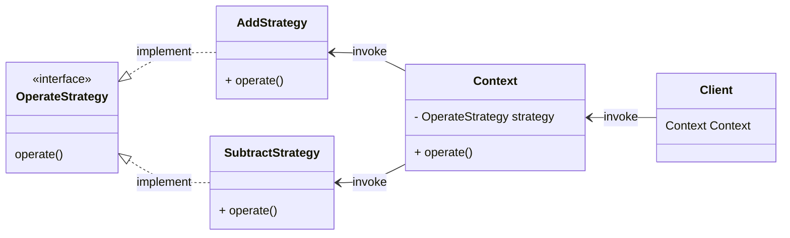

**资源网站**

[设计模式 - 菜鸟教程](https://www.runoob.com/design-pattern/design-pattern-intro.html)

[设计模式 - 动力节点](http://www.bjpowernode.com/shejimoshi/)

# 常用的设计原则

## 软件开发流程

需求分析文档、概要设计文档、详细设计文档、编码和测试、安装和调试、维护和升级

## 常用设计原则

- 开闭原则（Open Close Principle）<br/>对扩展开放对修改关闭，为了使程序的扩展性好，易于维护和升级
- 里氏代换原则（Liskov Substitution Principle）<br/>任何基类可以出现的地方，子类一定可以出现，多使用多态的方式
- 依赖倒转原则（Dependence Inversion Principle）<br/>尽量多依赖于抽象类或接口而不是具体实现类，因为对子类具有强制性和规范性
- 接口隔离原则（Interface Segregation Principle）<br/>尽量多使用小接口而不是大接口，避免接口的污染，降低类之间耦合度
- 迪米特法则（最少知道原则）（Demeter Principle）<br/>一个模块应当尽量少与其他模块之间发生相互作用，使系统功能模块相对独立<br/>高内聚，低耦合
- 合成复用原则（Composite Reuse Principle）<br/>尽量多使用合成/聚合的方式，而不是继承的方式

**接口隔离原则举例**

```java
// 大接口
public interface Animal {
    void run(); // 描述奔跑行为的抽象方法
    void fly(); // 描述飞行行为的抽象方法
}

// 小接口
public interface RunAnimal {
    void run(); // 描述奔跑行为的抽象方法
}
```

此时，如果 Dog 类实现的是大接口 Animal，那么它就必须重写 fly 方法，但是狗不能飞  
所以为了避免接口污染，Dog 类应该实现小接口 RunAnimal

**合成复用原则举例**

```java
public class A {
    public void show() { ... }
}
```

```java
public class B {
    private A a;  // 在类中声明一个类类型的引用

    public B(A a) { this.a = a; }  // 在构造方法里面，用形参初始化

    public void test() { a.show(); }
}
```

可以实现一个类的引用多次被使用，生产者消费者模型运用了该设计原则

---

# 常用设计模式

**概述**：

- 设计模式（Design pattern）是一套被反复使用、多数人知晓的、经过分类编目的、代码设计经验的总结
- 设计模式就是一种用于固定场合的固定套路

**分类**

- 创建型模式：[单例设计模式](#单例设计模式)、[普通工厂模式](#普通工厂模式)、[抽象工厂模式](#抽象工厂模式)...
- 结构型模式：[装饰器模式](#装饰器模式)、[代理模式](#代理模式)...
- 行为型模式：[模板设计模式](#模板设计模式)...

## 单例设计模式

分为：饿汉式 和 懒汉式

单例对象可以作为程序中的存放配置信息的载体，因为它能保证其他对象读到一致的信息

**饿汉式**

推荐该方式

```java
public class Singleton {
    // 创建 Singleton 的一个对象
    private static Singleton obj = new Singleton();  // 饿汉式，一运行就创建对象 推荐
    // 让构造函数为 private，这样该类就不会被实例化
    private Singleton() {}
    // 返回唯一可用的对象，在外部可用 getInstance()来获取实例
    public static Singleton getInstance() {
        return obj;
    }
}
```

**懒汉式**

```java
public class Singleton {
    // 创建 Singleton 的一个对象
    /*volatile*/ private static Singleton instance = null;        // 懒汉式
    
    private Singleton() {}
    
    public static /*synchronized*/ Singleton getInstance() {
        // 判断若没有对象才进入 synchronized；若有对象则直接 return
        if (null == instance) {
            synchronized (Singleton.class) {
                if (null == instance) {              // 懒汉式，需要时才创建
                    instance = new Singleton();
                }
            }
        }
        return instance;
    }
}
```

懒汉式涉及到多线程问题：

当两个线程几乎同时调用了 getInstance 方法时，一个线程先进入方法，判断 null == instance 为真，开始 new 对象（new 对象需要时间），在第一个线程还没有 new 完对象的时候，第二个线程也进入方法，判断 null == instance 也为真，也开始 new 对象。结果就是 getInstance 方法返回了两个不同对象的地址（new 出了两个对象），此时就不符合单例设计模式的要求了

解决方式：

1. 同步方法<br/>给 getInstance 方法加上 synchronized 关键词修饰
2. 同步代码块<br/>只把 new 对象的代码用 synchronized 锁起来
3. **双重检查锁**（Double Check Locking，DCL）<br/>多次检查，若没有对象才进入 synchronized；若有对象则直接 return。这样减少了性能消耗

## 普通工厂模式

**概述**：

提供了一种创建对象的最佳方式  
在创建对象时不会对客户端暴露创建逻辑，并且是通过使用一个共同的接口来指向新创建的对象  
普通工厂方法模式就是建立一个工厂类，对实现了同一接口的不同实现类进行实例的创建

> 比如您要一辆车，可直接去工厂提货，而不用管这辆车是怎么做出来的，以及这个车的具体实现

**类图结构**

<div style="clear:both"></div>


SendFactory 类就是工厂类，produce 方法运用多态，返回 Sender 类型对象指向新创建的对象

**优点**：扩展性和可维护性强，尤其是在需要创建大量对象的前提下

**缺点**：

1. 在普通工厂模式中，若传递的字符串出错，则不能正确创建对象，且可能出现<u>空指针异常</u>
2. 需要新增新类型的对象时，要修改工厂类源码，有违开闭原则

工厂类

```java
public class SendFactory {
    // 自定义成员方法实现对象的创建
    public Sender produce(String type) {
        if ("mail".equals(type)) { return new MailSender(); }
        if ("sms".equals(type)) { return new SmsSender(); }
        return null;  // 如果字符串不匹配，则 new 对象失败，返回 null
    }
}
```

**多个工厂模式**

解决了普通工厂模式可能产生的空指针异常

```java
public class SendFactory {
    // 多个成员方法，避免了空指针异常
    public Sender produceMail() { return new MailSender(); }
    public Sender produceSms() { return new SmsSender(); }
}
```

**静态工厂模式**

不需要创建工厂类的对象，直接调用

```java
public static Sender produceMail() { return new MailSender(); }
public static Sender produceSms() { return new SmsSender(); }
```

## 抽象工厂模式

**概述**：

若用普通工厂模式，之后想创建新类型的对象，这需要修改工厂类的源代码，有违开闭原则  
抽象工厂模式有更好的扩展性，无需修改源代码

<div style="clear:both"></div>

运用了多态的思想，MailSendFactory 和 SmsSendFactory 都是 Provider 工厂的实现类

## 装饰器模式

**概述**：

装饰器模式就是给一个对象动态的增加一些新功能  
创建一个新类，包装原始类，从而在新类中提升原来类的功能  
要求装饰对象和被装饰对象实现同一个接口，装饰对象持有被装饰对象的实例

例：IO 流中的 BufferedInputStream 就是 FileInputStream 的装饰类，它们都继承了 InputStream 接口

**类图结构**

<div style="clear:both"></div>

**优点**：可以实现对一个类功能的扩展  
可以动态的增加功能，而且还能动态撤销（继承不行）  
就是说可以调用扩展了的 Decorator 类的对象，也可以调用原始的 Source 类的对象  
**缺点**：会产生过多相似的对象，不易排错

```java
public interface Sourceable {
    void method();
}
```

```java
public class Source implements Sourceable {
    @Override
    public void method() {
        System.out.println("Source 方法");
    }
}
```

```java
// 装饰类，调用了 Source 的方法，也同时做了扩展
public class Decorator implements Sourceable {
    Sourceable source;
    Decorator (Sourceable source) {
        this.source = source;
    }
    @Override
    public void method() {
        source.method();
        System.out.println("Decorator 扩展 Source 类");
    }
}
```

## 代理模式

**概述**：

代理模式就是找一个代理类替原对象进行一些操作  
类似于添加一个中间层，可以实现在访问一个类时做一些控制

> 比如买火车票不一定在火车站买，也可以去代售点，代售点就相当于代理类

**优点**：若在使用时需要对原有的方法进行改进，可以用代理类调用原有方法，并且对结果进行控制  
使用代理模式，可以将功能划分的更加清晰，有助于后期维护  
**缺点**：因为加了一个中间层，性能难免会有所降低

**代理模式和装饰器模式的区别**

- 装饰器模式通常是将原始对象作为一个参数传给装饰者的构造器  
  而代理模式通常在一个代理类中创建一个被代理类的对象
- 装饰器模式关注于在一个对象上动态的添加方法，然而代理模式关注于控制对对象的访问

这两个模式实现方式一样，只是用途不一样：

- 代理模式的目的在于进行**访问控制**，其意图在于**为被代理对象提供一个替身**，而之所以提供替身而不直接访问的目的是，原有的被代理对象可能不便于被直接访问（是一个远程对象），或者是一个访问权限需要被限制的对象
- 装饰器模式的目的在于进行**功能添加 / 功能增强**，其意图在于为被装饰对象动态地增加功能或属性

**类图结构**

<div style="clear:both"></div>

创建一个 Image 接口和实现了 Image 接口的实体类 RealImage  
ProxyImage 是一个代理类，减少 RealImage 对象加载的内存占用  
ProxyPatternDemo 类使用 ProxyImage 来获取要加载的 Image 对象，并按照需求进行显示

## 模板设计模式

**概述**：

- 定义一个操作中的算法的骨架，而将一些步骤延迟到子类中。模板方法使得子类可以不改变一个算法的结构即可重定义该算法的某些特定步骤
- 多种操作之间有一些通用的方法时，可将这些通用算法抽象到抽象类中实现，其他步骤在子类实现

> 在造房子时，地基、走线、水管都一样，只有在建筑的后期才有加壁橱加栅栏等差异

**类图结构**

<div style="clear:both"></div>

```java
// 模板类
public abstract class Game {
   abstract void initialize();
   abstract void startPlay();
   abstract void endPlay();
   // 模板（相当于一个固定的算法），这个方法不能被继承，可防止被修改
   public final void play(){
      initialize();
      startPlay();
      endPlay();
   }
}
```

```java
public class Cricket extends Game {
   @Override
   void endPlay() { ... }
   @Override
   void initialize() { ... }
   @Override
   void startPlay() { ... }
}

public class Football extends Game { ... }
```

## 策略模式

**概述**：

在策略模式（Strategy Pattern）中，一个类的行为或其算法可以在运行时更改。这种类型的设计模式属于行为型模式

根据不同的使用场景，提供不同的解决方案

> 比如登录行为，可以有密码登录、二维码登录、微信登录...  
> 不同的情况下，调用不同的算法来完成登录操作



```java
// 抽象策略
public interface OperateStrategy {
    // 策略模式的运算法则
    void operate(int i, int j);
}
```

```java
// 具体策略
public class AddStrategy implements Strategy {
    @Override
    public void operate(int i, int j) {
        System.out.println("Add Operation" + (i + j));
    }
}
```

```java
// 具体策略
public class SubtractStrategy implements Strategy {
    @Override
    public void operate(int i, int j) {
        System.out.println("Subtract Operation" + (i - j));
    }
}
```

```java
// 封装所有功能
public class Context {
    // 抽象策略
    private Strategy strategy;

    // 构造函数设置具体策略
    public Context(Strategy strategy) {
        this.strategy = strategy;
    }

    // 封装后的策略方法
    public void operate(int i, int j) {
        this.strategy.operate(int i, int j);
    }
}
```

```java
public class Client {
    public static void main(String[] args) {
        // 声明一个具体的策略，传入 Context
        Context context = new Context(new AddStrategy());
        // 执行封装后的方法
        context.operate(1, 2);
    }
}
```

