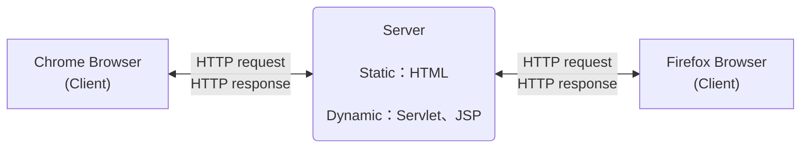
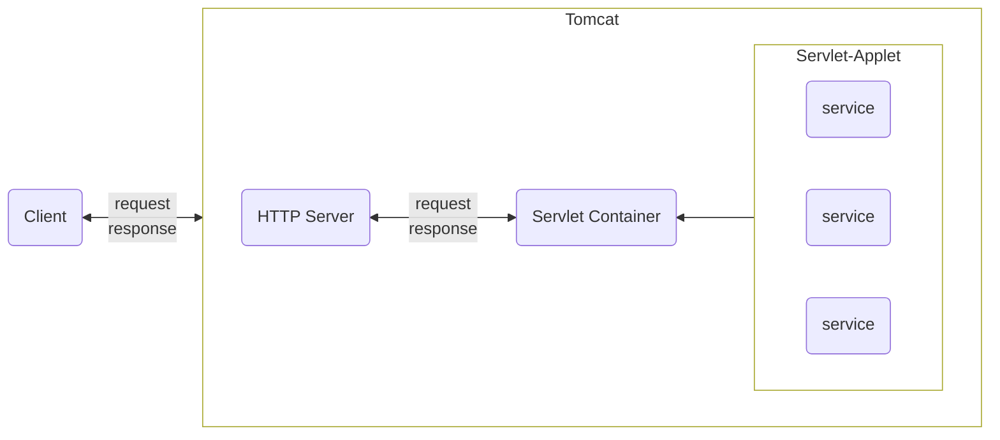
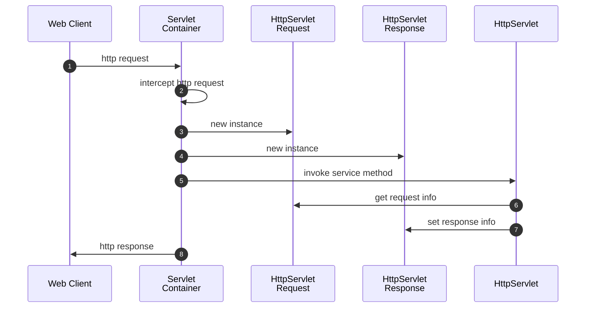
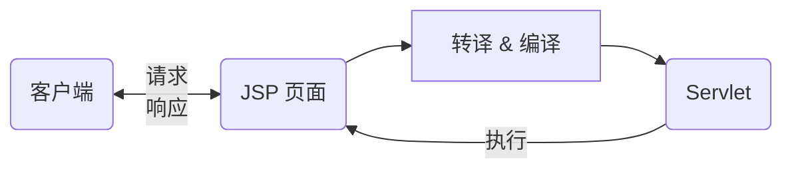
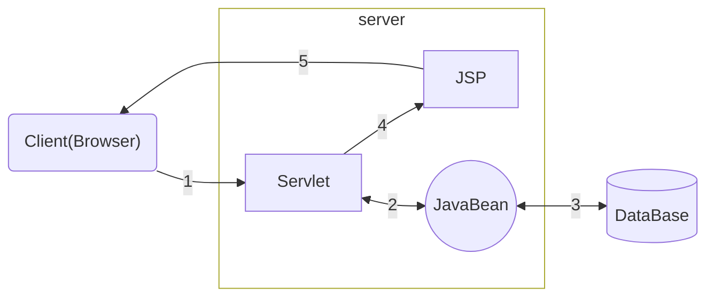
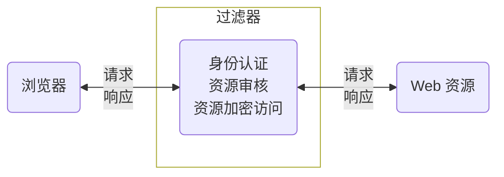
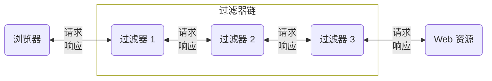

# JavaWeb

## 概念

### C/S 架构的概念

- C/S 架构（Client/Server，客户端/服务器模式），是一种比较早的软件体系结构<br/>该结构将需要处理的业务合理地分配到客户端和服务器端<br/>客户端通常负责完成与用户的交互任务，服务器通常负责数据的管理
- C/S 架构的主要优点：
  - 客户端的界面和功能可以很丰富
  - 应用服务器的负荷较轻
  - 响应速度较快
- C/S 架构的主要缺点：
  - 维护和升级的成本高，所有的客户端都需要更新升级
  - 适用面窄，用户群固定

### B/S 架构的概念

- B/S 架构（Browser/Server，浏览器/服务器模式），是互联网兴起后的软件体系结构<br/>该结构将系统功能实现的主要业务逻辑，集中到服务器端，极少数业务逻辑在浏览器实现<br/>浏览器通常负责完成与用户的交互，服务器通常负责数据的管理
- B/S 架构的主要优点：
  - 无需安装客户端，只要有浏览器即可
  - 通过权限控制实现多客户访问的目的，交互性较强
  - 维护和升级的成本低，无需更新所有客户端版本
  - 适用面广，用户群不固定
- B/S 架构的主要缺点：
  - 应用服务器的负荷较重
  - 浏览器的界面和功能要达到客户端的丰富程度，需要花费大量的成本
  - 不同浏览器、不同窗口适配比较麻烦

### JavaWeb

是用 Java 语言进行动态 Web 资源开发技术的统称，是解决相关 Web 互联网领域的技术总和



静态资源：指 Web 中始终不变的数据  
动态资源：指 Web 中由程序产生的数据，会动态变化

JavaWeb 的三大组件：[Servlet](#Servlet)、[Filter](#Filter)、[Listener](#Listener)

---

## HTTP

### 概述

- HTTP 协议（HyperText Transfer Protocol 超文本传输协议）是由 W3C（万维网联盟）组织制定的一种应用层协议，是用来规范浏览器与 Web 服务器之间如何通讯的数据格式，主要涉及浏览器的发请求格式和服务器的响应格式
- HTTP 协议承载于 TCP 协议之上，HTTPS 协议承载于 TLS 或 SSL 协议层之上
- HTTP 默认的端口号为 80，HTTPS 默认的端口号为 443

在 JavaSE 阶段的 Java 基础笔记中，就提到了网络编程，不过那时学的是用来写 C/S 架构的

<div style="clear:both"></div>

[OSI 七层模型 & TCP/IP 五层模型 简述 - 知乎](https://zhuanlan.zhihu.com/p/143654140)

<table style="width:50rem">
    <thead>
        <tr style="text-align:left">
            <th>层级</th>
            <th>层</th>
            <th>英文全称</th>
            <th>常用协议</th>
        </tr>
    </thead>
    <tbody>
        <tr>
            <td>7</td>
            <td>应用层</td>
            <td>Application Layer</td>
            <td>HTTP、FTP、SMTP、POP3、DNS<br/>Telnet、NNTP、IMAP4、FINGER</td>
        </tr>
        <tr>
            <td>6</td>
            <td>表示层</td>
            <td>Presentation Layer</td>
            <td>LPP、NBSSP</td>
        </tr>
        <tr>
            <td>5</td>
            <td>会话层</td>
            <td>Seesion Layer</td>
            <td>SSL、TLS、DAP、LDAP</td>
        </tr>
        <tr>
            <td>4</td>
            <td>传输层</td>
            <td>Transport Layer</td>
            <td>TCP、UDP</td>
        </tr>
        <tr>
            <td>3</td>
            <td>网络层</td>
            <td>Network Layer</td>
            <td>IP、ICMP、RIP、IGMP、OSPF</td>
        </tr>
        <tr>
            <td>2</td>
            <td>数据链路层</td>
            <td>Data Link Layer</td>
            <td>以太网、网卡、交换机、PPTP、L2TP、ARP、ATMP</td>
        </tr>
        <tr>
            <td>1</td>
            <td>物理层</td>
            <td>Physical Layer</td>
            <td>物理线路、光纤、中继器、集线器、双绞线</td>
        </tr>
    </tbody>
</table>

### HTTP 请求格式

- 客户端发送一个 HTTP 请求到服务器，请求消息主要包括：请求行、请求头、空白行、请求体

  - **请求行**：说明请求类型、请求的路径、所使用的 HTTP 版本  
    格式：请求类型  请求的路径  协议的版本  
    现在协议常用的版本为 1.1
  - **请求头**：说明服务器要使用的一些附加信息  
    格式（key:value）：主机、请求长度、请求的浏览器的相关信息
  - **空白行**：把请求头和请求体分开，看起更直观，即使请求体数据为空也要有空行
  - **请求体**：也叫请求数据，可添加任意其他数据

- HTTP 请求示例：

  ```http
  POST /domeniczzblog/index.html HTTP/1.1
  Host: localhost:8088
  Content-Length: 21
  Cache-Control: max-age=0
  User-Agent: Mozilla/5.0 (Windows NT 6.1; WOW64)
  
  name=domenic&pwd=123456
  ```

  - 请求行：
  
    `POST /domeniczzblog/index.html HTTP/1.1` - 请求了一个 html 页面（静态资源）
  
  - 请求头：
  
    `Host: localhost:8088` - 主机（服务器的 IP 地址和端口号）  
    `Content-Length: 21` - 请求长度  
    `Cache-Control: max-age=0` - 缓存控制（有效期）  
    `User-Agent: Mozilla/5.0 (Windows NT 6.1; WOW64)` - 用户代理
  
  - 请求体：
  
    `name=domenic\&pwd=123456` - 请求数据

POST 请求的三种数据提交格式

<table style="width:60rem">
    <thead>
        <tr style="text-align:left">
            <th>格式</th>
            <th>说明</th>
        </tr>
    </thead>
    <tbody>
        <tr>
            <td>Content-Type: application/x-www-form-urlencoded</td>
            <td>请求体中的数据，以普通表单形式（键值对）发送到后端</td>
        </tr>
        <tr>
            <td>Content-Type: application/json</td>
            <td>请求体中的数据，以 JSON 字符串的形式发送到后端</td>
        </tr>
        <tr>
            <td>Content-Type: multipart/form-data</td>
            <td>多部件上传，既可以上传键值对，也可以上传文件</td>
        </tr>
    </tbody>
</table>

### HTTP 响应格式

- 服务器接收并处理客户端请求后，返回一个 HTTP 响应消息，主要包括：响应行、响应头、空白行、响应体

  - **响应行**：说明 HTTP 协议版本号、状态码、状态消息  
    格式：协议版本 状态码 状态信息  
    200 - 成功，404 - 路径错误，500 - 服务器错误
  - **响应头**：说明客户端要使用的一些附加信息，格式（key:value）
  - **空白行**：把响应头和响应体分开，看起更直观，即使响应体数据为空也要有空行
  - **响应体**：服务器返回给客户端的文本信息

- HTTP 响应示例：

  ```http
  HTTP/1.1 200 OK
  Content-Type: text/html
  Content-Length: 588
  Date: Thu, 11 Nov 2022 11:11:11 GMT
  
  <html><head><title>示例 1</title></head>
  <body><h1>这是一个 HTML 页面</h1></body>
  </html>
  ```

  - 响应行：
  
    `HTTP/1.1 200 OK`
  
  - 响应体：
  
    `Content-Type: text/html` - 内容类型  
    `Content-Length: 588` - 内容长度  
    `Date: Thu, 11 Nov 2022 11:11:11 GMT` - 日期
  
  - 响应体：一个 html 文件（静态资源）

---

## Tomcat

### 概述

- Tomcat 最初由 Sun 公司的软件架构师詹姆斯·邓肯·戴维森开发，后来由 Sun 公司贡献给 Apache 软件基金会
- Tomcat 服务器是一个开源的轻量级 Web 应用服务器，在中小型系统和并发量小的场合下被普遍使用，是开发和调试 Servlet、JSP 程序的首选

下载地址：https://tomcat.apache.org/  
若不想下载最新版，可以在 Quick Navigation 中点击 Achieves 选择所有历史版本  
可以直接下载压缩版，无需安装，解压之后放入一个目录（不要中文路径）  
本笔记使用 Tomcat-8.5.78 压缩版

<table style="width:50rem">
    <thead>
        <tr style="text-align:left">
            <th>目录</th>
            <th>说明</th>
        </tr>
    </thead>
    <tbody>
        <tr>
            <td>/bin</td>
            <td>存放各种平台下用于启动和停止 Tomcat 的脚本文件</td>
        </tr>
        <tr>
            <td>/conf</td>
            <td>存放 Tomcat 服务器的各种配置文件</td>
        </tr>
        <tr>
            <td>/lib</td>
            <td>存放 Tomcat 服务所需的各种 jar 包</td>
        </tr>
        <tr>
            <td>/logs</td>
            <td>存放 Tomcat 在运行中产生的日志文件</td>
        </tr>
        <tr>
            <td>/temp</td>
            <td>存放 Tomcat 在运行中产生的临时文件</td>
        </tr>
        <tr>
            <td>/wabapps</td>
            <td>存放应用程序，当 Tomcat 启动时会去加载该目录下的应用程序<br/>当发布 Web 应用时，默认情况下会将 Web 应用的文件存放于此目录中</td>
        </tr>
        <tr>
            <td>/work</td>
            <td>存放 tomcat 在运行时的编译后文件，例如 JSP 编译后的文件</td>
        </tr>
    </tbody>
</table>

**Web 容器的作用**：

Tomcat，Jetty，Undertow 等包含了 HTTP 服务器和 Servlet 容器的功能，称为 Web 容器

客户端发送 HTTP 请求，服务端要根据 HTTP 请求调用不同的业务逻辑来响应，但业务代码不能与 HTTP 服务器耦合  
此时就需要一层**抽象**，将 HTTP 解析和具体的业务隔离  
HTTP 解析的抽象规定一个接口，所有的业务类都实现这个接口

- **Server Applet**（全称 Java Servlet）是指用 Java 编写的服务端程序，指代实现 Servlet 接口的业务类
- 将请求和 Servlet 间的对应关系，抽象出来，成了 **web.xml**，程序员在配置中告诉 Servlet 容器对应关系即可
- 业务实现，其实就是 **war** 包，这就是业务和 Servlet 容器的解耦



### 使用

#### 启动和关闭

- **启动**
  使用 bin 目录下的批处理文件 startup.bat 来启动 Tomcat 服务器  
  若提示：Server startup in ... ms，这表示启动成功  
  启动之后，不要关闭命令行窗口  
  进入浏览器，访问：<a>http://localhost:8080/</a>，若正确打开 Tomcat 页面，则启动成功
  
- **关闭**
  使用 bin 目录下的批处理文件 shutdown.bat 来关闭 Tomcat 服务器

- **注意**
  启动之前首先安装 JDK 并配置环境变量 JAVA_HOME，若希望 Tomcat 服务器可以在任意路径启动，则需要配置环境变量

  - 在系统环境变量中添加：CATALINA_HOME  
    值为 Tomcat 安装路径（如：D:\Program\apache-tomcat-8.5.78）
  
  - 在 path 中添加 %CATALINA_HOME%\bin
  
    若提示：Neither the JAVA_HOME nor the JRE_HOME environment variable is defined  
    表示没有配置 JAVA_HOME 这个环境变量  
    注意：环境变量名必须为 JAVA_HOME
  
  - 可将其注册到 windows 服务中，就能配置开机自启、后台启动了（可选）  
    安装服务：service install，卸载服务：service remove
  
  - 执行命令行 catalina version，若打印出版本信息，则配置成功  
    可以直接在命令行执行 startup.bat 来启动 tomcat
  
  **启动信息乱码**<br/>windows 命令行的编码方式默认和系统的一致，中国是 GBK，而 Tomcat 的日志编码是 UTF-8  
  可以执行 chcp 命令查看命令行编码，GBK 的代码为 936，UTF-8 的代码为 65001
  
  处理方式：/conf/logging.properties 文件修改  
  java.util.logging.ConsoleHandler.encoding = GBK

#### 问题

##### Tomcat 无法启动

1. 端口被占用

   使用以下命令查看端口使用情况

   ```bash
   netstat -nao
   # 检测指定端口，如 8080
   netstat -nao | findstr 8080
   ```

   若端口被其他程序占用了，可以结束该进程，或去 /conf/server.xml 中更改 Tomcat 的默认端口

2. Tomcat 的运行需要 JVM 的支持  
   startup.bat 启动时，会检测有无配 JAVA_HOME 环境变量  
   若没有，启动时命令行窗口只会闪一下，可以开启 DOS 窗口，把 startup.bat 拖进去，回车运行即可看到报错信息

   > 若不允许更改环境变量  
   > 可以在 startup.bat 中设置环境变量，如：set JAVA_HOME=C:\Program Files\Java\jdk-11.0.13

3. Tomcat 启动时还需要环境变量 CATALINA_HOME  
   这个环境变量指的是 Tomcat 服务器所在目录，启动 startup.bat 时，startup.bat 就自己设了 CATALINA_HOME 这个环境变量
   
   若系统环境变量没有配置 CATALINA_HOM，那么双击哪个 Tomcat 中的 startup.bat 就启动哪台服务器，反之，启动的是系统环境变量 CATALINA_HOM 中指向的 Tomcat 服务器

#### 配置文件

- **修改默认端口**

  平常访问网站无需填写端口号，是因为这些网站采用了默认端口：HTTP 为 80，HTTPS 为 443  
  我们也能通过：<a>http://www.baidu.com:80</a> 或 <a>https://www.baidu.com:443</a> 访问百度
  
  可以选择修改 Tomcat 默认端口到 80  
  /conf/server.xml 文件修改 port 属性值
  
  ```xml
  <Connector port="8080" protocol="HTTP/1.1"
             connectionTimeout="20000"
             redirectPort="8443" />
  ```
  
  - **port**
    端口号，默认配置为 8080
  - **protocol**
    Tomcat 服务器使用的协议，默认配置为 HTTP 协议，HTTP 协议版本为 1.1
  - **connectionTimeout**
    访问 Tomcat 时，连接的超时时间，默认配置为 20000 毫秒
  - **redirectPort**
    重定向端口，默认配置为 8443，主要是针对于访问 Tomcat 服务器上的资源时，如果该资源需要使用 HTTPS 访问，此时，Tomcat 会将这个请求重定向到 8443 端口
  
- **配置管理 Tomcat 服务器的用户与权限**

  /conf/tomcat-users.xml 文件修改

  ```xml
  <role rolename="manager-gui"/>
  <user username="admin" password="123456" roles="manager-gui"/>
  ```

  The available roles are:

  - ***manager-gui*** - Access to the HTML interface
  - ***manager-status*** - Access to the "Server Status" page only
  - ***manager-script*** - Access to the tools-friendly plain text interface that is described in this document, and to the "Server Status" page
  - ***manager-jmx*** - Access to JMX proxy interface and to the "Server Status" page

- **web.xml**

  - 会话超时配置（在大概第 627 行）：

    ```xml
    <session-config>
        <!--这里的单位是分钟-->
        <session-timeout>30</session-timeout>
    </session-config>
    ```

    会话：用户访问 Tomcat 服务器的有效时间  
    比如，当用户登录某网站后，30 分钟内，没有进行任何操作，此时，用户与该网站的会话会超时，若再进行页面操作，那么服务器将提示用户重新登录
  
  - 欢迎页配置（在文件最底部）：
  
    ```xml
    <welcome-file-list>
        <welcome-file>index.html</welcome-file>
        <welcome-file>index.htm</welcome-file>
        <welcome-file>index.jsp</welcome-file>
    </welcome-file-list>
    ```
  
    欢迎页：是当用户访问 Tomcat 服务器资源时，没有对任何资源进行定位，此时，Tomcat 将使用配置的欢迎页进行展示  
    比如：<a>http://localhost/myapps</a>，默认访问 myapps 下的 index.html 或 index.htm 或 index.jsp

#### 访问

资源默认存放路径为 /webapps

若直接访问 <a>http://localhost</a>，则默认进入 /ROOT，访问 index.jsp

在 /webapps 下新建文件夹 myapps，并添加 index.html

浏览器访问 <a>http://localhost/myapps</a>，即可显示 index.html 的内容（默认访问 index.html）

#### 虚拟路径

在任意地址，如 D:\Repository\apps 下放置资源文件 index.html

修改 Tomcat 配置文件 /conf/server.xml

```xml
<Host name="localhost"  appBase="webapps"
      unpackWARs="true" autoDeploy="true">
  <Valve className="org.apache.catalina.valves.AccessLogValve" directory="logs"
         prefix="localhost_access_log" suffix=".txt"
         pattern="%h %l %u %t &quot;%r&quot; %s %b" />
</Host>
```

在 \<Host\> 标签中添加：

```xml
<Context path="/virtual" docBase="D:/Repository/apps"/>
```

相当于把 D:/Repository/apps 映射到虚拟路径 /virtual

浏览器访问：<a>http://localhost/virtual</a> 即可打开 index.html

---

## IDEA - JavaWeb

### 创建 JavaWeb 项目

| 使用的工具    | 版本     |
| ------------- | -------- |
| Java          | 11.0.13  |
| Tomcat        | 8.5.78   |
| Maven         | 3.6.3    |
| IntelliJ IDEA | 2021.1.3 |

新建模块或者工程

<div style="clear:both"></div>

配置 Application Server 为 Tomcat 服务器  
配置 Project Template 为 Web Application  
其他选项按需选择  
点击 next -> next -> finish

新项目的结构（Maven 项目结构）：

```ASCII
demo-start
├── src
│   ├── main
│   │   ├── java
│   │   ├── resources
|   |   └── webapp        ← 存放资源文件
|   |       ├── WEB-INF
|   |       |   └── web.xml
|   |       └── index.jsp
│   └── test
│       ├── java
│       └── resources
└── pom.xml
```

### 配置 Tomcat 服务器

Run -> Edit Configurations

<div style="clear:both"></div>

建议将配置名称改成和模块名相同，方便管理  
可以更改默认启动的浏览器和 URL

<div style="clear:both"></div>

可以更改 Application Context，就是资源的访问路径（与 URL 对应）

IDEA 部署项目的两种方式：

<div style="clear:both"></div>

- war 模式：发布模式，将 web 项目打包成 war 包，再上传到服务器（如 tomcat 的 webapps 目录中），不支持热部署
- war exploded 模式：开发模式，只是目录的映射，部署在 Maven 项目的 target 目录下（相当于 tomcat 在项目源文件夹中启动）。该模式没有将项目打包为 war 包，因此支持热部署

### 运行项目

注意：在 Idea 中启动项目之前，要先关闭控制台中启动的 Tomcat 服务器，防止冲突

按 Shift + F10 就可以启动  
IDEA 会自动连接服务器，自动部署并且在默认浏览器中启动项目

> **注意**：  
> 若更改代码后，运行发现不起作用，可重新部署（Redeploy）或者重启服务器（Restart server）  
> 若还是无效，可检查 target 中的编译结果有无更改，可执行 Maven 的 clean 命令后再编译部署

按 Ctrl + F2 就可以关闭项目

### 前端乱码

#### 1. 设置 IDEA

IDEA 安装目录下的 bin 文件夹下，修改 idea64.exe.vmoptions

在末尾添加：

```properties
-Dfile.encoding=UTF-8
```

修改 IDEA 的设置：File -> Settings -> Editor -> File Encodings

<div style="clear:both"></div>

#### 2. 设置 Tomcat

Tomcat 安装目录下的 conf 文件夹下，修改 web.xml 和 server.xml

web.xml，在 \<servlet\> 标签下，添加如下配置：

```xml
<init-param>
    <param-name>fileEncoding</param-name>
    <param-value>UTF-8</param-value>
</init-param>
```

server.xml，修改 \<Connector\> 标签的属性：

```xml
<Connector port="8080" protocol="HTTP/1.1"
               connectionTimeout="20000"
               redirectPort="8443" URIEncoding="UTF-8" />
```

#### 3. 修改 HTML

在 \<meta\> 标签中加入 charset=UTF-8：

```html
<meta http-equiv="Content-Type" content="text/html; charset=UTF-8">
```

#### 4. 清除浏览器缓存

清除浏览数据：

1. 缓存的图片和文件
2. Cookie 及其他网站数据（只需清除对应网站的数据）

---

## Servlet

### 导入

Servlet API 文档：https://tomcat.apache.org/tomcat-8.5-doc/servletapi/index.html

Maven 项目导入 servlet-api

pom.xml

```xml
<dependency>
    <groupId>javax.servlet</groupId>
    <artifactId>javax.servlet-api</artifactId>
    <version>4.0.1</version>
    <!-- 作用域必须为 provided -->
    <scope>provided</scope>
</dependency>
```

> **注意**：在编写 servlet 时，HttpServletRequest、HttpServletResponse 等对象的是由 servlet-api 提供的，不导入 servlet-api 就无法获取相应对象。但在运行时，tomcat 自带了 servlet-api，为防止冲突，在配置 pom.xml 时，需设置 servlet-api 作用域为 provided，指该依赖不进行打包。<u>在运行时使用 tomcat 中的 servlet-api，在编译时使用依赖的 servlet-api</u>

---

### 前端交互

**概述**：

- Servlet（Server Applet）是 Java Servlet 的简称，称为小服务程序或服务连接器，是 Java 语言编写的**服务器端程序**
- 是作为来自 Web 浏览器或其他 HTTP 客户端的 **请求** 和 HTTP 服务器上的 **数据库或应用程序** 的 **中间层**
- Servlet 用来完成 B/S 架构下客户端请求的响应处理，也就是交互式地浏览和生成数据，生成动态 Web 内容

#### 编写步骤

1. 建立一个 Java Web Application 项目并配置 Tomcat 服务器

2. 创建一个 Servlet，三种方式：

   - 实现 [Servlet 接口](#Servlet%20接口)
   - 继承 [GenericServlet 类](#GenericServlet%20类)
   - 继承 [HttpServlet 类](#HttpServlet%20类)（推荐）

   在/main/java 下创建包，并且创建 java 文件：HelloServlet.java

   ```java
   public class HelloServlet extends HttpServlet {
       private String message;
   
       @Override
       public void init() {
           message = "My First Servlet App";
       }
   
       @Override
       public void service(HttpServletRequest request, 
                           HttpServletResponse response) throws IOException {
           response.setContentType("text/html");
   
           PrintWriter out = response.getWriter();
           out.println("<html><body>");
           out.println("<h3>" + message + "</h3>");
           out.println("</body></html>");
           
           System.out.println("用 HttpServlet 方式创建 Servlet");
       }
   }
   ```

3. 配置/webapp/WEB-INF/web.xml

   使得浏览器可以访问到 HelloServlet.java 文件

   ```xml
   <!-- Servlet 配置 -->
   <servlet>
       <!-- 给 Servlet 起别名，一般与类名相同 -->
       <servlet-name>HelloServlet</servlet-name>
       <!-- 指定别名对应的 Servlet 类 -->
       <servlet-class>com.domenic.demo_start.HelloServlet</servlet-class>
   </servlet>
   
   <!-- 进行 Servlet 的映射配置 -->
   <servlet-mapping>
       <!-- 此处名称要求和上方别名保持一致 -->
       <servlet-name>HelloServlet</servlet-name>
       <!-- 配置浏览器的访问地址 -->
       <url-pattern>/hello</url-pattern>
   </servlet-mapping>
   ```

   设置初始化参数：在[ServletConfig 接口](#ServletConfig 接口)处有说明
   
   > **注意**：每次修改配置文件后，都需要<u>重启服务器</u>（Restart server）

4. 运行项目

   浏览器访问：http://localhost/demo_start/hello

   页面显示结果：

   <h3>My First Servlet App</h3>

**IDEA 快速创建 Servlet**

直接右键，新建 Servlet

<div style="clear:both"></div>
Name 就是该 Servlet 的别名，Class 就是类名<br/>勾选 Creat JavaEE 6+ annotated class，表示用注解而非配置文件的方式来描述部署

自动创建的 Java 文件：

```java
// name 相当于 web.xml 配置文件中的别名 servlet-name
// value 和 urlPatterns 都可以用来定义访问的 url
@WebServlet(name = "HelloServlet2", value = "/Hello2")
public class HelloServlet2 extends HttpServlet {
    @Override
    protected void doGet(HttpServletRequest request, HttpServletResponse response) {}
    @Override
    protected void doPost(HttpServletRequest request, HttpServletResponse response) {}
}
```

浏览器输入：http://localhost/demo_start/Hello2 可以访问

> - GET：<br/>提交时，传输数据量少，4KB 左右（传递普通文字信息，传递照片会失败）<br/>明文提交（请求参数会拼接在 URL 后面）
> - POST：<br/>提交时，传输数据量大，大小无限制（传递文字和图片都行）<br/>密文提交（URL 不会显示提交的数据，浏览器会将数据放到 HTTP 请求协议的请求体中）
>
> <u>在开发中</u>，POST 请求使用较多，因此可以把大部分业务逻辑写在 doPost 方法中<br/>doGet 方法中可以调用 doPost 方法
>
> ```java
> protected void doPost(HttpServletRequest request, HttpServletResponse response) {
>     ...
>     this.doPost(request, response);
> }
> ```

#### web.xml

该配置文件，主要用来配置 Servlet、Filter、Listener 等

三者的执行顺序：Listener --> Filter --> Servlet

**web.xml 的加载顺序**：

ServletContext -> context-param（无顺序）-> listener（无顺序）-> filter（配置顺序）-> servlet（load-on-startup 优先级）

详细加载过程：

- 启动一个 web 项目，web 容器会读取它的配置文件 web.xml，先读取 \<context-param> 和 \<listener>

- 创建一个 ServletContext（Servlet 上下文），此 web 项目的所有部分都将共享这个上下文

- 容器将 \<context-param> 转换为键值对，并交给 ServletContext

- 容器创建监听器 Listener 实例

- 触发 contextInitialized 方法，监听器被调用

  > 当 Servlet 容器启动或终止 web 应用时，会触发 ServletContextEvent 事件，该事件由 ServletContextListener 接口来处理。在 ServletContextListener 中定义了处理 ServletContextEvent 事件的两个方法 contextInitialized、contextDestroyed
  >
  > Tip：SpringMVC 有一个监听器 ContextLoaderListener，实现了 ServletContextListener 接口

- 调用完 contextInitialized 方法后，容器再初始化过滤器 filter

- 之后，容器对指定 load-on-startup 值为正数的 Servlet 进行初始化（优先级 1,2,3... 递减）；值为负数或未指定，则在该 Servlet 被调用时初始化

**常用配置**：

- **\<context-param>**

  ```xml
  <context-param>
      <param-name>contextConfigLocation</param-name>
      <param-value>classpath:applicationContext.xml</param-value>
  </context-param>
  ```
  
- **\<filter>**

  ```xml
  <filter>
      <filter-name>CharacterEncodingFilter</filter-name>
      <filter-class>org.springframework.web.filter.CharacterEncodingFilter</filter-class>
      <init-param>
          <param-name>encoding</param-name>
          <param-value>UTF-8</param-value>
      </init-param>
      <init-param>
          <param-name>forceEncoding</param-name>
          <param-value>true</param-value>
      </init-param>
  </filter>
  <filter-mapping>
      <filter-name>CharacterEncodingFilter</filter-name>
      <url-pattern>/*</url-pattern>
  </filter-mapping>
  ```

- **\<listerner>**

  ```xml
  <listener>
      <listener-class>org.springframework.web.context.ContextLoaderListener</listener-class>
  </listener>
  ```
  
- **\<servlet>**

  ```xml
  <servlet>
      <servlet-name>SpringMVC</servlet-name>
      <servlet-class>org.springframework.web.servlet.DispatcherServlet</servlet-class>
      <init-param>
          <param-name>contextConfigLocation</param-name>
          <param-value>classpath:springmvc.xml</param-value>
      </init-param>
      <load-on-startup>1</load-on-startup>
  </servlet>
  <servlet-mapping>
      <servlet-name>SpringMVC</servlet-name>
      <!-- 默认映射路径 -->
      <url-pattern>/</url-pattern>
  </servlet-mapping>
  ```

  ***url-pattern*** - 匹配访问路径

  - `/*` 会匹配所有路径<br/>会覆盖所有其他 servlet，包括 servletcontainer 提供的所有 servlet，如默认 servlet 和 JSP servlet<br/>因此 `/*` 通常值使用在 Filter 上
  - `/` 只覆盖 servletcontainer 的内置默认 servlet<br/>这通常只在<u>静态资源</u>（如 HTML,CSS,JS,image,etc）和<u>目录列表</u>（如 /login）上调用<br/>\*.jsp 不会被命中，因为 servletcontainer 内置的 JSP servlet 会被调用，它映射了具体的 URL 模式 \*.jsp

- **\<session-config>**

  ```xml
  <session-config>
      <!-- 单位为分钟，默认 30 分钟 -->
      <session-timeout>120</session-timeout>
  </session-config>
  ```
  
- **\<welcome-file-list>**

  ```xml
  <welcome-file-list>
      <welcome-file>index.jsp</welcome-file>
      <welcome-file>index.html</welcome-file>
      <welcome-file>index.htm</welcome-file>
  </welcome-file-list>
  ```

**\<context-param> 和 \<init-param> 的区别**：

- \<context-param> 是 application 范围内的初始化参数，用于向 servlet-context 提供键值对，即应用程序的 上下文信息、listener、filter 等初始化时要用到的信息
- \<init-param> 是 servlet 范围内的参数，只能在 servlet 类的 init() 方法中获取到

#### [Servlet 接口](https://tomcat.apache.org/tomcat-8.5-doc/servletapi/javax/servlet/Servlet.html)

**概述**：javax.servlet.Servlet 接口，定义所有 servlet 必须实现的方法

**方法**

| 方法声明                                              | 功能                                                         |
| ----------------------------------------------------- | ------------------------------------------------------------ |
| void init(ServletConfig config)                       | 由 servlet 容器调用，以向 servlet 指示 servlet 正在投入使用  |
| void service(ServletRequest req, ServletResponse res) | 由 servlet 容器调用，以允许 servlet 响应请求                 |
| ServletConfig getServletConfig()                      | 返回 ServletConfig 对象，该对象包含此 servlet 的初始化和启动参数 |
| String getServletInfo()                               | 返回有关 servlet 的信息，如作者、版本、版权                  |
| void destroy()                                        | 由 servlet 容器调用，以向 servlet 指示该 servlet 正在退出服务 |

#### [GenericServlet 类](https://tomcat.apache.org/tomcat-8.5-doc/servletapi/javax/servlet/GenericServlet.html)

**概述**：

- javax.servlet.GenericServlet 类，用于定义一个通用、与协议无关的 servlet，该类实现了 Servlet 接口
- 继承后，编写通用 servlet，只需重写 service 抽象方法即可

**常用方法**

| 方法声明                                                     | 功能                                         |
| ------------------------------------------------------------ | -------------------------------------------- |
| abstract void service(ServletRequest req, ServletResponse res) | 由 servlet 容器调用，以允许 servlet 响应请求 |

#### [HttpServlet 类](https://tomcat.apache.org/tomcat-8.5-doc/servletapi/javax/servlet/http/HttpServlet.html)

**概述**：

- javax.servlet.http.HttpServlet 类，是个抽象类，并继承了 GenericServlet 类
- 用于创建适用于网站的 HTTP Servlet，该类的子类必须至少重写一个方法

**常用方法**

| 方法声明                                                     | 功能                                    |
| ------------------------------------------------------------ | --------------------------------------- |
| void init()                                                  | 进行初始化操作                          |
| void service(HttpServletRequest req, HttpServletResponse resp) | 根据请求决定调用 doGet 还是 doPost 方法 |
| void doGet(HttpServletRequest req, HttpServletResponse resp) | 处理客户端的 GET 请求                   |
| void doPost(HttpServletRequest req, HttpServletResponse resp) | 处理客户端的 POST 请求                  |
| void destroy()                                               | 删除实例时释放资源                      |

#### 核心 API

##### [ServletRequest 接口](https://tomcat.apache.org/tomcat-8.5-doc/servletapi/javax/servlet/ServletRequest.html)

**概述**：

- javax.servlet.ServletRequest 接口主要用于向 servlet 提供客户端请求信息，可以从中获取到任何请求信息
- Servlet 容器将 Web Client 的请求信息封装到一个 ServletRequest 对象中，并将其作为参数传递给 Servlet 的 service 方法

**常用方法**

| 方法声明                                 | 功能                                                         |
| ---------------------------------------- | ------------------------------------------------------------ |
| String getParameter(String name)         | 以字符串形式返回请求参数的值，若该参数不存在，则返回空值     |
| String[] getParameterValues(String name) | 返回一个字符串对象数组，其中包含给定请求参数所具有的所有值<br/>若该参数不存在，则返回空值<br/>如：id=1\&id=2\&id=3，获取所有 id 的值 |
| Enumeration\<String> getParameterNames() | 返回包含此请求中包含的参数名称的字符串对象的枚举<br/>若请求没有参数，则方法返回空枚举 |
| Map<String, String[]> getParameterMap()  | 返回请求参数的键值对（Map 集合），一个键可对应多个值         |
| String getRemoteAddr()                   | 返回发送请求的客户端或最后一个代理的 IP 地址                 |
| int getRemotePort()                      | 返回发送请求的客户端或最后一个代理的端口号                   |

##### [HttpServletRequest 接口](https://tomcat.apache.org/tomcat-8.5-doc/servletapi/javax/servlet/http/HttpServletRequest.html)

**概述**：

- javax.servlet.http.HttpServletRequest 接口，是 ServletRequest 接口的子接口，用于提供 HTTP 请求信息的功能
- 不同于表单数据，在发送 HTTP 请求时，HTTP 请求头直接由浏览器设置
- 可直接通过 HttpServletRequest 对象提供的一系列 get 方法获取请求头数据

| 方法声明                     | 功能                                                         |
| ---------------------------- | ------------------------------------------------------------ |
| String getRequestURI()       | 返回此请求的 资源路径信息                                    |
| StringBuffer getRequestURL() | 返回此请求的 完整路径信息                                    |
| String getMethod()           | 返回发出此请求的 HTTP 方法的名称，如 GET、POST               |
| String getQueryString()      | 返回路径后面请求中附带的参数<br/>GET 方式会有这种参数，POST 没有 |
| String getServletPath()      | 返回此请求中调用 servlet 的路径部分                          |
| String getContextPath()      | 返回请求 URI 中表示请求上下文的部分                          |

- ServletPath：Servlet 路径，也就是当前 Servlet Java 代码文件的路径
- ContextPath：Web 项目根目录（能够与“url-pattern”中匹配的路径，后面不跟‘/’）
- RealPath：绝对路径，如 http://<span></span>localhost/servlet_project/domenic/login
- RequestURI：资源路径，如 /servlet_project/domenic/login

##### [ServletResponse 接口](https://tomcat.apache.org/tomcat-8.5-doc/servletapi/javax/servlet/ServletResponse.html)

**概述**：

- javax.servlet.ServletResponse 接口，把响应的信息打包成一个对象
- Servlet 容器创建 ServletResponse 对象，并将其作为参数传递给 servlet 的 service 方法

**常用方法**

| 方法声明                             | 功能                                                         |
| ------------------------------------ | ------------------------------------------------------------ |
| PrintWriter getWriter()              | 返回可向客户端发送字符文本的[PrintWriter](https://docs.oracle.com/en/java/javase/11/docs/api/java.base/java/io/PrintWriter.html)对象 |
| String getCharacterEncoding()        | 获取响应内容的编码方式                                       |
| setCharacterEncoding(String charset) | 设置发送到客户端的响应的字符编码，如：UTF-8                  |
| void setContentType(String type)     | 若尚未提交响应，则设置发送到客户端响应的内容类型<br/>内容类型可以包括字符编码规范，如 text/html;charset=UTF-8 |

##### [HttpServletResponse 接口](https://tomcat.apache.org/tomcat-8.5-doc/servletapi/javax/servlet/http/HttpServletResponse.html)

**概述**：

- javax.servlet.http.HttpServletResponse 接口，继承自 ServletResponse 接口
- 在发送响应时，提供特定于 HTTP 的功能

**常用方法**

| 方法声明                           | 功能                                                       |
| ---------------------------------- | ---------------------------------------------------------- |
| void sendRedirect(String location) | 使用指定的[重定向](#重定向)URL，向客户端发送临时重定向响应 |

##### 使用示例

网页资源文件 param.html

```html
<!DOCTYPE html>
<html lang="en">
<head>
    <meta charset="UTF-8">
    <title>请求参数的获取和测试</title>
</head>
<body>
    <form action="parameter" method="post">
        姓名：<input type="text" name="name"/><br/>
        年龄：<input type="text" name="age"/><br/>
        爱好：<input type="checkbox" name="hobby" value="Java"/>Java
              <input type="checkbox" name="hobby" value="C"/>C
              <input type="checkbox" name="hobby" value="C++"/>C++<br/>
        <input type="submit" value="提交"/>
    </form>
</body>
</html>
```

Servlet 类 ParameterServlet.java（在 main/java/...下）

###### 获取表单提交的数据

- 获取所有参数的名称
- 获取指定参数名称对应的参数值（两种方式）

```java
@WebServlet(name = "ParameterServlet", value = "/parameter")
public class ParameterServlet extends HttpServlet {
    protected void doPost(HttpServletRequest request, 
                          HttpServletResponse response) throws IOException {
        
        // 1.获取所有的参数名
        Enumeration<String> parameterNames = request.getParameterNames();
        System.out.print("获取到的所有参数名称为：");
        // 遍历打印
        while (parameterNames.hasMoreElements()) {
            System.out.print(parameterNames.nextElement() + " ");
        }
        System.out.println();
        
        System.out.println("-------------------------------------");
        
        // 2.获取指定参数名对应的参数值并打印
        String name = request.getParameter("name");
        System.out.println("获取到的姓名为：" + name);
        String[] hobbies = request.getParameterValues("hobby");
        System.out.print("获取到的爱好有：");
        for (String ts : hobbies) {
            System.out.print(ts + " ");
        }
        System.out.println();
        
        System.out.println("-------------------------------------");
        
        // 3.获取请求参数名和对应值的 第二种方式
        Map<String, String[]> parameterMap = request.getParameterMap();
        // 使用 Map 集合中所有的键值对组成 Set 集合
        Set<Map.Entry<String, String[]>> entries = parameterMap.entrySet();
        // 遍历 Set 集合
        for (Map.Entry<String, String[]> me : entries) {
            System.out.print(me.getKey() + "对应的数值有：");
            for (String ts : me.getValue()) {
                System.out.print(ts + " ");
            }
            System.out.println();
        }
    }
    protected void doGet(HttpServletRequest request, 
                         HttpServletResponse response) throws IOException {
        // doGet 方法中调用 doPost 方法，处理逻辑都写在 doPost 中
        this.doPost(request, response);
    }
}
```

浏览器访问：http://localhost/demo_start/param.html 输入数据并提交<br/>服务器的控制台会打印出获取到的表单数据

###### 获取请求的其它信息

```java
// ServletRequest 接口 中的方法
System.out.println("发送请求的客户端 IP 地址为：" + request.getRemoteAddr());
System.out.println("发送请求的客户端端口号为：" + request.getRemotePort());
// HttpServletRequest 接口 中的方法
System.out.println("请求资源的路径为：" + request.getRequestURI());
System.out.println("请求资源的完整路径为：" + request.getRequestURL());
System.out.println("请求方式为：" + request.getMethod());
System.out.println("请求的附带参数为：" + request.getQueryString());
System.out.println("请求的 Servlet 路径为：" + request.getServletPath());

/*
输出结果：
发送请求的客户端 IP 地址为：0:0:0:0:0:0:0:1
发送请求的客户端端口号为：58083
请求资源的路径为：/demo_start/parameter
请求资源的完整路径为：http://localhost/demo_start/parameter
请求方式为：POST
请求的附带参数为：null
请求的 Servlet 路径为：/parameter

若表单的请求方式为 GET：
请求方式为：GET
那么请求的附带参数为：name=domenic&age=18&hobby=Java&hobby=C
*/
```

###### 发出响应数据

```java
// 获取响应数据的默认编码方式
String characterEncoding = response.getCharacterEncoding();
System.out.println("服务器响应数据的默认编码方式为：" + characterEncoding); // ISO-8859-1
// 设置服务器和浏览器的编码方式以及文本类型
response.setContentType("text/html;charset=UTF-8");
PrintWriter writer = response.getWriter();
// writer.write("I Received!");
Random rand = new Random();
int num = rand.nextInt(100) + 1; // 范围：[1,100]
writer.write("<h1>" + num + "</h1>");
System.out.println("服务器发送数据成功！");
writer.close();
```

###### 解决乱码

浏览器在提交表单时，会对中文参数值进行自动编码<br/>当 Tomcat 服务器接收到浏览器请求后自动解码<br/>当编码与解码方式不一致时，就会导致乱码

**接收 POST 乱码**：

在接收请求信息之前，设置编码方式为 utf-8

```java
// 设置请求信息中的编码方式为 utf-8 来解决乱码问题
request.setCharacterEncoding("utf-8");
```

**接收 GET 乱码**：

将接收到的中文乱码重新编码

```java
// 接收到 get 请求的中文字符串
String name = request.getParameter("name");
// 将中文字符重新编码（默认编码为 ISO-8859-1）
String userName = new String(name.getBytes("ISO-8859-1"),"utf-8");
```

**发送乱码**：

设置请求头的 Content-Type

```java
resp.setContentType("text/html;charset=utf-8");
```

##### [ServletConfig 接口](https://tomcat.apache.org/tomcat-8.5-doc/servletapi/javax/servlet/ServletConfig.html)

<span style="color:orange">熟悉即可</span>

**概述**：

- javax.servlet.ServletConfig 接口，描述 Servlet 的相关配置信息，在初始化期间用于将信息传递给 Servlet 的 init 方法来配置对象
- ServletConfig 获取的是某个特定的 Servlet 的配置

**常用方法**

| 方法声明                             | 功能                                                         |
| ------------------------------------ | ------------------------------------------------------------ |
| String getServletName()              | 返回 Servlet 的别名                                          |
| String getInitParameter(String name) | 返回包含初始化参数值的字符串，若该参数不存在，则返回 null    |
| Enumeration getInitParameterNames()  | 将 servlet 的所有初始化参数的名称作为字符串对象的枚举返回<br/>若没有初始化参数，则返回空枚举 |
| ServletContext getServletContext()   | 返回调用方正在执行的 ServletContext 的引用                   |

**使用示例**：

设置配置信息：

- 方法一：web.xml 配置文件

  ```xml
  <!-- Servlet 配置 -->
  <servlet>
      <!-- 给 Servlet 起别名，一般与类名相同 -->
      <servlet-name>ConfigServlet</servlet-name>
      <!-- 指定别名对应的 Servlet 类 -->
      <servlet-class>com.domenic.demo_start.ConfigServlet</servlet-class>
      
      <!-- 配置 Serlvet 的初始化参数 -->
      <init-param>
          <param-name>userName</param-name><!-- 参数名 -->
          <param-value>domenic</param-value><!-- 参数值 -->
      </init-param>
      <init-param>
          <param-name>password</param-name>
          <param-value>123456</param-value>
      </init-param>
  </servlet>
  
  <servlet-mapping>
      <servlet-name>ConfigServlet</servlet-name>
      <url-pattern>/config</url-pattern>
  </servlet-mapping>
  ```

- 方法二：注解方式

  该方式代码量少，但是不方便集中管理配置
  
  ```java
  @WebServlet(name = "ConfigServlet", urlPatterns = "/config", initParams = {
          @WebInitParam(name = "userName", value = "domenic"),
          @WebInitParam(name = "password", value = "123456")})
  ```

Servlet 类 ConfigServlet.java（在 main/java/...下）

```java
public class ConfigServlet implements Servlet {
    @Override
    public void init(ServletConfig servletConfig) {
        // 获取的就是<servlet-name>标签中的值
        System.out.println("Servlet 的别名是：" + servletConfig.getServletName());
        
        System.out.println("-------------------------------------");
        
        // 获取初始化参数名为"userName"的参数值
        String userName = servletConfig.getInitParameter("userName");
        System.out.println("初始化用户名为：" + userName);
        
        System.out.println("-------------------------------------");
        
        // 获取所有的初始化参数名
        Enumeration<String> names = servletConfig.getInitParameterNames();
        while (names.hasMoreElements()) {
            System.out.println("初始化参数名为：" + names.nextElement());
        }
        
        System.out.println("-------------------------------------");
        
        ServletContext sc = servletConfig.getServletContext();
        System.out.println("ServletContext 引用为：" + sc);
    }
    ...
}

/*
Servlet 的别名是：ConfigServlet
-------------------------------------
初始化用户名为：domenic
-------------------------------------
初始化参数名为：password
初始化参数名为：userName
-------------------------------------
ServletContext 引用为：org.apache.catalina.core.ApplicationContextFacade@b3e2130
*/
```

##### [ServletContext 接口](https://tomcat.apache.org/tomcat-8.5-doc/servletapi/javax/servlet/ServletContext.html)

<span style="color:orange">熟悉即可</span>

**概述**：

- javax.servlet.ServletContext 接口，<u>Servlet 使用该接口的方法与 Servlet 容器通信</u>
- 服务器容器在启动时会为每个项目创建<u>唯一</u>的 ServletContext 对象，<u>用于实现多个 Servlet 之间的信息共享和通信</u>
- 在 Servlet 中可以<u>通过 this.getServletContext()方法 ServletContext 对象</u>

**常用方法**

| 方法声明                                      | 功能                                                         |
| --------------------------------------------- | ------------------------------------------------------------ |
| String getInitParameter(String name)          | 返回包含初始化参数值的字符串，若该参数不存在，则返回 null    |
| Enumeration getInitParameterNames()           | 将 servlet 所有的初始化参数的名称作为字符串对象的枚举返回<br/>若没有初始化参数，则返回空枚举 |
| String getRealPath(String path)               | 返回给定虚拟路径的<u>实际路径(绝对路径)</u>，其实就是部署的工程路径 |
| String getContextPath()                       | 返回与此上下文关联的主路径<br/>其实就是<u>工程路径(相对路径)</u> |
| InputStream getResourceAsStream(String path)  | 将位于指定路径的资源，作为 InputStream 对象返回              |
| void setAttribute(String name, Object object) | 将指定的属性名和属性值绑定到当前对象                         |
| Object getAttribute(String name)              | 根据参数指定的属性名获取属性值                               |
| void removeAttribute(String name)             | 删除指定的属性名信息                                         |

**使用示例**：

设置 web.xml 配置信息：

```xml
<!-- 对于 ServletContext 对象的参数进行配置 -->
<context-param>
    <param-name>param1</param-name><!-- 参数名 -->
    <param-value>value1</param-value><!-- 参数值 -->
</context-param>
<context-param>
    <param-name>param2</param-name>
    <param-value>value2</param-value>
</context-param>

<servlet>
    <servlet-name>ContextServlet</servlet-name>
    <servlet-class>com.domenic.demo_start.ContextServlet</servlet-class>
</servlet>
<servlet-mapping>
    <servlet-name>ContextServlet</servlet-name>
    <url-pattern>/context</url-pattern>
</servlet-mapping>
```

ContextServlet.java

```java
public class ContextServlet extends HttpServlet {
    @Override
    // 业务逻辑都写在 doPost 方法中
    protected void doPost(HttpServletRequest request, HttpServletResponse response) {
        // 获取 ServletContext 对象 context
        ServletContext context = this.getServletContext();
    }
    @Override
    protected void doGet(HttpServletRequest request, HttpServletResponse response) {
        doPost(request, response);
    }
}
```

- **获取配置信息**

  ```java
  // 获取参数指定属性名的值
  context.getInitParameter("param");
  // 获取所有参数名
  Enumeration<String> names = context.getInitParameterNames();
  while (names.hasMoreElements()) {
      String name = names.nextElement();
      System.out.println("初始化参数名为：" + name);
  }
  ```

- **获取路径信息**

  <div>注意："/" 在服务器中，被解析为：<br/>http://ip 地址:端口号/工程名，如：http://127.0.0.1:80/demo_start</div>

  **ContextPath**

  ```java
  // 获取的是工程路径
  String contextPath = context.getContextPath();
  System.out.println(contextPath);
  // 输出: /demo_start
  ```

  **RealPath**

  传入的参数是从当前 servlet 部署在 tomcat 中的文件夹算起的相对路径，以"/" 开头，否则会找不到路径，导致 NullPointerException

  > 例：一个项目部署在 tomcat 中，绝对路径如下：<br/>D:\apache-tomcat-8.5.78\webapps\project<br/>那么，<br/>ServletContext.getRealPath("/")  ->  D:\apache-tomcat-8.5.78\webapps\project<br/>ServletContext.getRealPath("/files")  -> D:\apache-tomcat-8.5.78\webapps\project\files<br/>ServletContext.getRealPath("attachment")  ->  NullPointerException

  ```java
  // 获取的是部署的工程路径，绝对路径
  String realPath = context.getRealPath("/");
  System.out.println(realPath);
  // 输出: D:\CodeField\Code_Java\demo_start\target\demo_start-1.0-SNAPSHOT\
  // 因为 idea 的部署配置选择的是 war_exploded，所以部署在 target 下，idea 会将路径映射到 tomcat 服务器中
  ```

- **操作属性信息**

  ```java
  servletContext.setAttribute("key", "value");
  Object key = servletContext.getAttribute("key");
  System.out.println("获取到的属性值为：" + key); // 输出：value
  servletContext.removeAttribute("key");
  ```

---

#### 通用 Servlet

##### 概述

如果一个 Servlet 只负责一个功能，当项目规模越来越大时，Servlet 数量会非常多，也会有很多冗余代码，不方便维护

通用 Servlet 就是把同一模块的功能（如：学生信息的增删改查）放入一个 Servlet 中<br/>例：[学生管理系统](#案例%20-%20学生管理系统)案例中的 Servlet 功能可以分为 3 个模块：管理员、学生、班级，那么只需 3 个 Servlet 即可

**思路**：

1. 一个模块中的不同功能，都放在一个 Servlet 的不同方法中<br/>前端调用 Servlet 时需要传递 methodName 参数，Servlet 通过反射调用对应名称的方法
2. 编写 BaseServlet，继承 HttpServlet<br/>该 Servlet 作用是提取冗余代码，如：doGet、doPost
3. 其他 Servlet 继承 BaseServlet，则无需编写 doGet、doPost，只需编写不同功能的方法

##### 示例

###### 通用 Servlet

提取 doGet、doPost 方法，减少代码冗余

BaseServlet.java

```java
public class BaseServlet extends HttpServlet {

    @Override
    protected void doPost(HttpServletRequest req, HttpServletResponse resp) {
        // 获取前端传来的 methodName 参数
        String methodName = req.getParameter("methodName");

        if (null != methodName) {
            try {
                // 用反射的方式获取对应方法
                // this 指向的是继承了 BaseServlet 的子类，也就是调用了此方法的类
                Method method = this
                    .getClass()
                    .getMethod(methodName, HttpServletRequest.class, HttpServletResponse.class);
                // 执行方法
                method.invoke(this, req, resp);
            } catch (Exception e) {
                // 控制台红色输出
                System.out.println("\033[31m" + "请求的功能不存在!" + "\033[0m");
                e.printStackTrace();
            }
        }
    }

    @Override
    protected void doGet(HttpServletRequest req, HttpServletResponse resp) {
        doPost(req, resp);
    }
}
```

###### 其他 Servlet

一个模块的功能对应一个 Servlet，每个方法代表一个功能<br/>doGet 和 doPost 方法通过继承 BaseServlet 类获得

```java
@WebServlet(name = "TestServlet", value = "/test")
public class TestServlet extends BaseServlet {
    /**
     * 在模块对应的 Servlet 中，只保留业务相关代码
     * doGet 和 doPost 继承的父类方法
     */
    public void addCourse(HttpServletRequest req, HttpServletResponse resp) {
        System.out.println("新建课程");
    }

    public void findByName(HttpServletRequest req, HttpServletResponse resp) {
        System.out.println("根据课程名称查询");
    }

    public void findByStatus(HttpServletRequest req, HttpServletResponse resp) {
        System.out.println("根据状态查询");
    }
}
```

###### 前端调用

调用时携带 methodName，以供 BaseServlet 调用对应的方法

```jsp
<body>
    <%-- 三个功能都对应 TestServlet --%>
    <a href="${pageContext.request.contextPath}/test?methodName=addCourse">新建课程</a>
    <a href="${pageContext.request.contextPath}/test?methodName=findByName">根据课程名称查询</a>
    <a href="${pageContext.request.contextPath}/test?methodName=findByStatus">根据状态查询</a>
</body>
```

---

### 数据库交互

#### 概述

- Servlet 能用 JDBC 技术访问数据库
- 为了重用和便于维护，通常采用 DAO（Data Access Object）模式对数据库操作进行独立封装
- DAO 工厂（工厂模式）<br/>封装对象的创建细节，为调用者提供符合要求的对象

<div style="clear:both"></div>

#### 技术

- 包管理：Maven-3.6.3
- 数据库：MySQL-5.7.24
- 数据库驱动：mysql-connector-java-5.1.46
- 数据库连接池：Druid-1.1.12
- 服务器：Tomcat-8.5.78
- 服务器连接器：Servlet-4.0.1
- 测试：junit-4.13

#### 实现步骤

需求：实现注册功能，本案例没有使用[MVC 设计模式](#MVC%20设计模式)

1. 创建数据库和数据表
2. 编写前端注册页面
3. 编写 Servlet，获取前端发送来的用户名和密码信息
4. 编写封装类，封装用户信息
5. 编写工具类，实现数据库连接的获取与释放
6. 编写 DAO，实现向数据库添加用户数据

#### 项目架构

```ASCII
javaweb-register
├── src
│   ├── main
│   │   ├── java
|   |   |   └── com
|   |   |       └── domenic
|   |   |           ├── dao               ← 数据库操作
|   |   |           |   └── UserDAO.java
|   |   |           ├── model             ← 封装类
|   |   |           |   └── User.java
|   |   |           ├── servlet           ← Servlet 程序
|   |   |           |   └── RegisterServlet.java
|   |   |           └── utils             ← 工具类
|   |   |               └── DruidUtil.java
│   │   ├── resources
|   |   |   └── druid.properties
|   |   └── webapp
|   |       ├── WEB-INF
|   |       |   └── web.xml               ← 配置文件
|   |       ├── index.jsp
|   |       └── register.html
│   └── test
│       ├── java
│       └── resources
├── target
└── pom.xml
```

#### 代码

##### 1. 数据库

数据库：db_web

数据表：tb_user

- id，主键，自增
- user_name，非空
- password，非空

<div style="clear:both"></div>

##### 2. 前端

register.html

```html
<!DOCTYPE html>
<html lang="en">
<head>
    <meta charset="UTF-8">
    <title>Register</title>
</head>
<body>
    <form action="register" method="post">
        用户名：<input type="text" name="userName"><br/>
        密码：<input type="password" name="password"><br/>
        <input type="submit" value="注册">
    </form>
</body>
</html>
```

##### 3. Servlet

完成 B/S 架构下客户端请求的响应处理

RegisterServlet.html

```java
public class RegisterServlet extends HttpServlet {
    @Override
    protected void doGet(HttpServletRequest request,
                         HttpServletResponse response) throws UnsupportedEncodingException {
        doPost(request, response);
    }
    @Override
    protected void doPost(HttpServletRequest request,
                          HttpServletResponse response) throws UnsupportedEncodingException {
        
        request.setCharacterEncoding("utf-8");
        
        // 1.获取请求对象中保存的用户名和密码信息
        String userName = request.getParameter("userName");
        System.out.println("获取到的用户名为：" + userName);
        String password = request.getParameter("password");
        System.out.println("获取到的密码为：" + password);
        
        // 2.封装信息为对象
        User user = new User(userName, password);
        boolean b = new UserDAO().creatUser(user);
        
        // 3.给前端反馈
        response.setContentType("text/html;charset=utf-8");
        PrintWriter out = null;
        try {
            String res = b ? "注册成功" : "注册失败";
            out = response.getWriter();
            // 4.打印注册结果，在前端页面上
            out.println("<html><body>");
            out.println("<h2>" + res + "</h2>");
            out.println("</body></html>");
        } catch (IOException e) {
            e.printStackTrace();
        }
    }
}
```

在 web.xml 中添加配置

```xml
<servlet>
    <servlet-name>RegisterServlet</servlet-name>
    <servlet-class>com.domenic.servlet.RegisterServlet</servlet-class>
</servlet>
<servlet-mapping>
    <servlet-name>RegisterServlet</servlet-name>
    <url-pattern>/register</url-pattern>
</servlet-mapping>
```

##### 4. 封装类

User.java

```java
public class User {
    private Integer id;
    private String username;
    private String password;
    ...
}
```

##### 5. 工具类

负责连接对象的获取和释放，减少了代码的冗余

DruidUtil.java

```java
public class DruidUtil {
    public static DataSource dataSource;

    // 1.静态代码块，初始化（加载配置文件）
    static {
        try {
            Properties prop = new Properties();
            // classloader 方式，默认使用的路径就是 class 文件的根目录，所以使用此方法时，不能在路径前加/
            try (InputStream is = DruidUtil.class.
                    getClassLoader().getResourceAsStream("druid.properties")) {
                // 2.使用 Properties 对象的 load 方法，从字节流中读取配置信息
                prop.load(is);
            }
            // 3.通过工厂类获取连接池对象
            dataSource = DruidDataSourceFactory.createDataSource(prop);
        } catch (Exception e) {
            e.printStackTrace();
        }
    }

    // 4.获取连接
    public static Connection getConnection() {
        try {
            return dataSource.getConnection();
        } catch (Exception e) {
            e.printStackTrace();
            return null;
        }
    }

    // 5.释放资源 (增删改操作，不需要 ResultSet)
    public static void close(Connection c, PreparedStatement s) throws Exception {
        if (null != s) { s.close(); }
        if (null != c) { c.close(); }
    }

    // 5.释放资源 (查询操作，需要 ResultSet)
    public static void close(Connection c, PreparedStatement s, ResultSet r) throws Exception {
        if (null != r) { r.close(); }
        if (null != s) { s.close(); }
        if (null != c) { c.close(); }
    }
}
```

##### 6. DAO

UserDAO.java

```java
public class UserDAO {
    public boolean creatUser(User user) {
        Connection conn = null;
        PreparedStatement pstmt = null;
        try {
            // 1.获取连接
            conn = DruidUtil.getConnection();
            System.out.println("DataBase Connect Success!");

            String sql = "INSERT INTO tb_user(user_name, password) VALUES (?,?)";
            // 2.获取 Statement 对象
            pstmt = conn.prepareStatement(sql);
            pstmt.setString(1, user.getUsername());
            pstmt.setString(2, user.getPassword());
            // 3.执行 SQL 语句
            int i = pstmt.executeUpdate();
            // 4.返回成功与否
            return i > 0;
        } catch (Exception e) {
            e.printStackTrace();
        } finally {
            // 5.释放资源
            try {
                DruidUtil.close(conn, pstmt);
            } catch (Exception e) {
                e.printStackTrace();
            }
        }
        return false;
    }
}
```

##### 运行

在浏览器进入：http://localhost/demo_start/register.html

输入用户名和密码，点击注册按钮

页面跳转到：http://localhost/demo_start/register，并且在页面上显示“注册成功”

---

### 重定向和转发

#### 重定向

##### 概述

1. 浏览器发送 http 请求，web 服务器接受后发送 302 状态码响应和新的 location 给浏览器
2. 客户浏览器发现是 302 响应，则自动再发送一个新的 http 请求，请求 url 是新的地址
3. 服务器根据此请求寻找资源并发送给客户

<div style="clear:both"></div>

特点：

- 重定向后，浏览器地址栏的 URL 会发生改变
- 重定向过程中，<u>会将前面 Request 对象销毁，然后创建一个新的 Request 对象</u>
- 重定向的 URL 可以是其它项目的资源

##### 实现

javax.servlet.http.HttpServletResponse 接口中的方法，可实现重定向

| 方法声明                           | 功能                                             |
| ---------------------------------- | ------------------------------------------------ |
| void sendRedirect(String location) | 使用指定的重定向 URL，向客户端发送临时重定向响应 |

```java
response.sendRedirect("target.html"); // 重定向到 /webapp 根目录下的 target.html
response.sendRedirect(request.getContextPath() + "/main.jsp");
response.sendRedirect("https://www.baidu.com"); // 重定向到百度
```

> 如果重定向后的网页，**中文乱码**，则在代码开头加上：
>
> ```java
> resp.setContentType("text/html;charset=utf-8");
> ```

#### 转发

##### 概述

一个 Web 组件（Servlet/JSP）将未完成的处理，通过容器转交给另外一个 Web 组件继续处理<br/><u>转发的各个组件会共享 Request 和 Response 对象</u>

##### 实现

- 绑定数据到 Request 对象<br/>ServletRequest 接口中的方法

  | 方法声明                                 | 功能                             |
  | ---------------------------------------- | -------------------------------- |
  | Object getAttribute(String name)         | Object getAttribute(String name) |
  | void setAttribute(String name, Object o) | 在此请求中存储属性值             |

- 获取转发器对象<br/>ServletRequest 接口中的方法：

  | 方法声明                                            | 功能                                                         |
  | --------------------------------------------------- | ------------------------------------------------------------ |
  | RequestDispatcher getRequestDispatcher(String path) | 返回一个 RequestDispatcher 对象<br/>该对象充当位于给定路径上的资源的包装器 |

- 转发操作<br/>RequestDispatcher 接口中的方法

  | 方法声明                                                     | 功能                                                         |
  | ------------------------------------------------------------ | ------------------------------------------------------------ |
  | void forward(ServletRequest request, ServletResponse response) | 将请求从一个 servlet 转发到服务器上的另一个资源<br/>（Servlet、JSP 文件或 HTML 文件） |

```java
RequestDispatcher requestDispatcher = request.getRequestDispatcher("/targetServlet");
// forward 实现转发操作
// request 和 response 作为参数传递，信息共享
requestDispatcher.forward(request, response);

// 不可转发到其他工程
RequestDispatcher requestDispatcher = request.getRequestDispatcher("https://www.baidu.com");
// 报错：The requested resource [/demo_start/https://www.baidu.com] is not available
```

> 如果转发后的网页，**中文乱码**，则在代码开头加上：
>
> ```java
> response.setCharacterEncoding("UTF-8");
> response.setHeader("Content-Type","text/html;charset=UTF-8");
> ```

#### 区别

<u>转发是服务器行为，重定向是客户端行为</u>

1. URL 地址
   forward：是服务器请求资源，服务器直接访问目标地址的 URL，把那个 URL 的响应内容读取过来，然后把这些内容再发给浏览器，浏览器根本不知道服务器发送的内容从哪来的，所以它的地址栏还是原来的地址

   redirect：是服务端根据逻辑，发送一个状态码，告诉浏览器重新去请求那个地址，所以地址栏显示的是新的 URL

2. 数据共享
   forward：转发页面和转发到的页面能共享 request 里面的数据
   redirect：不能共享数据

3. 不同工程

   forward：转发的 URL 不可以是其他项目的资源

   redirect：重定向的 URL 可以是其他项目的资源

4. 运用地方
   forward：一般用于用户登陆的时候，根据角色转发到相应的模块
   redirect：一般用于用户注销登陆时返回主页面和跳转到其它的网站等

5. 效率
   forward：较高
   redirect：较低

---

### 线程安全

- 服务器在收到请求之后，会启动一个线程来进行相应的请求处理
- 默认情况下，服务器为每个 Servlet 只创建一个对象实例。当多个请求访问同一个 Servlet 时，会有多个线程访问同一个 Servlet 对象，此时就可能发生线程安全问题
- 多线程并发逻辑，需要使用 synchronized 对代码加锁处理，但尽量避免使用

#### 示例

ThreadServlet.java

实现接收前端请求来的 name 信息，并且把该信息打印在页面上

```java
@WebServlet(name = "ThreadServlet", value = "/thread")
public class ThreadServlet extends HttpServlet {
    private String name; // 类中的全局变量 name

    @Override
    protected void doGet(HttpServletRequest request, 
                         HttpServletResponse response) throws IOException {
        doPost(request, response);
    }

    @Override
    protected void doPost(HttpServletRequest request, 
                          HttpServletResponse response) throws IOException {
        // 1.获取参数
        name = request.getParameter("name");
        System.out.println("获取到的 name 数值为：" + name);
        // 2.睡眠 5 秒钟
        try {
            Thread.sleep(5000);
        } catch (InterruptedException e) {
            e.printStackTrace();
        }
        // 3.使用打印流将成员变量 name 的数值发送给浏览器
        PrintWriter writer = response.getWriter();
        writer.write("<h1>" + name + "</h1>");
        writer.close();
    }
}
```

thread.html

使用 \<iframe\> 实现同时发送三个请求给服务器

```html
<body>
    <h3>Thread 多线程安全</h3>
    <iframe src="thread?name=domenic"></iframe>
    <iframe src="thread?name=louis"></iframe>
    <iframe src="thread?name=Kevin"></iframe>
</body>
```

**结果**：打印的三个 name 值都为 Kelvin（三个线程几乎同时访问 name 变量，引发多线程问题）

#### 解决方法

1. 使用 synchronized 关键字，给代码加锁<br/>执行效率慢，因为一次只有一个线程可以执行代码

   ```java
   synchronized (this) {
       name = request.getParameter("name");
       ...
   }
   ```

2. 把 name 改为局部变量<br/>因为是局部变量，所有各个线程互不影响

   ```java
   String name = request.getParameter("name");
   ```

---

### 状态管理

- Web 程序基于 HTTP 协议通信，而 <u>HTTP 协议是”无状态”的协议</u>，一旦服务器响应完客户的请求之后，就断开连接，而同一个客户的下一次请求又会重新建立网络连接
- 服务器程序有时需要判断是否为同一个客户发出的请求，比如多次选购商品<br/>因此，有必要跟踪同一个客户发出的一系列请求
- **状态管理**：把浏览器与服务器之间的多次交互作为一个整体，将多次交互所涉及的数据保存下来
- 多次交互的数据状态可以在客户端保存，也可以在服务器端保存。状态管理主要有两类：
  - 客户端管理：将状态保存在客户端，基于 Cookie 技术实现
  - 服务器管理：将状态保存在服务器端，基于 Session 技术实现

#### Cookie

##### 概述

- Cookie 是存储在客户端的文本文件，是以“名-值”形式，保存各种跟踪信息的一种技术
- 浏览器向服务器发送请求时，服务器将数据以 <u>Set-Cookie</u>消息头的方式响应给浏览器，然后浏览器会将这些数据保存起来<br/>若已经保存过该 Cookie，则不会重复保存，只会修改
- 当浏览器再次访问服务器时，会将这些数据以 Cookie 消息头的方式发送给服务器
- Session 会利用 Cookie 技术来实现

特点：

Cookie 技术不适合存储所有数据，只用于存储少量、非敏感信息，原因：

- 将状态数据保存在客户端，不安全
- 保存数据量有限制，4KB 左右
- 只能保存字符串信息
- 浏览器可以设置禁用 Cookie

##### 相关方法

- 使用 javax.servlet.http.[Cookie](https://tomcat.apache.org/tomcat-8.5-doc/servletapi/javax/servlet/http/Cookie.html)类的构造方法，实现 Cookie 的创建

  | 方法声明                          | 功能                     |
  | --------------------------------- | ------------------------ |
  | Cookie(String name, String value) | 根据参数指定数值构造对象 |

  用 Cookie 类的成员方法，实现 Cookie 对象中属性的获取和修改

  | 方法声明                       | 功能                       |
  | ------------------------------ | -------------------------- |
  | String getName()               | 获取此 Cookie 对象中的名字 |
  | String getValue()              | 获取此 Cookie 对象的数值   |
  | void setValue(String newValue) | 设置 Cookie 的值           |

- 使用 javax.servlet.http.[HttpServletResponse](https://tomcat.apache.org/tomcat-8.5-doc/servletapi/javax/servlet/http/HttpServletResponse.html)接口的成员方法，实现 Cookie 的添加和获取

  | 方法声明                      | 功能                               |
  | ----------------------------- | ---------------------------------- |
  | void addCookie(Cookie cookie) | 添加参数指定的 cookie 到响应       |
  | Cookie[] getCookies()         | 获取此请求中包含的所有 Cookie 对象 |

```java
@WebServlet(name = "CookieServlet", value = "/cookie")
public class CookieServlet extends HttpServlet {
    @Override
    protected void doGet(HttpServletRequest request, HttpServletResponse response) {
        doPost(request, response);
    }

    @Override
    protected void doPost(HttpServletRequest request, HttpServletResponse response) {
        // 创建 Cookie 对象
        Cookie cookie = new Cookie("name", "Domenic");
        // 向响应头中，添加 Cookie
        response.addCookie(cookie);
        
        // 获取请求头中的 Cookie 信息
        Cookie[] cookies = request.getCookies();
        Arrays.stream(cookies).forEach(eachCookie -> {
            System.out.println(eachCookie.getName());
            System.out.println(eachCookie.getValue());
        });
    }
}
```

浏览器端活动的响应头信息：Set-Cookie: name=Domenic<br/>浏览器再次发起请求时，请求头的 Cookie 中，就会带上 name=Domenic

##### 生命周期

- 默认情况下，浏览器会将 Cookie 信息保存在内存中，浏览器关闭后，Cookie 信息就会消失
- 若希望关闭浏览器后 Cookie 信息仍有效，可通过[Cookie](https://tomcat.apache.org/tomcat-8.5-doc/servletapi/javax/servlet/http/Cookie.html)类的成员方法实现

| 方法声明                   | 功能                                                         |
| -------------------------- | ------------------------------------------------------------ |
| int getMaxAge()            | 获取 cookie 的最长使用期限（以秒为单位）                     |
| void setMaxAge(int expiry) | 设置 cookie 的最长保留时间（秒）<br/>正数表示在指定的秒数后失效，负数表示浏览器关闭后失效，0 表示马上失效<br/>因此可以通过设置现有 Cookie 的期限为 0，来删除该 Cookie |

##### Cookie 路径

- 浏览器在访问服务器时，会检查 Cookie 的路径与请求路径是否匹配，只有匹配的 Cookie 才会发送给服务器
- Cookie 的默认路径等于添加这个 Cookie 信息时的组件路径<br/>如：/项目名/目录 请求添加了一个 Cookie 信息，则该 Cookie 的路径为： /项目名/目录
- Cookie 的路径必须是<u>访问的请求路径或者其子路径</u>，浏览器才会发送该 Cookie 信息

| 方法声明                 | 功能                   |
| ------------------------ | ---------------------- |
| void setPath(String uri) | 设置 cookie 的路径信息 |

<div>例：项目名为 demo<br/>CookieServlet.java 的 urlPattern 值为：/domenic/cookie，该类向响应头中添加了一个 Cookie 信息<br/>通过 http://localhost/demo/domenic/cookie 访问后，保存的 Cookie 的路径为：/demo/domenic</div>

```java
// 1.创建 Cookie
Cookie cookie = new Cookie("param", "value");

// 3.修改 Cookie 的路径信息
// 用 ServletContext 接口中的方法 getContextPath，获取工程路径
cookie.setPath(request.getContextPath() + "/domenic");

// 2.添加 Cookie 到响应信息
response.addCookie(cookie);
```

**作用**：<br/>我们需要在另一个网页中获取用户名，但 Cookie 是在登录页保存的<br/>所以此时，就需要设置 Cookie 的路径<br/>比如将 Cookie 的路径设置为该网页项目最顶层的目录，可让该项目下的所有网页，都能访问 Cookie

> Tip：  
> 有些网站有许多小的域名，如：  
 "chimp.web.com,"、"gorilla.web.com,"、"ape.web.com."  
 默认情况下只有 "chimp.web.com" 域下的网页可读取该 cookie  
 若想让 "web.com" 下的所有网页都能读取该 cookie，需要在 cookie 中加入 "domain=web.com"

#### Session

##### 概述

- Session 是用来维护一个客户端和服务器关联的一种技术，是以 Cookie 为基础的
- 浏览器访问服务器时，**服务器会为每一个请求创建一个 Session 对象**，保存在服务器端的内存中<br/>该对象有一个 id 属性且值唯一，称为 SessionID，服务器会将 <u>SessionID 以 Cookie 方式发送给浏览器</u>存储
- 再次访问时，浏览器将 SessionID 发送给服务器，服务器可根据 SessionID 查找到对应的 Session 对象<br/>这时，服务器不会再把 SessionID 响应给浏览器

特点：

- 数据比较安全
- 能够保存的数据，类型丰富
- 能够保存更多的数据，而 Cookie 只能保存 4KB 左右
- 数据保存在服务器端，若存储信息过多、用户量过大，会严重影响服务器性能

> **Session 默认是通过 Cookie 实现的**：
>
> JSESSIONID 是一个 Cookie，是 Servlet 容器（tomcat、jetty）用来记录用户 session 的工具
>
> HTTP 是无状态的协议，用户每次读取 web 页面时，服务器都会开启新的会话，而且服务器也不会自动维护用户的上下文资讯，那要怎么实现网上商店的购物车呢？  
> session 是一种储存上下文资讯的机制，它是针对每一个使用者的，值储存在服务器端，通过 SessionID 来区分不同的用户  
> <u>session 以 cookie 或 URL 重写</u>（把 sessionID 附加在 URL 后）<u>为基础</u>（默认使用 cookie 实现）  
> 系统会创建一个名为 <u>JSESSIONID 的输出 cookie，叫做 session cookie（通常所说的 cookie 是 persistent cookies）</u>，session cookie 是储存于浏览器内存中的，并不写到硬盘上（也就是 JSESSIONID）  
> 当用户禁用 cookie 时，sessionID 值也可能设置为以 get 方式来返回给服务器
>
> **persistent cookies 和 session cookie 的区别**：session cookie 针对某一次会话而言，会话结束 session cookie 也就随著消失了，而 persistent cookie 是存在于用户端硬盘上的一段文本（通常是加密的），而且可能会遭到 cookie 欺骗以及针对 cookie 的跨站指令码攻击，不如 session cookie 安全  
> 通常 session cookie 不能跨窗口使用，新开一个浏览器窗口进入相同页面时，服务器会赋予一个新的 SessionID，此时，信息共享的目的就达不到了，不过可以把 SessionID 储存在 persistent cookie 中，然后在新窗口中读出来，就可以获得其他窗口的 SessionID 了  
> <u>通过 session cookie 和 persistent cookie 的结合，就实现了跨视窗的 session tracking（会话跟踪）</u>

##### 相关方法

- 使用 javax.servlet.http.[HttpServletRequest](https://tomcat.apache.org/tomcat-8.5-doc/servletapi/javax/servlet/http/HttpServletRequest.html)接口的成员方法，实现 Session 的获取

  | 方法声明                 | 功能                                                         |
  | ------------------------ | ------------------------------------------------------------ |
  | HttpSession getSession() | 返回与此请求关联的 Session，若此请求没有关联的 Session 则创建一个 |

- 使用 javax.servlet.http.[HttpSession](https://tomcat.apache.org/tomcat-8.5-doc/servletapi/javax/servlet/http/HttpSession.html)接口的成员方法

  实现判断和获取

  | 方法声明        | 功能                       |
  | --------------- | -------------------------- |
  | boolean isNew() | 判断是否为新创建的 Session |
  | String getId()  | 获取 Session 的编号        |

  实现属性管理

  | 方法声明                                     | 功能                                                         |
  | -------------------------------------------- | ------------------------------------------------------------ |
  | Object getAttribute(String name)             | 返回在此会话中用指定名称绑定的对象，若没有对象在该名称下绑定，则返回空值 |
  | void setAttribute(String name, Object value) | 使用指定的名称将对象绑定到此会话                             |
  | void removeAttribute(String name)            | 从此会话中删除与指定名称绑定的对象                           |

```java
@WebServlet(name = "SessionServlet", urlPatterns = "/session")
public class SessionServlet extends HttpServlet {
    protected void doPost(HttpServletRequest request, HttpServletResponse response) {
        // 1.获取或者创建 Session 对象
        HttpSession session = request.getSession();
        // 2.判断是否为新建的 Session 对象
        System.out.println(session.isNew()? "new": "existed");
        // 设置属性名和属性值
        session.setAttribute("name", "domenic");
        // 获取 id
        String id = session.getId();
        // 获取属性值
        session.getAttribute("name");
    }

    protected void doGet(HttpServletRequest request, HttpServletResponse response) {
        this.doPost(request, response);
    }
}
```

##### 生命周期

- 服务器会将空闲时间过长的 Session 对象自动清除掉，一般默认的超时限制是 30 分钟

  > Session 销毁的 3 种情况：
  >
  > 1. 超时后，服务器会销毁 session
  > 2. 服务器异常关闭，会销毁 session
  > 3. 调用 session 的 invalidate() 方法销毁
  >
  > 服务器正常关闭，不销毁 session，session 会保存到硬盘中（SESSION.ser）<br/>保存地址：CATALINA_BASE\\work\Catalina\localhost\项目名
  >
  > 
  >
  > 钝化（序列化）
  >
  > - 服务器正常关闭时，还存活着的 session 会随着服务器的关闭，被以文件 “SESSIONS.ser” 的形式存储下来，这个过程叫 session 的钝化
  > - 对象要被钝化，必须实现 Serializable 接口
  >
  > 活化（反序列化）
  >
  > - 服务器正常开启时，服务器会找到之前的 “SESSIONS.ser” 文件，从中恢复保存起来的 session 对象，这个过程叫 session 的活化
  >
  > 
  >
  > 若想更改 session 的硬盘保存路径，需更改 Tomcat 安装目录下的 conf/context.xml
  >
  > ```xml
  > <Manager className="org.apache.catalina.session.PersistentManager" saveOnRestart="true">
  >     <!-- 配置文件存放的路径信息，可以自由指定，但是必须存在 -->
  >     <Store className="org.apache.catalina.session.FileStore" directory="D:\session"/>
  > </Manager>
  > ```
  >
  > 配置好后，session 文件会保存到 D:\session 目录下，保存的文件名为 xxx.session

- 使用 javax.servlet.http.[HttpSession](https://tomcat.apache.org/tomcat-8.5-doc/servletapi/javax/servlet/http/HttpSession.html)接口的成员方法，实现失效时间的获取和设置

  | 方法声明                                  | 功能         |
  | ----------------------------------------- | ------------ |
  | int getMaxInactiveInterval()              | 获取失效时间 |
  | void setMaxInactiveInterval(int interval) | 设置失效时间 |

- 可以在 web.xml 中配置失效时间

  ```xml
  <session-config>
      <!-- 单位为分钟 -->
      <session-timeout>30</session-timeout>
  </session-config>
  ```

---

### 原理

**生命周期**

实例化 -> 初始化 -> 服务 -> 销毁 -> 不可用

- Servlet 容器创建一个 Servlet 实例，调用构造方法
- Servlet 实例化后，容器会调用 `init()` 方法
- Servlet 容器调用 `service()` 方法 来处理客户端请求
- Servlet 销毁前，会调用 `destroy()` 方法
- 最后，Servlet 由 JVM 的垃圾回收器进行垃圾回收

**Tomcat 与 Servlet 如何工作**



1. Web Client 向 Servlet 容器（Tomcat）发出 HTTP 请求
2. Servlet 容器接收 Web Client 的请求
3. Servlet 容器创建一个 HttpRequest 请求对象，将 Web Client 的请求信息封装到这个对象中
4. Servlet 容器创建一个 HttpResponse 响应对象
5. Servlet 容器调用 HttpServlet 对象的 service 方法，把 HttpRequest 对象与 HttpResponse 对象作为参数传给 HttpServlet 对象
6. HttpServlet 调用 HttpRequest 对象的有关方法，获取 Http 请求信息
7. HttpServlet 调用 HttpResponse 对象的有关方法，生成响应数据
8. Servlet 容器把 HttpServlet 的响应结果传给 Web Client

**Servlet 工作原理**

- Servlet 接收和响应客户请求的过程：

  首先，发送请求，Servlet 调用 `service()` 方法对请求进行响应  
  `service()` 方法**对请求的方式进行匹配**，选择调用 doGet，doPost 等这些方法，再进入对应的方法中调用逻辑层的方法，实现对客户的响应

  在 Servlet 接口和 GenericServlet 中没有 doGet()、doPost() 等这些方法，HttpServlet 中定义了这些方法，但都是返回 error 信息，所以，每次定义一个 Servlet 时，都必须实现 `doGet()` 或 `doPost()` 等这些方法

- 每一个自定义的 Servlet 都必须实现 Servlet 接口，接口中定义了五个方法

  其中三个方法涉及到 Servlet 的生命周期  
  分别为：`init()`、`service()`、`destroy()`

  GenericServlet 是一个通用的、不特定于任何协议的 Servlet，它实现了 Servlet 接口  
  HttpServlet 继承于 GenericServlet，因此 HttpServlet 也实现了 Servlet 接口

  因此，定义 Servlet 时只需继承 HttpServlet 即可

- Servlet 接口和 GenericServlet 是不特定于任何协议的，而 HttpServlet 特定于 HTTP 协议  
  所以 HttpServlet 实现了 `service()` 方法，并将 ServletRequest、ServletResponse 类型强转为 HttpRequest 和 HttpResponse

**创建 Servlet 对象的时机**

- **Servlet 容器启动时**：

  读取 web.xml 配置文件中的信息，构造指定的 Servlet 对象，创建 ServletConfig 对象  
  将 ServletConfig 对象作为参数，调用 Servlet 对象的 init 方法

- **在 Servlet 容器启动后**：

  客户首次向 Servlet 发出请求，Servlet 容器会判断内存中是否存在指定的 Servlet 对象  
  若没有则创建它，然后根据客户的请求创建 HttpRequest、HttpResponse 对象，从而调用 Servlet 对象的 service 方法

Servlet 容器在启动时自动创建 Servlet 的行为，是由 web.xml 文件中为 Servlet 设置的属性决定的  
<u>同一类型的 Servlet 对象在 Servlet 容器中以单例的形式存在</u>

```xml
<servlet>
    <servlet-name>default</servlet-name>
    <servlet-class>org.apache.catalina.servlets.DefaultServlet</servlet-class>
    ...
    <!-- 启动时初始化，同一类型的 Servlet 对象 - 单例 -->
    <load-on-startup>1</load-on-startup>
</servlet>
```

---

## JSP

### 概念

JSP 是 Java Server Pages 的简称，跟 Servlet 一样可以动态生成 HTML 响应

[JSP 2.3 API Doc](https://tomcat.apache.org/tomcat-8.5-doc/jspapi/index.html)

与 Servlet 不同，JSP 文件以 HTML 标记为主，然后内嵌 Java 代码段，用于处理动态内容

```jsp
<%@ page import="java.util.Date" %>
<%@ page contentType="text/html;charset=UTF-8" language="java" %>
<html>
    <head>
        <title>Time</title>
    </head>
    <body>
        现在的时间是：<%= new Date()%>
    </body>
</html>
```

运行时，JSP 由 Tomcat 服务器转换为 Servlet，再执行



> JSP 转换为 Servlet 之后的代码和编译后的 Class 文件存放在 CATALINA_BASE 中  
> 路径：%CATALINA_BASE%\work\Catalina\localhost\项目名\org\apache\jsp

### 基本语法

- 注释
- 声明区
- 程序代码区
- 表达式
- 指令和动作
- 内置对象

#### 注释

格式：

```jsp
<!-- HTML 文件的注释，浏览器可以看到 -->
<%-- JSP 文件的注释，浏览器看不到 --%>
<% // Java 的单行注释，浏览器看不到 %>
<% /* Java 的多行注释，浏览器看不到 */ %>
```

注释的内容不会被执行

#### 声明区

定义全局变量、方法、类

用<%! %>包围

```jsp
<%!
    int i;
    // 全局方法
    public void show() {}
    // 全局类
    public class MyClass {
        {
            System.out.println("全局类");
        }
    }
%>
```

#### 程序代码区

定义局部变量和放入任何的 Java 程序代码

用<% %>包围

```jsp
<%
    // 局部变量
    int j;
    for (int k = 0; k < 10; k++) {
    }
%>
```

**示例**

```jsp
<table>
    <tr>
        <td>id</td>
        <td>name</td>
        <td>age</td>
    </tr>
    <%
        for (int i = 1; i < 5; i++) {
    %>
    <tr>
        <td><%= i %></td>
        <td><%= i %></td>
        <td><%= i %></td>
    </tr>
    <%
        }
    %>
</table>
```

```
id name age
1  1    1
2  2    2
3  3    3
4  4    4
```

#### 表达式

=后面必须是字符串变量或可以被转换成字符串的表达式<br/>不需要以;结束，只有一行

用<%= %>包围

- 输出：

  ```jsp
  <%="hello jsp"%>
  <%=i + 1%>
  ```

- 动态指定地址：

  ```jsp
  <!-- 生成动态的链接地址 -->
  <% String path = "welcome.jsp"; %>
  <a href="<%=path%>">链接到 welcome.jsp</a>
  
  <!-- 动态指定 Form 表单处理页面 -->
  <% String name = "logon.jsp"; %>
  <form action="<%=name%>"></form>
  
  <!-- 与 JSTL 结合，new 对象 -->
  <c:set var = "now" value = "<%=new java.util.Date()%>"></c:set>
  ```

#### 指令与动作

<%@指令 属性=“属性值”%>

指令的属性可以设定多个

常用指令有：page、taglib、include

##### page 指令

page 指令用于导包和设置一些页面属性，常用属性：

- *import* - 导入相应的包
- *contentType* - 设置 Content-Type 响应报头，标明即将发送到浏览器的文档类型
- *pageEncoding* - 设置页面的编码
- *language* - 指定页面使用的语言
- *session* - 控制页面是否参与 HTTP 会话
- *errorPage* - 处理当前页面中抛出但未被捕获的异常
- *isErrorPage* - 设置当前页是否可作为其他页面的错误处理页面

##### taglib 指令

 taglib 指令用于扩展 JSP 程序的标签元素，引入其他功能的标签库文件

- prefix 属性用于指定库前缀
- uri 属性用于指定库的标识

可以用来引入 [JSTL 标签](#JSTL%20标签)

##### include 指令

include 指令用于引入另一个 JSP 程序或 HTML 文件等（静态包含）

inlucde 通知 JSP 引擎在编译当前 JSP 页面时，将包含的其他文件中的内容，合并进当前 JSP 页面转换成的 Servlet 源文件中，这种在源文件级别进行引入方式称为静态引入，当前 JSP 页面与静态引入的页面结合为一个 Servlet

```jsp
<%@include file="被包含的文件路径"%>
```

##### jsp:include/jsp:param

jsp:include 动作用于引入另一个 JSP 程序或 HTML 文件等（动态包含，常用）

- 通常用来包含那些需要经常改动的文件<br/>服务器执行的是两个文件，被包含的文件的改动不会影响主文件，服务器不会对主文件重新编译，只需对被改动的文件重新编译即可
- 执行到 include 时，被 include 的文件才会被编译

```jsp
<jsp:include page="被包含的文件路径">
    <jsp:param name="key" value="value"/>
</jsp:include>
```

##### jsp:forward/jsp:param

forward 动作用于在 JSP 中实现转发，将请求转发到另一个指定的 JSP 程序或 Servlet 中处理

```jsp
<jsp:forward page="forwardTarget.jsp">
    <%-- 传参 --%>
    <jsp:param name="name" value="Domenic"/>
</jsp:forward>
```

#### 内置对象

<span style="color:red"><b>重点</b></span>

- 在 JSP 程序中有 9 个内置对象，<u>由容器为用户进行实例化</u>，可以不用定义就直接使用这些变量
- 在 JSP 转换成 Servlet 后，会自动追加这些变量的定义，使用内置对象可简化 JSP 的开发

| 对象变量    | 对象变量            | 作用             |
| ----------- | ------------------- | ---------------- |
| [out](#out%20对象)        | JSPWriter           | 输出流           |
| [request](#request%20对象)    | HttpServletRequest  | 请求信息         |
| [response](#response%20对象)   | HttpServletResponse | 响应信息         |
| [session](#session%20对象)    | HttpSession         | 会话             |
| [application](#application%20对象) | ServletContext      | 全局的上下文对象 |
| [pageContext](#pageContext%20对象) | PageContext         | JSP 页面上下文   |
| page        | Object              | JSP 页面本身     |
| config    | ServletConfig       | Servlet 配置对象 |
| [exception](#exception%20对象)  | Throwable           | 捕获网页异常     |

**注意**：若无法识别内置对象，则需要导包

```xml
<dependency>
    <groupId>javax.servlet</groupId>
    <artifactId>jsp-api</artifactId>
    <version>2.0</version>
    <scope>provided</scope>
</dependency>
```

##### out 对象

out 内置对象是一个缓冲的输出流，向客户端输出信息

out 对象继承自抽象类 javax.servlet.jsp.JspWriter 的实例，在实际应用中，out 对象会通过 JSP 容器转换为 java.io.PrintWriter 类的对象 

**常用方法**

<table style="width:40rem">
    <thead>
        <tr style="text-align:left">
            <th>方法声明</th>
            <th>功能</th>
        </tr>
    </thead>
    <tbody>
        <tr>
            <td>void println(String x)</td>
            <td>向客户端输出各种类型数据</td>
        </tr>
        <tr>
            <td>void newLine()</td>
            <td>输出一个换行符</td>
        </tr>
        <tr>
            <td>void close()</td>
            <td>关闭输出流</td>
        </tr>
        <tr>
            <td>int getBufferSize()</td>
            <td>返回缓冲区的大小</td>
        </tr>
        <tr>
            <td>int getRemaining()</td>
            <td>返回缓冲区中未使用的字节数</td>
        </tr>
        <tr>
            <td>void flush()</td>
            <td>输出缓冲区里的数据</td>
        </tr>
        <tr>
            <td>void clearBuffer()</td>
            <td>清除缓冲区里的数据，同时把数据输出到客户端</td>
        </tr>
        <tr>
            <td>void clear()</td>
            <td>清除缓冲区里的数据，数据不会输出</td>
        </tr>
    </tbody>
</table>

```jsp
<%
    int bufferSize = out.getBufferSize();
    System.out.println("缓冲区的总大小：" + bufferSize);
    int remaining = out.getRemaining();
    System.out.println("缓冲区的剩余字节数为：" + remaining);
    System.out.println("已经使用的字节数为：" + (bufferSize - remaining));

    out.clear(); // 清除缓冲区  数据不会输出
    remaining = out.getRemaining();
    System.out.println("缓冲区的剩余字节数为：" + remaining);
%>
```

**输出**：<br/>缓冲区的总大小是：8192<br/>缓冲区的剩余字节数为：8097<br/>
已经使用的字节数为：95<br/>
缓冲区的剩余字节数为：8192

##### request 对象

request 对象是 [HttpServletRequest](https://tomcat.apache.org/tomcat-8.5-doc/servletapi/javax/servlet/http/HttpServletRequest.html) 接口的一个实例  
封装的是调用 JSP 页面的请求信息  
该对象的属性值只在一个请求中保存

**常用方法**

<table style="width:54rem">
    <thead>
        <tr style="text-align:left">
            <th>方法声明</th>
            <th>功能</th>
        </tr>
    </thead>
    <tbody>
        <tr>
            <td>String getContextPath()</td>
            <td>返回部署应用程序的名字</td>
        </tr>
        <tr>
            <td>String getMethod()</td>
            <td>返回客户端向服务器端传送数据的方式</td>
        </tr>
        <tr>
            <td>String getParameter(String name)</td>
            <td>返回客户端向服务器端传送的参数值</td>
        </tr>
        <tr>
            <td>String[] getParameterValues(String name)</td>
            <td>获得指定参数的所有值</td>
        </tr>
        <tr>
            <td>String getRequestURI()</td>
            <td>获得请求地址</td>
        </tr>
        <tr>
            <td>String getRemoteAddr()</td>
            <td>返回发送请求的客户端或最后一个代理的 IP 地址</td>
        </tr>
        <tr>
            <td>int getRemotePort()</td>
            <td>返回发送请求的客户端或最后一个代理的端口号</td>
        </tr>
        <tr>
            <td>String getServerName()</td>
            <td>获取服务器的名字</td>
        </tr>
        <tr>
            <td>int getServerPort()</td>
            <td>获取服务器端的端口</td>
        </tr>
        <tr>
            <td>void setAttribute(String name,Object o)</td>
            <td>在此请求中存储属性，<u>属性在请求之间重置</u></td>
        </tr>
        <tr>
            <td>Object getAttribute(String name)</td>
            <td>将指定属性的值作为对象返回，若不存在则返回空值</td>
        </tr>
    </tbody>
</table>

##### response 对象

response 对象是 [HttpServletResponse](https://tomcat.apache.org/tomcat-8.5-doc/servletapi/javax/servlet/http/HttpServletResponse.html) 接口的一个实例  
用于向客户端响应处理结果  
常用于：设置 HTTP 标题，添加 cookie、设置响应内容的类型和状态、发送 HTTP 重定向和编码 URL

**常用方法**

<table style="width:54rem">
    <thead>
        <tr style="text-align:left">
            <th>方法声明</th>
            <th>功能</th>
        </tr>
    </thead>
    <tbody>
        <tr>
            <td>void addCookie(Cookie cookie)</td>
            <td>添加一个 Cookie 对象，用于在客户端保存特定的信息</td>
        </tr>
        <tr>
            <td>void addHeader(String name, String value)</td>
            <td>添加 HTTP 头信息，该 Header 信息将发送到客户端</td>
        </tr>
        <tr>
            <td>boolean containsHeader(String name)</td>
            <td>判断指定名字的 HTTP 文件头是否存在</td>
        </tr>
        <tr>
            <td>void sendRedirect(String location)</td>
            <td>重定向 JSP 文件</td>
        </tr>
        <tr>
            <td>void setContentType(String type)</td>
            <td>设置类型与编码方式</td>
        </tr>
    </tbody>
</table>

每隔一秒刷新一次页面，并输出当前时间：

```java
<%
    // 每隔 1 秒刷新一次页面
    response.addHeader("refresh", "1");
    // 获取当前系统时间
    LocalDateTime now = LocalDateTime.now(ZoneId.of("Asia/Shanghai"));
    DateTimeFormatter dateTimeFormatter = DateTimeFormatter.ofPattern("yyyy-MM-dd HH:mm:ss");
    String format = dateTimeFormatter.format(now);
%>
<%= "当前时间为：" + format %>
```

##### session 对象

session 对象是 [HttpSession](https://tomcat.apache.org/tomcat-8.5-doc/servletapi/javax/servlet/http/HttpSession.html) 类型的一个实例  
表示浏览器和服务器间的一次会话，一次会话可包含多次请求，在多次请求间可用 session 对象存储信息
该对象的属性值在一次会话范围中保存，保存在服务器端，只要不关闭浏览器，默认 30 分钟内都可访问

**常用方法**

<table style="width:54rem">
    <thead>
        <tr style="text-align:left">
            <th>方法声明</th>
            <th>功能</th>
        </tr>
    </thead>
    <tbody>
        <tr>
            <td>void setAttribute(String name, Object value)</td>
            <td>使用指定的名称将对象绑定到此会话</td>
        </tr>
        <tr>
            <td>Object getAttribute(String name)</td>
            <td>返回在此会话中用指定名称绑定的对象<br/>若没有对象绑定在该名称下，则返回空值</td>
        </tr>
    </tbody>
</table>

在 session.jsp 中设置属性值，在 sessionTarget.jsp 中获取该属性：

```jsp
<!-- session.jsp 文件中 -->
<%
    // 设置 session 内置对象中的数据
    session.setAttribute("name", "Domenic");
%>
<!-- sessionTarget.jsp 文件中 -->
<%= "获取到的属性值为：" + session.getAttribute("name") %>
```

##### application 对象

application 对象是 [ServletContext](https://tomcat.apache.org/tomcat-8.5-doc/servletapi/javax/servlet/ServletContext.html) 类型的一个实例  
是一个 web 程序的全局变量  
在整个服务器上保存数据，所有用户共享

**常用方法**

<table style="width:54rem">
    <thead>
        <tr style="text-align:left">
            <th width=54%>方法声明</th>
            <th>功能</th>
        </tr>
    </thead>
    <tbody>
        <tr>
            <td>void setAttribute(String name, Object object)</td>
            <td>将对象绑定到此 servlet 上下文中的给定属性名</td>
        </tr>
        <tr>
            <td>Object getAttribute(String name)</td>
            <td>返回给定名称的 servlet 容器属性，若没有该名称的属性则返回 null</td>
        </tr>
    </tbody>
</table>

```jsp
<!-- application 中的数据和会话无关，所有用户都可访问 -->
<%
    // 设置 application 内置对象中的数据
    application.setAttribute("name", "zhaoyun");
    application.getAttribute("name");
%>
```

##### pageContext 对象

pageContext 对象是 [PageContext](https://docs.oracle.com/javaee/7/api/javax/servlet/jsp/PageContext.html) 类型的对象  
可以使用这个对象来管理其他的隐含对象  
该对象中的数据只在一个页面中有效（转发也无效） 

**常用方法**

<table style="width:60rem">
    <thead>
        <tr style="text-align:left">
            <th>方法声明</th>
            <th>功能</th>
        </tr>
    </thead>
    <tbody>
        <tr>
            <td>void setAttribute(String name, Object value, [int scope])</td>
            <td>使用适当的作用域设置指定的名称和值</td>
        </tr>
        <tr>
            <td>Object getAttribute(String name, [int scope])</td>
            <td>返回指定作用域中名称关联的对象<br/>若找不到则返回 null</td>
        </tr>
        <tr>
            <td>removeAttribute(String name, [int scope])</td>
            <td>在给定范围内删除与指定名称关联的对象引用</td>
        </tr>
        <tr>
            <td>ServletRequest getRequest()</td>
            <td>获取请求对象</td>
        </tr>
        <tr>
            <td>ServletResponse getResponse()</td>
            <td>获取响应对象</td>
        </tr>
        <tr>
            <td>HttpSession getSession()</td>
            <td>获取会话对象</td>
        </tr>
        <tr>
            <td>ServletConfig getServletConfig()</td>
            <td>获取配置对象</td>
        </tr>
        <tr>
            <td>JspWriter getOut()</td>
            <td>获取输出对象</td>
        </tr>
        <tr>
            <td>Object getPage()</td>
            <td>获取页面对象</td>
        </tr>
        <tr>
            <td>Exception getException()</td>
            <td>获取异常对象</td>
        </tr>
    </tbody>
</table>

**作用域 Scope 的取值**：

- *PAGE_SCOPE* - 在 page 对象范围中搜索（默认）
- *REQUEST_SCOPE* - 在 request 对象范围中搜索
- *SESSION_SCOPE* - 在 session 对象范围中搜索
- *APPLICATION_SCOPE* - 在 application 对象范围中搜索

```jsp
<%
    // 在 session 对象范围中搜索"user"属性
    pageContext.getAttribute("user", pageContext.SESSION_SCOPE);
%>
```

##### exception 对象

exception 对象是 [Throwable](https://docs.oracle.com/en/java/javase/11/docs/api/java.base/java/lang/Throwable.html) 的实例，表示 JSP 的异常信息  
若要使用它，必须将对应页面 page 指令的 isErrorPage 属性设置成 true

- 单个页面的处理方式

  ```jsp
  <!-- page 指令 -->
  <%@page errorPage="error.jsp" %>
  ```

  发送错误后的跳转页面 error.jsp：

  ```jsp
  <%
      if (exception != null) {
          out.println("异常的错误信息：" + exception.getMessage());
      }
  %>
  ```

- 在 web.xml 中配置统一的异常处理页面

  ```xml
  <error-page>
      <exception-type>java.lang.Throwable</exception-type>
      <location>/error.jsp</location>
  </error-page>
  ```

#### JavaBean 组件

- JavaBean 是 Java 开发的一个可重用组件，在 JSP 开发中可使用 JavaBean 减少重复代码
- JavaBean 本质就是 Java 类，要求：
  - 属性：全部私有化，通过 get 和 set 方法进行访问
  - 方法：必须是 public 关键字修饰
  - 构造器 ：必须有无参构造方法

**使用**

- 用 jsp:useBean 的方式创建 JavaBean 实例

  保存范围有：page、request、session、application，默认范围为 page

  ```jsp
  <jsp:useBean id="对象名" scope="保存范围" class="包名.类名" />
  ```

- 用 jsp:setProperty 的方式设置 JavaBean 的属性值

  实际上就是调用了 JavaBean 的共有 set 方法

  ```jsp
  <jsp:setProperty name="对象名" property="属性名" [value="属性值" \ param="参数名"]/>
  ```

- 用 jsp:getProperty 的方式获取 JavaBean 的属性值

  实际上就是调用了 JavaBean 的共有 get 方法<br/>property 也可以用来获取“class”类对象

  ```jsp
  <jsp:getProperty name="对象名" property="属性名"/>
  ```

- 删除

  ```jsp
  <%
      范围内置对象.removeAttribute("JavaBean 的名字");
  %>
  ```

**示例**

- **删除**

  ```jsp
  <%
      // 从 session 对象中，删除名为 student 的属性(对象)
      session.removeAttribute("student");
  %>
  ```

- **设置和获取 JavaBean 参数值**

  首先需要编写一个 JavaBean Student（省略）

  ```jsp
  <%-- 创建 Student 类型的对象，对象名为 student，有效范围是当前页面 --%>
  <jsp:useBean id="student" scope="page" class="com.domenic.jsp.Student"/>
  <%-- 将 student 对象中，名字为 id 的属性值设置为 1002 --%>
  <jsp:setProperty name="student" property="id" value="1001"/>
  <jsp:setProperty name="student" property="name" value="domenic"/>
  
  <%-- 获取属性值，并打印 --%>
  学号：<jsp:getProperty name="student" property="id"/><br/>
  姓名：<jsp:getProperty name="student" property="name"/><br/>
  
  <!--
      页面输出：
      学号：1001
      姓名：domenic
  -->
  ```

- **获取前端传回的值，赋值给 JavaBean 的属性**

  前端 html，负责给服务器传参

  ```html
  <form action="bean2.jsp" method="post">
      学号：<input type="text" name="id1"/><br/>
      姓名：<input type="text" name="name1"/><br/>
      <input type="submit" value="向 JavaBean 组件传参"/>
  </form>
  ```

  JSP 获取参数，赋值给 Student 类对象的属性

  ```jsp
  <%-- 创建 Student 类型的对象，对象名为 student --%>
  <jsp:useBean id="student" scope="session" class="com.domenic.jsp.Student"/>
  <%-- 获取 param，赋值给 student 中的属性 --%>
  <jsp:setProperty name="student" property="id" param="idParam"/>
  <jsp:setProperty name="student" property="name" param="nameParam"/>
  ```

  在另一个 JSP 文件中，获取赋值后的属性值

  ```jsp
  <%-- 获取名为 student 这个对象 --%>
  <jsp:useBean id="student" scope="session" class="com.domenic.jsp.Student"/>
  <%-- 获取 student 对象中的属性，并打印 --%>
  参数赋值后的 id：<jsp:getProperty name="student" property="id"/><br/>
  参数赋值后的 name：<jsp:getProperty name="student" property="name"/><br/>
  ```

### EL 表达式

**概述**：EL（Expression Language）表达式提供了在 JSP 中简化表达式的方法，可以方便地访问各种数据并输出

#### 数据访问

- 获取作用域对象中存储的数据
- 获取请求参数值
- 访问 Bean 对象的属性
- 访问集合中的数据
- 输出简单的运算结果

##### 访问作用域对象的数据

**访问方式**：

\<%= request.getAttribute("varName") %\>

用 EL 实现: \${varName}

**访问流程**：

依次访问 pageContext、request、session、application 作用域，查找对应数据

<div style="clear:both"></div>

**使用示例**：

- JSP 获取不同作用域中的数据：

  ```jsp
  <%= "name1 的内容：" + pageContext.getAttribute("name1") %><br/>
  <%= "name2 的内容：" + request.getAttribute("name2") %><br/>    
  <%= "name3 的内容：" + session.getAttribute("name3") %><br/>    
  <%= "name4 的内容：" + application.getAttribute("name4") %><br/>
  ```

- EL 表达式获取：

  ```jsp
  name1 的内容：${name1}<br/>
  name2 的内容：${name2}<br/>
  name3 的内容：${name3}<br/>
  name4 的内容：${name4}<br/>
  ```

  EL 表达式，内置对象方式

  ```jsp
  ${pageScope.name1}<br/>
  ${requestScope.name2}<br/>
  ${sessionScope.name3}<br/>
  ${applicationScope.name4}<br/>
  ```

##### 访问请求参数的数据

**使用示例**：

- JSP 获取 Request 中的数据：  
  name 是输入框的值（单个），hobby 是复选框的值（多个）

  ```jsp
  <%= "姓名：" + request.getParameter("name") %><br/>
  <!-- Arrays.toString 把数组转为字符串 -->
  <%= "爱好：" + Arrays.toString(request.getParameterValues("hobby")) %><br/>
  ```

- EL 表达式获取：  
  使用了 EL 表达式的内置对象 param、paramValues
  
  ```jsp
  姓名：${param.name}<br/>
  <!-- 获取 hobby 的第一个元素 -->
  爱好：${paramValues.hobby[0]}<br/>
  ```
  
  可以用方便地获取 ContextPath
  
  ```jsp
  ${pageContext.request.contextPath}
  ```

##### 访问 Bean 对象的属性

**访问方式**：

方式一： \${ 对象名 . 属性名 }，如：\${user.name}

方式二： \${ 对象名 ["属性名"] }，如：\${user["name"]}

**使用示例**：

- JSP 方式访问、创建、设置 Bean 对象的属性：  
  1\. \<% %\> 中写 Java 代码  
  2\. 用 JSP 的 JavaBean 组件

  ```jsp
  <!-- 创建 student 对象 -->
  <jsp:useBean id="student" scope="page" class="com.domenic.demo_jsp.Student"/>
  <!-- 设置属性值 -->
  <jsp:setProperty name="student" property="id" value="1001"/>
  <jsp:setProperty name="student" property="name" value="domenic"/>
  <!-- 获取属性值 -->
  <jsp:getProperty name="student" property="id"/><!-- 1001 -->
  <jsp:getProperty name="student" property="name"/><!-- domenic -->
  <jsp:getProperty name="student" property="class"/><!-- class com.domenic.demo.Student -->
  ```

- EL 表达式方式：

  ```jsp
  ${student["id"]}<!-- 1001 -->
  ${student["name"]}<!-- domenic -->
  ${student["class"]}<!-- class com.domenic.demo.Student -->
  ```

**方式区别**：

当获取的属性名中包含一些特殊字符时（如：. 或 , 等非字母或数字的符号）就要用 \[ \] 的方式，因为会和 对象名 . 属性名 的 . 冲突

用 \[ \] 的方式可以动态取值，具体方式如下：

```jsp
<%
    request.setAttribute("prop", "age");
%>
<!-- 相当于表达式中是一个变量（变量不需要""包围） -->
${user[prop]}
```

##### 访问集合中的数据

**访问方式**：

方式一： \${ 对象名 . 属性名 }，如：\${studentList.name}

方式二： \${ 对象名 ["属性名"] }，如：\${studentList["name"]}

```jsp
<%
    // List 集合
    List<String> books = new ArrayList<>();
    books.add("Java");
    books.add("Python");
    session.setAttribute("books", books);
    // Map 集合（Map 和 Set 不支持下标）
    HashMap<String, String> stu = new HashMap<>();
    stu.put("stuNo", "1001");
    stu.put("stuName", "domenic");
    session.setAttribute("stu", stu);
%>

<!-- List -->
books 中的内容：${books[0]},${books[1]}<!-- books 中的内容是：Java,Python -->

<!-- Map -->
${stu}<!-- {stuName=domenic, stuNo=1001} -->
<!-- 方式一 -->
stu 中的内容：${stu.stuNo},${stu.stuName}<!-- stu 中的内容是：1001,domenic -->
<!-- 方式二 -->
stu 中的内容：${stu["stuNo"]},${stu["stuName"]}<!-- stu 中的内容是：1001,domenic -->
```

#### 常用内置对象

<table style="width:70rem">
    <thead>
        <tr style="text-align:left">
            <th>类别</th>
            <th>标识符</th>
            <th>描述</th>
        </tr>
    </thead>
    <tbody>
        <tr>
            <td>JSP</td>
            <td>pageContext</td>
            <td>PageContext 处理当前页面</td>
        </tr>
        <tr>
            <td rowspan="4">作用域</td>
            <td>pageScope</td>
            <td>同页面作用域属性名称和值有关的 <U>Map 类</U></td>
        </tr>
        <tr>
            <td>requestScope</td>
            <td>同请求作用域属性的名称和值有关的 <u>Map 类</u></td>
        </tr>
        <tr>
            <td>sessionScope</td>
            <td>同会话作用域属性的名称和值有关的 <u>Map 类</u></td>
        </tr>
        <tr>
            <td>applicationScope</td>
            <td>同应用程序作用域属性的名称和值有关的 <u>Map 类</u></td>
        </tr>
        <tr>
            <td rowspan="2">请求参数</td>
            <td>param</td>
            <td>根据名称存储请求参数的值的 <u>Map 类</u><br/>类似 ServletRequest.getParameter(String name)，返回 String[]类型的值</td>
        </tr>
        <tr>
            <td>paramValues</td>
            <td>把请求参数的所有值作为 <u>String 数组</u> 来存储的<br/>类似 ServletRequest.getParameterValues(String name)，返回 string[]类型的值</td>
        </tr>
        <tr>
            <td rowspan="2">请求头</td>
            <td>header</td>
            <td>根据名称存储请求头主要值的 <u>Map 类</u><br/>类似 ServletRequest.getHeader(String name)，返回 string[]类型的值</td>
        </tr>
        <tr>
            <td>headerValues</td>
            <td>把请求头的所有值作为 <u>String 数组</u> 来存储的 <u>Map 类</u><br/>类似 ServletRequest.getHeaders(String name)，返回 string[]类型的值</td>
        </tr>
        <tr>
            <td>Cookie</td>
            <td>cookie</td>
            <td>根据名称存储请求附带的 cookie 的 <u>Map 类</u><br/>类似 HttpServletRequest.getCookies()</td>
        </tr>
        <tr>
            <td>初始化参数</td>
            <td>initParam</td>
            <td>根据名称存储 Web 应用程序上下文初始化参数的 <u>Map 类</u><br/>ServletContext.getInitParameter(String name)，返回 string[]类型的值</td>
        </tr>
    </tbody>
</table>


#### 常用运算符

##### 算术运算符

注意：Java 中两整数相除，只保留整数部分；这里的相除，保留了小数部分

<table style="width:45rem">
    <thead>
        <tr style="text-align:left">
            <th width=20%>运算符</th>
            <th width=60%>范例</th>
            <th width=20%>结果</th>
        </tr>
    </thead>
    <tbody>
        <tr>
            <td>+</td>
            <td>${1 + 2}</td>
            <td>3</td>
        </tr>
        <tr>
            <td>-</td>
            <td>${2 - 1}</td>
            <td>1</td>
        </tr>
        <tr>
            <td>*</td>
            <td>${2 * 3}</td>
            <td>6</td>
        </tr>
        <tr>
            <td>/ 或 div</td>
            <td>${16 / 5} 或 ${16 div 5}</td>
            <td>3.2</td>
        </tr>
        <tr>
            <td>% 或 mod</td>
            <td>${16 % 5} 或 ${16 mod 5}</td>
            <td>1</td>
        </tr>
    </tbody>
</table>

##### 关系运算符

<table style="width:45rem">
    <thead>
        <tr style="text-align:left">
            <th width=20%>运算符</th>
            <th width=60%>范例</th>
            <th width=20%>结果</th>
        </tr>
    </thead>
    <tbody>
        <tr>
            <td>== 或 eq</td>
            <td>${1 == 2} 或 ${1 eq 2}</td>
            <td>false</td>
        </tr>
        <tr>
            <td>!= 或 ne</td>
            <td>${2 != 1} 或 ${1 ne 2}</td>
            <td>true</td>
        </tr>
        <tr>
            <td>&lt; 或 lt</td>
            <td>${2 &lt; 3} 或 ${2 lt 3 }</td>
            <td>true</td>
        </tr>
        <tr>
            <td>&gt; 或 gt</td>
            <td>${16 &gt; 5} 或 ${16 gt 5}</td>
            <td>true</td>
        </tr>
        <tr>
            <td>&lt;= 或 le</td>
            <td>${16 &lt;= 5} 或 ${16 le 5}</td>
            <td>false</td>
        </tr>
        <tr>
            <td>&gt;= 或 ge</td>
            <td>${16 &gt;= 5} 或 ${16 ge 5}</td>
            <td>true</td>
        </tr>
    </tbody>
</table>

##### 逻辑运算符

<table style="width:45rem">
    <thead>
        <tr style="text-align:left">
            <th width=20%>运算符</th>
            <th width=60%>范例</th>
            <th width=20%>结果</th>
        </tr>
    </thead>
    <tbody>
        <tr>
            <td>&amp;&amp; 或 and</td>
            <td>${true &amp;&amp; true} 或 ${true and true}</td>
            <td>true</td>
        </tr>
        <tr>
            <td>|| 或 or</td>
            <td>${true || false} 或 ${true or false}</td>
            <td>true</td>
        </tr>
        <tr>
            <td>! 或 not</td>
            <td>${!true} 或 ${not true}</td>
            <td>false</td>
        </tr>
    </tbody>
</table>

##### 三目运算符

```jsp
${条件表达式 ? 语句 1 : 语句 2}
```

##### 验证运算符

```jsp
<!-- 判断表达式是否为"空"值（null、无元素的集合或数组、长度为零的 String，返回布尔值 -->
${empty 表达式}
```

```jsp
<%
    String str1 = null;
    String str2 = "";
    List<Integer> list = new LinkedList<>();

    request.setAttribute("str1", str1);
    request.setAttribute("str2", str2);
    request.setAttribute("list", list);
%>

${empty str1}<br/> <!-- true -->
${empty str2}<br/> <!-- true -->
${empty list}      <!-- true -->
```

### JSTL 标签

**概述**：

JSTL（JSP Standard Tag Library）被称为 JSP 标准标签库  
可用这些标签取代 JSP 中的 Java 代码，从而提高程序的可读性，降低维护成本

需要添加 JSTL 的 jar 包到项目中，下载地址：https://tomcat.apache.org/download-taglibs.cgi

- taglibs-standard-impl-1.2.5.jar
- taglibs-standard-spec-1.2.5.jar
- taglibs-standard-jstlel-1.2.5.jar
- taglibs-standard-compat-1.2.5.jar

用 Maven 导入 JSTL 依赖：

```jsp
<dependency>
    <groupId>javax.servlet.jsp.jstl</groupId>
    <artifactId>jstl</artifactId>
    <version>1.2</version>
</dependency>
<dependency>
    <groupId>jstl</groupId>
    <artifactId>jstl</artifactId>
    <version>1.1.2</version>
</dependency>
<dependency>
    <groupId>taglibs</groupId>
    <artifactId>standard</artifactId>
    <version>1.1.2</version>
</dependency>
```

在 JSP 页面中使用 [taglib](#taglib%20指令) 指定引入 JSTL 标签库：

```jsp
<!-- prefix 属性，指定库前缀（调用时，使用该前缀） -->
<!-- uri 属性，指定库的标识 -->
<%@ taglib prefix="c" uri="http://java.sun.com/jsp/jstl/core" %>
```

#### 常用标签

##### 输出标签

```jsp
<c:out></c:out> <!-- 将指定内容 value 输出 -->
```

标签的属性：

- *value* - 值（字符串/EL 表达式）
- *default* - 默认值（若 value 没有值，则打印 default）

##### 设置标签

取代 内置对象.setAttribute() 方法

```jsp
<c:set></c:set> <!-- 设置属性范围值 -->
```

标签的属性：

- *scope* - 范围（默认为 page）
- *var* - 变量
- *value* - 值（字符串/EL 表达式）
- *property* - 对象的属性
- *target* - 目标对象

示例：

- 设置变量：

  ```jsp
  <%-- 设置一个名字为 name 的属性，数值为 domenic，有效范围为：page --%>
  <%-- 类似 pageContext.setAttibute("name", "domenic") --%>
  <c:set var="name" value="domenic" scope="page"></c:set>
  <%-- out 输出 --%>
  <c:out value="${name}"></c:out>
  ```

- 设置对象属性：

  ```jsp
  <%-- 创建对象 person --%>
  <jsp:useBean id="person" class="com.domenic.demo.Person" scope="page"></jsp:useBean>
  <%-- 设置 person 对象中，名为 name 的属性值为 domenic --%>
  <c:set property="name" value="domenic" target="${person}"></c:set>
  <c:set property="age" value="18" target="${person}"></c:set>
  <%-- out 输出 --%>
  <c:out value="${person.name}"></c:out>
  <c:out value="${person.age}"></c:out>
  ```

##### 删除标签

```jsp
<c:remove></c:remove> <!-- 删除指定数据 -->
```

示例：

```jsp
<%-- 删除 page 范围中的 name 属性 --%>
<c:remove var="name" scope="page"></c:remove>
```

##### 单条件判断标签

```jsp
<c:if test ="EL 条件表达式">
    <!-- 满足条件执行 -->
</c:if >
```

##### 多条件判断标签

```jsp
<c:choose >
    <c:when test ="EL 表达式">
        <!-- 满足条件执行 -->
    </c:when>
    <c:when test ="EL 表达式 2">
        <!-- 满足条件执行 -->
    </c:when>
    ...
    <c:otherwise>
        <!-- 不满足 when 条件时执行 -->
    </c:otherwise>
</c:choose >
```

##### 循环标签

```jsp
<c:forEach var="循环变量" items="集合">
    ...
</c:forEach>
```

标签的属性：

- *var* - 循环变量
- *items* - 待循环的集合
- *step* - 步长
- *begin* - 起始下标（包含，索引从 0 开始）
- *end* - 结束下标（包含）

示例：

```jsp
<%-- 遍历数组 sArr 中的所有元素 --%>
<c:forEach var="ts" items="${sArr}">
    <c:out value="${ts}"></c:out>
</c:forEach>
<hr/>

<%-- 跳跃遍历，间隔为 2 --%>
<c:forEach var="ts" items="${sArr}" step="2">
    <c:out value="${ts}"></c:out>
</c:forEach>
<hr/>

<%-- 指定起始和结尾位置，下标从 1 开始到 3 结束（包含 1 和 3）--%>
<c:forEach var="ts" items="${sArr}" begin="1" end="3">
    <c:out value="${ts}"></c:out>
</c:forEach>
```

##### 常用函数标签

```jsp
<!-- prefix 属性，指定库前缀（调用时，使用该前缀） -->
<%@ taglib prefix="fn" uri="http://java.sun.com/jsp/jstl/functions" %>
```

示例：

```jsp
<%
    pageContext.setAttribute("var", "Hello World                 
%>
${fn:contains(var, "Hello")}  <!-- true -->
${fn:toUpperCase(var)}        <!-- HELLO WORLD!-->
${fn:toLowerCase(var)}        <!-- hello world!-->
```

##### 常用格式化标签

```jsp
<!-- prefix 属性，指定库前缀（调用时，使用该前缀） -->
<%@ taglib prefix="fmt" uri="http://java.sun.com/jsp/jstl/fmt" %>
```

示例：

```jsp
<%
    // 获取当前系统时间
    Date date = new Date();
    pageContext.setAttribute("date", date);
%>
<fmt:formatDate value="${date}" pattern="yyyy-MM-dd HH:mm:ss"></fmt:formatDate>
```

```jsp
<%-- new 一个 Date 对象，赋值给 now --%>
<c:set var = "now" value = "<%=new java.util.Date()%>"/><br/>
<c:out value="${now}"/><br/>
Formatted Date: <fmt:formatDate pattern = "yyyy-MM-dd" value = "${now}" />
<!--
    输出：
    Sat May 14 15:48:18 CST 2022
    Formatted Date: 2022-05-14
-->
```

#### 自定义标签

若如上标签不能满足需求，也可以自定义标签

步骤：

1. 编写标签类继承 [SimpleTagSupport](https://tomcat.apache.org/tomcat-8.5-doc/jspapi/javax/servlet/jsp/tagext/SimpleTagSupport.html) 类或 [TagSupport](https://tomcat.apache.org/tomcat-8.5-doc/jspapi/javax/servlet/jsp/tagext/TagSupport.html) 类<br/>并重写 doTag 方法（若继承了 SimpleTagSupport 类）或 doStartTag 方法（若继承了 TagSupport 类）

   ```java
   // package com.domenic.demo;
   public class HelloTag extends SimpleTagSupport {
       // 标签的属性值 name
       private String name;
       public String getName() {
           return name;
       }
       public void setName(String name) {
           this.name = name;
       }
       @Override
       public void doTag() throws JspException, IOException {
           // 获取输出流
           JspWriter out = this.getJspContext().getOut();
           // 打印内容
           out.println("自定义标签的参数为：" + name);
       }
   }
   ```

2. 定义标签库文件（tld 标签库文件），并配置标签说明文件到 WEB-INF 下

   ```xml
   <tlib-version>1.0</tlib-version>
   <short-name>my</short-name><!-- 简称，也就是引入时的 prefix -->
   <uri>http://domenic.com</uri>
   
   <!-- Invoke 'Generate' action to add tags or functions -->
   <tag>
       <name>hello</name>
       <tag-class>com.domenic.demo.HelloTag</tag-class>
       <body-content>empty</body-content>
       <!-- 配置属性 -->
       <attribute>
           <name>name</name>
           <required>true</required><!-- 是否为必需 -->
       </attribute>
   </tag>
   ```

3. 在 JSP 中添加 taglib 指令，引入标签库使用

   ```jsp
   <%@ taglib prefix="my" uri="http://domenic.com" %>
   <my:hello name="Louis"/>
   ```

---

## MVC 设计模式

MVC 是模型（Model）和视图（View）以及控制器（Controller）的简写  
是一种将数据、界面显示、业务逻辑进行分离的组织方式  
这样在改进界面及用户交互时，无需重新编写业务逻辑，提高了代码的可维护性

- *M* - 存放用于封装业务数据的 JavaBean（Bean）、业务逻辑的 JavaBean（Service）、访问数据库的 DAO 对象
- *V* - 负责数据收集和数据展现，通常由 JSP 完成
- *C* - 负责流程控制和页面跳转，通常由 Servlet 完成

模型图示：



表现层 + 业务层 + 持久层：

各层间数据传输时，会采用 JavaBean 封装多个参数

<div style="clear:both"></div>

框架非常的多，每一个框架都是为了解决某一部分或某些问题而存在的

- *持久层框架* - 专注于解决数据持久化的框架，常用的有 mybatis、hibernate、spring jdbc 等
- *表现层框架* - 专注于解决与用户交互的框架，常用的有 struts2、spring mvc 等
- *全栈框架* - 能在各层都给出解决方案的框架，较著名的就是 spring

企业中最常用的组合：Spring + Spring MVC + Mybatis（SSM）

### 案例

要求：使用 MVC 设计模式，完成登录操作

#### 编写步骤

1. 创建数据库和数据表
2. 编写 JSP，实现登录页面的展示
3. 编写 Servlet 接收前端发送来的用户名和密码信息
4. 编写 JavaBean 封装类
5. 编写工具类，实现数据库连接的获取与释放
6. 编写 DAO 接口、实现类、工厂类，实现数据的增删改查
7. 编写 Service 层，实现 Servlet 和 DAO 的解耦
8. 在 Servlet 中编写登录逻辑，并与前端交互

#### 项目架构

```ASCII
javaweb-login
├── src
│   ├── main
│   │   ├── java
|   |   |   └── com
|   |   |       └── domenic
|   |   |           ├── dao               ← 数据库操作
|   |   |           |   ├── UserDao.java
|   |   |           |   └── UserDaoImpl.java
|   |   |           ├── factory           ← 工厂类
|   |   |           |   └── UserDaoFactory.java
|   |   |           ├── model             ← 封装类
|   |   |           |   └── User.java
|   |   |           ├── servlet           ← Servlet 程序
|   |   |           |   └── LoginServlet.java
|   |   |           └── utils             ← 工具类
|   |   |               └── DruidUtil.java
│   │   ├── resources
|   |   |   └── druid.properties
|   |   └── webapp
|   |       ├── WEB-INF
|   |       |   └── web.xml               ← 配置文件
|   |       ├── login.jsp
|   |       └── main.html
│   └── test
│       ├── java
│       └── resources
├── target
└── pom.xml
```

#### 代码

##### 1. 数据库

数据库：db_web

数据表：tb_user

- id，主键，自增
- user_name，非空
- password，非空

<div style="clear:both"></div>

##### 2. JSP

配置 login.jsp 为默认的欢迎页，修改 web.xml 配置文件

```xml
<!-- 配置默认欢迎页 -->
<welcome-file-list>
    <welcome-file>login.jsp</welcome-file>
</welcome-file-list>
```

login.jsp（登录页面）

```jsp
<%@ page contentType="text/html;charset=UTF-8" language="java" %>
<html>
<head>
    <title>登录</title>
</head>
<body>
    <form action="login" method="get">
        <span style="color:red">
            <%=request.getAttribute("error") == null ? "" : request.getAttribute("error")%>
        </span><br/>
        用户名：<input type="text" name="userName"><br/>
        登录：<input type="password" name="password"><br/>
        <input type="submit" value="登录">
    </form>
</body>
</html>
```

main.jsp（登录成功后跳转的页面）

```jsp
<%@ page contentType="text/html;charset=UTF-8" language="java" %>
<html>
<head>
    <title>首页</title>
</head>
<body>
    <h1>欢迎 <%= ((User) session.getAttribute("user")).getUsername() %> 登录！</h1>
</body>
</html>
```

##### 3. Servlet

完成 B/S 架构下客户端请求的响应处理

LoginServlet.java

```java
@WebServlet(name = "LoginServlet", value = "/login")
public class LoginServlet extends HttpServlet {
    @Override
    protected void doGet(HttpServletRequest request, 
                         HttpServletResponse response) throws ServletException, IOException {
        doPost(request, response);
    }

    @Override
    protected void doPost(HttpServletRequest request, 
                          HttpServletResponse response) throws ServletException, IOException {
        // 1.获取请求中的，用户名和密码信息
        String userName = request.getParameter("userName");
        String password = request.getParameter("password");
        System.out.println("userName: " + userName + " Password: " + password);
        
        // 2.登录逻辑...
    }
}
```

Servlet 中的登录逻辑：

需要通过 Service 层中的 UserService 类，获取与数据库交互后的结果

```java
// 2.登录数据的校验
UserService us = new UserServiceImpl();
User user = us.userLogin(new User(userName, password));
if (null == user) {
    System.out.println("登录失败，用户名或密码错误！");
    // 设置属性名为 error，值为...
    request.setAttribute("error", "登录失败，用户名或密码错误！");
    // 实现服务器跳转（转发可共享 request 和 response 对象）
    RequestDispatcher requestDispatcher = request.getRequestDispatcher("login.jsp");
    requestDispatcher.forward(request, response);
} else {
    System.out.println("登录成功，欢迎使用！");
    // 将登录成功的用户信息，放入 session 对象中，实现多个请求共享
    request.getSession().setAttribute("user", user);
    // 客户端跳转到 main.jsp
    response.sendRedirect("main.jsp");
}
```

##### 4. 封装类

User.java

```java
public class User {
    private Integer id;
    private String username;
    private String password;
    ...
}
```

##### 5. 工具类

负责连接对象的获取和释放，减少了代码的冗余

DruidUtil.java

```java
public class DruidUtil {
    public static DataSource dataSource;

    // 1.静态代码块，初始化（加载配置文件）
    static {
        try {
            Properties prop = new Properties();
            // classloader 方式，默认使用的路径就是 class 文件的根目录，所以使用此方法时，不能在路径前加/
            try (InputStream is = DruidUtil.class.
                    getClassLoader().getResourceAsStream("druid.properties")) {
                // 2.使用 Properties 对象的 load 方法，从字节流中读取配置信息
                prop.load(is);
            }
            // 3.通过工厂类获取连接池对象
            dataSource = DruidDataSourceFactory.createDataSource(prop);
        } catch (Exception e) {
            e.printStackTrace();
        }
    }

    // 4.获取连接
    public static Connection getConnection() throws SQLException {
        return dataSource.getConnection();
    }

    // 5.释放资源 (增删改操作，不需要 ResultSet)
    public static void close(Connection c, PreparedStatement s) throws Exception {
        if (null != s) { s.close(); }
        if (null != c) { c.close(); }
    }

    // 5.释放资源 (查询操作，需要 ResultSet)
    public static void close(Connection c, PreparedStatement s, ResultSet r) throws Exception {
        if (null != r) { r.close(); }
        if (null != s) { s.close(); }
        if (null != c) { c.close(); }
    }
}
```

##### 6. DAO

接口、实现类、工厂类，实现数据的增删改查

接口：UserDao.java

```java
public interface UserDao {
    // 用户登录
    public abstract User login(User user);
}
```

实现类：UserDaoImpl.java

```java
public class UserDaoImpl implements UserDao {
    @Override
    public User login(User user) {
        Connection conn = null;
        PreparedStatement pstmt = null;
        try {
            // 1.获取连接
            conn = DruidUtil.getConnection();
            String sql = "SELECT user_name, password FROM tb_user WHERE user_name = ? AND password = ?";
            // 2.获取 Statement 对象
            pstmt = conn.prepareStatement(sql);
            pstmt.setString(1, user.getUsername());
            pstmt.setString(2, user.getPassword());
            // 3.获取结果
            ResultSet res = pstmt.executeQuery();
            // 若结果存在，则表示数据库中有这个用户，登录成功，返回 User 类对象
            if (res.next()) {
                return new User(res.getString("user_name"), res.getString("password"));
            }
        } catch (Exception e) {
            e.printStackTrace();
        } finally {
            try {
                DruidUtil.close(conn, pstmt);
            } catch (Exception e) {
                e.printStackTrace();
            }
        }
        return null;
    }
}
```

工厂类：UserDaoFactory.java

```java
public class UserDaoFactory {
    public static UserDao getInstance() {
        return new UserDaoImpl();
    }
}
```

##### 7. Service 层

负责与 DAO 层交互，并且将结果返回  
Servlet 依靠 Service 层间接与 DAO 交互，实现了解耦合

接口：UserService.java

```java
// 实现 Servlet 和 DAO 的解耦
public interface UserService {
    // 与数据库交互，实现登录
    public abstract User userLogin(User user);
}
```

实现类：UserServiceImpl.java

```java
public class UserServiceImpl implements UserService {
    // 合成复用原则，获取 UserDao 类对象
    UserDao userDao = null;

    public UserServiceImpl () {
        this.userDao = UserDaoFactory.getInstance();
    }

    @Override
    public User userLogin(User user) {
        // 与 DAO 层交互，并将结果返回
        return userDao.login(user);
    }
}
```

---

## Filter

### 概述

Filter 是 JavaWeb 的三大组件之一（Servlet、Filter、Listener）

- 过滤器是向 Web 应用程序的请求 和 服务器响应处理 添加功能的 Web 服务组件
- 过滤器相当于浏览器与 Web 资源之间的一道过滤网  
  在访问资源或响应之前，通过一系列过滤器对请求和响应进行修改、判断、拦截等



**优点**：

- 实现代码的 “可插拔性”：增加或减少某个功能模块，不影响程序的正常执行
- 可将多个相同处理逻辑的模块（重复代码）写在过滤器中，实现重复利用、方便代码的维护

**多个过滤器**

若有多个过滤器都满足过滤条件，则容器**依据映射 \<filter-mapping\> 的先后顺序**来调用各个过滤器

浏览器请求经过过滤器 1、2、3 到达服务器，服务器的响应通过过滤器 3、2、1 到达浏览器



**过滤器涉及的类**：

- *javax.servlet.Filter* - 包含 Filter 的生命周期方法，在 Servlet 容器初始化或销毁时被调用
- *javax.servlet.FilterConfig* - 包含关于 Filter 的配置信息，其中最重要就是它的初始化参数
- *javax.servlet.FilterChain* - Servlet 容器提供的，实现多个过滤器间调用的类

Filter 的 doFilter() 方法是实现具体的拦截器逻辑的地方，它可以修改请求的内容和属性，或者在响应中添加一个 HTTP 标头

一个资源对应的过滤器可能不止一个，一个过滤器也会拦截多个请求。基于这种机制，一个资源实际上是对应一个过滤器链，每当一个过滤器处理结束后，就将请求转发给其他的过滤器，直到最后一个过滤器处理完成后，就会将请求和响应发给对应的 Servlet

完成自己的逻辑之后要调用 FilterChain 的 doFilter() 方法，将 Servlet 容器提供的请求实例和响应实例转发给下一个过滤器或 Servlet

> 注意：与 Servlet 类似，容器默认为每个过滤器类创建一个实例（**单实例**），可能会有**多线程问题**

### 使用

- 自定义类实现 javax.servlet.Filter 接口，并重写 doFilter 方法  
  Filter 接口中有 doFilter()、init()、destory() 方法，doFilter() 必须继承

  ```java
  public class LoginFilter implements Filter {
      @Override
      public void init(FilterConfig filterConfig) throws ServletException {
      }
      @Override
      public void doFilter(ServletRequest request, ServletResponse response, 
                           FilterChain chain) throws IOException, ServletException {
          // TODO 处理逻辑，必须调用下面的方法
          // 这行代码相当于放行（把请求发到 Web 服务器）
          chain.doFilter(request, response);
      }
      @Override
      public void destroy() {
          Filter.super.destroy();
      }
  }
  ```

- 在 web.xml 文件中配置过滤器

  ```xml
  <filter>
      <filter-name>LoginFilter</filter-name>
      <filter-class>com.domenic.LoginFilter</filter-class>
  </filter>
  <filter-mapping>
      <filter-name>LoginFilter</filter-name>
      <!-- /* 表示，请求任何页面时，都使用 Filter -->
      <url-pattern>/*</url-pattern>
  </filter-mapping>
  ```
  
  也能用注释实现配置
  
  ```java
  @WebFilter("/*")
  ```

### 示例

**要求**：

访问 http://localhost/demo_project/login.jsp 进行登录

- 若登录成功，则跳转到 main.jsp 页面
- 若登录失败，则继续登录
- 若未登录，访问 main.jsp 会转发到 login.jsp 执行登录

**编写步骤**：

1. 编写前端页面 login.jsp 和 main.jsp
2. 编写 LoginServlet，处理登录逻辑
3. 编写 LoginFilter，过滤请求，若未登录，则转发到登录页面

**代码**：

思路：  
登录成功后，LoginServlet 会把用户名存储到 session 中  
Filter 就从 session 中获取用户名，若为 null，并且当前页面不是 LoginServlet，那就断定没有登录

- **Servlet 程序**

  LoginServet.java

  ```java
  @WebServlet(name = "LoginServlet", urlPatterns = "/login")
  public class LoginServlet extends HttpServlet {
      @Override
      protected void doPost(HttpServletRequest request, 
                            HttpServletResponse response) throws ServletException, IOException {
          response.setCharacterEncoding("UTF-8");
          response.setHeader("Content-Type", "text/html;charset=UTF-8");
  
          String userName = request.getParameter("userName");
          String password = request.getParameter("password");
  
          PrintWriter out = response.getWriter();
  
          if ("admin".equals(userName) && "admin".equals(password)) {
              out.println("<h1>登录成功</h1>");
              // 存储用户名
              request.getSession().setAttribute("userName", userName);
              response.sendRedirect("main.jsp");
          } else {
              system.out.println("登录失败");
              request.getRequestDispatcher("login.jsp").forward(request, response);
          }
      }
      @Override
      protected void doGet(HttpServletRequest request, 
                           HttpServletResponse response) throws ServletException, IOException {
          doPost(request, response);
      }
  }
  ```

- **Filter 过滤器**

  LoginFilter.java

  对用户请求的过滤操作，只有用户登录后才能访问主页面，否则拦截

  ```java
  @WebFilter("/*") // 访问所有页面都需经过该过滤器
  public class LoginFilter implements Filter {
  
      @Override
      public void init(FilterConfig filterConfig) {}
  
      @Override
      public void doFilter(ServletRequest servletRequest, 
                           ServletResponse servletResponse, FilterChain filterChain) 
          throws IOException, ServletException {
          
          HttpServletRequest httpServletRequest = (HttpServletRequest)servletRequest;
          HttpSession session = httpServletRequest.getSession();
          Object userName = session.getAttribute("userName");
          // 获取 Servlet 的请求路径
          String servletPath = httpServletRequest.getServletPath();
          // 若未登录，或当前页面不是 login，则转发到登录页面
          if (null == userName && !servletPath.contains("login")) {
              servletRequest.getRequestDispatcher("login.jsp").forward(servletRequest, servletResponse);
          } else {
              // 若已登录，则放行
              filterChain.doFilter(servletRequest, servletResponse);
          }
      }
  
      @Override
      public void destroy() {}
  }
  ```
  
- **前端页面**

  login.jsp

  ```jsp
  <form action="login" method="post">
      <label>用户名：
          <input type="text" name="userName">
      </label><br/>
      <label>密码：
          <input type="password" name="password">
      </label><br/>
      <input type="submit" value="登录">
  </form>
  ```
  
  main.jsp
  
  ```jsp
  <h1>登录成功，欢迎${sessionScope.userName}使用！</h1>
  ```

### [Filter 接口](https://tomcat.apache.org/tomcat-8.5-doc/servletapi/javax/servlet/Filter.html)

**概述**：javax.servlet.Filter 接口，描述过滤器对象，对资源的请求和响应进行筛选

**常用方法**

| 方法声明                                                     | 功能                           |
| ------------------------------------------------------------ | ------------------------------ |
| void init(FilterConfig filterConfig)                         | 过滤器的初始化                 |
| void doFilter(ServletRequest request, ServletResponse response, FilterChain chain) | 执行过滤操作的功能（必须重写） |
| void destroy()                                               | 过滤器的销毁                   |

[FilterChain 接口](https://tomcat.apache.org/tomcat-8.5-doc/servletapi/javax/servlet/FilterChain.html)

**概述**：javax.servlet.FilterChain 接口，过滤器使用该接口，来调用链中的下一个过滤器，或者如果调用的过滤器是链中的最后一个过滤器，则调用链末端的资源

| 方法声明                                                     | 功能                                                         |
| :----------------------------------------------------------- | ------------------------------------------------------------ |
| void doFilter(ServletRequest request, ServletResponse response) | 调用链中的下一个过滤器<br/>若该过滤器是链中的最后一个过滤器，则调用链末尾的资源 |

### [FilterConfig 接口](https://tomcat.apache.org/tomcat-8.5-doc/servletapi/javax/servlet/FilterConfig.html)

**概述**：javax.servlet.FilterConfig 接口，描述过滤器的配置信息

**常用方法**

| 方法声明                             | 功能                           |
| ------------------------------------ | ------------------------------ |
| String getFilterName()               | 获取过滤器的名字               |
| String getInitParameter(String name) | 获取指定的初始化参数信息       |
| Enumeration getInitParameterNames()  | 获取所有的初始化操作名称       |
| ServletContext getServletContext()   | 获取 ServletContext 上下文对象 |

---

## Listener

### 概述

Listener 是 JavaWeb 的三大组件之一（Servlet、Filter、Listener）

- Listener 用来监听 Servlet 容器产生的事件，并进行相应的处理
- 容器产生的事件分类如下：
  - 生命周期相关事件
  - 属性状态相关事件
  - 存值状态相关事件
- 底层是用接口回调模式实现

> 注意：<br/>IntelliJ IDEA 在运行 Servlet 服务器项目时，运行信息（Configurations）中，推荐把自动打开浏览器关闭<br/>因为若让 IDEA 自动打开浏览器，一共会发送两次请求，创建两次 Session 等<br/>自动执行两次操作，会在使用 Listener 时给我们造成困惑<br/>IDEA 版本：2021.1.3

### 监听器

#### 分类

一共有八种监听器<u>接口</u>

| 监听器                                                       | 功能                                   |
| ------------------------------------------------------------ | -------------------------------------- |
| javax.servlet.[ServletRequestListener](#ServletRequestListener) | 监听 request 作用域的 创建和销毁       |
| javax.servlet.[ServletRequestAttributeListener](#ServletRequestAttributeListener) | 监听 request 作用域的 属性状态变化     |
| javax.servlet.[ServletContextListener](#ServletContextListener) | 监听 application 作用域的 创建和销毁   |
| javax.servlet.[ServletContextAttributeListener](#ServletContextAttributeListener) | 监听 application 作用域的 属性状态变化 |
| javax.servlet.http.[HttpSessionListener](#HttpSessionListener) | 监听 session 作用域的 创建和销毁       |
| javax.servlet.http.[HttpSessionAttributeListener](#HttpSessionAttributeListener) | 监听 session 作用域的 属性状态变化     |
| javax.servlet.http.[HttpSessionBindingListener](#HttpSessionBindingListener) | 监听对象与 session 的 绑定和解除       |
| javax.servlet.http.[HttpSessionActivationListener](#HttpSessionActivationListener) | 监听 session 数值的 钝化和活化         |

#### 使用

HttpSessionBindingListener、HttpSessionActivationListener 依靠 JavaBean 类，不遵守以下使用方法

其他监听接口的使用方法，基本相同

1. 自定义实现类，实现监听器接口，并重写方法

   以 ServletContextAttributeListener 为例

   ```java
   public class MyListener implements ServletContextAttributeListener {
       @Override
       public void attributeAdded(ServletContextAttributeEvent servletContextAttributeEvent) {
           // 可以获取被监听到的属性的名称
           System.out.println("增加了属性" + servletContextAttributeEvent.getName());
       }
       @Override
       public void attributeRemoved(ServletContextAttributeEvent servletContextAttributeEvent) {
           System.out.println("属性" + servletContextAttributeEvent.getName() + "被删除");
       }
       @Override
       public void attributeReplaced(ServletContextAttributeEvent servletContextAttributeEvent) {
           System.out.println("修改属性" + servletContextAttributeEvent.getName());
       }
   }
   ```

2. 在 web.xml 中配置监听器

   ```xml
   <listener>
       <listener-class>com.domenic.MyListener</listener-class>
   </listener>
   ```

   也能用注释实现配置

   ```java
   @WebListener
   ```

3. 可以访问如下 jsp 页面，测试监听情况

   ```jsp
   <%
       // 增加属性
       application.setAttribute("name", "domenic");
       // 修改属性
       application.setAttribute("name", "louis");
       // 删除属性
       application.removeAttribute("name");
   %>
   ```

#### [ServletRequestListener](https://tomcat.apache.org/tomcat-8.5-doc/servletapi/javax/servlet/ServletRequestListener.html)

**概述**：在 ServletRequest 创建和关闭时，会通知该监听器

**常用方法**

| 方法声明                                         | 功能                             |
| ------------------------------------------------ | -------------------------------- |
| void requestInitialized(ServletRequestEvent sre) | 实现 ServletRequest 对象的初始化 |
| void requestDestroyed(ServletRequestEvent sre)   | 实现 ServletRequest 对象的销毁   |

#### [ServletRequestAttributeListener](https://tomcat.apache.org/tomcat-8.5-doc/servletapi/javax/servlet/ServletRequestAttributeListener.html)

**概述**：向 ServletRequest 添加、删除、替换一个属性时，将会通知该监听器

**常用方法**

| 方法声明                                                  | 功能           |
| --------------------------------------------------------- | -------------- |
| void attributeAdded([ServletRequestAttributeEvent](https://tomcat.apache.org/tomcat-8.5-doc/servletapi/javax/servlet/ServletRequestAttributeEvent.html) srae)    | 增加属性时触发 |
| void attributeReplaced([ServletRequestAttributeEvent](https://tomcat.apache.org/tomcat-8.5-doc/servletapi/javax/servlet/ServletRequestAttributeEvent.html) srae) | 修改属性时触发 |
| void attributeRemoved([ServletRequestAttributeEvent](https://tomcat.apache.org/tomcat-8.5-doc/servletapi/javax/servlet/ServletRequestAttributeEvent.html) srae)  | 删除属性时触发 |

方法 ServletRequestAttributeEvent 类型的参数，可用来获取监听到的属性的名称和值

#### [ServletContextListener](https://tomcat.apache.org/tomcat-8.5-doc/servletapi/javax/servlet/ServletContextListener.html)

**概述**：在 ServletContext 创建和关闭时，会通知该监听器

**常用方法**

| 方法声明                                         | 功能                                                         |
| ------------------------------------------------ | ------------------------------------------------------------ |
| void contextInitialized(ServletContextEvent sce) | 当 ServletContext 创建时，会调用这个方法                     |
| void contextDestroyed(ServletContextEvent sce)   | 当 ServletContext 销毁时，会调用这个方法<br/>如：关闭应用服务器或重新加载应用时 |

#### [ServletContextAttributeListener](https://tomcat.apache.org/tomcat-8.5-doc/servletapi/javax/servlet/ServletContextAttributeListener.html)

**概述**：向 ServletContext（即 Application）添加、删除、替换一个属性的时候，会通知该监听器

**常用方法**

| 方法声明                                                     | 功能                                   |
| ------------------------------------------------------------ | -------------------------------------- |
| void attributeAdded([ServletContextAttributeEvent](https://tomcat.apache.org/tomcat-8.5-doc/servletapi/javax/servlet/ServletContextAttributeEvent.html) scae) | 向 ServletContext 中加入一个属性时触发 |
| void attributeRemoved([ServletContextAttributeEvent](https://tomcat.apache.org/tomcat-8.5-doc/servletapi/javax/servlet/ServletContextAttributeEvent.html) scae) | 从 ServletContext 中删除一个属性时触发 |
| void attributeReplaced([ServletContextAttributeEvent](https://tomcat.apache.org/tomcat-8.5-doc/servletapi/javax/servlet/ServletContextAttributeEvent.html) scae) | 改变 ServletContext 中的属性时触发     |

#### [HttpSessionListener](https://tomcat.apache.org/tomcat-8.5-doc/servletapi/javax/servlet/http/HttpSessionListener.html)

 **概述**：当一个 HttpSession 刚被创建或失效（invalidate）时，会通知该监听器

**常用方法**

| 方法声明                                   | 功能                                                         |
| ------------------------------------------ | ------------------------------------------------------------ |
| void sessionCreated(HttpSessionEvent se)   | 当一个 HttpSession 对象被创建时，会调用这个方法              |
| void sessionDestroyed(HttpSessionEvent se) | 当一个 HttpSession 超时或调用 HttpSession 的 invalidate()方法让它销毁时<br/>会调用这个方法 |

#### [HttpSessionAttributeListener](https://tomcat.apache.org/tomcat-8.5-doc/servletapi/javax/servlet/http/HttpSessionAttributeListener.html)

**概述**：HttpSession 中添加、删除、替换一个属性时，会通知该监听器

**常用方法**

| 方法声明                                           | 功能                                     |
| -------------------------------------------------- | ---------------------------------------- |
| void attributeAdded([HttpSessionBindingEvent](https://tomcat.apache.org/tomcat-8.5-doc/servletapi/javax/servlet/http/HttpSessionBindingEvent.html) se)    | 当向会话中加入一个属性时，会调用这个方法 |
| void attributeRemoved([HttpSessionBindingEvent](https://tomcat.apache.org/tomcat-8.5-doc/servletapi/javax/servlet/http/HttpSessionBindingEvent.html) se)  | 当从会话中删除一个属性时，会调用这个方法 |
| void attributeReplaced([HttpSessionBindingEvent](https://tomcat.apache.org/tomcat-8.5-doc/servletapi/javax/servlet/http/HttpSessionBindingEvent.html) se) | 当改变会话中的属性时，会调用这个方法     |

#### [HttpSessionBindingListener](https://tomcat.apache.org/tomcat-8.5-doc/servletapi/javax/servlet/http/HttpSessionBindingListener.html)

**概述**：HttpSession 中绑定和解除绑定对象时，会通知该监听器

创建一个 JavaBean 类（如 Person 类）实现 HttpSessionBindingListener 接口，并重写接口中的方法，当该类（如 Person 类）与 session 绑定或解绑时，会触发 Listener  
绑定和解绑：jsp 内置对象 session 的 setAttribute 和 removeAttribute 方法  
**注意**：该监听器不需要在 web.xml 中配置

**常用方法**

| 方法声明                                                     | 功能                         |
| ------------------------------------------------------------ | ---------------------------- |
| void valueBound([HttpSessionBindingEvent](https://tomcat.apache.org/tomcat-8.5-doc/servletapi/javax/servlet/http/HttpSessionBindingEvent.html) event) | 有对象绑定时，调用该方法     |
| void valueUnbound([HttpSessionBindingEvent](https://tomcat.apache.org/tomcat-8.5-doc/servletapi/javax/servlet/http/HttpSessionBindingEvent.html) event) | 有对象解除绑定时，调用该方法 |

示例：

```java
// 实现了 HttpSessionBindingListener 接口的 JavaBean 对象，可监听自己被绑定和解绑的事件
public class Person implements HttpSessionBindingListener {
    ...
    // 重写监听接口的方法
}
```

测试

```jsp
<%
    // 准备 Person 对象
    Person person = new Person();
    // 对象与 session 进行绑定
    session.setAttribute("person", person);
    // 解除绑定
    session.removeAttribute("person");
%>
```

#### [HttpSessionActivationListener](https://tomcat.apache.org/tomcat-8.5-doc/servletapi/javax/servlet/http/HttpSessionActivationListener.html)

**概述**：当有 session 数值的钝化和活化操作时，会通知该监听器

- 钝化（序列化）
  - 服务器正常关闭时，还存活着的 session 会随着服务器的关闭，被以文件 “SESSIONS.ser” 的形式存储在 CATALINA_BASE\\work\Catalina\localhost\项目名 目录下，这个过程叫 session 的钝化
  - <u>对象要被钝化，必须实现 Serializable 接口</u>
- 活化（反序列化）
  - 服务器正常开启时，服务器会找到之前的 “SESSIONS.ser” 文件，从中恢复保存起来的 session 对象，这个过程叫 session 的活化

若想更改 session 的硬盘保存路径，需更改 Tomcat 安装目录下的 conf/context.xml

```xml
<Manager className="org.apache.catalina.session.PersistentManager" saveOnRestart="true">
    <!-- 配置文件存放的路径信息，可以自由指定，但是必须存在 -->
    <Store className="org.apache.catalina.session.FileStore" directory="D:\session"/>
</Manager>
```

配置好后，session 文件会保存到 D:\session 目录下，保存的文件名为 xxx.session

**常用方法**

| 方法声明                                       | 功能                   |
| ---------------------------------------------- | ---------------------- |
| void sessionWillPassivate(HttpSessionEvent se) | 钝化操作时，调用该方法 |
| void sessionDidActivate(HttpSessionEvent se)   | 活化操作时，调用该方法 |

示例：

```java
// 继承序列化接口和 Listener 接口
// 实现了 HttpSessionActivationListener 接口的 JavaBean 对象，可监听自己被活化和钝化的事件
public class Student implements Serializable, HttpSessionActivationListener {
    private static final long serialVersionUID = 571415143690766127L;
    ...
    // 重写监听接口的方法
}
```

测试

```jsp
<%
    // 把 student 对象和 session 绑定，就可以监听自己被钝化的事件
    session.setAttribute("student", new Student(18, "domenic"));
%>
<%
    // 重启服务器后，可用 getAttribute 让服务器从硬盘中读取 session（活化）
    Object student = session.getAttribute("student");
%>
```

### 案例

**要求**：实现在线用户统计

**思路**：

1. 实现 HttpSessionListener 接口<br/>监听 session 的创建和销毁，一个 session 可以代表一个用户
2. 实现 ServletContextListener 接口<br/>监听 context 的创建和销毁，在线用户数量存放在 application 作用域的属性 count 中
3. 监听到 session 创建就用户加 1，监听到 session 销毁，就用户减 1

**代码**：

用户数量监听类 OnlineUserListener

```java
public class OnlineUserListener implements HttpSessionListener, ServletContextListener {
    // ServletContex 类型的引用，作为全局对象记录当前在线用户数（通过属性记录）
    private ServletContext servletContext = null;

    @Override
    public void contextInitialized(ServletContextEvent servletContextEvent) {
        // 用 ServletContextEvent 类的方法获取 context 对象
        servletContext = servletContextEvent.getServletContext();
    }

    @Override
    public void contextDestroyed(ServletContextEvent servletContextEvent) {
        servletContext = null;
    }

    @Override
    public void sessionCreated(HttpSessionEvent httpSessionEvent) {
        System.out.println("有新用户上线了...");
        Object count = servletContext.getAttribute("count");
        // 若当前用户为第一个用户，则将全局对象中的属性值 count 设置为 1
        if (null == count) {
            servletContext.setAttribute("count", 1);
        }
        // 若不是，则将全局对象中原有的数据取出来加 1 后，再设置进去
        else {
            Integer integer = (Integer)count;
            integer++;
            servletContext.setAttribute("count", integer);
        }
        System.out.println("当前在线用户数：" + servletContext.getAttribute("count"));
    }

    @Override
    public void sessionDestroyed(HttpSessionEvent httpSessionEvent) {
        System.out.println("有用户下线了...");
        ...
    }
}
```

配置 web.xml

```xml
<!-- 配置监听器 -->
<listener>
    <listener-class> com.domenic.OnlineUserListener </listener-class>
</listener>

<!-- 配置 session 过期时间 -->
<session-config>
    <!-- 单位为分钟 -->
    <session-timeout>30</session-timeout>
</session-config>
```

前端页面显示在线人数

```jsp
<h1>
    当前在线人数：${applicationScope.count}
</h1>
```

---

## 案例 - 学生管理系统

### 概述

使用前端、数据库、JavaWeb 等技术，并采用 MVC 设计模式实现学生信息管理系统

要求使用管理员账号密码登录，登录后可进行学生信息、班级信息的增删改查功能  
一个学生属于一个班级（也可以不属于）  
删除班级前，需要确认该班级中没有学生，否则删除失败

用 Cookie 实现一段时间的免登陆  
用监听器检查是否登录或携带 Cookie，若否，则转发到登录页面

最终部署到 Linux，在浏览器中实现访问

### 实现效果

#### 登录页面

<div style="clear:both"></div>

#### 主页

<div style="clear:both"></div>

#### 学生管理页面

<div style="clear:both"></div>

#### 班级管理页面

<div style="clear:both"></div>

### 数据准备

数据库管理系统：MySQL - 5.7.24

以下数据存储在名为 db_student 的数据库中  
数据库字符编码（Character Set）：utf8  
字符序（Collation）：utf8_general_ci

**管理员信息表**  t_user

```ASCII
+----------+-------------+------+-----+---------+----------------+
| Field    | Type        | Null | Key | Default | Extra          |
+----------+-------------+------+-----+---------+----------------+
| id       | int(11)     | NO   | PRI | NULL    | auto_increment |
| userName | varchar(20) | YES  |     | NULL    |                |
| password | varchar(20) | YES  |     | NULL    |                |
+----------+-------------+------+-----+---------+----------------+
```

**学生信息表**  t_student<br/>该表中有一个外键，是 t_classgrade 的主键 classId<br/>classGradeId 和 classId 关联

```ASCII
+--------------+---------------+------+-----+---------+----------------+
| Field        | Type          | Null | Key | Default | Extra          |
+--------------+---------------+------+-----+---------+----------------+
| id           | int(11)       | NO   | PRI | NULL    | auto_increment |
| name         | varchar(20)   | YES  |     | NULL    |                |
| sex          | varchar(5)    | YES  |     | NULL    |                |
| birthday     | date          | YES  |     | NULL    |                |
| email        | varchar(40)   | YES  |     | NULL    |                |
| comments     | varchar(1000) | YES  |     | NULL    |                |
| classGradeId | int(11)       | YES  | MUL | NULL    |                |
+--------------+---------------+------+-----+---------+----------------+
```

**班级信息表**  t_classgrade

```ASCII
+-----------------+--------------+------+-----+---------+----------------+
| Field           | Type         | Null | Key | Default | Extra          |
+-----------------+--------------+------+-----+---------+----------------+
| classId         | int(11)      | NO   | PRI | NULL    | auto_increment |
| className       | varchar(20)  | YES  |     | NULL    |                |
| gradeName       | varchar(20)  | YES  |     | NULL    |                |
| headTeacherName | varchar(20)  | YES  |     | NULL    |                |
| classSlogan     | varchar(200) | YES  |     | NULL    |                |
| classPopulation | int(11)      | YES  |     | NULL    |                |
+-----------------+--------------+------+-----+---------+----------------+
```

**SQL 导出代码**

创建数据表：

```sql
/*
 Navicat Premium Data Transfer

 Source Server         : localhost
 Source Server Type    : MySQL
 Source Server Version : 50724
 Source Host           : localhost:3306
 Source Schema         : db_student

 Target Server Type    : MySQL
 Target Server Version : 50724
 File Encoding         : 65001

 Date: 29/05/2022 17:41:49
*/

SET NAMES utf8mb4;
SET FOREIGN_KEY_CHECKS = 0;

-- ----------------------------
-- Table structure for t_classgrade
-- ----------------------------
DROP TABLE IF EXISTS `t_classgrade`;
CREATE TABLE `t_classgrade`  (
  `classId` int(11) NOT NULL AUTO_INCREMENT,
  `className` varchar(20) CHARACTER SET utf8 COLLATE utf8_general_ci NULL DEFAULT NULL,
  `gradeName` varchar(20) CHARACTER SET utf8 COLLATE utf8_general_ci NULL DEFAULT NULL,
  `headTeacherName` varchar(20) CHARACTER SET utf8 COLLATE utf8_general_ci NULL DEFAULT NULL,
  `classSlogan` varchar(200) CHARACTER SET utf8 COLLATE utf8_general_ci NULL DEFAULT NULL,
  `classPopulation` int(11) NULL DEFAULT NULL,
  PRIMARY KEY (`classId`) USING BTREE
) ENGINE = InnoDB AUTO_INCREMENT = 7 CHARACTER SET = utf8 COLLATE = utf8_general_ci ROW_FORMAT = Dynamic;

-- ----------------------------
-- Table structure for t_student
-- ----------------------------
DROP TABLE IF EXISTS `t_student`;
CREATE TABLE `t_student`  (
  `id` int(11) NOT NULL AUTO_INCREMENT,
  `name` varchar(20) CHARACTER SET utf8 COLLATE utf8_general_ci NULL DEFAULT NULL,
  `sex` varchar(5) CHARACTER SET utf8 COLLATE utf8_general_ci NULL DEFAULT NULL,
  `birthday` date NULL DEFAULT NULL,
  `email` varchar(40) CHARACTER SET utf8 COLLATE utf8_general_ci NULL DEFAULT NULL,
  `comments` varchar(1000) CHARACTER SET utf8 COLLATE utf8_general_ci NULL DEFAULT NULL,
  `classGradeId` int(11) NULL DEFAULT NULL,
  PRIMARY KEY (`id`) USING BTREE,
  INDEX `classGradeId`(`classGradeId`) USING BTREE,
  CONSTRAINT `t_student_ibfk_1` FOREIGN KEY (`classGradeId`) REFERENCES `t_classgrade` (`classId`) ON DELETE RESTRICT ON UPDATE RESTRICT
) ENGINE = InnoDB AUTO_INCREMENT = 34 CHARACTER SET = utf8 COLLATE = utf8_general_ci ROW_FORMAT = Dynamic;

-- ----------------------------
-- Table structure for t_user
-- ----------------------------
DROP TABLE IF EXISTS `t_user`;
CREATE TABLE `t_user`  (
  `id` int(11) NOT NULL AUTO_INCREMENT,
  `userName` varchar(20) CHARACTER SET utf8 COLLATE utf8_general_ci NULL DEFAULT NULL,
  `password` varchar(20) CHARACTER SET utf8 COLLATE utf8_general_ci NULL DEFAULT NULL,
  PRIMARY KEY (`id`) USING BTREE
) ENGINE = InnoDB AUTO_INCREMENT = 2 CHARACTER SET = utf8 COLLATE = utf8_general_ci ROW_FORMAT = Dynamic;

SET FOREIGN_KEY_CHECKS = 1;
```

添加初始数据：

```sql
-- ----------------------------
-- Records of t_classgrade
-- ----------------------------
INSERT INTO `t_classgrade` VALUES (2, '2 班', '三年级', '王维', 'Learn!', 1);
INSERT INTO `t_classgrade` VALUES (3, '3 班', '四年级', '苏轼', 'Head toward!', 9);
INSERT INTO `t_classgrade` VALUES (4, '4 班', '五年级', '白居易', 'Go!', 8);
INSERT INTO `t_classgrade` VALUES (5, '5 班', '六年级', '杜甫', 'Fight', 3);

-- ----------------------------
-- Records of t_student
-- ----------------------------
INSERT INTO `t_student` VALUES (1, 'domenic', '男', '1940-11-25', 'bugaosuni@126.com', 'Handsome', 2);
INSERT INTO `t_student` VALUES (2, '张飞', '男', '2020-07-22', 'zhangfei@163.com', 'Just Do It!', 3);
INSERT INTO `t_student` VALUES (3, '关羽', '男', '2020-02-26', 'guanyu@163.com', 'Just Do It!', 3);
INSERT INTO `t_student` VALUES (4, '刘备', '男', '2020-09-12', 'liubei@163.com', 'Just Do It!', 3);
INSERT INTO `t_student` VALUES (5, '赵子龙', '男', '2020-08-02', 'zhaozilong@163.com', 'Just Do It!', 3);
INSERT INTO `t_student` VALUES (6, '赵云', '男', '2020-07-26', 'zhaoyun@163.com', 'Just Do It!', 3);
INSERT INTO `t_student` VALUES (7, '项羽', '男', '2020-07-23', 'xiangyu@163.com', 'Just Do It!', 3);
INSERT INTO `t_student` VALUES (8, '小乔', '女', '2020-07-02', 'xiaoqiao@163.com', 'Just Do It!', 3);
INSERT INTO `t_student` VALUES (9, '刘邦', '男', '2020-01-01', 'liubang@163.com', 'haha', 3);
INSERT INTO `t_student` VALUES (10, '貂蝉', '女', '2020-01-01', 'diaochan@126.com', 'lady', 3);
INSERT INTO `t_student` VALUES (11, '大乔', '女', '2020-01-01', 'daqiao@outlook.com', 'women', 4);
INSERT INTO `t_student` VALUES (12, '李清照', '女', '2020-01-01', 'liqinzhao@gmail.com', '诗人', 4);
INSERT INTO `t_student` VALUES (13, '蔡文姬', '女', '2020-01-01', 'caiwenji@163.com', '诗人', 4);
INSERT INTO `t_student` VALUES (14, '谢道韫', '女', '2020-01-01', 'xiedaoyun@126.com', '才女', 4);
INSERT INTO `t_student` VALUES (15, '江采萍', '女', '2020-01-01', 'jiangcaiping@outlook.com', '才女', 4);
INSERT INTO `t_student` VALUES (16, '柳如是', '女', '2020-01-01', 'liqrushi@gmail.com', '诗人', 4);
INSERT INTO `t_student` VALUES (17, '李白', '男', '2020-01-01', 'libai@163.com', '诗仙', 4);
INSERT INTO `t_student` VALUES (18, '唐伯虎', '男', '2020-01-01', 'tangbohu@outlook.com', '才子', 4);
INSERT INTO `t_student` VALUES (19, '李逵', '男', '2020-01-01', 'likui@outlook.com', '武夫', 5);
INSERT INTO `t_student` VALUES (20, '武松', '男', '2020-07-29', 'wusong@outlook.com', '武夫', 5);
INSERT INTO `t_student` VALUES (21, '宋江', '男', '2020-07-29', 'songjiang@126.com', '义气', 5);

-- ----------------------------
-- Records of t_user
-- ----------------------------
INSERT INTO `t_user` VALUES (1, 'admin', '123456');
```

### 实现步骤

1. 创建数据库和数据表
2. 编写 JavaBean 封装类
3. 编写工具类，实现数据库连接的获取与释放
4. 编写 DAO 接口、实现类、工厂类，实现数据的增删改查
5. 编写 Service 层，实现 Servlet 和 DAO 的解耦
6. 编写前端 JSP
7. 编写 Servlet 接收前端发送来的信息
8. 使用 Maven 的 package 命令打包项目为.war
9. [部署项目](#部署项目)

### 项目架构

采用[MVC 设计模式](#MVC%20设计模式)  
分为三层：模型（Model）和视图（View）以及控制器（Controller）

- M：存放用于封装业务数据的 JavaBean（Bean）、业务逻辑的 JavaBean（Service）、访问数据库的 DAO 对象
- V：负责数据收集和数据展现，通常由 JSP 完成
- C：负责流程控制和页面跳转，通常由 Servlet 完成

```
student_curd
├── src
│   ├── main
│   │   ├── java
|   |   |   └── com
|   |   |       └── domenic
|   |   |           ├── dao               ← 数据库操作
|   |   |           |   ├── UserDao.java
|   |   |           |   ├── UserDaoImpl.java
|   |   |           |   └── ...
|   |   |           ├── factory           ← 工厂类
|   |   |           |   └── UserDaoFactory.java
|   |   |           ├── model             ← 封装类
|   |   |           |   ├── User.java
|   |   |           |   └── ...
|   |   |           ├── servlet           ← Servlet 程序
|   |   |           |   ├── AdminLoginServlet.java
|   |   |           |   └── ...
|   |   |           └── utils             ← 工具类
|   |   |               └── DruidUtil.java
│   │   ├── resources
|   |   |   └── druid.properties
|   |   └── webapp
|   |       ├── WEB-INF
|   |       |   └── web.xml               ← 配置文件
|   |       ├── login.jsp
|   |       └── ...
│   └── test
│       ├── java
│       └── resources
├── target
└── pom.xml
```

### 代码示例

#### pom.xml

<details>
<summary>点击展开代码</summary>
<pre><code class="language-xml">
&lt;dependencies&gt;
    &lt;dependency&gt;
        &lt;groupId&gt;javax.servlet&lt;/groupId&gt;
        &lt;artifactId&gt;javax.servlet-api&lt;/artifactId&gt;
        &lt;version&gt;4.0.1&lt;/version&gt;
        &lt;scope&gt;provided&lt;/scope&gt;
    &lt;/dependency&gt;
    &lt;dependency&gt;
        &lt;groupId&gt;javax.servlet&lt;/groupId&gt;
        &lt;artifactId&gt;jsp-api&lt;/artifactId&gt;
        &lt;version&gt;2.0&lt;/version&gt;
        &lt;scope&gt;provided&lt;/scope&gt;
    &lt;/dependency&gt;
    &lt;!-- MySQL 驱动 --&gt;
    &lt;dependency&gt;
        &lt;groupId&gt;mysql&lt;/groupId&gt;
        &lt;artifactId&gt;mysql-connector-java&lt;/artifactId&gt;
        &lt;version&gt;5.1.46&lt;/version&gt;
    &lt;/dependency&gt;
    &lt;!-- 数据库连接池 --&gt;
    &lt;dependency&gt;
        &lt;groupId&gt;com.alibaba&lt;/groupId&gt;
        &lt;artifactId&gt;druid&lt;/artifactId&gt;
        &lt;version&gt;1.1.12&lt;/version&gt;
    &lt;/dependency&gt;
    &lt;!-- JUnit --&gt;
    &lt;dependency&gt;
        &lt;groupId&gt;junit&lt;/groupId&gt;
        &lt;artifactId&gt;junit&lt;/artifactId&gt;
        &lt;version&gt;4.13&lt;/version&gt;
        &lt;scope&gt;test&lt;/scope&gt;
    &lt;/dependency&gt;
    &lt;dependency&gt;
        &lt;groupId&gt;org.junit.jupiter&lt;/groupId&gt;
        &lt;artifactId&gt;junit-jupiter-api&lt;/artifactId&gt;
        &lt;version&gt;${junit.version}&lt;/version&gt;
        &lt;scope&gt;test&lt;/scope&gt;
    &lt;/dependency&gt;
    &lt;dependency&gt;
        &lt;groupId&gt;org.junit.jupiter&lt;/groupId&gt;
        &lt;artifactId&gt;junit-jupiter-engine&lt;/artifactId&gt;
        &lt;version&gt;${junit.version}&lt;/version&gt;
        &lt;scope&gt;test&lt;/scope&gt;
    &lt;/dependency&gt;&#10;
    &lt;!-- Bootstrap --&gt;
    &lt;dependency&gt;
        &lt;groupId&gt;org.webjars&lt;/groupId&gt;
        &lt;artifactId&gt;bootstrap&lt;/artifactId&gt;
        &lt;version&gt;3.4.1&lt;/version&gt;
    &lt;/dependency&gt;
    &lt;!-- jQuery --&gt;
    &lt;dependency&gt;
        &lt;groupId&gt;org.webjars&lt;/groupId&gt;
        &lt;artifactId&gt;jquery&lt;/artifactId&gt;
        &lt;version&gt;3.4.1&lt;/version&gt;
    &lt;/dependency&gt;&#10;
    &lt;!-- JSTL 标签 --&gt;
    &lt;dependency&gt;
        &lt;groupId&gt;javax.servlet.jsp.jstl&lt;/groupId&gt;
        &lt;artifactId&gt;jstl&lt;/artifactId&gt;
        &lt;version&gt;1.2&lt;/version&gt;
    &lt;/dependency&gt;
    &lt;dependency&gt;
        &lt;groupId&gt;jstl&lt;/groupId&gt;
        &lt;artifactId&gt;jstl&lt;/artifactId&gt;
        &lt;version&gt;1.1.2&lt;/version&gt;
    &lt;/dependency&gt;
    &lt;dependency&gt;
        &lt;groupId&gt;taglibs&lt;/groupId&gt;
        &lt;artifactId&gt;standard&lt;/artifactId&gt;
        &lt;version&gt;1.1.2&lt;/version&gt;
    &lt;/dependency&gt;
&lt;/dependencies&gt;&#10;
&lt;build&gt;
    &lt;finalName&gt;student_curd&lt;/finalName&gt;&lt;!-- 打包后的名称，最终命名 --&gt;
    ...
&lt;/build&gt;
</code></pre>
</details>

#### druid.properties

<details>
<summary>点击展开代码</summary>
<pre><code class="language-properties">
# 配置驱动类名
driverClassName=com.mysql.jdbc.Driver
url=jdbc:mysql:///db_student?useSSL=false&useServerPrepStmts=true&characterEncoding=UTF-8
username=root
password=root
# 初始化连接数量
initialSize=5
# 最大连接数
maxActive=10
# 最长等待时间(ms)
maxWait=3000
</code></pre>
</details>

#### 1. JavaBean 封装类

##### User 类

存放管理员的信息

```java
public class User {
    private Integer id;        // 用于描述用户编号的成员变量
    private String userName;   // 用于描述用户名的成员变量
    private String password;   // 用于描述密码的成员变量
    ...
}
```

##### Student 类

存放学生的信息

```java
public class Student implements Serializable {
    private static final long serialVersionUID = 4107755449793152584L;
    private Integer id;            // 用于描述学号的成员变量
    private String name;           // 用于描述姓名的成员变量
    private String sex;            // 用于描述性别的成员变量
    private Date birthday;         // 用于描述出生日期的成员变量
    private String email;          // 用于描述邮箱的成员变量
    private String comments;       // 用于描述备注信息的成员变量
    private Integer classGradeId;  // 用于描述班级编号的成员变量
    ...
}
```

##### ClassGrade 类

存放班级的信息

```java
public class ClassGrade implements Serializable {
    private Integer classId;         // 用于描述班级编号的成员变量
    private String className;        // 用于描述班级名称的成员变量
    private String gradeName;        // 用于描述年级的成员变量
    private String headTeacherName;  // 用于描述班主任名称的成员变量
    private String classSlogan;      // 用于描述班级口号的成员变量
    private Integer classPopulation; // 用于描述班级人数的成员变量
    ...
}
```

##### PageBean 类

存放分页的信息

```java
public class PageBean {
    private Integer page;   // 描述前端页面中，第几页信息的成员变量
    private Integer row;    // 描述前端页面中，每页记录数的成员变量
    private Integer start;  // 描述起始记录下标的成员变量
    ...
    public Integer getStart() {
        // 从下标为多少的记录开始查询
        return (page - 1) * row;
    }
}
```

#### 2. 工具类

实现数据库连接的获取与释放

DruidUtil.java

```java
import com.alibaba.druid.pool.DruidDataSourceFactory;

import java.sql.Connection;
import java.sql.PreparedStatement;
import javax.sql.DataSource;
import java.sql.ResultSet;
import java.util.Properties;
import java.io.InputStream;

public class DruidUtil {
    private static DataSource dataSource;

    // 1.静态代码块，初始化（加载配置文件）
    static {
        try {
            Properties prop = new Properties();
            // classloader 方式，默认使用的路径就是 class 文件的根目录，所以使用此方法时，不能在路径前加/
            try (InputStream is = DruidUtil.class.
                    getClassLoader().getResourceAsStream("druid.properties")) {
                // 2.使用 Properties 对象的 load 方法，从字节流中读取配置信息
                prop.load(is);
            }
            // 3.通过工厂类获取连接池对象
            dataSource = DruidDataSourceFactory.createDataSource(prop);
        } catch (Exception e) {
            e.printStackTrace();
        }
    }

    // 4.获取连接
    public static Connection getConnection() throws SQLException {
        return dataSource.getConnection();
    }

    // 5.释放资源 (增删改操作，不需要 ResultSet)
    public static void close(Connection c, PreparedStatement s) {
        try {
            if (null != s) { s.close(); }
            if (null != c) { c.close(); }
        } catch (SQLException e) {
            e.printStackTrace();
        }
    }

    // 5.释放资源 (查询操作，需要 ResultSet)
    public static void close(Connection c, PreparedStatement s, ResultSet r) {
        try {
            if (null != r) { r.close(); }
            if (null != s) { s.close(); }
            if (null != c) { c.close(); }
        } catch (SQLException e) {
            e.printStackTrace();
        }
    }
}
```

#### 3. DAO

接口、实现类、工厂类，实现数据的增删改查

该部分未使用 DBUtils 工具来简化代码

##### 管理员部分

- 实现管理员的登录校验

- 传入 User 对象

  校验通过：返回 User 对象  
  校验失败：返回 null

UserDao.java

```java
public interface UserDao {
    /**
     * 描述用户登录功能
     *
     * @param user
     * @return
     */
    User userLogin(User user);
}
```

UserDaoImpl.java

```java
public class UserDaoImpl implements UserDao {
    Connection connection = null;
    PreparedStatement preparedStatement = null;
    ResultSet resultSet = null;
    
    @Override
    public User userLogin(User user) {
        try {
            // 1.获取数据库连接
            connection = DruidUtil.getConnection();
            // 2.sql 语句
            String sql = "SELECT * FROM t_user WHERE userName = ? AND password = ?";
            // 3.执行 sql 语句后获取结果并返回
            preparedStatement = connection.prepareStatement(sql);
            preparedStatement.setString(1, user.getUserName());
            preparedStatement.setString(2, user.getPassword());

            resultSet = preparedStatement.executeQuery();
            if (resultSet.next()) {
                return new User(
                        resultSet.getInt("id"),
                        resultSet.getString("userName"),
                        resultSet.getString("password")); // 表示查找成功
            }
        } catch (SQLException e) {
            e.printStackTrace();
        } finally {
            // 4.释放相关的资源
            DruidUtil.close(connection, preparedStatement, resultSet);
        }
        return null; // 表示查找失败
    }
}
```

##### 学生部分

- 实现学生信息的增删改查

StudentDao.java

```java
public interface StudentDao {

    /**
     * 描述显示指定页的所有学生的功能
     * @param pageBean
     * @return List<Student>
     */
    List<Student> studentShow(PageBean pageBean);

    /**
     * 描述增加学生的功能
     * @param student
     * @return int
     */
    int studentAdd(Student student);

    /**
     * 描述删除学生的功能，按照学号删除
     * @param ids
     * @return int
     */
    int studentDelete(String[] ids);

    /**
     * 描述修改学生的功能
     * @param student
     * @return int
     */
    int studentModify(Student student);

    /**
     * 描述查找学生的功能，按照学号查找
     * @param id
     * @return Student
     */
    Student studentFind(int id);

    /**
     * 描述根据指定的班级编号，查找该班级关联的学生信息的功能
     * @param classId
     * @return Student
     */
    Student studentFindByClassId(int classId);
}
```

StudentDaoImpl.java

```java
public class StudentDaoImpl implements StudentDao {
    Connection connection = null;
    PreparedStatement preparedStatement = null;
    ResultSet resultSet = null;

    /**
     * 显示指定页的所有学生
     * @param pageBean
     * @return List<Student>
     */
    @Override
    public List<Student> studentShow(PageBean pageBean) { ... }

    /**
     * 增加学生
     * @param student
     * @return int
     */
    @Override
    public int studentAdd(Student student) { ... }

    /**
     * 删除学生，按照学号删除
     * @param ids
     * @return int
     */
    @Override
    public int studentDelete(String[] ids) { ... }

    /**
     * 修改学生
     * @param student
     * @return int
     */
    @Override
    public int studentModify(Student student) { ... }

    /**
     * 查找学生，按照学号查找
     * @param id
     * @return Student
     */
    @Override
    public Student studentFind(int id) { ... }

    /**
     * 根据指定的班级编号，查找该班级关联的学生信息
     * @param classId
     * @return Student
     */
    @Override
    public Student studentFindByClassId(int classId) { ... }
}
```

###### 分页查询

```java
public List<Student> studentShow(PageBean pageBean) {
    List<Student> studentList = null;
    try {
        // 1.获取 Connection 连接对象
        connection = DruidUtil.getConnection();
        // 2.使用 StringBuilder 类型的对象来描述 SQL 语句的目的在于后续可以发生改变
        StringBuilder stringBuilder = new StringBuilder("SELECT * FROM t_student");
        // 3.当输入分页的需求时进行分页查询，于是拼接 SQL 语句
        if (pageBean != null) {
            stringBuilder
                .append(" LIMIT ")
                .append(pageBean.getStart())
                .append(",")
                .append(pageBean.getRow());
        }
        // 4.获取 PreparedStatement 并执行上述 SQL 语句
        preparedStatement = connection.prepareStatement(stringBuilder.toString());
        resultSet = preparedStatement.executeQuery();
        // 5.将结果集中的数据取出并放到 List 集合中返回
        studentList = new ArrayList<>();
        while (resultSet.next()) {
            Student student = new Student(
                resultSet.getInt("id"),
                resultSet.getString("name"),
                resultSet.getString("sex"),
                new java.util.Date(resultSet.getDate("birthday").getTime()),
                resultSet.getString("email"),
                resultSet.getString("comments"),
                // 数据库中 classGradeId 默认值为 null，获取出来为 0
                resultSet.getInt("classGradeId"));
            studentList.add(student);
        }
    } catch (SQLException e) {
        e.printStackTrace();
    } finally {
        DruidUtil.close(connection, preparedStatement, resultSet);
    }
    return studentList;
}
```

###### 增加学生

```java
public int studentAdd(Student student) {
    try {
        // 1.获取 Connection 连接对象
        connection = DruidUtil.getConnection();
        // 2.准备插入数据的 SQL 语句
        String sql = "INSERT INTO t_student VALUES(NULL,?,?,?,?,?,?)";
        // 3.获取 PreparedStatement 并执行 SQL 语句
        preparedStatement = connection.prepareStatement(sql);
        preparedStatement.setString(1, student.getName());
        preparedStatement.setString(2, student.getSex());
        preparedStatement.setDate(3, new java.sql.Date(student.getBirthday().getTime()));
        preparedStatement.setString(4, student.getEmail());
        preparedStatement.setString(5, student.getComments());
        preparedStatement.setInt(6, student.getClassGradeId());
        return preparedStatement.executeUpdate();
    } catch (SQLException e) {
        e.printStackTrace();
    } finally {
        DruidUtil.close(connection, preparedStatement);
    }
    return 0; // 表示添加失败
}
```

###### 删除学生

```java
public int studentDelete(String[] ids) {
    try {
        // 1.获取 Connection 连接对象
        connection = DruidUtil.getConnection();
        // 2.准备插入数据的 SQL 语句
        // 2.1 拼接一下所有的 id
        StringBuilder sb = new StringBuilder();
        for (int i = 0; i < ids.length; i++) {
            if (i == ids.length - 1) {
                sb.append(ids[i]);
            } else {
                sb.append(ids[i]).append(",");
            }
        }
        // System.out.println("sb = " + sb);
        // 2.2 拼接 sql 语句
        String sql = "DELETE FROM t_student WHERE id IN (" + sb + ")";
        // 3.获取 PreparedStatement 并执行 SQL 语句
        preparedStatement = connection.prepareStatement(sql);
        return preparedStatement.executeUpdate();
    } catch (SQLException e) {
        e.printStackTrace();
    } finally {
        DruidUtil.close(connection, preparedStatement);
    }
    return 0; // 表示删除失败
}
```

###### 修改学生

```java
public int studentModify(Student student) {
    try {
        // 1.获取 Connection 连接对象
        connection = DruidUtil.getConnection();
        // 2.准备插入数据的 SQL 语句
        String sql = "UPDATE t_student SET name=?, sex=?, birthday=?, email=?, comments=?, classGradeId=? WHERE id=?";
        // 3.获取 PreparedStatement 并执行 SQL 语句
        preparedStatement = connection.prepareStatement(sql);
        preparedStatement.setString(1, student.getName());
        preparedStatement.setString(2, student.getSex());
        preparedStatement.setDate(3, new java.sql.Date(student.getBirthday().getTime()));
        preparedStatement.setString(4, student.getEmail());
        preparedStatement.setString(5, student.getComments());
        preparedStatement.setInt(6, student.getClassGradeId());
        preparedStatement.setInt(7, student.getId());
        return preparedStatement.executeUpdate();
    } catch (SQLException e) {
        // e.printStackTrace();
        if (e.getMessage().contains("Cannot add or update a child row: a foreign key constraint fails")) {
            // 控制台 以红色 输出错误
            System.out.println(
                "\033[31m" +
                "\n 班级编号错误！\n 请检查班级编号" + student.getClassGradeId() + "是否正确！\n" +
                "\033[0m");
        }
    } finally {
        DruidUtil.close(connection, preparedStatement);
    }
    return 0; // 表示修改失败
}
```

###### 按 id 查找

```java
public Student studentFind(int id) {
    Student student = null;
    try {
        // 1.获取 Connection 连接对象
        connection = DruidUtil.getConnection();
        // 2.准备插入数据的 SQL 语句
        String sql = "SELECT * FROM t_student WHERE id=?";
        // 3.获取 PreparedStatement 并执行 SQL 语句
        preparedStatement = connection.prepareStatement(sql);
        preparedStatement.setInt(1, id);
        resultSet = preparedStatement.executeQuery();
        if (resultSet.next()) {
            student = new Student(
                resultSet.getInt("id"),
                resultSet.getString("name"),
                resultSet.getString("sex"),
                new java.util.Date(resultSet.getDate("birthday").getTime()),
                resultSet.getString("email"),
                resultSet.getString("comments"),
                resultSet.getInt("classGradeId"));
        }
    } catch (SQLException e) {
        e.printStackTrace();
    } finally {
        DruidUtil.close(connection, preparedStatement, resultSet);
    }
    return student;
}
```

###### 按 classId 查找

```java
public Student studentFindByClassId(int classId) {
    Student student = null;
    try {
        // 1.获取 Connection 连接对象
        connection = DruidUtil.getConnection();
        // 2.准备插入数据的 SQL 语句
        String sql = "SELECT * FROM t_student WHERE classGradeId=?";
        // 3.获取 PreparedStatement 并执行 SQL 语句
        preparedStatement = connection.prepareStatement(sql);
        preparedStatement.setInt(1, classId);
        resultSet = preparedStatement.executeQuery();
        if (resultSet.next()) {
            student = new Student(
                resultSet.getInt("id"),
                resultSet.getString("name"),
                resultSet.getString("sex"),
                new java.util.Date(resultSet.getDate("birthday").getTime()),
                resultSet.getString("email"),
                resultSet.getString("comments"),
                resultSet.getInt("classGradeId"));
        }
    } catch (SQLException e) {
        e.printStackTrace();
    } finally {
        DruidUtil.close(connection, preparedStatement, resultSet);
    }
    return student;
}
```

##### 班级部分

- 实现班级信息的增删改查

ClassGradeDao.java

```java
public interface ClassGradeDao {

    /**
     * 描述显示指定页的所有班级的功能
     * @param pageBean
     * @return List<ClassGrade>
     */
    List<ClassGrade> classGradeShow(PageBean pageBean);

    /**
     * 描述增加班级的功能
     * @param classGrade
     * @return int
     */
    int classGradeAdd(ClassGrade classGrade);

    /**
     * 描述删除班级的功能，按照班级编号删除
     * @param ids
     * @return int
     */
    int classGradeDelete(String[] ids);

    /**
     * 描述修改班级的功能
     * @param classGrade
     * @return int
     */
    int classGradeModify(ClassGrade classGrade);

    /**
     * 描述查找班级的功能，按照学号查找
     * @param classId
     * @return ClassGrade
     */
    ClassGrade classGradeFind(Integer classId);
}
```

ClassGradeDaoImpl.java

```java
public class ClassGradeDaoImpl implements ClassGradeDao {
    Connection connection = null;
    PreparedStatement preparedStatement = null;
    ResultSet resultSet = null;

    /**
     * 显示指定页的所有班级
     * @param pageBean
     * @return List<ClassGrade>
     */
    @Override
    public List<ClassGrade> classGradeShow(PageBean pageBean) { ... }

    /**
     * 增加班级
     * @param classGrade
     * @return int
     */
    @Override
    public int classGradeAdd(ClassGrade classGrade) { ... }

    /**
     * 删除班级
     * @param ids
     * @return int
     */
    @Override
    public int classGradeDelete(String[] ids) { ... }

    /**
     * 修改班级
     * @param classGrade
     * @return int
     */
    @Override
    public int classGradeModify(ClassGrade classGrade) { ... }

    /**
     * 查找班级，按照学号查找
     * @param classId
     * @return ClassGrade
     */
    @Override
    public ClassGrade classGradeFind(Integer classId) { ... }
}
```

###### 分页查询

```java
public List<ClassGrade> classGradeShow(PageBean pageBean) {
    List<ClassGrade> classGradeList = null;
    try {
        // 1.获取 Connection 连接对象
        connection = DruidUtil.getConnection();
        // 2.使用 StringBuilder 类型的对象来描述 SQL 语句的目的在于后续可以发生改变
        StringBuilder stringBuilder = new StringBuilder("select * from t_classgrade");
        // 3.当输入分页的需求时进行分页查询，于是拼接 SQL 语句
        if (pageBean != null) {
            stringBuilder
                .append(" LIMIT ")
                .append(pageBean.getStart())
                .append(",")
                .append(pageBean.getRow());
        }
        // 4.获取 PreparedStatement 并执行上述 SQL 语句
        preparedStatement = connection.prepareStatement(stringBuilder.toString());
        resultSet = preparedStatement.executeQuery();
        // 5.将结果集中的数据取出并放到 List 集合中返回
        classGradeList = new ArrayList<>();
        while (resultSet.next()) {
            ClassGrade classGrade = new ClassGrade(
                resultSet.getInt("classId"),
                resultSet.getString("className"),
                resultSet.getString("gradeName"),
                resultSet.getString("headTeacherName"),
                resultSet.getString("classSlogan"),
                resultSet.getInt("classPopulation"));
            classGradeList.add(classGrade);
        }
    } catch (SQLException e) {
        e.printStackTrace();
    } finally {
        DruidUtil.close(connection, preparedStatement, resultSet);
    }
    return classGradeList;
}
```

###### 增加班级

```java
public int classGradeAdd(ClassGrade classGrade) {
    try {
        // 1.获取 Connection 连接对象
        connection = DruidUtil.getConnection();
        // 2.准备插入数据的 SQL 语句
        String sql = "INSERT INTO t_classgrade VALUES(NULL,?,?,?,?,?)";
        // 3.获取 PreparedStatement 并执行 SQL 语句
        preparedStatement = connection.prepareStatement(sql);
        preparedStatement.setString(1, classGrade.getClassName());
        preparedStatement.setString(2, classGrade.getGradeName());
        preparedStatement.setString(3, classGrade.getHeadTeacherName());
        preparedStatement.setString(4, classGrade.getClassSlogan());
        preparedStatement.setInt(5, classGrade.getClassPopulation());
        return preparedStatement.executeUpdate();
    } catch (SQLException e) {
        e.printStackTrace();
    } finally {
        DruidUtil.close(connection, preparedStatement);
    }
    return 0; // 表示添加失败
}
```

###### 删除班级

```java
public int classGradeDelete(String[] ids) {
    try {
        // 1.获取 Connection 连接对象
        connection = DruidUtil.getConnection();
        // 2.准备插入数据的 SQL 语句
        // 2.1 拼接一下所有的 id
        StringBuilder sb = new StringBuilder();
        for (int i = 0; i < ids.length; i++) {
            if (i == ids.length - 1) {
                sb.append(ids[i]);
            } else {
                sb.append(ids[i]).append(",");
            }
        }
        // System.out.println("sb = " + sb);
        // 2.2 拼接 sql 语句
        String sql = "DELETE FROM t_classgrade WHERE classId IN (" + sb + ")";
        // 3.获取 PreparedStatement 并执行 SQL 语句
        preparedStatement = connection.prepareStatement(sql);
        return preparedStatement.executeUpdate();
    } catch (SQLException e) {
        e.printStackTrace();
    } finally {
        DruidUtil.close(connection, preparedStatement);
    }
    return 0; // 表示删除失败
}
```

###### 修改班级

```java
public int classGradeModify(ClassGrade classGrade) {
    try {
        // 1.获取 Connection 连接对象
        connection = DruidUtil.getConnection();
        // 2.准备插入数据的 SQL 语句
        String sql = "UPDATE t_classgrade SET className=?, gradeName=?, headTeacherName=?, classSlogan=?, classPopulation=? WHERE classId=?";
        // 3.获取 PreparedStatement 并执行 SQL 语句
        preparedStatement = connection.prepareStatement(sql);
        preparedStatement.setString(1, classGrade.getClassName());
        preparedStatement.setString(2, classGrade.getGradeName());
        preparedStatement.setString(3, classGrade.getHeadTeacherName());
        preparedStatement.setString(4, classGrade.getClassSlogan());
        preparedStatement.setInt(5, classGrade.getClassPopulation());
        preparedStatement.setInt(6, classGrade.getClassId());
        System.out.println("Dao 层的班级编号是：" + classGrade.getClassId());
        return preparedStatement.executeUpdate();
    } catch (SQLException e) {
        e.printStackTrace();
    } finally {
        DruidUtil.close(connection, preparedStatement);
    }
    return 0; // 表示修改失败
}
```

###### 按 classId 查询

```java
public ClassGrade classGradeFind(Integer classId) {
    ClassGrade classGrade = null;
    try {
        // 1.获取 Connection 连接对象
        connection = DruidUtil.getConnection();
        // 2.准备插入数据的 SQL 语句
        String sql = "SELECT * FROM t_classgrade WHERE classId=?";
        // 3.获取 PreparedStatement 并执行 SQL 语句
        preparedStatement = connection.prepareStatement(sql);
        preparedStatement.setInt(1, classId);
        resultSet = preparedStatement.executeQuery();
        if (resultSet.next()) {
            classGrade = new ClassGrade(
                resultSet.getInt("classId"),
                resultSet.getString("className"),
                resultSet.getString("gradeName"),
                resultSet.getString("headTeacherName"),
                resultSet.getString("classSlogan"),
                resultSet.getInt("classPopulation"));
            ;
        }
    } catch (SQLException e) {
        e.printStackTrace();
    } finally {
        DruidUtil.close(connection, preparedStatement, resultSet);
    }
    return classGrade;
}
```

##### factory 类

- 进行 Dao 实现类的创建与返回

DaoFactory.java

```java
// 静态工厂方法模式
public class DaoFactory {
    /**
     * ClassGradeDao 实现类对象的创建与返回
     * @return
     */
    public static ClassGradeDao getClassGradeDao() {
        return new ClassGradeDaoImpl();
    }
    /**
     * StudentDao 实现类对象的创建与返回
     * @return
     */
    public static StudentDao getStudentDao() {
        return new StudentDaoImpl();
    }
    /**
     * UserDao 实现类对象的创建与返回
     * @return
     */
    public static UserDao getUserDao() {
        return new UserDaoImpl();
    }
}
```

#### 4. Service

实现 Servlet 和 DAO 的解耦

##### 管理员部分

UserService.java

```java
public interface UserService {
    /**
     * 描述根据参数指定的 User 对象，调用 DAO 层实现登录的功能
     * @param user
     * @return User
     */
    User userLoginService(User user);
}
```

UserServiceImpl.java

```java
public class UserServiceImpl implements UserService {
    
    /**
     * 记录管理员数据访问对象
     */
    private final UserDao userDao;

    /**
     * 构造方法，实现成员变量的初始化
     */
    public UserServiceImpl() {
        this.userDao = DaoFactory.getUserDao();
    }

    /**
     * 成员方法，实现根据参数指定的 User 对象，来调用 DAO 层实现登录的功能
     * @param user
     * @return User
     */
    @Override
    public User userLoginService(User user) {
        return userDao.userLogin(user);
    }
}
```

##### 学生部分

###### 接口

StudentService.java

```java
public interface StudentService {

    /**
     * 描述显示指定页的所有学生的功能
     * @param pageBean
     * @return List<Student>
     */
    List<Student> studentShowService(PageBean pageBean);

    /**
     * 描述增加学生的功能
     * @param student
     * @return int
     */
    int studentAddService(Student student);

    /**
     * 描述删除学生的功能，按照学号删除
     * @param ids
     * @return int
     */
    int studentDeleteService(String[] ids);

    /**
     * 描述修改学生的功能
     * @param student
     * @return int
     */
    int studentModifyService(Student student);

    /**
     * 描述查找学生的功能，按照学号查找
     * @param id
     * @return Student
     */
    Student studentFindService(int id);

    /**
     * 描述查找学生的功能，按照班级编号查找
     * @param classId
     * @return Student
     */
    Student studentFindByClassIdService(int classId);
}
```

###### 实现类

StudentServiceImpl.java

```java
public class StudentServiceImpl implements StudentService {
    /**
     * 记录学生数据访问对象
     */
    private final StudentDao studentDao;

    /**
     * 构造方法，实现成员变量的初始化
     */
    public StudentServiceImpl() {
        studentDao = DaoFactory.getStudentDao();
    }

    /**
     * 显示指定页的所有学生
     * @param pageBean
     * @return List<Student>
     */
    @Override
    public List<Student> studentShowService(PageBean pageBean) {
        return studentDao.studentShow(pageBean);
    }

    /**
     * 增加学生
     * @param student
     * @return int
     */
    @Override
    public int studentAddService(Student student) {
        return studentDao.studentAdd(student);
    }

    /**
     * 删除学生，按照学号删除
     * @param ids
     * @return int
     */
    @Override
    public int studentDeleteService(String[] ids) {
        return studentDao.studentDelete(ids);
    }

    /**
     * 修改学生
     * @param student
     * @return int
     */
    @Override
    public int studentModifyService(Student student) {
        return studentDao.studentModify(student);
    }

    /**
     * 查找学生，按照学号查找
     * @param id
     * @return Student
     */
    @Override
    public Student studentFindService(int id) {
        return studentDao.studentFind(id);
    }

    /**
     * 查找学生，按照班级编号查找
     * @param classId
     * @return Student
     */
    public Student studentFindByClassIdService(int classId) {
        return studentDao.studentFindByClassId(classId);
    }
}
```

##### 班级部分

###### 接口

ClassGradeService.java

```java
public interface ClassGradeService {

    /**
     * 描述显示指定页面的所有班级的功能
     * @param pageBean
     * @return List<ClassGrade>
     */
    List<ClassGrade> classGradeShowService(PageBean pageBean);

    /**
     * 描述增加班级的功能
     * @param classGrade
     * @return int
     */
    int classGradeAddService(ClassGrade classGrade);

    /**
     * 描述删除班级的功能，按照班级编号号删除
     * @param ids
     * @return int
     */
    int classGradeDeleteService(String[] ids);

    /**
     * 描述修改班级的功能
     * @param classGrade
     * @return int
     */
    int classGradeModifyService(ClassGrade classGrade);

    /**
     * 描述查找班级的功能，按照班级编号查找
     * @param classId
     * @return ClassGrade
     */
    ClassGrade classGradeFindService(Integer classId);
}
```

###### 实现类

ClassGradeServiceImpl.java

```java
public class ClassGradeServiceImpl implements ClassGradeService {
    /**
     * 记录班级数据访问对象
     */
    private ClassGradeDao classGradeDao;

    /**
     * 构造方法，实现成员变量的初始化
     */
    public ClassGradeServiceImpl() {
        classGradeDao = DaoFactory.getClassGradeDao();
    }

    /**
     * 显示指定页面的所有班级
     * @param pageBean
     * @return
     */
    @Override
    public List<ClassGrade> classGradeShowService(PageBean pageBean) {
        return classGradeDao.classGradeShow(pageBean);
    }

    /**
     * 增加班级
     * @param classGrade
     * @return
     */
    @Override
    public int classGradeAddService(ClassGrade classGrade) {
        return classGradeDao.classGradeAdd(classGrade);
    }

    /**
     * 删除班级的功能，按照班级编号删除
     * @param ids
     * @return
     */
    @Override
    public int classGradeDeleteService(String[] ids) {
        return classGradeDao.classGradeDelete(ids);
    }

    /**
     * 修改班级
     * @param classGrade
     * @return
     */
    @Override
    public int classGradeModifyService(ClassGrade classGrade) {
        return classGradeDao.classGradeModify(classGrade);
    }

    /**
     * 查找班级的功能，按照班级编号查找
     * @param classId
     * @return
     */
    @Override
    public ClassGrade classGradeFindService(Integer classId) {
        return classGradeDao.classGradeFind(classId);
    }
}
```

#### 5. JSP

##### 登录页面

[实现效果图](#登录页面)

使用了 Font Awesome 5.0.8：https://fontawesome.com/v5/download

使用了[W3Layouts](https://w3layouts.com/)的网页模板：<br/>登录页面样式：https://w3layouts.com/template/classic-sign-in-form-responsive-widget-template/<br/>登录 W3Layouts 网站，可以免费下载模板

index.jsp

```jsp
<%@ page contentType="text/html; charset=UTF-8" pageEncoding="UTF-8" %>
<!DOCTYPE html>
<html lang="zxx">

<head>
    <meta charset="UTF-8">
    <meta http-equiv="X-UA-Compatible" content="IE=edge">
    <meta name="viewport" content="width=device-width, initial-scale=1.0">
    <title>用户登录</title>

    <link rel='stylesheet' href='webjars/bootstrap/3.4.1/css/bootstrap.min.css'>
    <script type='text/javascript' src='webjars/jquery/3.4.1/jquery.min.js'></script>
    <script type='text/javascript' src='webjars/bootstrap/3.4.1/js/bootstrap.min.js'></script>

    <script>
        addEventListener("load", function () {
            setTimeout(hideURLBar, 0);
        }, false);
        
        function hideURLBar() {
            window.scrollTo(0, 1);
        }
    </script>

    <!-- Meta tag Keywords -->
    <!-- css files -->
    <link rel="stylesheet" href="./css/style.css" type="text/css" media="all"/>
    <link rel="stylesheet" href="./css/fontawesome-all.css">
</head>

<body>
<!-- title -->
<h1>
    <span>S</span>ign
    <span>I</span>n
</h1>
<!-- //title -->
<!-- content -->
<div class="sub-main-w3">
    <form action="login" method="post">
        <div class="form-style-agile">
            <label>
                Username
                <i class="fas fa-user"></i>
            </label>
            <input placeholder="Username" name="userName" type="text" required="">
        </div>
        <div class="form-style-agile">
            <label>
                Password
                <i class="fas fa-unlock-alt"></i>
            </label>
            <input placeholder="Password" name="password" type="password" required="">
        </div>
        <!-- checkbox -->
        <div class="wthree-text">
            <ul>
                <li>
                    <!-- switch -->
                    <div class="checkout-w3l">
                        <div class="demo5">
                            <div class="switch demo3">
                                <input type="checkbox">
                                <label><i></i></label>
                            </div>
                        </div>
                        <a href="#" style="text-decoration:none">Stay Signed In</a>
                    </div>
                    <!-- //checkout -->
                </li>
                <li>
                    <a href="#">Forgot Password?</a>
                </li>
            </ul>
        </div>
        <!-- //switch -->
        <input type="submit" value="Log In">
        <input id="reset" type="button" style="background-color: #888888;" value="reset">
    </form>
</div>
<!-- //content -->

<!-- copyright -->
<div class="footer">
    <p>&copy; 2020 Classic Sign In Form. All rights reserved | Design by W3layouts and Domenic </p>
</div>
<!-- //copyright -->

</body>
</html>
<script type="text/javascript">
    $("#reset").click(function () {
        $(".form-style-agile").find("input").val(""); // 清空输出
    });
</script>
```

##### 主页面

[实现效果图](#主页)

mainPage.jsp

```jsp
<%--
  Created by IntelliJ IDEA.
--%>
<%@ page contentType="text/html;charset=UTF-8" language="java" %>
<html>
<head>
    <title>主页面</title>
    <link rel='stylesheet' href='webjars/bootstrap/3.4.1/css/bootstrap.min.css'>
    <script type='text/javascript' src='webjars/jquery/3.4.1/jquery.min.js'></script>
    <script type='text/javascript' src='webjars/bootstrap/3.4.1/js/bootstrap.min.js'></script>
</head>
<style>
    #d1 {
        text-align: justify;
        margin-top: 5px;
    }
</style>
<body>
<ul class="nav nav-pills nav-stacked">
    <li class="active">
        <a href="mainPage.jsp"><b style="font-size:xx-large">首页</b>
            <div id="d1">欢迎 ${sessionScope.user.userName} 登录！</div>
        </a>
    </li><br/>
    <li>
        <a href="${pageContext.request.contextPath}/studentPageQueryServlet"
           style="font-size:large;text-align:center">学生管理</a>
    </li>
    <li>
        <a href="${pageContext.request.contextPath}/classGradePageQueryServlet"
           style="font-size:large;text-align:center">班级管理</a>
    </li>
</ul>
</body>
</html>
```

##### 学生管理页面

[实现效果图](#学生管理页面)

- 学生信息表用 for 循环逐行打印

- 增加和修改操作共用同一个模态框<br/>后台 Servlet 通过 flag 值来区分两种操作

- JS 代码处理按钮点击后的跳转（window.location.href 重定向）

  - 修改和删除学生<br/>JS 会检测是否有选择 checkbox，若无则弹窗提醒

    修改：通过 flag 传递学生 id<br/>删除：通过&拼接 url 参数，如 id=1&id=2

  - 查询学生需要输入学号<br/>JS 会检测输入框是否有输入，和输入的是否为数字，若不满足则弹窗提醒

manageClassGrade.jsp

```jsp
<%@ page import="java.util.List" %>
<%@ page import="com.domenic.model.Student" %>
<%@ page import="java.text.SimpleDateFormat" %>
<%--
  Created by IntelliJ IDEA.
--%>
<%@ page contentType="text/html;charset=UTF-8" language="java" %>
<html>
<head>
    <title>学生信息管理界面</title>
    <link rel='stylesheet' href='webjars/bootstrap/3.4.1/css/bootstrap.min.css'>
    <script type='text/javascript' src='webjars/jquery/3.4.1/jquery.min.js'></script>
    <script type='text/javascript' src='webjars/bootstrap/3.4.1/js/bootstrap.min.js'></script>
</head>
<style>
    .pagination_div {
        margin: 0 auto;
        display: flex;
        justify-content: center;
        align-items: center;
    }
</style>
<body>
<div>
    <div class="table-responsive">
        <%-- 表格 10 行 7 列，展示所有学生信息，没有学生信息时，表格中数据为空 --%>
        <table class="table">
            <%-- 按钮，增加和修改操作共用同一个模态框，其它操作通过 JS 来处理 --%>
            <caption>
                <button class="btn btn-info" id="student_back">返回主界面</button>
                <button class="btn btn-info" id="student_page">显示所有学生</button>
                <button class="btn btn-info" id="student_add" 
                        data-toggle="modal" data-target="#myModal">增加学生</button>
                <button class="btn btn-info" id="student_delete">删除学生</button>
                <button class="btn btn-info" id="student_modify" 
                        data-toggle="modal" data-target="#myModal">修改学生
                </button>
                <button class="btn btn-info" id="student_find">查询学生</button>
                <input type="text" id="s_code" placeholder="按学号查询" 
                       style="width: 130px; height: 33px">
            </caption>

            <%-- 表头信息 --%>
            <thead>
            <tr>
                <th>选择</th>
                <th>学号</th>
                <th>姓名</th>
                <th>性别</th>
                <th>出生日期</th>
                <th>邮箱</th>
                <th>备注</th>
                <th>班级编号</th>
            </tr>
            </thead>
            <tbody id="tbody"></tbody>

            <%-- 绘制 10 行 7 列的假数据内容添加到表格中占位置 --%>
            <%-- 获取内置对象中放入的所有学生信息，在这里进行显示 --%>
            <%
                // 获取所有学员信息到集合中
                List<Student> studentList = (List<Student>) session.getAttribute("studentList");

                // 获取所有学员信息的数量
                Integer maxLen = (Integer) session.getAttribute("maxLen");
                if (null == maxLen) maxLen = 0;
                // 处理集合为空的情况，也就是集合不为空时才执行下面的代码
                if (studentList!= null && studentList.size() > 0){
                    for (int i = 0; i < (Math.min(studentList.size(), 10)); i++) {
            %>
            <tr>
                <td>
                    <label>
                        <input type="checkbox" value="<%= studentList.get(i).getId() %>"/>
                    </label>
                </td>
                <td><%= studentList.get(i).getId() %></td>
                <td><%= studentList.get(i).getName() %></td>
                <td><%= studentList.get(i).getSex() %></td>
                <td><%= new SimpleDateFormat("yyy-MM-dd").format(studentList.get(i).getBirthday()) %></td>
                <td><%= studentList.get(i).getEmail() %></td>
                <td><%= studentList.get(i).getComments() %></td>
                <td> <%= studentList.get(i).getClassGradeId() %></td>
            </tr>
            <%
                    }
                }
            %>
        </table>

        <!-- 管理学生信息的模态框（Modal） -->
        <div class="modal fade" id="myModal" data-backdrop="static" tabindex="-1" 
             role="dialog" aria-labelledby="myModalLabel" aria-hidden="true">
            <!-- 窗口声明 -->
            <div class="modal-dialog">
                <!-- 内容声明 -->
                <div class="modal-content">
                    <!-- 1.框的标题 -->
                    <div class="modal-header">
                        <button type="button" class="close" data-dismiss="modal" aria-hidden="true">
                            <span>&times;</span>
                        </button>
                        <h4 class="modal-title">学生信息</h4>
                    </div>
                    <!-- 2.框内信息 -->
                    <form action="studentAddServlet" method="post">
                        <!-- flag 值用来区分添加和修改 -->
                        <input type="hidden" id="flag" name="flag"/>
                        <div class="modal-body" id="modal-body">
                            <label>姓名:</label>
                            <input type="text" class="form-control" id="m_name" 
                                   name="name" placeholder="请输入姓名">
                            <label>性别:</label>
                            <input type="text" class="form-control" id="m_sex" 
                                   name="sex" placeholder="请输入性别">
                            <label>出生日期:</label>
                            <input type="text" class="form-control" id="m_birthday" 
                                   name="birthday" placeholder="请输入出生日期">
                            <label>邮箱:</label>
                            <input type="text" class="form-control" id="m_mail" 
                                   name="mail" placeholder="请输入邮箱">
                            <label>备注:</label>
                            <input type="text" class="form-control" id="m_comments" 
                                   name="comments" placeholder="请输入备注">
                            <label>班级编号:</label>
                            <input type="text" class="form-control" id="m_classGradeId" 
                                   name="classGradeId" placeholder="请输入班级编号">
                        </div>
                        <div class="modal-footer">
                            <button type="submit" class="btn btn-primary">保存</button>
                            <button type="reset" class="btn btn-default" data-dismiss="modal">取消</button>
                        </div>
                    </form>
                </div>
            </div>
        </div>

    </div>

    <div class="pagination_div">
        <ul class="pagination">
            <%
                // i 负责实现当前页和上一页以及下一页的控制
                int i = 1;
			   // j 负责循环所有页码
                int j;
            %>

            <!-- 方式 1：用链接?后接参数的形式给 servlet 传值 -->
            <%--<li><a href="studentPageQueryServlet?page=<%=(i>1?--i:i)%>">&laquo;上一页</a></li>--%>
            <!-- 方式 2：动态获取后台查询的页码信息进行调整 -->
            <li>
                <a href="${pageContext.request.contextPath}/studentPageQueryServlet?page=<%=(i>1?i-1:i)%>">&laquo;上一页</a>
            </li>
			<%
                // 循环显示所有页码
                if (null != maxLen) {
                    for (j = 1; j <= maxLen; j++) {
                        // 当页码过多时需要使用...来代表，此时的编写思路就是采用条件判断
                        // 若 j 的数值大于某个范围且小于某个范围时，把打印 j 的位置换成...即可
                        // 当然随着当前页的改变也会随之改变，这就是 JavaSE 功底了，没时间写了...
            %>
            <li>
                <a href="studentPageQueryServlet?page=<%=j%>" id=<%=j%>><%=j%></a>
            </li>
            <%
                    }
                }
            %>
			<li>
                <a href="${pageContext.request.contextPath}/studentPageQueryServlet?page=<%=(i<maxLen?i+1:i)%>">&raquo;下一页</a>
            </li>
            <%--<li><a href="studentPageQueryServlet?page=<%=(i<len?++i:i)%>">&raquo;下一页</a></li>--%>
            <li>
                <a href="#">共<%=maxLen%>页</a>
            </li>
        </ul>

    </div>
</div>
</body>
</html>

<script type="text/javascript">
    // 获取模块路径信息（绝对路径）：/student_curd/manageStudent.jsp
    let modulePathName = window.document.location.pathname;
    // 获取模块名称：/student_curd
    let moduleName = modulePathName.substring(0, modulePathName.substr(1).indexOf('/') + 1);

    // 显示所有学生
    $("#student_page").on("click", function () {
        // 拼接结果为：id=1&id=2
        window.location.href = moduleName + "/studentPageQueryServlet";
    });

    // 增加学生（flag 值为"add"）
    $("#student_add").on("click", function (flag) {
        $("#flag").val("add");
    });

    // 修改学生（flag 值为 checkbox 的值，也就是学生 id）
    $("#student_modify").on("click", function (flag) {
        let checkboxs = $("input[type='checkbox']:checked");
        // 处理用户没有勾选的情况
        if (0 === checkboxs.length) {
            alert("请选择一个学生！");
            return false;
        }
        // 勾选数超过一个
        else if (checkboxs.length > 1) {
            alert("只能选择一个学生！");
            return false;
        }
        // 勾选数正常
        else {
            // 修改操作暂时一次仅支持一个
            $("#flag").val(checkboxs[0].value);
        }
    });

    // 删除学生
    $("#student_delete").on("click", function () {
        // 获取勾选的复选框
        let checkboxs = $("input[type='checkbox']:checked");
        // 根据勾选的复选框，将对应的值（学生 id）拼接起来，用&隔开
        let idsString = "";
        for (let i = 0; i < checkboxs.length; i++) {
            idsString += "id=" + checkboxs[i].value;
            if (i !== checkboxs.length - 1) {
                idsString += "&";
            }
        }
        // 处理用户没有勾选的情况
        if (0 === checkboxs.length) {
            alert("请选择一个用户！");
        } else {
        	// 拼接结果示例：id=1&id=2
            window.location.href = moduleName + "/studentDeleteServlet?" + idsString;
        }
    });

    // 查询学生
    $("#student_find").on("click", function () {
        let codeLike = $(this).siblings("#s_code").val();
        if (0 === codeLike.length) {
            alert("必须输入学号！");
            return false;
        } else if (/^\d{0,4}$/g.test(codeLike)) {
            // 用 url 参数的形式，传递 id
            window.location.href = moduleName + "/studentQueryServlet?id=" + codeLike;
        } else {
            alert("学号必须是数字");
        }

    });

    // 返回主界面
    $("#student_back").on("click", function () {
        window.location.href = moduleName + "/mainPage.jsp";
    });
</script>
```

##### 班级管理界面

[实现效果图](#班级管理页面)

此处 JSP 写法与学生管理页面 JSP 写法类似

写法

- 班级信息表用 forEach 逐行打印<br/>信息从内置对象 sessionScope 中获取，若无则不打印

- 增加和修改操作共用同一个模态框<br/>后台 Servlet 通过 flag 值来区分两种操作

- JS 代码处理按钮点击后的跳转（window.location.href 重定向）

  - 修改和删除班级<br/>JS 会检测是否有选择 checkbox，若无则弹窗提醒<br/>删除班级前会检测班级中是否有学生（ClassGradeDeleteServlet 中实现）

    修改：通过 flag 传递班级 classId<br/>删除：通过&拼接 url 参数，如 classId=1&classId=2

  - 查询班级需要输入学号<br/>JS 会检测是否输入，和输入的是否为数字，若否则弹窗提醒

manageStudent.jsp

```jsp
<%@ taglib prefix="c" uri="http://java.sun.com/jsp/jstl/core" %>
<%--
  Created by IntelliJ IDEA.
--%>
<%@ page contentType="text/html;charset=UTF-8" language="java" %>
<html>
<head>
    <title>班级信息管理界面</title>
    <link rel='stylesheet' href='webjars/bootstrap/3.4.1/css/bootstrap.min.css'>
    <script type='text/javascript' src='webjars/jquery/3.4.1/jquery.min.js'></script>
    <script type='text/javascript' src='webjars/bootstrap/3.4.1/js/bootstrap.min.js'></script>
</head>
<style type="text/css">
    .pagination_div {
        margin: 0 auto;
        display: flex;
        justify-content: center;
        align-items: center;
    }
</style>
<body>
<div>
    <div class="table-responsive">
        <%-- 表格 10 行 7 列，展示所有班级信息，没有班级信息时，表格中数据为空 --%>
        <table class="table">
            <%-- 按钮，增加和修改操作共用同一个模态框，其它操作通过 JS 来处理 --%>
            <caption>
                <button class="btn btn-info" id="student_back">返回主界面</button>
                <button class="btn btn-info" id="classGrade_page">显示所有班级</button>
                <button class="btn btn-info" id="classGrade_add" 
                        data-toggle="modal" data-target="#myModal">增加班级
                </button>
                <button class="btn btn-info" id="classGrade_delete">删除班级</button>
                <button class="btn btn-info" id="classGrade_modify" 
                        data-toggle="modal" data-target="#myModal">修改班级
                </button>
                <button class="btn btn-info" id="classGrade_find">查询班级</button>
                <label for="s_code"></label>
                <input type="text" id="s_code" placeholder="按班级编号查询" 
                       style="width:130px; height:33px">
            </caption>

            <%-- 表头信息 --%>
            <thead>
            <tr>
                <th>选择</th>
                <th>班级编号</th>
                <th>班级名称</th>
                <th>年级名称</th>
                <th>班主任名称</th>
                <th>班级口号</th>
                <th>班级人数</th>
            </tr>
            </thead>
            <tbody id="tbody"></tbody>

            <%-- 获取内置对象 sessionScope 中所有的班级信息，用 forEach 循环打印 --%>
            <c:if test="${null != sessionScope.classGradeList && sessionScope.classGradeList.size() > 0}">
                <c:forEach var="classGrade" items="${sessionScope.classGradeList}">
                    <tr>
                        <td><label>
                            <input type="checkbox" value="${classGrade.classId}"/>
                        </label></td>
                        <td> ${ classGrade.classId } </td>
                        <td> ${ classGrade.className } </td>
                        <td> ${ classGrade.gradeName } </td>
                        <td> ${ classGrade.headTeacherName } </td>
                        <td> ${ classGrade.classSlogan } </td>
                        <td> ${ classGrade.classPopulation } </td>
                    </tr>
                </c:forEach>
            </c:if>
        </table>

        <!-- 管理学生信息的模态框（Modal） -->
        <div class="modal " id="myModal" role="dialog">
            <div class="modal-dialog">
                <div class="modal-content">
                    <div class="modal-header">
                        <button class="close" data-dismiss="modal" aria-hidden="true">
                            <span>&times;</span>
                        </button>
                        <h4 class="modal-title" id="myModalLabelAdd">
                            班级信息
                        </h4>
                    </div>
                    <form action="classGradeAddServlet" method="post">
                        <input type="hidden" id="flag" name="flag"/>
                        <div class="modal-body" id="modal-body">
                            <label>班级名称:</label>
                            <input type="text" class="form-control" id="m_className" 
                                   name="className" placeholder="请输入班级名称">
                            <label>年级名称:</label>
                            <input type="text" class="form-control" id="m_gradeName" 
                                   name="gradeName" placeholder="请输入年级名称">
                            <label>班主任名称:</label>
                           <input type="text" class="form-control" id="m_headTeacherName" 
                                  name="headTeacherName" placeholder="请输入班主任名称">
                            <label>班级口号:</label>
                            <input type="text" class="form-control" id="m_classSlogan" 
                                   name="classSlogan" placeholder="请输入班级口号">
                            <label>班级人数:</label>
                            <input type="text" class="form-control" id="m_classPopulation" 
                                   name="classPopulation" placeholder="请输入班级人数">
                        </div>
                        <div class="modal-footer">
                            <button type="submit" class="btn btn-primary">保存</button>
                            <button type="reset" class="btn btn-default" data-dismiss="modal">取消</button>
                        </div>
                    </form>
                </div>
            </div>
        </div>
    </div>

    <div class="pagination_div">

        <ul class="pagination">
            <%-- 定义变量 i 初始值为 1 --%>
            <c:set var="i" value="1"></c:set>
            <%-- 定义变量 i 初始值为集合的大小 --%>
            <c:set var="len" value="${sessionScope.size()/10 +1}"></c:set>

            <li><a href="classGradePageQueryServlet?page=" + ${i>1?i-1:i}>&laquo;上一页</a></li>
            <%-- 循环遍历所有页码，针对页数过多时，需要特殊处理，这里省略不写了... --%>
            <c:if test="${null != sessionScope.classGradeList && sessionScope.classGradeList.size() > 0}">
                <c:forEach var="j" begin="1" end="${len}" step="1">
                    <li><a href="classGradePageQueryServlet?page=" +${j}>${j}</a></li>
                </c:forEach>
            </c:if>
            <li><a href="classGradePageQueryServlet?page=" + ${i<len?i+1:i}>&raquo;下一页</a></li>
        </ul>

    </div>
</div>
</body>
</html>

<script type="text/javascript">
    // 获取模块路径信息：/student_curd/manageClassGrade.jsp
    let modulePathName = window.document.location.pathname;
    // 获取模块名称：/student_curd
    let moduleName = modulePathName.substring(0, modulePathName.substr(1).indexOf('/') + 1);

    // 显示所有班级
    $("#classGrade_page").on("click", function () {
        // 查询所有班级信息
        window.location.href = moduleName + "/classGradePageQueryServlet";
    });

    // 增加班级
    $("#classGrade_add").on("click", function (flag) {
        $("#flag").val("add");
        // alert($("#flag").val());
    });

    // 修改班级
    $("#classGrade_modify").on("click", function (flag) {
        let checkboxs = $("input[type='checkbox']:checked");
        // 处理用户没有勾选的情况
        if (checkboxs.length === 0) {
            alert("请选择一个班级！");
            return false;
        }
        // 勾选数超过一个
        else if (checkboxs.length > 1) {
            alert("只能选择一个班级！");
            return false;
        }
        // 勾选数正常
        else {
            // 修改操作暂时一次仅支持一个
            $("#flag").val(checkboxs[0].value);
        }
    });

    // 删除班级
    $("#classGrade_delete").on("click", function () {
        // 获取勾选的复选框
        let checkboxs = $("input[type='checkbox']:checked");
        // 根据勾选的复选框，将对应的值（班级 classId）拼接起来，用&隔开
        let idsString = "";
        for (let i = 0; i < checkboxs.length; i++) {
            idsString += "classId=" + checkboxs[i].value;
            if (i !== checkboxs.length - 1) {
                idsString += "&";
            }
        }
        // 处理班级没有勾选的情况
        if (checkboxs.length === 0) {
            alert("请选择一个班级！");
        } else {
            // 拼接结果示例：classId=1&classId=2
            window.location.href = moduleName + "/classGradeDeleteServlet?" + idsString;
        }
    });

    // 查询班级
    $("#classGrade_find").on("click", function () {
        let codeLike = $(this).siblings("#s_code").val();
        if (0 === codeLike.length) {
            alert("必须输入班级编号！");
            return false;
        } else if (/^\d{0,4}$/g.test(codeLike)) {
            // 用 url 参数的形式，传递 classId
            window.location.href = moduleName + "/classGradeQueryServlet?classId=" + codeLike;
        } else {
            alert("班级编号必须是数字");
        }
    });

    // 返回主界面
    $("#student_back").on("click", function () {
        window.location.href = moduleName + "/mainPage.jsp";
    });
</script>
```


#### 6. Servlet

该部分未编写[通用 Servlet](#通用%20Servlet)，而是一个 Servlet 只负责一个功能，会有部分冗余代码

##### 管理员部分

实现管理员登录操作

- 封装用户名密码到 User 对象，传递给 Service 层
- 若登录失败<br/>服务器跳转（转发）到登录页面 index.jsp，重新登录
- 若登录成功<br/>把用户对象 user 存入 session，并创建 Cookie 存入用户名信息，设置有效期实现免登录

AdminLoginServlet.java

```java
@WebServlet(name = "AdminLoginServlet", urlPatterns = "/login")
public class AdminLoginServlet extends HttpServlet {
    private static final long serialVersionUID = -174521686382279046L;

    @Override
    protected void doPost(HttpServletRequest req, HttpServletResponse resp) throws ServletException, IOException {
        // 1.获取请求中的用户名和密码信息，并打印
        String userName = req.getParameter("userName");
        System.out.println("获取到的用户名为：" + userName);
        String password = req.getParameter("password");
        System.out.println("获取到的密码为：" + password);

        // 2.UserService 实现数据校验
        User user = new UserServiceImpl().userLoginService(new User(userName, password));

        if (null == user) {
            System.out.println("登录失败，用户名或密码错误！");
            // 实现服务器跳转（转发），共享 request 和 response 对象
            RequestDispatcher requestDispatcher = req.getRequestDispatcher("index.jsp");
            requestDispatcher.forward(req, resp);
        } else {
            System.out.println("登录成功，欢迎使用！");
            // 存储用户名信息
            req.getSession().setAttribute("user", user);
            // 创建 Cookie 对象，存放用户名
            Cookie userLoginCookie = new Cookie("userName", userName);
            // 设置 cookie 有效期（单位是秒），免登陆
            userLoginCookie.setMaxAge(600);
            // 返回 cookie 信息给客户端浏览器
            resp.addCookie(userLoginCookie);
            // 客户端跳转（重定向），访问主页面
            resp.sendRedirect("mainPage.jsp");
        }
    }

    @Override
    protected void doGet(HttpServletRequest req, HttpServletResponse resp) throws ServletException, IOException {
        doPost(req, resp);
    }
}
```

##### 学生部分

###### 分页查询

- 通过 PageBean 类存储分页信息（页码、单页显示信息数）
- 传递 PageBean 对象给 Service 层
- 结果封装到 List 集合 studentList 中
- 查询完毕，客户端跳转（重定向）到学生管理页面

StudentPageQueryServlet.java

```java
@WebServlet(name = "StudentPageQueryServlet", urlPatterns = "/studentPageQueryServlet")
public class StudentPageQueryServlet extends HttpServlet {
    private static final long serialVersionUID = -3055431558738513615L;

    protected void doPost(HttpServletRequest req, HttpServletResponse resp) throws IOException {

        // 1.获取前端页面传来的页码数值并构造分页查询的对象
        String page = req.getParameter("page");
        // 默认值为 1，默认查询第一页的数据内容
        PageBean pageBean = new PageBean(1, 10);
        if (null != page && page.length() > 0) {
            // 根据前台传来的页码，进行对象创建
            pageBean = new PageBean(Integer.valueOf(page), 10);
        }
        // 通过 Service 层、Dao 层获取该页的学员信息
        StudentService studentService = new StudentServiceImpl();
        List<Student> studentList = studentService.studentShowService(pageBean);

        // 总页数
        int maxLen = studentList.size() / 10 + 1;

        // 将学员信息放入 session
        req.getSession().setAttribute("studentList", studentList);
        // 将页面总数放入 session 中
        if (null == page) {
            req.getSession().setAttribute("maxLen", maxLen);
        }
        // 客户端跳转（重定向）
        resp.sendRedirect("manageStudent.jsp");
    }

    protected void doGet(HttpServletRequest req, HttpServletResponse resp) throws IOException {
        this.doPost(req, resp);
    }
}
```

###### 按 id 查询

- 通过前端传来的 id 信息，进行查询，alert 弹窗提示是否成功
- 传递学生 id 给 Service 层
- 结果封装到 List 集合 studentList 中
- 查询完毕，客户端跳转（重定向）到学生管理页面

StudentQueryServlet.java

```java
@WebServlet(name = "StudentQueryServlet", urlPatterns = "/studentQueryServlet")
public class StudentQueryServlet extends HttpServlet {
    private static final long serialVersionUID = 7290827505462327895L;

    protected void doPost(HttpServletRequest req, HttpServletResponse resp) throws IOException {
        // 设置编码方式，解决中文乱码的问题
        resp.setContentType("text/html; charset=utf-8");

        // 1.获取前端页面传来的学号
        String id = req.getParameter("id");

        // 2.通过 Service 层实现查找工程
        StudentService studentService = new StudentServiceImpl();
        Student student = studentService.studentFindService(Integer.parseInt(id));

        // 3.通过输出流向前台页面展示处理结果，然后重新请求一次数据
        PrintWriter writer = resp.getWriter();
        List<Student> studentList = new ArrayList<>();
        if (null != student) {
            // 4.查找成功后，重新回到学生管理页
            studentList.add(student);
            // 将获取到的学生信息放入 session
            req.getSession().setAttribute("studentList", studentList);
            // 弹窗反馈，并且跳转
            writer.print("<script>" +
                    "alert('查找学生成功！'); " +
                    "location.href='manageStudent.jsp';" +
                    "</script>");
        } else {
            req.getSession().setAttribute("studentList", studentList);
            writer.print("<script>" +
                    "alert('查找学生失败！'); " +
                    "location.href='manageStudent.jsp';" +
                    "</script>");
        }
    }

    protected void doGet(HttpServletRequest req, HttpServletResponse resp) throws IOException {
        this.doPost(req, resp);
    }
}
```

###### 添加与修改

- 增加和修改操作都通过该 Servlet 实现，通过 flag 值来区分两种操作

  增加：flag 值为"add"<br/>修改：flag 值为 checkbox 的值，也就是学生 id

- 封装 Student 对象，传递给 Service 层

- 结果通过 alert 弹窗显示

- 查询完毕，客户端跳转（重定向）到 studentPageQueryServlet，重新分页查询

StudentAddServlet.java

```java
@WebServlet(name = "StudentAddServlet", urlPatterns = "/studentAddServlet")
public class StudentAddServlet extends HttpServlet {
    private static final long serialVersionUID = -8566360006430040188L;

    protected void doPost(HttpServletRequest req, HttpServletResponse resp) throws IOException {
        // 设置编码方式，解决中文乱码的问题
        resp.setContentType("text/html; charset=utf-8");
        req.setCharacterEncoding("utf-8");

        // 1.获取前台页面发过来的标志位和数据内容
        String flag = req.getParameter("flag"); // 标志位
        String name = req.getParameter("name");
        String sex = req.getParameter("sex");
        String birthday = req.getParameter("birthday");
        SimpleDateFormat sdf = new SimpleDateFormat("yyyy-MM-dd");
        Date date = null;
        try {
            date = sdf.parse(birthday);
        } catch (ParseException e) {
            e.printStackTrace();
        }
        String mail = req.getParameter("mail");
        String comments = req.getParameter("comments");
        String classGradeId = req.getParameter("classGradeId");

        // 2.打包数据，通过 Service 层实现对应功能
        StudentService studentService = new StudentServiceImpl();
        // 根据 flag 的值，区分增加和修改
        int res = 0;
        Student student = null;
        if ("add".equals(flag)) {
            student = new Student(
                null, name, sex, date, mail, comments, Integer.valueOf(classGradeId));
            // 结果
            res = studentService.studentAddService(student);
        } else {
            student = new Student(
                Integer.valueOf(flag), name, sex, date, mail, comments, Integer.valueOf(classGradeId));
            res = studentService.studentModifyService(student);
        }

        // 3.通过输出流向页面反馈处理结果，然后重新请求一次数据
        PrintWriter writer = resp.getWriter();
        // 获取模块名称
        String contextPath = this.getServletContext().getContextPath();
        // 拼接请求路径
        String hrefPath = contextPath + "/studentPageQueryServlet";
        // 弹窗反馈，并重新分页查询
        if (0 != res) {
            writer.print("<script>" +
                         "alert('管理学生信息成功！');" +
                         "location.href='" + hrefPath
                         + "';</script>");
        } else {
            writer.print("<script>" +
                         "alert('管理学生信息失败！');" +
                         "location.href='" + hrefPath
                         + "';</script>");
        }
    }

    protected void doGet(HttpServletRequest req, HttpServletResponse resp) throws IOException {
        this.doPost(req, resp);
    }
}
```

###### 删除

- 通过前端传来的学生 id 数组，进行删除
- 传递 id 的数组给 Service 层
- 结果通过 alert 弹窗显示
- 查询完毕，客户端跳转（重定向）到 studentPageQueryServlet，重新分页查询

StudentDeleteServlet.java

```java
@WebServlet(name = "StudentDeleteServlet", urlPatterns = "/studentDeleteServlet")
public class StudentDeleteServlet extends HttpServlet {
    private static final long serialVersionUID = 238489614665468246L;

    protected void doPost(HttpServletRequest req, HttpServletResponse resp) throws IOException {
        // 设置编码方式，解决中文乱码的问题
        resp.setContentType("text/html; charset=utf-8");
        req.setCharacterEncoding("utf-8");

        // 1.获取前台页面传来的学号，如 id=1&id=2
        String[] ids = req.getParameterValues("id");

        // 2.通过 Service 层实现删除操作
        StudentService studentService = new StudentServiceImpl();
        // 结果
        int res = studentService.studentDeleteService(ids);

        // 通过输出流向前台页面展示处理结果，然后重新请求一次数据
        PrintWriter writer = resp.getWriter();
        // 获取工程路径（相对路径）：/student_curd
        String contextPath = this.getServletContext().getContextPath();
        // 拼接出请求路径
        String hrefPath = contextPath + "/studentPageQueryServlet";
        
        // 3.弹窗并重新分页查询
        if (0 != res) {
            writer.print("<script>" +
                    "alert('删除学生成功！');" +
                    "location.href='" + hrefPath
                    + "';</script>");
        } else {
            writer.print("<script>" +
                    "alert('删除学生失败！');" +
                    "location.href='" + hrefPath
                    + "';</script>");
        }
    }

    protected void doGet(HttpServletRequest req, HttpServletResponse resp) throws IOException {
        this.doPost(req, resp);
    }
}
```

##### 班级部分

此处 Servlet 写法与学生部分的 Sevlet 写法类似

###### 分页查询

- 通过 PageBean 类存储分页信息（页码、单页显示信息数）
- 传递 PageBean 对象给 Service 层
- 结果封装到 List 集合 classGradeList 中
- 查询完毕，客户端跳转（重定向）到班级管理页面

ClassGradePageQueryServlet.java

```java
@WebServlet(name = "ClassGradePageQueryServlet", urlPatterns = "/classGradePageQueryServlet")
public class ClassGradePageQueryServlet extends HttpServlet {
    private static final long serialVersionUID = -4841326015183970250L;

    protected void doPost(HttpServletRequest req, HttpServletResponse resp) throws ServletException, IOException {

        // 1.获取前端页面传来的页码数值并构造分页查询的对象
        String page = req.getParameter("page");
        // 默认值为 1，默认查询第一页的数据内容
        PageBean pageBean = new PageBean(1, 10);
        if (null != page && page.length() > 0) {
            // 根据前台传来的页码，进行对象创建
            pageBean.setPage(Integer.parseInt(page));
        }
        // 通过 Service 层、Dao 层获取该页的班级信息
        ClassGradeService classGradeService = new ClassGradeServiceImpl();
        List<ClassGrade> classGradeList = classGradeService.classGradeShowService(pageBean);
        // 将班级信息放入 session
        req.getSession().setAttribute("classGradeList", classGradeList);
        // 客户端跳转（重定向）
        resp.sendRedirect("manageClassGrade.jsp");
    }

    protected void doGet(HttpServletRequest req, HttpServletResponse resp) throws ServletException, IOException {
        this.doPost(req, resp);
    }
}
```

###### 按 id 查询

- 通过前端传来的 classId 信息，进行查询，alert 弹窗提示是否成功
- 传递班级 classId 给 Service 层
- 结果封装到 List 集合 classGradeList 中
- 查询完毕，客户端跳转（重定向）到班级管理页面

ClassGradeQueryServlet.java

```java
@WebServlet(name = "ClassGradeQueryServlet", urlPatterns = "/classGradeQueryServlet")
public class ClassGradeQueryServlet extends HttpServlet {
    private static final long serialVersionUID = -8328074360351256721L;

    protected void doPost(HttpServletRequest req, HttpServletResponse resp) throws ServletException, IOException {
        // 设置编码方式，解决中文乱码的问题
        resp.setContentType("text/html; charset=utf-8");

        // 1.获取前端页面传来的班级编号
        String classId = req.getParameter("classId");

        // 2.通过 Service 层实现查找工程
        ClassGradeService classGradeService = new ClassGradeServiceImpl();
        ClassGrade classGrade = classGradeService.classGradeFindService(Integer.valueOf(classId));

        // 3.通过输出流向前台页面展示处理结果，然后重新请求一次数据
        PrintWriter writer = resp.getWriter();
        List<ClassGrade> classGradeList = new ArrayList<>();
        if (null != classGrade) {
            // 4.查找成功后，重新回到班级管理页
            classGradeList.add(classGrade);
            // 将获取到的班级信息放入 session
            req.getSession().setAttribute("classGradeList", classGradeList);
            // 弹窗反馈，并且跳转
            writer.print("<script>" +
                    "alert('查找班级成功！'); " +
                    "location.href='manageClassGrade.jsp';" +
                    "</script>");
        } else {
            req.getSession().setAttribute("classGradeList", classGradeList);
            writer.print("<script>" +
                    "alert('查找班级失败！'); " +
                    "location.href='manageClassGrade.jsp';" +
                    "</script>");
        }
    }

    protected void doGet(HttpServletRequest req, HttpServletResponse resp) throws ServletException, IOException {
        this.doPost(req, resp);
    }
}
```

###### 添加与修改

- 增加和修改操作都通过该 Servlet 实现，通过 flag 值来区分两种操作

  增加：flag 值为"add"<br/>修改：flag 值为 checkbox 的值，也就是班级 classId

- 封装 ClassGrade 对象，传递给 Service 层

- 结果通过 alert 弹窗显示

- 查询完毕，客户端跳转（重定向）到 ClassGradePageQueryServlet，重新分页查询

ClassGradeAddServlet.java

```java
@WebServlet(name = "ClassGradeAddServlet", urlPatterns = "/classGradeAddServlet")
public class ClassGradeAddServlet extends HttpServlet {
    private static final long serialVersionUID = -6044885957039626226L;

    protected void doPost(HttpServletRequest req, HttpServletResponse resp) throws ServletException, IOException {
        // 设置编码方式，解决中文乱码的问题
        resp.setContentType("text/html; charset=utf-8");
        req.setCharacterEncoding("utf-8");

        // 1.获取前台页面发过来的标志位和数据内容
        String flag = req.getParameter("flag"); // 标志位
        String className = req.getParameter("className");
        String gradeName = req.getParameter("gradeName");
        String headTeacherName = req.getParameter("headTeacherName");
        String classSlogan = req.getParameter("classSlogan");
        String classPopulation = req.getParameter("classPopulation");

        // 2.打包数据，通过 Service 层实现对应功能
        ClassGradeService classGradeService = new ClassGradeServiceImpl();
        // 根据 flag 的值，区分增加和修改
        int res = 0;
        ClassGrade classGrade = null;
        if ("add".equals(flag)) {
            classGrade = new ClassGrade(
                className, gradeName, headTeacherName, 
                classSlogan, Integer.valueOf(classPopulation));
            // 结果
            res = classGradeService.classGradeAddService(classGrade);
        } else {
            classGrade = new ClassGrade(
                Integer.valueOf(flag), className, gradeName, headTeacherName, 
                classSlogan, Integer.valueOf(classPopulation));
            res = classGradeService.classGradeModifyService(classGrade);
        }

        // 3.通过输出流向前台页面展示处理结果，然后重新请求一次数据
        PrintWriter writer = resp.getWriter();
        // 获取模块名称
        String contextPath = this.getServletContext().getContextPath();
        // 拼接请求路径
        String hrefPath = contextPath + "/classGradePageQueryServlet";
        // 弹窗反馈，并重新分页查询
        if(0 != res) {
            writer.print("<script>" +
                    "alert('管理班级信息成功！');" +
                    "location.href='" + hrefPath
                    + "';</script>");
        }else{
            writer.print("<script>" +
                    "alert('管理班级信息失败！');" +
                    "location.href='" + hrefPath
                    + "';</script>");
        }
    }

    protected void doGet(HttpServletRequest req, HttpServletResponse resp) throws ServletException, IOException {
        this.doPost(req, resp);
    }
}
```

###### 删除

- 通过前端传来的班级 classId 数组，进行删除<br/>删除前，需保证该班级编号没有关联的学生<br/>因此要先用班级编号查询一下学生表，若无结果则代表该班级可以删除
- 传递 classId 的数组给 Service 层
- 结果通过 alert 弹窗显示
- 查询完毕，客户端跳转（重定向）到 classGradePageQueryServlet，重新分页查询

ClassGradeDeleteServlet.java

```java
@WebServlet(name = "ClassGradeDeleteServlet", urlPatterns = "/classGradeDeleteServlet")
public class ClassGradeDeleteServlet extends HttpServlet {
    private static final long serialVersionUID = 1928380055361400215L;

    protected void doPost(HttpServletRequest req, HttpServletResponse resp) throws ServletException, IOException {
        // 设置编码方式，解决中文乱码的问题
        resp.setContentType("text/html; charset=utf-8");
        req.setCharacterEncoding("utf-8");

        // 1.获取前台页面传来的 classId，如 classId=1&classId=2
        String[] classIds = req.getParameterValues("classId");

        // 2.通过 Service 层实现删除操作
        ClassGradeService classGradeService = new ClassGradeServiceImpl();
        
        // 为保证删除班级前，该班级编号没有关联的学生，要通过班级编号查询一下学生表
        StudentService studentService = new StudentServiceImpl();
        // 获取输出流
        PrintWriter writer = resp.getWriter();
        // 获取模块名称
        String contextPath = this.getServletContext().getContextPath();
        // 拼接请求路径
        String hrefPath = contextPath + "/classGradePageQueryServlet";
        // 循环每一个 classId，查询有无对应的学生
        for (String id : classIds) {
            Student student = studentService.studentFindByClassIdService(Integer.parseInt(id));
            if (null != student) {
                writer.print("<script>" +
                        "alert('删除班级失败，该班级有学生哦！');" +
                        "location.href='" + hrefPath
                        + "';</script>");
                return;
            }
        }
        // 执行删除操作
        int res = classGradeService.classGradeDeleteService(classIds);
        
        // 3.弹窗并重新分页查询
        if (0 != res) {
            writer.print("<script>" +
                    "alert('删除班级成功！');" +
                    "location.href='" + hrefPath
                    + "';</script>");
        } else {
            writer.print("<script>" +
                    "alert('删除班级失败！');" +
                    "location.href='" + hrefPath
                    + "';</script>");
        }
    }

    protected void doGet(HttpServletRequest req, HttpServletResponse resp) throws ServletException, IOException {
        this.doPost(req, resp);
    }
}
```

---

# Linux

## 概述

### 计算机的体系结构

计算机由计算机硬件、计算机软件两个部分组成，其中计算机软件（Computer Software）可分为系统软件和应用软件，系统软件就是操作系统，是其他软件的基础

<div style="clear:both"></div>

### Linux 系统概述

- Linux 系统诞生于 1991 年，是由林纳斯·托瓦兹（Linus Torvalds）在大学期间，因不满意教学中使用的 MINIX 操作系统，并出于个人爱好设计和研发的
- Linux 系统是一套免费、自由、开发源代码的<u>类 Unix</u>操作系统，是一个基于 Posix（PortableOperating System Interface）标准和多用户、多任务、支持多线程的操作系统
- Linux 能运行主要的 Unix 工具软件、应用程序和网络协议，支持 32 位和 64 位硬件

**主要发行版**（Distributions）：Manjaro、Linux Mint、Ubuntu、Debian、CentOS、Redhat、Fedora、Deepin、archLinux

- Redhat：目前最大的 Linux 发行商，功能全面并稳定，于 2018 年 10 月被 IBM 收购
- Ubuntu：目前最好的 Linux 桌面版，拥有人性化的交互界面，强大的软件源支持
- CentOS：是 RHEL（Red Hat Enterprise Linux）的克隆版本，可认为是免费版本的 Redhat 系统

### CentOS 安装

官网：https://www.centos.org/

阿里云镜像站：https://mirrors.aliyun.com/centos/7/isos/x86_64/

使用 VMware Workstation 安装

[安装教程 - 简书](https://www.jianshu.com/p/fd79fdea8224)

记得要创建管理员用户

配置：<br/>CPU 核心数：1<br/>Memory：2048MB<br/>硬盘：30.0GB<br/>其他默认

[图形化界面安装 - CSDN](https://blog.csdn.net/weixin_46709219/article/details/108824293)

1. 执行以下命令，查看是否能连接外网

   ```bash
   ping -c 3 www.baidu.com
   ```

2. 执行图形化界面安装命令

   ```bash
   yum groupinstall "GNOME Desktop" "Graphical Administration Tools"
   ```

   以上命令必须区分大小写<br/>若在安装图形化界面，执行以上命令时，提示权限不足，则需要在该命令最前面，加上 sudo

3. 修改默认启动模式为图形化模式

   ```bash
   systemctl get-default  # 查看当前默认启动模式：multi-user.target，也就是命令行模式
   systemctl set-default graphical.target  # 默认以图形化界面启动
   systemctl set-default multi-user.target # 默认以命令行界面启动
   ```

4. 重启系统

[开发环境搭建](#开发环境搭建)

## 目录结构

<div style="clear:both"></div>

| 目录名称 | 功能                                                         |
| -------- | ------------------------------------------------------------ |
| /bin     | binarie：存放二进制可执行文件（如：tomcat 的 bin 目录）      |
| /boot    | 系统启动核心目录，存放系统启动程序文件（如：查看启动文件的大小） |
| /dev     | devices：用于存放硬件设备文件                                |
| /etc     | etcetera：存放系统配置文件（如：字体文件）                   |
| /home    | 用户的起始目录，创建用户跟随创建相应的 Home 目录             |
| /lib     | library：系统资源文件类库                                    |
| /sbin    | super binaries：存放二进制文件,只有 root 用户才能访问        |
| /proc    | 内存映射目录，可以查看系统相关硬件的信息                     |
| /var     | variable：可变的变量，部署项目要用                           |
| /tmp     | temporary：用来存放临时文件                                  |
| /root    | 超级用户 root 的家目录                                       |
| /usr     | unix shared resouce：存放 unix 共享系统资源，类似 “C:/Program Files”，用于安装各种软件 |

## 命令行

### Shell 概念

- Shell（外壳），是提供用户使用界面的一种软件，叫做命令解释器
- Shell 负责接受用户输入的命令，然后调用相应的应用程序，最后向用户输出程序运行的结果

### 命令格式

- 命令 [-选项] [参数]
- 命令区分大小写，其中选项和参数是可选的，中间采用空格隔开

### 常用命令

#### 目录

**查看目录/目录内容**

| 命令        | 功能                                   |
| ----------- | -------------------------------------- |
| ls          | list 显示文件                          |
| ls -l 或 ll | list -list 显示详细信息                |
| ls -a       | list -all 显示全部文件（包含隐藏文件） |
| ls -al      | list -all list 上两个合体              |
| ls -R       | 递归地列出所有子目录层及其中的文件     |
| ls 目录名   | 查看目录下的内容                       |
| pwd         | 查看当前目录的所在位置                 |

- **ls 命令**

  使用 ls -l 以列表显示时，会显示当前目录下所有内容的详细信息，如：

  ```bash
  -rw-r--r-- 1 domenic domenic    0 May 19 16:55 a.txt
  drwxr-xr-x 2 domenic domenic 4096 May 19 16:59 hello
  ```

  第一个字母表示内容的类型：
  
  -  d 表示目录
  -  \-  表示文件
  -  l  表示链接文档（link file），[ln 命令 - runoob](https://www.runoob.com/linux/linux-comm-ln.html)

**目录切换**

| 命令       | 功能                 |
| ---------- | -------------------- |
| cd ..      | 上级目录             |
| cd dirname | 进入目录 dirname     |
| cd 或 cd ~ | 回到用户的 Home 目录 |
| cd /       | 回到系统根目录       |

#### 用户

**查看当前用户**

| 命令   | 功能               |
| ------ | ------------------ |
| whoami | 查看当前用户的名称 |

查看所有用户：

```bash
# Method 1
cat /etc/passwd
# Method 2
getent passwd

# 输出：
root:x:0:0:root:/root:/bin/bash
bin:x:1:1:bin:/bin:/sbin/nologin
...
```

- **用户名**（magesh）：已创建用户的用户名，字符长度 1 个到 12 个字符
- **密码**（x）：代表加密密码保存在 /etc/shadow 文件中
- **用户 ID**（506）：代表用户的 ID 号，每个用户都要有一个唯一的 ID<br/>UID 号 0 是保留给 root 用户的，UID 号 1 到 99 是为系统用户保留的，UID 号 100 到 999 是为系统账户和群组保留的
- **群组 ID**（507）：代表群组的 ID 号，每个群组都要有一个唯一的 GID ，保存在 /etc/group 文件中
- **用户信息**（2g Admin - Magesh M）：代表描述字段，可以用来描述用户的信息
- **家目录**（/home/mageshm）：代表用户的家目录
- **Shell**（/bin/bash）：代表用户使用的 shell 类型

**用户切换**

| 命令        | 功能                     |
| ----------- | ------------------------ |
| su          | 普通用户切换到 root 用户 |
| su [用户名] | 切换到指定用户           |
| exit        | 退回到原来用户           |

**注意**：推荐 su 和 exit 搭配使用，否则多次使用 su 指令，会导致用户的 “叠加”

切换为 root 用户：

```bash
# 若未创建，则先创建
sudo passwd root
# 终端显示："New password:" 输入两次密码
# 提示 passwd: password updated successfully，则表示创建成功

# 切换为 root
su root
# 退出 root
exit
```

符号 \$ 表示普通用户权限，# 表示 root 用户权限

**管理用户**

| 命令             | 功能                 |
| ---------------- | -------------------- |
| useradd [用户名] | 创建用户             |
| passwd [用户名]  | 为创建的用户设置密码 |
| userdel [用户名] | 删除用户             |

#### 文件操作

| 命令                         | 功能                                                     |
| ---------------------------- | -------------------------------------------------------- |
| touch [fileName ...]         | 创建名字为 fileName 的文件（可一次创建多个）             |
| touch [dir/fileName ...]     | 在 dir 目录下创建名字为 fileName 的文件                  |
| echo 内容 > fileName         | 把内容覆盖写到文件中，若文件不存在则创建                 |
| echo 内容 >> fileName        | 把内容追加到文件中（另起一行再追加），若文件不存在则创建 |
| cat fileName                 | 打印文件内容到终端                                       |
| more fileName1 fileName2 ... | 分屏查看文件各行内容，不支持回看                         |
| less fileName                | 查看文件各部分内容，支持回看                             |
| head -n fileName             | 查看文件的前 n 行内容                                    |
| tail -n fileName             | 查看文件末尾 n 行内容                                    |
| wc fileName                  | 查看文件的信息（行数、单词数、字节数）                   |
| rm [fileName ...]            | 删除文件                                                 |

- **more 命令**，会把一页显示不全的内容隐藏

  回车显示下一行，空格翻页，q 退出

- **less 命令**，可用左右方向键，查看文件左右的内容

- **tail 命令**，查看文件尾部内容<br/>tail -f fileName 命令会循环读取文件中最尾部的内容显示在屏幕，并不断刷新

- **wc 命令**，查询文件信息

  示例输出： 2  2 20 a.txt<br/>表示：行数为 2、单词数 2、字节数 20、文件名为 a.txt

#### 目录操作

| 命令                    | 功能                                          |
| ----------------------- | --------------------------------------------- |
| mkdir 目录名            | 创建普通文件夹                                |
| mkdir -p 目录/目录/目录 | 递归方式创建多级文件夹                        |
| mv dir1 dir2            | 将 dir1 移动到 dir2 中                        |
| mv dir1/dir2 ./         | 将 dir1 中 dir2 移动到当前目录下              |
| mv dir1 name            | 将 dir1 改名为 name                           |
| cp dir1 name            | 将 dir1 拷贝为 name                           |
| cp -r dir1 dir2         | 需要设置参数 -r（recursive 递归）无视目录层次 |
| rm -r 目录              | 递归删除目录（无视目录层次）                  |
| rm -rf 文件/目录        | -r force（强制）删除文件/目录                 |

#### 查找操作

| 命令                       | 功能                                                 |
| -------------------------- | ---------------------------------------------------- |
| find 目录名 -name fileName | 在指定目录下查找指定文件（会递归地查找所有子目录层） |
| find ./ -type 类型名       | 查找所有指定类型的内容（f 为文件，d 为目录...)       |
| grep 内容 fileName         | 从指定文件中查找指定的内容                           |

- **find 命令**

  find hello/ -name "*.txt"，查找在 hello 目录及其子目录下所有的 txt 文件，通配符要用 " " 包裹

  find ./ -type f，查找当前目录下的所有文件

#### 进程管理

| 命令           | 功能                     |
| -------------- | ------------------------ |
| ps             | 查看当前终端窗口里的进程 |
| ps -aux        | 查看系统中的所有进程     |
| ps -ef         | 查看进程列表             |
| kill 进程号    | 杀死指定的进程           |
| kill -9 进程号 | 强制杀死指定的进程       |

#### 权限管理

| 命令                   | 功能                                                         |
| ---------------------- | ------------------------------------------------------------ |
| chmod 权限 文件/目录名 | 管理指定文件的权限信息，读: r 或 4  写: w 或 2  执行: x 或 1 |

- **权限查看**

  ```bash
  # 查看 a.txt 的详细信息
  ls -l a.txt
  # 或者
  ll a.txt
  
  # 输出：
  -rw-rw-r--. 1 domenic domenic 0 May 19 17:38 a.txt
  ```

  第一项就是权限信息<br/>权限一共分为 3 组：<br/>第一组（属主用户 user）：rw- 能读写（rw），不能执行（x）<br/>第二组（属组用户 group）：rw- 能读写（rw），不能执行（x）<br/>第三组（其他用户 others）：r-- 能读（r），不能写和执行（wx）

- **权限管理**

  [chmod 命令 - runoob](https://www.runoob.com/linux/linux-comm-chmod.html)

  ```bash
  chmod o+x a.txt   # 给其他用户增加执行（x）权限
  # 结果：-rw-rw-r-x
  
  chmod g-w a.txt   # 去除属组的写（w）权限
  # 结果：-rw-r--r-x
  
  chmod u=wx a.txt  # 把属主的权限修改为 wx
  # 结果：--wxr--r-x
  
  chmod ogu+r a.txt # 给属主、属组、其他用户，增加 r 权限
  # 结果：-rwxr--r-x
  ```
  
- **属主属组管理**

  [chown 命令 - runoob](https://www.runoob.com/linux/linux-comm-chown.html)

  ```bash
  # 更改 a.java 的属主为 domenic
  chown domenic a.java
  
  # 更改 a.java 的属组为 mygroup
  chown :mygroup a.java
  
  # 更改目录 tomcat 的属主为 domenic，属组为 mygroup
  chown -R domenic:mygroup tomcat
  ```

#### 其它命令

| 命令                                         | 功能                         |
| -------------------------------------------- | ---------------------------- |
| ifconfig                                     | 查看当前系统的 IP 地址等信息 |
| tar zcvf 压缩文件名.tar.gz 路径 1 路径 2 ... | 实现一组文件或文件夹的打包   |
| tar zxvf 压缩文件名.tar.gz                   | 实现解压缩解包               |
| man [章节号] 命令/函数名                     | 查询指定的命令或函数         |
| which 命令                                   | 查看指定命令所在的路径信息   |

#### 防火墙

查看防火墙状态

```bash
firewall-cmd --state
# 关闭则显示 notrunning，开启则显示 running
```

查看已开放的端口

```bash
firewall-cmd --list-ports
```

开启指定端口

```bash
firewall-cmd --zone=public --add-port=8080/tcp --permanent

# 命令含义：
--zone # 作用域
--add-port=8080/tcp # 添加端口，格式为：端口/通讯协议
--permanent # 永久生效，若无此参数重启后失效
```

重启防火墙

```bash
firewall-cmd --reload
```

关闭防火墙

```bash
systemctl stop firewalld.service # 停止 firewall
systemctl disable firewalld.service # 禁止 firewall 开机启动
```

## vim 工具

**概述**：vi 和 vim 是 Linux 系统命令行下的文本编辑器，通常格式为：vi 文件名 或 vim 文件名

- 可以使用 vimtutor 命令，来练习 vim 的使用
- 用户主目录下创建 .vimrc 文件，可以对 vi 和 vim 进行配置

### 三种模式

1. 命令模式：在该模式下不能直接对文件进行编辑，可输入快捷键进行一些操作（删除行，复制行，移动光标，粘贴等）
2. 编辑模式：在该模式下可对文件的内容进行编辑  
   a/i/o 进入，Esc 退出
3. 末行模式：可在末行输入命令来对文件进行操作（搜索、替换、保存、退出、撤销、高亮等）  
   : 进入，Enter 退出

### 命令模式

u 为撤销

Ctrl + R 或 :redo 为重做

#### 插入

以下三个命令都是进入 INSERT 模式

```vi
i      # 在当前位置之前插入
a      # 在当前位置之后插入
o      # 在当前行下插入
```

#### 删除

```vi
x       # 删除一个字符（类似于 Delete）
dw      # 删除当前词（光标要处于单词最前面）
3dw     # 删除 3 个词
dd      # 删除当前行
5dd     # 删除 5 行
```

#### 修改

```vi
r       # 替换一个字符
cw      # 替换一个单词
cc      # 替换一行
C       # 替换从光标至行尾
```

#### 拷贝

```vi
yw      # 拷贝词
yy      # 拷贝行(或 Y)
dd      # 剪切行
p       # 当前行下粘贴
```

### 底行模式

```vi
:w                        # 存盘
:w newfile                # 存成新文件
:wq                       # 存盘并退出 Vi (或 ZZ，或 :x)
:q!                       # 强行退出不存盘
:1,2co3                   # 拷贝行 1，行 2 在行 3 之后
:4,5mo6                   # 移动行 4，行 5 在行 6 之后
:%s /源字符串/目标字符串    # 替换每一行中的第一个
:%s /源字符串/目标字符串/g  # 替换每一行中的所有（查找替换）
```

## 部署项目

1. **修改 pom 配置**

   1. 修改 JDK 版本号<br/>若 Linux 上的 JDK 版本和打包环境版本是一样的，则无需配置版本

      ```xml
      <plugin>
          <groupId>org.apache.maven.plugins</groupId>
          <artifactId>maven-compiler-plugin</artifactId>
          <configuration>
              <!-- 源代码使用的 JDK 版本 -->
              <source>1.8</source>
              <!-- 需要生成的目标 class 文件的 JDK 版本 -->
              <target>1.8</target>
              <!-- 字符集编码 -->
              <encoding>utf-8</encoding>
          </configuration>
      </plugin>
      ```

   1. 添加 \<finalName\> 标签，自定义项目打包后的名称

1. **将本机的 sql 导入到 Linux 中**<br/>以 Navicat 为例：<br/>导出：<br/>右键数据库，选择 “转储 SQL 文件”（Dump SQL File）--> “结构和数据...”（Structure And Data...）<br/>导出的 SQL 文件，不包含创建数据库的语句，因此导入时，需要用户先创建数据库<br/>导入：<br/>之后连接上 Linux 端的数据库，选择 “运行 SQL 文件”<br/>提示 “[SQL] Finished successfully”，则导入成功

1. **修改项目**

   1. 配置 druid.properties<br/>若 tomcat 和 mysql 在同一个系统中，则无需更改 url 配置<br/>配置 MySQL 的账号密码

   2. MySQL 在 Windows 系统下不区分大小写，但在 Linux 系统下默认区分大小写<br/>因此，数据库名、表名和字段名，都尽量不要出现大写字母，避免节外生枝

   3. <div>修改绝对路径<br/>如：http://localhost/...，需要改为相对路径<br/>因为部署完后要用 Linux 的 IP 地址来访问</div>

1. **打成 war 包，并上传到 tomcat 中的 webapps 目录中**<br/>使用 Maven 的 package 命令可打包项目，存放路径显示为 Building war

1. **启动 Linux 中的 Tomcat**<br/>在启动前，可以克隆一个 Xshell 会话窗口（Duplicate Session），用来实时查看日志信息<br/>进入 tomcat 安装目录下的 logs 文件夹中，如：\apache-tomcat-8.5.78\logs<br/>使用命令：tail -f catalina.out，实时查看日志信息

---

# Shell

## 开发环境搭建

### Xshell 和 Xftp

下载地址：https://www.netsarang.com

#### 连接服务器

这里把 VMware 中安装的 CentOS 7 虚拟机作为服务器

注意：虚拟机的网络模式要为 NAT 模式

**更改配置文件**

ifcfg-ens33 是 CentOS 的网卡配置（不同版本的网卡配置，可能名称不一样）

用 root 用户打开 /etc/sysconfig/network-scripts/ifcfg-ens33 文件，修改或添加如下信息：

```properties
BOOTPROTO=static
ONBOOT=yes
IPADDR=192.168.20.128
GATEWAY=192.168.20.2
NETMASK=255.255.255.0
DNS1=114.114.114.114
```

- 把 IP 定为静态的之后，BOOTPROTO 需要改为 static

- IPADDR 是 IP 地址

  查看：VMware --> Edit --> Virtual NetWork Editor --> DHCP Settings<br/>里面有提供 Starting IP Address 和 Ending IP Address，在范围中选择一个即可

  <div style="clear:both"></div>

- GATEWAY 是网关

  查看：VMware --> Edit --> Virtual NetWork Editor --> NAT Settings<br/>Gateway IP 就是网关地址

  <div style="clear:both"></div>

- NETMASK 是子网掩码

  查看：VMware --> Edit --> Virtual NetWork Editor --> NAT Settings<br/>Subnet mask 就是子网掩码

配置完毕之后，执行 `service network restart`，使配置文件生效，若提示 [OK]，则成功

> 执行 service network restart ，提示 [fail]，解决方法：https://cloud.tencent.com/developer/article/1354933

执行 `ip addr` 或 `ifconfig` 列出所有网络接口和关联的 IP 地址，查看 ens33 的 inet 是否为设置的 IP 地址

最后在 Xshell 中建立连接

<div style="clear:both"></div>

### JDK 环境

下载地址：https://www.oracle.com/java/technologies/downloads/archive/

安装：

- **方式一**：将压缩版的 jdk 通过 Xftp 工具传输到 CentOS 系统中，使用命令解压

  ```bash
  tar -zxvf jdk-11.0.15_linux-x64_bin.tar.gz
  ```

  环境变量

  - 使用 root 用户打开配置文件 /etc/profile，修改配置文件

    解压方式安装的配置：

    ```properties
    export JAVA_HOME=/usr/lib/jvm/jdk11/jdk-11.0.15
    export PATH=$JAVA_HOME/bin:$PATH
    ```

  - 验证是否配置成功

    ```bash
    source /etc/profile  # 让配置文件立即生效
    java --version
    javac -version
    ```

- **方式二**：使用 yum 安装 Oracle 版 JDK

  1. 先从[官网](https://www.oracle.com/java/technologies/downloads/#java11)获取 jdk 的 rpm 地址，如：https://download.oracle.com/otn/java/jdk/11.0.15.1+2/d76aabb62f1c47aa8588b9ae5a8a5b46/jdk-11.0.15.1_linux-x64_bin.rpm

     下载到本地，并上传到服务器

  2. 执行安装（不要打断安装）

     ```bash
     sudo yum -y localinstall jdk-11.0.15.1_linux-x64_bin.rpm
     ```

     安装路径为：/usr/java/jdk-11.0.15.1

  3. 查看所有已安装的 jdk

     ```bash
     [domenic@localhost ~]$ sudo alternatives --config java
     ```

     输出：

     ```bash
     There are 3 programs which provide 'java'.
     
       Selection    Command
     -----------------------------------------------
        1           java-1.8.0-openjdk.x86_64 (/usr/lib/jvm/java-1.8.0-openjdk-1.8.0.332.b09-1.el7_9.x86_64/jre/bin/java)
        2           java-1.7.0-openjdk.x86_64 (/usr/lib/jvm/java-1.7.0-openjdk-1.7.0.261-2.6.22.2.el7_8.x86_64/jre/bin/java)
     *+ 3           /usr/java/jdk-11.0.15.1/bin/java
     
     Enter to keep the current selection[+], or type selection number: 
     ```

     选择需要切换到的版本（输入 3）

  4. 检查成功与否

     ```bash
     java -version
     ```

### Tomcat 环境

下载地址：https://archive.apache.org/dist/tomcat/tomcat-8/v8.5.78/bin/

**安装**

将下载好的 Tomcat 安装包通过 Xftp 工具传输到 CentOS 系统中，使用 tar 命令解压即可

```bash
tar -zxvf apache-tomcat-8.5.78.tar.gz
```

移动文件夹到 /usr/ 目录下

```bash
mv apache-tomcat-8.5.78 /usr/
```

启动 Tomcat：进入 tomcat 安装目录下的 bin 目录，./startup.sh 允许批处理文件

访问 Tomcat：在浏览器访问 192.168.20.128:8080，IP 地址就是给 Linux 网卡配置的固定 IP 地址

若无法访问，则需要开放防火墙<br/>防火墙允许 8080 端口访问

```bash
# 暂时开启，重启后失效
/sbin/iptables -I INPUT -p tcp --dport 8080 -j ACCEPT

# --permanent 永久开启
sudo firewall-cmd --zone=public --add-port=8080/tcp --permanent
```

**发布项目**

将 Web 项目打成 war 包，放到 tomcat/webapps 目录并启动

若无法访问，可能是 Linux 防火墙的问题，可以尝试关闭防火墙或开启指定端口

**环境变量**

<u>Linux 一般不配置 tomcat 的环境变量</u>，因为搭建<u>集群</u>，需要不同的 Tomcat，而配置环境变量后，startup.sh 启动的都是同一个 Tomcat 服务器

- 使用 root 用户打开配置文件 /etc/profile，向文件末尾追加内容

  ```properties
  export CATALINA_HOME=/usr/apache-tomcat-8.5.78
  export PATH=$CATALINA_HOME/bin:$PATH
  ```

- 验证是否配置成功

  ```bash
  source /etc/profile  # 让配置文件立即生效
  startup.sh           # 启动 tomcat
  shutdown.sh          # 关闭 tomcat
  ```

### MySQL 环境

MySQL 离线安装太过于麻烦，建议在线安装，本笔记采用 yum 安装的方式

[安装教程 - 掘金](https://juejin.cn/post/6844903870053761037)

#### 卸载已安装

**检查 MariaDB**

```bash
rpm -qa|grep mariadb
```

**删除 mariadb**

若不存在（上面检查结果返回空）则跳过该步骤

```bash
rpm -e --nodeps mariadb-server
rpm -e --nodeps mariadb
rpm -e --nodeps mariadb-libs
```

其实 yum 方式安装可以不用删除 mariadb，安装 MySQL 会覆盖掉已存在的 mariadb

**检查 MySQL**

```bash
rpm -qa|grep mysql
```

**删除 MySQL**

若不存在（上面检查结果返回空）则跳过该步骤

```bash
rpm -e --nodeps xxx
```

#### 添加 Repository

添加 MySQL Yum Repository

官网地址：https://dev.mysql.com/downloads/repo/yum/

**查看系统版本**

```bash
cat /etc/redhat-release

# CentOS Linux release 7.9.2009 (Core)
```

CentOS 7 就选择 Linux 7 的进行下载<br/>标题下的括号中就是 rpm 地址，如当前最新的 rpm 地址为：(mysql80-community-release-el7-6.noarch.rpm)

**安装 MySQL 源**

```bash
sudo rpm -Uvh mysql80-community-release-el7-6.noarch.rpm
```

**检查**

执行成功后会在 /etc/yum.repos.d/ 目录下生成两个 repo 文件：mysql-community.repo、mysql-community-source.repo

通过 yum repolist 可以看到 MySQL 相关资源

```bash
yum repolist enabled | grep "mysql.*-community.*"

# mysql-connectors-community/x86_64       MySQL Connectors Community           192
# mysql-tools-community/x86_64            MySQL Tools Community                 90
# mysql57-community/x86_64                MySQL 5.7 Community Server           584
```

#### 更改版本

使用 MySQL Yum Repository 安装 MySQL，默认选择最新的稳定版本，若安装最新版，则可跳过此步骤<br/>若不是，就需要切换一下版本

我们安装 MySQL5.7 版本

**查看当前 MySQL Yum Repository 中所有 MySQL 版本**

```bash
yum repolist all | grep mysql
```

**切换源的版本**

```bash
sudo yum-config-manager --disable mysql80-community
sudo yum-config-manager --enable mysql57-community
```

也可以直接编辑 /etc/yum.repos.d/mysql-community.repo 文件，来更改版本

```bash
sudo vim /etc/yum.repos.d/mysql-community.repo
```

- enabled=0 禁用
- enabled=1 启用

```properties
[mysql57-community]
name=MySQL 5.7 Community Server
baseurl=http://repo.mysql.com/yum/mysql-5.7-community/el/7/$basearch
enabled=1
gpgcheck=1
gpgkey=file:///etc/pki/rpm-gpg/RPM-GPG-KEY-mysql-2022
       file:///etc/pki/rpm-gpg/RPM-GPG-KEY-mysql

[mysql80-community]
name=MySQL 8.0 Community Server
baseurl=http://repo.mysql.com/yum/mysql-8.0-community/el/7/$basearch
enabled=0
gpgcheck=1
gpgkey=file:///etc/pki/rpm-gpg/RPM-GPG-KEY-mysql-2022
       file:///etc/pki/rpm-gpg/RPM-GPG-KEY-mysql
```

**检查当前启用的 MySQL 仓库**

```bash
yum repolist enabled | grep mysql

# mysql-connectors-community/x86_64       MySQL Connectors Community           192
# mysql-tools-community/x86_64            MySQL Tools Community                 90
# mysql57-community/x86_64                MySQL 5.7 Community Server           584
```

若同时启用了多个 MySQL 仓库，安装时会选择最新版本

#### 安装

```bash
sudo yum install mysql-community-server
```

该命令会安装 MySQL 服务器 (mysql-community-server) 及其所需的依赖、相关组件，如 mysql-community-client、mysql-community-common、mysql-community-libs 等

> 报错：<br/>GPG key retrieval failed: [Errno 14] curl#37 - "Couldn't open file /etc/pki/rpm-gpg/RPM-GPG-KEY-mysql-2022"<br/>原因是 yum 源开启了 GPG 校验，开启校验后要在 /etc/pki/rpm-gpg 目录下有对应的安装文件公钥文件，才能完成校验，在个人环境下可以直接关闭 yum 源中的 GPG 校验规避这个问题
>
> ```bash
> sudo vim /etc/yum.repos.d/mysql-community.repo
> ```
>
> 将 gpgcheck 的值都改为 0：gpgcheck=0 

#### 运行

**启动**

```bash
sudo systemctl start mysqld.service
```

**查看状态**

```bash
systemctl status mysqld.service
```

**停止**

```bash
sudo systemctl stop mysqld.service
```

**重启**

```bash
sudo systemctl restart mysqld.service
```

> 报错：<br/>检查 /tmp/ 或 /var/lib/mysql/ 目录下有无 mysql.sock<br/>若无，执行以下代码连接以下
>
> ```bash
> ln -s /var/lib/mysql/mysql.sock /tmp/mysql.sock
> ```

#### 密码

**初始密码**

MySQL 第一次启动后，会创建超级管理员账号 root@localhost，初始密码存储在日志文件中：

```bash
sudo grep 'temporary password' /var/log/mysqld.log

# [Note] A temporary password is generated for root@localhost: -ivXploAv69i
```

**修改密码**

默认密码为：-ivXploAv69i

先登录 MySQL

```bash
mysql -uroot -p
```

修改密码

```sql
ALTER USER 'root'@'localhost' IDENTIFIED BY 'root';  # 修改密码为 root
```

> 报错：ERROR 1819 (HY000): Your password does not satisfy the current policy requirements<br/>因为密码太简单了，我们可以关闭 MySQL 的密码校验<br/>退出 MySQL，修改配置文件 /etc/my.cnf，添加 validate_password=off，保存并重启 MySQL

#### 允许 root 远程访问

MySQL 中执行以下命令

```sql
# 方式一
USE mysql;
update user set host='%' where user='root';  # 把 root 用户的 host 改为通配符 %

# 方式二
GRANT ALL PRIVILEGES ON *.* TO 'root'@'%' IDENTIFIED BY 'root' WITH GRANT OPTION;

# 刷新权限
FLUSH PRIVILEGES;
```

若还是无法远程连接，可能是 CentOS 的防火墙关闭了 3306 端口，需要开启端口

语法如下：

```bash
firewall-cmd [--zone=<zone>] --add-port=<port>[-<port>]/<protocol> [--timeout=<seconds>]
# 启用端口和协议的组合
# 端口可以是一个单独的端口 <port> 或一个端口范围 <port>-<port>
# 协议可以是 tcp 或 udp
```

启用 3306 端口

```bash
# --permanent 永久生效，没有此参数重启后失效
sudo firewall-cmd --zone=public --add-port=3306/tcp --permanent

# 重新载入
firewall-cmd --reload
```

#### 设置编码

查看编码

```sql
SHOW VARIABLES LIKE 'character%';
```

设置编码

编辑 /etc/my.cnf，[mysqld] 节点增加以下代码

```properties
[mysqld]
character_set_server=utf8
init-connect='SET NAMES utf8'
```

#### 开机自启

```bash
systemctl enable mysqld
systemctl daemon-reload
```

---

## Shell 编程

### 概述

- Shell 是一个用 C 语言编写的程序，它是用户使用 Linux 的桥梁。Shell 既是一种命令语言，又是一种程序设计语言
- Shell 是指一种应用程序，这个应用程序提供了一个界面，用户通过这个界面访问操作系统内核的服务

Shell 脚本（shell script），是一种为 Shell 编写的脚本程序

[Shell 脚本编程 30 分钟入门 - Github](https://github.com/qinjx/30min_guides/blob/master/shell.md)

**第一个 Shell 脚本**

创建 xxx.sh 的文件，以 #!/bin/bash 开头<br/>#! 指定解释此脚本文件的解释器

示例：

```bash
#!/bin/bash
echo HelloWorld!
```

### 执行

执行 Shell 脚本有两种方式

1. **作为可执行程序**

   ```bash
   chmod +x test.sh
   ./test.sh
   ```

   > **注意**：<u>一定要写成 ./test.sh，而不是 test.sh</u>，运行其它的可执行文件也一样<br/>若直接写 test.sh，Linux 系统会去 PATH 中找 test.sh，而只有 /bin、/sbin、/usr/bin、/usr/sbin 等在 PATH 中，当前目录可能不在。所以写成 test.sh 可能会找不到命令

   这种方式执行 bash 脚本，第一行一定要正确，Shell 才能找到正确的解释器

   <u>因为 Shell 直接执行脚本，所以一个用 /bin/sh 作为解释器的脚本可以省去第一行</u>

2. **作为解释器参数**

   直接运行解释器，其参数就是 shell 脚本的文件名，如：

   ```bash
   /bin/sh test.sh
   /bin/php test.php
   ```

   这种方式运行的脚本，第一行不需要指定解释器信息

### 注释

- 单行注释

  ```bash
  # 注释
  ```

- 多行注释

  ```bash
  # 注释外部的代码
  <<'COMMENT'
     # 被注释了的代码
  COMMENT
  ```

### 运算符

#### 算术运算符

<table style="width:40rem">
    <thead>
        <tr style="text-align:left">
            <th width=25%>运算符</th>
            <th width=25%>说明</th>
            <th width=50%>示例</th>
        </tr>
    </thead>
    <tbody>
        <tr>
            <td>+</td>
            <td>加法</td>
            <td>expr $a + $b</td>
        </tr>
        <tr>
            <td>-</td>
            <td>减法</td>
            <td>expr $a - $b</td>
        </tr>
        <tr>
            <td>*</td>
            <td>乘法</td>
            <td>expr $a * $b</td>
        </tr>
        <tr>
            <td>/</td>
            <td>除法</td>
            <td>expr $b / $a</td>
        </tr>
        <tr>
            <td>%</td>
            <td>取余</td>
            <td>expr $b % $a</td>
        </tr>
        <tr>
            <td>=</td>
            <td>赋值</td>
            <td>a=$b</td>
        </tr>
        <tr>
            <td>==</td>
            <td>相等</td>
            <td>[ $a == $b ]</td>
        </tr>
        <tr>
            <td>!=</td>
            <td>不等</td>
            <td>[ $a != $b ]</td>
        </tr>
    </tbody>
</table>

#### 关系运算符

<table style="width:40rem">
    <thead>
        <tr style="text-align:left">
            <th width=20%>运算符</th>
            <th width=50%>说明</th>
            <th width=30%>示例</th>
        </tr>
    </thead>
    <tbody>
        <tr>
            <td>-eq</td>
            <td>检测两个数是否相等</td>
            <td>[ $a -eq $b ]</td>
        </tr>
        <tr>
            <td>-ne</td>
            <td>检测两个数是否不相等</td>
            <td>[ $a -ne $b ]</td>
        </tr>
        <tr>
            <td>-gt</td>
            <td>检测左边的数是否大于右边的</td>
            <td>[ $a -gt $b ]</td>
        </tr>
        <tr>
            <td>-lt</td>
            <td>检测左边的数是否小于右边的</td>
            <td>[ $a -lt $b ]</td>
        </tr>
        <tr>
            <td>-ge</td>
            <td>检测左边的数是否大于等于右边的</td>
            <td>[ $a -ge $b ]</td>
        </tr>
        <tr>
            <td>-le</td>
            <td>检测左边的数是否小于等于右边的</td>
            <td>[ $a -le $b ]</td>
        </tr>
    </tbody>
</table>

#### 通配符

<table style="width:74rem">
    <thead>
        <tr style="text-align:left">
            <th>字符</th>
            <th>含义</th>
            <th>实例</th>
        </tr>
    </thead>
    <tbody>
        <tr>
            <td>*</td>
            <td>匹配 0 或多个字符</td>
            <td>a*b，a 与 b 之间可以有任意长度的任意字符，也可以一个也没有<br/>如：aabcb, axyzb, a012b, ab</td>
        </tr>
        <tr>
            <td>?</td>
            <td>匹配任意一个字符</td>
            <td>a?b，a 与 b 之间必须也只能有一个字符，可以是任意字符<br/>如：aab, abb, acb, a0b</td>
        </tr>
        <tr>
            <td>[list]</td>
            <td>匹配 list 中任意单一字符</td>
            <td>a[xyz]b，a 与 b 之间必须也只能有一个字符，但只能是 x 或 y 或 z<br/>如：axb, ayb, azb</td>
        </tr>
        <tr>
            <td>[!list] 或 [\^list]</td>
            <td>匹配除 list 外任意单一字符</td>
            <td>a[!0-9]b，a 与 b 之间必须也只能有一个字符，但不能是阿拉伯数字<br/>如：axb, aab, a-b</td>
        </tr>
        <tr>
            <td>[c1-c2]</td>
            <td>匹配 c1-c2 中任意单一字符<br/>如：[0-9] [a-z]</td>
            <td>a[0-9]b，0 与 9 之间必须也只能有一个字符<br/>如：a0b, a1b... a9b</td>
        </tr>
        <tr>
            <td>{string1,string2,...}</td>
            <td>匹配其一字符串</td>
            <td>a{abc,xyz,123}b，a 与 b 间只能是 abc 或 xyz 或 123 这三个字符串之一</td>
        </tr>
    </tbody>
</table>

### 变量

#### 定义变量

定义变量时，变量名前不加 \$，如：

```bash
name="domenic"
```

**注意**：变量名和等号之间不能有空格

除了显式地直接赋值，还可以用语句给变量赋值，如：

```bash
for file in `ls /etc`
```

#### 使用变量

使用一个定义过的变量，要在变量名前加 \$，如：

```bash
name="domenic"
echo $name
echo ${name}  # {} 可选，推荐加上
```

花括号可以帮助解释器识别变量的边界，如下面这种情况：

```bash
echo "I am good at ${skill}Script"
```

推荐给所有变量加上花括号，这是个好的编程习惯

#### 重定义变量

已定义的变量，可被重新定义，如：

```bash
name="domenic"
echo $name

name="louis"
echo $name
```

**注意**：第二次赋值时，不能写成 \$name="louis"，只有使用变量时才加 \$

### 字符串

字符串是 Shell 编程中最常用最有用的数据类型，字符串可用单引号或双引号，也可不用引号

#### 单引号

```bash
str='this is a \"string\"' # 输出：this is a \"string\"
```

单引号字符串的限制：

- 单引号中的任何字符都会原样输出，单引号字符串中的变量是无效的
- 单引号字串中不能出现单引号，转义字符也不起作用

#### 双引号

```bash
name='domenic'
str="Hello, I know your are \"$name\"! \n" # 输出：Hello, I know your are "domenic"! \n
```

- 双引号中可以有变量
- 双引号中可以出现转义字符

#### 字符串操作

##### 拼接字符串

```bash
name="domenic"
greeting="hello, "$name" !"
greeting1="hello, ${name} !"

echo $greeting $greeting1 # 输出：hello，domenic
```

##### 获取字符串长度

```bash
string="abcd"
echo ${#string} # 输出：4
```

##### 提取子字符串

索引从 0 开始

```bash
string="alibaba is a company"
echo ${string:1:4} # 输出：liba
```

##### 截取字符串

- **使用 \# 截取右边字符**

  截取指定字符（子字符串）右边的所有字符

  - 若有多个相同的子字符串，则取第一个
  - 若找不到指定字符串，则输出所有字符

  ```bash
  url="http://domenic/index.html"
  echo ${url#*:}    # 输出：//domenic/index.html
  echo ${url#*ttp:} # 输出：//domenic/index.html
  echo ${url#haha}  # 输出：http://domenic/index.html
  ```

  若想匹配到最后一个指定字符（子字符串）再结束，可以使用 \#\#

  ```bash
  echo ${url##*/}   # 输出：index.html
  ```

- **使用 % 截取左边字符**

  截取指定字符（子字符串）左边的所有字符，用法和 \# 差不多

  ```bash
  url="http://domenic/index.html"
  echo ${url%/*}    # 输出：http://domenic
  ```

  若想匹配到最后一个指定字符（子字符串）再结束，可以使用 \%\%

  ```bash
  echo ${url%%/*}   # 输出：http:
  ```

##### 查找子字符串

<u>不推荐使用！</u>  
expr index 命令是在第一个字符串中寻找第二个字符串中任何字符的第一次出现  
如下示例，会找 i 字符和 s 字符的第一次出现，只输出最先出现的一个字符，也就是 i

```bash
string="alibaba is a company"
echo `expr index "$string" is`
# 输出：3
# 意思是：找出字母 i 在 string 量中的位置
```

### 数组

**定义数组**

```bash
# 方式一
array=(A B "C" 8)

# 方式二，用下标
array[0]=A
array[1]="B"
```

**读取数组**

格式：\${array_name\[index]}

```bash
${array[0]} # 读取 array 数组第一个元素
```

**示例**

```bash
my_array=(A 5 "2" D)
echo "第一个元素：${my_array[0]}" # 输出：第一个元素：A
```

### 条件判断

#### 注意

和 Java、PHP 等语言不同，sh 的流程控制不可为空，如：

```bash
<?php
if (isset($_GET["q"])) {
	search(q);
}
else {
	//do nothing
}
```

在 sh/bash 里不能这么写，若 else 分支没有语句执行，就不能写这个 else

还要注意：sh 中的 if \[ \$foo -eq 0 ]  
这个方括号跟 Java/PHP 中，if 后的圆括号大不相同，<u>它是一个可执行程序</u>（和 ls, grep 一样）  
在 CentOS 中，该程序在 /usr/bin 目录下：

```bash
which [
# 输出：/usr/bin/[

ls -l /usr/bin/[
# 输出：-rwxr-xr-x. 1 root root 41488 Aug 20  2019 /usr/bin/[
```

因为方括号在这里是一个可执行程序，<u>方括号后面必须加空格</u>，不能写成：if \[\$foo -eq 0]

#### if-then

```bash
if [ condition ]
then
	command1 
	command2
	...
fi
```

写成一行（适用于终端命令提示符）：

```bash
if `ps -ef | grep ssh`;  then echo hello; fi
```

末尾的 fi 就是 if 倒过来，表示结束

#### if-elif-else

```bash
if [ condition1 ]
then
	command1
elif [ condition2 ]
then
	command2
else
	command3
fi
```

**示例**

```bash
a=10
b=20
if [ $a == $b ]
then
   echo "a = b"
elif [ $a -gt $b ]
then
   echo "a > b"
elif [ $a -lt $b ]
then
   echo "a < b"
else
   echo "没有符合的条件"
fi
```

### 流程控制

#### for

```bash
for var in item1 item2 ... itemN
do
	command1
	command2
	...
	commandN
done
```

写成一行：

```bash
for var in item1 item2 ... itemN; do command1; command2 ... done;
```

C 风格的 for

```bash
for (( EXP1; EXP2; EXP3 ))
do
	...
done
```

#### while

```bash
while [ condition ]
do
	command
done
```

#### 无限循环

- 方式一

  ```bash
  while :
  do
  	command
  done
  ```

- 方式二

  ```bash
  while true
  do
  	command
  done
  ```

- 方式三

  ```bash
  for (( ; ; ))
  ```

#### until

```bash
until [ condition ]
do
	command
done
```

#### case

esac（就是 case 反过来）作为结束标记，每个 case 分支用右圆括号，用两个分号表示 break

```bash
case "${opt}" in
	"opt1")
		install_master $1
		exit
	;;
	"opt2")
		install_client $1
		exit
	;;
	*)
	    # 若变量的值不是以上的值，则执行此程序（相当于 default）
	    echo "Bad option, please choose again"
	;;
esac
```

### 函数

```bash
[ function ] funname[()]
{
    Action;
    [return int;]
}
funname
```

示例：

```bash
funWithReturn(){
    echo "返回两数相加结果"
    echo "输入数字 1: "
    read aNum
    echo "输入数字 2: "
    read anotherNum
    echo "两个数字分别为 $aNum 和 $anotherNum !"
    return $(($aNum+$anotherNum))
}
funWithReturn

# 输出：
# 返回两数相加结果
# 输入数字 1: 
# 2
# 输入数字 2: 
# 4
# 结果：6
```

### 文件包含

可以使用 source 和.关键字，如：

```bash
source ./function.sh
. ./function.sh
```

在 bash 中，source 和 . 是等效的，都是读入 function.sh 的内容并执行，为了更好的可移植性，推荐用 .

包含一个文件和执行一个文件一样，要写文件的路径，如：

```bash
. ./function.sh

# 不能写成：
. function.sh
```

若 function.sh 是用户传入参数，可用 readlink 获取脚本文件的绝对路径，如：

```bash
real_path=`readlink -f $1` # $1 是用户输入的参数，如 function.sh
. $real_path
```

---

# 前后端分离

## 概述

### 前后端分离架构

前后端分离已成为互联网项目开发的业界标准使用方式，将前端、后端的开发进行解耦

前后端分离会为大型分布式架构、微服务架构、多端化服务（各种客户端，如浏览器、车载终端、安卓、IOS 等）打下坚实的基础

前后端分离的核心思想就是，<u>前端 HTML 页面通过 AJAX 调用后端的 API 接口，并通过 JSON 数据进行交互</u>

<div style="clear:both"></div>

#### 前后端耦合开发

这种方式中 Java 程序员既搞前端，又搞后端，工作量大且效率低

<div style="clear:both"></div>

**缺点**：

1. UI 出好设计图之后，前端开发工程师只负责将设计图切成 HTML，需要由 Java 开发工程师来将 HTML 套成 JSP 页面，修改问题的时候需要双方协同开发，效率低下
2. JSP 页面必须要在支持 Java 的 WEB 服务器上运行（如 Tomcat、Jetty 等），无法使用 Nginx 等（官方宣称单实例 HTTP 并发高达 5W），性能提升不上来
3. 第一次请求 JSP，必须要在 WEB 服务器中编译成 Servlet，第一次运行会较慢。之后的每次请求 JSP 都是访问 Servlet 调用输出流输出的 HTML 页面，效率比直接使用 HTML 低

#### 前后端分离开发

<div style="clear:both"></div>

**优势**：

1. 前后端分离的模式下，若出现 Bug，能快速定位是谁的问题，不会出现互相踢皮球的情况
2. 前后端分离能减少后端服务器的并发、负载压力。除了接口以外的其他所有 HTTP 请求全部转移到前端 Nginx 上，接口的请求则转发调用 Tomcat
3. 前后端分离的模式下，即使后端服务器暂时超时或宕机，前端页面也可正常访问，只是数据刷不出来而已
4. 前后端分离能更加合理的分配团队的工作量，减轻后端团队的工作量，提高了性能和可扩展性

### 接口文档

本项目使用的是前后端分离开发方式，需要由前后端工程师共同定义接口，编写接口文档，之后都根据这个接口文档进行开发，到项目结束前，都要一直进行接口文档的维护

接口文档的作用：

1. 项目开发过程中，前后端工程师能有一个统一的文件进行沟通交流，并行开发
2. 项目维护过程中或项目人员更迭，方便后期人员查看、维护

接口的描述至少包括下面几项：

- 名称，如：findCourseList

- 描述，如：根据条件查询课程信息

- URL，如：http://localhost:8080/edu_manage/course/

- 请求方式，如：GET

- 请求参数，如：

  ```
  methodName:"findCourseList";
  ```

- 响应结果（JSON），如：

  ```json
  {
      "status": "0",
      "msg": "success"
  }
  ```

**接口文档示例**：

**接口 1 查询课程列表信息**

- 名称：findCourseList

- 描述：查询课程列表信息

- URL：http://localhost:80/edu_manage/course

- 请求方式：GET

- 请求参数：

  <table style="width:60rem">
      <thead>
          <tr style="text-align:left">
              <th width=18%>字段</th>
              <th width=18%>说明</th>
              <th width=18%>类型</th>
              <th width=18%>是否必须</th>
              <th width=28%>备注</th>
          </tr>
      </thead>
      <tbody>
          <tr>
              <td>methodName</td>
              <td>要访问的功能名称</td>
              <td>String</td>
              <td>√</td>
              <td>用来确定访问的功能</td>
          </tr>
      </tbody>
  </table>

  请求参数示例：

  ```
  methodName: "findCourseList"
  ```

- 响应结果：

  <table style="width:60rem">
      <thead>
          <tr style="text-align:left">
              <th width=18%>字段</th>
              <th width=18%>说明</th>
              <th width=18%>类型</th>
              <th width=18%>是否必须</th>
              <th width=28%>备注</th>
          </tr>
      </thead>
      <tbody>
          <tr>
              <td>id</td>
              <td>课程 id</td>
              <td>int</td>
              <td>√</td>
              <td></td>
          </tr>
          <tr>
              <td>course_name</td>
              <td>课程名称</td>
              <td>String</td>
              <td>√</td>
              <td></td>
          </tr>
          <tr>
              <td>price</td>
              <td>课程价格</td>
              <td>double</td>
              <td>√</td>
              <td>课程的原价</td>
          </tr>
          <tr>
              <td>sort_num</td>
              <td>课程排序</td>
              <td>int</td>
              <td>√</td>
              <td>数字越大越后面</td>
          </tr>
          <tr>
              <td>status</td>
              <td>课程状态</td>
              <td>int</td>
              <td>√</td>
              <td>0-草稿，1-上架</td>
          </tr>
      </tbody>
  </table>
  
  响应结果示例：
  
  ```json
  [{
      "id": 1,
      "course_name": "Java Web 开发",
      "price": 8000,
      "sort_num": 1,
      "status": 1
  }]
  ```

### Mock.js

mock.js 语法文档：https://github.com/nuysoft/Mock/wiki/Syntax-Specification

mock.js 范例：http://mockjs.com/examples.html

mock.js 在线编辑器：http://mockjs.com/0.1/editor.html#help

## 前后端通信

### JSON

#### 概述

JSON（JavaScript Object Notation）JavaScript 对象表示法（JSON 源于 JS）

- 是一种轻量级的数据交换格式，基于 ECMAScript（欧洲计算机协会制定的 JS 规范）的一个子集
- 采用<u>完全独立于编程语言的文本格式</u>来存储和表示数据
- 易于人阅读和编写，也易于机器解析和生成（可用于提升网络传输速率），现在前后端的 ajax 通讯用的几乎都是 json 格式
- 用 JSON 格式给后端传数据，POST 请求的格式为 **application/json**，此时不能用 request 的 getParameter 方法来获取参数，需要先 getReader，再逐行读取成一个字符串，才可继续操作（如：用 FastJson 中 JSON 类的 parseObject 方法，把 JSON 字符串转换为 Map 集合）

**XML 与 JSON 的异同**：

- XML：可扩展标记语言，是一种用于标记电子文件使其具有结构性的标记语言
- JSON：是一种轻量级的数据交换格式
- 相同点：
  - 都可以作为一种数据交换格式
- 区别：
  - XML 是重量级的，在传输过程中更占带宽；JSON 是轻量级的，占带宽少，易于压缩
  - XML 和 JSON 都用在项目交互下，XML 多用于配置文件；JSON 多用于数据交互
  - JSON 独立于编程语言存在，任何编程语言都能解析

#### 语法格式

```json
{
    "id": 100,
    "name": "domenic",
    "age": 18
}
// --------------------
[
    {
        "id": 1,
        "name": "Jack"
    },
    {
        "id": 2,
        "name": "Tom"
    }
]
```

注意：

1. 由 { } 括起来
2. 数据以 "键：值" 对的形式出现（其中键多以 String 形式出现；值可以是字符串、数值、其他 JSON 对象）
3. 每两个 "键：值" 对以逗号分隔（最后一个"键：值"对省略逗号）
4. 参数值若是 String 类型，就必须加引号；若是数字类型，引号可加可不加

**JSON 定义示例**：

```js
// 自定义 JSON 数据格式 (类似于 Java 中的对象)
let person = {"name": "Mike", "sex": "男", "age": 12};
// 数组格式
let persons = {"person": [{"name": "Tom", "sex": "男", "age": 18}, {"name": "Jack", "sex": "男", "age": 22}]};
// 集合格式
let list = [{"name": "张三", "sex": "男", "age": 16}, {"name": "小红", "sex": "女", "age": 12}];
```

#### JSON 数据转换

<div style="clear:both"></div>

##### FastJson

FastJson 是一个 Java 库，可以将 Java 对象转换为 JSON 格式，也可以将 JSON 字符串转换为 Java 对象

API Doc：https://javadoc.io/static/com.alibaba/fastjson/1.2.30/overview-summary.html

特点：

- 能将 Java Bean 序列化为 JSON 字符串，也能将 JSON 字符串反序列化成 Java Bean
- FastJson 操作 JSON 的速度非常快
- 无其他包的依赖，使用比较方便

pom 导入

```xml
<!--fastjson 工具包 -->
<dependency>
    <groupId>com.alibaba</groupId>
    <artifactId>fastjson</artifactId>
    <version>1.2.3</version>
</dependency>

<dependency>
    <groupId>com.colobu</groupId>
    <artifactId>fastjson-jaxrs-json-provider</artifactId>
    <version>0.3.1</version>
</dependency>
```

##### 使用

###### @JSONField

- name 属性，指定字段在 JSON 中的名称
- ordinal 属性，指定字段在 JSON 中的顺序
- serialize 属性，指定字段是否序列化

```java
@JSONField(name = "USERNAME", ordinal = 1) // 该字段名称为 USERNAME，顺序为 1
private String username;

@JSONField(name = "AGE", ordinal = 2)
private int age;

@JSONField(serialize = false) // 该字段不序列化
private String birthday;
```

###### Java 转 JSON

示例 1：转换集合对象到 JSON

```java
// 1.创建 Person 对象
Person p1 = new Person("Domenic", 18);
Person p2 = new Person("Louis", 16);

// 2.创建 ArrayList 集合
List<Person> list = new ArrayList<>();

// 3.将对象封装到集合
Collections.addAll(list, p1, p2);

// 4.使用 FastJson 中的 JSON 对象 的 toJSONString() 方法
String jsonString = JSON.toJSONString(list);

System.out.println(jsonString);
```

结果：<br/>[{"age":18,"username":"Domenic"},{"age":16,"username":"Louis"}]

示例 2：JSONObject 对象

```java
// method1 创建 JSONObject 对象时，传入 Map 集合
Map<String, Object> params = new HashMap<>(){{
    put("status", code);
    put("msg", message);
}};
JSONObject obj = new JSONObject(params);

// method2 创建完 JSONObject 对象后，逐一放入内容
JSONObject obj = new JSONObject();
obj.put("status", code);
obj.put("msg", message);
```

###### 过滤属性

SimplePropertyPreFilter 类，可以根据不同情况，返回定制化的属性

过滤的代码写在转换 JSON 代码的前面，在转换时需要传入 SimplePropertyPreFilter 对象

该类中有 includes、excludes 两个 Set 集合，分别代表包含的与不包含的字段

| 构造方法                                                     | 说明                                         |
| ------------------------------------------------------------ | -------------------------------------------- |
| SimplePropertyPreFilter(Class\<?\> clazz, String... properties) | clazz 是指定类型，properties 赋值给 includes |

当 class 不为 null 时，针对特定类型；当 class 为 null 时，针对所有类型<br/>当 includes 的 size>0 时，属性必须在 includes 中才会被序列化，excludes 优先于 includes

- 包含特定字段

  ```java
  // method1 构造对象时指定 includes
  SimplePropertyPreFilter filter = new SimplePropertyPreFilter(Person.class, "name");
  // method2 构造完对象，向 Set 集合 includes 中 add 字段
  SimplePropertyPreFilter filter = new SimplePropertyPreFilter(Person.class);
  filter.getIncludes().add("name");
  ```

- 排除特定字段

  ```java
  SimplePropertyPreFilter filter = new SimplePropertyPreFilter(Person.class);
  filter.getExcludes().add("name");
  ```

###### JSON 转 Java

使用 com.alibaba.fastjson.[JSON](https://javadoc.io/static/com.alibaba/fastjson/1.2.30/com/alibaba/fastjson/JSON.html) 类

注意：反序列化时为对象时，该对象必须要有**无参构造函数**，否则会报异常

- **JSON.parseObject()**
  - 将 json 字符串转换为 Java 对象
- **JSON.parseArray()**
  - 将 json 符串转换为 Java 集合对象

```java
String jsonString = "" +
        "[" +
            "{" +
                "\"age\":18," +
                "\"birthday\":\"2020-07-04 15:31:30\"," +
                "\"username\":\"Domenic\"" +
            "}," +
            "{" +
                "\"age\":16," +
                "\"birthday\":\"2020-07-04 15:31:30\"," +
                "\"username\":\"Louis\"" +
            "}" +
        "]";

// parseArray 方法，将 JSON 转换为 Java 集合
List<Person> list = JSON.parseArray(jsonString, Person.class);
// 将 JSON 格式的字符串转化为 Map
Map<String, Object> map = JSON.parseObject(postJSON, Map.class);
```

结果：<br/>
[Person(username=Domenic, age=18, birthday=2022-06-04 15:31:30), <br/>
Person(username=Louis, age=16, birthday=2022-06-04 15:31:30)]

### 文件上传

文件上传的实质为文件拷贝，从本地将文件拷贝到服务器磁盘上

- 客户端：需要编写文件上传表单
- 服务端：需要编写代码接受上传的文件

#### 客户端编码

文件上传三要素

1. 表单提交方式，必须是 **POST**（get 方式提交有大小限制，post 没有）

2. 表单的 enctype 属性值，必须是 **multipart/form-data**

   - enctype 就是 encodetype 就是编码类型的意思
   - multipart/form-data 表示多部件文件上传，指表单数据有多部分构成，既有文本数据，又有文件的二进制数据

   > 默认情况下，表单的 enctype 的属性值为 application/x-www-form-urlencoded，不能用于文件上传。这是最常见的 post 提交数据的方式，用 Ajax 提交数据时，也是使用这种方式。如 jQuery 和 QWrap 的 Ajax，请求头中的 Content-Type 默认值都是 application/x-www-form-urlencoded;charset=utf-8

3. 表单必须有文件上传项：file，且必须要设置 name 属性

示例 JSP：

```html
<form action="${pageContext.request.contextPath}/upload" 
      method="post" enctype="multipart/form-data">
    <!-- input 类型为 file，且必须有 name 属性 -->
    <input type="file" name="uploadedFile"/><br/>
    <input type="submit" value="文件上传"/>
</form>
```

#### 服务端编码

服务端接收文件上传的表单数据

Request 请求体中的内容示例：

<div style="clear:both"></div>

服务端获取上传文件的步骤：

1. 通过 request 获取请求体的内容<br/>普通表单项，当 enctype="multipart/form-data" 时，request.getParameter() 无法获取参数
2. 解析请求体<br/>多部件上传的特点是，每个 input 都是一个表单项
   根据分隔符将请求中所有的内容切割成数组，数组中的每个元素，都是一个表单项
3. 遍历数组<br/>判断是否有 filename，区分出普通表单项，和文件上传项
  4. 获取到普通表单项中的内容，通过属性 name 获取
  5. 获取文件上传项内容
     1. 文件名 filname
     2. 文件内容
  6. 使用 IO 流将文件内容，保存到服务器中

#### FileUpload 工具类

FileUpload 包简化将文件上传到 Web 应用程序的操作

IOUtils 封装了 Java 中 IO 的常见操作，使用更方便<br/>IOUtils 详解 - 掘金：https://juejin.cn/post/6996134628767563813

API Doc：[fileupload](https://javadoc.io/static/commons-fileupload/commons-fileupload/1.2.1/overview-summary.html)  [commons-io](https://javadoc.io/static/commons-io/commons-io/1.4/overview-summary.html)

```xml
<dependency>
    <groupId>commons-fileupload</groupId>
    <artifactId>commons-fileupload</artifactId>
    <version>1.2.1</version>
</dependency>
<dependency>
    <groupId>commons-io</groupId>
    <artifactId>commons-io</artifactId>
    <version>1.4</version>
</dependency>
```

##### 核心类

| 类名                | 说明                                                         |
| ------------------- | ------------------------------------------------------------ |
| DiskFileItemFactory | 磁盘文件项工厂，读取文件时相关的配置，如: 缓存大小，临时目录的位置 |
| ServletFileUplaod   | 文件上传的一个核心类                                         |
| FileItem            | 代表每一个表单项                                             |

##### [ServletFileUpload 类](https://javadoc.io/static/commons-fileupload/commons-fileupload/1.2.1/org/apache/commons/fileupload/servlet/ServletFileUpload.html)

fileupload.servlet.ServletFileUpload，此类处理每个 HTML 部件的多媒体文件<br/>可使用 parseRequest(HttpServletRequest) 获取与给定 HTML 部件关联的 FileItem 列表

| 常用方法                                   | 说明                                                  |
| ------------------------------------------ | ----------------------------------------------------- |
| static boolean isMultipartContent(request) | 判断是否是一个文件上传的表单                          |
| List parseRequest(request)                 | 解析 request 获得表单项的集合                         |
| void setHeaderEncoding("UTF-8")            | 设置上传文件名的编码方式（FileUploadBase 类中的方法） |

##### [FileItem 接口](https://javadoc.io/static/commons-fileupload/commons-fileupload/1.2.1/org/apache/commons/fileupload/FileItem.html)

fileupload.fileItem

| 常用方法                            | 说明                                                         |
| ----------------------------------- | ------------------------------------------------------------ |
| boolean isFormField()               | 判断是否是普通表单项                                         |
| String getFieldName()               | 返回与此文件项对应的 multipart 表单中的字段名称              |
| String getString([String encoding]) | 以字符串形式返回文件项的内容，可选参数 encoding 指定编码方式 |
| String getName()                    | 获得上传文件的名称                                           |
| InputStream getInputStream()        | 返回可用于检索文件内容的 InputStream                         |
| void delete()                       | 删除文件项的基本存储，包括删除任何关联的临时磁盘文件         |

##### 使用步骤

1. 创建磁盘文件项的工厂对象（DiskFileItemFactory）
2. 创建文件上传的核心类（ServletFileUplaod）
   1. 设置上传文件名的编码
   2. 判断是否是一个文件上传的表单
3. 解析 request，获得表单项集合
4. 遍历表单项集合
5. 区分普通表单项、文件上传项
   1. 普通表单项，则用 getFieldName 获取字段名，用 getString 获取内容
   2. 文件上传项，则用 getName 获取文件名，用 IO 流输出文件

##### 代码示例

通过 request 获取请求体的内容，解析出上传的文件，将文件名与 UUID 拼接，**保存到本地 D 盘中**

> 因为 POST 是用 multipart/form-data 格式提交的数据，所有不能用 getParameter 获取<br/>要用 ServletFileUpload 类的方法 parseRequest 来解析请求

```java
@WebServlet(name = "FileUploadServlet", value = "/upload")
public class FileUploadServlet extends HttpServlet {

    @SneakyThrows(FileUploadException.class) // Lombok 提供的注解
    @Override
    protected void doPost(HttpServletRequest req, HttpServletResponse resp) {
        // 1.创建磁盘文件项的工厂对象
        DiskFileItemFactory factory = new DiskFileItemFactory();
        // 2.创建文件上传的核心类
        ServletFileUpload sfu = new ServletFileUpload(factory);
        // 2.1 设置上传文件名的编码
        sfu.setHeaderEncoding("utf-8");
        // 2.2 判断表单是否是文件上传表单
        boolean isMultipartContent = ServletFileUpload.isMultipartContent(req);
        // 3.解析 request，获取文件项集合
        if (isMultipartContent) {
            List<FileItem> list = sfu.parseRequest(req);
            if (null != list) {
                list.forEach(item -> {
                    try {
                        // 4.若是普通表单项
                        if (item.isFormField()) {
                            // 4.1 获取字段名
                            String fieldName = item.getFieldName();
                            // 4.1 获取字段值
                            String value = item.getString("utf-8");
                            System.out.println(fieldName + " = " + value);
                        }
                        // 4.若是文件上传项
                        else {
                            // 4.1 获取输入流（对应了该文件上传项）
                            InputStream is = item.getInputStream();
                            // 4.1 获取输出流
                            BufferedOutputStream bos = new BufferedOutputStream(
                                    new FileOutputStream("D:/" + generateFileName(item.getName())));
                            // 使用工具类 IOUtils，拷贝文件到路径（简化代码）
                            IOUtils.copy(is, bos);
                            // 关闭流
                            bos.close();
                            is.close();
                            System.out.println("\033[32m" + "文件上传成功！" + "\033[0m");
                        }
                    } catch (Exception e) {
                        if (e.getMessage().contains("The system cannot find the path specified")) {
                            System.out.println("\033[31m" + "路径不存在！" + "\033[0m");
                        } else {
                            e.printStackTrace();
                        }
                    }
                });
            }
        }
    }

    /**
     * 拼接 文件名 和 UUID，保证名称唯一
     */
    private String generateFileName(String fileName) {
        // 获取文件名
        String name = fileName.substring(0, fileName.lastIndexOf("."));
        // 获取文件后缀名
        String type = fileName.substring(fileName.lastIndexOf("."));
        // 和 UUID 拼接，保证唯一性（调用了自定义的 UUIDUtils 类，这里不放代码了）
        return name.toString() + "_" + UUIDUtils.getUUID() + type;
    }
}
```

更改上传文件的保存路径到，**Tomcat 服务器 webapps 目录中**

- 自定义方法，获取当前项目的 realPath，再进行裁切，得到 webapps 的绝对路径
- 更改 FileOutputStream 的路径

```java
// 路径为 .../webapps/upload
BufferedOutputStream bos = new BufferedOutputStream(
        new FileOutputStream(getPath() + "upload/" + generateFileName(item.getName())));

/**
 * 获取上传文件的保存地址（文件目录）
 */
private String getPath() {
    // 项目的绝对路径
    String realPath = this.getServletContext().getRealPath("/");
    // webapps 根目录
    return realPath.substring(0, realPath.indexOf("edu_manage"));
}
```

上传到 web 服务器的好处是，可以方便地访问文件（相当于文件服务器了）

- HTML 中用相对路径访问

  ```html
  
  ```

- 网页路径访问

  ```
  http://localhost/upload/fileName.png
  ```

访问文件前，需要在 idea 中配置外部资源路径，把 .../webapps/upload 添加进去

Run -> Edit Configurations -> Deployment

<div style="clear:both"></div>

### FormData

#### 概述

[FormData Web API - javascript.info](https://zh.javascript.info/formdata)

FormData 是表示 HTML 表单数据的对象

构造函数：

```javascript
// [] 表示可以省略
let formData = new FormData([form]);
```

如果提供了 HTML form 元素，它会自动捕获 form 元素字段

FormData 的特殊之处在于网络方法（network methods），例如 fetch 可以接受一个 FormData 对象作为 body。它会被编码并发送出去，带有 Content-Type: multipart/form-data

从服务器角度来看，它就像是一个普通的表单提交

**优势**：

1. 将 form 表单元素的 name 与 value 进行组合，实现表单数据的序列化，从而减少表单元素的拼接，提高工作效率
2. 可以异步上传文件

#### 方法

- append(name, value) —— 添加具有给定 name 和 value 的表单字段
- append(name, blob, fileName) —— 比如上传文件，第一个 name 为 "file" 表示文件，第二个参数 blob 表示二进制数据，第三个参数 fileName 设置文件名，因为它是用户文件系统中文件的名称
- delete(name) —— 移除带有给定 name 的字段
- get(name) —— 获取带有给定 name 的字段值
- has(name) —— 如果存在带有给定 name 的字段，则返回 true，否则返回 false

还有一个 set 方法，语法与 append 相同。不同之处在于 .set 移除所有具有给定 name 的字段，然后附加一个新字段。因此，它确保了只有一个具有这种 name 的字段，其他和 append 一样：

- set(name, value)
- set(name, blob, fileName)

可以用 for 循环迭代 formData 字段：

```javascript
let formData = new FormData();
formData.append("key1", "value1");
formData.append("key2", "value2");

// 迭代出 key/value
for (let [name, value] of formData) {
  console.log(`${name} = ${value}`);
}
```

### Ajax

Ajax（Asynchronous JavaScript and XML），表示异步的 JavaScript 和 XML

可以在不重新加载整个页面的情况下，与服务器交换数据并更新部分网页内容

XMLHttpRequest 对象是 Ajax 的基础，所有现代浏览器都支持该对象（IE6、IE5 是 ActiveXObject）

**浏览器访问服务器的方式**：

- 同步访问：客户端必须等待服务器端的响应，在等待期间，<u>不能进行其他操作</u>
- 异步访问：客户端不需要等待服务的响应，在等待期间，<u>能进行其他操作</u>


#### 原生 JS 方式

发送一个 GET 请求，再获取后端的响应数据

```js
function run() {
    // 1.核心对象
    let xmlHttp;
    // 2.判断浏览器的类型
    if (window.XMLHttpRequest) {
        xmlHttp = new XMLHttpRequest();
    } else {
        // code for IE6, IE5
        xmlHttp = new ActiveXObject("Microsoft.XMLHTTP");
    }
    // 3.请求
    // 建立连接
    xmlHttp.open("GET", "/edu_manage/login?userName=domenic", true);
    // 发送请求
    xmlHttp.send();
    // 4.获取响应
    xmlHttp.onreadystatechange = function() {
        // readyState == 4: 请求已完成且响应已就绪
        // status == 200: 连接为 "OK"
        if (this.readyState === 4 && this.status === 200) {
            alert(this.responseText);
        }
    };
}
```

AJAX 为局部刷新，因此请求时，输入框中的内容不会受到影响

```html
<!DOCTYPE html>
<html lang="en">
<head>
    <meta http-equiv="Content-Type" content="text/html; charset=UTF-8">
    <title>Ajax</title>
</head>
<body>
    <input type="button" value="原生 JavaScript 发送异步请求" onclick="run()"><br/>
    局部刷新
    <label>
        <input type="text">
    </label>
</body>
</html>
```

#### jQuery 方式

与 AJAX 操作相关的 jQuery 方法有如下几种，但开发中经常使用的有三种：POST、GET、AJAX

##### GET 方式

语法：

```js
$.get(URL, data, function(data, status, xhr), dataType)
```

| 参数                      | 描述                                                         |
| :------------------------ | :----------------------------------------------------------- |
| URL                       | 必选，规定您需要请求的 URL                                   |
| data                      | 可选，规定连同请求发送到服务器的数据                         |
| function(data,status,xhr) | 可选，规定当请求成功时运行的函数<br/>方法参数（可选）：<br/>1. <i>data</i> - 包含来自请求的结果数据<br/>2. <i>status</i> - 包含请求的状态（"success"、"notmodified"、"error"、"timeout"、"parsererror"）<br/>3. <i>xhr</i> - 包含 XMLHttpRequest 对象 |
| dataType                  | 可选，规定预期的服务器响应的数据类型，默认情况下，jQuery 会智能判断<br/>可能的类型：<br/>1. <i>"xml"</i> - 一个 XML 文档<br/>2. <i>"html"</i> - HTML 作为纯文本<br/>3. <i>"text"</i> - 纯文本字符串<br/>4. <i>"script"</i> - 以 JavaScript 运行响应，并以纯文本返回<br/>5. <i>"json"</i> - 以 JSON 运行响应，并以 JavaScript 对象返回<br/>6. <i>"jsonp"</i> - 使用 JSONP 加载一个 JSON 块，将添加一个 "?callback=?" 到 URL 来规定回调 |

示例：

GET 请求的参数拼接在 URL 后面

```js
$.get("/edu_manage/login", {userName:"domenic", password:"123456"}, function (data, status, xhr) {
    console.log("data: " + data); // 后端响应的结果数据
    console.log("status: " + status); // 请求的状态
    console.log("xhr: " + xhr);
}, "text");
```

##### POST 方式

语法：

```js
$(selector).post(URL, data, function(data, status, xhr), dataType);
```

参数与 GET 方式一样

示例：

POST 请求的参数在请求体中

```js
$.post("/edu_manage/login", {userName:"domenic", password:"123456"}, function (data, status, xhr) {
    console.log("data: " + data); // 后端响应的结果数据
    console.log("status: " + status); // 请求的状态
    console.log("xhr: " + xhr);
}, "text");
```

##### AJAX 方式

所有的 jQuery AJAX 方法都使用 ajax() ，该方法通常用于其他方法不能完成的请求（需要更复杂的操作、更详细的参数等）

语法：

```js
$.ajax({name: value, name: value, ...});
```

| 名称                       | 值/描述                                                      |
| :------------------------- | :----------------------------------------------------------- |
| async                      | 布尔值，表示请求是否异步处理，默认是 true                    |
| cache                      | 布尔值，表示浏览器是否缓存被请求页面，默认是 true            |
| contentType                | 发送数据到服务器时所使用的内容类型，默认是："application/x-www-form-urlencoded" |
| context                    | 为所有 AJAX 相关的回调函数规定 "this" 值                     |
| data                       | 规定要发送到服务器的数据                                     |
| dataType                   | 预期的服务器响应的数据类型                                   |
| global                     | 布尔值，规定是否为请求触发全局 AJAX 事件处理程序，默认是 true |
| ifModified                 | 布尔值，规定是否仅在最后一次请求以来响应发生改变时才请求成功，默认是 false |
| jsonp                      | 在一个 jsonp 中重写回调函数的字符串                          |
| jsonpCallback              | 在一个 jsonp 中规定回调函数的名称                            |
| password                   | 规定在 HTTP 访问认证请求中使用的密码                         |
| processData                | 布尔值，规定通过请求发送的数据是否转换为查询字符串，默认是 true |
| scriptCharset              | 规定请求的字符集                                             |
| timeout                    | 设置本地的请求超时时间（以毫秒计）                           |
| traditional                | 布尔值，规定是否使用参数序列化的传统样式                     |
| type                       | 规定请求的类型（GET 或 POST）                                |
| url                        | 规定发送请求的 URL，默认是当前页面                           |
| username                   | 规定在 HTTP 访问认证请求中使用的用户名                       |
| xhr                        | 用于创建 XMLHttpRequest 对象的函数                           |
| beforeSend(xhr)            | 发送请求前运行的函数                                         |
| success(result,status,xhr) | 当请求成功时运行的函数                                       |
| error(xhr,status,error)    | 若请求失败要运行的函数                                       |
| complete(xhr,status)       | 请求完成时运行的函数（在请求成功或失败后都会调用，即在 success 和 error 函数后） |
| dataFilter(data,type)      | 用于处理 XMLHttpRequest 原始响应数据的函数                   |

示例：

```js
$.ajax({
    async: true, // 是否异步
    type: "POST", // 请求方式
    url: "/edu_manage/login", // 请求路径
    data: {userName: "domenic", password: "123456"}, // 请求参数
    dataType: "text", // 响应数据的数据类型
    // 函数的参数为 可选
    success: function (result, status, xhr) {
        console.log("result: " + result); // 响应数据
        console.log("status: " + status); // 请求的状态
        console.log("xhr: " + xhr);
    },
    error: function (xhr, status, error) {
        console.log("xhr: " + xhr);
        console.log("status: " + status); // 请求的状态
        console.log("error: " + error);
    },
});
```

#### 使用示例

用 AJAX 实现用户名是否可用的校验

    

- 前端 HTML

  ```html
  <!DOCTYPE html>
  <html lang="en">
  <head>
      <meta charset="UTF-8">
      <title>Register</title>
  </head>
  <script src="https://code.jquery.com/jquery-3.4.1.min.js"></script>
  <body>
  <form action="#" method="get">
      <label>用户名：
          <input type="text" id="userName" name="userName" placeholder="请输入用户名">
          <span id="msg"></span><br/>
      </label>
      <label>密码：
          <input type="password" id="password" name="password" placeholder="请输入密码">
      </label>
  </form>
  </body>
  <script>
      // 失去焦点就触发
      $("#userName").blur(function () {
          $.ajax({
              async: true, // 是否异步
              type: "GET", // 请求方式
              url: "/demo/checkName", // 请求路径
              data: {userName: $(this).val()}, // 请求参数
              dataType: "json", // 响应数据的数据类型
              success: function (result) {
                  // 若响应的 json 数据中，flag 为 true
                  if (result.flag) {
                      $("#msg").text(result.msg).css("color", "red");
                  } else {
                      $("#msg").text(result.msg).css("color", "green");
                  }
              },
              error: function () {
                  alert("服务器请求失败");
              },
          });
      });
  </script>
  </html>
  ```

- 后端 Servlet

  ```java
  @WebServlet("/checkName")
  public class CheckNameServlet extends HttpServlet {
      @Override
      protected void doGet(HttpServletRequest req, HttpServletResponse resp) throws IOException {
          // 设置编码，防止乱码
          req.setCharacterEncoding("utf-8");
          resp.setContentType("text/html;charset=utf-8");
          // 获取用户名参数
          String userName = req.getParameter("userName");
          // 判断用户是否存在，并封装响应结果到 JSON 中
          String resJson;
          if ("domenic".equals(userName)) {
              // 用 fastjson 将 Map 集合转换为 JSON 字符串
              resJson = JSON.toJSONString(new HashMap<String, Object>() {{
                  put("flag", true);
                  put("msg", "用户名已被占用");
              }});
          } else {
              resJson = JSON.toJSONString(new HashMap<String, Object>(){{
                  put("flag", false);
                  put("msg", "用户名可以使用");
              }});
          }
          // 响应
          resp.getWriter().print(resJson);
      }
      @Override
      protected void doPost(HttpServletRequest req, HttpServletResponse resp) throws IOException {
          doGet(req, resp);
      }
  }
  ```

### Axios

#### 概述

- Axios 是一个基于 promise 的 HTTP 库，作用于 node.js 和浏览器中
- 因为 vue 的边界很明确，就是为了处理 DOM，所以并不具备通信功能，此时就需要额外使用一个通信框架与服务器交互（当然也可以使用 jQuery 提供的 AJAX 通信功能）
- Axois 内部还是 Ajax，进行封装后，使用更方便

[Axios 中文文档 - axios-js.com](http://www.axios-js.com/zh-cn/docs/)

[Axios Doc - axios-http.com](https://axios-http.com/docs/intro)

**特性**

1. 可以在浏览器中发送 XMLHttpRequests
2. 可以在 node.js 中发送 HTTP 请求
3. 支持 Promise API
4. 拦截请求和响应
5. 转换请求数据和响应数据
6. 可以取消请求
7. 自动转换 JSON 数据
8. 客户端支持保护安全，免受 XSRF 攻击

#### 使用

```html
<!-- 官网提供的 axios 在线地址 -->
<script src="https://unpkg.com/axios/dist/axios.min.js"></script>
```

axios 有两种使用方式：1. 直接使用全局的 axios 对象  2. 通过 axios.create(config) 方法创建一个实例对象

- 实例

  ```js
  axios({
      url: "", // 请求路径
      method: "", // 请求方式
      // 以 key=val&key=val 的方式发送请求参数
      // 无论请求方式是 GET、POST，请求参数都会被拼接到请求地址后
      // params 方式传输的参数，可用 request.getParameter() 获取
      params: {},
      // 以 JSON 方式发送请求参数
      // 请求参数会被保存到请求报文的请求体中，传输到服务器 (只适用于 POST、PUT、PATCH)
      // data 方式传输的参数，要进行 JSON 解析才可获取
      data: {}
  }).then(res => {
      // 处理响应
      console.log(res.data);
  });
  ```

- GET

  ```js
  axios.get("URL?key=value&key2=value2").then(res => {},function(err){});
  
  axios.get(URL,{params:{key:value,key2:value2}}).then(function(res){},function(err){});
  ```

- POST

  ```js
  axios.post(URL,{key:value,key2:value2}).then(function(res){},function(err){});
  ```

- URL - 接口的地址

- then() - 回调函数（左边的 function 是请求响应完成后触发，右边的 function 是请求失败触发）

#### GET

语法：

```js
// 为给定 ID 的 user 创建请求
axios.get("/user?ID=12345")
  .then(function (response) {
    console.log(response);
  })
  .catch(function (error) { // 发送异常后执行 catch
    console.log(error);
  });

// 上面的请求也可以这样写
axios.get("/user", {
    params: {
      ID: 12345,
    },
  })
  .then(function (response) {
    // 处理成功情况
    console.log(response);
  })
  .catch(function (error) {
    // 处理错误情况
    console.log(error);
  })
  .then(function () {
    // 总是会执行
  });
```

示例，Axois 发送 get 请求，获取一条随机笑话

Vue 实现：

```html
<body>
  <div id="app">
    <input type="button" value="获取一个笑话" @click="getJoke" />
    <p>{{joke}}</p>
  </div>
</body>
<script>
  new Vue({
    el: "#app",
    data: { joke: "" },
    methods: {
      getJoke: function () {
        // 在回调函数内部，this 指向会发生变化，需要绑定 this
        // 异步访问
        axios.get("https://autumnfish.cn/api/joke").then(
          function (resp) {
            that.joke = resp.data;
          }.bind(this),
          function (err) {}
        );
      },
    },
  });
</script>
```

#### POST

语法：

```js
axios.post('/user', {
    firstName: 'Domenic',
    lastName: 'Zhang',
  })
  .then(function (response) {
    console.log(response);
  })
  .catch(function (error) { // 发送异常后执行 catch
    console.log(error);
  });
```

示例，Axois 发送 post 请求，模拟注册

原生 JavaScript 实现：

```html
<body>
  <input type="button" value="get 请求" id="get" />
</body>
<script>
  document.getElementById("post").onclick = function () {
    axios.post("https://autumnfish.cn/api/user/reg", { username: "domenic" }).then(
      function (resp) {
        console.log(resp);
      },
      function (error) {
        console.log(error);
      }
    );
  };
</script>
```

#### 并发请求

语法：

```js
function getUserAccount() {
  return axios.get('/user/12345');
}

function getUserPermissions() {
  return axios.get('/user/12345/permissions');
}

axios.all([getUserAccount(), getUserPermissions()])
  .then(axios.spread(function (acct, perms) {
    // 两个请求现在都执行完成
  }));
```

### 跨域问题

#### 概述

同源策略：限制了从同一个源加载的文档或脚本如何与来自另一个源的资源进行交互，是一个用于隔离潜在恶意文件的重要安全机制

<u>浏览器的同源策略导致了跨域问题</u>，协议、域名、端口任何一个不同，就是跨域

浏览器从两个方面执行同源策略：

1. 针对接口的请求

   若没有同源策略，恶意网站可以随意发送请求，导致 CSRF（跨站请求伪造 Cross-site request forgery）问题<br/>例：恶意网站向网银发起请求，浏览器会自动将 cookie 附加在 HTTP 请求的头字段 Cookie 中，恶意网站就登录了用户的网银

2. 针对 DOM 的查询

   若没有同源策略，恶意网站可以直接获取到其他网站的 DOM

   例：钓鱼网站，获取到网银登录界面的 DOM，用户以为是正常网站，输入了密码，导致密码被盗

   ```html
   <iframe name="yinhang" src="www.yinhang.com"></iframe>
   ```

   ```js
   const iframe = window.frames['yinhang'];
   const node = iframe.document.getElementById('输入账号密码的 Input 框');
   ```

跨域时出现的报错示例：

Access to XMLHttpRequest at 'http://localhost:8080/api/course' from origin 'http://localhost:8088' has been blocked by CORS policy: No 'Access-Control-Allow-Origin' header is present on the requested resource.

#### 解决

跨域资源共享（[CORS](https://developer.mozilla.org/zh-CN/docs/Glossary/CORS) Cross-Origin Resource Sharing）是一种基于 HTTP 头的机制，该机制通过允许服务器标示除了它自己以外的其它 [origin](https://developer.mozilla.org/zh-CN/docs/Glossary/Origin)（域、协议、端口），使浏览器允许这些 origin 访问加载该服务器的资源  
跨源资源共享还通过一种机制来检查服务器是否会允许要发送的真实请求，该机制通过浏览器发起一个到服务器托管的跨源资源的 "预检" 请求。在预检中，浏览器发送的头中标示有 HTTP 方法和真实请求中会用到的头

跨域的允许主要由服务器端控制，服务器端可以通过在响应头 header 中设置 Access-Control-Allow-Origin 及相关一系列参数，提供跨域访问的允许策略

设置响应头中的参数来允许跨域域请求:

- `Access-Control-Allow-Credentials`
- `Access-Control-Allow-Origin` 标识允许跨域的请求有哪些

[10 种跨域解决方案 - segmentfault](https://segmentfault.com/a/1190000022398875)

解决跨域问题所需的依赖：

```xml
<dependency>
    <groupId>com.thetransactioncompany</groupId>
    <artifactId>cors-filter</artifactId>
    <version>2.5</version>
</dependency>
```

在 web.xml 中配置跨域 filter：

```xml
<!--配置跨域过滤器-->
<filter>
    <filter-name>corsFilter</filter-name>
    <filter-class>com.thetransactioncompany.cors.CORSFilter</filter-class>
</filter>
<filter-mapping>
    <filter-name>corsFilter</filter-name>
    <url-pattern>/*</url-pattern>
</filter-mapping>
```

---

## Vue

### 概述

Vue 是一套用于构建用户界面的渐进式框架。与其它大型框架不同的是，Vue 被设计为可以自底向上逐层应用

自底向上逐层应用：渐进式框架的目标，就是方便增量开发（即插即用）

Vue 的核心库只关注视图层，不仅易于上手，还便于与第三方库或既有项目整合。另一方面，当与现代化的工具链以及各种支持类库结合使用时，Vue 也完全能够为复杂的单页应用提供驱动

Vue.js 的核心是一个允许采用简洁的模板语法，来<u>声明式</u>地将数据渲染进 DOM 的系统。<u>程序员无需考虑如何更改 DOM，只需修改数据，数据更新后，使用数据的那个元素也会同步更新</u>

官方网站：https://cn.vuejs.org/v2/guide/  https://vuejs.org/guide/

**优点**：

1. 声明式渲染：前后端分离是未来趋势
2. 渐进式框架：适用于各种业务需求
3. 简单易学：国人开发，中文文档

#### 使用

**本笔记用的是：Vue - 2.5.16**

引入 vue.js

```html
<!-- 远程 CDN -->
<!-- 开发环境版本，包含了有帮助的命令行警告 -->
<script src="https://cdn.jsdelivr.net/npm/vue@2.5.16/dist/vue.min.js"></script>
<!-- 生产环境版本，优化了尺寸和速度 -->
<script src="https://cdn.jsdelivr.net/npm/vue@2.5.16"></script>

<!-- 本地 -->
<script src="vue.min.js"></script>
```

Vue-CLI 脚手架

用 vue.js 官方提供的 CLI 脚本架，创建 vue.js 工程雏形

**入门程序**：

1. **`{{}}` - 插值表达式**
   1. 通常用来获取 vue 实例中定义的数据（data）<br/>属性节点中不能使用插值表达式

2. **`el` - 挂载点**
   1. el 用来定义 vue 实例挂载的元素节点，表示 vue 接管该区域，vue 会管理 el 选项命中的元素，及其内部元素
   2. el 选择挂载点时<br/>可以使用其他选择器，但建议 id 选择器<br/>可以关联其他的 dom 元素（不能用 \<html> 和 \<body>）

3. **`data` - 数据对象**
   1. vue 中用到的数据，在 data 中定义
   2. data 中可以写复杂类型
   3. 渲染复杂类型数据时，遵守 JavaScript 语法

```html
<body>
  <!-- 1.定义 div，此区域作为 Vue 的接管区域 -->
  <div id="app">
    <!-- {{}} 双括号是 Vue 中的差值表达式，将表达式的值输出到 HTML 页面 -->
    {{message}}<br />
    {{author.name}} {{author.gender}}<br />
    {{names[0]}}
  </div>
</body>
<script>
  // 2.创建 vue 实例
  var app = new Vue({
    // 定义 Vue 实例挂载的元素节点，表示 Vue 接管该 div
    el: "#app",
    data: {
      // 3.定义 model 模型数据对象
      message: "Hello Vue!",
      // 定义一个对象
      author: {
        name: "domenic",
        gender: "male",
      },
      // 定义一个数组
      names: ["Louis", "Frank", "Domenic"],
    },
    // 定义事件
    methods: {
        ...
    }
  });
</script>
```

#### MVVM 模式

- MVVM 是 Model-View-ViewModel 的缩写，是一种<u>基于前端开发的架构模式</u>，可实现数据的双向绑定
- MVVM 模式将页面分层为 M 、V、和 VM：
  - Model：负责数据存储
  - View：负责页面展示
  - View Model：负责业务逻辑处理（比如 Ajax 请求等），对数据进行加工后交给视图展示，是 MVVM 模式的核心

<div style="clear:both"></div>

- 我们将上图中的 DOM Listeners 和 Data Bindings 看作两个工具，它们是实现双向绑定的关键
  - 从 View 侧看，ViewModel 中的 DOM Listeners 工具会监测页面上 DOM 元素的变化，若有变化，则更改 Model 中的数据
  - 从 Model 侧看，当我们更新 Model 中的数据时，Data Bindings 工具会同时更新页面中的 DOM 元素
- MVVM 的思想，实现了**数据的双向绑定**，让开发更加方便

**示例**：

```html
<body>
  <div id="app">
    <!-- View 视图部分 -->
    <h2>{{name}}</h2>
  </div>
</body>
<script src="./js/vue.min.js"></script>
<script>
  // 创建的 vue 实例，就是 VM (View Model)
  var VM = new Vue({
    el: "#app",
    // data 就是 MVVM 模式中的 model
    data: {
      name: "hello",
    },
  });
</script>
```

### Vue 常用指令

**概述**：指令是带有 `v-` 前缀的特殊属性，通过指令来操作 dom 元素

[Vue 指令 - vuejs.org](https://cn.vuejs.org/v2/api/#指令)

#### v-text

作用：获取 data 数据，设置标签的文本内容

- \<标签 v-text="数据对象"\>\</标签\>
- 可以拼接数值或字符串，字符串需要用 `' '` 包裹
- 默认写法会覆盖原先的内容，使用插值表达式 `{{}}` 可以替换指定内容

```html
<div id="app">
  <!-- 插值表达式 不会覆盖原来的内容体 -->
  <h2>我爱{{message}}</h2><!-- 结果：我爱 Java -->

  <!-- v-text 获取 data 数据，设置标签的内容，会覆盖原先的内容体 -->
  <h2 v-text="message">我爱</h2><!-- 结果：Java -->

  <!-- 拼接字符串 -->
  <h2 v-text="message+1"></h2><!-- 结果：Java1 -->
  <h2 v-text="message+'abc'"></h2><!-- 结果：Javaabc -->
</div>
```

```js
new Vue({
  el: "#app",
  data: {
    message: "Java",
  },
});
```

#### v-html

作用：设置元素的 innerHTML（可以向元素中写入新的标签）

```html
<div id="app">
  <!-- 设置普通文本 -->
  <h2 v-html="message"></h2>

  <!-- 设置元素的 innerHTML -->
  <h2 v-html="rawHtml"></h2><!-- 会解析为 html 内容 -->
  <h2 v-text="rawHtml"></h2><!-- 只是单纯的文本 -->
</div>
```

```js
new Vue({
  el: "#app",
  data: {
    message: "Java",
    rawHtml: "<a href='https://www.baidu.com'>百度一下</a>",
  },
});
```

#### v-on

作用：为元素绑定事件

[事件处理 - vuejs.org](https://cn.vuejs.org/v2/guide/events.html)

[事件修饰符 - vuejs.org](https://cn.vuejs.org/v2/guide/events.html#事件修饰符)

- v-on:click="方法" 或 @click="方法"
- 绑定的方法定义在 vue 实例的 method 属性中（调用方法可以传参）
- 无需考虑如何更改 dom，修改数据后，使用数据的那个元素会同步更新

1. 触发 JavaScript 表达式

   ```html
   <div id="app">
     <button v-on:click="cnt += 1">Add 1</button>
     <p>The button has been clicked {{cnt}} times.</p>
   </div>
   ```

2. 触发函数

   ```html
   <div id="app">
     <!-- 绑定点击事件（无参） -->
     <input type="button" value="点击" v-on:click="show" />
   
     <!-- 绑定双击事件 -->
     <input type="button" value="双击" @dblclick="show" />
   
     <!-- 绑定点击事件，修改内容（有参） -->
     <h2 @click="changeFood('真好吃')">{{food}}</h2>
   </div>
   ```

   ```js
   new Vue({
     el: "#app",
     data: {
       food: "小龙虾",
     },
     methods: {
       show: function () {
         alert("我爱 Java");
       },
       changeFood: function (msg) { // 可简写为：login() {}
         // 用 this 获取 data 中的数据对象
         this.food += msg; // 修改后，使用数据的地方会同步更新
       },
     },
   });
   ```

3. 事件修饰符  
   示例：keyup 为键盘事件，.enter 限制触发方式为回车键

   ```html
   <!-- 只有在 Enter 键 被按下时，调用 vue 对象中的 func() 方法 -->
   <input v-on:keyup.enter="func" />
   ```

#### v-show

作用：根据表达式的真假，切换元素的显示状态

[条件渲染 v-show - vuejs.org](https://cn.vuejs.org/v2/guide/conditional.html#v-show)

- true 则显示，false 则隐藏
- 原理就是修改 css 的 display 属性 实现显示和隐藏
- <u>若需要频繁切换，推荐 v-show</u>

```html
<div id="app">
  <input type="button" value="切换状态" @click="changeShow" />
  
   18" src="../img/picture.jpg" />
</div>
```

```js
new Vue({
  el: "#app",
  data: {
    isShow: true,
    age: 16,
  },
  methods: {
    changeShow: function () {
      this.isShow = !this.isShow;
    },
  },
});
```

#### v-if

作用：条件渲染，根据表达式的真假，切换元素的显示和隐藏（操作是 dom）

[条件渲染 v-if - vuejs.org](https://cn.vuejs.org/v2/guide/conditional.html#v-if)

- <u>若需要频繁切换，则不推荐 v-if</u>，因为操作 dom 的效率比 v-show 的操作样式低

```html
<div id="app">
  <div v-if="this.num > 0.5">Now you see me</div>
  <div v-else>Now you don't</div>
</div>
```

```js
new Vue({
  el: "#app",
  data: {
    num: Math.random(),
  },
});
```

#### v-bind

作用：设置元素的属性（如：src，title，class）

- 完整写法 v-bind:属性名，简写 :属性名

```html
<div id="app">
  

  <!-- 使用 v-bind 设置 src 属性 -->
  <!-- v-bind 可简写为 : -->
  

  <!-- 设置 class 样式 -->
  <div :style="{ fontSize: size + 'px' }">v-bind 指令</div>
</div>
```

```js
var VM = new Vue({
  el: "#app",
  data: {
    imgSrc: "../img/domenic.jpg",
    imgTitle: "Domenic",
    size: 50,
  },
});
```

#### v-for

作用：循环执行操作（列表渲染）

[列表渲染 - vuejs.org](https://cn.vuejs.org/v2/guide/list.html)

- 在 v-for 块中，我们可以访问所有父作用域的 property
- v-for 还支持一个可选的第二个参数，即当前项的索引
- 语法：(item,index) in 数据  
  还可以用 of 替代 in 作为分隔符，更接近 JavaScript 迭代器的语法
- 数组经常和 v-for 结合使用，数组有两个常用方法：
  - push() 向数组末尾添加一个或多个元素
  - shift() 删除数组中的第一个元素

##### 循环

1. **循环指定范围**

   ```html
   <div id="app">
     <span v-for="n in 10" :key="n">{{n}}</span>
   </div>
   ```

2. **循环数组**

   ```html
   <ul id="app">
     <li v-for="(item, index) in items" :key="index">
       {{parentMessage}} - {{index}} - {{item.msg}}
     </li>
   </ul>
   ```

   ```js
   new Vue({
     el: '#app',
     data: {
       parentMessage: 'Parent',
       items: [
         { msg: 'Foo' },
         { msg: 'Bar' },
       ],
     },
   });
   ```

3. **循环对象**

   ```html
   <ul id="app">
     <li v-for="value in object" :key="value">
       {{value}}
     </li>
   </ul>
   ```

   ```js
   new Vue({
     el: '#app',
     data: {
       object: {
         title: 'Vue v-for instruct',
         author: 'Domenic',
       },
     },
   });
   ```

##### 数组更新

[数组更新 - vuejs.org](https://cn.vuejs.org/v2/guide/list.html#数组更新检测)

- *push* - 向数组末尾添加元素

- *shift* - 移除数组中第一个元素

- *splice* - 替换/删除/添加数组内一个或几个值
  
  `splice(index, len, [item])`
  
  1. *index* - 数组开始下标
  
  2. *len* - 替换/删除的长度
  
  3. *item* - 替换的值，删除操作 item 为空

```html
<div id="app">
  <input type="button" value="添加数据" @click="add" />
  <input type="button" value="移除数据" @click="shift" />
  <input type="button" value="删除数据" @click="del(1)" />

  <h3 v-for="p in persons">{{p.name}}</h3>
</div>
```

```js
new Vue({
  el: "#app",
  data: {
    // 对象数组
    persons: [{ name: "Senorita" }, { name: "Louis" }, { name: "Frank" }],
  },
  methods: {
    add: function () {
      // 向数组末尾添加元素
      this.persons.push({ name: "Domenic" });
    },
    shift: function () {
      // 移除数组中第一个元素
      this.persons.shift();
    },
    del: function (index) {
      // 删除指定元素
      this.persons.splice(index, 1);
    }
  },
});
```

#### v-model

作用：在表单元素 \<input\>、\<textarea\>、\<select\> 上创建双向数据绑定，实时获取和设置表单元素的值

[表单输入绑定 - vuejs.org](https://cn.vuejs.org/v2/guide/forms.html)

- v-model 本质上是语法糖，它负责监听用户的输入事件以更新数据
- v-model 会忽略所有表单元素的 value、checked、selected 属性的初始值，而是将 Vue 实例的数据作为数据来源，因此应该通过 JavaScript 在组件的 data 选项中声明初始值

```html
<div id="app">
  <!-- v-model 实现双向数据绑定 -->
  
  <!-- input -->
  <input type="text" v-model="userName" /><br />
  <span>{{userName}}</span><br />
  <input type="password" v-model="password" /><br />
  <span>{{password}}</span><br />
  
  <!-- textarea -->
  <textarea v-model="message" placeholder="multiple lines"></textarea><br/>
  <p style="white-space:pre-line;">{{message}}</p>
  
  <!-- checkbox -->
  <input type="checkbox" value="Jack" v-model="checkedNames" />
  <label for="jack">Dyana</label>
  <input type="checkbox" value="John" v-model="checkedNames" />
  <label for="john">Louis</label>
  <input type="checkbox" value="Mike" v-model="checkedNames" />
  <label for="mike">Frank</label><br />
  <span>Checked names: {{checkedNames}}</span>
</div>
```

```js
// VM 业务逻辑控制
new Vue({
  el: "#app",
  // Model 数据存储
  data: {
    userName: 'Domenic',
    password: '',
    message: '',
    checkedNames: [],
  },
});
```

#### v-cloak

当网络受阻，或页面加载完毕而没有初始化得到 vue 实例时，DOM 中的 `{{}}` 会显示出来，也就出现了<u>页面闪烁</u>的问题

可以用 css 配合 v-cloak 指令，实现获取 Vue 实例前隐藏 DOM

```html
<style>
  [v-cloak] {
  	display: none;
  } 
</style>
<div id="app">
  <!-- Vue 示例获取前，先隐藏 <p> -->
  <p v-cloak>{{msg}}</p>
</div>
```

### 计算属性

#### 概述

注意：对于任何复杂逻辑，都应当使用 computed 计算属性

[计算属性 - vuejs.org](https://cn.vuejs.org/v2/guide/computed.html)

模板内的表达式非常便利，但设计它们的初衷是用于简单运算，在模板中放入太多的逻辑会让模板过重且难以维护

若以下字符串取反需要多次用到，就会有重复代码，应该进行优化

```html
<div id="example">
  {{message.split('').reverse().join('')}}
</div>
```

优化：

- 可以把字符串取反代码提取到函数中，插值表达式 `{{}}` 中调用函数  
  缺点：每次调用，都会执行一次函数，重复执行
- 可以用 computed 计算属性，把逻辑提取到函数中，用作计算属性的 getter  
  优点：函数只需执行一次（只要值没有变化），简化运算  
  计算属性是基于它们的响应式依赖进行缓存的，只在相关响应式依赖发生改变时，它们才会重新求值

#### 示例

```html
<div id="app">
  <p>Original message: "{{message}}"</p>
  <p>Reversed message: "{{reversedMessage}}"</p>
</div>
```

```js
new Vue({
  el: '#app',
  data: {
    message: 'Hello'
  },
  computed: {
    // 计算属性的 getter
    reversedMessage: function () {
      // this 指向 vm 实例
      return this.message.split('').reverse().join('')
    }
  }
})
```

输出：
Original message: "Hello"
Reversed message: "olleH"

这里声明了一个计算属性 reversedMessage，<u>提供的 function 函数将用作 property vm.reversedMessage 的 getter 函数</u>：

```js
console.log(vm.reversedMessage); // 输出：'olleH'
vm.message = 'Goodbye';
console.log(vm.reversedMessage); // 输出：'eybdooG'
```

vm.reversedMessage 的值始终取决于 vm.message

我们可以像绑定普通 property 一样在模板中绑定计算属性  
vm.reversedMessage 依赖于 vm.message，这就意味着，只要 message 还未发生改变，多次访问 reversedMessage 计算属性会立即返回之前的计算结果，而不必再次执行函数，从而实现了简化运算

#### setter

计算属性默认只有 getter，不过在需要时，也可以提供一个 setter

```js
computed: {
  fullName: {
    // getter
    get: function () {
      return this.firstName + " " + this.lastName;
    },
    // setter
    set: function (newValue) {
      var names = newValue.split(" ");
      this.firstName = names[0];
      this.lastName = names[names.length - 1];
    },
  },
},
```

### 侦听器

#### 概述

[侦听器 - vuejs.org](https://cn.vuejs.org/v2/guide/computed.html#侦听器)

虽然计算属性在大多数情况下更合适，但有时也需要一个自定义的侦听器  
这就是为什么 Vue 通过 watch 选项提供了一个更通用的方法，来响应数据的变化  
当需要在数据变化时执行异步或开销较大的操作时，这个方式是最有用的

> 注意：当有一些数据需要随着其它数据变动而变动时，不要滥用 watch，可以使用计算属性

#### 示例

1. **监视输入框内名字的变化，实时显示全名**

   ```html
   <div id="app">
     <label>名：<input type="text" v-model="firstName" /></label>
     <label>姓：<input type="text" v-model="lastName" /></label>
     {{fullNameComputed}}
   </div>
   ```

   ```js
   new Vue({
     el: "#app",
     data: {
       firstName: "",
       lastName: "",
       fullName: "",
     },
     // 程序在运行的时候，实时监听输入框变化
     watch: {
       // 参数说明：1.新值，2.旧值
       firstName(newValue, oldValue) {
         this.fullName = newValue + " " + this.lastName;
       },
       lastName(newValue, oldValue) {
         this.fullName = this.firstName + " " + newValue;
       },
     },
     computed: {
       fullNameComputed() {
         return this.firstName + " " + this.lastName;
       },
     },
   });
   ```

2. **监视输入框内问题的变化，异步请求 yesno\.wtf/api，获取结果**

   Lodash 是一个高性能 JavaScript 工具库：https://www.lodashjs.com/

   ```html
   <div id="app">
     <p>
       Ask a yes/no question:
       <input v-model="question">
     </p>
     <p>{{ answer }}</p>
   </div>
   <!-- 因为 AJAX 库和通用工具的生态已相当丰富，Vue 核心代码没有重复提供这些功能 -->
   <script src="https://cdn.jsdelivr.net/npm/axios@0.12.0/dist/axios.min.js"></script>
   <script src="https://cdn.jsdelivr.net/npm/lodash@4.13.1/lodash.min.js"></script>
   ```

   ```js
   new Vue({
     el: "#app",
     data: {
       question: "",
       answer: "I cannot give you an answer until you ask a question!",
     },
     watch: {
       // 若 question 发生改变，这个函数就会运行
       // 函数有两个参数，一个是新值，一个是旧值
       question: function (newQuestion, oldQuestion) {
         this.answer = "Waiting for you to stop typing...";
         this.debouncedGetAnswer();
       },
     },
     // created 钩子可以用来在一个实例被创建之后执行代码
     created: function () {
       // _.debounce 是一个通过 Lodash 限制操作频率的函数
       // 在这个例子中，我们希望限制访问 yesno.wtf/api 的频率
       // AJAX 请求直到用户输入完毕才会发出
       this.debouncedGetAnswer = _.debounce(this.getAnswer, 500);
     },
     methods: {
       getAnswer: function () {
         if (this.question.indexOf("?") === -1) {
           this.answer = "Questions usually contain a question mark. ;-)";
           return;
         }
         this.answer = "Thinking...";
         var vm = this;
         axios.get("https://yesno.wtf/api")
           .then(function (response) {
             vm.answer = _.capitalize(response.data.answer);
           })
           .catch(function (error) {
             vm.answer = "Error! Could not reach the API. " + error;
           });
       },
     },
   });
   ```

### 过滤器

#### 概述

[过滤器 - vuejs.org](https://cn.vuejs.org/v2/guide/filters.html)

Vue.js 允许自定义过滤器，可被用于一些常见的文本格式化  
过滤器可以用在两个地方：双花括号插值和 v-bind 表达式（后者从 2.1.0+ 开始支持）  
过滤器应该被添加在 JavaScript 表达式的尾部，由 “管道符号” `|` 指示

过滤器函数总接收表达式的值（之前的操作链的结果）作为第一个参数

```html
<!-- 在插值表达式中 -->
{{ message | capitalize }}
<!-- 过滤器可以串联 -->
{{ message | filterA | filterB }}

<!-- 在 v-bind 中 -->
<div v-bind:id="message | filterA"></div>
```

过滤器是 JavaScript 函数，因此可以接收参数：

```html
{{ message | filterA('arg1', arg2) }}
```

如上，filterA 被定义为接收三个参数的过滤器函数  
其中 message 的值作为第一个参数，普通字符串 'arg1' 作为第二个参数，表达式 arg2 的值作为第三个参数

#### 示例

```html
<input type="text" v-model="message" />
{{ message | capitalize }}
```

- 可以在一个组件的选项中，定义**局部过滤器**：

  ```js
  filters: {
    // 首字母大写 过滤器
    capitalize: function (value) {
      if (!value) return "";
      value = value.toString();
      return value.charAt(0).toUpperCase() + value.slice(1);
    },
  },
  ```

- 或者在创建 Vue 实例之前，定义**全局过滤器**：

  ```js
  Vue.filter("capitalize", function (value) {
    if (!value) return "";
    value = value.toString();
    return value.charAt(0).toUpperCase() + value.slice(1);
  });
  
  new Vue({
    // ... 
  });
  ```

当全局过滤器和局部过滤器重名时，会采用局部过滤器（就近原则）

### 组件

#### 概述

[组件 - vuejs.org](https://cn.vuejs.org/v2/guide/components.html)

在前端开发过程中，经常出现同样的功能，可以将相同的功能进行抽取，封装为组件

组件（Component）是 Vue.js 最强大的功能之一，组件可以扩展 HTML 元素，封装可重用的代码

组件系统让我们可以用独立可复用的小组件来构建大型应用，几乎任意类型的应用的界面都可以抽象为一个组件树

<div style="clear:both"></div>

**注意**：

1. 组件名以小写开头，采用短横线分割，如：hello-word
2. 组件中的 data 必须是一个函数，因此每个实例可以维护一份被返回对象的独立的拷贝，这样每个示例的 data 可以互相独立，互不干扰
3. 在 template 模板中，只能有一个根元素
4. 组件与 template 模板可以分开写（Vue 实例通过 id 引用 template 模板，data 和 method 等参数要写在 Vue 实例中）

#### 全局组件

全局注册的组件可以用在其被注册之后的，任何（通过 new Vue）新创建的 Vue 根实例，也包括其组件树中的所有子组件的模板中

定义一个名为 button-counter 的组件，需要写在创建 Vue 实例之前

```js
Vue.component("button-counter", {
  template: '<button v-on:click="cnt++">clicked {{cnt}} times</button>',
  data: function () { // data 是一个函数
    return { cnt: 0 };
  },
});

new Vue({
  el: "#app",
  // ... 
});
```

使用全局组件，组件可以多次复用

```html
<div id="app">
  <button-counter></button-counter>
  <button-counter></button-counter>
</div>
```

效果示例

<div>
    <button>clicked 0 times</button>
    <button>clicked 0 times</button>
</div>

#### 局部组件

局部组件只能在同一个实例内才能被调用

写在 Vue 实例里

注意：局部组件 components 末尾有 's'，而全局组件末尾没有 's'，这意味着 components 中能创建多个组件

```html
<!-- 模板 1 -->
<template id="btn1"><button v-on:click="cnt++">clicked {{cnt}} times</button></template>
<!-- 模板 2 -->
<template id="btn2">
  <div><button @click="msg+='hello'">{{msg}}</button></div>
</template>
```

```js
new Vue({
  el: "#app",
  components: {
    "button-counter": {
      template: "#btn1", // 组件与模板分离
      data: function () { // data 是一个函数
        return { cnt: 0 };
      },
    },
    "button-hello": {
      template: "#btn2",
      data: function () {
        return {
          msg: "Hello",
        };
      },
    },
  },
});
```

#### props

组件的参数

##### 命名

HTML 中的 attribute 名是大小写不敏感的，因此浏览器会把所有大写字符解释为小写字符  
所以，在使用 DOM 中的模板时，camelCase（驼峰命名法）的 prop 名需用等价的 kebab-case（短横线分隔命名）代替

```js
Vue.component("blog-post", {
  // 在 JavaScript 中是 camelCase 的
  props: ["postTitle"],
  template: "<h3>{{ postTitle }}</h3>",
});
```

```html
<!-- 在 HTML 中是 kebab-case 的 -->
<blog-post post-title="hello!"></blog-post>
```

注意：若使用的是字符串模板（就是在 vue 示例的 template 中定义的模板：template: "..."），那么以上的限制就不存在

##### 数据类型

props 可以以字符串数组形式列出

```js
props: ['title', 'likes', 'isPublished', 'commentIds', 'author']
```

若要给每个 prop 都指定类型，可以以对象形式列出 props（property 的名称和值分别是 prop 的名称和类型）

```js
props: {
  title: String,
  likes: Number,
  isPublished: Boolean,
  commentIds: Array,
  author: Object,
  callback: Function,
  contactsPromise: Promise // or any other constructor
}
```

> 实际上任何类型的值都可以传给一个 prop，即使指定了类型也没用

##### 静态或动态

可以给 prop 传入一个静态的值：

```vue
<blog-post title="My journey with Vue"></blog-post>
```

也可以通过 v-bind 给 prop 动态赋值：

```vue
<!-- 动态赋予一个变量的值 -->
<blog-post v-bind:title="post.title"></blog-post>

<!-- 动态赋予一个 JS 复杂表达式的值 -->
<blog-post v-bind:title="post.title + ' by ' + post.author.name"></blog-post>
```

### 生命周期

#### 概述

每个 Vue 实例在被创建时，都要经过一系列的初始化过程，如：需要设置数据监听、编译模板、将实例挂载到 DOM 并在数据变化时更新 DOM 等  
同时在这个过程中也会运行一些**生命周期钩子**的函数，这给了用户在不同阶段添加自己代码的机会

<div style="clear:both"></div>

#### 钩子函数

钩子函数：在一个事件触发时，在系统级捕获到了他，然后做一些操作

| 函数            | 说明                                               |
| --------------- | -------------------------------------------------- |
| beforeCreate()  | 钩子函数在 Vue 实例创建之前调用，如：加载动画操作  |
| created()       | 实例创建完成，属性绑定完成，但 DOM 还未生成        |
| beforeMount()   | 模板已经在内存中编辑完成，尚未被渲染到页面中       |
| mounted()       | 内存中的模板已经渲染到页面，此方法执行完后显示页面 |
| beforeUpdate()  | 数据更新的前一刻，组件在发生更新之前，调用的函数   |
| updated()       | 内存中的数据已更新，此方法执行完后显示页面         |
| beforeDestroy() | 钩子函数在 Vue 实例销毁之前调用                    |
| destroyed()     | 钩子函数在 Vue 实例销毁后调用                      |

#### 示例

```html
<div id="app">
  <h1>{{message}}</h1>
</div>
```

<details>
<summary>JavaScript 控制台打印代码</summary>
<blockcode><pre>
var vm = new Vue({
  el: "#app",
  data: {
    message: "Vue 的生命周期",
  },
  beforeCreate: function () {
    console.group("------beforeCreate 创建前状态------");
    console.log("%c%s", "color:red", "el     : " + this.$el); //undefined
    console.log("%c%s", "color:red", "data   : " + this.$data); //undefined
    console.log("%c%s", "color:red", "message: " + this.message);
  },
  created: function () {
    console.group("------created 创建完毕状态------");
    console.log("%c%s", "color:red", "el     : " + this.$el); //undefined
    console.log("%c%s", "color:red", "data   : " + this.$data); //已被初始化
    console.log("%c%s", "color:red", "message: " + this.message); //已被初始化
  },
  beforeMount: function () {
    console.group("------beforeMount 挂载前状态------");
    console.log("%c%s", "color:red", "el     : " + this.$el); //已被初始化
    console.log(this.$el);
    console.log("%c%s", "color:red", "data   : " + this.$data); //已被初始化
    console.log("%c%s", "color:red", "message: " + this.message); //已被初始化
  },
  mounted: function () {
    console.group("------mounted 挂载结束状态------");
    console.log("%c%s", "color:red", "el     : " + this.$el); //已被初始化
    console.log(this.$el);
    console.log("%c%s", "color:red", "data   : " + this.$data); //已被初始化
    console.log("%c%s", "color:red", "message: " + this.message); //已被初始化
  },
  beforeUpdate: function () {
    console.group("beforeUpdate 更新前状态===============》");
    console.log("%c%s", "color:red", "el     : " + this.$el);
    console.log(this.$el);
    console.log("%c%s", "color:red", "data   : " + this.$data);
    console.log("%c%s", "color:red", "message: " + this.message);
  },
  updated: function () {
    console.group("updated 更新完成状态===============》");
    console.log("%c%s", "color:red", "el     : " + this.$el);
    console.log(this.$el);
    console.log("%c%s", "color:red", "data   : " + this.$data);
    console.log("%c%s", "color:red", "message: " + this.message);
  },
  beforeDestroy: function () {
    console.group("beforeDestroy 销毁前状态===============》");
    console.log("%c%s", "color:red", "el     : " + this.$el);
    console.log(this.$el);
    console.log("%c%s", "color:red", "data   : " + this.$data);
    console.log("%c%s", "color:red", "message: " + this.message);
  },
  destroyed: function () {
    console.group("destroyed 销毁完成状态===============》");
    console.log("%c%s", "color:red", "el     : " + this.$el);
    console.log(this.$el);
    console.log("%c%s", "color:red", "data   : " + this.$data);
    console.log("%c%s", "color:red", "message: " + this.message);
  },
});
</blockcode></pre>
</details>

<div style="clear:both"></div>

### 路由

#### 概述

在 Web 开发中，路由是指根据 URL 分配到对应的处理程序。路由允许我们通过不同的 URL 访问不同的内容

通过 Vue.js 可实现多视图单页面的 Web 应用（single page web application，SPA）

SPA 是只有一张 Web 页面的应用，是加载单个 HTML 页面并在用户与应用程序交互时动态更新该页面的 Web 应用程序

传统意义上的页面跳转，在单页应用的概念下转变为了 \<body\> 内某些元素的替换和更

[Vue 路由 - router.vuejs.org](https://v3.router.vuejs.org/zh/guide/)

**优点**：

1. 操作体验好，不用刷新页面，整个交互过程都通过 Ajax 来操作
2. 适合前后端分离开发，服务端提供 HTTP 接口，前端请求接口获取数据，用 JavaScript 进行客户端渲染

**概念**：

- **router**：
  router 就相当于一个管理者，它来管理路由  
  这是 Vue.js 官方的路由管理器，它和 Vue.js 的核心深度集成，让构建单页面应用 SPA 变得容易
- **route**：
  router 相当于路由器，route 就相当于一条路由  
  如：Home 按钮 => home 内容，这是一条 route
- **routes**：
  一组路由，把上面的每一条路由组合起来，形成一个数组  
  如：\[{home 按钮 => home 内容 }，{about 按钮 => about 内容}]
- **router-link 组件**：
  router-link 是一个组件，是对 \<a\> 标签的一个封装，该组件用于设置一个导航链接，切换不同 HTML 内容  
  to 属性为目标地址，即要显示的内容
- **router-view 组件**：
  路由导航到指定组件后，进行渲染显示页面

#### 使用

引入 vue-router.js

```html
<!-- 远程 CDN -->
<script src="https://cdn.jsdelivr.net/npm/vue-router/dist/vue-router.js"></script>
<!-- 指定引入版本 -->
<script src="https://cdn.jsdelivr.net/npm@3.0.1/vue-router/dist/vue-router.js"></script>

<!-- 本地 -->
<script src="vue-router.min.js"></script>
```

使用步骤：

1. 定义路由所需的组件
2. 定义路由，每个路由都由两部分组成：路径 path 和 组件 component，一个路由就对应了一条访问路径，一组路由用 routes 表示
3. 创建 router 路由器实例，管理路由
4. 创建 Vue 实例，注入路由对象，使用 \$mount() 指定挂载点
5. router-view 路由出口访问到指定组件后，进行页面展示

##### 基础路由

示例

```html
<div id="app">
  <h1>Hello App!</h1>
  <p>
    <!-- 使用 router-link 组件来导航 -->
    <!-- 通过传入 to 属性指定链接 -->
    <!-- <router-link> 默认会被渲染成 <a> 标签 -->
    <router-link to="/home">Go to Home</router-link>
    <router-link to="/info">Go to Info</router-link>
  </p>
  <!-- 路由出口，路由匹配到的组件将渲染在这里 -->
  <router-view></router-view>
</div>
```

```js
// 0.若使用模块化机制编程，导入 Vue 和 VueRouter，要调用 Vue.use(VueRouter)

// 1.定义路由组件（可以从其他文件 import 进来）
const Home = { template: "<div>Home</div>" };
const Info = { template: "<div>Info</div>" };

// 2.定义路由
// 每个路由应该映射一个组件
// component 可以是通过 Vue.extend() 创建的组件构造器，或者只是一个组件配置对象
const routes = [
  { path: "/home", component: Home },
  { path: "/info", component: Info },
];

// 3.创建 router 实例，对路由对象 routes 进行管理（传入 routes 配置）
const router = new VueRouter({
  routes: routes, // 可以简写为 routes
});

// 4.创建 Vue 实例
// 通过 router 配置参数注入路由，调用挂载 mount 函数，让整个应用都有路由功能
new Vue({
  router,
}).$mount("#app");
```

##### 嵌套路由

接上节（基础路由）中的代码

```html
<div id="app">
  ...
  <router-view></router-view>
</div>
```

这里的 \<router-view\> 是最顶层的出口，渲染最高级路由匹配到的组件  
同样地，一个被渲染的组件同样可以包含自己的嵌套 \<router-view\>

以下是路由的定义

```js
const routes = [
  {
    path: "/home",
    name: "home",
    component: Home,
  },
  {
    path: "/info",
    name: "info",
    component: Info,
    // 添加子路由(嵌套路由) children
    children: [
      {
        path: "/course",
        name: "course",
        component: Course,
      },
    ],
  },
];
```

### Vue CLI

#### 概述

Vue cli 是为基于 Vue 的应用开发提供的标准脚手架工具，为应用搭建的基础框架结构，提供插件、开发服务、Preset、构建打包功能

Vue cli 背后集成了现代化开发的诸多功能，通过简单的命令就能完成项目环境搭建

目前主流版本是 2.x 和 3.x 版本，安装 3.x 以上的版本，是因为该版本可以创建 2.x 项目与 3.x 项目

**安装**

```bash
npm install -g @vue/cli
```

执行 `vue -v` 命令，若提示 ‘vue’ 不是内部或外部命令...，说明没有配置环境变量 

需要将 modules 安装路径加入环境变量，如：D:\Program\nodejs\node_global

#### Vue 项目

##### 搭建步骤

1. 创建一个空文件夹 vuecli_work，并以管理员身份运行命令行，进入该文件夹

2. 执行下面的命令

   ```bash
   # 项目名不支持驼峰命名法
   vue create my-project
   ```

3. 选择自定义安装（Manually select features）  
   上下键选择，回车键确定

4. 选择安装 Babel、Router

5. 选择配置（示例）

   <div style="clear:both"></div>

6. 执行命令运行

   ```bash
   cd my-project
   npm run serve
   ```

   注意：若在 VSCode 中启动项目失败，则需要以管理员身份启动 VSCode 再次运行

7. Ctrl + C 可以停止运行

**项目结构**：

```ASCII
my-project
├── node_modules   ← 依赖包目录
├── public         ← 静态资源目录
├── src
│   ├── assets     ← 图片资源目录
│   └── component  ← 组件目录
│   └── router     ← 项目路由文件目录
│   └── views      ← 页面、视图（公共组件）目录
│   └── App.vue    ← 主组件，项目页面的入口文件
│   └── main.js    ← 打包运行的入口文件
├── package.json   ← 项目配置文件
└── vue.config.js  ← 自定义配置文件
```

其他文件：

- *.env.development* - 开发环境下的配置文件
- *.env.production* - 生产环境下的配置文件

##### package.json

package.json 主要用来管理包的配置信息，为了方便维护，因此不推荐在 package.json 中自定义配置信息

```json
{
    // 项目基本信息
	"name": "project3",
	"version": "0.1.0",
	"private": true,
    // 指定运行脚本命令
	"scripts": {
		"serve": "vue-cli-service serve",
		"build": "vue-cli-service build"
	},
    // 生产环境所依赖模块的版本
	"dependencies": {
		"core-js": "^3.6.5",
		"vue": "^2.6.11",
		"vue-router": "^3.2.0"
	},
    // 本地环境开发所依赖的版本
	"devDependencies": {
		"@vue/cli-plugin-babel": "~4.4.0",
		"@vue/cli-plugin-router": "~4.4.0",
		"@vue/cli-service": "~4.4.0",
		"vue-template-compiler": "^2.6.11"
	},
    // 自定义配置（不推荐）
    ...
}
```

自定义配置（不推荐）：

```json
"vue": {
	"devServer": {
		"port": "8888", // 端口号
		"open": true    // 启动项目后，自动打开浏览器
	}
}
```

##### vue.config.js

[配置参考 - cli.vue.org](https://cli.vuejs.org/zh/config/)

vue.config.js 是一个可选的配置文件，若项目的根目录中存在这个文件，那么它会被 @vue/cli-service 自动加载

这个文件应该导出一个包含了选项的对象：

```js
// vue.config.js

/**
 * @type {import('@vue/cli-service').ProjectOptions}
 */
module.exports = {
  // 选项...
};
```

或者，也可以使用 @vue/cli-service 提供的 defineConfig 帮手函数，以获得更好的类型提示：

```js
// vue.config.js
const { defineConfig } = require('@vue/cli-service')

module.exports = defineConfig({
  // 选项...
});
```

**自定义配置**：

```js
const { defineConfig } = require("@vue/cli-service");
module.exports = defineConfig({
  transpileDependencies: true,
  devServer: {
    open: true, // 项目运行自动打开浏览器
    host: "local-ip", // 打开本地 IP
    port: 8088,
  },
});
```

##### 组件化开发

组件化是 Vue 的精髓，Vue 项目就是由一个个组件构成的，每一个 .vue 文件都是一个组件，如 App.vue 就是整个项目的根组件

常见的组件：

- 页面级别的组件
  页面级别的组件，通常是 views 目录下的 .vue 组件，是组成整个项目的各个主要页面
- 业务上可复用的基础组件
  这一类组件通常在业务中被多个页面复用，通常写到 components 目录下，然后通过 import 在各个页面中使用

组件的组成部分：

- \<template\>：组件的 HTML 部分  
  template 中的内容必须<u>有且只有一个根元素</u>编写页面静态部分（就是 view 部分）

  > 因为每个 .vue 文件都是一个 Vue 的实例，而 \<template\> 标签中的内容就是 Vue 实例接管形成[虚拟 DOM](https://cloud.tencent.com/developer/article/1450812) 的内容。若在 template 下有多个 \<div\>，那么虚拟 DOM 树就没办法生成了

- \<script\>：组件的 JS 脚本（ES6 语法编写）

- \<style\>：组件的 CSS 样式

组件示例：

```html
<!-- template -->
<template>
  <div>测试页面...</div>
</template>

<!-- script -->
<script>
  // 可以导入其组件：import Header from '../components/header.vue'
  // 默认写法，输出该组件
  export default {
    name: "Home", // 组件名称，用于以后路由跳转
    data() {
      // 当前组件中需要使用的数据
      return {};
    },
    methods: {},
  };
</script>

<!-- style -->
<style scoped>
  /* 页面样式 加上 scoped 表示样式就只在当前组件有效 */
</style>
```

##### 组件编写流程

1. **创建组件**

   比如在 components/ 下添加一个组件 Test.vue

   ```vue
   <template>
     <div>
       <!-- 编写组件 -->
     </div>
   </template>
   
   <script>
   export default { ... };
   </script>
   
   <style scoped> ... </style>
   ```

2. **配置路由**

   修改 router/ 下的 index.js

   ```js
   ...
   // 导入 Test 组件
   import Test from "@/components/Test.vue";
   
   Vue.use(VueRouter);
   const routes = [
     ...
     // 添加 Test 组件到路由中
     {
       path: "/test",
       name: "test",
       component: Test,
     },
     ...
   ];
   ```

3. **添加组件**

   可以使用 [Element-UI](https://element.eleme.cn/#/zh-CN/component/installation) 的导航菜单作为示例，添加 Test 组件

   在需要使用导航菜单的组件中，添加如下代码

   ```vue
   <el-menu default-active="2" class="el-menu-vertical-demo" background-color="#d3dce6" router>
     <el-submenu index="1">
       <template slot="title">
         <i class="el-icon-menu"></i>
         <span>导航菜单</span>
       </template>
       <el-menu-item-group>
         <el-menu-item index="/test">Test 组件</el-menu-item>
       </el-menu-item-group>
     </el-submenu>
   </el-menu>
   ```

##### 项目运行流程

<div style="clear:both"></div>

###### main.js

项目运行，会加载入口文件 main.js，在此文件中加载第三方组件

```js
/*
在 vue 中，通过 import 变量名 from 路径 的方式导入文件
1.变量名: 是为导入的文件起一个名称，不是指导入的文件的名称，相当于变量名
2.文件路径: 是文件的相对路径
*/
import Vue from "vue";
import App from "./App.vue";
import router from "./router";

Vue.config.productionTip = false; // 关闭启动提示

new Vue({
  router, // 为整个项目添加路由
  render: (h) => h(App), // ES6 语法，这是一个函数，作用是生成模板: App = App.vue
}).$mount("#app"); // 挂载的是 App.vue 组件中 id 为 app 的区域
```

###### App.vue

vue 项目的主组件，是页面入口文件 ，所有页面都是在 App.vue 下进行切换的

```vue
<!-- App.vue 中的模板(HTML 代码) -->
<template>
  <div id="app">
    <nav>
      <!-- 两个路由导航链接 -->
      <router-link to="/">Home</router-link> |
      <router-link to="/about">About</router-link>
    </nav>
    <!-- router-view 的作用是根据访问的路径，渲染出与路径匹配的视图组件 -->
    <router-view />
  </div>
</template>
...

```

###### router

/router/index.js，定义了路由

```js
import Vue from "vue"; // vue 库
import VueRouter from "vue-router"; // vue-router 库
import HomeView from "../views/HomeView.vue"; // 首页
// 使用路由功能
Vue.use(VueRouter);
// 创建路由规则
const routes = [
  {
    path: "/", // 路径
    name: "home", // 名称
    component: HomeView, // 组件 HomeView.vue
  },
  {
    path: "/about",
    name: "about",
    // ES6 语法，箭头函数
    component: () => import(/* webpackChunkName: "about" */ "../views/AboutView.vue"),
  },
];
// 创建路由管理器对象，管理 routes
const router = new VueRouter({
  routes,
});
// export 用来导出模块 router 就代表了整个路由文件
export default router;
```

###### HomeView.vue

views/ 下的页面级别的组件， 直接引用了 HelloWorld 组件

```vue
<template>
  <div class="home">
    
    <!-- 使用 HelloWorld 组件 -->
    <HelloWorld msg="Welcome to Your Vue.js App" />
  </div>
</template>

<script>
  // 导入组件 HelloWorld.vue，@ 是 /src 的别名
  import HelloWorld from "@/components/HelloWorld.vue";

  export default {
    name: "HomeView",
    components: {
      HelloWorld,
    },
  };
</script>
```

###### HelloWorld.vue

component/ 下的组件

```vue
<template>
  <div class="hello">
    <h1>{{ msg }}</h1>
    ...
  </div>
</template>

<script>
  export default {
    name: "HelloWorld",
    // props 表示组件的属性，组件可以通过属性接收参数
    props: {
      msg: String,
    },
  };
</script>
```

---

## 案例项目

### 概述

后台管理系统中的课程管理模块

课程管理模块包含的内容：

1. 课程信息页面展示
2. 课程营销信息配置
3. 配置课时（即课程内容管理）

#### 前端技术选型

| 前端技术      | 说明                                                         |
| ------------- | ------------------------------------------------------------ |
| Vue.js        | 是一套用于构建用户界面的渐进式 JavaScript 框架               |
| Element UI 库 | Element UI 是饿了么前端出品的基于 Vue.js 的 后台组件库，方便程序员进行页面快速布局和构建 |
| node.js       | 简单的说 Node.js 就是运行在服务端的 JavaScript 运行环境      |
| axios         | 对 ajax 的封装，简单来说就是 ajax 技术实现了局部数据的刷新，axios 实现了对 ajax 的封装 |

#### 后端技术选型

| 后端技术   | 说明                                                         |
| ---------- | ------------------------------------------------------------ |
| Web 层     | a）Servlet：前端控制器<br/>b）Filter：过滤器<br/>c）BeanUtils：数据封装 |
| Service 层 | a）业务处理                                                  |
| DAO 层     | a）MySQL：数据库<br/>b）Druid：数据库连接池<br/>c）DBUtils: 操作数据库 |

#### 项目开发环境

- 开发工具
  - 后端: IntelliJ IDEA 2021.1.3
  - 前端: VS Code
  - 数据库管理工具：Navicat
- 开发环境
  - JDK 11
  - Maven - 3.6.3
  - MySQL - 5.7.24
  - Tomcat - 8.5.78

#### 依赖包

| 包名                 | 说明                            |
| -------------------- | ------------------------------- |
| javax.servlet-api    | Servlet 容器的 API 包           |
| jsp-api              | JSP 的 API 包                   |
| junit                | 单元测试                        |
| mysql-connector-java | MySQL 驱动                      |
| druid                | 数据库连接池                    |
| lombok               | 通过注解来简化代码，提供效率    |
| fastjson             | Java 和 JSON 转换               |
| commons-beanutils    | 简化 JavaBean 封装数据的操作    |
| commons-dbutils      | 简化 JDBC 开发，不影响性能      |
| commons-fileupload   | 简化文件上传 Web 应用程序的操作 |
| commons-io           | 简化 Java 中 IO 的常见操作      |
| commons-logging      | 通用的日志接口                  |

### 数据表

<div style="clear:both"></div>

