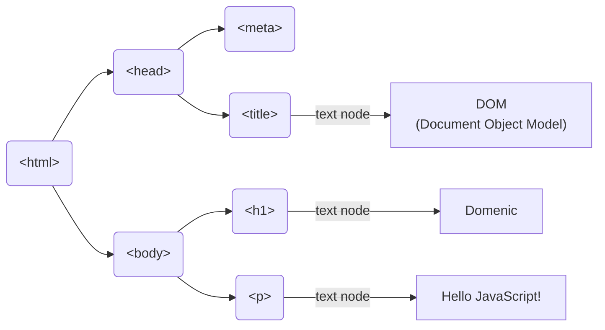

## HTML

### 概述

W3C 标准规定了网页是由以下组成：  
结构：HTML  
表现：CSS  
行为：JavaScript

HTML 是一门语言，所有的网页都是用 HTML 这门语言编写出来的  
HTML 是用来写网页的，一个网站有很多个网页

HTML（HyperText Markup Language）超文本标记语言：

- 超文本：

  超越了文本的限制，比普通文本更强大

  除了文字信息，还可以定义图片、音频、视频等内容

  网页中除了有文字，也有大量的图片，有些网页也有视频，音频等

  这种展示效果超越了文本展示的限制
- 标记语言：

  由标签构成的语言

  XML 就是标记语言，由一个个标签组成，HTML 也是由标签组成的

HTML 标签  
有开始，有结束，成双成对  
开始标签与结束标签中的内容是标签的内容，若没有标签内容，可以让标签自关闭，如：\<br/\>  
HTML 本身是不区分大小写的

使用 VSCode 编写 HTML，在编辑区输入 ! 并回车，生成如下代码：

```html
<!DOCTYPE html>
<html lang="en">
    <head>
        <meta charset="UTF-8" />
        <meta http-equiv="X-UA-Compatible" content="IE=edge" />
        <meta name="viewport" content="width=device-width, initial-scale=1.0" />
        <title>Mine first web</title>
    </head>
    <body text="white" background="img/sky.jpg" bgcolor="pink">
        Hello World
    </body>
</html>
```

### 标签

#### 文件标签

- \<html\>：表示当前书写的是一个 HTML 文档
- \<head\>：存储的本页面的一些重要的信息，它不会显示

  子标签：

  - \<title\>页面的标题
- \<body\>：内容写在 body 标签中

  属性：

  1. text 设置文字颜色
  2. bgcolor 设置页面的背景色
  3. background 设置页面的背景图片

#### 基础标签

<table style="width:40rem">
    <thead>
        <tr style="text-align:left">
            <th width=30%>标签</th>
            <th width=70%>描述</th>
        </tr>
    </thead>
    <tbody>
        <tr>
            <td>&lt;h1&gt; ~ &lt;h6&gt;</td>
            <td>定义标题，h1 最大，h6 最小</td>
        </tr>
        <tr>
            <td>&lt;font&gt;</td>
            <td>定义文本的字体、字体尺寸、字体颜色</td>
        </tr>
        <tr>
            <td>&lt;b&gt;</td>
            <td>定义粗体文本</td>
        </tr>
        <tr>
            <td>&lt;i&gt;</td>
            <td>定义斜体文本</td>
        </tr>
        <tr>
            <td>&lt;u&gt;</td>
            <td>定义文本下划线</td>
        </tr>
        <tr>
            <td>&lt;del&gt;</td>
            <td>定义删除线</td>
        </tr>
        <tr>
            <td>&lt;center&gt;</td>
            <td>定义文本居中</td>
        </tr>
        <tr>
            <td>&lt;p&gt;</td>
            <td>定义段落</td>
        </tr>
        <tr>
            <td>&lt;br&gt; or &lt;br/&gt;</td>
            <td>定义换行（无结束标签）</td>
        </tr>
        <tr>
            <td>&lt;hr&gt;</td>
            <td>定义水平线（无结束标签）</td>
        </tr>
    </tbody>
</table>

- \<font\>：
  - face：字体，如：隶书
  - size：大小，最大为 7，要更大就需要 CSS
  - color：颜色
- \<p\>：
  - align：定义对齐方式
- \<hr\>：
  - color：水平线的颜色
  - size：代表水平线厚度（粗细）
  - width：代表水平线宽度
  - align：可取值有 left、right、center 代表水平线位置

#### 列表标签

<table style="width:40rem">
    <thead>
        <tr style="text-align:left">
            <th width=30%>标签</th>
            <th width=70%>描述</th>
        </tr>
    </thead>
    <tbody>
        <tr>
            <td>&lt;ol&gt;</td>
            <td>定义有序列表</td>
        </tr>
        <tr>
            <td>&lt;ul&gt;</td>
            <td>定义无序列表</td>
        </tr>
        <tr>
            <td>&lt;li&gt;</td>
            <td>定义列表项</td>
        </tr>
        <tr>
            <td>&lt;dl&gt;</td>
            <td>定义列表</td>
        </tr>
    </tbody>
</table>

- \<ol\>：

  - type="A"：字母排序
  - type="I"：罗马排序
  - start="3"：序号从几开始
- \<ul\>：

  - type="disc"：实心圆（默认）
  - type="square"：方块
  - type="circle"：空心圆
- \<dl\>：

  - \<dt\>定义列表项
  - \<dd\>定义列表内容

  ```html
  <dl>
      <dt>计算机</dt>
      <dd>用来计算的仪器 ... ...</dd>
      <dt>显示器</dt>
      <dd>以视觉方式显示信息的装置 ... ...</dd>
  </dl>
  ```

  <div>
      <dl>
         <dt>计算机</dt>
         <dd>用来计算的仪器 ... ...</dd>
         <dt>显示器</dt>
         <dd>以视觉方式显示信息的装置 ... ...</dd>
      </dl>
  </div>

#### 表格标签

<table style="width:40rem">
    <thead>
        <tr style="text-align:left">
            <th width=30%>标签</th>
            <th width=70%>描述</th>
        </tr>
    </thead>
    <tbody>
        <tr>
            <td>&lt;table&gt;</td>
            <td>定义表格</td>
        </tr>
        <tr>
            <td>&lt;thead&gt;</td>
            <td>定义表头</td>
        </tr>
        <tr>
            <td>&lt;tbody&gt;</td>
            <td>定义表身</td>
        </tr>
        <tr>
            <td>&lt;tr&gt;</td>
            <td>定义行</td>
        </tr>
        <tr>
            <td>&lt;td&gt;</td>
            <td>定义单元格</td>
        </tr>
        <tr>
            <td>&lt;th&gt;</td>
            <td>定义表头单元格</td>
        </tr>
    </tbody>
</table>

- \<table\>：
  - width：宽度（像素或百分数）
  - border：边框
  - cellpadding：定义内容和单元格的距离
  - cellspacing：定义单元格间的距离，若指定为 0，则单元格的线会合为一条
  - bgcolor：背景色
  - align：表格对齐方式
  
- \<tr\>：
  - bgcolor：背景色
  - align：内容对齐方式
  
- \<th\>, \<td\>：
  - width：该列在表格中的占比
  
  - colspan：合并列
  - rowspan：合并行
  
- \<caption\>：表格标题

代码示例：

```html
<table border="1" cellspacing="0" style="width:50rem; text-align:center">
  <caption>##表格标题##</caption>
  <thead>
    <tr align="center">
      <th colspan="3">年度报表</th>
    </tr>
  </thead>
  <tbody>
    <tr>
      <td rowspan="3" style="vertical-align:middle">收入</td>
      <td>5</td>
      <td>6</td>
    </tr>
    <tr>
      <td>8</td>
      <td>9</td>
    </tr>
    <tr>
      <td>11</td>
      <td>12</td>
    </tr>
  </tbody>
</table>
```

<table border="1" cellspacing="0" style="width:50rem;text-align:center">
  <caption>##表格标题##</caption>
  <thead>
    <tr align="center">
      <th colspan="3">年度报表</th>
    </tr>
  </thead>
  <tbody>
    <tr>
      <td rowspan="3" style="vertical-align:middle">收入</td>
      <td>5</td>
      <td>6</td>
    </tr>
    <tr>
      <td>8</td>
      <td>9</td>
    </tr>
    <tr>
      <td>11</td>
      <td>12</td>
    </tr>
  </tbody>
</table>
#### 分区标签

<table style="width:40rem">
    <thead>
        <tr style="text-align:left">
            <th width=30%>标签</th>
            <th width=70%>描述</th>
        </tr>
    </thead>
    <tbody>
        <tr>
            <td>&lt;div&gt;</td>
            <td>定义 HTML 文档中的一个区域部分，经常与 CSS 一起使用，用来布局网页</td>
        </tr>
        <tr>
            <td>&lt;span&gt;</td>
            <td>用于组合行内元素</td>
        </tr>
    </tbody>
</table>

- \<div\>：容器

  普通的 \<div\> 并没有什么效果，肉眼也看不见 <br/>但与 CSS 结合，就能更好地对页面进行排版

  \<div\> 会自动换行，因此称为块级元素，是整体划分区块

  可以定义 div 的 style 属性：

  ```html
  <div style="width:80px;height:30px;background:#d26b6b">div块 1</div>
  <div style="width:80px;height:30px;background:#7df461">div块 2</div>
  ```

  <div style="width:80px;height:30px;background:#d26b6b">div 块 1</div>
  <div style="width:80px;height:30px;background:#7df461">div 块 2</div>
- \<span\>：容器

  \<span\> 不会自动换行，因此称为行内元素

  ```html
  <span style="background:red">span 块</span>
  <span style="background:green">span 块</span>
  ```

  <span style="background:red">span 块</span>
  <span style="background:green">span 块</span>

#### 媒体标签

<table style="width:40rem">
    <thead>
        <tr style="text-align:left">
            <th width=30%>标签</th>
            <th width=70%>描述</th>
        </tr>
    </thead>
    <tbody>
        <tr>
            <td>&lt;img&gt;</td>
            <td>定义图片（无结束标签）</td>
        </tr>
        <tr>
            <td>&lt;audio&gt;</td>
            <td>定义音频</td>
        </tr>
        <tr>
            <td>&lt;video&gt;</td>
            <td>定义视频</td>
        </tr>
    </tbody>
</table>

- \：
  - src：规定显示图像的 URL 路径
  - height：定义图像的高度
  - width：定义图像的宽度
    - 若只定义一个宽度或者高度，会等比例缩放
  - border：边框宽度
  - title：定义鼠标悬停图片上时，显示的文本信息
  - alt：定义图片无法显示时，显示的文本信息
  - align：定义图片相对于文字的对齐方式
    - bottom：把文字与图像底部对齐（默认）
    - left：把文字与图像左边对齐
    - right：把文字与图像右边对齐
    - middle：把文字与图像中央对齐
    - top：把文字与图像顶部对齐
- \<audio\>：支持的音频格式：MP3、WAV、OGG
  - src：规定音频的 URL 路径
  - controls：显示播放控件
- \<video\>：支持的音频格式：MP4、WebM、OGG
  - src：规定视频的 URL 路径
  - controls：显示播放控件
  - loop：循环播放

#### 超链接标签

<table style="width:40rem">
    <thead>
        <tr style="text-align:left">
            <th width=30%>标签</th>
            <th width=70%>描述</th>
        </tr>
    </thead>
    <tbody>
        <tr>
            <td>&lt;a&gt;</td>
            <td>定义超链接，用于链接到另一个资源</td>
        </tr>
    </tbody>
</table>

属性：

- href：指定访问资源的 URL
- target：指定打开资源的方式
  - \_self：默认值，目标文档载入并显示在相同的框架或者窗口中作为源文档
  - \_blank：在新打开、未命名的窗口中打开目标文档

示例：

```html
<!-- 在空白页打开 Google -->
<a href="https://www.google.com" target="_blank">博客</a>
```

#### 表单标签

- 表单可以让我们将录入信息携带到服务器端<br/>也就是说，通过表单可将要提交的数据提交到指定的位置
- 表单将所有的数据形成一个整体，一起提交给服务器
- 常见的登录页面、注册页面都离不开表单的应用

表单标签 \<form\>：

- action：指定表单数据提交的 URL

  当提交表单时，发送表单数据到名为 "demo.html" 的文件：action="demo.html"

  - 表单中的数据要想提交，这必须指定其 name 属性
- method：表单提交的方式

  - get：默认值<br/>提交时，传输数据量少，4KB 左右（传递普通文字信息，传递照片会失败）<br/>明文提交（请求参数会拼接在 URL 后面）
  - post：<br/>提交时，传输数据量大，大小无限制（传递文字和图片都行）<br/>密文提交（URL 不会显示提交的数据，浏览器会将数据放到 HTTP 请求协议的请求体中）
- post 提交演示：

  ```xml
  <form action="#" method="post">
      <p>
          <!--
          添加 label 标签后，相当于输入框的点击区域变大
          点击文字："输入："也能触发
       -->
          <label>输入：
              <input type="test" name="text" />
              <input type="submit" />
          </label>
      </p>
  </form>
  ```

  <p>
    <label>
      输入：
      <input type="test" name="text" />
      <input type="submit" />
    </label>
  </p>

  输入内容，点击 Submit 提交按钮之后，浏览器会用 post 方式提交内容

  在开发者工具中就能看到抓取的数据：

  <div style="clear:both"></div>

表单中的元素（控件）：

<table style="width:40rem">
    <thead>
        <tr style="text-align:left">
            <th width=30%>标签</th>
            <th width=70%>描述</th>
        </tr>
    </thead>
    <tbody>
        <tr>
            <td>&lt;input&gt;</td>
            <td>定义表单项，通过 type 属性控制输入形式（无结束标签）</td>
        </tr>
        <tr>
            <td>&lt;label&gt;</td>
            <td>为表单项定义标注</td>
        </tr>
        <tr>
            <td>&lt;select&gt;</td>
            <td>定义下拉列表</td>
        </tr>
        <tr>
            <td>&lt;option&gt;</td>
            <td>定义下拉列表的列表项</td>
        </tr>
        <tr>
            <td>&lt;textarea&gt;</td>
            <td>定义文本域</td>
        </tr>
    </tbody>
</table>

- \<input\>元素的 type 属性：
  - text：普通的单行文本输入框（默认值）
    - placeholder 属性：提示文本
    - maxlength 属性：最多能输入字符数量
  - password：密码输入框
  - checkbox：复选框/多选框
    - checked：被选中
  - radio：单选按钮
  - file：上传文件
  - hidden：隐藏的输入字段<br/>例：添加商品信息的时候，需要用户填写各个信息，但主键 id 不能让用户填写<br/>若 id 要隐藏在表单里面，一起提交，就需要 hidden 属性
  - reset：重置按钮
  - submit：提交按钮
  - button：普通按钮，可以结合 JavaScript
- \<select\>：下拉列表/下拉框
  - 子标签 \<option\>：列表中的项
    - selected：被选中
- \<textarea\>：文本域（多行文本框）
  - 可以通过 cols 和 rows 属性来规定 textarea 的尺寸<br/>不过更好的办法是使用 CSS 的 height 和 width 属性
- \<button\>：按钮
  - 写在 form 表单中，作用和 submit 一样
  - 不写在 form 表单中，就是普通按钮（配合后期的 JavaScript，可扩展性更高）

表单代码示例：

```html
<form action="#" method="post">
    <!-- 隐藏的输入字段，会自动提交 -->
    <input type="hidden" name="id" value="001" />
    <p>帐号：<input type="text" name="account" placeholder="请输入帐号..." maxlength="10" /></p>
    <p>密码：<input type="password" name="password" /></p>
    <!-- 复选框 -->
    <p>爱好：
        <label><input type="checkbox" name="hobby" value="smoke" /> 抽烟</label>
        <label><input type="checkbox" name="hobby" value="drink" /> 喝酒</label>
        <label><input type="checkbox" name="hobby" value="perm" /> 烫头</label>
        <label><input type="checkbox" name="hobby" value="bath" /> 泡澡</label>
    </p>
    <!-- 单选框 -->
    <p>性别：
        <label><input type="radio" name="gender" value="0" checked="checked" />男</label>
        <label><input type="radio" name="gender" value="1" /> 女</label>
    </p>
    <!-- 文件 -->
    <p>头像：
        <input type="file" name="avatar" />
    </p>
    <!-- 下拉列表 -->
    <p>血型：
        <select name="blood">
            <option>A 型</option>
            <option>B 型</option>
            <option>AB 型</option>
            <option selected="selected">O 型</option>
        </select>
    </p>
    <!-- 文本域 -->
    <p>个人简介：
        <!-- 文本域中可以写 5 行，每行 10 列 -->
        <textarea name="description" cols="10" rows="5"></textarea>
    </p>
    <!-- 按钮 -->
    <p>
        <input type="reset" value="清空" />
        <input type="submit" value="提交" />
        <!-- button 类型的按钮需要结合 JavaScript -->
        <input type="button" value="按钮" />
        <button>保存</button>
    </p>
</form>
```

<p>
  帐号：<input type="text" name="account" placeholder="请输入帐号..." maxlength="10" />
</p>
<p>
  密码：<input type="password" name="password" />
</p>
<p>
  爱好： 
  <label><input type="checkbox" name="hobby" value="smoke" /> 抽烟</label>
  <label><input type="checkbox" name="hobby" value="drink" /> 喝酒</label>
  <label><input type="checkbox" name="hobby" value="perm" /> 烫头</label>
  <label><input type="checkbox" name="hobby" value="bath" /> 泡澡</label>
</p>
<p>
  性别：
  <label><input type="radio" name="gender" value="0" checked="checked" /> 男</label>
  <label><input type="radio" name="gender" value="1" /> 女</label>
</p>
<p>
  头像：
  <input type="file" name="avatar" />
</p>
<p>
  血型：
  <select name="blood">
    <option>A型</option>
    <option>B型</option>
    <option>AB型</option>
    <option selected="selected">O型</option>
  </select>
</p>
<p>
  个人简介：
  <textarea name="description" cols="10" rows="5"></textarea>
</p>
<p>
  <input type="reset" value="清空" />
  <input type="submit" value="提交" />
  <!-- button类型的按钮需要结合JavaScript -->
  <input type="button" value="按钮" />
  <button>保存</button>
</p>

填写账号、密码、爱好、性别、血型后，浏览器开发者工具抓取到的信息：

<div style="clear:both"></div>

#### 按钮标签

- \<input\>

  通过 type 来设置按钮类型，只有在表单中才有功能

  - \<input type="submit" value="Submit"/\>，表单中的提交按钮
  - \<input type="reset" value="Reset"/\>，表单中重置按钮

- \<button\>

  \<button\> 具有和 \<input.../\> 相同的作用，但在可操控性方面更强大

  双标签的 \<button\> 按钮，可以嵌套其他标签，如：图片标签

  ```html
  <button type="button">
      
  </button>
  ```

#### 框架标签

使用 \<frameset\> 和 \<frame\> 框架标签可定制 HTML 页面布局 <br/>可理解为：\<frame\> 代表一个页面，\<frameset\> 是一个页面的集合，多个页面拼接成一个页面

\<iframe\> 是个内联框架，是在页面里生成个内部框架

**注意**：<br/>框架标签和 \<body\> 标签不能共存<br/>HTML5 不支持 \<frame\> 标签，HTML 4.01 支持 \<frame> 标签

- \<frameset\>：
  - rows：页面分为几行，分别占多少空间，\* 代表剩余的所有空间
  - cols：页面分为几列，分别占多少空间
- \<frame\>：
  - src：页面的 URL 路径
- \<iframe\>：
  - src：页面的 URL 路径
  - 注意：在 \<iframe\>\</iframe\> 标签内部添加的内容，不会显示在页面上<br/>需使用 src 属性指定一个页面


- *frameset* - 称为框架标记，是用来告知 HTML 文件是框架模式，并且设定可视窗口怎么分割
- *frame* - 它只是设定某一个框架窗口中的参数属性
- *iframe* - 它是在一个页面中嵌入一个框架窗口

代码示例：

- \<frameset\> 和 \<frame\>

  主页面，该页面由四个独立页面拼接而成：<br/>top_div.html、left_div.html、right_div.html、foot_div.html

  ```html
  <!DOCTYPE html>
  <html lang="en">
  
  <head>
      <meta charset="UTF-8">
      <meta http-equiv="X-UA-Compatible" content="IE=edge">
      <meta name="viewport" content="width=device-width, initial-scale=1.0">
      <title>Document</title>
  </head>
  <!-- <frameset rows="1,2,3"> -->
  <frameset rows="20%,*,20%">
      <frame src="top_div.html"></frame>
      <frameset cols="25%,*">
          <frame src="left_div.html"></frame>
          <frame src="right_div.html"></frame>
      </frameset>
      <frame src="foot_div.html"></frame>
  </frameset>
  
  </html>
  ```

  独立页面 top_div.html：

  ```html
  <!DOCTYPE html>
  <html lang="en">
      <head>
          <meta charset="UTF-8" />
          <meta http-equiv="X-UA-Compatible" content="IE=edge" />
          <meta name="viewport" content="width=device-width, initial-scale=1.0" />
          <title>Document</title>
      </head>
      <body>
          <h1>顶部导航区</h1>
      </body>
  </html>
  ```

  <div style="clear:both"></div>

- \<iframe\>

  ```html
  <body>
      <h3>HTML 标签演示</h3>
      <!-- iframe 标签写在 body 内 -->
      <iframe src="register.html"></iframe>
      <!-- src 也可以发起带参数的请求 -->
      <iframe src="register?userName=domenic&password=123456"></iframe>
  </body>
  ```

  <div style="clear:both"></div>

#### 其他标签

##### \<meta\> 标签

\<meta\> 标签必须写在 \<head\> 标签之间，如：

```html
<head>
  <meta charset="UTF-8" />
  <meta http-equiv="X-UA-Compatible" content="IE=edge" />
  <meta name="viewport" content="width=device-width, initial-scale=1.0" />
  <title>meta 标签</title>
</head>
```

- 第一行 \<meta\>：

  当前页面的字符编码
- 第二行 \<meta\>：

  每个电脑内置的 IE 版本是不一样的，为了兼容所有的版本以最高级模式渲染文档 <br/>也就是任何 IE 版本都以当前版本所支持的最高级标准模式渲染
- 第三行 \<meta\>：

  这里的名字是 viewport（显示窗口）<br/>数据是文本内容 content="width=device-width, initial-scale=1.0"<br/>
  也就是显示窗口宽度是客户端的屏幕宽度（满屏），显示的文字和图形的初始比例是 1.0 <br/>缩放比例为 1:1

其他功能：

- 设置页面加载后在指定的时间后跳转到指定的页面

  ```html
  <meta http-equiv="refresh" content="5; url=http://www.lagou.com" />
  ```

注意：在 HTML 中若要跳转的互联网上的网络路径，那么在书写路径时，一定要带协议

##### \<link\> 标签

后面我们会使用 link 标签来导入 CSS（link 无结束标签）

注意：link 标签必须写在 \<head\> 标签中

### 特殊字符

常用特殊字符

<table style="width:50rem">
    <thead>
        <tr style="text-align:left">
            <th width=28%>编码</th>
            <th width=28%>符号</th>
            <th width=44%>描述</th>
        </tr>
    </thead>
    <tbody>
        <tr>
            <td>&amp;lt;</td>
            <td>&lt;</td>
            <td>小于号或显示标记</td>
        </tr>
        <tr>
            <td>&amp;gt;</td>
            <td>&gt;</td>
            <td>大于号或显示标记</td>
        </tr>
        <tr>
            <td>&amp;amp;</td>
            <td>&amp;</td>
            <td>可用于显示其它特殊字符</td>
        </tr>
        <tr>
            <td>&amp;quot;</td>
            <td>“</td>
            <td>引号</td>
        </tr>
        <tr>
            <td>&amp;reg;</td>
            <td>®</td>
            <td>已注册</td>
        </tr>
        <tr>
            <td>&amp;copy;</td>
            <td>©</td>
            <td>版权</td>
        </tr>
        <tr>
            <td>&amp;trade;</td>
            <td>™</td>
            <td>商标</td>
        </tr>
        <tr>
            <td>&amp;nbsp;</td>
            <td></td>
            <td>不断行的空白</td>
        </tr>
    </tbody>
</table>

### HTML5 新特性

H5 完全包含 H4，是 H4 的升级版本

#### H5 和 H4 的区别

- 大小写不敏感

  - 标签、属性、属性值

  ```html
  <input type="pasSWord" />
  ```
- 引号可省略

  ```html
  <input type="submit" /> <input type="submit" />
  ```
- 省略了结尾标签

  其实是运行起来后，html 自动补全了结尾标签

  ```html
  <p>段落</p>
  <h1>一级标题</h1>
  ```

#### 新增语义化标签

html4 中，所有的容器标签 95% 都会使用 \<div\>，\<div\> 过多的话，很难区分彼此

新增许多语义化标签，让 \<div\> “见名知意”

- \<section\> 标签：表示页面中的内容区域，部分，页面的主体部分
- \<article\> 标签：文章
- \<aside\> 标签：文章内容之外的，标题
- \<header\> 标签：头部，页眉，页面的顶部
- \<hgroup\> 标签：内容与标题的组合
- \<nav\> 标签：导航
- \<figure\> 标签：图文并茂
- \<foot\> 标签：页脚，页面的底部

#### 媒体标签

\<video\>：支持的音频格式：MP4、WebM、OGG

- src：规定视频的 URL 路径
- controls：显示播放控件
- loop：循环播放

```html
<video src="xxx.mp4" controls loop></video>
```

#### 新增表单控件

表单的控件更加丰富了

- \<input\>，修改 type 属性：
  - color：调色板
  - date：日历
  - month：月历
  - week：周历
  - number：数值域
    - min：最小值（默认值是 1）
    - max：最大值（默认值是无上限）
    - step：递增量
  - range：滑块
  - search：搜索框（带 × 号，可一键删除框中内容）
- \<progress/\> 进度条
- \<mark\> 高亮
- \<datalist\> 联想输入框（模糊查询）
  - \<option\> 选项

---

## CSS

### 概述

W3C 标准规定了网页是由以下组成：<br/>
结构：HTML <br/>
表现：CSS <br/>
行为：JavaScript

CSS 是一门语言，用于控制网页表现

CSS（Cascading Style Sheets）指层叠样式表 <br/>类似于化妆：隔离、遮瑕、粉底、定妆、高光、点缀，一层层往上 <br/>它可以定义 HTML 元素如何显示，可以描述原本无法用 HTML 描述的效果

### CSS 与 HTML 结合

三种方式：

- 内联/行内样式
- 内部样式表
- 外部样式表

若同时使用了三种方式，优先级为：就近原则 

内联样式 -\> 内部样式表 -\> 外部样式表

#### 内联/行内样式

直接在 HTML 标签上通过 style 属性来引用 CSS 代码

优点：简单方便 <br/>缺点：只能对一个标签进行修饰

使用方法：

```html
<body>
  <!-- style 中采用键值对的方式，定义字体颜色 -->
  <h1 style="color:red">Always be curious, and always with a sincere heart</h1>
</body>
```

#### 内部样式表

通过 \<style\> 标签来声明 css，\<style\> 标签推荐写在 \<head\> 和 \<body\> 之间的位置

优点：可以通过多个标签进行统一的样式设置，<u>网页响应速度比外部样式表快</u><br/>缺点：它只能在本页面上进行修饰

语法：

选择器表示 css 要修饰的目标

```html
<style>
  选择器 {
    属性: 值;
    属性: 值;
    ...;
  }
</style>
```

使用方法：

```html
<style>
  h1 {
    color: green;
  }
</style>

<body>
  <h1>Always be curious, and always with a sincere heart</h1>
</body>
```

#### 外部样式表

需要单独定义一个 CSS 文件，CSS 文件的后缀名就是 .css

**导入外部 css 样式表有两种方式**：

- 在 \<head\> 中使用 \<link\> 标签导入 <br/>属性 href 的值为 CSS 样式表的路径 <br/>属性 rel 规定当前文档，与被链接文档之间的关系

  > 只有 rel 属性的"stylesheet"值得到了所有浏览器的支持，其他值只得到了部分浏览器的支持
  >

  ```html
  <head>
    ...
    <link href="css/test01.css" rel="stylesheet" />
  </head>
  ```
- 在内部样式表 \<style\> 标签内用 @import 导入，url 的值为 CSS 样式表的路径

  ```html
  <style>
    ... @import url(css/test01.css);
  </style>
  ```

**两种方式的区别**：

1. 加载顺序不同
   - @import 方式导入会先加载 html，然后才导入 css 样式，若网络环境不好，就会先看到未修饰的页面，然后才看到修饰后的页面
     - 若使用 \<link\> 方式，会先加载样式表，也就是说，看到的直接就是修饰的页面
2. @import 方式导入 css 样式，不支持 JavaScript 的动态修改。而 \<link\> 方式支持

---

### CSS 使用

#### 选择器

选择器种类：

- 标签（元素）选择器
- 类选择器
- id 选择器
- 选择器组
- 派生选择器

在 css 开头，可以规定全局的盒子模型的默认值：

可以防止莫名其妙的 padding、margin <br/>border-box 可以使 width 和 height 属性，包括内容（content）、内边距（padding）、边框（border），但不包括外边距（margin），能更方便地控制盒子的尺寸

```css
* {
    padding: 0;
    margin: 0;
    box-sizing: border-box;
}
```

以上写法，相当于是设置了默认值，之后对指定标签进行修饰，会覆盖默认值

##### 标签选择器

它可以对页面上相同的标签进行统一的设置，它描述的就是标签的名称

```html
<style>
  h1 {
    color: darkgreen;
  }
</style>
<body>
  <h1>Domenic</h1>
  <h1>Louis</h1>
</body>
```

所有的 h1 标签都受到修饰

##### 类选择器

类选择器在使用时通过 "." 来描述，它描述的是元素上的 class 属性值 <br/>类选择器有别于 id 选择器，类可在多个元素中使用

> 类名的第一个字符不能使用数字，否则无法在 Mozilla/Firefox 浏览器中起作用

```html
<style>
  .domenic {
    color: orange;
  }
</style>
<body>
  <h1 class="domenic">Domenic</h1>
  <h1>Louis</h1>
</body>
```

##### id 选择器

通过 "#" 引入，引用的是元素的 id 属性值 <br/>
id 选择器，比类选择器更具有唯一性（id 唯一主要是为了迎合 JavaScript）

> id 属性不要以数字开头，数字开头的 id 在 Mozilla/Firefox 浏览器中不起作用
>
> **在 css 修饰层面**：<br/>id 和 class 基本没区别，这表示理论上不同元素的 id，是可以重复的 <br/>唯一区别：id 选择器不能使用<u>词列表</u>，class 选择器可以
>
> ```html
> <!-- class 的词列表 正确 -->
> <div class="c1 c2">class 词选择器，有效</div>
> <!-- 若后者（c2）的样式和前者（c1）冲突，那么后者的样式会覆盖前者 -->
> 
> <!-- id 的词列表 *错误* -->
> <div id="x1 x2">id 词选择器，无效</div>
> ```
>
> **在 JavaScript 修饰层面**：<br/>id 和 class 有较大区别，id 不可重复
>
> ```js
> // 通过 id，只能获取到第一个匹配的元素，所以 id 需要唯一
> document.getElementById("x1");
> 
> // 通过 class，可以获取到所有匹配的元素，存入到一个数组
> var arr = document.getElementsByClassName("c");
> ```

```html
<style>
  #louis {
    color: chocolate;
  }
</style>
<body>
  <h1 class="domenic">Domenic</h1>
  <h1 id="louis">Louis</h1>
</body>
```

##### 选择器组

用 "," 分隔多个选择器

```html
<style>
  #louis,
  .domenic {
    color: gold;
  }
</style>
<body>
  <h1 class="domenic">Domenic</h1>
  <h1 id="louis">Louis</h1>
</body>
```

##### 派生选择器

- 后代选择器：父子孙，曾孙，从孙...
- 子代选择器：父子关系（隔代不管）

派生选择器可以多级嵌套 <br/>.div div div <br/>首先寻找 .div 的所有后代 div 元素的 dom，然后再在此 dom 基础上，继续寻找他的后代 div dom，依次类推 <br/>.div \> div \> div 同理

```html
<style>
    /* 
      后代选择器
      div 下的所有 p 标签都会被选中，忽略层级
     */
    div p {
        color: mediumorchid;
    }
    /*
      子代选择器
      只选取 div 的子集元素，层级为一
     */
    div > p {
        color: mediumorchid;
    }
</style>
<body>
    <div>
        <!-- 儿子 -->
        <p>Java</p>
        <p>Springboot</p>
        <span>
            <!-- 孙子 -->
            <p>HTML</p>
            <p>CSS</p>
            <p>JavaScript</p>
        </span>
    </div>
</body>
```

##### CSS 伪类

- CSS 伪类可对 css 的选择器添加一些特殊效果
- 伪类属性列表：
  - :active 向被激活的元素添加样式
  - :hover 当鼠标悬浮在元素上方时，向元素添加样式
  - :link 向未被访问的链接添加样式
  - :visited 向已被访问的链接添加样式
  - :first-child 向元素的第一个子元素添加样式

> 想让未访问链接颜色为蓝色，活动链接为绿色，已访问链接为红色：
>
> - 第一种情况：CSS 定义顺序为：a:visited、a:hover、a:link。这时：把鼠标放到未访问过的蓝色链接上时，并不变成绿色，只有放在已访问的红色链接上，链接才会变绿
> - 第二种情况：CSS 定义顺序为：a:link、a:visited、a:hover。这时：无论你鼠标经过的链接有没有被访问过，都会变成绿色
>
> 在 CSS 中，若对于相同元素有针对不同条件的定义，宜将最一般的条件放在最上面，并依次向下，保证最下面的是最特殊的条件 <br/>这样，浏览器在显示元素时，才会从特殊到一般、逐级向上验证条件，才会使你的每一个 CSS 语句都起到效果 <br/>当然，如果故意打乱顺序，也会造成一些特殊的效果。比如，可以为链接制造出下划线颜色与文字颜色的差异

超链接的伪类要遵守使用顺序：爱恨原则 LoVeHAte，也就是由上到下 LVHA 的顺序 <br/>:link -\> :visited -\> :hover -\> :active

```html
<style>
  /* 未点击 */
  a:link {
    color: darkgreen;
  }
  /* 访问过默认颜色为深紫色 */
  a:visited {
    color: red;
  }
  /* 悬停 */
  a:hover {
    font-size: 30px;
    color: black;
  }
  /* 激活：点住别松手 */
  a:active {
    color: chocolate;
  }
</style>
<body>
  <a href="https://www.baidu.com">百度 Baidu</a>
</body>
```

<center class="half">
       
</center>


```html
<style>
  /* 只修饰第一个 li 子标签 */
  li:first-child {
    color: coral;
  }
</style>
<body>
  <ul>
    <li>Java</li>
    <li>Python</li>
    <li>C++</li>
  </ul>
</body>
```

<ul>
    <li style="color:#ff7f99">Java</li>
    <li>Python</li>
    <li>C++</li>
</ul>

#### CSS 基本属性

##### 尺寸属性

CSS 中有多种测量单位来指定元素的大小或长度

- 绝对单位
  - *px*  - 相对于显示屏的分辨率（在同个设备上是固定的）
- 相对单位
  - *em*  - 相对于父元素
  - *rem* - 相对于根元素（HTML 标签）
  - *%*   - 相对于父元素
  - *vw*  - 相对于视区（viewport）的宽度
  - *vh*  - 相对于视区（viewport）的高度

相对单位更适合响应式设计

在大多数浏览器中，默认字体大小为 16 像素，相对单位根据这个基数计算大小  
可以通过 为 \<html\> 设置一个基本尺寸 或 更改字体大小 来改变基数

- **px \& em \& rem**

  **em 和 rem 的区别**：

  - rem 基于根元素 \<html\>。每个使用 rem 的元素都将 \<html\> 根大小作为计算的基数，不管父元素的大小
  - em 基于父元素的字体大小。若父元素的大小与根元素的不同，则 em 计算将基于父元素，而不是根元素

  **示例**（假设基数为 16 px）：

  1em = 1rem = 16px (1 * 16)

  2em = 2rem = 32px (2 * 16)

  .5em = .5rem = 8px (.5 * 16)

  100% = 16px

  200% = 32px

  50% = 8px

- **% \& vw \& vh**

  **% 和 视区单位 的区别**：

  - 视区单位根据当前浏览器页面大小，来计算元素占页面的百分比
  - % 根据父元素的大小，来计算占用的百分比

  **示例**（假设屏幕视区大小为 480px × 800px）：

  1vw = 1% of the viewport’s width (or 4.8px)

  50vw = 50% of the viewport’s width (or 240px)

  1vh = 1% of the viewport’s height (or 8px)

  50vh = 50% of the viewport’s height (or 400px)

##### 文本属性

- 指定字体：font-family: value;
- 字体大小：font-size: value;
- 字体加粗：font-weight: normal / bold;
- 文本颜色：color: value;
- 文本排列：text-align: left / right / center;
- 文字修饰：text-decoration: none / underline;
- 行高：line-height: value;
- 首行文本缩进：text-indent: value;

```css
#title {
  font-family: "隶书";  /* 字体 */
  font-size: 1.5em;  /* 默认字体大小的 1.5 倍 */
  font-weight: bold;  /* 字体加粗 */
  color: chocolate;  /* 字体颜色 */
  text-align: left;  /* 向左对齐 */
  text-decoration: underline;  /* 下划线 */
  line-height: 20px;  /* 行高 */
}
```

<p style="font-family:隶书;font-size:1.5em;font-weight:bold;color:chocolate;text-align:left;text-decoration:underline;line-height:20px;">生活给你压力，你就还它奇迹</p>

##### 背景属性

可以应用纯色为背景，也可以使用背景图像创建复杂的效果

- background-color 设置元素的背景颜色
- background-image 把图像设置为背景

  ```css
  bacground-image: url("img/1.png");
  ```
- background-repeat 设置背景图像的墙纸效果，是否及如何重复

  - repeat：在垂直方向和水平方向重复，为重复值
  - repeat-x：仅在水平方向重复
  - repeat-y：仅在垂直方向重复
  - no-repeat：仅显示一次
- background-position 设置背景图像的起始位置

  background-position: 1 2

  - 1：控制水平方向 x 轴：正值，向右移动；负值，向左移动
  - 2：控制垂直方向 y 轴：正值，向下移动；负值，向上移动

  ```css
  /* 图片向左移动 50px，向下移动 100px（可为负值）*/
  background-position: 50px 100px;
  ```
- background-attachment 背景图像是否固定或者随着页面的其余部分滚动

  - 默认值为 scroll：默认情况下，背景会随页面滚动
  - 可取值为 fixed：背景图像固定，不随着页面的其余部分滚动，常用于实现称为水印的图像

```html
<style>
  div {
    width: 500px;
    background-color: pink;  /* 背景颜色 */
    background-image: url("img/1.png");
    background-repeat: no-repeat;  /* 不重复 */
    background-position: 0px 100px;  /* 背景图片 image 的起始位置（移动）*/
    background-attachment: fixed;  /* 固定的背景 */
  }
</style>
```

##### 列表属性

设置不同的列表项标记

- disc：标记是实心圆（默认）
- none：无标记（去除标记）
- circle：标记是空心圆
- square：标记是实心方块
- decimal：标记是数字
- decimal-leading-zero：0 开头的数字标记（01, 02, 03, 等）
- lower-roman：小写罗马数字（i, ii, iii, iv, v 等）
- upper-roman：大写罗马数字（I, II, III, IV, V 等）
- lower-alpha：小写英文字母 The marker is lower-alpha（a, b, c, d, e 等）
- upper-alpha：大写英文字母 The marker is upper-alpha（A, B, C, D, E 等）

```html
<style>
  .licircle {
    list-style-type: circle;
  }
  .liimg {
    list-style-image: url("img/1.png");
  }
</style>
<body>
  <ul class="licircle">
    <li>曹操</li>
    <li>刘备</li>
    <li>孙权</li>
  </ul>
  <ol class="liimg">
    <li>老孙</li>
    <li>老杨</li>
    <li>老西</li>
  </ol>
</body>
```

<ul class="lisquare" style="list-style-type:circle">
  <li>曹操</li>
  <li>刘备</li>
  <li>孙权</li>
</ul>

##### 边框属性

指定元素边框的样式和颜色

样式 boder-style 的取值：

- none：无边框（默认）
- dotted：定义点线边框
- dashed：定义虚线边框
- solid：定义实线边框
- double：定义两个边框，两个边框的宽度和 border-width 的值相同
- groove：定义 3D 沟槽边框，效果取决于边框的颜色值
- ridge：定义 3D 脊边框，效果取决于边框的颜色值
- inset：定义一个 3D 嵌入边框，效果取决于边框的颜色值
- outset 定义一个 3D 突出边框，效果取决于边框的颜色值

```html
<style>
  div {
    width: 80px;
    height: 45px;
    margin: 10px; /* div 彼此之间间隔 10px */
    /* 
      border-width:10px;
      border-color:green;
      border-style:outset;
      以上三条可简写：
    */
    border: 10px outset green;
    /*
      可单独设置四边的颜色和样式：
      border-right-color:值;
      border-bottom-style:值;
    */
    text-align: center;
    /* 鼠标的样式变为 手指点击效果 */
    cursor: pointer;
  }
</style>
<body>
  <div>hello</div>
</body>
```

<div style="width:80px;height:45px;border-width:10px;border-color:green;border-style:outset;text-align:center;cursor:pointer;">hello</div>

##### 轮廓属性

轮廓（outline）是绘制于元素周围的一条线，位于边框边缘的外围，可起到突出元素的作用

轮廓和边框的区别：

- 边框（border）是围绕元素内容和内边距的一条或多条线
- 轮廓（outline）是绘制于元素周围的一条线，位于边框的外围，可起到突出元素的作用
- 边框包裹元素，轮廓包裹边框

```html
<style>
  div {
    width: 150px;
    height: 70px;
    background-color: lightblue; /* div 分区背景色 */
    border: 15px solid green; /* 边框 */
    outline: 5px dashed red; /* 轮廓 */
  }
</style>
<body>
  <div></div>
</body>
```

<div style="width:150px;height:70px;background-color:lightblue;border:15px solid green;outline:5px dashed red;"></div>

##### 盒子模型

所有 HTML 元素可看作盒子，在 CSS 中，"box model" 这一术语是在设计和布局时使用的

CSS 盒子模型本质上是个盒子，封装周围的 HTML 元素 <br/>包括：边距（margin）、边框（border）、填充（padding）、和实际内容（content）

盒子模型允许我们在其它元素和周围元素边框之间的空间放置元素

> box-sizing 属性：
>
> - content-box：默认值<br/>若设置元素的宽为 100px，那么元素的内容区就是 100px 宽<br/>并且任何边框（border）和内边距（padding）的宽度都会被增加到最后绘制出来的元素宽度中
> - border-box：<br/>使 width 和 height 属性，包括内容（content）、内边距（padding）、边框（border），但不包括外边距（margin）<br/>尺寸计算公式：<br/>width = border + padding + 内容的宽度<br/>height = border + padding + 内容的高度

<div style="clear:both"></div>

```css
div {
  width: 200px;
  height: 200px;
  border: 2px solid greenyellow;
  margin-top: 50px; /* 上 外边距 */
  margin-left: 100px; /* 左 外边距 */
  padding-top: 20px; /* 上 内边距 */
  padding-left: 40px; /* 左 内边距 */
}
```

#### CSS 定位

##### 默认定位

- 块级元素（block）：h1~h6，p，div 等，独自占领一行（自动换行），可以改变宽高
- 行内元素（inline）：a，b，u，span 等，在一行内显示（不会自动换行），不能改变宽高
- 行内块元素（inline-block）：input，img 等，能和其他元素在一行（不会自动换行），可以改变宽高

所有行内元素默认是无法改变宽高的，不过可以通过 display 属性把行内元素转换为行内块元素，再改变宽高

```html
<style>
  b {
    width: 260px;
    height: 50px;
    border: 5px solid lightblue;
    display: inline-block;
  }
</style>
<body>
  <div><b>行内元素 转换为 行内块元素</b></div>
</body>
```

<b style="width:260px;height:50px;border:5px solid lightblue;display:inline-block;">行内元素 转换为 行内块元素 </b>

##### 浮动定位

让元素“飞”起来，不仅可以靠到左边或右边，还可以消除块级元素的“霸道特性”（独占一行）

> 要浮动定位，就要先有<u>嵌套关系</u><br/>大容器套小容器，浮动定位的是小容器 <br/>比如：float: left 靠左浮动，需要有外部大容器包裹了待浮动的小容器，才能知道小容器要浮动定位到什么地方
>
> 注意：浮动前，外部大容器的尺寸需要先设置好；<u>其内浮动容器的尺寸，一定要小于父容器</u>

float 取值：

- none：不浮动
- left：贴着左边浮动
- right：贴着右边浮动

```html
<style>
  .outer {
    width: 150px;
    height: 150px;
    border: 5px solid chocolate;
  }
  .a,.b {
    width: 40px;
    height: 40px;
  }
  .a {
    background-color: green;
    /* 添加 float 属性后，div 元素不再独占一行 */
    float: left; /* 靠左浮动 */
    /* 对于元素 a 来说，它与边框的间距是外边距，因此用 margin */
    margin: 10px;
  }
  .b {
    background-color: lightblue;
    float: right; /* 靠右浮动 */
    margin: 10px;
  }
</style>
<body>
  <div class="outer">
    <div class="a"></div>
    <div class="b"></div>
  </div>
</body>
```

<div style="width:150px;height:150px;border:5px solid chocolate;">
    <div style="width:40px;height:40px;background-color:green;margin:10px;float:left;"></div>
    <div style="width:40px;height:40px;background-color:lightblue;margin:10px;float:right;"></div>
</div>

##### 相对定位

相对定位，是该元素与原本位置进行比较，得到的偏移量

属性：position:relative;

- top
- bottom
- left
- right

以上四个偏移量属性，是相对于原本位置的偏移量 <br/>如：top:10px; 表示原本位置，在现在位置的上方 10px

##### 绝对定位

绝对定位，是该元素与已有 position 属性定位的祖先元素的距离

若父级元素已定位，则以父级为参照物；若没有，就<u>一级级向上找</u>；若都没定位，则以 body 为参照物

属性：position:absolute;

- top
- bottom
- left
- right

```html
<style>
  .grandfather {
    width: 400px;
    height: 400px;
    background: olive;
    /* 相当于元素内围四边，都向内多 30px 的填充 */
    padding: 30px;
  }
  .father {
    width: 300px;
    height: 300px;
    background: black;
    /* 有 position 属性，代表定位了（absolute 或 relative 都可） */
    position: absolute;
  }
  .a,.b,.c {
    width: 200px;
    height: 60px;
  }
  .a {
    background-color: aqua;
  }
  .b {
    background-color: bisque;
    /* 因为父级元素 father 已经定位，因此这里是元素 b 相对于 father 的绝对路径 */
    position: absolute;
    top: 30px; /* 距离 father 元素顶部 30px */
    left: 30px; /* 距离 father 元素左部 30px */
  }
  .c {
    background-color: coral;
  }
</style>
<body>
  <div class="grandfather">
    <div class="father">
      <div class="a"></div>
      <div class="b"></div>
      <div class="c"></div>
    </div>
  </div>
</body>
```

##### 固定定位

将元素的内容固定在页面的某个位置，当用户向下滚动页面时，元素框并不随之移动

属性：position:fixed;

- top
- bottom
- left
- right

固定定位的元素，位置偏移是相对于整个页面的

##### z-index

若有重叠元素，使用 z 轴属性，定义上下层次

- z-index 的取值为整型，<u>数值越大，越在上层</u>
- z 轴属性，要配合相对或绝对定位来使用

```css
.beneath {
  background-color: blueviolet; /* 紫色 */
  position: relative;
  z-index: 1;
}
.above {
  background-color: violet; /* 粉色 */
  position: relative;
  top: -20px;
  left: 30px;
  z-index: 2;
}
```

如上例子：class 为 beneath 的元素在 class 为 above 的元素的上方

#### CSS3

##### 圆角和阴影

- 圆角属性：border-radius

  - 四个角分开定义：

    border-radius:1px 10px 20px 40px;

    按顺序，四个角分别为：左上 右上 右下 左下（顺时针）
  - 四个角一起定义：

    border-radius:30px;

    border-radius:50%; 表示圆形
- 阴影属性：box-shadow: 1 2 3 4 5

  - 1：水平偏移
  - 2：垂直偏移
  - 3：模糊半径
  - 4：扩张半径
  - 5：颜色

  ```html
  <style>
    div {
      background-color: white;
      width: 100px;
      height: 100px;
      box-shadow: 10px 10px 25px 15px grey;
    }
  </style>
  <body>
    <div></div>
  </body>
  ```

  <div style="background-color:white;width:100px;height:100px;box-shadow:10px 10px 25px 15px grey;"></div>

##### 渐变

- 线性渐变

  ```css
  background: linear-gradient([方向/角度]，颜色列表) ；;
  ```

  - 方向：top、bottom、left、right、top left、bottom right 等

    默认方向为 bottom，自上而下渐变
  - 角度：单位是 deg

    0deg 相当于 top，自下而上

  ```html
  <style>
    div {
      width: 80px;
      height: 80px;
      margin: 10px;
      border-radius: 30%;
      background: linear-gradient(45deg, green, yellow);
    }
  </style>
  <body>
    <div></div>
  </body>
  ```

  <div style="width:80px;
          height:80px; 
          margin:10px;
          border-radius:30%;
          background:linear-gradient(45deg,green,yellow);"></div>
- 径向渐变

  ```css
  background: radial-gradient(颜色列表);
  ```

  从圆心向外发散

  ```html
  <style>
    div {
      width: 80px;
      height: 80px;
      margin: 10px;
      border-radius: 50%;
      background: radial-gradient(#fedcd3, #db9bf2);
    }
  </style>
  <body>
    <div></div>
  </body>
  ```

  <div style="width:80px;
          height:80px; 
          margin:10px;
          border-radius:50%;
          background:radial-gradient(#fedcd3,#db9bf2);"></div>

##### 背景

- **背景位置**

  属性 background-origin：

  定义的是背景位置（background-position）的起始点

  是控制背景图的位置，就是单纯设置背景图的边界，不会对背景颜色造成影响，默认值是 padding-box

  **注意**：如果背景图片 background-attachment 是“固定”，这个属性没有任何效果

  - border-box 背景贴边框的边
  - padding-box 背景贴内边框的边
  - content-box 背景贴内容的边

  ```html
  <style>
    .a, .b,.c {
      width: 80px;
      height: 80px;
      margin: 10px;
      float: left;
      padding: 10px;
      border: 5px dashed black;
    }
    .a {
      background: url("https://domenic-gallery.oss-cn-hangzhou.aliyuncs.com/前端/背景.png")
        aquamarine no-repeat;
      background-origin: border-box;
    }
    .b {
      background: url("https://domenic-gallery.oss-cn-hangzhou.aliyuncs.com/前端/背景.png")
        bisque no-repeat;
      background-origin: padding-box;
    }
    .c {
      background: url("https://domenic-gallery.oss-cn-hangzhou.aliyuncs.com/前端/背景.png")
        chocolate no-repeat;
      background-origin: content-box;
    }
  </style>
  <body>
    <div class="outer">
      <div class="a"></div>
      <div class="b"></div>
      <div class="c"></div>
    </div>
  </body>
  ```

  <div style="clear:both"></div>

  从上图可以看到：<br/>border-box：背景图像从边界开始显示 <br/>padding-box：背景图片从边框内开始显示 <br/>content-box：背景图片从内容框开始显示（内容和边框间有填充物）
- **背景裁切**

  属性 background-clip：

  是将背景图进行切割，得到的是一个不完整的图像，会对背景颜色造成影响（也会被切割），默认值是 border-box

  - border-box 边框开切
  - padding-box 内边距开切
  - content-box 内容开切

  ```html
  <style>
    .a,
    .b,
    .c {
      width: 80px;
      height: 80px;
      margin: 10px;
      float: left;
      padding: 10px;
      border: 5px dashed black;
    }
    .a {
      background: url("https://domenic-gallery.oss-cn-hangzhou.aliyuncs.com/前端/背景.png")
        aquamarine no-repeat;
      background-clip: border-box;
    }
    .b {
      background: url("https://domenic-gallery.oss-cn-hangzhou.aliyuncs.com/前端/背景.png")
        bisque no-repeat;
      background-clip: padding-box;
    }
    .c {
      background: url("https://domenic-gallery.oss-cn-hangzhou.aliyuncs.com/前端/背景.png")
        chocolate no-repeat;
      background-clip: content-box;
    }
  </style>
  <body>
    <div class="outer">
      <div class="a"></div>
      <div class="b"></div>
      <div class="c"></div>
    </div>
  </body>
  ```

  <div style="clear:both"></div>
  
- **背景大小**

  属性 background-size：

  - cover 缩放成完全<u>覆盖</u>背景区域最小大小
  - contain 缩放成完全<u>适应</u>背景区域最大大小

  ```html
  <style>
    .a,
    .b,
    .c {
      width: 80px;
      height: 80px;
      margin: 10px;
      float: left;
      padding: 10px;
      border: 5px dashed black;
    }
    .a {
      background: url("https://domenic-gallery.oss-cn-hangzhou.aliyuncs.com/前端/背景.png")
        aquamarine no-repeat;
      /* 完全覆盖背景 */
      background-size: cover;
    }
    .b {
      background: url("https://domenic-gallery.oss-cn-hangzhou.aliyuncs.com/前端/背景.png")
        bisque no-repeat;
      /* 适应背景大小 */
      background-size: contain;
    }
    .c {
      background: url("https://domenic-gallery.oss-cn-hangzhou.aliyuncs.com/前端/背景.png")
        chocolate no-repeat;
      /* 不改变，对照组 */
    }
  </style>
  <body>
    <div class="outer">
      <div class="a"></div>
      <div class="b"></div>
      <div class="c"></div>
    </div>
  </body>
  ```

  <div style="clear:both"></div>

##### 过渡动画

- **过渡**

  表示从一个状态到另一个状态，中间的“缓慢”过程
  缺点：控制不了中间某个时间点
  transition { 1 2 3 4 }

  - 1：过渡或动画模拟的 css 属性

    如：width、opacity、background
  - 2：完成过渡所用的时间（2s 内完成）
  - 3：过渡函数

    - linear：匀速
    - ease：逐渐慢下来
    - ease-in：加速
    - ease-out：减速
    - ease-in-out：先加速后减速
  - 4：过渡开始出现的延迟时间

  ```html
  <style>
    div {
      width: 100px;
      height: 50px;
      border: 2px solid red;
    }
    .a {
      /* 0.5 秒过后，div 在 2 秒内匀速缓慢的变宽 */
      transition: width 2s linear 0.5s;
    }
    div:hover {
      /* 鼠标悬浮，触发 div 变宽 */
      width: 300px;
    }
  </style>
  <body>
    <div class="a">Hello</div>
  </body>
  ```
- **动画**

  从一个状态到另一个状态，过程中每个时间点都可进行控制

  - 关键帧：@keyframes 动画帧 { from{} to{} } 或 { 0%{} 20%{}... }
  - 动画属性：animation { 1 2 3 4 5 }
    - 1：动画帧
    - 2：执行时间
    - 3：过渡函数
    - 4：动画执行的延迟（可省略）
    - 5：动画执行的次数

  ```html
  <style>
    .outer {
      width: 600px;
      height: 90px;
      border: 2px solid red;
    }
    .inner {
      width: 80px;
      height: 80px;
      margin: 5px;
      background: red;
    }
    .inner {
      /* 线性动画时间为 3s，执行 2 次 */
      animation: x 3s linear 2;
      /* 线性动画时间为 3s，执行无限次，来回执行 */
      animation: x 3s linear infinite alternate;
    }
    /* 水平移动 + 颜色变换 */
    @keyframes x {
      0% {
        margin-left: 10px;
      }
      25% {
        background: yellowgreen;
      }
      50% {
        background: goldenrod;
      }
      75% {
        background: palevioletred;
      }
      100% {
        background: coral;
        margin-left: 510px;
      }
    }
  </style>
  <body>
    <div class="outer">
      <div class="inner"></div>
    </div>
  </body>
  ```

---

## JavaScript

### 概述

**介绍**：

- 网景公司在 Netscape2.0 中，首先推出了 JavaScript
- JavaScript 的正式名称是 “ECMA Script”，ECMAScript 是一种由 Ecma 在标准 ECMA-262 中定义的脚本语言规范，此标准由 ECMA 组织发展和维护，简称“js”
- JavaScript 是一种网页编程技术，主要用来向 html 页面添加交互行为
- JavaScript 是一种基于对象和事件驱动的脚本语言，直接嵌入 html 页面，由浏览器解释运行，执行 js 代码，一般不进行预编译

**特点**：

- 只需要浏览器就能执行程序 （不用浏览器也能运行）
- 解释执行：运行一般事先不编译，逐行执行
- 基于对象：语言内置大量现成对象
- 作用：
  - 客户端数据计算
  - 客户端表单合法性验证
  - 浏览器事件的触发
  - 网页特殊显示效果制作

**js 组成**：

- ECMAScript：定义核心语法，关键字，运算符，数据类型等系列<u>标准</u>
- DOM：[文档对象模型](#DOM)，将一个 html 页面的所有节点看成一个个的对象，更有层次地管理每个节点
- BOM：[浏览器对象模型](#BOM)，是对浏览器窗口进行访问和操作。使用 BOM，开发者可以移动窗口、改变状态栏中的文本以及执行其他与页面内容不直接相关的动作
  - 弹出新的浏览器窗口
  - 移动、关闭浏览器窗口以及调整窗口大小
  - 提供 Web 浏览器详细信息的定位对象
  - 提供用户屏幕分辨率详细信息的屏幕对象
  - 对 cookie 的支持
  - IE 扩展了 BOM，加入了 ActiveXObject 类，可以通过 JavaScript 实例化 ActiveX 对象，进而实现 ajax 局部刷新技术

### JavaScript 与 HTML 结合

三种方式：

- 行内脚本
- 内部脚本
- 外部脚本

**注意**：以上三种结合的方式，哪一种写在上面，哪一种先执行

> HTML 文件是自上而下的执行方式 <br/>但引入的 CSS 和 JavaScript 的顺序有所不同，css 引入执行加载时，程序仍然往下执行 <br/>而执行到 \<script> 脚本是则**中断线程**，待该 script 脚本执行结束之后程序才继续往下执行
>
> - 将 script 脚本放在 \<body> 之后，那样 dom 的生成就不会因为长时间执行 script 脚本而延迟阻塞，加快了页面的加载速度
> - 但不能将所有的 \<script> 都放在 \<body> 之后，因为有一些页面的效果的实现，是需要预先动态的加载一些 js 脚本，这些脚本应该放在 \<body> 之前
> - 不能将需要访问 dom 元素的 js 脚本放在 \<body> 之前，因为此时还没有开始生成 dom，所以在 \<body> 之前的访问 dom 元素的 js 会出错，或者无效

#### 行内脚本

将 JavaScript 脚本嵌入到 HTML 标签中

以下代码中：onclick 是绑定鼠标点击到 img 标签上，执行 alert(...)这个 js 代码

```html
<div>
  <h1>评选活动</h1>
  
  
  <br />
  <a href="javascript:alert('请等待评选结果，谢谢！')">查看结果</a>
</div>
```

#### 内部脚本

- 使用 \<script> 标签来声明 JavaScript 代码
- 标准写法是在 \<head> 和 \<body> 之间（其实只要写在 .html 文件内部都可以）
- 优势：内部脚本的加载速度比外部的快

```html
<!-- 声明 JavaScript 代码 -->
<script type="text/javascript">
  function addOnclickEvents() {
    alert("onclick 事件执行成功");
    var imgs = document.getElementsByTagName("img");
    imgs[0].onclick = function () {
      alert("你选择了 1 号");
    };
    imgs[1].onclick = function () {
      alert("你选择了 2 号");
    };
    imgs[2].onclick = function () {
      alert("你选择了 3 号");
    };
  }
</script>
<body>
  <h1>评选活动</h1>
  <input type="button" onclick="addOnclickEvents()" value="onclick 事件" /><br />
  
  
  <br />
  <a id="hyperlink">查看结果</a>
  <!-- 声明 JavaScript 代码 -->
  <script type="text/javascript">
    var a1 = document.getElementById("hyperlink");
    a1.href = "javascript:alert('请等待评选结果，谢谢！')";
  </script>
</body>
```

#### 外部脚本

外部 JavaScript 脚本写在独立文件中，页面在使用脚本时，需要引入脚本所在文件

addOnclickEvents.js

```js
function addOnclickEvents() {
  alert("onclick 事件执行成功");
  var imgs = document.getElementsByTagName("img");
  imgs[0].onclick = function () {
    alert("你选择了 1 号");
  };
  imgs[1].onclick = function () {
    alert("你选择了 2 号");
  };
  imgs[2].onclick = function () {
    alert("你选择了 3 号");
  };
}

var hyperlink = document.getElementById("hyperlink");
hyperlink.href = "javascript:alert('请等待评选结果，谢谢！')";
```

test.html

```html
<body>
  <h1>评选活动</h1>
  <input
    type="button"
    onclick="addOnclickEvents()"
    value="按钮 onclick 事件"
  /><br />
  <br />
  
  
  <br />
  <p onclick="alert('行内脚本')">行内脚本</p>

  <a id="hyperlink">查看结果</a>

  <!-- addOnclickEvents.js 需要访问 dom，因此需访问的元素标签 <a> 之后，也可以放到 body> 之后 -->
  <script type="text/javascript" src="../js/addOnclickEvents.js"></script>
</body>

<!-- 无需访问 dom，最好放在 <body> 之后 -->
<script>
  alert("内部脚本");
</script>
```

---

### JavaScript 基础

#### 变量

- 定义变量时，所有数据类型都是 var

  虽然声明时不写明数据类型，但实际上变量还是有类型的
- 变量可一次声明多个

  ```js
  var i = 0,
    j = "qqq",
    arr = [1, 2, 3, 4];
  ```
- 数值类型：number

  - 不区分整型数值和浮点型数值
  - 所有数字<u>都采用 64 位浮点格式存储</u>，类似于 double 格式
- 字符串：string

  - 首尾由单引号或双引号括起

  ```js
  var str = 'Hello "JavaScript"';
  ```
- 布尔类型：

  - 仅有两个值：true 和 false
  - 实际运算中：true=1，false=0

  ```js
  var sum = true + 1; // 结果为 2
  ```

##### 变量提升

JavaScript 有变量提升：指在 JavaScript 代码执行过程中，JavaScript 引擎把变量的声明部分和函数的声明部分提升到代码开头的行为。变量被提升后，会给变量设置默认值为 undefined，会与直觉不太相符

ECMAScript6 通过引入块级作用域并配合使用 let、const 关键字，避开了变量提升这种设计缺陷（其实还是有的，只是因为“暂时性死区”的存在，使 let / const 不能在声明之前被使用）

```js
var num;
console.log(num); // 不报错，会输出 undefined
num = 1;
```

示例：

```js
var name = "JavaScript"
function showName(){
  console.log(name);
  if(0){
   var name = "CSS"
  }
}
showName() // 输出：undefined
```

原因：<br/>执行以上代码需要变量 name，代码中有两个 name 变量：<br/>一个在全局执行上下文中，其值为 JavaScript；另一个在函数执行上下文中，由于 if(0) 永不成立，所以 name 值不存在<br/>JavaScript 执行时，会先查找函数执行上下文中的变量，优先使用该变量。由于变量提升的存在，当前执行上下文中就包含了 if(0) 中的变 量 name，其值是 undefined，所以获取到的 name 的值就是 undefined

##### 自动类型转换

- 数字 + 字符串：数字转换为字符串，10 + 'a' -> 10a
- 数字 + 布尔值：true 转换为 1，false 转换为 0，true + 5 -> 6
- 字符串 + 布尔值：布尔值转换为字符串 true 或 false，true + 'a' -> true
- 布尔值 + 布尔值：布尔值转换为数值 1 或 0，true + true -> 2

##### 数据类型转换

- parseInt：强制转换成整数
  - 若不能转换，则返回 NaN（Not a Number，该属性用于指示某个值不是数字）
  - 例如：parseInt("6.32") = 6
- parseFloat：强制转换成浮点数
  - 若不能转换，则返回 NaN
  - 例如：parseFloat("6.32") = 6.32
- typeof：查询数值当前类型
  - 返回 string / number / boolean / object
  - 例如：typeof("test" + 3) == "string"

##### 全局变量

全局变量有全局作用域：网页中所有脚本和函数均可使用

- 在函数外定义的变量，就是全局变量

  可以用 var 声明，也可以不用

  ```js
  var carName = "BWM";
  carName2 = "BENZ";
  
  // 此处可调用 carName、carName2 变量
  function myFunc() {
    // 函数内可调用 carName、carName2 变量
  }
  ```
- 若变量在函数内没有用 var 关键字声明，该变量也是全局变量

  ```js
  // 此处可调用 carName 变量
  
  function myFunc() {
    carName = "BWM";
    var carName2 = "BENZ"; // 局部变量
    // 此处可调用 carName、carName2 变量
  }
  
  function myFunc2() {
    // 其他函数中也可调用 carName 变量
    // 不能调用 carName2 变量
  }
  ```

##### 局部变量

用 var 声明，并且在函数的内部。这样的变量叫做局部变量，作用域只在其声明的函数内部

```js
function myFunc() {
  var carName = "Lamborghini"; // 局部变量
  // 函数内可以调用 carName 变量
}
// 函数外部无法调用 carName 变量
```

#### 运算符

##### 算术运算

- 加(＋)、 减(－)、 乘( \* ) 、除( / ) 、余数( % )
  - \- 能表示减号，也能表示负号，如：x = - y
  - \+ 能表示加法，也能用于字符串的连接
- 递增( ++ ) 、递减( -- )

##### 关系运算

- 一般相等：==
  - 会将类别一致化以后再比较
- 严格相等：===
  - 类型相同
  - 数值相同
- 非严格相等：!==

```js
var a = "10";
var b = 10;
console.log(a == b);  // 结果是 true，因为这是判断值，数值相等（注意）
console.log(a === b); // 结果是 false，因为类型不同
```

##### 逻辑运算

逻辑非（!）、逻辑与（&&）、逻辑或（||）
逻辑运算的操作数均为 boolean 表达式

#### 控制语句

- if 语句

  ```js
  if (关系表达式 1) {
      // 语句块 1
  } else if (关系表达式 2) {
      // 语句块 3
  } else {
      // 语句块 2
  }
  ```
- switch 语句

  ```js
  switch (表达式) {
    case 值 1:
      // 语句 1;
      break;
    case 值 2:
      // 语句 2;
      break;
    default:
      // 语句 4;
  }
  ```
- for 语句

  ```js
  for (var i = 0; i <= arr.length; ++i) {
    console.log(arr[i]);
  }
  ```
- while 语句

  ```js
  while (条件) {
      // 语句 1
      ...
  }
  ```

#### 输出

- 普通弹框：alert("Hello JavaScript");
- 控制台日志输出：console.log("...");
- 页面输出：document.write("\<h2>Hello JavaScript\</h2>");<br/>将 \<h2> 元素输出到 \<body> 中
- 确认框：confirm("确定删除吗？");<br/>返回 boolean 类型，var res = confirm("确定吗？");，可以拿结果进行判断
- 输入框：prompt("请输入姓名：");

#### 常用字符串 API

| API                       | 功能                                            |
| ------------------------- | ----------------------------------------------- |
| length                    | 获取字符串的长度（字符的个数），用 . 调用       |
| toUpperCase / toLowerCase | 转为大 / 小写，用 . 调用                        |
| charAt(下标)              | 返回某个下标位置上的字符                        |
| charCodeAt(下标)          | 返回某个下标位置上的字符的 Unicode 编码中的编号 |
| indexof(字符)             | 查找字符串中字符出现的首次下标                  |
| lastIndexof(字符)         | 查找字符串中字符最后一次出现的下标              |
| substring(开始, 结束)     | 截取字符串中一部分（不包含结束）                |
| replace(旧, 新)           | 将字符串中的旧字符串，替换成新字符串            |
| split(分割的节点)         | 一个字符串切割成 N 个小字符串，返回的是数组类型 |

#### 数组

**注意**：

- JavaScript 中的数组，可以放入任意类型的值
- 数组是 object 类型

初始化数组的三种方式：

```js
// 第一种
var arr = new Array();
arr[0] = 110;
arr[1] = 119;
arr[2] = 120;

// 第二种
var arr = new Array(10, "a", true);

// 第三种
var arr = [10, "a", true];
for (var i = 0; i < arr.length; i++) {
  console.log(arr[i]);
}
```

**常用方法**

| 方法              | 功能                                               |
| ----------------- | -------------------------------------------------- |
| tostring()        | 将数组转换成字符串                                 |
| join(连接符号)    | 将数组中的每个元素，用连接符号连接成一个新的字符串 |
| concat(新元素)    | 在数组后添加新元素，形成一个新数组（原数组不变）   |
| slice(开始, 结束) | 在数组中提取一部分，形成新的数组（不包含结束）     |
| reverse()         | 反转数组                                           |
| sort()            | 数组排序：1.字符排序 2.数值排序                    |

- 数组排序：

  - 字符排序 arr.sort()

    ```js
    var arr = [444, 12, 111, 31];
    arr.sort();       // 字符排序（不按照字面量的大小）
    console.log(arr); // [111, 12, 31, 444]
    ```
  - 数值排序 arr.sort(func)

    需要传入一个排序函数

    ```js
    var arr = [444, 12, 111, 31];
    arr.sort(func);   // 数字排序
    console.log(arr); // [12, 31, 111, 444] 升序
    /* 定义排序函数 func */
    function func(a, b) {
      return a - b;
    }
    ```

#### 内置对象

[JavaScript - MDN Doc](https://developer.mozilla.org/en-US/docs/Web/JavaScript/Reference)

[JavaScript - W3CSchool Dict](https://www.w3cschool.cn/javascript/dict.html)

##### Math 数学对象

[Math - Doc](https://developer.mozilla.org/en-US/docs/Web/JavaScript/Reference/Global_Objects/Math)

- 没有构造函数 Math()
- 无需创建，直接把 Math 作为对象使用即可调用其所有属性和方法

示例：

```js
/* 随机数 */
var i = Math.random() * 10;
console.log(Math.floor(i)); // 输出为 0~9 的整数
```

##### Number 对象

[Number - Doc](https://developer.mozilla.org/en-US/docs/Web/JavaScript/Reference/Global_Objects/Number)

示例：

```js
/* 保留指定小数位数 */
var n = new Number(12.345);
var n1 = n.toFixed(2); // 12.35，固定 2 位小数，第三位小数四舍五入
console.log(n1);

var n = new Number(12.3);
var n2 = n.toFixed(2); // 12.30，固定 2 位小数，位数不够，0 来补齐
console.log(n2);
```

##### 正则表达式

对字符串执行模式匹配的强大工具

- test(参数)：测试参数是否满足正则表达式的匹配
- new RegExp(正则表达式)：获取一个正则表达式对象

```js
var age = 18;
var reg = /^\d{1,3}$/; // 判断 1~3 位纯数字
var b = reg.test(age); // 验证 age 是否符合 reg 的匹配
if (b == true) {
  console.log("验证通过");
} else {
  console.log("验证失败");
}
```

```js
var name = "abc123";
// 判断大小写字母和数字的组合（特殊字符不能出现），5~8 位
var reg = new RegExp("^[a-zA-Z0-9]{5,8}$"); // 以 ^ 开始，中间写正则内容，以 $ 结束
if (reg.test(name)) {
  console.log("验证通过");
} else {
  console.log("格式错误");
}
```

##### 日期对象

- new Date()：获取日期对象

```js
var time = new Date();
console.log(time); // Fri Apr 29 2022 00:57:17 GMT+0800 (China Standard Time)

var year = time.getFullYear();   // 年份
var month = time.getMonth() + 1; // 月份从 0 开，11 结束，所以要 +1
var day = time.getDate();        // 几号
var hour = time.getHours();      // 几点
var minute = time.getMinutes();  // 分钟
var second = time.getSeconds();  // 秒
var ms = time.getMilliseconds(); // 毫秒

var timeStr = year + "年" + month + "月" + day + "号 " + hour + "点" + minute + "分" + second + "秒" + ms + "毫秒";
console.log(timeStr); // 2022 年 4 月 29 号 0 点 45 分 12 秒 369 毫秒
```

#### 函数

使用关键字 function 定义函数

```js
function 函数名(形参列表) {
  // 函数体
  return 返回值;
}
```

- 注意：
  - 形参：一定不要带数据类型（因为所有类型都用 var 声明，可省略）
  - 分号用来分隔可执行 JavaScript 语句。由于函数声明不是一个可执行语句，所以不以分号结束

##### 无返回值

```js
function sum(a, b) {
  var sum = a + b;
  console.log("两数之和：" + sum);
}

sum(3, 4);
```

##### 有返回值

```js
function sum(a, b) {
  var sum = a + b;
  return "两数之和：" + sum;
}

var res = sum(3, 4);
console.log(res);
```

##### 参数对象

在函数内部，调用参数列表的属性

```js
function func(a, b, c) {
  console.log(arguments.length); // 获得参数的个数
  console.log(arguments[1]);     // 获得下标为 1 的参数
}
```

##### 函数构造器

函数可以通过内置的 JavaScript 函数构造器 Function() 来定义

```js
new Function ([arg1, arg2, ...argN,] functionBody);
```

**注意**：

- 上述函数以分号结尾，因为它是一个执行语句
- 参数必须用引号包围

```js
var myFunction = new Function("a", "b", "return a * b");
var x = myFunction(4, 3);
console.log(x); // 输出 12
```

**重点**：

1. 使用 Function 构造器生成的对象是在函数创建时解析的（即真正调用时，才生成对象的模型）<br/>所以比普通函数声明方法低效，因为普通方法是和其它代码一起解析的
2. 此方法不支持闭包，即不能访问创建他的所在 function 对象的私有变量<br/>只能访问自身参数列表中的变量和全局变量，因此<u>一般只作为全局函数时使用</u>

```js
function adder(value) {
  var number = value; // 定义私有变量
  console.log("标记 1");
  this.method = new Function("a", "b", "return a + b + number");
}

var test = 1; // 用于测试的全局变量
var plus = new Function("a", "b", "return a + b + test");
console.log(plus(1, 2)); // 将提示结果为 4，即访问到了 test 变量

var operation = new adder(1);
console.log("标记 2");
console.log(operation.method(1, 2));
// 提示了标记 1 与标记 2，但此处没结果（出错）
// 若将 method 的定义中 number 改为全局变量 test，将运行出结果 4
// 可见 Function 构造器方法确实不能实现闭包
```

<div style="clear:both"></div>

##### 匿名函数

临时创建的，一个没有指定名称的函数

- 作用：
  1. 通过匿名函数可以实现闭包：闭包是可以访问在函数作用域内定义的变量的函数。若要创建一个闭包，往往都需要匿名函数
  2. 模拟块级作用域，减少全局变量。执行完匿名函数，存储在内存中相对应的变量会被销毁，从而节省内存<br/>再者，在大型多人开发的项目中，使用块级作用域，会大大降低命名冲突的问题，从而避免产生灾难性的后果。开发者不必担心搞乱全局作用域

```js
var fn = function (a, b) {
  // 匿名函数
  return a * 10 + b;
};
console.log(fn(3, 4));
```

```js
setInterval(function () {
  console.log("这是一个回调函数，每 1 秒会被执行一次");
}, 1000);
```

##### 全局函数

- isNaN：检查其参数是否为非数字值

  ```js
  console.log(isNaN(123)); // 数字，false
  console.log(isNaN(4 - 1)); // 数字，false
  console.log(isNaN(-10)); // 数字，false
  console.log(isNaN("123")); // 数字，false
  console.log(isNaN("hello")); // 非数字，true
  console.log(isNaN("1a23")); // 非数字，true
  ```
- eval：用来转换字符串中的运算

  ```js
  var str = "1 + 3";
  console.log(str); // 1 + 3 , + 会认定为一种字符符号而已，没有加法的作用
  console.log(eval(str)); // 让字符串中的运算符生效，输出 4
  ```
- encodeURI 与 decodeURI

  ```js
  var name = "前端 编程";
  console.log("转码前：" + name); // 转码前：前端 编程
  name = encodeURI(name);
  console.log("转码后：" + name); // 转码后：%E5%89%8D%E7%AB%AF%20%E7%BC%96%E7%A8%8B
  name = decodeURI(name);
  console.log("解码后：" + name); // 解码后：前端 编程
  ```

##### 闭包

1. 闭包的概念：<br/>指有权访问另一个函数作用域中的变量的函数，一般情况就是在一个函数中包含另一个函数
2. 闭包的作用：<br/>访问函数内部变量、保持函数在环境中一直存在，不会被垃圾回收机制处理<br/>简单地说：就是在函数的局部范围内声明一个封闭的环境，此环境不会被垃圾回收探测到。保证了数据的安全和唯一性

示例：

```js
function test() {
  var count = 0; //局部变量
  return function () {
    return count++;
  };
}
var func = test();
console.log(func);
/*
输出：
ƒ () {
        return count++;
    }
func 指向 test 内的匿名函数
*/
func();
func();
console.log(func()); // 输出为 2 (count 为 2)
```

以上示例中，直接用 func 调用 test 函数中的函数 <br/>直接调用 test 函数的话，每次 count 都会被置零 <br/>而如果调用内部的函数，不会执行 count=0 这句代码 <br/>保护了局部变量 count

总结：

- 闭包是一种保护私有变量的机制，在函数执行时形成私有的作用域，保护里面的私有变量不受外界干扰
- 直观地说，就是形成一个不销毁的栈环境
  - 闭包的**优点**： 方便调用上下文中声明的局部变量，逻辑紧密，可以在一个函数中再创建个函数，避免了传参的问题
  - 闭包的**缺点**： 因为使用闭包，可以使函数在执行完后不被销毁，保留在内存中。但若大量使用闭包就会造成内存泄露，内存消耗很大

##### 回调函数

###### 概述

回调函数是一段可执行的代码段，它作为一个参数传递给其他的代码，其作用是可以在需要时方便地调用这段（回调函数）代码

- **回调函数**

  add 函数有一个名为 callback 的形参，指代传入的函数（函数也是对象）

  ```javascript
  function add(num1, num2, callback) {
    let sum = num1 + num2;
    callback(sum);
  }
  
  function print(num) {
    console.log(num);
  }
  
  add(1, 2, print); // 输出：3
  ```

- **匿名回调函数**

  ```javascript
  function add(num1, num2, callback) {
  	let sum = num1 + num2;
  	callback(sum);
  }
  
  add(1, 2, function(sum) {
  	console.log(sum); // 输出：3
  });
  ```

- **jQuery 中大量的使用了回调函数**

  ```javascript
  $("#btn").click(function() {
    alert("button clicked");
  });
  ```

###### 特点

- **不会立刻执行**

  回调函数作为参数传递给一个函数时，传递的只是函数的定义，并不会立即执行<br/>和普通的函数一样，回调函数也要通过 () 运算符调用才会执行

- **是个闭包**

  回调函数是一个闭包，也就是说它能访问到其外层定义的变量

- **执行前类型判断**

  在执行回调函数前最好确认其是一个函数

  ```javascript
  function add(num1, num2, callback) {
    let sum = num1 + num2;
    if (typeof callback === "function") {
      callback(sum);
    }
  }
  ```

- **this 指向问题**

  this 指向的三种正常情况：

  1. obj.fun()：fun 中的 this -> obj，自动指向 . 前的对象

  2. new Fun()：Fun 中的 this -> 创建的新对象，new 改变了函数内部的 this 指向，导致 this 指向 new 的实例化对象

  3. fun() 和匿名函数自调：this 默认 -> window，函数内部的 this 默认指向 window

  回调函数中的 this：
  
  回调函数中的 this 默认指向 window，因为本质上是在函数内 callback，所以并没有 . 前的调用对象
  
  ```js
  var me = {
    name: "Domenic",
    friends: ["Louis", "Dyana", "Frank"],
    intro() {
      this.friends.forEach(function (each) {
        console.log(this.name + " introduce " + each); // 无法通过 this 获取到 name
      });
    },
  };
  me.intro();
  ```
  
  输出：<br/>undefined introduce Louis<br/>undefined introduce Dyana<br/>undefined introduce Frank
  
  **解决方法**：
  
  1. **用箭头函数**
  
     箭头函数内的 this 自动指向了回调函数外层的 this
  
     > 这里 this 指向的固定化，并不是因为箭头函数内部有绑定 this 的机制，而是因为箭头函数没有自己的 this，导致内部的 this 就是外层代码块的 this。也正是因为它没有 this，所以也就不能用作构造函数
  
     ```js
     this.friends.forEach((each) => {
       console.log(this.name + " introduce " + each);
     });
     ```
  
  2. **提前保存 this**
  
     因为回调函数是一个闭包，能访问到其外层定义的变量 that
  
     ```js
     let that = this;
     this.friends.forEach(function (each) {
       console.log(that.name + " introduce " + each);
     });
     ```
  
  3. **用 bind() 绑定 this**
  
     ```js
     this.friends.forEach(function (each) {
         console.log(this.name + " introduce " + each);
       }.bind(this)
     );
     ```

---

### DOM

**概述**

若要动态地修改某个标签的值，那就要在页面中查找到这个标签元素

文档对象模型（Document Object Model）：

- 标准由 w3c 来制定
- 顶级对象是 document
- 将页面中所有的标签元素都看成是一个对象（一片叶子），主树干定义为根节点（根元素），所有的标签都是从根元素延伸出去的
  - 在节点树中，顶端节点就是根节点（root）
  - 每个节点都有父节点（除了根节点）
  - 任何一个节点都可以拥有任意数量的子节点
  - 同胞是拥有相同父节点的节点

```html
<html>
  <head>
    <meta charset="UTF-8" />
    <title>DOM 文档对象模型</title>
  </head>
  <body>
    <h1>Domenic</h1>
    <p>Hello JavaScript!</p>
  </body>
</html>
```

DOM Tree：



- \<html\> 节点没有父节点，它是根节点
- \<head\> 的父节点是 \<html\> 节点
  - \<head> 有两个子节点：\<meta\> 和 \<titile\>
  - \<titile\> 有一个子节点：文本节点 "DOM 文档对象模型"
- \<body\> 的父节点是 \<html\> 节点
  - \<h1\> 元素是 \<body\> 元素的首个子节点
    - \<h1\> 节点的子节点：文本节点 "Domenic"
  - \<p\> 元素是 \<body\> 元素的最后一个子节点
    - \<p\> 节点的子节点：文本节点 "Hello JavaScript!"
  - \<h1\> 和 \<p\> 是同胞节点

#### 核心接口

- [document](https://developer.mozilla.org/en-US/docs/Web/API/Document).[getElementById](https://developer.mozilla.org/en-US/docs/Web/API/Document/getElementById)(id)
- [document](https://developer.mozilla.org/en-US/docs/Web/API/Document).[getElementsByTagName](https://developer.mozilla.org/en-US/docs/Web/API/Element/getElementsByTagName)(name)
- [document](https://developer.mozilla.org/en-US/docs/Web/API/Document).[createElement](https://developer.mozilla.org/en-US/docs/Web/API/Document/createElement)(name)
- parentNode.[appendChild](https://developer.mozilla.org/en-US/docs/Web/API/Node/appendChild)(node)
- [element](https://developer.mozilla.org/en-US/docs/Web/API/Element).[innerHTML](https://developer.mozilla.org/en-US/docs/Web/API/Element/innerHTML)
- [element](https://developer.mozilla.org/en-US/docs/Web/API/Element).[style](https://developer.mozilla.org/en-US/docs/Web/API/HTMLElement/style).left
- [element](https://developer.mozilla.org/en-US/docs/Web/API/Element).[setAttribute](https://developer.mozilla.org/en-US/docs/Web/API/Element/setAttribute)()
- [element](https://developer.mozilla.org/en-US/docs/Web/API/Element).[getAttribute](https://developer.mozilla.org/en-US/docs/Web/API/Element/getAttribute)()
- [element](https://developer.mozilla.org/en-US/docs/Web/API/Element).[addEventListener](https://developer.mozilla.org/en-US/docs/Web/API/EventTarget/addEventListener)()

#### DOM 访问

- getElementById：通过 id 属性获得元素节点对象
- getElementsByName：通过 name 属性获得元素节点对象集
- getElementsByClassName：通过 class 名获得元素节点对象集
- getElementsByTagName：通过标签名称获得元素节点对象集

示例：

- 若账号为空，则阻止表单提交

  ```html
  <body>
    <!-- onsubmit 属性根据 checkName 决定是否提交 -->
    <form action="xxx" onsubmit="return checkName()">
      <p>帐号：<input id="username" /></p>
      <p>电话：<input id="phone" /></p>
      <p><button>登录</button></p>
    </form>
  
    <script>
      function checkName() {
        var name = document.getElementById("username").value;
        if (name == "") {
          alert("帐号不能为空！");
          return false; // 阻止表单提交
        }
        return true; // 表单允许提交
      }
    </script>
  </body>
  ```
- 商品全选、反选

  全选.js

  ```js
  arr = document.getElementsByClassName("selectOne");
  selectAll = document.getElementsById("selectAll");
  
  function checkAll(isCheck) {
    for (var i = 0; i < arr.length; ++i) {
      arr[i].checked = isCheck.checked;
    }
  }
  
  function checkOne() {
    var isAllChecked = true;
    for (var i = 0; i < arr.length; ++i) {
      if (!arr[i].checked) {
        isAllChecked = false;
        break;
      }
    }
    selectAll.checked = isAllChecked;
  }
  ```

  全选.html

  ```html
  <body>
    <div class="wrap">
      <table border="1" cellspacing="0" cellpadding="14">
        <thead>
          <!-- 表头 -->
          <tr>
            <th>
              <input type="checkbox" id="selectAll" onclick="checkAll(this)" />
            </th>
            <th>商品</th>
            <th>价格</th>
          </tr>
        </thead>
        <tbody>
          <!-- 表身 -->
          <tr>
            <td>
              <input type="checkbox" class="selectOne" onclick="checkOne()" />
            </td>
            <td>方便面</td>
            <td>5</td>
          </tr>
          <tr>
            <td>
              <input type="checkbox" class="selectOne" onclick="checkOne()" />
            </td>
            <td>火腿肠</td>
            <td>3</td>
          </tr>
          <tr>
            <td>
              <input type="checkbox" class="selectOne" onclick="checkOne()" />
            </td>
            <td>包子</td>
            <td>1.5</td>
          </tr>
        </tbody>
      </table>
    </div>
  </body>
  <script src="../js/js 全选.js"></script>
  ```

  <div class="wrap">
      <table border="1" cellspacing="0" cellpadding="14">
          <thead>  <!-- 表头 -->
              <tr>
                  <th>
                      <input type="checkbox" id="selectAll" onclick="checkAll(this)">
                  </th>
                  <th>商品</th>
                  <th>价格</th>
              </tr>
          </thead>
          <tbody>  <!-- 表身 -->
              <tr>
                  <td>
                      <input type="checkbox" class="selectOne" onclick="checkOne()">
                  </td>
                  <td>方便面</td>
                  <td>5</td>
              </tr>
              <tr>
                  <td>
                      <input type="checkbox" class="selectOne" onclick="checkOne()">
                  </td>
                  <td>火腿肠</td>
                  <td>3</td>
              </tr>
              <tr>
                  <td>
                      <input type="checkbox" class="selectOne" onclick="checkOne()">
                  </td>
                  <td>包子</td>
                  <td>1.5</td>
              </tr>
          </tbody>
      </table>
  </div>

#### DOM 修改

-  修改 HTML，DOM 有许多操作：

  - 改变 HTML 内容

    ```js
    document.getElementById("id").innerHTML = "新内容";
    ```
  - 改变 CSS 样式

    ```js
    document.getElementById("hello").style.color = "green";
    document.getElementById("hello").style.fontFamily = "微软雅黑";
    ```
  - 添加新的 HTML 元素

    - 创建元素

      ```js
      var img = document.createElement("img");
      <!-- setAttribute("属性", "属性值"); -->
      img.setAttribute("src", "../img/cat.gif");
      ```
    - 添加子元素

      ```js
      var divs = document.getElementsByTagName("div");
      <!-- 向 div 中添加子节点 img -->
      divs[0].appendChild(img);
      ```
    - 向页面打印内容

      ```js
      document.write("<h2>向页面中打印的二级标题</h2>");
      ```

      > 用 onload、onclick 事件、函数中调用 document.write，会产生覆盖清空页面的现象
      >
      > 原因：<br/>当使用 document.write 时，若当前的文档流已经被关闭，那就会新创建一个文档流执行 document.write 语句，同时也就覆盖了之前的页面 <br/>onload、按钮点击事件都是在文档加载完毕后再去执行的，文档流已经加载完毕了，因此会覆盖清空原有内容 <br/>若是直接执行 document.write 的话，那执行这句代码时文档流还未关闭，所以无需创建新的文档流，就不会覆盖了
      >
  - 改变 HTML 属性

    ```js
    var imgold = document.getElementById("cat");
    // 1.修改元素的属性
    // img.setAttribute("src","../img/2.jpg");
    
    var imgnew = document.createElement("img");
    imgnew.setAttribute("src", "../img/1.jpg");
    // 2.直接替换
    imgold.parentNode.replaceChild(imgnew, imgold);
    ```
  - 删除已有的 HTML 元素

    ```js
    var img = document.getElementById("cat");
    img.parentNode.removeChild(img); // 必须通过父节点，才能删除子节点
    ```
  - 改变事件（处理程序）

#### 事件

- HTML 事件：
  - 窗口事件
  - 表单元素事件
  - 键盘事件
  - 鼠标事件
  - 多媒体事件
  - 其他事件
- HTML 事件属性：https://www.runoob.com/tags/ref-eventattributes.html

##### 窗口事件

Window Event：仅在 \<body> 和 \<frameset> 元素中有效

- onload：当文档被载入时执行脚本

```html
<body onload="test()">
  <script>
    function test() {
      document.write("窗口加载之后执行");
    }
  </script>
</body>
```

##### 表单元素事件

Form Events：表单事件在 HTML 表单中触发 (适用于所有 HTML 元素，但该 HTML 元素需在 form 表单内)

- onblur：当元素失去焦点时执行脚本
- onfocus：当元素获得焦点时执行脚本

```html
<body>
  <form action="">
    <p>帐号：<input onfocus="a()" onblur="b()" /></p>
    <p>密码：<input /></p>
  </form>
  <script>
    function a() {
      console.log("获得焦点(激活)");
    }
    function b() {
      console.log("失去焦点");
    }
  </script>
</body>
```

##### 键盘事件

Keyboard Events：

- onkeydown：按下去<br/>按住按键不松手，会一直触发
- onkeyup：弹上来

```html
<script>
  window.onkeydown = function () {
    // event：事件源（按键）
    console.log("按键编码：" + event.keyCode);
    if (event.keyCode == "13") {
      // 回车键
      alert("登录成功！");
    }
  };
  window.onkeyup = function () {
    console.log(event.keyCode); // 当松手时，按键回弹则触发
    // 回车键不会触发，因为它触发了弹窗
  };
</script>
```

##### 鼠标事件

Mouse Events：

- onclick：鼠标单击
- ondblclick：鼠标双击
- onmouseout：鼠标指针移出某元素
- onmouseover：鼠标指针悬停于某元素之上

```html
<body>
  

  <script>
    function dbclick() {
      alert("鼠标双击事件");
    }
    function over(img) {
      img.style.border = "5px solid red"; // 显示红色边框
    }
    function out(img) {
      img.style.border = "5px solid white";
    }
  </script>
</body>
```

##### 事件冒泡和捕获

###### 冒泡概述

当一个事件发生在一个元素上，它会首先运行在该元素上的处理程序，然后运行其父元素上的处理程序，然后一直向上到其他祖先上的处理程序（父元素有事件，才会被触发）

假设有 3 层嵌套 FORM > DIV > P，它们各自拥有一个处理程序：

```markup
<style>
  body * {
    margin: 10px;
    border: 1px solid blue;
  }
</style>

<form onclick="alert('form')">FORM
  <div onclick="alert('div')">DIV
    <p onclick="alert('p')">P</p>
  </div>
</form>
```

点击内部的 \<p\> 会首先运行 onclick：

1. 在该 \<p\> 上的
2. 然后是外部 \<div\> 上的
3. 然后是外部 \<form\> 上的
4. 以此类推，直到最后的 document 对象

因此，若点击 \<p\>，那么将执行 3 个 alert：p -\> div -\> form

<div style="clear:both"></div>

冒泡事件从目标元素开始向上冒泡。通常，它会一直上升到 \<html\>，然后再到 document 对象，有些事件甚至会到达 window，它们会调用路径上所有的处理程序

但是任意处理程序都可以决定事件已经被完全处理，并停止冒泡

###### 捕获概述

事件处理的另一个阶段被称为（捕获 capturing），它很少被用在实际开发中，但有时是有用的

DOM 事件标准描述了事件传播的 3 个阶段：

1. 捕获阶段（Capturing phase）—— 事件（从 Window）向下走近元素
2. 目标阶段（Target phase）—— 事件到达目标元素
3. 冒泡阶段（Bubbling phase）—— 事件从元素上开始冒泡

以下是在表格中点击 \<td\> 的图示：

<div style="clear:both"></div>

点击 \<td> 事件首先通过祖先链向下到达元素（捕获阶段），然后到达目标（目标阶段），最后上升（冒泡阶段），在途中调用处理程序

###### 使用

- 事件冒泡：先子，后父。事件的触发顺序为<u>自内向外</u>
- 事件捕获：先父，后子。事件的触发顺序为<u>自外向内</u>

w3c 为事件的捕获和冒泡制定了统一的标准——先捕获再冒泡 <br/>addEventListener 的第三个参数就是为冒泡和捕获准备的

```js
element.addEventListener(event, function, useCapture)
```

- 第一个参数：需要绑定的事件
- 第二个参数：触发事件后要执行的函数
- 第三个参数：默认值为 false，表示在**事件冒泡阶段**调用事件处理函数；若为 true，则表示在**事件捕获阶段**调用处理函数

**事件冒泡**

```html
<div id="s1">s1
    <div id="s2">s2</div>
</div>
<script>
    // 第三个参数默认为 false，事件冒泡时，可省略不写
    document.getElementById("s1").addEventListener("click", function (e) {
        console.log("s1 冒泡事件");
    }, false);
    document.getElementById("s2").addEventListener("click", function (e) {
        console.log("s2 冒泡事件");
    }, false);
</script>
```

点击 s2，控制台打印：<br/>s2 冒泡事件 <br/>s1 冒泡事件

**事件捕获**

把第三个参数设置为 true 即可

```js
document.getElementById("s1").addEventListener("click", function (e) {
    console.log("s1 捕获事件");
}, true);
document.getElementById("s2").addEventListener("click", function (e) {
    console.log("s2 捕获事件");
}, true);
```

点击 s2，控制台打印：<br/>s1 捕获事件 <br/>s2 捕获事件

##### 事件代理

批量注册事件冒泡和代理

示例：若点击页面中的 \<li\> 元素，然后输出 \<li\> 标签中的文本

```html
<body>
    <ul id="color-list">
        <li>red</li>
        <li>yellow</li>
        <li>blue</li>
        <li>green</li>
        <li>black</li>
        <li>white</li>
    </ul>
</body>
```

- 写法一：

  ```html
  <script>
      (function () {
          var color_list = document.getElementById('color-list');
          var colors = color_list.getElementsByTagName('li');
          // 批量注册事件冒泡
          for (var i = 0; i < colors.length; i++) {
              colors[i].addEventListener('click', showColor, false);
          };
          function showColor(e) {
              var x = e.target;
              console.log("The color is " + x.innerHTML);
          };
      })();
  </script>
  ```
- 写法二：<br/>直接从 \<body\> 开始找，为 \<body\> 下所有的 \<li\> 标签绑定 click 事件

  ```html
  <script>
      window.onload = function () {
          document.body.addEventListener('click', function (e) {
              if (e.target && e.target.nodeName.toLowerCase() === "li") {
                  console.log(e.target.innerHTML);
              };
          }, );
      };
  </script>
  ```

##### js 给元素绑定事件

1. 第一种，直接在 DOM 元素绑定

   ```html
   <div id="aaa" onclick="one()">JavaScript</div>
   <script>
       function one() {
           alert("hello");
       }
   </script>
   ```
2. 第二种，在 js 代码中绑定

   ```html
   <div id="aaa">JavaScript</div>
   <script>
       document.getElementById("aaa").onclick = function () {
           alert("在 js 中绑定");
       }
   </script>
   ```
3. 第三种，绑定事件监听函数

   ```html
   <div id='aaa'>JavaScript<div>
   <script>
       document.getElementById('aaa').addEventListener('click', function () {
           alert("绑定事件监听函数");
       })
   </script>
   ```
4. 批量绑定事件（事件代理）<br/>给 \<body\> 下所有的 \ 标签绑定单击切换图片的事件

   ```html
   <body>
       
       
       
   </body>
   <script>
       // 在页面载入后，就加载该函数，进行事件绑定
       window.onload = function () {
           document.body.addEventListener('click', function (e) {
               if (e.target && e.target.nodeName.toLowerCase() === "img") {
                   e.target.setAttribute("src", "../img/2.jpg");
                   console.log(e.target);
               };
           }, false);
       };
   </script>
   ```

#### 创建对象

- 使用 Object 创建通用对象

  ```js
  var user = new Object();
  user.name = "Domenic";
  user.age = 18;
  user.say = function () {
      console.log("我是：" + this.name + "，我今年" + this.age + "岁了！");
  }
  user.say();
  ```
- 使用构造函数

  ```js
  function userinfo(name, age) {
      this.name = name;
      this.age = age;
      this.say = function () {
          console.log("我是：" + this.name + "，我今年" + this.age + "岁了！");
      }
  }
  var user = new userinfo("Domenic", 18);
  user.say();
  ```
- 使用直接量

  ```js
  var user = {
      username: "Domenic",
      age: 18,
      say: function () {
          console.log("我是：" + this.username + "，我今年" + this.age + "岁了！");
      }
  };
  user.say();
  ```

#### JSON

JSON（JavaScript Object Notation）是一种轻量级的数据交换格式

```json
{
    属性 1: 值 1,
    属性 2: 值 2
}
```

- 单个 json

  ```js
  var jsonSingle = {
      username: "吕布",
      age: 18
  };
  console.log("姓名：" + jsonSingle.username + "，年龄：" + jsonSingle.age);
  ```
- json 数组

  ```js
  var josnArr = [{
      name: "貂蝉",
      age: 18
  }, {
      name: "小乔",
      age: 17
  }];
  console.log("貂蝉" + josnArr[0].age + "岁了");
  console.log("小乔" + josnArr[1].age + "岁了");
  ```
- 复杂 json 对象

  ```js
  var jsonComplex = {
      name: "赵云",
      sex: "男",
      hobby: ["玉兰白龙驹", "龙胆亮银枪", "青釭剑"]
  };
  console.log(jsonComplex.name + "的主武器：" + jsonComplex.hobby[1]);
  ```

---

### BOM

**概述**

浏览器对象模型（Browser Object Model）：

- 实现与浏览器的交互，是由各浏览器厂商在各自浏览器上定义，没有一个统一的标准
- 顶级对象是 window
- BOM 的六大对象：
  - document：DOM
  - event：事件对象
  - history：浏览器的历史记录
  - location：窗口的 url 地址栏的信息
  - screen：显示设备的信息
  - navigator：浏览器的配置信息

#### 核心接口

- [window](https://developer.mozilla.org/en-US/docs/Web/API/Window).[content](https://developer.mozilla.org/en-US/docs/Web/API/Window/content)
- [window.onload](https://developer.mozilla.org/en-US/docs/Web/API/GlobalEventHandlers/onload)
- [window](https://developer.mozilla.org/en-US/docs/Web/API/Window).[dump](https://developer.mozilla.org/en-US/docs/Web/API/Window/dump)()
- [window](https://developer.mozilla.org/en-US/docs/Web/API/Window).[scrollTo](https://developer.mozilla.org/en-US/docs/Web/API/Window/scrollTo)()

#### window 对象

##### 窗口特征

<table style="width:74rem">
    <thead>
        <tr style="text-align:left">
            <th>窗口特征</th>
            <th>说明</th>
        </tr>
    </thead>
    <tbody>
        <tr>
            <td>height = pixels</td>
            <td>窗口文档显示区的高度，以像素计</td>
        </tr>
        <tr>
            <td>width = pixels</td>
            <td>窗口的文档显示区的宽度，以像素计</td>
        </tr>
        <tr>
            <td>left = pixels</td>
            <td>窗口的 x 坐标，以像素计</td>
        </tr>
        <tr>
            <td>top = pixels</td>
            <td>窗口的 y 坐标，以像素计</td>
        </tr>
        <tr>
            <td>location = yes | no | 1 | 0</td>
            <td>是否显示地址字段，默认是 yes</td>
        </tr>
        <tr>
            <td>menubar = yes | no | 1 | 0</td>
            <td>是否显示菜单栏，默认是 yes</td>
        </tr>
        <tr>
            <td>directories = yes | no | 1 | 0</td>
            <td>是否添加目录按钮，默认为 yes</td>
        </tr>
        <tr>
            <td>scrollbars = yes | no | 1 | 0</td>
            <td>是否显示滚动条，默认是 yes</td>
        </tr>
        <tr>
            <td>status = yes | no | 1 | 0</td>
            <td>是否添加状态栏，默认是 yes</td>
        </tr>
        <tr>
            <td>titlebar = yes | no | 1 | 0</td>
            <td>是否显示标题栏，默认是 yes</td>
        </tr>
        <tr>
            <td>toolbar = yes | no | 1 | 0</td>
            <td>是否显示浏览器的工具栏，默认是 yes</td>
        </tr>
        <tr>
            <td>resizable = yes | no | 1 | 0</td>
            <td>窗口是否可调节尺寸，默认是 yes</td>
        </tr>
        <tr>
            <td>channelmode = yes | no | 1 | 0</td>
            <td>是否使用剧院模式显示窗口，默认为 no</td>
        </tr>
        <tr>
            <td>fullscreen = yes | no | 1 | 0</td>
            <td>是否使用全屏模式显示浏览器，默认是 no<br/>处于全屏模式的窗口必须同时处于剧院模式</td>
        </tr>
    </tbody>
</table>

##### open()

用来打开一个新窗口，该方法的返回值为新建的 window 对象，使用这个 window 对象可以引用新建的窗口

```js
window.open(URL, name, features, replace);
```

- URL：可选字符串，声明在新窗口中显示文档的 URL；若忽略，或者为空，则新窗口就不会显示任何文档
- name：可选字符串，声明新窗口的名称；这个名称可以做标签 \<a\> 和 \<form\> 的属性 target 的值

  注意：若该参数指定了一个已经存在的窗口，那么 open() 方法就不会再创建一个新窗口，而只是返回指定窗口的引用。这种情况下，features 参数将被忽略
- feature：可选字符串，声明了新窗口要显示的特征
- replace：可选的布尔值，规定了装载到窗口的 URL 是在浏览历史中创建一个新项目，还是替换浏览器历史中的当前条目

```html
<body>
    <button onclick="openWindow()">open</button>
    <script>
        function openWindow() {
            myWindow = window.open("https://www.baidu.com", '百度', "width=500,height=300,left=400"); // 打开新窗口
            // 执行下面一行的 write，会覆盖清空新窗口，再打印内容
            // myWindow.document.write("<h1>这是新打开的窗口</h1>");   // 在新窗口中打印提示信息
            myWindow.opener.document.write("<h1>这是原来的窗口</h1>"); // 在原窗口中打印提示信息
            alert(myWindow.opener == window); // 检测 window.opener 属性值，返回 true
        }
    </script>
</body>
```

> 弹出窗口由一个指针（opener）指向打开它的窗口，但原始窗口中并没有指针指向弹出窗口 <br/>窗口并不跟踪已打开的弹出窗口，因此必要时只能手动实现跟踪
>
> 有些浏览器（如 Chrome）会在独立的进程中运行每个标签页 <br/>当一个标签页打开另一个标签页时，若两个 window 对象之间需要通信，那么新标签页就不能运行在独立的进程中。在 Chrome 中将新建的标签页的 opener 属性设置为 null，即表示在单独的进程中运行新的标签页
>
> 代码如下：
>
> ```js
> myWindow = window.open();
> myWindow.opener = null;
> ```
>
> 将 opener 属性设置为 null，这样新建的标签页就无法与打开它的标签页通信。标签页之间的联系一旦切断，无法恢复

##### close()

关闭一个窗口

```js
// 使用窗口引用 w 调用 close 方法
w.close();
// 若在窗口内部关闭自身窗口，则应该使用如下方法完成
window.close();
```

示例：自动弹出一个新窗口，然后设置一段时间之后自动关闭该窗口 <br/>需要在浏览器中开启允许弹出窗口（Sites can send pop-ups and use redirects）

```js
var url = "https://www.baidu.com";
var features = "height=500,width=500,top=100,left=100,toolbar=no,menubar=no,scrollbars=no,resizable=no"
document.write('<a href="https://www.baidu.com/" target="newW">切换到百度首页</a>');
var me = window.open(url, "newW", features);
// 延迟 5000 毫秒自动关闭
setTimeout(function () {
    // 若提取手动关闭，则提示窗口已关闭
    if (me.closed) {
        alert("创建的窗口已关闭");
    } else {
        me.close();
    }
}, 5000);
```

如下代码可以检测浏览器是否允许弹出弹窗

```js
var error = false;
try {
    var w = window.open("https://www.baidu.com/", "_blank");
    if (w == null) {
        error = true;
    }
} catch (ex) {
    error = true;
    console.log(ex);
}
if (error) {
    alert("浏览器禁用弹出窗口 if");
}
```

##### screen

存放着有关显示浏览器屏幕的信息

- width：显示器屏幕的宽度
- height：显示器屏幕的高度

```html
<body>
    <button onclick="pixel()">显示器屏幕分辨率</button>
</body>
<script>
    function pixel() {
        console.log(window.screen.width + "|" + window.screen.height);
    }
</script>
```

##### location

包含有关当前 URL 的信息，通常用来做页面跳转

<table style="width:50rem">
    <thead>
        <tr style="text-align:left">
            <th>属性</th>
            <th>描述</th>
        </tr>
    </thead>
    <tbody>
        <tr>
            <td><a href="https://www.w3school.com.cn/jsref/prop_loc_hash.asp">hash</a></td>
            <td>设置或返回从井号 # 开始的 URL（锚）</td>
        </tr>
        <tr>
            <td><a href="https://www.w3school.com.cn/jsref/prop_loc_host.asp">host</a></td>
            <td>设置或返回主机名和当前 URL 的端口号</td>
        </tr>
        <tr>
            <td><a href="https://www.w3school.com.cn/jsref/prop_loc_hostname.asp">hostname</a></td>
            <td>设置或返回当前 URL 的主机名</td>
        </tr>
        <tr>
            <td><a href="https://www.w3school.com.cn/jsref/prop_loc_href.asp">href</a></td>
            <td>设置或返回完整的 URL</td>
        </tr>
        <tr>
            <td><a href="https://www.w3school.com.cn/jsref/prop_loc_pathname.asp">pathname</a></td>
            <td>设置或返回当前 URL 的路径部分</td>
        </tr>
        <tr>
            <td><a href="https://www.w3school.com.cn/jsref/prop_loc_port.asp">port</a></td>
            <td>设置或返回当前 URL 的端口号</td>
        </tr>
        <tr>
            <td><a href="https://www.w3school.com.cn/jsref/prop_loc_protocol.asp">protocol</a></td>
            <td>设置或返回当前 URL 的协议</td>
        </tr>
        <tr>
            <td><a href="https://www.w3school.com.cn/jsref/prop_loc_search.asp">search</a></td>
            <td>设置或返回从问号 ? 开始的 URL（查询部分）</td>
        </tr>
    </tbody>
</table>

```html
<button onclick="getUrl()">location</button>
<script>
    function getUrl() {
        console.log("当前页面的 URL 地址：" + location.href);
        location.reload(); // 重新加载当前页面（刷新）
        location.href = "https://www.baidu.com"; // 跳转页面
    }
</script>
```

##### history

包含用户（在浏览器窗口中）访问过的 URL

属性：length，返回浏览器历史列表中 URL 的数量

<table style="width:50rem">
    <thead>
        <tr style="text-align:left">
            <th width=40%>方法</th>
            <th width=60%>功能</th>
        </tr>
    </thead>
    <tbody>
        <tr>
            <td>back()</td>
            <td>加载 history 列表中的前一个 URL</td>
        </tr>
        <tr>
            <td>forward()</td>
            <td>加载 history 列表中的下一个 URL</td>
        </tr>
        <tr>
            <td>go()</td>
            <td>加载 history 列表中的某个具体页面</td>
        </tr>
    </tbody>
</table>

```js
history.back();    // 回退到上一级页面
history.forward(); // 前进到下一级页面
history.go(-2);    // 回退两次
```

##### navigator

包含有关访问者的信息

```js
var str = "";
str += "<p>浏览器的代号：" + navigator.appCodeName + "</p>";
str += "<p>浏览器的名称：" + navigator.appName + "</p>";
str += "<p>浏览器的版本：" + navigator.appVersion + "</p>";
str += "<p>硬件平台：" + navigator.platform + "</p>";
str += "<p>用户代理：" + navigator.userAgent + "</p>";
str += "<p>启用 Cookies：" + navigator.cookieEnabled + "</p>";
document.write(str);
```

浏览器的代号：Mozilla <br/>浏览器的名称：Netscape <br/>浏览器的版本：5.0 (Windows NT 10.0; Win64; x64) AppleWebKit/537.36 (KHTML, like Gecko) Chrome/101.0.4951.41 Safari/537.36 <br/>硬件平台：Win32 <br/>用户代理：Mozilla/5.0 (Windows NT 10.0; Win64; x64) AppleWebKit/537.36 (KHTML, like Gecko) Chrome/101.0.4951.41 Safari/537.36 <br/>启用 Cookies：true

#### 存储对象

Web Storage API 的 Storage 对象，提供对特定域的会话存储或本地存储的访问。这使我们可以读取、添加、修改和删除存储的数据项 <br/>用起来和 java 中 map 很相似，都是以键值对的方式存储数据

**Storage 对象属性和方法**：

属性：length，返回存储在 Storage 对象中的数据项的数量

<table style="width:50rem">
    <thead>
        <tr style="text-align:left">
            <th width=40%>方法</th>
            <th width=60%>功能</th>
        </tr>
    </thead>
    <tbody>
        <tr>
            <td>key(n)</td>
            <td>返回存储中第 n 个键的名称</td>
        </tr>
        <tr>
            <td>getItem(keyname)</td>
            <td>返回指定键名的值</td>
        </tr>
        <tr>
            <td>setItem(keyname, value)</td>
            <td>将键添加到存储中，或更新键的值（若已存在）</td>
        </tr>
        <tr>
            <td>removeItem(keyname)</td>
            <td>从存储中删除键</td>
        </tr>
        <tr>
            <td>clear()</td>
            <td>清空存储中的所有键</td>
        </tr>
    </tbody>
</table>

**Web Storage API 相关页面**：

<table style="width:50rem">
    <thead>
        <tr style="text-align:left">
            <th width=40%>属性</th>
            <th width=60%>描述</th>
        </tr>
    </thead>
    <tbody>
        <tr>
            <td>window.localStorage</td>
            <td>允许将键/值对保存在 Web 浏览器中（存储没有到期日期的数据）</td>
        </tr>
        <tr>
            <td>window.sessionStorage</td>
            <td>允许将键/值对保存在 Web 浏览器中（为会话存储数据）</td>
        </tr>
    </tbody>
</table>

##### localStorage

- 形式：key -> value
  - key 跟 value 必須是字串，如果是 \<object> 或 \<number> 会自动转换成 \<string>
  - 存取 json 格式要先经过转换
- 生命周期：没有周期时间，除非手动删除
  - 意思是说关掉标签页、关掉浏览器再打开也都还在
- 不像 Cookie 会随着 Request 送到 Server 端，Storage 只作用在 Client 端浏览器
  - 适合存储较复杂且不敏感的资料（喜好设定、颜色样式等等）

1. 保存数据

   ```js
   localStorage.setItem("key", "value");
   ```
2. 获取数据

   ```js
   var value = localStorage.getItem("key");
   ```
3. 删除数据

   ```js
   localStorage.removeItem("key");
   ```
4. 清空数据

   ```js
   localStorage.clear()
   ```

使用示例：

```js
// 三种方式保存数据
localStorage["a"] = 1;
localStorage.b = 2;
localStorage.setItem("c", 3);
```

```js
// 读取方式一
var a = localStorage.a;
console.log(a);  // 若没有，则输出 undefined
// 读取方式二
var b = localStorage["b"];
console.log(b);  // 若没有，则输出 undefined
// 读取方式三
var c = localStorage.getItem("c");
console.log(c);  // 若没有，则输出 null

// 查看数据类型
console.log(typeof localStorage["a"]);  // 若没有，则输出 undefined
```

##### SessionStorage

- 形式：key -> value
  - key 跟 value 必須是字串，如果是 \<object> 或 \<number> 会自动转换成 \<string>
  - 存取 json 格式要先经过转换
- 生命周期：只存储在浏览器同一个标签页还开放着的状态下，把标签页关掉、到另一个标签页就没有作用了
- 因为不同标签页不能共享 SessionStorage，所以通常拿来存储更短期的资讯

1. 保存数据

   ```js
   sessionStorage.setItem("key", "value");
   ```
2. 提取数据

   ```js
   var value = sessionStorage.getItem("key");
   ```
3. 删除指定键的数据

   ```js
   sessionStorage.removeItem("key");
   ```
4. 删除所有数据

   ```js
   sessionStorage.clear();
   ```

使用示例：

记录鼠标点击按钮的次数，并显示在页面上

```html
<button onclick="clickCount()">Click Me</button>
<h3 id="result"></h3>
<script>
    function clickCount() {
        var clickNum = sessionStorage.getItem("clickCount");
        if (clickNum) {
            // 若设置的值为：clickNum + 1，则是字符串相连
            // Number(clickNum) + 1，1 会自动转型，为数值相加
            sessionStorage.setItem("clickCount", Number(clickNum) + 1);
        } else {
            sessionStorage.setItem("clickCount", 1);
        }
        document.getElementById("result").innerHTML = 
            "一共点击了" + sessionStorage.getItem("clickCount") + "次"
    }
</script>
```

#### 计时操作

以指定的时间间隔执行代码

##### setTimeout()

在等待指定的毫秒数后执行函数（延迟执行）

```js
window.setTimeout(function, milliseconds); // 可不带 windows 前缀
```

##### clearTimeout()

停止执行 setTimeout() 中规定的函数

```js
window.clearTimeout(timeoutVariable); // 可不带 windows 前缀
```

使用示例：

点击开始，图片随机变换；点击停止，图片停止变换

```html
<br />
<button onclick="begin()">开始</button>
<button onclick="stop()">停止</button>
<script>
    var arr = ["1.jpg", "2.jpg", "3.jpg", "4.jpg", "5.jpg"];
    function begin() {
        timer = setInterval(change, 200); // 没有用 var 声明，所以 timer 是全局变量
    }
    function stop() {
        clearInterval(timer); // 停止定时器
    }
    function change() {
        var i = Math.floor(Math.random() * arr.length); // 获取 0-4 的随机数
        document.getElementById("picture").src = "../img/" + arr[i];
    }
</script>
```

##### setInterval()

在每个给定的时间间隔重复执行给定的函数

```js
window.setInterval(function, milliseconds); // 可不带 windows 前缀
```

使用示例：

周期变换颜色的电子时钟

```js
var div = document.getElementsByTagName("div");
// 在第一个 div 标签下添加 <b> 标签
div[0].innerHTML += "<br/><b id=\"dynamicFont\">闪烁的字体</b>";

var cnt = 0,
    colors = ["red", "green", "blue"];
// 每 500ms 变换一次字体颜色
setInterval(function () {
    document.getElementById("dynamicFont").style.color = colors[(cnt++) % 3];
}, 500);

// 每 1 秒，设置 <b> 标签内容为当前时间
setInterval(function () {
    var d = new Date();
    var currentTime = d.getFullYear() + "年" + (d.getMonth() + 1) + "月" + d.getDate() + "日" + d.getHours() + "点 " + d.getMinutes() + "分" + d.getSeconds() + "秒 ";
    document.getElementById("dynamicFont").innerHTML = currentTime;
}, 1000);
```

---

## jQuery

### 概述

jQuery 是一个 JavaScript 库，是对 JavaScript 对象和函数的封装，极大地简化了 JavaScript 编程

作用：

- 访问和操作 DOM 元素
- 控制页面样式
- 对页面事件进行处理
- 扩展新的 jQuery 插件
- 与 Ajax 技术完美结合

优势：

- 体积小，压缩后只有 100KB 左右
- 链式编程
- 强大的选择器
- 出色的 DOM 封装
- 可靠的事件处理机制
- 出色的浏览器兼容性

官网：https://jQuery.com

jQuery 中文文档：https://www.jquery123.com/

本笔记使用较为稳定的 3.4.1 版本

下载地址：https://code.jquery.com/jquery-3.4.1.js

Maven：

```xml
<dependency>
    <groupId>org.webjars</groupId>
    <artifactId>jquery</artifactId>
    <version>3.4.1</version>
</dependency>
```

#### 使用

**引入 jQuery**：

```html
<script src="js/jquery-3.4.1.js"></script>
```

其实可以不下载，直接引用 jQuery 代码的网络地址

```html
<script src="https://code.jquery.com/jquery-3.4.1.min.js"></script>
```

Maven 引入：

```html
<script src="webjars/jquery/3.4.1/jquery.min.js"></script>
```

> 注意：\<script> 标签不能写成自闭合的

**基本语法**：

```js
$(selector).action();
```

- 工厂函数 $()：将 DOM 对象转化为 jQuery 对象
- 选择器 selector：获取需要操作的 DOM 元素（用法和 css 类似 ）
- 方法 action()：jQuery 中提供的方法，其中包括绑定事件处理的方法 “$” 等同于 “jQuery”
- 示例：

  ```html
  <body>
      <p>hello</p>
  </body>
  <script src="js/jquery-3.4.1.js"></script>
  <script>
      // jQuery 写法
      console.log($("p").text());
      // JavaScript 写法
      console.log(document.getElementsByTagName("p")[0].innerHTML);
  </script>
  <!-- 以上两个 <script> 标签不能合并 -->
  ```

#### DOM 和 jQuery

DOM 对象和 jQuery 对象分别拥有一套独立的方法，不能混用

```javascript
$("#title").html(); // jQuery 写法
document.getELementById("title").innerHTML; // DOM 写法
```

不能用 DOM 对象调用 jQuery 方法，反之亦然

若想混用，这需要转换对象类型：

- DOM 对象 转 jQuery 对象

```javascript
// JavaScript --> jQuery
var d = document.getElementById("name"); // d 是 DOM 对象
var j = $(d);                            // j 是 jQuery 对象
```

- jQuery 对象 转 DOM 对象

```javascript
// jQuery --> JavaScript
var j = $("#name");      // j 是 jQuery 对象
var d = j.get(0);        // d 是 DOM 对象，写法 1
var d = j[0];            // 写法 2
```

### 选择器

#### 基本选择器

基本选择器包括：标签选择器、类选择器、ID 选择器、并集选择器、交集选择器、全局选择器

| 名称       | 语法构成                          | 描述                                    | 示例                                                         |
| ---------- | --------------------------------- | --------------------------------------- | ------------------------------------------------------------ |
| 标签选择器 | element                           | 根据给定的标签名匹配元素                | $("h2") 选取所有 h2 元素                                     |
| 类选择器   | \.class                            | 根据给定的 class 匹配元素               | $("\.title") 选取所有 class 为 title 的元素                   |
| ID 选择器  | \#id                               | 根据给定的 id 匹配元素                  | $("\#title") 选取 id 为 title 的元素                          |
| 并集选择器 | selector1,selector2,...,selectorN | 将每一个选择器匹配的元素合并后一起返回  | $("div,p,\.title") 选取所有 div、p 和拥有 class 为 title 的元素 |
| 交集选择器 | element\.class 或 element\#id       | 匹配指定 class 或 id 的某元素或元素集合 | $("h2\.title") 选取所有 class 为 title 的 h2 元素             |

示例： 

```html
<p id="h2#x">Java</p>
<p>Spring</p>
<p class="go">加油</p>
<p id="keep">努力</p>
<h3 class="go">努力</h3>

<script src="js/jquery-3.4.1.js"></script>
<script>
    $("p").css("color", "red");         // 标签选择器，获得所有的 p
    $(".go").css("color", "red");       // 类选择器
    $("#keep").css("color", "red");     // ID 选择器，更具备唯一性
    $(".go,#keep").css("color", "red"); // 并集选择器，.jy 和 #wan
    $("h3.go").css("color", "red");     // 交集选择器，既是 h3 标签，又拥有 .jy 的元素
  
    $("#h2\\#x").css("color", "red");   // 使用转义符
</script>
```

#### 层次选择器

| 名称           | 语法构成            | 描述                                              | 示例                                                 |
| -------------- | ------------------- | ------------------------------------------------- | ---------------------------------------------------- |
| 后代选择器     | ancestor descendant | 选取 ancestor 元素中所有的 descendant（后代）元素 | $("\#menu span") 选取 \#menu 下的 \<span\> 元素        |
| 子选择器       | parent\>child        | 选取 parent 元素下的 child（子）元素              | $("\#menu\>span") 选取 \#menu 的子元素 \<span\>         |
| 相邻元素选择器 | prev+next           | 选取紧邻 prev 元素之后的 next 元素                | $("h2+dl") 选取紧邻 \<h2\> 元素之后的同辈元素 \<dl\> |
| 同辈元素选择器 | prev~sibings        | 选取 prev 元素之后的所有 siblings 元素            | $("h2~dl") 选取 \<h2\> 元素之后所有的同辈元素 \<dl\> |

示例：

```html
<h3>000</h3>
<div id="x">111
    <p>p1</p>
    <div>
        <p>p2</p>
    </div>
</div>
<h3>222</h3>
<h3>333</h3>

<script src="js/jquery-3.4.1.js"></script>
<script>
    $("#x p").css("color", "red");    // 后代选择器，忽略层级
    $("#x > p").css("color", "red");  // 子代选择器，只负责子级
    $("#x + h3").css("color", "red"); // 相邻元素选择器，下一个紧邻的兄弟 h3
    $("#x ~ h3").css("color", "red"); // 同辈元素选择器，下面的所有兄弟 h3
</script>
```

#### 属性选择器

| 名称       | 语法构成            | 描述                             | 示例                                                         |
| ---------- | ------------------- | -------------------------------- | ------------------------------------------------------------ |
| 属性选择器 | [attribute]         | 选取包含给定属性的元素           | \$("[href]") 选取含有 href 属性的元素                          |
|            | [attribute=value]   | 给定属性是某个特定值的元素       | \$("[href ='\#']") 选取 href 属性值为 “\#” 的元素                |
|            | [attribute!=value]  | 给定属性不是某个特定值的元素     | \$("[href ='\#']") 选取 href 属性值不为 “\#” 的元素              |
|            | [attribute^=value]  | 给定属性是以某些特定值开始的元素 | \$("[href\^='en']") 选取 href 属性值以 en 开头的元素             |
|            | [attribute\$=value] | 给定属性是以某些特定值结尾的元素 | \$("[href\$='.jpg']") 选取 href 属性值以 \.jpg 结尾的元素        |
|            | [attribute\*=value] | 给定属性包含某些值的元素         | \$("[href\*='txt']") 选取 href 属性值中含有 txt 的元素           |
|            | \[s1]\[s2]\[sn]     | 选取满足多个条件的复合属性的元素 | \$("li\[id]\[title=新闻]") 选取含有 id 和 title 属性为新闻的 \<li> 元素 |

注意：属性选择器中的属性值，必须用 <u>单引号</u> 包裹

示例：

```html
 <a href="www.baidu.com">百度</a>
<a href="www.sina.com.cn">新浪</a>
<a href="https://www.163.com">网易</a>
<!-- p 标签不包含 href 属性，写着为了测试 -->
<p href="x">Domenic1</p>
<p href="x" title="x">Domenic2</p>

<script src="js/jquery-3.4.1.js"></script>
<script>
    $("[href]").css("color", "red");             // 选取拥有 href 属性的元素
    $("[href='x']").css("color", "red");         // 选取拥有 href=x 的元素
    $("a[href!='x']").css("color", "red");       // 选取 a 标签中 href 不等于 x 的元素
    $("[href^='www']").css("color", "red");      // 选取 href 属性以 www 开头的元素
    $("[href$='com']").css("color", "red");      // 选取 href 属性以 com 结尾的元素
    $("[href*='a']").css("color", "red");        // 选取 href 属性包含 a 的元素
  
    $("p[href][title='x']").css("color", "red"); // 选取拥有 href 属性和 title 属性，并且 title=x 的 p 元素
</script>
```

#### 过滤选择器

| **语法构成** | **描述**                           | **示例**                                              |
| ------------------ | ---------------------------------------- | ----------------------------------------------------------- |
| :first             | 选取第一个元素                           | $("li:first") 选取所有 \<li> 元素中的第一个 \<li> 元素           |
| :last              | 选取最后一个元素                         | $("li:last") 选取所有 \<li> 元素中的最后一个 \<li> 元素          |
| :even              | 选取索引是偶数的所有元素（index 从 0 开始） | $("li:even") 选取索引是偶数的所有 \<li> 元素                  |
| :odd               | 选取索引是奇数的所有元素（index 从 0 开始） | $("li:odd") 选取索引是奇数的所有 \<li> 元素                   |
| :eq(index)         | 选取索引等于 index 的元素（index 从 0 开始） | $("li:eq(1)") 选取索引等于 1 的 \<li> 元素                       |
| :gt(index)         | 选取索引大于 index 的元素（index 从 0 开始） | $("li:gt(1)") 选取索引大于 1 的 \<li> 元素（注：大于 1，不包括 1） |
| :lt(index)         | 选取索引小于 index 的元素（index 从 0 开始） | $("li:lt(1)") 选取索引小于 1 的 \<li> 元素（注：小于 1，不包括 1） |

示例：

```html
<h2>Java 开发</h2>
<ul>
    <li id="spring">Spring</li>
    <li id="maven">Maven</li>
    <li>Tomcat</li>
    <li>Mybatis</li>
    <li>Linux</li>
</ul>

<script src="js/jquery-3.4.1.js"></script>
<script>
    $("li:first").css("color", "red");  // 第一个 li
    $("li:last").css("color", "red");   // 最后一个 li
    $("li:even").css("color", "red");   // 偶数行的 li
    $("li:odd").css("color", "red");    // 奇数行的 li
    $("li:eq(2)").css("color", "red");  // 下标为 2 的 li
    $("li:gt(1)").css("color", "red");  // 下标大于 1 的 li
    $("li:lt(2)").css("color", "red");  // 下标小于 2 的 li
  
    $("li:odd[id]").css("color","red"); // 过滤选择器 + 属性选择器
</script>
```

---

### 使用

#### 元素显隐

##### 改变宽高 动画

- `show(speed)` - 显示
- `hide(speed)` - 隐藏
- `toggle(speed)` - 等价于 show + hide，显示的就隐藏，隐藏的就显示

可选的 speed 参数，规定了动画的速度，参数值："slow"、"fast"、毫秒数

```js
$("#btn1").click(function () {
    $("div").show('slow'); // 显示
});
$("#btn2").click(function () {
    $("div").hide(1000);   // 隐藏
});
$("#btn3").click(function () {
    $("div").toggle(500);  // 切换
});
```

##### 改变高 动画

- `slideDown(speed)` - 显示
- `slideUp(speed)` - 隐藏
- `slideToggle(speed)` - 等价于 slideDown + slideUp

可选的 speed 参数，规定了动画的速度，参数值："slow"、"fast"、毫秒数

```js
$("#btn2").click(function () {
    $("div").slideUp(1000);     // 向上收缩
});
$("#btn1").click(function () {
    $("div").slideDown(1000);   // 向下伸展
});
$("#btn3").click(function () {
    $("div").slideToggle(1000); // 切换
});
```

##### 淡入淡出 动画

- `fadeIn(speed)` - 显示
- `fadeOut(speed)` - 隐藏
- `fadeToggle(speed)` - 等价于 fadeIn + fadeOut
- `fadeTo(speed, 透明度)` - 方法允许渐变为给定的不透明度（值介于 0~1 之间）

可选的 speed 参数，规定了动画的速度，参数值："slow"、"fast"、毫秒数

```js
$("#btn2").click(function () {
    $("div").fadeOut(1000);     // 隐藏：淡出视线
});
$("#btn1").click(function () {
    $("div").fadeIn(1000);      // 显示：映入眼帘
});
$("#btn3").click(function () {
    $("div").fadeToggle(1000);  // 切换
});
$("#btn4").click(function () {
    $("div").fadeTo(1000, 0.5); // 1 秒内变成 50% 的透明度
});
```

##### 链式 动画

用 `.` 一直调用方法，一次性实现四个操作

```js
$("button").click(function () {
    $("div")
    .css("background-color", "pink")
    .css("color", "green")'.'
    .slideUp(1000)
    .slideDown(1000);
});
```

#### DOM

##### 属性操作

- `attr("属性")` - 获取元素的属性值
- `attr("属性", "新值")` - 修改元素的属性值
- `attr(样式参数)` - <u>样式参数</u>可写成 json 格式

```js
$("#btn1").click(function () {
    $("img").attr("src");              // 获取属性值
    $("img").attr("src", "img/2.jpg"); // 改变属性值
    $("img").attr({                    // 样式参数为 json 格式
        width: "200",
        height: "200"
    });
});
```

##### 内容操作

- `text()` - 设置或返回所选元素的文本内容（不包含 html 标签）
  - `text("内容")` - 修改元素中的内容（文本）
- `html() `- 设置或返回所选元素的内容（包括 html 标签）
  - `html("内容")` - 修改元素中的内容（标签 + 文本）
- `val()` - 设置或返回表单字段的值<br/>针对具备 value 属性的标签
  - `val("内容")` - 修改表单元素中的 value 值
  - 表单元素：\<input>、\<select>、\<textarea>、\<button> 等

```html
<div>
    <h1><i>JavaScript</i></h1>
</div>
<input id="username">
<p>Mybatis</p>

<script>
    // ---------- html() ----------
    $("div").html(); // 结果：<h1><i>JavaScript</i></h1>
    $("p").html();   // 结果：Mybatis
    
    // ---------- text() ----------
    $("div").text(); // 结果：JavaScript
    
    // ---------- val() ----------
    $("input").val(); // 结果：input 输入框中的内容
    $("#username").val();
</script>
```

##### 样式操作

- `css("属性")` - 获得该属性值
- `css("属性", "值")` - 设置属性的值
- `css( {json} )` - 设置多个属性的值，参数为 json 格式

```js
var w = $("div").css("width"); // 获取 css 属性，width 的值

// 一个键值对
$("div").css("background-color", "pink");

// 链式编程
$("div").css("background-color", "pink").css("border-radius", "50%");

// json 为参数
$("div").css({
    opacity: "0.4",
    background: "orange",
    borderRadius: "50%"
});
```

- `width()` - 获得元素的宽度
- `width(number)` - 修改元素的宽度
- `height()` - 获得元素的高度
- `height(number)` - 修改元素的高度

```js
var wid = $("div").width();  // 获取宽度
var hei = $("div").height(); // 获取高度
$("div").width("300");       // 修改宽度
$("div").height("300");      // 修改高度
```

##### 类样式操作

- `addClass()` - 为元素添加类样式
- `removeClass()` - 移除元素的类样式
- `toggleClass()` - 样式的切换（有 -> 无，无 -> 有）
- `is()` - 样式判断（返回 boolean 值：true 存在 / false 不存在）

> 这里需要 css 中，class 词列表的知识：
>
> ```html
> <style>
>     .c1 {
>         ...;
>     }
>     .c2 {
>         ...;
>     }
> </style>
> <div class="c1 c2">class 词选择器</div>
> ```
>
> 以上的 \<div> 元素，会同时拥有 .c1 和 .c2 这两个选择器对应的样式<br/>若后者（c2）的样式和前者（c1）冲突，那么后者的样式会覆盖前者

**所以，操作类样式，实际上，就是操作元素 class 属性的值（类名）**

- **JavaScript 原生操作类样式**

  - 设置类名

    ```js
    var obj = document.getElementById("example");
    obj.setAttribute("class", "add done"); // class 类名设置为："add done"
    ```

  - 添加类名<br/>添加的类名前需要加空格，为了和原有的隔开<br/><u>不会检查重复，因此类名会重复添加</u>，如："done done done"

    ```js
    var obj = document.getElementById("example"); // 该元素 class 值：'add'
    // 记得前面要用空格隔开，可以添加单个或者多个
    obj.className += " done hello";
    console.log(obj.className); //结果：class 值变为 "add done hello"
    ```

  - 替换类名<br/>这个比较适用于操作单个类名

    ```js
    var obj = document.getElementById("example"); // 该元素 class 值：'add hello'
    // 替换指定的类名，将 add 替换为 done
    obj.className = obj.className.replace("add","done"); // 结果：'done hello'
    obj.className = "new";  // 清空所有类用 new 替换 'new'
    ```

  - 删除类名

    ```js
    var obj = document.getElementById("example"); // 该元素 class 值：'add done'
    // 删除 'add' 这个类名
    obj.className = obj.className.replace("add","");  // 结果：' done'
    obj.className = "";  // 删除所有类，也就是替换为''
    ```

- **jQuery 方式操作类样式**

  - 设置类名

    ```js
    $("#example").attr("class", "add done"); // 设置元素的 class 类名为："add done"
    ```

  - 添加样式（添加类名）<br/>类名前无需加空格，jQuery 会自动加<br/><u>会查重，类名不会重复添加</u>

    ```js
    // 原类名为："add"
    $("#example").addClass("done"); // 结果："add done"
    
    // 添加多个
    $("#example").addClass("done new");
    $("#example").addClass("done").addClass("new"); // 结果："add done new"
    ```

  - 删除样式（删除类名）

    ```js
    $("#example").removeClass("done");
    
    // 删除多个
    $("#example").removeClass("done new");
    $("#example").removeClass("done").removeClass("new");
    
    // 删除所有
    $("#example").removeClass();
    ```

  - 切换样式

    - 方式 1：

      ```js
      $("选择器").toggleClass("类名 1 类名 2",[true/false])
      ```

      1. 第一个参数是要切换的类名，可以是单个，也可以是空格隔开的多个
    
      2. 第二个参数是可选的
    
         若为 true，与执行 addClass() 的效果相同<br/>若为 false，与执行 removeClass() 的效果相同<br/><u>若不提供</u>，则会在 true 和 false 之间<u>自动切换</u>（第一次执行是 true，第二次为 false）
    
      ```js
      $("#example").toggleClass("done hello"); // 添加类名："done hello"
      
      $("#example").toggleClass("add", false); // 删除类名："add"
      ```
    
    - 方式 2：
    
      ```js
      $("选择器").toggleClass(function (index, className) {
          return toggleClass;
      }, [true/false])
      ```

      1. 第一个参数是一个函数
      
         函数的两个可选参数：
      
         - index - 当前[选择器的 index 位置](https://www.w3school.com.cn/jquery/dom_element_methods_index.asp)
         - class - 当前选择器的 className 值  
           <u>函数必须返回需要切换的类名</u>（若返回的类名存在则删除，若不存在则添加）
      
      2. 第二个参数是可选
      
         若为 true，与执行 addClass() 的效果相同<br/>若为 false，与执行 removeClass() 的效果相同<br/><u>若不提供</u>，则会在 true 和 false 之间<u>自动切换</u>（第一次执行是 true，第二次为 false）
      
      ```html
      <h3 class="add new" id="example"></h3>
      ```
      
      ```js
      $("#example").toggleClass(function (index, className) {
          console.log(index);     // 输出：该元素相对于其同胞元素的 index 位置
          console.log(className); // 输出："add new"
          // 返回需要切换的类名（可以返回多个，用空格隔开）
          // 若返回的类名存在则删除，若不存在则添加
          return "done";
      });
      ```

##### 节点操作

- 创建节点

  - 工厂函数 `$()`，用于获取或创建节点

- 插入节点

  - 插入子节点

    <table style="width:50rem">
        <thead>
            <tr style="text-align:left">
                <th width=35%>语法</th>
                <th width=65%>功能</th>
            </tr>
        </thead>
        <tbody>
            <tr>
                <td>append(content)</td>
                <td>$(A).append(B) 表示将 B 追加到 A 中<br/>如：$("ul").append($newNode1);</td>
            </tr>
            <tr>
                <td>appendTo(content)</td>
                <td>$(A).appendTo(B) 表示把 A 追加到 B 中<br/>如：$newNode1.appendTo("ul");</td>
            </tr>
            <tr>
                <td>prepend(content)</td>
                <td>$(A).prepend(B) 表示将 B 前置插入到 A 中<br/>如：$("ul").prepend(\$newNode1);</td>
            </tr>
            <tr>
                <td>prependTo(content)</td>
                <td>$(A).prependTo(B) 表示将 A 前置插入到 B 中<br/>如：$newNode1.prependTo("ul");</td>
            </tr>
        </tbody>
    </table>

  - 插入同辈节点

    <table style="width:50rem">
        <thead>
            <tr style="text-align:left">
                <th width=35%>语法</th>
                <th width=65%>功能</th>
            </tr>
        </thead>
        <tbody>
            <tr>
                <td>after(content)</td>
                <td>$(A).after(B) 表示将 B 插入到 A 之后<br/>如：$("ul").after(\$newNode1);</td>
            </tr>
            <tr>
                <td>insertAfter(content)</td>
                <td>$(A).insertAfter(B) 表示将 A 插入到 B 之后<br/>如：$newNode1.insertAfter("ul");</td>
            </tr>
            <tr>
                <td>before(content)</td>
                <td>$(A).before(B) 表示将 B 插入至 A 之前<br/>如：$("ul").before(\$newNode1);</td>
            </tr>
            <tr>
                <td>insertBefore(content)</td>
                <td>$(A).insertBefore(B) 表示将 A 插入到 B 之前<br/>如：$newNode1.insertBefore("ul");</td>
            </tr>
        </tbody>
    </table>

  使用示例：

  ```js
  var newli = $("<li>"+bookname+"</li>"); //通过工厂函数，创建新的 <li> 节点
  
  // 添加子节点
  $("ul").append(newli);  // newli 添加到 <ul> 后面
  newli.appendTo("ul");   // newli 添加到 <ul> 后面
  $("ul").prepend(newli); // newli 添加到 <ul> 前面
  newli.prependTo("ul");  // newli 添加到 <ul> 前面
  
  // 复制节点
  $("li:first").clone().insertAfter("li:last"); // 复制第一个 <li>，并插入到最后一个 <li>的后面
  ```

- 替换节点

  - `replaceWith()`

    ```js
    // 替换第二个 <li>
    $("li:eq(1)").replaceWith($("<li>"+bookname+"</li>"));
    ```

  - `replaceAll()`

    ```js
    // 和 replaceWith() 作用一样，就是写法不同
    $("<li>"+bookname+"</li>").replaceAll("li:eq(1)");
    ```

- 复制节点

  - `clone()`

    ```js
    // 复制第一个 <li>，并插入到最后一个 <li> 后面
    $("li:first").clone().insertAfter("li:last");
    ```

- 删除节点

  - `remove()` - 删除整个节点

    ```js
    $("li:eq(1)").remove(); // 删除第二个 <li>
    ```

  - `empty()` - 清空节点内容

    ```js
    $("li:eq(1)").empty(); // 清空了节点上的文本（节点并未消失）
    ```

##### 遍历节点

###### 祖先元素

用于向上遍历 DOM 树的方法

- `parent()` - 返回被选元素的直接父元素，仅仅是上一级
- `parents()` - 返回被选元素的所有祖先元素，一路向上直到文档的根元素 \<html>，可选择辈分
- 得到的是 jQuery 节点对象

```js
var x = $("b").parents("ul"); // 找祖宗元素 <ul>
```

###### 同辈元素

- `next()` - 获取紧邻在匹配元素后面的元素
- `prev()` - 获取紧邻在匹配元素前面的元素
- `siblings([selector])` - 获取位于匹配元素前面和后面的所有同辈元素<br/>可以不提供选择器 selector

```html
<button id="x">测试</button>
<p>p1</p>
<ul>
    <li>a</li>
    <li>
        <b>b</b>
    </li>
    <li>c</li>
</ul>
<p>p2</p>
<p id="x">p3</p>
```

```js
var arr = $("ul").siblings("#x"); // 所有的兄弟中，id=x 的那个
for (var i = 0; i < arr.length; i++) {
    console.log(arr[i]);
}
/*
输出：
<button id="x">测试</button>
<p id="x">p3</p>
*/
```

###### 后代元素

后代是子、孙、曾孙等等

- `children([selector])` - 返回被选元素的所有直接子元素<br/>可以不提供选择器 selector
- `find(selector)` - 返回被选元素的后代元素，一路向下直到最后一个后代

```js
var x = $("ul").children();           // <ul> 的所有子节点
var x = $("ul").children("li:first"); // <ul> 的第一个子节点
```

```js
var x = $("ul").find("h3"); // 忽略层级，在 <ul> 中查找元素 <h3>
```

###### 元素过滤

- `first()` - 获取第一个元素
- `last()` - 获取最后一个元素
- `eq(index)` - 获取下标为 index 的元素
- `not(selector)` - 获取除了...之外，所有的元素
- `is(selector)` - 返回布尔值，判断是不是...元素

```js
var arr = $("li").not("li:eq(1)");    // 获取除了第二个以外，其他所有的 <li>
var flag = $("li").parent().is("ul"); // 判断 <li> 的父节点，是不是 <ul>
```

#### AJAX

AJAX（Asynchronous JavaScript and XML），表示异步的 JavaScript 和 XML

可以在不重新加载整个页面的情况下，与服务器交换数据并更新部分网页内容

XMLHttpRequest 对象是 AJAX 的基础，所有现代浏览器都支持该对象（IE6、IE5 是 ActiveXObject）

**浏览器访问服务器的方式**：

- *同步访问* - 客户端必须等待服务器端的响应，在等待期间，<u>不能进行其他操作</u>
- *异步访问* - 客户端不需要等待服务的响应，在等待期间，<u>能进行其他操作</u>


##### 原生 JS 方式

发送一个 GET 请求，再获取后端的响应数据

```js
function run() {
    // 1.核心对象
    let xmlHttp;
    // 2.判断浏览器的类型
    if (window.XMLHttpRequest) {
        xmlHttp = new XMLHttpRequest();
    } else {
        // code for IE6, IE5
        xmlHttp = new ActiveXObject("Microsoft.XMLHTTP");
    }
    // 3.请求
    // 建立连接
    xmlHttp.open("GET", "/edu_manage/login?userName=domenic", true);
    // 发送请求
    xmlHttp.send();
    // 4.获取响应
    xmlHttp.onreadystatechange = function() {
        // readyState == 4: 请求已完成且响应已就绪
        // status == 200: 连接为 "OK"
        if (this.readyState === 4 && this.status === 200) {
            alert(this.responseText);
        }
    };
}
```

AJAX 为局部刷新，因此请求时，输入框中的内容不会受到影响

```html
<!DOCTYPE html>
<html lang="en">
<head>
    <meta http-equiv="Content-Type" content="text/html; charset=UTF-8">
    <title>Ajax</title>
</head>
<body>
    <input type="button" value="原生 JavaScript 发送异步请求" onclick="run()"><br/>
    局部刷新
    <label>
        <input type="text">
    </label>
</body>
</html>
```

##### jQuery 方式

与 AJAX 操作相关的 jQuery 方法有如下几种，但开发中经常使用的有三种：POST、GET、AJAX

###### GET 方法

语法：

```js
$.get(URL, data, function(data, status, xhr), dataType)
```

| 参数                      | 描述                                                         |
| :------------------------ | :----------------------------------------------------------- |
| URL                       | 必选，规定您需要请求的 URL                                   |
| data                      | 可选，规定连同请求发送到服务器的数据                         |
| function(data,status,xhr) | 可选，规定当请求成功时运行的函数<br/>方法参数：<br/>1. data - 包含来自请求的结果数据<br/>2. status - 包含请求的状态（"success"、"notmodified"、"error"、"timeout"、"parsererror"）<br/>3. xhr - 包含 XMLHttpRequest 对象 |
| dataType                  | 可选，规定预期的服务器响应的数据类型，默认情况下，jQuery 会智能判断<br/>可能的类型：<br/>1. "xml" - 一个 XML 文档<br/>2. "html" - HTML 作为纯文本<br/>3. "text" - 纯文本字符串<br/>4. "script" - 以 JavaScript 运行响应，并以纯文本返回<br/>5. "json" - 以 JSON 运行响应，并以 JavaScript 对象返回<br/>6. "jsonp" - 使用 JSONP 加载一个 JSON 块，将添加一个 "?callback=?" 到 URL 来规定回调 |

示例：

GET 请求的参数拼接在 URL 后面

```js
$.get("/edu_manage/login", {userName:"domenic", password:"123456"}, function (data, status, xhr) {
    console.log("data: " + data); // 后端响应的结果数据
    console.log("status: " + status); // 请求的状态
    console.log("xhr: " + xhr);
}, "text");
```

###### POST 方式

语法：

```js
$(selector).post(URL, data, function(data, status, xhr), dataType);
```

参数与 GET 方式一样

示例：

POST 请求的参数在请求体中

```js
$.post("/edu_manage/login", {userName:"domenic", password:"123456"}, function (data, status, xhr) {
    console.log("data: " + data); // 后端响应的结果数据
    console.log("status: " + status); // 请求的状态
    console.log("xhr: " + xhr);
}, "text");
```

###### AJAX 方式

所有的 jQuery AJAX 方法都使用 ajax() ，该方法通常用于其他方法不能完成的请求（需要更复杂的操作、更详细的参数等）

语法：

```js
$.ajax({name: value, name: value, ...});
```

| 名称                       | 值/描述                                                      |
| :------------------------- | :----------------------------------------------------------- |
| async                      | 布尔值，表示请求是否异步处理，默认是 true                    |
| cache                      | 布尔值，表示浏览器是否缓存被请求页面，默认是 true            |
| contentType                | 发送数据到服务器时所使用的内容类型，默认是："application/x-www-form-urlencoded" |
| context                    | 为所有 AJAX 相关的回调函数规定 "this" 值                     |
| data                       | 规定要发送到服务器的数据                                     |
| dataType                   | 预期的服务器响应的数据类型                                   |
| global                     | 布尔值，规定是否为请求触发全局 AJAX 事件处理程序，默认是 true |
| ifModified                 | 布尔值，规定是否仅在最后一次请求以来响应发生改变时才请求成功，默认是 false |
| jsonp                      | 在一个 jsonp 中重写回调函数的字符串                          |
| jsonpCallback              | 在一个 jsonp 中规定回调函数的名称                            |
| password                   | 规定在 HTTP 访问认证请求中使用的密码                         |
| processData                | 布尔值，规定通过请求发送的数据是否转换为查询字符串，默认是 true |
| scriptCharset              | 规定请求的字符集                                             |
| timeout                    | 设置本地的请求超时时间（以毫秒计）                           |
| traditional                | 布尔值，规定是否使用参数序列化的传统样式                     |
| type                       | 规定请求的类型（GET 或 POST）                                |
| url                        | 规定发送请求的 URL，默认是当前页面                           |
| username                   | 规定在 HTTP 访问认证请求中使用的用户名                       |
| xhr                        | 用于创建 XMLHttpRequest 对象的函数                           |
| beforeSend(xhr)            | 发送请求前运行的函数                                         |
| success(result,status,xhr) | 当请求成功时运行的函数                                       |
| error(xhr,status,error)    | 若请求失败要运行的函数                                       |
| complete(xhr,status)       | 请求完成时运行的函数（在请求成功或失败后都会调用，即在 success 和 error 函数后） |
| dataFilter(data,type)      | 用于处理 XMLHttpRequest 原始响应数据的函数                   |

示例：

```js
$.ajax({
    async: true, // 是否异步
    type: "POST", // 请求方式
    url: "/edu_manage/login", // 请求路径
    data: {userName:"domenic", password:"123456"}, // 请求参数
    dataType: "text", // 响应数据的数据类型
    success: function (result, status, xhr) {
        console.log("result: " + result); // 响应数据
        console.log("status: " + status); // 请求的状态
        console.log("xhr: " + xhr);
    },
    error: function (xhr, status, error) {
        console.log("xhr: " + xhr);
        console.log("status: " + status); // 请求的状态
        console.log("error: " + error);
    },
});
```

---

### 事件

#### 鼠标事件

常用鼠标事件：

<table style="width:50rem">
    <thead>
        <tr style="text-align:left">
            <th width=22%>方法</th>
            <th width=56%>描述</th>
            <th width=22%>执行时机</th>
        </tr>
    </thead>
    <tbody>
        <tr>
            <td>click()</td>
            <td>触发或将函数绑定到指定元素的 click 事件</td>
            <td>单击鼠标时</td>
        </tr>
        <tr>
            <td>mouseover()</td>
            <td>触发或将函数绑定到指定元素的 mouse over 事件</td>
            <td>鼠标移过时</td>
        </tr>
        <tr>
            <td>mouseout()</td>
            <td>触发或将函数绑定到指定元素的 mouse out 事件</td>
            <td>鼠标移出时</td>
        </tr>
    </tbody>
</table>

示例：

```html
<body>
    
    
    
</body>
<script>
    // 单击后，切换图片
    // this 就是事件触发的源头（指向当前对象）
    $("img").click(function () {
        $(this).attr("src", "../img/2.jpg");
    });
    // 鼠标移动到元素上
    $("img").mouseover(function () {
        $(this).css("border", "2px solid red");
    });
    // 离开元素
    $("img").mouseout(function () {
        $(this).css("border", "2px solid white");
    });
</script>
```

#### 键盘事件

常用键盘事件：

<table style="width:50rem">
    <thead>
        <tr style="text-align:left">
            <th width=22%>方法</th>
            <th width=56%>描述</th>
            <th width=22%>执行时机</th>
        </tr>
    </thead>
    <tbody>
        <tr>
            <td>keydown()</td>
            <td>触发或将函数绑定到指定元素的 keydown 事件</td>
            <td>按下键盘时</td>
        </tr>
        <tr>
            <td>keyup()</td>
            <td>触发或将函数绑定到指定元素的 keyup 事件</td>
            <td>释放按键时</td>
        </tr>
    </tbody>
</table>

示例：

```html
<input type="text">
<h3></h3>
<script>
    $("input").keyup(function () {
        // 获取 input 中输入的内容
        var inputStr = $(this).val();
        // 把内容显示在 h3 标签中
        $("h3").text(inputStr);
    })
</script>
```

#### 表单事件

常用表单事件：

<table style="width:50rem">
    <thead>
        <tr style="text-align:left">
            <th width=22%>方法</th>
            <th width=56%>描述</th>
            <th width=22%>执行时机</th>
        </tr>
    </thead>
    <tbody>
        <tr>
            <td>focus()</td>
            <td>触发或将函数绑定到指定元素的 focus 事件</td>
            <td>获得焦点</td>
        </tr>
        <tr>
            <td>blur()</td>
            <td>触发或将函数绑定到指定元素的 blur 事件</td>
            <td>失去焦点</td>
        </tr>
    </tbody>
</table>

示例：

焦点在 input 框上时，框中无内容<br/>焦点不在 input 框上时，框中显示："请输入..."

```html
<form action="">
    <p>账号：<input id="a" type="text" value="请输入..."></p>
</form>
<script>
    $("#a").blur(function () {
        $(this).val("请输入...");
    })
    $("#a").focus(function () {
        $(this).val("");
    })
</script>
```

##### get 方法

格式：`$.get(URL,callback)`<br/>callback 参数是请求成功后所执行的函数名

```js
$("button").click(function(){
  $.get("demo_test.php",function(data,status){
    alert("数据: " + data + "\n 状态: " + status);
  });
});
```

##### post 方法

格式：`$.post(URL,data,callback)`<br/>callback 参数是请求成功后所执行的函数名

```js
$("button").click(function(){
    $.post("/try/ajax/demo_test_post.php",
    {
        name:"菜鸟教程",
        url:"http://www.runoob.com"
    },
    function(data,status){
        alert("数据: \n" + data + "\n 状态: " + status);
    });
})
```

#### 复合事件

复合事件是 jQuery 特有的功能，一个事件可以触发多个函数

##### 鼠标悬停复合事件

`hover()` 方法是 mouseover 与 mouseout 事件的组合

```js
$("选择器").hover(函数 1, 函数 2);
```

- 函数 1 对应 mouseover 事件
- 函数 2 对应 mouseout 事件

```js
// ---------- 使用复合事件 ----------
$("img").hover(
    function () {
        $(this).css("border", "5px solid red");
    },
    function () {
        $(this).css("border", "5px solid white");
    }
);
// ---------- 不使用复合事件 ----------
$("img").mouseover(
    function () {
        $(this).css("border", "5px solid red");
    },
);
$("img").mouseout(
    function () {
        $(this).css("border", "5px solid white");
    },
);
```

##### 元素显隐复合事件

`toggle()` 方法在被选元素上进行 `hide()` 和 `show()` 之间切换

元素隐藏：消失并且不再影响页面布局（相当于 display: none）

```html
<h2>Java 开发</h2>
<ul>
    <li id="spring">Spring</li>
    <li id="maven">Maven</li>
    <li>Tomcat</li>
    <li>Mybatis</li>
    <li>Linux</li>
</ul>
<div>后端开发</div>

<script>
    $("h2").click(function () {
        $("ul").toggle();
    });
</script>
```

#### 动态绑定

##### 绑定多事件

```js
$("选择器").on("事件 1 事件 2 ...", 函数);
```

示例：

为 \<h2\> 元素绑定鼠标点击、悬停事件

```js
$("h2").on("click mouseover", function () {
    console.log("触发");
});
```

##### 绑定动态添加的元素

```js
$("选择器").on("事件", "元素选择器", 函数);
```

示例：

```html
<div>后端开发
    <ul>
        <li id="spring">Spring</li>
        <li id="maven">Maven</li>
        <li>Tomcat</li>
        <li>Mybatis</li>
        <li>Linux</li>
    </ul>
    <p>软件工程</p>
    <b>计算机科学</b><br/>
</div>
<div><button style="border: 5px solid green;">添加</button></div>
```

<div>后端开发
    <ul>
        <li id="spring">Spring</li>
        <li id="maven">Maven</li>
        <li>Tomcat</li>
        <li>Mybatis</li>
        <li>Linux</li>
    </ul>
    <p>软件工程</p>
    <b>计算机科学</b><br/>
</div>
<div><button style="border: 5px solid green;">添加</button></div>

点击 “添加” 按钮可以添加元素

1. 为动态添加的 \<p\> 元素，绑定事件

   ```js
   // 为第一个 <div> 下的所有 <p>，绑定 click 事件
   $("div:first").on("click", "p", function () {
       console.log("触发");
   });
   
   // 点击 button，添加 <p> 到第一个 <div> 下
   $("button").on("click", function () {
       $("div:first").append("<p>加油</p>");
   });
   ```

2. 为动态添加的 \<li\> 元素，绑定事件<br/>\<li\> 是 \<div\> 下的 \<ul\> 的子元素

   ```js
   // 为第一个 <div> 下的 <ul> 标签下的所有 <li>，绑定 click 事件
   $("div").on("click", "ul li", function () {
       console.log("触发");
   });
   
   // 点击 button，添加 <p> 到第一个 <div> 下的 <ul> 标签下
   $("button").on("click", function () {
       $("div:first ul").append("<li>加油</li>");
   });
   ```

---

### 案例

模拟购物车效果：

点击数量的 '+' 与 '-'，商品总价、商品数量、总价会相应地发生变化

购物车.html

```html
<style>
    .plus,.minus {
        text-decoration: none;
        color: black;
        display: inline-block;
        width: 15px;
        height: 15px;
        text-align: center;
    }
    div {
        margin-top: 5px;
    }
</style>

<body>
    <table border="1" cellSpacing="0">
        <tr>
            <td>商品编号</td>
            <td>名称</td>
            <td>单价</td>
            <td>数量</td>
            <td>总价</td>
        </tr>
        <tr>
            <td>1</td>
            <td>炸香肠</td>
            <td>3</td>
            <td>
                <a href="#" class="minus">-</a>
                <span>1</span>
                <a href="#" class="plus">+</a>
            </td>
            <td>3</td>
        </tr>
        <tr>
            <td>2</td>
            <td>王八</td>
            <td>10</td>
            <td>
                <a href="#" class="minus">-</a>
                <span>1</span>
                <a href="#" class="plus">+</a>
            </td>
            <td>10</td>
        </tr>
        <tr>
            <td>3</td>
            <td>恐龙</td>
            <td>1000</td>
            <td>
                <a href="#" class="minus">-</a>
                <span>1</span>
                <a href="#" class="plus">+</a>
            </td>
            <td>1000</td>
        </tr>
    </table>
    <div style="width:400px;text-align:right;">
        总价：<b style="color:red;"></b><button>提交订单</button>
    </div>
</body>

<script src="js/jquery-3.4.1.js"></script>
<script src="js/购物车.js"></script>
```

<table border="1" cellSpacing="0">
        <tr>
            <td>商品编号</td>
            <td>名称</td>
            <td>单价</td>
            <td>数量</td>
            <td>总价</td>
        </tr>
        <tr>
            <td>1</td>
            <td>炸香肠</td>
            <td>3</td>
            <td>
                <span>-</span>
                <span>1</span>
                <span>+</span>
            </td>
            <td>3</td>
        </tr>
        <tr>
            <td>2</td>
            <td>王八</td>
            <td>10</td>
            <td>
                <span>-</span>
                <span>1</span>
                <span>+</span>
            </td>
            <td>10</td>
        </tr>
        <tr>
            <td>3</td>
            <td>恐龙</td>
            <td>1000</td>
            <td>
                <span>-</span>
                <span>1</span>
                <span>+</span>
            </td>
            <td>1000</td>
        </tr>
    </table>
<div style="width:400px;text-align:right;float:right">
    总价：<b style="color:red;">1013</b><button>提交订单</button>
</div>
购物车.js

```js
// 点击'+'
$(".plus").click(function () {
    // 获取商品数量
    var numNode = $(this).prev();
    var num = numNode.html();
    numNode.text(++num);

    // 更改该商品总价
    var price = $(this).parent().prev().text();
    $(this).parent().next().text(num * price);

    totalPrice();
});

// 点击'-'
$(".minus").click(function () {
    // 获取商品数量
    var numNode = $(this).next();
    var num = numNode.html();

    if (num - 1 < 0) {
        if (confirm("是否删除该商品？")) {
            $(this).parents("tr").remove();
        }
    } else {
        numNode.text(--num);

        // 更改该商品总价
        var price = $(this).parent().prev().text();
        $(this).parent().next().text(num * price);
    }

    totalPrice();
});

/*
// 写法一
function totalPrice() {
    var total = 0;
    var arr = $("table").find("tr");
    for (var i = 1; i < arr.length; i++) {
        total += Number($(arr[i]).find("td:last").text());
    }
    // 更改总价
    $("div:last").children("b").text(total);
}
*/

// 写法二
function totalPrice() {
    var total = 0;
    // 用 each()来循环
    $("tr:not(tr:first)").find("td:last").each(function () {
        total += Number($(this).text());
    });
    $("b").text(total);
}
```

---

## ECMAScript6

### 概述

是于 2015 年 6 月正式发布的 JavaScript 语言的标准

它的目标是使得 JavaScript 语言可以用来编写复杂的大型应用程序，成为企业级开发语言

**ECMAScript 和 JavaScript 的关系**

- 1996 年 11 月，JavaScript 的创造者 Netscape 公司，将 JavaScript 提交给标准化组织 ECMA，希望这种语言能够成为国际标准
- ECMA 发布 262 号标准文件（ECMA-262）的第一版，规定了浏览器脚本语言的标准，并将这种语言称为 ECMAScript，这个是 1.0 版
- 因此，ECMAScript 和 JavaScript 的关系是，前者是后者的规格，后者是前者的一种实现

**ES6 与 ECMAScript 2015 的关系**

- 2011 年，ECMAScript 5.1 版发布后，就开始制定 6.0 版了，因此，ES6 的原意，就是指 JavaScript 语言的下一个版本
- ES6 既是一个历史名词，也是一个泛指，含义是 5.1 版以后 JavaScript 的版本，涵盖了 ES2015、ES2016、ES2017 等

### 搭建前端环境

#### nvm

nvm（node.js version management），是一个 node.js 的版本管理工具，通过它可以安装和切换不同版本的 node.js

下载地址：https://github.com/coreybutler/nvm-windows/releases

最好先卸载之前的 node 后安装 nvm

安装后，打开命令行，执行`nvm`，若输出版本等信息，则代表安装成功

查看已有的 node 版本

```powershell
nvm list
```

安装 node

```powershell
nvm install 12.18.1
```

切换 node 版本

```powershell
nvm use 12.18.1
```

卸载 node

```powershell
nvm uninstall 12.18.1
```

安装完成后，需要配置 npm 全局路径和环境变量：[修改镜像和存储地址](#修改镜像和存储地址)

#### Node 环境

##### Node.js 简介

简单的说 Node.js 就是运行在服务端的 JavaScript，无需浏览器即可运行 JavaScript

Node.js 基于 Google 的 V8 引擎，V8 引擎执行 Javascript 的速度快、性能好

优势：

前端程序员：创建自己的服务，Node.js 是一个非常好的选择

Node.js 是运行在服务端的 JavaScript，如果熟悉 Javascript，将会很易学习

后端程序员：部署一些高性能的服务，Node.js 也是一个非常好的选择

##### 安装

官网：https://nodejs.org/en/

下载最新的 LTS 版本

安装：Windows 下点击安装 -> Next -> Finish

在命令行窗口中执行命令，查看版本号

```bash
node -v
```

**使用**

用 vscode 打开一个目录，在目录下创建 hello.js

```js
console.log("hello,nodejs");
```

打开命令行终端：Ctrl + `

输入命令

```bash
node hello.js
```

如果运行报错：node 不是内部或外部命令，则以管理员身份运行 vscode 再尝试

##### 服务器端应用开发

了解即可

1. 创建一个文件：node-server.js

   ```js
   const http = require("http"); // node 中自带的 require 引入方法，http 也是 node 中自带的服务对象
   // request 是请求对象，response 是相应对象
   http.createServer(function (request, response) {
   
       // 发出 http 请求的头部信息
       // http 的状态码：200；OK
       // 请求的内容类型：text/plain
       response.writeHead(200, {
           "Content-Type": "text/plain"
       });
   
       // 响应的数据 "hello, welcome!"，不支持中文（中文会乱码）
       response.end("hello, welcome!");
   }).listen(8888); // 监听端口为 8888
   
   console.log("服务器已启动，请访问：http://127.0.0.1:8888");
   ```

2. 服务器启动成功后，在浏览器中输入：http://localhost:8888/

3. 查看 webserver 成功运行，并输出 html 页面

4. 停止服务，在命令行窗口，按 Ctrl + C

#### npm 环境

##### npm 简介

NPM（Node Package Manager）是 Node.js 的包管理工具

是全球最大的模块生态系统，里面所有的模块都是开源免费的，也是 Node.js 的包管理工具，类似于 Maven 

如果一个项目需要引用很多第三方的 js 文件，比如地图，报表等<br/>这些 js 文件统一放在了一个仓库中，npm 就是这个仓库系统，若需要某个 js 文件，就去远程仓库中下载，进而引用到项目中

**环境**

node 的环境在安装的过程中，npm 工具也自动安装好了

Node.js 默认安装的 npm 包和工具的位置：Node.js 目录 \node_modules

在这个目录下你可以看见 npm 目录，npm 本身就是被 npm 包管理器管理的一个工具，说明 Node.js 已经集成了 npm 工具

在命令行窗口中执行命令，查看版本号

```bash
npm -v
```

##### 修改镜像和存储地址

npm 官方的管理的包都是从 http://npmjs.com 下载的

淘宝 npm 镜像：http://npm.taobao.org/ ，这是一个完整 npmjs.com 镜像，目前同步频率为 10 分钟一次

设置：

```bash
# 查看 npm 配置信息
npm config list

# 经过下面的配置，以后所有的 npm install 都会经过淘宝的镜像地址下载
npm config set registry https://registry.npm.taobao.org

# 设置 npm 下载的包，保存在本地的地址（全英文路径）
npm config set prefix "D:\\Program\\nodejs\\node_global"
```

之后，需要将 modules 安装路径加入环境变量<br/>在系统变量中添加 %NODE_HOME%：D:\Program\nodejs<br/>在 PATH 中添加 %NODE_HOME%\\node_global

##### 项目初始化

创建一个全新目录，作为项目目录，进入此目录，执行如下命令：

```bash
# 初始化项目
npm init

# 按照默认值初始化项目
npm init -y
```

接下来是输入项目信息，若使用默认值，回车即可

```properties
# package name:  项目名字
# version: 版本号
# description: 项目描述
# entry point: 项目的入口文件（一般要用哪个 js 文件作为 node 服务，就填写哪个文件）
# test command: 项目启动时，要用什么命令来执行脚本文件（默认为 node app.js）
# git repository: 若要将项目上传到 git 中，就需要填写 git 仓库地址
# keywords: 项目关键字
# author: 作者的名字
# license: 发行项目需要的证书
```

以上这些项目信息会存放在项目根目录下的 package.json 中

##### 安装依赖包

```bash
# 上述命令下载的是最新版 jQuery
npm install jquery

# 安装指定版本库
npm install jquery@3.4.1
```

- 使用 npm install 安装依赖包的最新版
- 模块安装的位置：项目目录 \node_modules
- 安装会自动在项目目录下添加 package-lock.json 文件，这个文件用于锁定安装包的版本
- 同时 package.json 文件中，依赖包会被添加到 dependencies 节点下，类似 maven 中的 \<dependencies>
- 安装报错，就用管理员身份运行命令行窗口

##### cnmp

npm 默认会去国外的镜像去下载，在开发中通常使用国内镜像

有时 npm 下载资源会很慢，所以可以安装一个 cnmp（淘宝镜像）来加快下载速度

```bash
# 安装
npm install -g cnpm --registry=https://registry.npm.taobao.org
# 查看 cnpm 的版本
cnpm -v
```

##### npm 软件包的使用

假设使用以下命令安装了流行的 JavaScript 实用工具库 lodash：

```bash
npm install lodash
```

这会把软件包安装到本地的 node_modules 文件夹中

若要在代码中使用它，只需用 require 将其导入到程序中：

```js
const x = require('lodash');
```

若软件包是**可执行文件**，它会把可执行文件放到 node_modules/.bin/ 文件夹下

例：cowsay 软件包提供了一个命令行程序，可以执行该程序使母牛说话（以及其他动物也可以说话）

当使用 npm install cowsay 安装软件包时，它会在 node_modules 文件夹中安装自身以及一些依赖包：

<div style="clear:both"></div>


有一个隐藏的 .bin 文件夹，其中包含指向 cowsay 二进制文件的符号链接：

<div style="clear:both"></div>


可以输入 ./node_modules/.bin/cowsay 来运行它<br/>但最新版本的 npm（自 5.2 起）中包含的 npx 是更好的选择，只需运行：

```bash
npx cowsay
```

npx 会找到程序包的位置

##### package.json

概述：package.json 文件是项目的清单<br/>它可以做很多互不相关的事情，如：它是工具的配置中心，也是 npm 和 yarn 存储所有已安装软件包的名称和版本的地方

package.json 的内容没有固定要求（可以为空），只是必须遵守 JSON 格式，否则尝试以编程的方式访问其属性的程序会无法读取它

常见属性：

- *version* - 表明了当前的版本
- *name* - 设置了应用程序/软件包的名称
- *description* - 是应用程序/软件包的简短描述
- *main* - 设置了应用程序的入口点
- *private* - 如果设置为 true，则可以防止应用程序/软件包被意外地发布到 npm
- *scripts* - 定义了一组可以运行的 node 脚本
- *dependencies* - 设置了作为依赖安装的 npm 软件包的列表
- *devDependencies* - 设置了作为开发依赖安装的 npm 软件包的列表
- *engines* - 设置了此软件包/应用程序在哪个版本的 Node.js 上运行
- *browserslist* - 用于告知要支持哪些浏览器（及其版本）

##### package-lock.json

概述：package-lock.json 会固化当前安装的每个软件包的版本，当运行 npm install 时，npm 会使用这些确切的版本

### ES6 基本语法

ES 标准中<u>不包含 DOM 和 BOM 的定义</u>，只涵盖基本数据类型、关键字、语句、运算符、内建对象、内建函数等通用语法

#### let 与 const

- **let 声明**

  let 和 var 声明的区别：

  1. **作用域不同**

     ```js
     // 用代码块包裹变量声明
     {
         var a = 0; // a 是全局变量
         let b = 0; // let 声明的变量是局部变量
     }
     console.log(a);
     console.log(b); // 报错：b is not defined
     ```

     但如果是在函数中，var 和 let 声明的都是局部变量

  2. **声明次数不同**

     var 可以声明多次，let 只能声明一次

     ```js
     var m = 1;
     var m = 2; // 正确
     let n = 3;
     let n = 4; // 报错：SyntaxError: Identifier 'n' has already been declared
     ```

  3. **声明与使用顺序不同**

     var 声明的变量会全局存储，let 声明的变量只有在执行后才会存储

     ```js
     console.log(a); // 不报错，只是输出：undefined
     // 这里相当于，一直有 a 这个变量，只是在 console 输出时，还没有值
     var a = 0;
     ```

     ```js
     console.log(b); // 报错：b is not defined
     let b = 0;
     ```

- **const 声明**

  声明的<u>常量</u>，为<u>只读</u>变量

  1. 一旦声明之后，其值是不允许改变的
  2. 一但声明，必须初始化，否则报错 SyntaxError: Missing initializer in const declaration

  ```js
  const PI = 3.14;
  PI = 3.1415; // 报错：Assignment to constant variable（不能更改常量）
  
  console.log(PI);
  ```
  
  const 声明数组
  
  数组存放的只是第一个元素的地址，所有可以向 const 数组中添加元素
  
  ```js
  const fruits = ["Banana","Mango"];
  fruits.push("Kiwi","Melon");
  // 结果：fruits = ["Banana","Mango","Kiwi","Melon"];
  ```

#### 模板字符串

- 模板字符串相当于加强版的字符串
- 用反引号 ` 除了能作为普通字符串，还能用来定义<u>多行字符串</u>
- 还可以在字符串中<u>插入变量和表达式</u>

> 模板字符串中的 \$ 符号会和 JSP 中的 \$ 冲突（因为 EL 表达式也是用 \$ 符号来插入变量的）<br/>可以通过在模板字符串中的 \$ 符号前加 \ 转译解决

**多行字符串**：

换行不再需要 \n 了

```js
// 普通字符串，在定义时，不可换行，只能用 '\n' 代替
var str = "Always be curious, \nand always keep learning.";

// 模板字符串，定义时，可直接换行
var tempStr = `Always be curious,
and always keep learning.`

/*
以上两个，结果都是：
Always be curious,
and always keep learning.
*/
```

**插入变量和表达式**：

字符串拼接不需要 + 了，直接放入变量

```js
let name = "Domenic";
let age = 18;

// 传统的拼接字符串
var info1 = "我叫：" + name + ",今年" + age + "岁";
console.log(info1);
// 输出：我叫：Domenic,今年 18 岁

// es6 的拼接字符串
var info2 = `我叫：${name},明年${age + 1}岁`;
console.log(info2);
// 输出：我叫：Domenic,明年 19 岁
```

**字符串中调用函数**：

```js
function test() {
    return "You can do it!";
}

let str = `It always seems impossible until it’s done. ${test()}`;
console.log(str);

// 输出：It always seems impossible until it’s done. You can do it!
```

#### 解构赋值

- 一种针对<u>数组</u>或者<u>对象</u>进行模式匹配，然后对其中的变量进行赋值
- 就是将集合型数据进行分解，拆分，把里面的值逐一遍历获取

**数组解构**

```js
var arr = [1,2,3];

// 传统 js，逐个赋值
let a = arr[0];
let b = arr[1];
let c = arr[2];
console.log(a,b,c); // 输出：1 2 3

// es6 的解构
var [x,y,z] = arr;
console.log(x,y,z); // 输出：1 2 3

var [a,b,c] = [1,2]
console.log(a,b,c); // 输出：1 2 undefined
```

**对象解构**

注意：解构的变量名必须和对象中的属性名一致（顺序无需一致）

```js
var user = {
    username: "吕布",
    weapon: "方天画戟",
    horse: "赤兔马"
};

// 传统 js
let mingzi = user.username;
let wuqi = user.weapon;
let zuo ji = user.horse;
console.log("姓名:" + mingzi + ",武器:" + wuqi + ",坐骑:" + zuoji);

// es6 的解构
// 变量名和对象中的属性名一致
var {
    username,
    weapon,
    ho rse
} = user;
console.log("姓名:" + username + ",武器:" + weapon + ",坐骑:" + horse);
```

#### 对象

##### 对象声明简写

属性名和值的变量名相同时，可以省略，只写一个

```js
let name = `吕布`;
let age = 28;

// 传统 js
let user1 = {
    name: name,
    age: age
};
console.log(user1);
// 输出：{ name: '吕布', age: 28 }

// es6 中的简写
let user2 = {
    name,
    age,
    id: 10
};
console.log(user2);
// 输出：{ name: '吕布', age: 28, haha: 10 }
```

##### 方法定义简写

将函数定义为对象的方法时，定义语句可以简写

```js
// 传统 js
var myObject = {
    firstName: "Domenic",
    lastName: "Zhang",
    fullName: function () {
        return `${this.firstName} ${this.lastName}`;
    }
}
console.log(myObject.fullName());
// 输出：Domenic Zhang

// es6
var myObject = {
    firstName: "Domenic",
    lastName: "Zhang",
    fullName() {
        return `${this.firstName} ${this.lastName}`;
    }
}
console.log(myObject.fullName());
// 输出：Domenic Zhang
```

##### 对象深拷贝

拓展运算符{...对象名}，参数对象中所有可遍历的属性拿出来，然后拷贝给新对象

```js
let user1 = {
    name: "项羽",
    age: 34
};
console.log(user1);
// 输出：{ name: '项羽', age: 34 }

// 深拷贝（克隆），把 user1 拷贝给 user2
let user2 = {
    ...user1
};
console.log(user2);
// 输出：{ name: '项羽', age: 34 }
```

对象的浅拷贝是吧引用复制给另一个对象

```js
String a = "abc"；
String b = a;
```

##### 对象合并

拓展运算符 {...对象名 1, ...对象名 2, ...}

两个对象合并成一个

**注意**：若属性冲突，写在后面的对象属性，会覆盖前面的

```js
 let user1 = {
    name: "项羽",
    age: 34
};

let user2 = {
    brain: "诸葛亮",
    age: 25
};

// user1 和 user2 的 age 属性冲突
// 因为 user2 写在 user1 的后面，所有会覆盖 user1 的 age
let user = {
    ...user1,
    ...user2
};

console.log(user);
// 输出：{ name: '项羽', age: 25, brain: '诸葛亮' }
```

#### 函数

##### 默认参数

给函数的形参默认值，调用时可以不传值

```js
function test(name , age = 18){
    console.log(`我叫${name}，今年${age}岁`);
}

test("吕布",33);        // 输出：我叫吕布，今年 33 岁
test("貂蝉");           // 输出：我叫貂蝉，今年 18 岁
test("关羽",null);      // 输出：我叫关羽，今年 null 岁
test("马超","");        // 输出：我叫马超，今年岁
test("张飞",undefined); // 输出：我叫张飞，今年 18 岁
```

##### 可变长参数

传入参数的个数可变

JavaScript 中，参数没有数据类型要求，可传入任意类型

```js
function test(...args) {
    console.log(`传入了${args.length}个参数`);

    for (var i = 0; i < args.length; i++) {
        console.log(args[i]);
    }
}

test(1);
test(1, 2, 3, 4);
test();
test("Domenic", "Zhang", 18);
```

##### 箭头函数

es6 新增的箭头函数，提供了一种更简洁的函数书写方式（类似于 Java 中的 lambda 表达式）

基本语法是：参数 => 函数体

- 当箭头函数一个参数时，`( )` 可以省略
- 当箭头函数没有参数或者有多个参数，要用 `( )` 括起来
- 当箭头函数的函数体有多行语句，用 `{ }` 括起来，表示代码块
- 当只有一条语句，并且需要返回时，`{ }` 和 `return` 可省略，结果会自动返回

```js
function f(a, b) {
    return a + b;
}
// 函数 f 的定义，可简化为箭头函数
var func = (a, b) => a + b;
console.log(func(11, 22));
```

**箭头函数不绑定 this**

一般每个新定义的函数，都有自己的 this 值，但是箭头函数没有

这就意味着箭头函数中的 this 和 arguments，都是继承自它的父函数

```js
const obj = {
    name: 'test object',
    // 匿名函数
    anonFunc: function () {
        return function () {
            console.log(`Anonymous: ${this.name}`); // undefined
            return this;
        }
    },
    // 箭头函数
    arrowFunc: function () {
        return () => {
            console.log(`Arrow: ${this.name}`); // 'test object'
            return this;
        }
    }
}

const anon = obj.anonFunc();
anon();
// 因为本代码不在严格模式下，且 this 的值不是由该调用设置的
// 所以， this 的值默认指向全局对象，在浏览器中就是 window，在 node 中就是 globalThis
console.log(anon() === window); // true（浏览器中运行）
console.log(anon() === globalThis); // true（node 中运行）

const arrow = obj.arrowFunc();
arrow();
// 箭头函数不绑定 this，因此为 obj
console.log(arrow() === obj); // true
```

控制台输出：

```bash
Anonymous: 
Anonymous: 
true
Arrow: test object
Arrow: test object
true
```

**箭头函数不绑定[Arguments 对象](https://link.segmentfault.com/?enc=kQdTaV%2BjZzIsnqlynz5WSg%3D%3D.pUAQFfhlqmC5lohxuZSZEe2qDue0bqSxf5bNCRK1fUc8zgqhsTYZAVGy82fTL4IogjwOTqvD2yOIYiiDG4lNarDJNMtW3HILf0gD5ShJVgBBQmJHGYksHXY%2F9RA0wiVj)**

```js
function foo(n) {
    // 隐式绑定 foo 函数的 arguments 对象，arguments[0] 是 n
    var f = () => arguments[0] + n;
    return f();
}
foo(1); // 2
```

```js
function foo(arg1, arg2) {
    var f = (...args) => args[1];
    return f(arg1, arg2);
}
foo(1, 2); // 2
```

#### promise(了解)

promise 用来解决回调函数的嵌套噩梦，ajax 中比较常用

**不使用 promise**：

如果在嵌套中，有一处代码执行出错，就走不出嵌套了

```js
setTimeout(()=>{
    console.log(1);
    setTimeout(()=>{
        console.log(2);
        setTimeout(()=>{
            console.log(3);
        },1000);
    },1000);
},1000);
```

执行结果：<br/>1<br/>2<br/>3

**使用 promise**：

只有执行成功，才会执行下一个回调函数；执行失败，就调用失败函数

可以防止程序发生死锁的情况

```js
next = n =>
  // Promise 的构造函数接收一个参数，是函数
  // 传入两个参数：resolve(异步操作执行成功后的回调函数)，reject(异步操作执行失败后的回调函数)
  new Promise(function(resolve, reject) {
    setTimeout(function() {
      resolve(n);
    }, 1000);
  });

next(1)
  .then(res => { // 成功，才会调用下一个函数
    console.log(res);
    return next(2); // 在 then 方法中调用的 next 方法，一定要用 return，否则不会通过 resolve 把数据向下传递
  })
  .then(res => {
    console.log(res);
    return next(3);
  })
  .then(res => {
    console.log(res);
  })
  .catch(() => {  // 处理失败就执行这里，失败的回调
    console.log("出错啦！");
  });
```

执行结果：<br/>1<br/>2<br/>3

#### 模块化

- 若在 a.js 文件中定义了 5 个方法，b.js 文件中要使用 a 中的 5 个方法，java 语言的做法是 import，es6 的模块化，也就是这个过程
- 将一个 js 文件声明成一个模块导出之后，另一个 js 文件才能引入这个模块
- 每一个模块只加载一次（是单例的）， 若再次加载同目录下同文件，会直接从内存中读取

##### 传统 js 的模块化

user.js（待被引入的模块）

先声明导出模块，可以在导出时给函数起别名

注意：起别名之后，模块在被引入时，调用模块中的函数<u>只能用别名</u>

```js
function addUser(name) {
    return `保存${name}用户成功！`;
}

function removeUser(id) {
    return `删除${id}号用户！`;
}

// 声明模块并导出（未起别名）
module.exports = {
    addUser,
    removeUser
}

// 声明模块并导出（起别名）
// module.exports = {
//     add: addUser,
//     delete: removeUser
// }
```

test.js（主函数文件）

```js
// 引入模块
let user = require("./user.js");

console.log(user);
// 输出：{ addUser: [Function: addUser], removeUser: [Function: removeUser] }

let result1 = user.addUser("Domenic");
let result2 = user.removeUser(10001);

// 若 user.js 声明模块时给函数起了别名，则必须使用别名来调用函数
// let result1 = user.add("Domenic");
// let result2 = user.delete(10001);

console.log(result1);
console.log(result2);
// 输出：
// 保存 Domenic 用户成功！
// 删除 10001 号用户！
```

##### ES6 的模块化

[es6 的模块化 - MDN](https://developer.mozilla.org/zh-CN/docs/Web/JavaScript/Guide/Modules)

注意：若导入不存在的变量，那其值为 undefined

user.js（待被引入的模块）

```js
let name = "Domenic";
let age = 18;
let fn = function () {
    return `我是${name}，今年${age}岁了`;
}

// 声明模块并导出
export {
    name,
    age,
    fn
}
```

test.js（主函数文件）

```js
import {
    name,
    age,
    fn
} from "./user.js"

console.log(name); // Domenic
console.log(age);  // 18
console.log(fn);   // [Function: fn]
```

> 1. 若运行报错**：SyntaxError: Cannot use import statement outside a module**<br/>解决方法 1：在项目配置文件 package.json 中加入一行："type": "module"<br/>解决方法 2：把所有用到 import 或 export 命令的文件后缀改为 .mjs（user.mjs 和 test.mjs）
>
>    原因：Node.js 要求 ES6 模块采用 .mjs 后缀文件名。也就是说，只要脚本文件里面使用 import 或 export 命令，那么就必须采用 .mjs 后缀名。Node.js 遇到 .mjs 文件，就认为它是 ES6 模块，默认启用严格模式，不必在每个模块文件顶部指定 "use strict"
>
>    若不想将后缀名改为 .mjs，就在 package.json 文件中，指定 type 字段为 module
>
> 2. 若运行报错**：SyntaxError: Unexpected token**<br/>原因是 node.js 并不支持 es6 的 import 语法，需要将 es6 转换降级为 es5<br/>需要解决这个兼容性问题，我们需要用到 babel 环境
>
>    可以通过 es-checker 工具查看当前 node 版本对 es6 的支持程度
>
>    ```bash
>    npm install -g es-checker
>    # 检测命令
>    es-checker
>    ```

##### as 关键字

- **导出时起别名**

  给导出的变量或函数等取别名

  ```js
  ...
  export {
      name as a,
      age as b,
      fn as c
  }
  ```

  导入以上模块

  - 导入单个

    ```js
    import c from "./user.js"; // 只导入 user.js 中的 c
    ```

  - 逐个导入

    ```js
    import {
        a,
        b,
        c
    } from "./user.js";
    
    // 调用
    console.log(a);
    console.log(b);
    console.log(c());
    ```

  - 整个导入

    ```js
    // 通过 * 来批量接收，as 来指定接收的名字（类似于 python 的 import...as...）
    import * as info from "./user.js";
    
    // 调用
    console.log(info.a);
    console.log(info.b);
    console.log(info.c());
    ```

- **导入时起别名**

  若导入的多个文件中，变量名字相同，则会产生命名冲突的问题

  为了解决该问题，ES6 提供了在导入模块时，用 as 进行重命名的方法

  ```js
  /* user1.js */
  export let name = "user1.js: Domenic";
  
  /* user2.js */
  export let name = "user2.js: Louis";
  ```

  导入

  ```js
  // 用 as 重命名
  import {name as name1} from './user1.js';
  import {name as name2} from './user2.js';
  
  console.log(name1); // user1.js: Domenic
  console.log(name2); // user2.js: Louis
  ```

##### 默认导出

可将所有需要导出的变量，放入一个对象中，然后通过 export default 进行导出

注意：一个文件中只能有一个 export default

示例一：

```js
// ----------- 导出 ----------
const obj1 = { name: 'obj1' };
const obj2 = { name: 'obj2' };
export default { obj1, obj2 };

// ----------- 导入 ----------
import info from "./user.js";
// 调用
console.log(info.obj1.name); // obj1
console.log(info.obj2.name); // obj2
```

示例二：

```js
// ----------- 导出 ----------
export default class {
    constructor(name) {
        this.name = name;
    }
    callName() {
        console.log(this.name);
    }
}

// ----------- 导入 ----------
import info from "./user.js";
// 调用
let obj = new info("Domenic");
obj.callName(); // Domenic
```

#### babel 转码

babel 是一个广泛使用的转码器，可将 ES6 代码转为 ES5 代码，从而在现有的 node.js 环境中执行

**安装 babel 客户端环境**

创建新目录 lagou-babel，在终端中打开，运行命令：

```properties
npm install --global babel-cli
```

查看版本

进入到本地仓库的存储路径（如：D:\\Program\\nodejs\\node_global），执行以下命令，若显示版本，则表示安装成功

之后需要配置环境变量（路径是本地仓库的地址）

如果在 vscode 中执行失败，则需要以管理员身份重启

```properties
babel --version
```

> 若报错：无法加载文件...在此系统上禁止运行脚本<br/>因为 windows 默认禁止运行有危险的脚本，要修改一下系统策略<br/>管理员身份运行 Windows PowerShell，执行命令：
>
> ```powershell
> set-ExecutionPolicy RemoteSigned
> ```

**安装转码器**

1. 进入项目目录（若未初始化项目，需要先初始化）

   ```bash
   npm init -y
   ```

2. 创建 babel 配置文件 .babelrc ，并输入代码配置：

   ```properties
   {
     "presets": ["es2015"],
     "plugins": []
   }
   ```

3. 安装转码器

   ```bash
   npm install --save-dev babel-preset-es2015
   ```

4. 转码

   创建 dist 目录，用来存放转码后的文件

   将所有需转码的文件，进行转码

   ```bash
   babel user.js --out-file .\dist\user.js
   # 或
   babel user.js -o .\dist\user.js
   ```

5. 运行转码后的文件

   ```bash
   node .\dist\test.js
   ```

---

## Boostrap

### 概述

#### 简介

Bootstrap 是一组用于网站和网络应用程序开发的开源前端框架，包括 HTML、CSS 及 JavaScript 的框架，提供字体排印、表单、按钮、导航及其他各种元件及 Javascript 扩充套件，旨在使动态网页和 Web 应用的开发更加容易

优势：

- 移动设备优先：自 Bootstrap3 起，框架包含了贯穿于整个库的移动设备优先的样式
  - 不是简单的增加一些可选的针对移动设备的样式，而是直接融合进了框架的内核中
  - 也就是说，针对移动设备的样式融合进了框架的每个角落
- 浏览器支持：所有的主流浏览器都支持 Bootstrap
- 容易上手：只要具备 HTML 和 CSS 的基础知识，就可以学习 Bootstrap
- 响应式设计：Bootstrap 的响应式 CSS 能自适应台式机、平板电脑和手机的界面
- 它为开发人员创建接口提供了一个简洁统一的解决方案
- 它包含了功能强大的内置组件，易于定制
- 它还提供了基于 Web 的定制，并且是开源的

#### 下载

英文官网：http://getbootstrap.com

中文官网：https://www.bootcss.com/

本笔记使用 Bootstrap-3.4.1：https://getbootstrap.com/docs/3.4/getting-started/#download

解压之后，有三个资源文件夹：css、fonts、js

Maven：

```xml
<dependency>
    <groupId>org.webjars</groupId>
    <artifactId>bootstrap</artifactId>
    <version>3.4.1</version>
</dependency>
```

#### 使用

把 bootstrap 的三个资源文件夹都复制到项目的中（还需要 jQuery）

项目结构（示例）

```ASCII
bootstrap-project
├── css                   ← bootstrap 的 css
├── fonts                 ← bootstrap 的 fonts
├── js                    ← bootstrap 的 js
|   ├── bootstrap.js
|   ├── bootstrap.min.js
|   ├── jquery-3.4.1.js   ← 需要手动添加 jQuery，因为 Bootstrap 依赖于 jQuery
|   └── npm.js
└── package.json
```

使用时，需导入 Boostrap 的 css 样式、js 代码，jQuery 的 js：<br/>**注意**：jQuery 必须在 Bootstrap 之前导入

```html
<head>
    ...
    <link href="css/bootstrap.min.css" rel="stylesheet" />
</head>
...
<script src="js/jquery-3.4.1.js"></script><!-- jQuery 先导入 -->
<script src="js/bootstrap.min.js"></script>
```

示例代码

```html
<!DOCTYPE html>
<html lang="en">
  <head>
    <meta charset="UTF-8" />
    <meta name="viewport" content="width=device-width, initial-scale=1.0" />
    <meta http-equiv="X-UA-Compatible" content="ie=edge" />
    <!-- 引入 Bootstrap 的 css 文件 -->
    <link href="css/bootstrap.min.css" rel="stylesheet" />
    <title>Hello-Bootstrap</title>
  </head>

  <body style="padding:10px;">
      <h1>Bootstrap 的第一个页面</h1>
      <!-- 注意：这两个按钮的 class 样式是 Bootstrap 定义的 -->
      <button class="btn btn-primary">primary</button>
      <button class="btn btn-success">success</button>
  </body>
</html>
```

<div style="clear:both"></div>

### 使用

#### 表格

##### 丰富的标签

- \<table\> 为表格添加基础样式
- \<thead\> 表格标题行的容器元素（\<tr\>）
- \<tbody\> 表格主体中的表格行的容器元素（\<tr\>）
- \<tr\> 表格行
- \<td\> 默认的表格单元格
- \<th\> 特殊的表格单元格，（居中和加粗的效果）。必须在 \<thead\> 内使用
- \<caption\> 关于表格存储内容的描述或总结

##### 类样式

- .table 为任意 \<table\> 添加基本样式 (只有横向分隔线)
- .table-striped 在 \<tbody\> 内添加斑马线形式的条纹 (IE8 不支持) ，隔行变色
- .table-bordered 为所有表格的单元格添加边框
- .table-hover 在 \<tbody\> 内的任一行启用鼠标悬停状态，鼠标悬停高亮突出显示
- .table-condensed 让表格更加紧凑

情景色样式：

适合应用在 \<th\>、\<tr\>、\<td\>

- .active 激活效果（悬停颜色）
- .success 表示成功或积极的动作
- .info 表示普通的提示信息或动作
- .warning 表示警告或需要用户注意
- .danger 表示危险或潜在的带来的负面影响的动作

使用示例：

```html
<!-- 响应式表格，宽度小于 768px 时，出现边框 -->
<table class="table table-responsive">
    <!-- 表格标题-->
    <caption style="text-align:center">表格：产品大全</caption>
    <thead>
        <tr>
            <th>产品</th>
            <th>付款日期</th>
            <th>状态</th>
        </tr>
    </thead>
    <tbody>
        <tr class="info">
            <td>产品 1</td>
            <td>2020-1-1</td>
            <td>待发货</td>
        </tr>
        <tr class="active">
            <td>产品 2</td>
            <td>2020-1-2</td>
            <td>已发货</td>
        </tr>
        <tr class="success">
            <td>产品 3</td>
            <td>2020-1-3</td>
            <td>未付款</td>
        </tr>
    </tbody>
</table>
```

<div style="clear:both"></div>

#### 表单

##### 表单布局

###### 默认布局

```html
<body style="padding:20px;">
    <form>
        <!-- 每个 div 是一个表单控件组 form-group -->
        <div class="form-group">
            <label>邮箱</label>
            <input type="email" class="form-control" placeholder="请输入邮箱">
        </div>
        <div class="form-group">
            <label>密码</label>
            <input type="password" class="form-control" placeholder="请输入密码">
        </div>
        <div class="form-group">
            <button class="btn btn-primary">提交</button>
        </div>
    </form>
</body>
```

<div style="clear:both"></div>

###### 内联布局

- 让所有表单元素居于一行
- 注意：当宽度小于 768px 时，会自动还原成移动端样式

```html
<form class="form-inline">
```

<div style="clear:both"></div>

##### 表单控件

###### 输入框

```html
<form>
    <div class="form-group">
        <label for="">输入框</label>
        <input type="text" class="form-control" placeholder="请输入文本...">
    </div>
</form>
```

<div style="clear:both"></div>

###### 文本框

```html
<div class="form-group">
    <label for="">文本框</label>
    <textarea class="form-control" cols="30" rows="5"></textarea>
</div>
```

<div style="clear:both"></div>

###### 复选框

- checkbox 默认
- checkbox-inline 内联

```html
<div class="checkbox">
    <label><input type="checkbox">抽烟</label>
</div>
<div class="checkbox">
    <label><input type="checkbox">喝酒</label>
</div>
<hr>
<div class="checkbox-inline">
    <label><input type="checkbox">烫头</label>
</div>
<div class="checkbox-inline">
    <label><input type="checkbox">泡澡</label>
</div>
```

<div style="clear:both"></div>

###### 复选按钮

```html
<form>
    <!-- div 是一个按钮控件组 btn-group，data-toggle 是按钮事件 -->
    <div class="btn-group" data-toggle="buttons">
        <label class="btn btn-primary">
            <input type="checkbox">Java
        </label>
        <label class="btn btn-primary">
            <input type="checkbox">Maven
        </label>
        <label class="btn btn-primary">
            <input type="checkbox">Mybatis
        </label>
        <label class="btn btn-primary">
            <input type="checkbox">Vue
        </label>
    </div>
</form>

<script src="js/jquery-3.4.1.js"></script>
<script src="js/bootstrap.min.js"></script>
```

<div style="clear:both"></div>

###### 单选框

```html
<label class="radio">
    <input type="radio" name="gender">男
</label>
<label class="radio">
    <input type="radio" name="gender">女
</label>
<hr>
<!-- inline 就是内联 -->
<label class="radio-inline">
    <input type="radio" name="work">耕
</label>
<label class="radio-inline">
    <input type="radio" name="work">织
</label>
```

<div style="clear:both"></div>

###### 单选按钮

```html
<!-- data-toggle 是按钮事件 -->
<div class="btn-group" data-toggle="buttons">
    <label class="btn btn-primary">
        <input type="radio" name="gender">男
    </label>
    <label class="btn btn-primary">
        <input type="radio" name="gender">女
    </label>
</div>

<script src="js/jquery-3.4.1.js"></script>
<script src="js/bootstrap.min.js"></script>
```

<div style="clear:both"></div>

#### 按钮

- 情景按钮

  ```html
  <button class="btn btn-default">默认按钮</button>
  <button class="btn btn-primary">主要按钮</button>
  <button class="btn btn-success">成功按钮</button>
  <button class="btn btn-info">信息按钮</button>
  <button class="btn btn-warning">警告按钮</button>
  <button class="btn btn-danger">危险按钮</button>
  <button class="btn btn-link">连接按钮</button>
  ```

  <div style="clear:both"></div>

- 按钮大小

  ```html
  <button class="btn btn-primary btn-lg">超大按钮（高清大屏台式机）</button>
  <button class="btn btn-primary">大按钮（笔记本屏幕）</button>
  <button class="btn btn-primary btn-sm">小按钮（平板电脑）</button>
  <button class="btn btn-primary btn-xs">超小按钮（手机）</button>
  ```

  <div style="clear:both"></div>

- 按钮状态

  - 激活状态：按钮在激活时将呈现为被按压的外观（深色的背景、深色的边框、阴影）
  - 禁用状态：当您禁用一个按钮时，它的颜色会变淡 50%，并失去渐变

  ```html
  <button class="btn btn-default">默认按钮</button>
  <button class="btn btn-default active">激活按钮</button>
  <button class="btn btn-default" disabled>禁用按钮</button>
  ```

  

#### 图片

- .img-rounded 添加 border-radius:6px 来获得图片圆角
- .img-circle 添加 border-radius:50% 来让整个图片变成圆形
- .img-thumbnail 添加一些内边距（padding）和一个灰色的边框

```html


```

<div style="clear:both"></div>

- img-responsive 响应式图片，图片的大小会随着窗口的大小变化而变化

```html

```

#### 下拉菜单组件

1. 外围容器用 class="dropdown" 包裹
2. 内部点击事件按钮绑定 data-toggle="dropdown"
3. 菜单元素使用 class="dropdown-menu" 修饰

```html
<div class="dropdown">
    <!-- data-toggle 是按钮事件 -->
    <button class="btn btn-primary" data-toggle="dropdown">
        前端编程
        <!-- span 是显示小三角 -->
        <span class="caret"></span>
    </button>
    <ul class="dropdown-menu">
        <!-- 用 <a> 标签，排版才会变得好看，而且有鼠标悬停效果 -->
        <li><a href="#">JavaScript</a></li>
        <li><a href="#">HTML</a></li>
        <li><a href="#">CSS</a></li>
    </ul>
</div>

<script src="js/jquery-3.4.1.js"></script>
<script src="js/bootstrap.min.js"></script>
```

<div style="clear:both"></div>

#### 分页组件

翻页标记：&laquo;    \&laquo;    &raquo;    \&raquo;

```html
<ul class="pagination">
    <li class="previous"> <a href="#">&laquo; </a> </li>
    <li class="active"> <a href="#">1</a> </li>
    <li> <a href="#">2</a> </li>
    <li> <a href="#">3</a> </li>
    <li class="next"> <a href="#">&raquo;</a> </li>
</ul>
```

<div style="clear:both"></div>

分页按钮也可以实现占一整行的效果，只需更改 \<ul> 的 class 样式

```html
<ul class="pager">
```

<div style="clear:both"></div>

#### 栅格系统

##### 介绍

就是规则的网格阵列，会自适应屏幕大小，来动态改变一行中网格的数量

- Bootstrap 的栅格系统会将整个页面，在水平方向上平均分成 12 个格子
- 当浏览器窗口大小改变时，能控制不同情况下，每行的元素占用几个格子，从而达到响应式的效果

```html
<style>
    .a {
        height: 50px;
        border: 1px solid black;
        background-color: #eeeeee;
    }
</style>

<body>
    <div class="container">
        <div class="row">
            <!-- Bootstrap 会把页面，在水平方向上，分为 12 份 -->
            <!-- col-lg-3：当大屏幕时，一个 div 占 3 份，一行显示 4 个 div -->
            <!-- col-md-4：当中屏幕时，一个 div 占 4 份，一行显示 3 个 div -->
            <!-- col-sm-6：当小屏幕时，一个 div 占 6 份，一行显示 2 个 div -->
            <!-- 超小屏幕时，一个 div 占 12 份，一行显示 1 个 div，默认 -->
            <div class="col-lg-3 col-md-4 col-sm-6 a">1</div>
            <div class="col-lg-3 col-md-4 col-sm-6 a">2</div>
            <div class="col-lg-3 col-md-4 col-sm-6 a">3</div>
            <div class="col-lg-3 col-md-4 col-sm-6 a">4</div>

            <div class="col-lg-3 col-md-4 col-sm-6 a">5</div>
            <div class="col-lg-3 col-md-4 col-sm-6 a">6</div>
            <div class="col-lg-3 col-md-4 col-sm-6 a">7</div>
            <div class="col-lg-3 col-md-4 col-sm-6 a">8</div>

            <div class="col-lg-3 col-md-4 col-sm-6 a">9</div>
            <div class="col-lg-3 col-md-4 col-sm-6 a">10</div>
            <div class="col-lg-3 col-md-4 col-sm-6 a">11</div>
            <div class="col-lg-3 col-md-4 col-sm-6 a">12</div>
        </div>
    </div>
</body>
```

##### 示例

栅格系统的每个小格中，可以自定义放置许多内容

以下代码，定义四个格子的内容，实现能自适应屏幕大小排布

```html
<div class="container">
    <div class="row">
        <!-- 定义一个格子中的内容 -->
        <div class="col-lg-3 col-md-4 col-sm-6">
            <div class="thumbnail">
                
                <div class="caption">
                    <h3>视频标题</h3>
                    <p>视频介绍，美景</p>
                    <p>
                        <a href="#" class="btn btn-primary">试看</a>
                        <a href="#" class="btn btn-warning">购买</a>
                    </p>
                </div>
            </div>
        </div>
        <!--其余 3 个格子省略-->
    </div>
</div>
```

<div style="clear:both"></div>

#### 模态框组件

模态框（Modal）是覆盖在父窗体上的子窗体（弹框）<br/>通常，目的是显示来自一个单独的源的内容，可以在不离开父窗体的情况下有一些互动，子窗体可提供信息、交互等

- data-toggle="modal" 触发类型：模态框 modal
- data-target="#myModal" 指定要触发的模态框节点，该属性用来定位该节点<br/>用 id 定位节点，因此属性值为 \#myModal
- data-backdrop="static" 点击空白处，不会关闭模态框
- data-dismiss="modal" 关闭模态框

模态框编写框架：

```html
<!-- 按钮触发模态框 -->
<button data-toggle="modal" data-target="#myModal">触发模态框</button>

<!-- 声明模态框 Modal -->
<div class="modal" id="myModal">
    <!-- 窗口声明 -->
    <div class="modal-dialog">
        <!-- 内容声明 -->
        <div class="modal-content">
            <!-- 1.框的标题 -->
            <div class="modal-header"></div>
            <!-- 2.框内信息 -->
            <div class="modal-body"></div>
            <!-- 3.框的按钮 -->
            <div class="modal-footer"></div>
        </div>
    </div>
</div>
```

模态框示例：

```html
<!-- 按钮触发模态框 -->
<button class="btn btn-primary btn-lg" data-toggle="modal" data-target="#myModal">触发模态框</button>

<!-- 声明模态框 Modal，id 为 myModal -->
<div class="modal fade" id="myModal" data-backdrop="static" tabindex="-1" role="dialog" aria-labelledby="myModalLabel" aria-hidden="true">
    <!-- 窗口声明 -->
    <div class="modal-dialog">
        <!-- 内容声明 -->
        <div class="modal-content">
            <!-- 1.框的标题 -->
            <div class="modal-header">
                <button type="button" class="close" data-dismiss="modal" aria-hidden="true">&times;</button>
                <h4 class="modal-title" id="myModalLabel">模态框标题</h4>
            </div>
            <!-- 2.框内信息 -->
            <div class="modal-body">模态框内容</div>
            <!-- 3.框的底部 -->
            <div class="modal-footer">
                <button type="button" class="btn btn-primary" data-dismiss="modal">确定</button>
                <button type="button" class="btn btn-default" data-dismiss="modal">取消</button>
            </div>
        </div>
    </div>
</div>

<script src="js/jquery-3.4.1.js"></script>
<script src="js/bootstrap.min.js"></script>
```

<div style="clear:both"></div>

#### 轮播图组件

实现效果：

1. 自动适应窗口大小
2. 点击底部小点切换到指定图片
3. 点击左右按钮切换图片
4. 默认 5 秒自动切换下一张
5. 最后一张之后，是回到第一张

属性解释：

- data-slide 接受关键字 prev 或 next，用来改变幻灯片到相对于当前位置的位置
- data-slide-to 来向轮播底部创建一个原始滑动索引<br/>data-slide-to="2" 将把滑动块移动到一个特定的索引，索引从 0 开始计数
- data-ride="carousel" 标记轮播在页面加载时，开始动画播放

```html
<body>
    <div id="myCarousel" class="carousel slide" data-ride="carousel">

        <!-- 滚动圆点区 -->
        <ol class="carousel-indicators">
            <li data-slide-to="0" data-target="#myCarousel"></li>
            <li data-slide-to="1" data-target="#myCarousel"></li>
            <li data-slide-to="2" data-target="#myCarousel"></li>
        </ol>

        <!-- 图片区，carousel-inner 就是把其余照片隐藏起来 -->
        <div class="carousel-inner">
            <!-- active 表示第一张显示的照片 -->
            <div class="item active">
                
            </div>
            <div class="item">
                
            </div>
            <div class="item">
                
            </div>
        </div>

        <!-- 左右切换 -->
        <a href="#myCarousel" data-slide="prev" class="carousel-control left">
            <!-- 特殊图标，用 <span> -->
            <span class="glyphicon glyphicon-chevron-left"></span>
        </a>
        <a href="#myCarousel" data-slide="next" class="carousel-control right">
            <span class="glyphicon glyphicon-chevron-right"></span>
        </a>

    </div>
</body>
<script src="js/jquery-3.4.1.js"></script>
<script src="js/bootstrap.min.js"></script>
```

<div style="clear:both"></div>

#### 导航条组件

- 大屏时，显示导航项
- 小屏时，导航项折叠，点击按钮显示

```html
<body>
    <!-- 默认的导航条样式 -->
    <div class="navbar navbar-default">
        <!-- 响应式的容器 -->
        <div class="container">

            <!-- 导航条的头部 -->
            <div class="navbar-header">
                <div class="navbar-brand">阿东哥科技公司</div>
                <!-- data-toggle="collapse" 数据切换的事件，特效是折叠-->
                <!-- data-target="#nav" 折叠效果的目标是下面的 #nav 容器-->
                <button class="navbar-toggle" data-toggle="collapse" data-target="#nav">
                    <span class="icon-bar"></span>
                    <span class="icon-bar"></span>
                    <span class="icon-bar"></span>
                </button>
            </div>

            <!-- 导航项 -->
            <div id="nav" class="collapse navbar-collapse">
                <ul class="nav navbar-nav navbar-right">
                    <li class="active">
                        <!-- 特殊图标，用 <span> -->
                        <a href="#"><span class="glyphicon glyphicon-home"></span> 主页</a>
                    </li>
                    <li>
                        <a href="#"><span class="glyphicon glyphicon-camera"></span> 产品</a>
                    </li>
                    <li>
                        <a href="#"><span class="glyphicon glyphicon-tint"></span> 计划</a>
                    </li>
                    <li>
                        <a href="#"><span class="glyphicon glyphicon-earphone"></span> 客服</a>
                    </li>
                </ul>
            </div>

        </div>
    </div>
</body>
<script src="js/jquery-3.4.1.js"></script>
<script src="js/bootstrap.min.js"></script>
```

<div style="clear:both"></div>

<div style="clear:both"></div>

## 案例

### 效果

**要求**

- 当页面加载完成功后显示用户信息表格
- 实现用户信息的增删改查
- 选中"序号"才能用户编辑或者删除
- 可以根据用户工号和名称查询（不考虑模糊查询、使用完整的工号和名称）
- 使用 Bootstrap 和 jQuery 框架

**实现了部分功能**

主页：

<div style="clear:both"></div>

新增用户：

<div style="clear:both"></div>

编辑用户：

<div style="clear:both"></div>

根据工号查询

<div style="clear:both"></div>

### 代码

#### 结构

项目文件结构：

```ASCII
 UserCURD
├── css                   ← bootstrap 的 css
├── fonts                 ← bootstrap 的 fonts
├── js                    ← bootstrap 的 js
|   ├── bootstrap.js
|   ├── bootstrap.min.js
|   ├── jquery-3.4.1.js   ← 需要手动添加 jQuery，因为 Bootstrap 依赖于 jQuery
|   └── npm.js
├── user_curd.html        ← 项目主文件
└── package.json
```

代码结构：

```html
<!DOCTYPE html>
<html lang="en">

<head...>

<style...>

<body>
    <h1>用户</h1>
    
    <!-- 按钮 -->
    <div class="buttons"...>
    
    <!-- 用户数据表 -->
    <div class="user_table"...>

    <!-- 添加用户 - 模态框 -->
    <div class="modal fade" id="add_user_modal"...>

    <!-- 编辑用户 - 模态框 -->
    <div class="modal fade" id="edit_user_modal"...>

    <!-- 根据 id 查询用户 - 模态框 -->
    <div class="modal fade" id="query_user_by_id_modal"...>

</body>

<script src="https://code.jquery.com/jquery-3.4.1.min.js"></script>
<script src="js/bootstrap.min.js"></script>

<script>

    // 添加用户
    $("#btn_add_user").click(function () {...});

    // 编辑用户信息（只能一次编辑一个）
    $("#btn_edit_user").click(function () {...});

    // 根据工号（id）查询用户
    $("#btn_query_user_by_id").click(function () {...});

</script>

</html>
```

#### 主界面

需要导入 Bootstrap 的 css 文件

```html
<!DOCTYPE html>
<html lang="en">
<head>
    <meta charset="UTF-8">
    <meta http-equiv="X-UA-Compatible" content="IE=edge">
    <meta name="viewport" content="width=device-width, initial-scale=1.0">
    <title>User_CURD_Demo</title>
    <link href="css/bootstrap.min.css" rel="stylesheet" />
</head>
<style>
    .span {
        padding-bottom: 10px;
    }
</style>

<body style="padding:10px">
    <h1>用户</h1>

    <div class="span"></div>

    <!-- 主页的一些按钮 -->
    <div class="buttons">
        <!--
            data-toggle="modal" 表示触发类型：模态框 modal
            data-target="#myModal" 指定要触发的模态框节点，该属性用来定位该节点
        -->
        <button class="btn btn-info" id="btn_add_user" data-toggle="modal" data-target="#add_user_modal">新增</button>
        <button class="btn btn-info" id="btn_delete_user">删除</button>
        <button class="btn btn-info" id="btn_edit_user" data-toggle="modal" data-target="#edit_user_modal">编辑</button>
        <button class="btn btn-info" id="btn_query_user">查询</button>
        <button class="btn btn-default" id="btn_query_user_by_id" data-toggle="modal" data-target="#query_user_by_id_modal">按工号查询</button>
        <button class="btn btn-default" id="btn_query_user_by_name">按姓名查询</button>
    </div>

    <div class="span"></div>
    
    <!-- 用户数据表 -->
    <div class="user_table">
        <table class="table table-responsive table-striped table-hover">
            <thead>
                <tr>
                    <th>序号</th>
                    <th>工号</th>
                    <th>姓名</th>
                    <th>性别</th>
                    <th>密码</th>
                    <th>年龄</th>
                    <th>出生日期</th>
                </tr>
            </thead>
            <tbody>
                <tr>
                    <td><input type="checkbox" value="checked"></td>
                    <td class="id">1001</td>
                    <td class="name">张三</td>
                    <td class="gender">男</td>
                    <td class="password">1234</td>
                    <td class="age">29</td>
                    <td class="birthday">1991-1-1</td>
                </tr>
                <tr>
                    <td><input type="checkbox" value="checked"></td>
                    <td class="id">1002</td>
                    <td class="name">李四</td>
                    <td class="gender">男</td>
                    <td class="password">1234</td>
                    <td class="age">28</td>
                    <td class="birthday">1993-4-8</td>
                </tr>
                <tr>
                    <td><input type="checkbox" value="checked"></td>
                    <td class="id">1003</td>
                    <td class="name">小花</td>
                    <td class="gender">女</td>
                    <td class="password">1234</td>
                    <td class="age">18</td>
                    <td class="birthday">1998-10-11</td>
                </tr>
            </tbody>
        </table>
    </div>
</body>
```

#### 模态框

##### 新增用户

点击“新增”按钮，触发这个模态框

```html
<!-- 添加用户 - 模态框 -->
<div class="modal fade" id="add_user_modal" data-backdrop="static" tabindex="-1" role="dialog"
    aria-labelledby="myModalLabel" aria-hidden="true">
    <!-- 窗口声明 -->
    <div class="modal-dialog">
        <!-- 内容声明 -->
        <div class="modal-content">
            <!-- 1.框的标题 -->
            <div class="modal-header">
                <button type="button" class="close" data-dismiss="modal" aria-hidden="true">&times;</button>
                <h4 class="modal-title">添加用户</h4>
            </div>
            <!-- 2.框内信息 - 多个输入框，输入新用户信息 -->
            <div class="modal-body">
                <div class="form-group">
                    <label>姓名：</label>
                    <input type="text" class="form-control" id="inputName" placeholder="您的姓名">
                </div>
                <div class="form-group" id="chooseGender">
                    <label>性别：</label>
                    <!--<input type="text" class="form-control" placeholder="您的姓名">-->
                    <label class="radio-inline">
                        <input type="radio" name="gender" value="男">男
                    </label>
                    <label class="radio-inline">
                        <input type="radio" name="gender" value="女">女
                    </label>
                </div>
                <div class="form-group">
                    <label>密码：</label>
                    <input type="password" class="form-control" id="inputPassword" placeholder="密码">
                </div>
                <div class="form-group">
                    <label>年龄：</label>
                    <input type="text" class="form-control" id="inputAge" placeholder="年龄">
                </div>
                <div class="form-group">
                    <label>出生日期：</label>
                    <input type="text" class="form-control" id="inputBirthday" placeholder="xxxx-xx-xx">
                </div>
            </div>
            <!-- 3.框的底部 -->
            <div class="modal-footer">
                <!-- data-dismiss="modal" 是控制点击按钮后退出模态框 -->
                <button type="button" class="btn btn-primary" id="btn_confirm_add" data-dismiss="modal">确定</button>
                <button type="button" class="btn btn-default" id="btn_giveUp_add" data-dismiss="modal">放弃</button>
            </div>
        </div>
    </div>
</div>
```

##### 编辑用户

点击“编辑”按钮，触发这个模态框

```html
<!-- 编辑用户 - 模态框 -->
<div class="modal fade" id="edit_user_modal" data-backdrop="static" tabindex="-1" role="dialog" 
    aria-labelledby="myModalLabel" aria-hidden="true">
    <!-- 窗口声明 -->
    <div class="modal-dialog">
        <!-- 内容声明 -->
        <div class="modal-content">
            <!-- 1.框的标题 -->
            <div class="modal-header">
                <button type="button" class="close" data-dismiss="modal" aria-hidden="true">&times;</button>
                <h4 class="modal-title">编辑用户信息</h4>
            </div>
            <!-- 2.框内信息 - 多个输入框，输入改变后的信息 -->
            <div class="modal-body">
                <div class="form-group">
                    <label>姓名：</label>
                    <input type="text" class="form-control" id="inputChangeName" placeholder="您的姓名">
                </div>
                <div class="form-group" id="chooseChangeGender">
                    <label>性别：</label>
                    <!--<input type="text" class="form-control" placeholder="您的姓名">-->
                    <label class="radio-inline">
                        <input type="radio" name="gender" value="男">男
                    </label>
                    <label class="radio-inline">
                        <input type="radio" name="gender" value="女">女
                    </label>
                </div>
                <div class="form-group">
                    <label>密码：</label>
                    <input type="password" class="form-control" id="inputChangePassword" placeholder="密码">
                </div>
                <div class="form-group">
                    <label>年龄：</label>
                    <input type="text" class="form-control" id="inputChangeAge" placeholder="年龄">
                </div>
                <div class="form-group">
                    <label>出生日期：</label>
                    <input type="text" class="form-control" id="inputChangeBirthday" placeholder="xxxx-xx-xx">
                </div>
            </div>
            <!-- 3.框的底部 -->
            <div class="modal-footer">
                <button type="button" class="btn btn-primary" id="btn_confirm_edit">确定</button>
                <button type="button" class="btn btn-default" data-dismiss="modal">取消</button>
            </div>
        </div>
    </div>
</div>
```

##### 查询用户

只实现了，根据工号查询用户

点击“按工号查询”按钮，触发这个模态框

```html
<!-- 根据工号(id)查询用户 - 模态框 -->
<div class="modal fade" id="query_user_by_id_modal" data-backdrop="static" tabindex="-1" role="dialog" 
    aria-labelledby="myModalLabel" aria-hidden="true">
    <!-- 窗口声明 -->
    <div class="modal-dialog">
        <!-- 内容声明 -->
        <div class="modal-content">
            <!-- 1.框的标题 -->
            <div class="modal-header">
                <button type="button" class="close" data-dismiss="modal" aria-hidden="true">&times;</button>
                <h4 class="modal-title">根据工号查询用户</h4>
            </div>
            <!-- 2.框内信息 - 一个输入框，输入用户工号 -->
            <div class="modal-body">
                <div class="form-group">
                    <label>工号：</label>
                    <input type="text" class="form-control" id="inputUserId_toQuery" placeholder="您要查询的工号">
                </div>
            </div>
            <!-- 3.框的底部 -->
            <div class="modal-footer">
                <button type="button" class="btn btn-primary" id="btn_confirm_query">查询</button>
                <button type="button" class="btn btn-default" data-dismiss="modal">关闭</button>
            </div>
        </div>
    </div>
</div>
```

#### jQuery 代码

需要先导入 Bootstrap 和 jQuery 的 js 文件

```html
<!-- 可以从网络路径导入 jQuery -->
<script src="https://code.jquery.com/jquery-3.4.1.min.js"></script>
<script src="js/bootstrap.min.js"></script>
```

##### 添加用户

```js
// 添加用户
$("#btn_add_user").click(function () {
    // 获取在弹出的模态框中，输入的新用户信息
    let name = null;
    $("#inputName").on("blur", function () {
        name = $(this).val();
    });
    let gender = "男";
    $("#chooseGender").on("click", function () {
        gender = $('#chooseGender input:radio:checked').val();
    });
    let password = null;
    $("#inputPassword").on("blur", function () {
        password = $(this).val();
    });
    let age = null;
    $("#inputAge").on("blur", function () {
        age = $(this).val();
    });
    let birthday = null;
    $("#inputBirthday").on("blur", function () {
        birthday = $(this).val();
    });

    // 点击模态框的 "确定" 按钮，执行信息整合，并添加到表格的最后面（id 自动生成）
    $("#btn_confirm_add").on("click", function () {
        let last_tr = $(".user_table").find("tr:last");
        
        // 新用户的 id 是最后一个用户的 id+1
        let new_user_id = Number(last_tr.find(".id").text()) + 1;

        let new_tr = $(`
            <tr>
                <td><input type="checkbox" value="checked"></td>
                <td class="id">${new_user_id}</td>
                <td class="name">${name}</td>
                <td class="gender">${gender}</td>
                <td class="password">${password}</td>
                <td class="age">${age}</td>
                <td class="birthday">${birthday}</td>
            </tr>
        `);
        // 在表格最后，插入新用户
        last_tr.parent().append(new_tr);
    });
});
```

##### 编辑用户

可以改变用户的所有信息（除了工号不允许修改）

本代码一次只能编辑一个，也就是说，checkbox 只能选中一个用户

没有实现选中多个用户，在同一个模态框中一起编辑的效果

```js
// 编辑用户信息（只能一次编辑一个）
$("#btn_edit_user").click(function () {
    // 获取每一行的用户信息（标题行除外）
    let trs = $(".user_table").find("tr:not(tr:first)");

    let checked_id;
    // 遍历，查找用户记录前面的 checkbox 有没有被选上
    trs.each(function (index, value) {
        // 获取 checkbox 的 value 值
        let isChecked = $(trs[index]).find("input:checkbox:checked").val();
        if (isChecked) {
            // 记录打上勾的，用户信息的索引值
            checked_id = index;
        }
    });
    let user = $(trs[checked_id]);

    // 若 user[0]（DOM 对象）是 undefined，那就是没有选择任何用户
    // 弹框警告，并且退出方法
    if (user[0] === undefined) {
        // 关闭模态框
        $(".modal").css("display","none");
        $(".modal-backdrop").remove();
        alert("您没有选择任何用户！");
        return false;
    }

    // 把待编辑用户原先的信息，填入输入框
    let name = user.children(".name").text();
    $("#inputChangeName").val(name);
    $("#inputChangeName").on("blur", function () {
        name = $(this).val();
    });
    let gender = user.children(".gender").text();
    $(`#chooseChangeGender input[value=${gender}]`).attr("checked",true);
    $("#chooseChangeGender").on("click", function () {
        gender = $('#chooseChangeGender input:radio:checked').val();
    });
    let password = user.children(".password").text();
    $("#inputChangePassword").val(password);
    $("#inputChangePassword").on("blur", function () {
        password = $(this).val();
    });
    let age = user.children(".age").text();
    $("#inputChangeAge").val(age);
    $("#inputChangeAge").on("blur", function () {
        age = $(this).val();
    });
    let birthday = user.children(".birthday").text();
    $("#inputChangeBirthday").val(birthday);
    $("#inputChangeBirthday").on("blur", function () {
        birthday = $(this).val();
    });

    let user_id = user.children(".id").text();

    // 点击模态框的 "确定" 按钮，执行操作
    $("#btn_confirm_edit").click(function () {
        let edited_tr = $(`
            <tr>
                <td><input type="checkbox" value="checked"></td>
                <td class="id">${user_id}</td>
                <td class="name">${name}</td>
                <td class="gender">${gender}</td>
                <td class="password">${password}</td>
                <td class="age">${age}</td>
                <td class="birthday">${birthday}</td>
            </tr>
        `);
        
        // edited_tr 替换掉原先的用户信息
        user.replaceWith(edited_tr);
        alert(`用户：${name} 信息修改成功！`);
        
        // 修改完毕，关闭模态框
        $(".modal").css("display","none");
        $(".modal-backdrop").remove();
    })
});
```

##### 查询用户

根据工号查询用户

```js
// 根据工号(id)查询用户
$("#btn_query_user_by_id").click(function () {
    // 获取输入的 id
    let id;
    $("#inputUserId_toQuery").on("blur", function () {
        id = $(this).val();
        console.log(`id_toQuery: ${id}`);
    });

    // 点击模态框的 "查询" 按钮，执行操作
    $("#btn_confirm_query").on("click", function () {
        // 获取每一行的用户信息（标题行除外）
        let trs = $(".user_table").find("tr:not(tr:first)");

        // 遍历 trs，寻找 id 匹配的用户
        for (let i = 0; i < trs.length; ++i) {
            if ($(trs[i]).find("td.id").text() === id) {
                // 生成查询到的，用户的 jQuery 对象
                let resUser = $(`
                    <p>
                        <br/>
                        <b>查询结果：</b><br/>
                        工号：${id}<br/>
                        姓名：${$(trs[i]).find(".name").text()}<br/>
                        密码：${$(trs[i]).find(".password").text()}<br/>
                        性别：${$(trs[i]).find(".gender").text()}<br/>
                        年龄：${$(trs[i]).find(".age").text()}<br/>
                        生日：${$(trs[i]).find(".birthday").text()}
                    </p>
                `);
                
                // 获取输入框的父节点：<div class="form-group">
                let div = $("#inputUserId_toQuery").parent();
                /*
                    将结果显示在输入框下面
                    检查是否已经查询过一次（也就是是否已经添加了 <p>）
                    若是：删除原有的 <p> 再添加
                    若否：直接添加
                 */
                if (div.children("p").length === 0) {
                    div.append(resUser);
                } else {
                    div.children("p").remove();
                    div.append(resUser);
                }
                break;
            }
        }
    });
});
```

---

## 前后端通信

### HTTP 状态码

spring-web 包下有个枚举类 [HttpStatus](https://www.javadoc.io/static/org.springframework/spring-web/5.3.21/org/springframework/http/HttpStatus.html)，列举了请求状态码

| Code | HTTP Operation            | Body Contents  | Description                                            |
| :--- | :------------------------ | :------------- | :----------------------------------------------------- |
| 200  | GET,PUT                   | 资源           | 操作成功                                               |
| 201  | POST                      | 资源，元数据   | 对象创建成功                                           |
| 202  | POST,PUT,DELETE,PATCH     | N/A            | 请求已经被接受                                         |
| 204  | DELETE,PUT,PATCH          | N/A            | 操作已经执行成功，但没有返回数据                       |
| 301  | GET                       | 链接           | 永久重定向。资源已被移除，请求的资源已被分配了新的 URI |
| 302  | GET                       | 链接           | 临时重定向                                             |
| 303  | GET                       | 链接           | 与 302 类似，但明确要求用 GET 方法重定向到新的 URI     |
| 304  | GET                       | N/A            | 资源没有被修改                                         |
| 400  | GET,POST,PUT,DELETE,PATCH | 错误提示(消息) | 参数列表错误（缺少，格式不匹配）                       |
| 401  | GET,POST,PUT,DELETE,PATCH | 错误提示(消息) | 末授权                                                 |
| 403  | GET,POST,PUT,DELETE,PATCH | 错误提示(消息) | 访问受限，授权过期                                     |
| 404  | GET,POST,PUT,DELETE,PATCH | 错误提示(消息) | 资源，服务末找到（headers 不匹配也是这个报错）         |
| 405  | GET,POST,PUT,DELETE,PATCH | 错误提示(消息) | 不允许的 HTTP 方法                                     |
| 406  | GET,POST,PUT,DELETE,PATCH | 错误提示(消息) | 客户端无法解析服务端返回的内容                         |
| 409  | GET,POST,PUT,DELETE,PATCH | 错误提示(消息) | 资源冲突，或者资源被锁定                               |
| 415  | GET,POST,PUT,DELETE,PATCH | 错误提示(消息) | 不支持的数据（媒体类型）                               |
| 429  | GET,POST,PUT,DELETE,PATCH | 错误提示(消息) | 请求过多，被限制                                       |
| 500  | GET,POST,PUT,DELETE,PATCH | 错误提示(消息) | 系统内部错误                                           |
| 501  | GET,POST,PUT,DELETE,PATCH | 错误提示(消息) | 接口未实现                                             |

### JSON

#### 概述

JSON（JavaScript Object Notation）JavaScript 对象表示法（JSON 源于 JS）

- 是一种轻量级的数据交换格式，基于 ECMAScript（欧洲计算机协会制定的 JS 规范）的一个子集
- 采用<u>完全独立于编程语言的文本格式</u>来存储和表示数据
- 易于人阅读和编写，也易于机器解析和生成（可用于提升网络传输速率），现在前后端的 ajax 通讯用的几乎都是 json 格式
- 用 JSON 格式给后端传数据，POST 请求的格式为 **application/json**，此时不能用 request 的 getParameter 方法来获取参数，需要先 getReader，再逐行读取成一个字符串，才可继续操作（如：用 FastJson 中 JSON 类的 parseObject 方法，把 JSON 字符串转换为 Map 集合）

**XML 与 JSON 的异同**：

- XML：可扩展标记语言，是一种用于标记电子文件使其具有结构性的标记语言
- JSON：是一种轻量级的数据交换格式
- 相同点：
  - 都可以作为一种数据交换格式
- 区别：
  - XML 是重量级的，在传输过程中更占带宽；JSON 是轻量级的，占带宽少，易于压缩
  - XML 和 JSON 都用在项目交互下，XML 多用于配置文件；JSON 多用于数据交互
  - JSON 独立于编程语言存在，任何编程语言都能解析

#### 语法格式

```json
{
    "id": 100,
    "name": "domenic",
    "age": 18
}
// --------------------
[
    {
        "id": 1,
        "name": "Jack"
    },
    {
        "id": 2,
        "name": "Tom"
    }
]
```

注意：

1. 由 { } 括起来
2. 数据以 "键：值" 对的形式出现（其中键多以 String 形式出现；值可以是字符串、数值、其他 JSON 对象）
3. 每两个 "键：值" 对以逗号分隔（最后一个"键：值"对省略逗号）
4. 参数值若是 String 类型，就必须加引号；若是数字类型，引号可加可不加

**JSON 定义示例**：

```js
// 自定义 JSON 数据格式 (类似于 Java 中的对象)
let person = {"name": "Mike", "sex": "男", "age": 12};
// 数组格式
let persons = {"person": [{"name": "Tom", "sex": "男", "age": 18}, {"name": "Jack", "sex": "男", "age": 22}]};
// 集合格式
let list = [{"name": "张三", "sex": "男", "age": 16}, {"name": "小红", "sex": "女", "age": 12}];
```

#### JSON 数据转换

<div style="clear:both"></div>

##### FastJson

FastJson 是一个 Java 库，可以将 Java 对象转换为 JSON 格式，也可以将 JSON 字符串转换为 Java 对象

API Doc：https://javadoc.io/static/com.alibaba/fastjson/1.2.30/overview-summary.html

特点：

- 能将 Java Bean 序列化为 JSON 字符串，也能将 JSON 字符串反序列化成 Java Bean
- FastJson 操作 JSON 的速度非常快
- 无其他包的依赖，使用比较方便

pom 导入

```xml
<!--fastjson 工具包 -->
<dependency>
    <groupId>com.alibaba</groupId>
    <artifactId>fastjson</artifactId>
    <version>1.2.3</version>
</dependency>

<dependency>
    <groupId>com.colobu</groupId>
    <artifactId>fastjson-jaxrs-json-provider</artifactId>
    <version>0.3.1</version>
</dependency>
```

##### 使用

###### @JSONField

- name 属性，指定字段在 JSON 中的名称
- ordinal 属性，指定字段在 JSON 中的顺序
- serialize 属性，指定字段是否序列化

```java
@JSONField(name = "USERNAME", ordinal = 1) // 该字段名称为 USERNAME，顺序为 1
private String username;

@JSONField(name = "AGE", ordinal = 2)
private int age;

@JSONField(serialize = false) // 该字段不序列化
private String birthday;
```

###### Java 转 JSON

示例 1：转换集合对象到 JSON

```java
// 1.创建 Person 对象
Person p1 = new Person("Domenic", 18);
Person p2 = new Person("Louis", 16);

// 2.创建 ArrayList 集合
List<Person> list = new ArrayList<>();

// 3.将对象封装到集合
Collections.addAll(list, p1, p2);

// 4.使用 FastJson 中的 JSON 对象 的 toJSONString() 方法
String jsonString = JSON.toJSONString(list);

System.out.println(jsonString);
```

结果：<br/>[{"age":18,"username":"Domenic"},{"age":16,"username":"Louis"}]

示例 2：JSONObject 对象

```java
// method1 创建 JSONObject 对象时，传入 Map 集合
Map<String, Object> params = new HashMap<>(){{
    put("status", code);
    put("msg", message);
}};
JSONObject obj = new JSONObject(params);

// method2 创建完 JSONObject 对象后，逐一放入内容
JSONObject obj = new JSONObject();
obj.put("status", code);
obj.put("msg", message);
```

###### 过滤属性

SimplePropertyPreFilter 类，可以根据不同情况，返回定制化的属性

过滤的代码写在转换 JSON 代码的前面，在转换时需要传入 SimplePropertyPreFilter 对象

该类中有 includes、excludes 两个 Set 集合，分别代表包含的与不包含的字段

| 构造方法                                                     | 说明                                         |
| ------------------------------------------------------------ | -------------------------------------------- |
| SimplePropertyPreFilter(Class<?> clazz, String... properties) | clazz 是指定类型，properties 赋值给 includes |

当 class 不为 null 时，针对特定类型；当 class 为 null 时，针对所有类型<br/>当 includes 的 size>0 时，属性必须在 includes 中才会被序列化，excludes 优先于 includes

- 包含特定字段

  ```java
  // method1 构造对象时指定 includes
  SimplePropertyPreFilter filter = new SimplePropertyPreFilter(Person.class, "name");
  // method2 构造完对象，向 Set 集合 includes 中 add 字段
  SimplePropertyPreFilter filter = new SimplePropertyPreFilter(Person.class);
  filter.getIncludes().add("name");
  ```

- 排除特定字段

  ```java
  SimplePropertyPreFilter filter = new SimplePropertyPreFilter(Person.class);
  filter.getExcludes().add("name");
  ```

###### JSON 转 Java

使用 com.alibaba.fastjson.[JSON](https://javadoc.io/static/com.alibaba/fastjson/1.2.30/com/alibaba/fastjson/JSON.html) 类

注意：反序列化时为对象时，该对象必须要有**无参构造函数**，否则会报异常

- **JSON.parseObject()**
  - 将 json 字符串转换为 Java 对象
- **JSON.parseArray()**
  - 将 json 符串转换为 Java 集合对象

```java
String jsonString = "" +
        "[" +
            "{" +
                "\"age\":18," +
                "\"birthday\":\"2020-07-04 15:31:30\"," +
                "\"username\":\"Domenic\"" +
            "}," +
            "{" +
                "\"age\":16," +
                "\"birthday\":\"2020-07-04 15:31:30\"," +
                "\"username\":\"Louis\"" +
            "}" +
        "]";

// parseArray 方法，将 JSON 转换为 Java 集合
List<Person> list = JSON.parseArray(jsonString, Person.class);
// 将 JSON 格式的字符串转化为 Map
Map<String, Object> map = JSON.parseObject(postJSON, Map.class);
```

结果：<br/>
[Person(username=Domenic, age=18, birthday=2022-06-04 15:31:30), <br/>
Person(username=Louis, age=16, birthday=2022-06-04 15:31:30)]

### 文件上传

文件上传的实质为文件拷贝，从本地将文件拷贝到服务器磁盘上

- 客户端：需要编写文件上传表单
- 服务端：需要编写代码接受上传的文件

#### 客户端编码

文件上传三要素

1. 表单提交方式，必须是 **POST**（get 方式提交有大小限制，post 没有）

2. 表单的 enctype 属性值，必须是 **multipart/form-data**

   - enctype 就是 encodetype 就是编码类型的意思
   - multipart/form-data 表示多部件文件上传，指表单数据有多部分构成，既有文本数据，又有文件的二进制数据

   > 默认情况下，表单的 enctype 的属性值为 application/x-www-form-urlencoded，不能用于文件上传。这是最常见的 post 提交数据的方式，用 Ajax 提交数据时，也是使用这种方式。如 jQuery 和 QWrap 的 Ajax，请求头中的 Content-Type 默认值都是 application/x-www-form-urlencoded;charset=utf-8

3. 表单必须有文件上传项：file，且必须要设置 name 属性

示例 JSP：

```html
<form action="${pageContext.request.contextPath}/upload" 
      method="post" enctype="multipart/form-data">
    <!-- input 类型为 file，且必须有 name 属性 -->
    <input type="file" name="uploadedFile"/><br/>
    <input type="submit" value="文件上传"/>
</form>
```

#### 服务端编码

服务端接收文件上传的表单数据

Request 请求体中的内容示例：

<div style="clear:both"></div>

服务端获取上传文件的步骤：

1. 通过 request 获取请求体的内容<br/>普通表单项，当 enctype="multipart/form-data" 时，request.getParameter() 无法获取参数
2. 解析请求体<br/>多部件上传的特点是，每个 input 都是一个表单项
   根据分隔符将请求中所有的内容切割成数组，数组中的每个元素，都是一个表单项
3. 遍历数组<br/>判断是否有 filename，区分出普通表单项，和文件上传项
  4. 获取到普通表单项中的内容，通过属性 name 获取
  5. 获取文件上传项内容
     1. 文件名 filname
     2. 文件内容
  6. 使用 IO 流将文件内容，保存到服务器中

#### FileUpload 工具类

FileUpload 包简化将文件上传到 Web 应用程序的操作

IOUtils 封装了 Java 中 IO 的常见操作，使用更方便<br/>IOUtils 详解 - 掘金：https://juejin.cn/post/6996134628767563813

API Doc：[fileupload](https://javadoc.io/static/commons-fileupload/commons-fileupload/1.2.1/overview-summary.html)  [commons-io](https://javadoc.io/static/commons-io/commons-io/1.4/overview-summary.html)

```xml
<dependency>
    <groupId>commons-fileupload</groupId>
    <artifactId>commons-fileupload</artifactId>
    <version>1.2.1</version>
</dependency>
<dependency>
    <groupId>commons-io</groupId>
    <artifactId>commons-io</artifactId>
    <version>1.4</version>
</dependency>
```

##### 核心类

| 类名                | 说明                                                         |
| ------------------- | ------------------------------------------------------------ |
| DiskFileItemFactory | 磁盘文件项工厂，读取文件时相关的配置，如: 缓存大小，临时目录的位置 |
| ServletFileUplaod   | 文件上传的一个核心类                                         |
| FileItem            | 代表每一个表单项                                             |

##### [ServletFileUpload 类](https://javadoc.io/static/commons-fileupload/commons-fileupload/1.2.1/org/apache/commons/fileupload/servlet/ServletFileUpload.html)

fileupload.servlet.ServletFileUpload，此类处理每个 HTML 部件的多媒体文件<br/>可使用 parseRequest(HttpServletRequest) 获取与给定 HTML 部件关联的 FileItem 列表

| 常用方法                                   | 说明                                                  |
| ------------------------------------------ | ----------------------------------------------------- |
| static boolean isMultipartContent(request) | 判断是否是一个文件上传的表单                          |
| List parseRequest(request)                 | 解析 request 获得表单项的集合                         |
| void setHeaderEncoding("UTF-8")            | 设置上传文件名的编码方式（FileUploadBase 类中的方法） |

##### [FileItem 接口](https://javadoc.io/static/commons-fileupload/commons-fileupload/1.2.1/org/apache/commons/fileupload/FileItem.html)

fileupload.fileItem

| 常用方法                            | 说明                                                         |
| ----------------------------------- | ------------------------------------------------------------ |
| boolean isFormField()               | 判断是否是普通表单项                                         |
| String getFieldName()               | 返回与此文件项对应的 multipart 表单中的字段名称              |
| String getString([String encoding]) | 以字符串形式返回文件项的内容，可选参数 encoding 指定编码方式 |
| String getName()                    | 获得上传文件的名称                                           |
| InputStream getInputStream()        | 返回可用于检索文件内容的 InputStream                         |
| void delete()                       | 删除文件项的基本存储，包括删除任何关联的临时磁盘文件         |

##### 使用步骤

1. 创建磁盘文件项的工厂对象（DiskFileItemFactory）
2. 创建文件上传的核心类（ServletFileUplaod）
   1. 设置上传文件名的编码
   2. 判断是否是一个文件上传的表单
3. 解析 request，获得表单项集合
4. 遍历表单项集合
5. 区分普通表单项、文件上传项
   1. 普通表单项，则用 getFieldName 获取字段名，用 getString 获取内容
   2. 文件上传项，则用 getName 获取文件名，用 IO 流输出文件

##### 代码示例

通过 request 获取请求体的内容，解析出上传的文件，将文件名与 UUID 拼接，**保存到本地 D 盘中**

> 因为 POST 是用 multipart/form-data 格式提交的数据，所有不能用 getParameter 获取<br/>要用 ServletFileUpload 类的方法 parseRequest 来解析请求

```java
@WebServlet(name = "FileUploadServlet", value = "/upload")
public class FileUploadServlet extends HttpServlet {

    @SneakyThrows(FileUploadException.class) // Lombok 提供的注解
    @Override
    protected void doPost(HttpServletRequest req, HttpServletResponse resp) {
        // 1.创建磁盘文件项的工厂对象
        DiskFileItemFactory factory = new DiskFileItemFactory();
        // 2.创建文件上传的核心类
        ServletFileUpload sfu = new ServletFileUpload(factory);
        // 2.1 设置上传文件名的编码
        sfu.setHeaderEncoding("utf-8");
        // 2.2 判断表单是否是文件上传表单
        boolean isMultipartContent = ServletFileUpload.isMultipartContent(req);
        // 3.解析 request，获取文件项集合
        if (isMultipartContent) {
            List<FileItem> list = sfu.parseRequest(req);
            if (null != list) {
                list.forEach(item -> {
                    try {
                        // 4.若是普通表单项
                        if (item.isFormField()) {
                            // 4.1 获取字段名
                            String fieldName = item.getFieldName();
                            // 4.1 获取字段值
                            String value = item.getString("utf-8");
                            System.out.println(fieldName + " = " + value);
                        }
                        // 4.若是文件上传项
                        else {
                            // 4.1 获取输入流（对应了该文件上传项）
                            InputStream is = item.getInputStream();
                            // 4.1 获取输出流
                            BufferedOutputStream bos = new BufferedOutputStream(
                                    new FileOutputStream("D:/" + generateFileName(item.getName())));
                            // 使用工具类 IOUtils，拷贝文件到路径（简化代码）
                            IOUtils.copy(is, bos);
                            // 关闭流
                            bos.close();
                            is.close();
                            System.out.println("\033[32m" + "文件上传成功！" + "\033[0m");
                        }
                    } catch (Exception e) {
                        if (e.getMessage().contains("The system cannot find the path specified")) {
                            System.out.println("\033[31m" + "路径不存在！" + "\033[0m");
                        } else {
                            e.printStackTrace();
                        }
                    }
                });
            }
        }
    }

    /**
     * 拼接 文件名 和 UUID，保证名称唯一
     */
    private String generateFileName(String fileName) {
        // 获取文件名
        String name = fileName.substring(0, fileName.lastIndexOf("."));
        // 获取文件后缀名
        String type = fileName.substring(fileName.lastIndexOf("."));
        // 和 UUID 拼接，保证唯一性（调用了自定义的 UUIDUtils 类，这里不放代码了）
        return name.toString() + "_" + UUIDUtils.getUUID() + type;
    }
}
```

更改上传文件的保存路径到，**Tomcat 服务器 webapps 目录中**

- 自定义方法，获取当前项目的 realPath，再进行裁切，得到 webapps 的绝对路径
- 更改 FileOutputStream 的路径

```java
// 路径为 .../webapps/upload
BufferedOutputStream bos = new BufferedOutputStream(
        new FileOutputStream(getPath() + "upload/" + generateFileName(item.getName())));

/**
 * 获取上传文件的保存地址（文件目录）
 */
private String getPath() {
    // 项目的绝对路径
    String realPath = this.getServletContext().getRealPath("/");
    // webapps 根目录
    return realPath.substring(0, realPath.indexOf("edu_manage"));
}
```

上传到 web 服务器的好处是，可以方便地访问文件（相当于文件服务器了）

- HTML 中用相对路径访问

  ```html
  
  ```

- 网页路径访问

  ```
  http://localhost/upload/fileName.png
  ```

访问文件前，需要在 idea 中配置外部资源路径，把 .../webapps/upload 添加进去

Run -> Edit Configurations -> Deployment

<div style="clear:both"></div>

### FormData

#### 概述

[FormData Web API - javascript.info](https://zh.javascript.info/formdata)

FormData 是表示 HTML 表单数据的对象

构造函数：

```javascript
// [] 表示可以省略
let formData = new FormData([form]);
```

如果提供了 HTML form 元素，它会自动捕获 form 元素字段

FormData 的特殊之处在于网络方法（network methods），例如 fetch 可以接受一个 FormData 对象作为 body。它会被编码并发送出去，带有 Content-Type: multipart/form-data

从服务器角度来看，它就像是一个普通的表单提交

**优势**：

1. 将 form 表单元素的 name 与 value 进行组合，实现表单数据的序列化，从而减少表单元素的拼接，提高工作效率
2. 可以异步上传文件

#### 方法

- append(name, value) —— 添加具有给定 name 和 value 的表单字段
- append(name, blob, fileName) —— 比如上传文件，第一个 name 为 "file" 表示文件，第二个参数 blob 表示二进制数据，第三个参数 fileName 设置文件名，因为它是用户文件系统中文件的名称
- delete(name) —— 移除带有给定 name 的字段
- get(name) —— 获取带有给定 name 的字段值
- has(name) —— 如果存在带有给定 name 的字段，则返回 true，否则返回 false

还有一个 set 方法，语法与 append 相同。不同之处在于 .set 移除所有具有给定 name 的字段，然后附加一个新字段。因此，它确保了只有一个具有这种 name 的字段，其他和 append 一样：

- set(name, value)
- set(name, blob, fileName)

可以用 for 循环迭代 formData 字段：

```javascript
let formData = new FormData();
formData.append("key1", "value1");
formData.append("key2", "value2");

// 迭代出 key/value
for (let [name, value] of formData) {
  console.log(`${name} = ${value}`);
}
```

### Ajax

Ajax（Asynchronous JavaScript and XML），表示异步的 JavaScript 和 XML

可以在不重新加载整个页面的情况下，与服务器交换数据并更新部分网页内容

XMLHttpRequest 对象是 Ajax 的基础，所有现代浏览器都支持该对象（IE6、IE5 是 ActiveXObject）

**浏览器访问服务器的方式**：

- 同步访问：客户端必须等待服务器端的响应，在等待期间，<u>不能进行其他操作</u>
- 异步访问：客户端不需要等待服务的响应，在等待期间，<u>能进行其他操作</u>


#### 原生 JS 方式

发送一个 GET 请求，再获取后端的响应数据

```js
function run() {
    // 1.核心对象
    let xmlHttp;
    // 2.判断浏览器的类型
    if (window.XMLHttpRequest) {
        xmlHttp = new XMLHttpRequest();
    } else {
        // code for IE6, IE5
        xmlHttp = new ActiveXObject("Microsoft.XMLHTTP");
    }
    // 3.请求
    // 建立连接
    xmlHttp.open("GET", "/edu_manage/login?userName=domenic", true);
    // 发送请求
    xmlHttp.send();
    // 4.获取响应
    xmlHttp.onreadystatechange = function() {
        // readyState == 4: 请求已完成且响应已就绪
        // status == 200: 连接为 "OK"
        if (this.readyState === 4 && this.status === 200) {
            alert(this.responseText);
        }
    };
}
```

AJAX 为局部刷新，因此请求时，输入框中的内容不会受到影响

```html
<!DOCTYPE html>
<html lang="en">
<head>
    <meta http-equiv="Content-Type" content="text/html; charset=UTF-8">
    <title>Ajax</title>
</head>
<body>
    <input type="button" value="原生 JavaScript 发送异步请求" onclick="run()"><br/>
    局部刷新
    <label>
        <input type="text">
    </label>
</body>
</html>
```

#### jQuery 方式

与 AJAX 操作相关的 jQuery 方法有如下几种，但开发中经常使用的有三种：POST、GET、AJAX

##### GET 方式

语法：

```js
$.get(URL, data, function(data, status, xhr), dataType)
```

| 参数                      | 描述                                                         |
| :------------------------ | :----------------------------------------------------------- |
| URL                       | 必选，规定您需要请求的 URL                                   |
| data                      | 可选，规定连同请求发送到服务器的数据                         |
| function(data,status,xhr) | 可选，规定当请求成功时运行的函数<br/>方法参数（可选）：<br/>1. <i>data</i> - 包含来自请求的结果数据<br/>2. <i>status</i> - 包含请求的状态（"success"、"notmodified"、"error"、"timeout"、"parsererror"）<br/>3. <i>xhr</i> - 包含 XMLHttpRequest 对象 |
| dataType                  | 可选，规定预期的服务器响应的数据类型，默认情况下，jQuery 会智能判断<br/>可能的类型：<br/>1. <i>"xml"</i> - 一个 XML 文档<br/>2. <i>"html"</i> - HTML 作为纯文本<br/>3. <i>"text"</i> - 纯文本字符串<br/>4. <i>"script"</i> - 以 JavaScript 运行响应，并以纯文本返回<br/>5. <i>"json"</i> - 以 JSON 运行响应，并以 JavaScript 对象返回<br/>6. <i>"jsonp"</i> - 使用 JSONP 加载一个 JSON 块，将添加一个 "?callback=?" 到 URL 来规定回调 |

示例：

GET 请求的参数拼接在 URL 后面

```js
$.get("/edu_manage/login", {userName:"domenic", password:"123456"}, function (data, status, xhr) {
    console.log("data: " + data); // 后端响应的结果数据
    console.log("status: " + status); // 请求的状态
    console.log("xhr: " + xhr);
}, "text");
```

##### POST 方式

语法：

```js
$(selector).post(URL, data, function(data, status, xhr), dataType);
```

参数与 GET 方式一样

示例：

POST 请求的参数在请求体中

```js
$.post("/edu_manage/login", {userName:"domenic", password:"123456"}, function (data, status, xhr) {
    console.log("data: " + data); // 后端响应的结果数据
    console.log("status: " + status); // 请求的状态
    console.log("xhr: " + xhr);
}, "text");
```

##### AJAX 方式

所有的 jQuery AJAX 方法都使用 `ajax()` ，该方法通常用于其他方法不能完成的请求（需要更复杂的操作、更详细的参数等）

语法：

```js
$.ajax({name: value, name: value, ...});
```

| 名称                       | 值/描述                                                      |
| :------------------------- | :----------------------------------------------------------- |
| async                      | 布尔值，表示请求是否异步处理，默认是 true                    |
| cache                      | 布尔值，表示浏览器是否缓存被请求页面，默认是 true            |
| contentType                | 发送数据到服务器时所使用的内容类型，默认是："application/x-www-form-urlencoded" |
| context                    | 为所有 AJAX 相关的回调函数规定 "this" 值                     |
| data                       | 规定要发送到服务器的数据                                     |
| dataType                   | 预期的服务器响应的数据类型                                   |
| global                     | 布尔值，规定是否为请求触发全局 AJAX 事件处理程序，默认是 true |
| ifModified                 | 布尔值，规定是否仅在最后一次请求以来响应发生改变时才请求成功，默认是 false |
| jsonp                      | 在一个 jsonp 中重写回调函数的字符串                          |
| jsonpCallback              | 在一个 jsonp 中规定回调函数的名称                            |
| password                   | 规定在 HTTP 访问认证请求中使用的密码                         |
| processData                | 布尔值，规定通过请求发送的数据是否转换为查询字符串，默认是 true |
| scriptCharset              | 规定请求的字符集                                             |
| timeout                    | 设置本地的请求超时时间（以毫秒计）                           |
| traditional                | 布尔值，规定是否使用参数序列化的传统样式                     |
| type                       | 规定请求的类型（GET 或 POST）                                |
| url                        | 规定发送请求的 URL，默认是当前页面                           |
| username                   | 规定在 HTTP 访问认证请求中使用的用户名                       |
| xhr                        | 用于创建 XMLHttpRequest 对象的函数                           |
| beforeSend(xhr)            | 发送请求前运行的函数                                         |
| success(result,status,xhr) | 当请求成功时运行的函数                                       |
| error(xhr,status,error)    | 若请求失败要运行的函数                                       |
| complete(xhr,status)       | 请求完成时运行的函数（在请求成功或失败后都会调用，即在 success 和 error 函数后） |
| dataFilter(data,type)      | 用于处理 XMLHttpRequest 原始响应数据的函数                   |

示例：

```js
$.ajax({
    async: true, // 是否异步
    type: "POST", // 请求方式
    url: "/edu_manage/login", // 请求路径
    data: {userName: "domenic", password: "123456"}, // 请求参数
    dataType: "text", // 响应数据的数据类型
    // 函数的参数为 可选
    success: function (result, status, xhr) {
        console.log("result: " + result); // 响应数据
        console.log("status: " + status); // 请求的状态
        console.log("xhr: " + xhr);
    },
    error: function (xhr, status, error) {
        console.log("xhr: " + xhr);
        console.log("status: " + status); // 请求的状态
        console.log("error: " + error);
    },
});
```

#### 使用示例

用 AJAX 实现用户名是否可用的校验

    

- 前端 HTML

  ```html
  <!DOCTYPE html>
  <html lang="en">
  <head>
      <meta charset="UTF-8">
      <title>Register</title>
  </head>
  <script src="https://code.jquery.com/jquery-3.4.1.min.js"></script>
  <body>
  <form action="#" method="get">
      <label>用户名：
          <input type="text" id="userName" name="userName" placeholder="请输入用户名">
          <span id="msg"></span><br/>
      </label>
      <label>密码：
          <input type="password" id="password" name="password" placeholder="请输入密码">
      </label>
  </form>
  </body>
  <script>
      // 失去焦点就触发
      $("#userName").blur(function () {
          $.ajax({
              async: true, // 是否异步
              type: "GET", // 请求方式
              url: "/demo/checkName", // 请求路径
              data: {userName: $(this).val()}, // 请求参数
              dataType: "json", // 响应数据的数据类型
              success: function (result) {
                  // 若响应的 json 数据中，flag 为 true
                  if (result.flag) {
                      $("#msg").text(result.msg).css("color", "red");
                  } else {
                      $("#msg").text(result.msg).css("color", "green");
                  }
              },
              error: function () {
                  alert("服务器请求失败");
              },
          });
      });
  </script>
  </html>
  ```

- 后端 Servlet

  ```java
  @WebServlet("/checkName")
  public class CheckNameServlet extends HttpServlet {
      @Override
      protected void doGet(HttpServletRequest req, HttpServletResponse resp) throws IOException {
          // 设置编码，防止乱码
          req.setCharacterEncoding("utf-8");
          resp.setContentType("text/html;charset=utf-8");
          // 获取用户名参数
          String userName = req.getParameter("userName");
          // 判断用户是否存在，并封装响应结果到 JSON 中
          String resJson;
          if ("domenic".equals(userName)) {
              // 用 fastjson 将 Map 集合转换为 JSON 字符串
              resJson = JSON.toJSONString(new HashMap<String, Object>() {{
                  put("flag", true);
                  put("msg", "用户名已被占用");
              }});
          } else {
              resJson = JSON.toJSONString(new HashMap<String, Object>(){{
                  put("flag", false);
                  put("msg", "用户名可以使用");
              }});
          }
          // 响应
          resp.getWriter().print(resJson);
      }
      @Override
      protected void doPost(HttpServletRequest req, HttpServletResponse resp) throws IOException {
          doGet(req, resp);
      }
  }
  ```

### Axios

#### 概述

- Axios 是一个基于 promise 的 HTTP 库，作用于 node.js 和浏览器中
- 因为 vue 的边界很明确，就是为了处理 DOM，所以并不具备通信功能，此时就需要额外使用一个通信框架与服务器交互（当然也可以使用 jQuery 提供的 AJAX 通信功能）
- Axois 内部还是 Ajax，进行封装后，使用更方便

[Axios 中文文档 - axios-js.com](http://www.axios-js.com/zh-cn/docs/)

[Axios Doc - axios-http.com](https://axios-http.com/docs/intro)

**特性**

1. 可以在浏览器中发送 XMLHttpRequests
2. 可以在 node.js 中发送 HTTP 请求
3. 支持 Promise API
4. 拦截请求和响应
5. 转换请求数据和响应数据
6. 可以取消请求
7. 自动转换 JSON 数据
8. 客户端支持保护安全，免受 XSRF 攻击

#### 使用

```html
<!-- 官网提供的 axios 在线地址 -->
<script src="https://unpkg.com/axios/dist/axios.min.js"></script>
```

axios 有两种使用方式：1. 直接使用全局的 axios 对象  2. 通过 axios.create(config) 方法创建一个实例对象

- 实例

  ```js
  axios({
      url: "", // 请求路径
      method: "", // 请求方式
      // 以 key=val&key=val 的方式发送请求参数
      // 无论请求方式是 GET、POST，请求参数都会被拼接到请求地址后
      // params 方式传输的参数，可用 request.getParameter() 获取
      params: {},
      // 以 JSON 方式发送请求参数
      // 请求参数会被保存到请求报文的请求体中，传输到服务器 (只适用于 POST、PUT、PATCH)
      // data 方式传输的参数，要进行 JSON 解析才可获取
      data: {}
  }).then(res => {
      // 处理响应
      console.log(res.data);
  });
  ```

- GET

  ```js
  axios.get("URL?key=value&key2=value2").then(res => {},function(err){});
  
  axios.get(URL,{params:{key:value,key2:value2}}).then(function(res){},function(err){});
  ```

- POST

  ```js
  axios.post(URL,{key:value,key2:value2}).then(function(res){},function(err){});
  ```

- URL - 接口的地址

- `then()` - 回调函数（左边的 function 是请求响应完成后触发，右边的 function 是请求失败触发）

#### GET

语法：

```js
// 为给定 ID 的 user 创建请求
axios.get("/user?ID=12345")
  .then(function (response) {
    console.log(response);
  })
  .catch(function (error) { // 发送异常后执行 catch
    console.log(error);
  });

// 上面的请求也可以这样写
axios.get("/user", {
    params: {
      ID: 12345,
    },
  })
  .then(function (response) {
    // 处理成功情况
    console.log(response);
  })
  .catch(function (error) {
    // 处理错误情况
    console.log(error);
  })
  .then(function () {
    // 总是会执行
  });
```

示例，Axois 发送 get 请求，获取一条随机笑话

Vue 实现：

```html
<body>
  <div id="app">
    <input type="button" value="获取一个笑话" @click="getJoke" />
    <p>{{joke}}</p>
  </div>
</body>
<script>
  new Vue({
    el: "#app",
    data: { joke: "" },
    methods: {
      getJoke: function () {
        // 在回调函数内部，this 指向会发生变化，需要绑定 this
        // 异步访问
        axios.get("https://autumnfish.cn/api/joke").then(
          function (resp) {
            that.joke = resp.data;
          }.bind(this),
          function (err) {}
        );
      },
    },
  });
</script>
```

#### POST

语法：

```js
axios.post('/user', {
    firstName: 'Domenic',
    lastName: 'Zhang',
  })
  .then(function (response) {
    console.log(response);
  })
  .catch(function (error) { // 发送异常后执行 catch
    console.log(error);
  });
```

示例，Axois 发送 post 请求，模拟注册

原生 JavaScript 实现：

```html
<body>
  <input type="button" value="get 请求" id="get" />
</body>
<script>
  document.getElementById("post").onclick = function () {
    axios.post("https://autumnfish.cn/api/user/reg", { username: "domenic" }).then(
      function (resp) {
        console.log(resp);
      },
      function (error) {
        console.log(error);
      }
    );
  };
</script>
```

#### 并发请求

语法：

```js
function getUserAccount() {
  return axios.get('/user/12345');
}

function getUserPermissions() {
  return axios.get('/user/12345/permissions');
}

axios.all([getUserAccount(), getUserPermissions()])
  .then(axios.spread(function (acct, perms) {
    // 两个请求现在都执行完成
  }));
```

### 跨域问题

#### 概述

同源策略：限制了从同一个源加载的文档或脚本如何与来自另一个源的资源进行交互，是一个用于隔离潜在恶意文件的重要安全机制

<u>浏览器的同源策略导致了跨域问题</u>，协议、域名、端口任何一个不同，就是跨域

浏览器从两个方面执行同源策略：

1. 针对接口的请求

   若没有同源策略，恶意网站可以随意发送请求，导致 CSRF（跨站请求伪造 Cross-site request forgery）问题<br/>例：恶意网站向网银发起请求，浏览器会自动将 cookie 附加在 HTTP 请求的头字段 Cookie 中，恶意网站就登录了用户的网银

2. 针对 DOM 的查询

   若没有同源策略，恶意网站可以直接获取到其他网站的 DOM

   例：钓鱼网站，获取到网银登录界面的 DOM，用户以为是正常网站，输入了密码，导致密码被盗

   ```html
   <iframe name="yinhang" src="www.yinhang.com"></iframe>
   ```

   ```js
   const iframe = window.frames['yinhang'];
   const node = iframe.document.getElementById('输入账号密码的 Input 框');
   ```

跨域时出现的报错示例：

Access to XMLHttpRequest at 'http://localhost:8080/api/course' from origin 'http://localhost:8088' has been blocked by CORS policy: No 'Access-Control-Allow-Origin' header is present on the requested resource.

#### 解决

跨域资源共享（[CORS](https://developer.mozilla.org/zh-CN/docs/Glossary/CORS) Cross-Origin Resource Sharing）是一种基于 HTTP 头的机制，该机制通过允许服务器标示除了它自己以外的其它 [origin](https://developer.mozilla.org/zh-CN/docs/Glossary/Origin)（域、协议、端口），使浏览器允许这些 origin 访问加载该服务器的资源<br/>跨源资源共享还通过一种机制来检查服务器是否会允许要发送的真实请求，该机制通过浏览器发起一个到服务器托管的跨源资源的 "预检" 请求。在预检中，浏览器发送的头中标示有 HTTP 方法和真实请求中会用到的头

跨域的允许主要由服务器端控制，服务器端可以通过在响应头 header 中设置 Access-Control-Allow-Origin 及相关一系列参数，提供跨域访问的允许策略

设置响应头中的参数来允许跨域域请求:

- Access-Control-Allow-Credentials
- Access-Control-Allow-Origin 标识允许跨域的请求有哪些

[10 种跨域解决方案 - segmentfault](https://segmentfault.com/a/1190000022398875)

解决跨域问题所需的依赖：

```xml
<dependency>
    <groupId>com.thetransactioncompany</groupId>
    <artifactId>cors-filter</artifactId>
    <version>2.5</version>
</dependency>
```

在 web.xml 中配置跨域 filter：

```xml
<!--配置跨域过滤器-->
<filter>
    <filter-name>corsFilter</filter-name>
    <filter-class>com.thetransactioncompany.cors.CORSFilter</filter-class>
</filter>
<filter-mapping>
    <filter-name>corsFilter</filter-name>
    <url-pattern>/*</url-pattern>
</filter-mapping>
```

---

## Vue

### 概述

Vue 是一套用于构建用户界面的渐进式框架。与其它大型框架不同的是，Vue 被设计为可以自底向上逐层应用

自底向上逐层应用：渐进式框架的目标，就是方便增量开发（即插即用）

Vue 的核心库只关注视图层，不仅易于上手，还便于与第三方库或既有项目整合。另一方面，当与现代化的工具链以及各种支持类库结合使用时，Vue 也完全能够为复杂的单页应用提供驱动

Vue.js 的核心是一个允许采用简洁的模板语法，来<u>声明式</u>地将数据渲染进 DOM 的系统。<u>程序员无需考虑如何更改 DOM，只需修改数据，数据更新后，使用数据的那个元素也会同步更新</u>

官方网站：https://cn.vuejs.org/v2/guide/  https://vuejs.org/guide/

**优点**：

1. 声明式渲染：前后端分离是未来趋势
2. 渐进式框架：适用于各种业务需求
3. 简单易学：国人开发，中文文档

#### 使用

**本笔记用的是：Vue - 2.5.16**

引入 vue.js

```html
<!-- 远程 CDN -->
<!-- 开发环境版本，包含了有帮助的命令行警告 -->
<script src="https://cdn.jsdelivr.net/npm/vue@2.5.16/dist/vue.min.js"></script>
<!-- 生产环境版本，优化了尺寸和速度 -->
<script src="https://cdn.jsdelivr.net/npm/vue@2.5.16"></script>

<!-- 本地 -->
<script src="vue.min.js"></script>
```

Vue-CLI 脚手架

用 vue.js 官方提供的 CLI 脚本架，创建 vue.js 工程雏形

**入门程序**：

1. **`{{}}` - 插值表达式**
   1. 通常用来获取 vue 实例中定义的数据（data）<br/>属性节点中不能使用插值表达式

2. **`el` - 挂载点**
   1. el 用来定义 vue 实例挂载的元素节点，表示 vue 接管该区域，vue 会管理 el 选项命中的元素，及其内部元素
   2. el 选择挂载点时<br/>可以使用其他选择器，但建议 id 选择器<br/>可以关联其他的 dom 元素（不能用 \<html\> 和 \<body\>）

3. **`data` - 数据对象**
   1. vue 中用到的数据，在 data 中定义
   2. data 中可以写复杂类型
   3. 渲染复杂类型数据时，遵守 JavaScript 语法
4. **`methods` - 函数**

```html
<body>
  <!-- 1.定义 div，此区域作为 Vue 的接管区域 -->
  <div id="app">
    <!-- {{}} 双括号是 Vue 中的差值表达式，将表达式的值输出到 HTML 页面 -->
    {{message}}<br />
    {{author.name}} {{author.gender}}<br />
    {{names[0]}}
  </div>
</body>
<script>
  // 2.创建 vue 实例
  var app = new Vue({
    // 定义 Vue 实例挂载的元素节点，表示 Vue 接管该 div
    el: "#app",
    data: {
      // 3.定义 model 模型数据对象
      message: "Hello Vue!",
      // 定义一个对象
      author: {
        name: "domenic",
        gender: "male",
      },
      // 定义一个数组
      names: ["Louis", "Frank", "Domenic"],
    },
    // 定义函数
    methods: {
        // 方式 1：定义一个名为 getResult 的函数
        getResult: function() { /* ... */ },
        // 方式 2：定义一个名为 getResp 的函数
        getResp() { /* ... */ }
    }
  });
</script>
```

#### MVVM 模式

- MVVM 是 Model-View-ViewModel 的缩写，是一种<u>基于前端开发的架构模式</u>，可实现数据的双向绑定
- MVVM 模式将页面分层为 M 、V、和 VM：
  - Model：负责数据存储
  - View：负责页面展示
  - View Model：负责业务逻辑处理（比如 Ajax 请求等），对数据进行加工后交给视图展示，是 MVVM 模式的核心

<div style="clear:both"></div>

- 我们将上图中的 DOM Listeners 和 Data Bindings 看作两个工具，它们是实现双向绑定的关键
  - 从 View 侧看，ViewModel 中的 DOM Listeners 工具会监测页面上 DOM 元素的变化，若有变化，则更改 Model 中的数据
  - 从 Model 侧看，当我们更新 Model 中的数据时，Data Bindings 工具会同时更新页面中的 DOM 元素
- MVVM 的思想，实现了**数据的双向绑定**，让开发更加方便

**示例**：

```html
<body>
  <div id="app">
    <!-- View 视图部分 -->
    <h2>{{name}}</h2>
  </div>
</body>
<script src="./js/vue.min.js"></script>
<script>
  // 创建的 vue 实例，就是 VM (View Model)
  var VM = new Vue({
    el: "#app",
    // data 就是 MVVM 模式中的 model
    data: {
      name: "hello",
    },
  });
</script>
```

### Vue 常用指令

**概述**：指令是带有 `v-` 前缀的特殊属性，通过指令来操作 dom 元素

[Vue 指令 - vuejs.org](https://cn.vuejs.org/v2/api/#指令)

#### v-text

作用：获取 data 数据，设置标签的文本内容

- \<标签 v-text="数据对象">\</标签>
- 可以拼接数值或字符串，字符串需要用`' '`包裹
- 默认写法会覆盖原先的内容，使用插值表达式`{{}}`可以替换指定内容

```html
<div id="app">
  <!-- 插值表达式 不会覆盖原来的内容体 -->
  <h2>我爱{{message}}</h2><!-- 结果：我爱 Java -->

  <!-- v-text 获取 data 数据，设置标签的内容，会覆盖原先的内容体 -->
  <h2 v-text="message">我爱</h2><!-- 结果：Java -->

  <!-- 拼接字符串 -->
  <h2 v-text="message+1"></h2><!-- 结果：Java1 -->
  <h2 v-text="message+'abc'"></h2><!-- 结果：Javaabc -->
</div>
```

```js
new Vue({
  el: "#app",
  data: {
    message: "Java",
  },
});
```

#### v-html

作用：设置元素的 innerHTML（可以向元素中写入新的标签）

```html
<div id="app">
  <!-- 设置普通文本 -->
  <h2 v-html="message"></h2>

  <!-- 设置元素的 innerHTML -->
  <h2 v-html="rawHtml"></h2><!-- 会解析为 html 内容 -->
  <h2 v-text="rawHtml"></h2><!-- 只是单纯的文本 -->
</div>
```

```js
new Vue({
  el: "#app",
  data: {
    message: "Java",
    rawHtml: "<a href='https://www.baidu.com'>百度一下</a>",
  },
});
```

#### v-on

作用：为元素绑定事件

[事件处理 - vuejs.org](https://cn.vuejs.org/v2/guide/events.html)

[事件修饰符 - vuejs.org](https://cn.vuejs.org/v2/guide/events.html#事件修饰符)

- v-on:click="方法" 或 @click="方法"
- 绑定的方法定义在 vue 实例的 method 属性中（调用方法可以传参）
- 无需考虑如何更改 dom，修改数据后，使用数据的那个元素会同步更新

1. 触发 JavaScript 表达式

   ```html
   <div id="app">
     <button v-on:click="cnt += 1">Add 1</button>
     <p>The button has been clicked {{cnt}} times.</p>
   </div>
   ```

2. 触发函数

   ```html
   <div id="app">
     <!-- 绑定点击事件（无参） -->
     <input type="button" value="点击" v-on:click="show" />
   
     <!-- 绑定双击事件 -->
     <input type="button" value="双击" @dblclick="show" />
   
     <!-- 绑定单点事件，修改内容（有参） -->
     <h2 @click="changeFood('真好吃')">{{food}}</h2>
   </div>
   ```

   ```js
   new Vue({
     el: "#app",
     data: {
       food: "小龙虾",
     },
     methods: {
       show: function () {
         alert("我爱 Java");
       },
       changeFood: function (msg) { // 可简写为：login() {}
         // 用 this 获取 data 中的数据对象
         this.food += msg; // 修改后，使用数据的地方会同步更新
       },
     },
   });
   ```

3. 事件修饰符<br/>示例：keyup 为键盘事件，.enter 限制触发方式为回车键

   ```html
   <!-- 只有在 Enter 键 被按下时，调用 vue 对象中的 func() 方法 -->
   <input v-on:keyup.enter="func" />
   ```

#### v-show

作用：根据表达式的真假，切换元素的显示状态

[条件渲染 v-show - vuejs.org](https://cn.vuejs.org/v2/guide/conditional.html#v-show)

- true 则显示，false 则隐藏
- 原理就是修改 css 的 display 属性 实现显示和隐藏
- <u>若需要频繁切换，推荐 v-show</u>

```html
<div id="app">
  <input type="button" value="切换状态" @click="changeShow" />
  
   18" src="../img/picture.jpg" />
</div>
```

```js
new Vue({
  el: "#app",
  data: {
    isShow: true,
    age: 16,
  },
  methods: {
    changeShow: function () {
      this.isShow = !this.isShow;
    },
  },
});
```

#### v-if

作用：条件渲染，根据表达式的真假，切换元素的显示和隐藏（操作是 dom）

[条件渲染 v-if - vuejs.org](https://cn.vuejs.org/v2/guide/conditional.html#v-if)

- <u>若需要频繁切换，则不推荐 v-if</u>，因为操作 dom 的效率比 v-show 的操作样式低

```html
<div id="app">
  <div v-if="this.num > 0.5">Now you see me</div>
  <div v-else>Now you don't</div>
</div>
```

```js
new Vue({
  el: "#app",
  data: {
    num: Math.random(),
  },
});
```

#### v-bind

作用：设置元素的属性（如：src，title，class）

- 完整写法 v-bind:属性名，简写 :属性名

```html
<div id="app">
  

  <!-- 使用 v-bind 设置 src 属性 -->
  <!-- v-bind 可简写为 : -->
  

  <!-- 设置 class 样式 -->
  <div :style="{ fontSize: size + 'px' }">v-bind 指令</div>
</div>
```

```js
var VM = new Vue({
  el: "#app",
  data: {
    imgSrc: "../img/domenic.jpg",
    imgTitle: "Domenic",
    size: 50,
  },
});
```

#### v-for

作用：循环执行操作（列表渲染）

[列表渲染 - vuejs.org](https://cn.vuejs.org/v2/guide/list.html)

- 在 v-for 块中，我们可以访问所有父作用域的 property
- v-for 还支持一个可选的第二个参数，即当前项的索引
- 语法：(item,index) in 数据<br/>还可以用 of 替代 in 作为分隔符，更接近 JavaScript 迭代器的语法
- 数组经常和 v-for 结合使用，数组有两个常用方法：
  - push() 向数组末尾添加一个或多个元素
  - shift() 删除数组中的第一个元素

##### 循环

1. **循环指定范围**

   ```html
   <div id="app">
     <span v-for="n in 10" :key="n">{{n}}</span>
   </div>
   ```

2. **循环数组**

   ```html
   <ul id="app">
     <li v-for="(item, index) in items" :key="index">
       {{parentMessage}} - {{index}} - {{item.msg}}
     </li>
   </ul>
   ```

   ```js
   new Vue({
     el: '#app',
     data: {
       parentMessage: 'Parent',
       items: [
         { msg: 'Foo' },
         { msg: 'Bar' },
       ],
     },
   });
   ```

3. **循环对象**

   ```html
   <ul id="app">
     <li v-for="value in object" :key="value">
       {{value}}
     </li>
   </ul>
   ```

   ```js
   new Vue({
     el: '#app',
     data: {
       object: {
         title: 'Vue v-for instruct',
         author: 'Domenic',
       },
     },
   });
   ```

##### 数组更新

[数组更新 - vuejs.org](https://cn.vuejs.org/v2/guide/list.html#数组更新检测)

- *push* - 向数组末尾添加元素

- *shift* - 移除数组中第一个元素

- *splice* - 替换/删除/添加数组内一个或几个值

  `splice(index, len, [item])`

  1. *index* - 数组开始下标
  2. *len* - 替换/删除的长度
  3. *item* - 替换的值，删除操作 item 为空

```html
<div id="app">
  <input type="button" value="添加数据" @click="add" />
  <input type="button" value="移除数据" @click="shift" />
  <input type="button" value="删除数据" @click="del(1)" />

  <h3 v-for="p in persons">{{p.name}}</h3>
</div>
```

```js
new Vue({
  el: "#app",
  data: {
    // 对象数组
    persons: [{ name: "Senorita" }, { name: "Louis" }, { name: "Frank" }],
  },
  methods: {
    add: function () {
      // 向数组末尾添加元素
      this.persons.push({ name: "Domenic" });
    },
    shift: function () {
      // 移除数组中第一个元素
      this.persons.shift();
    },
    del: function (index) {
      // 删除指定元素
      this.persons.splice(index, 1);
    }
  },
});
```

#### v-model

作用：在表单元素 \<input>、\<textarea>、\<select> 上创建双向数据绑定，实时获取和设置表单元素的值

[表单输入绑定 - vuejs.org](https://cn.vuejs.org/v2/guide/forms.html)

- v-model 本质上是语法糖，它负责监听用户的输入事件以更新数据
- v-model 会忽略所有表单元素的 value、checked、selected 属性的初始值，而是将 Vue 实例的数据作为数据来源，因此应该通过 JavaScript 在组件的 data 选项中声明初始值

```html
<div id="app">
  <!-- v-model 实现双向数据绑定 -->
  
  <!-- input -->
  <input type="text" v-model="userName" /><br />
  <span>{{userName}}</span><br />
  <input type="password" v-model="password" /><br />
  <span>{{password}}</span><br />
  
  <!-- textarea -->
  <textarea v-model="message" placeholder="multiple lines"></textarea><br/>
  <p style="white-space:pre-line;">{{message}}</p>
  
  <!-- checkbox -->
  <input type="checkbox" value="Jack" v-model="checkedNames" />
  <label for="jack">Dyana</label>
  <input type="checkbox" value="John" v-model="checkedNames" />
  <label for="john">Louis</label>
  <input type="checkbox" value="Mike" v-model="checkedNames" />
  <label for="mike">Frank</label><br />
  <span>Checked names: {{checkedNames}}</span>
</div>
```

```js
// VM 业务逻辑控制
new Vue({
  el: "#app",
  // Model 数据存储
  data: {
    userName: 'Domenic',
    password: '',
    message: '',
    checkedNames: [],
  },
});
```

#### v-cloak

当网络受阻，或页面加载完毕而没有初始化得到 vue 实例时，DOM 中的 {{}} 会显示出来，也就出现了<u>页面闪烁</u>的问题

可以用 css 配合 v-cloak 指令，实现获取 Vue 实例前隐藏 DOM

```html
<style>
  [v-cloak] {
  	display: none;
  } 
</style>
<div id="app">
  <!-- Vue 示例获取前，先隐藏 <p> -->
  <p v-cloak>{{msg}}</p>
</div>
```

### 计算属性

#### 概述

注意：对于任何复杂逻辑，都应当使用 computed 计算属性

[计算属性 - vuejs.org](https://cn.vuejs.org/v2/guide/computed.html)

模板内的表达式非常便利，但设计它们的初衷是用于简单运算，在模板中放入太多的逻辑会让模板过重且难以维护

若以下字符串取反需要多次用到，就会有重复代码，应该进行优化

```html
<div id="example">
  {{message.split('').reverse().join('')}}
</div>
```

优化：

- 可以把字符串取反代码提取到函数中，插值表达式 {{}} 中调用函数<br/>缺点：每次调用，都会执行一次函数，重复执行
- 可以用 computed 计算属性，把逻辑提取到函数中，用作计算属性的 getter<br/>优点：函数只需执行一次（只要值没有变化），简化运算<br/>计算属性是基于它们的响应式依赖进行缓存的，只在相关响应式依赖发生改变时，它们才会重新求值

#### 示例

```html
<div id="app">
  <p>Original message: "{{message}}"</p>
  <p>Reversed message: "{{reversedMessage}}"</p>
</div>
```

```js
new Vue({
  el: '#app',
  data: {
    message: 'Hello'
  },
  computed: {
    // 计算属性的 getter
    reversedMessage: function () {
      // this 指向 vm 实例
      return this.message.split('').reverse().join('')
    }
  }
})
```

输出：<br/>Original message: "Hello"<br/>Reversed message: "olleH"

这里声明了一个计算属性 reversedMessage，<u>提供的 function 函数将用作 property vm.reversedMessage 的 getter 函数</u>：

```js
console.log(vm.reversedMessage); // 输出：'olleH'
vm.message = 'Goodbye';
console.log(vm.reversedMessage); // 输出：'eybdooG'
```

vm.reversedMessage 的值始终取决于 vm.message

我们可以像绑定普通 property 一样在模板中绑定计算属性<br/>vm.reversedMessage 依赖于 vm.message，这就意味着，只要 message 还未发生改变，多次访问 reversedMessage 计算属性会立即返回之前的计算结果，而不必再次执行函数，从而实现了简化运算

#### setter

计算属性默认只有 getter，不过在需要时，也可以提供一个 setter

```js
computed: {
  fullName: {
    // getter
    get: function () {
      return this.firstName + " " + this.lastName;
    },
    // setter
    set: function (newValue) {
      var names = newValue.split(" ");
      this.firstName = names[0];
      this.lastName = names[names.length - 1];
    },
  },
},
```

### 侦听器

#### 概述

[侦听器 - vuejs.org](https://cn.vuejs.org/v2/guide/computed.html#侦听器)

虽然计算属性在大多数情况下更合适，但有时也需要一个自定义的侦听器<br/>这就是为什么 Vue 通过 watch 选项提供了一个更通用的方法，来响应数据的变化<br/>当需要在数据变化时执行异步或开销较大的操作时，这个方式是最有用的

> 注意：当有一些数据需要随着其它数据变动而变动时，不要滥用 watch，可以使用计算属性

#### 示例

1. **监视输入框内名字的变化，实时显示全名**

   ```html
   <div id="app">
     <label>名：<input type="text" v-model="firstName" /></label>
     <label>姓：<input type="text" v-model="lastName" /></label>
     {{fullNameComputed}}
   </div>
   ```

   ```js
   new Vue({
     el: "#app",
     data: {
       firstName: "",
       lastName: "",
       fullName: "",
     },
     // 程序在运行的时候，实时监听输入框变化
     watch: {
       // 参数说明：1.新值，2.旧值
       firstName(newValue, oldValue) {
         this.fullName = newValue + " " + this.lastName;
       },
       lastName(newValue, oldValue) {
         this.fullName = this.firstName + " " + newValue;
       },
     },
     computed: {
       fullNameComputed() {
         return this.firstName + " " + this.lastName;
       },
     },
   });
   ```

2. **监视输入框内问题的变化，异步请求 yesno.wtf/api，获取结果**

   Lodash 是一个高性能 JavaScript 工具库：https://www.lodashjs.com/

   ```html
   <div id="app">
     <p>
       Ask a yes/no question:
       <input v-model="question">
     </p>
     <p>{{ answer }}</p>
   </div>
   <!-- 因为 AJAX 库和通用工具的生态已相当丰富，Vue 核心代码没有重复提供这些功能 -->
   <script src="https://cdn.jsdelivr.net/npm/axios@0.12.0/dist/axios.min.js"></script>
   <script src="https://cdn.jsdelivr.net/npm/lodash@4.13.1/lodash.min.js"></script>
   ```

   ```js
   new Vue({
     el: "#app",
     data: {
       question: "",
       answer: "I cannot give you an answer until you ask a question!",
     },
     watch: {
       // 若 question 发生改变，这个函数就会运行
       // 函数有两个参数，一个是新值，一个是旧值
       question: function (newQuestion, oldQuestion) {
         this.answer = "Waiting for you to stop typing...";
         this.debouncedGetAnswer();
       },
     },
     // created 钩子可以用来在一个实例被创建之后执行代码
     created: function () {
       // _.debounce 是一个通过 Lodash 限制操作频率的函数
       // 在这个例子中，我们希望限制访问 yesno.wtf/api 的频率
       // AJAX 请求直到用户输入完毕才会发出
       this.debouncedGetAnswer = _.debounce(this.getAnswer, 500);
     },
     methods: {
       getAnswer: function () {
         if (this.question.indexOf("?") === -1) {
           this.answer = "Questions usually contain a question mark. ;-)";
           return;
         }
         this.answer = "Thinking...";
         var vm = this;
         axios.get("https://yesno.wtf/api")
           .then(function (response) {
             vm.answer = _.capitalize(response.data.answer);
           })
           .catch(function (error) {
             vm.answer = "Error! Could not reach the API. " + error;
           });
       },
     },
   });
   ```

### 过滤器

#### 概述

[过滤器 - vuejs.org](https://cn.vuejs.org/v2/guide/filters.html)

Vue.js 允许自定义过滤器，可被用于一些常见的文本格式化<br/>过滤器可以用在两个地方：双花括号插值和 v-bind 表达式（后者从 2.1.0+ 开始支持）<br/>过滤器应该被添加在 JavaScript 表达式的尾部，由 “管道符号” `|` 指示

过滤器函数总接收表达式的值（之前的操作链的结果）作为第一个参数

```html
<!-- 在插值表达式中 -->
{{ message | capitalize }}
<!-- 过滤器可以串联 -->
{{ message | filterA | filterB }}

<!-- 在 v-bind 中 -->
<div v-bind:id="message | filterA"></div>
```

过滤器是 JavaScript 函数，因此可以接收参数：

```html
{{ message | filterA('arg1', arg2) }}
```

如上，filterA 被定义为接收三个参数的过滤器函数<br/>其中 message 的值作为第一个参数，普通字符串 'arg1' 作为第二个参数，表达式 arg2 的值作为第三个参数

#### 示例

```html
<input type="text" v-model="message" />
{{ message | capitalize }}
```

- 可以在一个组件的选项中，定义**局部过滤器**：

  ```js
  filters: {
    // 首字母大写 过滤器
    capitalize: function (value) {
      if (!value) return "";
      value = value.toString();
      return value.charAt(0).toUpperCase() + value.slice(1);
    },
  },
  ```

- 或者在创建 Vue 实例之前，定义**全局过滤器**：

  ```js
  Vue.filter("capitalize", function (value) {
    if (!value) return "";
    value = value.toString();
    return value.charAt(0).toUpperCase() + value.slice(1);
  });
  
  new Vue({
    // ... 
  });
  ```

当全局过滤器和局部过滤器重名时，会采用局部过滤器（就近原则）

### 组件

#### 概述

[组件 - vuejs.org](https://cn.vuejs.org/v2/guide/components.html)

在前端开发过程中，经常出现同样的功能，可以将相同的功能进行抽取，封装为组件

组件（Component）是 Vue.js 最强大的功能之一，组件可以扩展 HTML 元素，封装可重用的代码

组件系统让我们可以用独立可复用的小组件来构建大型应用，几乎任意类型的应用的界面都可以抽象为一个组件树

<div style="clear:both"></div>

**注意**：

1. 组件名以小写开头，采用短横线分割，如：hello-word
2. 组件中的 data 必须是一个函数，因此每个实例可以维护一份被返回对象的独立的拷贝，这样每个示例的 data 可以互相独立，互不干扰
3. 在 template 模板中，只能有一个根元素
4. 组件与 template 模板可以分开写（Vue 实例通过 id 引用 template 模板，data 和 method 等参数要写在 Vue 实例中）

#### 全局组件

全局注册的组件可以用在其被注册之后的，任何（通过 new Vue）新创建的 Vue 根实例，也包括其组件树中的所有子组件的模板中

定义一个名为 button-counter 的组件，需要写在创建 Vue 实例之前

```js
Vue.component("button-counter", {
  template: '<button v-on:click="cnt++">clicked {{cnt}} times</button>',
  data: function () { // data 是一个函数
    return { cnt: 0 };
  },
});

new Vue({
  el: "#app",
  // ... 
});
```

使用全局组件，组件可以多次复用

```html
<div id="app">
  <button-counter></button-counter>
  <button-counter></button-counter>
</div>
```

效果示例

<div>
    <button>clicked 0 times</button>
    <button>clicked 0 times</button>
</div>


#### 局部组件

局部组件只能在同一个实例内才能被调用

写在 Vue 实例里

注意：局部组件 components 末尾有 's'，而全局组件末尾没有 's'，这意味着 components 中能创建多个组件

```html
<!-- 模板 1 -->
<template id="btn1"><button v-on:click="cnt++">clicked {{cnt}} times</button></template>
<!-- 模板 2 -->
<template id="btn2">
  <div><button @click="msg+='hello'">{{msg}}</button></div>
</template>
```

```js
new Vue({
  el: "#app",
  components: {
    "button-counter": {
      template: "#btn1", // 组件与模板分离
      data: function () { // data 是一个函数
        return { cnt: 0 };
      },
    },
    "button-hello": {
      template: "#btn2",
      data: function () {
        return {
          msg: "Hello",
        };
      },
    },
  },
});
```

#### props

组件的参数

##### 命名

HTML 中的 attribute 名是大小写不敏感的，因此浏览器会把所有大写字符解释为小写字符<br/>所以，在使用 DOM 中的模板时，camelCase（驼峰命名法）的 prop 名需用等价的 kebab-case（短横线分隔命名）代替

```js
Vue.component("blog-post", {
  // 在 JavaScript 中是 camelCase 的
  props: ["postTitle"],
  template: "<h3>{{ postTitle }}</h3>",
});
```

```html
<!-- 在 HTML 中是 kebab-case 的 -->
<blog-post post-title="hello!"></blog-post>
```

注意：若使用的是字符串模板（就是在 vue 示例的 template 中定义的模板：template: "..."），那么以上的限制就不存在

##### 数据类型

props 可以以字符串数组形式列出

```js
props: ['title', 'likes', 'isPublished', 'commentIds', 'author']
```

若要给每个 prop 都指定类型，可以以对象形式列出 props（property 的名称和值分别是 prop 的名称和类型）

```js
props: {
  title: String,
  likes: Number,
  isPublished: Boolean,
  commentIds: Array,
  author: Object,
  callback: Function,
  contactsPromise: Promise // or any other constructor
}
```

> 实际上任何类型的值都可以传给一个 prop，即使指定了类型也没用

##### 静态或动态

可以给 prop 传入一个静态的值：

```vue
<blog-post title="My journey with Vue"></blog-post>
```

也可以通过 v-bind 给 prop 动态赋值：

```vue
<!-- 动态赋予一个变量的值 -->
<blog-post v-bind:title="post.title"></blog-post>

<!-- 动态赋予一个 JS 复杂表达式的值 -->
<blog-post v-bind:title="post.title + ' by ' + post.author.name"></blog-post>
```

### 生命周期

#### 概述

每个 Vue 实例在被创建时，都要经过一系列的初始化过程，如：需要设置数据监听、编译模板、将实例挂载到 DOM 并在数据变化时更新 DOM 等<br/>同时在这个过程中也会运行一些**生命周期钩子**的函数，这给了用户在不同阶段添加自己代码的机会

<div style="clear:both"></div>

#### 钩子函数

钩子函数：在一个事件触发时，在系统级捕获到了他，然后做一些操作

| 函数            | 说明                                               |
| --------------- | -------------------------------------------------- |
| beforeCreate()  | 钩子函数在 Vue 实例创建之前调用，如：加载动画操作  |
| created()       | 实例创建完成，属性绑定完成，但 DOM 还未生成        |
| beforeMount()   | 模板已经在内存中编辑完成，尚未被渲染到页面中       |
| mounted()       | 内存中的模板已经渲染到页面，此方法执行完后显示页面 |
| beforeUpdate()  | 数据更新的前一刻，组件在发生更新之前，调用的函数   |
| updated()       | 内存中的数据已更新，此方法执行完后显示页面         |
| beforeDestroy() | 钩子函数在 Vue 实例销毁之前调用                    |
| destroyed()     | 钩子函数在 Vue 实例销毁后调用                      |

#### 示例

```html
<div id="app">
  <h1>{{message}}</h1>
</div>
```

<details>
<summary>JavaScript 控制台打印代码</summary>
<blockcode><pre>
var vm = new Vue({
  el: "#app",
  data: {
    message: "Vue 的生命周期",
  },
  beforeCreate: function () {
    console.group("------beforeCreate 创建前状态------");
    console.log("%c%s", "color:red", "el     : " + this.$el); //undefined
    console.log("%c%s", "color:red", "data   : " + this.$data); //undefined
    console.log("%c%s", "color:red", "message: " + this.message);
  },
  created: function () {
    console.group("------created 创建完毕状态------");
    console.log("%c%s", "color:red", "el     : " + this.$el); //undefined
    console.log("%c%s", "color:red", "data   : " + this.$data); //已被初始化
    console.log("%c%s", "color:red", "message: " + this.message); //已被初始化
  },
  beforeMount: function () {
    console.group("------beforeMount 挂载前状态------");
    console.log("%c%s", "color:red", "el     : " + this.$el); //已被初始化
    console.log(this.$el);
    console.log("%c%s", "color:red", "data   : " + this.$data); //已被初始化
    console.log("%c%s", "color:red", "message: " + this.message); //已被初始化
  },
  mounted: function () {
    console.group("------mounted 挂载结束状态------");
    console.log("%c%s", "color:red", "el     : " + this.$el); //已被初始化
    console.log(this.$el);
    console.log("%c%s", "color:red", "data   : " + this.$data); //已被初始化
    console.log("%c%s", "color:red", "message: " + this.message); //已被初始化
  },
  beforeUpdate: function () {
    console.group("beforeUpdate 更新前状态===============》");
    console.log("%c%s", "color:red", "el     : " + this.$el);
    console.log(this.$el);
    console.log("%c%s", "color:red", "data   : " + this.$data);
    console.log("%c%s", "color:red", "message: " + this.message);
  },
  updated: function () {
    console.group("updated 更新完成状态===============》");
    console.log("%c%s", "color:red", "el     : " + this.$el);
    console.log(this.$el);
    console.log("%c%s", "color:red", "data   : " + this.$data);
    console.log("%c%s", "color:red", "message: " + this.message);
  },
  beforeDestroy: function () {
    console.group("beforeDestroy 销毁前状态===============》");
    console.log("%c%s", "color:red", "el     : " + this.$el);
    console.log(this.$el);
    console.log("%c%s", "color:red", "data   : " + this.$data);
    console.log("%c%s", "color:red", "message: " + this.message);
  },
  destroyed: function () {
    console.group("destroyed 销毁完成状态===============》");
    console.log("%c%s", "color:red", "el     : " + this.$el);
    console.log(this.$el);
    console.log("%c%s", "color:red", "data   : " + this.$data);
    console.log("%c%s", "color:red", "message: " + this.message);
  },
});
</blockcode></pre>
</details>
<div style="clear:both"></div>

### 路由

#### 概述

在 Web 开发中，路由是指根据 URL 分配到对应的处理程序。路由允许我们通过不同的 URL 访问不同的内容

通过 Vue.js 可实现多视图单页面的 Web 应用（single page web application，SPA）

SPA 是只有一张 Web 页面的应用，是加载单个 HTML 页面并在用户与应用程序交互时动态更新该页面的 Web 应用程序

传统意义上的页面跳转，在单页应用的概念下转变为了 \<body> 内某些元素的替换和更

[Vue 路由 - router.vuejs.org](https://v3.router.vuejs.org/zh/guide/)

**优点**：

1. 操作体验好，不用刷新页面，整个交互过程都通过 Ajax 来操作
2. 适合前后端分离开发，服务端提供 HTTP 接口，前端请求接口获取数据，用 JavaScript 进行客户端渲染

**概念**：

- **router**：
  router 就相当于一个管理者，它来管理路由<br/>是 Vue.js 官方的路由管理器，它和 Vue.js 的核心深度集成，让构建单页面应用 SPA 变得容易
- **route**：
  router 相当于路由器，route 就相当于一条路由<br/>如：Home 按钮 => home 内容，这是一条 route
- **routes**：
  一组路由，把上面的每一条路由组合起来，形成一个数组<br/>如：[{home 按钮 => home 内容 }，{about 按钮 => about 内容}]
- **router-link 组件**：
  router-link 是一个组件，是对 \<a> 标签的一个封装，该组件用于设置一个导航链接，切换不同 HTML 内容<br/>to 属性为目标地址，即要显示的内容
- **router-view 组件**：
  路由导航到指定组件后，进行渲染显示页面

#### 使用

引入 vue-router.js

```html
<!-- 远程 CDN -->
<script src="https://cdn.jsdelivr.net/npm/vue-router/dist/vue-router.js"></script>
<!-- 指定引入版本 -->
<script src="https://cdn.jsdelivr.net/npm@3.0.1/vue-router/dist/vue-router.js"></script>

<!-- 本地 -->
<script src="vue-router.min.js"></script>
```

使用步骤：

1. 定义路由所需的组件
2. 定义路由，每个路由都由两部分组成：路径 path 和 组件 component，一个路由就对应了一条访问路径，一组路由用 routes 表示
3. 创建 router 路由器实例，管理路由
4. 创建 Vue 实例，注入路由对象，使用 \$mount() 指定挂载点
5. router-view 路由出口访问到指定组件后，进行页面展示

##### 基础路由

示例

```html
<div id="app">
  <h1>Hello App!</h1>
  <p>
    <!-- 使用 router-link 组件来导航 -->
    <!-- 通过传入 to 属性指定链接 -->
    <!-- <router-link> 默认会被渲染成 <a> 标签 -->
    <router-link to="/home">Go to Home</router-link>
    <router-link to="/info">Go to Info</router-link>
  </p>
  <!-- 路由出口，路由匹配到的组件将渲染在这里 -->
  <router-view></router-view>
</div>
```

```js
// 0.若使用模块化机制编程，导入 Vue 和 VueRouter，要调用 Vue.use(VueRouter)

// 1.定义路由组件（可以从其他文件 import 进来）
const Home = { template: "<div>Home</div>" };
const Info = { template: "<div>Info</div>" };

// 2.定义路由
// 每个路由应该映射一个组件
// component 可以是通过 Vue.extend() 创建的组件构造器，或者只是一个组件配置对象
const routes = [
  { path: "/home", component: Home },
  { path: "/info", component: Info },
];

// 3.创建 router 实例，对路由对象 routes 进行管理（传入 routes 配置）
const router = new VueRouter({
  routes: routes, // 可以简写为 routes
});

// 4.创建 Vue 实例
// 通过 router 配置参数注入路由，调用挂载 mount 函数，让整个应用都有路由功能
new Vue({
  router,
}).$mount("#app");
```

##### 嵌套路由

接上节（基础路由）中的代码

```html
<div id="app">
  ...
  <router-view></router-view>
</div>
```

这里的 \<router-view> 是最顶层的出口，渲染最高级路由匹配到的组件<br/>同样地，一个被渲染的组件同样可以包含自己的嵌套 \<router-view>

以下是路由的定义

```js
const routes = [
  {
    path: "/home",
    name: "home",
    component: Home,
  },
  {
    path: "/info",
    name: "info",
    component: Info,
    // 添加子路由(嵌套路由) children
    children: [
      {
        path: "/course",
        name: "course",
        component: Course,
      },
    ],
  },
];
```

### Vue CLI

#### 概述

Vue cli 是为基于 Vue 的应用开发提供的标准脚手架工具，为应用搭建的基础框架结构，提供插件、开发服务、Preset、构建打包功能

Vue cli 背后集成了现代化开发的诸多功能，通过简单的命令就能完成项目环境搭建

目前主流版本是 2.x 和 3.x 版本，安装 3.x 以上的版本，是因为该版本可以创建 2.x 项目与 3.x 项目

**安装**

```bash
npm install -g @vue/cli
```

执行`vue -v`命令，若提示 ‘vue’ 不是内部或外部命令...，说明没有配置环境变量 

需要将 modules 安装路径加入环境变量，如：D:\Program\nodejs\node_global

#### Vue 项目

##### 搭建步骤

1. 创建一个空文件夹 vuecli_work，并以管理员身份运行命令行，进入该文件夹

2. 执行下面的命令

   ```bash
   # 项目名不支持驼峰命名法
   vue create my-project
   ```

3. 选择自定义安装（Manually select features）<br/>上下键选择，回车键确定

4. 选择安装 Babel、Router

5. 选择配置（示例）

   <div style="clear:both"></div>

6. 执行命令运行

   ```bash
   cd my-project
   npm run serve
   ```

   注意：若在 VSCode 中启动项目失败，则需要以管理员身份启动 VSCode 再次运行

7. Ctrl + C 可以停止运行

**项目结构**：

```ASCII
my-project
├── node_modules   ← 依赖包目录
├── public         ← 静态资源目录
├── src
│   ├── assets     ← 图片资源目录
│   └── component  ← 组件目录
│   └── router     ← 项目路由文件目录
│   └── views      ← 页面、视图（公共组件）目录
│   └── App.vue    ← 主组件，项目页面的入口文件
│   └── main.js    ← 打包运行的入口文件
├── package.json   ← 项目配置文件
└── vue.config.js  ← 自定义配置文件
```

其他文件：

- *.env.development* - 开发环境下的配置文件
- *.env.production* - 生产环境下的配置文件

##### package.json

package.json 主要用来管理包的配置信息，为了方便维护，因此不推荐在 package.json 中自定义配置信息

```json
{
    // 项目基本信息
	"name": "project3",
	"version": "0.1.0",
	"private": true,
    // 指定运行脚本命令
	"scripts": {
		"serve": "vue-cli-service serve",
		"build": "vue-cli-service build"
	},
    // 生产环境所依赖模块的版本
	"dependencies": {
		"core-js": "^3.6.5",
		"vue": "^2.6.11",
		"vue-router": "^3.2.0"
	},
    // 本地环境开发所依赖的版本
	"devDependencies": {
		"@vue/cli-plugin-babel": "~4.4.0",
		"@vue/cli-plugin-router": "~4.4.0",
		"@vue/cli-service": "~4.4.0",
		"vue-template-compiler": "^2.6.11"
	},
    // 自定义配置（不推荐）
    ...
}
```

自定义配置（不推荐）：

```json
"vue": {
	"devServer": {
		"port": "8888", // 端口号
		"open": true    // 启动项目后，自动打开浏览器
	}
}
```

##### vue.config.js

[配置参考 - cli.vue.org](https://cli.vuejs.org/zh/config/)

vue.config.js 是一个可选的配置文件，若项目的根目录中存在这个文件，那么它会被 @vue/cli-service 自动加载

这个文件应该导出一个包含了选项的对象：

```js
// vue.config.js

/**
 * @type {import('@vue/cli-service').ProjectOptions}
 */
module.exports = {
  // 选项...
};
```

或者，也可以使用 @vue/cli-service 提供的 defineConfig 帮手函数，以获得更好的类型提示：

```js
// vue.config.js
const { defineConfig } = require('@vue/cli-service')

module.exports = defineConfig({
  // 选项...
});
```

**自定义配置**：

```js
const { defineConfig } = require("@vue/cli-service");
module.exports = defineConfig({
  transpileDependencies: true,
  devServer: {
    open: true, // 项目运行自动打开浏览器
    host: "local-ip", // 打开本地 IP
    port: 8088,
  },
});
```

##### 组件化开发

组件化是 Vue 的精髓，Vue 项目就是由一个个组件构成的，每一个 .vue 文件都是一个组件，如 App.vue 就是整个项目的根组件

常见的组件：

- 页面级别的组件
  页面级别的组件，通常是 views 目录下的 .vue 组件，是组成整个项目的各个主要页面
- 业务上可复用的基础组件
  这一类组件通常在业务中被多个页面复用，通常写到 components 目录下，然后通过 import 在各个页面中使用

组件的组成部分：

- \<template>：组件的 HTML 部分<br/>template 中的内容必须<u>有且只有一个根元素</u>编写页面静态部分（就是 view 部分）

  > 因为每个 .vue 文件都是一个 Vue 的实例，而 \<template> 标签中的内容就是 Vue 实例接管形成[虚拟 DOM](https://cloud.tencent.com/developer/article/1450812) 的内容。若在 template 下有多个 \<div>，那么虚拟 DOM 树就没办法生成了

- \<script>：组件的 JS 脚本（ES6 语法编写）

- \<style>：组件的 CSS 样式

组件示例：

```html
<!-- template -->
<template>
  <div>测试页面...</div>
</template>

<!-- script -->
<script>
  // 可以导入其组件：import Header from '../components/header.vue'
  // 默认写法，输出该组件
  export default {
    name: "Home", // 组件名称，用于以后路由跳转
    data() {
      // 当前组件中需要使用的数据
      return {};
    },
    methods: {},
  };
</script>

<!-- style -->
<style scoped>
  /* 页面样式 加上 scoped 表示样式就只在当前组件有效 */
</style>
```

##### 组件编写流程

1. **创建组件**

   比如在 components/ 下添加一个组件 Test.vue

   ```vue
   <template>
     <div>
       <!-- 编写组件 -->
     </div>
   </template>
   
   <script>
   export default { ... };
   </script>
   
   <style scoped> ... </style>
   ```

2. **配置路由**

   修改 router/ 下的 index.js

   ```js
   ...
   // 导入 Test 组件
   import Test from "@/components/Test.vue";
   
   Vue.use(VueRouter);
   const routes = [
     ...
     // 添加 Test 组件到路由中
     {
       path: "/test",
       name: "test",
       component: Test,
     },
     ...
   ];
   ```

3. **添加组件**

   可以使用 [Element-UI](https://element.eleme.cn/#/zh-CN/component/installation) 的导航菜单作为示例，添加 Test 组件

   在需要使用导航菜单的组件中，添加如下代码

   ```vue
   <el-menu default-active="2" class="el-menu-vertical-demo" background-color="#d3dce6" router>
     <el-submenu index="1">
       <template slot="title">
         <i class="el-icon-menu"></i>
         <span>导航菜单</span>
       </template>
       <el-menu-item-group>
         <el-menu-item index="/test">Test 组件</el-menu-item>
       </el-menu-item-group>
     </el-submenu>
   </el-menu>
   ```

##### 项目运行流程

<div style="clear:both"></div>

###### main.js

项目运行，会加载入口文件 main.js，在此文件中加载第三方组件

```js
/*
在 vue 中，通过 import 变量名 from 路径 的方式导入文件
1.变量名: 是为导入的文件起一个名称，不是指导入的文件的名称，相当于变量名
2.文件路径: 是文件的相对路径
*/
import Vue from "vue";
import App from "./App.vue";
import router from "./router";

Vue.config.productionTip = false; // 关闭启动提示

new Vue({
  router, // 为整个项目添加路由
  render: (h) => h(App), // ES6 语法，这是一个函数，作用是生成模板: App = App.vue
}).$mount("#app"); // 挂载的是 App.vue 组件中 id 为 app 的区域
```

###### App.vue

vue 项目的主组件，是页面入口文件 ，所有页面都是在 App.vue 下进行切换的

```vue
<!-- App.vue 中的模板(HTML 代码) -->
<template>
  <div id="app">
    <nav>
      <!-- 两个路由导航链接 -->
      <router-link to="/">Home</router-link> |
      <router-link to="/about">About</router-link>
    </nav>
    <!-- router-view 的作用是根据访问的路径，渲染出与路径匹配的视图组件 -->
    <router-view />
  </div>
</template>
...

```

###### router

/router/index.js，定义了路由

```js
import Vue from "vue"; // vue 库
import VueRouter from "vue-router"; // vue-router 库
import HomeView from "../views/HomeView.vue"; // 首页
// 使用路由功能
Vue.use(VueRouter);
// 创建路由规则
const routes = [
  {
    path: "/", // 路径
    name: "home", // 名称
    component: HomeView, // 组件 HomeView.vue
  },
  {
    path: "/about",
    name: "about",
    // ES6 语法，箭头函数
    component: () => import(/* webpackChunkName: "about" */ "../views/AboutView.vue"),
  },
];
// 创建路由管理器对象，管理 routes
const router = new VueRouter({
  routes,
});
// export 用来导出模块 router 就代表了整个路由文件
export default router;
```

###### HomeView.vue

views/ 下的页面级别的组件， 直接引用了 HelloWorld 组件

```vue
<template>
  <div class="home">
    
    <!-- 使用 HelloWorld 组件 -->
    <HelloWorld msg="Welcome to Your Vue.js App" />
  </div>
</template>

<script>
  // 导入组件 HelloWorld.vue，@ 是 /src 的别名
  import HelloWorld from "@/components/HelloWorld.vue";

  export default {
    name: "HomeView",
    components: {
      HelloWorld,
    },
  };
</script>
```

###### HelloWorld.vue

component/ 下的组件

```vue
<template>
  <div class="hello">
    <h1>{{ msg }}</h1>
    ...
  </div>
</template>

<script>
  export default {
    name: "HelloWorld",
    // props 表示组件的属性，组件可以通过属性接收参数
    props: {
      msg: String,
    },
  };
</script>
```
