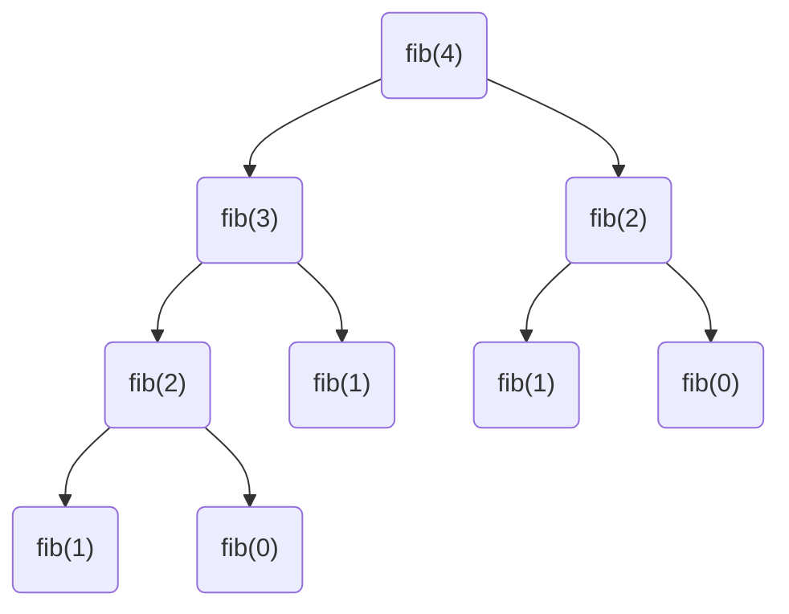

# DP

## Concept

The dynamic programming problem is actually: Recursion + Memoization

**Recursion**:

fibonacci sequence

$$
F(n) = \left\{
\begin{array}{ll}
      0 & n = 0 \\
      1 & n = 1 \\
      F(n - 1) + F(n - 2) & n > 1 \\
\end{array} 
\right.
$$

Get n<sup>th</sup> number in fibonacci sequence

```java
int fib(int n) {
    return n < 2 ? 1 : (Fib(n - 1) + Fib(n - 2));
}
```

However, the code above is quite time-consuming while n is a large integer  
That’s because we have to recalculate each previous term to solve each term.

For example, to solve fib(6), we have to calculate fib(5), fib(4)... which may have been calculated before



**Memoization**:

To solve recalculate problem, we can store every result after calculation

```java
int Fibonacci(int n) {
    if (n == 1 || n == 2)
        return 1;
    else if (n <= 0)
        return 0;
    else if (memo[n] == 0) // if not calculated
        memo[n] = Fibonacci(n - 1) + Fibonacci(n - 2);
    return memo[n]; // if calculated, directly return the value
}
```

**DP Concept:**

The example above is a classic dp problem.

**Idea**: Remember the results of each previous run, recur from the first item to the last to solve the final result

**Concepts**:

**Each item** in the process **is called state**, thus, any target value we want to solve is actually a state.

**Dynamic** is that there’re many states, and we have to **transfer between these states** with an **optimal route** (state transition equation).

## Example

### Q1-medium

[Ugly Number](https://leetcode.com/problems/ugly-number-ii/), level <span style="color:orange">medium</span>

An ugly number is a positive integer whose prime factors are limited to `2`, `3`, and `5`.

**Example 1:**

```
Input: n = 10
Output: 12
Explanation: [1, 2, 3, 4, 5, 6, 8, 9, 10, 12] is the sequence of the first 10 ugly numbers.
```

**Example 2:**

```
Input: n = 1
Output: 1
Explanation: 1 has no prime factors, therefore all of its prime factors are limited to 2, 3, and 5.
```

**Solution**

use an array *k* to store first n ugly numbers

**state** is each ugly number

Because ugly numbers are only divisible by 2, 3, 5

Thus, **state transition equation:** 

- k[i] = min( k[ptr2] \* 2, k[ptr3] \* 3, k[ptr5] \* 5 )

> Explanation:
> 
> - First, k[1] = min( k[0] \* 2, k[0] \* 3, k[0] \* 5 ). The answer is k[0] \* 2. So we move 2's pointer to 1.
> - Then, k[2] = min( k[1] \* 2, k[0] \* 3, k[0] \* 5 ). 
> - ...
>
> Be careful about the cases such as 6, in which we need to forward both pointers of 2 and 3.

```java
public static int nthUglyNumber(int n) {
    // special cases
    if (n < 0) return 0;
    if (n == 1) return 1;

    // normal cases
    int[] nums = new int[n];
    nums[0] = 1;
    int ptr2 = 0, ptr3 = 0, ptr5 = 0;

    for (int i = 1; i < n; ++i) {
        nums[i] = Math.min(Math.min(nums[ptr2] * 2, nums[ptr3] * 3), nums[ptr5] * 5);
        // forward the pointers
        if (nums[ptr2] * 2 == nums[i])
            ptr2++;
        if (nums[ptr3] * 3 == nums[i])
            ptr3++;
        if (nums[ptr5] * 5 == nums[i])
            ptr5++;
    }

    return nums[n - 1];
}
```

### Q2-hard

[Best Time to Buy and Sell Stock - LeetCode](https://leetcode.com/problems/best-time-to-buy-and-sell-stock-iv/), level <span style="color:red">hard</span>

Given an integer array `prices` where `prices[i]` is the price of a given stock on the i<sup>th</sup> day, and an integer `k`.

Find the maximum profit you can achieve. You may complete at most `k` transactions.

**Note:** You may not engage in multiple transactions simultaneously (i.e., you must sell the stock before you buy again).

**Example 1:**

```
Input: k = 2, prices = [2,4,1]
Output: 2
Explanation: Buy on day 1 (price = 2) and sell on day 2 (price = 4), profit = 4-2 = 2.
```

**Example 2:**

```
Input: k = 2, prices = [3,2,6,5,0,3]
Output: 7
Explanation: Buy on day 2 (price = 2) and sell on day 3 (price = 6), profit = 6-2 = 4. Then buy on day 5 (price = 0) and sell on day 6 (price = 3), profit = 3-0 = 3.
```

**Solution**

**state** is maximum profit with at most j transactions on day i

store states in an array:

- DP\[k][i] - Maximum profit with at most j transactions on day i

**state transition equation**:

- DP\[k][i] = Math.max(DP\[k][i - 1], prices[i] + tmpMax)
- tmpMax = Math.max(tmpMax, DP\[k - 1][i - 1] - prices[i])

```java
public int maxProfit(int times, int[] prices) {
    // times + 1 is to prevent array out of bound
    int[][] DP = new int[times + 1][prices.length];

    for (int k = 1; k < times + 1; ++k) {
        // tmpMax records the most money remaining after buying stock
        int tmpMax = -prices[0];
        for (int i = 1; i < prices.length; ++i) {
            /*
             * DP[k][i - 1] : means yesterday's profit
             * prices[i] + tmpMax : means the total profit if we sell the stock today
             * DP[k][i] : record the max profit we can achieve till now
             */
            DP[k][i] = Math.max(DP[k][i - 1], prices[i] + tmpMax);
            /*
             * DP[k - 1][i - 1] - prices[i] : the most money left after buying stock
             */
            tmpMax = Math.max(tmpMax, DP[k - 1][i - 1] - prices[i]);
        }
    }

    // return the last state
    return DP[times][prices.length - 1];
}
```

