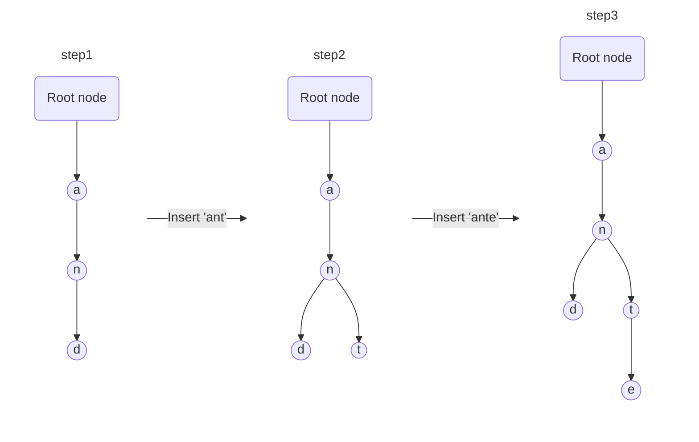
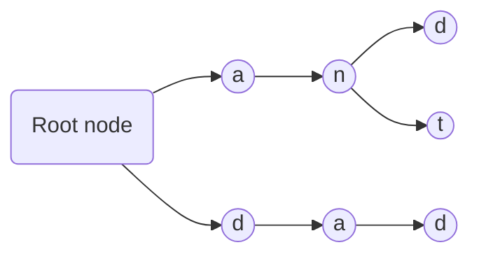

# Tree

## Binary Tree

### Concept

[Properties - geeksforgeeks ](https://www.geeksforgeeks.org/properties-of-binary-tree/)

| Prop |                         Description                          |
| :--: | :----------------------------------------------------------: |
|  1   | The maximum number of nodes **at level i** of a binary tree is $2^{(i-1)}$ (i>=1) |
|  2   | The maximum number of nodes **of height h** in a binary tree is $2^{h}–1$ (h>=1) |
|  3   | In a binary tree **with n nodes**, minimum possible **height** is $\log_2(n+1)$, rounded up |
|  4   | A binary tree **with n leaves** has **at least** $\mid\log_2n\mid+1$ levels (full binary tree) |
|  5   | In Binary tree where every node has 0 or 2 children (full binary tree),<br/>the **number of leaf nodes** is always one more than nodes with two children.<br/>Because $2^{h-1}=2^{0}+2^{1}+\cdots+2^{h-1-1}+1$, h is height |

### Tree Traversals

Trees can be traversed in different ways: Preorder, Inorder, Postorder

<div style="clear:both"></div>

- **In-order traversal:**

  4, 10, 12, 15, 18, 22, 24, 25, 31, 35, 44, 50, 66, 70, 90

- **Pre-order traversal:**

  25, 15, 10, 4, 12, 22, 18, 24, 50, 35, 31, 44, 70, 66, 90

- **Post-order traversal:**

  4, 12, 10, 18, 24, 22, 15, 31, 44, 35, 66, 90, 70, 50, 25

**Use example：**

Node definition:

```java
class Node {
    int key;
    Node left, right;

    public Node(int item) {
        key = item;
        left = right = null;
    }
}
```

Entry function:

```java
public static void main(String[] args) {
    // Init data
    BinaryTree tree = new BinaryTree();
    tree.root = new Node(1);
    tree.root.left = new Node(2);
    tree.root.right = new Node(3);
    tree.root.left.left = new Node(4);
    tree.root.left.right = new Node(5);

    System.out.println("\n traversal of binary tree is: ");
    // Traversal function call
    tree.printPreorder();
}
```

#### Inorder

In the case of binary search trees (BST), Inorder traversal gives nodes in **non-decreasing order**.

> When you do the inorder traversal of a binary tree, the neighbors of given node are called: 
>
> - **Predecessor** (the node lies ahead of given node)
> - **Successor** (the node lies behins of given node)

##### Recursive

```java
// Root of Binary Tree
Node root;

BinaryTree() {
    root = null;
}

/* Given a binary tree, print its nodes in inorder */
void printInorder(Node node) {
    if (null == node) return;

    // first recur on left child
    printInorder(node.left);

    // then deal with the node
    System.out.print(node.key + " ");

    // now recur on right child
    printInorder(node.right);
}

// Wrappers over above recursive functions
void printInorder() {
    printInorder(root);
}
```

**Time Complexity:** O(N)

**Space complexity:** The worst case space required is O(n), and in the average case it's O(log n) where n is the number of nodes.

**Auxiliary Space:** If we don’t consider the size of the stack for function calls then O(1) otherwise O(h) where h is the height of the tree. 

##### Morris Traversal

In this method, we have to use a new data structure - Threaded Binary Tree

A binary tree is made threaded by: making all right child pointers that would normally be NULL point to the inorder successor of the node (if it exists).

**For example:**

```
          1
        /   \
       2     3
      / \   /
     4   5 6
```

First, 1 is the root, so initialize 1 as current, 1 has left child which is 2

The current's left subtree is:

```
         2
        / \
       4   5
```

So in this subtree, the rightmost node is 5, then make the current(1) as the right child of 5. Set current = cuurent.left (current = 2).

The tree now looks like:

```
         2
        / \
       4   5
            \
             1
              \
               3
              /
             6
```

For current 2, which has left child 4, we can continue with thesame process as we did above

```
        4
         \
          2
           \
            5
             \
              1
               \
                3
               /
              6
```

Then add 4 because it has no left child, then add 2, 5, 1, 3 one by one, for node 3 which has left child 6, do the same as above. 

Finally, the inorder taversal is [4, 2, 5, 1, 6, 3]

**Example code:**

```java
class Solution {
    public List<Integer> inorderTraversal(TreeNode root) {
        List<Integer> res = new ArrayList<>();
        TreeNode curr = root;
        TreeNode pre;
        while (curr != null) {
            if (curr.left != null) { // has a left subtree
                pre = curr.left;
                while (pre.right != null) { // find rightmost
                    pre = pre.right;
                }
                pre.right = curr; // put curr after the pre node
                
                TreeNode temp = curr; // store curr node temporarily
                curr = curr.left; // go to next node
                temp.left = null; // original curr left be null, avoid infinite loops
            } else {
                res.add(curr.val);
                curr = curr.right; // move to next right node
            }
        }
        return res;
    }
}
```

#### Preorder

Preorder traversal is used to **create a copy** of the tree.

Preorder traversal is also used to get prefix expressions on an expression tree.

```java
// Root of Binary Tree
Node root;

BinaryTree() {
    root = null;
}

/* Given a binary tree, print its nodes in preorder */
void printPreorder(Node node) {
    if (null == node)
        return;

    // first deal with the node
    System.out.print(node.key + " ");

    // then recur on left subtree
    printPreorder(node.left);

    // now recur on right subtree
    printPreorder(node.right);
}

// Wrappers over above recursive functions
void printPreorder() {
    printPreorder(root);
}
```

**Time Complexity:** O(N)

**Space complexity:** The worst case space required is O(n), and in the average case it's O(log n) where n is the number of nodes.

**Auxiliary Space:** If we don’t consider the size of the stack for function calls then O(1) otherwise O(h) where h is the height of the tree. 

#### Postorder

Postorder traversal is used to delete the tree, because before deleting the parent node, we should delete its child nodes first.

Postorder traversal is also useful to get the postfix expression of an expression tree.

```java
// Root of Binary Tree
Node root;

BinaryTree() {
    root = null;
}

/* Given a binary tree, print its nodes according to the "bottom-up" postorder traversal. */
void printPostorder(Node node) {
    if (null == node)
        return;

    // first recur on left subtree
    printPostorder(node.left);

    // then recur on right subtree
    printPostorder(node.right);

    // now deal with the node
    System.out.print(node.key + " ");
}

// Wrappers over above recursive functions
void printPostorder() {
    printPostorder(root);
}
```

**Time Complexity:** O(N)

**Space complexity:** The worst case space required is O(n), and in the average case it's O(log n) where n is the number of nodes.

**Auxiliary Space:** If we don’t consider the size of the stack for function calls then O(1) otherwise O(h) where h is the height of the tree. 

## Prefix Tree

### Concept

A [**trie**](https://en.wikipedia.org/wiki/Trie) (pronounced as "try") or **prefix tree** is a tree data structure used to efficiently store and retrieve keys in a dataset of strings.

There are various applications of this data structure, such as autocomplete and spellchecker.

**Node structure**:

```java
class TrieNode {
    // children nodes
    TrieNode[] children = new TrieNode[ALPHABET_SIZE];
    // isEndOfWord is true if the node represents end of a word
    boolean isEndOfWord;
}
```

**Insert operation**:



In step 3, "isEndOfWord" is true in three nodes: "d", "t", "e"

**Search operation**:



For example, search for "dad".

The algorithm compares the characters and moves down eventually to node "d", and check if 'isEndOfWord' is true, if yes, then "dad" is found.

### Example

**Trie Node**:

```java
class TrieNode {
    // children nodes array
    private TrieNode[] children;
    private final int ALPHABET_SIZE = 26;
    // represent if the character is the end of a word
    private boolean isEnd;

    public TrieNode() {
        children = new TrieNode[ALPHABET_SIZE];
    }
    // check if the key is contained
    public boolean containsKey(char ch) {
        return null != children[ch - 'a'];
    }
    // get a certain child node
    public TrieNode get(char ch) {
        return children[ch - 'a'];
    }
    // set a child node
    public void put(char ch, TrieNode node) {
        children[ch - 'a'] = node;
    }
    public void setEnd() {
        isEnd = true;
    }
    public boolean isEnd() {
        return isEnd;
    }
}
```

**Operations**:

```java
public class Trie {
    private TrieNode root;
    public Trie() {
        root = new TrieNode();
    }
    ...
}
```

Insert:

```java
// Inserts a word into the trie.
public void insert(String word) {
    TrieNode node = root;
    int len = word.length();
    for (int i = 0; i < len; ++i) {
        char cur = word.charAt(i);
        if (!node.containsKey(cur))
            node.put(cur, new TrieNode());
        node = node.get(cur);
    }
    node.setEnd();
}
```

Search:

```java
// Returns if the word is in the trie.
public boolean search(String word) {
    TrieNode node = searchPrefix(word);
    return null != node && node.isEnd();
}

// Search a prefix or whole key in trie and
// returns the node where search ends
private TrieNode searchPrefix(String word) {
    TrieNode node = root;
    int len = word.length();
    for (int i = 0; i < len; ++i) {
        char cur = word.charAt(i);
        if (node.containsKey(cur))
            node = node.get(cur);
        else
            return null;
    }
    return node;
}
```

