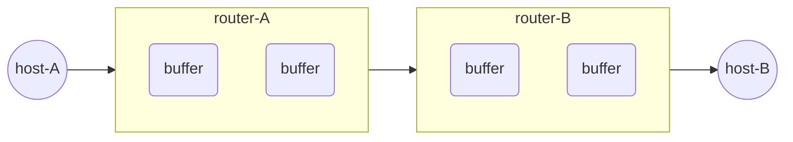

# 进程/线程

## 进程

### 概述

什么是进程？

进程，是指计算机中已执行的程序。进程曾经是分时系统（time-sharing）的基本运作单位。在面向进程设计的系统中，进程是程序的基本执行实体；在面向线程设计的系统中，进程本身不是基本执行单位，而是线程的容器。程序本身只是指令、数据及其组织形式的描述，相当于一个名词，进程才是程序的真正执行实例

进程是对正在运行中的程序的过程的一个抽象，保存了程序在运行时所需的资源

伪并行：

- 严格来说，在某个瞬间，CPU 只能运行一个进程
- 伪并行是指单核或多核处理器同时执行多个进程，从而使程序更快
- 因为 CPU 执行速度很快，进程间的换进换出也非常迅速，因此我们很难对多个并行进程进行跟踪

### 进程的创建

- 系统初始化（init）

  启动操作系统时，通常会创建若干个进程

  - 前台进程
  - 守护进程

- 正在运行的程序执行了创建进程的系统调用（如 fork）

- 用户请求创建一个新进程

- 初始化一个批处理工作

  这种创建进程的情形会在大型机的批处理系统中应用  
  用户在这种系统中提交批处理作业，当操作系统决定它有资源来运行另一个任务时，它将创建一个新进程并从其中的输入队列中运行下一个作业

以下为相关命令（了解）：

<table style="width:50rem">
    <thead>
        <tr style="text-align:left">
            <th width=20%>UNIX</th>
            <th width=30%>Win32</th>
            <th width=50%>说明</th>
        </tr>
    </thead>
    <tbody>
        <tr>
            <td>fork</td>
            <td>CreateProcess</td>
            <td>创建一个新进程</td>
        </tr>
        <tr>
            <td>waitpid</td>
            <td>WaitForSingleObject</td>
            <td>等待一个进程退出</td>
        </tr>
        <tr>
            <td>execve</td>
            <td>none</td>
            <td>CraeteProcess = fork + service</td>
        </tr>
        <tr>
            <td>exit</td>
            <td>ExitProcess</td>
            <td>终止执行</td>
        </tr>
        <tr>
            <td>open</td>
            <td>CreateFile</td>
            <td>创建一个文件或打开一个已有的文件</td>
        </tr>
        <tr>
            <td>close</td>
            <td>CloseHandle</td>
            <td>关闭文件</td>
        </tr>
        <tr>
            <td>read</td>
            <td>ReadFile</td>
            <td>从单个文件中读取数据</td>
        </tr>
        <tr>
            <td>write</td>
            <td>WriteFile</td>
            <td>向单个文件写数据</td>
        </tr>
        <tr>
            <td>lseek</td>
            <td>SetFilePointer</td>
            <td>移动文件指针</td>
        </tr>
        <tr>
            <td>stat</td>
            <td>GetFileAttributesEx</td>
            <td>获得不同的文件属性</td>
        </tr>
        <tr>
            <td>mkdir</td>
            <td>CreateDirectory</td>
            <td>创建一个新的目录</td>
        </tr>
        <tr>
            <td>rmdir</td>
            <td>RemoveDirectory</td>
            <td>移除一个空的目录</td>
        </tr>
        <tr>
            <td>link</td>
            <td>none</td>
            <td>Win32 不支持 link</td>
        </tr>
        <tr>
            <td>unlink</td>
            <td>DeleteFile</td>
            <td>销毁一个已有的文件</td>
        </tr>
        <tr>
            <td>mount</td>
            <td>none</td>
            <td>Win32 不支持 mount</td>
        </tr>
        <tr>
            <td>umount</td>
            <td>none</td>
            <td>Win32 不支持 mount，所以也不支持 umount</td>
        </tr>
        <tr>
            <td>chdir</td>
            <td>SetCurrentDirectory</td>
            <td>切换当前工作目录</td>
        </tr>
        <tr>
            <td>chmod</td>
            <td>none</td>
            <td>Win32 不支持安全</td>
        </tr>
        <tr>
            <td>kill</td>
            <td>none</td>
            <td>Win32 不支持信号</td>
        </tr>
        <tr>
            <td>time</td>
            <td>GetLocalTime</td>
            <td>获取当前时间</td>
        </tr>
    </tbody>
</table>

### 进程的终止

- 正常退出（自愿的）

- 错误退出（自愿的）

  例：gcc 编译代码文件的时候发现错误，自行退出

- 严重错误（非自愿的）

  例：程序本身出错，比如空指针异常

  其实是中断了，但是没有终止

- 被其他进程杀死（非自愿的）

### 进程的层次结构

Linux 系统的进程有清晰的层次结构

Windows 中没有进程层次的概念，所有进程都是平等的  
唯一类似于层次结构的，是在创建进程的时候，父进程得到一个特别的令牌（称为句柄），该句柄可以用来控制子进程，不过这个句柄是可以转交给其他的进程

示例：

```ASCII
systemd─┬─ModemManager───2*[{ModemManager}]
        ├─NetworkManager───2*[{NetworkManager}]
        ├─VGAuthService
        ├─abrt-dbus───3*[{abrt-dbus}]
        ├─2*[abrt-watch-log]
        ├─abrtd
        ├─alsactl
        ├─atd
        └─auditd─┬─audispd─┬─sedispatch
                 │         └─{audispd}
                 └─{auditd}
```

### 进程的状态

运行、阻塞、就绪

- 运行：正在运行
- 阻塞：要等到某一个事件发生之后，才会运行
- 就绪：已经可以运行了，但是有其他的进程正在运行

进程 3 种状态的 4 种切换：

<div style="clear:both"></div>

还剩两种切换：

- 阻塞 → 运行，可能发生  
  假如一个进程在 I/O 上阻塞，当 I/O 完成后，且 CPU 处于空闲状态，那该精彩可以直接从阻塞态变为运行态
- 就绪 → 阻塞，不可能发生  
  就绪进程不能执行任何操作，因此也不可能被阻塞

### 进程的切换

类似中断发生的步骤：[中断详解](#中断详解)

**进程切换的代价是比较高的**：

1. 首先用户态必须切换到内核态，然后要保存当前进程的状态，包括在进程表中存储寄存器值以便以后重新装载  
   在许多系统中，内存映像（如：页表内的内存访问位）也必须保存
2. 接着，通过运行调度算法选定一个新进程
3. 之后，应将新进程的内存映像重新装入内存管理单元（MMU），最后新进程开始运行

进程切换可能会使**整个内存高速缓存和 TLB 失效**，强迫高速缓存从内存中**动态重新装入**两次（出入内核各一次），以确保进程找到正确的内存

**进程控制具体存储的信息**：

1. 进程标识
2. 状态信息（运行现场）
   1. 用户可见寄存器，如：程序中使用的数据、地址等
   2. 状态寄存器，如：程序计数器
   3. 栈指针，如：临时数据（过程调用、函数返回、中断的处理）
3. 控制信息
   1. 用于操作系统调度进程的信息
   2. 进程间通信
   3. 存储信息
   4. 进程所使用的资源
   5. 和本进程有关的数据结构信息（如：优先级、排队的队列等）

**进程和线程切换的异同**：

- 同：
  - 它们都需要从用户态切换成内核态
- 异：
  - 进程需要切换页目录以使用新的地址空间（切换虚拟内存）  
    线程使用同一个虚拟内存空间，不同的线程只是栈不一样
  - 进程切换还需使 [TLB](#TLB) 缓存（页表缓冲、CPU 高速缓存）无效

### 进程行为

<div style="clear:both"></div>

前者称为计算密集型（compute-bound），进程花费了绝大多数时间在 CPU 计算上  
后者称为 I/O 密集型（I/O-bound），进程花费绝大多数时间在等待 I/O 上

- 若进程是**计算密集型**，**进程**越多越好，更多长时间的 CPU 计算  
  更适合在多核 CPU 中运行，要求内存、硬盘的性能好一些，使进程间切换的时间尽量短，让更多的时间用在 CPU 计算上

  > 一般是指服务器的硬盘、内存硬件性能相对 CPU 好很多，或者使用率低很多  
  > 系统运行 CPU 读写 I/O（硬盘/内存）时可以在很短的时间内完成，几乎没有阻塞（等待 I/O）时间，而 CPU 一直有大量运算要处理，因此 CPU 负载长期过高

- 若进程是 **I/O 密集型**，则需要多开一些**线程**。因为线程颗粒度更小、速度更快、I/O 等待时间也更短  
  要求 CPU 性能好一些，更快完成计算，让更多时间用在 I/O 上

  > 一般是指服务器的 CPU 性能相对硬盘、内存硬件好很多，或者使用率低很多  
  > 系统运行时，多是 CPU 在等 I/O（硬盘/内存）的读写操作，此类情景下 CPU 负载并不高

随着 CPU 变得越来越快，更多的进程倾向为 I/O 密集型，未来对 I/O 密集型进程的调度处理似乎更为重要

---

## 线程

### 概述

什么是线程？

线程是操作系统能够进行运算调度的最小单位。大部分情况下，它被包含在进程之中，是进程中的实际运作单位。一条线程指的是进程中一个单一顺序的控制流，一个进程中可以并发多个线程，每条线程并行执行不同的任务

为什么要在进程的基础上再创建一个线程的概念？

- 多线程之间会共享同一块地址空间和所有可用数据的能力，这是进程所不具备的
- 线程要比进程更轻量级
- 线程可以并发执行  
  若多个线程都是 CPU 密集型的，那么并不能获得性能上的增强，但是如果存在着大量的计算和大量的 I/O 处理，拥有多个线程能在这些活动中彼此重叠进行，从而会加快应用程序的执行速度

### 线程的方案

- **单线程解决方案**

- **多线程解决方案**

  1. Web 服务器接收到用户的网络请求后，调度线程会把工作分配给空闲的线程（唤醒睡眠的工作线程）
  2. 工作线程会检测请求是否在高速缓存中，若存在，则直接取出
  3. 工作线程把页面返回给用户之后，就进入阻塞态，直到调度线程再次唤醒它
  
  <div style="clear:both"></div>
  
- **状态机解决方案**

  每次服务器从某个请求工作的状态切换到另一个状态时，都必须显式得保存或者重新装入相应的计算状态

<table style="width:40rem">
    <thead>
        <tr style="text-align:left">
            <th>模型</th>
            <th>特性</th>
        </tr>
    </thead>
    <tbody>
        <tr>
            <td>单线程</td>
            <td>无并行性，性能较差，阻塞系统调用</td>
        </tr>
        <tr>
            <td>多线程</td>
            <td>有并行性，阻塞系统调用</td>
        </tr>
        <tr>
            <td>有限状态机</td>
            <td>并行性，非阻塞系统调用、中断</td>
        </tr>
    </tbody>
</table>

### 线程的系统调用

1. 单线程通过某个库函数创建出一个新的线程
2. 该新线程因为某种原因退出
   - Exit - 线程完成工作后退出
   - Join - 线程运行过程中，添加进来一个线程，要等待其执行完后，才能继续
   - yield - 允许当前线程自动放弃 CPU，让另一个线程运行（用户态线程无法利用时钟中断强制让出 CPU）
3. 线程消失

### POSIX

为了使编写可移植线程程序成为可能，IEEE 在 IEEE 标准 1003.1c 中定义了线程标准

<table style="width:40rem">
    <thead>
        <tr style="text-align:left">
            <th width=45%>线程调用</th>
            <th width=55%>描述</th>
        </tr>
    </thead>
    <tbody>
        <tr>
            <td>pthread_create</td>
            <td>创建一个新线程</td>
        </tr>
        <tr>
            <td>pthread_exit</td>
            <td>结束调用的线程</td>
        </tr>
        <tr>
            <td>pthread_join</td>
            <td>等待一个特定的线程退出</td>
        </tr>
        <tr>
            <td>pthread_yield</td>
            <td>释放 CPU 来运行另外一个线程</td>
        </tr>
        <tr>
            <td>pthread_attr_init</td>
            <td>创建并初始化一个线程的属性结构</td>
        </tr>
        <tr>
            <td>pthread_attr_destory</td>
            <td>删除一个线程的属性结构</td>
        </tr>
    </tbody>
</table>


### 线程的实现

- 在用户空间中实现线程
- 在内核空间中实现线程
- 在用户和内核空间中混合实现线程

**用户空间中实现线程**：

- 内核只有进程表，不知道线程的存在

- 线程运行在运行时系统之上（运行时系统也就是运行时环境，是管理线程过程的一整套集合）

- 优势：

  - 运行在用户空间，启动比进行内核调用效率更高  
    因而不用切换到内核态，也就不用上下文切换，也不用对内存高速缓存进行刷新，因为线程调度非常便捷，因此效率比较高
  - 它允许每个进程有自己定制的调度算法
  - 有更大扩展性  
    内核的空间是固定的，线程也是需要线程表，若内核线程数量过大，会出问题

  劣势：

  - 阻塞系统调用，会导致阻塞整个进程  
    用户级线程在内核眼中是不存在的，内核能看到的只有进程  
    所以某个用户级线程调用了会阻塞的系统调用，在内核看来就是进程调用了这个系统调用，然后内核会阻塞整个进程以及它下面的所有线程  
    就像软件的未响应

    > 例：线程中出现缺页问题，需要去硬盘中取，此时线程就发生了阻塞

  - 不可能使用轮转调度的方式调度线程  
    在用户空间内，线程没有时钟中断，就不能让出 CPU，线程只能按序执行（这是写死的）

<div style="clear:both"></div>

**内核空间中实现线程**：

- 线程无需运行在运行时系统中，直接运行在内核中

- 线程表放到了内核空间中

- 优势：

  - 线程可以使用轮转调度的方式调度，全部通过系统调用

  - 一个线程发送阻塞，不影响其他的线程  
    内核可以根据选择，运行另一个进程的线程；而用户空间实现的线程中，运行时系统始终运行本进程中的线程

    > 例：线程中出现缺页问题，需要去硬盘中取，此时因为内核空间中有线程表，内核可以在该线程发送阻塞的时候，去执行其他线程。缺点就是系统调用的开销较大

  劣势：

  - 内核创建和销毁线程的开销较大  
    有一种解决方案：进行线程回收，销毁线程只是把该线程的状态设置为不可用，创建则是把状态设置为可用

<div style="clear:both"></div>

**混合实现线程**：

- 在一些系统中，使用组合方式的多线程实现，线程创建完全在用户空间中完成，线程的调度和同步也在应用程序中进行，一个应用程序中的多个用户级线程被映射到一些（小于或等于用户级线程的数目）内核级线程上
- 内核只识别内核级线程，只对内核线程进行调用
- 优势：
  - 一个内核线程会被多个用户线程复用（多路复用）  
    每个内核级线程有一个可以轮流使用的用户级线程集合 

<div style="clear:both"></div>

---

## 进程间通信

需要解决的三个问题：

1. 进程如何传递消息给其他进程
2. 如何确保两个或多个线程之间不会相互干扰  
   如：两个航空公司都试图为不同的顾客抢购飞机上的最后一个座位
3. 数据的先后顺序的问题  
   如：进程 A 产生数据并且进程 B 打印数据，则进程 B 打印数据之前需要先等 A 产生数据后才能够进行打印

### 竞态条件

竞态条件（race condition）：两个或多个 进程/线程 同时对一个共享数据进行读写，从而影响程序运行的正确性

- 解决：禁止一个或多个 进程/线程 在同一时刻对共享资源（包括共享内存、共享文件等）进行读写
- 问题：若正在读写共享资源的 进程/线程 卡死，则影响了其他所有要范围该静态资源的  进程/线程

### 临界区

访问临界资源的程序片段称为 临界区/关键区域（Critical Section），临界资源是一次仅允许一个进程使用的共享资源

对解决方案的要求：

- 任何时候两个进程不能同时处于临界区
- 不应该对 CPU 的速度和数量做任何假设
- 位于临界区外的进程不得阻塞其他进程
- 不能使任何进程无限等待进入临界区

<div style="clear:both"></div>

### 忙等互斥

为了达到上图所示的理想效果，诞生了许多解决方案：

- 屏蔽中断
- 锁变量
- 严格轮询法（round-robin）
- Peterson 算法
- TSL/XCHG 指令

这些解决方案，本质都是一样的，检查是否能进入临界区，若不能则等待直到可以进入

**共同缺点**：有可能会产生忙等待  
从而延伸出了睡眠和唤醒的概念来解决忙等待，但又有一个问题：有界缓冲区问题（生产者-消费者）

#### 屏蔽中断

**概括**：常用于内核更新某些变量与表项，而一般不用于用户态。原因：时钟中断也被屏蔽，用户态进程执行慢，使其他程序无法被调度

在单处理器系统上，最简单的解决方案是，让每个进程在进入临界区后立即屏蔽所有中断，并在离开时重新启用  
在多核处理器中一般只针对一个核心进行中断屏蔽

- 对于用户进程，可能还是劣势居多  
  因为用户进程非常多，且执行速度较慢，会产生很多问题：  
  1\. 当有许多进程同时申请进入临界区域，那如何决定让哪个先进入？  
  2\. 当进程进入临界区域后，用户进程关闭中断，若经过较长时间后进程还没离开，那中断一直启用不了，就会导致系统崩溃  
  3\. 一个处理器核心屏蔽中断，其他处理器核心还是可以访问共享资源，问题还是存在
- 对内核来说，屏蔽中断非常管用  
  因为本身在内核中进程就不多，而且执行速度一般比用户进程快得多，几乎不会出现竞态条件，所以屏蔽中断很有效

#### 锁变量

**概括**：这是软件层面的解决方案，这个方案只能减少问题发生的概率，因为依然有可能发生竞争条件（不过若有指令集的支持，把对锁的操作变为原子操作，就能真正实现互斥）

锁变量解决方案：

<div style="clear:both"></div>

可能发生竞争条件问题：  
当一个进程读取了锁变量但还未来得及修改时，另一个进程也读取了锁变量

<div style="clear:both"></div>

#### 严格轮询法

**概括**：一般只有在 确定进程等待时间（其他进程执行时间）很短 和 进程执行时间差距不大 的时候，才会采用严格轮询法

思路：对进程进行编号，进程进行忙等待，不断检测是否轮到自己，轮到了再进入临界区

问题：

1. 浪费时间，因为一直在进行检查

2. 一个进程无法连续两次进入临界区  
   例：进程 0 执行离开临界区后，必须要等进程 1 执行完非临界区操作，进入过临界区之后，才能再次进入临界区  
   此时若进程 1 的非临界区操作执行时间太长，进程 0 就会一直等待，而临界区一直处于闲置状态，没有进程访问，造成资源浪费

   这就违背了 “位于临界区外的进程不得阻塞其他进程” 的要求

伪代码：

```c
// 进程 0，死循环检测是否轮到自己
while(1) {
    // turn 表示轮到哪一个进程
    while(turn == 0) {
        /* 进入临界区 */
        critical_region();
        turn = 1;
        /* 离开临界区 */
        non_critical_region();
    }
}

// 进程 1
while(1) {
    while(turn == 1) {
        critical_region();
        turn = 0;
        non_critical_region();
    }
}
```

#### Peterson 算法

**概括**：在锁变量 turn 的基础上，增加警告变量  interested，用于对想要进入临界区的程序进行排队，打破了严格轮换法中排列是固定的这一效率限制。在严格轮换法中，临界区与非临界区的代码存在较高的耦合度，互斥的实现依赖于应用程序员的设计；而 Peterson 算法，可以作为操作系统对临界区操作的底层封装，这就实现了与上层调用者的隔离

思路：  
想要进入临界区的 进程/线程，先在 interested 数组中标明感兴趣，然后将轮流号 turn 交给别的进程  
\- 若别的 进程/线程 不感兴趣，自己就进入了临界区  
\- 若别的 进程/线程 感兴趣，谁先让出轮流号 turn，谁就将获得别人在其后让出的轮流号，得以进入临界区  
当已经进入临界区的进程退出临界区，并在 interested 数组中标明其不再感兴趣，其他感兴趣的进程才能进入临界区

伪代码：

```c
#define TRUE 1
#define FALSE 0
#define N 2 // 进程总数

int turn; // 记录现在轮到哪个进程
// 若要使用临界区，各个进程使用格子的进程号作为参数来调用函数

// 记录进程是否在临界区中，初始值为 0 FALSE，用于对想要进入临界区的进程进行排队
int interested[N];

// 进入临界区
void enter_region(int process) {
    int other = 1 - process; // 另外一个进程
    interested[process] = TRUE; // process 进程状态改为 在临界区中
    turn = other;

    // 空循环等待，other is interested and it's not my turn
    while(turn == other && interested[other] == TRUE) {}

    // other is not interested or it's my turn
    critical_region();
}

// 离开临界区
void leave_region(int process) {
    interested[process] == FALSE;
    non_critical_region();
}
```

- **情况 1**，进程 0 进入临界区，之后进程 1 执行 enter_region()：

  进程 0 执行 enter_region()，other is not interested，则进入临界区，此时 turn = 1，interested\[0] = TRUE;  
  之后进程 1 执行 enter_region()，turn = 0 并且 interested\[0] = TRUE，空循环会一直执行，直到进程 0 退出临界区

- **情况 2**，进程 0 和 进程 1 同时执行 enter_region()：

  turn 的值为最后保存进去的进程号  
  若 turn = 1  
  进程 0 的空循环条件满足（turn = 1，interested\[1] = TRUE），于是执行空循环开始等待  
  进程 1 的空循环条件不满足，turn = 1，it's my turn，进入临界区

#### TSL/XCHG 指令

**概述**：执行 TSL/XCHG 指令的 CPU 将会**锁住内存总线**，用来禁止其他 CPU 在这个指令结束前访问内存。注意：锁住内存总线和禁用中断不一样，禁用中断无法禁止其他 CPU 对内存中共享资源的访问

无论是严格轮换法，还是 Peterson 算法，都是将并发的程序进行排队，避免了多个 进程/线程 同时进入临界区，用于表示队列的数组变量相当于是多个锁，程序要想进入临界区，就要挨个打开所有的锁

单独一个锁变量不能实现互斥的原因在于，在 进程/线程 检查锁是打开状态之后，可能还没来得及上锁以独享资源，就有其他 进程/线程 也通过了对锁的检查而进入临界区；所以，若能实现对锁变量的读取与之后修改的原子性，就可以使用一个锁来实现互斥了，这需要指令集的支持

TSL 示例：

enter_region 中，若进入临界区失败，则一直循环测试锁。由于时钟超时的作用，内核会调度其他进程运行，所以不会卡死

```assembly
enter_region:
    | 复制锁到寄存器，并将锁设置为 1
    TSL REGISTER, LOCK
    | 锁是 0 吗？
    CMP REGISTER, #0
    | 若不是 0，说明锁已经被设置，进行循环
    JNE enter_region
    | 返回调用者，进入临界区
    RET

leave_region:
    | 在锁中存入 0
    MOVE LOCK, #0
    | 返回调用者
    RET
```

XCHG 示例：

```assembly
enter_region:
    MOVE REGISTER, #1      | 把 1 放入内存器中
    XCHG REGISTER, LOCK    | 交换寄存器和锁变量的内容
    CMP REGISTER, #0       | 锁是 0 吗？
    JNE enter_region       | 若不是 0，说明锁已经被设置，进行循环
    RET                    | 返回调用者，进入临界区

leave_region:
    MOVE LOCK, #0          | 在锁中存入 0
    RET                    | 返回调用者
```

---

### 生产者-消费者问题

生产者-消费者问题 也叫 有界缓冲区问题

生产者负责生产数据并放入缓冲区，消费者负责读取并删除数据  
若缓冲区满了，则生产者睡眠，消费者被唤醒  
若缓冲区空了，则消费者睡眠，生产者被唤醒

#### 不完善实现

代码示例

```c
/* 缓冲区 solt 数据槽的数量 */
#define N 100
/* 缓冲区监视变量，监视缓冲区中数据总量 */
int cnt = 0;

/* 生产者 */
void producer() {
    int item;
    while(1) {
        // 若缓冲区满了，则生产者进入睡眠
        if (cnt == N) {
            sleep();
        }
        item = produceItem(); // 生成下一条数据
        cnt++;
        insertItem(item); // 向缓冲区中插入一条数据
        // 若缓冲区不再空了，就唤醒消费者
        if (cnt == 1) {
            wakeup(consumer); // 唤醒消费者
        }
    }
}

/* 消费者 */
void consumer() {
    int item;
    while(1) {
        // 若缓冲区空了，消费者进入睡眠
        if (cnt == 0) {
            sleep();
        }
        item = removeItem(); // 从缓冲区中读取并删除一条数据
        cnt--;
        // 若缓冲区不再满了，就唤醒生产者
        if (cnt == N - 1) {
            wakeup(producer);
        }
    }
}
```

以上代码**可能导致竞争条件**，进而引发死锁

考虑以下情况：

1. 消费者读取 cnt 为 0，应该睡眠，但是在执行 sleep() 之前被中断，CPU 转而开始执行生产者
2. 生产者生成一个数据放入缓冲区，cnt = 1，于是唤醒消费者，但是消费者没有睡眠，于是不起作用（唤醒信号丢失）
3. 消费者恢复执行后，执行 sleep()，此后再也没有机会唤醒消费者了
4. 生产者不停生产数据直至填满缓冲区，生产者也进入睡眠
5. 由于两个进程都进入了睡眠，死锁情况出现了

**不完善的解决方案**：

可以加一个监视变量 wakeupFlag，若 wakeup 信号发送给了没有在睡眠的进程，就让 wakeupFlag = 1  
当进程尝试睡眠的时候，若检测到 wakeupFlag 为 1，则不睡眠并把 wakeupFlag 恢复为 0

该方案的缺点是一个监视变量只能监视一个进程，不灵活

### 信号量

信号量（semaphore）又称为信号标，是一个**同步**对象，保持在 0 至指定最大值之间的一个计数值

**概念**：  
信号量是在多线程环境下使用的一种设施，负责协调各个进程，以保证它们能够正确、合理的使用公共资源  
信号量可以实现**多个同类资源的多线程互斥和同步**

原子化（atomic）的两个操作（**PV 原语**）：

- Down（减少并检验）  
  检查信号量，值 - 1，若等于 0 则睡眠
- Up（增加并检验）  
  检查信号量，值 + 1，若加之前为 0 则唤醒

以上两个都是**原子操作**，不会被打断（相当于是在执行时，屏蔽了所有中断），由于这些动作只需要几条指令，所以屏蔽中断不会带来什么副作用

**注意**：在执行 down 或 up 操作导致线程睡眠之后，down 或 up 是还没有执行完毕的，只是阻塞了

> 多个进程共用一个信号量：
>
> 例：在生产者-消费者问题中，假设存在多个生产者与消费者，能只用一个信号量来<u>记录对消费者进程可能的 睡眠/唤醒 信号</u>
>
> - 假设当前信号量为 0，有 3 个消费者进程先后尝试执行，则其无法完成 down 操作，信号量上有 3 个进程进入睡眠状态。此时，down 操作还未执行完毕
> - 此后，若生产者进程被调用，则其在信号量上执行 up 操作，由于 3 个消费者进程在该信号量上被阻塞，操作系统会随机选择其中一个进程唤醒，此时该信号量上的睡眠进程数变为 2
> - 因为被唤醒的进程的 down 操作执行完后，会给信号量 -1，信号量变为 0。相当于消耗了一个信号，唤醒一个消费者

**解决方法**：

1. 使用一个整型变量来累计唤醒次数，供以后使用

   down 操作将值 -1 相当于是用掉一个保存的唤醒信号，值为 0 是就是唤醒信号用完了，进入睡眠

2. 原子操作 up、down，检查数值、可能的睡眠/唤醒操作、修改变量值 是单一的，不可分割的**原子操作**  
   在该操作完成或阻塞前，其他进程都不允许访问该信号量，这也就解决了上面不完善方案的问题

   若使用多个 CPU，则每个信号量都应由一个锁变量进行保护。通过 TSL 或 XCHG 指令来确保同一时刻只有一个 CPU 在对信号量进行操作

代码示例：

信号量 full 和 empty 用来**保证某种事件的顺序发生或不发生**

```c
/* 缓冲区 solt 数据槽的数量 */
#define N 100
typedef int semaphore; // 信号量
semaphore mutex = 1;   // 控制临界区访问，值为 1 才能进入临界区（二元信号量）
semaphore empty = N;   // 缓冲区中的空槽数
semaphore full = 0;    // 缓冲区中的非空槽数

/* 生产者 */
void producer() {
    int item;
    while(1) {
        item = produceItem();
        down(&empty); // 空槽数 - 1，若为 0 则睡眠生产者
            down(&mutex); // 若 mutex 为 1 则进入缓冲区
                insertItem(item);
            up(&mutex); // 离开缓冲区
        up(&full); // 非空槽数 + 1，若加之前为 0 则唤醒消费者
    }
}

/* 消费者 */
void consumer() {
    int item;
    while(1) {
        down(&full); // 空槽数 - 1，若为 0 则睡眠消费者
            down(&mutex);
                removeItem(item);
            up(&mutex);
        up(&empty); // 非空槽数 + 1，若加之前为 0 则唤醒生产者
    }
}
```

在本例中，它们保证当缓冲区满的时候生产者停止运行，以及当缓冲区空的时候消费者停止运行

> **注意**：以上代码中，放入数据和删除数据前的两个 down 操作，顺序不能调换
>
> 假设生产者中的 down 交换了顺序，mutex 的值在 empty 前被 -1  
> 若缓冲区满了，那么生产者将阻塞，并且 mutex 的值为 0，一直占用着临界区  
> 当消费者访问临界区时，由于 mutex 为 0，也将阻塞  
> 生产者和消费者就都阻塞了，也将造成了 [死锁](#死锁)

**信号量和互斥量的区别**：

1. 信号量用于线程的同步；互斥量用于线程的互斥。这是信号量和互斥量的根本区别，也是同步和互斥之间的区别

2. 信号量值是非负整数；互斥量值只能是 0 或 1

   - 一个互斥量只能用于单个资源的互斥访问，不能实现多个资源的多线程互斥问题

   - 信号量可以实现多个同类资源的多线程互斥和同步  
     当信号量为单值信号量时，也可以完成一个资源的互斥访问  
     信号量是通过一个计数器控制对共享资源的访问，值是一个非负整数，所有通过它的线程都会将该整数 -1  
     若计数器值 > 0，则访问被允许，计数器 -1；若计数器值 == 0，则访问被禁止，所有试图通过它的线程都将处于等待状态

3. 信号量可以由一个线程得到，另一个线程释放；互斥量的加锁/解锁必须由同一线程执行

### 互斥量

若不需要信号量的计数能力，可以用信号量的一个简化版本 —— 互斥量（mutex）来实现**互斥**（mutual exclusion）

**概念**：  
Mutex 本质是一把锁，提供对资源的独占访问，所以 Mutex 主要作用是互斥  
Mutex 对象的值，只有 0 和 1，分别代表 Mutex 的两种状态：值为0, 表示锁定；值为1，表示空闲  
一个互斥量只能用于**一个资源的互斥访问**

互斥量仅仅适用于管理共享资源或一小段代码，由于互斥量在实现时既容易又有效，这使互斥量在实现**用户空间**线程包时非常有用

代码示例：

```assembly
mutex_lock:
    TSL REGISTER, M∪TEX    | 将互斥信号量复制到寄存器，并将互斥信号量置为 1
    CMP REGISTER, #0       | 互斥信号量是 0 吗？
    JZE ok                 | 若互斥信号量为 0，它被解锁，所以返回
    CALL thread_yield      | 互斥信号量忙，所以调度另一个线程
    JMP mutex_lock         | 稍后再试
ok: RET                    | 返回调用者，进入临界区

mutex_unlock:
    MOVE MUTEX,#0          | 将 mutex 置为 0
    RET                    | 返回调用者
```

> mutex_unlock 的代码和忙等互斥中[TSL/XCHG 指令](#TSL/XCHG 指令)实现方式的 enter_region 代码不同
>
> - enter_region 若进入临界区失败，则一直循环测试锁。由于时钟超时的作用，内核会调度其他进程运行，所以不会卡死
> - mutex_unlock 进入临界区失败后，会用 yield 调度另一个线程。因为互斥多用于用户空间，用户空间没有时钟中断

mutex_lock、mutex_unlock 都无需任何内核调用（yield 是在用户空间中调用线程调度程序），也就实现了在用户空间中的**同步**

#### Futex

> 随着并行的增加，更好的同步和锁机制对性能而言非常重要
>
> 在 Futex 之前，同步机制可以分为一下两种：
>
> - 用户态同步机制：
>
>   若等待时间短，自旋锁会很快；若等待时间长，则会浪费 CPU 周期
>
> - 内核同步机制：
>
>   若有很多竞争，那么阻塞此进程，并仅当锁被释放时，让内核解除阻塞会更加有效  
>   问题：在竞争激烈的情况下效果不错，但如果一开始只有很小的竞争，那不停地内核切换将花销很大。而且，预测锁竞争的数量并不容易
>
> futex（快速用户空间互斥）结合了以上两种方式的优点：1. 支持一种锁粒度的睡眠与唤醒操作；2. 管理进程挂起时的等待队列

futex 由两部分组成：

- 内核服务  
  提供一个等待队列，它允许多个进程在一个锁上等待
- 用户库  
  没有竞争时，futex 完全在用户空间工作

执行过程：

1. 线程执行原子操作 “减少并检验” 来夺取锁，若锁在释放状态，则夺取成功
2. 若锁被使用，则必须等待。futex 使用一个系统调用，将挂起的进程放入内核服务的等待队列中
3. 持有锁的线程执行 “增加并检验” 释放锁，并检查是否有进程阻塞在等待队列中，若有，则解除一个或多个进程的阻塞

#### Pthread 中的互斥量

Pthread 提供了 互斥量 和 条件变量 来实现同步机制

- 互斥量 - 在允许或阻塞对临界区的访问上很有用
- 条件变量 - 允许线程由于一些未达到的条件而阻塞
- 大部分情况下，这两种方法一起使用

**相关的 pthread 调用**：

- 互斥量的调用：

  <table style="width:50rem">
      <thead>
          <tr style="text-align:left">
              <th>线程调用</th>
              <th>描述</th>
          </tr>
      </thead>
      <tbody>
          <tr>
              <td>Pthread_mutex_init</td>
              <td>创建一个互斥量</td>
          </tr>
          <tr>
              <td>Pthread_mutex_destroy</td>
              <td>撤销一个已存在的互斥量</td>
          </tr>
          <tr>
              <td>Pthread_mutex_lock</td>
              <td>获得一个锁或阻塞</td>
          </tr>
          <tr>
              <td>Pthread_mutex_trylock</td>
              <td>获得一个锁或失败</td>
          </tr>
          <tr>
              <td>Pthread_mutex_unlock</td>
              <td>释放一个锁</td>
          </tr>
      </tbody>
  </table>

- 条件变量的调用：

  <table style="width:50rem">
      <thead>
          <tr style="text-align:left">
              <th>线程调用</th>
              <th>描述</th>
          </tr>
      </thead>
      <tbody>
          <tr>
              <td>Pthread_cond_init</td>
              <td>创建一个条件变量</td>
          </tr>
          <tr>
              <td>Pthread_cond_destroy</td>
              <td>撤销一个条件变量</td>
          </tr>
          <tr>
              <td>Pthread_cond_wait</td>
              <td>阻塞以等待一个信号</td>
          </tr>
          <tr>
              <td>Pthread_cond_signal</td>
              <td>向另一个线程发信号来唤醒它</td>
          </tr>
          <tr>
              <td>Pthread_cond_broadcast</td>
              <td>向多个线程发信号来全部唤醒它们</td>
          </tr>
      </tbody>
  </table>

**生产者-消费者问题**：

- 互斥量：生产者使用互斥量可以进行原子性检査，而不受其他线程干扰
- 条件变量：当发现缓冲区已经满了以后，生产者需要一种方法（条件变量）来阻塞自己并在以后被唤醒

### 管程

管程（monitor）是一个语言概念，为了更易于编写出正确的程序，避免不小心导致的错误

管程有一个很重要的特性，即任一时刻管程中只能有一个活跃进程，这一特性使管程能有效地完成互斥

> 管程是编程语言的组成部分，因此进入管程时的互斥由编译器负责，但通常的做法是用一个互斥量或二元信号量
>
> 因为是由编译器而非程序员来安排互斥，所以出错的可能性要小得多  
> 在任一时刻，写管程的人无须关心编译器是如何实现互斥的，他只需将所有的临界区转换成管程过程即可，决不会有两个进程同时执行临界区中的代码

C 语言不支持管程，因此以 Java 为例，编写生产者-消费者问题：

- 生产者、消费者代码

  ```java
  public class ProducerConsumer {
      static final int N = 100; // 缓冲区大小
      static Producer p = new Producer();
      static Consumer c = new Consumer();
      static MyMonitor monitor = new MyMonitor();
  
      static class Producer implements Runnable {
          @Override
          // run 方法包含了线程的代码
          public void run() {
              while(true) { // 生产者循环
                  monitor.insert(produceItem());
              }
          }
          public int produceItem() { ... }
      }
  
      static class Consumer implements Runnable {
          @Override
          public void run() {
              while(true) { // 消费者循环
                  consumeItem(monitor.remove());
              }
          }
          public int consumeItem(int item) { ... }
      }
  }
  ```

- 管程代码

  insert 和 remove 是两个同步方法，不会同时运行，因此不用担心竞争条件了

  ```java
  // 管程
  class MyMonitor {
      private int buffer[] = new int[N];
      private int cnt = 0; // 计数器，记录缓冲区中数据是数量
      private int low = 0, high = 0; // 索引缓冲区中第一个和最后一个数据的位置
      // 插入数据
      public synchronized void insert(int item) {
          if (N == cnt) { goToSleep(); }
          buffer[high] = item;
          high = (high + 1) % N;
          cnt++;
          if (0 == cnt) { notify(); /* Object 类中的方法 */}
      }
      // 读取并删除数据
      public synchronized int remove() {
          if (0 == cnt) { goToSleep(); }
          int item = buffer[low];
          low = (low + 1) % N;
          cnt--;
          if (N - 1 == cnt) { notify(); }
          return item;
      }
      // 睡眠
      public void goToSleep() {
          try {
              wait(); /* Object 类中的方法 */
          } catch(InterruptedException e) {
              e.printStackTrace();
          }
      }
  }
  
  public static void main(String args[]) {
      new Thread(p).start();
      new Thread(c).start();
  }
  ```

### 消息传递

> 以上的方式都是针对访问公共内存的一个或多个 CPU 的互斥问题  
> 若在一个分布式系统中有多个 CPU，且每个 CPU 有自己的私有内存，它们通过一个局域网相连，那么以上的原语将失效  
> 因此，信号量太低级，而管程在少数几种编程语言之外又无法使用，且这些原语均未提供机器间的信息交换方法  
> 因此就出现了消息传递来解决分布式系统的问题

消息传递类似信号量，是系统调用而不是语言成分

有两条**原语**（primitive）：

- send(destination, &message);  
  向一个给定目标发送一条消息
- receive(source, &message);  
  接收消息。若无消息可用，则接收者可能被阻塞，直到一条消息到达；或带着一个错误码立即返回

问题：

1. 发送的信息丢失

   解决：若接收到信息，接收方会立刻回一条特殊的确认（acknowledgement）消息。若发送方在一段时间内未收到确认，则重发消息

2. 确认信息丢失

   解决：在每条原始消息中嵌入一个连续的序号。若确认信息丢失，发送方会重发一遍消息，接收方接收到后进行序号比对，若序号与前面某一条消息重复，则可以忽略

3. 进程命名（send 和 receive 调用中所指定的进程必须没有二义性）

4. 身份认证（客户端如何分辨通信者是一个真正的文件服务器，还是与一个冒充者）

消息编址：

1. 方法一：为每个进程分配一个唯一的地址，让消息按进程的地址编址

2. 方法二：使用一种新的数据结构，**信箱**（mailbox）

   对消息进行缓冲  
   当一个进程希望与另一进程通信时，就创建一个链接两个进程的信箱，发送进程把信息投入信箱，而接收进程可在任何时刻取走信息  
   （1）信箱已满时，发送进程被置为等信箱状态，直到信箱有空时才被释放  
   （2）信箱为空时，接收进程被置为等信息状态，直到有信息时才被释放

   **优势**：发送方和接收方不必直接建立联系，没有处理时间上的限制。发送方可在任何时间发信，接收方也可在任何时间收信

**生产者-消费者问题**：

假设所有消息大小一样，一个有 N 条消息（相当于共享内存缓冲区中的 N 个槽）

- 消费者先将 N 条空消息发送个生产者
- 生产者发送消息时，取走一条空消息，填充内容后再发送（可以保证系统中消息总量不变）
- 消费者接收消息后，取出内容，返回一条空消息

代码示例：

```c
#define N 100 /* 消息总数（相当于共享内存缓冲区中的槽数量） */
void producer()
{
    int item;
    message msg;
    while(1) {
        item = produce_item();
        receive(consumer, &msg);   // 接收消费者返回的空消息
        build_message(&msg, item); // 给消息填充内容
        se∩d(consumer, &msg);      // 发送消息给消费者
    }
}
void consumer()
{
    int item, i;
    message msg;
    for (i = 0; i < N; i++) {
        send(producer, &msg);
    }
    while(1) {
        receive(producer, &msg);   // 接收生产者发送的消息
        item = extract_item(&msg); // 提取内容
        send(producer, &msg);      // 返回空消息个生产者
        consume_item(item);
    }
}
```

### 内存屏障

内存屏障（Memory Barrier）用于解决进程组在，**单处理器下的乱序问题** 和 **多处理器下的内存同步问题**

在每个阶段的结尾安置屏障（barrier），当一个进程到达屏障时，它会被屏障阻拦  
直到所有进程都准备进入下一个阶段（到达屏障），进程们才会被释放，进入下一阶段

参考：[Linux 内核中的内存屏障 - CSDN](https://blog.csdn.net/zhoutaopower/article/details/86500665)

- **乱序问题**

  CPU 或者编译器的乱序是以保持显式的因果关系不变为前提的，但它们都无法识别隐式的因果关系

  **概述**：若程序具有显式的因果关系，乱序一定会遵守这些关系；否则，乱序就可能破坏程序原有的逻辑

  **例**：

  线程 1 中执行 obj->data = xxx; obj->ready = 1;  
  线程 2 中执行 if (obj->ready) do_something(obj->data);

  若在乱序后，ready 在 data 之前被赋值，那执行结果可能和预期不同  
  但线程 1 中的两句代码，在字面上不存在显式的因果关系

  **总结**：屏障可以用来抑制乱序，以维持程序所期望的逻辑

- **内存同步问题**

  在多处理器下，当处理器之间存在交互时，同样要面对乱序的问题

  **概述**：  
  处理器 a 对内存的写操作并不是直接就在内存上生效的，而是要先经过自身的 cache  
  处理器 b 若要读取相应内存上的新值，得先等 a 的 cache 同步到内存，然后 b 的 cache 再从内存中同步新值  
  而如果需要同步的值不止一个，就会存在乱序问题

  **例**：

  \<CPU-a\>                 \<CPU-b\>
  obj -> data = xxx;      if (obj->ready)
  <font color="red">wmb();</font>                  <font color="red">rmb();</font>
  obj->ready = 1;         do_something(obj->data);

  假设 cache 被分成两列，data 和 ready 都分别被缓存在不同的 cache 列上

  1. **CPU-a** 更新 cache 后，会发消息让其他 CPU 的 cache 同步新值，data 和 ready 的更新消息是要按序发出的  
     若 cache 只有一列，那指令的执行顺序就决定了操作 cache 的顺序，也就决定了 cache 更新消息发出的顺序  
     但现在有两个 cache 列，可能由于缓存 data 的 cache 列较繁忙，使得 data 的更新消息晚于 ready 发出，那程序逻辑就无法保证了  
     不过好在 SMP 下的内存屏障在解决指令乱序问题之外，也将 cache 更新消息乱序的问题解决了。只要使用了屏障，就能保证屏障之前的 cache 更新消息先于屏障之后的消息被发出

     <i><u>CPU-a 上使用写屏障，保证了两个写操作不乱序</u></i>

  2. **CPU-b** 会先收到 data 的更新消息，因为使用了屏障后，CPU-a 保证 data 的更新消息先发出  
     不过 CPU-b 上缓存 data 的 cache 列可能比较繁忙，导致对 data 的更新晚于对 ready 的更新  
     不过使用了屏障之后，ready 一定会在 data 之前被同步

     <i><u>CPU-b 上使用读屏障，保证了对两个 cache 单元的同步不乱序</u></i>

  **总结**：SMP 下的内存屏障一定要配对使用。内存屏障保证的是 “一个 CPU 多个操作的顺序”（被另一个 CPU 所观察到的顺序），而不保证 “两个 CPU 的操作顺序”

代码示例：

```c
// 屏障类似于 条件变量

#define PTHREAD_BARRIER_SIZE 3 /* 屏障总数 */
// 定义一个屏障
pthread_barrier_t barrier;

// 若出现错误就停止
void err_exit(const char* err_msg) {
    exit(1);
}
// 线程的代码
void* thread_func(void* arg) {
    char* thread_name = (char*) arg;
    printf("线程 %s 的工作完成！"，thread_name);
    /* 等待屏障 */
    // 若成功，返回 0 或 PTHREAD_BARRIER_SERIAL_THREAD，否则，返回错误编码
    int res = pthread_barrier_wait(&barrier);
    if (PTHREAD_BARRIER_SERIAL_THREAD == res) {
        // 线程 wait 后的第一个返回
    } else if (0 == result) {
        // 线程返回为 0
    }
    return NULL;
}
```

```c
int main() {
    pthread_t tid_1, tid_2, tid_3;
    // 初始化屏障
    pthread_barrier_init(&barrier, NULL, PTHREAD_BARRIER_SIZE);
    // 创建线程
    if (pthread_create(&tid_1, NULL, thread_func, "1") != 0) { err_exit("creat thread 1"); }
    if (pthread_create(&tid_2, NULL, thread_func, "2") != 0) { err_exit("creat thread 2"); }
    if (pthread_create(&tid_3, NULL, thread_func, "3") != 0) { err_exit("creat thread 3"); }
    int res = pthread_barrier_wait(&barrier);
    printf("所有工作都已完成...");
}
```

### 避免锁

避免锁：读 - 复制 - 更新（Read-Copy-Update, RCU），一种针对 “读多写少” 的共享数据的同步机制

顾名思义，就是不用锁。若没有锁，通常情况下，是不允许对共享数据结构的并发读写进行访问的

然而，在某些情况下，可以允许写操作来更新数据结构，即便还有其他的进程正在使用它。窍门在于确保每个读操作要么读取旧的数据版本，要么读取新的数据版本，但绝不能是新旧数据的一些奇怪组合

**概述**：  
随意读，但在更新数据时，需要先复制一份副本，在副本上完成修改，再一次性地替换旧数据。若存在多个写者时，在写者把更新后的 “副本” 覆盖到原数据时，写者与写者之间需要利用其他同步机制保证同步

就是对读不加锁，但对写加锁

示例情况：

<div style="clear:both"></div>

#### 深入 RCU 机制

参考：[深入理解 Linux 的 RCU 机制 - zhihu](https://zhuanlan.zhihu.com/p/30583695)

##### 增加链表项

Linux kernel 中利用 RCU 往链表增加项的源码如下：

```c
#define list_next_rcu(list)     (*((struct list_head __rcu **)(&(list)->next)))

static inline void __list_add_rcu(struct list_head *new,
                                  struct list_head *prev, struct list_head *next)
{
    new->next = next;
    new->prev = prev;
    rcu_assign_pointer(list_next_rcu(prev), new);
    next->prev = new;
}
```

rcu_assign_pointer() 的源码：

```c
#define __rcu_assign_pointer(p, v, space)
({
    smp_wmb(); // 内存屏障，write memory barrier
    (p) = (typeof(*v) __force space *)(v);
})
```

若把往链表增加项的源码，第 8 行写成 prev->next = new;  
**问题**：由于这个赋值操作并未涉及到对 new 指针指向的内存的访问，因此认为不依赖于 6,7 行对 new->next 和 new->prev 的赋值，CPU 可能实际运行时会乱序，先执行 prev->next = new; 再执行 new->prev = prev;  
这就会造成 new 指针（也就是新加入的链表项）还没完成初始化就被加入了链表中，假如这时刚好有一个读者遍历访问到了该新的链表项（因为 RCU 的一个重要特点是可随意执行读操作），就会访问到一个未完成初始化的链表项

##### 访问链表项

有一个读端临界区（read-side critical sections）

多个读端临界区不互斥，即**多个读者可同时处于读端临界区中**，但一块内存数据一旦能够在读端临界区内被获取到指针引用，**这块内存块数据的释放必须等到读端临界区结束**，等待读端临界区结束的 Linux kernel API 是 synchronize_rcu()  
读端临界区的检查是全局的，系统中有任何代码处于读端临界区，synchronize_rcu() 都会阻塞，**直到所有读端临界区结束才会返回**

代码示例：

```c
/* p 指向一块受 RCU 保护的共享数据 */

/* 读者代码 */
rcu_read_lock();
p1 = rcu_dereference(p); // 获取 p 的引用（rcu_dereference 为了防止 alpha 架构上的指令错误重排问题）
if (p1 != NULL) {
    printf("p1: %d\n", p1->field);
}
rcu_read_unlock();

/* 释放数据 p */
p2 = p;
if (p2 != NULL) {
    p = NULL;
    synchronize_rcu(); // 等待读端临界区结束
    kfree(p2);
}
```

多个读者与内存释放线程的时序关系：

每个读者的方块表示获得 p 的引用（第 5 行代码）到读端临界区结束的时间周期  
t1 表示 p = NULL 的时间；t2 表示 synchronize_rcu() 调用开始的时间；t3 表示 synchronize_rcu() 返回的时间

<div style="clear:both"></div>

- Reader 1、2、3 都在 t1 之前获取了 p 地址的引用  
  t2 开始等待读端临界区结束，但 Reader 2、3 还在读端临界区内，因此 synchronize_rcu() 会等到 t3 才返回  
  synchronize_rcu() 阻塞的这一段时间，叫做 Grace period
- Reader 4、5、6 是在 t1（p = NULL）之后获取的引用，因此获取不到 p 的引用，也就不会进入 p1 != NULL 的分支

##### 删除链表项

代码示例：

```c
p = seach_the_entry_to_delete();
list_del_rcu(p->list); // 把某一项移出链表
synchronize_rcu(); // 等待读端临界区结束
kfree(p);
```

假设一个读者能从链表中获得正打算删除的链表项，则肯定在 synchronize_rcu() 执行之前进入了读端临界区  
synchronize_rcu() 就会保证在读端临界区结束时，才真正释放正在访问的链表项的内存

---

## 调度

### 概述

#### 进程切换

详见[进程的切换](#进程的切换)

**进程切换的代价是比较高的**：

1. 首先用户态必须切换到内核态，然后要保存当前进程的状态，包括在进程表中存储寄存器值以便以后重新装载  
   在许多系统中，内存映像（如：页表内的内存访问位）也必须保存
2. 接着，通过运行调度算法选定一个新进程
3. 之后，应将新进程的内存映像重新装入内存管理单元（MMU），最后新进程开始运行

除此之外，进程切换还要使整个内存高速缓存失效，强迫缓存从内存中动态重新装入两次（进入、离开内核各一次），确保进程将找到正确的内存

**进程和线程切换的异同**：

- 同：
  - 它们都需要从用户态切换成内核态
- 异：
  - 进程需要切换页目录以使用新的地址空间（切换虚拟内存）  
    线程使用同一个虚拟内存空间，不同的线程只是栈不一样
  - 进程切换还需要使 [TLB](#TLB) 缓存（页表缓冲、CPU 高速缓存）无效

#### 进程行为

<div style="clear:both"></div>

前者称为计算密集型（compute-bound），进程花费了绝大多数时间在 CPU 计算上  
后者称为 I/O 密集型（I/O-bound），进程花费绝大多数时间在等待 I/O 上

- 若进程是计算密集型，进程越多越好，更多长时间的 CPU 计算  
  更适合在多核 CPU 中运行，要求内存、硬盘的性能好一些，使进程间切换的时间尽量短，让更多的时间用在 CPU 计算上

  > 一般是指服务器的硬盘、内存硬件性能相对 CPU 好很多，或者使用率低很多  
  > 系统运行 CPU 读写 I/O（硬盘/内存）时可以在很短的时间内完成，几乎没有阻塞（等待 I/O）时间，而 CPU 一直有大量运算要处理，因此 CPU 负载长期过高

- 若进程是 I/O 密集型，则需要多开一些线程。因为线程颗粒度更小、速度更快、I/O 等待时间也更短  
  要求 CPU 性能好一些，更快完成计算，让更多时间用在 I/O 上

  > 一般是指服务器的 CPU 性能相对硬盘、内存硬件好很多，或者使用率低很多  
  > 系统运行时，多是 CPU 在等 I/O（硬盘/内存）的读写操作，此类情景下 CPU 负载并不高

随着 CPU 变得越来越快，更多的进程倾向为 I/O 密集型，未来对 I/O 密集型进程的调度处理似乎更为重要

#### 调度时机

1. 一个新进程被创建后，需要决定是运行父进程还是子进程
2. 一个进程退出后，必须做出调度决策  
   必须从就绪进程集里选择某个进程；若没有就绪的进程，通常会运行一个系统提供的空闲进程
3. 一个进程阻塞在 I/O 和信号量上，或由于其他原因阻塞时，必须选择运行另一个进程
4. 一个 I/O 中断发生时，必须做出调度决策  
   若中断来自 I/O 设备，而该设备现在完成了工作，某些被阻塞在该 I/O 上的进程就成为了可运行的就绪进程

#### 算法类型

- **非抢占式**

  - 挑选一个进程，让该进程运行直到被阻塞（阻塞在 I/O 上或等待另一个进程）
  - 或直到该进程自动释放 CPU

  应用的环境：批处理、实时

- **抢占式**

  - 选择一个进程，并使其在最大固定时间内运行  
    若时间结束后仍在运行，这个进程会被挂起，调度程序会选择运行其他进程（前提是存在就绪进程）

  应用的环境：交互式

#### 调度目标

- **所有系统**
  - 公平 —— 给每个进程公平的 CPU 份额
  - 策略强制执行 —— 保证规定的策略被执行
  - 平衡 —— 保持系统的所有部分都忙碌
- **批处理系统**
  - 吞吐量 —— 提高每小时最大作业数
  - 周转时间 —— 减小从提交到终止间的统计平均时间
  - CPU 利用率 —— 保持 CPU 始终忙碌
- **交互式系统**
  - 响应时间 —— 快速地响应请求
  - 均衡性 —— 满足用户对性能的期望
- **实时系统**
  - 满足截止时间 —— 满足所有（或大多数）的截止时间要求  
    例：一个设备定时生产数据，若一个定时采集数据的进程出错，则会数据丢失
  - 可预测性 —— 进程调度程序必须是高度可预测和有规律的  
    例：音乐或视频，若进程出错则会卡顿，可以提前缓冲一会来实现可预测性

---

### 批处理系统的调度

批处理系统：

- 用户将一批作业提交给操作系统后就不再干预，由操作系统控制它们自动运行
- 批处理操作系统不具有交互性，它是为了提高 CPU 的利用率而提出的一种操作系统
- 用非抢占式，减少作业建立和结束过程时间浪费，减少了进程的切换从而改善性能

三种调度算法：

1. **先来先服务**

   非抢占式的先来先服务（first-come first-served）算法，一个单链表维护了所有就绪进程

2. **最短作业优先**

   非抢占式调度算法，适用于运行时间可以预知的情况，运行时间短的先执行

3. **最短剩余时间优先**

   抢占式版本的最短作业优先算法，适用于运行时间可以预知的情况，调度程序总是选择剩余运行时间最短的那个进程运行

---

### 交互式系统的调度

交互式系统：

- 交互式计算机系统与操作人员，以人机对话的方式一问一答，直至获得最后处理结果
- 在该环境中，为了避免进程霸占 CPU，拒绝为其他进程服务；避免进程因为错误而无限期排斥其他进程，抢占是必需的

七种调度算法：

#### 轮转调度

最古老、最简单、最公平且使用最广的算法 —— 轮转调度（round robin）

**方式**：调度程序会维护一张可运行进程列表，当一个进程用完它的时间片（quantum）后，就被移至队列的末尾

轮转调度做了一个隐含的假设：即所有的进程同等重要

**缺点**：进程切换（process switch）或称为上下文切换（context switch）较耗资源，需要调整时间片长短来使 CPU 浪费在进程切换的时间占比尽量小

时间片太短，会导致过多的进程切换，降低了 CPU 效率；而时间片太长，又可能引起短的交互请求的响应时间变长  
将时间片设为 20 ~ 50ms 通常是一个比较合理的折中

#### 优先级调度

**方式**：

- 每个进程被赋予一个优先级，允许优先级最高的可运行进程先运行。将一组进程按优先级分成若干类，并在各类之间采用优先级调度，而在各类进程的内部采用轮转调度（也可以接着细分优先级）

- 适时对优先级进行调整，防止低优先级进程出现饥饿现象  
  比如：优先级 4 的三个进程运行完后，降低它们的优先级，排到优先级 3 的四个进程后面  
  运行完降优先级只是方案之一

  <div style="clear:both"></div>

**防止高优先级进程无休止地运行下去**：

- 方法一：调度程序可能在每个时钟中断，降低当前进程的优先级。若这一行为导致该进程的优先级低于次高优先级的进程，则进行进程切换
- 方法二：给每个进程赋予一个允许运行的最大时间片，当用完这个时间片时，次高优先级的进程便获得运行机会

**优先级赋予**：

- 静态赋予
- 动态赋予
  - 简单算法：将优先级设为 $1/f$ ，$f$ 为该进程在上一时间片中实际使用的时间  
    一个在其 50ms 时间片中只使用 1ms 的进程将获得优先级 50
  - 例：一个进程为 I/O 密集型，其多数时间用来等待 I/O 结束。这样的进程应该立即分配 CPU，以便启动下一个 I/O 请求。这样就可以在另一个进程计算的同时执行该进程的 I/O 操作

**缺点**：

1. 若不对优先级进行调整，可能会出现低优先级进程的饥饿现象
2. 优先级调度只能对多个大类的进程进行区分，但每一类优先级中的进程之前也会有运行的先后之分，也可以应用不同的调度算法

#### 多级队列

**方式**：  
该算法将系统中的就绪进程队列从一个拆分为若干个，将不同类型或性质的进程固定分配到不同的就绪队列  
**不同的就绪队列采用不同的调度算法，一个就绪队列中的进程可以设置不同的优先级**，不同的就绪队列本身也可以设置不同的优先级

多级反馈队列（Multi-level Feedback Queue，MLFQ）的规则：

- 规则 1：如果 A 的优先级 \> B 的优先级，运行 A（不运行 B）
- 规则 2：如果 A 的优先级 = B 的优先级，轮转运行 A 和 B
- 规则 3：工作进入系统时，放在最高优先级（最上层队列）
- 规则 4：一旦工作用完了其在某一层中的时间配额（无论中间主动放弃了多少次 CPU），就降低其优先级（移入低一级队列）
- 规则 5：经过一段时间 S，就将系统中所有工作重新加入最高优先级队列

它不需要对工作的运行方式有先验知识，而是通过观察工作的运行来给出对应的优先级

#### 最短进程优先

最短进程优先（Shortest job first，SJF）

**方式**：若将每条命令的执行看作是一个独立的 “作业”，则可以通过**首先运行最短的作业**来使响应时间最短

**如何寻找运行最短的进程**：

一种办法是根据进程过去的行为进行推测：  
假设某个终端上每条命令的估计运行时间为 $T_0$ 现在假设测量到其下一次运行时间为 $T_1$  
可以用这两个值的加权和来改进估计时间，即 $aT_0+(1-a)T_1$  
通过调整 $a$ 的值可以改变之前运行时间在预测中的占比

这种通过当前测量值和先前估计值进行加权平均而得到下一个估计值的技术，称作老化（aging）  
它适用于许多预测值必须基于先前值的情况。老化算法在 $a=1/2$ 时特别容易实现，只需将新值加到当前估计值上，然后除以 2 （即右移一位）

**优点**：这种策略减小了所有进程的平均运行时间

**缺点**：若不断地有新的短期进程加入时，会需要花费更长的时间来完成那些长期进程

#### 保证调度

**方式**：向用户作出明确的性能保证

示例：

- 若有 $n$ 个用户登录，则每个用户将获得 CPU 处理能力的 $1/n$ 
- 在一个有 $n$ 个进程运行的单用户系统中，所有的进程都等价，则每个进程将获得 $1/n$ 的 CPU 时间

系统需跟踪各个进程真正使用的 CPU 时间，然后除以应得的 CPU 时间，获取一个比率  
若比率较高，说明进程实际分配到的 CPU 时间更多，该算法就转向比率最低的进程，直到该进程的比率超过它的最接近竞争者

#### 彩票调度

彩票调度（lottery scheduling）

**方式**：

- 进程持有各种资源（如 CPU 时间）的彩票，系统需要做一项调度决策时，就随机抽一张彩票，拥有该彩票的进程获得资源。若一共 100 张彩票，系统可以给重要的进程多一些彩票，增加它们的获胜机会
- 可以和协作进程交换彩票  
  例：客户端给服务器发送请求，客户进程可以把它持有的彩票都交给服务器进程，以增加服务器进程运行的机会，服务器进程执行完后再把彩票返还给客户端进程

**优点**：思路简单，且分配明确，持有彩票份额 $f$ 的进程，就大约拥有系统资源的 $f$ 份额。因此可以按照进程间的计算量需求比例，精准地分配系统资源

#### 公平分享调度

根据进程的所有者来分配 CPU 时间的占有率

如两个用户各自分到 50% 的 CPU 时间，用户 1 有 4 个进程 A B C D，用户 2 有 1 个进程 E  
那采用轮转调度的结果可能是：A E B E C E D E A E B E ...

---

### 实时系统的调度

实时系统通常可以分为**硬实时**（hard real time）、**软实时**（soft real time），前者是必须满足绝对的截止时间，后者是不希望偶尔错失截止时间，但可以容忍

- 实时系统会把程序划分为一组进程来实现，其中每个进程的行为是可预测和提前掌握的，且进程运行极快
- 在检测到一个外部信号时，调度程序会按照满足所有截止时间的要求调度进程

实时系统中的事件分为为**周期性**（以规则的时间间隔发生）事件、**非周期性**（发生时间不可预知）事件

> 判断能否完成 周期性事件流 处理的公式：$\sum^m\limits_{i=1}\frac{C_i}{P_i}\leqslant1$（公式中忽略了上下文切换耗时）
>
> $m$ 为周期性时间的总数，事件 $i$ 以周期 $P_i$ 发生，且事件 $i$ 实际需要的 CPU 时间为 $C_i$ 
>
> 满足以上公式的实时系统称为**可调度**的，意味着组中进程共同需要的 CPU 时间总和小于等于 CPU 能提供的时间

实时系统的调度算法可以为**静态**或**动态**的

- 静态调度算法在运行前就做出调度决策，因此需要提前掌握需完成的工作，以及必须满足的截止时间等全部信息
- 动态调度算法在运行过程中进行调度决策，无需各种详细信息

---

### 线程调度

若进程种有多个线程，则存在两个层次的并行：进程和线程

调度处理有 3 种：

- 支持用户级线程
- 支持内核级线程
- 两者都支持

用户级、内核级线程调度的区别：

1. 性能
   - 用户级线程的切换只需要少量的机器指令；而内核级线程需要完整的上下文切换、修改内存映像、使髙速缓存失效，这导致了若干数量级的延迟
   - 而另一方面，内核级线程一旦阻塞在 I/O 上，不需要像用户级线程那样将整个进程挂起
2. 定制  
   用户级线程可以使用专为应用程序定制的线程调度程序，定制的线程调度程序能更好地满足应用的需求

#### 用户级线程

<div style="clear:both"></div>

调度示例：

1. 内核不知道有线程存在，调度程序选择一个进程，如：进程 A
2. 进程 A 的运行时系统中有线程表，线程调度程序决定运行哪个线程，如：线程 A1
3. 线程不存在时钟中断，可以运行任意时间
4. 若进程 A 的 CPU 时间用完，内核会选择运行其他进程
5. 内核切换回进程 A 后，A 中的线程会继续完成作业

运行时系统使用的调度算法，可以是以上介绍的算法中的任意一种。不过 **轮转调度** 和 **优先级调度** 更为常用

#### 内核线程

<div style="clear:both"></div>

1. 内核中有线程表，选择一个特定的线程运行，如：A1  
   内核无需考虑该线程属于哪个进程，但若有必要的话，它也可以这样做
2. 若线程运行超过了分配的时间片，则会被强制挂起

---

# 内存管理

概述：

分层存储器体系（memory hierarchy），典型的存储层次结构：

<div style="clear:both"></div>

操作系统中管理分层存储器体系的部分，称为存储管理器（memory manager），负责标记内存的使用状态、分配和释放内存等

## 无存储器抽象

### 概述

无存储器抽象，早期的大型机、小型机、个人计算机都是直接操控内存

**缺点**：

- 若用户程序可以寻址内存的每个字节，它们就能很容易地破坏操作系统
- 运行多个程序很困难；没有特殊技术的帮助下，不可能同时运行多个程序
- 若要使多个应用程序同时运行在内存中，必须要解决两个问题：**保护** 和 **重定位**

三种内存组织方案：

<div style="clear:both"></div>

方案 a 和方案 c 的缺点是，用户程序出现错误可能会摧毁操作系统

### 实现多程序

无特殊技术帮助下，要切换程序时，只能把当前内存中程序的所有内容保存到磁盘文件中，然后再把新程序读入内存即可

**保护**：

通过 **保护键** ，可以防止 用户进程之间、用户进程和操作系统之间 的互相干扰，实现把多个程序同时载入内存

在 IBM 360 硬件 的帮助下，可以同时把多个程序载入内存：

- 内存被划分为许多 2 KB 的块，每个块分配一个 4 位的保护键，保护键存储在 CPU 的特殊寄存器中，只有操作系统可以修改保护键
- 程序状态字（Program Status Word，PSW）中有一个 4 位码。运行中的进程若访问保护键与其 PSW 码不同的内存，360 的硬件会捕获到这一事件

**重定位**：

两个程序（黄色、蓝色）连续地装载到内存中，分别是 0 ~ 16380 和 16384 ~ 32764  
数字代表每个格子在内存中的起始物理地址

<div style="clear:both"></div>

问题：当操作系统开始运行装载到地址 16384 处的程序（黄色），执行指令 JMP 28 后，将会跳转到另一个程序中的 ADD 指令

这样的错误是因为引用了绝对物理地址，可以用**静态重定位**来解决

在装载程序时，给程序中的地址加上程序在内存中的物理起始地址值（如：给 28 加 16384）。但是需要判断程序中哪些地址值是需要重定位的，哪些是不用的

但是该方法不通用，且会减慢装载速度

---

## 地址空间

### 概念

要使多个应用程序同时处于内存中且不互相影响，需要解决两个问题：**保护** 和 **重定位**

> IBM 360 的 保护键 和 静态重定位 虽然可以解决问题，但是不通用、不完善

存储器抽象 — 地址空间：

- 进程可以用来寻址内存的**地址集**
- 每个进程都**有私有的**，**独立于其他进程**的地址空间
- 简单方案：**动态重定位**，简单地把每个进程的地址空间**映射**到物理内存的不同部分
  - **基址寄存器**（Base register） 和 **变址寄存器**（Index register）
  - 使用以上两种寄存器后，程序可以装载到内存中**连续**的空闲位置，且装载期间无须重定位
  - 基址寄存器：记录程序在物理内存中的**起始位置**。当进程访问内存时，地址 = 基址值 + 进程要访问的地址值
  - 变址寄存器：记录存储单元在段内的**偏移量**（数据的长度）。若进程发出的地址值加基址值后超出了偏移量，则报错并终止访问

### 交换技术

一般情况下，进程所需的 RAM 数量总和远超存储器能支持的范围

因此，有两种处理内存超载的通用方法：一是交换（swapping）技术，二是虚拟内存（virtual memory）

**交换技术**：把一个进程完整调入内存，运行一段时间后把它存回磁盘。空闲进程主要存储在磁盘上，所以它们不运行时不会占用内存

内存分配情况随着进程进出内存而变化：

<div style="clear:both"></div>

**需解决三个主要问题**：

1. 进程进出内存后，在物理地址可能发生变化，需要重定位（如：动态重定位）
2. 多次交换后，内存中会产生多个空闲区（Hole，也称空洞），需要进行内存紧缩（memory compaction），也就是将空闲区合并为一大块，不过该操作需消耗大量 CPU 时间
3. 进程的大小可能是变化的，需要分配合理的内存大小，预留一部分增长空间

### 预留空间

- **若需增长大小的进程不多**

  解决方案：

  1. 把需要增长的进程移动到内存中一个足够大的区域中去
  2. 把一个或多个进程交换出去，以便生成一个足够大的空闲区
  3. 若进程在内存中不能增长，且磁盘上的交换区满了，那么这个进程就挂起，直到有空闲空间

- **若需增长大小的进程较多**

  此时应尽量减少进程移动或交换的开销，在进程载入时就分配额外的空间

  (a) 直接分配一部分增长预留空间

  (b) 若进程有两个可增长段  
  1\. 供变量动态分配和释放的，作为堆使用的数据段  
  2\. 存放普通局部变量与返回地址的堆栈段分配 Stack 堆栈端自顶向下增长，分配 Data 数据段自下而上增长

  <div style="clear:both"></div>

### 空闲内存块管理

两种方法：

1. 位图（bitmap）
2. 内存段链表

与[空闲磁盘块管理](#空闲磁盘块管理)的方法类似

#### 位图

将内存划分为许多个分配单元，每个分配单元对应于位图中的一位，如：0 表示空闲，1 表示占用

进程载入内存时，内存管理器只要扫描位图就能查找到空闲内存  
内存的总大小和每个分配单元的大小决定了位图的大小，只要利用一块固定大小的内存，即可记录内存使用情况

缺点：寻找空闲内存块时，在位图中查找一串连续为 0 的串，是比较耗时的操作

<div style="clear:both"></div>

#### 链表

维护一个记录 已分配内存段 P 和 空闲内存段 H 的链表

链表的一个结点记录：内存的使用状态、起始位置、偏移量

<div style="clear:both"></div>

**为进程查找合适内存的算法**：

前提是，存储管理器知道要为进程分配多少内存

- 首次适配（first fit） 
  - 内存管理器沿着链表进行查找
  - 速度很快，因为它会尽可能少地搜索链表结点
  
- 下次适配（next fit） 
  - 每次找到合适的空闲区时都记录当时的位置，下次寻找空闲区时从上次结束的地方开始搜索
  - Bays 的仿真程序证明，性能略低于首次匹配
  
- 最佳适配（best fit） 
  - 遍历链表，找出能够容纳进程的最小的空闲区
  - 性能低，还会产生大量无用的小空闲区  
    因为有可能一个需要 5 个块的进程，会被最佳适配分配到 6 个块的空闲区，导致出现 1 个块的无用空闲区。而首次适配生成的空闲区一般会更大一些
  
- 最差适配（worst fit）
  - 总是分配最大的可用空闲区，这样新的空闲区比较大，从而可以继续使用
  - 仿真程序证明，性能较低
  
- 快速适配（quick fit）

  可以在有进程和空闲区独立的链表时使用

  - 为常用大小的空闲区维护单独的链表，比如存放容量中等的空闲区，因为最容易匹配到
  - 优点：寻找一个指定大小的空闲区十分快速
  - 缺点：一个进程终止或被换出时，寻找它的相邻块并査看是否可以合并的过程，是非常费时的

**为进程和空闲区维护独立的链表**：

优点：

- 可以集中精力只检査空闲区而跳过进程，提高分配速度
- 可以对空闲区链表进行排序，加快查找速度。这使首次适配算法与最佳适配算法一样快，下次适配算法将变得无用

缺点：

- 增加复杂度和减慢内存释放，因为必须将一个回收的段从进程链表中删除并插入空闲区链表

---

## 虚拟内存

每个程序拥有自己的地址空间，这个空间被分割成多个块，每一块称作一页或页面（page），每一页有连续的地址范围。这些页被映射到物理内存，但并不是所有的页都必须在内存中才能运行程序

当程序引用到一部分在物理内存中的地址空间时，由硬件立刻执行必要的映射  
当程序引用到一部分不在物理内存中的地址空间时，由操作系统负责将缺失的部分装入物理内存并重新执行失败的指令

### 分页

程序产生的地址称为**虚拟地址**（virtual address），它们构成了一个虚拟地址空间（virtual address space）

- 没有使用虚拟内存时，系统直接将虚拟地址送到内存总线上，读写操作直接访问相同的物理地址
- 使用虚拟内存时，虚拟地址首先被发送到**内存管理单元**（Memory Manage Unit，MMU）  
  **MMU 将虚拟地址映射为物理内存地址**，再发送到内存总线

<div style="clear:both"></div>

**实现方式**：

虚拟地址空间会被划分为多个固定大小的内存单元：**虚拟页面**（virtual page）

在物理内存中对应的单元称为：**页框**（page frame）

页面和页框的大小通常是一样的，一个虚拟页面被映射后对应一个页框，**虚拟页面 和 页框 间的映射依赖页表**  
RAM 和 磁盘 间的交换是以整个页面为单元进行的

- 当虚拟地址经过 MMU 映射后，找到了对应的页框，则访问页框中对应的物理地址
- 当虚拟地址经过 MMU 映射后，没有对应的页框（就是不在物理内存中），则发生**缺页异常**  
  之后，操作系统会选择一个很少使用的页框调出内存，写入磁盘（若该页面被修改过）  
  然后将需要访问的页面，读到刚才腾出的页框中，这样就可以继续正常执行了

**示例**：

假设一台计算机可以产生 **16 位的地址**，地址范围是 0 ~ 64KB - 1，这些地址是虚拟地址  
计算机的物理内存大小为 32KB，也就是物理地址的范围是 0 ~ 32KB - 1

一个 64KB 的程序，不能被完全调入内存中运行，只能先调入部分映像  
还需要在磁盘上有一个最多 64KB 的程序核心映像的完整副本，以保证程序片段在需要时能被调入内存

假设一块虚拟页面 = 一个页框 = 4kB，则内存中一共有 32 / 4 = **8 个页框**，页框号需要 3 位二进制数表示  
页表需要 64 / 4 = **16 个表项**，每个表项记录了该页面是否在内存中，和页框号（若有）

左图为虚拟地址和物理内存中页框的映射示例

右图为地址的映射示例：

1. 输入 MMU 的 16 位虚拟地址。前四位代表虚拟内存的页号，后四位是偏移量，组合起来指向指定地址 8196
2. 通过虚拟页号 0010 找到编号为 2 的虚拟页面。第一格的 110 代表对应的物理内存中的页框号；第二格是 “在/不在” 位，1 表示在物理内存中，0 表示不在
3. 物理内存的页框号和偏移量组合起来，形成了输出 MMU 的 15 位物理地址，指向指定地址 24580。该地址会被输出到内存总线

  <div style="clear:both"></div>

### 页表

页表中的每一项都记录了一个**虚拟页面和物理内存页框间的映射**和其他信息

**注意**：每个进程都要有自己的页表，因为进程有自己的虚拟地址

不同机器的页表项存储的信息都大致相同，页表项大小可能不一样，但 32 位是个常用的大小

存储的信息：

- **页框号**（Page frame number）
- **“在/不在” 位**（Present/Absent bit）  
  值为 1 或 0，表示该页面是否在物理内存中，若不在，会引起缺页中断
- **保护位**（Protection bits）  
  指定页面允许什么类型的访问  
  若只有 1 位，则 0 表示读/写；1 表示只读  
  若有 3 位，各位分别表示是否启用读、写、执行
- **修改位**（Modified bits）  
  记录页面是否修改过。若修改过，必须写回硬盘中的副本；若没修改，则可直接丢弃
- **访问位**（Referenced bits）  
  记录页面是否在被访问。发生缺页中断时，没在使用中的页面比正在使用中的页面更适合被淘汰
- **高速缓存禁止位**（Caching disabled bit）  
  用于禁止页面被放入 CPU 高速缓存，防止 I/O 操作读取旧的被高速缓存的页面

### 提升分页性能

分页系统的两个问题：

1. 虚拟地址到物理地址的映射必须非常快
2. 若虚拟地址空间很大，页表也会很大，搜索起来耗时就长

#### TLB

**转换检测缓冲区**（Translation Lookaside Buffer，**TLB**），或称为相联存储器（associate memory）、快表

TLB 中的表存放较常用的[页表](#页表)项（类似缓存），每个表项记录了一个页面的相关信息（虚拟页面和物理内存页框间的映射）

虚拟地址进行映射时，会先在 TLB 中查找匹配的页表项：

- 若有一个有效的匹配，并且访问类型不违反保护位，则直接取出页框号
- 若没有有效匹配项，则去查询页表。并从 TLB 中淘汰一个表项，放入新找到的页表项

**软件管理 TLB**

软件相对于硬件更加可控，硬件更加简单也可以为其他设计腾出空间

当 TLB 访问没有得到有效匹配项时，直接生成一个 TLB 失效问题，并交给操作系统解决，由操作系统去查找页表来定位将要访问的页面

失效问题：1. 软失效 - 页表项不在 TLB 中；2. 硬失效 - 需要的页面不在内存中

- **次要缺页错误** - 页面在内存中，但未记录在进程的页表里
- **严重缺页错误** - 需要从硬盘重新调入页面
- **段错误** - 程序可能访问了一个非法地址

#### 多级页表

避免包全部的页表都保存在内存中，不需要的页表就不保留

多级页表有一个顶级页表，每一个页表项指向一个较大的内存区域，如 4MB  
每个页表项会指向一个二级页表，二级页表的页表项指向的内存区域更小，如 4KB  
如此层层向下

虚拟地址里面会包含多个域，如二级页表：PT1 是顶级页表的索引，PT2 是二级页表的索引，Offset 是偏移量

地址值为：指定二级页表项代表的内存区域的起始值 + 偏移量

<div style="clear:both"></div>

#### 倒排页表

实际内存中的每个页框对应一个表项，表项记录了哪个（进程，虚拟页面）对应于该页框

优点：节省空间  
因为实际内存大小是固定的，所以无论有多少个进程，页表的大小是固定的。倒排页表节省了大量空间

缺点：性能稍差  
当进程 $n$ 访问虚拟页面 $p$ 时，硬件不能通过把 $p$ 当作指向页表的一个索引来査找物理页框，而是必须捜索整个倒排页表来查找某一个表项 $(n,p)$。此外，该搜索对每个内存访问操作都要执行一次，而不仅仅是在发生缺页中断时

实现搜索倒排表的方式：可以建立一张**散列表**（哈希表），用虚拟地址来散列，加快查询速度

用 TLB 来优化（类似于缓存），记录所有频繁使用的页面

- 当在 TLB 中匹配到时，直接获取到值
- 当发生 TLB 失效时，再用软件搜索整个倒排页表

<div style="clear:both"></div>

## 页面置换算法

以下算法是一步步向下演变的

- 最优页面置换算法
- 最近未使用页面置换算法
- 先进先出页面置换算法
- 第二次机会页面置换算法
- 时钟页面置换算法
- 最近最少使用页面置换算法
- 工作集页面置换算法
- 工作集时钟页面置换算法

###  最优页面置换算法

一个无法实现的算法

每个页面都可以用在该页首次被访问前所要执行的指令数作为标记，数越大就代表该页被调用的时机越晚  
在发生缺页中断时，应该置换标记最大的页面，从而把调入这个页面而发生的缺页中断推迟到将来，越久越好  
因为系统不能预测程序何时会调用对应的页面，所有无法实现

### 最近未使用页面置换算法

NRU（Not Recently Use）

有两个位：R 位（READ ONLY）、M 位（READ/WRITE）  
当页面被访问（读或写）时设置 R 位；当页面被写入（即修改）时设置 Μ 位

1. 当启动一个进程时，它的所有页面的两个位都被设置成 0，也就是不在内存中。因此此时访问任何页面都会引发缺页中断
2. 当引用一个页面，发生缺页中断（若需要）时，就将 R 位设置为 1。R 位会定期地（比如在每次时钟中断时）被清零，以区别最近没有被访问的页面和被访问的页面
3. 当修改一个页面，发生缺页中断（若需要）时，就将 M 位设置为 1。M 位不能定期清零，因为系统需要判断页面是否被修改，若修改了需要被写回磁盘

**总结**：主要是通过 R 位来判断某页面最近是否被使用。性能不是最好但是够用

### 先进先出页面置换算法

FIFO（First-In First-Out）

由操作系统维护一个所有当前在内存中的页面的链表，最新进入的页面放在表尾，最早进入的页面放在表头。当发生缺页中断时，淘汰表头的页面并把新调入的页面加到表尾

**问题**：该算法会淘汰掉最为常用的应该一直在内存中的页面

因此，很少使用纯粹的 FIFO 算法

#### C++ 模拟实现 FIFO

一个数组存储进程执行的顺序；一个队列存储在内存中的进程

- 若内存中（队列中）存在进程，则直接运行
- 若不存在
  - 若队列还有空位，则直接放入队尾
  - 若无空位，则将队首的进程弹出，在队尾放入待执行的进程，缺页中断次数 + 1

执行完后输出总共发生缺页中断的次数

```cpp
#include<iostream>
#include<algorithm>
#include<queue>
using namespace std;
int n, a[100]; // n 是页面总数；a 是进程执行顺序数组

/* 在队列中查找对应进程 */
bool Search(queue<int> q, int value) {
    bool flag = false; // 记录是否找到
    for (int i = 0; i < q.size(); i++) {
        // 队首的进程匹配成功
        if (q.front() == value && !flag) {
            flag = true;
        } else { // 若不是，则放入队尾，并且从队首弹出；继续判断下一个进程
            int a = q.front();
            q.push(a);
            q.pop();
        }
    }
    return flag;
}

/* 先进先出 - 页面置换 */
void FIFO(int* a, int frame_size, int a_size) {
    queue<int> q; // 定义一个队列
    int lack = 0; // 记录缺页次数
    for (int i = 0; i < a_size; i++) {
        // 若需要的进程不在队列内
        if (!Search(q, a[i])) {
            // 若目前队列中正在的运行的页帧等于限定的页帧，则需弹出队首的一个进程
            if (q.size() == frame_size)	{
                q.pop();
            }
            // 将需要的进程放入队尾
            q.push(a[i]);
            lack++;
        }
        // 若需要的进程在队列内则直接执行，无需任何操作
    }
    cout << "总缺页次数: " << lack;
}

/* 输入一些信息 */
int Input() {
    int sum = 0, i = 0;
    char c;
    cout << "该进程分配了几个页帧" << endl;
    cin >> n;
    cout << "进程的访问序列" << endl; // 就是要按顺序访问哪些进程
    getchar();
    char c0 = '0';
    while (scanf("%c", &c)) {
        if (c0 >= '0' && c0 <= '9') {
            sum = sum * 10 + (c0 - '0');
            // 判断是不是分隔符
            if (c < '0' || c > '9') {
                a[i] = sum;
                sum = 0;
                i++;
            }
        }
        // 若回车，则结束
        if (c == '\n') break;
        c0 = c;
    }
    return i; // 返回进程的访问序列的长度
}

int main() {
    int size = Input();
    FIFO(a, n, size);
    return 0;
}
```

执行示例：

```
该进程分配了几个页帧
3
进程的访问序列
0 1 2 0 1 3 0 3 1 0 3
总缺页次数: 6
```

### 第二次机会页面置换算法

Second Chance 算法，是对 FIFO 算法的一个改进，**加上了 R、M 位**  
就是寻找一个在最近的时钟间隔内没有被访问过的页面，并淘汰它

缺页中断发生时，检査最老页面的 R 位。若 R 位是 0，那么这个页面又老又没有被使用，可以立刻置换掉；若是 1，就将 R 位清 0，并把该页面放到链表的尾端，使它就像刚装入内存的一样，然后继续搜索

问题：有大量的链表结点移动操作，效率会降低。而且当大部分的页面被使用过（就是 R 为 1），那么该算法需要移动大量的页面才能找到可淘汰的

### 时钟页面置换算法

该算法是第二次机会算法的改进

把所有的页面都保存在一个环形的链表中，一个指针指向最老的页面

缺页中断发生时，检査最老页面的 R 位：

- 若 R 位是 0，那么这个页面又老又没有被使用，可以立刻置换掉
- 若 R 位是 1，就将 R 位清 0，并把指针向前移动一个位置，继续检查

#### C++ 模拟实现 Clock

该示例使用了 R 位，但是没有实现 R 位的定时更新  
只是：在进程进入内存时，R 位设为 1；缺页中断后，循环查找淘汰进程时，R 位为 1 则置 0

一个数组存储进程执行的顺序；一个自定义的 Page 结构体数组模拟循环链表

- 若内存中存在进程，则直接运行
- 若不存在
  - 若 Page 数组还有空位，则直接放入
  - 若无空位，则循环查找 R 位为 0 的页面，置换为新的进程

执行完后输出总共发生缺页中断的次数

```cpp
#include<iostream>
#include<algorithm>
#include<queue>
using namespace std;
int n, a[100], ptr = 0; // n 是页面总数；a 是进程执行顺序数组；ptr 是循环时要用的指针

struct Page { // 页面结构体
    int data;
    int R;
};

/* 查找对应进程 */
int Search_Clock(Page* P, int P_size, int value) {
    for (int i = 0; i < P_size; i++) {
        if (P[i].data == value) return i;
    }
    return -1;
}

/* 时钟 - 页面置换 */
void Clock(int* a, int frame_size, int a_size) {
    int lack = 0;
    int P_size = 0;
    Page P[4]; // 一共四个页面
    int j = 0; // 记录数组 P 中的空位索引
    for (int i = 0; i < a_size; i++)
    {
        int opt = Search_Clock(P, P_size, a[i]);
        // 若进程存在内存中
        if (opt != -1) {
            P[opt].R = 1;
        } else {
            lack++;
            // 若还有空，则直接把进程放入内存
            if (P_size < frame_size) {
                P[j].data = a[i];
                P[j].R = 1;
                P_size++;
                j++;
            } else if (P_size == frame_size) {
                while (true) {
                    // 用数组模拟循环链表，索引到底后，重新开始
                    if (ptr == P_size) ptr = 0;
                    // 若页面的 R 位为 0，则淘汰，置换为新的进程
                    if (P[ptr].R == 0) {
                        P[ptr].data = a[i];
                        P[ptr].R = 1;
                        ptr++;
                        break;
                    } else { // 若 R 位为 1，则清零，指针向后一位
                        P[ptr].R = 0;
                        ptr++;
                    }
                }
            }
        }
    }
    cout << "总缺页次数: " << lack;
}

/* 输入一些信息 */
int Input() {
    int sum = 0, i = 0;
    char c;
    cout << "该进程分配了几个页帧" << endl;
    cin >> n;
    cout << "进程的访问序列" << endl; // 就是要按顺序访问哪些进程
    getchar();
    char c0 = '0';
    while (scanf("%c", &c)) {
        if (c0 >= '0' && c0 <= '9') {
            sum = sum * 10 + (c0 - '0');
            // 判断是不是分隔符
            if (c < '0' || c > '9') {
                a[i] = sum;
                sum = 0;
                i++;
            }
        }
        // 若回车，则结束
        if (c == '\n') break;
        c0 = c;
    }
    return i; // 返回进程的访问序列的长度
}

int main() {
    int size = Input();
    Clock(a, n, size);
    return 0;
}
```

执行示例：

```
该进程分配了几个页帧
4
进程的访问序列
0 3 2 0 1 3 4 3 1 0 3 2 1 3 4
总缺页次数: 9
```

### 最近最少使用页面置换算法

LRU（Least Recently Used），选择最近最久未使用的页面予以淘汰

该算法有硬件实现和软件实现两种，但支持的硬件较少，因此主要为软件实现

**软件实现**

NFU（Not Frequent Use）算法 + 老化（Aging）算法

通过将每个页面与一个软件计数器相关联，计数器初始值为 0。这代表了页面被访问的频繁程度  
每次时钟中断，操作系统会扫描所有页面，将它们的 R 值（0 或 1）加到计数器上。不是简单地相加，而是先将计数器值右移一位，再将 R 值加在最左端的位上

示例：5 个时钟周期，访问页面，页面的计数器值的变化

<div style="clear:both"></div>

> 注意：计数器的位数是有限的，就限制了其稍久之前页面使用情况的记录，因此计数器的位数选择需要谨慎考虑

发生缺页中断时，计数器值最小的页面将被淘汰

#### C++ 模拟实现 LRU

该示例没有使用 R 位，但是逻辑差不多

一个数组存储进程执行的顺序；一个队列存储在内存中的进程

- 若内存中（队列中）存在进程，将进程放到队尾，其他进程的顺序不变
- 若不存在
  - 若队列还有空位，则直接放入队尾
  - 若无空位，则将队首的进程弹出，在队尾放入待执行的进程，缺页中断次数 + 1

执行完后输出总共发生缺页中断的次数

```cpp
#include<iostream>
#include<algorithm>
#include<queue>
using namespace std;
int n, a[100]; // n 是页面总数；a 是进程执行顺序数组

/* 在队列中查找对应进程 */
bool Search(queue<int> q, int value) {
    bool flag = false; // 记录是否找到
    for (int i = 0; i < q.size(); i++) {
        // 队首的进程匹配成功
        if (q.front() == value && !flag) {
            flag = true;
        } else { // 若不是，则放入队尾，并且从队首弹出；继续判断下一个进程
            int a = q.front();
            q.push(a);
            q.pop();
        }
    }
    return flag;
}

/* 最近最少使用 - 页面置换 */
void LRU(int* a, int frame_size, int a_size) {
    queue<int> q;
    int lack = 0;
    for (int i = 0; i < a_size; i++) {
        // 若需要的进程不在队列内
        if (!Search(q, a[i])) {
            // 若目前队列中正在的运行的页帧等于限定的页帧，则需弹出队首的一个进程
            if (q.size() == frame_size)	{
                q.pop();
            }
            // 将需要的进程放入队尾
            q.push(a[i]);
            lack++;
        } else { // 若进程在队列内，则把这个进程放到队尾
            int ele = a[i];
            for (int j = 0; j <= q.size(); j++)	{
                int val = q.front();
                q.pop();
                // 若是需要的进程，则先不放入队，等其他进程都重放结束后，再加入队尾
                if (ele == val) continue;
                q.push(val);
            }
            q.push(ele);
        }
    }
    cout << "总缺页次数: " << lack;
}

/* 输入一些信息 */
int Input() {
    int sum = 0, i = 0;
    char c;
    cout << "该进程分配了几个页帧" << endl;
    cin >> n;
    cout << "进程的访问序列" << endl; // 就是要按顺序访问哪些进程
    getchar();
    char c0 = '0';
    while (scanf("%c", &c)) {
        if (c0 >= '0' && c0 <= '9') {
            sum = sum * 10 + (c0 - '0');
            // 判断是不是分隔符
            if (c < '0' || c > '9') {
                a[i] = sum;
                sum = 0;
                i++;
            }
        }
        // 若回车，则结束
        if (c == '\n') break;
        c0 = c;
    }
    return i; // 返回进程的访问序列的长度
}

int main() {
    int size = Input();
    LRU(a, n, size);
    return 0;
}
```

执行示例：

```
该进程分配了几个页帧
3
进程的访问序列
0 1 2 0 1 3 0 3 1 0 3
总缺页次数: 4
```

总缺页次数比 FIFO 少

#### C++ 模拟实现 Aging

```cpp
#include<iostream>
#include<algorithm>
#include<bitset>
using namespace std;
const int N = 100;

struct Clock {
    int data[N]; // 访问的页号
    int size; // 该时钟周期中，要访问的页面数
};

struct Page {
    int data; // 页号
    unsigned char count; // 计数器
};

int P_size; // 页面总数
Page P[N]; // 存储页号
int Clock_size; // 时钟周期总数
Clock CL[N]; // 存储每一次时钟周期内，要访问的页面

/* 根据页号，查找页面 */
int Search(int val) {
    for (int i = 0; i < P_size; ++i) {
        if (P[i].data == val) return i;
    }
    return -1;
}

/* 找到 count 值最小的页面 */
int FindMin(Clock* Cl, int i) {
    int min = Cl[i].data[0];
    int k;
    for (k = 0; k < P_size; ++k) {
        min = Cl[i].data[k] < min ? Cl[i].data[k] : min;
    }
    return k; //返回页面的下标
}

void RightSet() {
    for (int i = 0; i < P_size; ++i) {
        // 打印计数器的二进制值
        cout << "P: " << P[i].data << " cnt: " << bitset<8>(P[i].count) << endl;
        // 计数器的值右移一位
        P[i].count >>= 1;
    }
    cout << "———————————————————" << endl;
}

/* 老化算法 */
void Aging() {
    // 循环，模拟时钟周期
    for (int i = 0; i < Clock_size; ++i) {
        // 循环，访问页面
        for (int j = 0; j < CL[i].size; ++j) {
            int opt = Search(CL[i].data[j]);
            // 若找到了页面
            if (opt >= 0) {
                P[opt].count += 128; // 相当于是将 8 位二进制的最左端变为 1
            } else {
                // 发生缺页，置换计数器值最小的页面
                // 这里没有实现页面置换...
            }
        }
        RightSet(); // 打印计数器值，再将值右移一位
    }
}

/* 输入一些信息 */
void Input() {
    cout << "页面的总数: ";
    cin >> P_size;
    cout << "一共有多少个时钟周期: "; // 只是模拟时钟周期
    cin >> Clock_size;
    for (int i = 0; i < Clock_size; ++i) {
        cout << "第" << i + 1 << "次访问的页面数: ";
        cin >> CL[i].size; // 该时钟周期中，会访问的页面的编号（访问一次）
        for (int j = 0; j < CL[i].size; ++j) {
            cin >> CL[i].data[j];
        }
    }
    // -- 装载数据（初始化）--
    for (size_t i = 0; i < P_size; ++i) {
        P[i].data = i; // 初始化页号
        P[i].count = 0; // 初始化计数器
    }
}

int main() { Input(); Aging(); return 0; }
```

### 工作集页面置换算法

> 大部分进程都表现出一种**局部性访问行为**，即在进程运行的任何阶段，都只访问较少的一部分页面  
> 而且有可能操作系统调入一条指令后，会有大量关联的调用，导致大量缺页中断。若每执行几条指令就发生一次缺页中断，就称该程序发生了**颠簸**（thrash）  
> 使用该算法的目的就是尽可能减少缺页中断率

最近 $k$ 次 / 最近 $t$ 时间内 内存访问所使用过的页面的集和，称为：**工作集**

系统可以跟踪记录进程的工作集。若进程被调出内存，下次调入时，可直接先调入工作集，避免发生一次次缺页中断而浪费 CPU 时间

分页系统都会设法跟踪进程的工作集，以确保在让进程运行前，它的工作集就已在内存中了，该方法称为**工作集模型**，其目的在于大幅减少缺页中断率。在进程运行前预先装入其工作集页面，也称为**预先调页**（prepaging）

**计算工作集**：

> 根据定义，要计算出工作集，就需要计算 $k$ 的值，但是比较耗性能  
> 因为，若要记录内存访问次数 $k$，就需要在寄存器中维护一个计数器，工作集就是 $k$ 个页面的集合  
> 相比根据时间来寻找工作集，根据内存访问次数的方式，还要在每次内存访问发生时维护一个计数器

作为替代，可以寻找过去 $t$ 时间中的内存访问所用到的页面的集合（注意：$t$ 是进程实际获取到的 CPU 时间，而不是总时间）

每个表项至少包含两条信息：上次使用该页面的近似时间和 R（访问位）

**过程**：

扫描所有的页面检查 R 位：

需要扫描所有的页面，以更新表项

- 若 R == 1  
  设置上次使用时间为当前实际时间，以表示缺页中断时该页面正在被使用
- 若 R == 0 且 生存时间 > $t$  
  可以被淘汰，用新的页面置换它。因为该页面在过去的 $t$ 时间中未被访问，因此不在工作集中
  - 若页面未被修改过，则直接用新页面替换
  - 若页面被修改过，可以接着找满足条件的 “干净” 页面，避免由于调度写磁盘操作可能引起的进程切换
- 若 R == 0 且 生存时间 ≤ $t$  
  淘汰 “上次使用时间” 最小的页面（也就是生存时间最长的）  
  因为所有的页面都在工作集中，只能淘汰最长时间没在使用中的页面
- 若 R 都为 1 且 生存时间 ≤ $t$  
  最坏的情况，因此随机选择一个页面淘汰，若有的话选则一个 “干净” 页面（未被修改过的）

<div style="clear:both"></div>

###  工作集时钟页面置换算法

基本的工作集算法是比较费时的，因为要扫描整个页表才能确定被淘汰的页面

于是，就有了改进版 WSClock 算法

所有的页面都保存在一个环形的链表中（与时钟算法一样），指针指向一个页面

<div style="clear:both"></div>

**过程**：

逐个检査指针指向的页面：

- 若 R == 1  
  R 位清零，指针指向下一个页面。因为该页在 $t$ 时间内被使用过

- 若 R == 0 且 生存时间 > $t$  
  可以被淘汰，用新的页面置换它。因为页面不在工作集中

  - 若页面未被修改过，则直接用新页面替换
  
  - 若页面被修改过，可以接着找满足条件的 “干净” 页面，避免由于调度写磁盘操作可能引起的进程切换
  
    > 为了降低磁盘阻塞，需要设置一个限制，即最大只允许写回 n 个页面
  
- 指针经过一圈返回了起点

  - 至少调用了一次写操作

    执行了写操作的页面已经是干净的了，置换第一个 “干净” 页面

    > 注意：第一个 “干净” 页面不一定是第一个调用写操作的。因为硬盘驱动程序会为了优化性能，对写操作进行重排序

  - 没有调用写操作

    所有的页面都在工作集中，且都在被使用。因此只能随机置换一个 “干净” 页面；若没有 “干净” 页面，就置换当前页面

---

# 文件系统

**基本要求**：

- 能存储大量的信息
- 使用信息的进程终止时，信息能够保留
- 必须能使多个进程并发访问有关信息

**文件系统内容思维导图**：

<div style="clear:both"></div>

## 文件系统布局

文件系统存放在磁盘上。多数磁盘被划分为一个或多个分区，每个分区中有一个独立的文件系统。分区被称为磁盘分区（disk partitioning）或磁盘分片（disk slicing）

<div style="clear:both"></div>

- **主引导记录**（Master Boot Record，MBR）

  磁盘的 0 号扇区称为 MBR，用来引导计算机，是开机后访问硬盘时必须要读取的**首个扇区**  
  MBR 可用在 DOS、Windows、Linux 中。从 2010 年中期起，大多新计算机都改用 GUID 分区表（GPT）方案

  MBR 只有 512 字节：

  - 1 ~ 446 字节：用于调用操作系统的机器码
  - 447 ~ 510 字节：分区表（Partition table）
  - 511 ~ 512 字节：主引导记录签名（0x55 和 0xAA）

- **引导块**（Boot Block）

  引导块的大小是 4096 字节  
  在计算机被引导时，BIOS 读入并执行 MBR。MBR 做的第一件事是确定活动分区，之后读入并执行**活动分区的第一个块**，称为引导块。引导块中的程序将装载该分区中的操作系统。为统一起见，每个分区都从一个引导块开始，即使它不包含一个可启动的操作系统

- **超级块**（Superblock）

  超级块的大小是 4096 字节  
  引导块之后是超级块，它包含**文件系统的所有关键参数**：文件系统的大小、确定文件系统类型的魔数、文件系统中数据块的数量...  
  在计算机启动、或在该文件系统首次被使用时，超级块会被读入内存

- **空闲块管理**（Free Space）

  可以用**位图**或**指针列表**的形式，表示空闲区域的信息。详见[空闲磁盘块管理](#空闲磁盘块管理)

- **索引节点**（Index Node，I-Node）

  一个数据结构数组，**每个文件都有一个对应的 I-Node**，包含文件各方面的信息（元数据）

  包含的信息：是否保护、所有者 ID、组 ID、文件大小、文件的硬链接数、上次访问时间、最后修改时间、inode 上次修改时间...

> 计算机的启动过程：
>
> 1. 第一阶段：**BIOS**  
>    硬件自检
> 2. 第二阶段：**MBR**  
>    根据启动顺序，依次读取各设备的第一个扇区中的 MBR，若最后两个字节是 0x55 和 0xAA 则表示该设备可用于启动
> 3. 第三阶段：**硬盘启动**  
>    因为 MBR 分区表的限制，一个硬盘最多只能分四个一级分区（主分区）
>    - 情况 1 VBR：  
>      读取激活分区的第一个扇区，卷引导记录（Volume boot record，VBR），获取操作系统在该分区中的位置
>    - 情况 2 EBR：  
>      将一个主分区定义为扩展分区，操作系统安装在扩展分区。此时，操作系统读取的叫扩展引导记录（Extended boot record，EBR）。较少使用此方式启动操作系统
>    - 情况 3 Boot Loader：  
>      读取 MBR 后，运行启动管理器（Boot Loader），用户来选择启动哪个操作系统
> 5. 第四阶段：**操作系统**  
>    操作系统的内核首先被载入内存

## 文件

### 概述

定义：文件是进程创建的信息逻辑单元，每个文件独立于其他文件。文件是对磁盘的建模；而进程是对 RAM 的建模

- **文件命名**

  可以说，任何一种抽象机制的最重要的特性，就是对管理对象的命名方式

  - UNIX 的文件系统区分大小写；而 Windows 不区分大小写
  - UNIX 文件扩展名只是一种约定，操作系统并不强迫采用它；而 Windows 对扩展名赋予了含义（可以注册扩展名，来指定哪个程序拥有它）
  - 对于可处理多种类型文件的某个程序，扩展名是很有用的。如：C 语言编译器需要区分 .c 文件、汇编文件、其他

- **文件结构**

  常用的三种文件结构：

  <div style="clear:both"></div>

  （a）无结构的字节序列，操作系统不关心文件内容，看见的就是字节，文件内容的任何含义只在用户程序中解释。操作文件内容时，操作系统不提供任何帮助、不会构成障碍。UNIX 和 Windows 都采用这种方法

  （b）文件由固定长度记录的序列组成，每个记录都有其内部结构。读写操作以记录为单位，读操作返回一个记录，写操作重写或追加一个记录

  （c）文件由一棵记录树构成，每个记录长度不定，记录的固定位置上有一个 “键” 字段，树就按照 “键” 排序，从而可以对特定 “键” 进行快速査找。主要用于处理商业数据的大型计算机

- **文件类型**

  UNIX 中有 **字符特殊文件**（character special file）和 **块特殊文件**（block special file）。字符特殊文件和 I/O 有关，用于串行 I/O 类设备，如：终
  端、打印机、网络等；块特殊文件用于磁盘类设备

  **普通文件** 一般分为 ASCII 文件 和 二进制文件

  - ASCII 文件 的最大优势是可以显示和打印，还可以用任何文本编辑器进行编辑
  - 二进制文件 有一定的内部结构，使用该文件的程序才了解这种结构

- **文件访问**

  两种方式：顺序访问、随机访问

  指定读取开始位置：1. 直接使用 read 从头开始读取；2. 用一个特殊的 seek 操作设置当前位置，从当前位置开始读取

- **文件属性**

  文件有文件名和数据。此外，操作系统还会保存其他与文件相关的信息（被称为 属性/元数据），如：文件创建时间、文件大小...

- **文件操作**

  create、delete、open、close、read、write、append、seek、get attributes、set attributes、rename

### 文件的实现

主要解决问题：记录各个文件分别用到哪些磁盘块，实现有效利用文件空间和快速访问文件

#### 连续分配

把每个文件作为一连串连续数据块存储在磁盘上，每个文件中上一个文件的末尾块之后开始写  
若有一个文件占用 $\frac{3}{2}$ 个数据块，则最后一个数据块的结尾会有 $\frac{1}{2}$ 被浪费

该方案多用于只读存储介质（Read Only Memeory，ROM），如：CD、DVD

<div style="clear:both"></div>

**优点**：

1. 实现简单，记录每个文件用到的磁盘块简化为只需记住：第一个数据块的磁盘地址和文件的总块数
2. 读操作性能较好，因为只需一次寻找，就可以从磁盘上读出整个文件

**缺点**：

1. 随着时间的推移，磁盘会变得零碎。因为删除文件得到的空闲空间（空洞）不好处理
2. 若进行磁盘压缩，将有数据的数据块连到一起，形成一整块空闲区，则代价太高
3. 若维护一个空洞列表，写入文件时查询合适的大小。这时需要在创建文件时就指定大小，但这不实际

#### 链表分配

为每个文件构造磁盘块链表，每个块的第一个字作为指向下一块的指针，其他部分存放数据

<div style="clear:both"></div>

**优点**：

1. 可充分利用每个磁盘块，不会因为磁盘碎片（除了最后一块中的内部碎片）而浪费存储空间
2. 目录项中，只需存放每个文件的第一块的磁盘地址即可

**缺点**：

1. 随机读写性能差，每次都必须从头开始读取一个文件
2. 每个磁盘块的字节数不是 2 的整数次幂（因为指针占用了一些字节），但许多程序是以 2 的整数次幂来读写磁盘块的。因此若要读出完整一个块大小的信息，就需要从两个磁盘块中获得和拼接信息，引发了额外的开销

**用内存中的表记录链表**：

内存中这样的表，称为文件分配表（File Allocation Table，FAT）

<div style="clear:both"></div>

FAT 通过每一块的磁盘地址访问数据。如 File A：4 -> 7 -> 2 -> 10 -> 12 -> -1，以特殊标记（如 -1）结尾

**优点**：

1. 整个块都可以存放数据，只需在目录项中存放每个文件的第一块的磁盘地址即可，其他块地址维护在 FAT 中
2. 随机读写更容易，只需在 FAT 中顺着链表查找给定的偏移量即可

**缺点**：

需要把整个表都放入内存中，若磁盘空间很大，则 FAT 的空间占用也很大

FAT 的大小正比于磁盘本身的大小

> 例：对于 1TB 的磁盘和 1KB 大小的块，这张表需要有 10 亿项，每一项对应这 10 亿个磁盘块中的一个块  
> 每项至少 3 个字节，为了提高查找速度，有时需要 4 个字节  
> 根据系统对空间或时间的优化方案，这张 FAT 表需占用 3GB 或 2.4GB 内存
>
> FAT 在 MS-DOS 中较实用，不过现在各版本 Windows 仍支持 FAT

#### 索引分配

给每个文件赋予一个称为 i 节点（index-node）的数据结构，包含除了文件名外的所有文件信息（文件包含哪些磁盘块）

目录项（entry）中存放文件名和 i 节点号码 -> 通过文件名来获取 i 节点信息 -> 通过 i 节点信息，获取磁盘中的数据块

**I-Node 结构体示例**：

<div style="clear:both"></div>

**目录项（entry）、i 节点、链接 的关系**：

<div style="clear:both"></div>

- i 节点中存放了文件数据的磁盘块的地址
- 目录项 A 和目录项 B 是**硬链接**，他们的 i 节点指向同一个存储区
- HelloC.c 和 HelloB.c 是**符号链接**，其实是文件索引的索引

**优点**：

1. 只有在文件打开时，其 i 节点才会载入内存
2. 存放 i 节点的数组的大小，正比于同时打开的文件的个数，与磁盘本身大小无关

**缺点**：

1. 每个 i 节点只能存储固定数量的磁盘地址，可能有文件所含磁盘块的数目，超出 i 节点所能容纳的数目

   解决：可以让最后一个地址指向包含额外地址的磁盘块

**特有作用**：

I-Node 号码与文件名分离，这种机制导致了一些 Unix/Linux 系统的特有现象：

1. 删除 I-Node 节点，可以起到删除文件的作用

2. 移动文件或重命名文件，只是改变文件名，不影响 I-Node 号码

3. 打开一个文件以后，系统就以 I-Node 号码来识别这个文件，不再考虑文件名。因此，通常来说，系统无法从 I-Node 号码得知文件名

   作用：这使软件可以在不关闭的情况下进行更新。因为系统通过 I-Node 号码，识别运行中的文件，不通过文件名。更新时，新版文件以同样的文件名，生成一个新的 I-Node，不会影响到运行中的文件。等到下一次运行这个软件时，文件名就自动指向新版文件，旧版文件的 I-Node 则被回收

## 目录

### 概述

文件系统通常提供目录或文件夹用于记录文件的位置，在很多系统中目录本身也是文件

- **一级目录系统**

  一个目录中包含所有的文件，优点在于简单且能快速定位文件。常用于简单的嵌入式装置

- **层次目录系统**

  可以实现多用户间的目录隔离，每个用户都能拥有私人目录，用户可以创建任意数量的子目录

- **路径名**

  在 UNIX 中，路径各部分之间用 “/” 分隔；在 Windows 中，分隔符是 “\”

  路径名分为：绝对路径名、相对路径名

  相对路径常和工作目录（working directory）一起使用。每个进程都有一个工作目录，工作目录是进程解释相对路径名的参照点

- **目录操作**

  create、delete（删除目录）、opendir、closedir、readdir、link、unlink（删除目录项）、rename

### 目录实现

目录系统的主要功能是把文件名映射成定位文件数据所需的信息

#### 目录设计

**简单目录**：

包含固定大小的目录项（games、mail ...），在目录项中有磁盘地址和属性

<div style="clear:both"></div>

**I-Node 目录**：

这种方式更好

文件属性存放在 i 节点中，目录项（games、mail ...）只是引用该 i 节点

<div style="clear:both"></div>

#### 文件名存储

为了访问速度，目录需要载入内存中，因此为了节省空间，就不可避免地需要进行紧凑排列，也就可能会导致缺页

##### 存放

两种方式：

  <div style="clear:both"></div>

1. **行内紧凑排列**

   目录项（entry）的大小不一致，跟随内容的长度变化，每个目录项紧凑排列

   文件名由特殊字符结尾（用 ☒ 表示）

   **缺点**：

   1. 每个文件名都需被填充为整数个字（这里取 4 个字节为一个字），为了每个目录项都从字的边界开始
   2. 当删除文件后，就会出现长度不一致的空隙  
      之后添加的文件的目录项大小不一定正好适合该空隙（和文件的连续分配的问题类似），会出现碎片，需要对目录进行紧凑操作才能节省空间
   3. 可能发生缺页中断  
      一个目录项可能会分布在多个页面上

2. **文件名在堆中**

   目录项（entry）有固定长度，文件名放置在目录后的堆中

   **优点**：

   1. 文件名不用从字的边界开始，无需填充字符
   2. 所有的目录项都适合空隙，因为大小相同

   **缺点**：

   1. 需要对堆进行维护，当删除一个文件（目录项）时，删除对应的文件名。此时就需要对产生的空隙进行处理
   2. 可能发生缺页中断  
      一个文件名可能会分布在多个页面上

##### 查找

三种方式：

1. **线性查找**

   目录项多时，速度慢

2. **散列表**

   为每个目录维护一个散列表（哈希表）

   散列表结构图示：
   
   <div style="clear:both"></div>

   **优点**：查找非常迅速

   **缺点**：需要复杂的管理。只有在预测到目录经常会有成百上千个文件时,才把散列表真正作为备用方案考虑

3. **高速缓存**

   将文件名查找结果放入高速缓存，查找时先查看缓存

   **缺点**：只有在査询目标集中在相对小的范围时，才有效

## 共享文件

<div style="clear:both"></div>

此时，文件系统本身是一个有向无环图（Directed Acyclic Graph, DAG）而不是一棵树

**问题**：

若目录中包含磁盘地址，则当链接文件时，必须把 C 目录中的磁盘地址复制到 B 目录中  若 B 或 C 随后又向该文件中添加内容，则新的数据块将只会列入进行添加工作的用户的目录中，而其他的用户不知道此改变，这就违背了共享的目的

**解决**：

两种方式

1. **I-Node**

   磁盘块信息不放入目录中，而放入 I-Node 中，目录项指向 I-Node。UNIX 中使用此方法

   因为 B 和 C 的目录项都指向同一个 I-Node，所以不会出现问题

   > **缺陷**：
   >
   > <div style="clear:both"></div>
   > 
   >B 共享了 C 的文件后，链接计数 + 1，但文件的所有者信息不会改变，一直都是 C
   > 
   >当 C 要删除该文件时，如何处理 I-Node 将会成为问题：
   > 
   >1. 若直接将 I-Node 清空，那么 B 就会指向一个无效 I-Node。若之后若再为该 I-Node 分配另一个文件，B 就会链接到错误文件
   > 2. 若想删除所有链接到该 I-Node 的目录项，这无法做到。因为可能有无数个目录项链接到该 I-Node ，所以 I-Node 中不能保存这些目录项指针
   > 
   >**可行方案**：C 删除文件后，只删除 C 中该文件的目录项，但保留 I-Node。B 还是可以通过 I-Node 获取到文件，只是 I-Node 中的所有者信息仍然是 C
   
2. **符号链接**（symbolic linking）

   系统建立一个类型为 LINK 的新文件，并把该文件放在 B 的目录下，使得 B 与 C 建立链接。新的文件中只包含它所链接的文件的路径名。当 B 想要读取文件时，操作系统会检查 B 的目录下是否存在一个类型为 LINK 的文件，进而找到实际的文件和路径名

   因为操作的都是源文件，只有真正的文件所有者才有指向 I-Node 的指针，所以不会出现问题

   > **优势**：
   >
   > 1. 只需机器的网络地址以及文件在机器上的路径，就能链接任何机器上的文件
   > 2. 没有 I-Node 方式的删除文件的问题，源文件删除后，符号链接进行访问将导致失败
   >
   > **缺陷**：
   >
   > 1. 导致额外的 I/O 开销。需要读取 LINK 类型文件，获取文件路径，一步步下去直到找到 I-Node
   > 2. 允许链接后，一个文件就有了多个地址，被链接的文件可能会被多次定位  
   >    如：当进行转存一个目录及其子目录时，若 LINK 文件和被链接的文件都在该目录下，那么被链接的文件可能会被多次复制

## 日志结构文件系统

### 概述

> 随着 CPU 速度越来越快、RAM 内存容量变得更大、磁盘高速缓存迅速地增加，大部分读操作都可以被缓存。因此，不用磁盘访问操作，就有能满足很大一部分直接来自文件系统高速缓存的读请求
>
> 因此读操作不太会拖慢性能，文件系统性能提升，主要**待解决的问题是写操作**。顺序写操作的性能，比随机写操作高，但是真实使用场景中随机写占多数

为了提高性能，就有了日志结构文件系统（Log-structured File System, **LFS**），它主要要解决的是**减少对硬盘的随机写操作**

LFS 在一个内存段中，保留了一个所有写的缓冲区。日志只是一个数据结构，可以认为整个磁盘是一个日志。一旦日志满了，它就会以顺序的方式写入磁盘中一个未使用的部分。新的数据和元数据（inodes，目录）被积累到缓冲区缓存中，并以大块的方式（如 0.5M、1M 的 segment）一次性写入

以下是 LFS 实现中用到的数据结构：

- **Inodes**：

  和在 Unix 中一样，inodes 包含文件的物理块指针，每个文件都有一个 inode

- **Inode Map**：

  它写在段中，这个 Map 指出了每个节点在磁盘上的位置

- **Segment Summary**：
  段摘要，这维护了段中每个块的信息

- **Segment Usage Table**：
  这记录了一个块上的数据量

LFS 在初始化时，会读取 checking region（CR），来获取 inode map、first segment、last segment 等信息

### 读操作

LFS 读取过程与 UNIX 文件系统相同，都是寻找 I-Nodes

这里维护了一个保存了 inode 索引地址的 inode map（inode 映射），inode map 会被复制到内存中（不一定在末尾），以提高访问速度

<div style="clear:both"></div>

### 写操作

所有写入操作最初都缓存在内存中，总是顺序地追加在日志的末尾

我们可以**将一些连续写入的数据**，**分组并暂时存储在一个段（segment）中**，然后再将它们一起写入磁盘。因此，我们不是在每写入一共数据块后，等待磁盘转到正确位置；而是每写入 x 个数据块之后，再等磁盘旋转，其中 x 是段的容量

简述：

- 每次写入都会将新块添加到内存中的当前段缓冲区
- 当段满的时候，就会被写入磁盘

### 清理

**问题**：

当旧的文件块被新的文件块替换时，日志中的段往往会被分割成碎片，LFS 产生的数据的旧副本散落在磁盘的各个区段中，这些需要定期清除

**解决**：

LFS 有一个清理线程，该清理线程周期性地循环扫描日志，进行日志压缩，腾出空闲空间

思路是找出 M 个 segments，将它们合并为 N 个 segments，使得 M > N

步骤：

1. 首先，该线程会读日志中的段的摘要（segment summary），检查有哪些 I-Nodes 和文件
2. 然后，该线程查看当前 Inode Map，判断该 I-Node 是否有效，以及文件块是否仍在使用中
   - 若没有使用，则将该信息丢弃
   - 若仍在使用，则将 I-Node 和块放入内存，等待写回到下一个段中
3. 接着，原来的段被标记为空闲，以便日志可以用它来存放新的数据

用这种方法，清理线程会遍历日志，移走旧的段，将有效的数据放入内存等待写到下一个段中。由此，整个磁盘成为一个大的环形的缓冲区，写线程将新的段写到前面，而清理线程则将旧的段从后面移走

## 日志文件系统

基于日志结构的文件系统和现有的文件系统不相匹配，所以还没有被广泛应用，不过其中的思想可以借鉴

日志文件系统，就是保存一个用于记录系统下一步将要做什么的日志。当系统在完成任务前崩溃，重新启动后，可通过査看日志，获取崩溃前计划完成的任务并继续完成

> 例如，移除文件操作，在 UNIX 中需要三个步骤：
>
> *   在目录中删除文件的目录项
> *   释放 inode 到空闲 inode 池
> *   将所有磁盘块归还给空闲磁盘池
>
> 任何一个步骤未执行完，都会导致不好的结果
>
> - 日志文件系统，崩溃后，可以通过日志补救
> - 一般的文件系统，崩溃后，必须运行 fsck（文件系统一致性检查）程序

实现：

- 被写入的日志操作必须是 **幂等的**（idempotent）。这意味着只要有必要，日志操作就可以重复多次执行，而不会带来破坏
  - 幂等操作：删除目录项、更新位图并标记 inode 或 块 为空闲
  - 非幂等操作：将释放的块加入空闲表末端
- 引入数据库中 原子事务（atomic transaction）的概念。可将多个连续操作设置为一个原子操作

## 虚拟文件系统

在同一台计算机上或在同一个操作系统下，会使用许多不同的文件系统

- **Windows**

  Windows 通过指定不同的**盘符**，来使用不同的文件系统，如：D:、E:

  主要的文件系统是 NTFS；但还有 FAT-32、FAT-16、CD-ROM、DVD，每一个都有独特的文件系统

- **Unix**

  它使用 **虚拟文件系统**（Virtual File System，**VFS**）来将多种文件系统构成一个**统一有序的结构**。关键思想是，抽象出所有文件系统共有的部分，并将这部分代码放在一层，这一层再调用具体文件系统来执行操作

  Linux 系统可以用 ext2 作为根文件系统；ext3 分区装载在 /usr 下；另一块采用 Reiser FS 文件系统的硬盘装载到 /home 下；一个 ISO 9660 的 CD-ROM 临时装载到 /mnt 下。从用户来看，只有一个文件系统层级，但是事实上是由多个文件系统组合而成，对用户和进程不可见

**VFS 就是一个代理**：

- VFS 对用户进程有一个**上层接口**，也就是 POSIX 接口
- VFS 对实际文件有一个**下层接口**，实际的文件系统需要实现下层接口的功能
- 文件系统需要在 VFS 中**注册**

当系统启动时，根文件系统在 VFS 中注册；另外，在引导时或操作期间挂载其他文件系统时，也必须向 VFS 注册。当文件系统注册时，是提供 VFS 所需功能的地址列表、调用向量表、VFS 对象

**进程执行操作的步骤**：


<div style="clear:both"></div>

**示例**：

比如，一个文件系统装载到 /usr 并且一个进程通过 POSIX 调用它

```c
open("/usr/include/unistd.h", O_RDONLY)
```

1. **解析路径**

   VFS 解析路径，发现新的文件系统被挂载到 /usr，并且通过搜索已经装载的文件系统的超级块来确定它的超块。然后找到文件系统所装载的文件的根目录，在那里查找路径 include/unistd.h

2. **生成 vnode**

   VFS 创建一个 vnode 并调用实际文件系统，以返回所有文件 inode 中的信息。inode 信息和其他信息一起复制到 vnode（在内存中）。其他信息中最重要的是指向包含调用 vnode 操作的函数表中函数的指针，如 read、write、close...

3. **创建文件描述符表项**

   vnode 被创建后，为了给进程调用，VFS 在文件描述符表中创建一个表项，并将它指向新的 vnode

4. **返回文件描述符表项**

   VFS 向调用者返回文件描述符，调用者可以用它去调用 read、write、close 等操作

5. **进程执行操作**

   进程进行 open 操作，VFS 通过进程表和文件描述符确定 vnode 的位置，并跟随指针指向函数表，这样就调用了 open 函数

## 文件系统管理与优化

### 磁盘空间管理

文件存储有两种策略：1. 分配连续磁盘空间；2. 将文件拆分为多个不一定连续的块

几乎所有的文件系统都把文件分割为**固定大小的块**来存储。因为当文件扩大时，可能需要在磁盘中移动数据，连续存储的文件需要整个移动，分段存储的文件只需移动块

分割为固定大小块来存储，需要解决的问题：

1. 如何确定块的大小
2. 如何跟踪空闲块

#### 块的大小

按照磁盘组织方式，扇区、磁道、柱面都可作为分配单位

- 若块分配的太大，则浪费空间

  较小的文件占用一个块的内存大小，会造成较多的空间浪费

- 若块分配的太小，则浪费时间

  分块过多，读取一个文件的延时会较长

#### 空闲磁盘块管理

两种方法：

1. 位图（bitmap）
2. 磁盘块链表

与[空闲内存块管理](#空闲内存块管理)的方法类似

##### 位图

将磁盘划分为许多个分配单元（块），每个分配单元对应于位图中的一位，如：0 表示空闲，1 表示占用

磁盘容量的总大小和每个分配单元的大小决定了位图的大小，只要利用一块固定大小的内存，即可记录内存使用情况，分为 n 个块的磁盘需要 n 位的位图来表示

例：对于 1TB 的硬盘，1KB 的块  
需要约 10 亿位来存储空闲状态，即共需要 1024 \* 1024 \* 1024 ÷ 1024 ≈ 1 百万 个块来表示

**缺点**：

1. 位图需要记录所有磁盘块的情况，无论是否为空闲
2. 寻找空闲磁盘块时，在位图中查找一串连续为 0 的串，是比较耗时的操作

**实际使用**：

在内存中只保留一个块，只有在该块表示的磁盘块都满了后，才会到磁盘上取另一个块  
通过在位图的单一块上进行所有的分配操作，磁盘块会紧密的聚集在一起，因为位图表示的块都是连续的，从而能减少磁盘臂的移动距离

##### 链表

链表的每个结点是一个磁盘块，保存了一个记录 空闲的磁盘块号 的空闲表

例：对于 1TB 的硬盘，1 KB 的块，32 位的磁盘块号  
一个块可存储 1024 \* 8 ÷ 32 - 1 = 255 个空闲磁盘块号，和链表下一个结点的地址  
则共需要 1024 \* 1024 \* 1024 ÷ 255 ≈ 4 百万 个块来表示

**缺点**：大部分情况下，链表占用的空间都比位图大，因为链表需要 32 位来表示一个磁盘块。只有在磁盘空闲较少时，链表的占用才会比位图少，因为链表可以只记录空闲磁盘块的地址

不过，若磁盘长期有大块连续的空闲区，可以改为记录 第一个空闲块的地址 和 连续块的数量。这将会节省大量空间

**实际使用**：

内存中只保存一个空闲表指针块

- 要使用空闲块时，从指针块中取出
- 删除文件时，空闲块就写入主存中的指针块
- 写满一个指针块，将指针块写入磁盘，并从磁盘中读取一个新的指针块

**某特定情况**：

如下情况，内存中的指针块只剩下 2 项可写入，假设此时删除一个占用 3 个块的文件，就会有三个空闲块地址等待写入指针块

若先写入 2 个空闲块，将指针块写入磁盘，再读取一个新的指针块，写入剩余的 1 个空闲块，会导致过多的磁盘 IO

发现内存中的指针块将要满了时，可直接写入磁盘，并读入一个新的指针块，这样就能减少磁盘 IO 次数

<div style="clear:both"></div>

#### 多用户磁盘配额

**注意**：

1. 磁盘配额只能限制普通用户和用户组，无法限制超级用户
2. 可以限制用户占用的磁盘块（block）数量，也能限制用户占用的文件（inode）个数
3. 磁盘配额限制只针对分区，不能针对某个目录

<div style="clear:both"></div>

- 用户打开一个文件时，**打开文件表**记录了相关属性，包含文件的所有者、配额指针
- 配额指针指向**配额表**，它记录了每个用户的配额信息
- 软限制 和 硬限制：  
  软限制为警告限制，硬限制是真正的限制  
  超过软限制，用户还可继续使用，但每次登录都会收到一条警告消息，告诉用户磁盘将满；超过硬限制，就无法使用

### 文件系统备份

#### 备份

**备份中需要注意的点**：

1. **备份范围**

   合理的做法是，只备份特定目录及其下的全部文件，而非整个文件系统

2. **增量转储**（incremental dumps）

   两种方式：

   1. 周期性做全面的备份，短期内只对变化的文件做备份
   2. 一次全面备份后，只对变化的文件做备份

   第 2 种增量转储缩减了转储时间，但是数据恢复时更麻烦，要先全部恢复，然后按逆序进行增量转储的恢复  
   因此为了恢复方便，往往使用更复杂的增量转储模式

3. **数据压缩**

   数据压缩有风险，因为对许多压缩算法而言，备份文件上的单个坏点就能破坏解压缩算法，进而导致整个文件甚至整个备份无法读取

4. **对正在使用的文件系统做备份**

   若要在文件系统使用时进行备份，系统会先记下文件系统的**瞬时快照**，然后备份快照

5. **不备份特殊文件**

   无论属于哪个目录，特殊文件、命名管道等都不应该被转储

**转储方案**：

1. **物理转储**（physical dump）

   一般不使用物理转储

   从磁盘的 0 块开始，依次将所有磁盘块按顺序写入到输出磁盘，这种方式是万无一失的

   需要处理的问题：

   1. 无需备份未使用的磁盘块。可以在每个磁盘块前记录该磁盘块的编号，从而跳过未使用的块
   2. 坏块的处理。操作系统会维护一个记录所有坏块的文件，若磁盘控制器将所有坏块重新映射，物理转储还是能够正常工作的

   缺点：1. 必须全量备份；2. 无法增量备份

2. **逻辑转储**（logical dump）

   是最为普遍采用的方式

   从一个或几个指定的目录开始，**递归地**转储其自基准日期（如：最近一次增量转储、全面系统转储的日期）后，更改的全部文件和目录

   **通用算法**：

   文件树示例：方框表示目录；圆圏表示文件；深色填充表示自上次转储以来被修改过
   
   <div style="clear:both"></div>
   
   **注意**：算法会转储更改的文件和目录，还会转储通向修改过的文件或目录的<u>路径上的所有目录</u>（即使是未修改的目录）
   
   转储路径上所有目录的原因：
   
   1. 为了在<u>不同的文件系统中</u>恢复转储的文件和目录。通过这种方式，转储和恢复的程序能用来在两个电脑之间传输整个文件系统
   2. 为了对<u>单个文件进行增量恢复</u>。因为需要获取文件的所有者、模式、时间等各种信息（存放在目录项的 inode 中），所以在恢复单个文件时，一整条路径上的所有目录都需要备份
   
   **算法的执行的四个阶段**：
   
   逻辑转储算法要维护一个以 inode 号为索引的位图
   
   各阶段位图示例（配合上图）：蓝色表示需要备份；黄色表示不进行备份；数字表示上图文件树中的块
   
   <div style="clear:both"></div>
   
   - 准备阶段
     - 阶段 1：从起始目录开始，检査所有目录项。对每个**修改过的文件和所有目录**，在位图中标记其 inode 号（就是标记为蓝色）
     - 阶段 2：再次递归地遍历目录树，去除不包含被修改过的文件或目录的目录上的标记
   - 开始备份
     - 阶段 3：临时排除需要备份的文件，先**转储**所有标记为需要备份的**目录**
     - 阶段 4：排除已经转储完毕的目录，再**转储**需要备份的**文件**

#### 还原

**步骤**：

1. 首先，要在磁盘上**创建一个空的文件系统**，然后恢复最近一次的完整转储
2. 然后，由于磁带上最先出现目录，所以先**恢复目录**，给出文件系统的框架（skeleton）
3. 其次，**恢复文件**
4. 最后，恢复第一次**增量转储**，然后是第二次...以此类推

**还原中需要注意的点**：

1. 空闲块列表并不是一个文件，在所有被转储的文件恢复完毕后，需要从零开始重新构造空闲块列表
2. 若一个文件链接了多个目录，那么文件只能恢复一次，然后所有指向该文件的目录重新指向该文件
3. Unix 系统的文件包含许多 “空洞”，因为文件数据在磁盘中不一定是连续的，在文件的一连串磁盘块中，可能有几块是不属于该文件的  
   要解决该问题，就要保证[文件系统的一致性](#文件系统一致性)

### 文件系统一致性

> 文件系统读取磁盘块，进行修改后，再写回磁盘。若在全部写回之前系统崩溃，则文件系统有可能处于不一致的状态  
> 若未被写回的块是 inode 块、目录块、包含空闲表的块 时，这个问题尤为严重
>
> 每当引导系统时（尤其是在崩溃后），都可以运行文件系统的一致性的检验程序

检验文件系统的一致性的程序：Unix 的 fsck；Windows 的 scandisk

#### 块的一致性检査

建立两张表：

- 表 1：记录每个磁盘块在所有文件中出现的次数（通过扫描所有 I-Node 获取）
- 表 2：记录每个磁盘块在空闲位图或空闲表中出现的次数

三种不一致的情况：

1. 块在两个表中的计数都为 0  
   出现了块丢失

   解决：将该块记入空闲位图或空闲表

2. 块在空闲表中出现了 2 次

   解决：重新建立空闲表

3. 块在多个文件中多次出现  
   此时若删除其中一个文件，则该块会同时处于使用和空闲两种状态

   解决：复制该块，再插入各个文件中，虽然数据大概率是错误的，但起码保证了块的一致性。再报告文件损坏错误给用户

#### 文件的一致性检査

建立一张表：

- 记录每个文件（也就是 I-Node）被多少个目录包含
  - 硬链接（多个 I-Node 指向同一个文件），一个文件被多个目录包含，计数 + 1
  - 符号链接（指向被链接文件的 I-Node），不进行计数

将 目录项计数 与 存储在文件 I-Node 中的链接数目 进行比较

两种不一致的情况：

1. I-Node 的链接计数 \> 目录项个数  
   这会导致即使所有文件都从目录中删除，该 I-Node 的链接数也还算大于 0，导致不会被回收

   解决：将 I-Node 的链接计数设置为正确值即可

2. I-Node 的链接计数 \< 目录项个数  
   该错误会导致潜在的灾难  
   比如：一个文件链接了 2 个目录项，但 I-Node 链接计数为 1，此时若删除一个目录项，会导致 I-Node 链接计数变 0，进而被回收。此时就有一个目录项指向一个 “未使用” 的 I-Node，若之后 I-Node 被分配给其他文件，将又会导致这种不一致的情况

   解决：将 I-Node 的链接计数设置为正确值即可

### 文件系统性能

三种常用的提高文件系统性能的方法：

1. 高速缓存
2. 块提前读
3. 减少磁盘臂运动

#### 高速缓存

最常用的减少磁盘访问次数技术是 **块高速缓存**（block cache）或 **缓冲区高速缓存**（buffer cache）

> 程序访问内存时，表现出**局部性**：程序倾向于访问内存中较为靠近的值
>
> - 时间局部性：某个内存单元在较短时间内很可能被多次访问
> - 空间局部性：某个内存单元被访问后，其周边的内存单元在较短时间内很可能也被访问

高速缓存由一系列的块组成

为了快速查找指定块，底层使用**散列表**（和普通的散列表不太一样）

- 对设备和磁盘地址进行散列，具有相同散列值的块连接在一起（**冲突链**）
- 用一个**双向链表**，把所有的块按照使用时间的先后次序链接起来  
  最近最少使用的块在该链表的首端，最近最多使用的块在该链表的尾端。当使用某个块时，该块从双向链表中移走，并放置到该表的尾部

<div style="clear:both"></div>

高速缓存块的置换：

若高速缓存满了，想载入新的块，就要从高速缓存中移除某一块（若该块被修改过，则需要写回磁盘）。这和[内存的页面置换](#页面置换算法)类似，FIFO、LRU 等算法都适用

这里的 LRU 有两个需要注意的点：

1. **是否该块会很快再被用到？**

   可以根据使用频率，将不同类型的块放入双向链表的不同位置，从而来改变这些块的淘汰时间

   可将块分为：i 节点块、间接块、目录块、满数据块、部分数据块...  
   把可能最近不再需要的块，放如 LRU 链表的前部，使它们所占用的缓冲区可以很快被重用  
   把可能很快再次使用的块（如正在写入的部分满数据块），放入 LRU 链表的尾部，使它们能在髙速缓存中保存较长的时间

2. **是否会引起文件系统一致性问题？**

   若一个**关键块**读进了高速缓存并被修改，但还未写回磁盘时，系统崩溃了，此时就会产生文件系统一致性问题

   在 Unix 系统中有一个系统调用 sync，它强制性地把全部修改过的块立即写回磁盘。系统启动时，在后台运行一个通常名为 update 的程序，它在无限循环中每 30s 执行一次 sync 调用

#### 块提前读

只适用于**顺序读取**的文件，若文件请求了某个块，则执行完相关操作后，操作系统会对之后的块进行预读

文件系统可通过跟踪打开的文件的访问方式，来决定是否使用块提前读

#### 减少磁盘臂运动

把有可能顺序访问的块放在一起，最好是放在同一个柱面（cylinder）上，从而减少磁盘臂的移动次数

对于使用 i 节点或类似 i 节点的系统，还有一个性能瓶颈：  
打开任何文件都需要两次磁盘访问，一次访问 i 节点，一次访问块

<div style="clear:both"></div>

(a) 通常情况下，全部 i 节点都放在靠近磁盘开始的位置，所以 i 节点和它指向的块之间的平均距离是柱面数的一半，需要较长的寻道时间

(b) 磁盘被划分为柱面组，每组有自己的 i 节点、数据块、空闲表，这样在 i 节点和块之间的平均寻道时间将减少。在文件创建时，可选取任一 i 节点，先在该 i 节点所在的柱面组上査找块，若该柱面组中没有空闲的块，就选用与之相邻的柱面组的一个块

> 固态硬盘（SSD）随机访问与顺序访问在速度上已经较为相近，传统磁盘的许多问题就消失了  
> 不过出现了新的问题：固态硬盘的每一块只可写入有限次数，使用时需要均匀分散块的磨损

### 磁盘碎片整理

磁盘碎片会导致性能下降（SSD 除外）

**碎片整理方式**：

移动文件使它们相邻，并尽量将空闲空间放在一个或多个大的连续区域内。Windows 有一个程序 Defrag 就是用来碎片整理

磁盘碎片整理程序会在一个，在分区末端的连续区域内有大量空闲空间的，文件系统上很好地运行。磁盘碎片整理程序可以直接将碎片文件，复制到空闲空间内

**注意**：

- 有些文件不能被移动，如：页文件、休眠文件、日志...  
  因为，移动这些文件所需的管理成本 大于 移动它们所获得的收益；而且在有些系统上，这些文件是固定大小的连续的区域，无需碎片整理

- Linux 文件系统是用一个虚拟文件系统 VFS 来管理所有文件系统，因此很少需要用户手动进行碎片整理

# 输入/输出

## 硬件原理

### I/O 设备

I/O 设备大致可以分为两类：块设备（block device）、字符设备（character device）

不同的 I/O 设备间，速率的差距是巨大的，调用这些 I/O 设备的软件要努力在速率跨越多个数量级的情况下，依然保持性能优越

- **块设备**

  - 是一个能存储固定大小块信息的设备
  - 所有传输以**一个或多个完整连续的块为单位**（以固定大小的块、扇区、群集读写数据）
  - 每个块都有各自的物理地址，通常块的大小在 512 ~ 65536 字节 之间

  例：硬盘、蓝光光盘、USB 盘

- **字符设备**

  - 以字符为单位发送或接收字符流，而不考虑任何块结构
  - 不可寻址，不支持查找操作

  例：打印机、网络接口、鼠标

### 设备控制器

> I/O 设备一般由 电子部件 和 机械部件 两部分组成
>
> - 电子部件称作 **设备控制器**（device controller）或 适配器（adapter）
> - 机械部件就是设备本身
>
> 很多控制器可以操作多个相同的设备，控制器和设备之间一般会采用标准接口，例如：厂商会生产支持 SATA、USB、Thunderbolt 等接口的磁盘驱动器

**设备控制器的作用**：

- **接收和识别命令**。接受来自 CPU 的指令，并进行识别。设备控制器内部也有寄存器，用来存放指令和参数
- **进行数据交换**。CPU、控制器、设备之间进行数据交换。CPU 通过总线将指令发送给控制器，或从控制器中并行地读出数据；控制器将串行的比特流转换为字节块，写入指定设备
- **地址识别**。每个硬件设备都有自己的地址，设备控制器能识别这些地址。此外，为使 CPU 能向寄存器中读写数据，这些寄存器都应具有唯一的地址
- **差错检测**。对设备传递过来的数据进行错误检测

控制器与设备之间的接口通常是一个很低层次的接口，输入的数据是一串比特流

**例**：磁盘按每个磁道 2,000,000 个扇区，每个扇区 512 字节进行格式化

输入的比特流：

- 开始是一个前导符（preamble）  
  是在对磁盘进行格式化时写上去的，包含柱面数、扇区号、扇区大小等，此外还包含同步信息
- 中间是一个扇区中的 4096 位
- 结尾是一个校验和（checksum）也称为错误校正码（Error-Correcting Code, ECC），校验和其实就是哈希值

**字节块在控制器的数据缓冲区中生成**，之后若校验通过，再将字节块复制到主存中

### 内存映射 I/O

**概述**：

内存映射 I/O（Memory mapping I/O，MMIO），是 PCI 规范的一部分，I/O 设备被放置在内存空间而不是 I/O 空间

从处理器的角度看，内存映射 I/O 后系统设备访问起来和内存一样，使用读写内存一样的汇编指令即可完成，简化了程序设计的难度和接口的复杂性

**实现方式**：

每个设备控制器都有几个寄存器（Register）用来和 CPU 进行通信，许多设备都有数据缓冲区（data buffer）供系统进行读写

操作系统可以通过写入设备控制器的寄存器，来命令设备发送数据、接收数据、开启或关闭设备等。通过从这些寄存器中读取信息，操作系统能知道设备的状态、是否准备接受新命令等

**CPU** 与 **控制器寄存器** 和 **控制器的数据缓冲区** 的通信方式：

1. **方式一，不进行内存映射**

   操作系统维护一个 I/O 端口空间，每个控制器寄存器都被分配一个端口号（8 或 16 比特的整数）

   本方案中，内存地址空间 和 I/O 地址空间 是不同的  
   在逻辑上要实现 内存地址 和 I/O 地址空间 隔离，在硬件上就必须要隔离。因此一般**每个设备都有一条独立的 I/O 总线**

   目前 对**安全和稳定**要求高的大型计算机 采用此种方式

2. **方式二，内存映射 I/O**

   将所有控制器寄存器**映射到内存空间**，在大多数系统中，分配给控制寄存器的地址位于地址空间的顶部

   目前 **个人计算机** 大多采用此种方式

3. **方式三，混合模式**

   - 数据缓冲区与内存在同一个地址空间中，速度更快
   - 控制寄存器有独立的 I/O 端口来进行控制

   目前 x86 系列（32 位）计算机 采用此种方式
   
   **实现步骤**：
   
   当 CPU 想要读入一个字的时候，无论是从内存中读入还是从 I/O 端口读入，CPU 都要将需要的**地址放到总线地址线上**，然后在总线的一条控制线上调用一个 `READ` 信号。还需要**第二条信号线来表明需要的是 I/O 空间还是内存空间**，若是内存空间，内存将响应请求；若是 I/O 空间，I/O 设备将响应请求
   
   若只有内存空间而没有 I/O 空间，那么 每个内存模块 和 每个 I/O 设备 都会将地址线中的地址和它**所服务的地址范围**进行比较，一旦地址落在这一范围之内，它就会响应请求，不会出现地址既分配给 内存 又分配给 I/O 设备 的冲突情况

**内存映射 I/O 缺点**：

1. **高速缓存问题**

   大多数计算机都拥有某种形式的内存字高速缓存。若对控制寄存器进行缓存，那么第一次引用一个设备端口号后，会被高速缓存，随后的引用将只从高速缓存中取值而不会再査询设备  
   因此，硬件必须针对每个页面有**选择性地禁用高速缓存**。操作系统必须管理选择性的高速缓存，因此这一特性为硬件和操作系统两者增添了额外的复杂性

2. **监控内存总线上的地址问题**

   - 若只有一个地址空间，那么 内存模块 和 所有的 I/O 设备 会检査所有的地址，来决定谁该做出响应

     <div style="clear:both"></div>

   - 现代个人计算机更趋势于包含**专用的高速内存总线**，为了优化内存性能。因为内存地址从高速总线过，这就导致设备无法监控内存地址，也就无法做出响应  
     一种解决方案：先将全部内存引用发送到内存，若内存响应失败，CPU 再尝试其他总线。但这会导致额外的硬件复杂性
     
     <div style="clear:both"></div>

3. **内存控制器中对地址进行过滤**

   内存控制器芯片中，包含**引导时预装载的范围寄存器**。例如，一段内存地址被标记为非内存范围，该段地址将被转发给设备而不是内存  
   缺点：需要在引导时确定，哪些为内存范围，哪些为非内存范围

### 直接内存访问

> 无论是否具有内存映射 I/O，CPU 都需要寻址设备控制器来进行数据交换
>
> - CPU 一次向 I/O 控制器请求一字节的数据。因为每次请求都需要 CPU 给 I/O 控制器发送信号，就会浪费 CPU 时间
> - CPU 一次向 I/O 控制器请求一块数据。那么在 I/O 控制器发送数据时，会持续占用 CPU 时间，CPU 无法切换到其他任务

因此，使用 DMA（Direct Memory Access）控制器代替 CPU 做 I/O 的操作，节省 CPU 时间

<div style="clear:both"></div>

**执行步骤**：

1. CPU 通过**设置 DMA 控制器的寄存器**对它进行编程，使 DMA 知道将什么数据传输到哪里
2. **初始化数据传送**。DMA 从总线向磁盘控制器发送一个读请求
3. 从磁盘**读数据**到其内部缓冲区并**验证校验和**（checksum）
4. 将数据**写入内存**。磁盘控制器从其内部缓冲区读取一个字节，再从总线的地址线上读取要写入的地址
5. 写入完毕，**控制器发出应答**。磁盘控制器在总线上发出一个应答信号到 DMA 控制器，于是，DMA 控制器步增待使用的内存地址，并步减字节计数
6. 若字节计数大于 0，则重复第 2 ~ 4 步；若字节计数等于 0，DMA 将中断 CPU，让 CPU 知道传送完毕

不同的 DMA 控制器，复杂程度差别较大，四个方面：

1. **同时处理的传输数**

   复杂一些的 DMA 控制器，可以**一次处理多路传送**

   这样的控制器内部有多组寄存器，每个通道一组寄存器  
   CPU 在开始时，会将与每路相关的参数装入 DMA 控制器中各设备对应的寄存器，**每路传送必须使用不同的设备控制器**

   每传送一个字符后，DMA 需要决定下一次为哪个设备提供服务  
   此时可用到轮询算法（round-robin）、优先级规划等（类似[进程调度的算法](#交互式系统的调度))

2. **总线的传输模式**

   模式：每次传输一个字、每次传输一个块

   有些 DMA 控制器支持这两种方式

   - **周期窃取**（cycle stealing）- 字模式

     DMA 控制器请求传送一个字，会占用总线，CPU 也就失去了一个总线周期，造成轻微延迟（CPU 此时无法使用当前总线）

   - **突发模式**（burst mode）- 块模式

     DMA 控制器通知设备获得总线并发起一连串的传送，这比周期窃取效率更高，但若是长时间的传送，可能会将 CPU 和其他设备阻塞相当长的周期

3. **数据传输到的对象**

   - 设备控制器直接**将数据传递到内存**。在上图的模型中，采用的就是此方式，也称为**飞越模式**（fly-by mode）  
     优点是总线请求次数少

   - 设备控制器**将数据传递给 DMA 控制器**，然后 DMA 控制器发出第二条总线请求，将字写入指定地方  
     优点是更加灵活，可以执行设备到设备的复制，甚至是内存到内存的复制

4. **使用物理/虚拟地址**

   - DMA 控制器使用物理地址进行传输，需要操作系统先将目标内存缓冲区的虚拟地址转换为物理地址，在写入 DMA 控制器的寄存器中
   - DMA 控制器使用虚拟地址进行传输，仅当 内存管理单元（MMU）是内存的一部分时才可使用

### 中断详解

当一个 I/O 设备完成工作后，就会产生一个中断（默认操作系统已经开启中断）：

<div style="clear:both"></div>

**中断发生步骤**：

1. I/O 设备在总线上**声明**（assert）**信号**已被分配来引起中断
2. 主板上的**中断控制器检测到信号**，然后执行中断操作
   - 若当前没有其他中断在等待，中断控制器将立刻对当前中断进行处理
   - 若有中断正在进行，或有其他设备在总线上发起更高优先级的中断请求，中断控制器会暂时忽略该当前请求，此时，该设备会继续在总线上置起中断信号，直到被 CPU 处理
   
   中断控制器在地址线上**放置一个数字**，指定是哪个设备，并声明一个信号来中断 CPU  
   数字是指向 **中断向量表 的索引**，用来获取指向中断服务程序的程序计数器
   
3. 中断服务程序开始后，**中断服务程序**通过将某个值写入中断控制器的一个 I/O 端口来**应答中断**，该应答通知中断控制器可以发出另一个中断  
   可以**延时响应**直到 CPU 准备好处理下一个中断，来避免多个几乎同时发生的中断涉及到的竞争条件

**挂起中断**：

若在执行一个中断时，来了一个优先级更高的中断，此时就要先挂起当前中断  
硬件要在高优先级的中断服务程序开始前，保存当前中断的信息

**有两个问题**

1. 保存哪些信息

   - 最低限度，**必须保存程序计数器**（PC），这样被中断的进程才能够重新开始
   - 在另一个极端，所有可见的寄存器和很多内部寄存器都进行保存

2. 保存到哪里

   - 保存在寄存器中

     寄存器在中断控制器中，因为中断控制器中有中断向量表，指向中断服务程序的程序计数器

     问题：**寄存器的数量有限**，若寄存器都满了，中断控制器就无法获得应答  
     因为新的中断只能等到其中一个寄存器中所有相关信息被读出后才会被写入，以免覆盖寄存器中保存的信息  
     这就可能导致长时间的死机
   
   - 保存在堆栈中（常用）
   
     一般中断执行速度快，临时信息少，因此可以将数据暂时保存在堆栈（内存）中
     
     问题 1：开销（overhead）  
     中断由操作系统处理，需要转到内核态。而设备访问的是用户态内存，从**用户态切换至内核态开销较大**，参考[进程的切换](#进程的切换)  
     问题 2：使用哪里的堆栈  
     若是用户进程的堆栈。堆栈指针可能是不合法的，会导致致命错误；还有可能，堆栈指针指向一个页面的末尾，则写入数据后导致溢出  
     若是内核的堆栈。堆栈指针合法并指向一个固定的页面的概率较大

**通用的中断处理步骤**：

与进程切换类似，因为中断处理也是一个程序  
以下步骤会因硬件或系统的不同而有不同

1. 保存所有还未被保存的寄存器（包括 PSW）
2. 为中断服务过程设置上下文，可能包括设置 TLB、MMU、页表
3. 为中断服务过程设置堆栈
4. 应答中断控制器，若不存在集中式的中断控制器，则启用中断
5. 将寄存器从它们被保存的地方（可能是某个堆栈）复制到进程表中
6. 运行中断服务过程，从发出中断的设备控制器的寄存器中提取信息
7. 选择下一次运行哪个进程，若中断导致某个被阻塞的高优先级进程变为就绪，则可能选择运行那个进程
8. 为下一次要运行的进程设置 MMU 上下文，也许还需设置某个 TLB
9. 装入新进程的寄存器，包括其 PSW
10. 开始运行新进程

**精确中断/不精确中断**：

> 在老式系统中，CPU 按顺序执行操作，比如先获取地址，再执行地址上的指令  
> 每条指令执行完后，微程序或硬件将检査是否有待处理的中断  
> 若有则将 PC（program counter）和 PSW（program status word）压入堆栈，接着执行中断程序
>
> 以上过程能实现的前提是，中断正好发生在某一指令执行完毕后  
> 老式系统中所有指令按序执行，因此只有在一条指令执行完后，才会执行中断检测指令

现代 CPU 大量地采用流水线（pipelined），有时还采用超标量（superscalar），所有指令并行执行

- **流水线**，各个执行单元独立出来，所有单元一起执行，无需互相等待
- **超标量**，重复设置多个功能单元，并让这些功能单元同时工作，来提高指令执行效率  
  所有解码后的指令都放入缓存中，多个执行单元空闲时就从缓存中取指令。若将指令分为许多微操作，则微操作可能是乱序执行的

  <div style="clear:both"></div>

- **精确中断**

  中断前，将机器保留在一个明确状态，特性：

  - PC 保存在一个已知的地方
  - PC 所指向的指令之前的所有指令已经完全执行
  - PC 所指向的指令之后的所有指令都没有执行（或者执行后被撤销）
  - PC 所指向的指令的执行状态是已知的

- **不精确中断**

  中断前，许多指令可能只执行了部分，不同指令的完成度或多或少
  

指令的执行时序和完成度具有不确定性，而且恢复起来也非常麻烦

**分情况采用**：

- 对于中断后的恢复要求不高的情况，采用不精确中断  
  如：致命编程错误导致的中断，直接报错无需恢复执行；微小的不重要的指令，可以中断后重新执行一遍
- 对于中断前执行的指令很重要的情况，采用精确中断  
  如：I/O 引起的中断，可能需要一些指令执行后的结果；执行时间较长的指令

## 软件原理

### 目标

1. **设备独立性**（device independence）

   软件可以访问任意 I/O 设备，尽管设备间可能差别很大

   统一命名（uniform naming）与设备独立性密切相关  
   文件或设备的名字应该是一个简单的字符串或整数，不应该依赖于设备  
   如：任何存储介质能以任何方式集成到 Unix 系统的文件系统中，任何设备都采用路径名进行寻址

2. **错误处理**（error handling）

   错误应该尽可能在接近硬件的层面得到处理，也就是先交予硬件控制器处理  
   只有在低层软件处理不了的情况下，才会将错误抛给高层软件处理

   许多情况下，错误可以在低层透明地得到解决，而高层软件甚至可能不知道这一错误的存在

3. **同步/异步**（synchronous/asynchronous）

   - **同步即阻塞**

     数据通常以块/帧的形式发送。发送方和接收方在数据传输之前应该具有**同步时钟**  
     只有收到接收方接收完毕的反馈后，才结束阻塞

   - **异步即中断驱动**

     数据通常以字节/字符的形式发送。异步传输无需同步时钟，但会在传输之前向数据添加**奇偶校验位**  
     发送完数据后无需一直等待，接收方接受完数据后，发送一个中断信号来告诉发送方数据接收完毕

   <table style="width:45rem">
       <thead>
           <tr style="text-align:left">
               <th width=20%>条目</th>
               <th width=40%>同步传输</th>
               <th width=40%>异步传输</th>
           </tr>
       </thead>
       <tbody>
           <tr>
               <td>概念</td>
               <td>块头序列开始</td>
               <td>在字符前后使用开始位和停止位</td>
           </tr>
           <tr>
               <td>传输方式</td>
               <td>块或帧的形式发送</td>
               <td>字节或字符的形式发送</td>
           </tr>
           <tr>
               <td>同步方式</td>
               <td>同步时钟</td>
               <td>无</td>
           </tr>
           <tr>
               <td>传输速率</td>
               <td>较快</td>
               <td>较慢</td>
           </tr>
           <tr>
               <td>时间间隔</td>
               <td>通常时间恒定</td>
               <td>时间随机</td>
           </tr>
           <tr>
               <td>开销</td>
               <td>开销较大</td>
               <td>开销较小</td>
           </tr>
           <tr>
               <td>是否存在间隙</td>
               <td>不存在</td>
               <td>存在</td>
           </tr>
           <tr>
               <td>实现</td>
               <td>硬件和软件</td>
               <td>只有硬件</td>
           </tr>
           <tr>
               <td>使用示例</td>
               <td>聊天室，视频会议，电话等</td>
               <td>信件，电子邮件，论坛等</td>
           </tr>
       </tbody>
   </table>

   > 物理 I/O 是从磁盘等存储设备实际获取数据（大部分的物理 I/O 是异步的）  
   > 逻辑 I/O 是对存储器（块，缓冲区）获取数据（大部分逻辑 I/O 是同步的，因为速度快，无需异步）

4. **缓冲**（buffering）

   通常，设备发出的数据需经过一系列的校验、检查、缓冲等操作后，才能到达目标设备

5. **共享/独占**

   有些 I/O 设备能被许多用户共同使用，如：磁盘，多个用户同时使用一般不会有问题

   有些 I/O 设备必须具有独占性，即同一时间只允许单个用户使用

### I/O 控制

现在的 I/O 软件架构 = 程序控制 I/O + 中断驱动 I/O + DMA 控制 I/O

#### 程序控制

程序控制 I/O（Programmed I/O），又名可编程 I/O  
指 CPU 在驱动程序软件控制下启动数据传输，来访问设备上的寄存器或者其他存储器

缺点：CPU 发出命令，然后等待 I/O 操作的完成，但 CPU 的速度比 I/O 模块快很多，因此必须等待很长时间。CPU 会采用 **轮询**（polling）或 **忙等**（busy waiting）的方式，也就导致整个系统的性能被严重拉低

**执行步骤**：

1. CPU 请求 I/O 操作
2. I/O 模块执行响应并设置状态位
3. CPU 定期检查状态位
4. I/O 不会直接通知 CPU 操作完成，也不会中断 CPU
5. CPU 可能会等待或在随后的过程中返回

#### 中断驱动

鉴于可编程 I/O 的缺陷，提出了一种改良方案，让 CPU 在等待 I/O 设备的同时能做其他事情，等 I/O 设备完成后，就会产生一个中断

缺点：中断会严重影响性能，因为要保存当前进程的状态，中断完毕后再重新载入。若传输大量的数据，尤其是逐字传输，性能极差

**执行步骤**：

1. CPU 进行读取操作
2. I/O 设备从外围设备获取数据，同时 CPU 执行其他操作
3. I/O 设备中断通知 CPU
4. CPU 请求数据
5. I/O 模块传输数据

#### DMA 控制

本质上，DMA 是程序控制 I/O，只是主要执行者从 CPU 变成了 DMA

DMA 的中文名称是[直接内存访问](#直接内存访问)，意味着 CPU 授予 I/O 模块在不涉及 CPU 情况下读写内存的权限  
由于 DMA 设备可以直接向内存传输数据，无需 CPU 作为中介，因此可以缓解总线的拥堵

DMA 重大的成功是将中断次数从打印每个字符一次减少到打印每个缓冲区一次。如果有许多字符并且中断十分缓慢，则 DMA 可以提升性能  
然而，DMA 控制器通常比 CPU 慢很多。如果 DMA 控制器不能以全速驱动设备，或者 CPU 在等待 DMA 中断时没有其他事情要做，那么采用中断驱动 I/O 甚至程序控制 I/O 也许更好

### I/O 层次结构

<div style="clear:both"></div>

1. 用户进程执行系统调用来执行一个 read 请求
2. 与设备无关的软件在缓冲区的高速缓存中査找有无对应的块。若无，则调用设备驱动程序，向硬件发出一个请求，从磁盘中获取该块
3. 然后，用户进程被阻塞，直到磁盘操作完成，并且数据在调用者的缓冲区中安全可用
4. 当磁盘完成操作时，硬件产生一个中断，中断处理程序就会运行
5. 中断处理程序从设备中提取状态信息，唤醒休眠的进程以结束此次 I/O 请求
6. 最终，解除用户进程阻塞

#### 中断处理程序

中断处理程序（Interrupt Service Routines，ISR）是最靠近硬件的一层。中断处理程序由硬件中断、软件中断、软件错误中断，用于实现设备驱动程序或受保护的操作模式（如系统调用）之间的转换

中断处理程序负责对中断进行处理，然后启动中断的驱动程序解除阻塞，最终结果是让先前被阻塞的驱动程序能继续运行

详见[中断详解](#中断详解)

#### 设备驱动程序

设备驱动程序处理运行设备的细节，并向操作系统的其余部分提供统一的接口

> 设备驱动程序负责 I/O 设备到[设备控制器](#设备控制器)的转换
> 
> 每个设备控制器内部都会有寄存器来向设备发出指令，发送指令，读取设备的状态等  
> 但是，设备寄存器的数量和命令的性质在不同设备之间有着根本性的不同  
> 因此，每个连接到计算机的 I/O 设备都需要有针对特定设备的驱动程序对其进行控制（这些驱动程序有很大的差别）  
> 如：鼠标驱动程序必须从鼠标接收信息，以识别鼠标移动的距离及被按下的键；磁盘驱动程序必须了解扇区、磁道、柱面、及其他保证磁盘正常工作的机制...

设备驱动程序一般是操作系统内核的一部分，为了更方便地访问硬件  
设备驱动程序也可以运行在用户空间，通过系统调用来读写设备寄存器，以防止驱动程序的错误干扰内核

设备驱动程序的功能：接受读写请求、初始化设备、管理电源需求和日志、检查输入参数进行有效性等

**驱动程序执行步骤**：

这只是一个与现实近似的简单模型，实际情况更加复杂

1. **检查输入参数有效性**  
   若有效，则进行从抽象事项到具体事项的转换  
   如：将一个线性的磁度块号转换成磁盘几何布局的磁头、磁道、扇区、柱面号

2. **检査设备当前是否在使用**  
   若在使用，则请求排入队列；若空闲，则检査硬件状态以了解请求现在是否能得到处理

3. **接通设备并进行一些初始化操作**

4. **向控制器发出命令并执行**  
   根据控制设备必须要做的工作，由驱动程序**确定命令序列**，然后**依次**将它们写入控制器的设备寄存器  
   每写入一个命令，驱动需要检测控制器是否已经接收命令，并准备好接收下一个命令

   对于一些控制器，可以只为其提供一个在内存中的命令链表，让其自己取命令并执行，无需操作系统进一步干预

   发出命令后，有两种情况：

   1. 多数情况下，设备驱动程序必须等控制器做完操作，所以驱动程序将阻塞自身，直到中断到来解除阻塞
   2. 然而，有些操作可以极低延迟（如几纳秒）地完成，驱动程序不需要阻塞

5. **操作完成后驱动程序检查错误**  
   若没有错误，则将结果（如读取到的数据）返回给与设备无关联的软件；若有，则返回错误报告

6. **下一个请求**  
   若队列中有排队的请求，则选择一个执行；若没有，则阻塞等待下一个请求

**注意**：

驱动程序必须是**可重入的**（reentrant）

例：当网络驱动程序正在处理一个数据包时，另一个数据包可能到来，那驱动程序需要能接收并处理第二个数据包

可重入：

首先这个程序可以被中断；其次该程序除了使用自己栈上的变量外，不依赖于任何环境（包括 static）

允许该程序有**多个副本同时运行**，由于它们的栈是分离的，所以不会互相干扰。若要访问全局变量（包括 static），则需实施互斥手段

可重入函数在并行运行环境中非常重要，但一般要为访问全局变量付出一些性能代价

#### 设备无关软件

与特定设备无关的 I/O 软件  
功能：  
执行对所有设备通用的 I/O 操作，并向用户层软件提供一个统一的接口（软件相对于设备是独立的，不依赖于设备）
并且负责缓冲、错误报告等

**目的**：

1. 规定设备需要支持的统一接口，方便调用
2. 使用缓冲
3. 错误处理
4. I/O 设备资源的分配和释放
5. 隐藏不同设备间的差异。如：不同的磁盘可能具有不同的扇区大小，应该隐藏这一事实，直接高层提供统一的块大小

##### 统一接口

这种设计的工作方式：

1. 对于每一种设备类型，操作系统定义一组设备驱动程序必须支持的函数（统一接口）

2. 采用统一命名：与设备无关的软件负责将符号化的设备名，映射到对应的驱动程序上

   所有设备都具有 **主设备号**（major device number）和 **次设备号**（minor device number）

   - 主设备号 - 用于定位相应的驱动程序。如：Unix 系统下 /dev/disk0 确定了一个特殊文件（如磁盘）的 i 节点
   - 次设备号 - 作为参数传递给驱动程序，用来确定要读写的具体单元。i 节点中包含了次设备号

##### 缓冲

无论是对于 块设备 还是 字符设备，缓冲在读入、输出中都非常重要，但若数据被缓冲太多次，性能就会降低

从调制解调器中读取数据图示：

<div style="clear:both"></div>

执行方式：用户进程执行 read 系统调用并阻塞，中断服务程序进行读取并将数据交予用户进程

1. **无缓冲** -（a）

   中断服务读入一个字符，并将用户进程解除阻塞（唤醒），用户进程收到字符后再次阻塞

   缺点：进程会**阻塞**；中断**次数过多**，性能低下

2. **用户空间中提供缓冲区** -（b）

   中断服务读入字符直到填满缓冲区，再唤醒用户进程，用户进程读入缓冲中数据后再次阻塞

   缺点：若缓冲区所在的**内存分页被调出页面**，此时写入将导致大量开销；若选择**将缓冲区锁定在内存中**，那如果许多进程都需锁定的缓冲区，就会挤压可用内存池的空间，导致性能下降

3. **内核 & 用户空间提供缓冲** -（c & d）

   中断服务先将字符存入内核缓冲区，缓冲区满时再唤醒用户进程取数据
   
   内核中可以设置多个缓冲区，循环使用。当一个缓冲区被填满且用户进程正在取数据时，可以将读入的字符放入另一个缓冲区中

向网络中发送数据图示：

<div style="clear:both"></div>

发送和接收方，在用户空间、内核空间、网络控制器中都使用了缓冲区

所有的这些缓冲操作都会在很大程度上降低传输速率，因为所有这些步骤必须有序地发生，因此需要一定权衡

##### 错误处理

许多错误是设备特定的，并必须由适当的驱动程序来处理，但错误处理的框架是与设备无关的

错误有 编程错误、实际的 I/O 错误，软件需要做的事情视情况而定，也许是询问是否重试，也许只是抛出一个错误提示

##### 分配和释放

需要操作系统根据实际情况，判断能否检查对设备的请求，判断设备接受请求

示例：

在特殊文件上执行 `open` 操作

1. 若设备不可用，那么 `open` 会导致失败
2. 或者不导致失败，而是让其阻塞，等到另一个进程释放资源后，再进行 `open` 操作。把选择权交给用户，由用户判断是否等待

#### 用户空间软件

虽然大部分 I/O 软件都在内核结构中，但还有一些在用户空间实现的 I/O 软件

一些 I/O 软件和库过程在用户空间，然后以提供系统调用的方式实现操作

标准的 I/O **库过程**，包含许多涉及 I/O 的过程（如 C 语言的 printf、scanf），它们都是作为用户程序的一部分运行的

**假脱机**（[spooling](https://en.wikipedia.org/wiki/Spooling)）系统，是多道程序设计系统中处理独占 I/O 设备的一种方法  
假脱机 = 缓存（buffering） + 排队（queueing）  
用一个**守护进程**（daemon），及一个**假脱机目录**（spooling directory）来实现

例：进程要打印文件时，将其放入假脱机目录中。再由守护进程打印该目录下的文件，该进程是允许使用该特殊文件的唯一进程

## 存储盘

### 概述

盘（disk）有很多种类型，如 HDD (Hard Disk Drive)、SSD (Solid State Drive)

磁盘是一种**非易失性**（nonvolatile）的设备

RAID 称为 磁盘冗余阵列，利用虚拟化技术把多个硬盘结合在一起，成为一个或多个磁盘阵列组，来提升性能或数据冗余

RAID 的级别：

- RAID 0 - 无容错的条带化磁盘阵列
- RAID 1 - 镜像和双工
- RAID 2 - 内存式纠错码（已淘汰）
- RAID 3 - 比特交错奇偶校验
- RAID 4 - 块交错奇偶校验
- RAID 5 - 块交错分布式奇偶校验
- RAID 6 - P + Q 冗余

格式化：

磁盘刚被制作出来后，没有任何信息，磁盘在被使用前需要被 **低级格式化** 和 **高级格式化**

**低级格式化**：

一个盘有一系列同心圆的磁道，每个磁道包含若干扇区，扇区间存在短的间隙  
一个磁盘扇区中有三个部分：**前导码**（preamble）、**数据**、**ECC**

前导码：包含扇区开始的识别码、柱面号、扇区号等信息  
ECC：包含用于从读取错误中恢复的冗余信息

柱面斜进（cylinder skew），每一个磁道的起始扇区是错开的，为了让磁盘旋转的同时改变磁道更加方便

**高级格式化**：

格式详见[文件系统布局](#文件系统布局)

设置引导块、空闲存储管理（采用位图或空闲列表）、根目录、空文件系统

### 读写性能

通常，影响磁盘块读写的速度由以下几个因素决定：

- 寻道时间 - 将磁盘臂移到需要读取的磁盘块上的时间
- 旋转延迟 - 等待合适的扇区旋转到磁头下所需的时间
- 实际的数据读取或者写入时间

因此需要对磁盘臂调度进行优化

**寻道时间优化算法**：

磁盘旋转方向是固定的，因此需要合理安排下一个读取的扇区，来缩短时间

通常，磁盘驱动程序会维护一张表，记录着柱面号当作索引，每个柱面未完成的请求会形成链表，链表头存放在表的相应表项中

- **最短寻道优先**（Shortest Seek First，SSF）

  下一次总是处理与磁头距离最近的请求以使寻道时间最小化

  缺点：无法处理**优先级**的问题。若磁盘负载很重，那么大部分时间磁盘臂将停留在磁盘中部区域，而两端区域的请求将不得不等待

- **电梯算法**（Elevator Algorithm）

  电梯保持一个方向移动，直到在该方向上没有请求为止，然后改变方向

  维护一个当前方向位 UP、DOWN  
  当一个请求处理完后，驱动程序检査该位，若为 UP，则磁盘臂移至下个更高的未完成的请求。若更高的位置没有未完成的请求，则方向位取反

  缺点：电梯算法通常不如 SSF 算法

为了进一步优化性能，许多**磁盘控制器总会读出多个扇区并对其进行高速缓存**。通常，读取一个扇区的同时会缓存该扇区所在的磁道或是所有剩余的扇区，缓存的数量取决于控制器的高速缓存的可用空间

### 瑕疵处理

磁盘在制造过程中可能会有瑕疵，若瑕疵较小，如只有几位，那每次让 ECC 纠正错误是可行的；若瑕疵较大，错误就不可能被掩盖

通常，**坏块有两种处理办法**：在控制器中进行处理；在操作系统层面进行处理

<div style="clear:both"></div>

右边两张图是两种坏块替换的方式：  
1\. 仅将备用扇区重新映射，替换成坏块扇区  
2\. 将坏块扇区后的所有扇区整体后移一个扇区（这种方式在后期使用时有更好的性能）

两种情况下控制器都必须知道坏块扇区和替换后的扇区是哪个   
可以通过内部的表来跟踪这一信息；也可以通过重写前导码来给出重新映射的扇区号

### 稳定存储器

磁盘经常会出错，驱动程序也可能挂掉  
稳定存储器（stable storage）的作用就是，不惜一切代价**保证磁盘数据的一致性**

稳定存储器是在软件中实现的，该系统的特征：处理一个写命令时，磁盘要么正确地写入数据，要么什么也不做，保证原有数据的完整性

> RAID 可以对几个扇区出错或整个驱动器崩溃提供保护。然而，RAID 不能对坏数据的写错误提供保护，也不能对写操作期间的崩溃提供保护，这样就会破坏原始数据

**实现**：

稳定存储器使用一对相同的磁盘，对应的块一同工作以形成一个无差错的块  
在无错误的情况下，两个驱动器上对应的块是相同的，读取任意一个都能得到相同的结果

实现该目的的三个操作：

1. **稳定写**（stable write）

   先向磁盘 1 中写入，写完后再读出来验证是否正确  
   若错误则重新写入和验证  
   若重复 $n$ 次后还是失败，将该块重映射到一个备用块接着尝试写入
   
   直到成功后，再向磁盘 2 中写入，若出错则重复

   **注意**：只有在磁盘 1 写入成功后，才会写入磁盘 2

2. **稳定读**（stable read）

   先从磁盘 1 中读取块并验证 ECC  
   若 ECC 错误，则再次读取  
   若重复 $n$ 次后还是 ECC 错误，则从磁盘 2 中读取对应的块

   **注意**：前提是稳定写保证了两个磁盘中对应的块是相同的，并假定两个磁盘中，相同的块自发地变坏的概率可以忽略不计

3. **崩溃恢复**（crash recovery）

   恢复程序扫描两个磁盘，比较对应的块  
   若其中一个块有 ECC 错误，则用好块覆盖坏块  
   若两个块都没有 ECC 错误，但是不相同，则用磁盘 1 中的块重写磁盘 2 中的块

若在稳定写期间 CPU 崩溃，有以下 5 种情况：

CPU 崩溃发生在稳定写的不同阶段

<div style="clear:both"></div>

（a）无损坏  
（b）恢复时，用 Disk 2 的旧块覆盖 Disk 1 中损坏的块  
（c）恢复时，将 Disk 1 的新块写入 Disk 2 的对应块中，稳定写完成  
（d）恢复时，用 Disk 1 的旧块覆盖 Disk 2 中损坏的块，稳定写完成  
（e）无损坏

## 时钟

### 时钟硬件

时钟硬件的作用：根据已知的时间间隔产生中断

**时钟有两种**：

- 一种是连接到 110V / 220V 的电源线上，这样每个电压周期会产生一个中断，大概是 50 ~ 60 Hz
- 另一种由晶体振荡器、计数器、寄存器组成（是可编程的时钟）

在计算机中，通常都有至少一种时钟，它给计算机的各种电路提供同步信号（synchronizing signal）  
该同步信号被送到计数器，使其递减至 0，当计数器变为 0，就产生一个中断

**可编程时钟有两种模式**：

- **一键式**（one-shot mode）

  当时钟启动时，会把存储器中的值复制到计数器中，然后，每次晶体的振荡器的脉冲都会递减计数器，计数器变为 0 时，产生一个中断，并停止工作，直到时钟再次被软件显式地启动

- **方波式**（square-wave mode）

  在这种模式下，当计数器递减到 0 并产生中断后，存储寄存器的值会自动复制到计数器中，然后**重复**，这种**周期性的中断称为一个时钟周期**

### 时钟软件

时钟软件是控制硬件的驱动，产生的是**硬中断**，当中断产生时必须执行

- 维护一天的时间
- 阻止进程运行时间超过其指定时间
- 统计 CPU 的使用情况
- 处理用户进程的 alarm 系统调用（system call）
- 为系统的各个部分提供监视定时器（watchdog timer）
- 完成概要剖析（profiling）、监视、统计信息收集

### 软定时器

大多数计算机拥有辅助可编程时钟，可以设置它以程序需要的任何速率引发定时器中断

软定时器（soft timer）**避免中断**  
在内核态运行时，在**返回用户态之前检查软定时器**是否到期（expire）  
若是，则运行计划的操作（如：发送数据包、检查是否有未接收的数据包）
这样就避免了使用中断方式时，频繁的切换用户态和内核态

进入内核态的一些原因：

1. 系统调用
2. [TLB](#TLB) 未命中
3. 缺页（page fault）
4. I/O 中断
5. CPU 空闲

例：

Aron 和 Druschel 做过测试，UNIX 播放在线音乐时，进入内核态的频率在 2 ~ 18 μs 之间，有一半是系统调用  
此时，软时钟可以设置为 10 μs

若在系统调用、TLB 未命中...发生频率较低的时间段，系统较少进入内核态  
导致软时钟到期后的任务，长时间不会被调用到  
此时，可以设置一个较低频率的硬件计时器，每隔一段时间（如 1 ms），就进入一次内核态

# 死锁

> Definition of deadlock: 
> 
> There're two processes, each blocked waiting for an event only the other one can cause.

## 资源

计算机系统中有很多**独占性**的资源，在同一时刻每个资源只能被一个进程使用

**资源分类**：

- **可抢占资源**（preemptable）

  可以从拥有它的进程中抢占，而不会产生不良影响  
  若可抢占式资源发生死锁，可以直接通过重新给进程分配资源来解决

- **不可抢占资源**（nonpreemptable）

  不可以从拥有它的进程中抢占  
  <u>死锁主要是关于不可抢占资源</u>

若进程请求的资源不可用，进程就会强制等待  
在某些操作系统中，请求资源失败时，进程会自动阻塞，当自资源可以获取时进程会自动唤醒  
在另一些操作系统中，请求资源失败，会显示错误代码，进程一段时间后再重试

**有些资源是用户进程来控制资源的访问**，而不是操作系统，如：数据库中的数据

**用户进程访问控制的方法**：[**信号量**](#信号量)（semaphore）、[**互斥锁**](#互斥量)（mutex）

信号量实现，伪代码：

每个资源都有对应的信号量，初始值设置为 1，表示该资源同时只能被一个进程使用  
进程获取资源时，需要将信号量 -1，表示资源被占用；释放资源时，信号量 +1，表示归还使用权限

单进程：

```c
typedef int semaphore;
semaphore aRes;  // 资源 a
semaphore bRes;  // 资源 b

void processA(void) {
  // 获取资源，信号量 -1
  down(&aRes);
  down(&bRes);
    // 使用资源
	useBothResources();
  // 释放资源，信号量 +1
  up(&bRes);
  up(&aRes);
  
}
```

多进程：

若进程 A 首先获取到资源 a，进程 B 就会被阻塞，直到进程 A 使用完并释放资源 a & b

注意：若进程 B 先申请的是资源 b，则有可能导致死锁（进程 A 控制了资源 a，进程 B 控制了资源 b，都被阻塞）

```c
typedef int semaphore;
semaphore aRes;  // 资源 a
semaphore bRes;  // 资源 b

void processA(void) {
  down(&aRes);
  down(&bRes);
	useBothResource();
  up(&bRes);
  up(&aRes);
  
}

void processB(void) {
  down(&aRes);
  down(&bRes);
	useBothResource();
  up(&bRes);
  up(&aRes);
  
}
```

## 死锁类型

- **[资源死锁](#资源死锁)**（resource deadlock）

  发生当进程试图获得对设备、文件、锁、服务器或其他资源的独占访问权限时

  在资源死锁模型中，进程会等待，直到它收到它所请求的所有资源

- **[通信死锁](#通信死锁)**（Communication Deadlock）

  当进程 A 试图向进程 B 发送消息，而进程 B 正试图向进程 C 发送消息，而进程 C 正试图向 A 发送消息时死锁
  
  A --> B --> C --> A

类似的锁类型：[活锁](#活锁)、[饥饿](#饥饿)

## 资源死锁

### 概述

资源死锁是**竞争同步**问题（competition synchronization）

**产生条件**：

发生**资源死锁**，必须满足以下四个条件

- **互斥**（Mutual Exclusion）

  至少一个资源必须保持在不可共享状态；若另一个进程请求它，它必须等待资源被释放

- **占有和等待**（Hold and Wait）

  一个进程必须至少持有一个资源，同时还要等待另一个进程当前持有的至少一个资源

- **不可抢占**（No preemption）

  一个进程拥有了资源，该资源将不能从该进程中被带走，直到该进程自愿释放它

- **环路等待**（Circular Wait）

  死锁发生时，系统中一定有两个或两个以上的进程组成一个循环，循环中的每个进程都在等待下一个进程释放的资源

发生死锁时，上面的情况必须同时会发生。若其中任意一个条件不成立，死锁就不会发生  
因此，可以**通过破坏其中任意一个条件来破坏死锁**

**解决办法**：

1. 忽略死锁，[鸵鸟算法](#鸵鸟算法)
2. 若检测到死锁，则终止进程或抢占资源（破坏死锁产生的条件），[死锁检测和恢复](#检测和恢复)
3. 仔细分配资源，[死锁避免](#死锁避免)
4. **破坏引发死锁的必要条件**，[破坏死锁](#破坏死锁)
5. [两阶段加锁](#两阶段加锁)

### 鸵鸟算法

鸵鸟算法（ostrich algorithm）就是不处理死锁

需要考虑：问题发生的频次、系统因为其他原因崩溃的次数、死锁带来的后果的严重程度

若死锁发生的频次很低，且系统经常会由于硬件故障、编译器错误等其他操作系统问题导致系统崩溃，那么可以不考虑死锁

### 检测和恢复

系统不会主动去避免死锁，而是在监测到出现死锁后，对其进行修复

#### 死锁检测

检测时机：

- 每隔一段时间，运行一次检测算法

- 只当 CPU 使用率降低到一定阈值后，才运行检测算法  
  因为当足够多进程被死锁后，只会有少量可运行的进程，因此 CPU 可能经常进入空闲状态

> 注意：以下检测算法实现的前提是，系统需提前知道各进程对静态资源的请求情况

**算法实现思路**：

所有的进程最初都是未标记的  
算法执行过程中，会对进程做标记，表示该进程可以获得请求的资源并成功执行  
算法执行结束后，未被标记的进程，就是死锁进程

需要的四种数据结构：

$$
\displaylines{
\overset{\overset{\mbox{Resources in existence}}{\downarrow}}{
\left( E_{1},\,E_{2},\,E_{3},\,\cdots,\,E_{m} \right)}\qquad\quad
\overset{\overset{\mbox{Resources available}}{\downarrow}}{
\left( A_{1},\,A_{2},\,A_{3},\,\cdots,\,A_{m} \right)}\\\\
\overset{\overset{\mbox{Current allocation matrix}}{\downarrow}}{
\begin{bmatrix}
C_{11} & C_{12} & \cdots & C_{1m}\\
C_{21} & C_{22} & \cdots & C_{2m}\\
\vdots & \vdots & & \vdots \\
C_{n1} & C_{n2} & \cdots & C_{nm}
\end{bmatrix}}\quad
\overset{\overset{\mbox{Request matrix}}{\downarrow}}{
\begin{bmatrix}
R_{11} & R_{12} & \cdots & R_{1m}\\
R_{21} & R_{22} & \cdots & R_{2m}\\
\vdots & \vdots & & \vdots \\
R_{n1} & R_{n2} & \cdots & R_{nm}
\end{bmatrix}}}
$$

$E_{j}$ 表示资源类型 $j$ 的现有数量，如：若类型 1 是打印机，则 $E_{1}=3$ 表示共有 3 台打印机

$A_{j}$ 表示资源类型 $j$ 的可用数量，如：若类型 1 是打印机，则 $E_{1}=1$ 表示共有 1 台打印机处于可用状态

$C_{ij}$ 表示进程 $i$ 占有资源 $j$ 的数量；$R_{ij}$ 表示进程 $i$ 请求资源 $j$ 的数量

变量间的关系：$\sum_{i=1}^{n}C_{ij}+A_{j}=E_{j}$

**执行步骤**：

1. 寻找未被标记的进程 $P_{i}$，检测它请求的资源是否能被满足（检验矩阵 $R$ 的第 $i$ 行，是否小于等于向量 $A$）
2. 若条件满足，则表示进程 $P_{i}$ 可以成功执行。执行成功后释放资源（将矩阵 $C$ 的第 $i$ 行，加到向量 $A$ 上），然后回到第一步
3. 若没有满足条件的进程，则算法结束

#### 死锁恢复

- **通过抢占进行恢复**

  在某些情况下，可能会临时将某个资源从它的持有者转移到另一个进程

- **通过回滚进行恢复**

  若系统设计者和机器操作员知道有可能发生死锁，那么就可以定期检查流程

- **杀死进程进行恢复**

  最简单有效的解决方案是直接杀死一个死锁进程

### 死锁避免

系统需要仔细地分配资源，来避免死锁  
但是，在实际情况中，一般无法提前得知进程需要的资源总量，资源数也在变化  
因此，**死锁本质上是无法避免的**

#### 概述

**资源轨迹图**：

横轴和竖轴分别表示进程 A 和 B 执行的指令

进程 A 在 I<sub>1</sub> ~ I<sub>2</sub> 要占用 Printer，在 I<sub>3</sub> ~ I<sub>4</sub> 要占用 Plotter  
进程 B 在 I<sub>5</sub> ~ I<sub>7</sub> 要占用 Plotter，在 I<sub>6</sub> ~ I<sub>8</sub> 要占用 Printer

<div style="clear:both"></div>

以上的轨迹图（Trajectory）表示：进程 A 先执行指令，到达 q 点；之后进程 B 执行指令，到达 r 点...

阴影部分表示死锁区域，两个进程都请求了另一个进程占用的资源

在 t 点，避免死锁的唯一的选择，就是让进程 A 一直执行，直到 I<sub>4</sub> 之后

**安全/不安全状态**：

若从安全状态开始，系统可以保证所有进程都会完成

若从不安全状态开始，系统不能保证不出现死锁

#### 银行家算法

该算法会在每个请求发生时检查，判断授予该进程资源是否会导致不安全状态

若是，则将该请求延期处理，直到系统由足够的资源来满足进程的请求

算法思路：[死锁检测](#死锁检测)

> 其实此算法缺乏实用价值，很少有系统采用银行家算法
> 
> 因为，很少有进程能在运行前就知道其所需资源的最大值   
> 并且，进程是数量是不断变化的，而且资源也可能突然变的不可用

### 破坏死锁

<table style="width:26rem">
    <thead>
        <tr style="text-align:left">
            <th width=33%>破坏的条件</th>
            <th width=67%>处理方式</th>
        </tr>
    </thead>
    <tbody>
        <tr>
            <td>互斥</td>
            <td>使用假脱机技术</td>
        </tr>
        <tr>
            <td>占有和等待</td>
            <td>进程开始就请求所有需要的资源</td>
        </tr>
        <tr>
            <td>不可抢占</td>
            <td>强行抢占资源</td>
        </tr>
        <tr>
            <td>环路等待</td>
            <td>对资源进行统一编号</td>
        </tr>
    </tbody>
</table>


1. **破坏互斥条件**（Mutual Exclusion）

   > 避免分配不是绝对必需的资源，使尽可能少的进程能真正请求资源

   比如假脱机（[spooling](https://en.wikipedia.org/wiki/Spooling)）技术  
   用一个**守护进程**（daemon），及一个**假脱机目录**（spooling directory）来实现

   例：进程要打印文件时，将其放入假脱机目录中。再由守护进程打印该目录下的文件，该进程是允许使用该特殊文件的唯一进程

   因为打印机守护进程不会请求其他的资源，且系统保证与打印机的交互只由该守护进程执行，所以，不会因为请求打印机资源而发生死锁

2. **破坏占有和等待条件**（Hold and Wait）

   若能阻止持有资源的进程请求其他资源，就能够消除死锁

   - **方法一**：

     让所有进程开始执行前，一次性请求全部资源。若资源可用，进程会获取并占用资源，直到运行结束  
     问题：  
     不太可行，进程很难提前知道所需的所有资源。若能提前知道，[银行家算法](#银行家算法)就可用了  
     即使可行，资源的利用率也很低，因为进程不是一直在使用请求的所有资源，部分资源有大量时间闲置

   - **方法二**：

     进程在请求其他资源时，先释放所占用的资源，然后再尝试一次获取全部的资源  
     这可以防止进程在等待被分配资源时，还占用着其他资源

3. **破坏不可抢占条件**（No preemption）

   将资源虚拟化，可以较容易地从一些进程中抢占资源  
   如：用假脱机技术，虚拟化打印机，进程请求守护进程来完成打印操作

   但有些资源不能被抢占，如：数据库的记录、操作系统中的表  
   这种情况下，还是会有死锁的可能

4. **破坏环路等待条件**（Circular Wait）

   - **方法一**：

     进程同一时刻只能占用一个资源  
     在进程请求下一个资源前，必须释放当前资源

     问题：当从磁盘复制一个大文件到打印机时，该方法很不实用

   - **方法二**：

     将所有资源统一编号  
     进程所有对资源的请求，必须按照资源编号的顺序（升序）提出
     
     <div style="clear:both"></div>
     
     如上图所示，进程 A 占有资源 i，进程 B 占有资源 j  
     若资源 i 的编号 \> 资源 j 的编号，则进程 A 不被允许调用资源 j，也就不会形成环路等待
     
     问题：各类型的资源数量可能非常多，各资源间的编号次序也较难决定，可能会造成困难

### 两阶段加锁

两阶段加锁（[Two-Phase Locking，2PL](https://en.wikipedia.org/wiki/Two-phase_locking)）通常用在数据库和事务处理中

2PL 协议，分两个阶段：

- 扩展阶段：获取锁，不释放锁
- 收缩阶段：释放锁，不获取锁
  

基本协议使用两种类型的锁：共享锁（shared）、排他锁（exclusive）。改进的算法可能会使用更多的锁类型

**数据库中的使用**：

第一阶段：进程试图对所有所需的记录进行加锁，一次锁一个记录
第二阶段：完成对记录的操作，然后释放锁

若在第一阶段是，遇到已被上锁的记录，那么当前进程需要释放所有锁，并重新开始。若不这么做，就可能产生死锁

**问题**：

这种策略并不通用

- 在实时系统和进程控制系统中，由于一个进程缺少可用资源就半途中断，并重新开始该进程，是不可接受的
- 若进程已经在网络上读写消息、更新文件或执行了任何不能安全地重复做的事，那么重新运行该进程，也是不可接受的

只有程序员仔细地安排了执行流程，使得在第一阶段中，程序可以在任意一点停下来并重新开始而不产生错误，这个算法可行  
但是，很多应用并不能按这种方式来设计

## 通信死锁

通信死锁是**合作同步**问题（cooperation synchronization）

**示例**：

进程 A 发送一段信息给进程 B，并且阻塞以等待 B 的答复

进程 B 阻塞以等待接收到进程 A 的信息

若 A 发送的信息丢失了，A 和 B 将永远阻塞

通信死锁不能通过调度的方式来避免，因为系统无法得知每条信息发送所需时间  
但是可以使用通信中一个非常重要的概念来解决：**超时**（timeout）

若因为网络较慢或超时时间太短，导致信息发送者多次发送信息，可能会造成不好的后果，如：发送付款指令  
解决这种问题就需要**制定通信规则**（protocol）

**注意**：

不是所有在通信系统中发生的死锁都是通信死锁，也可能是资源死锁

如下所示，客户端 host 发送的信息交给路由 router，再由路由发送给目标路由，最终到达目标客户端



每个路由中都有缓存，用于存放客户端发送来的信息  
但是，若发送方路由 router-A 和 接收方路由 router-B 的缓存都满了，那信息将无法发送，因为两个路由都没有多余的缓存来存放信息了  
这就是典型的资源死锁，发送方路由阻塞等待接收方路由腾出缓存

## 活锁

活锁（livelock）的**发生概率极小**，操作系统选择无视  
因为相对于给进程加许多的限制降低了性能，偶尔遭遇活锁（甚至死锁）是可以接收的，这是个取舍

**情况一**：

操作系统中的每种表，都代表了一种有限的资源，因为表的表项数量有限，如：进程表、页表、I-Node 表...

若进程表已满，此时一个进程要开启一个子进程，它将会不停地执行 fork 指令，但一直无法成功  
该进程没有被阻塞，但无法继续向下执行，也就是活锁

**情况二**：

某些情况下，当进程意识到它不能获取所需要的下一个锁时，就会尝试释放已获得的锁，然后等待较短的时间后再次尝试获取

如下示例：

进程 A 和进程 B 分别运行在 CPU 的两个核心上

进程 A 获取了资源 1；进程 B 获取了资源 2  
之后它们分别执行原语 try_lock() 尝试获取资源 2 和资源 1，都失败  
它们会释放获得的锁，之后再尝试获取

若该 CPU 两个核心的性能相同，则进程 A 和进程 B 会一直同步执行，永远获取不到第二个锁  
这两个进程都没有被阻塞，但都无法继续向下执行，也就是活锁

```c
void process_A(void) {
    acquire_lock(&res_1);
    while (try_lock(&res_2) == FAIL) {
        release_lock(&res_1);
        wait_fixed_time();
        acquire_lock(&res_1);
    }
    // use and release both resource
}
void process_B(void) {
    acquire_lock(&res_2);
    while (try_lock(&res_1) == FAIL) {
        release_lock(&res_2);
        wait_fixed_time();
        acquire_lock(&res_2);
    }
    // use and release both resource
}
```

## 饥饿

饥饿（starvation）表示一些进程永远得不到服务，虽然它们并没有被死锁

**示例**：

若一个打印机资源分配方案，是将打印机分配给需要打印文件最小的进程（假设该信息可知）

在一个繁忙的系统中，有一个进程 A 需要打印大文件，但是有源源不断的小文件请求打印，那么进程 A 将永远得不到打印机

以上示例，可以通过先来先服务（first-come first-served）算法，调度进程解决

