# Spring

## 概述

Spring 是分层的 Java SE/EE 应用全栈式轻量级开源框架（轻量级与包大小无关，耦合度越低，越轻量）

提供了表现层 SpringMVC 和持久层 Spring JDBC Template 以及业务层事务管理等众多的企业级应用技术，还能整合开源世界众多著名的第三方框架和类库，逐渐成为使用最多的 Java EE 企业应用开源框架

Spring 是轻代码而重配置的框架，配置比较繁重，可能影响开发效率

[Spring JavaDoc - javadoc.io](https://javadoc.io/doc/org.springframework/spring-context/5.3.23/index.html)

[手撸 Spring 专栏 - fuzhengwei](https://github.com/fuzhengwei/small-spring)

**两大核心**：IOC（Inverse Of Control：控制反转）、AOP（Aspect Oriented Programming：面向切面编程）

- [**IOC**](#IOC)

  是面向对象编程中的一种设计原则，可以用来减低计算机代码之间的耦合度  
  其中最常见的方式叫做依赖注入（Dependency Injection，简称 DI），还有一种方式叫 “依赖查找”（Dependency Lookup）

  采用依赖注入技术之后，A 的代码只需要定义一个 B 对象，不是直接 new 来获得这个对象，而是通过相关的容器控制程序来将 B 对象在外部 new 出来并注入到 A 类里的引用中。而具体获取的方法、对象被获取时的状态由配置文件（如 XML）指定

- [**AOP**](#AOP)

  是一种程序设计思想，旨在将横切关注点与业务主体进行进一步分离，以提高代码的模块化程度（在不修改源代码的情况下，对方法进行增强），AOP 的底层就是动态代理

  通过在现有代码基础上增加额外的通知（Advice）机制，能够对被声明为 “切点（Pointcut）” 的代码块进行统一管理与装饰  
  如：“给所有方法名以 set 开头的方法添加日志”，该思想使开发人员能将与代码核心业务逻辑关系不密切的功能（如：日志）添加至程序中，同时又不降低业务代码的可读性

<details>
    <summary><b>Spring 发展历程</b></summary>
<pre>
* **EJB**（Enterprise Java Bean）&#10;
  [EJB RMI 简介 - CSDN](https://blog.csdn.net/qq_19865749/article/details/75648083)&#10;
  - 1997 年，IBM 提出了 EJB 的思想
  - 1998 年，SUN 制定开发标准规范 EJB1.0
  - 1999 年，EJB1.1 发布
  - 2001 年，EJB2.0 发布
  - 2003 年，EJB2.1 发布
  - 2006 年，EJB3.0 发布&#10;
* **Spring**
  Rod Johnson（Spring 之父），改变 Java 世界的大师级人物&#10;
  - 2002 年编著《Expert one on one J2EE design and development》
    指出了 JavaEE 和 EJB 组件框架中的存在的一些主要缺陷；提出普通 Java 类依赖注入更为简单的解决方案
  - 2004 年编著《Expert one-on-one J2EE Development without EJB》
    阐述了 JavaEE 开发时不使用 EJB 的解决方式（Spring 雏形）
    同年 4 月 spring1.0 诞生
  - 2006 年 10 月，发布 Spring2.0
  - 2009 年 12 月，发布 Spring3.0
  - 2013 年 12 月，发布 Spring4.0
  - 2017 年 9 月，发布 Spring5.0 通用版（GA）
</pre>
</details>

**Spring 优点**

1. 方便解耦，简化开发  
   Spring 就是一个容器，可以将所有对象创建和关系维护交给 Spring 管理  
   通常说当一个模块（对象）更改时也需要更改其他模块（对象），这就是耦合，耦合度过高会使代码的维护成本增加
2. 支持 AOP 编程  
   Spring 提供面向切面编程，方便实现程序进行权限拦截，运行监控等功能
3. 支持声明式事务  
   通过配置完成事务的管理，无需手动编程
4. 方便测试，降低 JavaEE API 的使用  
   Spring 支持 Junit4，可以使用注解测试
5. 方便集成各种优秀框架  
   不排除各种优秀的开源框架，内部提供了对各种优秀框架的直接支持

**Spring 体系结构**

下图包含了 Spring 框架的所有模块，它们满足一切企业级应用开发的需求，在开发过程中可以根据需求有选择性地使用所需要的模块

<div style="clear:both"></div>

---

## XML 配置

通过如下代码加载核心配置文件：

```java
ApplicationContext ac = new ClassPathXmlApplicationContext("applicationContext.xml");
```

### 配置头

```xml
<?xml version="1.0" encoding="UTF-8"?>
<beans xmlns="http://www.springframework.org/schema/beans"
       xmlns:xsi="http://www.w3.org/2001/XMLSchema-instance"
       xmlns:p="http://www.springframework.org/schema/p"
       xmlns:c="http://www.springframework.org/schema/c"
       xmlns:context="http://www.springframework.org/schema/context"
       xsi:schemaLocation="
        http://www.springframework.org/schema/beans
        http://www.springframework.org/schema/beans/spring-beans.xsd
        http://www.springframework.org/schema/context
        http://www.springframework.org/schema/context/spring-context.xsd">
</beans>
```

- **xmlns** - XML 文件默认的命名空间

  XML 命名空间可以避免元素命名冲突，将命名空间和元素名、属性连在一起使用（类似于 Java 中包的作用）  
  在 XML 中，采用现成的、在全球范围唯一的域名，即 URL 作为 Namespace

- **xmlns:xxx** - xxx 是给对应命名空间起的一个前缀名，所有带有相同前缀的子元素都会与同一个命名空间相关联

  xmlns:xsi 是声明 XMLSchema 实例，声明后就能使用 schemaLocation 属性

- **xsi:schemaLocation** - 为配置的命名空间指定 .xsd 规范文件

<p>http://www.springframework.org/schema/beans - 表示命名空间<br/>http://www.springframework.org/schema/beans/spring-beans.xsd - 表示对应的约束文件</p>

### context

```
- 命名空间：
xmlns:context="http://www.springframework.org/schema/context"

- 约束路径 schemaLocation：
http://www.springframework.org/schema/context  
http://www.springframework.org/schema/context/spring-context.xsd
```

**加载配置文件**：

可加载多个：1. 用逗号隔开；2. 用通配符 \*

```xml
<!-- 加载多个 -->
<context:property-placeholder location="classpath:jdbc.properties,classpath:default-value.properties"/>
```

> **注意**：
> 
> Spring 容器只会实例化一个 PropertyPlaceholderConfigurer
> 
> 因此，不能在多个 Spring 的 XML 配置文件中使用 \<context:property-placeholder .../\>，这会导致后加载的 XML 配置文件中的 property-placeholder 不起作用，无法扫描配置文件
> 
> **例**：
> 
> 一个分模块开发的项目中，Spring 配置文件 a.xml 和 b.xml 如下：
> 
> a.xml：
> 
> ```xml
> <context:property-placeholder location="classpath:a.properties"/>
> ```
> 
> b.xml：
> 
> ```xml
> <import resource="classpath:a.xml"/>
> <context:property-placeholder location="classpath:b.properties"/>
> ```
> 
> b.xml 在 property-placeholder 前导入了 a.xml，因此 a.properties 会被加载，但 b.properties 不会被加载

---

## IOC

### 概述

控制反转（Inversion of Control），是面向对象编程中的一种设计原则，可用来降低代码间的耦合度

> - 控制：在 Java 中指的是对象的控制权限（创建、销毁）
> - 反转：指的是对象控制权由原来由 开发者在类中手动控制 反转到 由 Spring 容器控制
>
> 原本需要手动 new Person() 来获取实例，而反转后是直接从 Spring 的 IOC 容器获取，对象的创建权交给了 Spring，在程序启动时，Spring 会创建类对象存在 IOC 容器中

当有多个 IOC 容器时，会有 **父容器** 和 **子容器**。子容器可以访问父容器中的 bean，但父容器不能访问子容器的 bean

如：Spring 和 SpringMVC 整合后，Spring 的 IOC 容器为 **父容器**，SpringMVC 的 IOC 容器为 **子容器**

### 模拟实现 IOC

<details>
    <summary>点击查看依赖</summary>
    <pre><code>
&lt;dependencies&gt;
    &lt;dependency&gt;
        &lt;groupId&gt;org.dom4j&lt;/groupId&gt;
        &lt;artifactId&gt;dom4j&lt;/artifactId&gt;
        &lt;version&gt;2.1.1&lt;/version&gt;
    &lt;/dependency&gt;&#10;
	&lt;!-- 开源的 XPath 库 --&gt;
    &lt;dependency&gt;
        &lt;groupId&gt;jaxen&lt;/groupId&gt;
        &lt;artifactId&gt;jaxen&lt;/artifactId&gt;
        &lt;version&gt;1.1.6&lt;/version&gt;
    &lt;/dependency&gt;&#10;
    &lt;dependency&gt;
        &lt;groupId&gt;junit&lt;/groupId&gt;
        &lt;artifactId&gt;junit&lt;/artifactId&gt;
        &lt;version&gt;4.13&lt;/version&gt;
    &lt;/dependency&gt;
&lt;/dependencies&gt;
    </code></pre>
</details>

编写 DAO 接口和其实现类：

```java
public interface UserDao {
    void save();
}

public class UserDaoImpl implements UserDao {
    @Override
    public void save() {
        System.out.println("执行保存");
    }
}
```

编写工厂类 BeanFactory：

该类将会读取 xml 配置文件，创建所有待创建的实例对象，该类中有方法可以实现根据对象名，获取实例  
BeanFactory 就是一个简单的 Spring 的 IOC 容器所具备的功能

```java
public class BeansFactory {
    // 存放所有对象实例，key 是对象名，value 是实例
    private static final Map<String, Object> ioc = new HashMap<>();

    static {
        // dom4j 中的对象，用来解析 XML
        SAXReader saxReader = new SAXReader();
        InputStream is = BeansFactory.class.getClassLoader().getResourceAsStream("beans.xml");
        Document doc;
        try {
            // 载入 XML 文件
            doc = saxReader.read(is);
            // 获取根标签 <beans>
            Node beans = doc.selectSingleNode("beans");
            String xpath = "//bean";
            // 获取所有 <bean> 元素
            List<Node> list = beans.selectNodes(xpath);
            // 遍历并创建对象实例，保存到 Map 集合中
            for (Node el : list) {
                String id = ((Element) el).attributeValue("id");
                String className = ((Element) el).attributeValue("class");
                // 创建对应的对象实例
                Object obj = Class.forName(className).getConstructor().newInstance();
                ioc.put(id, obj);
            }
        } catch (Exception e) {
            System.out.println(" -- 加载配置文件失败 -- ");
        }
    }
    // 根据对象名获取对象实例
    public static Object getBean(String beanId) {
        return ioc.get(beanId);
    }
}
```

编写配置文件：

```xml
<?xml version="1.0" encoding="UTF-8" ?>
<beans>
    <!-- id 表示对象名，class 表示对象的类型 -->
    <bean id = "userDao" class = "com.domenic.dao.UserDaoImpl"/>
</beans>
```

编写测试代码：

```java
// 可以通过 BeansFactory 类获取对象实例
UserDao userDao = (UserDao)BeansFactory.getBean("userDao");
userDao.save();
```

### Spring 实现 IOC

导入 Spring-Context 依赖：

```xml
<dependency>
    <groupId>org.springframework</groupId>
    <artifactId>spring-context</artifactId>
    <version>5.3.23</version>
</dependency>
```

编写 DAO 接口和其实现类：

```java
public interface UserDao {
    void save();
}

public class UserDaoImpl implements UserDao {
    @Override
    public void save() {
        System.out.println("执行保存");
    }
}
```

编写 Spring 核心配置文件：

在 maven 项目的 resources 目录下，创建 applicationContext.xml，就是核心配置文件  
若使用的 idea，可以在导入 spring-context 后，通过右键 resources -> New -> XML Configuration File -> Spring Config，自动生成配置文件中的基础代码

```xml
<?xml version="1.0" encoding="UTF-8"?>
<beans xmlns="http://www.springframework.org/schema/beans"
       xmlns:xsi="http://www.w3.org/2001/XMLSchema-instance"
       xsi:schemaLocation="http://www.springframework.org/schema/beans
       http://www.springframework.org/schema/beans/spring-beans.xsd">
    <!-- 声明 Bean，把类交给 Spring 容器管理 -->
    <bean id="userDao" class="com.domenic.dao.UserDaoImpl"/>
</beans>
```

编写测试代码：

```java
// 加载配置文件，并同时创建 bean 对象存到容器中
ApplicationContext ac = new ClassPathXmlApplicationContext("applicationContext.xml");
// 根据 id 获取 bean
UserDao userDao = (UserDao) ac.getBean("userDao");
userDao.save();
```

### Spring API

API 体系结构图（没有包含所有类）：

<div style="clear:both"></div>

#### BeanFactory

**注意**：该接口只会在第一次调用 getBean() 方法时，才创建指定对象的实例

- **写法 1**

  Spring 3.1 后，XmlBeanFactory 类已过时，不推荐使用：

  ```java
  BeanFactory beanFactory = new XmlBeanFactory(new ClassPathResource("applicationContext.xml"));
  ```

  替代写法：

  ```java
  BeanFactory context = new ClassPathXmlApplicationContext("applicationContext.xml");
  UserDao userDao = context.getBean("userDao", UserDao.class);
  ```

- **写法 2**

  推荐 DefaultListableBeanFactory 和 XmlBeanDefinitionReader 两个类配合使用：

  ```java
  Resource resource = new ClassPathResource("applicationContext.xml");
  // 创建容器对象（Bean 的工厂）, IOC 容器 = 工厂类 + applicationContext.xml
  DefaultListableBeanFactory factory = new DefaultListableBeanFactory();
  // 获取容器创建的对象（XMl 阅读器）
  XmlBeanDefinitionReader reader = new XmlBeanDefinitionReader(factory);
  reader.loadBeanDefinitions(resource);
  
  UserDao userDao = (UserDao) factory.getBean("userDao");
  userDao.save();
  ```

#### ApplicationContext

**注意**：该接口在 Spring 容器启动时，就会加载并创建所有对象的实例

常用实现类：

1. ClassPathXmlApplicationContext  
   从类的根路径下加载配置文件（推荐）
2. FileSystemXmlApplicationContext  
   从磁盘路径下加载配置文件，配置文件可以在磁盘的任意位置
3. AnnotationConfigApplicationContext  
   当使用注解配置容器对象时，需要使用此类来创建 Spring 容器、读取注解

常用方法：

1. Object getBean(String name);  
   根据 Bean 的 id 从容器中获得 Bean 实例，返回类型为 Object，需强转
2. \<T\> T getBean(Class\<T\> requiredType);  
   根据类型从容器中匹配 Bean 实例。当容器中有多个同类型的 Bean 时，此方法会报错 NoUniqueBeanDefinitionException
3. \<T\> T getBean(String name, Class\<T\> requiredType);  
   根据 Bean 的 id 和类型获得 Bean 实例，可解决容器中有多个同类型 Bean 的情况

```java
ApplicationContext ac = new ClassPathXmlApplicationContext("applicationContext.xml");

// 指定 id 和 class，此时无需类型强转
UserDao userDao = ac.getBean("userDao", UserDao.class);
userDao.save();
```

----

### XML 开发

**概述**：

Spring 配置文件支持两种格式，XML 和 Properties：

- Properties 配置文件以 key-value 键值对的形式存在，只能赋值，不能进行其他操作，适用于简单的属性配置
- XML 配置文件采用树形结构，结构清晰，相较于 Properties 文件更加灵活，但 XML 配置比较繁琐，适用于大型的复杂的项目

通常情况下，Spring 的配置文件都是用 XML 格式。根元素是 \<beans\>，该元素包含了多个子元素 \<bean\>。每一个 \<bean\> 元素都定义了一个 Bean，并描述了该 Bean 是如何被装配到 Spring 容器中的

通过如下代码加载核心配置文件：

```java
ApplicationContext ac = new ClassPathXmlApplicationContext("applicationContext.xml");
```

#### 配置项

Spring 核心配置文件命名示例：applicationContext.xml

\<beans\> 元素中可以包含多个属性或子元素：

- **\<bean\> ** 的属性和子元素：

  - **id**  
    Bean 的唯一标识符，Spring IOC 容器对 Bean 的配置和管理都通过该属性完成。id 的值必须以字母开始，可以包含字母、数字、下划线等符号

  - **name**  
    该属性表示 Bean 的名称，我们可以通过 name 属性为同一个 Bean 同时指定多个名称，名称之间用逗号或分号隔开。Spring 容器可以通过 name 属性配置和管理容器中的 Bean

  - **class**  
    该属性指定了 Bean 的具体实现类，它必须是一个完整的类名，即类的全限定名（Fully Qualified Name）

  - **scope**  
    表示 Bean 的作用域，默认为 singleton，属性值有 singleton（单例）、prototype（多例）和 Web 项目中的 request、session、global Session（global session 应用在 Portlet 环境）

    > 1. 当 **scope = "singleton"**：
    > Bean 的实例化时机：当 Spring 核心文件被加载时，实例化配置的 Bean 实例
    > Bean 的生命周期：
    > 对象创建：当应用加载，创建容器时，对象就被创建了
    > 对象运行：只要容器在，对象一直活着
    > 对象销毁：当应用卸载，销毁容器时，对象就被销毁了
    > 2. 当 **scope = "prototype"**：
    > Bean 的实例化时机：当调用 getBean() 方法时实例化 Bean
    > Bean 的生命周期：
    > 对象创建：当使用对象时，创建新的对象实例
    > 对象运行：只要对象在使用中，就一直活着
    > 对象销毁：当对象长时间不用时，被 Java 的垃圾回收器回收了

  - **lazy-init**  
    懒加载，值为 true，容器在首次请求时才会创建 Bean 实例；值为 false，容器在启动时创建 Bean 实例  
    该方法只在 scope=singleton 时有效

  - **factory-bean**  
    引用工厂类的 bean

  - **factory-method**  
    通过工厂方法来获取对象实例

  - **init-method**  
    容器加载 Bean 时调用指定方法（方法定义在该类中），类似于 Servlet 中的 init() 方法

  - **destroy-method**  
    容器删除 Bean 时调用指定方法（方法定义在该类中），类似于 Servlet 中的 destroy() 方法  
    该方法只在 scope=singleton 时有效  
    调用 ClassPathXmlApplicationContext 类的 close 方法关闭容器，可以看到

  - **\<constructor-arg\>**  
    用于将构造参数传入，以实现 Bean 的实例化  
    该元素的 index 属性指定构造参数的序号（从 0 开始），type 属性指定构造参数的类型

    - **name**
    - **ref**
    - **value**
    - **\<array\>**
    - **\<list\>**
    - **\<map\>**
    - **\<set\>**
    - **\<props\>**

  - **\<property\>**  
    用于调用 Bean 实例中的 setter 方法对属性进行赋值，进行属性的注入  
    该元素的 name 属性用于指定 Bean 实例中相应的属性名

    - **name**
    - **ref**
    - **value**
    - **\<array\>**
    - **\<list\>**
    - **\<map\>**
    - **\<set\>**
    - **\<props\>**

- **\<import\>**：

  - **resource**  
    导入的配置文件的路径

#### 实例化

四种方式：

1. **无参构造方法实例化**

   调用无参构造方法来创建类对象，若 bean 中没有无参构造则会报错

   ```xml
   <bean id="userDao" class="com.domenic.dao.UserDaoImpl"/>
   ```

2. **工厂静态方法实例化**

   class 定义静态工厂类的类型，factory-method 定义该工厂类中是工厂方法名

   ```xml
   <bean id="userDao" class="com.domenic.factory.StaticBeanFactory" factory-method="getInstance" />
   ```

3. **工厂普通方法实例化**

   factory-bean 定义要使用的工厂类对象

   ```xml
   <!-- 实例化工厂类 -->
   <bean id="ordinaryFactory" class="com.domenic.factory.OrdinaryBeanFactory"/>
   <!-- 使用工厂类创建对象实例 -->
   <bean id="userDao" factory-bean="ordinaryFactory" factory-method="getInstance"/>
   ```

4. **包扫描**

   spring 扫描 package 及其子包，自动管理其中的所有组件，也就不需要一个个用 \<bean\> 配置了

   ```xml
   <context:component-scan base-package="com.domenic.controller"/>
   ```

#### 依赖注入

依赖注入 DI（Dependency Injection）：它是 Spring 框架核心 IOC 的具体实现

例：业务层和持久层的依赖关系，在使用 Spring 之后，就让 Spring 来维护

##### 注入方式

四种方式：

1. 构造方法
2. set 方法
3. P 命名空间
4. C 命名空间注入

###### 构造方法注入

```xml
<bean id="userDao" class="com.domenic.dao.UserDaoImpl"/>
<bean id="userService" class="com.domenic.service.UserServiceImpl">
    <constructor-arg ref="userDao"/>
</bean>
```

```java
public class UserServiceImpl implements UserService {
    private UserDao userDao;
    // Spring 调用该构造方法，来实现依赖注入
    public UserServiceImpl(UserDao userDao) { this.userDao = userDao; }
    public void save() { userDao.save(); }
}
```

###### set 方法注入

```xml
<bean id="userDao" class="com.domenic.dao.UserDaoImpl"/>
<bean id="userService" class="com.domenic.service.UserServiceImpl">
    <property name="userDao" ref="userDao"/>
</bean>
```

```java
public class UserServiceImpl implements UserService {
    private UserDao userDao;
    // Spring 调用该 setter 方法，来实现依赖注入
    public void setUserDao(UserDao userDao) { this.userDao = userDao; }
    public void save() { userDao.save(); }
}
```

###### P 命名空间注入

对应 \<property\>，本质也是 set 方法注入，但是配置文件编写更方便

需要先在 \<beans\> 根标签中引入 P 命名空间：

```xml
<beans ... xmlns:p="http://www.springframework.org/schema/p"></beans>
```

语法：`p:属性名`；若与其他 bean 关联，`p:属性名-ref`

```xml
<bean id="userDao" class="com.domenic.dao.UserDaoImpl"/>
<!-- P 命名空间，会调用 setter 方法来进行依赖注入 -->
<bean id="userService" class="com.domenic.service.UserServiceImpl" p:userDao-ref="userDao"/>
```

###### C 命名空间注入

对应 \<constructor-arg\>，调用构造方法进行依赖注入

需要先在 \<beans\> 根标签中引入 C 命名空间：

```xml
<beans ... xmlns:c="http://www.springframework.org/schema/c"></beans>
```

语法：`c:属性名`、`c:_索引值`；若与其他 bean 关联，`c:属性名-ref`、`c:_索引值-ref`

```xml
<bean id="userDao" class="com.domenic.dao.UserDaoImpl"/>
<!-- C 命名空间，会调用对应构造方法 -->
<!-- 写法 1 -->
<bean id="userService" class="com.domenic.service.UserServiceImpl" c:userDao-ref="userDao"/>
<!-- 写法 2（索引从 0 开始）-->
<bean id="userService" class="com.domenic.service.UserServiceImpl" c:_0-ref="userDao">
```

##### 数据类型

###### 普通类型

```xml
<bean id="user" class="com.domenic.pojo.User">
    <!-- 会调用类中的 setter 方法来注入值 -->
    <property name="username" value="Louis"/>
    <property name="age" value="18"/>
</bean>
```

###### 集合类型

- **Array**

  ```java
  public class UserDaoImpl implements UserDao {
      private String[] nameArr;
      ...
  }
  ```

  用 \<list\> 标签来定义 Array 数组

  ```xml
  <bean id="userDao" class="com.domenic.dao.UserDaoImpl">
      <property name="nameArr">
          <list>
              <value>Louis</value>
              <value>Frank</value>
          </list>
      </property>
  </bean>
  ```

- **List**

  ```java
  public class UserDaoImpl implements UserDao {
      private List<User> userList;
      ...
  }
  ```

  用 \<list\> 标签来定义 List 集合

  ```xml
  <bean id="user1" class="com.domenic.pojo.User"> ... </bean>
  <bean id="user2" class="com.domenic.pojo.User"> ... </bean>
  
  <bean id="userDao" class="com.domenic.dao.UserDaoImpl">
      <property name="userList">
          <list>
              <ref bean="user1"/>
              <ref bean="user2"/>
          </list>
      </property>
  </bean>
  ```

- **Map**

  ```java
  public class UserDaoImpl implements UserDao {
      private Map<String, User> userMap;
      ...
  }
  ```

  用 \<map\> 标签来定义 Map 集合

  ```xml
  <bean id="user1" class="com.domenic.pojo.User"> ... </bean>
  <bean id="user2" class="com.domenic.pojo.User"> ... </bean>
  
  <bean id="userDao" class="com.domenic.dao.UserDaoImpl">
      <property name="userMap">
          <map>
              <entry key="Louis" value-ref="user1"/>
              <entry key="Frank" value-ref="user2"/>
          </map>
      </property>
  </bean>
  ```

- **Set**

  ```java
  public class UserDaoImpl implements UserDao {
      private Set<User> userSet;
      ...
  }
  ```

  用 \<set\> 标签来定义 Set 集合

  ```xml
  <bean id="user1" class="com.domenic.pojo.User"> ... </bean>
  <bean id="user2" class="com.domenic.pojo.User"> ... </bean>
  
  <bean id="userDao" class="com.domenic.dao.UserDaoImpl">
      <property name="userSet">
          <set>
              <ref bean="user1"/>
              <ref bean="user2"/>
          </set>
      </property>
  </bean>
  ```

###### Properties

```java
public class UserDaoImpl implements UserDao {
    private Properties userProp;
    ...
}
```

\<props\> 下可以多个 \<prop\>，\<prop\> 内部不能使用任何元素，只能是字符串

```xml
<bean id="userDao" class="com.domenic.dao.UserDaoImpl">
    <property name="userProp">
        <props>
            <prop key="1">Louis</prop>
            <prop key="2">Frank</prop>
        </props>
    </property>
</bean>
```

#### 配置模块化

实际开发中，Spring 的配置非常多，会导致配置繁杂且体积大，所以，可将部分配置拆解到其他配置文件中，也就是配置文件模块化

并列的多个配置：

```java
ApplicationContext ac = new ClassPathXmlApplicationContext("1.xml", "2.xml", ...);
```

主从配置：

```xml
<import resource="applicationContext-1.xml"/>
```

**注意**：

- 同一个 XML 中不能出现相同名称的 bean，否则会报错
- 多个 XML 可以出现相同名称的 bean，但是之后加载的 bean 会覆盖之前加载的

#### 使用示例

结合 DbUtils 的使用示例

DbUtils 是 Apache 的一款用于简化 Dao 代码的工具类，它底层封装了 JDBC 技术

使用 DbUtils：

```java
QueryRunner qr = new QueryRunner(DataSource dataSource);
qr.query(...);
qr.update(...);
```

与 Spring 结合：

<details>
    <summary>SQL 代码</summary>
    <pre><code>
CREATE DATABASE `spring_db`;
USE `spring_db`;&#10;
CREATE TABLE `account` (
  `id` int(11) NOT NULL AUTO_INCREMENT,
  `name` varchar(32) DEFAULT NULL,
  `money` double DEFAULT NULL,
  PRIMARY KEY (`id`)
);&#10;
INSERT INTO `account`(`id`,`name`,`money`) VALUES (1,'tom',1000), (2,'jerry',1000);
    </code></pre>
</details>
<details>
    <summary>点击展开依赖</summary>
    <pre><code>
&lt;dependencies&gt;
    &lt;dependency&gt;
        &lt;groupId&gt;org.springframework&lt;/groupId&gt;
        &lt;artifactId&gt;spring-context&lt;/artifactId&gt;
        &lt;version&gt;5.3.23&lt;/version&gt;
    &lt;/dependency&gt;&#10;
    &lt;dependency&gt;
        &lt;groupId&gt;junit&lt;/groupId&gt;
        &lt;artifactId&gt;junit&lt;/artifactId&gt;
        &lt;version&gt;4.13&lt;/version&gt;
        &lt;scope&gt;test&lt;/scope&gt;
    &lt;/dependency&gt;&#10;
    &lt;dependency&gt;
        &lt;groupId&gt;mysql&lt;/groupId&gt;
        &lt;artifactId&gt;mysql-connector-java&lt;/artifactId&gt;
        &lt;version&gt;5.1.46&lt;/version&gt;
    &lt;/dependency&gt;
    &lt;dependency&gt;
        &lt;groupId&gt;commons-dbutils&lt;/groupId&gt;
        &lt;artifactId&gt;commons-dbutils&lt;/artifactId&gt;
        &lt;version&gt;1.6&lt;/version&gt;
    &lt;/dependency&gt;
    &lt;dependency&gt;
        &lt;groupId&gt;com.alibaba&lt;/groupId&gt;
        &lt;artifactId&gt;druid&lt;/artifactId&gt;
        &lt;version&gt;1.1.12&lt;/version&gt;
    &lt;/dependency&gt;
&lt;/dependencies&gt;
    </code></pre>
</details>


**applicationContext.xml**：

DataSource、QueryRunner 对象的创建权交给 Spring 容器

```xml
<?xml version="1.0" encoding="UTF-8"?>
<beans xmlns="http://www.springframework.org/schema/beans"
       xmlns:xsi="http://www.w3.org/2001/XMLSchema-instance"
       xsi:schemaLocation="http://www.springframework.org/schema/beans
       http://www.springframework.org/schema/beans/spring-beans.xsd"
       xmlns:p="http://www.springframework.org/schema/p">
    
    <!-- DataSource 对象 -->
    <bean id="dataSource" class="com.alibaba.druid.pool.DruidDataSource">
        <property name="driverClassName" value="com.mysql.jdbc.Driver"/>
        <property name="url" value="jdbc:mysql://localhost:3306/spring_db"/>
        <property name="username" value="root"/>
        <property name="password" value="root"/>
    </bean>
    
    <!-- QueryRunner 对象 -->
    <bean id="qr" class="org.apache.commons.dbutils.QueryRunner">
        <!-- name 是构造函数中的形参名，传入 DataSource -->
        <constructor-arg name="ds" ref="dataSource"/>
    </bean>
    
    <!-- Dao 层对象 -->
    <bean id="accountDao" class="com.domenic.dao.AccountDaoImpl" p:qr-ref="qr"/>
    
    <!-- Service 层对象 -->
    <bean id="accountService" class="com.domenic.service.AccountServiceImpl" p:accountDao-ref="accountDao"/>

</beans>
```

- **抽取 JDBC 配置到 xxx.properties**：

  ```properties
  jdbc.driver=com.mysql.jdbc.Driver
  jdbc.url=jdbc:mysql://localhost:3306/spring_db?useSSL=false&useServerPrepStmts=true&characterEncoding=UTF-8
  jdbc.username=root
  jdbc.password=root
  ```

  **注意**：使用框架时，properties 中的 key 值要为 jdbc.xxx，否则连接 MySQL 会报错 errorCode 1045, state 28000

  ```xml
  - 命名空间：
  xmlns:context="http://www.springframework.org/schema/context"
  
  - 约束路径 schemaLocation：
  http://www.springframework.org/schema/context
  http://www.springframework.org/schema/context/spring-context.xsd
  ```

  ```xml
  ...
  <!-- classpath: 表示到项目编译后的 classes 目录下进行查找 -->
  <context:property-placeholder location="classpath:jdbc.properties"/>
  
  <bean id="dataSource" class="com.alibaba.druid.pool.DruidDataSource">
      <property name="driverClassName" value="${jdbc.driver}"/>
      <property name="url" value="${jdbc.url}"/>
      <property name="username" value="${jdbc.username}"/>
      <property name="password" value="${jdbc.password}"/>
  </bean>
  ...
  ```


<details>
    <summary>Account 实体类</summary>
    <pre><code>
public class Account {
	private Integer id;
	private String name;
	private Double money;
	...
}
    </code></pre>
</details>
<details>
    <summary>AccountDao</summary>
    <pre><code>
// 接口
public interface AccountDao {
    List<Account> findAll();
    void save(Account account);
}&#10;
// 实现类
public class AccountDaoImpl implements AccountDao {&#10;
    private QueryRunner qr;&#10;
    public void setQr(QueryRunner qr) {
        this.qr = qr;
    }&#10;
    @Override
    public List<Account> findAll() {
        List<Account> list = null;
        // 编写 sql
        String sql = "SELECT * FROM account";
        try {
            // 执行 sql
            list = qr.query(sql, new BeanListHandler<>(Account.class));
        } catch (SQLException e) {
            e.printStackTrace();
        }
        return list;
    }&#10;
    @Override
    public void save(Account account) {
        // 编写 sql
        String sql = "INSERT INTO account VALUES(NULL,?,?)";
        // 执行 sql
        try {
            qr.update(sql, account.getName(), account.getMoney());
        } catch (SQLException e) {
            e.printStackTrace();
        }
    }
}
    </code></pre>
</details>

<details>
    <summary>AccountService</summary>
    <pre><code>
// 接口
public interface AccountService {
    List<Account> findAll();
    void save(Account account);
}&#10;
// 实现类
public class AccountServiceImpl implements AccountService {&#10;
    private AccountDao accountDao;&#10;
    public void setAccountDao(AccountDao accountDao) {
        this.accountDao = accountDao;
    }&#10;
    @Override
    public List<Account> findAll() {
        return accountDao.findAll();
    }&#10;
    @Override
    public void save(Account account) {
        accountDao.save(account);
    }
}
    </code></pre>
</details>

<details>
    <summary>测试类</summary>
    <pre><code>
public class test {&#10;
    ApplicationContext ac = new ClassPathXmlApplicationContext("applicationContext.xml");
    AccountService as = ac.getBean(AccountService.class);&#10;
    // 查询所有
    @Test
    public void testFindAll() {
        List<Account> accountList = as.findAll();
    }&#10;
    // 保存
    @Test
    public void testSave() {
        Account account = new Account();
        account.setName("Louis");
        account.setMoney(500d);
        as.save(account);
    }
}
    </code></pre>
</details>

---

### 注解开发

#### IOC 注解

Spring 常用注解主要是替代 \<bean\> 配置

<table style="width:60rem">
    <thead>
        <tr style="text-align:left">
            <th width=20%>注解</th>
            <th width=80%>说明</th>
        </tr>
    </thead>
    <tbody>
        <tr>
            <td><b>@Component</b></td>
            <td>使用在类上，用于实例化 Bean</td>
        </tr>
        <tr>
            <td><b>@Controller</b></td>
            <td>使用在 web 层类上，用于实例化 Bean</td>
        </tr>
        <tr>
            <td><b>@Service</b></td>
            <td>使用在 service 层类上，用于实例化 Bean</td>
        </tr>
        <tr>
            <td><b>@Repository</b></td>
            <td>使用在 dao 层类上，用于实例化 Bean</td>
        </tr>
        <tr>
            <td><b>@Autowired</b></td>
            <td>使用在字段上，用于根据类型依赖注入（若匹配到多个，会根据变量名自动进行二次匹配）</td>
        </tr>
        <tr>
            <td><b>@Qualifier</b></td>
            <td>结合 @Autowired 使用（不能单独使用），根据名称进行依赖注入</td>
        </tr>
        <tr>
            <td><b>@Resource</b></td>
            <td>相当于 @Autowired + @Qualifier，按照名称进行注入（是 javax.annotation 包下的）</td>
        </tr>
        <tr>
            <td><b>@Value</b></td>
            <td>注入普通属性</td>
        </tr>
        <tr>
            <td><b>@Scope</b></td>
            <td>指定 Bean 的作用范围，默认 singleton</td>
        </tr>
        <tr>
            <td>@PostConstruct</td>
            <td>使用在方法上，标注该方法是 Bean 的初始化方法，相当于 init-method</td>
        </tr>
        <tr>
            <td>@PreDestroy</td>
            <td>使用在方法上，标注该方法是 Bean 的销毁方法，相当于 destroy-method</td>
        </tr>
    </tbody>
</table>

> 1. **@Controller、@Service、@Repository**  
>    这三个注解都是从 @Component 扩展出来的，相当于 \<bean\>，区分为四个，主要是为了代码编写规范  
>    这四个注解使用时若不指定对象实例的名字，则默认用首字母小写的驼峰形式，如：AccountDao，名字为 accountDao
> 2. **@Autowired、@Qualifier、@Resource、@Value**  
>    相当于 \<property\>，但是无需写 setter 方法，Spring 容器会自动实现注入  
>    @Autowired 通过类型可能会匹配到多个实例，此时会根据变量名自动进行二次匹配，查找 id 与变量名相同的实例  
>    @Qualifier 就是直接通过自动名称去查找实例

JDK11 及以后完全移除了 javax 扩展包，导致无法使用 @Resource 注解（其实用的不多），需要 pom 引入依赖

```xml
<dependency>
    <groupId>javax.annotation</groupId>
    <artifactId>javax.annotation-api</artifactId>
    <version>1.3.2</version>
</dependency>
```

以上注解还不能完全替代 applicationContext.xml

还需要用注解替代的配置：

* 非自定义类的 Bean 的配置：\<bean\>
* 加载 properties 文件的配置：\<context:property-placeholder\>
* 组件扫描的配置：\<context:component-scan\>
* 引入其他文件：\<import\>

<table style="width:55rem">
    <thead>
        <tr style="text-align:left">
            <th width=25%>注解</th>
            <th width=75%>说明</th>
        </tr>
    </thead>
    <tbody>
        <tr>
            <td>@Configuration</td>
            <td>标识该类为核心配置类，代替了核心配置文件</td>
        </tr>
        <tr>
            <td>@ComponentScan</td>
            <td>配置组件扫描，value 为初始化容器时要扫描的包</td>
        </tr>
        <tr>
            <td>@Import</td>
            <td>导入其他的配置类，value 为配置类的 class 对象数组</td>
        </tr>
        <tr>
            <td>@PropertySource</td>
            <td>用于加载 properties 文件中的配置</td>
        </tr>
        <tr>
            <td>@Bean</td>
            <td>将标识的方法的返回值作为 Bean 进行管理<br/>若注解未设置 value，则 Bean 的 id 为方法名<br/>若注解设置了 value，则 id 为 value 的值</td>
        </tr>
    </tbody>
</table>


通过如下代码加载核心配置类：

```java
// 方式 1
ApplicationContext ac = new AnnotationConfigApplicationContext(SpringConfig.class);
// 方式 2，在使用的类上加注解
@ContextConfiguration(SpringConfig.class)
```

#### 使用

首先在 applicationContext.xml 中配置组件扫描  
指定哪个包及其子包下的 Bean 需要进行扫描以便识别使用注解配置的类、字段、方法

```xml
<!-- 注解的组件扫描 -->
<context:component-scan base-package="com.domenic"/>
```

##### 创建类

```java
@Service("accountService")
@Scope("singleton")
public class UserServiceImpl implements UserService {
    ...
}
```

##### 依赖注入

```java
@Autowired
@Qualifier("userDao")
private UserDao uDao;

@Value("注入普通数据")
private String str;

@Value("${jdbc.driver}")
/* 前提是在 applicationContext.xml 中加载了数据库配置文件：
   <context:property-placeholder location="classpath:jdbc.properties"/> 
   也可以在核心配置类上加注解来实现：
   @PropertySource("classpath:jdbc.properties") */
private String driver;
```

**注意**：不推荐属性注入（Field Injection）

依赖注入三种方式：

- **属性**注入

  ```java
  @Autowired
  private UserDao userDao;
  ```

- **构造器**注入

  ```java
  final UserDao userDao;
  
  @Autowired
  public UserServiceImpl(UserDao userDao) {
      this.userDao = userDao;
  }
  ```

- **set 方法**注入

  ```java
  private UserDao userDao;
  
  @Autowired
  public void setUserDao (UserDao userDao) {
      this.userDao = userDao;
  }
  ```

各方式的优缺点：

1. **属性注入**

   优点：

   - 简单，便于添加新的依赖，项目中使用最多（然而 Spring 官方不推荐该方式）
   - 减少大量冗余代码
   - 新增依赖时不需要修改过多代码

   缺点：

   - **单一职责侵入**：添加依赖过于简单，使我们不易察觉违反单一职责原则的程序
   - **无法声明不可变的字段**：字段不能用 final 修饰
   - **隐藏了依赖关系**：使用依赖注入容器，将获取依赖对象的职责从类中抽离出来，交与 IOC 容器装配，当类不再为依赖对象负责时，应更明确地使用公有的接口方法或构造器来清楚地表明类需要什么依赖项。而使用属性注入则将这些依赖对外进行了隐藏
   - **与依赖注入容器紧耦合**：依赖注入的核心思想是，受容器管理的类不应该再与容器紧耦合，这个类应该是一个简单的类并且能被单独实例化，这样在进行单元测试中实例化这个类时不必去启动 IOC 容器

2. **构造器注入**

   优点：

   - **依赖不可变**：可以用 final 关键字来修饰依赖字段
   - **依赖不为空**：可以保证一些重要属性在 Bean 实例化时就设置好
   - **单一职责原则**：当使用构造函数注入时，若参数过多可能会促使程序员主动对类进行拆分
   - **完全初始化的状态**：保证返回客户端的代码是完全初始化的状态
   - **更好的封装类变量**：不需要为每个属性指定 Setter 方法，避免外部错误的调用
   - **方便单元测试**：其它两种方式注入，进行单元测试时需要初始化整个 Spring 的环境
   - **避免循环依赖**：若存在循环依赖，会抛异常

   缺点：

   - 当注入对象特殊多的时候，构造器会显得十分繁琐，可读性和可维护性较差；但此时也应该考虑类的功能是否过多，是否应该拆分
   - 灵活性不强，在有些属性是可选的情况下，如果通过构造器注入，需要为可选参数提供一个 null 值
   - 构造器不利于类的扩展和继承，子类需要引用父类复杂的构造函数

3. **Setter 方法注入**

   优点：

   - 注入属性过多时，使用 Setter 方法更轻便，避免了超大的构造方法
   - 方便在类实例化后，重新对该属性进行配置或注入

   缺点：

   - Setter 方法过多会导致代码冗余，维护麻烦
   - 依赖不是不可变的
   - 会把循环依赖隐藏掉

##### 循环依赖

<span style="color:red">重点</span>

Spring bean 的创建，其本质上还是一个对象的创建，一个完整的对象包含两部分：当前对象实例化、对象属性的实例化

对象的实例化是通过反射实现的，而对象的属性是在对象实例化之后通过一定的方式设置的

**示例**：

A 和 B 中都各自以对方为自己的全局属性

```java
@Component
public class A {
  private B b;
  public void setB(B b) {
    this.b = b;
  }
}

@Component
public class B {
  private A a;
  public void setA(A a) {
    this.a = a;
  }
}
```

Spring 实例化 bean 是通过 ApplicationContext.getBean() 方法

若要获取的对象依赖了另一个对象，那会首先创建当前对象，然后通过递归调用 ApplicationContext.getBean() 方法来获取所依赖的对象，最后将获取到的对象注入到当前对象中

**执行过程**：

<div style="clear:both"></div>

1. Spring 尝试通过 ApplicationContext.getBean() 方法获取 A 对象，由于容器中还没有 A 对象实例，因而会创建一个 A 对象

2. 创建 A 对象后，发现 A 中的属性 b 依赖了 B 对象，则尝试递归调用 ApplicationContext.getBean() 方法获取 B 对象的实例，由于容器中还没有 B 对象实例，因而会创建一个 B 对象

   > **注意**：此时 A 对象和 B 对象都已创建，并保存在 Spring 容器中，只不过 A 对象的属性 b 和 B 对象的属性 a 都还未设置

3. 创建 B 对象后，发现 B 中的属性 a 依赖了 A 对象，则尝试递归调用 ApplicationContext.getBean() 方法获取 A 对象的实例，因为 Spring 容器中已经有一个半成品对象 A，则直接返回。B 对象中的属性 a 设置完毕

4. 之后是 ApplicationContext.getBean() 方法递归调用的返回，返回成品 B 对象。A 对象中的属性 b 也设置完毕

**注意**：

- 构造器注入时，不能使用循环依赖，因为构造器不允许属性没有注入，在创建对象时，必须初始化所有的属性
- Setter 方法注入时，可以使用，因为 setter 方法可以在创建对象实例之后调用

实现方式：

Spring 中有两个池子：成品池子、半成品池子  
循环依赖的前提是 Spring 开启了 allowCircularReferences（默认为 true），那么一个正在被创建的 bean 才会被放进半成品池子  
在向容器获取 bean 时，首先向成品池子要，要不到，再去向半成品池子要

> 出现循环依赖是业务设计有问题，高层业务和底层业务的划分不够清晰，一般业务的依赖方向需要是无环的，有环的业务，在后续的维护和拓展中有一定困难

##### 生命周期

```java
@PostConstruct
public void init(){
    System.out.println("初始化方法....");
}
@PreDestroy
public void destroy(){
    System.out.println("销毁方法.....");
}
```

##### 核心配置类

<table style="width:40rem">
    <thead>
        <tr style="text-align:left">
            <th width=30%>注解</th>
            <th width=70%>说明</th>
        </tr>
    </thead>
    <tbody>
        <tr>
            <td>@Configuration</td>
            <td>标识该类为核心配置类，代替了核心配置文件</td>
        </tr>
        <tr>
            <td>@ComponentScan</td>
            <td>配置组件扫描，value 为待扫描的包</td>
        </tr>
        <tr>
            <td>@Import</td>
            <td>导入其他的配置类，value 为配置类的 class 对象数组</td>
        </tr>
        <tr>
            <td>@PropertySource</td>
            <td>用于加载 properties 文件中的配置</td>
        </tr>
        <tr>
            <td>@Bean</td>
            <td>将标识的方法的返回值作为 Bean 进行管理<br/>若注解未设置 value，则Bean 的 id 为方法的方法名<br/>若注解设置了 value，则 id 为 value 的值</td>
        </tr>
    </tbody>
</table>

示例命名：SpringConfig.java

```java
@Configuration // 标识该类为 Spring 核心配置类
@ComponentScan("com.domenic") // 组件扫描
@Import(DataSourceConfig.class) // 导入其他配置
public class SpringConfig {
    @Bean("qr")  // 将方法返回值存储到 Spring 容器中
    public QueryRunner getQueryRunner(@Autowired DataSource dataSource) {
        return new QueryRunner(dataSource);
    }
}
```

示例命名：DataSourceConfig.java

```java
@PropertySource("classpath:jdbc.properties") // 加载 .properties 文件中的配置
public class DataSourceConfig {
    @Value("${jdbc.driver}")
    private String driver;
    @Value("${jdbc.url}")
    private String url;
    @Value("${jdbc.username}")
    private String username;
    @Value("${jdbc.password}")
    private String password;

    @Bean("dataSource") // 将方法返回值存储到 Spring 容器中
    public DataSource getDataSource() {
        DruidDataSource dataSource = new DruidDataSource();
        dataSource.setDriverClassName(driver);
        dataSource.setUrl(url);
        dataSource.setUsername(username);
        dataSource.setPassword(password);
        return dataSource;
    }
}
```

测试代码：

```java
// 可以用 @ContextConfiguration 代替
ApplicationContext ac = new AnnotationConfigApplicationContext(SpringConfig.class);
// 使用了 @ContextConfiguration 可以直接 @AutoWired 获取对象
AccountService as = ac.getBean(AccountService.class);
```

#### 整合 JUnit

```xml
<dependency>
    <groupId>org.springframework</groupId>
    <artifactId>spring-test</artifactId>
    <version>5.3.23</version>
</dependency>
<dependency>
    <groupId>junit</groupId>
    <artifactId>junit</artifactId>
    <version>4.13</version>
    <scope>test</scope>
</dependency>
```

使用：


1. 用 @Runwith 注解替换原来的运行器
2. 用 @ContextConfiguration 指定核心配置文件或类，可以不用创建 ApplicationContext 对象了
3. 用 @Autowired 注入需要测试的对象

```java
@RunWith(SpringJUnit4ClassRunner.class)
// @ContextConfiguration(value = {"classpath:applicationContext.xml"})
@ContextConfiguration(classes = {SpringConfig.class})
public class Test {
    @Autowired
    AccountService as;
    @Test
    public void testMethod() { ... }
}
```

---

## AOP

### 概述

AOP 为 Aspect Oriented Programming 的缩写，意为**面向切面编程**

AOP 是 OOP（面向对象编程）的延续，是 Spring 框架中的一个重要内容，利用 AOP 可以对业务逻辑的各个部分进行隔离，从而降低耦合度，提高程序的可重用性和开发效率

**优势**：

1. 程序运行期间，在不修改源码的情况下对方法进行功能增强
2. 代码逻辑清晰，开发核心业务时，不必关注增强业务的代码
3. 减少重复代码，提高开发效率，便于后期维护

AOP 的底层是通过 Spring 提供的动态代理技术实现的。在运行期间，Spring 通过动态代理技术动态地生成代理对象，代理对象方法执行时进行增强功能的介入，再去调用目标对象的方法，从而完成功能的增强

动态代理有两种方式 JDK、CGLIB，Spring 框架会根据目标类是否实现了接口来决定采用哪种方式  
也可以强制使用 CGLIB 方式：配置 `<aop:aspectj-autoproxy proxyt-target-class="true"/>`

**AOP 相关术语**：

* Target（目标对象）：代理的目标对象
* Proxy （代理）：一个类被 AOP 织入增强后，就产生一个结果代理类
* Joinpoint（连接点）：指那些可以被拦截到的点。在 Spring 中，这些点指的是方法，因为 Spring 只支持方法类型的连接点
* Pointcut（切入点）：指要对哪些 Joinpoint 进行拦截的定义
* Advice（通知/增强）：指拦截到 Joinpoint 后要做的事就是通知：前置通知、后置通知、异常通知、最终通知、环绕通知
* Aspect（切面）：是切入点和通知（引介）的结合，切点 + 通知
* Weaving（织入）：指把增强应用到目标对象来创建新的代理对象的过程  
  Spring 在运行期间通过代理生成目标类，是动态代理织入  
  AspectJ 采用编译期织入和类装载期织入，在编译期间将切面代码编译到目标代码中，是静态代理

### 案例引入

> 该案例用来引入 Spring 的 AOP 概念，展现动态代理的好处

用 Spring 框架整合 DBUtils 技术，模拟用户转账功能

将线程和数据库连接绑定，并使用自定义的事务管理器来实现事务

<details>
    <summary>SQL 代码</summary>
    <pre><code>
CREATE DATABASE `spring_db`;
USE `spring_db`;&#10;
CREATE TABLE `account` (
  `id` int(11) NOT NULL AUTO_INCREMENT,
  `name` varchar(32) DEFAULT NULL,
  `money` double DEFAULT NULL,
  PRIMARY KEY (`id`)
);&#10;
INSERT INTO `account`(`id`,`name`,`money`) VALUES (1,'tom',1000), (2,'jerry',1000);
    </code></pre>
</details>

<details>
    <summary>点击查看依赖</summary>
    <pre><code>
&lt;dependency&gt;
    &lt;groupId&gt;org.springframework&lt;/groupId&gt;
    &lt;artifactId&gt;spring-context&lt;/artifactId&gt;
    &lt;version&gt;5.3.23&lt;/version&gt;
&lt;/dependency&gt;
&lt;dependency&gt;
    &lt;groupId&gt;org.springframework&lt;/groupId&gt;
    &lt;artifactId&gt;spring-test&lt;/artifactId&gt;
    &lt;version&gt;5.3.23&lt;/version&gt;
&lt;/dependency&gt;&#10;
&lt;dependency&gt;
    &lt;groupId&gt;junit&lt;/groupId&gt;
    &lt;artifactId&gt;junit&lt;/artifactId&gt;
    &lt;version&gt;4.13&lt;/version&gt;
    &lt;scope&gt;test&lt;/scope&gt;
&lt;/dependency&gt;&#10;
&lt;dependency&gt;
    &lt;groupId&gt;mysql&lt;/groupId&gt;
    &lt;artifactId&gt;mysql-connector-java&lt;/artifactId&gt;
    &lt;version&gt;5.1.46&lt;/version&gt;
&lt;/dependency&gt;
&lt;dependency&gt;
    &lt;groupId&gt;commons-dbutils&lt;/groupId&gt;
    &lt;artifactId&gt;commons-dbutils&lt;/artifactId&gt;
    &lt;version&gt;1.6&lt;/version&gt;
&lt;/dependency&gt;
&lt;dependency&gt;
    &lt;groupId&gt;com.alibaba&lt;/groupId&gt;
    &lt;artifactId&gt;druid&lt;/artifactId&gt;
    &lt;version&gt;1.1.12&lt;/version&gt;
&lt;/dependency&gt;&#10;
&lt;dependency&gt;
    &lt;groupId&gt;org.projectlombok&lt;/groupId&gt;
    &lt;artifactId&gt;lombok&lt;/artifactId&gt;
    &lt;version&gt;1.18.24&lt;/version&gt;
&lt;/dependency&gt;
    </code></pre>
</details>

本案例采用 XML 配置 与 注解配置 结合的方式  
DataSource、QueryRunner 对象创建在 applicationContext.xml 中配置  
其他配置用注解实现

<details>
    <summary>applicationContext.xml</summary>
    <pre><code>
&lt;?xml version="1.0" encoding="UTF-8"?&gt;
&lt;beans xmlns="http://www.springframework.org/schema/beans"
       xmlns:xsi="http://www.w3.org/2001/XMLSchema-instance"
       xsi:schemaLocation="
        http://www.springframework.org/schema/beans
        http://www.springframework.org/schema/beans/spring-beans.xsd
        http://www.springframework.org/schema/context
        http://www.springframework.org/schema/context/spring-context.xsd"
       xmlns:p="http://www.springframework.org/schema/p"
       xmlns:c="http://www.springframework.org/schema/c"
       xmlns:context="http://www.springframework.org/schema/context"&gt;&#10;
    &lt;!-- classpath: 表示到项目编译后的 classes 目录下进行查找 --&gt;
    &lt;context:property-placeholder location="classpath:jdbc.properties"/&gt;&#10;
    &lt;context:component-scan base-package="com.domenic"/&gt;&#10;
    &lt;bean id="dataSource" class="com.alibaba.druid.pool.DruidDataSource"&gt;
        &lt;property name="driverClassName" value="${jdbc.driver}"/&gt;
        &lt;property name="url" value="${jdbc.url}"/&gt;
        &lt;property name="username" value="${jdbc.username}"/&gt;
        &lt;property name="password" value="${jdbc.password}"/&gt;
    &lt;/bean&gt;&#10;
    &lt;bean id="qr" class="org.apache.commons.dbutils.QueryRunner"&gt;
        &lt;!-- name 是构造函数中的形参名 --&gt;
        &lt;constructor-arg name="ds" ref="dataSource"/&gt;
    &lt;/bean&gt;&#10;
&lt;/beans&gt;
    </code></pre>
</details>

<details>
    <summary>jdbc.properties</summary>
    <pre><code>
jdbc.driver=com.mysql.jdbc.Driver
jdbc.url=jdbc:mysql://localhost:3306/spring_db?useSSL=false&amp;useServerPrepStmts=true&amp;characterEncoding=UTF-8
jdbc.username=root
jdbc.password=root
    </code></pre>
</details>

#### 原始代码

代码结构：

```ASCII
...
├── java
│   └── com
│       └── domenic
│           ├── pojo
|           |   └── account.java
│           ├── dao
|           |   ├── AccountDao.java
|           |   └── AccountDaoImpl.java
│           ├── service
|           |   ├── AccountService.java
|           |   └── AccountServiceImpl.java
│           └── utils
|               ├── ConnectionUtil.java
|               └── TransactionManager.java
└── resources
    ├── applicationContext.xml
    └── jdbc.properties
```

代码编写：

<details>
    <summary>Account 实体类</summary>
    <pre><code>
@Data
public class Account {
	private Integer id;
	private String name;
	private Double money;
}
    </code></pre>
</details>

工具类：

ConnectionUtil.java

从数据源中获取一个连接，并实现<u>连接和线程的绑定</u>  
dao 层的方法只有使用同一个连接 Connection，才会在同一个事务中

```java
@Component
public class ConnectionUtil {

    private final ThreadLocal<Connection> threadLocal = new ThreadLocal<>();

    @Autowired
    private DataSource dataSource;

    // 获取当前线程的连接
    public Connection getThreadConnection() throws SQLException {
        // 1.先从 ThreadLocal 中获取
        Connection conn = threadLocal.get();
        // 2.若获取到的连接是 null，也就是线程没有绑定 connection
        if (null == conn) {
            conn = dataSource.getConnection();
            threadLocal.set(conn);
        }
        return conn;
    }

    // 解除当前线程的连接绑定
    public void removeThreadConnection() {
        threadLocal.remove();
    }
}
```

TransactionManager.java

自定义的事务管理器，提供事务的开启、提交、回滚、释放

```java
@Component
public class TransactionManager {
    @Autowired
    private ConnectionUtil connUtil;

    public void begin() throws SQLException {
        connUtil.getThreadConnection().setAutoCommit(false);
    }

    public void commit() throws SQLException {
        connUtil.getThreadConnection().commit();
    }

    public void rollback() throws SQLException {
        connUtil.getThreadConnection().rollback();
    }

    public void release() throws SQLException {
        // 改回自动提交事务
        connUtil.getThreadConnection().setAutoCommit(true);
        // 将连接归还到连接池
        connUtil.getThreadConnection().close();
        // 解除线程的连接绑定
        connUtil.removeThreadConnection();
    }
}
```

<details>
    <summary>Dao 层代码</summary>
    <pre><code>
// 接口
public interface AccountDao {
    // 转出操作
    public void out(String outUser, Double money);
    // 转入操作
    public void in(String inUser, Double money);
}
&#10;
// 实现类
@Repository
public class AccountDaoImpl implements AccountDao {&#10;
    @Autowired
    private QueryRunner qr;
    @Autowired
    private ConnectionUtil connUtils;&#10;
    @Override
    public void out(String outUser, Double money) {
        try {
            qr.update(connUtils.getThreadConnection(), "UPDATE account SET money=money-? WHERE name=?", money, outUser);
        } catch (SQLException e) {
            e.printStackTrace();
        }
    }&#10;
    @Override
    public void in(String inUser, Double money) {
        try {
            qr.update(connUtils.getThreadConnection(), "UPDATE account SET money=money+? WHERE name=?", money, inUser);
        } catch (SQLException e) {
            e.printStackTrace();
        }
    }
}
    </code></pre>
</details>

Service 层代码：

```java
// 接口
public interface AccountService {
    public void transfer(String outUser, String inUser, Double money);
}

// 实现类
@Service
public class AccountServiceImpl implements AccountService {

    @Autowired
    private AccountDao accountDao;
    @Autowired
    private TransactionManager tm;

    @Override
    // 封装了转账操作
    public void transfer(String outUser, String inUser, Double money) {
        try {
            tm.begin(); // 事务开启 

            accountDao.out(outUser, money);
            accountDao.in(inUser, money);

            tm.commit(); // 事务提交
        } catch (Exception e) {
            System.out.println("事务执行出错！");
            try {
                tm.rollback(); // 事务回滚
            } catch (SQLException e1) { System.out.println("事务回滚失败！"); }
        } finally {
            try {
                tm.release(); // 释放连接
            } catch (SQLException e) { System.out.println("释放连接失败！"); }
        }
    }
}
```

<details>
    <summary>测试代码</summary>
    <pre><code>
@RunWith(SpringJUnit4ClassRunner.class)
@ContextConfiguration(value = {"classpath:applicationContext.xml"})
public class JunitTest {
    @Autowired
    AccountService as;&#10;
    @Test
    public void testTransfer() {
        as.transfer("tom", "jerry", 100d);
    }
}
    </code></pre>
</details>

#### 代理优化

原始代码由于添加了事务控制，产生了一个问题：  
业务层方法变得臃肿了，出现了大量事务代码，当业务多起来后，会有许多重复代码  
并且业务层方法和事务控制方法的耦合，违背了面向对象的开发思想

因此，需要将业务代码和事务代码进行拆分，通过动态代理的方式，对业务方法进行事务的增强  
实现在业务层只编写业务层相关的代码，分工明确

Spring 的 AOP 实现底层就是对动态代理的代码进行了封装，封装后程序员只需对需要关注的部分进行代码编写，并通过配置的方式完成指定目标方法的增强

**常用的动态代理技术**：

- JDK 代理

  基于**接口**的动态代理技术：被代理类至少要实现一个接口，代理时，利用拦截器（实现 InvocationHandler 接口）加上反射机制生成一个代理接口的匿名类，在调用具体方法前调用 InvokeHandler 来处理，对原方法进行增强

- CGLIB 代理

  基于**父类**的动态代理技术：为被代理类动态生成一个代理子类，子类重写被代理类的所有非 final 方法。在子类中采用方法拦截（实现 MethodInterceptor 接口）拦截所有的父类方法的调用，顺势织入横切逻辑（可以理解为重写父类方法），对原方法进行增强

**注意**：

- JDK 方式只能对接口进行代理，而 CGLIB 方式没有限制
- CGLIB 方式无法代理 final 方法，而 JDK 方式可以
- JDK 方式通过反射实现，效率较低；CGLIB 方式采用 ASM 字节码生成框架，使用字节码技术生成代理类，效率较高

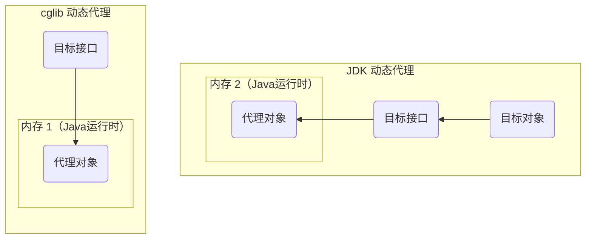

##### JDK 代理

被代理对象（目标对象）是 AccountServiceImpl，它实现了 AccountService 接口，所以满足条件

我们需要编写获取代理对象的方法  
因为代理对象和目标对象是平级的，代理对象不能代表目标对象，因此获取代理对象的方法的返回值需要是目标接口类型

创建代理对象工厂类 JDKProxyFactory：

```java
@Component
public class JDKProxyFactory {

    @Autowired
    AccountService as;
    @Autowired
    TransactionManager tm; // 自定义事务管理类

    // 用 JDK 动态代理技术，生成 AccountServiceImpl 的代理对象
    // 返回值需要是目标接口类型
    public AccountService getAccountServiceJDKProxy(){
        return (AccountService) Proxy.newProxyInstance(
                as.getClass().getClassLoader(),
                as.getClass().getInterfaces(),
                new InvocationHandler() {
                    @Override
                    // proxy: 当前的代理对象引用
                    // method: 被调用的目标方法的引用
                    // args: 被调用的目标方法所用到的参数
                    public Object invoke(
                        Object proxy, Method method, Object[] args) throws Throwable {
                        Object res = null;
                        try {
                            tm.begin(); // 开启事务
                            res = method.invoke(as, args); // 真正的业务代码
                            tm.commit(); // 提交事务
                        } catch (Exception e) {
                            tm.rollback(); // 回滚事务
                        } finally {
                            tm.release(); // 释放事务
                        }
                        return res;
                    }
                });
    }
}
```

简化 Service 层代码（仅保留业务相关代码）：

```java
@Service
public class AccountServiceImpl implements AccountService {

    @Autowired
    private AccountDao accountDao;

    @Override
    public void transfer(String outUser, String inUser, Double money) {
        accountDao.out(outUser, money);
        accountDao.in(inUser, money);
    }
}
```

测试代码：

```java
...
@Autowired
JDKProxyFactory proxy;
@Test
public void testTransfer() {
    AccountService asProxy = proxy.getAccountServiceJDKProxy(); // 获取代理对象
    asProxy.transfer("tom", "jerry", 100d);
}
...
```

##### CGLIB 代理

使用方式与 JDK 代理 类似

创建代理对象工厂类 CglibProxyFactory：

```java
import org.springframework.cglib.proxy.Enhancer;
import org.springframework.cglib.proxy.MethodInterceptor;
import org.springframework.cglib.proxy.MethodProxy;
...

@Component
public class CglibProxyFactory {

    @Autowired
    AccountService as;
    @Autowired
    TransactionManager tm; // 自定义事务管理类

    public AccountService getAccountServiceCglibProxy() {
        // 参数 1: 目标类的字节码对象
        // 参数 2: 接口，当代理对象调用目标对象中原方法时，会执行 intercept 方法
        return (AccountService) Enhancer.create(as.getClass(), new MethodInterceptor() {
            /*
            定义一个拦截器
            调用目标方法时，CGLib 会回调 MethodInterceptor 接口方法拦截，来实现自定义的代理逻辑
            类似于 JDK 中的 InvocationHandler 接口
            */
            @Override
            public Object intercept(Object o, Method method, Object[] objects, MethodProxy methodProxy) 
                    throws Throwable {
                Object res = null;
                try {
                    tm.begin(); // 开启事务
                    res = method.invoke(as, args); // 真正的业务代码
                    tm.commit(); // 提交事务
                } catch (Exception e) {
                    tm.rollback(); // 回滚事务
                } finally {
                    tm.release(); // 释放事务
                }
                return res;
            }
        });
    }
}
```

简化 Service 层代码（仅保留业务相关代码）...

测试代码：

```java
...
@Autowired
private CglibProxyFactory cglibProxyFactory;
@Test
public void testTransfer() {
    AccountService asProxy = cglibProxyFactory.getAccountServiceCglibProxy(); // 获取代理对象
    asProxy.transfer("tom", "jerry", 100d);
}
...
```

---

### XML 开发

```xml
<!-- aspectj 的织入（切点表达式需要该依赖） -->
<dependency>
    <groupId>org.aspectj</groupId>
    <artifactId>aspectjweaver</artifactId>
    <version>1.8.13</version>
</dependency>
```

```
- 命名空间：
xmlns:aop="http://www.springframework.org/schema/aop"

- 约束路径：
http://www.springframework.org/schema/aop
http://www.springframework.org/schema/aop/spring-aop.xsd
```

#### 通知类型

```xml
<aop:通知类型 method="通知类中的方法名" pointcut="切点表达式"/>
```

<table style="width:45rem">
    <thead>
        <tr style="text-align:left">
            <th width=20%>类型</th>
            <th width=30%>标签</th>
            <th width=50%>说明</th>
        </tr>
    </thead>
    <tbody>
        <tr>
            <td>前置通知</td>
            <td>&lt;aop:before&gt;</td>
            <td>增强方法在切入点方法前执行</td>
        </tr>
        <tr>
            <td>后置通知</td>
            <td>&lt;aop:afterReturning&gt;</td>
            <td>增强方法在切入点方法后执行</td>
        </tr>
        <tr>
            <td>异常通知</td>
            <td>&lt;aop:afterThrowing&gt;</td>
            <td>增强方法在出现异常后执行</td>
        </tr>
        <tr>
            <td>最终通知</td>
            <td>&lt;aop:after&gt;</td>
            <td>无论切入点方法执行时是否有异常，都会执行</td>
        </tr>
        <tr>
            <td>环绕通知</td>
            <td>&lt;aop:around&gt;</td>
            <td>可以手动控制增强代码在什么时候执行</td>
        </tr>
    </tbody>
</table>

#### 切点表达式

```
execution([修饰符] 返回值类型 包名.类名.方法名(参数))
```

- 访问修饰符可以省略
- 返回值类型、包名、类名、方法名可以用 \* 代替，表示任意
- 包名与类名间一个点 \. 代表当前包下的类，两个点 \.\. 表示当前包及其子包下的类
- 参数列表可以用两个点 \.\. 表示任意个数，任意类型的参数

示例：

```
execution(public void com.domenic.service.impl.AccountServiceImpl.transfer())
execution(void com.domenic.service.impl.AccountServiceImpl.*(..))
execution(* com.domenic.service.impl.*.*(..))
execution(* com.domenic.service..*.*(..))
```

提取切点表达式：

```xml
<aop:config>
    <!-- 抽取的切点表达式 -->
    <aop:pointcut id="beforeCut" expression="execution(* *(..))"/>
    <!-- 引入通知类 -->
    <aop:aspect ref="myAdvice">
        <!-- 用 pointcut-ref 通过 id 来引用表达式 -->
        <aop:before method="before" pointcut-ref="beforeCut"/>
    </aop:aspect>
</aop:config>
```

#### 示例

目标接口和目标类：

```java
// 接口
public interface AccountService {
    public void transfer();
}

// 实现类
public class AccountServiceImpl implements AccountService {
    @Override
    public void transfer() { ... }
}
```

通知 / 增强类：

```java
public class MyAdvice {
    // 前置通知
    public void before() { ... }
}
```

applicationContext.xml：

```xml
<?xml version="1.0" encoding="UTF-8"?>
<beans xmlns="http://www.springframework.org/schema/beans"
       xmlns:xsi="http://www.w3.org/2001/XMLSchema-instance"
       xmlns:aop="http://www.springframework.org/schema/aop"
       xsi:schemaLocation="
        http://www.springframework.org/schema/beans
        http://www.springframework.org/schema/beans/spring-beans.xsd
        http://www.springframework.org/schema/aop
        http://www.springframework.org/schema/aop/spring-aop.xsd">
    
    <!-- 目标类交给 IOC 容器 -->
    <bean id="accountService" class="com.domenic.service.AccountServiceImpl"/>
    
    <!-- 通知类交给 IOC 容器 -->
    <bean id="myAdvice" class="com.domenic.advice.MyAdvice"/>
    
    <aop:config>
        <!-- 引入通知类 -->
        <aop:aspect ref="myAdvice">
            <!-- 配置目标类的 transfer 方法执行时，用通知类的 before 方法进行前置增强 -->
            <!-- pointcut 属性的值是切点表达式，表示目标方法 -->
            <aop:before method="before"
                        pointcut="execution(void com.domenic.service.AccountServiceImpl.transfer())"/>
        </aop:aspect>
    </aop:config>
    
</beans>
```

测试代码：

```java
@Autowired
AccountService as;
@Test
public void testTransfer() throws Exception {
    as.transfer();
}
```

### 注解开发

```xml
<!-- aspectj 的织入（切点表达式需要该依赖） -->
<dependency>
    <groupId>org.aspectj</groupId>
    <artifactId>aspectjweaver</artifactId>
    <version>1.8.13</version>
</dependency>
```

#### 通知类型

注解语法：@通知注解("切点表达式")

<table style="width:45rem">
    <thead>
        <tr style="text-align:left">
            <th width=20%>类型</th>
            <th width=30%>标签</th>
            <th width=50%>说明</th>
        </tr>
    </thead>
    <tbody>
        <tr>
            <td>前置通知</td>
            <td>@Before</td>
            <td>增强方法在切入点方法前执行</td>
        </tr>
        <tr>
            <td>后置通知</td>
            <td>@AfterReturning</td>
            <td>增强方法在切入点方法后执行</td>
        </tr>
        <tr>
            <td>异常通知</td>
            <td>@AfterThrowing</td>
            <td>增强方法在出现异常后执行</td>
        </tr>
        <tr>
            <td>最终通知</td>
            <td>@After</td>
            <td>无论切入点方法执行时是否有异常，都会执行</td>
        </tr>
        <tr>
            <td>环绕通知</td>
            <td>@Around</td>
            <td>可以手动控制增强代码在什么时候执行</td>
        </tr>
    </tbody>
</table>

前四个通知的执行顺序：@Before -> @After -> @AfterReturning（如有异常：@AfterThrowing）

#### 切点表达式

```
execution([修饰符] 返回值类型 包名.类名.方法名(参数))
```

- 访问修饰符可以省略
- 返回值类型、包名、类名、方法名可以用 \* 代替，表示任意
- 包名与类名间一个点 \. 代表当前包下的类，两个点 \.\. 表示当前包及其子包下的类
- 参数列表可以用两个点 \.\. 表示任意个数，任意类型的参数

示例：

```
execution(public void com.domenic.service.impl.AccountServiceImpl.transfer())
execution(void com.domenic.service.impl.AccountServiceImpl.*(..))
execution(* com.domenic.service.impl.*.*(..))
execution(* com.domenic.service..*.*(..))
```

提取切点表达式：

```java
@Pointcut("execution(* com.domenic.service.AccountServiceImpl.transfer())")
public void myPoint() {}

@Before("com.domenic.advice.MyAdvice.myPoint()")
public void before() {
    System.out.println(" -- 前置通知 -- ");
}
```

#### 示例

目标接口和目标类：

```java
// 接口
public interface AccountService {
    public void transfer();
}

// 实现类
@Component
public class AccountServiceImpl implements AccountService {
    @Override
    public void transfer() { ... }
}
```

通知 / 增强类：

```java
@Component
@Aspect // 表示该类为切面类
public class MyAdvice {
    // 前置通知
    @Before("execution(* com.domenic.service.AccountServiceImpl.transfer())")
    public void before() { ... }
    
    // 环绕通知
    @Around("execution(* com.domenic.service.AccountServiceImpl.transfer())")
    // ProceedingJoinPoint 表示当前正在执行的切入点
    public Object around(ProceedingJoinPoint pjp) throws Throwable {
        Object proceed = null;
        try {
            System.out.println(" -- 执行前 -- ");
            proceed = pjp.proceed(); // 执行切入点方法
            System.out.println(" -- 执行后 -- ");
        } catch (Exception e) {
            System.out.println(" -- 出异常 -- ");
        } finally {
            System.out.println(" -- 结束 -- ");
        }
        return proceed;
    }
}
```

开启组件扫描和 AOP 的自动代理：

- XML 方式

  ```xml
  <!-- 组件扫描 -->
  <context:component-scan base-package="com.lagou"/>
  <!-- AOP 注解支持 -->
  <aop:aspectj-autoproxy/>
  ```

- 注解方式

  ```java
  @Configuration
  @ComponentScan("com.domenic")
  @EnableAspectJAutoProxy // 替代 <aop:aspectj-autoproxy/>
  public class SpringConfig { }
  ```

测试代码：

```java
@Autowired
AccountService as;
@Test
public void testTransfer() throws Exception {
    as.transfer();
}
```

---

## Spring JDBC

### 概述

Spring 对数据库的操作**在 JDBC 上做了封装**，用 Spring 的注入功能，可以把 DataSource 注册到 JdbcTemplate 中

**JdbcTemplate 是 Spring JDBC 支持类的中心类**，负责创建和释放资源，如：创建和关闭连接对象等

JdbcTemplate 位于 spring-jdbc 中，其全限定命名为 org.springframework.jdbc.core.JdbcTemplate  
使用 JdbcTemlate 还需 spring-tx，包含了事务和异常控制

[spring-jdbc-5.3.23 JavaDoc - javadoc.io](https://javadoc.io/static/org.springframework/spring-jdbc/5.3.23/overview-summary.html)

```xml
<dependency>
    <groupId>org.springframework</groupId>
    <artifactId>spring-jdbc</artifactId>
    <version>5.3.23</version>
</dependency>
<dependency>
    <groupId>org.springframework</groupId>
    <artifactId>spring-tx</artifactId>
    <version>5.3.23</version>
</dependency>
```

JdbcTemplate 主要提供以下四类方法：

- execute 方法：可以用于执行任何 SQL 语句，一般用于执行 DDL 语句
- update 方法及 batchUpdate 方法：update 方法用于执行新增、修改、删除等语句；batchUpdate 方法用于执行批处理相关语句
- query 方法及 queryForXxx 方法：用于执行查询相关语句
- call 方法：用于执行存储过程、函数相关语句

### 事务

Spring 的事务控制可分为 编程式事务控制 和 声明式事务控制

- **编程式**  
  直接把事务代码和业务代码耦合到一起，在实际开发中不用
- **声明式**  
  用配置的方式来实现的事务控制，事务代码和业务代码解耦合，用的 AOP 思想

#### Spring 事务

> **事务管理器** 通过读取 **事务定义参数** 进行事务管理，然后会产生一系列的 **事务运行状态**

##### 事务管理器

PlatformTransactionManager 接口，是 Spring 的**事务管理器**，提供了常用的操作事务的方法

不同的 Dao 层技术，有不同的实现类：

- Dao 层技术是 JdbcTemplate 或 Mybatis：DataSourceTransactionManager
- Dao 层技术是 hibernate：HibernateTransactionManager
- Dao 层技术是 JPA：JpaTransactionManager

<table style="width:58rem">
    <thead>
        <tr style="text-align:left">
            <th width=75%>方法</th>
            <th width=25%>说明</th>
        </tr>
    </thead>
    <tbody>
        <tr>
            <td>TransactionStatus getTransaction(TransactionDefinition definition)</td>
            <td>获取事务的状态信息</td>
        </tr>
        <tr>
            <td>void commit(TransactionStatus status)</td>
            <td>提交事务</td>
        </tr>
        <tr>
            <td>void rollback(TransactionStatus status)</td>
            <td>回滚事务</td>
        </tr>
    </tbody>
</table>


##### 事务的定义信息

TransactionDefinition 接口提供**事务的定义信息**：事务隔离级别、事务传播行为等

<table style="width:35rem">
    <thead>
        <tr style="text-align:left">
            <th width=60%>方法</th>
            <th width=40%>说明</th>
        </tr>
    </thead>
    <tbody>
        <tr>
            <td>int getIsolationLevel()</td>
            <td>获得事务的隔离级别</td>
        </tr>
        <tr>
            <td>int getPropogationBehavior()</td>
            <td>获得事务的传播行为</td>
        </tr>
        <tr>
            <td>int getTimeout()</td>
            <td>获得超时时间</td>
        </tr>
        <tr>
            <td>boolean isReadOnly()</td>
            <td>是否只读</td>
        </tr>
    </tbody>
</table>


* timeout（超时时间）：默认值是 -1，没有超时限制；若有，以秒为单位进行设置
* read-only（是否只读）：查询时建议设置为只读

**事务隔离级别**：

设置隔离级别，可以解决事务并发产生的问题，如：脏读、不可重复读、幻读

- ISOLATION_DEFAULT - 使用数据库默认级别
- ISOLATION_READ_UNCOMMITTED - 读未提交
- ISOLATION_READ_COMMITTED - 读已提交
- ISOLATION_REPEATABLE_READ - 可重复读（默认级别）
- ISOLATION_SERIALIZABLE - 串行化

**事务传播行为**：

事务传播行为是 Spring 框架独有的事务增强特性，它不属于事务实际提供方数据库的行为

事务传播行为是指**当一个业务方法被另一个业务方法调用**时，应该如何进行事务控制

<table style="width:55rem">
    <thead>
        <tr style="text-align:left">
            <th width=35%>类型</th>
            <th width=65%>说明</th>
        </tr>
    </thead>
    <tbody>
        <tr>
            <td><b>PROPAGATION_REQUIRED</b></td>
            <td>若当前没有事务，就新建一个事务<br/>若已存在一个事务，则加入到这个事务中（最常见的选择）<br/>被调用的方法必须要进行事务控制</td>
        </tr>
        <tr>
            <td><b>PROPAGATION_SUPPORTS</b></td>
            <td>支持当前事务；若当前没有事务，就以非事务方式执行</td>
        </tr>
        <tr>
            <td>PROPAGATION_MANDATORY</td>
            <td>使用当前的事务；若当前没有事务，就抛出异常</td>
        </tr>
        <tr>
            <td>PROPAGATION_REQUIRES_NEW</td>
            <td>新建事务；若当前存在事务，把当前事务挂起</td>
        </tr>
        <tr>
            <td>PROPAGATION_NOT_SUPPORTED</td>
            <td>以非事务方式执行操作；若当前存在事务，就把当前事务挂起</td>
        </tr>
        <tr>
            <td>PROPAGATION_NEVER</td>
            <td>以非事务方式执行；若当前存在事务，则抛出异常</td>
        </tr>
        <tr>
            <td>PROPAGATION_NESTED</td>
            <td>若当前存在事务，则在嵌套事务内执行<br/>若当前没有事务，则执行与 PROPAGATION_REQUIRED 类似的操作</td>
        </tr>
    </tbody>
</table>

##### 事务运行状态

TransactionStatus 接口提供具体的**事务运行状态**

<table style="width:35rem">
    <thead>
        <tr style="text-align:left">
            <th width=60%>方法</th>
            <th width=40%>说明</th>
        </tr>
    </thead>
    <tbody>
        <tr>
            <td>boolean isNewTransaction()</td>
            <td>是否是新事务</td>
        </tr>
        <tr>
            <td>boolean hasSavepoint()</td>
            <td>是否是回滚点</td>
        </tr>
        <tr>
            <td>boolean isRollbackOnly()</td>
            <td>事务是否回滚</td>
        </tr>
        <tr>
            <td>boolean isCompleted()</td>
            <td>事务是否完成</td>
        </tr>
    </tbody>
</table>

#### 编程式事务（了解）

将事务代码与业务代码耦合的写法

实现代码：

```xml
<!-- 事务管理器对象的创建交给 IOC -->
<bean id="transactionManager" 
      class="org.springframework.jdbc.datasource.DataSourceTransactionManager" 
      p:dataSource-ref="dataSource"/>
```

```java
@Service
public class AccountServiceImpl implements AccountService {
    @Autowired
    private AccountDao accountDao;
    @Autowired
    private PlatformTransactionManager transactionManager;
    @Override
    public void transfer(String outUser, String inUser, Double money) {
        // 创建事务定义对象
        DefaultTransactionDefinition def = new DefaultTransactionDefinition();
        // 设置是否只读，false 支持事务
        def.setReadOnly(false);
        // 设置事务隔离级别，可重复读 MySQL 默认级别
        def.setIsolationLevel(TransactionDefinition.ISOLATION_REPEATABLE_READ);
        // 设置事务传播行为，必须有事务
        def.setPropagationBehavior(TransactionDefinition.PROPAGATION_REQUIRED);
        // 配置事务管理器
        TransactionStatus status = transactionManager.getTransaction(def);
        try {
            // 转账
            accountDao.out(outUser, money);
            accountDao.in(inUser, money);
            // 提交事务
            transactionManager.commit(status);
        } catch (Exception e) {
            // 回滚事务
            transactionManager.rollback(status);
        }
    }
}
```

---

#### 声明式事务

Spring 中的事务控制（编程式、声明式）主要通过这三个 API 实现

* PlatformTransactionManager - 负责事务的管理，它是个接口，其子类负责具体工作
* TransactionDefinition - 定义了事务的一些相关参数
* TransactionStatus - 代表事务运行的一个实时状态

##### XML 方式

步骤：

* 配置平台事务管理器
* 配置事务通知
* 事务 AOP 织入

```
- 命名空间：
xmlns:tx="http://www.springframework.org/schema/tx"

- 约束路径 schemaLocation：
http://www.springframework.org/schema/tx
http://www.springframework.org/schema/tx/spring-tx.xsd
```

数据源对象：

```xml
<context:property-placeholder location="classpath:jdbc.properties"/>
<!-- DataSource 对象 -->
<bean id="dataSource" class="com.alibaba.druid.pool.DruidDataSource">
    <property name="driverClassName" value="${jdbc.driver}"/>
    <property name="url" value="${jdbc.url}"/>
    <property name="username" value="${jdbc.username}"/>
    <property name="password" value="${jdbc.password}"/>
</bean>
```

tx:method 的配置项：

* name - 切点方法名称，支持通配符 \*
* isolation - 事务的隔离级别
* propogation - 事务的传播行为
* timeout - 超时时间
* read-only - 是否为只读事务

applicationContext.xml

```xml
<!-- 平台事务管理器 交给 IOC -->
<bean id="transactionManager"
      class="org.springframework.jdbc.datasource.DataSourceTransactionManager"
      p:dataSource-ref="dataSource"/>

<!-- 配置通知 Advice -->
<tx:advice id="txAdvice" transaction-manager="transactionManager">
    <tx:attributes>
        <tx:method name="*" isolation="DEFAULT" propagation="REQUIRED" read-only="false" timeout="-1"/>
    </tx:attributes>
</tx:advice>

<!-- 事务 AOP 织入 -->
<aop:config>
    <!-- 抽取切点表达式 -->
    <aop:pointcut id="myPointcut" 
                  expression="execution(* com.domenic.service.AccountServiceImpl.*(..))"/>
    <!-- 织入 -->
    <aop:advisor advice-ref="txAdvice" pointcut-ref="myPointcut"/>
</aop:config>
```

##### 注解方式

开启注解支持：

- XML 方式

  ```xml
  <!--事务管理器交给 IOC-->
  <bean id="transactionManager"
        class="org.springframework.jdbc.datasource.DataSourceTransactionManager"
        p:dataSource-ref="dataSource"/>
  
  <!-- 事务的注解支持 -->
  <tx:annotation-driven/>
  ```

- 纯注解方式

  ```java
  @Configuration // 声明为 Spring 配置类
  ...
  @EnableTransactionManagement // 事务的注解驱动
  public class SpringConfig { ... }
  ```

@Transactional：

可以使用 @Transactional 将方法包装在事务中  
它可以设置事务的传播、隔离、超时、只读、回滚条件，还可以指定事务管理器

注解可以用在接口、类、方法的定义上，它们根据优先级顺序相互覆盖  
优先级从低到高：接口 -\> 超类 -\> 类 -\> 接口方法 -\> 超类方法 -\> 类方法

Spring 会将类级的 @Transactional 应用于没有使用该注解的该类的所有 public 方法

使用事务：

```java
@Service
public class AccountServiceImpl implements AccountService {
    @Autowired
    private AccountDao accountDao;
    // 事务注解
    @Transactional(propagation = Propagation.REQUIRED, 
            isolation = Isolation.REPEATABLE_READ, 
            readOnly = false, timeout = -1)
    @Override
    public void transfer(String outUser, String inUser, Double money) { ... }
}
```

---

# Spring MVC

## 入门

SpringMVC 是基于 Java 实现 MVC 设计模式的轻量级 Web 框架，是 SpringFrameWork 的后续产品，已经融合在 Spring Web Flow 中。它通过一套注解，让一个简单的 Java 类成为处理请求的控制器，而无须实现任何接口。而且它还支持 RESTful 编程风格

**MVC 模式**：

- **M 代表 模型（Model）**  
  模型就是数据，就是 dao、bean
- **V 代表 视图（View）**  
  就是网页、JSP，用来展示模型中的数据
- **C 代表 控制器（controller)**  
  控制器的作用是把不同的数据（Model），显示在不同的视图（View）上，Servlet 扮演的就是这样的角色

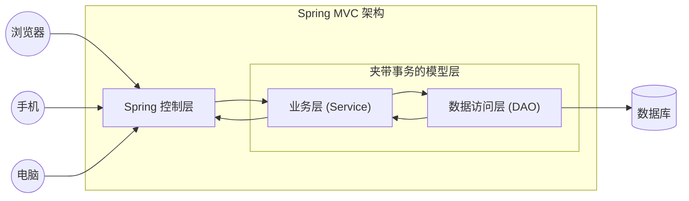

### 入门示例

创建 SpringMVC 项目（创建完需要引入依赖）

```xml
<dependency>
    <groupId>org.springframework</groupId>
    <artifactId>spring-webmvc</artifactId>
    <version>5.3.23</version>
</dependency>

<!-- ServletAPI -->
<dependency>
    <groupId>javax.servlet</groupId>
    <artifactId>javax.servlet-api</artifactId>
    <version>4.0.1</version>
    <scope>provided</scope>
</dependency>
```

项目文件结构：

```ASCII
...
└── src
    └── main
        ├── java
        |   └── ...
        |       └── UserController.java
        ├── resources
        |   └── spring-mvc.xml  /* SpringMVC 核心配置文件 */
        └── webapp
            └── WEB-INF
                └── pages
                |   └── start.html
                └── web.xml
```

控制器：

```java
@Controller // 声明为控制层组件
public class UserController {
    // 将 HTTP 请求映射到 MVC 和 REST 控制器的处理方法上（/quick 访问会被该方法处理）
    @RequestMapping(value = "/quick")
    public String quick() {
        System.out.println(" -- Spring MVC Start -- ");
        // 要访问的视图页面（逻辑视图）
        // 前后缀配置在 SpringMVC 的核心配置文件 spring-mvc.xml 中
        return "start";
    }
}
```

web.xml：

```xml
<web-app ...>
    <!-- 配置 Servlet -->
    <servlet>
        <servlet-name>dispatcherServlet</servlet-name>
        <servlet-class>org.springframework.web.servlet.DispatcherServlet</servlet-class>
        <!-- 指定配置文件，不使用默认位置和名称 -->
        <init-param>
            <param-name>contextConfigLocation</param-name>
            <param-value>classpath:spring-mvc.xml</param-value>
        </init-param>
        <!-- 将当前 Servlet 的初始化时间提前到服务器启动时（默认是有第一个请求时）-->
        <load-on-startup>1</load-on-startup>
    </servlet>
    <!-- Servlet 映射 -->
    <servlet-mapping>
        <servlet-name>dispatcherServlet</servlet-name>
        <!-- 
            /  浏览器向服务器发送的所有请求（不包括 .jsp）
            /* 所有请求（包括 .jsp）
        -->
        <url-pattern>/</url-pattern>
    </servlet-mapping>
</web-app>
```

> 若不指定 contextConfigLocation，SpringMVC 核心配置文件的默认位置和名称：
>
> - 位置：/WEB-INF/
> - 名称：\<servlet-name\>\-servlet.xml，当前配置下的默认配置文件名：dispatcherServlet-servlet.xml

spring-mvc.xml：

```xml
<beans ...>
    <!-- 配置注解扫描 -->
    <context:component-scan base-package="com.domenic.controller"/>
    
    <!--
        该注解配置了 SpringMVC 三大组件中的两个：处理器映射器 和 处理器适配器
        提供 Controller 请求转发，JSON 自动转换等功能
    -->
    <mvc:annotation-driven/>
    
    <!--
        配置了 视图解析器
        设置了前后缀，前后缀与逻辑视图拼接后才是物理视图
    -->
    <bean id="resourceViewResolver" class="org.springframework.web.servlet.view.InternalResourceViewResolver">
        <property name="prefix" value="/"/>
        <property name="suffix" value=".jsp"/>
    </bean>
    
    <mvc:default-servlet-handler/>
</beans>
```

### 静态资源访问

> 默认情况下，静态资源存放路径：
>
> 1. classpath 中名为 /static（或 /public 或 /resources 或 /META-INF/resources）的目录
> 2. ServletContext 的根目录（/webapp）

若 SpringMVC 的前端控制器 DispatcherServlet 的 url-pattern 配置的是 /（缺省）  
加载静态资源时，会被 DispatcherServlet 处理，而不会执行 Tomcat 内置的 DefaultServlet 处理  
从而导致无法访问静态资源（因为没有配置映射）

**解决方法 1**：

在核心配置文件中添加：

```xml
<!-- 配置 处理器映射器 和 处理器适配器；并进行了功能增强：支持 JSON 的读写 -->
<mvc:annotation-driven/>

<!-- 配置默认的 Servlet 来处理请求，可以正确处理静态资源 -->
<mvc:default-servlet-handler/>
```

当前工程的 web.xml 中配置的 DispatcherServlet 的 url-pattern 为 /

Tomcat 的 web.xml 中配置的 DefaultServlet 的 url-pattern 也为 /

此时，请求会优先被 DispatcherServlet 处理，但是它处理不了静态资源

- \<mvc:default-servlet-handler/\>

  将所有的请求都交给 Tomcat 的 DefaultServlet 处理

- \<mvc:annotation-driven/\>

  将请求先交给 DispatcherServlet 处理，若无法处理，再交予 DefaultServlet 处理

**解决方法 2**：

在核心配置文件中添加：

```xml
<!-- 放行指定资源 -->
<!-- mapping 放行的请求路径；location 静态资源所在的目录 -->
<mvc:resources mapping="/js/**" location="/js/"/>
<mvc:resources mapping="/css/**" location="/css/"/>
<mvc:resources mapping="/img/**" location="/img/"/>
```

### 乱码问题

Tomcat 8.5 以上的版本，GET 请求的乱码问题已经解决，但 POST 请求乱码还未解决，需要进行手动配置

配置 SpringMVC 字符编码过滤器，解决乱码，在 web.xml 中添加：

```xml
<!--
    该过滤器应该放在最前面
    因为在设置编码之前，不能获取任何的请求参数
-->
<filter>
    <filter-name>CharacterEncodingFilter</filter-name>
    <filter-class>org.springframework.web.filter.CharacterEncodingFilter</filter-class>
    <!-- 设置请求的编码 -->
    <init-param>
        <param-name>encoding</param-name>
        <!-- 设置编码格式 -->
        <param-value>utf-8</param-value>
    </init-param>
    <!-- 同时也设置响应的编码 -->
    <init-param>
        <param-name>forceEncoding</param-name>
        <param-value>true</param-value>
    </init-param>
</filter>
<filter-mapping>
    <filter-name>CharacterEncodingFilter</filter-name>
    <!-- 对所有资源都进行过滤 -->
    <url-pattern>/*</url-pattern>
</filter-mapping>
```

> 注意：在控制器方法中，通过 ServletAPI 设置编码是无效的。因为前端控制器 DispatcherServlet 已经获取过请求参数了，**若设置编码之前获取过请求参数，那之后设置的编码是没有任何效果的**

## HTTP 状态码

spring-web 包下有个枚举类 [HttpStatus](https://www.javadoc.io/static/org.springframework/spring-web/5.3.23/org/springframework/http/HttpStatus.html)，列举了请求状态码

4xx 类型是客户端错误；5xx 类型是服务端错误

<table style="width:60rem">
    <thead>
        <tr style="text-align:left">
            <th width=8%>Code</th>
            <th width=30%>HTTP Operation</th>
            <th width=16%>Body Contents</th>
            <th width=46%>Description</th>
        </tr>
    </thead>
    <tbody>
        <tr>
            <td>200</td>
            <td>GET,PUT</td>
            <td>资源</td>
            <td>操作成功</td>
        </tr>
        <tr>
            <td>201</td>
            <td>POST</td>
            <td>资源，元数据</td>
            <td>对象创建成功</td>
        </tr>
        <tr>
            <td>202</td>
            <td>POST,PUT,DELETE,PATCH</td>
            <td>N/A</td>
            <td>请求已经被接受</td>
        </tr>
        <tr>
            <td>204</td>
            <td>DELETE,PUT,PATCH</td>
            <td>N/A</td>
            <td>操作已经执行成功，但没有返回数据</td>
        </tr>
        <tr>
            <td>301</td>
            <td>GET</td>
            <td>链接</td>
            <td>永久重定向。资源已被移除，请求的资源已被分配了新的 URI</td>
        </tr>
        <tr>
            <td>302</td>
            <td>GET</td>
            <td>链接</td>
            <td>临时重定向</td>
        </tr>
        <tr>
            <td>303</td>
            <td>GET</td>
            <td>链接</td>
            <td>与 302 类似，但明确要求用 GET 方法重定向到新的 URI</td>
        </tr>
        <tr>
            <td>304</td>
            <td>GET</td>
            <td>N/A</td>
            <td>资源没有被修改</td>
        </tr>
        <tr>
            <td>400</td>
            <td>GET,POST,PUT,DELETE,PATCH</td>
            <td>错误提示(消息)</td>
            <td>参数列表错误（缺少，格式不匹配）</td>
        </tr>
        <tr>
            <td>401</td>
            <td>GET,POST,PUT,DELETE,PATCH</td>
            <td>错误提示(消息)</td>
            <td>末授权</td>
        </tr>
        <tr>
            <td>403</td>
            <td>GET,POST,PUT,DELETE,PATCH</td>
            <td>错误提示(消息)</td>
            <td>访问受限，授权过期</td>
        </tr>
        <tr>
            <td>404</td>
            <td>GET,POST,PUT,DELETE,PATCH</td>
            <td>错误提示(消息)</td>
            <td>资源，服务末找到（headers 不匹配也是这个报错）</td>
        </tr>
        <tr>
            <td>405</td>
            <td>GET,POST,PUT,DELETE,PATCH</td>
            <td>错误提示(消息)</td>
            <td>不允许的 HTTP 方法</td>
        </tr>
        <tr>
            <td>406</td>
            <td>GET,POST,PUT,DELETE,PATCH</td>
            <td>错误提示(消息)</td>
            <td>客户端无法解析服务端返回的内容</td>
        </tr>
        <tr>
            <td>409</td>
            <td>GET,POST,PUT,DELETE,PATCH</td>
            <td>错误提示(消息)</td>
            <td>资源冲突，或者资源被锁定</td>
        </tr>
        <tr>
            <td>415</td>
            <td>GET,POST,PUT,DELETE,PATCH</td>
            <td>错误提示(消息)</td>
            <td>不支持的数据（媒体类型）</td>
        </tr>
        <tr>
            <td>429</td>
            <td>GET,POST,PUT,DELETE,PATCH</td>
            <td>错误提示(消息)</td>
            <td>请求过多，被限制</td>
        </tr>
        <tr>
            <td>500</td>
            <td>GET,POST,PUT,DELETE,PATCH</td>
            <td>错误提示(消息)</td>
            <td>系统内部错误</td>
        </tr>
        <tr>
            <td>501</td>
            <td>GET,POST,PUT,DELETE,PATCH</td>
            <td>错误提示(消息)</td>
            <td>接口未实现</td>
        </tr>
        <tr>
            <td>502</td>
            <td>GET,POST,PUT,DELETE,PATCH</td>
            <td>错误提示(消息)</td>
            <td>服务器在充当网关或代理时，从上游服务器收到无效响应</td>
        </tr>
    </tbody>
</table>

---

## web.xml

该配置文件，主要用来配置 Listener、Filter、Servlet 等

三者的执行顺序：Listener --\> Filter --\> Servlet

### 加载顺序

ServletContext --\> context-param（无顺序）--\> listener（无顺序）--\> filter（配置顺序）--\> servlet（load-on-startup 优先级）

详细加载过程：

- 启动一个 web 项目，web 容器会读取它的配置文件 web.xml，先读取 \<context-param\> 和 \<listener\>

- 创建一个 ServletContext（Servlet 上下文），此 web 项目的所有部分都将共享这个上下文

- 容器将 \<context-param\> 转换为键值对，并交给 ServletContext

- 容器创建监听器 Listener 实例

- 触发 contextInitialized 方法，监听器被调用

  > 当 Servlet 容器启动或终止 web 应用时，会触发 ServletContextEvent 事件，该事件由 ServletContextListener 接口来处理。在 ServletContextListener 中定义了处理 ServletContextEvent 事件的两个方法 contextInitialized、contextDestroyed
  >
  > Tip：SpringMVC 有一个监听器 ContextLoaderListener，实现了 ServletContextListener 接口

- 调用完 contextInitialized 方法后，容器再初始化过滤器 filter

- 之后，容器对指定 load-on-startup 值为正数的 Servlet 进行初始化（优先级 1,2,3... 递减）；值为负数或未指定，则在该 Servlet 被调用时初始化

### 常用配置

- **\<context-param\>**

  ```xml
  <!--
      全局参数，自定义 Spring 配置文件的位置和名称，以便使用 Spring IOC 容器中的 bean
      Spring 配置文件的默认位置和名称：/WEB-INF/applicationContext.xml
      也可通过上下文参数自定义 Spring 配置文件的位置和名称
  -->
  <context-param>
      <param-name>contextConfigLocation</param-name>
      <param-value>classpath:applicationContext.xml</param-value>
  </context-param>
  ```

- **\<filter\>**

  字符编码过滤器：

  ```xml
  <filter>
      <filter-name>CharacterEncodingFilter</filter-name>
      <filter-class>org.springframework.web.filter.CharacterEncodingFilter</filter-class>
      <init-param>
          <param-name>encoding</param-name>
          <param-value>UTF-8</param-value>
      </init-param>
      <init-param>
          <param-name>forceEncoding</param-name>
          <param-value>true</param-value>
      </init-param>
  </filter>
  <filter-mapping>
      <filter-name>CharacterEncodingFilter</filter-name>
      <url-pattern>/*</url-pattern>
  </filter-mapping>
  ```

  跨域过滤器：

  <details>
      <summary>展开 解决跨域问题 所需要的依赖</summary>
      <pre><code>
  &lt;dependency&gt;
  	&lt;groupId&gt;com.thetransactioncompany&lt;/groupId&gt;
  	&lt;artifactId&gt;cors-filter&lt;/artifactId&gt;
  	&lt;version&gt;2.5&lt;/version&gt;
  &lt;/dependency&gt;
      </code></pre>
  </details>

  ```xml
  <filter>
      <filter-name>corsFilter</filter-name>
      <filter-class>com.thetransactioncompany.cors.CORSFilter</filter-class>
  </filter>
  <filter-mapping>
      <filter-name>corsFilter</filter-name>
      <url-pattern>/*</url-pattern>
  </filter-mapping>
  ```

- **\<listerner\>**

  ```xml
  <!--
      配置 Spring 的监听器，在服务器启动时加载 Spring 的配置文件
  -->
  <listener>
      <listener-class>org.springframework.web.context.ContextLoaderListener</listener-class>
  </listener>
  ```

- **\<servlet\>**

  ```xml
  <!-- 配置 Servlet -->
  <servlet>
      <servlet-name>dispatcherServlet</servlet-name>
      <servlet-class>org.springframework.web.servlet.DispatcherServlet</servlet-class>
      <!-- 指定配置文件，不使用默认位置和名称 -->
      <init-param>
          <param-name>contextConfigLocation</param-name>
          <param-value>classpath:spring-mvc.xml</param-value>
      </init-param>
      <!-- 将当前 Servlet 的初始化时间提前到服务器启动时（默认是有第一个请求时）-->
      <load-on-startup>1</load-on-startup>
  </servlet>
  <!-- Servlet 映射 -->
  <servlet-mapping>
      <servlet-name>dispatcherServlet</servlet-name>
      <url-pattern>/</url-pattern>
  </servlet-mapping>
  ```

  **url-pattern** - 匹配访问路径

  - **/\*** 会匹配所有路径  
    会覆盖所有其他 servlet，包括 servletcontainer 提供的所有 servlet，如默认 servlet 和 JSP servlet  
    因此 /\* 通常值使用在 Filter 上
  - **/** 只覆盖 servletcontainer 的内置默认 servlet  
    这通常只在 <u>静态资源</u>（如 HTML,CSS,JS,image,etc）和 <u>目录列表</u>（如 /login）上调用  
    \*.jsp 不会被命中，因为 servletcontainer 内置的 JSP servlet 会被调用，它映射了具体的 URL 模式 \*.jsp

- **\<session-config\>**

  ```xml
  <session-config>
      <!-- 单位为分钟，默认 30 分钟 -->
      <session-timeout>120</session-timeout>
  </session-config>
  ```

- **\<welcome-file-list\>**

  ```xml
  <!-- 欢迎页 -->
  <welcome-file-list>
      <welcome-file>index.jsp</welcome-file>
      <welcome-file>index.html</welcome-file>
      <welcome-file>index.htm</welcome-file>
  </welcome-file-list>
  ```

**\<context-param\> 和 \<init-param\> 的区别**：

- \<context-param\> 是 application 范围内的初始化参数，用于向 servlet-context 提供键值对，即应用程序的 上下文信息、listener、filter 等初始化时要用到的信息
- \<init-param\> 是 servlet 范围内的参数，只能在 servlet 类的 init() 方法中获取到

### Spring 配置

- **contextConfigLocation 初始化参数**：

  指定 Spring IOC 容器需要读取的非 Web 层 Bean（如 DAO、Service）的 XML 配置文件路径。可指定多个 XML 文件路径，用逗号、冒号等来分隔

  若没有指定 "contextConfigLocation" 参数，则会在 /WEB-INF/ 下查找 "\<servlet-name\>\-servlet.xml" 这样的文件加载

- **ContextLoaderListerner 监听器**：

  该监听器，负责在服务器初始化时，同时初始化 Spring IOC 容器

---

## RESTful

### 概述

> REST：Representational State Transfer，表现层资源状态转移
>
> REST 架构的主要原则：
>
> - 对网络上所有的资源都有一个资源标志符
> - 对资源的操作不会改变标识符
> - 同一资源有多种表现形式（XML、JSON）
> - 所有操作都是无状态的（Stateless）
>
> 符合上述 REST 原则的架构方式称为 RESTful

RESTful 风格多用于前后端分离项目开发，前端通过 Ajax 与服务器进行异步交互，后端通常返回 JSON 数据

REST 的行为是通过 HTTP 表示操作的方法来定义的：GET、POST、PUT、DELETE、PATCH

- GET - 获取资源
- POST - 新建资源（也可用于更新资源）
- PUT - 更新资源
- DELETE - 删除资源
- PATCH - 更新局部资源

**REST 资源操作性质**：

<table style="width:40rem">
    <thead>
        <tr style="text-align:left">
            <th width="25%">HTTP 方法</th>
            <th width="25%">资源操作</th>
            <th width="25%">幂等性</th>
            <th width="25%">安全性</th>
        </tr>
    </thead>
    <tbody>
        <tr>
            <td>GET</td>
            <td>SELECT</td>
            <td>&#10004;</td>
            <td>&#10004;</td>
        </tr>
        <tr>
            <td>POST</td>
            <td>INSERT</td>
            <td>&#10006;</td>
            <td>&#10006;</td>
        </tr>
        <tr>
            <td>PUT</td>
            <td>UPDATE</td>
            <td>&#10004;</td>
            <td>&#10006;</td>
        </tr>
        <tr>
            <td>DELETE</td>
            <td>DELETE</td>
            <td>&#10004;</td>
            <td>&#10006;</td>
        </tr>
        <tr>
            <td>PATCH</td>
            <td>UPDATE</td>
            <td>&#10006;</td>
            <td></td>
        </tr>
    </tbody>
</table>

- **幂等性**：一个幂等操作，执行任意多次所产生的影响均与一次执行的影响相同
- **安全性**：一个安全操作，不会使服务器端资源的状态发生改变（所有安全的 HTTP 方法都是幂等的）

**RESTful 风格 URL 示例**：

通过 HTTP 操作方法和占位符 `{}` 中的值来区分 URL 请求

<table style="width:40rem">
    <thead>
        <tr style="text-align:left">
            <th width="24%">客户端请求</th>
            <th width="38%">原始 URL</th>
            <th width="38%">RESTful URL</th>
        </tr>
    </thead>
    <tbody>
        <tr>
            <td>查询所有</td>
            <td>/user/findAll</td>
            <td>/user -&gt; GET 请求</td>
        </tr>
        <tr>
            <td>根据 ID 查询</td>
            <td>/user/findById?id=1</td>
            <td>/user/1 -&gt; GET 请求</td>
        </tr>
        <tr>
            <td>新增</td>
            <td>/user/save</td>
            <td>/user -&gt; POST 请求</td>
        </tr>
        <tr>
            <td>修改</td>
            <td>/user/update</td>
            <td>/user -&gt; PUT 请求</td>
        </tr>
        <tr>
            <td>删除</td>
            <td>/user/delete?id=1</td>
            <td>/user/1 -&gt; DELETE 请求</td>
        </tr>
    </tbody>
</table>
RESTful 相关注解，前往：SpringMVC -\> 注解 -\> RESTful

### 使用

#### GET、POST

浏览器只支持发送 GET 和 POST 方式的请求

```java
@RestController
@RequestMapping(value = "/restful")
public class UserController {
    // @RequestMapping(value = "/user/{id}/{name}", method = RequestMethod.GET)
    @GetMapping("/user/{id}/{name}")
    public String findById(@PathVariable Integer id, @PathVariable String name) { ... }
}
```

```
http://localhost:8080/项目名/restful/user/1/domenic
---
Id: 1 Name: domenic
```

#### 隐藏的请求

HiddenHttpMethodFilter 过滤器可以将 **POST** 请求转换为 **PUT**、**DELETE**、**PATCH** 请求

在 web.xml 中配置该过滤器

```xml
<filter>
    <filter-name>HiddenHttpMethodFilter</filter-name>
    <filter-class>org.springframework.web.filter.HiddenHttpMethodFilter</filter-class>
</filter>
<filter-mapping>
    <filter-name>HiddenHttpMethodFilter</filter-name>
    <url-pattern>/*</url-pattern>
</filter-mapping>
```

使用要求：

1. 当前请求的请求方式必须为 POST
2. 当前请求必须传输请求参数 `_method`，value 为最终的请求方式

```xml
<!-- 浏览器发送 POST 请求 -->
<form th:action="@{/user/}" method="post">
    <!-- 过滤器转换后的请求是 PUT -->
    <input type="hidden" name="_method" value="put"/>
    <input type="submit" value="PUT USER"/>
</form>
```

```java
@Controller
@RequestMapping(value = "/user")
public class UserController {
    @PutMapping("")
    public ModelAndView updateUser() { ... }
}
```

#### CURD 示例

##### Create

###### 示例

示例，创建一条数据：

直接跳转到创建的页面

```html
<a th:href="@{/to/add}">add</a>
```

创建的页面：请求方式为 POST

```html
<form th:action="@{/employee}" method="post">
    <table>
        ...
        <tr>
            <td>name</td>
            <td><input type="text" name="name"></td>
        </tr>
        <tr>
            <td>gender</td>
            <td>
                <input type="radio" name="gender" value="1">male
                <input type="radio" name="gender" value="0">female
            </td>
        </tr>
        <input type="submit" value="add">
    </table>
</form>
```

控制器方法

```java
@PostMapping("")
// 创建并重新显示所有数据
public ModelAndView addEmployee(Employee el, ModelAndView mv) {
    dao.add(el);
    // 重定向到读取所有的控制器方法（一定要重定向）
    mv.setViewName("redirect:/employee");
    return mv;
}
```

##### Update

示例，更新一条数据：

请求控制器方法，跳转到修改页面

```html
<!-- 可以在循环渲染数据时，加上 update 按钮 -->
<a th:href="@{'/employee/' + ${el.id}}">update</a>
```

修改页面：数据回显；请求方式为 PUT

```html
<form th:action="@{/employee}" method="post">
    <!-- SpringMVC 会通过 _method 参数解析到请求方法为 PUT -->
    <input type="hidden" name="_method" value="put"/>
    <!-- 传回 id 值（不能被用户修改）-->
    <input type="hidden" name="id" th:value="${employee.id}"/>
    <table>
        ...
        <tr>
            <td>name</td>
            <td><input type="text" name="Name" th:value="${employee.name}"></td>
        </tr>
        <tr>
            <td>gender</td>
            <td>
                <!-- radio 单选框，若 th:field 和 value 的值相同则选择 -->
                <input type="radio" name="gender" value="1" th:field="${employee.gender}">male
                <input type="radio" name="gender" value="0" th:field="${employee.gender}">female
            </td>
        </tr>
        ...
    </table>
    <input type="submit" value="update">
</form>
```

控制器方法

```java
@GetMapping("/{id}")
// 跳转到修改页面
public ModelAndView toUpdate(@PathVariable Integer id, ModelAndView mv) {
    mv.addObject("employee", dao.get(id));
    mv.setViewName("employee_update");
    return mv;
}

@PutMapping("")
// 修改数据
public ModelAndView updateEmployee(Employee el, ModelAndView mv) {
    dao.update(el);
    mv.setViewName("redirect:/employee");
    return mv;
}
```

##### Read

示例，查询所有数据：

在页面上打印数据

```html
<!-- 循环 request 域中的数据 employeeList，渲染成表格 -->
<table>
    <tr th:each="el: ${employeeList}">
        <td th:text="${el.id}"></td>
        <td th:text="${el.lastName}"></td>
        <td th:text="${el.email}"></td>
        <!-- 三目表达式，决定显示的值 -->
        <td th:text="${el.gender} == 0 ? 'female' : 'male'"></td>
    </tr>
</table>
```

控制器方法

```java
@GetMapping("/employee")
public ModelAndView getEmployee(ModelAndView mv) {
    mv.addObject("employeeList", dao.selectAll());
    mv.setViewName("employee_list");
    return mv;
}
```

##### Delete

示例，删除一条数据：

删除操作和更新操作类似，但是需要把请求方法改为 DELETE  
思路：点击删除按钮时，动态修改一个 form 表单的 action 值，加上待删除数据的 id，并提交该表单，表单中带有 `_method` 参数

```html
<!-- 作用：提交 _method 参数，使 SpringMVC 将请求方式解析为 DELETE -->
<form id="delete_form" method="post">
    <!-- HiddenHttpMethodFilter 要求：必须传输 _method 请求参数，值为最终的请求方式 -->
    <input type="hidden" name="_method" value="delete"/>
</form>
```

请求控制器方法，进行删除

```html
<div id="app">
    ...
    <!-- 可以在循环渲染数据时，加上 delete 按钮 -->
    <a class="deleteA" @click="deleteEmployee" 
       th:href="@{'/employee/' + ${employee.id}}">delete</a>
</div>
```

用 Vue 来监测 delete 超链接的点击事件

```html
<script type="text/javascript">
    var vue = new Vue({
        el: "#app",
        methods: {
            // event 表示当前事件
            deleteEmployee: function (event) {
                // 通过 id 获取表单标签
                var delete_form = document.getElementById("delete_form");
                // 将触发事件的超链接的 href 属性为表单的 action 属性赋值
                delete_form.action = event.target.href;
                // 提交表单
                delete_form.submit();
                // 阻止超链接的默认跳转行为
                event.preventDefault();
            }
        }
    });
</script>
```

---

## MVC 注解

### 请求

#### @RequestMapping

##### value

**静态 URI**：

处理 URI，将请求映射到一个方法上

```java
@Controller
@RequestMapping(value = "/quick") // 单个路径
public class UserController {
    // 多个路径
    @RequestMapping(value = {
        "",
        "/page",
        "/page*",
        "/view/*",
        "**/msg"
    })
    ...
}
```

有效的访问地址：

- <p>http://localhost:8080/springmvc_demo/quick</p>

- <p>http://localhost:8080/springmvc_demo/quick/page</p>

- <p>http://localhost:8080/springmvc_demo/quick/pageeeee</p>

- <p>http://localhost:8080/springmvc_demo/quick/view/domenic</p>

- <p>http://localhost:8080/springmvc_demo/quick/abc/msg</p>

**动态 URI**：

- **占位符**：

  ```java
  @Controller
  @RequestMapping(value = "/quick")
  public class UserController {
      // 动态 URI
      // 有两个参数：id、name；id 的值要符合正则表达式
      @RequestMapping(value = "/fetch/{id:[a-z]+}/{name}")
      String dynamicMethod(@PathVariable("name") String name, 
                           @PathVariable("id") String id) {
          System.out.println("Name is " + name);
          return "success";
      }
  }
  ```

  <p>访问路径：http://localhost:8080/项目名/quick/fetch/abcd/Domenic</p>

  请求会交予 dynamicMethod() 处理，控制台打印：Name is Domenic

- **ant 通配符**：

  - ?：表示任意的单个字符
  - \*：表示任意的 0 或多个字符
  - \*\*：表示任意层数的任意目录，使用方式：.../\*\*/...

  注意：? 和 \* 不能匹配有特殊含义的字符，如：“/”、“?”

  ```java
  @RequestMapping(value = "/a*b/test/ant")
  @RequestMapping(value = "/**/test/ant")
  ```

##### method

可以指定一个或多个请求方式

若没设置请求方式 method，则任何方式都可以访问

若请求的地址满足请求映射的 value 属性，但请求方式不满足 method 属性，则会报 405 错误

```java
@RequestMapping(..., method = {RequestMethod.GET, RequestMethod.POST})
```

##### params

param 的四种表达式：

- "param"：要求请求，**必须携带** param 参数
- "!param"：要求请求，**不能携带** param 参数
- "param=value"：要求请求，**必须携带** param 参数，且 **param == value**
- "param!=value"：要求请求，**可不携带** param 参数，若携带则 **param != value**  
  因为若不携带 param，服务器获取的值为 null，那么 null 肯定不等于 value

```java
// 必须携带 name
@RequestMapping(..., params = "name")
// 必须携带 name、gender，不能携带 age；且 gender == male，password != 123
@RequestMapping(..., params = {"name", "!age", "gender=male", "password!=123"})
```

##### headers

headers 的四种表达式：

- "header"：要求请求，**必须携带** header 请求头
- "!header"：要求请求，**不能携带** header 请求头
- "header=value"：要求请求，**必须携带** header 请求头，且 **header=value**
- "header!=value"：要求请求，**可不携带** header 请求头，若携带则 **header!=value**  
  因为若不携带 headers，服务器获取的值为 null，那么 null 肯定不等于 value

请求头中的 key 不区分大小写，但 value 区分大小写

```java
// 只处理路径为 .../head 且 content-typeheader 为 text/plain 或 text/html 的请求
@RequestMapping(value = "/head", headers = {
    "content-type=text/plain",
    "content-type=text/html"
})
```

> 若请求头不匹配，报错的状态码是 404

#### @RequestParam

@RequestParam 用来处理 Content-Type 为 application/x-www-form-urlencoded 编码格式的内容，就是 Content-Type 的默认属性

- 若请求的参数 name 名称与 Controller 中业务方法的参数名称不一致，就需要通过 @RequestParam 注解显示的绑定
- 若参数 name 与参数名一致，**可以省略** @RequestParam，参数值会自动映射匹配

```java
@RestController
@RequestMapping(value = "/quick")
public class UserController {
    @RequestMapping(value = "/idParam")
    // 前台传来的参数名为 id，但是接收的参数名为 personId，因此需要注解绑定
    // defaultValue 传入 String，可以指定参数的默认值
    String getIdByValue(@RequestParam(value = "id", required = false, defaultValue = "10") Integer personId) {
        System.out.println("ID: " + personId);
        return "Get ID from query string of URL with value element";
    }
    ...
}
```

参数：

- defaultValue 默认值，若请求没有携带此参数，或参数为空，就会启用
- name 绑定本次参数的名称，要跟 URL 上的参数名一致
- required 这个参数是否为必须。若 true 则是必须，如果请求没有带该参数，则报 400 错误
- value 和 name 作用相同，是 name 属性的别名

#### @RequestBody

@RequestBody 用于接收 requestBody 中的参数  
可处理 Content-Type 非 application/x-www-form-urlencoded 编码格式的内容，如：application/json、application/xml 等

根据不同的 Content-Type，SpringMVC 会使用不同的 HttpMessageConverter\<T\> 接口的实现来进行信息解析转换

> @RequestBody 与 @RequestParam 可同时用；@RequestBody 只能有一个，而 @RequestParam 可以有多个

自动封装参数，底层是通过 Setter 方法给实体类的属性赋值的，因此要求请求体中参数 key 的名称和属性名称要一致

```java
@RequestMapping(value = "/ajaxRequestBody")
// 可以和 @RequestParam 同时用
// list 保存的是请求题中的数据，user 保存的是请求链接后的 key-value 数据（若 name 和属性名相同，会自动映射匹配）
public void ajaxRequest(@RequestBody List<User>list, 
                        @RequestParam(...) User user) { ... }
```

补充（修饰属性的注解）：

- **@JsonAlias**（来自 jackson），给属性起别名

  ```java
  @JsonAlias(value = {"NAME", "username"})
  private String name;
  ```

  添加该注解后，JSON 中 key 为 “NAME”、“username”、“name” 都能识别，并赋值给 name

- **@JsonProperty**（来自 jackson），指定属性的名称

  ```java
  @JsonProperty("NAME")
  private String name;
  ```

  添加该注解后，只能识别 JSON 中的 “NAME”，不能识别 “name”

#### @RequestHeader

获取请求头中的信息，绑定到参数上

```java
@RequestMapping("/requestHead")
public String requestHead(
    @RequestHeader("cookie") String cookie, 
    @RequestHeader("accept-encoding") String encoding) { ... }
```

#### @CookieValue

把请求头中关于 cookie 的值绑定到方法的参数上

> Cookie 示例  
> cookie: __stripe_mid=6543c51s-302d-4a2f-7a98; ak_bmsc=03B6B876E2A1F5246C6;

```java
@RequestMapping("/cookieParam")  
public void getCookie(@CookieValue("__stripe_mid") String jesessionId) { ... }
```

#### @...Attribute

简化开发，提高复用性；进一步屏蔽源生 Servlet API，增加扩展性

- RequestAttribute - 获取 request 域中的属性
- SessionAttribute - 获取 session 域中的属性
- ModelAttribute - 获取 model 中的属性，或向 model 中设置属性

**获取值**：

在形参上使用注解，表明取出属性值，并填充到形参中

```java
public String handleRequestById (
    // 从 Session 域中获取 visitor 的值
    @SessionAttribute("visitor") String visitor, 
    // 从 model 中获取 user 的值
    @ModelAttribute("user") String user
) { ... }
```

**设置值**：

在方法上使用 @ModelAttribute 时，表明该方法的目的是，添加一个或多个 model 属性

注意：SpringMVC 在调用任何请求处理方法之前，总是会先调用该方法

```java
@ModelAttribute
public void addAttributes(Model model) {
    model.addAttribute("name", "Domenic");
    model.addAttribute("msg", "I Love Spring!");
}

/* 其他的 Controller 方法，可以获取到 */
@ModelAttribute("name") String name, @ModelAttribute("msg") String msg
```

#### RESTful

##### @RestController

等价于 @Controller + @ResponseBody，使用该注解类后，相当于该类下每个方法都注解了 @ResponseBody

##### @...Mapping

RESTful 请求行为：GET、POST、PUT、DELETE、PATCH  
每个行为都有对应的 Mapping，可以省略 RequestMapping 中的 method 属性

```java
// @RequestMapping(value = "/user/{id}/{name}", method = RequestMethod.GET)
@GetMapping(value = "/user/{id}/{name}")
```

##### @PathVariable

参数：value、name、required

required 的值默认为 true，就是请求强制携带该参数

###### 多参数

匹配参数名和占位符 `{}` 中的变量名，若相同，则可以不传参数

```java
@GetMapping("/user/{id}/{name}")
@ResponseBody
public String getmethod(@PathVariable("id") Integer personId, 
                        @PathVariable("name") String username) {
    return "ID: " + personId;
}
```

用 **Map 集合** 来封装多个路径参数，以 key-value 形式

```java
@GetMapping("/user/{id}/{name}")
@ResponseBody
public String getMethod(@PathVariable Map<String, String> pathVarsMap) {
    String id = pathVarsMap.get("id");
    String name = pathVarsMap.get("name");
    if (id != null && name != null) { return "ID: " + id + " name: " + name; }
    return "Missing Parameters";
}
```

```
http://localhost:8080/.../user/1/domenic
---
{id=1, name=domenic}
```

###### 多路径

\.\.\.Mapping 注解中可以指定多个请求路径，都由该方法处理

```java
@GetMapping(value = {"/user", "/user/{id}"})
@ResponseBody
public String getMethod(@PathVariable(required = false) String id) {
    return "ID: " + id;
}
```

- required = true（默认），若未传参数，也没有解决，则报 404 错误
- required = false，若未传参数，则 id 值为 null

用 [**Optional 类**](https://docs.oracle.com/en/java/javase/11/docs/api/java.base/java/util/Optional.html) 来区分有无参数

```java
@GetMapping(value = {"/user", "/user/{id}"})
@ResponseBody
public String getMethod(@PathVariable Optional<String> id) {
    // 若 id 有值就返回
    if (id.isPresent()) { return "ID: " + id.get(); }
    return "ID missing";
}
```

用 **Map 集合** 来接收参数

```java
@GetMapping(value = {"/user", "/user/{id}"})
@ResponseBody
public String getMethod(@PathVariable Map<String, String> pathVarsMap) {
    String id = pathVarsMap.get("id");
    if (id != null)
    ...
}
```

> 当路径变量字符串中包含 `.` 时，多参数处理会出错。因为 Spring 会把最后一个 `.` 之后的字符串当成文件扩展名  
> 解决方案：https://www.baeldung.com/spring-mvc-pathvariable-dot

### 响应

#### @ResponseBody

该注解就是用来把方法的返回的结果，**直接写入 HTTP 响应正文中**

将 Controller 方法返回的对象使用不同的 HttpMessageConverter\<T\> 接口的实现解析转换为指定的格式后，写入到 response 对象的 body 区，通常用来返回 JSON 或 XML 数据

> 用 @RestController 注解的控制器类不需要 @ResponseBody，因为 @RestController = @Controller + @ResponseBody

```java
@RequestMapping(value = "/ajaxResponseBody")
@ResponseBody
public List<User> ajaxResponse(@RequestBody List<User> list) {
    User user1 = new User(1001, "domenic", "1234", 18, "男");
    User user2 = new User(1002, "jackson", "1234", 18, "男");
    List<User> list = Arrays.asList(user1, user2);
    return list; // list 会被转换为 JSON 并放入响应体中，直接返回
}
```

> 常用 Java 对象转换为 JSON 的结果：
>
> - 实体类 -> JSON 对象
> - Map -> JSON 对象
> - List -> JSON 对象

若想实现返回结果自动转换为 JSON，需要导入第三方的 JsonParser 依赖：

```xml
<!-- JSON 解析工具 jackson -->
<dependency>
    <groupId>com.fasterxml.jackson.core</groupId>
    <artifactId>jackson-databind</artifactId>
    <version>2.13.3</version>
</dependency>
```

前端用 axios 请求并获取数据示例：

```js
axios.post("请求路径").then(res => {
    console.log(res.data);
}).catch(err => {
    console.log(err);
})
```

#### @SessionAttributes

该注解使用在类上

若要在多个请求间共享数据，则可以在控制器类上使用该注解  
SpringMVC 将存放在 model 中的对应数据**同步**到 HttpSession 中  
数据可以用 **@SessionAttribute** 或 **@ModelAttribute** 注解取出

- **示例一**：

  访问 \.\.\./forward  
  通过 `model.addAttribute` 向 model 中设置数据，session 中就会同步 username  
  之后转发到控制方法 user()，取出数据 username

  ```java
  @Controller
  /* request 域中 key 为 username 的数据，会被同步到 session 域中 */
  @SessionAttributes("username") // value 类型为 String[]
  public class MyController {
  
      @RequestMapping("/forward")
      public String forward(Model model) {
          model.addAttribute("username", "Domenic");
          return "forward:/user";
      }
  
      @RequestMapping("/user")
      @ResponseBody
      public String user (
          // 取出 username
          @SessionAttribute("username") String username) {
          return username;
      }
  }
  ```
  
- **示例二**：

  访问 \.\.\./visit  
  通过 `@ModelAttribute` 注解方法，来添加 model 属性  
  Spring MVC 在调用任何请求处理方法之前，总会先调用该方法

  ```java
  @Controller
  /* 将 visitor 属性同步到 session 域中 */
  @SessionAttributes("visitor")
  public class MyController {
  
      /* 将返回值填充到 visitor 中 */
      @ModelAttribute("visitor")
      public String getVisitor () {
          return "Domenic";
      }
  
      @RequestMapping("/visit")
      @ResponseBody
      public String visit (
          // 取出 visitor
          @SessionAttribute("visitor") String visitor) {
          return visitor;
      }
  }
  ```

### 配置

<table style="width:50rem">
    <thead>
        <tr style="text-align:left">
            <th width=30%>注解</th>
            <th width=70%>说明</th>
        </tr>
    </thead>
    <tbody>
        <tr>
            <td>@Configuration</td>
            <td>标识该类为核心配置类，代替了核心配置文件</td>
        </tr>
        <tr>
            <td>@ComponentScan</td>
            <td>配置组件扫描，value 为初始化容器时要扫描的包</td>
        </tr>
        <tr>
            <td>@EnableWebMvc</td>
            <td>配置 MVC 注解驱动</td>
        </tr>
        <tr>
            <td>@Import</td>
            <td>导入其他的配置类，value 为配置类的 class 对象数组</td>
        </tr>
        <tr>
            <td>@PropertySource</td>
            <td>用于加载 properties 文件中的配置</td>
        </tr>
        <tr>
            <td>@Bean</td>
            <td>将标识的方法的返回值作为 Bean 进行管理<br/>若注解未设置 value，则 Bean 的 id 为方法的方法名<br/>若注解设置了 value，则 id 为 value 的值</td>
        </tr>
    </tbody>
</table>

代替 web.xml 的类

```java
public class WebInit extends AbstractAnnotationConfigDispatcherServletInitializer {

    @Override
    // 设置一个配置类，代替 Spring 的核心配置文件
    protected Class<?>[] getRootConfigClasses() {
        return new Class[]{SpringConfig.class};
    }

    @Override
    // 设置一个配置类，代替 SpringMVC 的核心配置文件
    protected Class<?>[] getServletConfigClasses() {
        return new Class[]{WebConfig.class};
    }

    @Override
    // 设置 SpringMVC 的前端控制器 DispatcherServlet 的 url-pattern
    protected String[] getServletMappings() {
        return new String[]{"/"};
    }

    @Override
    // 配置过滤器
    protected Filter[] getServletFilters() {

        // 创建编码过滤器
        CharacterEncodingFilter encodingFilter = new CharacterEncodingFilter();
        encodingFilter.setEncoding("UTF-8");
        encodingFilter.setForceEncoding(true);

        // 创建处理隐藏请求方式的过滤器
        HiddenHttpMethodFilter hiddenMethodFilter = new HiddenHttpMethodFilter();

        return new Filter[]{encodingFilter, hiddenMethodFilter};
    }
}
```

代替 SpringMVC 核心配置文件的配置类

```java
@Configuration
// 扫描组件 <context:component-scan ... >
@ComponentScan("com.domenic.controller")
// 开启 MVC 注解驱动 <mvc:annotation-driven/>
@EnableWebMvc
public class WebConfig implements WebMvcConfigurer {

    /* ---- 配置默认的 Servlet ---- */

    @Override
    // 代替 <mvc:default-servlet-handler/>，用来处理静态资源
    public void configureDefaultServletHandling(DefaultServletHandlerConfigurer configurer) {
        configurer.enable();
    }

    /* ---- 配置视图控制器 ---- */

    @Override
    // 代替 <mvc:view-controller ... >
    public void addViewControllers(ViewControllerRegistry registry) {
        registry.addViewController("/").setViewName("index");
    }

    /* ---- 配置文件视图解析器 ---- */

    @Bean
    public CommonsMultipartResolver multipartResolver() {
        return new CommonsMultipartResolver();
    }

    /* ---- 配置拦截器 ---- */

    @Override
    // 代替 <mvc:interceptors>
    public void addInterceptors(InterceptorRegistry registry) {
        registry.addInterceptor(new FirstInterceptor()).addPathPatterns("/**").excludePathPatterns("/abc");
    }

    /* ---- 配置异常映射 ---- */

    @Override
    // 配置的是内置处理机制
    public void configureHandlerExceptionResolvers(List<HandlerExceptionResolver> resolvers) {
        SimpleMappingExceptionResolver exceptionResolver = new SimpleMappingExceptionResolver();
        Properties prop = new Properties();
        // 键为异常的全命名，值为要跳转的逻辑视图
        prop.setProperty("java.lang.ArithmeticException", "error");
        // 设置异常映射
        exceptionResolver.setExceptionMappings(prop);
        exceptionResolver.setExceptionAttribute("ex");
        resolvers.add(exceptionResolver);
    }

    /* ---- 配置视图解析器 ---- */

    // 配置生成模板解析器
    @Bean
    public ITemplateResolver templateResolver() {
        WebApplicationContext wac = ContextLoader.getCurrentWebApplicationContext();
        // ServletContextTemplateResolver 需要一个 ServletContext 作为构造参数，可通过 WebApplicationContext 获得
        ServletContextTemplateResolver templateResolver = 
            new ServletContextTemplateResolver(wac.getServletContext());
        templateResolver.setPrefix("/WEB-INF/pages/");
        templateResolver.setSuffix(".html");
        templateResolver.setCharacterEncoding("UTF-8");
        templateResolver.setTemplateMode(TemplateMode.HTML);
        return templateResolver;
    }

    // 生成模板引擎，并为模板引擎注入模板解析器
    @Bean
    public SpringTemplateEngine templateEngine(ITemplateResolver templateResolver) {
        SpringTemplateEngine templateEngine = new SpringTemplateEngine();
        templateEngine.setTemplateResolver(templateResolver);
        return templateEngine;
    }

    // 生成视图解析器，并为解析器注入模板引擎
    @Bean
    public ViewResolver viewResolver(SpringTemplateEngine templateEngine) {
        ThymeleafViewResolver viewResolver = new ThymeleafViewResolver();
        viewResolver.setCharacterEncoding("UTF-8");
        viewResolver.setTemplateEngine(templateEngine);
        return viewResolver;
    }
}
```

代替 Spring 核心配置文件的配置类

```java
@Configuration
public class SpringConfig { ... }
```

---

## 请求

服务器要获取请求参数时，要进行类型转换，有时还需要进行数据的封装

SpringMVC 能接收如下类型的参数：基本类型、对象类型、数组类型、集合类型

### 参数接收

Controller 中的业务方法的参数名称与请求参数的 name 一致时，参数值会自动映射匹配（自动调用对应的 Getter Setter）

SpringMVC 默认提供了一些常用的类型转换器，参数能自动做类型转换（从前端参数的 String 向其他类型的转换），也可以自定义类型转换器

#### 基本类型

```java
@RequestMapping("/simpleParam")
public String simpleParam(Integer id, String username) {
    // String userName = request.getParameter("userName");
    // String password = request.getParameter("password");
    System.out.println("id: " + id + ", username: " + username);
    return "start";
}
```

#### 复杂类型

定义实体类 QueryVo 和 User ：

```java
// QueryVo 中包含了多种类型
public class QueryVo {
    private String keyword;
    private User user;
    private List<User> userList;
    private Map<String, User> userMap;
    // Getter, Setter, toString...
}
// 用户类，在 QueryVo 中被使用
public class User {
    Integer id;
    String username;
    // Getter, Setter, toString...
}
```

Controller 处理请求：

```java
@Controller
@RequestMapping(value = "/quick")
public class UserController {
    @RequestMapping("/queryParam")
    // 只要前端参数的 name 和 实体类中的属性名 一致，就可以自动封装
    public String queryParam(QueryVo queryVo) {
        System.out.println(queryVo);
        return "/WEB-INF/pages/start.html";
    }
}
```

前端页面：

```html
<form th:action="@{/quick/queryParam}" method="post">
    关键字：
    <input type="text" name="keyword"><br/>
    User 对象：
    <input type="text" name="user.id" placeholder="编号">
    <input type="text" name="user.username" placeholder="姓名"><br/>
    List 集合<br/>
    元素 1：
    <input type="text" name="userList[0].id" placeholder="编号">
    <input type="text" name="userList[0].username" placeholder="姓名"><br/>
    元素 2：
    <input type="text" name="userList[1].id" placeholder="编号">
    <input type="text" name="userList[1].username" placeholder="姓名"><br/>
    Map 集合<br/>
    元素 1：
    <input type="text" name="userMap['u1'].id" placeholder="编号">
    <input type="text" name="userMap['u1'].username" placeholder="姓名"><br/>
    元素 2：
    <input type="text" name="userMap['u2'].id" placeholder="编号">
    <input type="text" name="userMap['u2'].username" placeholder="姓名"><br/>
    <input type="submit" value="复杂类型提交">
</form>
```

### 文件上传

#### 概述

文件上传三要素

1. 表单提交方式，必须是 **POST**（GET 方式提交有大小限制，POST 没有）

2. 表单的 **enctype** 属性值，必须是 **multipart/form-data**

   - enctype 就是 encodetype，是编码类型的意思，表示向服务器传输请求参数的方式
   - multipart/form-data 表示多部件文件上传，指表单数据有多部分构成，既有文本数据，又有文件的二进制数据

   > 默认情况下，表单的 enctype 的属性值为 application/x-www-form-urlencoded，不能用于文件上传。这是最常见的 post 提交数据的方式，用 Ajax 提交数据时，也是使用这种方式。如 jQuery 和 QWrap 的 Ajax，请求头中的 Content-Type 默认值都是 application/x-www-form-urlencoded;charset=utf-8

3. 表单必须有文件上传项：file，且必须要设置 name 属性

请求体中的内容示例：

```http
POST /domeniczzblog/index.html HTTP/1.1
Content-Type: multipart/form-data; boundary=----WebKitFormBoundary3DfBw6vqOdoveTPQ

# request body（表单项被 boundary 分隔为了几个部分）
----WebKitFormBoundary3DfBw6vqOdoveTPQ
Content-Disposition: form-data; name="upload"; filename="abc.txt"

----WebKitFormBoundary3DfBw6vqOdoveTPQ
Content-Disposition: form-data; name="username"

----WebKitFormBoundary3DfBw6vqOdoveTPQ
Content-Disposition: form-data; name="password"

----WebKitFormBoundary3DfBw6vqOdoveTPQ
...
```

#### 实现

1. 文件上传操作，底层依赖了 commons-fileupload 和 commons-io，使用前需要先导入 pom 依赖

   ```xml
   <dependency>
       <groupId>commons-fileupload</groupId>
       <artifactId>commons-fileupload</artifactId>
       <version>1.2.1</version>
   </dependency>
   <dependency>
       <groupId>commons-io</groupId>
       <artifactId>commons-io</artifactId>
       <version>2.2</version>
   </dependency>
   ```

2. 在 SpringMVC 的核心配置文件中，配置文件上传解析器

   ```xml
   <!-- 文件上传解析器 -->
   <!-- id 值必须为 multipartResolver -->
   <bean id="multipartResolver"
         class="org.springframework.web.multipart.commons.CommonsMultipartResolver">
       <!-- 设定文件上传的最大值为 5MB（5 * 1024 * 1024）-->
       <property name="maxUploadSize" value="5242880"/>
       <!-- 设定文件上传时写入内存的最大值，若小于这个参数不会生成临时文件，默认为 10240 -->
       <property name="maxInMemorySize" value="40960"/>
   </bean>
   ```

3. Controller 中的方法

   - 若前端传递参数的 name 属性值与 Controller 方法中的参数名相同，则无需 @RequestParam 注解
   - 若要上传**多个文件**，则用 MultipartFile 数组接收：`@RequestParam("file") MultipartFile[] files`

   思路：获取文件并封装到 MultipartFile 对象中，再用 File 类将文件输出到指定的目录

   ```java
   @RestController
   @RequestMapping("/file")
   public class FileController {
       @RequestMapping(value = "/fileUpload", method = RequestMethod.POST)
       public String fileUpload(@RequestParam("username") String username,
                                @RequestParam("file") MultipartFile file,
                                HttpSession session) throws IOException {
           // 获取文件名
           String filename = file.getOriginalFilename();
           // 生成文件名：文件名 + UUID + 后缀名 拼接
           filename = filename.substring(0, filename.lastIndexOf("."))
                   + UUID.randomUUID()
                   + filename.substring(filename.lastIndexOf("."));
   
           // 获取当前工程根目录下 /asset 目录的 绝对路径
           // 如：D:\Program\apache-tomcat\webapp\ssm_web\asset
           String path = session.getServletContext().getRealPath("asset");
           
           File f = new File(path);
           // 若 /asset 目录不存在，则创建
           if (!f.exists()) {
               boolean res = f.mkdir();
           }
   
           // 保存文件
           file.transferTo(new File(path + File.separator + filename));
           return "success";
       }
   }
   ```

4. 前端代码

   若上传**多个文件**，文件上传项的 name 属性最好相同，这样后端可以用 MultipartFile 数组接收

   ```html
   <!-- enctype 设置向服务器传输请求参数的方式 -->
   <form th:action="@{/file/fileUpload}" method="post" enctype="multipart/form-data">
       名称：<input type="text" name="username"><br/>
       文件：<input type="file" name="file"><br/>
       <!-- 文件 2：<input type="file" name="file"><br/> -->
       <input type="submit" value="单文件上传">
   </form>
   ```

### 文件下载

ResponseEntity\<T\> 类，实现文件下载时，用在控制器方法的返回值类型上，返回值就是响应到浏览器的完整的响应报文

文件下载功能示例：

思路：将文件的字节数组、响应头、状态码放入 ResponseEntity 对象并返回

```java
@RequestMapping("/download/file")
public ResponseEntity<byte[]> testResponseEntity(HttpSession session) throws IOException {
    // 获取 ServletContext 对象
    ServletContext servletContext = session.getServletContext();
    // 拼接出服务器中，文件的绝对路径
    // 先获取项目的真实路径
    String realPath = servletContext.getRealPath("");
    // 之后拼接出文件的全路径
    realPath += "static" + File.separator + "img" + File.separator + "1.jpg";
    
    // 创建输入流
    InputStream is = new FileInputStream(realPath);
    // 创建字节数组，is.available() 可获取文件的总字节数
    byte[] bytes = new byte[is.available()];
    // 将流读到字节数组中
    is.read(bytes);
    
    // 创建 HttpHeaders 对象设置响应头信息
    MultiValueMap<String, String> headers = new HttpHeaders();
    // 设置下载方式和下载文件的名字
    headers.add("Content-Disposition", "attachment;filename=1.jpg");
    
    // 设置响应状态码
    HttpStatus statusCode = HttpStatus.OK;
    
    // 创建 ResponseEntity 对象
    ResponseEntity<byte[]> responseEntity = new ResponseEntity<>(bytes, headers, statusCode);
    
    // 关闭输入流
    is.close();
    
    return responseEntity;
}
```

---

## 响应

无论控制器方法中用什么方式实现，页面跳转和向请求域中共享数据，这些数据最终都会被 DispatcherServlet 封装为 ModelAndView 对象

### 视图跳转

4 种方式：

1. 返回 ModelAndView 对象**（推荐）**
2. 返回字符串逻辑视图
3. 视图控制器 \<mvc:view-controller\>
4. 返回值为 void
5. 使用原始 ServletAPI

#### ModelAndView

**概述**：

ModelAndView 是 Web MVC 框架中模型和视图的持有者  
ModelAndView 只是包含两者，以使控制器可以在单个 return 中返回模型和视图  
模型是存储在 ModelMap（LinkedHashMap 的子类）中的数据；视图由 ViewResolver 对象解析

Controller 返回 ModelAndView 对象后，经过处理器适配器、前端控制器，最终来到视图解析器

```java
/* 可以直接将 ModelAndView 作为参数传入 */
public ModelAndView demoMAV(ModelAndView mv) {
    // -- 转发 --
    // 设置 ViewName
    mv.setViewName("success");
    // -- 重定向 --
    // 最好重定向到控制器方法，因为若重定向到 WEB-INF 下的静态资源，浏览器无法访问，会报 404 错误
    mv.setViewName("redirect:/findAll");
    return mv;
}

/* 也可以在方法中 new ModelAndView 对象 */
public ModelAndView demoMAV() {
    ModelAndView mv = new ModelAndView("success");
    return mv;
}
```

在视图解析器中，会自动对 viewName 进行拼接

#### 返回字符串

- **逻辑视图**

  在核心配置文件 spring-mvc.xml 中配置视图解析器：

  ```xml
  <!-- 配置 ViewResolver 的前缀和后缀 -->
  <bean class="org.springframework.web.servlet.view.InternalResourceViewResolver">
      <property name="prefix" value="/WEB-INF/pages/"></property>
      <property name="suffix" value=".html"></property>
  </bean>
  ```

  Controller 中的方法：

  ```java
  @RequestMapping("/index")
  public String indexMethod() {
      ...
      return "success"; // 逻辑视图
  }
  ```

  indexMethod() 返回后，会转发到 /WEB-INF/pages/success.html

- **实际视图**

  **注意**：使用了 forward、redirect 关键字后，不会再到视图解析器了，会直接调用 servlet-api 的转发、重定向方法

  转发 `forward:`，路径必须写成实际视图 url

  ```java
  // 转发到 html 资源
  return "forward:/WEB-INF/pages/success.html";
  // 转发到 其他控制方法
  return "forward:/product/selectAll";
  ```

  重定向 redirect: 

  > 注意：发送 302 状态码响应和新的 location 给浏览器，之后浏览器再发送一个新的请求。这不是服务器内部跳转，因此无法访问到安全目录（WEB-INF）下的资源

  ```java
  return "redirect:/start.html"; // 重定向到 /webapp 根目录下的 start.html
  ```

#### 视图控制器

在 spring-mvc.xml 中设置

- path：设置处理的请求地址
- view-name：设置请求地址所对应的视图名称

```xml
<!--
    为路径为 path 的请求，设置视图名称 view-name，并实现页面跳转
    可以替代控制器方法
-->
<mvc:view-controller path="/test" view-name="success"/>
```

被 `<mvc:view-controller>` 替代的控制器方法：

```java
@RequestMapping(value = "/test")
public ModelAndView testMethod(ModelAndView mv) {
    mv.setViewName("success");
    return mv;
}
```

**注意**：

SpringMVC 中设置了 view-controller 后，其他控制器中的请求映射将全部失效，只有设置了 view-controller 的请求才会被 DispatcherServlet 处理

此时，添加标签（开启 MVC 注解驱动）：`<mvc:annotation-driven/>`，就可解决以上问题

#### void

若控制器方法返回值为 void，则会把请求地址作为逻辑视图

```java
@RequestMapping("/test/down")
public void testMethod() { ... }
```

此时的逻辑视图为：/test/down，若配置了视图解析器，则会进行前后缀拼接，因此可能会产生错误

#### ServletAPI

了解即可，开发中一般不用

可以直接使用 Servlet 的方法来实现操作

只需要在控制器方法的形参中设置对应类型的参数，即可获取。在控制器方法被调用的时候，形参会被赋值

```java
@RequestMapping("/returnVoid")
// 可以直接设置形参
public void returnVoid(HttpServletRequest req, HttpServletResponse res) throws Exception {
    // 1.response 直接响应数据
    response.setContentType("text/html;charset=utf-8");
    PrintWriter writer = response.getWriter();
    writer.write("I Received");

    // 2.request 实现转发
    request.setAttribute("username", "Domenic"); // 在此请求中存储属性值
    RequestDispatcher requestDispatcher = request.getRequestDispatcher("/WEB-INF/pages/success.html");
    requestDispatcher.forward(request, response);
    
    // 3.response 实现重定向
    response.sendRedirect("success.html"); // 重定向到 /webapp 下的 success.html
    response.sendRedirect(request.getContextPath() + "/success.html");
}
```

### 共享数据

#### Servlet 三大作用域

- **request**

  范围：仅在当前请求中有效

  作用：发出一个请求就创建一个 request。常用于同一请求不同页面之间的参数传递

- **session**

  范围：在当前会话的所有 servlet 中共享

  作用：一次会话期间只会创建一个 session 对象。打开浏览器会话开始，关闭浏览器会话才会结束

- **application**（ServletContext）

  范围：在整个服务器上共享

  作用：一个 JavaWeb 应用只创建一个 ServletContext 对象。ServletContext 在服务器启动时创建，服务器关闭时销毁，所有的客户端在访问服务器时都共享同一个 ServletContext 对象，一般用于多客户端之间的数据共享

#### Request 域

视图解析器会将 model 中的每个元素都用 **request.setAttribute(name, value)** 添加到 **request 请求域 **中

以下几种方式，就是用不同的对象来封装参数；对象直接写在方法形参中，让前端控制器来给

> **注意**：获取的 Model、ModelMap、Map 类型的形参对象本质上都是 **BindingAwareModelMap** 类型，因此都可以实现请求域共享数据

1. **方式 1：ModelAndView**

   org.springframework.web.servlet.**ModelAndView**

   ```java
   public ModelAndView test(ModelAndView mv) {
       mv.addObject("msg", "This is a message"); // 添加一个信息
       mv.getModel().put("username", "Domenic"); // model 是 Map 类型的，所以可以直接用 Map 的方法
       return mv;
   }
   ```

2. **方式 2：Model**

   ```java
   public String test(Model model) {
       model.addAttribute("username", "Domenic");
       return "success";
   }
   ```

3. 方式 3：ModelMap

   ```java
   public String test(ModelMap modelMap) {
       modelMap.addAttribute("username", "Domenic");
       return "success";
   }
   ```

4. 方式 4：Map

   ```java
   public String test(Map<String, Object> map) {
       map.put("username", "Domenic");
       return "success";
   }
   ```

#### Session 域

用 ServletAPI 实现较为方便

```java
public String testSession(HttpSession session){
    session.setAttribute("username", "Domenic");
    return "success";
}
```

> 若想在 IntelliJ IDEA 中重启服务器或重部署项目后，Session 数据不丢失：
>
> 1. 开启 Session 的钝化和活化：  
>    Run/Debug Configuration --\> Tomcat Server Settings --\> Preserve sessions across restarts and redeploys
> 2. Session 中数据若是实体类对象，还需实现 Serializable 接口

#### Application 域

用 ServletAPI 实现较为方便

```java
public String testApplication(HttpSession session){
	ServletContext application = session.getServletContext();
    application.setAttribute("username", "Domenic");
    return "success";
}
```

---

## 增强

### 类型转换器

类型转换器的作用，是将**请求中的数据**，**转换为控制方法中对应的形参的类型**

#### Converter

> 实现类型转换逻辑的 Converter SPI(Service provider interface) 简单且强类型
>
> ```java
> public interface Converter<S, T> {
>     T convert(S source);
> }
> ```

**自定义类型转换器**：

只需实现 Converter\<source,target\> 接口，重写 convert 方法

```java
public class StringToEmployeeConverter implements Converter<String, Employee> {
    @Override
    public Employee convert(String from) {
        String[] data = from.split(",");
        return new Employee(Integer.valueOf(data[0]),Double.parseDouble(data[1]));
    }
}
```

**注册类型转换器**：

- 方式一：自定义类型转换器

  ```java
  @Configuration
  public class WebConfig implements WebMvcConfigurer {
      @Override
      public void addFormatters(FormatterRegistry registry) {
          registry.addConverter(new StringToEmployeeConverter());
      }
  }
  ```

- 方式二：mvc 核心配置类

  ```xml
  <mvc:annotation-driven conversion-service="conversionService"/>
  
  <!-- 自定义转换器配置 -->
  <bean id="conversionService"
        class="org.springframework.context.support.ConversionServiceFactoryBean">
      <property name="converters">
          <set>
              <bean class="com.domenic.converter.StringToEmployeeConverter"/>
          </set>
      </property>
  </bean>
  ```

**使用**：

隐式类型转换

Controller 处理请求：

```java
@GetMapping("/string-to-employee")
@ResponseBody
public ResponseEntity<Object> getStringToEmployee(
    @RequestParam("employee") Employee employee) {
    return ResponseEntity.ok(employee);
}
```

请求：http://localhost:8080/string-to-employee?employee=1001,3000

结果：{"id":1001,"salary":3000.0}

#### ConverterFactory

> It centralize the conversion logic for an entire class hierarchy
>
> ```java
> public interface ConverterFactory<S, R> {
>     <T extends R> Converter<S, T> getConverter(Class<T> targetType);
> }
> ```
>
> S is the type you are converting from
>
> R is the base type defining the **range** of classes you can convert to

对于为枚举类 Enum 创建转换器特别有用

```java
public enum Versions {
    ALPHA(0), BETA(1), RELEASE(2);

    int cnt;
    Versions(int cnt) {
        this.cnt = cnt;
    }
    public int getCnt() {
        return cnt;
    }
}
```

**自定义类型转换工厂**：

在 ConverterFactory 实现类的内部，创建一个 Converter 类的实现类，实现类型转换

```java
@Component
public class StringToEnumConverterFactory implements ConverterFactory<String, Enum> {
    /*
     * Converter 接口的实现类
     * 使用泛型，足够通用，可以按需为任何 Enum 类型生成转换器
     */
    private static class StringToEnumConverter<T extends Enum>
        implements Converter<String, T> {

        private final Class<T> enumType;

        public StringToEnumConverter(Class<T> enumType) {
            this.enumType = enumType;
        }

        public T convert(String source) {
            // 从类型为 enumType 的 Enum 类中，返回 name = source.trim() 的常量
            return (T) Enum.valueOf(this.enumType, source.trim());
        }
    }

    @Override
    // 返回类型转换类的实例
    public <T extends Enum> Converter<String, T> getConverter(Class<T> targetType) {
        return new StringToEnumConverter(targetType);
    }
}
```

**注册类型转换工厂**：

```java
@Configuration
public class WebConfig implements WebMvcConfigurer {
    @Override
    public void addFormatters(FormatterRegistry registry) {
        registry.addConverterFactory(new StringToEnumConverterFactory());
    }
}
```

**使用**：

```java
@GetMapping("/string-to-enum")
@ResponseBody
public ResponseEntity<Object> getStringToEnum(
    @RequestParam("ver") Versions ver) {
    return ResponseEntity.ok(ver.getCnt());
}
```

请求：http://localhost:8080/string-to-enum?ver=ALPHA

结果：0

#### GenericConverter

> GenericConverter 提供了更大的灵活性来创建一个更通用的转换器，但代价是失去了一些类型安全
>
> 它支持多种源类型到目标类型的转换
>
> ```java
> public interface GenericConverter {
>     public Set<ConvertiblePair> getConvertibleTypes();
>     Object convert(Object source, TypeDescriptor sourceType, TypeDescriptor targetType);
> }
> ```

比如将 Integer, Double, String 转换为 BigDecimal，可以只写一个 GenericConverter 实现类，而不是三个 Converter 实现类

**自定义类型转换器**：

```java
public class GenericPetConverter
    implements GenericConverter {

    @Override
    public Set<GenericConverter.ConvertiblePair> getConvertibleTypes () {
        return Collections.singleton(new ConvertiblePair(String.class, Pet.class));
    }

    @Override
    public Object convert (
        Object source, TypeDescriptor sourceType, TypeDescriptor targetType) {
        // 若源数据类型是 Pet，就直接返回
        if (sourceType.getType() == Pet.class) {
            return source;
        }
        // 若源数据类型是 String，执行转换逻辑
        if(sourceType.getType() == String.class) {
            assert source != null;
            String s = (String) source;
            if (StringUtils.hasLength(s)) {
                String[] split = s.split("-");
                return new Pet(split[0], Integer.parseInt(split[1]));
            }
        }
        return null;
    }
}
```

**注册类型转换器**：

```java
@Configuration
public class WebConfig implements WebMvcConfigurer {
    @Override
    public void addFormatters(FormatterRegistry registry) {
        registry.addConverter(new GenericPetConverter());
    }
}
```

**使用**：

```java
@GetMapping("/string-to-pet")
@ResponseBody
public ResponseEntity<Object> getStringToPet(
    @RequestParam("pet") Pet pet) {
    return ResponseEntity.ok(pet);
}
```

请求：http://localhost:8080/string-to-pet?pet=Ragdoll-3

结果：{"name":"Ragdoll","age":3}

### 消息转换器

消息转换器的作用，就是**将控制器方法返回的内容**（如 Person）**转换为客户端可以接收的媒体内容类型**（如 JSON、XML）

```java
@RequestMapping("/test")
@ResponseBody
public Person responseXML() { 
    return new Person("Domenic", LocalDate.now(), 18);
}
```

告知服务端，客户端可接收的媒体内容类型的方式：

1. 请求头中的 "Accept"
2. 请求参数 format 的值

#### 自定义转换器

```java
public class MyMessageConverter implements HttpMessageConverter<Person> {
    /* 是否支持读方法（因为是响应数据，此方法可忽略）*/
    @Override
    public boolean canRead(Class<?> aClass, MediaType mediaType) {
        return false;
    }
    /* 读方法（因为是响应数据，此方法可忽略）*/
    @Override
    public Person read(Class<? extends Person> aClass, HttpInputMessage httpInputMessage)
            throws IOException, HttpMessageNotReadableException {
        return null;
    }
    /* 
     * 服务器要统计所有能够写出的媒体类型
     * 该方法，获取此消息内容转换器支持的媒体类型
     */
    @Override
    public List<MediaType> getSupportedMediaTypes() {
        // 将自定义的媒体类型放入集合中
        return MediaType.parseMediaTypes("application/custom");
    }
    /* 判断此转换器是否支持对指定的数据类型进行写出 */
    @Override
    public boolean canWrite(Class<?> aClass, MediaType mediaType) {
        return aClass.isAssignableFrom(Person.class);
    }
    /* 自定义响应数据的格式类型 */
    @Override
    public void write(Person person, MediaType mediaType, HttpOutputMessage httpOutputMessage)
            throws IOException, HttpMessageNotWritableException {
        // 拼接响应内容
        String data = person.getUserName() + "--" + person.getAge() + "--" + person.getBirth();
        // 获取响应体
        OutputStream body = httpOutputMessage.getBody();
        // 将内容转换为字节数组，写入响应体
        body.write(data.getBytes());
    }
}
```

#### 基于请求头

注册消息转换器：

```java
@Configuration
public class WebConfig implements WebMvcConfigurer {
    @Override
    public void extendMessageConverters(List<HttpMessageConverter<?>> converters) {
        // 将自定义的转换器加入 converters 集合
        converters.add(new MyMessageConverter());
    }
}
```

若无其他的配置，则根据请求头中的 "Accept" 来决定响应的媒体内容类型

请求：

http://localhost:8080/test

Accept: application/custom

响应：

Domenic\-\-18\-\-2050\-5\-16

#### 基于请求参数

自定义基于请求参数的，内容协商策略

默认优先支持基于参数的内容协商策略，此时基于请求头的内容协商策略会失效  
若同时也想支持基于请求头的内容协商策略，也可以将这种策略添加进来

```java
public class WebConfig implements WebMvcConfigurer {
    @Override
    public void configureContentNegotiation(ContentNegotiationConfigurer configurer) {
        Map<String, MediaType> map = new HashMap<>();
        map.put("json", MediaType.APPLICATION_JSON);
        map.put("xml", MediaType.APPLICATION_XML);
        // 让框架知道可以支持 application/custom 类型
        map.put("custom", MediaType.parseMediaType("application/custom"));
        // 基于请求参数的内容协商策略
        ParameterContentNegotiationStrategy parameterCNS = 
            new ParameterContentNegotiationStrategy(map);
        // 基于请求头的内容协商策略
        HeaderContentNegotiationStrategy headerContentNegotiationStrategy = 
            new HeaderContentNegotiationStrategy();
        // 指定支持哪些内容协商策略
        configurer.strategies(Arrays.asList(parameterContentNegotiationStrategy, headerContentNegotiationStrategy));
    }
}
```

请求：http://localhost:8080/test?format=custom

响应：Domenic\-\-18\-\-2050\-5\-16

### 异常处理

Java 有两种异常处理方式：

- try-catch 捕获处理，当会造成业务代码和异常处理代码的耦合
- throws 抛出给调用者，SpringMVC 的异常处理机制就是基于此方法

异常一级级向上抛，若都处理不了，由 前端控制器 调用 HandlerExceptionResolver 来处理

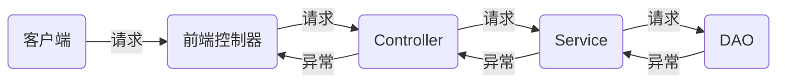

**SpringMVC 异常处理方式共有三种**：

- 内置的异常处理机制
- 实现 HandlerExceptionResolver 接口，自定义异常处理机制
- @ExceptionHandler 注解
- Web 处理机制，根据 error code 来处理

**若不配置**，SpringMVC 默认使用 DefaultHandlerExceptionResolver 

#### 内置处理机制

SimpleMappingExceptionResolver 类，该类实现了 HandlerExceptionResolver 接口

直接在核心配置文件中，配置一个 \<bean\> 标签即可：

- exceptionMappings 配置异常映射的错误页面
  - key - 需要处理的异常类型
  - 标签内的值 - 映射的页面的地址（该页面会经过视图解析器，若配置过前后缀，直接写页面名字即可）

```html
<bean class="org.springframework.web.servlet.handler.SimpleMappingExceptionResolver">
    <property name="exceptionMappings">
        <props>
            <!--
                <prop> 的 key 属性，表示处理器方法执行过程中出现的异常
                <prop> 标签包裹的值，表示若出现指定异常时，跳转到指定页面的逻辑视图
            -->
            <prop key="java.lang.IOException">error1</prop>
            <prop key="java.lang.NullPointerException">error2</prop>
        </props>
    </property>
    <!--
        exceptionAttribute 的 value 为属性名，将出现的异常信息在请求域中进行共享
    -->
    <property name="exceptionAttribute" value="ex"/>
</bean>
```

#### 自定义处理机制

自定义异常处理类，并实现 HandlerExceptionResolver 接口，并重写 resolveException 方法

前端控制器接收到抛出的异常后，会调用 HandlerExceptionResolver 接口，也就是自定义的实现类

```java
@Component // 不要忘记在核心配置文件中添加包扫描
public class MyExceptionResolver implements HandlerExceptionResolver {
    @Override
    public ModelAndView resolveException(HttpServletRequest req,
                                         HttpServletResponse resp,
                                         Object handler, Exception e) {
        ModelAndView model = new ModelAndView();
        model.addObject("msg", e.getMessage());
        // 可以给 ViewResolver 配置了前后缀，就能简写为 error
        model.setViewName("error");
        return model;
    }
}
```

#### 注解处理机制

在 Controller 的方法上使用 @ExceptionHandler，当此 Controller 中发生异常时，有该注解的方法就会处理异常

**主要缺点**：@ExceptionHandler 注解的方法仅对该特定控制器有效

**解决方案**：

1. 使用 **@ControllerAdvice**，该注解允许将多个分散的 @ExceptionHandler **整合**到一个单一的全局异常处理组件中  
   意味着，有该注解的 Controller 可以作为一个异常处理类，处理其他 Controller 中产生的异常

   ```java
   @ControllerAdvice
   public class MyExceptionResolver {
       /**
        * 该注解的值为需要处理的异常类型的 class 对象，可定义多个
        */
       @ExceptionHandler({RuntimeException.class, FileNotFoundException.class})
       // 形参 e 表示当前请求处理中，出现的异常对象
       public String myResolver(HttpServletRequest req, Exception e) {
           req.setAttribute("msg", e.getMessage());
           return "error";
       }
   }
   ```

2. 让所有控制器都**继承一个基本控制器类**（如 BaseController）来解决这个限制  
   缺点：有可能某个控制器已经继承了一些类，无法再继承基本控制器类

   ```java
   @Controller
   public class MyController {
       ...
       @ExceptionHandler({IOException.class, NullPointerException.class})
       public String handleException() { return "error"; }
   }
   ```

   > 注意：被 @ExceptionHandler 注解的方法的参数必须是固定的，否则运行时无法生效

#### Web 处理机制

在 web.xml 中配置

```xml
<error-page>
    <error-code>404</error-code> <!-- 异常代码 -->
    <location>error</location> <!-- 异常后跳转的页面的逻辑视图 -->
</error-page>
<error-page>
    <error-code>500</error-code>
    <location>error</location>
</error-page>
```

#### 自定义响应内容

若出现异常，会向客户端返回 异常页面 或 异常 JSON 数据

##### 返回页面

- **默认异常页面**：

  <h1 style="text-align:left">Whitelabel Error Page</h1><p style="text-align:left">This application has no explicit mapping for /error, so you are seeing this as a fallback.</p><div style="text-align:left">Sun Nov 20 14:01:39 CST 2050</div><div>There was an unexpected error (type=Not Found, status=404).</div><div style="text-align:left;margin-bottom:1rem">No message available</div>

- **自定义异常页面**：

  将自定义的异常页面 HTML，放入静态资源存放路径中

  1. classpath 中名为 /static（或 /public 或 /resources 或 /META-INF/resources）的目录
  2. ServletContext 的根目录（/webapp）

  例：将 404.html 放入 /src/main/resources/static 中，当遇到 404 错误时，会返回自定义的 404.html 页面

  也可以定义 4xx.html 和 5xx.html 页面来指代所有 4 和 5 开头的错误
  
- **Thymeleaf**：

  若添加了 Thymeleaf 依赖，/error 文件夹要放在 /src/main/resources/templates 下

  可以添加 4xx.html 和 5xx.html 来修改异常页面

  若没有自定义异常页面，则采用默认的异常页面

##### 返回 JSON

- **默认 JSON**：

  ```json
  {
      "timestamp": "2050-11-20T06:00:38.569+00:00",
      "status": 404,
      "error": "Not Found",
      "message": "No message available",
      "path": "/domenic"
  }
  ```

- **自定义 JSON**：

  方式一：

  在配置类中，用 @Bean 注入 IOC 容器

  ```java
  @Configuration
  public class MyConfig implements WebMvcConfigurer {
      @Bean
      public ErrorAttributes customErrorAttributes() {
          return new DefaultErrorAttributes() {
              @Override
              public Map<String, Object> getErrorAttributes(
                      WebRequest webReq, ErrorAttributeOptions options) {
                  final Map<String, Object> errAttrs = super.getErrorAttributes(webReq, options);
                  errAttrs.put("message", "Custom error");
                  errAttrs.put("error", super.getError(webReq));
                  return errAttrs;
              }
          };
      }
  }
  ```

  方式二：

  自定义类继承 DefaultErrorAttributes，用 @Component 注入 IOC 容器

  ```java
  @Component
  public class CustomErrorAttribute extends DefaultErrorAttributes {
      @Override
      public Map<String, Object> getErrorAttributes(
              WebRequest webReq, ErrorAttributeOptions options) { ... }
  }
  ```

### 拦截器

#### 概述

SpringMVC 的拦截器 Interceptor 类似于 Servlet 开发中的过滤器 Filter，用于对控制器 Controller 进行预处理和后处理，是 AOP 思想的具体实现

拦截器按一定的顺序联结成一条拦截器链（InterceptorChain）。在访问被拦截的方法或字段时，拦截器链中的拦截器就会按顺序被调用

**拦截器的方法**：

<table style="width:60rem">
    <thead>
        <tr style="text-align:left">
            <th width=20%>方法</th>
            <th width=80%>说明</th>
        </tr>
    </thead>
    <tbody>
        <tr>
            <td>preHandler</td>
            <td>方法将在请求处理前被调用<br/>方法返回 true 表示会继续调用下一个 Interceptor 的 preHandler（若没有就执行目标方法）<br/>方法返回 false 表示请求结束，后续的 Interceptor 和 Controller 都不会执行</td>
        </tr>
        <tr>
            <td>postHandler</td>
            <td>方法将在请求处理后，视图被渲染前被调用（前提是 preHandler 返回为 true）<br/>因此可以对 Controller 处理后的 ModelAndView 对象进行操作</td>
        </tr>
        <tr>
            <td>afterCompletion</td>
            <td>方法将整个请求结束后，就是视图被渲染完后被调用（前提是 preHandler 返回为 true）</td>
        </tr>
    </tbody>
</table>

**多拦截器执行顺序**：

- **若 preHandler 都返回 true**

  preHandler 会按配置顺序；  
  postHandler、afterCompletion 会按配置的反序

  示例：  
  First -\> preHandle  
  Second -\> preHandle  
  Second -\> postHandle  
  First -\> postHandle  
  Second -\> afterCompletion  
  First -\> afterCompletion

- **若有一个 preHandler 返回 false**

  当前返回 false 的和之前拦截器的 preHandler 会按配置顺序执行；  
  postHandler 都不会执行；  
  当前返回 false 的拦截器的 afterCompletion 会按配置的反序执行

  示例：  
  First -\> preHandle（返回 false）  
  Second -\> preHandle  
  First -\> afterCompletion

#### 示例


```java
public class MyInterceptor implements HandlerInterceptor {
    @Override
    /* 目标方法执行之前，若放行则返回 true */
    public boolean preHandle(
        HttpServletRequest req, HttpServletResponse resp, 
        Object handler) throws Exception { ... }

    @Override
    /* 目标方法执行完后，视图对象返回之前 */
    public void postHandle(
        HttpServletRequest req, HttpServletResponse resp, 
        Object handler, ModelAndView mv) throws Exception { ... }

    @Override
    /* 整个流程执行完毕后 */
    public void afterCompletion(
        HttpServletRequest req, HttpServletResponse resp, 
        Object handler, Exception e) throws Exception { ... }
}
```

- **在核心配置文件中配置**

  - 可以用 \<bean\>、\<ref\> 标签来配置拦截器，\<ref\> 就是引用已经创建的 bean  
    这两个标签配置的拦截器，默认对 DispatcherServlet 处理的所有请求进行拦截
  - \<mvc:mapping\> 配置拦截请求路径
  - \<mvc:exclude-mapping\> 配置排除的请求路径
  - path 属性：
    - /\* 表示上下文路径下，只有一层目录的请求路径
    - /\*\* 表示多层目录的请求路径，也就是所有

  ```xml
  <mvc:interceptors>
      <mvc:interceptor>
          <mvc:mapping path="/**"/>
          <mvc:exclude-mapping path="/abc"/>
          <bean class="com.domenic.interceptor.MyInterceptor"/>
          <!-- <ref bean="OneInterceptor"/> -->
      </mvc:interceptor>
      
      <!-- 可配置多个拦截器，形成一个拦截器链，按顺序执行 -->
      <mvc:interceptor>
          <mvc:mapping path="/**"/>
          <bean class="com.domenic.interceptor.SecondInterceptor"/>
      </mvc:interceptor>
  </mvc:interceptors>
  ```

- **在自定义配置类中配置**

  ```java
  @Configuration
  public class MyConfig implements WebMvcConfigurer {
      @Override
      public void addInterceptors(InterceptorRegistry registry) {
          InterceptorRegistration reg = registry.addInterceptor(new MyInterceptor());
          reg.addPathPatterns("/**")
              .excludePathPatterns("/abc", "/js/**", "/css/**");
      }
  }
  ```

### 服务器三大组件

执行顺序：监听器 --\> 过滤器 --\> 拦截器

**过滤器 \& 拦截器**：

<table>
    <thead>
        <tr style="text-align:left">
            <th width="10%"></th>
            <th width="45%">过滤器 Filter</th>
            <th width="45%">拦截器 Interceptor</th>
        </tr>
    </thead>
    <tbody>
        <tr>
            <td>使用范围</td>
            <td>Servlet 规范中的一部分<br/>依赖于 Tomcat 等容器，只能在 Web 工程中使用</td>
            <td>Spring 框架的组件，由 Spring 容器管理，可以单独使用</td>
        </tr>
        <tr>
            <td>拦截范围</td>
            <td>对所有进入容器的请求起作用<br/>url-pattern 配置为 /* 后，会拦截所有要访问的资源</td>
            <td>只会拦截控制器方法的访问，不拦截 html css js jsp image</td>
        </tr>
        <tr>
            <td>触发机制</td>
            <td>请求进入容器，但在进入 servlet 之前进行预处理；<br/>servlet 处理完后请求结束</td>
            <td>请求进入 servlet，但在进入 Controller 之前进行预处理；<br/>Controller 中渲染了对应的视图后请求结束</td>
        </tr>
        <tr>
            <td>实现原理</td>
            <td>基于函数回调</td>
            <td>基于 Java 反射机制（动态代理）</td>
        </tr>
        <tr>
            <td>应用场景</td>
            <td>设置字符编码；<br/>URL 级别的权限访问控制；<br/>压缩响应信息</td>
            <td>拦截未登录用户；<br/>审计日志</td>
        </tr>
    </tbody>
</table>

**三大组件对比**：

<table style="width:60rem">
    <thead>
        <tr style="text-align:left">
            <th></th>
            <th>过滤器 Filter</th>
            <th>监听器 Listener</th>
            <th>拦截器 Interceptor</th>
        </tr>
    </thead>
    <tbody>
        <tr>
            <td>关注部分</td>
            <td>数据</td>
            <td>系统级的参数、对象</td>
            <td>事件 Action（部分 web 请求）</td>
        </tr>
        <tr>
            <td>实现方式</td>
            <td>基于函数回调</td>
            <td>事件</td>
            <td>Java 反射机制（动态代理）</td>
        </tr>
        <tr>
            <td>依赖的东西</td>
            <td>依赖于 Servlet 容器</td>
            <td>依赖于 Servlet 容器</td>
            <td>依赖于 Spring 框架，是 aop 的一种表现</td>
        </tr>
        <tr>
            <td>级别</td>
            <td>系统级</td>
            <td>系统级</td>
            <td>非系统级</td>
        </tr>
    </tbody>
</table>

应用场景的区别：

- **过滤器**

  作用：对数据进行过滤

  例：字符编码格式、URL 级别权限控制、压缩响应信息、敏感词过滤

- **监听器**

  作用：监听 Web 应用中某些对象、信息的创建、销毁、修改等动作

  可根据监听对象，将监听器分为 3 类：

  - ServletContext：对应 application，实现接口 ServletContextListener。可用于做数据缓存，如 Redis，在 Web 服务创建时从数据库拉取数据到缓存服务器
  - HttpSession：对应 session 会话，实现接口 HttpSessionListener。可用于获取在线用户数量
  - ServletRequest：对应 request，实现接口 ServletRequestListener。用于封装请求数据，请求处理完毕后销毁

- **拦截器**

  作用：提供了一种机制，使开发者可以在一个 action 执行的前后做一些操作

  例：拦截未登录的用户、审计日志

---

## MVC 框架详解

### SpringMVC 组件

使用 SpringMVC 必须配置的三大组件：**处理器映射器**、**处理器适配器**、**视图解析器**

1. **前端控制器**：[DispatcherServlet](#DispatcherServlet)
   用户请求到达前端控制器 DispatcherServlet，它就相当于 MVC 模式中的 Controller，是整个流程控制的中心，由它调用其它组件来处理用户的请求。DispatcherServlet 的存在降低了组件之间的耦合性

2. **处理器映射器**：HandlerMapping
   HandlerMapping 负责根据请求找到 Handler（处理器）  
   SpringMVC 根据请求的 url、method 等信息查找匹配的 Handler（控制器方法）

3. **处理器适配器**：HandlerAdapter
   通过 HandlerAdapter 来执行处理器，这是[适配器模式](https://www.runoob.com/design-pattern/adapter-pattern.html)的应用，通过扩展适配器可以对更多类型的处理器进行执行

4. **处理器**：Handler【**由使用者编写**】
   开发中要编写的具体业务控制器。由 DispatcherServlet 把用户请求转发到 Handler，Handler 对具体的用户请求进行处理

5. **视图解析器**：ViewResolver
   View Resolver 负责将处理结果生成 View 视图，View Resolver 根据 ModelAndView 对象中的 View 信息，将逻辑视图名解析成物理视图名（即具体的页面地址），再生成 View 视图对象，最后对 View 进行渲染将处理结果通过页面展示给用户

   不同的视图解析器，如：ThymeleafView、InternalResourceView、RedirectView

6. **视图**：View【**由使用者编写**】
   一般需要通过页面标签或页面模版技术，将模型数据通过页面展示给用户。SpringMVC 框架提供了很多的 View 视图类型的支持

### SpringMVC 执行流程

<div style="clear:both"></div>

**流程如下**：

1. 用户发起一个 HTTP request 请求，该请求会被提交到 DispatcherServlet（前端控制器）

   DispatcherServlet 会判断请求 URI 对应的映射

   - 映射不存在

     判断是否配置了 \<mvc:default-servlet-handler\>

     - 是：控制台报错映射查找不到，客户端展示 404 错误
     - 否：访问目标资源（如：HTML,JS,CSS），若找不到，客户端就展示 404 错误

   - 映射存在，执行下面流程

2. 由 DispatcherServlet 请求一个或多个 HandlerMapping（处理器映射器），处理器映射器找到具体的处理器（根据 XML 配置、注解查找），生成处理器对象及处理器拦截器，最终以执行链（HandlerExecutionChain）形式返回

3. DispatcherServlet 将执行链返回的 Handler 信息发送给合适的 HandlerAdapter（处理器适配器）

4. HandlerAdapter 根据 Handler 信息找到并执行相应的 Handler（常称为 Controller）和拦截器

   执行前，会先执行拦截器的 preHandler(...) 方法

   HandlerAdapter 会提取 Request 中的模型数据，填充 Handler 的入参  
   在该过程中，Spring 会进行的额外操作：

   - HttpMessageConveter：将请求消息（如：JSON、XML 等）转换为一个对象，将对象转换为指定的响应信息
   - 数据转换：如 String 转换为 Integer、Double 等
   - 数据格式化：如将字符串转换为 格式化数字 或 格式化日期 等
   - 数据验证：验证数据的有效性（长度、格式等），验证结果存储到 BindingResult 或 Error 中。不过一般在前端完成数据校验

5. Controller 执行完后，返回一个 ModelAndView 对象（SpringMVC 的底层对象，包含 Model 数据模型和 View 视图信息）

   - 对象返回后，会判断是否有异常，若有，则执行 HandlerExceptionResolver 进行异常处理
   - 对象返回后，会执行拦截器的 postHandle(...) 方法

6. DispatcherServlet 接收到 ModelAndView 对象后，会请求合适的 ViewResolver（视图解析器）对视图进行解析

7. ViewResolver 根据 View 信息匹配到相应的视图结果，并返回。DispatcherServlet 接收到具体的 View 视图后，进行视图渲染，将 Model 中的模型数据填充到 View 视图中的 request 域，生成最终的 View（视图）

   - 渲染完后，会执行拦截器的 afterCompletion(...) 方法

8. 将视图负责结果返回给客户端

### DispatcherServlet

DispatcherServlet 本质上是个 Servlet，遵循 Servlet 的生命周期。所以，宏观上是 Servlet 生命周期来进行调度

**继承（extends）链**：

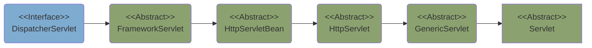

请求会先到达 FrameworkServlet 中的 doGet、doPost、doPut、doDelete 方法  
之后，通过 processRequest 方法调用 doService，而 DispatcherServlet 重写了 doService 方法

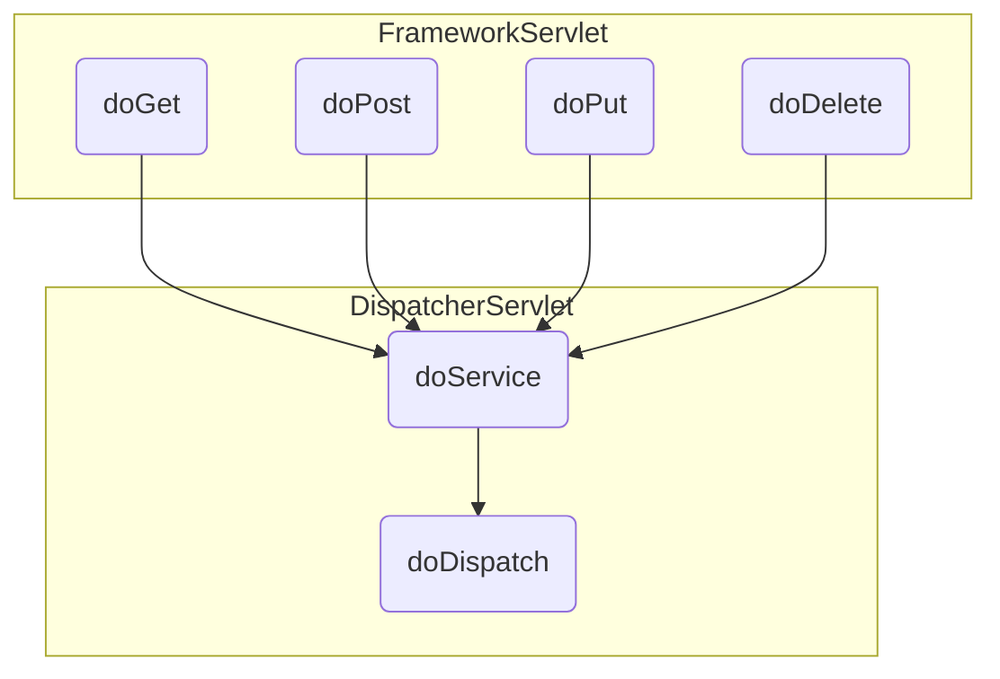

DispatcherServlet 中的执行过程：

获取请求 --\> 执行 --\> doService() --\> doDispatch() --\> processDispatchResult() --\> (视图渲染：render())

### 工作原理

#### 处理器映射器

在 DispatcherServlet 的 doDispatch 方法中，会获取匹配的 Handler 对象，该对象封装在 HandlerExecutionChain 中

```java
protected void doDispatch(...) throws... {
    ...
    // 获取执行链
    mappedHandler = this.getHandler(processedRequest);
    ...
}
```

DispatcherServlet 中获取执行链的方法：

```java
protected HandlerExecutionChain getHandler(HttpServletRequest request) throws... {
    if (this.handlerMappings != null) {
        Iterator var2 = this.handlerMappings.iterator();
        // 循环遍历 List<HandlerMapping>
        while(var2.hasNext()) {
            HandlerMapping mapping = (HandlerMapping)var2.next();
            // 获取对应的 Handler
            // 调用的 getHandler 是对应类型的处理器映射器中的方法
            HandlerExecutionChain handler = mapping.getHandler(request);
            if (handler != null) {
                return handler;
            }
        }
    }
    return null;
}
```

**HandlerMapping 接口**：  
用于定义 Request 和 Handler 之间的映射关系  
就是返回一个 HandlerExecutionChain 对象  
若返回为 null，就表示该 HandlerMapping 不能找到请求的映射关系

以下为 5 种**处理器映射器**，用来获取合适的 Handler：

它们实现了 HandlerMapping 接口，继承了 AbstractHandlerMapping 抽象类

- **RequestMappingHandlerMapping** - 处理访问控制器方法的 HandlerMapping
- **WelcomePageHandlerMapping** - 处理访问欢迎页的 HandlerMapping
- BeanNameUrlHandlerMapping
- SimpleUrlHandlerMapping
- RouterFunctionMapping

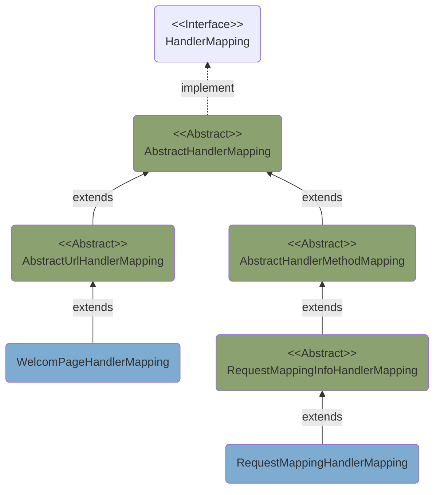

**以访问控制器方法为例**：

> 以 GET 方法访问 /user 对应的控制器方法，以下为匹配 Handler 的流程

1. DispatcherServlet 调用到 RequestMappingHandlerMapping 的 **getHandler** 方法

   ```java
   protected HandlerExecutionChain getHandler(...) throws... {
       ...
       HandlerExecutionChain handler = mapping.getHandler(request);
       ...
   }
   ```

2. getHandler 方法调用到 AbstractHandlerMethodMapping 抽象类下的 **getHandlerInternal**

   - mappingRegistry - 记录所有的请求路径，如：{/hello}、{GET /user}、{POST /user}、{/error}...

   ```java
   protected HandlerMethod getHandlerInternal(HttpServletRequest request) throws... {
       String lookupPath = this.initLookupPath(request);  // 获取请求路径，如 /user
       this.mappingRegistry.acquireReadLock();  // 获取锁，保证并发场景下的安全性
   
       HandlerMethod var4;
       try {
           // 处理 Hanlder 的核心方法
           HandlerMethod handlerMethod = this.lookupHandlerMethod(lookupPath, request);
           var4 = handlerMethod != null ? handlerMethod.createWithResolvedBean() : null;
       } finally {
           this.mappingRegistry.releaseReadLock();
       }
   
       return var4;
   }
   ```

3. 进入 **lookupHandlerMethod** 方法

   - directPathMatches - 记录所有初步匹配的 handler，如：{GET /user}、{POST /user}、{PUT /user}...
   - matches - 记录最匹配的 handler，{GET /user}。若最匹配的 Handler 有多个，则报错
   - bestMatch - 记录最匹配的 hanlder  
     其中 handlerMethod 属性记录了 handler 方法，如：com.domenic.controller.UserController\#getUser(String)

   ```java
   protected HandlerMethod lookupHandlerMethod(
           String lookupPath, HttpServletRequest request) throws... {
       List<AbstractHandlerMethodMapping<T>.Match> matches = new ArrayList();
       List<T> directPathMatches = this.mappingRegistry.getMappingsByDirectPath(lookupPath);
       if (directPathMatches != null) {
           // 获取最匹配的 Handler，放入 matches 中
           this.addMatchingMappings(directPathMatches, matches, request);
       }
       ...
       // 若最匹配的 Handler 只有一个，就放入 bestMatch 中
       AbstractHandlerMethodMapping<T>.Match bestMatch = 
           (AbstractHandlerMethodMapping.Match)matches.get(0);
       ...
       request.setAttribute(BEST_MATCHING_HANDLER_ATTRIBUTE, bestMatch.getHandlerMethod());
       this.handleMatch(bestMatch.mapping, lookupPath, request);
       // 
       return bestMatch.getHandlerMethod();
   }
   ```

#### 处理器适配器

请求会被 DispatcherServlet 拦截，其中的 doDispatch 方法处理请求

```java
protected void doDispatch(...) throws... {
    ...
    // 获取执行链
    mappedHandler = this.getHandler(processedRequest);
    ...
    // 获取支持该 handler 的 HandlerAdapter
    HandlerAdapter ha = this.getHandlerAdapter(mappedHandler.getHandler());
    ...
    // 调用 HandlerAdapter 的 handle 方法，返回值为 ModelAndView
    mv = ha.handle(processedRequest, response, mappedHandler.getHandler());
    ...
}
```

DispatcherServlet 中获取匹配的 HandlerAdapter

```java
protected HandlerAdapter getHandlerAdapter(Object handler) throws... {
    if (this.handlerAdapters != null) {
        Iterator var2 = this.handlerAdapters.iterator();
        // 循环遍历 List<HandlerAdapter>
        while(var2.hasNext()) {
            HandlerAdapter adapter = (HandlerAdapter)var2.next();
            // 返回可以处理 Handler 的 Adapter
            if (adapter.supports(handler)) {
                return adapter;
            }
        }
    }
    throw new ServletException("No adapter for handler ...");
}
```

**HandlerAdapter 接口**：  
DispatcherServlet 可通过该接口访问所有的 Adapter，再使用合适的 HandlerAdapter 来执行处理器

**以下为四种处理器适配器**：

它们实现了 HandlerAdapter 接口

- **RequestMappingHandlerAdapter**
- HandlerFunctionAdapter
- HttpRequestHandlerAdapter
- SimpleControllerHandlerAdapter

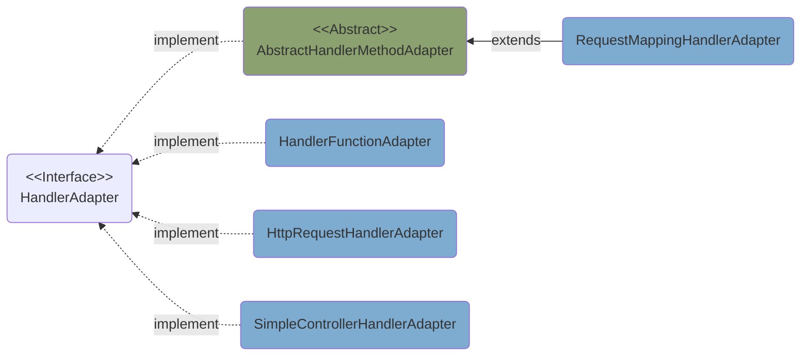

#### 请求参数解析

##### 执行原理

**参数解析器**：

所有参数解析器，都直接或间接实现了 HandlerMethodArgumentResolver 接口

以下为部分解析器的类层级结构：

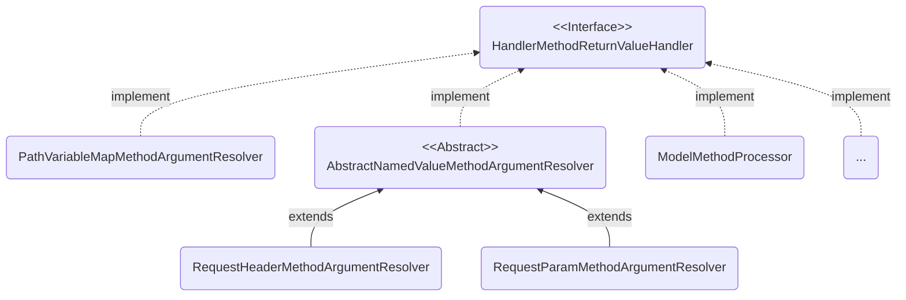

**以此控制器方法为例**：

```java
@RequestMapping("user/{userId}/num/{num}")
public @ResponseBody String testParam(
    @PathVariable("userId") String userId, 
    @PathVariable("num") Integer num, 
    @RequestParam("username") String username) { ... }
```

请求：http://localhost:8080/user/1001/num/321?username=domenic

以下为请求链接中的参数，被解析的流程：

1. DispatcherServlet 调用到 RequestMappingHandlerAdapter 的 **handle** 方法

   ```java
   protected void doDispatch(...) throws... {
       ...
       // 调用 HandlerAdapter ha 的 handle 方法
       mv = ha.handle(processedRequest, response, mappedHandler.getHandler());
       ...
   }
   ```

2. handle 方法又会调用到 RequestMappingHandlerAdapter 类下的 **handleInternal**

   ```java
   protected ModelAndView handleInternal(...) throws... {
       // 检查是否支持该请求
       this.checkRequest(request);
       ...
       // 执行 Handler 方法，获取 Handler 执行完后的 ModelAndView 返回值
       mav = this.invokeHandlerMethod(request, response, handlerMethod);
       ...
   }
   ```

3. 进入 **invokeHandlerMethod** 方法

   - **argumentResolvers** - 参数解析器，用来解析前台发送的请求参数

     都实现了 HandlerMethodArgumentResolver 接口

     参数解析器：

     - **RequestParam**MethodArgumentResolver
     - **PathVariable**MethodArgumentResolver
     - **RequestHeader**MethodArgumentResolver
     - **Map**MethodProcessor
     - ...

   - **returnValueHandlers** - 返回值处理器

   ```java
   protected ModelAndView invokeHandlerMethod(...) throws... {
       ...
       if (this.argumentResolvers != null) {
           // 设置参数解析器
           invocableMethod.setHandlerMethodArgumentResolvers(this.argumentResolvers);
       }
       if (this.returnValueHandlers != null) {
           // 设置返回值处理器
           invocableMethod.setHandlerMethodReturnValueHandlers(this.returnValueHandlers);
       }
       ...
       // 进入 invokeAndHandle 方法
       invocableMethod.invokeAndHandle(webRequest, mavContainer, new Object[0]);
       ...
   }
   ```
   
4. 解析前台传递的参数

   ```mermaid
   classDiagram
     direction LR
     class ServletInvocableHandlerMethod {
       + invokeAndHandle()
     }
     class InvocableHandlerMethod {
       Object[] args
       + invokeForRequest()
       # getMethodArgumentValues()
     }
     class HandlerMethodArgumentResolverComposite {
       + supportsParameter()
       + resolveArgument()
       - getArgumentResolver()
     }
     ServletInvocableHandlerMethod --> InvocableHandlerMethod : invoke
     InvocableHandlerMethod --> HandlerMethodArgumentResolverComposite : invoke
   ```

   ServletInvocableHandlerMethod 的 **invokeAndHandle** 方法，调用了父类 InvocableHandlerMethod 的 **invokeForRequest** 方法  
   invokeForRequest 又调用本类的 **getMethodArgumentValues** 方法获取所有参数

   ```java
   protected Object[] getMethodArgumentValues(...) throws... {
       // 获取 Handler 方法有几个参数
       MethodParameter[] parameters = this.getMethodParameters();
       if (ObjectUtils.isEmpty(parameters)) {
           return EMPTY_ARGS;
       } else {
           // args 存放所有解析完毕的参数
           Object[] args = new Object[parameters.length];
           // 循环，解析 Handler 方法的每一个参数
           for(int i = 0; i < parameters.length; ++i) {
               ...
               if (args[i] == null) {
                   if (!this.resolvers.supportsParameter(parameter)) {
                       throw new IllegalStateException(...);
                   }
                   args[i] = this.resolvers.resolveArgument(...);
                   ...
               }
           }
           return args;
       }
   }
   ```

   getMethodArgumentValues 方法返回 `args`，记录了请求参数：

   - 0 = "1001"
   - 1 = 321
   - 2 = "domenic"

   **HandlerMethodArgumentResolverComposite** 类：

   - supportsParameter 方法  
     通过 iterator 迭代遍历，找到合适的 参数解析器 来解析对应的参数
   - resolveArgument 方法  
     使用匹配的 参数解析器，解析参数

   ```java
   public boolean supportsParameter(MethodParameter parameter) {
       // 调用 getArgumentResolver 来寻找匹配的解析器
       return this.getArgumentResolver(parameter) != null;
   }
   
   public Object resolveArgument(...) throws... {
       // 获取与 parameter 匹配的解析器
       HandlerMethodArgumentResolver resolver = this.getArgumentResolver(parameter);
       ...
       // 调用该解析器对参数进行解析
       return resolver.resolveArgument(...);
   }
   ```

**调用链总结**：

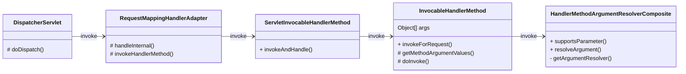

##### Map & Model

```java
@RequestMapping("/test")
public String test(Map<String,Object> map, Model model) {
    // map 和 model 中设置的值，会被放入 request 域中
    map.put("name", "domenic");
    model.addAttribute("gender", "male");
    return "forward:/success";
}
@RequestMapping("/success")
public @ResponseBody String success(HttpServletRequest req) {
    req.getAttribute("name"));
    req.getAttribute("gender"));
    return "finish";
}
```

请求：http://localhost:8080/test

> 请求到达以后，被 DispatcherServlet 拦截解析，步骤与[请求参数解析](#请求参数解析)中描述的一致

通过 **HandlerMethodArgumentResolverComposite** 类的 supportsParameter 匹配解析器

- Map 类型参数的解析器为 MapMethodProcessor
- Model 类型参数的解析器为 ModelMethodProcessor

调用对应解析器中的 resolveArgument 方法来解析参数

Map 和 Model 都会被包装进 **BindingAwareModelMap**（HashMap 类型对象），存入 ModelAndViewContainer 中

**将值放入 request 域**：

1. ServletInvocableHandlerMethod 类中的 **invokeAndHandle** 方法，调用 handleReturnValue 去处理返回值  
   将 View 放入 **ModelAndViewContainer** 中

2. 处理器适配器 RequestMappingHandlerAdapter 的 invokeHandlerMethod 方法  
   从 ModelAndViewContainer 中获取到 **ModelAndView** 并返回

   此时的 ModelAndView：

   - view = "forward:/success"
   - model = {ModelMap}
     - 0 = {LinkedHashMap} "name" -\> "domenic"
     - 1 = {LinkedHashMap} "gender" -\> "male"

3. 前端控制器 DispatcherServlet 在 doDispatch 中，调用 **processDispatchResult**  
   进行 **render** 操作，解析 View，将 model 的数据放入 request 域中

##### pojo

```java
@PostMapping("/test")
public @ResponseBody Person test(Person person){
    return person;
}
```

> 请求到达以后，被 DispatcherServlet 拦截解析，步骤与[请求参数解析](#请求参数解析)中描述的一致

通过 **HandlerMethodArgumentResolverComposite** 类的 supportsParameter 匹配解析器

- pojo 类型参数的解析器为 ModelAttributeMethodProcessor

调用对应解析器中的 resolveArgument 方法来解析参数

**resolveArgument 解析请求参数**：

1. 调用 **createAttribute** 方法，创建一个空对象

2. 调用 **createBinder** 方法，初始化数据类型转换器

3. 调用 **bindRequestParameters** 方法，通过数据类型转换器，将数据绑定到 pojo 的属性中

   bindRequestParameters 是 ServletModelAttributeMethodProcessor 中的方法

   底层转换原理是，遍历所有转换器，使用合适的进行类型转换

##### 原生 Servlet

```java
@RequestMapping("/test")
public String test(HttpServletRequest request){
    String name = request.getParameter("name");
    ...
}
```

请求：http://localhost:8080/test?name=domenic

> 请求到达以后，被 DispatcherServlet 拦截解析，步骤与[请求参数解析](#请求参数解析)中描述的一致

通过 **HandlerMethodArgumentResolverComposite** 类的 supportsParameter 匹配到的解析器

- 原生 Servlet 获取参数，匹配的解析器为 ServletRequestMethodArgumentResolver

调用该解析器中的 resolveArgument 方法来解析参数

该方法中会获取 HttpServletRequest 类型的 request 对象，因此可以直接使用原生 Servlet

#### 类型转换

有三个关于类型转换的接口：Converter\<S,T\>，ConverterFactory\<S, R\>，GenericConverter

自定义类型转换器示例：

```java
@Configuration
public class WebConfig implements WebMvcConfigurer {
    @Override
    public void addFormatters(FormatterRegistry registry) {
        // 自定义 String --> Pet 的类型转换器
        registry.addConverter(new Converter<String, Pet>() {
            @Override
            public Pet convert(String source) {
                // 就是根据 "-" 分隔 String，填入 Pet 的两个属性中
                if(StringUtils.hasLength(source)) {
                    String[] split = source.split("-");
                    return new Pet(split[0], Integer.parseInt(split[1]));
                }
                return null;
            }
        });
    }
}
```

<details>
    <summary>测试代码示例</summary>
    <pre><code>
    @PostMapping("/saveUser")
    @ResponseBody
    public Person saveUser(Person person) {
        return person;
    }&#10;
    &lt;form action="/saveUser" method="post"&gt;
        姓名：&lt;input name="userName" value="domenic"/&gt; &lt;br/&gt;
        年龄：&lt;input name="age" value="18"/&gt; &lt;br/&gt;
        生日：&lt;input name="birth" value="2019/12/10"/&gt; &lt;br/&gt;
        宠物：&lt;input name="pet" value="橘猫-3"/&gt;&lt;br/&gt;
        &lt;input type="submit" value="保存"/&gt;
    &lt;/form&gt;&#10;
    @Data
    public class Person {&#10;
        private String userName;&#10;
        @DateTimeFormat(pattern="yyyy/MM/dd")
        private LocalDate birth;&#10;
        private Integer age;&#10;
        private Pet pet;
    }&#10;
    @Data
    public class Pet {&#10;
        private String name;&#10;
    	private Integer age;
    }
    </code></pre>
</details>

表单发送 POST 请求：http://localhost:8080/saveUser

> 请求到达以后，被 DispatcherServlet 拦截解析，步骤与[请求参数解析](#请求参数解析)中描述的一致

调用 **HandlerMethodArgumentResolverComposite** 类的 supportsParameter 匹配解析器

- pojo 类型参数的解析器为 ModelAttributeMethodProcessor

调用对应解析器中的 resolveArgument 方法来解析参数

**resolveArgument 解析请求参数**：

1. 调用 **createAttribute** 方法，创建一个空对象

2. 调用 **createBinder** 方法，初始化所有的类型转换器，包括自定义的

3. 调用 **bindRequestParameters** 方法，通过数据类型转换器，将数据绑定到 pojo 的属性中

   bindRequestParameters 是 ServletModelAttributeMethodProcessor 中的方法

   参数 `mpvs` 记录了前端传递的 pojo 属性键值对

   ```mermaid
   classDiagram
     direction LR
     class ServletRequestDataBinder {
       MutablePropertyValues mpvs
       + bind()
     }
     class WebDataBinder {
       # doBind(mpvs)
     }
     class DataBinder {
       # doBind(mpvs)
       # checkAllowedFields(mvps)
       # checkRequiredFields(mvps)
       # applyPropertyValues(mvps)
     }
     ServletRequestDataBinder --> WebDataBinder : invoke
     WebDataBinder --> DataBinder : invoke
   ```

4. DataBinder 类中的 applyPropertyValues 方法负责对属性进行转换和赋值

   该方法调用 setPropertyValues 方法  
   最终到 AbstractNestablePropertyAccessor 类中  
   执行 processLocalProperty 或 processKeyedProperty 进行类型转换和赋值

   ```mermaid
   classDiagram
     direction LR
     class PropertyAccessor {
       setPropertyValues()
     }
     <<Interface>> PropertyAccessor
     class AbstractPropertyAccessor {
       + setPropertyValues()
     }
     <<Abstract>> AbstractPropertyAccessor
     class AbstractNestablePropertyAccessor {
       # setPropertyValue()
       - processKeyedProperty()
       - processLocalProperty()
       - convertIfNecessary()
     }
     <<Abstract>> AbstractNestablePropertyAccessor
     PropertyAccessor <|.. AbstractPropertyAccessor : implement
     AbstractPropertyAccessor <|-- AbstractNestablePropertyAccessor : extends
   ```

5. convertIfNecessary 是类型转换方法  
   processLocalProperty -\> convertForProperty -\> convertIfNecessary  
   processKeyedProperty -\> convertIfNecessary

   该方法会调用到 TypeConverterDelegate 类的 convertIfNecessary 方法：

   ```java
   public <T> T convertIfNecessary(...) throws... {
       ...
       // 判断是否支持转换
       if (conversionService.canConvert(sourceTypeDesc, typeDescriptor)) {
           // 执行 convert 方法，进行类型转换
           return conversionService.convert(newValue, sourceTypeDesc, typeDescriptor);
       }
       ...
   }
   ```

   ```mermaid
   classDiagram
     direction LR
     class TypeConverterDelegate {
       + convertIfNecessary()
     }
     class ConversionService {
       canConvert()
       convert()
     }
     <<interface>> ConversionService
     class GenericConversionService {
       + canConvert()
       + convert()
     }
     class ConversionUtils {
       + invokeConverter()
     }
     <<abstract>> ConversionUtils
     TypeConverterDelegate --> ConversionService : invoke
     ConversionService <|.. GenericConversionService : implement
     GenericConversionService --> ConversionUtils : invoke
   ```

   最终，进入 ConversionUtils 的 invokeConverter 方法，真正调用执行类型转换的 Converter

#### 返回值处理

请求会被 DispatcherServlet 拦截并处理  
在 ServletInvocableHandlerMethod 类的 invokeAndHandle 方法中，会获取到处理完的请求参数 `invokeForRequest`  
之后就进行返回值处理 `handleReturnValue`

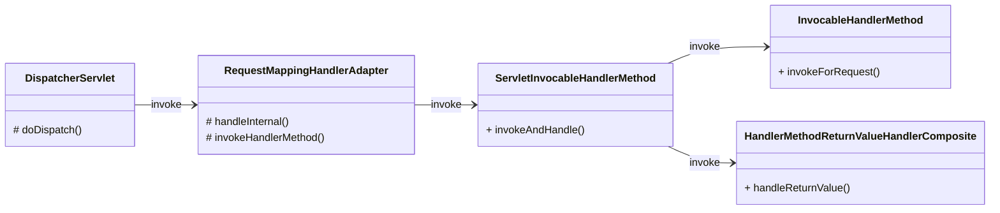

**返回值处理器**：

所有返回值处理器，都直接或间接实现了 HandlerMethodReturnValueHandler 接口

以下为部分处理器的类层级结构：

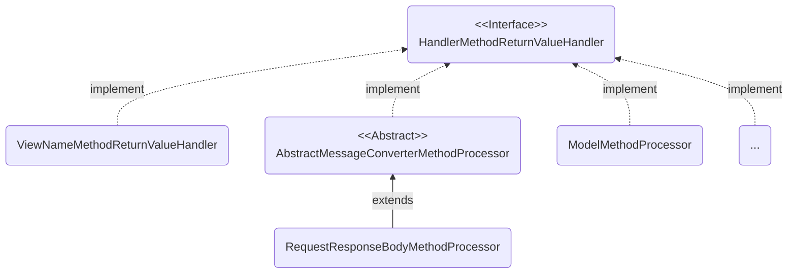

**以此控制器方法为例**：

```java
@PostMapping("/saveUser")
public @ResponseBody Person saveUser(Person person) { return person; }
```

以下是返回值处理的流程：

1. **RequestMappingHandlerAdapter** 类中的 invokeHandlerMethod 方法，会设置 请求参数解析器 和 返回值处理器

   - **returnValueHandlers** - 返回值处理器

     都实现了 HandlerMethodReturnValueHandler 接口

     返回值解析器：

     - **ModelAndView**MethodReturnValueHandler
     - **RequestResponseBody**MethodProcessor
     - **ViewName**MethodReturnValueHandler
     - **HttpEntity**MethodProcessor
     - ...

2. 进入 **invokeAndHandle** 方法

   调用 invokeForRequest 进行请求参数解析，并且执行 Handler，最后获取到 Handler 的返回值  
   调用 handleReturnValue 进行返回值处理，类型转换，并写入响应中

   ```java
   public void invokeAndHandle(...) throws... {
       // 获取 Handler 方法执行完的返回值
       Object returnValue = this.invokeForRequest(webRequest, mavContainer, providedArgs);
       ...
       // 处理返回值
       this.returnValueHandlers.handleReturnValue(returnValue, ...);
       ...
   }
   ```

3. 调用 HandlerMethodReturnValueHandlerComposite 类的 handleReturnValue 方法

   ```java
   public void handleReturnValue(...) throws... {
       // 获取合适的返回值处理器
       HandlerMethodReturnValueHandler handler = this.selectHandler(returnValue, returnType);
       ...
       // 进行返回值的处理
       handler.handleReturnValue(returnValue, ...);
   }
   ```

   因为有 @ResponseBody 注解，因此使用 **RequestResponseBody**MethodProcessor 的 **handleReturnValue** 方法处理返回值

4. handleReturnValue 方法调用 **writeWithMessageConverters** 方法

   - **MediaType** - 就是返回信息的媒体类型

   - **acceptableTypes** - 客户端能接受服务器响应的内容类型（就是请求头中的 "Accept" 信息）
     
     "Accept" 中支持的内容类型，有优先级，前面的先进行匹配
     
     - "text/html"
     - "application/xhtml+xml"
     - "image/avif"
     - ...
     
   - **producibleTypes** - 服务器能响应给客户端的类型
     
     循环遍历 MessageConverter，判断转换器是否支持对响应数据进行媒体类型的支持  
     若支持，则调用该转换器的 getSupportedMediaTypes 方法，获取支持的媒体类型
     
     - "application/json"
     - ...
     
   - **mediaTypesToUse** - 服务器和客户端匹配的内容类型

   该方法执行步骤：

   1. 循环遍历，寻找匹配的 acceptableTypes 和 producibleTypes

   2. 循环遍历，确定[消息转换器](#消息转换器)（HttpMessageConverter\<T\> 接口的实现类）

      **MappingJackson2**HttpMessageConverter 消息转换器，将 pojo 转换为需要的类型（如 json 串）

      转换之后，将数据以字节数组的形式写出到客户端

   3. 调用 write() 将信息写入响应中

   ```java
   protected <T> void writeWithMessageConverters() throws... {
       ...
       // 获取客户端可以接收的内容类型（调用 resolveMediaTypes 方法）
       List acceptableTypes = this.getAcceptableMediaTypes(request);
       ...
       // 获取服务器端可以处理的内容类型
       List<MediaType> producibleTypes = this.getProducibleMediaTypes(request, valueType, (Type)targetType);
       ...
       // 之后会循环遍历，调用 canWrite() 判断哪个 MessageConverter 支持对指定的数据类型进行写出
       // 然后执行 write() 将内容写入响应
   }
   ```

5. 进入 **AbstractGeneric**HttpMessageConverter 类中的 write 方法  
   该方法会调用 **AbstractJackson2**HttpMessageConverter 类中的 writeInternal 方法，通过 Jackson 依赖将 pojo 转换为需要的类型

**调用链总结**：

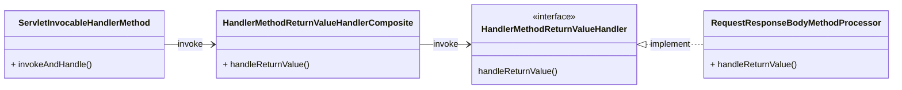

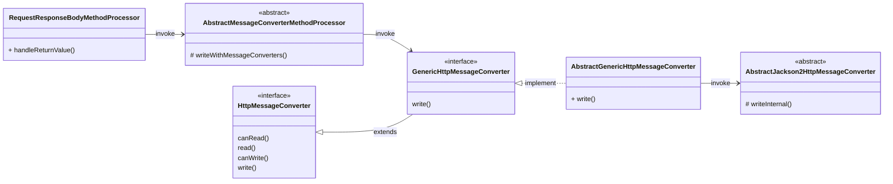

#### 内容协商

AbstractMessageConverterMethodProcessor 中执行 消息内容类型转换 和 写入响应 的方法

```java
protected <T> void writeWithMessageConverters() throws... {
    ...
    // 获取客户端可以接收的内容类型（调用 resolveMediaTypes 方法）
    List acceptableTypes = this.getAcceptableMediaTypes(request);
    ...
    // 获取服务器端可以处理的内容类型
    List<MediaType> producibleTypes = this.getProducibleMediaTypes(request, valueType, (Type)targetType);
    ...
}
```

writeWithMessageConverters 方法会用 getAcceptableMediaTypes 调用 resolveMediaTypes，通过内容协商来决定 MediaType  
ContentNegotiationManager 类的 resolveMediaTypes 方法，会通过 ContentNegotiateStrategy 接口调用对应的内容协商策略类

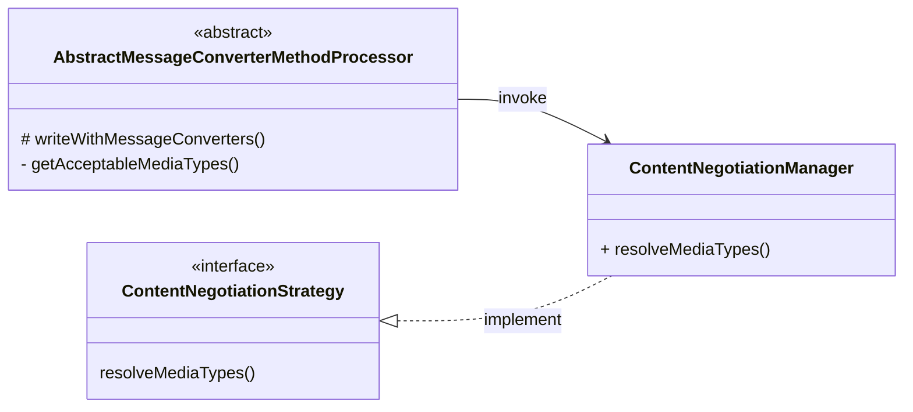

**内容协商策略类的层级结构**：

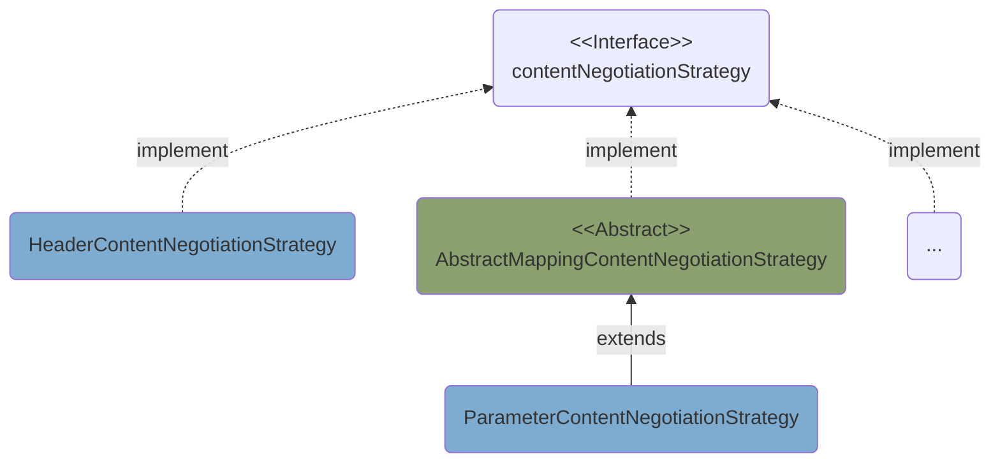

- **基于请求头的内容协商**：

  可以根据客户端**请求头中的 "Accept" 要求**，响应不同类型的内容

  ```mermaid
  flowchart LR
    A("ContentNegotiationManager<br/>+resolveMediaType()") --"invoke"--> B("HeaderContentNegotiationStrategy")
  ```

  **例**：服务端返回 XML 类型数据

  导入 Jackson 依赖：

  ```xml
  <!-- Jackson XML 转换 -->
  <dependency>
      <groupId>com.fasterxml.jackson.dataformat</groupId>
      <artifactId>jackson-dataformat-xml</artifactId>
  </dependency>
  ```

  控制器方法：

  ```java
  @RequestMapping("/test/xml")
  public @ResponseBody Person responseXML() {
      return new Person(...);
  }
  ```

  若请求头的 "Accept" 是：

  text/html,application/xhtml+xml,application/xml;q=0.9,image/avif,image/webp,image/apng,\*/\*;q=0.8,application/signed-exchange;v=b3;q=0.9

  那根据 "Accept" 中支持的内容类型的优先级（前面的先匹配），服务端会返回 XML 类型数据

- **基于请求参数的内容协商**：

  可以根据客户端**请求参数中的 format 值**，响应不同类型的内容
  
  ```mermaid
  flowchart LR
    A("ContentNegotiationManager<br/>+resolveMediaType()") --"invoke"--> B("ParameterContentNegotiationStrategy")
  ```
  
  配置中开启基于请求参数的内容协商
  
  ```yml
  spring:
    mvc:
      contentnegotiation:
        favor-parameter: true
  ```
  
  **例**：控制器方法
  
  ```java
  @RequestMapping("/test")
  public @ResponseBody Person responseXML() {
      return new Person(...);
  }
  ```
  
  请求：http://localhost:8080/test?format=xml，响应 XML 类型
  
  请求：http://localhost:8080/test?format=json，响应 JSON 类型

#### 消息转换器

**在返回值处理时**，需要先进行消息内容转换，再写入响应中，如：将实体类转换为 JSON

所有消息转换器，都直接或间接实现 HttpMessageConverter 接口

其中一条类层级结构：

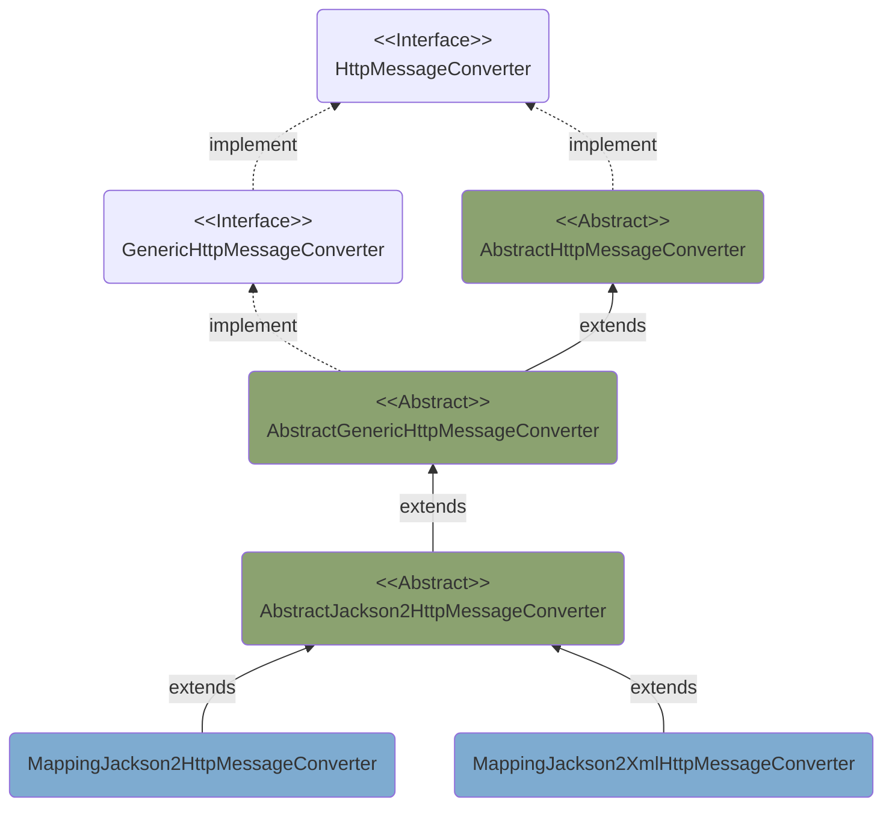

**自定义消息转换器被调用的原理**：

AbstractMessageConverterMethodProcessor 类的 **writeWithMessageConverters** 方法，会获取 客户端支持的内容类型、服务端可处理的内容类型；并判断 最佳匹配的媒体内容类型

```java
protected <T> void writeWithMessageConverters() throws... {
    ...
    // 获取客户端可以接收的内容类型（调用 resolveMediaTypes 方法）
    List acceptableTypes = this.getAcceptableMediaTypes(request);
    ...
    // 获取服务器端可以处理的内容类型
    List<MediaType> producibleTypes = this.getProducibleMediaTypes(request, valueType, (Type)targetType);
    ...
    // 判断出最佳匹配的 MediaType，放入 mediaTypeToUse 中
    mediaTypesToUse.add(this.getMostSpecificMediaType(mediaType, producibleType);
    ...
    // 之后会循环遍历，调用 canWrite() 判断哪个 MessageConverter 支持对指定的数据类型进行写出
    // 然后执行 write() 将内容写入响应
}
```

- **获取客户端支持的内容类型**：

  `List acceptableTypes = this.getAcceptableMediaTypes(...);`

  getAcceptableMediaTypes() -- invoke --\> resolveMediaTypes()

  ContentNegotiationManager 中的方法：

  ```java
  public List<MediaType> resolveMediaTypes(NativeWebRequest request) throws... {
      Iterator var2 = this.strategies.iterator();
  
      List mediaTypes;
      // 循环调用所有内容协商策略类
      do {
          if (!var2.hasNext()) {
              return MEDIA_TYPE_ALL_LIST;
          }
          ContentNegotiationStrategy strategy = (ContentNegotiationStrategy)var2.next();
          // 调用内容协商策略类的方法，获取请求中包含的，客户端对内容类型的要求
          mediaTypes = strategy.resolveMediaTypes(request);
      } while(mediaTypes.equals(MEDIA_TYPE_ALL_LIST));
  
      return mediaTypes;
  }
  ```

  以上方法又调用了 resolveMediaTypes，这是通过 ContentNegotiationStrategy 接口调用所有的内容协商策略实现类，来获取客户端通过各种方式提供的要求的媒体内容类型（如：请求头的 "Accept"、请求参数 format）

- **获取服务端可处理的内容类型**：

  `List<MediaType> producibleTypes = this.getProducibleMediaTypes(...);`

  AbstractMessageConverterMethodProcessor 中的方法：
  
  ```java
  protected List<MediaType> getProducibleMediaTypes(...) {
      ...
      List<MediaType> result = new ArrayList();
      Iterator var6 = this.messageConverters.iterator();
  
      while(true) {
          // 循环遍历所有消息转换器，获取消息转换器支持的媒体类型，记录到集合中
          while(var6.hasNext()) {
              HttpMessageConverter<?> converter = (HttpMessageConverter)var6.next();
              if (converter instanceof GenericHttpMessageConverter && targetType != null) {
                  if (((GenericHttpMessageConverter)converter)
                      .canWrite(targetType, valueClass, (MediaType)null)) {
                      result.addAll(converter.getSupportedMediaTypes(valueClass));
                  }
              // 自定义的 MyConverter 会进入 else if 分支
              } else if (converter.canWrite(valueClass, (MediaType)null)) {
                  // 调用 getSupportedMediaTypes 获取到支持的媒体类型，如 "application/custom"
                  result.addAll(converter.getSupportedMediaTypes(valueClass));
              }
          }
  
          return (List)(result.isEmpty() ? Collections.singletonList(MediaType.ALL) : result);
      }
  }
  ```

#### 视图解析器

请求会被 DispatcherServlet 拦截，在 doDispatch 方法中：

通过处理器映射器获取匹配的 Handler -\> 通过处理器适配器执行 Handler -\> 获取到 Handler 的返回值 ModelAndView -> 视图解析

**视图解析器**：

所有视图解析器，都直接或间接实现了 ViewResolver 接口

- ThymeleafViewResolver - Thymeleaf 的视图解析器
- InternalResourceViewResolver - 用于访问诸如 JSP、HTML... 的视图
- BeanNameViewResolver - 用于自定义的视图

以下为部分解析器的类层级结构：

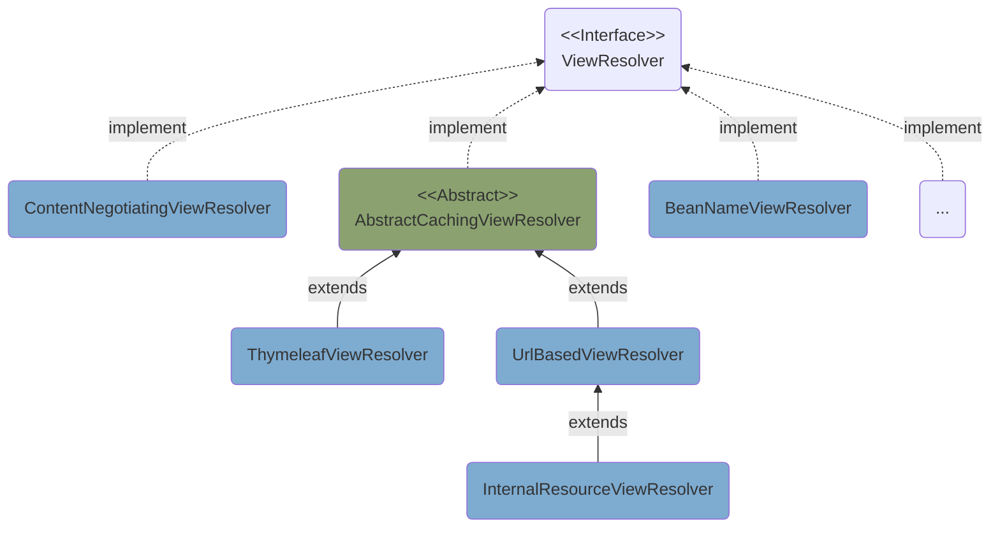

**以此控制器方法为例**：

```java
@PostMapping("/login")
public String loginHandler(...) { return "redirect:/gotoMain"; }

@GetMapping("/gotoMain")
public String mainPage() { return "main"; }
```

请求：POST 方式请求 /login

以下为视图解析流程：

1. doDispatch 最后会调用 **processDispatchResult** 处理运行的结果

   ```java
   protected void doDispatch(...) throws... {
       ...
       mappedHandler = this.getHandler(processedRequest);
       ...
       HandlerAdapter ha = this.getHandlerAdapter(mappedHandler.getHandler());
       ...
       mv = ha.handle(processedRequest, response, mappedHandler.getHandler());
       ...
       // 处理运行的结果
       this.processDispatchResult(processedRequest, response, mappedHandler, mv, ...);
       ...
   }
   ```

2. 调用到 **processDispatchResult** 方法

   ```java
   private void processDispatchResult(...) throws... {
       boolean errorView = false;
       // 判断有无异常，若有，就
       if (exception != null) {
           if (exception instanceof ModelAndViewDefiningException) {
               this.logger.debug("ModelAndViewDefiningException encountered", exception);
               mv = ((ModelAndViewDefiningException)exception).getModelAndView();
           } else {
               Object handler = mappedHandler != null ? mappedHandler.getHandler() : null;
               // 设置 ModelAndView
               mv = this.processHandlerException(request, response, handler, exception);
               errorView = mv != null;
           }
       }
       // 只有 ModelAndView 为空时，才会执行下面的代码
       if (mv != null && !mv.wasCleared()) {
           // 调用 render 方法来解析视图
           this.render(mv, request, response);
           if (errorView) {
               WebUtils.clearErrorRequestAttributes(request);
           }
       }
       ...
   }
   ```

3. 调用到 **render** 方法

   ```java
   protected void render(...) throws... {
       ...
       String viewName = mv.getViewName();
       ...
       // 使用视图解析器，对视图进行解析
       view = this.resolveViewName(viewName, mv.getModelInternal(), locale, request);
       ...
   }
   ```

4. 调用到 **resolveViewName** 方法，来解析视图名称

   ```java
   protected View resolveViewName(...) throws... {
       if (this.viewResolvers != null) {
           Iterator var5 = this.viewResolvers.iterator();
           // 循环 ViewResolver 来解析视图名称
           while(var5.hasNext()) {
               ViewResolver viewResolver = (ViewResolver)var5.next();
               // 解析视图，获取 View 对象
               View view = viewResolver.resolveViewName(viewName, locale);
               if (view != null) {
                   return view;
               }
           }
       }
       return null;
   }
   ```

5. 进入 ContentNegotiatingViewResolve 类的 resolveViewName 方法（会返回一个 bestView）  
   该方法调用 **getCandidateViews** 来获取候选视图集合 List\<View\>

   ```java
   private List<View> getCandidateViews(...) throws... {
       ...
       Iterator var5 = this.viewResolvers.iterator();
       // 循环 ViewResolver，使用合适的解析器来解析视图
       while(var5.hasNext()) {
           ViewResolver viewResolver = (ViewResolver)var5.next();
           // 解析视图名称，如 "redirect:/gotoMain"
           View view = viewResolver.resolveViewName(viewName, locale);
           if (view != null) {
               candidateViews.add(view);
           }
           ...
       }
       return candidateViews;
   }
   ```

6. 若使用 Thymeleaf 的视图解析器，则调用的是 AbstractCachingViewResolver 类的 resolveViewName 方法，来解析视图名称  
   该方法会调用 ThymeleafViewResolver 类中的 **createView** 方法

   ```java
   protected View createView(String viewName, Locale locale) throws... {
       ...
       String forwardUrl;
       // 重定向的视图
       if (viewName.startsWith("redirect:")) {
           ...
           RedirectView view = new RedirectView(forwardUrl, ...);
           return (View)this.getApplicationContext()
               .getAutowireCapableBeanFactory().initializeBean(view, "redirect:");
       }
       // 转发的视图
       else if (viewName.startsWith("forward:")) {
           ...
           return new InternalResourceView(forwardUrl);
       }
       // 无法处理该视图
       else if (this.alwaysProcessRedirectAndForward && !this.canHandle(viewName, locale)) {
           ...
           return null;
       }
       // 其他可以处理的视图
       else {
           ...
           return this.loadView(viewName, locale);
       }
   }
   ```

7. 最终，DispatcherServlet 会获取到解析完毕的 View 对象，然后调用 View 接口的 **render** 方法，执行视图渲染工作

   `view.render(mv.getModelInternal(), request, response);`

#### 拦截器

拦截器中有三个方法 preHanlder、postHandler、afterCompletion

getHandler 方法获取的 HandlerExecutionChain 中包含 Handler 和 Interceptor

**执行链示例**：

- mappedHandler = {HandlerExecutionChain}
  - handler = {HandlerMethod} "com.domenic.controller.LoginController\#loginPage"
  - interceptorList = {ArrayList}
    - 0 = {LoginInterceptor}
    - 1 = {ConversionServiceExposingInterceptor}
    - 2 = {ResourceUrlProviderExposingInterceptor}

DispatcherServlet 中的 **doDispatch** 方法：

```java
protected void doDispatch(...) throws... {
    ...
    try {
        ...
        // 获取 HandlerExecutionChain
        mappedHandler = this.getHandler(processedRequest);
        ...
        HandlerAdapter ha = this.getHandlerAdapter(mappedHandler.getHandler());
        // 1.执行所有拦截器的 preHandler 方法
        // 若返回值为 false，则直接结束 doDispatch 方法
        if (!mappedHandler.applyPreHandle(processedRequest, response)) {
            return;
        }
        // 执行 Handler 方法
        mv = ha.handle(processedRequest, response, mappedHandler.getHandler());
        ...
        // 2.执行所有拦截器的 postHandler 方法
        mappedHandler.applyPostHandle(processedRequest, response, mv);
        
        this.processDispatchResult(...);
    } catch (Exception var22) {
        // 3.执行所有拦截器的 AfterCompletion 方法
        this.triggerAfterCompletion(...);
    } catch (Throwable var23) {
        this.triggerAfterCompletion(...);
    }
    ...
}
```

拦截器方法调用：

- **preHandler**

  ```java
  boolean applyPreHandle(...) throws... {
      for(int i = 0; i < this.interceptorList.size(); this.interceptorIndex = i++) {
          HandlerInterceptor interceptor = (HandlerInterceptor)this.interceptorList.get(i);
          if (!interceptor.preHandle(request, response, this.handler)) {
              this.triggerAfterCompletion(request, response, (Exception)null);
              return false;
          }
      }
      return true;
  }
  ```

- **postHandler**

  ```java
  void applyPostHandle(...) throws... {
      for(int i = this.interceptorList.size() - 1; i >= 0; --i) {
          HandlerInterceptor interceptor = (HandlerInterceptor)this.interceptorList.get(i);
          interceptor.postHandle(request, response, this.handler, mv);
      }
  }
  ```

- **afterCompletion**

  ```java
  void triggerAfterCompletion(...) {
      for(int i = this.interceptorIndex; i >= 0; --i) {
          HandlerInterceptor interceptor = (HandlerInterceptor)this.interceptorList.get(i);
          try {
              interceptor.afterCompletion(request, response, this.handler, ex);
          } catch (Throwable var7) {
              logger.error("HandlerInterceptor.afterCompletion threw exception", var7);
          }
      }
  }
  ```

---

# SSM 整合

SSM = Spring + SpringMVC + MyBatis

SSM 整合思路：以 Spring 框架为基干，整合 SpringMVC 和 Mybatis

## 整合 Mybatis

不使用 Spring 时，是通过 SqlSessionFactory 获取 SqlSession 对象，再通过 getMapper 方法获取到对应的代理对象 mapper，最后通过调用 mapper 接口中的方法实现对数据库的操作

与 Spring 整合，就是将 Mybatis 接口代理对象的创建权交给 Spring 容器管理，然后把 dao 的代理对象注入到 service 中

**步骤**：

1. 导入整合 Mybatis 的依赖
2. 配置 Spring（applicationContext.xml）：
   1. 创建 DataSource 对象，注入属性
   2. 创建 SqlSessionFactory 对象，注入 DataSource...
   3. 创建 MapperScannerConfigurer，实现 Mapper 映射扫描
3. 可以在 Service 层中注入 Mapper 映射对象了

**实现**：

Spring 整合 Mybatis 需要的依赖：

**注意**：若日期类型使用 JDK 8 开始的 LocalDateTime，则需注意 Druid 的版本，如：1.2.8 已经支持。因为，需要 JDBC driver 支持 JDBC 4.2 API

```xml
<!-- Spring 整合 Mybatis 所需的依赖 -->
<dependency>
    <groupId>org.mybatis</groupId>
    <artifactId>mybatis-spring</artifactId>
    <version>1.3.2</version>
</dependency>

<!-- 数据库连接池 -->
<dependency>
    <groupId>com.alibaba</groupId>
    <artifactId>druid</artifactId>
    <version>1.2.8</version>
</dependency>
```

**注意**：序列化 JSON 使用 Jackson 时，若要序列化 LocalDateTime，则还需导入 com.fasterxml.jackson.datatype 下的 jackson-datatype-jsr310

<details>
    <summary>展开 Jackson 相关依赖</summary>
    <pre><code>
&lt;!-- Jackson 序列化 --&gt;
&lt;dependency&gt;
    &lt;groupId&gt;com.fasterxml.jackson.core&lt;/groupId&gt;
    &lt;artifactId&gt;jackson-databind&lt;/artifactId&gt;
    &lt;version&gt;2.13.3&lt;/version&gt;
&lt;/dependency&gt;
&lt;dependency&gt;
    &lt;groupId&gt;com.fasterxml.jackson.core&lt;/groupId&gt;
    &lt;artifactId&gt;jackson-core&lt;/artifactId&gt;
    &lt;version&gt;2.13.3&lt;/version&gt;
&lt;/dependency&gt;
&lt;dependency&gt;
    &lt;groupId&gt;com.fasterxml.jackson.core&lt;/groupId&gt;
    &lt;artifactId&gt;jackson-annotations&lt;/artifactId&gt;
    &lt;version&gt;2.13.3&lt;/version&gt;
&lt;/dependency&gt;&#10;
&lt;!-- 添加了该依赖，才能序列化 JDK8 开始的 LocalDateTime --&gt;
&lt;dependency&gt;
    &lt;groupId&gt;com.fasterxml.jackson.datatype&lt;/groupId&gt;
    &lt;artifactId&gt;jackson-datatype-jsr310&lt;/artifactId&gt;
    &lt;version&gt;2.13.3&lt;/version&gt;
&lt;/dependency&gt;
    </code></pre>
</details>

**Spring 核心配置文件**：

可以将 Mybatis 的配置写在 applicationContext.xml 中；也可以写在 Mybatis 的核心配置文件中再引入

<details>
    <summary>展开 jdbc.properties</summary>
    <pre><code>
jdbc.driver=com.mysql.jdbc.Driver
jdbc.url=jdbc:mysql://localhost:3306/databaseName?useSSL=false&#38;useServerPrepStmts=true&amp;characterEncoding=UTF-8
jdbc.username=root
jdbc.password=root
    </code></pre>
</details>

```xml
<beans ...>
    
    ...
    
    <!-- 引入指定配置文件 -->
    <context:property-placeholder location="classpath:jdbc.properties"/>

    <!-- 创建数据源对象 -->
    <bean id="dataSource" class="com.alibaba.druid.pool.DruidDataSource">
        <property name="driverClassName" value="${jdbc.driver}"/>
        <property name="url" value="${jdbc.url}"/>
        <property name="username" value="${jdbc.username}"/>
        <property name="password" value="${jdbc.password}"/>
    </bean>

    <!--
        SqlSessionFactoryBean 为 mybatis-spring 依赖提供的
        将 SqlSessionFactory 的创建交给 Spring 的 IOC 容器
    -->
    <bean id="sqlSessionFactory" class="org.mybatis.spring.SqlSessionFactoryBean">
        <!-- 引入 Mybatis 的核心配置文件（若需要）-->
        <property name="configLocation" value="classpath:mybatis-config.xml"/>
        
        <property name="dataSource" ref="dataSource"/>
        <!-- 给实体类取别名，代替 <typeAliases>；alias 在使用时，不区分大小写 -->
        <property name="typeAliasesPackage" value="com.domenic.pojo"/>
    </bean>

    <!-- Mapper 映射扫描。对接口进行扫描，生成接口的代理对象并存入 IOC 容器中 -->
    <bean class="org.mybatis.spring.mapper.MapperScannerConfigurer">
        <!-- 扫描该包下的所有接口 -->
        <property name="basePackage" value="com.domenic.mapper"/>
    </bean>
</beans>
```

mybatis-config.xml

```xml
<configuration>
    <settings>
        <!-- 将下划线映射为驼峰 -->
        <setting name="mapUnderscoreToCamelCase" value="true"/>
    </settings>

    <plugins>

        <!--配置分页插件-->

        <!-- PageHelper 3.7.6 时的写法 -->
        <plugin interceptor="com.github.pagehelper.PageHelper">
            <!-- 指定 SQL 方言 -->
            <property name="dialect" value="mysql"/>
        </plugin>

        <!-- PageHelper 5.2.0 时的写法 -->
        <plugin interceptor="com.github.pagehelper.PageInterceptor"/>

    </plugins>
</configuration>
```

自动装配 Mapper 代理对象：

```java
@Service
public class UserServiceImpl implements UserService {
    @Autowired
    UserMapper userMapper;
    ...
}
```

## 整合 SpringMVC

Spring 和 SpringMVC 本就是同源的，整合与否都行

- **不整合**：只创建一个 IOC 容器，Spring 和 SpringMVC 的组件都一起加载

- **整合**：各自管理自己的组件，Spring 和 SpringMVC 都会创建自己的 IOC 容器

  > Spring 的 IOC 容器为**父容器**，SpringMVC 的 IOC 容器为**子容器**。子容器可以访问父容器中的 bean，但父容器不能访问子容器的 bean

只需整合 Spring 和 Web 容器：使 Web 容器启动时自动加载 Spring 配置文件；Web 容器销毁时 Spring 的 IOC 容器也销毁

**步骤**：

1. 关闭 Spring 对 controller 的扫描，交由 SpringMVC 处理
2. 配置 SpringMVC：
   1. 开启包扫描（spring-mvc.xml）
   2. 配置 DispatcherServlet 前端控制器（web.xml）
   3. 配置 CharacterEncodingFilter 字符编码过滤器（web.xml）
   4. 配置 InternalResourceViewResolver 视图解析器（spring-mvc.xml）
   5. 放行前端控制器拦截的静态资源（spring-mvc.xml）
   6. 开启 SpringMVC 注解的支持（spring-mvc.xml）
3. 配置 **ContextLoaderListener** 监听器（web.xml）
4. 可以在 Controller 中注入 Service 对象了

> **为什么要配置 ContextLoaderListener 监听器**：
>
> SpringMVC 的 IOC 容器维护了 Controller 对象；Spring 的 IOC 容器维护了 Service 对象
>
> 因为 Controller 对象依赖了 Service 对象，所以在 SpringMVC 的 IOC 容器初始化之前，Spring 的 IOC 容器需要完成初始化，这样 Controller 才能实现自动装配 Service 对象
>
> 使用该监听器，在服务器初始化时就初始化 Spring 的 IOC 容器。监听器的初始化比 DispatcherServlet 的初始化早。因此，在 DispatcherServlet 初始化时，就能完成 Controller 中 Service 的自动装配

**实现**：

用 springframework.web 包下的 ContextLoaderListener 监听器，监听 servletContext 容器的创建和销毁，从而同时创建或销毁 IOC 容器

ContextLoaderListener 实现了 ServletContextListener 接口，生命周期与 Tomcat 一致

web.xml

```xml
<web-app ...>
    ...
    
    <!--
        配置 Spring 的监听器，在服务器启动时加载 Spring 的配置文件
    -->
    <listener>
        <listener-class>org.springframework.web.context.ContextLoaderListener</listener-class>
    </listener>
    
    <!--
        全局参数，自定义 Spring 配置文件的位置和名称，以便使用 Spring IOC 容器中的 bean
        - Spring 配置文件的默认位置和名称：/WEB-INF/applicationContext.xml
        - 也可通过上下文参数自定义 Spring 配置文件的位置和名称
    -->
    <context-param>
        <param-name>contextConfigLocation</param-name>
        <!-- classpath 表示类路径，如 resource 目录下 -->
        <param-value>classpath:applicationContext.xml</param-value>
    </context-param>
</web-app>
```

spring-mvc.xml

```xml
<beans ...>
    <!--
        扫描 Controller 组件
        SpringMVC 维护了 Controller 后，Spring 的包扫描需要排除 Controller
    -->
    <context:component-scan base-package="com.domenic.controller"/>
    <!-- 提供 Controller 请求转发，JSON 自动转换等功能 -->
    <mvc:annotation-driven/>

    <!-- 配置视图解析器，指定前后缀 -->
    <bean id="resourceViewResolver" 
          class="org.springframework.web.servlet.view.InternalResourceViewResolver">
        <property name="prefix" value="/"/>
        <property name="suffix" value=".jsp"/>
    </bean>

    <!-- 放行静态资源 -->
    <mvc:default-servlet-handler/>
    <!--<mvc:resources mapping="/js/**" location="/js/"/>-->
    <!--<mvc:resources mapping="/css/**" location="/css/"/>-->
    <!--<mvc:resources mapping="/img/**" location="/img/"/>-->
</beans>
```

applicationContext.xml

Spring 的 IOC 容器排除 Controller 组件

```xml
<context:component-scan base-package="com.domenic">
    <!-- 根据注解排除 -->
    <context:exclude-filter type="annotation" expression="org.springframework.stereotype.Controller"/>
</context:component-scan>
```

## thymeleaf

SpringMVC 中，进行视图跳转（重定向、转发）需要借助于 JSP 来实现。但 SpringBoot 默认不支持 JSP，**需要引入第三方模板引擎技术**实现页面渲染

第三方的模板引擎有：thymeleaf、freemaker、groovy

> [官网](https://www.thymeleaf.org/)介绍：
>
> Thymeleaf is a modern server-side Java template engine for both web and standalone environments.
>
> Thymeleaf's main goal is to bring elegant natural templates to your development workflow — HTML that can be correctly displayed in browsers and also work as static prototypes, allowing for stronger collaboration in development teams.
>
> With modules for Spring Framework, a host of integrations with your favourite tools, and the ability to plug in your own functionality, Thymeleaf is ideal for modern-day HTML5 JVM web development — although there is much more it can do.

### 引入

#### SSM

依赖导入

```xml
<!-- Spring5 和 Thymeleaf 整合包 -->
<dependency>
    <groupId>org.thymeleaf</groupId>
    <artifactId>thymeleaf-spring5</artifactId>
    <version>3.0.15.RELEASE</version>
</dependency>

<!-- 日志，thymeleaf 依赖了 slf4j，因此需导入 slf4j 的一个实现 logback -->
<dependency>
    <groupId>ch.qos.logback</groupId>
    <artifactId>logback-classic</artifactId>
    <version>1.2.3</version>
</dependency>
```

spring-mvc.xml

使用 Thymeleaf 提供的视图解析器，它会替代 SpringMVC 自带的，由 Thymeleaf 的对视图进行渲染

```xml
<!-- 配置 Thymeleaf 视图解析器 -->
<bean id="viewResolver"
      class="org.thymeleaf.spring5.view.ThymeleafViewResolver">
    <!-- 优先级 -->
    <property name="order" value="1"/>
    <property name="characterEncoding" value="UTF-8"/>
    <!-- 模板引擎 -->
    <property name="templateEngine">
        <bean class="org.thymeleaf.spring5.SpringTemplateEngine">
            <!-- 模板解析器 -->
            <property name="templateResolver">
                <bean
                      class="org.thymeleaf.spring5.templateresolver.SpringResourceTemplateResolver">
                    <!-- 视图前缀 -->
                    <property name="prefix" value="/WEB-INF/pages/"/>
                    <!-- 视图后缀 -->
                    <property name="suffix" value=".html"/>
                    <property name="templateMode" value="HTML5"/>
                    <property name="characterEncoding" value="UTF-8" />
                </bean>
            </property>
        </bean>
    </property>
</bean>
```

#### SpringBoot

引入启动类

```xml
<dependency>
    <groupId>org.springframework.boot</groupId>
    <artifactId>spring-boot-starter-thymeleaf</artifactId>
</dependency>
```

SpringBoot 会对 Thymeleaf 进行自动配置

自动配置类：

```java
@AutoConfiguration(
    after = {WebMvcAutoConfiguration.class, WebFluxAutoConfiguration.class}
)
// 开启 Thymeleaf 相关配置属性的绑定
@EnableConfigurationProperties({ThymeleafProperties.class})
@ConditionalOnClass({TemplateMode.class, SpringTemplateEngine.class})
@Import({ReactiveTemplateEngineConfiguration.class, DefaultTemplateEngineConfiguration.class})
public class ThymeleafAutoConfiguration { ... }
```

配置属性类：

```java
@ConfigurationProperties(prefix = "spring.thymeleaf")
public class ThymeleafProperties {
    private static final Charset DEFAULT_ENCODING;
    // 默认访问 /templates 目录下的资源
    public static final String DEFAULT_PREFIX = "classpath:/templates/";
    public static final String DEFAULT_SUFFIX = ".html";
    ...
}
```

### 语法

HTML 页面中使用 Thymeleaf，需要在 &lt;html&gt; 标签中引入命名空间：`<html ... xmlns:th="http://www.thymeleaf.org">`

<table style="width:40rem">
    <thead>
        <tr style="text-align:left">
            <th width=20%>名称</th>
            <th width=16%>写法</th>
            <th width=64%>用途</th>
        </tr>
    </thead>
    <tbody>
        <tr>
            <td>变量取值</td>
            <td>${...}</td>
            <td>获取 request 域、session 域、对象...中的值</td>
        </tr>
        <tr>
            <td>选择变量</td>
            <td>*{...}</td>
            <td>获取上下文对象值</td>
        </tr>
        <tr>
            <td>消息</td>
            <td>#{...}</td>
            <td>获取国际化等值</td>
        </tr>
        <tr>
            <td>链接</td>
            <td>@{...}</td>
            <td>设置链接</td>
        </tr>
        <tr>
            <td>片段表达式</td>
            <td>~{...}</td>
            <td>引入公共页面片段</td>
        </tr>
    </tbody>
</table>


- **字面量**
  
  文本值：'one text' , 'Another one!'  
  数字：0 , 34 , 3.0 , 12.3  
  布尔值：true , false  
  空值：null  
  变量：one , two , ... 变量不能有空格
  
- **文本操作**
  
  字符串拼接：\+  
  变量替换：\|The name is \${name}\|
  
- **数学运算**
  
  运算符：\+ , \- , \* , / , %
  
- **布尔运算**
  
  运算符：and , or  
  一元运算：! , not
  
- **比较运算**
  
  比较：\> , \< , \>= , \<= ( gt , lt , ge , le )  
  等式：== , != ( eq , ne )
  
- **条件运算**
  
  If-then：(if) ? (then)  
  If-then-else：(if) ? (then) : (else)  
  Default：(value) ?: (defaultvalue)

### 使用

#### 设置链接

th:href

```html
<!-- Thymeleaf 会自动给链接添加上下文路径 -->

<!-- 结果：http://localhost:8080/springmvc_demo/hello -->
<a th:href="@{/hello}">测试 1</a>
<!-- 此写法错误，结果：http://localhost:8080/hello -->
<a href="/hello">测试 2</a>

<!-- 链接携带参数 -->

<!-- 方式 1，直接 ? 后接参数 key-value -->
<a th:href="@{/hello?name=domenic}">测试 3</a>
<a th:href="@{/hello?name=domenic&age=18}">测试 4</a>
<!-- 方式 2，() 包裹参数 key-value，value 需用 '' 包裹 -->
<a th:href="@{/hello(name='domenic')}">测试 5</a>
<a th:href="@{/hello(name='domenic',age='18')}">测试 6</a>
```

#### 获取参数

th:text 通过 \${} 表达式来显示数据

```html
<!-- 获取 request 域中：属性名为 name 的属性值 -->
<p th:text="${name}"></p>

<!-- 获取 session 域中：属性名为 name 的属性值 -->
<p th:text="${session.name}"></p>

<!-- 获取 application 域中：属性名为 name 的属性值 -->
<p th:text="${application.name}"></p>
```

#### 循环

th:each 来实现循环

th:text 通过 \${} 表达式来显示数据

```html
<!-- 循环 request 域中的数据 employeeList，渲染成表格 -->
<table>
    <tr th:each="el: ${employeeList}">
        <td th:text="${el.id}"></td>
        <td th:text="${el.lastName}"></td>
        <td th:text="${el.email}"></td>
        <!-- 三目表达式，决定显示的值 -->
        <td th:text="${el.gender} == 0 ? 'female' : 'male'"></td>
        <td>
            <!-- 字符串和表达式用 + 拼接 -->
            <a th:href="@{'/employee/' + ${el.id}}">update</a>
        </td>
    </tr>
</table>
```

#### 回显

th:value 来设置 \<input\> 的值，实现回显

th:field 用在选框中时，会和 value 进行比较，若值相同则选择

th:checked 来控制选框是否被选中

```html
<table>
    <tr>
        <td>name</td>
        <td><input type="text" name="Name" th:value="${employee.name}"></td>
    </tr>
    <tr>
        <td>gender</td>
        <td>
            <!-- radio 单选框，若 th:field 和 value 的值相同则选择 -->
            <input type="radio" name="gender" value="1" th:field="${employee.gender}">male
            <input type="radio" name="gender" value="0" th:field="${employee.gender}">female
        </td>
    </tr>
</table>

<!-- 循环渲染 checkbox 复选框，若 employee 的 email 不为 null，则复选框就被选中 -->
<label th:each="el: ${employeeList}">
    <input type="checkbox" name="xx" id="xx"
           th:text="${el.name}"
           th:value="${el.email}"
           th:checked="${el.email == null ? false : true}"/>
</label>
```

## 声明式事务

需要导入 spring-jdbc 依赖

```xml
<dependency>
    <groupId>org.springframework</groupId>
    <artifactId>spring-jdbc</artifactId>
    <version>5.3.23</version>
</dependency>
```

在 Spring 核心配置文件中添加：

```xml
<!-- 创建事务管理器 -->
<bean id="transactionManager"
      class="org.springframework.jdbc.datasource.DataSourceTransactionManager"
      c:dataSource-ref="dataSource"/>

<!--
    事务的注解驱动
    将 @Transactional 注解标识的地方作为切入点，进行事务管理
-->
<tx:annotation-driven transaction-manager="transactionManager"/>
```

事务的使用方法，前往：Spring -> Spring JDBC -> 事务

## SSM 示例项目

项目源码 - Github: https://github.com/domeniczz/ssm-edu-manager

### 项目结构

各个模块都继承了父工程，模块间又逐级依赖

**工程间的继承**：

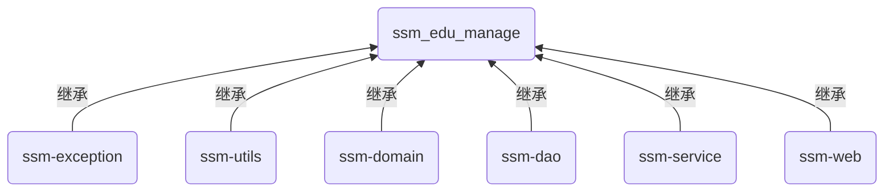

**工程间的依赖**：

ssm-web 间接依赖了所有工程

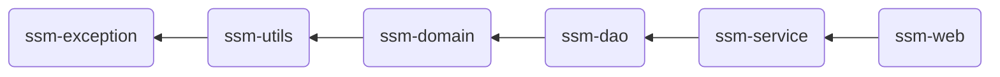

**项目目录结构**：

```ASCII
ssm_edu_manage          <-- 父工程（一般父工程的 src 下不写代码）
├── pom.xml
├── src
|   └── ...
├── ssm-dao             <-- dao 层 子工程
|   ├── pom.xml
|   └── src
|       ├── main
|       |   ├── java
|       |   |   └── com
|       |   |       └── domenic
|       |   |           └── mapper
|       |   |               └── TestMapper.java
|       |   └── resources
|       |       ├── applicationContext-dao.xml
|       |       ├── jdbc.properties
|       |       ├── mybatis-config.xml
|       |       └── com
|       |           └── domenic
|       |               └── mapper
|       |                   └── TestMapper.xml
|       └── test
|           └── ...
├── ssm-domain          <-- 实体类 子工程
|   ├── pom.xml
|   └── src
|       ├── main
|       |   ├── java
|       |   |   └── com
|       |   |       └── domenic
|       |   |           └── domain
|       |   |               └── Test.java
|       |   └── resources
|       └── test
|           └── ...
├── ssm-exception       <-- 自定义异常类 子工程
|   └── ...
├── ssm-log             <-- 日志 子工程
|   └── ...
├── ssm-service         <-- service 层 子工程
|   ├── pom.xml
|   └── src
|       ├── main
|       |   ├── java
|       |   |   └── com
|       |   |       └── domenic
|       |   |           └── service
|       |   |               ├── TestService.java
|       |   |               └── TestServiceImpl.java
|       |   └── resources
|       |       └── applicationContext-service.xml
|       └── test
|           └── ...
├── ssm-utils           <-- 工具类 子工程
|   └── ...
└── ssm-web             <-- web 层 子工程
    ├── pom.xml
    └── src
        ├── main
        |   ├── java
        |   |   └── com
        |   |       └── domenic
        |   |           └── controller
        |   |               └── TestController.java
        |   ├── resources
        |   |   ├── applicationContext.xml
        |   |   └── spring-mvc.xml
        |   └── webapp
        |       └── WEB-INF
        |           └── web.xml
        └── test
            └── ...
```

### 需求分析

项目：线上教育平台，后台管理系统（Build With SSM）

#### 课程模块

**数据表的结构**：

一个课程分为多个章节，一个章节分为多个课时


**需实现的功能**：

- **课程**
  1. 多条件查询课程
  2. 课程图片上传
  3. 新建和修改课程
  4. 课程内容展示
  5. 课程状态管理
- **章节**
  1. 章节和课时的信息展示
  2. 新建和修改章节
  3. 章节状态管理
- **课时**
  1. 新建和修改课时

#### 广告模块

**数据表的结构**：

```mermaid
flowchart LR
    A(广告位 ad Space) --"1 to N"--> B(广告 ad)
```

**需实现的功能**：

- **广告位**
  1. 广告位列表查询
  2. 添加和修改广告位
- **广告**
  1. 所有广告分页显示
  2. 广告图片上传
  3. 广告上下线状态管理

#### 用户模块

需实现的功能：

- 用户列表查询，可选查询条件：用户名；手机号；注册的起始、结束时间
- 用户状态管理

#### 权限模块

**权限管理简介**：

1. **ACL**（Access Control Lists，ACL）

   ACL 是面向资源的访问控制模型，它的机制是围绕 “资源” 展开的

   原理：  
   每一项资源，都配有一个列表，列表记录了用户对该资源的权限  
   当访问一项资源时，会先检查列表中是否有关于当前用户的访问权限

2. **RBAC**（Role-Based Access Control）

   RBAC 是基于角色的访问控制

   原理：  
   把用户按角色进行分类，通过角色来判断对资源的权限

RBAC 应用更为广泛，原因：

- 它相对于 ACL 的优势就是简化了用户与权限的管理，用户与权限变成了间接关联
- RBAC 模型使得访问控制，特别是对用户的授权管理，变得简单且易于维护

**数据表的结构**： 

```mermaid
flowchart LR
    U(用户表) --"1 to N"--> M1(用户角色中间表)
    M1 --"N to 1"--> R(角色表)
    R --"1 to N"--> M2(角色菜单中间表)
    M2 --"N to 1"--> Menu(菜单表)
    R --"1 to N"--> M3(角色资源中间表)
    M3 --"N to 1"--> Re(资源表)
    Re --"N to 1"--> ReS(资源分类表)
```

权限模块可细分为：角色模块、菜单模块、资源模块

需实现的功能：

- **角色模块**
  1. 角色列表查询，和根据角色名称查询
  2. 角色增删改
  3. 查询指定角色被授权的菜单
  4. 为指定角色分配授权菜单
- **菜单模块**
  1. 查询所有菜单
  2. 新增或修改菜单
- **资源模块**
  1. 所有资源分页显示
  2. 条件查询
  3. 资源增删改
- **用户模块**
  1. 登录

# Spring Boot

## 入门

### 概述

官网：https://spring.io/projects/spring-boot

Reference doc：https://docs.spring.io/spring-boot/docs/current/reference/html/index.html

Getting start：https://docs.spring.io/spring-boot/docs/current/reference/html/getting-started.html

**特性**

- Create stand-alone Spring applications
- Embed Tomcat, Jetty or Undertow directly (no need to deploy WAR files)
- Provide opinionated 'starter' dependencies to simplify your build configuration
- Automatically configure Spring and 3rd party libraries whenever possible
- Provide production-ready features such as metrics, health checks, and externalized configuration
- Absolutely no code generation and no requirement for XML configuration

**微服务**

In short：

- The microservice architectural style is an approach to developing a single application as a **suite of small services**, each **running in its own process**.
- Services communicate with lightweight mechanisms, often an **HTTP** resource API.
- These services are **built around business capabilities** and **independently deployable** by fully automated deployment machinery.
- There is a **bare minimum of centralized management** of these services, which may be written in different programming languages and use different data storage technologies.

**分布式**

Once we split a huge application into small microservices, there will inevitably be distributed

分布式会产生各种问题：

- 远程调用
- 服务发现
- 负载均衡
- 服务容错
- 配置管理
- 服务监控
- 链路追踪
- 日志管理
- 任务调度

**要求**

**System Requirements**

**Spring Boot 2.7.4** requires Java 8 ~ Java 19 and Spring Framework 5.3.23 or above

Explicit build support is provided for the following build tools：

<table style="width:22rem">
    <thead>
        <tr style="text-align:left">
            <th width=45%>Build Tool</th>
            <th width=55%>Version</th>
        </tr>
    </thead>
    <tbody>
        <tr>
            <td>Maven</td>
            <td>3.5+</td>
        </tr>
        <tr>
            <td>Gradle</td>
            <td>6.8.x, 6.9.x, 7.x</td>
        </tr>
    </tbody>
</table>

**Servlet Containers**

Spring Boot supports the following embedded servlet containers：

<table style="width:22rem">
    <thead>
        <tr style="text-align:left">
            <th width=45%>Name</th>
            <th width=55%>Servlet Version</th>
        </tr>
    </thead>
    <tbody>
        <tr>
            <td>Tomcat 9.0</td>
            <td>4.0</td>
        </tr>
        <tr>
            <td>Jetty 9.4</td>
            <td>3.1</td>
        </tr>
        <tr>
            <td>Jetty 10.0</td>
            <td>4.0</td>
        </tr>
        <tr>
            <td>Undertow 2.0</td>
            <td>4.0</td>
        </tr>
    </tbody>
</table>

You can also deploy Spring Boot applications to any servlet 3.1+ compatible container.

### 使用示例

- **pom.xml 中添加 starter**：

  - [SpringBoot 官方支持的 starter - spring.io](https://docs.spring.io/spring-boot/docs/current/reference/html/using.html#using.build-systems.starters) spring-boot-starter-xxx
  - 第三方启动器 xxx-spring-boot-starter，如：mybatis-spring-boot-starter

  ```xml
  <parent>
      <groupId>org.springframework.boot</groupId>
      <artifactId>spring-boot-starter-parent</artifactId>
      <version>2.7.4</version>
  </parent>
  
  <dependencies>
      <!-- 添加 starter 来设置项目需要的场景 -->
      <dependency>
          <groupId>org.springframework.boot</groupId>
          <artifactId>spring-boot-starter-web</artifactId>
      </dependency>
  </dependencies>
  ```

  **自定义依赖版本**：

  SpringBoot 会默认设置依赖的版本号，若不同则要自定义

  ```xml
  <properties>
      <!-- 自定义版本 -->
      <mysql.version>5.1.46</mysql.version>
  </properties>
  
  <dependencies>
      <dependency>
          <groupId>mysql</groupId>
          <artifactId>mysql-connector-java</artifactId>
          <scope>runtime</scope>
      </dependency>
  </dependencies>
  ```

- **启动类**：

  @SpringBootApplication 注解等效于 @Configuration、@EnableAutoConfiguration、@ComponentScan 的默认属性

  ```java
  @SpringBootApplication  // 标识为启动类
  public class MyApp {
      public static void main(String[] args) {
          ConfigurableApplicationContext context = SpringApplication.run(MyApp.class, args);
          Object person = context.getBean("person");  // 获取 IOC 中的 bean
      }
  }
  ```

  > 注意: 启动类存放路径要在其他类的父级目录中，因为默认扫描启动类所在包及其下的所有子包中的组件
  >
  > 也可以自定义包扫描路径: 
  >
  > ```java
  > @SpringBootApplication(scanBasePackages = "com.domenic")
  > ```

- **实体类**：

  注意：若属性的数据类型为 LocalDateTime，则需要自定义类型转换格式

  ```java
  @Component  // 声明为组件
  @Data  // Lombok
  @ConfigurationProperties(prefix = "person")  // 根据前缀引入配置信息
  public class Person {
  
      private String userName;
  
      private Boolean boss;
  
      /* 方式一：注解中指定转换格式 */
      @DateTimeFormat(pattern="yyyy-MM-dd HH:mm:ss")
      private LocalDateTime birth;
  
      private Integer age;
  
      private Pet pet;
  
      private String[] interests;
  
      private List<String> animal;
  
      private Map<String, Object> score;
  
      private Set<Double> salary;
  
      private Map<String, List<Pet>> allPets;
  
      /* 方式二：setter 中指定转换格式 */
      public void setBirth(String birth) {
          this.birth= LocalDateTime.parse(birth, DateTimeFormatter.ofPattern("yyyy-MM-dd HH:mm:ss"));
      }
  }
  ```

- **配置**：

  [常用的配置 - spring.io](https://docs.spring.io/spring-boot/docs/current/reference/html/application-properties.html)

  文件可以为 application.properties 或 application.yml

  ```yml
  server:
    port: 8080
  # 启用组件监控（component monitoring）
  debug: false  # 默认值为 false
  
  # 对实体类 person 的属性配置
  person:
    userName: Domenic
    boss: false
    # 若日期类型为 Date，则写为 2019/12/12 20:12:33 且默认识别
    # 若日期类型为 LocalDateTime，则需要在实体类中配置类型转换
    birth: 2000-02-17 15:02:31
    age: 18
    interests: [ 编程, 跑步 ]
    animal:
      - jerry
      - oscar
    score:
      english:
        first: 30
        second: 40
        third: 50
      math: [ 131, 140, 148 ]
      chinese: { first: 128, second: 136 }
    salary: [ 3999, 4999.98, 5999.99 ]
    allPets:
      sick:
        - { name: tom }
        - { name: jerry, weight: 47 }
      health: [ { name: oscar, weight: 40 } ]
  ```
  
  > 配置文件中设置 debug 为 true，可以开启自动配置报告，输出所有被采用、排除的自动配置类
  >
  > 获取 IOC 容器中的所有类：
  >
  > ```java
  > // 获取 IOC 容器
  > ConfigurableApplicationContext context = SpringApplication.run(MyApplication.class, args);
  > // 获取容器中类的数量
  > System.out.println(context.getBeanDefinitionCount());
  > // 获取容器中所有类的全限定名（Fully Qualified Name）
  > String[] beanDefinitionNames = context.getBeanDefinitionNames();
  > ```
  
- **热部署**：

  引入依赖和插件

  ```xml
  <!-- 引入热部署依赖 -->
  <dependency>
      <groupId>org.springframework.boot</groupId>
      <artifactId>spring-boot-devtools</artifactId>
      <optional>true</optional>
  </dependency>
  
  <!-- 引入 SpringBoot 的 maven 插件 -->
  <build>
      <plugins>
          <plugin>
              <groupId>org.springframework.boot</groupId>
              <artifactId>spring-boot-maven-plugin</artifactId>
              <configuration>
                  <fork>true</fork>
                  <addResources>true</addResources>
              </configuration>
          </plugin>
      </plugins>
  </build>
  ```
  
  IDEA 配置
  
  - Settings --\> Build,Execution,Deployment --\> Compiler  
    √ Compile independent modules in parallel
  - Ctrl + Alt + Shift + / --\> Registry  
    √ compiler.automake.allow.when.app.running, √ actionSystem.assertFocusAccessFromEdt
  
- **配置文件智能提示**：

  会为带有 @ConfigurationProperties 的类生成元数据，让 IDE 提供自动补全功能

  ```xml
  <dependency>
      <groupId>org.springframework.boot</groupId>
      <artifactId>spring-boot-configuration-processor</artifactId>
      <optional>true</optional>
  </dependency>
  ```

## Boot 注解

### @Configuration

此注解标识该类为配置类，等同于原生 Spring 项目的配置文件

在 SpringBoot 中，更常使用配置类的方式将 bean 交给 Spring 容器管理

**属性**：

- proxyBeanMethods - 定义代理 bean 的方式

  - true（**默认**）- full 模式，多次调用 @Bean 方法，返回的组件都是**单实例**的
  - false - lite 模式，多次调用 @Bean 方法，返回的组件都是**新建**的

  组件依赖必须使用 full 模式

```java
@Configuration(proxyBeanMethods = true)
public class MyConfig {
    @Bean("user")
    /*
     * @Bean 的传值为 bean 的 id；若无传值，则 id 为方法名
     * 方法的返回值，就是交予 Spring 容器管理的 bean
     */
    public User user() {
        User user = new User();
        user.setUsername("domenic");
        user.setAge(18);
        return user;
    }
}
```

可通过以下代码获取 IOC 容器中的所有 bean：

```java
ConfigurableApplicationContext context = SpringApplication.run(App.class, args);
String[] beanDefinitionNames = context.getBeanDefinitionNames();
```

### @import

```java
@Import(value = { MyConfig.class, Animal.class, MyImportSelector.class })
```

可导入类型：配置类、ImportSelector 和 ImportBeanDefinitionRegistrar 接口的实现类、普通类

- **配置类**

  被 @Configuration 注解的类

  ```java
  @Import(value = { MyConfig.class })
  ```

  bean id 为类名首字母小写，如：myConfig

  bean 类型为基于 Cglib 字节码增强的代理对象，如：com.domenic.config.MyConfig\$\$EnhancerBySpringCGLIB\$\$4108601@330c1f61

- **[ImportSelector](https://javadoc.io/static/org.springframework/spring-context/5.3.23/org/springframework/context/annotation/ImportSelector.html) 的实现类**

  ```java
  @Import(value = { MyImportSelector.class })
  ```

  ```java
  public class MyImportSelector implements ImportSelector {
      @Override
      public String[] selectImports(AnnotationMetadata annotationMetadata) {
          // 返回需要导入类的全限定名的数组
          return new String[]{ Animal.class.getName(), Person.class.getName() };
      }
  }
  ```

- **[ImportBeanDefinitionRegistrar](https://javadoc.io/static/org.springframework/spring-context/5.3.23/org/springframework/context/annotation/ImportBeanDefinitionRegistrar.html) 的实现类**

  ```java
  @Import(value = { ImportConfig.class })
  ```

  ```java
  public class ImportConfig implements ImportBeanDefinitionRegistrar {
      @Override
      public void registerBeanDefinitions(AnnotationMetadata importingClassMetadata, 
                                          BeanDefinitionRegistry registry) {
          // 判断容器中是否存在指定的 bean 定义，存在为 true
          boolean flag = registry.containsBeanDefinition(Animal.class.getName());
          // 不存在则创建 bean
          if (!flag) {
              RootBeanDefinition beanDefinition = new RootBeanDefinition(Animal.class);
              // 注册 BeanDefinition，并指定 beanName
              registry.registerBeanDefinition("animal", beanDefinition);
          }
      }
  }
  ```

- **普通类**

  ```java
  @Import(value = { Animal.class })
  ```
  
  bean id 为类的全限定名，如：com.domenic.domain.Animal

### @Conditional...

SpringBoot 对 Spring 原生的 @Conditional 注解进行了增强

使用示例：

```java
@Configuration
// 仅当 IOC 容器中存在名为 cat 的 bean 时，才会将此类中所有 @Bean 注解修饰的组件注入到 IOC 容器
@ConditionalOnBean(name = "cat") 
public class MyConfig {
    @Bean
    public User user(){ return new User(); }
    @Bean
    public Cat cat(){ return new Cat(); }
}
```

常用注解：

[SpringBoot condition Package API DOC](https://docs.spring.io/spring-boot/docs/current/api/org/springframework/boot/autoconfigure/condition/package-summary.html)

- **@ConditionalOnBean**

  仅当容器中存在指定对象时，才会实例化 Bean

- **@ConditionalOnMissingBean**

  仅当容器中不存在指定对象时，才会实例化 Bean

- **@ConditionalOnClass**

  某个 class 存在于类路径上时，才会实例化 Bean

- **@ConditionalOnMissingClass**

  某个 class 不存在于类路径上时，才会实例化 Bean

- **@ConditionalOnExpression**

  当表达式为 true 的时候，才会实例化 Bean

- **@ConditionalOnWebApplication**

  是 web 应用，才会实例化 Bean

- **@ConditionalOnNotWebApplication**

  不是 web 应用，才会实例化 Bean

- **@ConditionalOnProperty**

  指在配置里配置的属性是否为 true，才会实例化 Bean

- **@ConditionalOnResource**

  若要加载的 bean 依赖指定资源存在于 classpath 中，才会实例化 Bean

- **@ConditionalOnJndi**

  只有指定的资源通过 JNDI 加载后，才会加载 bean

- **@ConditionalOnCloudPlatform**

  只有运行在指定的云平台上才加载指定的 bean，CloudPlatform 是 org.springframework.boot.cloud 下一个 enum 类型的类

### @ImportResource

SpringBoot 默认不识别 XML 配置文件，若需要引入原生配置文件则需要该注解

```java
@ImportResource(locations = {"classpath:bean.xml"})
```

```xml
<?xml version="1.0" encoding="UTF-8"?>
<beans ...>
    <bean id="userService" class="com.domenic.service.impl.UserServiceImpl"/>
</beans>
```

### @ConfigurationProperties

原生 Spring 中可以使用 XML 或 @Value 进行属性注入；在 SpringBoot 中可以使用该注解从配置文件注入

SpringBoot 支持 properties 或 yaml 类型的配置文件

application.properties

```properties
car.name=Ferrari
car.price=5000000
```

application.yml

```yaml
car:
  name: Lamborghini
  price: 5000000
```

属性注入：

- **方式一**

  ```java
  @Component
  @ConfigurationProperties(prefix = "car")
  public class Car {
      private String name;
      private Integer price;
      ...
  }
  ```

- **方式二**

  ```java
  @ConfigurationProperties(prefix = "car")
  public class Car { ... }
  ```
  
  ```java
  @Configuration
  // 通过配置类将 bean 交予 IOC 容器
  @EnableConfigurationProperties(Car.class)
  public class MyConfig { ... }
  ```
  
  > @EnableConfigurationProperties 在 SpringBoot 应用中启用了对 @ConfigurationProperties 注解的类的支持

将 spring-boot-configuration-processor 作为可选依赖添加：

重新编译项目后，该插件会生成 target/classes/META-INF/spring-configuration-metadata.json，包含配置文件中所有属性的列表  
IDE 可以利用该依赖，在写配置时进行智能提示

```xml
<dependency>
    <groupId>org.springframework.boot</groupId>
    <artifactId>spring-boot-configuration-processor</artifactId>
    <optional>true</optional>
</dependency>
```

## 自动配置原理

基于 Spring Boot 2.7.4

### 依赖管理

- **spring-boot-starter-parent**

  这是 SpringBoot 项目的父依赖

  ```xml
  <parent>
      <groupId>org.springframework.boot</groupId>
      <artifactId>spring-boot-starter-parent</artifactId>
      <version>2.7.4</version>
  </parent>
  ```

  spring-boot-starter-parent 还有一个父依赖 spring-boot-dependencies

  spring-boot-dependencies 工程对大量的依赖进行了版本控制

  因此 spring-boot-starter-parent 的作用就是声明所有开发中常用的依赖的版本号，进行自动版本仲裁（也可以自定义依赖版本）

- **spring-boot-starter**

  - Starters are a set of convenient dependency descriptors that you can include in your application.
  - You get a one-stop shop for all the Spring and related technologies that you need without having to hunt through sample code and copy-paste loads of dependency descriptors.
  - The starters contain a lot of the dependencies that you need to get a project up and running quickly and with a consistent, supported set of managed transitive dependencies.

  ```mermaid
  flowchart LR
      A(spring-boot-starter-xxx) --依赖--> B(spring-boot-starter)
      B --依赖--> C(spring-boot-autoconfigure)
  ```

  所有启动器都依赖 spring-boot-starter，使用者也可以[自定义启动器](https://docs.spring.io/spring-boot/docs/current/reference/html/features.html#features.developing-auto-configuration.custom-starter)  
  spring-boot-starter 会根据场景，按需进行自动配置

  **示例**：

  ```xml
  <!-- web 启动器，导入这个场景需要的一系列依赖 -->
  <dependency>
      <groupId>org.springframework.boot</groupId>
      <artifactId>spring-boot-starter-web</artifactId>
  </dependency>
  ```

### 自动配置

- **@SpringBootApplication**

  使用在启动类上

  ```java
  @Target({ElementType.TYPE})
  @Retention(RetentionPolicy.RUNTIME)
  @Documented
  @Inherited                // 子类会继承父类的注解
  @SpringBootConfiguration  // 标注当前类为配置类（封装了 @Configuration）
  @EnableAutoConfiguration  // 开启自动配置
  @ComponentScan(           // 开启包扫描
      excludeFilters = {@Filter(
      typ